# Programming Mastery for AI

Dekh bhai, Gen AI ka jo ecosystem hai — LangChain, vector DBs, agentic frameworks, fine-tuning pipelines — ye sab Python pe khada hai, but tu jo Python college me likhta tha (`for i in range(n)`, `print()`, ek-do `def`) wo yahan chalega nahi. Production Gen AI me tujhe type-safe code, async I/O, validated schemas, profiled bottlenecks, containerized deploys — sab ek saath chahiye. Python tu basic level pe to use kar leta hai, but Gen AI me production code likhne ke liye type hints, async, Pydantic, profiling — sab cheez chahiye.

Is guide me hum 3 broad areas cover karenge: (1) **Advanced Python** — wo features jo LLM stacks me daily use hote hain, (2) **Software Engineering Tools** — git, Docker, testing, linting jo tujhe team me kaam karne layak banate hain, aur (3) **DSA — Just Enough** — itna DSA jo tokenizer aur vector search samajhne ke liye chahiye, na zyada na kam. Goal ye hai ki tu 6 mahine baad jab kisi GenAI startup me join kare, to senior tujhe "junior" na bole — "production ready intern" bole.

Har subtopic me hum chalenge: **Definition → Why it matters in GenAI → How (code) → Real-life example → Mermaid diagram → Interview Q&A**. Padh, run kar, repeat kar. Chal shuru karte hain.

---

## 1. Advanced Python

Python lagta to easy hai, but jab tu OpenAI client async chala raha ho, 100 documents parallel embed kar raha ho, Pydantic se LLM output validate kar raha ho — tab pata chalta hai ki tu kitna jaanta hai. Ye section tujhe wo Python sikhata hai jo `pip install` ke baad start hota hai.

### 1.1 Type hints (typing, Generic, Protocol, TypedDict)

**Definition:** Type hints Python me static types lagane ka tareeka hai. Runtime pe enforce nahi hote (CPython ignore karta hai), but `mypy`/`pyright` tools se check hote hain aur IDE ko autocomplete dete hain. `typing` module se `List`, `Dict`, `Optional`, `Union` aate hain (Python 3.10+ me built-in `list`, `dict`, `|` use karo).

**Why GenAI me?** LLM responses unpredictable hote hain — `dict` aaya ya `list`, `str` aaya ya `None`. Type hints + Pydantic combo se tu compile-time pe pakad leta hai ki kahan kya expect hai. LangChain, LlamaIndex, OpenAI SDK — sab heavily typed hain. Bina type hints ke tu library ka API samajh hi nahi paayega.

**How:**

```python
from typing import Generic, Protocol, TypedDict, TypeVar

# Generic — koi bhi type accept kare
T = TypeVar("T")

class VectorStore(Generic[T]):
    """Generic vector store, T = embedding type (numpy array, list[float], etc)"""
    def __init__(self) -> None:
        self._data: list[T] = []
    
    def add(self, item: T) -> None:
        self._data.append(item)

# Protocol — structural typing (duck typing with safety)
class Embedder(Protocol):
    """Koi bhi class jisme embed method hai, wo Embedder hai"""
    def embed(self, text: str) -> list[float]: ...

def index_docs(emb: Embedder, docs: list[str]) -> list[list[float]]:
    # emb koi bhi class ho — OpenAI, HuggingFace, custom — bas embed() hona chahiye
    return [emb.embed(d) for d in docs]

# TypedDict — dict jiska schema fix hai
class ChatMessage(TypedDict):
    role: str  # "user" | "assistant" | "system"
    content: str

messages: list[ChatMessage] = [
    {"role": "user", "content": "Hello"},
    {"role": "assistant", "content": "Hi there"}
]
```

**Real-life example:** OpenAI Python SDK ka `chat.completions.create()` — sab params typed hain. Agar tu galat type bhejega, mypy turant red karega. LangChain ka `Runnable[Input, Output]` Generic hai — input-output types track karta hai puri chain me.

**Diagram:**

```mermaid
graph LR
    A[Raw Python dict] -->|TypedDict| B[Schema-aware dict]
    B -->|Generic[T]| C[Type-parameterized class]
    C -->|Protocol| D[Structural duck typing]
    D --> E[mypy/pyright check]
    E --> F[Catch bugs before runtime]
```

**Interview Q&A:**

*Q: Protocol aur ABC me kya difference hai?* ABC (Abstract Base Class) **nominal** typing hai — tujhe explicitly `class MyEmbedder(BaseEmbedder)` likhna padta hai. Protocol **structural** typing hai — agar class me `embed()` method hai (matching signature), to wo automatically Embedder hai, koi inheritance nahi chahiye. Gen AI me Protocol zyada flexible hai kyunki tu third-party libs (jo tu modify nahi kar sakta) ko bhi protocol-conform bana sakta hai bina inherit kiye.

*Q: TypedDict vs Pydantic BaseModel — kab kya use kare?* TypedDict **zero runtime cost** hai — sirf static type check. Jab tu pure dict pass kar raha hai (jaise OpenAI messages list) aur runtime validation nahi chahiye, TypedDict use kar. Pydantic BaseModel **runtime validation** karta hai — incoming JSON, LLM output parsing, API request bodies — yahan Pydantic. Rule of thumb: input/output boundaries pe Pydantic, internal data shapes ke liye TypedDict.

*Q: `Optional[X]` aur `X | None` me difference?* Functionally same hai. `Optional[X]` purana syntax hai (Python 3.5+), `X | None` Python 3.10+ ka union syntax hai. Modern code me `X | None` prefer kar — chhota aur clear.

### 1.2 Async/await, asyncio, concurrent.futures

**Definition:** Async/await Python ka cooperative concurrency model hai. `async def` se coroutine banta hai, `await` pe control event loop ko milta hai jab tak I/O complete na ho. `asyncio` event loop runs them. `concurrent.futures` thread/process pool deta hai sync code ko parallel chalane ke liye.

**Why GenAI me?** LLM API calls **I/O bound** hain — 2-10 seconds latency per call. Agar tu 100 documents sequentially embed karega, to 500 seconds lagenge. Async se 5 seconds me ho jaayega (rate limits ke andar). Production RAG, agent loops, batch inference — sab async pe khade hain.

**How:**

```python
import asyncio
from openai import AsyncOpenAI

client = AsyncOpenAI()

async def embed_one(text: str) -> list[float]:
    # Single embedding call — I/O bound, await pe loop free hota hai
    resp = await client.embeddings.create(
        model="text-embedding-3-small",
        input=text
    )
    return resp.data[0].embedding

async def embed_batch(texts: list[str]) -> list[list[float]]:
    # gather() saare coroutines parallel chalata hai
    # asyncio.gather returns results in same order
    return await asyncio.gather(*[embed_one(t) for t in texts])

# Rate-limited version using semaphore
async def embed_with_limit(texts: list[str], max_concurrent: int = 10):
    sem = asyncio.Semaphore(max_concurrent)
    
    async def _bounded(text: str):
        async with sem:  # max 10 concurrent calls
            return await embed_one(text)
    
    return await asyncio.gather(*[_bounded(t) for t in texts])

# Run karne ka tareeka
results = asyncio.run(embed_batch(["hello", "world", "namaste"]))
```

**Real-life example:** LangChain ke `ainvoke()`, LlamaIndex ke `aquery()` — sab async versions production me use hote hain. FastAPI app me jab tu `/chat` endpoint banata hai, request handler async hota hai taaki ek slow LLM call dusre users ko block na kare.

**Diagram:**

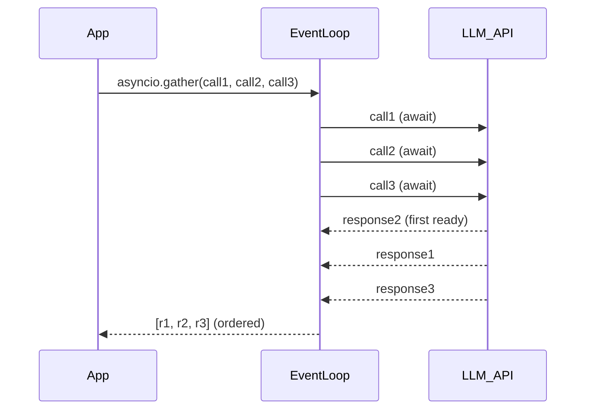

**Interview Q&A:**

*Q: asyncio vs threading kab use kare?* asyncio **I/O bound** ke liye — network calls, file I/O, DB queries. Single thread, cooperative — context switch cheap hai. Threading **legacy sync libs** ke liye jo async nahi hain — `concurrent.futures.ThreadPoolExecutor` use kar. CPU bound ke liye **multiprocessing** — GIL bypass karta hai.

*Q: `asyncio.gather` vs `asyncio.as_completed`?* `gather` saare results ek saath deta hai, original order me. `as_completed` jaise jaise complete hote hain waise yield karta hai — streaming UX ke liye useful (jaise multiple LLM calls me jo pehle aaye wo display karna).

*Q: Async function se sync function call kar sakte ho?* Haan, directly call kar — bas ye dhyaan rakh ki sync function blocking hua to event loop block ho jaayega. Heavy sync work ke liye `await asyncio.to_thread(sync_func, args)` use kar — wo background thread me run karega.

### 1.3 Decorators, context managers, descriptors

**Definition:** **Decorators** functions/classes ko wrap karte hain (`@retry`, `@cache`). **Context managers** `with` statement ke saath resource lifecycle handle karte hain (`with open(...) as f`). **Descriptors** class attribute access ko customize karte hain (`@property` ka backbone).

**Why GenAI me?** LLM calls fail hote hain — retry decorator chahiye. Tracing/logging ke liye decorators (LangSmith, Weights & Biases). Token counting ke liye context managers. Pydantic fields validators — descriptors ke upar bane hain.

**How:**

```python
import time
from contextlib import contextmanager
from functools import wraps

# Decorator — retry on failure
def retry(max_attempts: int = 3, delay: float = 1.0):
    def decorator(func):
        @wraps(func)  # original func ka __name__, __doc__ preserve karta hai
        def wrapper(*args, **kwargs):
            for attempt in range(max_attempts):
                try:
                    return func(*args, **kwargs)
                except Exception as e:
                    if attempt == max_attempts - 1:
                        raise
                    print(f"Attempt {attempt+1} failed: {e}, retrying...")
                    time.sleep(delay * (2 ** attempt))  # exponential backoff
        return wrapper
    return decorator

@retry(max_attempts=3)
def call_llm(prompt: str) -> str:
    # Imagine ye flaky API call hai
    return openai_client.chat.completions.create(...)

# Context manager — token usage tracker
@contextmanager
def track_tokens(operation_name: str):
    start = time.time()
    tokens_before = get_total_tokens()
    try:
        yield  # yahan user ka code chalega
    finally:
        elapsed = time.time() - start
        used = get_total_tokens() - tokens_before
        print(f"{operation_name}: {used} tokens, {elapsed:.2f}s")

with track_tokens("rag_query"):
    answer = rag_chain.invoke("What is RAG?")

# Descriptor — lazy embedding property
class LazyEmbedding:
    """Embedding compute on first access, cache after"""
    def __init__(self, text_attr: str):
        self.text_attr = text_attr
        self.cache_attr = f"_emb_{text_attr}"
    
    def __get__(self, obj, objtype=None):
        if obj is None: return self
        if not hasattr(obj, self.cache_attr):
            text = getattr(obj, self.text_attr)
            setattr(obj, self.cache_attr, embedder.embed(text))
        return getattr(obj, self.cache_attr)

class Document:
    embedding = LazyEmbedding("text")
    def __init__(self, text: str):
        self.text = text

doc = Document("hello world")
print(doc.embedding)  # computes here
print(doc.embedding)  # cached, no recompute
```

**Real-life example:** `@tool` decorator in LangChain — function ko tool me convert karta hai for agents. `tenacity` library ka `@retry` — production retry logic. LlamaIndex ka `with Settings.callback_manager.as_trace("query")`.

**Diagram:**

```mermaid
graph TD
    A[Plain Function] -->|@retry decorator| B[Wrapped with retry logic]
    B -->|@cache decorator| C[Wrapped with caching]
    C -->|@trace decorator| D[Wrapped with telemetry]
    D --> E[Production-ready function]
    F[Resource] -->|__enter__| G[Acquired in with block]
    G -->|__exit__| H[Released even on exception]
```

**Interview Q&A:**

*Q: `@functools.wraps` kyun zaroori hai?* Bina `wraps` ke decorated function ka `__name__` "wrapper" ho jaata hai, `__doc__` lost ho jaata hai. Stack traces, logging, introspection sab tooth jaate hain. Hamesha `@wraps(func)` lagao inner wrapper pe.

*Q: `contextmanager` decorator vs `__enter__/__exit__` class — kab kya?* Simple cases (cleanup logic short hai) — `@contextmanager` + generator function. Complex state, reusable across many places, ya nested context managers — class-based. Class-based me `__exit__` me exception handling clearer hai (exc_type, exc_val, exc_tb params).

*Q: Property vs Descriptor — same cheez hai?* `@property` ek built-in descriptor hai. Custom descriptor banane ka faayda — reusable across multiple classes (jaise `LazyEmbedding` upar). Property single class me limited hai. Pydantic, SQLAlchemy ORM — sab descriptors pe khade hain.

### 1.4 Generators, iterators, itertools

**Definition:** **Iterator** wo object hai jisme `__iter__` aur `__next__` hain — values ek-ek karke deta hai. **Generator** function with `yield` — lazy iterator banane ka easy way. **itertools** standard library hai for combinatorial iteration (chain, islice, groupby, product).

**Why GenAI me?** LLM **streaming responses** generators hain — token-by-token aata hai. Bade datasets (millions of docs) ko memory me load nahi kar sakte — generators chahiye. `itertools.batched` (Py 3.12+) batch processing ke liye.

**How:**

```python
from itertools import islice, batched, chain

# Streaming LLM response — generator
def stream_completion(prompt: str):
    """Token-by-token yield, memory efficient"""
    response = client.chat.completions.create(
        model="gpt-4",
        messages=[{"role": "user", "content": prompt}],
        stream=True
    )
    for chunk in response:
        if chunk.choices[0].delta.content:
            yield chunk.choices[0].delta.content

# Use karte waqt
for token in stream_completion("Explain RAG"):
    print(token, end="", flush=True)

# Large file reader — eager load se bachne ke liye
def read_jsonl(path: str):
    with open(path) as f:
        for line in f:
            yield json.loads(line)  # ek line at a time, GB files bhi handle

# Batching for embedding API (which has batch size limit)
def embed_in_batches(texts, batch_size: int = 100):
    # itertools.batched Python 3.12+
    for batch in batched(texts, batch_size):
        embeddings = embedder.embed_batch(list(batch))
        yield from embeddings  # flatten

# islice — paginated iteration
docs = read_jsonl("huge_corpus.jsonl")
first_1000 = list(islice(docs, 1000))  # only first 1000 loaded

# chain — multiple iterators combine
all_docs = chain(read_jsonl("a.jsonl"), read_jsonl("b.jsonl"))
```

**Real-life example:** OpenAI streaming API, Anthropic streaming — sab generators return karte hain. HuggingFace datasets library `IterableDataset` — streaming pe khada hai (1TB datasets ko memory me load nahi karta).

**Diagram:**

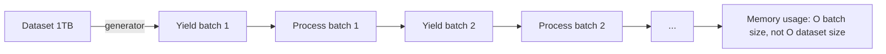

**Interview Q&A:**

*Q: Generator function vs generator expression?* Function: `def gen(): yield x` — multiple statements, complex logic. Expression: `(x*2 for x in lst)` — inline, simple transforms. Generator expression `[]` ki jagah `()` use karke banaye jaate hain — list comprehension ka lazy version.

*Q: Generator exhaustion kya hai?* Generator ek baar consume ho gaya to dobara use nahi hota. `gen = (x for x in [1,2,3])`, `list(gen)` → `[1,2,3]`, dobara `list(gen)` → `[]`. Iss problem se bachne ke liye function call karke fresh generator banao har baar.

*Q: `yield from` ka use?* Sub-generator delegate karne ke liye. `yield from inner_gen()` equivalent to `for x in inner_gen(): yield x`. Cleaner, faster, exceptions properly propagate hote hain. Async version `async for ... yield` hai, ya `yield from async_gen()` async context me.

### 1.5 Pydantic v2 — validation in LLM stacks

**Definition:** Pydantic data validation library hai — Python type hints use karke runtime validation, parsing, serialization. v2 Rust core (pydantic-core) pe khada hai — 5-50x faster than v1. LLM stacks ka **default schema layer**.

**Why GenAI me?** LLM JSON output structured nahi hai — kabhi field missing, kabhi type galat. Pydantic se schema enforce karte hain. **Function calling**, **structured output**, **API request/response** — sab Pydantic. Instructor, LangChain, LlamaIndex — sab v2 pe shift ho gaye.

**How:**

```python
from pydantic import BaseModel, Field, field_validator, ConfigDict
from typing import Literal
from datetime import datetime

class Citation(BaseModel):
    """Single citation in RAG response"""
    model_config = ConfigDict(extra="forbid")  # extra fields → error
    
    source_id: str
    page: int = Field(ge=1, description="Page number, 1-indexed")
    snippet: str = Field(min_length=10, max_length=500)

class RAGResponse(BaseModel):
    """Structured output from RAG pipeline"""
    answer: str = Field(min_length=1)
    confidence: float = Field(ge=0.0, le=1.0)
    citations: list[Citation] = Field(default_factory=list)
    intent: Literal["factual", "opinion", "computational"]
    timestamp: datetime = Field(default_factory=datetime.utcnow)
    
    @field_validator("answer")
    @classmethod
    def no_hallucination_markers(cls, v: str) -> str:
        # Custom validation — "I don't know" responses reject
        bad_phrases = ["i'm not sure", "i don't know"]
        if any(p in v.lower() for p in bad_phrases):
            raise ValueError(f"Low confidence answer: {v[:50]}")
        return v

# LLM se aaya raw JSON
raw = {
    "answer": "RAG stands for Retrieval Augmented Generation",
    "confidence": 0.95,
    "citations": [{"source_id": "doc1", "page": 5, "snippet": "RAG combines retrieval with generation..."}],
    "intent": "factual"
}

# Validate + parse
resp = RAGResponse.model_validate(raw)  # raises ValidationError if bad
print(resp.model_dump_json())  # serialize to JSON

# JSON schema for LLM function calling
schema = RAGResponse.model_json_schema()
```

**Real-life example:** **Instructor** library — Pydantic schema do, LLM se guaranteed structured output milta hai (auto-retry on validation fail). FastAPI sab request/response Pydantic se validate karta hai. LangChain ka `with_structured_output(MyModel)`.

**Diagram:**

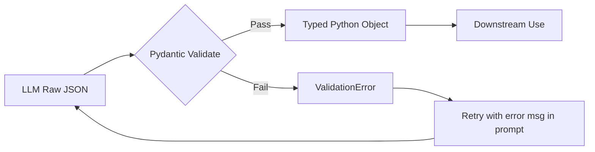

**Interview Q&A:**

*Q: Pydantic v1 vs v2 — major changes?* v2 Rust core — much faster. API changes: `parse_obj` → `model_validate`, `dict()` → `model_dump()`, `json()` → `model_dump_json()`. `validator` → `field_validator` (with `@classmethod`). `Config` class → `model_config = ConfigDict(...)`. v2 me strict mode, computed fields, discriminated unions much better.

*Q: Pydantic vs dataclasses — kab kya?* Dataclasses pure Python, zero deps, lightweight. **Internal data structures** ke liye fine. Pydantic when validation/parsing/serialization chahiye — **API boundaries, LLM output, config files**. Pydantic dataclasses bhi support karta hai (`@pydantic.dataclasses.dataclass`) — best of both.

*Q: `Field(...)` me `...` kya hai?* Ellipsis — "required field, no default". `Field(...)` matlab "field required hai, validator extra constraints lagayega". `Field(default=None)` ya `Field(default_factory=list)` optional ke liye.

### 1.6 Dataclasses, attrs

**Definition:** **Dataclasses** Python 3.7+ built-in (`@dataclass`) — auto-generates `__init__`, `__repr__`, `__eq__`. **attrs** older third-party library jo dataclasses se zyada powerful (slots, validators, converters, frozen instances).

**Why GenAI me?** Internal data classes — agent state, retrieval results, intermediate pipeline objects. Pydantic overkill jab tu LLM se direct nahi le raha, internal pass kar raha hai. Performance critical paths me dataclass + slots better.

**How:**

```python
from dataclasses import dataclass, field
from typing import Any
import attrs

@dataclass(slots=True, frozen=True)  # immutable, memory efficient
class RetrievalResult:
    doc_id: str
    score: float
    text: str
    metadata: dict[str, Any] = field(default_factory=dict)
    
    def __post_init__(self):
        # Validation in dataclass
        if not 0 <= self.score <= 1:
            raise ValueError(f"score must be in [0,1], got {self.score}")

# attrs version with converter
@attrs.define(slots=True)
class AgentState:
    user_id: str
    history: list[str] = attrs.field(factory=list)
    iteration: int = attrs.field(default=0, validator=attrs.validators.ge(0))
    
    # Converter — automatic type conversion
    max_tokens: int = attrs.field(converter=int, default=1000)

# Usage
result = RetrievalResult(doc_id="d1", score=0.92, text="...")
state = AgentState(user_id="u1", max_tokens="500")  # str → int auto
```

**Real-life example:** LangChain `Document` class dataclass-style hai. HuggingFace transformers `ModelOutput` — dataclass hierarchy. Internal pipeline objects (token counts, latency metrics) — dataclass perfect.

**Diagram:**

```mermaid
graph TD
    A[Plain class with __init__] -->|@dataclass| B[Auto __init__, __repr__, __eq__]
    B -->|slots=True| C[Memory efficient]
    C -->|frozen=True| D[Immutable / hashable]
    D --> E[Use as dict keys, set members]
```

**Interview Q&A:**

*Q: `slots=True` ka kya benefit?* `__slots__` define karta hai — instance ka `__dict__` nahi banta. Memory ~50% kam, attribute access faster. Drawback: monkey-patching nahi, dynamic attributes nahi. Production data classes me almost always `slots=True`.

*Q: `frozen=True` ka use case?* Immutability — hashable banata hai, set/dict me as key use kar sakte ho. Concurrent code me safer (no race conditions on mutation). Functional style — naya object banao, modify nahi karo.

*Q: attrs ya dataclass kya choose kare?* Modern code: dataclass for simple cases (built-in, no dep). attrs jab tujhe converters, complex validators, ya v1.x compat chahiye. Pydantic for validation-heavy. Dono coexist kar sakte hain — tools mix kar.

### 1.7 Memory management, profiling (cProfile, memray)

**Definition:** Python memory CPython refcount + cyclic GC se manage hoti hai. **cProfile** built-in deterministic profiler (function call counts, time). **memray** Bloomberg ka memory profiler — line-level allocations, leak detection.

**Why GenAI me?** Embeddings 1536-dim float32 — 6KB each. 1M docs = 6GB RAM. Bina profiling ke OOM crashes guaranteed. Inference latency optimize karna without profiling = guesswork. Memory leaks jab tu model bar bar load kare — common bug.

**How:**

```python
import cProfile, pstats
from memray import Tracker

# CPU profiling
def rag_query(query: str):
    embedding = embedder.embed(query)
    docs = vector_store.search(embedding, k=5)
    answer = llm.generate(query, docs)
    return answer

# Method 1: cProfile context
with cProfile.Profile() as pr:
    for _ in range(100):
        rag_query("test query")

stats = pstats.Stats(pr).sort_stats("cumulative")
stats.print_stats(20)  # top 20 slowest functions

# Method 2: cProfile CLI
# python -m cProfile -o out.prof script.py
# snakeviz out.prof  # GUI viewer

# Memory profiling with memray
# CLI: memray run script.py
#      memray flamegraph memray-script.bin

# Programmatic
with Tracker("output.bin"):
    embeddings = [embedder.embed(t) for t in huge_text_list]
# Then: memray flamegraph output.bin

# Memory tip — generators over lists
# BAD: 1M embeddings in memory
all_embs = [embedder.embed(t) for t in texts]

# GOOD: stream, write to disk
def stream_embeddings(texts):
    for t in texts:
        yield embedder.embed(t)

with open("embs.npy", "wb") as f:
    for emb in stream_embeddings(texts):
        np.save(f, emb)
```

**Real-life example:** vLLM, SGLang — production inference engines, sab heavily profiled. HuggingFace `accelerate` ka memory tracking. LangSmith traces — token counts + latencies per step.

**Diagram:**

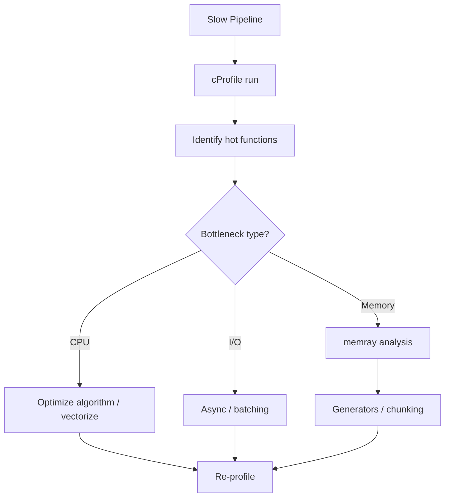

**Interview Q&A:**

*Q: cProfile vs line_profiler vs py-spy — kab kya?* cProfile: function-level, built-in, deterministic. line_profiler: line-by-line, decorator-based, slower. py-spy: sampling profiler, **production-safe** (no instrumentation, attach to running process). Production debugging me py-spy.

*Q: Python me memory leak kaise hota hai?* Cyclic references (now handled by GC mostly), but **hidden refs** — global lists, module-level caches, closures holding references. ML me common: GPU tensors not freed (`del tensor; torch.cuda.empty_cache()`). memray se exact line milti hai.

*Q: GIL kya hai aur kab affect karta hai?* Global Interpreter Lock — ek time pe ek thread Python bytecode execute karta hai. CPU-bound multithreading useless (use multiprocessing). I/O bound thik chalta hai (GIL release hota hai I/O pe). NumPy, Torch C extensions GIL release karte hain — wahan threading useful.

### 1.8 Multiprocessing vs multithreading vs asyncio

**Definition:** Three concurrency models in Python. **Threading**: shared memory, GIL-bound, good for I/O. **Multiprocessing**: separate processes, GIL-free, good for CPU. **Asyncio**: single-thread cooperative, best for I/O at scale.

**Why GenAI me?** Embedding API calls — asyncio (1000s concurrent). Local model inference (CPU/GPU heavy) — multiprocessing. Wrapping sync libs in async code — thread pool. Choose galat = 10x slower or crash.

**How:**

```python
import asyncio
from concurrent.futures import ThreadPoolExecutor, ProcessPoolExecutor
import multiprocessing as mp

# Asyncio — best for many small I/O calls
async def llm_call(prompt: str):
    return await async_client.chat.completions.create(...)

async def main_async():
    tasks = [llm_call(p) for p in prompts]
    return await asyncio.gather(*tasks)

# Threading — sync libs, I/O bound, moderate concurrency
def sync_pinecone_query(query):  # sync SDK
    return pinecone_index.query(query)

with ThreadPoolExecutor(max_workers=20) as ex:
    results = list(ex.map(sync_pinecone_query, queries))

# Multiprocessing — CPU bound (local embedding, parsing)
def parse_pdf(path):  # CPU intensive
    return extract_text_from_pdf(path)

if __name__ == "__main__":  # IMPORTANT for mp on Windows/Mac
    with ProcessPoolExecutor(max_workers=mp.cpu_count()) as ex:
        texts = list(ex.map(parse_pdf, pdf_paths))

# Hybrid — async + thread pool for sync code
async def call_sync_in_async(func, *args):
    loop = asyncio.get_event_loop()
    return await loop.run_in_executor(None, func, *args)
```

**Real-life example:** Document ingestion pipeline: parse PDFs (multiprocessing) → embed via API (asyncio) → upsert to vector DB (asyncio with batching). HuggingFace `datasets.map(num_proc=8)` uses multiprocessing.

**Diagram:**

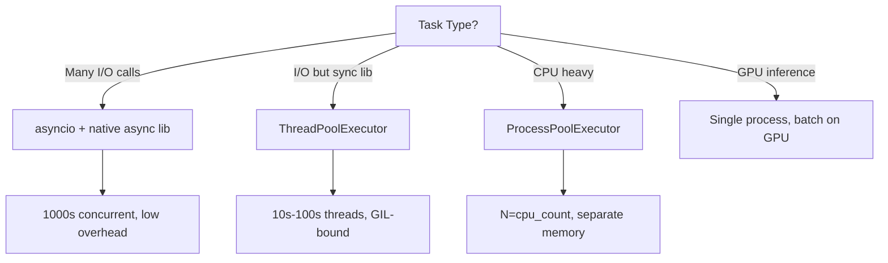

**Interview Q&A:**

*Q: Multiprocessing me data sharing kaise?* Process memory separate — pickle se data serialize hoke jaata hai (overhead). `multiprocessing.Queue`, `Pipe`, ya `shared_memory` (3.8+) for large arrays. NumPy arrays for ML — `shared_memory` se zero-copy sharing.

*Q: Asyncio me CPU-bound kaam aaya to kya?* Event loop block — sab task wait karenge. Solution: `asyncio.to_thread(cpu_func)` (single CPU still, but loop free) ya `loop.run_in_executor(ProcessPoolExecutor(), cpu_func)` (true parallel CPU).

*Q: `if __name__ == "__main__":` mp me kyun zaroori?* Windows/macOS pe spawn method use hota hai — child process module re-import karta hai. Bina guard ke infinite recursion. Linux fork pe optional but best practice always lagao.

---

## 2. Software Engineering Tools

Code likhna 30% hai, baaki 70% — version control, environment management, testing, deployment. Gen AI projects me ye aur critical hai kyunki dependencies massive (torch, cuda, transformers), models heavy, reproducibility tough.

### 2.1 Git deep — rebase, cherry-pick, bisect, hooks

**Definition:** Git distributed VCS hai. Beyond `add/commit/push` — **rebase** (linearize history), **cherry-pick** (selective commits), **bisect** (binary search bug introduction), **hooks** (pre-commit scripts).

**Why GenAI me?** Bade teams, long-lived branches, experiment tracking. Model code + config + data versioning. Bug aaya — kab introduce hua? bisect. Pre-commit hooks for ruff/mypy/secrets scanning.

**How:**

```bash
# Interactive rebase — clean up history before PR
git rebase -i HEAD~5
# Editor: pick/squash/edit/drop commits
# Use to combine WIP commits into clean ones

# Rebase feature branch on latest main
git checkout feature/rag-improvements
git fetch origin
git rebase origin/main
# Conflicts? resolve, git add, git rebase --continue

# Cherry-pick — bring single commit from another branch
git cherry-pick abc1234
# Useful: hotfix from main → release branch

# Bisect — find which commit broke production
git bisect start
git bisect bad HEAD       # current is broken
git bisect good v1.2.0    # this version was fine
# Git checks out midpoint commit; you test
git bisect good   # or git bisect bad
# Repeat — git binary searches in O(log n) commits
git bisect reset

# Pre-commit hook — auto run linters
# .git/hooks/pre-commit (or use pre-commit framework)
#!/bin/bash
ruff check . || exit 1
mypy lib/ || exit 1
```

**Real-life example:** OpenAI, Anthropic, HuggingFace — sab heavy git users. PR workflows: feature branch → rebase main → squash merge. `pre-commit` framework `.pre-commit-config.yaml` se hooks declarative.

**Diagram:**

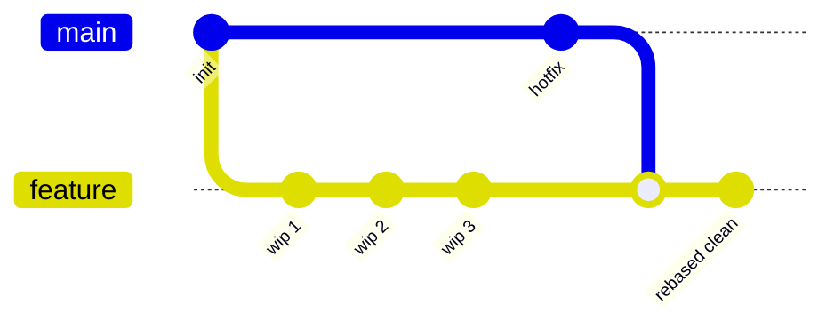

**Interview Q&A:**

*Q: Merge vs rebase — kab kya?* Merge: preserves history, non-destructive, "true" timeline. Rebase: linear history, cleaner log, **rewrites commits** (don't rebase pushed branches without team agreement). Rule: rebase before pushing, merge after.

*Q: Force push ka use case?* Rebase ke baad branch update karne ke liye `git push --force-with-lease` (safer than `--force` — checks if remote changed). Never force push to main/shared branches.

*Q: Bisect manual vs automated?* `git bisect run ./test.sh` — git khud script chalata hai har commit pe, exit code 0 = good, non-zero = bad. CI integration possible.

### 2.2 Linux/Bash — pipes, awk, sed, grep, xargs

**Definition:** Unix philosophy — small tools chained via pipes (`|`). **grep**: pattern search. **sed**: stream editor (substitution). **awk**: column-based processing. **xargs**: build commands from stdin.

**Why GenAI me?** Logs analysis, dataset preprocessing, quick file munging. JSON/JSONL inspection without writing Python script. Server SSH pe ye sab ready milte hain. Data scientists ne notebook me ghuse rehte hain — devs CLI master karte hain.

**How:**

```bash
# Find all .py files mentioning "embedding"
grep -rn "embedding" --include="*.py" .

# Count tokens approximately in dataset (whitespace split)
cat corpus.txt | wc -w

# Extract specific JSONL field
cat data.jsonl | jq -r '.text' | head -n 100

# Replace in place — model name update across files
sed -i 's/text-embedding-ada-002/text-embedding-3-small/g' configs/*.yaml

# awk — column processing
# logs.txt: timestamp user_id latency tokens
awk '$3 > 5.0 {print $2, $3}' logs.txt   # users with high latency

# Average tokens per request
awk '{sum+=$4; n++} END {print sum/n}' logs.txt

# xargs — bulk operations
ls *.pdf | xargs -I {} -P 4 python parse_pdf.py {}   # parallel 4

# Pipeline example — top 10 errors in logs
cat app.log | grep ERROR | awk '{print $5}' | sort | uniq -c | sort -rn | head -10

# Find largest files (for cleanup before docker build)
find . -type f -size +100M -exec ls -lh {} \;
```

**Real-life example:** Llama.cpp, vLLM build scripts — heavy bash. HuggingFace dataset cards me bash one-liners common. SRE incident response: `kubectl logs ... | grep ERROR | awk ...`.

**Diagram:**


**Interview Q&A:**

*Q: `xargs` aur `find -exec` me difference?* `find -exec ... {} \;` — ek command per file (slow). `find -exec ... {} +` — batch (fast). `xargs` — stdin se input, `-P N` parallel option, more flexible. Modern: `find ... | xargs -P 8 -I {} cmd {}`.

*Q: sed -i ka risk?* In-place edit — backup nahi banata default. Bug ho to data lost. Hamesha `sed -i.bak 's/x/y/' file` (creates `.bak`) ya version control me commit pehle.

*Q: jq kya hai aur kyun seekhna chahiye?* JSON processor — bash me JSON manipulate. LLM responses, API outputs sab JSON. `curl ... | jq '.choices[0].message.content'` daily use.

### 2.3 Docker + Compose for AI workloads

**Definition:** **Docker** containerization platform. **Dockerfile** image build recipe. **docker-compose** multi-container apps. AI workloads me CUDA, model weights, complex deps — Docker ne reproducibility solve ki.

**Why GenAI me?** "Works on my machine" pe production crash — Docker stops that. CUDA version, Python version, system libs — sab pin. Model serving (Triton, vLLM) Docker me ship hota hai. RAG stack: API + Postgres + Qdrant + Redis — compose.

**How:**

```dockerfile
# Dockerfile — multi-stage build for FastAPI + LLM app
FROM python:3.12-slim AS builder
WORKDIR /app
COPY pyproject.toml uv.lock ./
RUN pip install uv && uv sync --frozen --no-dev

FROM python:3.12-slim
WORKDIR /app
# Copy only what's needed (smaller image)
COPY --from=builder /app/.venv /app/.venv
COPY src/ ./src/

# Non-root user (security)
RUN useradd -m appuser && chown -R appuser /app
USER appuser

ENV PATH="/app/.venv/bin:$PATH"
ENV PYTHONUNBUFFERED=1

EXPOSE 8000
CMD ["uvicorn", "src.main:app", "--host", "0.0.0.0", "--port", "8000"]
```

```yaml
# docker-compose.yml — full RAG stack
services:
  api:
    build: .
    ports: ["8000:8000"]
    environment:
      - OPENAI_API_KEY=${OPENAI_API_KEY}
      - QDRANT_URL=http://qdrant:6333
      - REDIS_URL=redis://redis:6379
    depends_on: [qdrant, redis, postgres]
    
  qdrant:
    image: qdrant/qdrant:latest
    volumes: ["./qdrant_data:/qdrant/storage"]
    ports: ["6333:6333"]
    
  redis:
    image: redis:7-alpine
    
  postgres:
    image: pgvector/pgvector:pg16
    environment:
      POSTGRES_PASSWORD: secret
    volumes: ["./pg_data:/var/lib/postgresql/data"]

# GPU workload
  vllm:
    image: vllm/vllm-openai:latest
    runtime: nvidia
    environment:
      - HF_TOKEN=${HF_TOKEN}
    command: ["--model", "meta-llama/Llama-3-8B"]
    deploy:
      resources:
        reservations:
          devices: [{driver: nvidia, count: 1, capabilities: [gpu]}]
```

**Real-life example:** vLLM, TGI, Ollama — sab Docker images. NVIDIA NGC containers (PyTorch with CUDA pre-built). Modal, Replicate — Docker-based deploy.

**Diagram:**

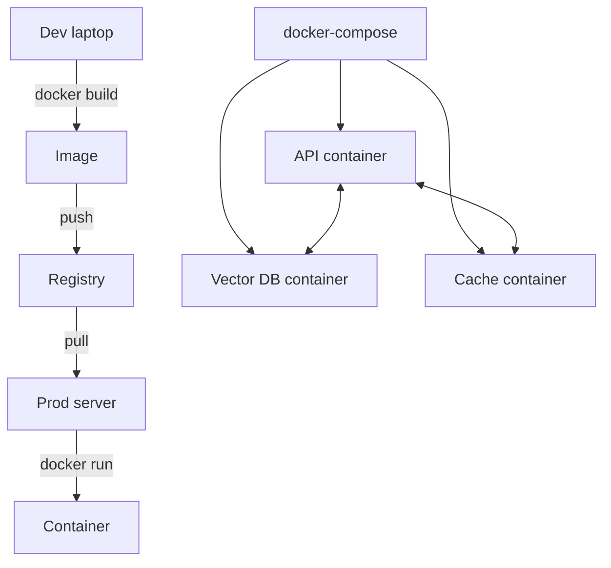

**Interview Q&A:**

*Q: Image size kam kaise kare?* Multi-stage builds (build deps separate from runtime). slim/alpine base images. `.dockerignore` (exclude `.git`, `__pycache__`, models). Layer ordering: changing files last (cache reuse).

*Q: Docker volume vs bind mount?* Volume — Docker managed, portable. Bind mount — host path direct mount, dev-friendly (live reload). Production volumes; dev bind mounts.

*Q: GPU containers kaise?* nvidia-container-toolkit install host pe. `--gpus all` flag ya compose me `runtime: nvidia` + device reservation. Image me CUDA matching host driver.

### 2.4 uv, poetry, pip-tools

**Definition:** Modern Python dependency managers. **uv** (Astral, Rust) — extremely fast, drop-in pip replacement + venv + lockfile. **poetry** — older, full project mgmt. **pip-tools** — `pip-compile` for lockfiles, lightweight.

**Why GenAI me?** Reproducibility — `torch==2.4.0+cu121` mismatch nightmare. Lockfile = exact same install everywhere. uv 10-100x faster than pip — CI time saved hours per week.

**How:**

```bash
# uv — recommended for new projects (2025)
curl -LsSf https://astral.sh/uv/install.sh | sh

uv init my-rag-app
cd my-rag-app

# Add deps — lockfile auto-updated
uv add openai langchain qdrant-client
uv add --dev pytest ruff mypy

# Install (creates .venv)
uv sync

# Run script in venv
uv run python src/main.py

# pyproject.toml — modern standard
# [project]
# name = "my-rag-app"
# dependencies = ["openai>=1.0", "langchain>=0.3"]

# Lockfile uv.lock — commit to git

# Poetry alternative
poetry init
poetry add openai
poetry install
poetry run pytest

# pip-tools — minimal
pip install pip-tools
# requirements.in: openai\nlangchain
pip-compile requirements.in   # generates requirements.txt with versions
pip-sync requirements.txt
```

**Real-life example:** LangChain, LlamaIndex internal — moving to uv. HuggingFace internal — uv. Most new GenAI startups picking uv (2025).

**Diagram:**

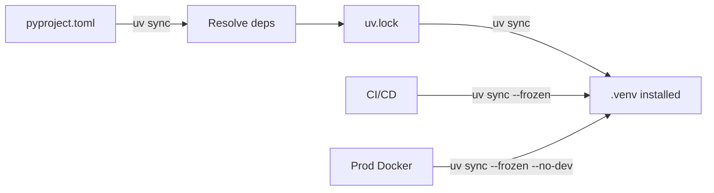

**Interview Q&A:**

*Q: pip vs uv vs poetry — pick one for new project?* uv (2025+) — fastest, simplest, standard pyproject.toml. Poetry if team already uses it. pip+pip-tools if minimal toolchain preferred. Plain pip for tiny scripts.

*Q: Lockfile kyun zaroori?* `requirements.txt` me `langchain>=0.3` likha — aaj 0.3.5 install hua, kal 0.3.7. New version me bug — production broken. Lockfile exact versions + transitive deps pin karta hai. CI me `--frozen` flag.

*Q: Poetry me virtualenv kahan banta hai?* Default `~/.cache/pypoetry/virtualenvs/`. `poetry config virtualenvs.in-project true` se `./.venv` me banta hai (preferred for IDE).

### 2.5 pytest, hypothesis, pytest-asyncio

**Definition:** **pytest** Python's de facto testing framework. **hypothesis** property-based testing (auto-generates test inputs). **pytest-asyncio** async test support.

**Why GenAI me?** LLM stochastic — testing tricky. Use mocks for LLM calls, test deterministic logic (parsing, validation, retrieval). Integration tests with cassettes (VCR). Property tests for tokenizers, vector ops.

**How:**

```python
# tests/test_rag.py
import pytest
from hypothesis import given, strategies as st
from unittest.mock import AsyncMock

from myapp.rag import RAGPipeline, parse_citations

# Basic test
def test_parse_citations():
    text = "Per [1], RAG works. Also [2] mentions..."
    cits = parse_citations(text)
    assert cits == [1, 2]

# Parametrized
@pytest.mark.parametrize("input,expected", [
    ("[1]", [1]),
    ("[1][2][3]", [1,2,3]),
    ("no cites here", []),
    ("[1] then [1] again", [1, 1]),
])
def test_citations_param(input, expected):
    assert parse_citations(input) == expected

# Fixture
@pytest.fixture
def mock_llm():
    llm = AsyncMock()
    llm.generate.return_value = "mocked answer [1]"
    return llm

@pytest.fixture
def mock_vector_store():
    vs = AsyncMock()
    vs.search.return_value = [{"text": "doc1", "score": 0.9}]
    return vs

# Async test
@pytest.mark.asyncio
async def test_rag_pipeline(mock_llm, mock_vector_store):
    pipeline = RAGPipeline(llm=mock_llm, store=mock_vector_store)
    result = await pipeline.query("What is RAG?")
    
    assert "mocked answer" in result.answer
    mock_vector_store.search.assert_called_once()
    mock_llm.generate.assert_called_once()

# Property-based testing with hypothesis
@given(st.text(min_size=1, max_size=1000))
def test_chunker_never_loses_chars(text):
    chunks = chunk_text(text, size=100)
    rejoined = "".join(c.text for c in chunks)
    # Property: chunking + joining preserves content (modulo overlap)
    assert all(c.text for c in chunks if c.text)

# Snapshot test for prompt templates
def test_rag_prompt(snapshot):
    prompt = build_rag_prompt(query="hi", docs=["d1", "d2"])
    snapshot.assert_match(prompt, "rag_prompt.txt")
```

**Real-life example:** LangChain test suite — pytest. Pydantic — hypothesis property tests. OpenAI Python SDK — pytest with respx for HTTP mocking.

**Diagram:**

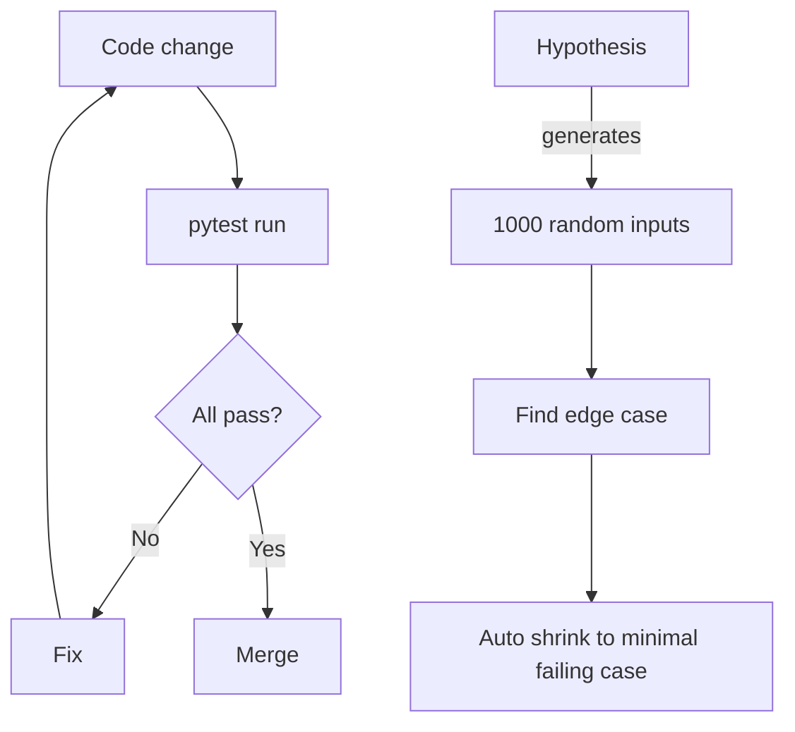

**Interview Q&A:**

*Q: Mock LLM me kab kaafi nahi?* Unit tests me mock fine. Integration tests — real LLM ya recorded responses (VCR/cassettes). End-to-end tests staging me real API + small budget. Eval suite separate concept (deepeval, ragas).

*Q: Fixture scope kya hai?* `function` (default), `class`, `module`, `session`. Expensive fixtures (DB connection, model load) `session` scope — ek baar puri test session me. Cheap things `function` (clean state).

*Q: pytest-asyncio mode?* `auto` mode — sab `async def test_*` automatically async. `strict` — `@pytest.mark.asyncio` chahiye explicit. `pyproject.toml` me `asyncio_mode = "auto"` recommended modern.

### 2.6 ruff, mypy, pre-commit

**Definition:** **ruff** ultra-fast Python linter + formatter (Rust, replaces flake8/black/isort/many). **mypy** static type checker. **pre-commit** framework to run hooks before commits.

**Why GenAI me?** Code quality consistency in teams. Type errors caught before runtime — LLM JSON typos, wrong arg types. Formatted code = less PR review noise. Pre-commit ensures "broken code never gets committed".

**How:**

```toml
# pyproject.toml
[tool.ruff]
line-length = 100
target-version = "py312"

[tool.ruff.lint]
select = [
    "E", "F", "W",  # pycodestyle, pyflakes
    "I",            # isort
    "B",            # bugbear
    "UP",           # pyupgrade
    "ASYNC",        # async issues
    "RUF",          # ruff-specific
]
ignore = ["E501"]  # handled by formatter

[tool.ruff.format]
quote-style = "double"

[tool.mypy]
python_version = "3.12"
strict = true
plugins = ["pydantic.mypy"]
ignore_missing_imports = true

[[tool.mypy.overrides]]
module = ["langchain.*"]
ignore_errors = true
```

```yaml
# .pre-commit-config.yaml
repos:
  - repo: https://github.com/astral-sh/ruff-pre-commit
    rev: v0.6.0
    hooks:
      - id: ruff
        args: [--fix]
      - id: ruff-format
  
  - repo: https://github.com/pre-commit/mirrors-mypy
    rev: v1.11.0
    hooks:
      - id: mypy
        additional_dependencies: [pydantic, types-requests]
  
  - repo: https://github.com/gitleaks/gitleaks
    rev: v8.18.0
    hooks:
      - id: gitleaks   # detect secrets
```

```bash
# Install + run
pip install pre-commit
pre-commit install   # adds .git/hooks/pre-commit
pre-commit run --all-files   # one-time
# Now every commit auto-checks
```

**Real-life example:** FastAPI, Pydantic, HuggingFace transformers — sab ruff + mypy use karte hain. CI me pre-commit run mandatory.

**Diagram:**

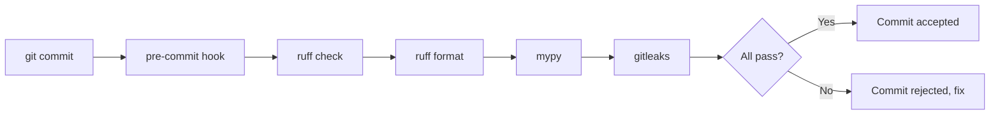

**Interview Q&A:**

*Q: ruff black ki jagah le sakta hai?* Haan, `ruff format` black-compatible (90%+ identical output), 30x faster. Modern setup: ruff alone for lint+format, drop black/isort/flake8. Config sab `pyproject.toml` me.

*Q: mypy strict mode pain hai shuru me — kya kare?* Gradual adoption. Start with `--strict-optional` only. Per-module config via `[[tool.mypy.overrides]]`. Third-party libs without stubs — `ignore_missing_imports`. Slowly tighten.

*Q: Pre-commit local pass, CI fail — common reason?* Hooks versions different between dev and CI. Pin in `.pre-commit-config.yaml` aur CI me `pre-commit run --all-files` chala. Sab same versions.

### 2.7 Make, justfile, task runners

**Definition:** **Make** classic Unix build tool (Makefile). **just** modern Make alternative (justfile syntax cleaner). Task runners — common commands ko named tasks me wrap karte hain.

**Why GenAI me?** Bahut commands daily — `pytest`, `ruff check`, `docker build`, `python ingest.py`. Naam yaad rakhne ki jagah `just test`, `just ingest`. New team members onboard faster.

**How:**

```makefile
# Makefile
.PHONY: help install test lint format docker-build ingest

help:
	@grep -E '^[a-zA-Z_-]+:.*?## .*$$' $(MAKEFILE_LIST) | \
	awk 'BEGIN {FS = ":.*?## "}; {printf "%-15s %s\n", $$1, $$2}'

install: ## Install deps
	uv sync --all-extras

test: ## Run tests
	uv run pytest -v

lint: ## Lint and type-check
	uv run ruff check .
	uv run mypy src/

format: ## Format code
	uv run ruff format .
	uv run ruff check --fix .

docker-build: ## Build prod image
	docker build -t myapp:latest .

ingest: ## Ingest documents into vector store
	uv run python -m src.ingest --source data/

eval: ## Run evaluation suite
	uv run python -m src.eval.run
```

```just
# justfile (cleaner than Make)
default:
    @just --list

install:
    uv sync --all-extras

test *args:
    uv run pytest {{args}}

lint:
    uv run ruff check .
    uv run mypy src/

# Variables
docker_image := "myapp:latest"

docker-build:
    docker build -t {{docker_image}} .

# Dependencies between recipes
ci: lint test
    @echo "CI passed"
```

**Real-life example:** Most modern AI repos have `Makefile` or `justfile`. LangChain, Pydantic, FastAPI — Makefiles. New projects increasingly using just (no make-isms like tab vs space).

**Diagram:**

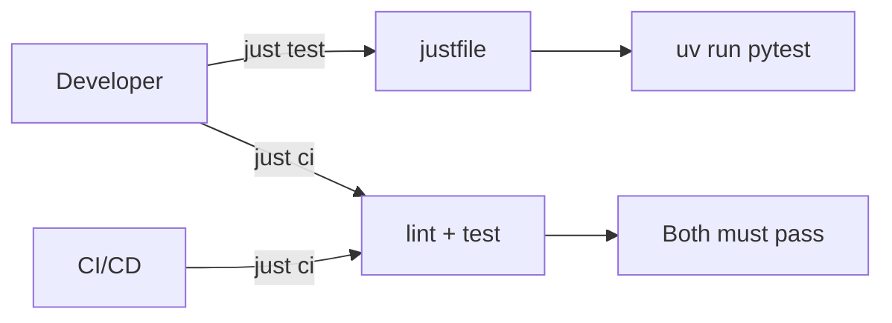

**Interview Q&A:**

*Q: Make tab problem kya hai?* Make recipes me leading char tab MUST hota hai (spaces fail). Bizarre, ancient. just isse free — spaces work. Aaj naya project to just better.

*Q: npm scripts vs make/just?* Node ecosystem — npm/pnpm scripts sufficient. Polyglot projects (Python + frontend + Docker) — make/just at root for cross-language commands.

*Q: Task runners ya bash scripts?* Short tasks — task runner. Complex logic (loops, conditionals) — bash script invoked from runner. `just deploy` → `./scripts/deploy.sh`.

---

## 3. DSA — Just Enough

GenAI engineer ko dimaag-jalaane wala competitive programming nahi chahiye. Lekin token tries, vector search HNSW, attention mechanism samajhne ke liye **fundamentals** zaroor chahiye. Goal: comfortable with hashmaps, trees, graphs, basic DP — itne se 95% kaam ho jaata hai.

### 3.1 Arrays, hashmaps, trees, graphs, heaps

**Definition:** Core data structures. **Array**: contiguous memory, O(1) index. **Hashmap (dict)**: key-value, O(1) avg lookup. **Tree**: hierarchical (binary tree, BST, B-tree). **Graph**: nodes + edges (directed/undirected). **Heap**: priority queue, O(log n) push/pop.

**Why GenAI me?** Hashmap embedding cache, tokenizer vocab, deduplication. Tree — parsing AST, agent action trees. Graph — knowledge graphs (GraphRAG), document linking. Heap — top-k retrieval, beam search.

**How:**

```python
import heapq
from collections import defaultdict, Counter

# Hashmap — embedding cache
class EmbedCache:
    def __init__(self):
        self.cache: dict[str, list[float]] = {}
    
    def get_or_compute(self, text: str, embedder) -> list[float]:
        if text not in self.cache:  # O(1)
            self.cache[text] = embedder.embed(text)
        return self.cache[text]

# Heap — top-k similar documents
def top_k_similar(query_emb, doc_embs: list[tuple[str, list[float]]], k: int):
    """Return k most similar docs by cosine similarity"""
    # Min-heap of size k — efficient for k << n
    heap: list[tuple[float, str]] = []
    for doc_id, emb in doc_embs:
        sim = cosine(query_emb, emb)
        if len(heap) < k:
            heapq.heappush(heap, (sim, doc_id))
        elif sim > heap[0][0]:  # bigger than smallest in heap
            heapq.heapreplace(heap, (sim, doc_id))
    # Sort descending
    return sorted(heap, reverse=True)

# Graph — knowledge graph traversal (BFS)
def bfs_related(graph: dict[str, list[str]], start: str, max_depth: int = 2):
    """Find all nodes within max_depth hops"""
    visited = {start}
    frontier = [(start, 0)]
    result = []
    while frontier:
        node, depth = frontier.pop(0)
        result.append(node)
        if depth < max_depth:
            for neighbor in graph.get(node, []):
                if neighbor not in visited:
                    visited.add(neighbor)
                    frontier.append((neighbor, depth + 1))
    return result

# Tree — agent action tree
class ActionNode:
    def __init__(self, action: str, parent=None):
        self.action = action
        self.parent = parent
        self.children: list[ActionNode] = []
        self.score: float = 0.0

# Counter — token frequency in corpus
def vocab_freq(corpus: list[str]) -> Counter:
    counter = Counter()
    for doc in corpus:
        counter.update(doc.split())
    return counter  # most_common(k) for top tokens
```

**Real-life example:** FAISS, Qdrant — heap for top-k. Neo4j GraphRAG — graph traversal. tiktoken — hashmap vocab. LlamaIndex tree summarize indices.

**Diagram:**

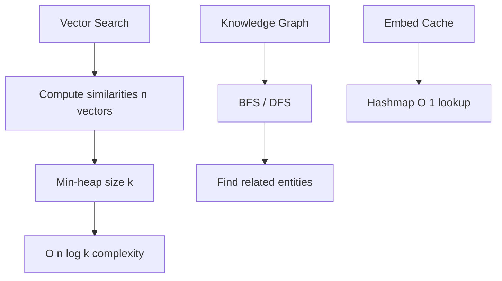

**Interview Q&A:**

*Q: List vs deque — kab kya?* `list.append/pop` O(1) end, but `pop(0)/insert(0)` O(n). `collections.deque` — both ends O(1). BFS me deque chahiye. Streaming buffer me deque.

*Q: dict ordered hai?* Python 3.7+ — insertion order preserved. Pehle nahi tha. `OrderedDict` ab redundant mostly, except `move_to_end()` jaisa method use karna ho.

*Q: Heap max ya min by default?* Python `heapq` min-heap. Max ke liye negate values: `heappush(h, -x)`. Top-k similar (highest first) me min-heap of size k chalata hai (smallest of top-k root pe).

### 3.2 Big-O analysis

**Definition:** Asymptotic complexity — algorithm time/space input size ke saath kaise scale karta hai. O(1), O(log n), O(n), O(n log n), O(n²), O(2ⁿ).

**Why GenAI me?** 1M docs me linear scan kaafi hai? n=1M, n²=10¹² — definitely not. ANN search O(log n) chahiye. Attention O(n²) — long context expensive. Big-O se architectural decisions banti hain.

**How:**

```python
# O(1) — hashmap lookup
emb = cache[text]  # constant time

# O(log n) — binary search, balanced tree
import bisect
idx = bisect.bisect_left(sorted_list, target)

# O(n) — linear scan
for doc in documents:
    if matches(doc, query):
        ...

# O(n log n) — sorting
sorted_docs = sorted(docs, key=lambda d: d.score)

# O(n²) — pairwise comparisons
# All-pairs cosine — DON'T do for large n
for i, a in enumerate(embeddings):
    for j, b in enumerate(embeddings):
        sim_matrix[i][j] = cosine(a, b)
# n=10000 → 10^8 ops, slow

# Better: use np.dot(matrix, matrix.T) — vectorized C code
import numpy as np
sims = embeddings @ embeddings.T  # still O(n^2) but constants 100x smaller

# Attention O(n²) where n = sequence length
# Why long context expensive
# n=8K  → 64M ops
# n=128K → 16B ops  (256x slower)
```

**Big-O cheatsheet for GenAI:**

| Operation | Complexity |
|-----------|-----------|
| Dict lookup | O(1) avg |
| List index | O(1) |
| List search | O(n) |
| Sort | O(n log n) |
| Naive vector search | O(n × d) |
| HNSW search | O(log n × d) |
| Attention (vanilla) | O(n² × d) |
| FlashAttention | O(n² × d) but tiled |

**Diagram:**

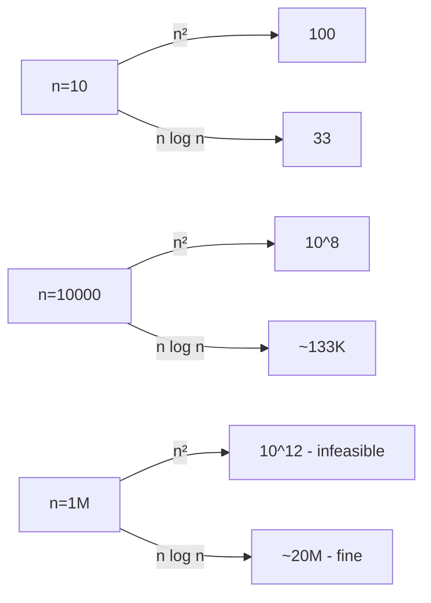

**Interview Q&A:**

*Q: Amortized complexity?* List append O(1) amortized — kabhi resize hota hai O(n) but rarely. Average across many ops — O(1). Hashmap insert similar.

*Q: O(n log n) practically O(n) treat kar sakte ho?* Often haan — log n choti hoti hai (n=1M, log₂n=20). But constants matter. O(n log n) sort generally fast.

*Q: Vanilla attention quadratic kyun problem?* Long context (1M tokens) chahiye — n²=10¹². Solutions: linear attention, sparse attention, sliding window, KV cache + paging (vLLM). Active research area.

### 3.3 Dynamic programming basics

**Definition:** DP — overlapping subproblems + optimal substructure. Memoize/tabulate intermediate results, avoid recomputation. Top-down (recursion + memo) ya bottom-up (iterative table).

**Why GenAI me?** Beam search me partial sequence scores — DP. Edit distance for fuzzy match. CTC/Viterbi in speech models. Diff-based prompt evaluation.

**How:**

```python
from functools import lru_cache

# Top-down — Fibonacci with memoization
@lru_cache(maxsize=None)
def fib(n: int) -> int:
    if n < 2: return n
    return fib(n-1) + fib(n-2)
# Without lru_cache: O(2^n). With: O(n).

# Edit distance (Levenshtein) — used in fuzzy matching
def edit_distance(s1: str, s2: str) -> int:
    m, n = len(s1), len(s2)
    # dp[i][j] = edits to convert s1[:i] to s2[:j]
    dp = [[0]*(n+1) for _ in range(m+1)]
    for i in range(m+1): dp[i][0] = i
    for j in range(n+1): dp[0][j] = j
    for i in range(1, m+1):
        for j in range(1, n+1):
            if s1[i-1] == s2[j-1]:
                dp[i][j] = dp[i-1][j-1]  # match, no cost
            else:
                dp[i][j] = 1 + min(
                    dp[i-1][j],    # delete
                    dp[i][j-1],    # insert
                    dp[i-1][j-1]   # replace
                )
    return dp[m][n]

# Beam search — pick top-k partial sequences
def beam_search(model, start, beam_width=5, max_len=20):
    beams = [(0.0, [start])]  # (log_prob, seq)
    for _ in range(max_len):
        candidates = []
        for log_p, seq in beams:
            next_probs = model.next_token_probs(seq)
            for token, p in next_probs.items():
                candidates.append((log_p + math.log(p), seq + [token]))
        # Keep top beam_width by score
        candidates.sort(reverse=True)
        beams = candidates[:beam_width]
    return beams
```

**Real-life example:** Beam search in HuggingFace `generate()`. RapidFuzz library uses edit distance. Phonetic matching (Soundex) — DP-based.

**Diagram:**

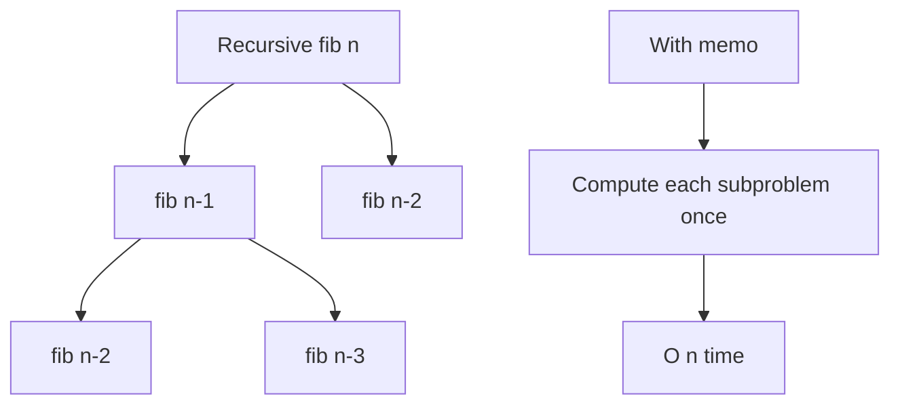

**Interview Q&A:**

*Q: DP vs greedy?* Greedy — local optimal at each step (fast, sometimes wrong). DP — explore subproblems, guaranteed optimal but more compute. Beam search hybrid — DP ka pruned version.

*Q: Top-down vs bottom-up?* Top-down: recursion + memo, intuitive, can be slow due to call overhead. Bottom-up: iterative table fill, faster, less stack risk. Both same complexity usually.

*Q: `lru_cache` vs manual memo?* `lru_cache` decorator — quick, thread-safe, size-bounded (LRU eviction). Manual dict — more control. Default to `lru_cache(maxsize=None)` for unbounded memo.

### 3.4 Trie (used in tokenizers)

**Definition:** Trie (prefix tree) — tree where each path = string. Each node has children dict. Used for prefix search, autocomplete, **BPE tokenization**.

**Why GenAI me?** BPE tokenizer (GPT, Llama) — vocab as trie for fast longest-match. Aho-Corasick (multi-pattern) — extension of trie for content moderation. Spell-check, autocomplete.

**How:**

```python
class TrieNode:
    def __init__(self):
        self.children: dict[str, TrieNode] = {}
        self.is_end = False
        self.token_id: int | None = None

class Trie:
    def __init__(self):
        self.root = TrieNode()
    
    def insert(self, word: str, token_id: int):
        node = self.root
        for ch in word:
            if ch not in node.children:
                node.children[ch] = TrieNode()
            node = node.children[ch]
        node.is_end = True
        node.token_id = token_id
    
    def longest_match(self, text: str, start: int) -> tuple[int, int | None]:
        """Find longest token starting at text[start]. Return (length, token_id)"""
        node = self.root
        last_match = (0, None)
        for i in range(start, len(text)):
            ch = text[i]
            if ch not in node.children:
                break
            node = node.children[ch]
            if node.is_end:
                last_match = (i - start + 1, node.token_id)
        return last_match

# Build tokenizer trie
trie = Trie()
vocab = {"hello": 1, "hell": 2, "world": 3, "he": 4}
for word, tid in vocab.items():
    trie.insert(word, tid)

# Tokenize via greedy longest match
def tokenize(text: str, trie: Trie) -> list[int]:
    tokens = []
    i = 0
    while i < len(text):
        length, token_id = trie.longest_match(text, i)
        if length == 0:
            i += 1  # skip unknown char
            continue
        tokens.append(token_id)
        i += length
    return tokens

# tokenize("hello world") → [1, 3]  (hello, world)
```

**Real-life example:** Hugging Face `tokenizers` library — Rust trie inside. SentencePiece — uses trie for vocab matching. tiktoken — efficient BPE with prefix structures.

**Diagram:**

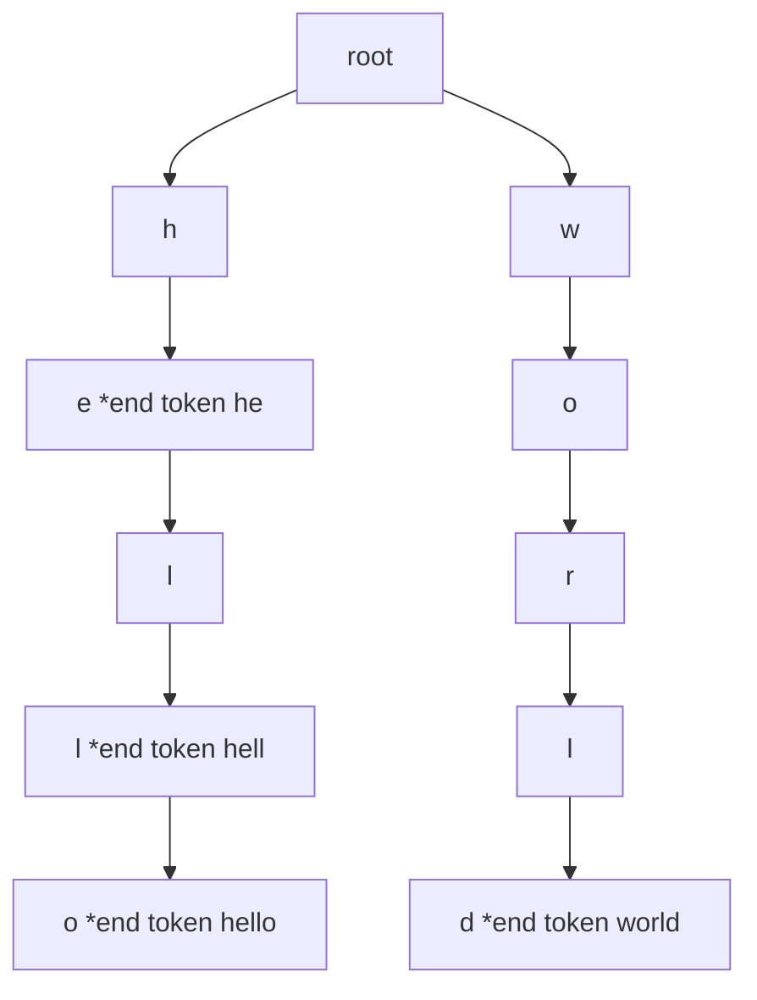

**Interview Q&A:**

*Q: Hashmap vs trie for vocab lookup?* Hashmap O(1) for exact match. Trie O(k) for longest prefix (k = key length). Tokenizers need longest match — trie better. Hashmap also works but trie wins for streaming/incremental.

*Q: Memory usage trie ka?* Naive trie can be sparse (lots of one-child nodes). Compressed trie (radix tree) collapses single-child paths. Production tokenizers use compressed structures.

*Q: BPE algorithm summary?* Start with chars. Find most frequent adjacent pair, merge into new token. Repeat till vocab size reached. Inference time — apply merges greedy via trie. GPT-2/3/4 sab BPE variants.

### 3.5 Approximate Nearest Neighbor — HNSW, IVF

**Definition:** ANN — find approximate nearest vectors fast. Exact search O(n) per query, ANN O(log n). **HNSW** (Hierarchical Navigable Small World) — multi-layer graph. **IVF** (Inverted File) — partition + search subset.

**Why GenAI me?** RAG ka core. 10M documents me query embedding ka top-k chahiye — exact search slow (seconds). HNSW <10ms. Vector DBs (Pinecone, Qdrant, Weaviate) — sab HNSW/IVF combos.

**How:**

```python
import numpy as np
import hnswlib

# HNSW — graph based ANN
dim = 768
num_elements = 100000

# Initialize index
index = hnswlib.Index(space='cosine', dim=dim)
index.init_index(
    max_elements=num_elements,
    ef_construction=200,  # build quality vs speed
    M=16                   # connections per node
)

# Random embeddings
data = np.random.rand(num_elements, dim).astype(np.float32)
ids = np.arange(num_elements)
index.add_items(data, ids)

# Search
index.set_ef(50)  # query-time quality
query = np.random.rand(dim).astype(np.float32)
labels, distances = index.knn_query(query, k=10)
print(labels, distances)

# IVF (with FAISS)
import faiss

nlist = 100  # number of clusters
quantizer = faiss.IndexFlatL2(dim)
ivf_index = faiss.IndexIVFFlat(quantizer, dim, nlist)
ivf_index.train(data)  # k-means cluster
ivf_index.add(data)

ivf_index.nprobe = 10  # search 10 nearest clusters
D, I = ivf_index.search(query.reshape(1, -1), k=10)
```

**HNSW intuition:**

```
Layer 2 (sparse):    A -------- E -------- I
                     |          |          |
Layer 1 (medium):    A -- C --- E --- G -- I
                     |    |     |     |    |
Layer 0 (full):      A-B-C-D-E-F-G-H-I-J-K
```

Query starts at top, greedy descent — log n hops total.

**Real-life example:** Qdrant, Weaviate, Milvus, pgvector (with HNSW) — production vector DBs. OpenAI assistants, Claude RAG — under the hood ANN.

**Diagram:**

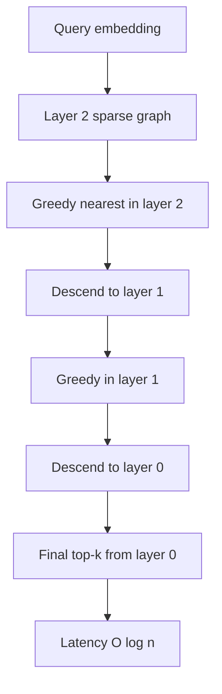

**Interview Q&A:**

*Q: HNSW vs IVF — choose karne ka basis?* HNSW: high recall, low latency, more memory. IVF: less memory, scalable to billions, lower recall typically. Hybrid: IVF-PQ (product quantization) for billion-scale with quantized vectors.

*Q: ef_construction, M, ef parameters?* `M` = max connections per node (16 typical). `ef_construction` = build-time search width (more = better graph, slower build). `ef` = query-time width (more = higher recall, slower query). Tune for your recall/latency tradeoff.

*Q: ANN ka recall kaise measure kare?* Compare with exact search on sample — recall@k = (correct top-k) / k. Production target 0.95+ recall@10 typical for RAG. Lower recall acceptable if reranker downstream.

---

## Resources & further reading

**Advanced Python:**
- *Fluent Python* by Luciano Ramalho (2nd ed) — bible for advanced Python.
- Real Python tutorials — async, decorators, type hints.
- Pydantic v2 docs — `docs.pydantic.dev`.
- Python `typing` module official docs.

**Software Engineering:**
- *Pro Git* book (free online, git-scm.com).
- *The Linux Command Line* by William Shotts (free PDF).
- Docker official tutorials + Play with Docker.
- uv docs (`docs.astral.sh/uv`), Astral blog.
- pytest official docs + *Python Testing with pytest* by Brian Okken.
- ruff docs (`docs.astral.sh/ruff`).

**DSA for AI:**
- *Grokking Algorithms* by Aditya Bhargava (visual, beginner-friendly).
- NeetCode 75/150 (just enough, not 500).
- HNSW paper: Malkov & Yashunin (2018).
- FAISS wiki (Facebook AI) — IVF, PQ, IVF-PQ explanations.
- Tokenizer internals: HuggingFace `tokenizers` blog posts.

**GenAI specific engineering:**
- LangChain Engineering Blog.
- Anthropic engineering blog (caching, structured output).
- Anyscale blog (Ray + LLMs).
- Eugene Yan's blog (`eugeneyan.com`) — applied ML engineering.
- *Designing Machine Learning Systems* by Chip Huyen.

**Practice projects (do these in order):**
1. Build a CLI RAG over your local notes (uv + pydantic + qdrant).
2. Async batch embedder — embed 10K docs in parallel with rate limit.
3. Custom tokenizer with trie — compare with tiktoken speed.
4. Profile + optimize a slow LangChain pipeline (cProfile + memray).
5. Dockerize the whole stack with compose, ship to a cloud VM.

Bas itna kaafi hai shuruaat ke 6 mahine ke liye. Ek-ek subtopic pe ruk, code likh, debug kar, fail kar, phir aage badh. **Programming mastery achievement nahi, journey hai** — har project ke saath ek layer aur clear hota jaata hai. Lage raho.
