# Retrieval-Augmented Generation (RAG)

Dekh bhai, RAG basically LLM ko "open-book exam" deta hai. LLM apne pre-training se nahi, tumhare provided context se answer karta hai — hallucination kam, accuracy zyada. Tu socho ek student exam de raha hai. Closed-book mein wo apni memory pe depend karta hai (yeh hai vanilla LLM). Open-book mein wo textbook khol ke relevant page padh ke answer likhta hai (yeh hai RAG). Difference yeh hai ki RAG mein "textbook" tumhari company ke docs, knowledge base, ya internet se fetched content ho sakta hai.

RAG ke do main phases hain — Retrieval (relevant docs dhundhna) aur Generation (LLM se answer banwana). Pehle user ka query ek embedding model se vector mein convert hota hai, fir vector DB mein similarity search hoti hai, top-k chunks retrieve hote hain, wo chunks LLM ke prompt mein context ke roop mein paste hote hain, aur LLM final answer generate karta hai. Simple lagta hai par production mein 20+ moving parts hote hain — chunking strategy, embedding model choice, reranking, hybrid search, metadata filtering, evaluation metrics, sab kuch tune karna padta hai.

Is guide mein hum embedding fundamentals se lekar GraphRAG aur Agentic RAG tak sab dekhenge. Code examples Python mein honge (sentence-transformers, qdrant, pgvector), aur har subtopic mein interview questions bhi milenge. Chal shuru karte hain.

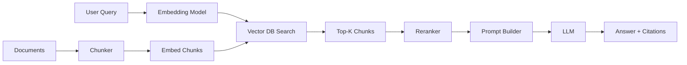

---

## 1. Embedding Models

### 1.1 What embeddings are (geometrically & semantically)

**Definition:** Embedding ek dense vector hai (typically 384, 768, 1024, 1536, 3072 dimensions) jo text ka semantic meaning capture karta hai. Geometrically, similar meaning wale words/sentences high-dimensional space mein paas paas hote hain.

**Why:** Computer text directly samjhta nahi. Tum "king" aur "queen" likhoge, machine ke liye dono random tokens hain. Embedding inhe numbers mein convert karta hai jahan `king - man + woman ≈ queen` jaisa famous arithmetic kaam karta hai. RAG mein hum embedding use karte hain taaki query aur documents ki semantic similarity numerically measure ho sake.

**How:**

```python
from sentence_transformers import SentenceTransformer
import numpy as np

# model load karo — yeh 384-dim vectors deta hai
model = SentenceTransformer('all-MiniLM-L6-v2')

sentences = [
    "Cat is sleeping on the mat",      # billi soyi hai
    "Feline rests on the carpet",       # same meaning, alag words
    "Stock market crashed today"        # totally different topic
]

# embeddings nikaalo — shape: (3, 384)
embeddings = model.encode(sentences)

# cosine similarity calculate karo
def cosine_sim(a, b):
    return np.dot(a, b) / (np.linalg.norm(a) * np.linalg.norm(b))

print(cosine_sim(embeddings[0], embeddings[1]))  # ~0.75 (similar)
print(cosine_sim(embeddings[0], embeddings[2]))  # ~0.05 (unrelated)
```

**Real-life Example:** Spotify ke "Discover Weekly" mein har song ka embedding banta hai. Tu agar 3 lo-fi songs sun raha hai, tumhare "taste vector" ke paas wale embeddings wale songs recommend hote hain. Same logic RAG mein — query ke paas wale doc chunks retrieve karte hain.

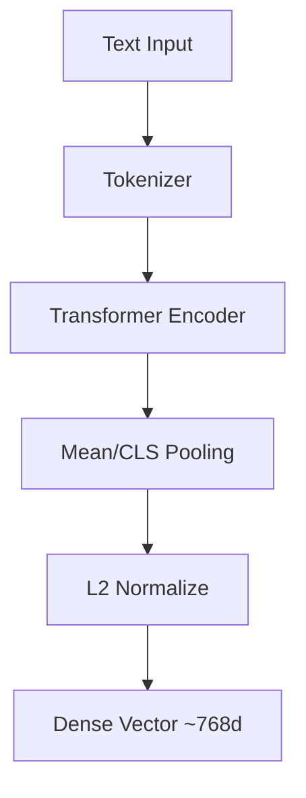

**Interview Q&A:**

*Q: Embedding aur one-hot encoding mein farak kya hai?*
One-hot encoding sparse hai — vocabulary size jitna dimensions, sirf ek 1 baaki sab 0. Yeh semantic relationship capture nahi karta — "cat" aur "kitten" same orthogonal vectors honge. Embeddings dense hote hain (300-3000 dims), continuous values, aur similar concepts close hote hain. RAG ke liye one-hot useless hai kyunki tum semantic search nahi kar sakte — tumhe word-level exact match karna padega.

*Q: Embedding dimensions kitne rakhna chahiye?*
Tradeoff hai. Higher dims (3072 like OpenAI text-embedding-3-large) more nuance capture karte hain par storage, latency, aur cost zyada. Lower dims (384 like MiniLM) fast aur cheap hain par accuracy thodi kam. Production mein typically 768-1024 sweet spot hai. Matryoshka embeddings new approach hai jahan tum same model se variable dims use kar sakte ho.

---

### 1.2 Sentence-Transformers, BGE, E5, Voyage, OpenAI ada

**Definition:** Yeh sab embedding models hain, har ek ki strengths alag hain. Sentence-Transformers library open-source hai aur HuggingFace pe hosted models wrap karti hai. BGE (BAAI General Embedding) Chinese AI lab ka top performer hai. E5 Microsoft ka hai. Voyage commercial API hai (Anthropic-recommended). OpenAI ada/text-embedding-3 closed-source API.

**Why:** Har use case ke liye different model. Multilingual chahiye? E5-multilingual. Code search? VoyageCode-2. Cheap aur fast? bge-small. State-of-the-art retrieval? bge-large-en-v1.5 ya text-embedding-3-large. MTEB leaderboard pe har month rankings update hoti hain.

**How:**

```python
from sentence_transformers import SentenceTransformer
from openai import OpenAI

# Option 1: Open-source BGE (top of MTEB)
bge = SentenceTransformer('BAAI/bge-large-en-v1.5')
# BGE ko query ke liye special prefix chahiye
query_emb = bge.encode("Represent this sentence for searching: kya hai RAG?")
doc_emb = bge.encode("RAG combines retrieval with generation")

# Option 2: E5 — yeh "query:" aur "passage:" prefix use karta hai
e5 = SentenceTransformer('intfloat/e5-large-v2')
q = e5.encode("query: what is photosynthesis")
d = e5.encode("passage: Photosynthesis is the process plants use...")

# Option 3: OpenAI API
client = OpenAI()
resp = client.embeddings.create(
    model="text-embedding-3-large",
    input="RAG kya hota hai?",
    dimensions=1024  # Matryoshka — full 3072 se truncate
)
oai_emb = resp.data[0].embedding
```

**Real-life Example:** Notion AI search mein BGE-base use hota hai (rumored). Cursor IDE code search ke liye Voyage-code-2 use karta hai. ChatGPT memory feature OpenAI ada-002/text-embedding-3 use karta hai apne hi ecosystem mein.

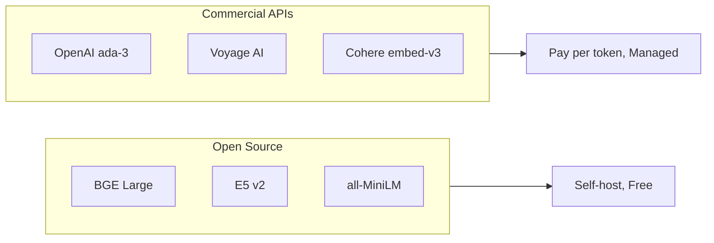

**Interview Q&A:**

*Q: BGE aur OpenAI ada-002 mein kaun better hai?*
MTEB benchmark pe BGE-large-en-v1.5 (1024 dim) often beat karta hai ada-002 (1536 dim) ko, especially retrieval tasks pe. Lekin text-embedding-3-large OpenAI ka latest hai aur woh BGE ke comparable hai. Cost factor — BGE self-hosted free hai but GPU chahiye, OpenAI per-token charge karta hai (~$0.13/1M tokens for ada-3-large). Production mein latency aur control ke liye self-hosted, ease ke liye API.

*Q: Why do E5 and BGE need prefixes like "query:" or "passage:"?*
Yeh asymmetric retrieval ke liye trained hain. Query short hota hai, document long. Same encoder use karne par dono ke vectors slightly different distribution mein aate hain. Prefix model ko hint deta hai "yeh query mode hai" vs "yeh document mode hai". Without prefix, retrieval quality 5-10% drop ho sakti hai. Sentence-Transformers v3 ke saath yeh automatically handle ho jata hai if you use the right encode method.

---

### 1.3 Matryoshka embeddings

**Definition:** Matryoshka Representation Learning (MRL) — Russian nesting doll ki tarah ek hi embedding ke prefix bhi valid embedding hote hain. 3072-dim vector se tu pehle 256 dims le, woh bhi ek complete embedding hai jiski quality acceptable hai.

**Why:** Storage aur latency optimize karne ke liye. Tu 1B vectors store kar raha hai 1536 dim mein — yeh 6TB hai. Matryoshka se tu first 256 dims store karke approximate search kar sakta hai (1TB), aur top candidates pe full 1536 dim se rerank kar sakta hai. Adaptive retrieval.

**How:**

```python
from openai import OpenAI
import numpy as np

client = OpenAI()

# text-embedding-3 Matryoshka-trained hai
def embed(text, dim=1536):
    resp = client.embeddings.create(
        model="text-embedding-3-large",
        input=text,
        dimensions=dim  # truncate to this size
    )
    return np.array(resp.data[0].embedding)

# Two-stage retrieval — pehle short embedding se candidates, fir full se rerank
short_q = embed("RAG kya hai?", dim=256)
full_q = embed("RAG kya hai?", dim=1536)

# Stage 1: short embedding pe sare 1M docs scan karo (fast)
# Stage 2: top 100 candidates ko full embedding se rerank
# Result: 6x speedup with <1% recall loss
```

**Real-life Example:** Pinecone aur Qdrant dono Matryoshka support karte hain ab. Shopify product search mein yeh use hota hai — pehle 128-dim se 100M products narrow karo to 1000, fir 1024-dim se top 10 nikaalo. End-user latency 50ms se 8ms ho gaya.

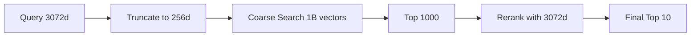

**Interview Q&A:**

*Q: Matryoshka quality loss kitna hota hai?*
text-embedding-3-large pe paper mein dikhaya hai ki 256 dim pe MTEB score ~62 hai vs 64.6 at 3072 dim. 4% relative drop for 12x compression — bahut acha tradeoff. Lekin domain-specific tasks pe yeh vary kar sakta hai. Always benchmark karo apne data pe.

*Q: Kya har embedding model Matryoshka hai?*
Nahi. Matryoshka special training objective requires — multiple nested prefix lengths pe simultaneous loss optimize karna padta hai. OpenAI text-embedding-3, Nomic-embed, JinaAI v3, mxbai-embed-large yeh sab Matryoshka-trained hain. Old models like ada-002 ya original sentence-transformers mein truncate karoge to quality drastically gir jayegi.

---

### 1.4 Domain-specific fine-tuning of embeddings

**Definition:** Pretrained embedding model ko apne domain ke data pe further train karna — legal docs, medical records, code, ya company-internal jargon. Triplet loss ya contrastive loss use hoti hai.

**Why:** General models like BGE Wikipedia/Common Crawl pe trained hain. Tumhara domain ho sakta hai pharmaceutical research jahan "MAB" matlab "monoclonal antibody" — general model "MAB" ko shayad confuse kare. Fine-tuning se 10-20% recall improvement aaram se.

**How:**

```python
from sentence_transformers import SentenceTransformer, losses, InputExample
from torch.utils.data import DataLoader

# base model load karo
model = SentenceTransformer('BAAI/bge-base-en-v1.5')

# triplet data: (anchor, positive, negative)
# positive = relevant doc, negative = irrelevant doc
train_examples = [
    InputExample(texts=[
        "patient diabetes management",
        "HbA1c monitoring protocol for type-2",   # positive
        "stock market analysis Q3"                 # negative
    ]),
    # ... thousands of triplets from your domain
]

train_loader = DataLoader(train_examples, batch_size=16, shuffle=True)
loss = losses.TripletLoss(model=model)

# fine-tune — usually 1-3 epochs enough hain
model.fit(
    train_objectives=[(train_loader, loss)],
    epochs=2,
    warmup_steps=100,
    output_path='./bge-medical-finetuned'
)
```

**Real-life Example:** Bloomberg ka BloombergGPT ke saath custom embedding model aata hai jo financial jargon ("EBITDA", "Q-on-Q") perfectly samjhta hai. GitHub Copilot ka internal embedding model code search ke liye fine-tuned hai — function names, variable patterns ke liye optimized.

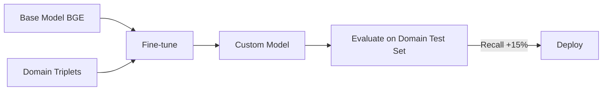

**Interview Q&A:**

*Q: Kab fine-tune karna chahiye vs base model use karna chahiye?*
Pehle hamesha base model evaluate karo apne domain test set pe. Agar Recall@10 acceptable hai (>80%), don't bother. Fine-tune tab karo jab — (1) domain-specific terminology bahut hai, (2) base model recall <70% hai, (3) tumhare paas labeled query-doc pairs hain (at least 1k), (4) latency budget allow karta hai self-hosting. Otherwise reranking add karna easier wins deta hai.

*Q: Fine-tuning mein catastrophic forgetting kaise avoid karein?*
Low learning rate (2e-5), few epochs (1-3), aur warmup steps use karo. Better approach — LoRA (Low-Rank Adaptation) embedding model pe. Sirf small adapter layers train hote hain, base weights frozen. Memory aur compute kam, aur original general capability preserve rehti hai. Sentence-Transformers v3 mein LoRA support built-in hai.

---

### 1.5 Cosine, dot product, Euclidean — when each

**Definition:** Three similarity metrics. Cosine = angle between vectors (magnitude ignore). Dot product = cosine × magnitudes. Euclidean = straight-line distance.

**Why:** Embedding model kis metric ke liye trained hua hai, wahi use karna padta hai. Mismatched metric se quality 30%+ drop ho sakti hai.

**How:**

```python
import numpy as np

a = np.array([1, 2, 3])
b = np.array([2, 4, 6])

# Cosine — magnitude-invariant
cos = np.dot(a, b) / (np.linalg.norm(a) * np.linalg.norm(b))
# = 1.0 (same direction, different magnitude)

# Dot product — magnitude matters
dot = np.dot(a, b)  # = 28

# Euclidean distance — lower is closer
euc = np.linalg.norm(a - b)  # = 3.74

# IMPORTANT: agar embeddings L2-normalized hain (unit vectors),
# toh dot product == cosine similarity. Most modern models
# normalize karte hain — Qdrant, Pinecone default cosine.
```

**Real-life Example:** OpenAI ada-002 normalized embeddings deta hai, so dot product == cosine. Lekin original BERT [CLS] vectors normalized nahi hote — wahan cosine zaroori hai. Some models (ColBERT) MaxSim use karte hain jo Euclidean variant hai.

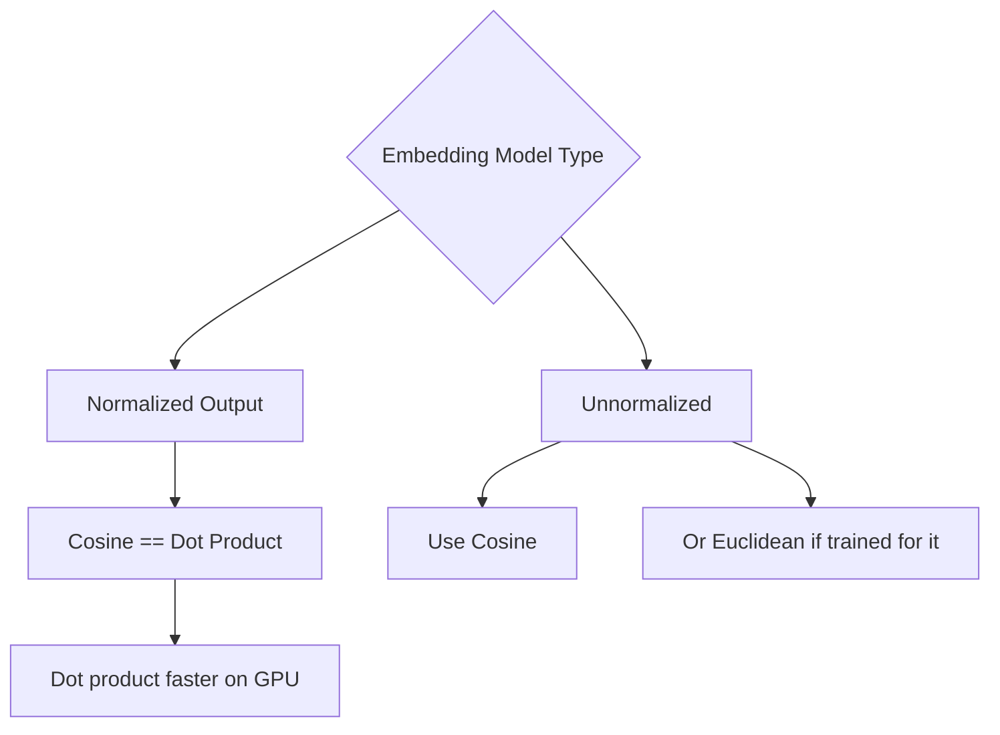

**Interview Q&A:**

*Q: Cosine similarity vs dot product mein performance difference hota hai?*
Computationally dot product faster hai — sirf multiplication aur sum. Cosine extra normalization karta hai (two sqrt operations). Agar tumhare embeddings already normalized hain (modern sentence-transformers default), toh dot product use karo — 2-3x speedup mil sakti hai vector DB mein. Pinecone, Qdrant, Milvus sab "dot" metric expose karte hain jo precomputed normalized vectors pe cosine ke equivalent hai.

*Q: Euclidean kab use karna chahiye?*
Jab embedding model specifically Euclidean ke liye trained ho — for example, FaceNet (face embeddings) Euclidean optimize karta hai. Text embeddings ke liye almost always cosine/dot. Euclidean magnitude ke saath sensitive hota hai, so unnormalized vectors pe weird results aa sakte hain — long documents ke vectors ki magnitude bigger hoti hai, toh wo "farther" lagte hain even if semantically close.

---

## 2. Vector Databases

### 2.1 HNSW, IVF, ScaNN — ANN deep dive

**Definition:** Exact nearest-neighbor search 1B vectors mein O(N) hai — bahut slow. Approximate Nearest Neighbor (ANN) algorithms log(N) ya kam mein top-k dete hain with small recall loss. Three big algorithms — HNSW (graph-based), IVF (cluster-based), ScaNN (Google's quantization-based).

**Why:** Tum ChatGPT-scale RAG bana rahe ho — 100M chunks. Brute force search per query 5 seconds lagega. ANN se 50ms tak. Recall 95-99% maintain.

**How:**

```python
import hnswlib
import numpy as np

# HNSW index banao
dim = 768
num_elements = 100_000

p = hnswlib.Index(space='cosine', dim=dim)
p.init_index(
    max_elements=num_elements,
    ef_construction=200,  # higher = better recall, slower build
    M=16                  # connections per node — typical 16-48
)

# random vectors insert karo (production mein real embeddings)
data = np.random.rand(num_elements, dim).astype('float32')
p.add_items(data)

# search time pe ef parameter — recall vs latency knob
p.set_ef(50)  # higher ef = more recall, slower

query = np.random.rand(dim).astype('float32')
labels, distances = p.knn_query(query, k=10)
print(f"Top 10 neighbors: {labels[0]}")
```

**Real-life Example:** Pinecone internally HNSW + custom optimizations use karta hai. Qdrant pure HNSW. Milvus mein IVF_PQ aur HNSW dono. ScaNN Google ka library hai — YouTube recommendations aur Google Search uses it for billions of vectors.

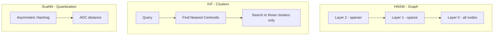

**Interview Q&A:**

*Q: HNSW vs IVF — kab kya use karein?*
HNSW high recall (>95%) at low latency for moderate scale (up to 100M vectors). Memory hungry — full graph RAM mein. IVF more memory-efficient, scales to billions, but recall thoda kam aur tuning tricky (nlist, nprobe). Production mein typically — under 10M vectors HNSW, over 100M IVF_PQ (with product quantization). Pinecone abstract karta hai yeh choices.

*Q: ScaNN kya special karta hai?*
Google's ScaNN combines IVF (coarse quantization) with anisotropic vector quantization. Yeh angle-aware quantization karta hai — vectors jo dot product ke liye matter karte hain, unhe better preserve karta hai. Typical setup mein ScaNN HNSW se 2-4x faster at same recall, but less ecosystem support. TensorFlow integration hai. Indian startups mein adoption kam, US bigtech mein common.

---

### 2.2 Pinecone, Weaviate, Qdrant, Milvus, Chroma, pgvector, LanceDB

**Definition:** Vector databases jo embeddings store karte hain aur ANN search expose karte hain. Har ek ki strengths different.

**Why:** RAG ka backbone yahi hai. Choose karte time consider karo — managed vs self-hosted, scale, hybrid search support, metadata filtering, cost.

**How:**

```python
# Option 1: Qdrant (open-source, Rust-based, fast)
from qdrant_client import QdrantClient
from qdrant_client.models import VectorParams, Distance, PointStruct

client = QdrantClient("localhost", port=6333)
client.create_collection(
    collection_name="docs",
    vectors_config=VectorParams(size=768, distance=Distance.COSINE)
)
client.upsert(
    collection_name="docs",
    points=[
        PointStruct(id=1, vector=[0.1]*768, payload={"text": "RAG kya hai", "source": "blog"}),
    ]
)
results = client.search(collection_name="docs", query_vector=[0.1]*768, limit=5)

# Option 2: pgvector (Postgres extension — easy if you're already on PG)
import psycopg2
conn = psycopg2.connect("dbname=mydb")
cur = conn.cursor()
cur.execute("CREATE EXTENSION IF NOT EXISTS vector")
cur.execute("CREATE TABLE items (id bigserial PRIMARY KEY, content text, embedding vector(768))")
cur.execute("INSERT INTO items (content, embedding) VALUES (%s, %s)", ("RAG", [0.1]*768))
# similarity search
cur.execute("SELECT content FROM items ORDER BY embedding <=> %s LIMIT 5", ([0.1]*768,))

# Option 3: Chroma (local, dev-friendly)
import chromadb
client = chromadb.Client()
collection = client.create_collection("docs")
collection.add(documents=["RAG is..."], ids=["doc1"], embeddings=[[0.1]*768])
```

**Real-life Example:** Anthropic apne products mein Pinecone use karta hai (rumored). Notion AI Turbopuffer (custom S3-based). Perplexity uses a mix — Pinecone + custom. Indian startups mostly Qdrant ya pgvector pe hain (cost-effective). Y Combinator startups Chroma se start karte hain MVP ke liye.

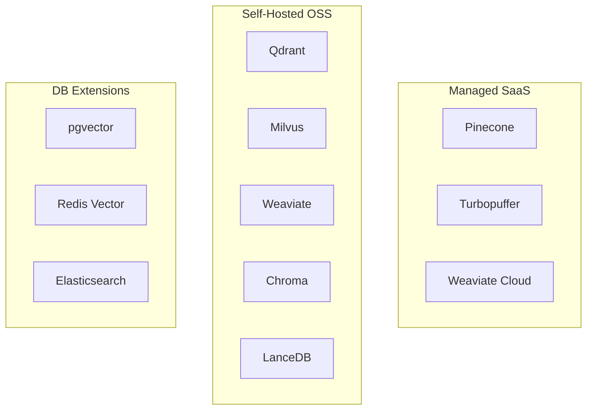

**Interview Q&A:**

*Q: pgvector vs dedicated vector DB — kya farak hai?*
pgvector simple use cases ke liye amazing — already Postgres use kar raha hai, ek extension install karo, done. SQL joins ke saath vector search kar sakte ho. Lekin scale issues — 10M+ vectors pe HNSW build slow, memory bottleneck. Dedicated DBs (Qdrant, Milvus) optimized hain — sharding, replication, faster ANN. Rule of thumb — under 5M vectors aur Postgres user ho, pgvector. Otherwise Qdrant.

*Q: Pinecone serverless vs pods — kya difference?*
Pods classic offering — fixed compute allocate karte ho, predictable performance, expensive at idle. Serverless 2024 mein launch hua — pay per query, S3-like storage separation se 50x cheaper for sporadic workloads. Trade-off — cold start latency (first query slow), aur some advanced features unavailable. Production high-QPS apps still use pods, MVPs and low-traffic apps use serverless.

---

### 2.3 Recall vs latency vs memory tradeoffs

**Definition:** ANN ka core trilemma. Tum tinon simultaneously max nahi kar sakte. Recall = % of true top-k retrieved. Latency = query response time. Memory = RAM usage.

**Why:** Production mein har use case ka different priority. Search engine — latency critical. Research tool — recall critical. Mobile app — memory critical. Knobs samajhna padega.

**How:**

```python
# HNSW tuning example
import hnswlib

# Scenario A: max recall, ok latency
index_a = hnswlib.Index(space='cosine', dim=768)
index_a.init_index(max_elements=1_000_000, ef_construction=400, M=48)
# ef_construction high = better graph = high recall
# M high = more connections = high recall, more memory

# Scenario B: low latency, ok recall
index_b = hnswlib.Index(space='cosine', dim=768)
index_b.init_index(max_elements=1_000_000, ef_construction=100, M=8)
index_b.set_ef(20)  # search ef low = fast but lower recall

# Scenario C: low memory (use Product Quantization)
# IVF + PQ approach — Faiss
import faiss
quantizer = faiss.IndexFlatL2(768)
index_c = faiss.IndexIVFPQ(quantizer, 768, nlist=1024, m=64, nbits=8)
# m=64 sub-vectors, nbits=8 per sub — 64 bytes per vector
# vs 768*4=3072 bytes original — 48x memory saving
```

**Real-life Example:** Google search ek vector ka 2KB se 64 bytes tak compress karta hai using PQ. Recall 92% maintain karte hain. Spotify ke recommendation system mein 4-bit quantization use hota hai with 99% recall — millions of songs in <1GB RAM.

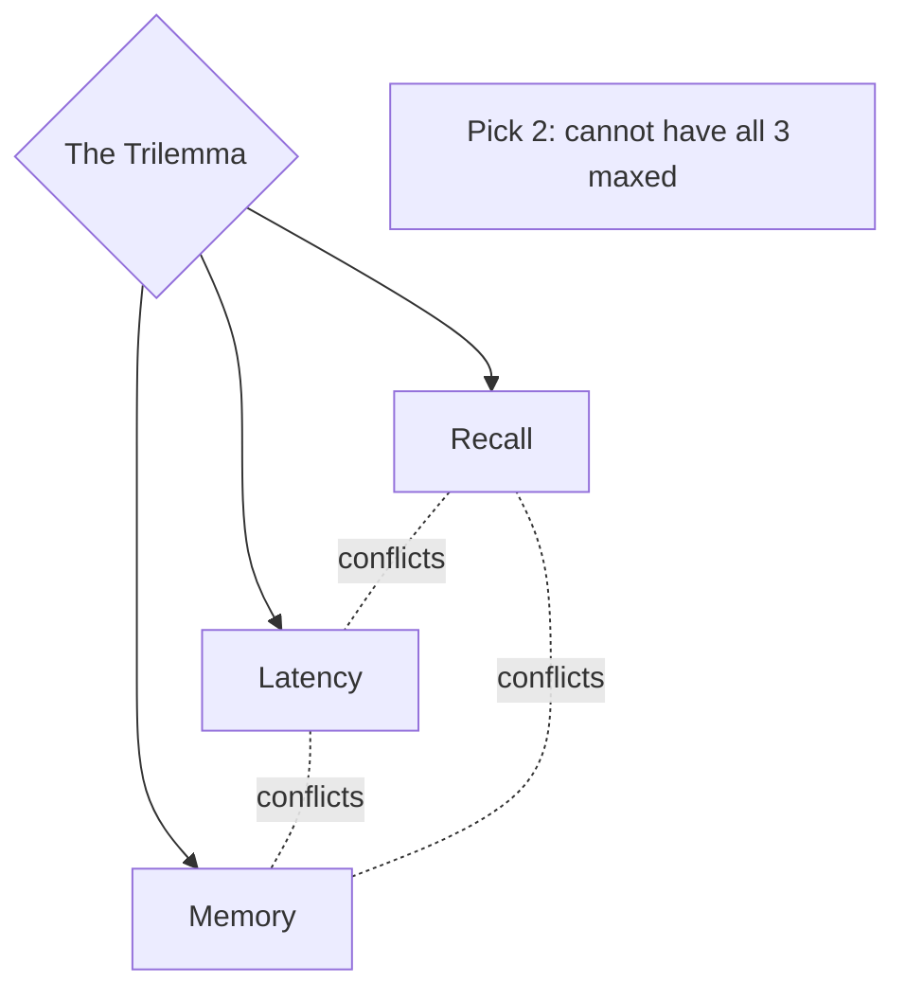

**Interview Q&A:**

*Q: Recall@10 ka matlab kya hai?*
Top-10 retrieved results mein se kitne actually true top-10 hain (vs brute force ground truth). Agar tumhara ANN 10 results return karta hai aur unme se 9 brute-force ke top-10 mein hain, Recall@10 = 0.9. Production benchmark mein hum 95%+ aim karte hain. Below 90% means user ko relevant docs miss ho rahe hain regularly.

*Q: Memory bachane ke liye kya techniques hain?*
(1) Product Quantization (PQ) — vectors ko sub-vectors mein todo, har ek ko 8-bit codebook se replace karo. 32x compression typical. (2) Scalar Quantization — float32 ko int8 ya binary mein convert. 4x-32x. (3) Matryoshka truncation — 1536 dim ko 256 dim. 6x. (4) Disk-based indexes (Vamana, DiskANN) — RAM ke bajay SSD pe. Slower but cheaper. Production mein typically combine karte hain.

---

### 2.4 Hybrid search (vector + BM25)

**Definition:** Vector search semantic similarity dhundhta hai. BM25 keyword/lexical matching karta hai (TF-IDF ka improved version). Hybrid search dono ko combine karta hai — best of both worlds.

**Why:** Vector search "approximate" hota hai — exact terms miss kar sakta hai. User query "GPT-4 turbo pricing" ke liye vector search "GPT-4 cost" return karega, but exact "GPT-4 turbo" mention wala doc rank kam ho sakta hai. BM25 exact match karta hai. Hybrid mein dono mil ke 10-20% recall boost dete hain.

**How:**

```python
from qdrant_client import QdrantClient
from qdrant_client.models import (
    SparseVectorParams, VectorParams, Distance,
    Prefetch, Fusion, FusionQuery, NamedVector
)

client = QdrantClient("localhost", port=6333)

# collection with both dense and sparse vectors
client.create_collection(
    collection_name="hybrid_docs",
    vectors_config={"dense": VectorParams(size=768, distance=Distance.COSINE)},
    sparse_vectors_config={"sparse": SparseVectorParams()}
)

# query — RRF (Reciprocal Rank Fusion) se combine
results = client.query_points(
    collection_name="hybrid_docs",
    prefetch=[
        Prefetch(query=dense_vec, using="dense", limit=20),    # semantic top-20
        Prefetch(query=sparse_vec, using="sparse", limit=20),  # BM25 top-20
    ],
    query=FusionQuery(fusion=Fusion.RRF),  # combine using RRF
    limit=10
)
```

**Real-life Example:** Elasticsearch 8.x mein hybrid search built-in hai. Notion search hybrid use karta hai — code blocks ke liye exact match needed, prose ke liye semantic. Stack Overflow ka 2024 search redesign hybrid pe based hai — error messages exact match karte hain, conceptual questions semantic.

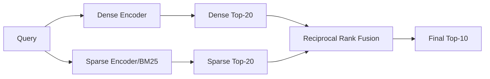

**Interview Q&A:**

*Q: RRF kaise kaam karta hai?*
Reciprocal Rank Fusion. Har list mein doc ki rank ka reciprocal lo (1/rank), fir lists across sum karo. Doc A dense list mein rank 2, sparse mein rank 5 ho — score = 1/2 + 1/5 = 0.7. Simple, no tuning required, no need to normalize scores across systems. Most production hybrid systems isko default use karte hain. Alternative — weighted linear combination (alpha * dense + (1-alpha) * sparse), but alpha tune karna padta hai.

*Q: SPLADE kya hai aur hybrid mein kahan fit hota hai?*
SPLADE learned sparse retrieval hai. BM25 manual term weights use karta hai (TF, IDF). SPLADE neural network se sparse vectors banata hai — har dimension ek vocabulary word, value learned weight. BM25 se 5-15% better recall pe but slower. Hybrid setup mein dense + SPLADE = state-of-the-art. Cohere aur Elastic dono SPLADE-style models offer karte hain.

---

### 2.5 Metadata filtering

**Definition:** Vector search ke saath structured filters lagana — `category = "legal" AND year > 2023`. Pre-filter (filter pehle, then search) ya post-filter (search then filter).

**Why:** Production mein har query whole knowledge base pe nahi hoti. User-specific docs, tenant isolation, time-range queries, language filters — yeh sab metadata filter se hote hain. Without it, security issues bhi (cross-tenant leak).

**How:**

```python
from qdrant_client import QdrantClient
from qdrant_client.models import Filter, FieldCondition, MatchValue, Range

client = QdrantClient("localhost", port=6333)

# search with filter
results = client.search(
    collection_name="docs",
    query_vector=query_emb,
    query_filter=Filter(
        must=[
            FieldCondition(key="tenant_id", match=MatchValue(value="acme_corp")),
            FieldCondition(key="lang", match=MatchValue(value="en")),
            FieldCondition(key="created_at", range=Range(gte=1704067200))  # 2024+
        ]
    ),
    limit=10
)

# pgvector equivalent
"""
SELECT content FROM docs
WHERE tenant_id = 'acme_corp' AND lang = 'en' AND created_at > '2024-01-01'
ORDER BY embedding <=> $1
LIMIT 10
"""
```

**Real-life Example:** Multi-tenant SaaS RAG (jaise Glean, Slack AI) har query mein `tenant_id` filter zaroori hai — warna ek company ka data dusri ko leak hoga. Notion AI page-level permissions check karta hai retrieval time pe via metadata filter. Legal AI tools (Harvey) jurisdiction filter karte hain — Indian law query se US case law nahi aana chahiye.

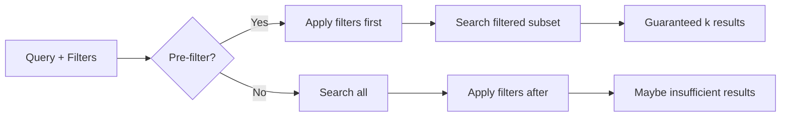

**Interview Q&A:**

*Q: Pre-filter vs post-filter — kab kya?*
Pre-filter (filter first, then search filtered subset) — accurate, guaranteed k results, but slower if filter cardinality high. Post-filter (search top-K, then filter) — fast but might return <k after filter, ya recall issues. Modern vector DBs like Qdrant intelligent — agar filter selective hai (low cardinality), pre-filter karte hain. Otherwise hybrid approach with payload index. Pinecone metadata filters by default pre-filter.

*Q: Metadata filtering mein scale issues kya hote hain?*
High cardinality filters slow ho sakte hain — tenant_id mein 1M unique values, har ek ke index entries chahiye. Range queries on timestamps especially expensive. Solution — payload indexing (Qdrant), inverted index on metadata fields. Aur over-filtering avoid — agar filter combination bahut tight hai, ANN search degrade hota hai (graph traversal mein matching nodes nahi milte). Best practice — main filters indexed rakho, rare filters post-filter.

---

## 3. RAG Pipeline Components

### 3.1 Document loaders (PDF, HTML, code, DOCX)

**Definition:** Raw files ko text mein convert karna. Har format ka apna parser — PDFs sabse painful, HTML mein tags strip karna, code mein syntax preserve karna.

**Why:** Garbage in, garbage out. Agar PDF parse hi galat ho — table broken, footers mixed with content, multi-column ka order galat — RAG ki accuracy 30% se zyada drop ho jati hai.

**How:**

```python
# PDF — modern approach with PyMuPDF + structure preservation
import fitz  # PyMuPDF
doc = fitz.open("annual_report.pdf")
for page in doc:
    text = page.get_text("text")  # plain text
    # advanced: blocks for layout
    blocks = page.get_text("dict")["blocks"]
    # tables ke liye separate
    tables = page.find_tables()

# Better: Unstructured.io for any format
from unstructured.partition.auto import partition
elements = partition(filename="report.pdf")
# yeh returns list of Title, NarrativeText, Table, ListItem, etc.
for el in elements:
    print(type(el).__name__, el.text[:100])

# HTML — BeautifulSoup + readability
from bs4 import BeautifulSoup
import requests
html = requests.get("https://example.com/article").text
soup = BeautifulSoup(html, "html.parser")
# script, style, nav remove karo
for tag in soup(["script", "style", "nav", "footer"]):
    tag.decompose()
clean_text = soup.get_text(separator="\n", strip=True)

# Code — language-aware splitter
from langchain.text_splitter import RecursiveCharacterTextSplitter, Language
py_splitter = RecursiveCharacterTextSplitter.from_language(
    language=Language.PYTHON, chunk_size=1000, chunk_overlap=100
)
chunks = py_splitter.split_text(open("main.py").read())

# DOCX
from docx import Document
doc = Document("contract.docx")
text = "\n".join([p.text for p in doc.paragraphs])
```

**Real-life Example:** Harvey (legal AI) PDFs ke liye custom parser use karta hai — clauses, exhibits, signatures separately tag karte hain. Cursor IDE code parsing tree-sitter use karta hai (AST-aware) so functions chunk boundaries respect karte hain. Khan Academy AI tutor textbook PDFs Mathpix se parse karta hai (math equations preserve).

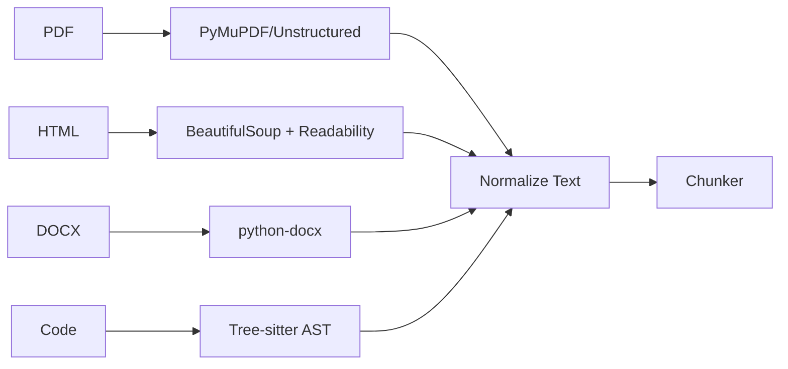

**Interview Q&A:**

*Q: PDF parsing mein common pitfalls kya hain?*
(1) Multi-column layout — naive parsers left-to-right read karte hain, columns mix ho jate hain. (2) Tables — text extract hota hai but rows/cols ka structure khoye. (3) Headers/footers repeating har page pe context pollute karte hain. (4) Scanned PDFs — OCR chahiye (Tesseract, Mathpix, AWS Textract). (5) Embedded fonts — kabhi kabhi text extract hi nahi hota. Production mein layout-aware tools — Unstructured, LlamaParse, Reducto, AWS Textract.

*Q: Code chunking mein kya special hota hai?*
Plain character-based split function ko beech mein todh sakta hai — useless chunk. Solution — AST/tree-sitter use karke function/class boundaries pe split. Imports preserve karo har chunk mein context ke liye. Comments retain — wo semantic clue dete hain. CodeBERT ya specialized code embeddings (Voyage-code-2, jina-embeddings-v2-code) use karo. GitHub Copilot ke retrieval mein yeh sab hota hai.

---

### 3.2 Chunking strategies (fixed, recursive, semantic, agentic)

**Definition:** Document ko smaller pieces mein todna so embeddings generate ho saken aur LLM context window mein fit ho. Chunking strategy RAG quality ka biggest single factor hai.

**Why:** Bahut bada chunk = noise, embedding diluted, retrieval imprecise. Bahut chota chunk = context lost, "John was born in 1990" alag chunk, "He is an engineer" alag chunk — connection break. Sweet spot dhundna padta hai.

**How:**

```python
from langchain.text_splitter import (
    CharacterTextSplitter,
    RecursiveCharacterTextSplitter,
    TokenTextSplitter
)

text = open("doc.txt").read()

# 1. Fixed-size — simplest
fixed = CharacterTextSplitter(chunk_size=500, chunk_overlap=50)
chunks_1 = fixed.split_text(text)

# 2. Recursive — try paragraph -> sentence -> word
recursive = RecursiveCharacterTextSplitter(
    chunk_size=500,
    chunk_overlap=50,
    separators=["\n\n", "\n", ". ", " ", ""]  # priority order
)
chunks_2 = recursive.split_text(text)

# 3. Semantic — embedding similarity ke base pe split
from langchain_experimental.text_splitter import SemanticChunker
from langchain_openai import OpenAIEmbeddings
sem = SemanticChunker(OpenAIEmbeddings(), breakpoint_threshold_type="percentile")
chunks_3 = sem.split_text(text)

# 4. Agentic — LLM se khud decide karwao
from openai import OpenAI
client = OpenAI()
def agentic_chunk(text):
    resp = client.chat.completions.create(
        model="gpt-4o-mini",
        messages=[{
            "role": "user",
            "content": f"Split this text into self-contained semantic chunks. Each chunk should be a complete idea. Return JSON list.\n\n{text}"
        }],
        response_format={"type": "json_object"}
    )
    return resp.choices[0].message.content
```

**Real-life Example:** Anthropic ka "Contextual Retrieval" (2024) — har chunk ke saath LLM-generated context summary prepend karte hain. Recall 49% improve hua. Notion AI semantic chunking use karta hai — page sections naturally chunk boundaries banti hain. ChatGPT Custom GPTs default fixed chunking (800 tokens) use karta hai.

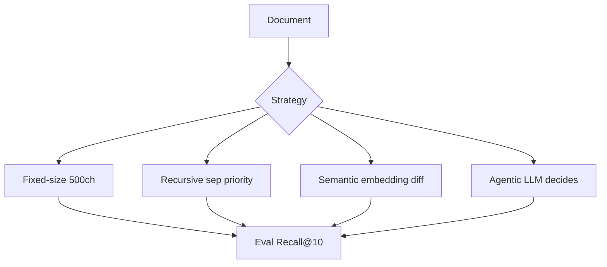

**Interview Q&A:**

*Q: Optimal chunk size kya hai?*
No universal answer — depends on data and use case. General guidelines — short factual QA (FAQs, definitions): 200-400 tokens. Long-form articles: 500-800 tokens. Code: function-level (varies). Always benchmark on your eval set. Overlap typically 10-20% of chunk size — context boundary issues mitigate karta hai. With long-context LLMs (Claude 200k, GPT-4 128k), thodi badi chunks affordable.

*Q: Semantic chunking expensive hota hai — kab use karein?*
Yes, embedding calls per sentence costly hain. Use kab — (1) high-quality docs jahan precision critical hai (legal, medical), (2) one-time ingestion (rebuild rare), (3) document structure unpredictable hai. Don't use — high-volume ingestion pipelines (millions of docs daily), tight cost budget. Hybrid approach — recursive splitter for bulk, semantic for premium customer docs.

---

### 3.3 Parent-child / small-to-big retrieval

**Definition:** Embed small chunks (precise retrieval) but return larger parent chunks (more context to LLM). Retrieve on small, generate with big.

**Why:** Small chunks (200 tokens) ka embedding precise hota hai — specific sentence match karta hai. But LLM ko sirf 200 tokens dena ridiculous hai — context phat jata hai. So small chunk match karke uska parent (1000-token section) LLM ko bhejo.

**How:**

```python
from langchain.retrievers import ParentDocumentRetriever
from langchain.storage import InMemoryStore
from langchain_chroma import Chroma
from langchain.text_splitter import RecursiveCharacterTextSplitter
from langchain_openai import OpenAIEmbeddings

# parent splitter — bigger chunks for LLM
parent_splitter = RecursiveCharacterTextSplitter(chunk_size=2000)
# child splitter — smaller for embedding
child_splitter = RecursiveCharacterTextSplitter(chunk_size=400)

vectorstore = Chroma(embedding_function=OpenAIEmbeddings())
store = InMemoryStore()  # parent docs yahan

retriever = ParentDocumentRetriever(
    vectorstore=vectorstore,
    docstore=store,
    child_splitter=child_splitter,
    parent_splitter=parent_splitter,
)

retriever.add_documents(docs)
# retrieve — small chunks pe match, parent return hota hai
results = retriever.invoke("What is photosynthesis?")
# results in 2000-token parent chunks, but matched on 400-token children
```

**Real-life Example:** LlamaIndex ka "AutoMergingRetriever" same idea ka extension — agar multiple children same parent ke match hote hain, parent merge karo. Cursor IDE code retrieval mein function-level matching, but file-level context return — AI ko function ka usage context milta hai.

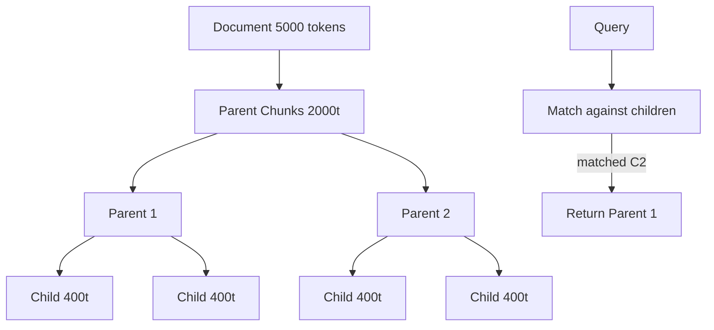

**Interview Q&A:**

*Q: Parent-child retrieval kab use karna chahiye?*
Long-form documents jahan information dispersed hai — research papers, legal contracts, technical manuals. Specific term match karna important but isolated sentence se LLM full picture nahi banata. Don't use — short FAQs (already concise), structured data (rows/cells already discrete). Implementation cost — 2x storage (small chunks indexed, parents stored separately).

*Q: Small-to-big aur hierarchical retrieval mein farak?*
Small-to-big two levels (child, parent). Hierarchical multi-level — paragraph -> section -> chapter -> document. RAPTOR (Tree-organized retrieval) is hierarchical with LLM-generated summaries at each level. Higher abstraction queries top-level pe match, specific queries leaves pe. RAPTOR research paper mein 20% improvement dikhaya complex multi-hop questions pe.

---

### 3.4 HyDE, multi-query, query rewriting

**Definition:** User ka query directly retrieve karna optimal nahi. HyDE (Hypothetical Document Embeddings) — LLM se fake answer generate karwao, uska embedding use karo. Multi-query — ek query se kai variations banao. Query rewriting — vague query ko clear banao.

**Why:** User query short, ambiguous hota hai. "RAG kaise kaam karta hai?" — direct embedding match weak. Lekin agar LLM se hypothetical answer generate karwao "RAG combines retrieval and generation. First, query is embedded..." — yeh long, content-rich text hai, doc chunks se better match karta hai.

**How:**

```python
from openai import OpenAI
client = OpenAI()

# 1. HyDE
def hyde_retrieve(query, vector_db):
    # LLM se hypothetical answer generate
    hyp = client.chat.completions.create(
        model="gpt-4o-mini",
        messages=[{"role": "user", "content": f"Write a detailed answer to: {query}"}]
    ).choices[0].message.content
    
    # hypothetical answer ka embedding lo (not original query)
    hyp_emb = embed(hyp)
    return vector_db.search(hyp_emb, k=10)

# 2. Multi-query
def multi_query(query, vector_db):
    variations = client.chat.completions.create(
        model="gpt-4o-mini",
        messages=[{
            "role": "user",
            "content": f"Generate 5 different phrasings of: {query}\nReturn as JSON list."
        }],
        response_format={"type": "json_object"}
    ).choices[0].message.content
    
    all_results = []
    for q in json.loads(variations):
        all_results.extend(vector_db.search(embed(q), k=5))
    
    # dedupe + RRF
    return rrf_combine(all_results)

# 3. Query rewriting (decontextualization)
def rewrite(query, history):
    # "uska price kya hai?" -> "iPhone 15 ka price kya hai?"
    return client.chat.completions.create(
        model="gpt-4o-mini",
        messages=[{
            "role": "user",
            "content": f"Rewrite this query as standalone using context.\nHistory: {history}\nQuery: {query}"
        }]
    ).choices[0].message.content
```

**Real-life Example:** Perplexity har query ko rewrite karta hai before retrieval — follow-up questions self-contained banata hai. ChatGPT search ka "thinking" phase mein multi-query hota hai — 3-5 sub-queries generate hote hain parallel. LangChain default chains mein HyDE optional flag hai.

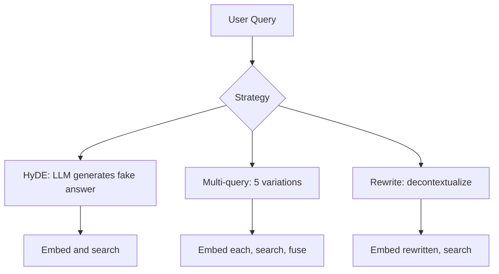

**Interview Q&A:**

*Q: HyDE downsides kya hain?*
(1) Extra LLM call per query — latency +500ms, cost +$0.0001. (2) If LLM hallucinates, hypothetical answer misleading ho sakta hai — wrong direction mein retrieve. (3) Domain-specific topics jahan LLM untrained hai (your internal jargon), HyDE useless. Best for general knowledge queries. Production mein typically optional — high-stakes queries pe enable, simple FAQ queries pe skip.

*Q: Multi-query ka cost kaise control karein?*
Cheap small model use karo for query expansion (gpt-4o-mini, Haiku, Llama-3-8B). Variations 3-5 enough — beyond that diminishing returns. Cache common queries' expansions. Parallel search execution — 5 queries simultaneously, not sequential. Return top-k from each, then RRF fuse to get final 10. Total latency ~200ms more than single query, recall +15-25%.

---

### 3.5 Cohere Rerank, BGE Reranker, LLM-as-reranker

**Definition:** Retrieval karne ke baad top-k candidates ko reorder karna. First-stage retrieval bi-encoder (fast) hota hai. Rerank cross-encoder (slow but accurate) hota hai. Cross-encoder query aur doc ko jointly process karta hai.

**Why:** Bi-encoder query aur doc separately embed karta hai — efficient but less accurate. Cross-encoder dono ko ek transformer mein dalata hai — 10x slower but 10-30% better accuracy. So pipeline — pehle 100 candidates fast retrieve, fir rerank with cross-encoder to get top 10.

**How:**

```python
# Option 1: Cohere Rerank (managed API)
import cohere
co = cohere.Client()

# pehle vector search se top 50
candidates = vector_db.search(query_emb, k=50)
docs = [c.payload["text"] for c in candidates]

# rerank
reranked = co.rerank(
    model="rerank-english-v3.0",
    query="What is RAG?",
    documents=docs,
    top_n=10
)
# returns sorted by relevance score

# Option 2: BGE Reranker (open-source, self-host)
from sentence_transformers import CrossEncoder
reranker = CrossEncoder("BAAI/bge-reranker-large")
pairs = [[query, doc] for doc in docs]
scores = reranker.predict(pairs)
# sort docs by scores
ranked = sorted(zip(docs, scores), key=lambda x: x[1], reverse=True)[:10]

# Option 3: LLM as reranker
from openai import OpenAI
client = OpenAI()
def llm_rerank(query, docs):
    prompt = f"Rate each document's relevance to query (0-10):\nQuery: {query}\n"
    for i, d in enumerate(docs):
        prompt += f"\n[Doc {i}]: {d[:300]}"
    prompt += "\n\nReturn JSON: {doc_index: score}"
    
    resp = client.chat.completions.create(
        model="gpt-4o-mini",
        messages=[{"role": "user", "content": prompt}],
        response_format={"type": "json_object"}
    )
    return json.loads(resp.choices[0].message.content)
```

**Real-life Example:** Google search internally cross-encoder rerank use karta hai (BERT-based). Anthropic ka Contextual Retrieval BGE-reranker-large recommend karta hai. Cohere ka Rerank-3 multilingual support deta hai — 100+ languages. Indian companies like Sarvam AI custom rerankers train karte hain Indic languages ke liye.

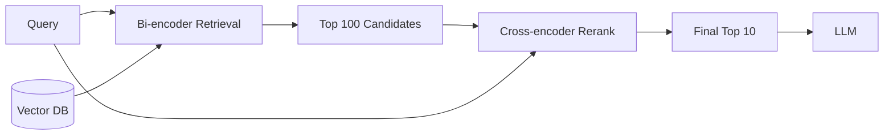

**Interview Q&A:**

*Q: Reranker kab skip kar sakte ho?*
Agar latency budget tight hai (<100ms) aur first-stage retrieval already strong hai — large embedding model (text-embedding-3-large), good chunking, hybrid search. Simple FAQ bots ke liye skip OK. Skip nahi — complex queries, large knowledge base, where retrieval errors costly hain (medical, legal). Rule of thumb — production RAG with quality concerns, reranker default ON.

*Q: BGE-reranker vs Cohere Rerank — kya choose karein?*
Cohere managed, multilingual, ~$2/1k queries, instant deploy. BGE open-source, self-host, free, but GPU infrastructure chahiye, English-focused (multilingual variant available but weaker). Quality similar in English. Cohere mein rerank-3-multilingual Indian languages ke liye decent. Self-host BGE if — high QPS (cost-effective), data sensitivity (no API leakage), latency control (no network overhead).

---

### 3.6 Context compression and summarization

**Definition:** Retrieved chunks LLM context window mein bhar dene se before, irrelevant parts remove karo ya summarize karo. Token cost reduce, relevance increase.

**Why:** Tum 10 chunks retrieve karte ho, har 500 tokens — 5000 tokens just context. GPT-4 input ka cost yeh add kar deta hai. Plus "lost in the middle" problem — LLM long context mein middle vali info miss karta hai. Compression se quality + cost dono fix.

**How:**

```python
# Option 1: LLMChainExtractor — LLM se relevant parts extract
from langchain.retrievers.document_compressors import LLMChainExtractor
from langchain_openai import ChatOpenAI

llm = ChatOpenAI(model="gpt-4o-mini", temperature=0)
compressor = LLMChainExtractor.from_llm(llm)

# har retrieved doc se sirf query-relevant parts extract
compressed_docs = compressor.compress_documents(retrieved_docs, query="What is RAG?")
# original 5000 tokens -> compressed ~1500 tokens

# Option 2: EmbeddingsFilter — sentences below similarity threshold drop
from langchain.retrievers.document_compressors import EmbeddingsFilter
from langchain_openai import OpenAIEmbeddings

emb_filter = EmbeddingsFilter(
    embeddings=OpenAIEmbeddings(),
    similarity_threshold=0.76
)
filtered = emb_filter.compress_documents(retrieved_docs, query=query)

# Option 3: LongLLMLingua — specialized prompt compression
# https://github.com/microsoft/LLMLingua
from llmlingua import PromptCompressor
compressor = PromptCompressor(model_name="microsoft/llmlingua-2-xlm-roberta-large-meetingbank")
result = compressor.compress_prompt(
    context=retrieved_docs,
    instruction="Answer the question",
    question=query,
    target_token=1500
)
```

**Real-life Example:** Microsoft ka LLMLingua paper claims 20x compression with <1% quality loss. Anthropic claude-3 long context mein contextual compression default workflow hai. RAG-as-a-Service tools (Glean, You.com) compression use karte hain — cost reduce hota hai 60%+.

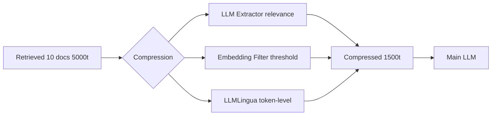

**Interview Q&A:**

*Q: Compression mein information loss kaise minimize karein?*
(1) Conservative threshold — better keep extra than drop critical. (2) Two-stage — pehle filter (drop irrelevant entirely), fir extract (within remaining, keep relevant sentences). (3) Cite-then-compress — preserve citations metadata. (4) Fallback — if compression fails ya output too short, send original. (5) Eval — RAGAS faithfulness compare karo with vs without compression. Production mein usually 20-40% compression sweet spot, beyond that quality drops.

*Q: Long context windows (100k+) ke saath compression still relevant?*
Yes. Reasons — (1) "Lost in the middle" — LLMs middle 50k tokens mein info miss karte hain (Liu et al. 2023). Compressed relevant context attention better deta hai. (2) Cost — 100k tokens ka GPT-4 cost ~$1.50 per query, compressed 10k = $0.15. 10x saving. (3) Latency — long context inference slower. (4) Hallucination — irrelevant context se LLM distracted hota hai. So even with Claude 200k, compression valuable.

---

### 3.7 Citation and source attribution

**Definition:** LLM ka answer kis source se aaya, exactly trace karna. Trustworthy RAG ke liye non-negotiable.

**Why:** Without citations user verify nahi kar sakta. Hallucinations check nahi hote. Legal/medical use cases mein source mandatory. Compliance (GDPR, internal audit) ke liye trace zaroori.

**How:**

```python
# Approach 1: Inline citation prompt
prompt = f"""Answer the question using ONLY the provided sources.
After each claim, cite the source like [1], [2].

Sources:
[1] {doc1.text} (from {doc1.source})
[2] {doc2.text} (from {doc2.source})
[3] {doc3.text} (from {doc3.source})

Question: {query}

Answer with citations:"""

response = llm.invoke(prompt)
# Output: "RAG uses retrieval [1] and generation [2]..."

# Approach 2: Structured output
from pydantic import BaseModel
from typing import List

class Citation(BaseModel):
    text: str
    source_id: int

class AnswerWithCitations(BaseModel):
    answer: str
    citations: List[Citation]

# OpenAI structured output
resp = client.beta.chat.completions.parse(
    model="gpt-4o-2024-08-06",
    messages=[...],
    response_format=AnswerWithCitations
)

# Approach 3: Post-hoc verification
# Answer generate karo, fir har sentence ke liye source verify karo
def verify_attribution(answer_sentences, sources):
    for sent in answer_sentences:
        sent_emb = embed(sent)
        best_source = max(sources, key=lambda s: cosine(sent_emb, s.emb))
        if cosine(sent_emb, best_source.emb) < 0.6:
            flag_unsupported(sent)
```

**Real-life Example:** Perplexity har sentence ke saath inline citations [1][2] dikhata hai, click karne pe source open hota hai. Anthropic Claude.ai citations feature retrieved docs se exact quote highlight karta hai. ChatGPT browse mode similarly inline links. Bing Chat numbered citations.

```mermaid
flowchart LR
    Q[Query] --> RAG[RAG Retrieval]
    RAG --> CTX[Context with IDs]
    CTX --> LLM[LLM with citation prompt]
    LLM --> ANS[Answer with [1][2]]
    ANS --> V{Verify}
    V -->|each claim cited| OK[Display]
    V -->|uncited claim| FLAG[Hallucination warning]
```

**Interview Q&A:**

*Q: Citations hallucinate ho sakti hain?*
Absolutely. LLM apne pretraining ka knowledge use kar sakta hai aur fake citation laga de "[2]" — woh actual source mein nahi hai. Mitigation — (1) post-hoc verification: har cited sentence ka actual source mein verify check (embedding similarity ya substring match). (2) Strict prompt: "Only cite if exact info in source." (3) Structured output: source IDs validate karo. (4) Use models trained for citations — Claude opus, GPT-4 better hain than smaller models.

*Q: Span-level vs document-level citations?*
Document-level — "Source: report.pdf". Easier but less precise. Span-level — "report.pdf, page 5, paragraph 2". Highly precise, user can verify quickly. Implementation harder — chunk metadata mein page/offset preserve karo. Tools like Vespa, Vectara support span-level natively. For high-trust apps (legal, medical) span-level worth the effort.

---

## 4. Advanced RAG Patterns

### 4.1 Self-RAG, Corrective RAG (CRAG)

**Definition:** Self-RAG — LLM khud decide karta hai retrieve karna hai ya nahi, kab karna hai, retrieved info reflect karke quality check karta hai. CRAG — retrieval ki quality assess karke fallback (web search) trigger karta hai if low confidence.

**Why:** Vanilla RAG har query pe retrieve karta hai — wasteful for "Hi, how are you?". Aur retrieve karke blindly use karta hai even if irrelevant. Self-RAG/CRAG smarter decisions lete hain.

**How:**

```python
# Simplified Self-RAG flow
def self_rag(query):
    # Step 1: Decide if retrieval needed
    decision = llm.invoke(f"Does answering '{query}' need external knowledge? yes/no")
    if decision == "no":
        return llm.invoke(query)  # direct answer
    
    # Step 2: Retrieve
    docs = retriever.invoke(query)
    
    # Step 3: Check relevance
    relevant_docs = []
    for doc in docs:
        rel = llm.invoke(f"Is this relevant to '{query}'? doc: {doc}")
        if rel == "yes":
            relevant_docs.append(doc)
    
    if not relevant_docs:
        return "I don't have enough info."
    
    # Step 4: Generate
    answer = llm.invoke(f"Answer: {query}\nUsing: {relevant_docs}")
    
    # Step 5: Self-critique
    critique = llm.invoke(f"Does this answer fully address '{query}'?\nAnswer: {answer}")
    if "no" in critique.lower():
        # retry with different strategy
        return self_rag_v2(query)
    return answer

# CRAG — confidence-based fallback
def crag(query):
    docs = retriever.invoke(query)
    confidence = score_relevance(query, docs)  # avg cosine similarity
    
    if confidence > 0.7:
        return generate(query, docs)  # high confidence
    elif confidence > 0.4:
        # ambiguous — refine + web search
        web_docs = web_search(query)
        return generate(query, docs + web_docs)
    else:
        # low — only web search
        return generate(query, web_search(query))
```

**Real-life Example:** Perplexity Pro CRAG-style flow use karta hai — internal index plus live web search blend. Cursor IDE Self-RAG-ish — code search karne se pehle decide karta hai pure-LLM answer enough hai ya repo search chahiye. Anthropic Claude tool use natively supports yeh patterns via function calling.

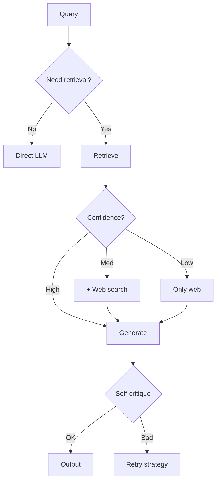

**Interview Q&A:**

*Q: Self-RAG fine-tuned model ki zaroorat hai?*
Original Self-RAG paper (Asai et al.) special tokens ke saath fine-tuned model use karta hai — `[Retrieve]`, `[Relevant]`, `[Supported]` tokens. Pure prompting se approximate kar sakte ho but not as effective. Production mein simplified versions common — function calling se decision steps. Real Self-RAG-7B model HuggingFace pe available hai, but most teams orchestration with off-the-shelf models prefer karte hain (simpler, model-agnostic).

*Q: CRAG ka knowledge refinement step kya hai?*
Original CRAG paper "decompose-then-recompose" propose karta hai — retrieved doc ko sentences mein todo, har ek pe relevance score do, irrelevant drop, fir reassemble. Web search results ke saath blend. Yeh contextual compression ka aggressive form hai. Production mein typically simplified — chunk-level confidence scoring + reranking enough is. Full CRAG implementation overhead high but quality 5-10% better.

---

### 4.2 GraphRAG (Microsoft)

**Definition:** Microsoft Research ka 2024 approach. Documents se knowledge graph extract karo (entities + relationships), graph pe community detection, har community ka summary generate, aur retrieval graph-aware ho. Multi-hop questions ke liye game-changer.

**Why:** Vanilla RAG "global" questions pe fail karta hai — "What are the main themes across all documents?" Yeh particular chunk match nahi karta, holistic understanding chahiye. GraphRAG community summaries se yeh handle karta hai.

**How:**

```python
# Microsoft GraphRAG simplified
# Full implementation: pip install graphrag

# Step 1: Entity + relationship extraction (LLM)
def extract_entities(chunk):
    prompt = f"""Extract entities and relationships from text.
Format JSON: {{entities: [...], relationships: [{{source, target, type}}]}}

Text: {chunk}"""
    return llm.invoke(prompt)

# Step 2: Build graph
import networkx as nx
G = nx.Graph()
for chunk in chunks:
    data = extract_entities(chunk)
    for e in data["entities"]:
        G.add_node(e["name"], type=e["type"])
    for r in data["relationships"]:
        G.add_edge(r["source"], r["target"], type=r["type"])

# Step 3: Community detection (Leiden algorithm)
import community
communities = community.best_partition(G)

# Step 4: Per-community summary
community_summaries = {}
for comm_id in set(communities.values()):
    nodes_in_comm = [n for n, c in communities.items() if c == comm_id]
    subgraph_text = describe_subgraph(G.subgraph(nodes_in_comm))
    summary = llm.invoke(f"Summarize this knowledge cluster: {subgraph_text}")
    community_summaries[comm_id] = summary

# Step 5: Query routing
def graph_rag_query(query):
    if is_global_query(query):
        # use community summaries
        return llm.invoke(f"Q: {query}\nContext: {community_summaries.values()}")
    else:
        # local — relevant entities + neighbors
        entities = extract_entities_from_query(query)
        relevant_chunks = traverse_graph(G, entities, hops=2)
        return llm.invoke(f"Q: {query}\nContext: {relevant_chunks}")
```

**Real-life Example:** Microsoft used GraphRAG on novels (e.g., Charles Dickens corpus) — "What are the major themes?" answers exponentially better than vanilla RAG. LinkedIn product info graph + GraphRAG for B2B sales intelligence. Indian use cases — SEBI regulations corpus, where multi-hop ("how does Section 11 interact with Schedule III?") needs graph reasoning.

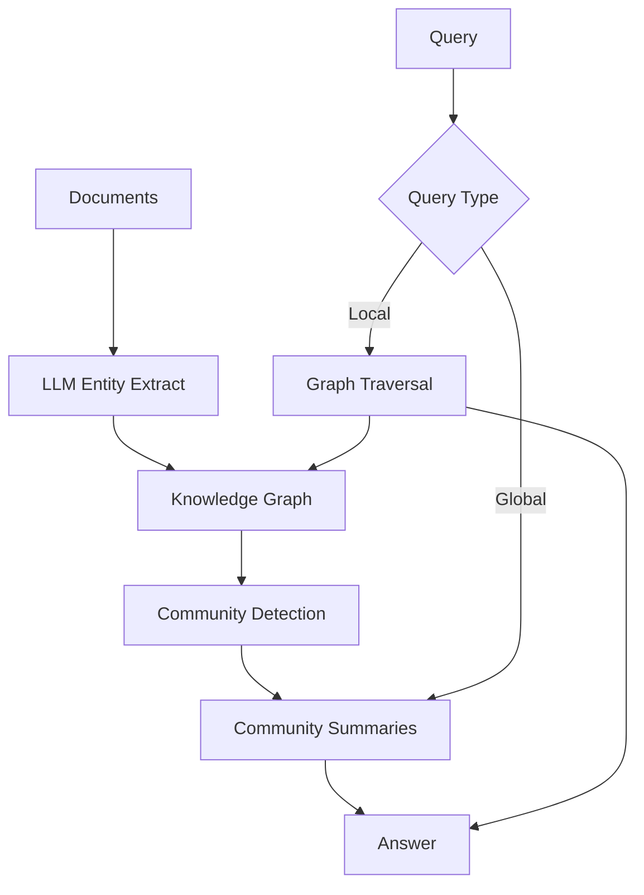

**Interview Q&A:**

*Q: GraphRAG cost vs vanilla RAG?*
Indexing 10-100x more expensive — har chunk pe LLM call for entity extraction, additional summarization. 1M tokens ke corpus ka indexing $50-500 cost ho sakta hai. Query time similar latency. So GraphRAG worth — when (1) corpus size moderate (not billions of docs), (2) global questions important, (3) one-time indexing cost amortizable. Not worth — high-velocity ingestion, simple factual lookup.

*Q: GraphRAG vs traditional knowledge graphs (Neo4j etc)?*
Traditional KGs human-curated schemas have, expensive to build, deterministic. GraphRAG LLM-extracted, fast to build, probabilistic (errors possible). Traditional better for high-stakes (medical, legal compliance). GraphRAG better for exploratory analysis on unstructured corpora. Hybrid approach — use traditional KG schema as anchor, LLM-extract additional context.

---

### 4.3 Agentic RAG

**Definition:** RAG as a tool that an agent (LLM with reasoning) can invoke multiple times, with planning, reflection, and dynamic strategy selection. Not single-shot retrieve-then-generate.

**Why:** Real questions complex hote hain. "Compare Q3 revenue of TCS and Infosys with industry trend" — needs three retrievals (TCS, Infosys, industry), comparison, synthesis. Vanilla RAG ek shot mein nahi kar sakta. Agent step-by-step plan banata hai, retrieve karta hai iteratively.

**How:**

```python
from openai import OpenAI
import json

client = OpenAI()

# Define retrieval as a tool
tools = [{
    "type": "function",
    "function": {
        "name": "search_docs",
        "description": "Search the knowledge base",
        "parameters": {
            "type": "object",
            "properties": {
                "query": {"type": "string"},
                "filters": {"type": "object"}
            }
        }
    }
}]

def agentic_rag(user_query):
    messages = [
        {"role": "system", "content": "You are a research assistant. Use search_docs as needed. Plan, retrieve, synthesize."},
        {"role": "user", "content": user_query}
    ]
    
    for iteration in range(10):  # max 10 steps
        resp = client.chat.completions.create(
            model="gpt-4o",
            messages=messages,
            tools=tools
        )
        msg = resp.choices[0].message
        
        if msg.tool_calls:
            for tc in msg.tool_calls:
                args = json.loads(tc.function.arguments)
                # actual retrieval
                results = vector_db.search(embed(args["query"]), filter=args.get("filters"))
                messages.append({
                    "role": "tool",
                    "tool_call_id": tc.id,
                    "content": json.dumps([r.payload for r in results])
                })
            messages.append(msg)
        else:
            # final answer
            return msg.content
    
    return "Max iterations reached"
```

**Real-life Example:** Devin (Cognition AI) agentic code RAG — searches repo, runs tests, fetches docs iteratively. ChatGPT with custom GPTs supports tool-based RAG. Anthropic Claude Computer Use can iteratively retrieve and act. Indian startup Sarvam AI agents for govt scheme retrieval — multi-step lookup across schemes, eligibility, application.

```mermaid
flowchart TB
    Q[Complex Query] --> P[Plan]
    P --> A1[Action 1: Search X]
    A1 --> R1[Result 1]
    R1 --> RF1{Reflect}
    RF1 --> P2[Replan]
    P2 --> A2[Action 2: Search Y]
    A2 --> R2[Result 2]
    R2 --> RF2{Enough?}
    RF2 -->|No| P3[More retrievals]
    RF2 -->|Yes| SYN[Synthesize]
    SYN --> ANS[Final Answer]
```

**Interview Q&A:**

*Q: Agentic RAG ka latency aur cost concern?*
Multiple LLM calls (planning + retrieval decisions + synthesis) — typical agentic query 5-20 LLM calls. Latency 5-30 seconds. Cost 10-50x vanilla RAG. So usage targeted — complex multi-step queries only. Simple queries pe agent overhead waste. Production pattern — query classifier first decide karta hai "simple → vanilla RAG, complex → agentic".

*Q: Agent loop kaise infinite recursion se prevent karein?*
(1) Max iteration limit (typically 5-10 steps). (2) Cost budget — total tokens spent track karo, threshold pe abort. (3) Repetition detection — same retrieval query 3 times = stuck, abort with partial answer. (4) Timeout. (5) Confidence threshold — agar X iterations baad bhi confident answer nahi, gracefully degrade. Production agents like Cursor, Devin sab yeh guardrails use karte hain.

---

### 4.4 Multi-hop retrieval

**Definition:** Query answer karne ke liye multiple sequential retrievals — first retrieval ka result use karke second query banao. "Who directed the highest-grossing film of 2023?" → first retrieve "highest-grossing 2023 = Barbie", then retrieve "Barbie director = Greta Gerwig".

**Why:** Single retrieval cannot bridge implicit reasoning chains. Single chunk mein dono facts hone chahiye — rare. Multi-hop chains intermediate steps explicitly handle karta hai.

**How:**

```python
def multi_hop_rag(query, max_hops=3):
    context = []
    current_query = query
    
    for hop in range(max_hops):
        # retrieve for current query
        docs = retriever.invoke(current_query)
        context.extend(docs)
        
        # decompose: do we need more info?
        decomp_prompt = f"""Original question: {query}
Context so far: {context}

Can we answer the original question? If yes, output 'DONE'.
If no, output the next sub-question to research."""
        
        next_step = llm.invoke(decomp_prompt)
        
        if "DONE" in next_step:
            break
        current_query = next_step
    
    # final synthesis
    return llm.invoke(f"Q: {query}\nContext: {context}\nAnswer:")

# Specialized: IRCoT (Interleaving Retrieval with Chain-of-Thought)
def ircot(query):
    cot = ""
    for step in range(5):
        # retrieve based on current CoT state
        retrieval_query = f"{query} {cot}"
        docs = retriever.invoke(retrieval_query)
        
        # generate next CoT step using retrieved docs
        next_thought = llm.invoke(f"""
Q: {query}
Context: {docs}
Reasoning so far: {cot}
Next reasoning step (or 'ANSWER:' if done):""")
        
        if "ANSWER:" in next_thought:
            return next_thought.split("ANSWER:")[1]
        cot += "\n" + next_thought
    
    return llm.invoke(f"Final answer based on: {cot}")
```

**Real-life Example:** HotpotQA benchmark mein multi-hop questions standard hain — "Where was the screenwriter of [movie] born?" Microsoft GraphRAG and IRCoT specifically isi ke liye. Perplexity multi-hop handle karta hai — ek query se kai sub-queries derive. Indian use case — legal research, "Section X ke under Y judgment kis high court ne diya?" — case → court chain.

```mermaid
flowchart LR
    Q[Q: Director of top 2023 film?] --> H1[Hop 1: top 2023 film]
    H1 --> R1[Barbie]
    R1 --> H2[Hop 2: Barbie director]
    H2 --> R2[Greta Gerwig]
    R2 --> ANS[Answer: Greta Gerwig]
```

**Interview Q&A:**

*Q: Multi-hop mein error compounding kaise handle karein?*
Yeh major issue hai — hop 1 mein wrong answer, hop 2 useless. Mitigation — (1) Confidence scoring per hop, low confidence pe abort. (2) Multiple candidates per hop — beam search-like, keep top-3 paths. (3) Verification — final answer check whether intermediate steps consistent hain. (4) Limit hops — 3-4 max, beyond that error compounds badly. (5) Self-Ask methodology — explicit Q-A pairs per hop, easier to verify.

*Q: Multi-hop vs Agentic RAG difference?*
Overlap hai but emphasis different. Multi-hop specifically about retrieval chains for compositional questions — fixed pattern. Agentic broader — retrieval is one tool, agent can also do calculations, code execution, web browsing, function calls. Multi-hop ek subset of agentic in many implementations. Practically — multi-hop simpler to implement, agentic more flexible but complex.

---

### 4.5 Long-context vs RAG tradeoffs

**Definition:** Modern LLMs (Claude 200k, Gemini 2M, GPT-4 128k) can fit huge contexts. "Just stuff everything into context" — kya RAG dead hai? No. Both have tradeoffs.

**Why:** Engineers often debate — "1M context window se RAG obsolete ho gaya?" Reality nuanced hai. Cost, latency, recall, freshness — sab consider karna padta hai.

**How:**

```python
# Approach 1: Pure long-context
def long_context_qa(query, all_docs):
    context = "\n\n".join(all_docs)  # all 100k tokens
    return llm.invoke(f"Q: {query}\n\nDocs: {context}")
# Pros: simple, no retrieval errors
# Cons: $1+ per query, 30s latency, "lost in middle"

# Approach 2: Pure RAG
def rag_qa(query, vector_db):
    docs = vector_db.search(embed(query), k=5)  # ~2k tokens
    return llm.invoke(f"Q: {query}\nContext: {docs}")
# Pros: fast, cheap, scalable to millions of docs
# Cons: retrieval failure modes

# Approach 3: Hybrid — RAG with longer top-k for long-context model
def hybrid(query, vector_db):
    docs = vector_db.search(embed(query), k=50)  # ~25k tokens
    return claude_200k.invoke(f"Q: {query}\nContext: {docs}")
# Best of both — broad retrieval + powerful LLM

# Cost calculation
def estimate_cost(approach, queries_per_day, total_corpus_tokens):
    if approach == "long_context":
        # Claude 3.5 Sonnet: $3/1M input tokens
        return queries_per_day * total_corpus_tokens * 3 / 1_000_000
    elif approach == "rag":
        # ~5k tokens per query average
        return queries_per_day * 5000 * 3 / 1_000_000
    # 1M corpus, 10k queries/day
    # long_context: $30,000/day
    # rag: $150/day
    # 200x difference
```

**Real-life Example:** Anthropic's own docs internally use Claude 200k for some flows (long context), RAG for others (large corpus). Google NotebookLM stuffs entire user-uploaded docs in Gemini context for small docs, RAG for larger. Indian companies often skip long-context for cost reasons — Sarvam, Krutrim default to RAG.

```mermaid
flowchart TB
    Decision{Corpus Size}
    Decision -->|Small <100k tokens| LC[Long-context: dump all]
    Decision -->|Medium 100k-1M| H[Hybrid: RAG with large k]
    Decision -->|Large >1M| RAG[Pure RAG]
    LC --> CON1[Cons: cost, latency]
    LC --> PRO1[Pros: no retrieval errors]
    RAG --> CON2[Cons: retrieval failures]
    RAG --> PRO2[Pros: scalable, cheap]
```

**Interview Q&A:**

*Q: "Lost in the middle" problem kya hai?*
Liu et al. (2023) showed LLMs (even GPT-4) information at the beginning and end of context use better than middle. 100k context mein, 50k position pe fact LLM miss kar sakta hai. Implications — (1) just stuffing 1M tokens not equivalent to perfect recall. (2) Reranking still matters — most relevant first. (3) Compression to remove middle noise helpful. RAG with focused 5k context often beats 100k context dump on retrieval-style tasks.

*Q: Freshness aspect kab matter karta hai?*
Long-context models pretrained pe stuck hote hain — Claude 3.5 Sonnet knowledge cutoff April 2024. Today's news? Stock prices? Internal company updates? Long-context can't help — info nahi hai. RAG with up-to-date index handles this. Hybrid common — base knowledge from LLM, fresh facts from RAG. So even with infinite context, RAG remains relevant for dynamic data.

---

### 4.6 RAG evaluation (RAGAS, TruLens — faithfulness, relevance, precision/recall)

**Definition:** RAG system kaisa kaam kar raha hai measure karna. Multiple dimensions — retrieval quality (precision/recall), generation quality (faithfulness, relevance), end-to-end quality.

**Why:** "It works on my examples" production ke liye sufficient nahi. Production RAG mein hazaron queries, edge cases. Without metrics, regressions silent — kisi update se quality drop hua, pata hi nahi chala. Evaluation continuous process hai.

**How:**

```python
# RAGAS — purpose-built RAG eval framework
from ragas import evaluate
from ragas.metrics import (
    faithfulness,        # answer is grounded in context
    answer_relevancy,    # answer addresses question
    context_precision,   # retrieved context relevant
    context_recall       # all relevant context retrieved
)
from datasets import Dataset

# eval data prep
eval_data = {
    "question": ["What is RAG?", "How does HNSW work?"],
    "answer": ["RAG combines retrieval...", "HNSW is graph-based..."],
    "contexts": [["doc1...", "doc2..."], ["doc3...", "doc4..."]],
    "ground_truth": ["RAG = Retrieval Augmented Generation", "HNSW = Hierarchical Navigable Small World"]
}
dataset = Dataset.from_dict(eval_data)

result = evaluate(
    dataset,
    metrics=[faithfulness, answer_relevancy, context_precision, context_recall]
)
print(result)
# {faithfulness: 0.92, answer_relevancy: 0.88, context_precision: 0.81, context_recall: 0.76}

# TruLens — alternative with feedback functions
from trulens_eval import Tru, Feedback
from trulens_eval.feedback import OpenAI as fOpenAI

provider = fOpenAI()
f_groundedness = Feedback(provider.groundedness_measure_with_cot_reasons)
f_answer_relevance = Feedback(provider.relevance_with_cot_reasons)
f_context_relevance = Feedback(provider.context_relevance_with_cot_reasons)

# wrap your RAG app, automatic logging + eval
tru = Tru()
tru_recorder = tru.Chain(your_rag_chain, feedbacks=[f_groundedness, f_answer_relevance])
```

**Real-life Example:** Anthropic, OpenAI, all big labs internal eval suites have. Notion AI maintains 1000s of golden queries, regression tested on each release. Indian startups starting to adopt RAGAS — Krutrim, Sarvam doc retrieval evaluations. LangSmith, Weights & Biases offer hosted eval dashboards.

```mermaid
flowchart TB
    EVAL[RAG Evaluation] --> RET[Retrieval Metrics]
    EVAL --> GEN[Generation Metrics]
    EVAL --> E2E[End-to-End]
    RET --> CP[Context Precision]
    RET --> CR[Context Recall]
    RET --> MRR[MRR / NDCG]
    GEN --> F[Faithfulness]
    GEN --> AR[Answer Relevance]
    E2E --> CORR[Correctness vs ground truth]
    E2E --> H[Human eval]
```

**Interview Q&A:**

*Q: Faithfulness vs answer relevance — kya farak?*
Faithfulness — answer sirf context mein dene wali baatein keh raha hai? Hallucination check. Answer might be relevant but ungrounded ("RAG bahut popular hai" — true but not in context). Answer relevance — answer query ko address kar raha hai? Off-topic detect karta hai (correct facts but wrong question answered). Dono complementary — high faithfulness + low relevance = correctly says irrelevant things. High relevance + low faithfulness = answers question but with hallucinations. Both high needed.

*Q: RAG eval mein ground truth kahan se?*
Three approaches — (1) Manual labeling — domain experts golden queries-answers banayein. Quality high but expensive. (2) Synthetic generation — LLM se docs ke base pe questions generate karwao with known answers. RAGAS ka TestSet generator yeh karta hai. (3) Production logs — user feedback (thumbs up/down), implicit signals (followup queries). Combined approach best — synthetic for breadth, manual for high-stakes, production logs for drift detection. Typical eval set 100-500 queries.

---

## Resources & further reading

- **ColBERT (Khattab & Zaharia, 2020):** Late interaction retrieval — token-level matching, balances speed and accuracy. https://arxiv.org/abs/2004.12832
- **GraphRAG (Microsoft Research, 2024):** Knowledge graph-based RAG for global queries. https://arxiv.org/abs/2404.16130 + https://github.com/microsoft/graphrag
- **RAPTOR (Sarthi et al., 2024):** Recursive abstractive processing for tree-organized retrieval. https://arxiv.org/abs/2401.18059
- **Self-RAG (Asai et al., 2023):** https://arxiv.org/abs/2310.11511
- **CRAG (Yan et al., 2024):** https://arxiv.org/abs/2401.15884
- **Lost in the Middle (Liu et al., 2023):** https://arxiv.org/abs/2307.03172
- **Anthropic Contextual Retrieval (2024):** https://www.anthropic.com/news/contextual-retrieval
- **RAGAS Documentation:** https://docs.ragas.io/
- **TruLens:** https://www.trulens.org/
- **MTEB Leaderboard (embedding benchmarks):** https://huggingface.co/spaces/mteb/leaderboard
- **LlamaIndex RAG patterns:** https://docs.llamaindex.ai/
- **Pinecone Learning Center:** https://www.pinecone.io/learn/
- **Qdrant Documentation:** https://qdrant.tech/documentation/
- **Matryoshka Representation Learning paper:** https://arxiv.org/abs/2205.13147
- **HyDE paper (Gao et al., 2022):** https://arxiv.org/abs/2212.10496

Bhai, RAG ek aisa stack hai jo har 3 mahine mein evolve hota hai. Yeh guide 2026 ke fundamentals cover karta hai — embedding fundamentals se Agentic RAG tak. Interview prep ke liye, har subtopic ke Q&A ratlena. Production ke liye — start simple (pgvector + BGE + recursive chunking), evaluate with RAGAS, fir incrementally complexity add karna (rerank → hybrid → agentic). Don't over-engineer day 1. Build, measure, iterate.
