# LLM Serving & Inference

Bhai, model train karna ek baat hai, lekin usko production mein 1000 QPS pe serve karna ekdum doosri ladai hai. LLM serving basically ek aisi engineering problem hai jahan tu GPU memory, compute throughput, aur latency ko ek saath optimize karta hai. Naive approach (jaise `model.generate()` HuggingFace se) tujhe maximum 5-10 req/s degi, GPU 30% utilized rahega, aur tera CFO bill dekhke ro dega.

Industry mein aaj jo ho raha hai woh hai PagedAttention, continuous batching, speculative decoding, FlashAttention, prefix caching — yeh sab milke same hardware pe 10-100x throughput nikalte hain. vLLM basically LLM inference ka Ferrari hai. Naive HuggingFace inference 10 req/s deta hai, vLLM 1000+. PagedAttention + continuous batching ka magic.

Is guide mein hum do bade topics cover karenge: pehla Serving Frameworks (vLLM, TGI, Triton, SGLang, llama.cpp, LMDeploy) jahan tu seekhega ki konsa framework kab use karna hai. Doosra Inference Optimization (batching, speculative decoding, FlashAttention, prefix caching, parallelism, quantization) jahan tu samjhega ki andar ka magic kaise kaam karta hai. Chal shuru karte hain.

---

## 1. Serving Frameworks

### 1.1 vLLM — PagedAttention, continuous batching (industry standard)

**Definition:** vLLM ek open-source LLM inference engine hai jo UC Berkeley se aaya hai. Iska USP do cheezon mein hai — PagedAttention (KV cache ko paged memory ki tarah manage karna, jaise OS virtual memory karta hai) aur continuous batching (har step pe naye requests ko running batch mein ghusana). Aaj ke time pe yeh de-facto industry standard hai LLM serving ke liye.

**Why:** Traditional inference frameworks (jaise HuggingFace `transformers`) mein KV cache contiguous memory mein store hota hai. Matlab agar tu max_seq_len=2048 set karega, toh har request ke liye 2048 tokens ki memory pre-allocate ho jaati hai, chahe woh request 50 tokens hi generate kare. Yeh fragmentation aur waste ka bhandar hai. PagedAttention isko fix karta hai — KV cache ko fixed-size blocks (16 ya 32 tokens) mein todke, OS-style page tables se manage karta hai. Result: 4x more requests same GPU pe fit ho jaate hain.

Continuous batching aur bhi bada game-changer hai. Static batching mein tu 32 requests ek saath bhejta hai, longest one finish hone tak baaki sab wait karte hain (GPU idle). Continuous batching mein jaise hi koi request finish hoti hai, naya request immediately uski jagah le leta hai. GPU utilization 90%+ ho jata hai.

**How:**

```bash
# vLLM install kar
pip install vllm

# OpenAI-compatible server start kar — yeh production-ready hai
vllm serve meta-llama/Llama-3-8B-Instruct \
  --tensor-parallel-size 2 \           # 2 GPUs pe split kar
  --max-model-len 8192 \                # context length cap
  --gpu-memory-utilization 0.92 \       # 92% GPU memory use kar
  --enable-prefix-caching \             # system prompts cache kar
  --dtype bfloat16
```

```python
# Python client — OpenAI SDK directly use kar sakta hai
from openai import OpenAI

client = OpenAI(base_url="http://localhost:8000/v1", api_key="dummy")

# Streaming response — token-by-token aaega
stream = client.chat.completions.create(
    model="meta-llama/Llama-3-8B-Instruct",
    messages=[{"role": "user", "content": "Explain RAG in 2 lines"}],
    stream=True,
    max_tokens=200,
)
for chunk in stream:
    # delta.content mein actual token aata hai
    print(chunk.choices[0].delta.content or "", end="", flush=True)
```

```python
# Offline batch inference — agar tujhe 10K prompts process karne hain
from vllm import LLM, SamplingParams

llm = LLM(model="meta-llama/Llama-3-8B-Instruct", tensor_parallel_size=2)
sampling = SamplingParams(temperature=0.7, max_tokens=512)

# Yeh internally continuous batching karega — bahut fast
prompts = ["Q1...", "Q2...", "Q3..."] * 1000
outputs = llm.generate(prompts, sampling)
```

**Real-life Example:** Anyscale, Mistral, aur tons of YC startups vLLM use karte hain production mein. Ek mid-size SaaS jo Llama-3-70B serve kar raha tha, woh 4xA100 pe TGI se 80 req/s nikal raha tha. vLLM pe migrate kiya, same hardware pe 320 req/s mil gaya — 4x improvement, zero code change client side. Bill 75% kam ho gaya.

**Mermaid Diagram:**

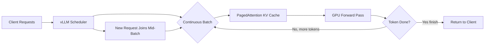

**Interview Q&A:**

*Q: PagedAttention exactly kya solve karta hai?*
Bhai, problem yeh thi ki KV cache contiguous allocation ki wajah se 60-80% memory waste ho raha tha (internal fragmentation + reservation for max length). PagedAttention KV cache ko logical blocks mein todta hai (typically 16 tokens per block), aur ek block table maintain karta hai jo logical-to-physical mapping rakhta hai. Bilkul OS virtual memory ki tarah. Isse waste 4% ke neeche aa jaata hai aur tu same GPU pe 2-4x more concurrent requests handle kar sakta hai.

*Q: Continuous batching aur static batching mein difference kya hai?*
Static batching mein tu N requests collect karta hai, ek saath GPU pe daalta hai, sab finish hone tak wait karta hai. Agar ek request 500 tokens generate karti hai aur baaki 50, toh GPU 90% time idle. Continuous batching (a.k.a. iteration-level scheduling ya in-flight batching) mein har decoding step ke baad scheduler check karta hai — jo request finish ho gayi hai, usko evict karke naya request enqueue kar deta hai. GPU continuously busy rehta hai.

*Q: vLLM ke limitations kya hain?*
Pehla, jab tak custom model architectures ka support add nahi hota tab tak vLLM mein nahi chalega — research models ke liye thoda paining. Doosra, multi-LoRA serving abhi mature hai but GPU memory pe trade-off hai. Teesra, very long context (>128K) pe FlashAttention-3 jaisa specialized kernel zaroori hai, aur woh sab models pe nahi milta. Lekin 95% production cases mein vLLM hi best choice hai.

*Q: vLLM vs TGI vs SGLang — kab kya use kare?*
vLLM: general-purpose high-throughput serving (default choice). TGI: HuggingFace ecosystem mein deeply integrated, easy deploy on AWS/SageMaker. SGLang: structured generation, agentic workloads, RadixAttention ka fayda. Agar tu vanilla chat/completion serve kar raha hai vLLM le. Agar complex prompting + JSON mode + multi-turn caching chahiye toh SGLang dekh.

---

### 1.2 TGI (HF Text Generation Inference)

**Definition:** TGI matlab Text Generation Inference, HuggingFace ka official production-grade LLM serving framework. Rust mein likha gaya hai (router + scheduler), Python mein model code, aur tightly integrated hai HF Hub ke saath. Pehle yeh permissive license tha, fir restrictive hua, aab wapas Apache 2.0 pe aa gaya.

**Why:** TGI ka selling point hai end-to-end production readiness — built-in metrics (Prometheus), token streaming via SSE, structured output via Outlines, safetensors support, automatic tensor parallelism, aur HF Hub se direct model load. Agar tera stack already HuggingFace + AWS SageMaker pe hai, TGI plug-and-play hai.

**How:**

```bash
# Docker se chala — easiest way
docker run --gpus all --shm-size 1g -p 8080:80 \
  -v $PWD/data:/data \
  ghcr.io/huggingface/text-generation-inference:3.0 \
  --model-id meta-llama/Llama-3-8B-Instruct \
  --num-shard 2 \                     # tensor parallel across 2 GPUs
  --max-input-length 4096 \
  --max-total-tokens 8192 \
  --quantize bitsandbytes-nf4         # 4-bit quant for cost
```

```python
# Client side — TGI ka apna SDK hai, ya OpenAI compat use kar
from huggingface_hub import InferenceClient

client = InferenceClient("http://localhost:8080")

# Streaming generation
for token in client.text_generation(
    "Write a haiku about GPUs",
    max_new_tokens=100,
    stream=True,
    temperature=0.8,
):
    print(token, end="", flush=True)

# Structured output — JSON schema enforce kar
response = client.text_generation(
    "Give me user info as JSON",
    grammar={"type": "json", "value": {"name": "string", "age": "int"}},
)
```

**Real-life Example:** HuggingChat (HF ka apna ChatGPT competitor) TGI pe chalta hai. Ek European bank ne Llama-3-70B ko TGI + SageMaker pe deploy kiya for internal copilot — autoscaling SageMaker handle karta hai, TGI inside container actual inference. Setup 1 din mein chala gaya kyunki SageMaker mein TGI ka pre-built deep learning container available hai.

**Mermaid Diagram:**

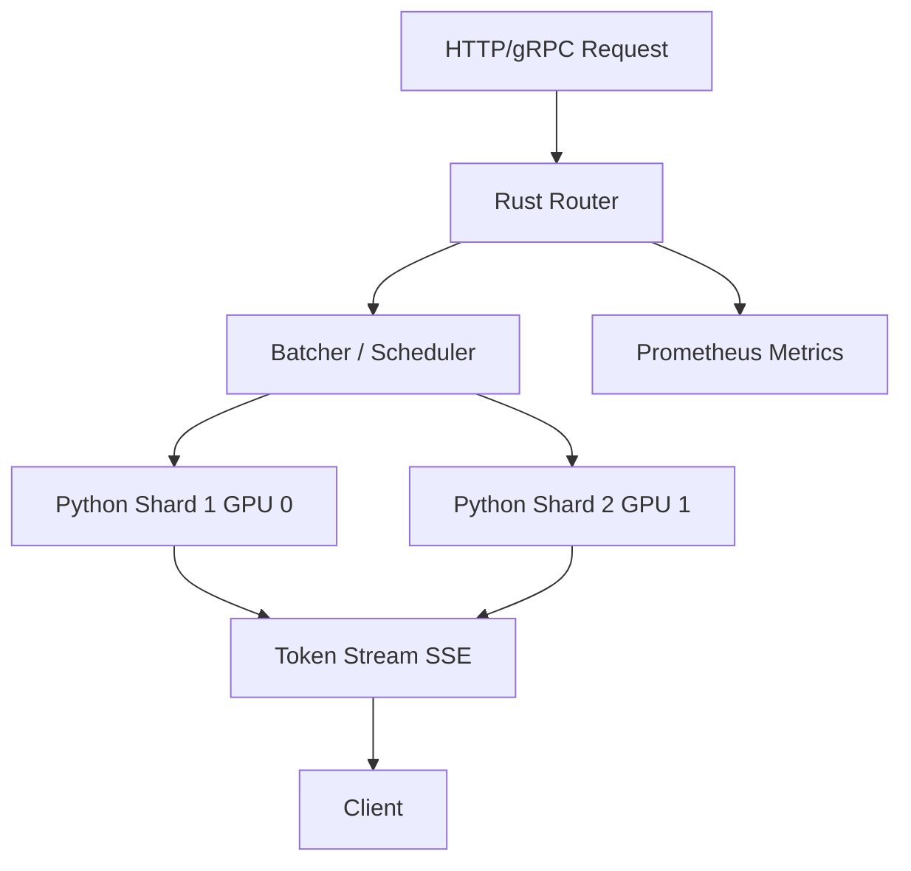

**Interview Q&A:**

*Q: TGI vs vLLM, technical difference kya hai?*
Dono mein continuous batching aur PagedAttention-style memory management hai. Difference architecture mein hai — TGI ka router Rust mein hai (low-latency, high-concurrency), aur model code Python mein. vLLM full Python (with CUDA kernels). Throughput pe vLLM thoda aage rehta hai latest benchmarks mein, but TGI ka observability + HF integration tighter hai. Enterprise mein TGI common, startups mein vLLM common.

*Q: TGI mein quantization options kya hain?*
TGI supports bitsandbytes (NF4, FP4 — easiest), GPTQ (pre-quantized models), AWQ (activation-aware), aur EETQ. NF4 development ke liye sahi hai par production throughput pe AWQ ya GPTQ better hai because they have optimized kernels.

*Q: SSE streaming kaise kaam karta hai TGI mein?*
TGI har generated token ko Server-Sent Event ke through immediately push kar deta hai. Client `text/event-stream` content-type pe listen karta hai. Yeh perceived latency ko drastically kam karta hai — first token 200ms mein dikh jata hai chahe pura response 5 second le.

*Q: TGI ko Kubernetes pe kaise deploy karenge production mein?*
HF ka official Helm chart hai, ya tu apna deployment likh — GPU node pool, NVIDIA device plugin, HPA on `tgi_request_count` metric (Prometheus se), liveness probe `/health` endpoint pe, readiness probe `/info` pe. Model files PVC pe mount karne se cold-start time bahut kam hota hai (10 min se 30 sec).

---

### 1.3 NVIDIA Triton, TensorRT-LLM

**Definition:** Triton Inference Server NVIDIA ka multi-framework inference platform hai (PyTorch, TensorFlow, ONNX, TensorRT, TensorRT-LLM, vLLM-as-backend, sab support karta hai). TensorRT-LLM ek specialized library hai jo LLMs ko TensorRT engines mein compile karti hai — ekdum hardware-tuned, NVIDIA GPUs pe maximum throughput dene ke liye.

**Why:** Agar tujhe absolute peak performance chahiye on NVIDIA hardware (H100, H200, B100), aur tu kernel-level optimizations afford kar sakta hai (compile time, complexity), toh TensorRT-LLM se tezz kuch nahi. Triton serving layer provide karta hai — multi-model, multi-GPU, dynamic batching, ensemble pipelines, aur enterprise-grade observability.

**How:**

```bash
# TensorRT-LLM se model build kar — ekdum specific GPU ke liye optimize hoga
trtllm-build --checkpoint_dir ./llama3-8b-ckpt \
    --output_dir ./trt_engines/llama3-8b/fp8 \
    --gpt_attention_plugin float16 \
    --gemm_plugin float16 \
    --max_input_len 4096 \
    --max_seq_len 8192 \
    --max_batch_size 64 \
    --use_fp8                       # H100 ke FP8 tensor cores fire karega
```

```python
# Triton config.pbtxt — model repository ka structure
# models/llama3/config.pbtxt
"""
name: "llama3"
backend: "tensorrtllm"
max_batch_size: 64
input [{ name: "input_ids", data_type: TYPE_INT32, dims: [-1] }]
output [{ name: "output_ids", data_type: TYPE_INT32, dims: [-1] }]
parameters: {
  key: "gpt_model_path"
  value: { string_value: "/engines/llama3-8b/fp8" }
}
"""
```

```bash
# Triton server launch
tritonserver --model-repository=/models \
  --grpc-port 8001 --http-port 8000 --metrics-port 8002
```

```python
# Client (Python) using Triton SDK
import tritonclient.grpc as grpcclient

client = grpcclient.InferenceServerClient("localhost:8001")
# input_ids prepare kar, infer kar
inputs = [grpcclient.InferInput("input_ids", [1, 128], "INT32")]
inputs[0].set_data_from_numpy(input_array)
result = client.infer(model_name="llama3", inputs=inputs)
```

**Real-life Example:** OpenAI ke saath compete karne wale enterprise inference providers (Together AI, Anyscale, NVIDIA NIM itself) Triton + TensorRT-LLM heavy use karte hain. Ek autonomous driving company ne perception model + LLM-based scene description ko same Triton server pe deploy kiya — ensemble pipeline mein vision encoder ek model, LLM decoder doosra, dono GPU pe co-located, latency 80ms total.

**Mermaid Diagram:**

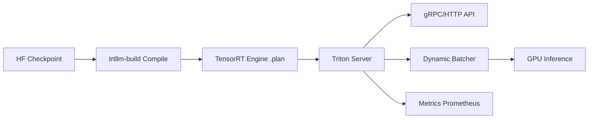

**Interview Q&A:**

*Q: TensorRT-LLM kaise vLLM se tezz hota hai?*
TensorRT-LLM ahead-of-time (AOT) compile karta hai model ko specific GPU architecture (SM_90 for H100) ke liye. Kernels fused hote hain (e.g., RMSNorm + matmul + activation ek single kernel mein), FP8 tensor cores directly use hote hain Hopper pe, aur in-flight batching + paged KV cache native hai. vLLM JIT-style runtime hai, flexibility zyada, peak speed thodi kam.

*Q: Triton ka ensemble feature kya hai?*
Ensemble matlab tu multiple models ko ek pipeline mein chain kar sakta hai server-side, network roundtrip bachakar. Jaise: tokenizer model -> LLM model -> detokenizer model. Pura ensemble ek single inference call mein chal jata hai, intermediate tensors GPU pe hi rehte hain.

*Q: Triton kab use kare vs simple vLLM?*
Triton tab le jab tujhe (a) multiple model types serve karne hain ek server se (vision + LLM + classifier), (b) enterprise features chahiye (auth, audit, model versioning, A/B), (c) absolute peak NVIDIA performance chahiye. Vanilla LLM-only serving ke liye vLLM simpler hai.

*Q: TensorRT-LLM ka downside kya hai?*
Compilation time long hota hai (10-30 min per engine), aur engine specific GPU SKU pe locked hota hai — H100 ka engine A100 pe nahi chalega. Debugging painful — opaque kernels. Aur model architecture supported list mein hona chahiye, custom attention layers add karna pain hai.

---

### 1.4 SGLang

**Definition:** SGLang ek serving framework + structured generation language hai LMSYS team se. Iska killer feature hai RadixAttention — ek prefix tree based KV cache jo automatic prefix sharing karta hai across requests. Aur ek embedded DSL hai jo agentic flows, JSON-constrained generation, aur multi-turn caching ko first-class banata hai.

**Why:** Modern LLM workloads mein bahut sa shared prefix hota hai — system prompts, few-shot examples, document context. RadixAttention automatically detect karta hai aur KV cache reuse karta hai across requests, even non-contiguous overlaps. Plus SGLang ka frontend tujhe complex prompting (branching, parallelism, regex-constrained output) declaratively likhne deta hai.

**How:**

```bash
# Server start
python -m sglang.launch_server \
  --model-path meta-llama/Llama-3-8B-Instruct \
  --port 30000 \
  --tp 2 \                            # tensor parallelism
  --enable-radix-cache                # default on, but explicit
```

```python
# SGLang frontend — yeh prompting language hai
import sglang as sgl

@sgl.function
def multi_turn_qa(s, document, questions):
    # Document ek baar tokenize hoga, KV cache mein reh jaayega
    s += "Document:\n" + document + "\n\n"
    
    # Saare questions same prefix share karenge — RadixAttention magic
    forks = s.fork(len(questions))
    for i, q in enumerate(questions):
        forks[i] += "Q: " + q + "\nA:"
        # JSON-constrained output bhi possible
        forks[i] += sgl.gen("answer", max_tokens=200, regex=r"[A-Z].*\.")
    forks.join()

sgl.set_default_backend(sgl.RuntimeEndpoint("http://localhost:30000"))

state = multi_turn_qa.run(
    document="Long document here...",
    questions=["What is X?", "Why is Y?", "How does Z work?"],
)
# Document ek hi baar process hua, 3 answers parallel
```

**Real-life Example:** LMSYS Chatbot Arena (jahan models compete karte hain) SGLang pe chalta hai. Ek RAG-heavy startup jisme har query ke saath 5KB system prompt + retrieved chunks hote the, vLLM se SGLang pe shift kiya — RadixAttention ne system prompt ko cache kar liya across requests, throughput 3x ho gaya kyunki prefill compute repeat nahi hua.

**Mermaid Diagram:**

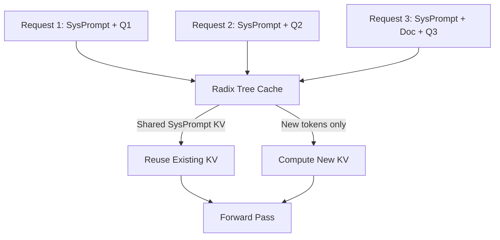

**Interview Q&A:**

*Q: RadixAttention kya hai aur prefix caching se kaise alag?*
Vanilla prefix caching ek hashtable hai — exact prefix match hi hit hota hai. RadixAttention ek radix tree (compressed trie) maintain karta hai KV blocks ka. Yeh non-trivial overlapping prefixes detect kar sakta hai, hierarchical caching karta hai, aur LRU eviction radix-tree-aware hota hai. Result: cache hit rate kahin zyada in real workloads.

*Q: SGLang DSL kyun zaroori hai?*
Agentic workflows mein tu often parallel branches chalata hai (e.g., "summarize 5 different ways simultaneously"), constrained output chahiye (JSON, regex), aur multi-turn state hota hai. Plain Python + OpenAI API se yeh likhna verbose hai aur server-side optimizations (KV reuse across forks) lose hote hain. SGLang DSL declaratively yeh express karne deta hai aur runtime optimize karta hai.

*Q: Performance vLLM vs SGLang?*
Pure throughput pe (no prefix sharing workload) dono comparable, vLLM thoda aage kabhi kabhi. Lekin kisi bhi workload mein jahan shared prefix hai (RAG, agentic, few-shot), SGLang 2-5x aage nikalta hai. JSON-constrained generation pe bhi SGLang tezz hai because it does compressed decoding.

*Q: SGLang production mein kab choose kare?*
Jab tera workload structured generation heavy ho (function calling, JSON schemas), ya RAG/long system prompts, ya agentic (multi-step tool calling). General chat? vLLM bhi theek hai.

---

### 1.5 llama.cpp, Ollama for local/edge

**Definition:** llama.cpp Georgi Gerganov ka legendary C/C++ project hai jo LLMs ko CPU + minimal GPU pe efficiently chala sakta hai, GGUF quantization format ke saath. Ollama ek user-friendly wrapper hai llama.cpp ke upar — Docker-style commands se models pull/run kar, REST API mil jaata hai.

**Why:** GPUs mehngi hain. Privacy-sensitive use cases mein cloud nahi le sakte. Edge devices (laptops, phones, Raspberry Pi) pe LLM chalana hai. Quantized models (Q4_K_M, Q5_K_M) ke saath llama.cpp 7B model ko ek M2 MacBook pe 30 tokens/sec deta hai — that's productive territory.

**How:**

```bash
# Ollama install (Mac/Linux)
curl -fsSL https://ollama.com/install.sh | sh

# Model pull aur run kar — Docker jaisi vibes
ollama pull llama3.1:8b
ollama run llama3.1:8b "Explain quantum entanglement in 2 lines"

# Custom Modelfile — system prompt + params customize kar
cat > Modelfile <<EOF
FROM llama3.1:8b
PARAMETER temperature 0.3
PARAMETER num_ctx 8192
SYSTEM "Tu ek senior Indian engineer hai. Always reply in Hinglish."
EOF
ollama create my-coder -f Modelfile
ollama run my-coder
```

```python
# Python client — OpenAI-compatible API
from openai import OpenAI
client = OpenAI(base_url="http://localhost:11434/v1", api_key="ollama")

response = client.chat.completions.create(
    model="llama3.1:8b",
    messages=[{"role": "user", "content": "Hi"}],
)
```

```bash
# llama.cpp directly — more control
./llama-server \
  -m models/llama-3-8b-q4_k_m.gguf \
  -c 8192 \                           # context size
  -ngl 35 \                           # offload 35 layers to GPU
  --host 0.0.0.0 --port 8080
```

**Real-life Example:** GitHub Copilot ka local-only competitor "Continue.dev" Ollama use karta hai — developer apne MacBook pe codellama chala leta hai, code IDE company servers pe nahi jata. Ek health-tech startup jo HIPAA-strict tha, on-prem llama.cpp server pe Llama-3-70B Q4_K_M chalata hai — patient data kabhi cloud pe nahi gaya.

**Mermaid Diagram:**

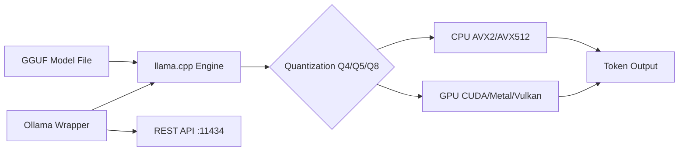

**Interview Q&A:**

*Q: GGUF format mein kya special hai?*
GGUF (GPT-Generated Unified Format) ek single-file format hai jo model weights + tokenizer + metadata + quantization info sab embed karta hai. Quick to load (mmap-able), platform-independent, aur multiple quantization schemes support karta hai (Q2_K, Q4_K_M, Q5_K_M, Q8_0, etc. — har ek different bits-per-weight).

*Q: llama.cpp GPU pe kab tezz, CPU pe kab?*
Agar pura model GPU mein fit ho jaye (`-ngl 999` se all layers offload), GPU 5-10x tezz. Agar partial offload (memory limit), bottleneck CPU<->GPU transfer ban jaata hai aur throughput drop hota hai. Apple Silicon pe Metal backend incredibly fast hai because unified memory.

*Q: Ollama production-ready hai?*
Single-user / dev workloads ke liye haan, multi-tenant production load ke liye nahi. Concurrency limited hai (default 1 parallel request), batching nahi hai vLLM jaisi sophistication. Edge devices, internal tools, demos — perfect. 1000 QPS chahiye? vLLM le.

*Q: Quantization mein quality loss kitna hota hai?*
Q8_0 ~0.1% perplexity increase (basically lossless), Q5_K_M ~1%, Q4_K_M ~2-3%, Q3 ~5-8%, Q2 noticeably degraded. Sweet spot 7B-13B models ke liye Q4_K_M / Q5_K_M hai — model 50-60% size mein, quality acceptable.

---

### 1.6 LMDeploy

**Definition:** LMDeploy InternLM team (Shanghai AI Lab) ka inference + deployment toolkit hai. TurboMind nam ka iska C++ inference engine hai jo TensorRT-LLM jaisa hi peak performance deta hai NVIDIA GPUs pe, lekin open-source aur lighter to use. PyTorch backend bhi available hai for flexibility.

**Why:** TensorRT-LLM se simpler deploy, vLLM se faster on certain workloads, especially InternLM aur Qwen family models pe optimized. KV cache INT8/INT4 quantization, weight-only quantization (AWQ), aur online INT8 quantization sab supported. Multimodal LLMs (LLaVA, InternVL) ka first-class support hai — yeh vLLM mein abhi catching up hai.

**How:**

```bash
pip install lmdeploy

# CLI se quick serve
lmdeploy serve api_server \
  internlm/internlm2_5-7b-chat \
  --backend turbomind \                 # ya pytorch
  --tp 2 \
  --quant-policy 4 \                    # KV cache INT4 quantization
  --cache-max-entry-count 0.8 \         # 80% free GPU mem for KV cache
  --server-port 23333
```

```python
# Python pipeline API
from lmdeploy import pipeline, TurbomindEngineConfig

backend_config = TurbomindEngineConfig(
    tp=2,
    quant_policy=4,           # INT4 KV cache
    cache_max_entry_count=0.8,
)

pipe = pipeline("internlm/internlm2_5-7b-chat", backend_config=backend_config)

# Batch inference
prompts = ["Q1", "Q2", "Q3"]
responses = pipe(prompts)
for r in responses:
    print(r.text)
```

```python
# Multimodal — image + text
from lmdeploy import pipeline
from lmdeploy.vl import load_image

pipe = pipeline("OpenGVLab/InternVL2-8B")
image = load_image("./diagram.png")
response = pipe(("Explain this architecture diagram", image))
print(response.text)
```

**Real-life Example:** Chinese cloud providers (Alibaba, Tencent) jab Qwen models serve karte hain, LMDeploy + TurboMind common stack hai. Ek edtech company jo InternVL-based document understanding chala rahi thi for textbook QA, LMDeploy pe migrate hui — multimodal vLLM se 2x throughput mila aur INT4 KV cache se memory 60% kam hui.

**Mermaid Diagram:**

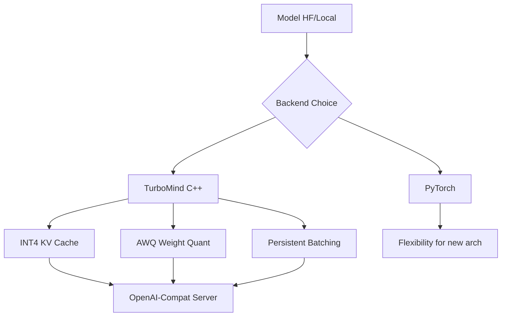

**Interview Q&A:**

*Q: TurboMind aur TensorRT-LLM mein difference?*
Dono C++ inference engines hain NVIDIA GPUs ke liye. TensorRT-LLM AOT compilation karta hai engines mein (slow build, peak speed), TurboMind runtime configuration use karta hai (faster setup, comparable speed). TurboMind open-source aur deploy karna easier — bas pip install lmdeploy aur chala.

*Q: KV cache quantization (INT4) ka impact?*
KV cache typically GPU memory ka 50-70% leta hai long-context workloads pe. INT4 quantization se yeh 75% kam ho jaata hai. Quality impact minimal (<0.5% perplexity in most cases) because KV values mostly low-magnitude hote hain. Trade-off: dequantize karne ka slight latency overhead, but tensor cores se hide ho jaata hai.

*Q: Multimodal serving mein challenge kya hai?*
Vision encoder (ViT) aur LLM dono GPU pe co-locate karne hote hain. Image preprocessing CPU pe bottleneck ban sakta hai. Variable token count (image se 256-2880 tokens), so batching tricky hota hai. LMDeploy yeh sab handle karta hai natively.

*Q: LMDeploy vs vLLM, kab choose kare?*
Qwen, InternLM, InternVL family models pe LMDeploy slightly aage. Multimodal pe definitely LMDeploy. General Llama/Mistral serving pe vLLM ka ecosystem aur community bigger hai. INT4 KV cache critical hai? LMDeploy.

---

## 2. Inference Optimization

### 2.1 Continuous batching deep dive

**Definition:** Continuous batching (a.k.a. iteration-level scheduling, in-flight batching) ek scheduling technique hai jahan har decoding iteration ke baad scheduler running batch ko reconfigure karta hai — completed requests ko evict karke naye requests ko inject karta hai. Static batching ka opposite, jahan pura batch sync mein chalta hai.

**Why:** LLM generation length per request hugely variable hai (10 tokens to 4000 tokens). Static batching mein longest request finish hone tak GPU idle. Continuous batching ne yeh fix kiya, throughput 5-20x improve hua. Aaj ka koi bhi serious LLM serving framework continuous batching use karta hai.

**How (conceptually):**

```python
# Pseudocode — kaise scheduler kaam karta hai
class ContinuousBatchScheduler:
    def __init__(self, max_batch_size=64):
        self.running = []          # currently generating requests
        self.waiting = []          # queued requests
        self.max_bs = max_batch_size
    
    def step(self):
        # Step 1: Naye requests admit kar agar slots khaali hain
        while len(self.running) < self.max_bs and self.waiting:
            req = self.waiting.pop(0)
            # Prefill stage — pura prompt ek shot mein process kar
            req.kv_cache = self.prefill(req.prompt_tokens)
            self.running.append(req)
        
        # Step 2: Saare running requests ka ek decoding step (1 token each)
        next_tokens = self.batch_decode([r for r in self.running])
        
        # Step 3: Completed requests ko evict kar
        for req, token in zip(self.running, next_tokens):
            req.output.append(token)
            if token == EOS or len(req.output) >= req.max_tokens:
                req.complete()
                # KV cache slot free ho gaya — agla request fit ho sakta
        self.running = [r for r in self.running if not r.done]
```

```bash
# vLLM mein automatic — bas server start kar
vllm serve meta-llama/Llama-3-8B-Instruct \
  --max-num-seqs 256 \                # max batch size
  --max-num-batched-tokens 8192       # total tokens per iteration limit
```

**Real-life Example:** Production chat app jahan responses 20 tokens (clarifications) se 800 tokens (detailed answers) tak vary karte hain. Static batching pe GPU 25% utilized tha. Continuous batching pe 88%. Same hardware pe 4x more concurrent users handle hone lage.

**Mermaid Diagram:**

```mermaid
gantt
    title Continuous Batching Timeline
    dateFormat X
    axisFormat %s
    section Static
    Req A 100 tokens :a1, 0, 5
    Req B 20 tokens  :a2, 0, 5
    Req C 50 tokens  :a3, 0, 5
    section Continuous
    Req A 100 tokens :b1, 0, 5
    Req B 20 tokens  :b2, 0, 1
    Req D new        :b4, 1, 4
    Req C 50 tokens  :b3, 0, 3
    Req E new        :b5, 3, 5
```

**Interview Q&A:**

*Q: Prefill aur decode phases continuous batching mein alag kyun handle hote hain?*
Prefill compute-bound hai (puri prompt parallel mein process hoti hai, GEMM-heavy), decode memory-bound hai (ek token at a time, KV cache reads dominate). Same batch mein dono mix karna inefficient hai — modern systems "chunked prefill" karte hain, prefill ko chunks mein todke decode iterations mein interleave karte hain.

*Q: Max batch size kaise decide kare?*
Trade-off: bada batch = more throughput per GPU, lekin per-request latency badhti hai (har step zyada kaam karta hai), aur KV cache memory limit aata hai. Practical: max-num-seqs 128-256, max-num-batched-tokens model + GPU memory pe depend. vLLM auto-tune karta hai mostly.

*Q: Continuous batching mein fairness kaise ensure kare?*
Default FCFS (first-come-first-served), but starvation possible hai agar long requests batch hog karein. vLLM mein priority scheduling, preemption (long requests ko evict karna agar SLA breach ho), aur SLO-aware scheduling jaise features aa rahe hain.

*Q: Chunked prefill kya hai?*
Bahut long prompt (e.g., 32K tokens) ka prefill ek single iteration mein karna means decode iterations slow ho jaayengi (10+ seconds tak). Chunked prefill mein prompt ko 2K-4K token chunks mein todke har iteration mein ek chunk process karte hain, beech beech mein decode iterations chalti rehti hain. Latency aur throughput dono balanced.

---

### 2.2 Speculative decoding, Medusa, EAGLE

**Definition:** Speculative decoding ek latency optimization hai jahan ek chhota "draft model" multiple tokens speculatively generate karta hai, fir bada "target model" un tokens ko ek single forward pass mein verify karta hai. Agar match hua, multiple tokens ek step mein accept ho jaate hain. Medusa aur EAGLE iske advanced variants hain — alag draft mechanism use karte hain.

**Why:** Decode phase memory-bound hai, GPU compute under-utilized. Agar tu ek forward pass mein 3-5 tokens predict + verify kar le, effectively 3-5x decode speedup mil sakta hai. Quality bilkul same rehti hai because target model verify kar raha hai.

**How:**

```bash
# vLLM mein speculative decoding enable kar
vllm serve meta-llama/Llama-3-70B-Instruct \
  --speculative-model meta-llama/Llama-3-8B-Instruct \
  --num-speculative-tokens 5 \         # draft 5 tokens at a time
  --use-v2-block-manager
```

```python
# Conceptual algorithm
def speculative_decode(target, draft, prompt, k=5):
    tokens = prompt
    while not done:
        # Step 1: Draft model k tokens generate kare (sasta, fast)
        draft_tokens, draft_probs = draft.generate(tokens, k=k)
        
        # Step 2: Target model k+1 tokens parallely verify kare
        # Yeh ek single forward pass hai, batched
        target_probs = target.forward(tokens + draft_tokens)
        
        # Step 3: Acceptance check — rejection sampling
        accepted = 0
        for i in range(k):
            r = random.random()
            ratio = target_probs[i][draft_tokens[i]] / draft_probs[i]
            if r < min(1, ratio):
                accepted += 1
            else:
                # Reject — sample from corrected distribution
                break
        
        tokens.extend(draft_tokens[:accepted])
        # Even if 0 accepted, target ka own next token use kar lo
        if accepted < k:
            tokens.append(sample(target_probs[accepted]))
```

```bash
# Medusa heads — model ke saath multiple decoding heads train karte hain
# vLLM Medusa support
vllm serve meta-llama/Llama-3-8B-Instruct \
  --speculative-model FasterDecoding/medusa-1.0-vicuna-7b-v1.5 \
  --num-speculative-tokens 4
```

**Real-life Example:** GitHub Copilot, Cursor, aur most code-completion products speculative decoding heavily use karte hain. Code mein high token-level predictability hai (boilerplate patterns), draft acceptance rate 80%+. Latency 2-3x kam ho gayi without quality loss. Cursor specifically uses custom speculative decoding for their "Tab" autocomplete.

**Mermaid Diagram:**

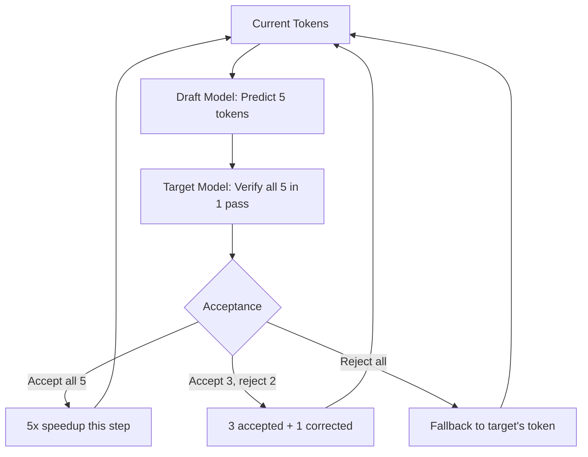

**Interview Q&A:**

*Q: Speculative decoding quality preserve kaise karta hai?*
Mathematical guarantee hai — rejection sampling ensures ki final distribution exactly target model ki distribution se sample ho rahi hai. Proof Leviathan et al. 2023 paper mein hai. So output distribution identical, sirf speed alag.

*Q: Medusa kaise different hai vanilla speculative se?*
Vanilla mein draft ek separate model hota hai (extra GPU memory, separate inference). Medusa mein target model ke saath multiple "Medusa heads" attach kiye jaate hain (lightweight extra layers) jo simultaneously next-N tokens predict karte hain. Single model, no separate draft, simpler deployment. Trade-off: heads ko fine-tune karna padta hai.

*Q: EAGLE aur Medusa mein fark?*
EAGLE (Extrapolation Algorithm for Greater Language-model Efficiency) Medusa se zyada accurate hai because woh feature-level extrapolation karta hai (hidden states ka use karta hai draft ke liye, not just logits). Acceptance rate higher, especially long horizons pe. EAGLE-2, EAGLE-3 latest variants hain.

*Q: Speculative decoding kab fail karta hai?*
Jab task low predictability ho — creative writing, random sampling with high temperature, very small target model. Acceptance rate <30% mein speedup nahi milta, overhead ulta lag jaata hai. Ideal: code, structured output, factual QA, low-temperature generation.

---

### 2.3 FlashAttention 2/3

**Definition:** FlashAttention ek IO-aware exact attention algorithm hai (Tri Dao, 2022). Standard attention O(N²) memory access karta hai HBM (slow GPU memory) mein. FlashAttention tiling + recomputation use karke attention ko entirely SRAM (fast on-chip cache) mein compute karta hai, HBM access drastically reduce. FA2 (2023) further optimized, FA3 (2024) Hopper-specific (TMA, asynchronous WGMMA).

**Why:** Standard attention bottleneck ban gaya tha large context lengths pe — N² memory na sirf slow tha balki OOM bhi karta tha. FlashAttention ne yeh O(N) memory mein convert kiya, 2-4x speedup, aur 100K+ context lengths feasible banaye. Aaj har serious LLM stack mein FlashAttention default hai.

**How:**

```python
# Direct usage
pip install flash-attn --no-build-isolation

from flash_attn import flash_attn_func

# Q, K, V: [batch, seqlen, num_heads, head_dim]
out = flash_attn_func(
    q, k, v,
    dropout_p=0.0,
    softmax_scale=None,        # default 1/sqrt(d)
    causal=True,               # decoder-style masking
    window_size=(-1, -1),      # sliding window? -1 means full
)
```

```python
# HuggingFace transformers mein enable kar
from transformers import AutoModelForCausalLM

model = AutoModelForCausalLM.from_pretrained(
    "meta-llama/Llama-3-8B",
    torch_dtype=torch.bfloat16,
    attn_implementation="flash_attention_2",   # FA2 enable
    device_map="auto",
)
```

```bash
# vLLM automatically FA2/FA3 use karta hai jab available ho
# H100 pe FA3 default ho jaata hai, A100 pe FA2
vllm serve meta-llama/Llama-3-8B --dtype bfloat16
# Logs mein dikhega: "Using FlashAttention-3 backend"
```

**Real-life Example:** Anthropic Claude, OpenAI GPT-4, Meta Llama-3 — sab FlashAttention variants use karte hain training aur inference dono mein. Long-context models (Claude 200K, Gemini 1M) FlashAttention ke bina possible hi nahi the. Ek 128K context summarization service ne FA2 enable karke memory usage 8x kam ki, throughput 3x badha.

**Mermaid Diagram:**

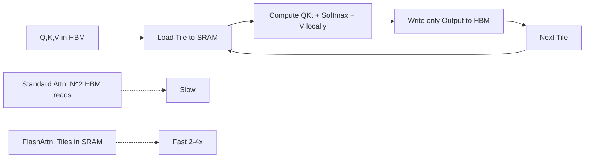

**Interview Q&A:**

*Q: FlashAttention mathematically exact hai ya approximate?*
Exact. Yeh bilkul same output deta hai standard attention jaise. Trick algorithmic hai — online softmax computation (running max + sum) jisse tiling possible ho gayi without losing precision. Approximation jaisa Linformer ya Performer nahi hai.

*Q: FA2 vs FA3 mein kya improve hua?*
FA2 ne work partitioning aur warp-level parallelism improve kiya — FA1 vs FA2 ~2x speedup. FA3 specifically Hopper (H100) ke liye optimize hua — TMA (Tensor Memory Accelerator) for async data movement, WGMMA (warpgroup matmul) for FP8 tensor cores, aur softmax + GEMM ka overlap. H100 pe FA3 ~75% peak FLOPs hit karta hai (FA2 ~35% tha).

*Q: FlashAttention sabhi attention variants pe kaam karta hai?*
Causal, non-causal, sliding window, ALiBi — sab supported. MQA/GQA bhi works. Cross-attention bhi. Limitations: head_dim multiples of 8 hone chahiye, kuch exotic patterns (block-sparse) custom kernel chahiye.

*Q: Inference time pe FlashAttention prefill vs decode mein kaisa kaam karta hai?*
Prefill (long sequences) pe huge benefit — yahan attention dominant cost hai. Decode (single token) pe benefit kam, because attention small ho jaati hai (1 query vs N keys), aur memory bandwidth bottleneck hota hai. FlashDecoding aur FlashDecoding++ specifically decode ke liye optimize karte hain — KV-cache split kar ke parallel attention compute karte hain.

---

### 2.4 Prefix caching

**Definition:** Prefix caching ek optimization hai jahan tu shared prefix (system prompt, few-shot examples, document context) ka KV cache compute ek baar karta hai aur subsequent requests ke liye reuse karta hai. vLLM mein automatic prefix caching available hai, SGLang mein RadixAttention.

**Why:** RAG, agentic systems, aur chatbots mein har request ke saath bahut sa repeated context hota hai (5KB+ system prompt, retrieved chunks). Without caching, har request iska KV cache scratch se compute karti hai — pure waste. Caching karne se prefill cost zero ho jaati hai for cached portion.

**How:**

```bash
# vLLM mein enable kar
vllm serve meta-llama/Llama-3-8B-Instruct \
  --enable-prefix-caching \
  --num-gpu-blocks-override 4096        # KV cache blocks
```

```python
# Client side — kuch alag karne ki zaroorat nahi
# Bas same prefix bhej, vLLM hash-based detect kar lega
import openai
client = openai.OpenAI(base_url="http://localhost:8000/v1", api_key="x")

SYSTEM_PROMPT = """You are an expert assistant... [5KB of instructions]"""

# Pehli request — full prefill compute
r1 = client.chat.completions.create(
    model="meta-llama/Llama-3-8B-Instruct",
    messages=[
        {"role": "system", "content": SYSTEM_PROMPT},   # cached
        {"role": "user", "content": "What is RAG?"},
    ],
)

# Doosri request — system prompt cache hit, prefill 90% sasta
r2 = client.chat.completions.create(
    model="meta-llama/Llama-3-8B-Instruct",
    messages=[
        {"role": "system", "content": SYSTEM_PROMPT},   # CACHE HIT!
        {"role": "user", "content": "What is fine-tuning?"},
    ],
)
```

```bash
# SGLang RadixAttention — automatic, smarter
python -m sglang.launch_server \
  --model meta-llama/Llama-3-8B-Instruct \
  --enable-radix-cache       # default true
```

**Real-life Example:** Ek legal-tech RAG system jisme har query ke saath 50KB system prompt + retrieved law documents jaate the. Without prefix caching, prefill latency 800ms tha. Prefix caching enable karte hi cached portion 50ms mein resolve hone laga (just hash lookup + KV reuse), total latency 200ms. p50 latency 4x improved without throughput trade-off.

**Mermaid Diagram:**

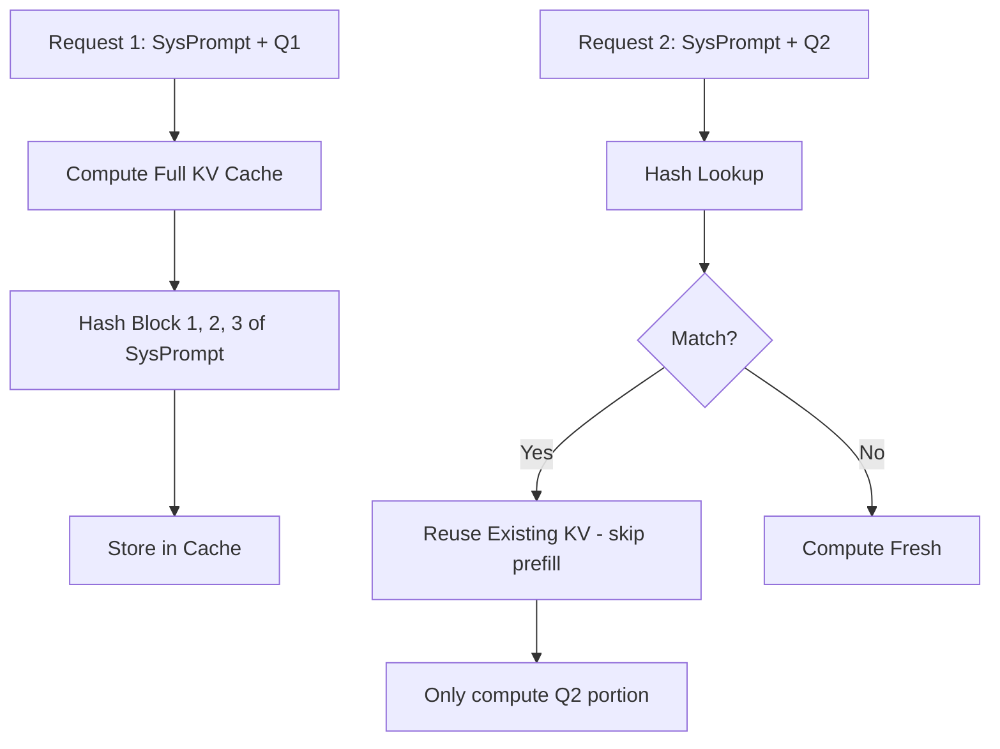

**Interview Q&A:**

*Q: Prefix caching ka memory cost?*
Cached KV cache GPU memory mein store hota hai, eviction LRU-style. Trade-off: zyada cache size = higher hit rate but kam memory available for active requests. vLLM `--num-gpu-blocks-override` se tune kar sakta hai. Typical workloads pe 20-30% GPU memory cache ko dene se best ROI.

*Q: Prefix caching ka cache invalidation kab hota hai?*
Block-level hashing hota hai (16 tokens per block typical). Agar prefix exactly match ho block boundary tak, hit. Ek bhi token alag, miss. Eviction LRU. Model weights change hone pe full flush.

*Q: Multi-turn conversations mein prefix caching kaise help karta hai?*
Har turn ka context = previous full conversation. Pichli turns ka KV already cached, sirf new user message ka prefill hota hai. Long conversations (10+ turns) mein 10x throughput improvement common hai.

*Q: Cache poisoning ya security concern hain?*
Block hashing content-addressable hai — agar do users ka prefix exactly same hai, cache reuse safe hai (same input means same KV). PII concern: cached blocks GPU memory mein hain, isolated process. Cross-tenant scenarios mein per-tenant namespaces use kar.

---

### 2.5 Tensor parallelism, pipeline parallelism

**Definition:** Tensor Parallelism (TP) — single layer ke weights ko multiple GPUs pe split karta hai (e.g., attention heads split, MLP rows/columns split). Har forward pass mein all-reduce communication. Pipeline Parallelism (PP) — different layers ko different GPUs pe rakhta hai, micro-batches stage-wise flow karte hain. Bade models (70B+) ke liye dono combine karne padte hain.

**Why:** 70B+ models single GPU mein fit nahi hote (bf16 mein ~140GB, A100 80GB). TP intra-node fast (NVLink), PP inter-node fast (Ethernet/Infiniband). Combined parallelism (TP within node + PP across nodes) ne hyperscale serving feasible banaya.

**How:**

```bash
# vLLM mein TP — single node, multi-GPU
vllm serve meta-llama/Llama-3-70B-Instruct \
  --tensor-parallel-size 8 \           # 8 GPUs, layer weights split
  --dtype bfloat16
# Yeh 70B model ko 8x A100 80GB pe distribute karega

# TP + PP — multi-node
vllm serve meta-llama/Llama-3-405B-Instruct \
  --tensor-parallel-size 8 \           # within each node
  --pipeline-parallel-size 4 \         # 4 nodes
  --dtype bfloat16
# Total 32 GPUs across 4 nodes
```

```python
# Megatron-style TP intuition (manual implementation snippet)
# Column-parallel linear: Y = XW where W is split column-wise
class ColumnParallelLinear(nn.Module):
    def __init__(self, in_features, out_features, world_size):
        super().__init__()
        # Each GPU has only out_features // world_size columns
        self.weight = nn.Parameter(
            torch.empty(out_features // world_size, in_features)
        )
    
    def forward(self, x):
        # Local matmul — har GPU apna chunk compute kare
        local_out = F.linear(x, self.weight)
        # No communication needed if next layer is row-parallel
        return local_out

# Row-parallel linear: input split, output all-reduced
class RowParallelLinear(nn.Module):
    def forward(self, x):
        local_out = F.linear(x, self.weight)
        # All-reduce across GPUs — yahan communication hota hai
        torch.distributed.all_reduce(local_out)
        return local_out
```

**Real-life Example:** Meta jab Llama-3-405B serve karta hai internally, woh 8-way TP within node + 4-way PP across nodes use karta hai. NVIDIA NIM Llama-3-70B inference 8xH100 TP=8 setup pe runs, per-GPU 87GB model weights + KV cache. Communication overhead NVLink 4 (900 GB/s) handle kar leta hai easily.

**Mermaid Diagram:**

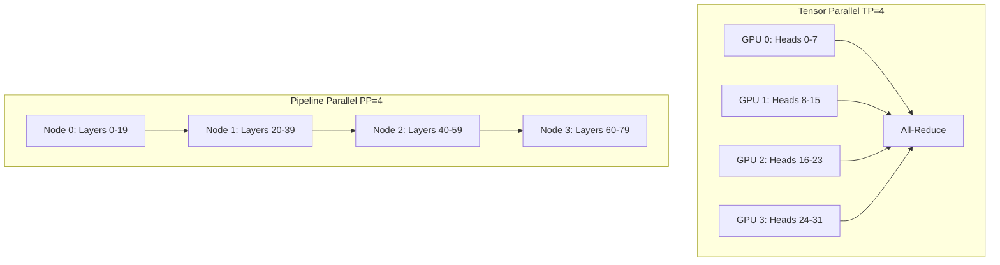

**Interview Q&A:**

*Q: TP aur PP mein communication pattern ka fark?*
TP per-layer all-reduce karta hai — high-frequency, latency-sensitive. NVLink jaisi high-bandwidth interconnect zaroori. PP point-to-point activation passing karta hai stage boundaries pe — low-frequency, less latency-sensitive. Cross-node Ethernet bhi chal jaata hai.

*Q: TP=8 above kyun nahi jaate generally?*
Most servers mein 8 GPUs per node hote hain (NVLink fully connected). 8 ke beyond cross-node TP karna means slow interconnect, all-reduce kill ho jaata hai latency. Beyond 8 GPUs ke liye PP add karte hain.

*Q: Pipeline bubble kya hai?*
PP mein pehla microbatch stage 0 pe shuru hota hai, jab tak woh stage N tak pahunche, baaki stages idle hote hain (warmup bubble). Same end mein (cooldown bubble). 1F1B (one-forward-one-backward) scheduling ya interleaved scheduling se bubble kam karte hain. Inference mein bubble training se kam matter karta hai because no backward pass.

*Q: Expert Parallelism (EP) kya hai MoE models mein?*
Mixture-of-Experts (Mixtral, DeepSeek-V3) mein experts ko different GPUs pe distribute karte hain. Token routing decide karta hai konsa expert call hoga, all-to-all communication tokens ko proper expert tak bhejti hai. Yeh TP/PP ke saath orthogonal hai.

---

### 2.6 Quantization for inference (FP8, INT4)

**Definition:** Quantization model weights aur/ya activations ko low-precision (FP16 -> FP8/INT8/INT4) mein convert karta hai. Inference time pe yeh memory bandwidth aur compute dono bachata hai. Common schemes: FP8 (E4M3/E5M2), INT8 (W8A8), INT4 weight-only (GPTQ, AWQ), NF4 (QLoRA-style).

**Why:** LLM inference memory-bandwidth-bound hai mostly. Weights ko 4x smaller (INT4) banane se memory reads 4x kam, throughput proportionally up. Plus H100 pe FP8 tensor cores BF16 se 2x peak FLOPs dete hain. Quality loss minimal agar properly calibrated.

**How:**

```bash
# AWQ (Activation-aware Weight Quantization) — popular INT4 method
pip install autoawq

python -c "
from awq import AutoAWQForCausalLM
from transformers import AutoTokenizer

model_path = 'meta-llama/Llama-3-8B-Instruct'
quant_path = 'llama3-8b-awq-int4'

model = AutoAWQForCausalLM.from_pretrained(model_path)
tokenizer = AutoTokenizer.from_pretrained(model_path)

# Calibration data — representative samples
quant_config = {'zero_point': True, 'q_group_size': 128, 'w_bit': 4, 'version':'GEMM'}
model.quantize(tokenizer, quant_config=quant_config)
model.save_quantized(quant_path)
"

# Serve quantized model with vLLM
vllm serve llama3-8b-awq-int4 --quantization awq --dtype float16
```

```bash
# FP8 quantization on H100 — vLLM native support
vllm serve meta-llama/Llama-3-70B-Instruct \
  --quantization fp8 \                # automatic FP8 weights+activations
  --kv-cache-dtype fp8 \              # KV cache bhi FP8
  --dtype auto

# Pre-quantized FP8 model — Neural Magic releases bahut popular hain
vllm serve neuralmagic/Meta-Llama-3-70B-Instruct-FP8 --dtype auto
```

```python
# GPTQ — alternate INT4 method, slightly different calibration
from transformers import AutoModelForCausalLM, GPTQConfig

quant_config = GPTQConfig(
    bits=4,
    dataset="c4",                    # calibration dataset
    tokenizer=tokenizer,
    group_size=128,
)

model = AutoModelForCausalLM.from_pretrained(
    "meta-llama/Llama-3-8B",
    quantization_config=quant_config,
    device_map="auto",
)
```

**Real-life Example:** Neural Magic (now part of Red Hat) ne Llama-3-70B ka FP8 version release kiya — original BF16 140GB, FP8 70GB. Single H100 80GB pe fit ho jaata hai (jahan BF16 ke liye 2x A100 chahiye the), throughput 1.8x. Cost per million tokens ~50% kam. Quality benchmarks pe <1% drop, mostly within noise.

**Mermaid Diagram:**

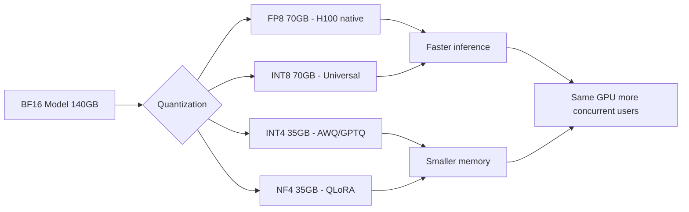

**Interview Q&A:**

*Q: AWQ aur GPTQ mein difference?*
GPTQ Hessian-based weight reconstruction karta hai — complex but accurate. AWQ activation magnitudes dekh ke important channels ko higher precision deta hai (no reconstruction). AWQ faster to quantize, comparable quality, better hardware-friendly kernels. AWQ practical winner production mein.

*Q: KV cache quantization kyun important?*
Long-context (32K+) workloads mein KV cache memory ka 70%+ leta hai. Weight quantization karne ke baad bhi KV cache full precision mein rahe toh memory saved nahi hua. INT8/FP8 KV cache effective memory 2x deta hai, throughput proportionally up. Quality impact minimal because KV values low magnitude hain.

*Q: FP8 H100 pe kyun important hai?*
Hopper architecture mein dedicated FP8 tensor cores hain — BF16 ke compared 2x peak FLOPs (1979 vs 989 TFLOPs). Memory bandwidth bhi effectively 2x. Result: Llama-70B FP8 BF16 se ~1.8x faster on H100. Ada Lovelace (L40S, 4090) bhi FP8 support karta hai.

*Q: Quantization karne ke baad quality kaise validate kare?*
Standard benchmarks: MMLU, HumanEval, GSM8K, IFEval — pre/post quantization compare. Production mein A/B test kar real traffic pe — user satisfaction, retry rate, length deltas dekh. Domain-specific eval set ban — generic benchmarks miss kar sakte hain edge cases.

---

## Resources & further reading

- **PagedAttention paper:** "Efficient Memory Management for Large Language Model Serving with PagedAttention" — Kwon et al., 2023 (vLLM ka foundation)
- **FlashAttention papers:** FA1 (Dao et al. 2022), FA2 (Dao 2023), FA3 (Shah et al. 2024)
- **vLLM docs:** https://docs.vllm.ai — production serving guide, deployment recipes
- **SGLang docs + RadixAttention paper:** "Efficiently Programming Large Language Models using SGLang" — Zheng et al., 2024
- **TGI repo:** https://github.com/huggingface/text-generation-inference
- **TensorRT-LLM:** https://github.com/NVIDIA/TensorRT-LLM — official examples + perf benchmarks
- **LMDeploy:** https://github.com/InternLM/lmdeploy
- **llama.cpp:** https://github.com/ggerganov/llama.cpp — GGUF spec, quantization details
- **Speculative decoding:** Leviathan et al. 2023, Medusa (Cai et al. 2024), EAGLE (Li et al. 2024)
- **AWQ:** Lin et al. 2023, "AWQ: Activation-aware Weight Quantization"
- **GPTQ:** Frantar et al. 2022
- **FP8 LLM:** "FP8 Quantization for LLMs" (Neural Magic + various)
- **Continuous batching:** Orca paper (Yu et al., OSDI 2022)

Bhai, yeh tha LLM serving + inference ka full stack. Ek line mein takeaway: vanilla HuggingFace inference se production tak ka rasta vLLM/SGLang + FlashAttention + continuous batching + speculative decoding + FP8/INT4 quantization se hota hai. Har optimization 2-5x deta hai, milke 50-100x improvement easily mil jaata hai. Next stop: tu ek model deploy kar production mein, metrics dekh, aur iteratively in techniques ko layer kar.
