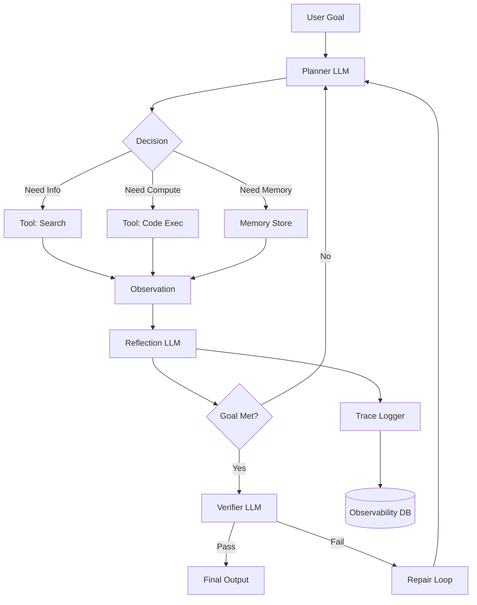
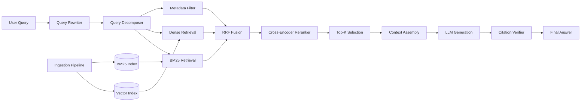
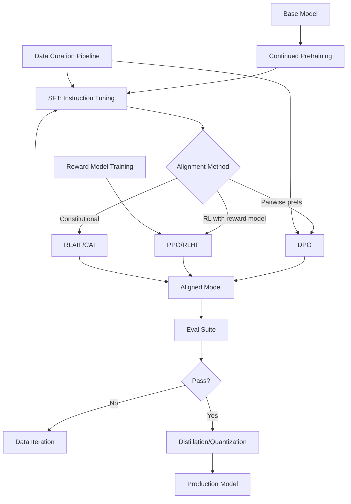
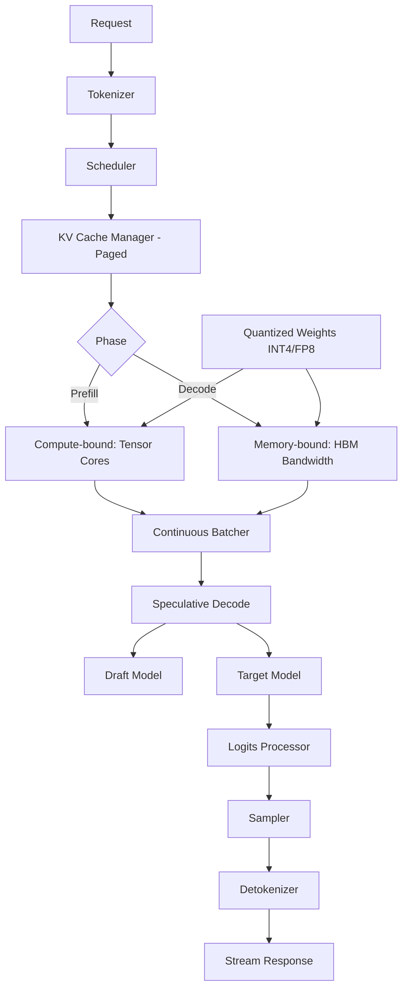
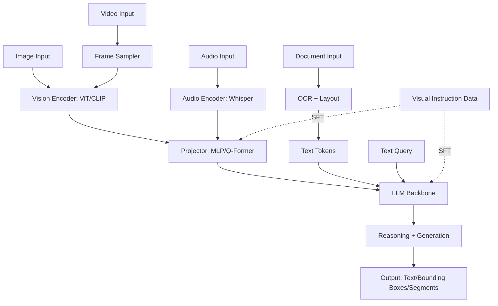
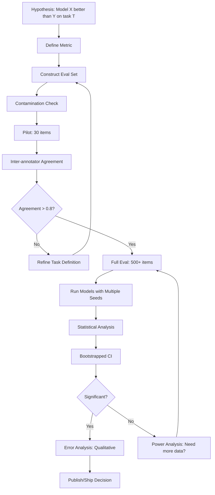

# Pick Your Specialization

Dekh bhai, ab tak tune fundamentals padhe — transformers, attention, prompting, RAG basics, fine-tuning ka concept, inference ka idea. Yeh sab milake tujhe ek **generalist** banata hai. Aur generalist banke tu market me 70th percentile pe atak jaayega. Companies ko aaj generalist nahi chahiye — unko chahiye log jo ek specific problem ko *kha jaaye*. Top 2% engineers banne ke liye **T-shaped** banna padega: ek broad foundation jo poora GenAI stack cover kare, aur uske upar ek vertical depth jo tujhe ek topic ka real expert banaye. Specialization yahin se shuru hoti hai.

Aaj GenAI ka field itna bada ho gaya hai ki ek banda akela poora cover nahi kar sakta. Agent frameworks alag direction me ja rahe hain, retrieval research apna alag rabbit hole hai, fine-tuning ki techniques har 2 mahine me badalti hain, inference optimization ke liye CUDA aur kernel-level expertise chahiye, multimodal me vision-language fusion ek alag dimagi exercise hai, aur applied research/eval engineering me to statistics aur experimental design dono ka fusion hota hai. Tu agar sab kuch chhune ki koshish karega to kahin pe bhi gehraai nahi banayega — aur jab interview me koi senior puchhega "tumhara strongest area kya hai", tu jhol khaayega.

Toh is guide me hum 6 specialization paths cover karenge — Agent Engineer, RAG/Search Architect, Fine-Tuning Specialist, Inference Engineer, Multimodal Specialist, aur Applied Research/Eval Engineer. Har ek path ke liye main batauunga: yeh hai kya, kyun chuni jaaye, kaunsi skills chahiye, kaise progress karein, ek real engineer ki story, ek mental model diagram, aur ek interview question with detailed answer. Aakhir me ek decision framework dunga jo tujhe apna path pick karne me help karega. Yeh guide tu ek baar pad ke chhod nahi sakta — return karte rehna padega kyunki har 6 mahine me tu apne aap ko reassess karega.

---

## 1. Specialization Paths

### 1.1 Path A — Agent Engineer

#### Definition (kya hai yeh path)

Agent Engineer wo banda hai jo LLM ko ek **autonomous decision-maker** banata hai. Matlab tu sirf prompt nahi likhta — tu ek system design karta hai jo goal le, planning kare, tools ko call kare, errors handle kare, intermediate state manage kare, aur multi-step task complete kare without human babysitting. Yeh kaam dikhne me simple lagta hai (loop me LLM ko call karo na?), but production me yeh sabse complicated specialization hai. Tu deal karta hai non-determinism, infinite loops, tool failures, context window blowups, cost runaway, aur partial completions ke saath.

Agent engineer ka kaam frameworks tak limited nahi hai. Tu LangGraph, AutoGen, CrewAI, ya custom-built orchestrators use kar sakta hai — but assal kaam hai **state machine design**, **retry logic**, **tool schema design**, **memory architecture**, aur **agent evaluation harness** banana. Ek production-grade agent ke andar 10-15 components hote hain: planner, executor, tool registry, memory store (short-term + long-term), reflection loop, verifier, fallback chain, observability layer. Yeh specialization tujhe "AI software architect" bana deti hai.

#### Why? (kyun chuni jaaye, kis ke liye fit)

Yeh path tab pick karna jab tujhe **system design pasand hai aur tu non-determinism se nahi darta**. Agar tu woh banda hai jo distributed systems padhke excited hota tha, queues aur retries aur idempotency me maza aata tha, to agent engineering tera natural extension hai. Yahan har request ek mini distributed system ki tarah behave karta hai. Failure modes infinite hain — LLM gud-gud bolega, tool timeout karega, parsing fail hogi, context window saturate ho jayega — aur tujhe yeh sab gracefully handle karna padega.

Market me agent engineers ki demand sabse zyada growing hai abhi. Devin, Cognition, Adept, MultiOn, har AI startup agent build kar raha hai. Salaries top tier hain — US me $250k-$450k base, India me ₹40-80 LPA easy if you've shipped real agents. Career-wise yeh sabse "moaty" specialization hai kyunki agent engineering experience transferable hai across domains — aaj tu coding agent banayega, kal sales agent, parson healthcare agent.

Personality fit: tu detail-oriented hai, debugging me patience hai, traces padhna pasand karta hai, "why did this happen 3 turns ago" type investigation maza deti hai. Agar tu fast-iteration UI work pasand karta hai aur deep debugging boring lagti hai — yeh path tere liye nahi hai.

#### Skills required (deep technical skills)

- **Function calling deep dive**: OpenAI tool-calling spec, Anthropic tool use, structured outputs (JSON schema, Zod, Pydantic), parallel tool calls, tool error recovery
- **State machines & graph orchestration**: LangGraph internals, conditional edges, checkpointing, human-in-the-loop interrupts, replay
- **Memory systems**: episodic vs semantic vs procedural memory, vector-backed memory, summarization buffers, working memory windows
- **Planning algorithms**: ReAct, Plan-and-Execute, Tree of Thoughts, LATS (Language Agent Tree Search), reflection patterns (Reflexion, Self-Refine)
- **Tool design**: tool schema versioning, authentication propagation, sandboxing, dry-run modes, idempotency keys
- **Evaluation**: AgentBench, SWE-Bench, WebArena, custom task harnesses, trajectory scoring, LLM-as-judge for traces
- **Observability**: LangSmith, Langfuse, Phoenix, OpenTelemetry instrumentation, span trees, cost tracking per trajectory
- **Failure handling**: timeout policies, retry with exponential backoff, circuit breakers, fallback agents, partial credit recovery
- **Sandboxing**: Docker-in-Docker, Firecracker microVMs, E2B sandboxes, network egress control
- **Cost & latency engineering**: cheap-fast model routing for sub-tasks, prompt caching, KV cache reuse, speculative tool execution

#### Recommended path (papers, projects, OSS contributions)

**Papers** (read in this order):
1. *ReAct: Synergizing Reasoning and Acting in Language Models* (Yao et al., 2022) — foundational
2. *Toolformer* (Schick et al., 2023) — how models learn to use tools
3. *Reflexion: Language Agents with Verbal Reinforcement Learning* (Shinn et al., 2023)
4. *Tree of Thoughts* (Yao et al., 2023)
5. *Voyager: An Open-Ended Embodied Agent* (Wang et al., 2023) — lifelong learning
6. *SWE-Agent* (Yang et al., 2024) — agent-computer interface design
7. *AgentBench* (Liu et al., 2023) — eval methodology
8. *Generative Agents: Interactive Simulacra* (Park et al., 2023) — memory architecture

**Projects** (build these in order):
1. **Tool-use chatbot**: 5 tools, structured outputs, retry logic, cost tracking
2. **ReAct agent from scratch**: no framework, just OpenAI SDK + your own loop
3. **SWE-Bench Lite attempt**: pick 20 issues, solve at least 8 — humbling exercise
4. **Multi-agent debate system**: 3 agents argue, judge agent decides
5. **Production agent with persistence**: PostgreSQL state, resumable, observable, deployed on Railway/Modal

**OSS contributions**:
- LangGraph (LangChain) — easy first issues labeled
- AutoGen (Microsoft) — bigger surface area
- CrewAI — beginner-friendly
- smolagents (HuggingFace) — minimal codebase, great to read
- Aider, Continue.dev — coding agents in production

#### Real-life Example (engineer who specialized + outcome)

Take the example of **Sayash Kapoor's collaborator profile** types — let me give you a representative composite story. Consider an engineer like **Soren Dunn** (real engineer who blogs at sorendunn.com about agent eval); started as a regular SDE-2 at a fintech in 2022, knew Python and basic ML. Read *ReAct* paper in early 2023, built a small agent that could query their internal logs API. Showed it to his team, got moved to an "AI tools" team. Spent 9 months obsessing over agent reliability — wrote internal eval harness, contributed to LangGraph, started a blog about agent failure modes.

End of 2023, recruiter from Cognition (makers of Devin) reached out after reading his blog post on "why my agent loops infinitely". Joined as Founding Agent Engineer in early 2024. Equity package + base = ~$650k TC. Aaj woh principal engineer hai there. Lesson: **specialization compounds when you write publicly**. He didn't have a PhD, didn't go to MIT — just got obsessed with one problem and shipped consistently.

Indian example: **Akshay Pachaar** (look him up on LinkedIn) — went deep on agents in 2023, started The Vector Index newsletter, joined LightningAI as a developer advocate focused on agent infra. Started from a typical Tier-2 college background.

#### Diagram (Mermaid)

#### Interview Question + Answer

**Q: "Aapne ek agent banaya jo SQL queries generate karta hai aur execute karta hai. Production me usne ek baar same query 47 baar run kar di aur DB load 80% chala gaya. Bata kya hua hoga, aur kaise prevent karega?"**

Yeh classic agent reliability question hai. Pehli baat — agent ne loop maara, matlab uska terminating condition kahin pe break ho gaya. Most likely scenarios: (1) tool ne success return kiya but LLM ne observation parse nahi kiya properly, isliye usne soch liya "ye fail hua, retry" — yeh classic ReAct failure mode hai. (2) Tool call ne timeout pe partial response diya, agent confused ho gaya. (3) Planner LLM ka context window saturate ho gaya tha to usne previous tool calls ki history forget kar di aur same plan repeat karne laga. (4) Agent reflection step me "did I succeed?" judge karne ke liye agar same LLM use kar raha hai bina explicit verifier ke, to woh hallucinate kar sakta hai ki "abhi nahi hua, dobara try karo".

Prevention me layered approach chahiye. Pehla layer — **idempotency keys**: har query ko hash karke ek dedup cache me daalo, agar 60 second me same query aayi to short-circuit return karo. Doosra layer — **hard step limit**: agent ko maximum 8-10 steps allow karo, uske baad force terminate aur error report. Teesra layer — **tool-call rate limiter**: per-trajectory aur per-tool rate limit, jaise "ek trajectory me max 3 SQL executions". Chautha layer — **explicit verifier agent**: separate LLM call jo *only* check kare "did the previous step succeed?", with structured output `{success: bool, evidence: string}`. Paanchwa layer — **observability with circuit breaker**: agar koi trajectory 5 minutes se chal rahi hai ya cost $1 cross kar gayi, alert + auto-kill.

Senior-level answer me yeh bhi mention karunga ki root cause aksar **tool schema design** me hota hai — agar tool ka response schema ambiguous hai (kabhi `{result: ...}`, kabhi `{data: ...}`, kabhi error me 200 return), to LLM consistent parse nahi kar pata. Toh fix sirf agent layer pe nahi, tool layer pe bhi karna padta hai. Ye real-world incident jaisa scenario hai — Cursor, Devin, sabne yeh face kiya hai aur har ek ne similar layered defense banaya hai.

---

### 1.2 Path B — RAG / Search Architect

#### Definition (kya hai yeh path)

RAG/Search Architect wo banda hai jo company ke knowledge ko LLM ke context me sahi tarah inject karta hai. Yeh sirf "vector DB me embeddings daal do aur top-5 retrieve karo" wala basic RAG nahi hai — yeh hai **retrieval engineering at scale**. Tu deal karta hai chunking strategies, hybrid search (BM25 + dense), reranking, query rewriting, multi-hop retrieval, freshness, access control, citation grounding, hallucination reduction, aur evaluation of retrieval quality.

Production RAG system 10-15 stages ka pipeline hota hai: ingestion → parsing (PDFs, HTML, slides, code, audio) → chunking → enrichment (metadata, summaries) → embedding → indexing → query understanding → query expansion → hybrid retrieval → reranking → context assembly → prompt construction → generation → citation extraction → answer verification. Har stage me decisions hain jo end-to-end quality affect karte hain. RAG architect woh hai jo poora pipeline tune karta hai with experiments and metrics.

#### Why? (kyun chuni jaaye, kis ke liye fit)

Yeh path pick kar agar tu **information retrieval geek hai** ya banna chahta hai. IR ek 60-saal purana field hai jise LLMs ne suddenly hot bana diya. Agar tujhe Elasticsearch maza deta tha, agar tu search relevance pe ghantonn debate kar sakta hai, agar "why did this query return wrong result" investigate karne me satisfaction milti hai — yeh tera path hai.

Market angle: Almost every enterprise GenAI use-case ka core RAG hai — customer support bots, internal Q&A, legal research, medical literature, code search. Companies like Glean ($4B+ valuation), Hebbia, Perplexity, Exa, Vectara — sab RAG-first hain. Demand zyada hai but supply bhi growing — to differentiation chahiye through depth. Jo banda hybrid retrieval, reranking, evals tinone gehraai me jaanta hai woh easily ₹50-100 LPA in India, $200-400k US.

Personality fit: tu metrics-driven hai, A/B testing maza deti hai, "ye 3% better hai" type marginal gains pe motivate hota hai, statistics se nahi darta. Agar tu "build and ship fast" guy hai jo evaluation skip karta hai — RAG isn't your fit, kyunki RAG me eval-without-ship is the norm.

#### Skills required (deep technical skills)

- **IR fundamentals**: TF-IDF, BM25, IDF weighting, term frequency saturation, query likelihood models
- **Embeddings**: sentence-transformers, instruction-tuned embeddings (E5, BGE, Nomic), Matryoshka representations, late interaction (ColBERT)
- **Chunking strategies**: fixed-size, sentence-aware, semantic (LLM-based), hierarchical, parent-child, propositions-level
- **Vector DBs**: Pinecone, Weaviate, Qdrant, Milvus, pgvector, LanceDB — index types (HNSW, IVF, ScaNN), tradeoffs
- **Hybrid search**: reciprocal rank fusion (RRF), CombSUM, learned sparse (SPLADE), filter pushdown
- **Reranking**: cross-encoders (Cohere Rerank, BGE-reranker, Jina), LLM-as-reranker, listwise rerankers
- **Query understanding**: HyDE, query expansion, query decomposition, intent classification, routing
- **Multi-hop retrieval**: GraphRAG, Self-RAG, FLARE, IRCoT
- **Eval**: nDCG, MRR, recall@k, RAGAS metrics (faithfulness, answer relevancy, context precision/recall), Trulens
- **Knowledge graphs**: entity extraction, KG construction, hybrid KG+vector retrieval (Microsoft GraphRAG)
- **Production concerns**: incremental indexing, ACL-aware retrieval, multi-tenant isolation, freshness/TTL, deduplication

#### Recommended path (papers, projects, OSS contributions)

**Papers**:
1. *BM25* original (Robertson & Zaragoza) — old but read it
2. *Dense Passage Retrieval (DPR)* (Karpukhin et al., 2020)
3. *ColBERT* (Khattab & Zaharia, 2020) — late interaction
4. *RAG* original (Lewis et al., 2020)
5. *HyDE* (Gao et al., 2022) — hypothetical document embeddings
6. *Self-RAG* (Asai et al., 2023)
7. *FLARE* (Jiang et al., 2023) — active retrieval
8. *GraphRAG* (Microsoft Research, 2024)
9. *Lost in the Middle* (Liu et al., 2023) — long-context retrieval issues
10. *RAGAS* (Es et al., 2023) — evaluation framework

**Projects**:
1. **Build RAG over your Gmail/Slack**: parse, chunk, embed, retrieve, generate — all from scratch
2. **Reproduce a hybrid search benchmark**: BEIR dataset, run BM25 + dense + RRF, measure nDCG@10
3. **Build a query rewriter**: takes user query, generates 3 reformulations, measure retrieval lift
4. **Evaluate 5 chunking strategies**: same corpus, same queries, measure faithfulness and recall
5. **Production RAG with citations**: every answer must cite source, build citation verifier

**OSS contributions**:
- LlamaIndex — biggest RAG framework, lots of issues
- Haystack — production-grade, German engineering
- RAGFlow — newer, beautiful UI
- Vespa — battle-tested search engine
- txtai, LangChain retrievers

#### Real-life Example (engineer who specialized + outcome)

**Jerry Liu** (founder of LlamaIndex) — started as a research engineer at Quora and then Robust Intelligence. Late 2022 dekha ki LLMs context me data dene ka koi clean way nahi tha. Started GPT-Index (later LlamaIndex) as a side project. Within 18 months, raised $19M Series A from Greylock, became *the* name in RAG. Jerry didn't invent vector search — he became the *taxonomist* of RAG patterns and built the abstraction that everyone needed.

Indian example: **Vinija Jain** + **Aman Chadha** — built aman.ai which has the most comprehensive RAG/LLM notes online. Got hired by Stanford AI Lab, AWS, etc. The lesson: in RAG, **synthesizing knowledge clearly is itself a moat**. Another: **Greg Kamradt** (Twitter @GregKamradt) — became famous for the "Needle in a Haystack" benchmark, now consults for Anthropic and others.

Bottom line: RAG architects who *publish their experiments* (chunk size sweeps, retriever comparisons, eval results) become known faster than ones who silently ship.

#### Diagram (Mermaid)

#### Interview Question + Answer

**Q: "Tumhare RAG system me users complain kar rahe hain ki answers technically correct hain but context se sahi quote nahi kar rahe — citations galat documents ko point kar rahe hain. Debug karo."**

Yeh **citation grounding** problem hai aur RAG me sabse subtle issue hai. Pehla diagnostic — separate karna padega: kya retrieval galat hai (top-K me sahi doc nahi aa raha) ya generation galat hai (sahi doc context me hai but LLM doosre ko cite kar raha)? Yeh distinction critical hai. Main pehle ek small eval set banauunga 50 queries with known-correct answers and known-correct source documents. Phir har query pe 2 metrics measure karunga: **context recall** (kya correct doc top-10 me aaya?) aur **citation precision** (kya cited doc actually answer support karta hai?).

Agar context recall low hai (matlab correct doc retrieve hi nahi ho raha), to retrieval pipeline fix karna hai — hybrid search add karo, query rewrite improve karo, chunk size tune karo, reranker add karo. Agar context recall high hai but citation precision low, to generation-side fix chahiye. Common causes: (1) prompt template me document IDs aur content properly delimited nahi hain, LLM confuse ho raha hai. (2) Multiple chunks similar content rakhte hain, LLM kisi bhi ko cite kar deta hai. (3) Long context me "lost in the middle" — relevant chunk middle me hai aur LLM ne usse skip kar diya.

Practical fix stack: pehle prompt me clear delimiters use karo (`<doc id="123">...</doc>`), instruct karo "cite the doc id you used for each claim", structured output me citations enforce karo. Phir post-hoc verifier banao — ek alag LLM call jo har claim ke liye check kare "kya yeh claim cited document me actually present hai?" — agar nahi, regenerate ya flag. Long-term solution: train ya fine-tune ek attribution model jo entail/contradict classify kare. Production me main ne **TruLens** ka faithfulness metric use kiya hai aur RAGAS ka context_precision — yeh dono mil ke 80% issues catch karte hain. Final layer: UI me citations clickable banao with source highlighting, taaki users transparently dekh sakein evidence — yeh trust issue ko 50% reduce kar deta hai.

---

### 1.3 Path C — Fine-Tuning / Model Specialist

#### Definition (kya hai yeh path)

Fine-Tuning Specialist wo banda hai jo **base models ko apne use-case ke liye specialize karta hai**. Yeh path tujhe model ke andar le jaata hai — weights, gradients, optimizers, learning rate schedules, loss functions, alignment techniques. Tu deal karta hai SFT (supervised fine-tuning), DPO/IPO/KTO (preference optimization), RLHF, RLAIF, LoRA/QLoRA, full-parameter tuning, continued pretraining, model merging, distillation, aur post-training recipes.

Yeh sirf "Hugging Face me ek script run karna" wala kaam nahi hai. Production fine-tuning means: data curation (sabse important!), data quality scoring, contamination checking, hyperparameter sweeps, evaluation across capabilities (not just your task), regression testing (ki tu base model ki kuch capabilities tod to nahi raha), serving the fine-tuned model efficiently, aur version management. Ek serious fine-tuning project me 70% time data pe jaata hai, 20% eval pe, 10% actual training pe.

#### Why? (kyun chuni jaaye, kis ke liye fit)

Yeh path tab pick kar jab tujhe **deep ML interest hai** — gradients, optimization, losses, ye sab tujhe excite karta hai bana boring nahi lagta. Agar tune linear algebra aur PyTorch internals padhe hain aur enjoy kiye hain, agar tu Karpathy ke videos dekh ke "main bhi yeh karna chahta hun" sochta tha — yeh tera path hai.

Market angle: fine-tuning specialists thode kam hain but extremely valuable. Companies jo apne domain models bana rahi hain (Bloomberg GPT, Med-PaLM, Code Llama variants, Sakana AI's merges) inhe specialists chahiye. Open-source ecosystem — Mistral, Qwen, Llama — fine-tunes pe chal raha hai. Specialist salaries: $300-600k US, ₹50-150 LPA India for senior roles. Frontier labs (Anthropic, OpenAI, Google DeepMind) ke post-training teams sabse selective hain.

Personality fit: tu patient hai, experiments ka maza leta hai, "training run is taking 14 hours" se irritate nahi hota, results ke liye disciplined ablations chalata hai. Agar tu instant-feedback engineer hai — fine-tuning ki slow loops tujhe pagal kar dengi.

Warning: Fine-tuning specialization GPU-poor logon ke liye tough hai. Tujhe access chahiye — Lambda Labs, RunPod, Modal, Together, ya company GPUs. Without compute, theoretical specialist ban sakta hai but practical depth nahi bana sakta.

#### Skills required (deep technical skills)

- **PyTorch deep**: autograd internals, custom loss functions, gradient checkpointing, mixed precision (fp16/bf16/fp8)
- **PEFT methods**: LoRA, QLoRA, DoRA, AdaLoRA, prefix tuning, prompt tuning — when to use which
- **Distributed training**: DDP, FSDP (HSDP), DeepSpeed (ZeRO-1/2/3), Megatron tensor parallelism, pipeline parallelism, sequence parallelism
- **Alignment techniques**: SFT format design, DPO theory and implementation, IPO, KTO, ORPO, RLHF (PPO), constitutional AI, RLAIF
- **Data curation**: deduplication (MinHash, SemDeDup), quality filtering (perplexity, classifier-based), instruction-data design, synthetic data generation
- **Hyperparameter tuning**: learning rate finder, warmup schedules, cosine vs linear decay, batch size scaling laws
- **Evaluation**: capability suites (MMLU, GSM8K, HumanEval, TruthfulQA), task-specific evals, A/B testing in production, regression detection
- **Model merging**: SLERP, TIES, DARE, model souping — no-train improvements
- **Distillation**: response-based, feature-based, online distillation, teacher-student frameworks
- **Quantization-aware training**: GPTQ, AWQ, SmoothQuant, QLoRA's NF4
- **Tooling**: Axolotl, LLaMA-Factory, TRL (HuggingFace), Unsloth, DeepSpeed, MosaicML Composer, torchtune

#### Recommended path (papers, projects, OSS contributions)

**Papers**:
1. *InstructGPT* (Ouyang et al., 2022) — RLHF foundational
2. *LoRA* (Hu et al., 2021)
3. *QLoRA* (Dettmers et al., 2023)
4. *Direct Preference Optimization* (Rafailov et al., 2023)
5. *Constitutional AI* (Bai et al., 2022)
6. *LIMA: Less is More for Alignment* (Zhou et al., 2023) — data quality > quantity
7. *Self-Instruct* (Wang et al., 2022)
8. *Zephyr / Tulu / OLMo* technical reports
9. *Llama 3 paper* (Meta, 2024) — modern post-training recipe
10. *Model Souping* (Wortsman et al., 2022)

**Projects**:
1. **Fine-tune Llama-3-8B on a niche domain** (legal, medical, code variant) using QLoRA, full eval suite
2. **Implement DPO from scratch** (no TRL) on a 1B model — really understand the math
3. **Reproduce LIMA**: 1000 hand-curated examples, beat a 50k-example baseline
4. **Build a synthetic data pipeline**: use GPT-4 to generate instructions, filter, train, evaluate
5. **Model merge experiment**: take 3 checkpoints, merge with TIES, evaluate vs individuals

**OSS contributions**:
- Axolotl (OpenAccess AI Collective) — friendly community
- TRL (HuggingFace) — high impact
- Unsloth — Tim Dettmers + team, fast fine-tuning
- torchtune (PyTorch) — newer, great for learning
- LLaMA-Factory

#### Real-life Example (engineer who specialized + outcome)

**Tim Dettmers** — PhD student who became famous for QLoRA. Wrote bitsandbytes library (8-bit optimizers, then 4-bit), enabled fine-tuning of 65B models on single consumer GPUs. Now a research scientist at Allen AI / U Washington / co-founder of Unsloth-related work. Thousands of papers cite his work. He didn't aim for fame — he obsessed over "how do we fit huge models in small memory?" and shipped open-source code that everyone uses.

**Wing Lian** — founder of OpenAccess AI Collective, built Axolotl. Started as a hobbyist fine-tuner, contributed configs, eventually became the maintainer of the most-used fine-tuning framework. Got funded by major VCs, now consults for top AI companies.

Indian example: **Pratyush Maini** (CMU PhD) — wrote influential papers on data deduplication and quality scoring (SemDeDup, T-MARS). Now at DatologyAI, working on data curation at scale. Lesson: **data work is a legit specialization within fine-tuning** and undervalued.

Outcome pattern: specialists who **open-source their training recipes** with full configs and evals (like NousResearch, Teknium, Maxime Labonne) become consultants and get hired into top labs. **Maxime Labonne** specifically — wrote a fine-tuning blog series, now Head of Post-Training at Liquid AI.

#### Diagram (Mermaid)

#### Interview Question + Answer

**Q: "Tumne ek 7B model fine-tune kiya domain-specific Q&A ke liye. Domain task pe accuracy 78% se 91% pahunch gayi, but jab production me deploy kiya to users complain karte hain ki model basic conversational queries pe weird respond kar raha hai. Kya hua aur kaise fix karoge?"**

Yeh **catastrophic forgetting** ka classic example hai. Jab tu fine-tune karta hai narrow domain pe, model uss domain ka distribution sikh leta hai but pre-training ki broad capabilities thodi degrade ho jaati hain. Specifically conversational fluency, safety responses, refusals, casual tone — yeh sab base model ki strengths hain jo SFT ke baad fade ho sakte hain. Yeh especially common hai jab (1) fine-tuning data me variety nahi hai, (2) learning rate zyada high tha, (3) too many epochs run ki, ya (4) SFT data ka format base model ke chat template se mismatch karta hai.

Diagnosis ke liye main pehle ek **regression eval suite** chalauunga base model vs fine-tuned model — MMLU, MT-Bench, conversational benchmarks (Vicuna eval), safety benchmarks (HarmBench). Yeh dikhayega kaunsi capability gir gayi. Agar conversational scores 30% drop ho gaye hain to confirm catastrophic forgetting. Logs me bhi check karunga: kya prompts on average kitne tokens ke hain, kya model unusual repetitions kar raha hai, kya tone formal-stiff ho gaya hai (over-fit to domain style).

Fixes layered approach me: (1) **Mix in general-purpose data** — domain data ke saath 20-30% general instruction-following data (Alpaca, OpenAssistant, Tulu) include karo training mix me. Yeh sabse impactful single fix hai. (2) **LoRA instead of full FT** — LoRA adapters base weights ko zyada protect karte hain. (3) **Lower learning rate** — 2e-5 ki jagah 5e-6 try karo with longer warmup. (4) **Fewer epochs** — agar 3 epochs run ki thi, 1 epoch try karo. (5) **DPO on top of SFT** — preference data jo conversational quality ko reward kare, taaki tone restore ho. (6) **Model merge** — fine-tuned model aur base model ko TIES/SLERP se merge karke best-of-both nikaalo. (7) Last resort — **continued pretraining first** before SFT, taaki domain knowledge weights me embed ho without breaking instruction-following.

Senior level addition: main mention karunga ki yeh problem evaluation discipline ki kami se aati hai. Agar pehle din se broad eval suite setup hota — domain accuracy + conversational + safety + reasoning — to yeh deployment se pehle pakda jaata. Lesson: **fine-tuning me always evaluate on capabilities you didn't explicitly train for**, kyunki regressions silent hote hain.

---

### 1.4 Path D — Inference / Performance Engineer

#### Definition (kya hai yeh path)

Inference Engineer wo banda hai jo **models ko fast aur sasta serve karta hai at scale**. Yeh path lowest-level specialization hai — tu deal karta hai CUDA kernels, attention implementations, KV cache management, batching strategies, quantization, speculative decoding, paged attention, continuous batching, tensor parallelism, aur GPU utilization. Tera goal: same model, same quality, 5-10x cheaper aur faster.

Yeh kaam systems engineering aur ML ka union hai. Tu read karta hai vLLM source code, CUDA programming guides, Flash Attention papers, NVIDIA Nsight profiles. Tu measure karta hai prefill latency, decode latency, time-to-first-token, throughput tokens/sec, GPU memory bandwidth utilization, MFU (model FLOPs utilization). Tu optimize karta hai both single-request latency and multi-request throughput, aur dono ke beech tradeoff samajhta hai.

#### Why? (kyun chuni jaaye, kis ke liye fit)

Yeh path tab pick kar jab tu **systems engineer hai jo low-level pe ghusna pasand karta hai**. Agar tu C++/CUDA likh chuka hai, ya likhna seekhna chahta hai, agar tu profiler dekh ke "yahan 80% time GPU idle hai" notice karke excited hota hai — yeh tera path hai. Yeh sabse technically dense specialization hai aur isiliye sabse moaty bhi.

Market: inference engineers extremely scarce hain. Together, Fireworks, Anyscale, Modal, Baseten, vLLM core team — sab actively hire karte hain. Frontier labs (OpenAI, Anthropic) inference engineers ko $400-700k+ TC dete hain because every percent improvement saves millions in compute cost. NVIDIA, AMD, hardware companies bhi heavy hire karte hain. India me bhi roles aa rahe hain — Sarvam AI, Krutrim, Ola; remote roles for Together/Modal pay $200k+ even from India.

Personality fit: tu patient profiler hai, "1.3x speedup" se khushi hoti hai, tu papers padh ke C++ implementation likh sakta hai. Agar tu high-level design pasand karta hai aur low-level details boring lagti hain — yeh path tujhe agonize karega.

#### Skills required (deep technical skills)

- **GPU architecture**: SMs, warps, shared memory, tensor cores, memory hierarchy (L1/L2/HBM), memory bandwidth bound vs compute bound
- **CUDA programming**: kernel writing, memory coalescing, occupancy, async copies, CUTLASS, Triton (OpenAI's DSL)
- **Attention implementations**: vanilla, Flash Attention 1/2/3, Paged Attention, ring attention, multi-query attention (MQA), grouped-query attention (GQA)
- **KV cache management**: paging, sharing, eviction, prefix caching, disaggregated serving
- **Batching**: static, dynamic, continuous batching (vLLM), inflight batching (TensorRT-LLM)
- **Quantization for inference**: INT8 (SmoothQuant), INT4 (GPTQ, AWQ), FP8 (Hopper), KV cache quantization, weight-only vs activation quantization
- **Speculative decoding**: draft models, Medusa, Lookahead, EAGLE, tree attention
- **Parallelism**: tensor parallelism (Megatron), pipeline parallelism, expert parallelism (MoE), sequence parallelism
- **Serving frameworks**: vLLM, TensorRT-LLM, SGLang, TGI (HuggingFace), llama.cpp, MLC-LLM, ExLlama
- **Profiling**: NVIDIA Nsight, PyTorch Profiler, nvtx markers, roofline analysis
- **Compiler tech**: TorchCompile/TorchInductor, TVM, MLIR basics

#### Recommended path (papers, projects, OSS contributions)

**Papers**:
1. *Flash Attention* (Dao et al., 2022) and *Flash Attention 2* (2023)
2. *vLLM/PagedAttention* (Kwon et al., 2023)
3. *SmoothQuant* (Xiao et al., 2022)
4. *GPTQ* (Frantar et al., 2022)
5. *AWQ* (Lin et al., 2023)
6. *Speculative Decoding* (Leviathan et al., 2023)
7. *Medusa* (Cai et al., 2024)
8. *DeepSpeed-Inference* (Aminabadi et al., 2022)
9. *Efficient Memory Management for LLM Serving (PagedAttention extended)*
10. *Sarathi-Serve / Splitwise* — disaggregated inference

**Projects**:
1. **Implement attention from scratch in CUDA/Triton**, benchmark vs PyTorch
2. **Write a continuous batching server** with a simple model — understand vLLM at code level
3. **Quantize a 7B model** with GPTQ and AWQ, measure quality and speed delta
4. **Implement speculative decoding** with a small draft model, measure TPOT improvement
5. **Profile and optimize a real workload**: pick a slow inference stack, get 2x improvement, write up

**OSS contributions**:
- vLLM — biggest impact, very active
- SGLang — newer, great kernels
- TensorRT-LLM (NVIDIA) — corporate but accepts external PRs
- llama.cpp — Georgi Gerganov's CPU/Metal stack, huge community
- llamafile, candle (Rust by HuggingFace)

#### Real-life Example (engineer who specialized + outcome)

**Tri Dao** — PhD student at Stanford under Chris Re. Wrote Flash Attention. Now Chief Scientist at Together AI + Princeton professor. Single algorithm → became one of the most influential inference researchers alive. Every modern inference stack uses Flash Attention.

**Woosuk Kwon + Zhuohan Li** — Berkeley PhDs who wrote vLLM. vLLM became the de-facto open-source inference server. They later joined / advised production teams. The paper has 1000+ citations within 18 months.

**Georgi Gerganov** — Bulgarian engineer, started llama.cpp as a weekend project to run Llama on his MacBook. Now runs ggml.ai, has done landmark work on quantization formats (GGUF), and CPU/GPU hybrid inference. Funded by GitHub and others. Lesson: **you don't need a PhD — you need to ship code that solves a real problem better than anything else**.

Indian example: **Aman Gupta** at NVIDIA inference team; many ex-IIT engineers at Sarvam, Krutrim doing custom inference for Indic models. Increasing demand domestically.

#### Diagram (Mermaid)

#### Interview Question + Answer

**Q: "Tumhare 70B model ka inference cost zyada aa raha hai. Time-to-first-token 4 seconds hai aur throughput 200 tokens/sec. Tumhe 5x throughput chahiye without quality loss. Step-by-step batao kya karoge."**

Pehla step — **profile karo, guess mat karo**. NVIDIA Nsight ya PyTorch profiler chala ke dekho prefill aur decode phases me time kahan ja raha hai. 70B model pe typically prefill compute-bound hota hai (tensor cores hot) aur decode memory-bandwidth bound hota hai (HBM saturated read karte rehna padta hai weights). TTFT 4s ka matlab prefill slow hai. 200 tokens/sec total throughput likely matlab batch size kam hai ya GPU underutilized hai.

Optimization stack jo main apply karunga, priority order me:

1. **Continuous batching enable karo** (agar nahi hai). vLLM ya TGI use karke. Static batching me requests waste karte hain GPU time. Continuous batching alone 2-3x throughput de deti hai for varied request lengths.

2. **Paged Attention with prefix caching**. KV cache fragmentation eliminate karo, aur agar workload me common system prompts hain to prefix cache 30-50% prefill bachata hai — TTFT directly improve karta hai.

3. **Quantization to INT4 (AWQ) ya FP8 (Hopper)**. 70B model BF16 me 140GB hai — INT4 me 35GB. Memory bandwidth pressure 4x kam, decode speed 2-3x improve. AWQ used carefully, MMLU drop typically <1%. Kya quality acceptable hai woh task-specific eval pe verify karo.

4. **Tensor parallelism right-size karo**. 70B ke liye 4-way ya 8-way TP optimal hota hai. Zyada TP throughput badhata hai per-request latency cost pe; kam TP memory tight kar deta hai. Workload pe depend karta hai.

5. **Speculative decoding**. Ek 1B-7B draft model use karke main 70B target model verify karo. Decode-bound workloads me 2-3x speedup easy. Medusa heads ya EAGLE try karne ke liye drafting tighter ho jaati hai.

6. **GQA ya MQA verify**. Llama-3-70B already GQA use karta hai, KV cache footprint kam hai — yeh built-in advantage exploit karna padta hai by allowing larger batch.

7. **Disaggregated prefill + decode**. Sarathi/Splitwise approach: prefill aur decode alag GPU pools pe — interference eliminate, both phases optimized independently. Bigger infra change but 2x easy.

Combined effect: continuous batching (2x) + INT4 (2x) + spec decode (1.5x) ≈ 6x throughput. TTFT alag se prefix caching aur prefill optimization se half ho sakta hai. Critical step — **eval suite har optimization ke baad chalao** to confirm quality intact. Senior answer me main yeh bhi mention karunga: agar workload long-context heavy hai to ring attention ya context parallelism bhi consider karunga; agar high concurrency low-latency hai to TensorRT-LLM with in-flight batching better than vLLM. Choice of stack workload-dependent hai.

---

### 1.5 Path E — Multimodal Specialist

#### Definition (kya hai yeh path)

Multimodal Specialist wo banda hai jo **text ke alawa** modalities handle karta hai — images, audio, video, 3D, code, structured data — aur unhe LLMs ke saath integrate karta hai. Yeh path tujhe vision-language models (VLMs), audio models, video understanding, document AI, aur cross-modal retrieval ka expert banata hai. Tu deal karta hai CLIP, BLIP, LLaVA, GPT-4V, Whisper, SAM, video transformers, document layout models, aur emerging architectures jaise unified multimodal models (Chameleon, Gemini, GPT-4o).

Multimodal me complexity yeh hai ki har modality ka apna preprocessing, encoding, aur fusion strategy hota hai. Image tokenization (patches via ViT, Q-Former, perceiver), audio tokenization (mel-spectrogram → tokens, neural codec), video temporal handling, document structure preservation — yeh sab apne sub-fields hain. Production multimodal systems me OCR, layout parsing, table extraction, chart understanding, video segmentation, ASR — ek hi pipeline me chahiye hote hain.

#### Why? (kyun chuni jaaye, kis ke liye fit)

Pick this path agar tu **CV/audio background se aaya hai ya unme interest hai**. Computer vision wale, signal processing wale, multimedia engineers — tum log multimodal me natural advantage rakhte ho. Agar tune CNNs, ViTs padhe hain, OpenCV use kiya hai, audio processing kiya hai — aur ab tu LLMs ke saath integrate karna chahta hai, yeh tera sweet spot hai.

Market: multimodal applications explode kar rahi hain. Document AI (Hebbia, Reducto, Unstructured), video AI (Twelve Labs, Runway, Pika), agentic vision (Browserbase, Multion screen agents), medical imaging + LLMs, robotics with VLMs (Physical Intelligence). Salaries strong but slightly less crowded than agents/RAG: $250-500k US, ₹40-100 LPA India. Frontier labs ke multimodal teams (OpenAI's GPT-4o team, Google's Gemini team, Anthropic's vision team) heavily hire.

Personality fit: tu visual thinker hai, datasets explore karna pasand karta hai, edge cases visually inspect karta hai. Agar tu pure text-and-numbers wala hai, multimodal ki mess (ImageNet stats, color spaces, codec issues, OCR garbage) frustrate karegi.

#### Skills required (deep technical skills)

- **Vision basics**: CNNs, ViT, image preprocessing (normalization, augmentation), data formats (RGB vs BGR, PIL vs cv2)
- **Vision-Language Models**: CLIP (contrastive), BLIP-2 (Q-Former), LLaVA architecture (projector + LLM), Flamingo (cross-attn), Idefics
- **Audio**: mel-spectrograms, MFCCs, Whisper architecture, audio codecs (Encodec, SoundStream), TTS (VITS, Bark, ElevenLabs-style)
- **Video**: temporal aggregation, video transformers (TimeSformer, VideoMAE), keyframe extraction, optical flow
- **Document AI**: OCR (Tesseract, PaddleOCR, TrOCR), layout (LayoutLM, Donut), table extraction, chart understanding
- **Segmentation & detection**: SAM, SAM2, YOLO variants — for grounding multimodal models
- **Cross-modal retrieval**: CLIP-style embeddings, late fusion, two-tower models
- **Multimodal fine-tuning**: visual instruction tuning, LLaVA-style training, ShareGPT4V data, video instruction data
- **Generation models** (if interested): diffusion (Stable Diffusion, SDXL, Flux), DiT, video diffusion (SVD, Sora-like architectures)
- **Production**: image storage/CDNs, video preprocessing pipelines, GPU-accelerated decoding (NVDEC), batching mixed modalities
- **Eval**: VQA datasets, MMLU-Pro multimodal, MMMU, video benchmarks (Video-MME), faithfulness for VLMs

#### Recommended path (papers, projects, OSS contributions)

**Papers**:
1. *ViT* (Dosovitskiy et al., 2020)
2. *CLIP* (Radford et al., 2021)
3. *BLIP-2* (Li et al., 2023)
4. *LLaVA / LLaVA-1.5* (Liu et al., 2023)
5. *Flamingo* (Alayrac et al., 2022)
6. *Whisper* (Radford et al., 2022)
7. *SAM / SAM 2* (Kirillov et al., 2023, 2024)
8. *Donut* (Kim et al., 2022) — OCR-free document understanding
9. *Chameleon / GPT-4o-style unified models* (Meta, 2024)
10. *VideoLLaMA / Video-LLaVA / LongVU* — video understanding

**Projects**:
1. **Build a CLIP-based image search** over your photos — understand contrastive retrieval
2. **Fine-tune LLaVA on a custom VQA dataset** — full pipeline
3. **Document Q&A over PDFs with charts** — combine OCR, layout, VLM for chart reading
4. **Video summarizer** — keyframe extraction + VLM captioning + LLM stitching
5. **Multimodal RAG**: query an index of images, PDFs, and audio with one query

**OSS contributions**:
- LLaVA codebase
- transformers library multimodal models
- HuggingFace `unstructured`, `docling` (IBM) for document AI
- Whisper.cpp / faster-whisper
- supervision (Roboflow) for CV utilities

#### Real-life Example (engineer who specialized + outcome)

**Haotian Liu** — PhD at Wisconsin, first author of LLaVA. Built one of the most influential open VLM architectures. Joined frontier lab post-PhD with very competitive offers. LLaVA is the standard "build a VLM" template now. Lesson: simple, well-executed paper + open code = career-defining.

**Junnan Li** (BLIP, BLIP-2 author at Salesforce Research) — specialized in vision-language pretraining, became one of the top names in the field. Multiple highly-cited papers.

**Vaibhav Srivastav** at HuggingFace — ex-IIT, became HuggingFace's audio/multimodal lead through consistent open-source work and tutorials. Lesson: **HF is full of paths in for non-PhD engineers who specialize and contribute publicly**.

**Greg Kamradt + Roboflow team** — built CV-focused tools that are now integral to multimodal stacks; founded by people from CV background who specialized.

#### Diagram (Mermaid)

#### Interview Question + Answer

**Q: "Tum ek invoice processing system bana rahe ho jo PDFs se line items extract karta hai. GPT-4V try kiya — accuracy 78%. User ko 95%+ chahiye. Aur cost bhi controlled chahiye. Architecture batao."**

GPT-4V single-shot 78% — yeh expected hai for invoice extraction kyunki invoices unstructured visually-complex documents hain with tables, stamps, multiple languages, low-quality scans. 95%+ achieve karne ke liye **single VLM se kaam nahi chalega** — multi-stage pipeline chahiye with specialized components.

Architecture stages: (1) **Document preprocessing**: deskew, denoise, contrast normalize; agar scan hai to upscale (Real-ESRGAN). PDF native hai to text layer extract karo directly without OCR — yeh free hai aur exact. Hybrid PDFs (text + images) detect karo. (2) **Layout analysis**: LayoutLMv3 ya Docling se page regions identify karo — header, line items table, footer, totals. Yeh segmentation downstream ko massively help karta hai. (3) **Table detection + extraction**: line items tables ke liye specialized model (Table Transformer, PubTables). Tables ka structure preserve karo with row/column boundaries. (4) **OCR for image regions**: PaddleOCR ya TrOCR for any image-based text. Confidence scores capture karo per token. (5) **VLM for ambiguous regions only**: jab OCR low-confidence return kare ya layout analysis ambiguous ho, tab GPT-4V ya open-source VLM (Qwen2-VL, Pixtral) use karo. Yeh cost control karta hai — 90% extraction cheap pipeline se, 10% expensive VLM se. (6) **Schema-constrained extraction**: structured output (JSON schema for invoice) enforce karo — no free-form. (7) **Post-processing validators**: arithmetic checks (line items sum = subtotal? subtotal + tax = total?), date parsing, currency normalization. (8) **Confidence scoring + human-in-the-loop**: low-confidence extractions ko reviewer queue me bhejo. Yeh 95% automated + 5% human review se 99% accuracy mil sakti hai with low cost.

Cost analysis: native PDF parsing ~free. Layout + table models ~$0.001/page on GPU. OCR ~$0.002/page. VLM only 10% pages, ~$0.01/page. Total ~$0.005/page average vs GPT-4V single-shot ~$0.05/page. **10x cost reduction with higher accuracy**. Eval setup: 200 hand-labeled invoices from real distribution, measure field-level F1, line-item-level F1, total accuracy. Run weekly regression. Senior addition: I'd also benchmark against domain-specific tools (Reducto, Unstructured, Azure Document Intelligence) — buy-vs-build calculation often favors managed services for invoice-specifically because they have 5+ years of edge cases solved. **Specialized models > general VLMs for narrow document tasks.**

---

### 1.6 Path F — Applied Research / Eval Engineer

#### Definition (kya hai yeh path)

Applied Research / Eval Engineer wo banda hai jo **systematically measure karta hai LLM behavior aur drives improvements through experiments**. Yeh path scientific method ko production GenAI me apply karne ka hai. Tu deal karta hai benchmark design, eval harness construction, statistical methodology, A/B testing, behavioral red-teaming, capability elicitation, scaling laws verification, aur empirical research.

Yeh sirf "MMLU score nikalna" wala kaam nahi hai. Yeh hai task-specific eval design (kya measure karna chahiye?), data contamination detection, inter-annotator agreement, statistical significance, regression detection across model versions, capability vs alignment tradeoffs, aur novel benchmark design. Frontier labs me yeh log model ko ship karne ka final gatekeeping karte hain.

#### Why? (kyun chuni jaaye, kis ke liye fit)

Pick this path agar tu **scientific mindset rakhta hai aur statistics se comfortable hai**. Agar tu woh banda hai jo paper padh ke "their eval methodology is suspect" notice karta hai, agar tu confidence intervals aur hypothesis testing samajhta hai, agar tu "measure twice, build once" philosophy follow karta hai — yeh tera path hai.

Market: eval engineers super valuable hain but underrated as a career path. Anthropic, OpenAI, DeepMind, METR, Apollo Research — sabke pas dedicated eval teams hain. Companies jo serious AI ship kar rahi hain (not just demos) need rigorous eval. Salaries: $250-500k US for strong applied researchers, ₹40-100 LPA India for senior eval roles. Yeh specialization PhD-friendly hai but PhD mandatory nahi — strong empirical engineers welcome.

Personality fit: tu skeptical hai, "is this real or noise?" puchhta hai, ablations design karta hai, careful logger hai. Agar tu fast-and-loose engineer hai jo "ship and iterate" pasand karta hai — eval boring lagegi.

#### Skills required (deep technical skills)

- **Statistics**: hypothesis testing, confidence intervals, bootstrapping, multiple comparison correction (Bonferroni, BH), effect sizes
- **Experimental design**: A/B testing, factorial designs, power analysis, randomization, control groups
- **Benchmark design**: task definition, contamination prevention, difficulty calibration, demographic/topical balance
- **Eval frameworks**: lm-evaluation-harness (EleutherAI), Inspect (UK AISI), HELM (Stanford), BIG-Bench, HumanEval-style
- **LLM-as-judge**: judge prompt design, calibration, bias detection (position bias, length bias), human-LLM correlation
- **Behavioral red-teaming**: adversarial prompts, jailbreak attempts, capability elicitation, dangerous capability evals
- **Interpretability basics**: probing, activation patching, attention analysis, sparse autoencoders (SAE intro)
- **Data analysis**: pandas, statsmodels, R, Jupyter discipline, reproducibility (seeds, configs)
- **Capability evals**: reasoning (GSM8K, MATH), coding (HumanEval, SWE-Bench), agentic (METR, AgentBench), safety (HarmBench)
- **Domain-specific evals**: medical (MedQA), legal (LegalBench), financial (FinanceBench), scientific (GPQA)
- **Process**: pre-registration, eval cards, error analysis, qualitative + quantitative methods

#### Recommended path (papers, projects, OSS contributions)

**Papers**:
1. *Beyond the Imitation Game (BIG-Bench)* (Srivastava et al., 2022)
2. *HELM* (Liang et al., 2022)
3. *Sparks of AGI* (Bubeck et al., 2023) — qualitative eval methodology
4. *Constitutional AI* (Bai et al., 2022)
5. *Discovering Language Model Behaviors with Model-Written Evaluations* (Perez et al., 2022)
6. *MT-Bench / Judging LLM-as-a-Judge* (Zheng et al., 2023)
7. *GPQA* (Rein et al., 2023) — graduate-level Q&A
8. *Pretraining on the Test Set Is All You Need* (satire/critique on contamination)
9. *Scaling Laws* (Kaplan et al., 2020) and *Chinchilla* (Hoffmann et al., 2022)
10. *METR's Task Suite for Autonomous Capability Evaluation*

**Projects**:
1. **Reproduce a benchmark** (HumanEval or MMLU) on 5 models, do error analysis, write up findings
2. **Build a custom eval** for a specific use-case with at least 200 high-quality items, contamination-checked
3. **LLM-as-judge calibration**: design judge prompt, measure agreement with humans, debias
4. **Adversarial eval**: red-team a deployed model with 50 adversarial prompts, categorize failures
5. **Scaling law study (small-scale)**: train tiny models at 5 sizes, fit power law, predict next size

**OSS contributions**:
- lm-evaluation-harness (EleutherAI) — gold standard
- Inspect (UK AISI) — newer, modular
- HELM (Stanford CRFM)
- Promptfoo — eval-driven development
- DeepEval, Phoenix, Trulens — production eval

#### Real-life Example (engineer who specialized + outcome)

**Percy Liang** — Stanford prof, runs CRFM, built HELM. Defined modern LLM evaluation methodology. PhD-track but his work transfers — many of his students became eval leads at top labs.

**Beth Barnes** — founded METR (Model Evaluation and Threat Research). Specialized in autonomous capability evals (can the model do tasks unsupervised?). Now METR is *the* third-party evaluator for frontier models including GPT-4, Claude, Gemini. Started as ML researcher, narrowed to evals, became indispensable.

**Hailey Schoelkopf + Stella Biderman (EleutherAI)** — built lm-evaluation-harness. Standardized open-source LLM evaluation. Stella now leads research at Booz Allen + EleutherAI; Hailey is at major labs.

Indian context: **Sayash Kapoor** (Princeton, AI Snake Oil author) — applied research focus, exposes overhyped AI claims with rigorous methodology. Co-author of multiple influential papers on benchmark contamination and evaluation flaws.

Lesson: **eval engineers who publish methodological insights become field-shaping figures**. The career capital compounds because every new model needs evaluation, and good methodology is reused for years.

#### Diagram (Mermaid)

#### Interview Question + Answer

**Q: "Tumhari company claim kar rahi hai naya fine-tuned model 5% better hai customer support task pe. Tumhe verify karna hai. Step-by-step kaise approach karoge, aur kya pitfalls dekhoge?"**

Pehla step — **"5% better" ka matlab kya hai precisely?** Average accuracy on what eval set? Which slices? Mean of what metric? Yeh definition pin karne se hi 50% problems clear ho jaate hain. Main puchhauunga: eval set kaise banaya, kaun se queries include kiye, kya production distribution ko represent karta hai, kaise label kiya, kya humans ne label kiya ya LLM-as-judge se?

Step 2 — **eval set integrity audit**. (a) Contamination check: kya fine-tuning data me iss eval set se overlap hai? Even partial overlap (paraphrased queries) inflates scores. SHA hashes check karo, embedding similarity bhi run karo training data vs eval set. (b) Distribution match: production logs se sample karke compare karo eval set ki distribution se — query length, intent categories, languages, time period. Agar eval set me sirf "easy" queries hain to 5% lift production me dikhega nahi. (c) Label quality: random sample of 50 items dobara label karwao independently, agreement measure karo. Original labels me 10%+ noise hai to 5% lift noise me kho jaayega.

Step 3 — **statistical rigor**. Single point estimate "92% vs 87%" se conclude mat karo. Bootstrap with 1000 resamples, 95% confidence interval nikaalo. Agar CI overlap karte hain to lift statistically insignificant. Multiple seeds run karo (model temperature > 0 hai to outputs vary karte hain) — at least 3 seeds, ideally 5. Power analysis karo: with this eval set size and observed variance, 5% lift detect karne ke liye sample size sufficient hai?

Step 4 — **slice analysis**. Aggregate 5% lift mein hidden tradeoffs ho sakte hain. Slices by query type (billing, technical, complaint), language (English vs regional), customer tier, query length. Often pata chalta hai ki "5% lift" actually "+15% on common queries, -10% on rare queries" hai — production impact bahut alag hoga. Regression on important slices is a red flag.

Step 5 — **qualitative error analysis**. 50 cases jahan new model better hua aur 50 jahan worse hua, manually inspect karo. Failure modes categorize karo. Often dikhta hai new model surface-level fluency me better hai but factually weaker, ya tone change hai jo eval me detect nahi hua but users ko irritate karega.

Step 6 — **A/B test in production** with 5% traffic before full rollout. Live metrics: CSAT, escalation rate, resolution time, second-contact rate. Offline eval lift production me translate nahi kar sakti — A/B is the final arbiter.

Pitfalls main flag karunga: (a) **Goodhart's law** — if the eval was used during training selection, it's no longer a fair eval. (b) **LLM-as-judge bias** — agar judge model fine-tuned model hi hai (or its sibling), inflated scores aate hain. Use a different model family as judge. (c) **Length bias** — judges often prefer longer responses; control for response length. (d) **Prompt drift** — fine-tuned model ka inference prompt agar tweaked hai, yeh model improvement nahi prompt improvement hai. (e) **Contamination** is the silent killer — main hamesha pehle yeh check karta hun.

Senior takeaway: "5% better" almost never holds up under rigorous scrutiny — typical lift after audit is 1-2% with wide CIs, or sometimes negative on important slices. Ship decision should be based on **production A/B**, not offline eval. Eval engineer's job is to prevent confidently shipping regressions.

---

## How to choose your path

Path choose karna **personality + market + circumstance** ka triangulation hai. Niche framework dunga jo decision easier banayega:

**Step 1 — Apna background honestly assess kar.** Agar tu strong distributed-systems background se aaya hai → Agent Engineer ya Inference Engineer natural hain. CV/audio background → Multimodal Specialist. Search/ranking/IR me kaam kiya hai → RAG Architect. Heavy ML/PyTorch background, math comfortable → Fine-Tuning Specialist ya Applied Research. Statistics aur experimental design strong hai → Eval Engineer. Background ka leverage utha — zero se start karna possible hai but slow hai.

**Step 2 — Compute access check.** Fine-Tuning aur Inference paths bina GPUs ke deep nahi ja sakte. Agar tu student hai bina compute budget ke, RAG/Agents/Eval/Multimodal-application zyada feasible hain (CPU + API se start ho sakta hai). Agar koi research lab affiliation hai ya company me GPUs hain, fine-tuning/inference enable ho jaate hain.

**Step 3 — Time horizon.** Agar tu next 6-12 months me job change karna chahta hai → high-demand quick-payoff paths: Agent Engineer aur RAG Architect. Yahan portfolio 3 months me strong ho sakta hai. Inference aur Fine-Tuning specializations 12-18 months lete hain credible depth ke liye but moat zyada strong banta hai. Multimodal aur Eval mid-tier — 6-9 months for strong portfolio.

**Step 4 — Personality match.**
- Detail-obsessed debugger, distributed systems lover → Agent
- Metrics-driven IR geek → RAG
- ML theory + experimental patience → Fine-Tuning
- Low-level systems performance → Inference
- Visual/multimedia thinker → Multimodal
- Skeptical scientific mind → Eval/Applied Research

**Step 5 — Market signal.** LinkedIn pe 100 GenAI job postings dekh, count kar kaunsi specialization sabse zyada demand hai *tumhare geography me*. India me 2025-26 me Agent + RAG roles dominate kar rahe hain. US me Inference aur Fine-Tuning bhi heavy. Frontier labs me Applied Research/Eval valuable hai.

**Decision matrix (shortcut)**:

| If you are... | Pick... |
|---|---|
| Backend/distributed systems engineer | Agent Engineer |
| Search/data engineer | RAG Architect |
| ML researcher / PhD-track | Fine-Tuning OR Applied Research |
| Systems/CUDA engineer | Inference Engineer |
| CV/audio/multimedia engineer | Multimodal Specialist |
| Data scientist / statistician | Eval/Applied Research |
| Bootcamp grad with limited compute | RAG or Agents |
| Senior engineer wanting moat | Inference or Fine-Tuning |

**Important**: pick *one* primary, *one* secondary. Generalist mat banna in 2026 — too late. But primary me 70% time, secondary me 20%, exploration me 10% — yeh allocation healthy hai. Reassess every 6 months: kya field shift ho rahi hai? Kya tu primary me actually depth bana raha hai ya bas surface skim kar raha hai?

**Switching paths** is okay but expensive. First 2 years me switch karna fine — exploration phase hai. After 2 years deep specialization, switching means resetting compounding. Pick deliberately.

---

## Resources & further reading

**Foundational reading (path-agnostic)**:
- *Designing Machine Learning Systems* — Chip Huyen
- *AI Engineering* (2024) — Chip Huyen
- Lilian Weng's blog (lilianweng.github.io) — every post is gold
- Sebastian Raschka's "Ahead of AI" newsletter
- Andrej Karpathy YouTube series (Zero to Hero, Neural Networks deep dive)

**Path-specific resources**:

*Agents*:
- LangChain Academy (free)
- "Building Effective Agents" (Anthropic blog post)
- Eugene Yan's writeups (eugeneyan.com)
- Hamel Husain's blog on agent eval

*RAG*:
- Jerry Liu's LlamaIndex blog
- Greg Kamradt's YouTube
- "RAG From Scratch" by LangChain
- Vespa.ai blog (Jo Kristian Bergum)

*Fine-Tuning*:
- Maxime Labonne's fine-tuning guide
- HuggingFace's alignment-handbook
- Eleuther's pythia/training notes
- Tim Dettmers' blog

*Inference*:
- vLLM blog and codebase
- NVIDIA inference best practices
- Horace He (PyTorch) blog
- Lilian Weng's "Large Transformer Inference Optimization"

*Multimodal*:
- HuggingFace multimodal tutorials
- LLaVA repo + blog
- "Multimodal Foundations" course (CMU)
- Roboflow blog

*Eval/Applied Research*:
- Hamel Husain's eval blog series (extensive)
- METR blog
- EleutherAI blog
- AI Snake Oil (Sayash Kapoor + Arvind Narayanan)
- Anthropic's Responsible Scaling Policy

**Communities to join**:
- HuggingFace Discord (path-specific channels)
- LatentSpace podcast Discord
- EleutherAI Discord (research-heavy)
- LangChain Discord (agents/RAG)
- vLLM Discord (inference)
- /r/LocalLLaMA (open-source ecosystem pulse)
- Twitter/X — follow 20-30 specialists in your chosen path

**Cadence to maintain**:
- Daily: Twitter scan (15 min), 1 paper abstract
- Weekly: 1 paper deep-read, 1 OSS PR or issue, 1 blog draft
- Monthly: 1 project shipped/published, eval portfolio refresh
- Quarterly: reassess specialization fit, market check

Specialization is not destination — it's a vector. Tu pick karta hai, depth banata hai, public me ship karta hai, network grow karta hai, opportunities aati hain. 70th percentile generalist banke salary stagnate ho jaayegi. Top 2% specialist banke compounding career growth milegi. Pick today, don't keep optimizing the choice — execution beats deliberation. Aaj decide kar, kal start kar, 6 mahine baad pehla portfolio piece public karega. Yahi rasta hai. Chal, ab kaam pe lag.
