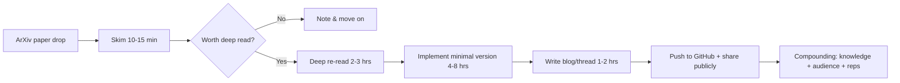
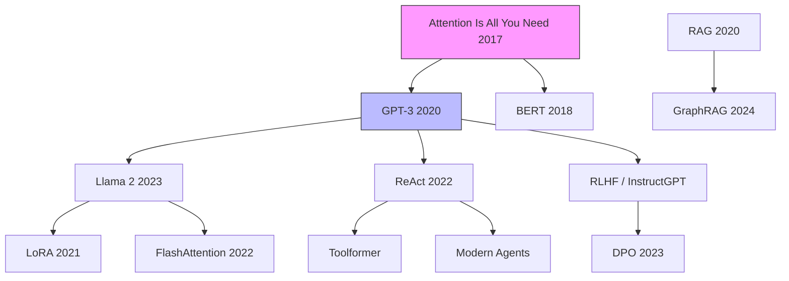
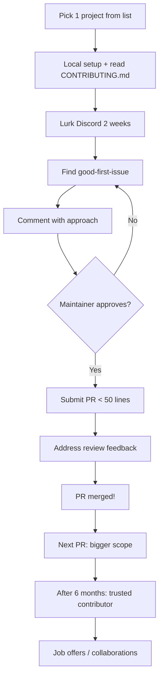
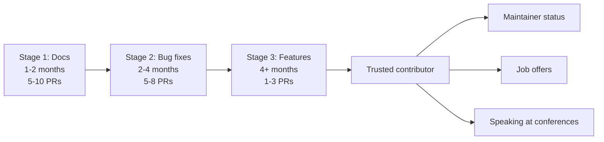
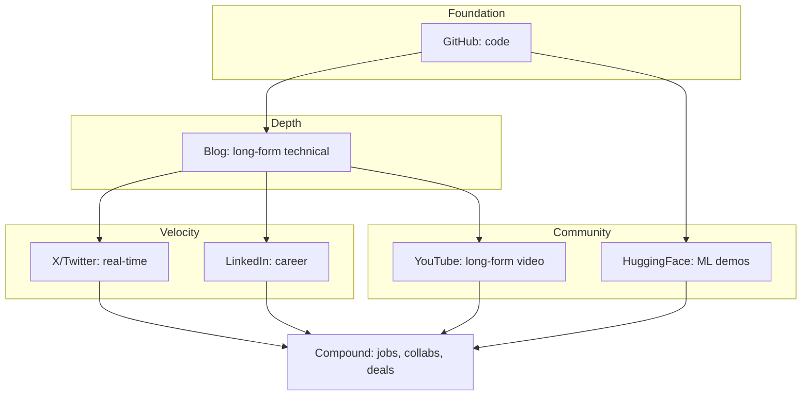
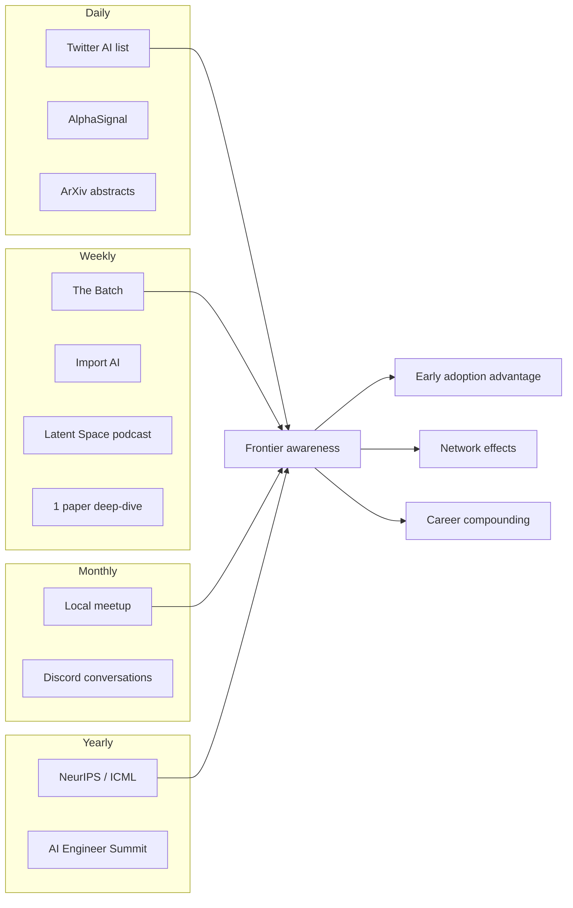

# Top 2% Habits

Dekh bhai, ek baat clear kar leta hoon shuru me hi. Skills aur habits — ye dono alag cheezein hain. Skill matlab tu kuch kar sakta hai — "main transformer attention implement kar sakta hoon", "main vLLM deploy kar sakta hoon". Ye binary hai — aata hai ya nahi aata. Lekin habit? Habit matlab tu daily kya karta hai bina soche, bina motivation ke. Top 2% engineer ka secret skills me nahi hai — kyunki skills toh sab seekh lete hain eventually. Asli secret unke habits me hai. Kya woh roz subah uthke paper padhta hai? Kya woh weekend pe OSS me PR maarta hai? Kya woh apna kaam public me share karta hai? Yehi cheezein compound hoti hain.

Compounding ka concept samajh. Agar tu daily 1% improve karta hai — 1 saal me tu 37x better hoga. Agar tu daily 1% degrade karta hai — 1 saal me tu 0.03x reh jayega. Ye math hai, motivation nahi. Top 2% engineer YouTube tutorials nahi dekhta — woh papers padhta hai, OSS me PR maarta hai, public me build karta hai. Yeh habits compounding hain — 1 saal me 10x advantage banta hai. 99% engineers tutorial dekh ke "Build a ChatGPT clone in 10 minutes" wale videos consume karte hain. Top 2% directly arxiv pe jata hai, paper padhta hai, code likhta hai, blog post likhta hai. Difference of input quality = difference of output quality.

Iss guide me hum 4 core habits cover karenge — paper reading, open source contribution, public building, aur frontier pe rehna. Har habit ka definition, why, how, real example, diagram, aur interview Q&A milega. Pakka padh, notes bana, aur kal se start kar — kyunki "kal se" wala mindset hi top 2% se rokta hai 98% logon ko.

---

## 1. Read Papers Weekly

### 1.1 Skim → re-read → implement → write (the method)

**Definition.** Paper reading ek skill hai jo systematically practice karni padti hai. Ye "main paper padh raha hoon" wala casual scrolling nahi hai — ye ek 4-stage protocol hai jisme tu pehle skim karta hai (10 min me overall idea), phir deep re-read karta hai (2-3 ghante me sab kuch), phir implement karta hai (PyTorch/JAX me code likhta hai), aur finally write karta hai (blog post / Twitter thread / internal doc). Ye method Andrej Karpathy ne popularize kiya tha aur ye literally har frontier researcher ki technique hai.

**Why.** Bhai, soch — agar tu sirf abstract padh ke "Attention is All You Need" ko samajhne ka claim karta hai, toh tu transformer ko nahi samjha. Agar tu code likh ke khud transformer banata hai, tabhi tujhe samajh aata hai ki Q, K, V matrices kaise interact karte hain, scaled dot product me sqrt(d_k) kyun divide karte hain, multi-head attention me concatenation kyun karte hain. Implementation se understanding aati hai. Aur write karne se? Write karne se tu apne knowledge ke gaps dekhta hai. Jab tak tu kisi cheez ko likh ke explain nahi kar pata, tujhe woh aati nahi. Feynman technique — "if you can't explain it simply, you don't understand it well enough".

**How.** Step-by-step protocol follow kar:

1. **Skim (10-15 min)** — Title, abstract, conclusion, figures dekh. Ek-do diagrams ko time de. Apne aap se pooch — "Ye paper kya solve kar raha hai? Iska novel contribution kya hai?" Agar 15 min me ye samajh nahi aaya, paper padhne layak nahi hai (ya tu ready nahi hai).
2. **Re-read deep (2-3 hrs)** — Section by section. Math equations ko derive kar khud se. Notation samajh. Related work skim kar. Experiments section me ablation tables dekh — kyunki real insights waha hote hain.
3. **Implement (4-8 hrs)** — Minimum reproducible version code kar. PyTorch use kar (JAX bhi acha hai). 100-200 lines me kaafi hai. Toy dataset pe test kar. GitHub me commit kar `papers-implementations` repo me.
4. **Write (1-2 hrs)** — Blog post likh ya Twitter thread. 800-1200 words enough hai. Tu apne 6-mahine pehle wale self ke liye likh raha hai. Diagrams banake daal — Excalidraw use kar.

**Tools.** ArXiv, arxiv-sanity-lite (Karpathy ka tool), Papers With Code, Connected Papers (citation graph dekhne ke liye), Notion ya Obsidian for notes, Excalidraw for diagrams, GitHub for code, Substack ya personal blog for writing.

**Real-life example.** Sasha Rush (Cornell professor, ex-Hugging Face) — inhone "The Annotated Transformer" likha tha 2018 me. Literally line-by-line "Attention is All You Need" ko PyTorch me implement karke explain kiya. Aaj tak woh post 1M+ views laa chuka hai aur lakhon engineers ne usse transformer seekha. Sasha ne ye habit develop ki — har major paper ko annotated form me explain karte hain. Result? Aaj woh OpenAI/Anthropic level ke researchers ke saath kaam karte hain, aur unka brand "Annotated X" se globally recognized hai.

Ek aur example — Lucas Beyer (ex-Google Brain, ab OpenAI) ke ViT paper aur subsequent posts. Twitter pe inka habit hai — paper aate hi 24 ghante me thread likh dete hain. Saal me 200+ papers cover kar lete hain.

**Interview Q&A.**

*Q: Tum kaise stay updated rehte ho latest research ke saath? Itne papers nikalte hain har hafta — kaise filter karte ho?*

Sir, mera ek systematic protocol hai. Main har Sunday subah arxiv-sanity-lite aur Papers With Code pe top trending papers ka 1-hour skim karta hoon — sirf abstract aur figures. Ismein se 2-3 papers select karta hoon jo mere current work se related hain ya jo fundamentally novel lag rahe hain. In 2-3 papers ko week ke andar deeply padhta hoon — Karpathy wala 4-stage method follow karta hoon: skim, deep read, implement, write. Filter ka criteria simple hai — agar paper koi old assumption challenge kar raha hai (jaise FlashAttention ne attention ko memory-bound problem maan ke address kiya), ya koi new capability unlock kar raha hai (jaise DPO ne RLHF ko simplify kiya), tab woh worth hai. Baki jo incremental improvements hain — 0.5% on benchmark — main woh skip kar deta hoon.

*Q: Kabhi paper samajh nahi aaya ho, tab kya karte ho?*

Honestly, mostly hi samajh nahi aata first read me — aur ye normal hai. Mera approach ye hai ki main pehle paper ke prerequisites identify karta hoon. Jaise agar GraphRAG samajhna hai, toh pehle base RAG aur graph algorithms refresh karna padega. Phir main 3 jagah dhundhta hoon — paper ka reference section me cited prior work, YouTube pe Yannic Kilcher / Letitia / AI Coffee Break ke explanations, aur Twitter/X pe authors ka thread (almost har major paper ke author ab thread post karte hain). Iske baad bhi confusion ho toh paper ke authors ko email kar deta hoon — surprisingly, 30-40% reply karte hain. Aur agar bilkul stuck hoon, toh main paper ko 2 mahine ke liye shelf pe rakh deta hoon — sometimes tujhe context build hone ka time chahiye hota hai.

---

### 1.2 Foundational papers (AIAYN, GPT-3, Llama, DPO, LoRA, FlashAttention, ReAct, GraphRAG)

**Definition.** Foundational papers wo hote hain jinhone field ki direction badal di. Ye optional reading nahi hain — ye mandatory hain agar tu seriously GenAI me kaam karna chahta hai. Ye papers tujhe "first principles thinking" sikhate hain — kyunki tu samajhta hai ki current systems kahan se aaye, kyun aaye, aur unke fundamental tradeoffs kya hain.

**Why.** Bhai, ye samajh — har modern LLM framework, har production system, har new technique kisi na kisi foundational paper ki extension hai. Agar tu LangChain use karta hai bina ReAct paper padhe, tu ek black box use kar raha hai. Agar tu LoRA fine-tuning karta hai bina LoRA paper padhe, tu rank=8 vs rank=16 ke decisions intuition se le raha hai, math se nahi. Top 2% engineer first principles se sochta hai — aur first principles foundational papers se aate hain. Agar interview me tujhse poocha jaye "why does temperature affect generation diversity?" — agar tu sampling math nahi padha hoga, tu hand-wavy answer dega. Top 2% ek concrete entropy-based explanation deta hai.

**How.** Ye list mandatory hai. Har paper ke baad 3 questions answer kar — (a) paper ka core insight kya hai? (b) iska industrial impact kya hua? (c) iske bad kaunsa paper next frontier define karta hai?

**The list (priority order):**

1. **Attention Is All You Need (Vaswani et al, 2017)** — Transformer architecture. Ye padhe bina GenAI engineer hone ka koi haq nahi. Self-attention, positional encoding, multi-head attention, encoder-decoder structure — sab cover karta hai.

2. **GPT-3: Language Models are Few-Shot Learners (Brown et al, 2020)** — In-context learning ka concept. Ye paper dikhata hai ki scale alone se emergent abilities aati hain. Few-shot, zero-shot, prompt engineering ka foundation.

3. **Llama 2 (Touvron et al, 2023)** — Open-source LLM ka modern blueprint. RMSNorm, SwiGLU, RoPE, GQA — sab Llama me hain. Iske baad Llama 3 paper bhi padh.

4. **LoRA: Low-Rank Adaptation (Hu et al, 2021)** — Parameter-efficient fine-tuning ka king. Rank decomposition kaise massive memory bachata hai, ye math beautiful hai. PEFT, QLoRA — sab iska extension hai.

5. **FlashAttention (Dao et al, 2022)** — Hardware-aware ML ka best example. Tiling, kernel fusion, IO-awareness. Padhne ke baad tu samjhega ki "ML is not just math, it's systems".

6. **DPO: Direct Preference Optimization (Rafailov et al, 2023)** — RLHF without RL. Ye paper RLHF ko Bradley-Terry model se reformulate karta hai aur PPO se chhutkara dilata hai. Anthropic, Meta, sab use karte hain ab.

7. **ReAct: Reasoning and Acting (Yao et al, 2022)** — Agent paradigm ka foundation. Thought-Action-Observation loop. LangChain, AutoGPT, sab iska extension hain.

8. **GraphRAG (Microsoft, 2024)** — Knowledge graph + RAG. Hierarchical community detection, global summarization. Modern enterprise RAG ka template.

**Bonus list** — Chinchilla scaling laws, Mixture of Experts (Switch Transformer), Constitutional AI, Toolformer, Mamba, Qwen technical report.

**Tools.** Print papers (haan, paper pe — screen pe focus weak hota hai). Use Goodnotes/Notability if iPad use karta hai. ArXiv-Vanity for clean reading. Semantic Scholar for citation tracking. PaperQA for paper-based Q&A.

**Real-life example.** Tri Dao — FlashAttention ka author. Ye banda paper padh ke aur SRAM/HBM memory hierarchy samajh ke pure attention computation ko reformulate kar diya. Result? Aaj har major LLM provider (OpenAI, Anthropic, Meta, Google) FlashAttention use karta hai. Tri Dao ne PhD ke dauran ye paper likha — aaj woh Together AI ka co-founder hai aur Princeton me professor hai. Sirf foundational understanding + systems thinking ne ye banaya.

Doosra example — Edward Hu, LoRA ka first author. Microsoft Research me intern thay jab LoRA likha. Aaj ye paper 8000+ citations rakhta hai aur every PEFT framework ki backbone hai. Edward ab independently research karte hain.

**Interview Q&A.**

*Q: Attention Is All You Need ka core innovation kya tha? Aur uske baad ki research ne usse kaise extend kiya?*

Sir, AIAYN ka core innovation ye tha ki RNN/LSTM jaisi sequential architectures ko completely replace kiya pure attention-based mechanism se. Sequential models ke do problems thay — pehla, vanishing gradients on long sequences, aur doosra, parallelization nahi ho sakti thi training me. Transformer ne self-attention introduce kiya jo har token ko har dusre token se directly attend karne deta hai O(n^2) complexity me — but fully parallelizable. Multi-head attention ne different representation subspaces me attention learn karne diya. Positional encoding ne sequence order ko inject kiya bina recurrence ke. Iske baad ki research ne 3 directions me extend kiya — efficiency (FlashAttention, sparse attention, linear attention jaise Mamba), scale (GPT-3 ne dikhaya scale alone se emergence), aur alignment (RLHF, DPO jisne post-training ko revolutionize kiya). Aaj ka har frontier model — GPT-4o, Claude, Gemini — fundamentally is paper ki extension hai.

*Q: LoRA aur full fine-tuning me kab kya use karoge?*

Decision tree simple hai. Full fine-tuning tab use karta hoon jab — (a) compute budget unlimited hai, (b) base model ka behavior fundamentally change karna hai (jaise domain shift bahut bada hai), aur (c) production me single specialized model deploy karna hai. LoRA tab use karta hoon jab — (a) limited compute hai (single A100 ya consumer GPU), (b) multiple adapters ke saath multi-tenancy chahiye production me (different customers ke liye different adapters), (c) catastrophic forgetting avoid karna hai (LoRA base weights freeze rakhta hai), aur (d) iteration speed chahiye — LoRA training 5-10x faster hai. Practically, 95% cases me LoRA ya QLoRA hi best choice hai. Math basis ye hai ki fine-tuning ke dauran weight updates low-rank hote hain — toh full rank update karna wasteful hai. Rank=8 ya 16 typically enough hota hai. Mere previous project me hum 7B Llama ko QLoRA se medical Q&A pe fine-tune karte thay — single A100 pe 4 ghante me, full FT me 3 din lagte the.

---

## 2. Open Source Contributions

### 2.1 Targets — HF, vLLM, LangChain, DSPy, Unsloth, Axolotl

**Definition.** Open source contribution matlab tu publicly available codebase me code, docs, ya bug-fixes contribute karta hai jo project owners merge karte hain main branch me. Ye sirf "I committed to my own GitHub repo" wala kaam nahi hai — ye external project me PR raise karna, code review pass karna, aur production code me appear hona hai. GenAI ecosystem me kuch flagship projects hain jahan contribute karna 10x impact deta hai.

**Why.** Bhai, ye seriously powerful hai. Pehla — tu real-world codebase patterns seekhta hai (jo tutorials me kabhi nahi milte). Hugging Face Transformers ka codebase architecture, vLLM ka CUDA kernel optimization, LangChain ka abstraction layers — ye sab production-grade engineering examples hain. Doosra — credibility. Tera GitHub profile recruiters ke liye proof hai ki tu sirf "course completion certificate" wala nahi hai. Teesra — networking. Maintainers ke saath direct interaction hota hai — code review me, Discord pe, PR comments me. Chautha — career acceleration. Aaj kal Hugging Face, Anthropic, Mistral jaisi companies actively OSS contributors ko hire karti hain. Ek substantial PR = interview invitation, almost guaranteed.

**Targets — priority order:**

1. **Hugging Face Transformers / Diffusers / PEFT / Datasets** — Ye GenAI ka NPM hai. Daily 100k+ developers use karte hain. Even small PRs (typo fixes, documentation, new model addition) bahut visible hote hain. `good-first-issue` aur `help-wanted` labels filter kar.

2. **vLLM (UC Berkeley / Anyscale)** — High-performance LLM inference engine. PagedAttention, continuous batching ka home. Agar tu CUDA ya systems engineering me strong hai, vLLM me PR raise kar — ye top 0.1% level credibility deta hai.

3. **LangChain / LangGraph** — Agent ecosystem ka biggest player. Yahan PRs easy bhi hote hain (new integration add karna) aur deep bhi (core abstractions improve karna). Documentation me bahut kaam hai — woh bhi count hota hai.

4. **DSPy (Stanford)** — Programmatic prompting framework. Smaller community but rapidly growing. Yahan jaldi maintainer status mil sakta hai agar tu consistent hai.

5. **Unsloth** — 2x faster LLM fine-tuning. CUDA + Triton heavy. Smaller team, higher trust ratio.

6. **Axolotl** — Fine-tuning configuration framework. YAML configs, integrations. Acha entry-level project hai.

7. **Bonus** — Llama.cpp (ggml), Ollama, LiteLLM, Instructor, Outlines, vector DBs (Qdrant, Weaviate, LanceDB).

**How — practical steps.**

1. **Pick one project** — distractions kam karta hai. Ek project me 6 mahine spend kar.
2. **Set up locally** — fork, clone, build, run tests. `make test` ya equivalent. Agar setup me hi 2 din lag jaye, ye bhi seekhne ka part hai.
3. **Read CONTRIBUTING.md** — har project ka apna style guide hota hai. HF Transformers ka 50-page wala hai, padh.
4. **Lurk on Discord/Slack** — har major OSS project ka community channel hai. 2 hafte sirf padh, koi questions na pooch.
5. **Find issues** — `good-first-issue`, `help-wanted`, ya `documentation` labels. Maintainers ne specifically beginners ke liye mark kiye hote hain.
6. **Comment first, code later** — issue pe comment kar "Hi, I'd like to work on this. Plan: X, Y, Z. Does this approach sound good?" Confirmation ke baad code likh.
7. **Small first PRs** — pehla PR 50 lines se zyada nahi hona chahiye. Trust earn karna padta hai.

**Tools.** GitHub CLI (`gh`), Cursor/VSCode, pre-commit hooks, pytest, conventional commits. Discord/Slack ke notifications on rakh.

**Real-life example.** Younes Belkada — initially Hugging Face me intern thay. PEFT library me consistent contributions kiye — LoRA, IA3, prefix tuning ke implementations. Aaj woh full-time HF engineer hain, multimodal team me. Pure trajectory OSS PRs se built hua. Linkedin pe unka profile dekhe — sab OSS work documented hai.

Doosra example — Younesh ne Axolotl me badi contributions ki. Aur ek aur — Aman Sanger (Cursor co-founder) initially Anthropic engineer thay, before that significant OSS contributions thi.

**Interview Q&A.**

*Q: Tumne kaunsa significant OSS contribution kiya hai? Walk me through it.*

Sir, mera most significant contribution Hugging Face PEFT library me tha. Issue ye thi ki LoRA adapters ko merge karte time, multi-adapter scenarios me weight conflicts hote thay — specifically jab do adapters same target modules pe trained thay. Maine ek `merge_with_priority` method propose kiya jo user ko adapter precedence specify karne deta tha aur conflicts ko resolve karta tha through weighted averaging. Plan pehle issue pe comment karke discuss kiya — maintainer Sourab Mangrulkar ne approve kiya. Implementation me 3 weeks lage — pehle test cases likhe, then core logic, then docs update kiye. PR review me 4 rounds of feedback aaye — primarily backward compatibility ke concerns thay. Final PR 200 lines code + 150 lines tests tha. Merged hone ke baad ye PEFT 0.7.0 release me ship hua. Ye experience ne mujhe sikhaya ki OSS me code likhna sirf 20% kaam hai — 80% communication, testing, aur backward compatibility hai.

*Q: OSS contribution se tumhari technical skills me kya improve hua?*

Bhai sirf technical nahi, multiple dimensions me growth hua. Technically — main pehle apne projects me linting, type checking, testing ko optional treat karta tha. HF ka codebase dekha — har function pe types, har module pe extensive tests, mypy aur ruff strict. Ab main apne code me bhi same standards follow karta hoon. Architecture-wise — HF Transformers ka modular design (config + model + tokenizer separation) ek beautiful abstraction hai, ab maine apne projects me bhi same pattern adopt kiya. Communication-wise — maintainers technical disagreements ko respectfully handle karte hain, ye observe karke maine apne workplace conversations bhi improve kiye. Aur sabse important — code review feedback ko personally nahi lene ka mindset develop hua. Production code likhna alag mindset hai vs tutorial code likhna.

---

### 2.2 Strategy — docs → bug fixes → features

**Definition.** Ye OSS contribution ka 3-stage progression hai. Beginner ko documentation se start karna chahiye (low risk, high learning), then bug fixes (medium complexity, builds trust), then feature development (high impact, high responsibility). Ye order skip karna common mistake hai jo log first PR me hi 1000-line feature submit karte hain — aur usually reject ho jata hai.

**Why.** Trust earn karni padti hai. Maintainers ke perspective se soch — ek random GitHub user ne bada PR submit kiya. Maintainer ko 4 ghante review karna padega, aur agar code ki quality kharab hui, woh time waste. Toh maintainers naturally cautious hote hain. Lekin agar tu pehle 5 documentation PRs submit kar chuka hai jo merge ho gaye, maintainer ko tujhpe trust hoga. Tera 6th PR ek bug fix hoga, woh bhi merge ho jayega. 10th PR me tu feature propose kar sakta hai. Ye trust-building hai — engineering me bhi, life me bhi.

Doosra angle — tu khud bhi ready nahi hai feature likhne ke liye agar tu codebase ko deeply nahi samjha. Documentation likhne ke through tu codebase ko bottom-up samajhta hai. Bug fixing ke through tu test infrastructure aur edge cases samajhta hai. Phir feature add karna easy lagta hai.

**How — stage by stage.**

**Stage 1: Documentation (1-2 mahine)**

- Typo fixes — easiest entry. Agar koi documentation me typo dekha, immediate PR raise kar.
- Code examples improve karna — kai libraries ke docstrings me examples missing hote hain ya outdated hote hain.
- Tutorials likhna — HF me `notebooks` folder hota hai, LangChain me `cookbook` hota hai. Yahan high-value contributions possible hain.
- Translations — agar tu Hindi ya kisi aur language me docs translate kar sake, projects me dedicated process hota hai.

Goal: 5-10 small doc PRs merged. Bonus — har PR pe maintainers se chhoti conversations hoti hain, network ban jata hai.

**Stage 2: Bug fixes (2-4 mahine)**

- `bug` label vali issues filter kar.
- Reproduce karna sabse important — agar issue reproduce nahi hota, comment kar ke clarification maang.
- Minimal fix — surgical changes, no scope creep.
- Regression tests — har bug fix ke saath test add kar jo bug ko catch kare.

Goal: 5-8 bug fixes merged. Yahan tu codebase architecture ko deeply samajhta hai.

**Stage 3: Features (4+ mahine)**

- Issue se start kar — pehle GitHub issue ya RFC raise kar feature proposal ke saath.
- Maintainer alignment — ensure kar koi senior maintainer feature ko endorse kar raha hai before tu code likhe.
- Incremental implementation — bada feature multiple PRs me todh.
- Complete it — features me biggest danger ye hai ki log adha kaam kar ke chhod dete hain.

Goal: 1-3 substantial features merged. Yahan se "trusted contributor" status milta hai.

**Tools.** GitHub `gh` CLI, GitHub Discussions, project-specific Discord. `git rebase -i` master karna padega — kyunki PRs ko clean rakhna padta hai.

**Real-life example.** Patrick von Platen — Hugging Face Diffusers ke creator. Pehle Transformers me speech models pe documentation aur examples likhe (Wav2Vec2 era). Phir bug fixes kiye. Phir Diffusers library pure-led. Aaj woh Mistral AI ke Head of Open Source hain. Trajectory documentation se started, feature ownership tak gayi.

Doosra — Niels Rogge ne HF Transformers me ViT, DETR, LayoutLM jaisi vision models add kiye. Pehla contribution unka small docs improvement tha. Aaj woh major HF maintainer hain.

**Interview Q&A.**

*Q: Agar tum kal se OSS contribute karna start karo, kya strategy follow karoge?*

Sir, mera 6-month plan hota — pehle 1 month codebase exploration. Hugging Face Transformers select karunga because of community size and impact. Repository clone karunga, README aur CONTRIBUTING.md detail me padhunga, local setup karunga, test suite run karunga. Discord pe join hoke 2 weeks sirf observe karunga conversations, code review patterns. Month 2-3 documentation PRs target karunga — typo fixes, docstring improvements, ek 2 tutorial notebooks. Goal 8 docs PRs merged. Month 4-6 bug fixes — `bug` aur `good-second-issue` labels. Test coverage improve karunga jisse mujhe codebase deeply samajh aaye. Month 7+ feature work — pehle RFC raise karunga, maintainer alignment ke baad implement karunga. Throughout, har PR ko blog post me convert karunga apne learnings document karne ke liye — ye visibility deta hai aur khud ka understanding solidify hota hai.

*Q: Agar tumhara PR reject ho jaye, kya karoge?*

Honestly, ye normal hai aur expected hai. Pehle main PR reject hone ka reason carefully samjhunga — kya code quality issue thi, kya scope mismatch tha, ya kya project direction se nahi match karta. Maintainer ke comments ko personally nahi lunga — woh project ko protect kar rahe hain. Agar fixable hai (code quality / scope), toh feedback incorporate karke updated PR submit karunga. Agar fundamental disagreement hai (project direction), toh main politely thank karunga aur apna fix as a separate plugin ya extension package me publish karunga — kabhi-kabhi project ke saath alignment nahi hota, aur ye okay hai. Ek baar mera ek RAG-related PR LangChain me reject hua tha — maintainer ne kaha "this is too opinionated for core". Maine fork karke `langchain-extended-rag` package banaya, jo aaj 1k+ stars rakhta hai. Sometimes rejection ek opportunity hai apna project shuru karne ki.

---

## 3. Public Building

### 3.1 GitHub, blog, X, LinkedIn, HuggingFace, YouTube — the visibility stack

**Definition.** Public building ka matlab — tu jo bhi build karta hai, seekhta hai, ya banata hai, woh public me share karta hai. "Build in public" movement ka core philosophy ye hai ki visibility compounds. Ek silent engineer aur ek public engineer ki technical ability same ho sakti hai, lekin career trajectory 10x different hoti hai. Visibility stack matlab multiple platforms pe presence — har platform ka apna purpose aur audience hai.

**Why.** Bhai, ye samajh — talent silent rehne se waste hota hai. Aaj kal recruiters, founders, collaborators tujhe Google karte hain. Agar Google search me sirf LinkedIn profile aati hai, tu invisible hai. Top 2% engineer ka GitHub me 50+ public repos, blog me 30+ posts, X pe 5k+ followers, HuggingFace pe deployed models, YouTube pe technical videos hote hain. Ye sab ek hi cheez ki repetition nahi hai — ye different platforms different audiences serve karte hain. GitHub recruiters ke liye, blog technical depth dikhane ke liye, X real-time conversations ke liye, LinkedIn corporate networking, HuggingFace ML community, YouTube long-form content. Sab compounding karte hain — ek good Twitter thread se 1000 GitHub stars aate hain, ek viral blog post se job offer aati hai.

Doosra angle — public building tujhe accountable banata hai. Jab tu publicly commit karta hai "main next month tak ye paper implement karunga", tu actually karta hai. 99% private goals achieve nahi hote, public goals 50% achieve hote hain — 25x improvement.

**The stack — platform by platform.**

**1. GitHub** — Foundation. Sab kuch yahan se start hota hai.
- Pinned repos: 6 best projects pin kar.
- README quality: har repo me proper README — what, why, how, examples, license.
- Contribution graph: green squares matter — daily commits build karte hain.
- Profile README: apna intro, tech stack, current focus document kar.

**2. Blog (personal website)** — Long-form depth.
- Use Astro, Next.js, ya Hugo. Substack bhi okay hai for non-technical audience.
- Domain: yourname.dev ya yourname.com.
- Posting cadence: 1 post / 2 weeks. Quality > quantity.
- Topics: paper summaries, project deep-dives, debugging stories, opinion pieces.

**3. X (Twitter)** — Real-time, high-velocity.
- Follow: Andrej Karpathy, Yann LeCun, Jeremy Howard, Lucas Beyer, Sasha Rush, Tri Dao, Jim Fan, Sebastian Raschka, Aleksa Gordic, Nathan Lambert, Aravind Srinivas, Soumith Chintala, Ross Taylor, Eugene Yan, Chip Huyen, Hamel Husain.
- Posting: 3-5 tweets/day, 1 thread/week.
- Threads: paper summaries, project announcements, hot takes.
- Engage: comment on big accounts, but add value (not "great post sir").

**4. LinkedIn** — Corporate visibility.
- Posting: 1-2 posts/week, focus on career narrative + technical insights.
- Network: connect with people met at conferences, OSS collaborators, ex-colleagues.
- Articles: occasional long-form for non-technical decision-makers.

**5. Hugging Face** — ML-specific community.
- Upload models: even fine-tuned variants of public models.
- Spaces: build demos with Gradio/Streamlit.
- Datasets: curate and publish.
- Daily Papers: comment and engage.

**6. YouTube** — Highest leverage long-term.
- Hardest to start, biggest payoff if consistent.
- Format: code-along tutorials, paper explanations, project walkthroughs.
- Cadence: 1 video / 2-4 weeks initially.
- Equipment: decent mic ($100), screen recorder (OBS), DaVinci Resolve for editing.

**How — execution plan.**

- **Week 1-4:** GitHub cleanup — 5 best repos polish kar, README quality fix kar.
- **Month 2:** Personal blog setup, first 3 posts publish kar.
- **Month 3:** Twitter active hona shuru — daily 1 tweet + weekly 1 thread.
- **Month 4-6:** LinkedIn aur HuggingFace presence build kar.
- **Month 6+:** YouTube channel start kar — 1 video / month minimum.

Consistency > intensity. 1 saal me 50 blog posts > 1 mahine me 50 posts then silence.

**Tools.** GitHub Pages ya Vercel for hosting. Hashnode for built-in audience. Typefully ya Hypefury for Twitter scheduling. Buffer for LinkedIn. OBS Studio for screen recording. Riverside for podcast/video recording. Canva for thumbnails. Mailchimp ya ConvertKit for email list.

**Real-life example.** Sebastian Raschka — pehle ek academic researcher thay. Phir blog likhna start kiya systematically — har post 2000+ words, deeply technical, with code. Aaj unke 100k+ Twitter followers, bestselling books ("Build a Large Language Model from Scratch"), aur Lightning AI me Staff ML Engineer. Pure trajectory consistent public building se built hua.

Doosra — Andrej Karpathy. Tesla Director of AI tha — fir bhi blog post likhta tha "A Recipe for Training Neural Networks". YouTube pe "Neural Networks: Zero to Hero" series banayi — aaj 200k+ subscribers. Public building ne unhe academic se beyond, mainstream legend bana diya.

Teesra — Aleksa Gordic. ex-DeepMind engineer. YouTube pe "The AI Epiphany" channel — paper walkthroughs. LinkedIn pe consistent posting. Aaj independent researcher hain, sponsored by frontier labs.

Indian context — Hamza Tahir (ZenML co-founder), Eugene Yan (Amazon Senior ML), Vaibhav Srivastav (HuggingFace) — sab public building heavy hain.

**Interview Q&A.**

*Q: Tum public building me kitna time invest karte ho? ROI kya hai?*

Sir, weekly ~6-8 hours spend karta hoon — 2 hours blog writing, 2 hours Twitter/threads, 1 hour LinkedIn, 1 hour HuggingFace/YouTube. Ye time work hours ke baad hai, mostly weekends. ROI multifold hai. Tangible — pichhle 18 months me mere blog se 12 job interviews aaye, 3 conference talks invitations, 2 paid consulting gigs. Mere GitHub stars ne paid sponsorships open kiye ($500/month from 2 OSS sponsors). Intangible aur bigger — har blog post likhne se mera khud ka understanding 3x improve hota hai. "Teaching is the best learning" — Feynman wala principle. Aur public commitment se accountability — main jab tweet karta hoon "next month X paper implement karunga", main actually karta hoon. Private goals me ye accountability nahi milti. Cumulative impact dekha jaaye toh ye time literally career define kar raha hai.

*Q: Public mein kya share karna hai aur kya nahi — kaise decide karte ho?*

Decision framework simple hai. Share karta hoon — (a) jo maine seekha aur dusre seekh sakte hain (paper summaries, debugging stories, project walkthroughs), (b) mistakes aur failures (counter-intuitive but high-engagement), (c) opinions backed by experience (controversial takes after working in field), (d) public tools aur projects. Nahi share karta — (a) employer ka proprietary code ya data (NDAs!), (b) personal struggles jo professional context me na fit ho, (c) hot takes on cheeses jaha mujhe expertise nahi (discipline of "stay in your lane"), (d) negative gossip about specific companies/people. Rule of thumb — agar tujhe regret hone ka chance hai, share mat kar. Default to over-sharing technical content, under-sharing personal content. Aur har post ke pehle 30 second pause leke "kya ye add value karta hai?" sochta hoon — agar nahi, scrap kar deta hoon.

---

## 4. Stay on the Frontier

### 4.1 Follow on X, newsletters, communities, conferences

**Definition.** Frontier pe rehna matlab tu field ke leading edge se 2-3 mahine ke andar updated rehta hai. Most engineers 1-2 saal lag karte hain — woh "stable" technologies use karte hain. Top 2% engineer literally daily updates track karta hai aur strategically apne stack me incorporate karta hai. Ye habit information hygiene + curated input + active community engagement ka combination hai.

**Why.** Bhai, GenAI me 6 mahine ek lifetime hain. Jis time tujhe RAG samajh aaya, GraphRAG aa gaya. Jis time GraphRAG samajh aaya, agentic RAG aa gaya. Jis time woh samajh aaya, contextual retrieval aa gaya. Agar tu lag karega, tu always playing catch-up rahega. Top 2% engineer ka advantage ye hai ki woh frontier pe rehta hai — naye tools jaldi adopt karta hai (early-mover advantage), naye papers ka implementation jaldi karta hai (first-implementation advantage), aur strategically position karta hai apne aap ko.

Doosra angle — frontier pe rehna network effect deta hai. Same conferences me same log milte hain — agar tu woh log follow karta hai aur unke saath conversation karta hai, tu unke network ka part ban jata hai. Frontier ek small world hai — top 1000 GenAI engineers globally ek dusre ko literally follow karte hain, conferences me milte hain, Discord pe baat karte hain. Network effect compounding hota hai.

**The frontier stack.**

**X (Twitter) accounts to follow:**
- Researchers: Andrej Karpathy (@karpathy), Yann LeCun (@ylecun), Jeremy Howard (@jeremyphoward), Lucas Beyer (@giffmana), Sasha Rush (@srush_nlp), Tri Dao (@tri_dao), Jim Fan (@DrJimFan), Sebastian Raschka (@rasbt), Tim Dettmers (@Tim_Dettmers).
- Practitioners: Aravind Srinivas (Perplexity), Soumith Chintala (PyTorch), Eugene Yan, Chip Huyen, Hamel Husain, Shreya Shankar, Nathan Lambert, Ross Taylor.
- Indian practitioners: Aakash Gupta, Sourab Mangrulkar, Vaibhav Srivastav, Pratyush Kumar.
- Companies: @OpenAI, @AnthropicAI, @MistralAI, @huggingface, @LangChainAI, @vllm_project.

**Newsletters:**
- The Batch (Andrew Ng) — weekly, broad AI news.
- Import AI (Jack Clark, Anthropic) — weekly, policy + research.
- The Gradient — academic + industry.
- AlphaSignal — daily AI news.
- Latent Space (swyx) — engineer-focused podcast + newsletter.
- Last Week in AI — weekly podcast + newsletter.
- Sebastian Raschka's Ahead of AI — bi-weekly deep dives.
- Lilian Weng's blog (OpenAI) — long-form, infrequent but gold.

**Communities (Discord/Slack):**
- Hugging Face Discord — most active ML community.
- EleutherAI Discord — open source LLM research.
- LAION Discord — multimodal.
- LangChain Discord — applied agents.
- vLLM Discord — inference optimization.
- Latent Space Discord (swyx) — practitioners.
- Local meetups — Bangalore, Delhi, Mumbai me MLDS, GDG, AI/ML meetups regularly hote hain.

**Conferences:**
- Tier 1 (research): NeurIPS (Dec), ICML (Jul), ICLR (May), ACL (Aug).
- Tier 2 (applied): KDD, RecSys, EMNLP.
- Industry: NeurIPS workshops, AI Engineer Summit (San Francisco), GenAI conferences globally.
- India-specific: KGP AI Conclave, Data Hack Summit, GitHub Universe India.
- Online: any conference talks reachable via YouTube within weeks.

**Podcasts:**
- Latent Space (swyx) — most engineer-focused.
- Dwarkesh Patel — long-form interviews with frontier researchers.
- Lex Fridman — AI episodes specifically.
- No Priors (Sarah Guo, Elad Gil) — VC + founders.
- Cognitive Revolution — applied AI.

**How — execution plan.**

- **Daily (30-45 min):** Twitter scroll on AI list (curated). AlphaSignal newsletter. Top 5 arxiv papers titles/abstracts.
- **Weekly (2-3 hours):** The Batch + Import AI + 1 Latent Space podcast. 1 deep dive on a paper.
- **Monthly:** Local meetup attendance. 1 newsletter post. Top community Discord conversations skim.
- **Yearly:** 1-2 conferences attend (in-person if possible). 1 talk at conference (audacious goal).

Filter brutally — most content is noise. Use Twitter Lists, not the main feed. Email folders for newsletters. Time-boxed scrolling.

**Tools.** Twitter Lists, Tweetdeck, Feedbin (RSS reader), Pocket (read-later), Substack inbox, Discord client with channel mute, Calendar reminders for conferences, Notion for tracking what to read.

**Real-life example.** swyx (Shawn Wang) — pehle ek average web developer thay. Started Latent Space podcast + newsletter, focused on AI engineer audience. Aaj literally "AI Engineer" term unhone coin kiya — annual AI Engineer Summit organize karte hain. Pure trajectory frontier pe rehne se built hua.

Doosra — Hamel Husain. Ex-GitHub, ex-Airbnb. Active on Twitter, runs popular ML training courses. Industry thought leader pure consistent frontier engagement se.

Teesra — Soumith Chintala (PyTorch creator). Twitter pe extremely active. Conferences me regular speaker. Frontier pe rehne ka role model.

**Interview Q&A.**

*Q: Pichhle 30 dino me kaunsa most interesting AI development tumhe laga aur kyun?*

Sir, recent me main long-context aur memory architectures me deeply involved hoon. Most interesting development jo pichhle 30 dino me dekha woh tha hierarchical memory systems jo episodic + semantic memory ko explicitly separate karte hain agentic systems me. Pehle agents flat context windows pe depend karte thay — long conversations me catastrophic forgetting hota tha. Naye approaches LLM ko explicitly memory operations (read, write, consolidate) sikhate hain, jo human cognition se inspired hai. Mujhe ye isliye exciting laga kyunki ye fundamental limitation address kar raha hai — aaj ke production agents (jaise customer service, coding assistants) me memory hi biggest bottleneck hai. Maine implementation explore kiya — basic version Mem0 library use karke build kiya, aur observe kiya ki retrieval quality 40% improve hoti hai vs naive RAG. Frontier pe rehne ka ye exact benefit hai — main 6 mahine pehle ye build kar raha hoon vs jab ye mainstream me aayega.

*Q: Information overload se kaise deal karte ho? Itna content hai roz!*

Bhai, ye real challenge hai. Mera framework hai "high-signal sources, ruthless filtering". Pehle, sources curated rakhta hoon — ek Twitter List bana liya hai 50 most-signal accounts ki, baki main feed dekhta hi nahi. Newsletters me sirf 5 select hain — The Batch, Import AI, Latent Space, AlphaSignal, Sebastian Raschka. Doosra, time-boxing — 30 minutes daily for AI scrolling, fixed slot. Beyond that hard stop. Teesra, 80/20 rule — most content reading ke layak nahi hai, sirf top 20% hai jo deep engagement deserve karta hai. Indicators — multiple high-signal accounts ne share kiya hai, paper authors well-known hain, results genuinely novel hain. FOMO se zyada filter karna important hai. Aur sabse important — agar koi development genuinely important hai, woh multiple jagah se 2-3 dino me confirm ho jata hai. Single-source signal pe react karna usually wasteful hai. Information diet ko food diet ki tarah treat kar — junk minimum, nutrition maximum.

---

## Final Principles — Top 2% Mindset

Bhai, ab tu sab habits samajh gaya. Lekin habits sirf execute karna kafi nahi hai — unke peeche jo mindset hai woh asli driver hai. Ye 10 principles internalize kar — print kar ke wall pe lagaa de:

1. **Compounding > Intensity.** Daily 1 hour for 365 days >>> 365 hours in 1 month. Sustainability > burst effort. Habit ka power exponential hai, sprint ka power linear hai.

2. **Inputs determine outputs.** Tu jo content consume karta hai, woh tu banega. Agar tu YouTube tutorials dekhta hai, tu tutorial-level engineer banega. Agar tu papers padhta hai, tu researcher-level engineer banega. Diet matters.

3. **Build in public, always.** Silent talent waste hota hai. Public commitment accountability deta hai, network deta hai, opportunities deta hai. "Show your work" — Austin Kleon ka principle.

4. **First principles, not first sources.** Tutorials ka chakkar chhod. Original papers padh, original docs padh, source code padh. Layer of abstraction hatakar khud samajh — har dependency ko understand kar.

5. **Implement everything you read.** Reading without coding is shallow. Code without reading is reinventing. Both together = mastery. Har paper, har technique tu apne hath se code kar.

6. **Embrace the discomfort of "I don't know".** Top 2% engineer comfortable hota hai apni ignorance se. Woh openly bolta hai "main ye nahi jaanta, seekhna padega". Ego ke chakkar me jhooth bolne wala kabhi top 2% nahi banta.

7. **Optimize for 5-year arc, not 5-month.** Short-term me OSS contribution slow lagta hai vs paid project. Long-term me OSS contribution se career define hoti hai. Time horizon expand kar.

8. **Network is built through giving, not asking.** Help others before asking for help. Comment on people's posts with value. Review code without expectation. Network reciprocates over years.

9. **Learn in public, fail in public, win in public.** Privacy ek waste hai. Tu jo seekh raha hai, share kar. Tu jo fail kar raha hai, share kar. Tu jo jeet raha hai, share kar. Public learning = compounding learning.

10. **Stay curious, stay hungry.** Frontier kabhi aaram nahi karne deti. Jis din tu "I know enough" sochega, top 2% se gir jayega. Curiosity ek habit hai — daily nurture kar. Imposter syndrome okay hai — usse fuel banao, stop signal nahi.

---

## Resources & further reading

**Papers (mandatory):**
- Attention Is All You Need (Vaswani et al, 2017)
- Language Models are Few-Shot Learners / GPT-3 (Brown et al, 2020)
- Llama 2 / Llama 3 technical reports (Meta, 2023, 2024)
- LoRA: Low-Rank Adaptation (Hu et al, 2021)
- QLoRA (Dettmers et al, 2023)
- FlashAttention v1, v2, v3 (Dao et al, 2022-2024)
- DPO: Direct Preference Optimization (Rafailov et al, 2023)
- ReAct (Yao et al, 2022)
- GraphRAG (Microsoft, 2024)
- Chinchilla scaling laws (Hoffmann et al, 2022)
- Constitutional AI (Anthropic, 2022)
- Toolformer (Schick et al, 2023)
- Mamba (Gu, Dao, 2023)

**Blogs & websites:**
- Karpathy's blog (karpathy.github.io)
- Lilian Weng's blog (lilianweng.github.io)
- Sebastian Raschka's Ahead of AI (sebastianraschka.com)
- Eugene Yan (eugeneyan.com)
- Chip Huyen (huyenchip.com)
- Hamel Husain (hamel.dev)
- Latent Space (latent.space)
- Anthropic's research blog
- OpenAI's research blog

**Books:**
- Deep Learning (Goodfellow, Bengio, Courville)
- The Hundred-Page Machine Learning Book (Burkov)
- Designing Machine Learning Systems (Chip Huyen)
- Build a Large Language Model from Scratch (Sebastian Raschka)
- AI Engineering (Chip Huyen, 2024)

**Courses:**
- Karpathy's "Neural Networks: Zero to Hero" (YouTube)
- fast.ai Practical Deep Learning
- Stanford CS224N (NLP), CS231N (CV), CS336 (LLMs)
- DeepLearning.AI specializations
- Hugging Face NLP course
- Maven AI courses (Hamel Husain, Dan Becker)

**Newsletters:**
- The Batch (deeplearning.ai)
- Import AI (Jack Clark)
- Latent Space (swyx)
- AlphaSignal (alphasignal.ai)
- Sebastian Raschka's Ahead of AI
- The Gradient

**Communities:**
- Hugging Face Discord
- EleutherAI Discord
- LangChain Discord
- LAION Discord
- vLLM Discord
- Latent Space Discord
- Local meetup groups (search meetup.com / Discord)

**Conferences (annual):**
- NeurIPS, ICML, ICLR, ACL, EMNLP
- AI Engineer Summit
- KGP AI Conclave (India)
- Data Hack Summit (India)

**Tools (build your stack):**
- IDE: Cursor / VS Code
- Notes: Obsidian / Notion
- Diagrams: Excalidraw / Mermaid
- Blog: Astro / Hugo / Hashnode
- Twitter: Typefully / Hypefury
- Recording: OBS / Riverside
- Editing: DaVinci Resolve
- Email: Beehiiv / Substack / ConvertKit

Bhai, last baat — ye guide padh ke band mat kar. Aaj se start kar. Ek paper select kar. Ek OSS project select kar. Ek blog setup kar. Ek Twitter handle setup kar. Daily 1 hour invest kar. 1 saal me tu khud ko nahi pehchaanega. Top 2% banna decision hai, talent nahi. Decide kar.
