# Transformers & LLM Internals — Part 1: Attention, Block, Tokenization, Positions

Bhai, agar tu LLMs ke andar jhaankna chahta hai, toh Transformer architecture ko samajhna non-negotiable hai. Yeh 2017 ka paper "Attention is All You Need" jo Vaswani et al. ne likha tha — usne deep learning ko hila ke rakh diya. RNNs aur LSTMs ke zamane mein sequential processing thi, gradient vanish ho jaate the, lambi sequences pe model bhool jaata tha. Transformer ne yeh sab khatam kar diya by introducing self-attention — ek aisa mechanism jo har token ko har dusre token se directly baat karne deta hai, parallel mein.

Is guide mein hum 4 bade topics cover karenge: Attention Mechanism (Q/K/V se lekar O(n²) bottleneck tak), Transformer Block (LayerNorm, FFN, Residuals, encoder-decoder variants), Tokenization (BPE, WordPiece, Tiktoken), aur Positional Encodings (Sinusoidal, Learned, RoPE, ALiBi). Tu intern level se senior level pe pahuchega agar tune yeh saari subtopics serious se padhi.

Ek baat yaad rakh — Transformer koi magic nahi hai. Yeh sirf matrix multiplications, softmax, aur clever indexing hai. Lekin jab yeh sab combine hota hai, tab GPT, Llama, Claude jaise models bante hain. Toh chal, shuru karte hain.

---

## 1. Attention Mechanism

### 1.1 Self-attention from first principles (Q, K, V)

**Definition:** Self-attention basically yeh decide karta hai ki har token ko kis dusre token pe kitna "dhyan" dena hai. Mathematically, weighted sum hai jahan weights softmax(QK^T/√d_k) se aate hain. Q (Query), K (Key), V (Value) — yeh teen projections hain same input ke.

**Why:** RNN mein har token apne pichle token se information leta tha sequentially. Lambi sequence ho toh information lost ho jaati thi. Self-attention mein har token directly har dusre token ko dekh sakta hai — ek hi step mein, parallel. Yeh long-range dependencies ke liye game changer hai.

**How:**

```python
import torch
import torch.nn as nn
import torch.nn.functional as F

class SelfAttention(nn.Module):
    def __init__(self, d_model, d_k):
        super().__init__()
        # Q, K, V projections — har ek learnable matrix hai
        self.W_q = nn.Linear(d_model, d_k, bias=False)
        self.W_k = nn.Linear(d_model, d_k, bias=False)
        self.W_v = nn.Linear(d_model, d_k, bias=False)
        self.d_k = d_k

    def forward(self, x):
        # x shape: (batch, seq_len, d_model)
        Q = self.W_q(x)  # query — main kya dhoond raha hu
        K = self.W_k(x)  # key — mere paas kya hai
        V = self.W_v(x)  # value — agar match hua toh kya du

        # Attention scores: QK^T — har query ko har key se compare
        scores = Q @ K.transpose(-2, -1) / (self.d_k ** 0.5)
        # softmax se probability distribution banta hai
        attn = F.softmax(scores, dim=-1)
        # weighted sum of values
        out = attn @ V
        return out
```

Math: Attention(Q,K,V) = softmax(QK^T / √d_k) V. Yeh formula tere dimaag mein chhap jaana chahiye.

**Real-life Example:** Soch tu ek library mein hai. Tu ek topic dhoond raha hai (Query). Har book ka ek title hai (Key). Aur har book ka content hai (Value). Tu apni query ko har title se match karta hai, jo zyada match karte hain unka content zyada padhta hai. Self-attention bhi exactly yahi karta hai.

**Mermaid Diagram:**

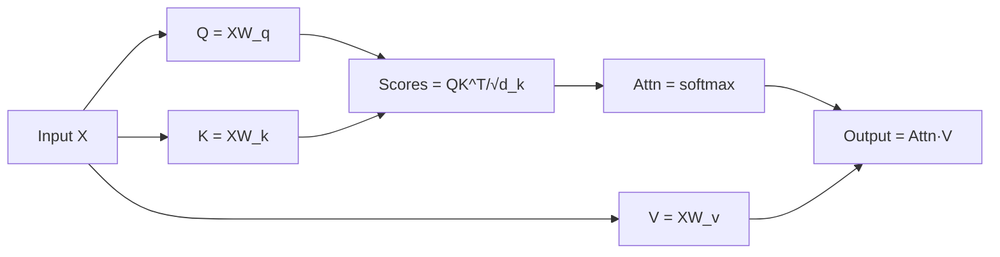

**Interview Q&A:**

*Q: Self-attention mein Q, K, V alag-alag matrices kyu hain? Same input se kyu nahi le lete?*
A: Bhai, agar tu same input use kare toh model ko flexibility nahi milegi. Q, K, V alag projections hain taaki model seekh sake ki kis perspective se token ko query banana hai, kis perspective se key, aur kis perspective se value. Yeh decoupling crucial hai — Q decide karta hai "main kya dhoondh raha hu", K decide karta hai "mere paas kya information hai jo searchable hai", aur V decide karta hai "agar match hua toh main kya contribute karunga". Agar teeno same hote toh expressive power kam ho jaati.

*Q: Softmax kyu use karte hain? Just normalize kyu nahi karte by sum?*
A: Softmax exponential use karta hai jo small differences ko amplify karta hai. Yeh ek "soft" version hai of argmax — high scores ko aur high banata hai, low ko aur low. Linear normalization se gradients flat ho jaate hain training mein. Plus, softmax ka output proper probability distribution hai (sum = 1, all positive), jo weighted average ke liye perfect hai.

*Q: Attention output ka shape kya hota hai?*
A: Input shape (B, N, d_model) tha. Q, K, V banayenge shape (B, N, d_k). Scores (B, N, N) hote hain — har token ka har dusre token se relation. Softmax ke baad bhi (B, N, N). Multiply with V (B, N, d_k) se output (B, N, d_k) milta hai. Toh sequence length preserve hoti hai, sirf feature dimension change ho sakta hai.

---

### 1.2 Scaled dot-product (why √d_k)

**Definition:** Scaled dot-product attention mein QK^T ko √d_k se divide karte hain before softmax. Yeh scaling ek crucial detail hai jo training stability ke liye essential hai.

**Why:** Bhai, dimension d_k bada hota hai (jaise 64 ya 128), toh QK^T ke dot products bahut bade values ho jaate hain. Bade values softmax mein daalo toh ek token ka probability 1 ho jaata hai aur baaki sab 0 — yeh "saturation" hai. Saturated softmax ka gradient near-zero hota hai, training ruk jaati hai. Scaling se variance control mein rehti hai.

**How:**

```python
import torch
import torch.nn.functional as F
import math

def scaled_dot_product_attention(Q, K, V, mask=None):
    d_k = Q.size(-1)
    # √d_k se divide karna — variance ko 1 ke around rakhne ke liye
    scores = (Q @ K.transpose(-2, -1)) / math.sqrt(d_k)
    if mask is not None:
        # masked positions ko -inf kar do, softmax ke baad 0 ho jaayenge
        scores = scores.masked_fill(mask == 0, float('-inf'))
    attn = F.softmax(scores, dim=-1)
    return attn @ V, attn

# Variance check karke dekh
Q = torch.randn(1, 10, 64)
K = torch.randn(1, 10, 64)
print("Without scale:", (Q @ K.transpose(-2,-1)).var().item())
print("With scale:", ((Q @ K.transpose(-2,-1))/math.sqrt(64)).var().item())
```

Math: Agar Q aur K independent random vectors hain with mean 0 variance 1, toh dot product ka variance d_k hota hai. √d_k se divide karne se variance wapas 1 ho jaati hai.

**Real-life Example:** Soch tu ek group mein vote karwa raha hai. Agar scores 1, 2, 3 hain toh softmax balanced distribution dega. Lekin scores 100, 200, 300 ho gaye toh softmax almost 0, 0, 1 dega — sirf last vote count hoga. Scaling sab ko reasonable range mein laata hai.

**Mermaid Diagram:**

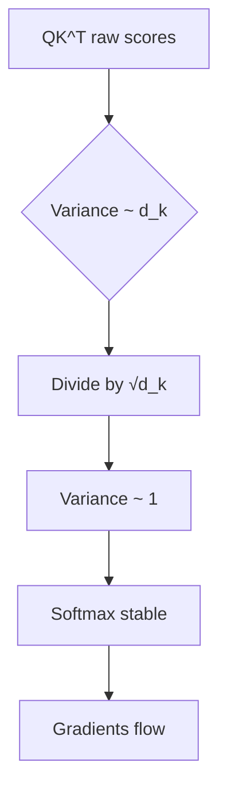

**Interview Q&A:**

*Q: Kyu √d_k? d_k ya log(d_k) kyu nahi?*
A: Variance analysis se aata hai yeh. Q aur K ke entries assume karte hain unit variance. Dot product = sum of d_k products, toh variance = d_k (assuming independence). Standard deviation √d_k hai. Toh √d_k se divide karke standard deviation 1 ho jaati hai, jo softmax ke liye ideal hai. d_k se divide karoge toh over-shrink ho jaayega aur model under-confident ho jaayega.

*Q: Scaling na karein toh kya hoga practically?*
A: Training mein bhayanak instability dikhegi. Initial layers ke scores bohot bade ho jaayenge, softmax saturate hoga, gradients vanish ho jaayenge. Loss plateau hoga ya NaN aayega. Vaswani paper mein clearly mention hai — without scaling, "the dot products grow large in magnitude, pushing the softmax function into regions where it has extremely small gradients."

*Q: Kya temperature scaling se related hai?*
A: Bilkul! √d_k ek fixed temperature hai. Temperature scaling general technique hai softmax ki sharpness control karne ke liye. Higher temperature → softer distribution. Inference time pe tu temperature use karta hai sampling ke liye, training mein √d_k fixed hai but mathematically same family ka concept hai.

---

### 1.3 Multi-head attention

**Definition:** Multi-head attention mein ek single attention ke bajaaye multiple "heads" parallel mein chalte hain, har head apna alag Q, K, V projection seekhta hai. Phir saare heads ke outputs concatenate karke ek final linear layer se nikaalte hain.

**Why:** Single attention head sirf ek "perspective" se relations dekh sakta hai. Multi-head se model alag-alag types ke patterns capture kar sakta hai — ek head syntactic relations dekhe, doosra semantic, teesra positional. Yeh ensemble effect deta hai aur representation power badhata hai.

**How:**

```python
import torch
import torch.nn as nn
import torch.nn.functional as F
import math

class MultiHeadAttention(nn.Module):
    def __init__(self, d_model, n_heads):
        super().__init__()
        assert d_model % n_heads == 0
        self.d_model = d_model
        self.n_heads = n_heads
        self.d_k = d_model // n_heads  # har head ka dimension

        # Single big matrices, baad mein split karenge
        self.W_q = nn.Linear(d_model, d_model)
        self.W_k = nn.Linear(d_model, d_model)
        self.W_v = nn.Linear(d_model, d_model)
        self.W_o = nn.Linear(d_model, d_model)  # output projection

    def forward(self, x, mask=None):
        B, N, _ = x.shape
        # Project aur reshape — har head ko alag dimension mein
        Q = self.W_q(x).view(B, N, self.n_heads, self.d_k).transpose(1,2)
        K = self.W_k(x).view(B, N, self.n_heads, self.d_k).transpose(1,2)
        V = self.W_v(x).view(B, N, self.n_heads, self.d_k).transpose(1,2)
        # Shape ab: (B, n_heads, N, d_k)

        scores = Q @ K.transpose(-2,-1) / math.sqrt(self.d_k)
        if mask is not None:
            scores = scores.masked_fill(mask == 0, float('-inf'))
        attn = F.softmax(scores, dim=-1)
        out = attn @ V  # (B, n_heads, N, d_k)

        # Heads concatenate karke wapas (B, N, d_model)
        out = out.transpose(1,2).contiguous().view(B, N, self.d_model)
        return self.W_o(out)
```

Math: head_i = Attention(QW_q^i, KW_k^i, VW_v^i). MultiHead = Concat(head_1,...,head_h) W_o.

**Real-life Example:** Ek movie review padhne mein soch — ek perspective se tu plot dekhta hai, doosri se acting, teesri se cinematography. Final opinion sab ko combine karke banta hai. Multi-head attention exactly yahi karta hai — different "lenses" se same input ko dekhta hai.

**Mermaid Diagram:**

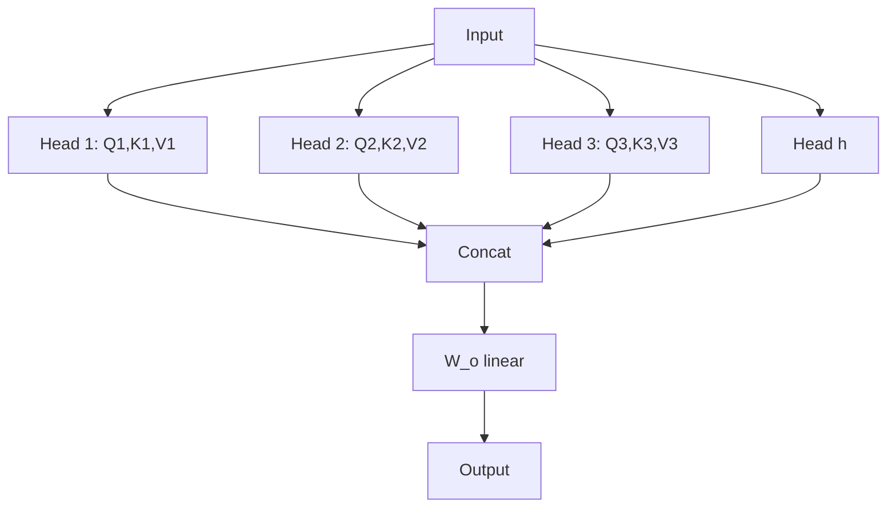

**Interview Q&A:**

*Q: Number of heads kaise decide karein?*
A: Yeh hyperparameter hai. Vaswani paper mein 8 heads use kiye, GPT-3 mein 96, Llama-2-70B mein 64. Rule of thumb — d_model ko n_heads se exactly divide hona chahiye. Zyada heads = zyada granular patterns, lekin har head ka dimension chhota hota jaata hai. Trade-off hai. Empirically, d_k 64-128 ke around best kaam karta hai.

*Q: Multi-head ka computational cost single-head se zyada hai?*
A: Almost same! Kyuki d_model = n_heads × d_k fixed hai. Total parameters wahi rehte hain — bas matrices ko reshape karke parallel compute karte ho. Modern GPUs pe yeh efficiently batched ho jaata hai. Toh free lunch hai expressivity ke liye.

*Q: Heads alag-alag patterns seekhte hain — kaise verify karein?*
A: Attention weights visualize karke. BertViz jaisi libraries hain. Research papers mein dikhaya gaya hai ki kuch heads syntactic dependencies (subject-verb) capture karte hain, kuch coreference, kuch positional patterns. Lekin sometimes heads redundant bhi hote hain — yahi reason hai pruning research ka ki kuch heads safely remove kiye ja sakte hain.

---

### 1.4 Causal/masked vs bidirectional

**Definition:** Causal attention (a.k.a. masked) mein ek token sirf apne se pehle ke tokens ko dekh sakta hai, future ko nahi. Bidirectional attention mein har token saari sequence dekh sakta hai. GPT causal hai, BERT bidirectional.

**Why:** Language modeling (next token prediction) mein agar future dikh raha hai toh cheating ho gayi. Tu agle word ko predict kar raha hai but model ne already use dekh liya. Toh causal mask zaroori hai. Lekin classification, encoding, embedding tasks ke liye full context useful hai — bidirectional better.

**How:**

```python
import torch
import torch.nn.functional as F
import math

def causal_mask(seq_len):
    # Lower triangular matrix — diagonal aur uske neeche 1, upar 0
    return torch.tril(torch.ones(seq_len, seq_len))

def causal_attention(Q, K, V):
    d_k = Q.size(-1)
    scores = Q @ K.transpose(-2,-1) / math.sqrt(d_k)
    N = scores.size(-1)
    mask = causal_mask(N).to(scores.device)
    # Future positions ko -inf kar do
    scores = scores.masked_fill(mask == 0, float('-inf'))
    attn = F.softmax(scores, dim=-1)
    return attn @ V

# Example: token 2 sirf token 0,1,2 dekhega
# token 5 sirf 0,1,2,3,4,5 dekhega
print(causal_mask(5))
# tensor([[1,0,0,0,0],
#         [1,1,0,0,0],
#         [1,1,1,0,0],
#         [1,1,1,1,0],
#         [1,1,1,1,1]])
```

Math: M_ij = 1 if i ≥ j else 0. scores = scores ⊙ M + (-inf)(1-M). Softmax of -inf = 0.

**Real-life Example:** Causal: tu ek mystery novel padh raha hai page by page, agla page nahi dikh raha. Bidirectional: tu poori book ek baar mein samajh sakta hai, kahin se kahin bhi jump kar sakta hai. Translation jaise tasks mein decoder causal hota hai (output generate kar raha hai), encoder bidirectional hota hai (input fully samajhna hai).

**Mermaid Diagram:**

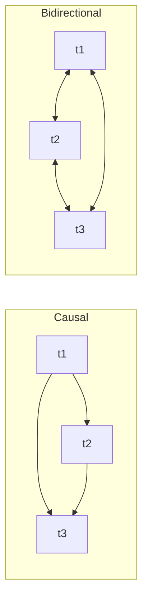

**Interview Q&A:**

*Q: Mask kahan apply karte hain — softmax se pehle ya baad?*
A: Softmax se pehle, scores pe. Masked positions pe -inf rakhte hain taaki softmax ke baad woh exact 0 ho jaayein. Agar tu softmax ke baad mask karega aur renormalize karega, toh mathematically same nahi hoga, gradient flow alag hoga, aur numerical issues aayenge. Pre-softmax masking standard hai.

*Q: Bidirectional model ko language generation mein use kar sakte ho?*
A: Direct nahi. BERT-style models pretrained hain masked language modeling pe, generation native nahi hai. Lekin tricks hain — iterative refinement, BERT-as-encoder + autoregressive decoder. Encoder-decoder models (T5, BART) mein encoder bidirectional hota hai, decoder causal — best of both worlds.

*Q: KV cache causal attention mein kyu kaam karta hai?*
A: Causal mein future tokens past ko affect nahi karte. Toh jab tu naya token generate karta hai, purane tokens ke K, V values change nahi hote — unhe cache kar sakte ho. Bidirectional mein har new token saari sequence ko reprocess karwata, KV cache useless ho jaata. Yeh ek bohot bada efficiency advantage hai autoregressive generation ka.

---

### 1.5 Cross-attention

**Definition:** Cross-attention mein Q ek source se aata hai aur K, V doosre source se. Typical encoder-decoder setup mein decoder ke tokens (Q) encoder ke outputs (K, V) ko attend karte hain.

**Why:** Translation jaise tasks mein input language aur output language alag hain. Decoder ko har step pe input sentence se relevant information chahiye. Cross-attention yahi bridge hai — decoder query banata hai "abhi mujhe kya chahiye" aur encoder ke representations se relevant information pull karta hai.

**How:**

```python
import torch
import torch.nn as nn
import torch.nn.functional as F
import math

class CrossAttention(nn.Module):
    def __init__(self, d_model, n_heads):
        super().__init__()
        self.n_heads = n_heads
        self.d_k = d_model // n_heads
        self.W_q = nn.Linear(d_model, d_model)  # decoder se Q
        self.W_k = nn.Linear(d_model, d_model)  # encoder se K
        self.W_v = nn.Linear(d_model, d_model)  # encoder se V
        self.W_o = nn.Linear(d_model, d_model)

    def forward(self, decoder_x, encoder_out):
        B, N_dec, _ = decoder_x.shape
        N_enc = encoder_out.size(1)

        Q = self.W_q(decoder_x).view(B, N_dec, self.n_heads, self.d_k).transpose(1,2)
        K = self.W_k(encoder_out).view(B, N_enc, self.n_heads, self.d_k).transpose(1,2)
        V = self.W_v(encoder_out).view(B, N_enc, self.n_heads, self.d_k).transpose(1,2)

        scores = Q @ K.transpose(-2,-1) / math.sqrt(self.d_k)
        attn = F.softmax(scores, dim=-1)
        out = attn @ V
        out = out.transpose(1,2).contiguous().view(B, N_dec, -1)
        return self.W_o(out)
```

Math: Same attention formula, bas Q != source of K,V. Attn shape (B, h, N_dec, N_enc) — rectangular hai, square nahi.

**Real-life Example:** Tu ek presentation de raha hai (decoder) aur teri team ne research kiya hai (encoder output). Har slide pe tu apni notes (Q) ke basis pe team ke research (K, V) se relevant points pull karta hai. Translation: "main kha raha hu" → encoder process karta hai Hindi, decoder English generate karta hai aur har English word ke time pe Hindi tokens ko cross-attend karta hai.

**Mermaid Diagram:**

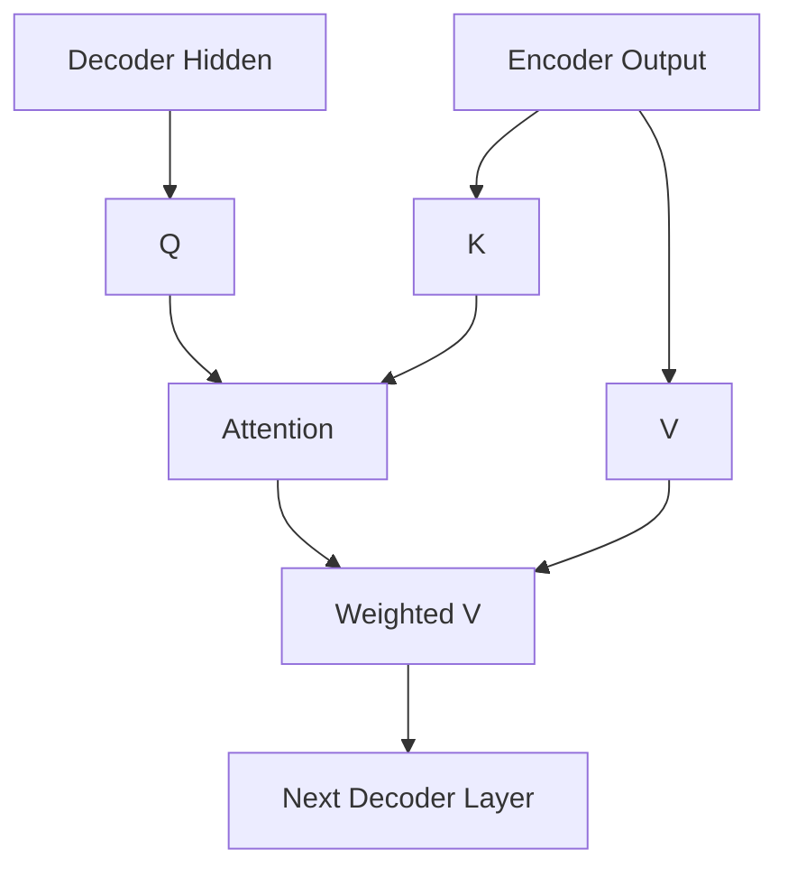

**Interview Q&A:**

*Q: Cross-attention mein mask lagta hai?*
A: Padding mask lagta hai encoder side pe — encoder ke padding tokens ko attend nahi karna. Lekin causal mask nahi lagta cross-attention pe, kyuki decoder ka token encoder ke kisi bhi position ko dekh sakta hai (encoder full input already process kar chuka hai). Self-attention decoder side pe causal hota hai, cross-attention bidirectional w.r.t. encoder.

*Q: Decoder-only models (GPT) mein cross-attention nahi hota — kaise kaam karte hain?*
A: GPT mein input aur output same sequence mein concatenated hote hain. Prompt + generation ek hi causal stream hai. Cross-attention ki need nahi kyuki input already self-attention ke through accessible hai. Yeh simpler architecture hai aur scaling ke liye better proved hua. Encoder-decoder T5 jaise models specific tasks mein achhe hain (translation, summarization) but GPT-style scaling ka winner hai.

*Q: Cross-attention ka complexity?*
A: O(N_dec × N_enc × d). Square nahi hota self-attention jaise. Agar decoder length M aur encoder length N hai, toh M×N attention matrix banti hai. Long input + short output ya vice versa pe yeh efficient hota hai. Lekin agar dono bade hain toh yeh bhi bottleneck ban sakta hai.

---

### 1.6 O(n²) complexity — the bottleneck

**Definition:** Self-attention ka time aur memory complexity sequence length ke saath quadratic hai — O(n²d). 1000 tokens pe 1M operations, 10000 tokens pe 100M operations. Yeh long-context ka biggest bottleneck hai.

**Why:** Har token ko har dusre token se compare karna padta hai — N×N attention matrix banti hai. Memory mein yeh matrix store karna padta hai for backprop. 100K context = 10 billion entries × 4 bytes = 40 GB sirf attention matrix ke liye! Yahi reason hai ki naive transformer ko long context pe scale karna mushkil hai.

**How:**

```python
import torch
import time

def measure_attention_cost(seq_lens, d_model=512):
    for N in seq_lens:
        Q = torch.randn(1, N, d_model, device='cuda')
        K = torch.randn(1, N, d_model, device='cuda')
        V = torch.randn(1, N, d_model, device='cuda')

        start = time.time()
        scores = Q @ K.transpose(-2,-1) / (d_model ** 0.5)  # O(N²d)
        attn = torch.softmax(scores, dim=-1)
        out = attn @ V  # O(N²d)
        torch.cuda.synchronize()
        elapsed = time.time() - start

        mem = scores.numel() * 4 / 1e9  # GB
        print(f"N={N}: time={elapsed:.3f}s, attn_matrix_mem={mem:.2f}GB")

# measure_attention_cost([512, 1024, 2048, 4096, 8192])
# Memory aur time dono N² se badhte hain
```

Math: Total ops ≈ 2N²d (for QK^T and AttnV) + N² (softmax). Memory ≈ N² for attention weights.

**Real-life Example:** Soch class mein 30 students hain, har koi har dusre se baat kar raha hai. Yeh 30×30 = 900 conversations. Ab 300 students ho gaye toh 90,000 conversations. Quadratic explosion. Yahi reason hai ki long context LLMs (1M tokens wale) special tricks use karte hain — Flash Attention, Ring Attention, sparse attention, sliding window etc.

**Mermaid Diagram:**

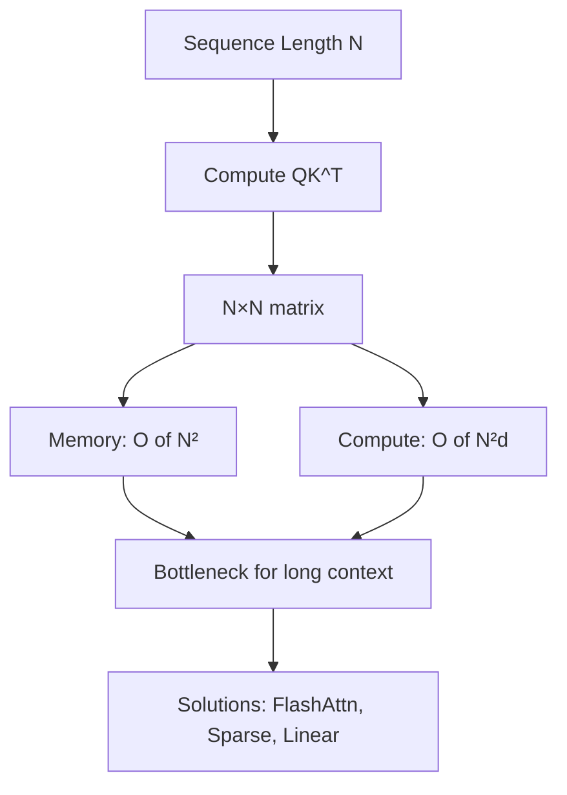

**Interview Q&A:**

*Q: Quadratic complexity ko kaise tackle karte hain modern LLMs?*
A: Multiple approaches hain. Flash Attention recompute karta hai attention without storing the full matrix — memory O(N), but compute still O(N²). Sparse attention (Longformer, BigBird) sirf local + few global tokens attend karta hai. Linear attention (Performer, Linformer) approximations use karta hai O(N) compute. State-space models (Mamba) toh attention chhod ke alag mechanism use karte hain. RingAttention multiple GPUs pe attention split karta hai.

*Q: Inference vs training mein O(n²) ka impact different hai?*
A: Bilkul. Training mein full sequence ek baar mein process hoti hai — full N×N attention. Inference (autoregressive generation) mein KV cache ke saath, har new token sirf O(N) compute karta hai (current Q × cached K), but cumulative O(N²) ho jaata hai poori sequence ke liye. Memory bhi grow karti hai linearly with KV cache.

*Q: Practical limit kya hai naive transformer ka?*
A: GPU memory pe depend karta hai. A100 80GB pe d_model=4096, naive attention pe ~8K-16K tokens manageable hain training mein. Inference mein 32K possible. Beyond that, FlashAttention essential ho jaata hai — wahi 100K+ unlock karta hai. Llama-3 ne 128K context with grouped-query attention + flash attention v2 achieve kiya. Frontier models (Gemini, Claude) 1M+ ke liye custom hardware-aware tricks use karte hain.

---

## 2. Transformer Block

### 2.1 Layer norm — pre-norm vs post-norm

**Definition:** LayerNorm har token ke features ko normalize karta hai — mean 0, variance 1, phir learnable scale aur shift. Pre-norm mein LN sub-layer ke pehle hota hai, post-norm mein baad mein.

**Why:** Deep networks mein activations ka distribution shift hota hai layers ke saath, training unstable hoti hai. LayerNorm yeh stabilize karta hai. Pre-norm vs post-norm ka choice training stability aur gradient flow ko significantly affect karta hai. Original paper post-norm tha, but modern LLMs (GPT-2 onwards) sab pre-norm use karte hain.

**How:**

```python
import torch
import torch.nn as nn

class LayerNorm(nn.Module):
    def __init__(self, d, eps=1e-5):
        super().__init__()
        self.gamma = nn.Parameter(torch.ones(d))
        self.beta = nn.Parameter(torch.zeros(d))
        self.eps = eps

    def forward(self, x):
        # Last dim ke across normalize
        mean = x.mean(dim=-1, keepdim=True)
        var = x.var(dim=-1, keepdim=True, unbiased=False)
        x_norm = (x - mean) / torch.sqrt(var + self.eps)
        return self.gamma * x_norm + self.beta

# Post-norm (original)
class PostNormBlock(nn.Module):
    def forward(self, x, attn, ffn):
        x = self.ln1(x + attn(x))   # LN baad mein
        x = self.ln2(x + ffn(x))
        return x

# Pre-norm (modern)
class PreNormBlock(nn.Module):
    def forward(self, x, attn, ffn):
        x = x + attn(self.ln1(x))   # LN pehle
        x = x + ffn(self.ln2(x))
        return x
```

Math: LN(x) = γ ⊙ (x - μ)/√(σ² + ε) + β. Per-token, across feature dimension.

**Real-life Example:** Soch tu cricket team ka coach hai. Har match ke baad players ke scores ko normalize karta hai (kuch ne 100 banaye, kuch ne 10) — relative performance dekhne ke liye. Pre-match normalize karna (pre-norm) zyada stable hota hai players ke liye, post-match (post-norm) original approach tha.

**Mermaid Diagram:**

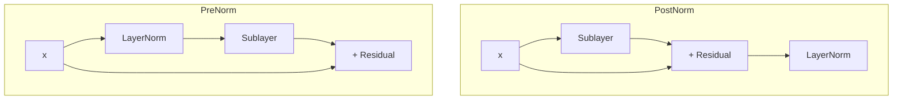

**Interview Q&A:**

*Q: Pre-norm kyu prefer karte hain modern models?*
A: Pre-norm mein gradient flow direct hota hai residual stream mein — saare blocks across, gradient bina LN ke pass hota hai. Yeh deep networks (100+ layers) mein training stability ko hugely improve karta hai, learning rate warmup ki need kam karta hai. Post-norm mein gradient har LN se guzarna padta hai, deep mein vanishing/exploding ho sakta hai. Trade-off — post-norm thoda better final performance de sakta hai but pre-norm reliable hai.

*Q: LayerNorm vs BatchNorm kyu chuna?*
A: BatchNorm batch dimension pe normalize karta hai — variable sequence length aur small batches mein problematic. LayerNorm per-sample, per-token normalize karta hai — sequence length, batch size kuch bhi ho, consistent hai. Plus, inference time pe BN ko running stats chahiye, LN ko nahi. Sequential models ke liye LN natural choice hai.

*Q: RMSNorm kya hota hai aur LN se kab better?*
A: RMSNorm sirf scaling karta hai by RMS, mean subtraction skip karta hai: RMSNorm(x) = x / √(mean(x²)+ε) × γ. Llama, T5 use karte hain. Faster compute hai (one pass instead of two), memory kam, aur empirically same ya better performance. Mean subtraction redundant pata chala hai practice mein.

---

### 2.2 FFN with SwiGLU

**Definition:** Transformer block ka second sub-layer FFN (feed-forward network) hota hai — typically two linear layers with non-linearity. SwiGLU ek modern activation hai jo gating mechanism use karta hai, GeLU/ReLU se behtar perform karta hai.

**Why:** Attention sirf token mixing karta hai (information across tokens). FFN per-token transformation hai (information processing within token). FFN parameters ka majority share hote hain — usually 2/3 of total. SwiGLU gated activation use karke smoother gradients aur better empirical performance deta hai.

**How:**

```python
import torch
import torch.nn as nn
import torch.nn.functional as F

class FFN_ReLU(nn.Module):
    """Original Transformer ka FFN"""
    def __init__(self, d_model, d_ff):
        super().__init__()
        self.w1 = nn.Linear(d_model, d_ff)
        self.w2 = nn.Linear(d_ff, d_model)

    def forward(self, x):
        return self.w2(F.relu(self.w1(x)))

class SwiGLU(nn.Module):
    """Llama, PaLM ka FFN — gated"""
    def __init__(self, d_model, d_ff):
        super().__init__()
        # 3 linear layers — gate, up, down
        self.w_gate = nn.Linear(d_model, d_ff, bias=False)
        self.w_up = nn.Linear(d_model, d_ff, bias=False)
        self.w_down = nn.Linear(d_ff, d_model, bias=False)

    def forward(self, x):
        # Swish(gate) ⊙ up — gate decide karta hai kya pass karna hai
        gate = F.silu(self.w_gate(x))  # silu = swish = x*sigmoid(x)
        up = self.w_up(x)
        return self.w_down(gate * up)

# d_ff usually 4*d_model (ReLU) ya (8/3)*d_model (SwiGLU, parameters match karne ke liye)
```

Math: SwiGLU(x) = (Swish(xW_gate) ⊙ xW_up) W_down. Swish(x) = x · σ(x).

**Real-life Example:** ReLU ek harsh switch hai — on ya off. Swish smooth hai — gradually open/close hota hai. SwiGLU ek "smart filter" hai jisme ek branch decide karti hai (gate) ki doosri branch (up) se kitna pass karna hai. Jaise tu music sun raha hai aur volume knob (gate) hai jo decide karta hai sound (up) kitna chalega.

**Mermaid Diagram:**

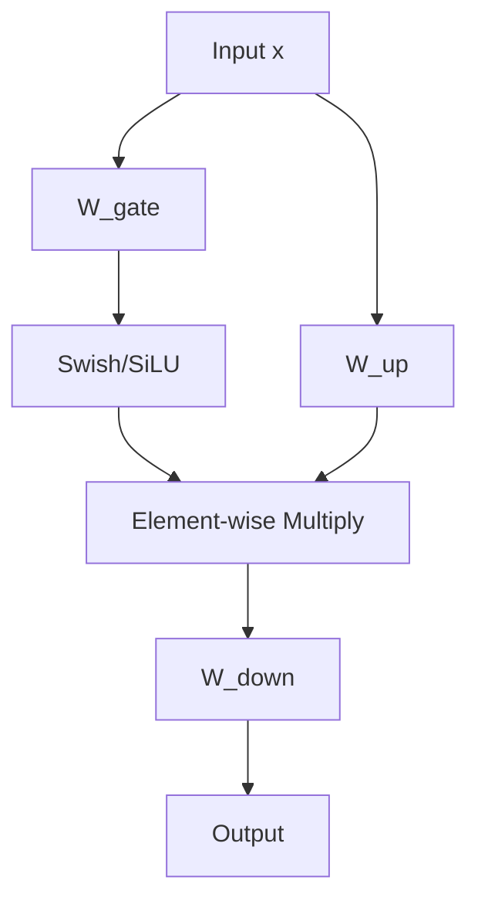

**Interview Q&A:**

*Q: SwiGLU mein 3 matrices hain ReLU mein 2 — parameters fair compare?*
A: Sahi observation. d_ff ko reduce karte hain SwiGLU mein taaki total params match karein. Llama mein d_ff = (2/3) × 4 × d_model = (8/3)d_model. Toh 3 matrices × (8/3)d_model = 8 d_model × d_model, jo 2 matrices × 4 d_model wale ReLU FFN ke barabar hai. Parameter-matched comparison mein SwiGLU consistently jeetta hai.

*Q: Activation function choice kitna matter karta hai practically?*
A: Bohot. ReLU → GeLU (BERT, GPT-2) → SwiGLU (Llama, PaLM) — har upgrade pe perplexity drop hota hai. GeLU smooth ReLU hai, SwiGLU gating add karta hai. Ablation studies mein 1-2% improvement consistent hai. Choti improvements compound hoti hain at scale. Frontier models almost universally SwiGLU/GeGLU use kar rahe hain.

*Q: FFN kya seekhta hai conceptually?*
A: Research suggest karta hai FFN "key-value memory" jaisa kaam karta hai. First linear (W_up/W_gate) keys ke against match karta hai input ko, second linear (W_down) corresponding values retrieve karta hai. Yeh interpretation Transformer-Circuits (Anthropic) aur Geva et al. ke research mein detail mein explore hua hai. FFN model ke "knowledge" ka bohot bada part store karta hai.

---

### 2.3 Residual connections in transformers

**Definition:** Residual connection (a.k.a. skip connection) input ko sub-layer ke output mein add kar deta hai: y = x + Sublayer(x). Yeh ResNet se aaya hai, transformer ke har sub-layer mein hota hai.

**Why:** Deep networks (96+ layers GPT mein) mein gradient vanishing problem hota hai. Residual se gradient direct path se backward flow kar sakta hai. Plus, "residual stream" concept — har layer input ko slightly modify karti hai instead of replace, model gradually refine karta hai representations.

**How:**

```python
import torch
import torch.nn as nn

class TransformerBlock(nn.Module):
    def __init__(self, d_model, n_heads, d_ff):
        super().__init__()
        self.ln1 = nn.LayerNorm(d_model)
        self.attn = MultiHeadAttention(d_model, n_heads)
        self.ln2 = nn.LayerNorm(d_model)
        self.ffn = SwiGLU(d_model, d_ff)

    def forward(self, x):
        # Residual connection 1: attention sub-layer
        # x + ... — yeh "skip" hai, gradient direct flow karega
        x = x + self.attn(self.ln1(x))
        # Residual connection 2: FFN sub-layer
        x = x + self.ffn(self.ln2(x))
        return x

# Without residual — gradient layers ke through pass hota hai serially
# class BadBlock(nn.Module):
#     def forward(self, x):
#         x = self.attn(self.ln1(x))  # original x lost
#         x = self.ffn(self.ln2(x))
#         return x  # 100 layers baad gradient barely survive karega
```

Math: y = x + f(x). Backprop: ∂y/∂x = I + ∂f/∂x. Identity term gradient ko preserve karta hai.

**Real-life Example:** Soch tu ek essay edit kar raha hai. Residual approach: tu original copy rakhta hai aur changes "track changes" se add karta hai (additive). Bina residual: har edit pe poora rewrite karte ho — original lost ho jaata hai. Multi-pass editing mein additive approach se gradual refinement hota hai, aur agar koi pass kharab hua toh back to original possible hai.

**Mermaid Diagram:**

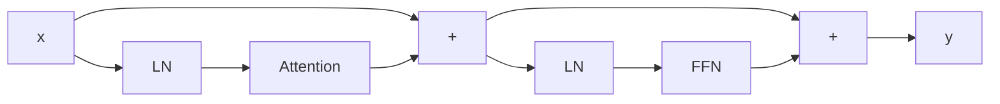

**Interview Q&A:**

*Q: Residual stream concept kya hai?*
A: Modern interpretation hai ki residual connection se ek "stream" banta hai — har token ka representation poori network mein flow karta hai aur har layer chhoti additions karti hai. Yeh ek shared memory bus jaisa hai. Anthropic's mechanistic interpretability research isi pe based hai — "writes" aur "reads" identify karte hain residual stream pe. Bohot powerful conceptual framework hai LLMs ko samajhne ke liye.

*Q: Bina residual ke transformer kaam karega?*
A: 2-4 layers tak shayad theek-thaak, but 12+ layers pe training collapse ho jaayegi. Gradients vanish ho jaayenge, optimization stuck ho jaayegi. Empirically test ho chuka hai — residual essential hai for depth. Yeh ResNet ki original insight thi 2015 mein, transformer ne adopt kiya.

*Q: Residual ke alternatives hain?*
A: DenseNet style concatenation — but parameters explode hote hain. Highway networks — gating add karte hain residual mein, empirically simple residual jeet jaata hai. RevNets — invertible residuals, memory save hota hai but compute zyada. Practical choice plain residual hai with maybe scaling (DeepNet style for 1000+ layers).

---

### 2.4 Encoder, decoder, encoder-decoder variants

**Definition:** Encoder-only models (BERT) sirf input encode karte hain — bidirectional, no generation. Decoder-only (GPT, Llama) autoregressive generation karte hain — causal. Encoder-decoder (T5, BART, original Transformer) dono use karte hain — encoder bidirectional, decoder causal with cross-attention.

**Why:** Different tasks need different architectures. Classification, NER, embeddings → encoder. Open-ended generation, chat → decoder. Translation, summarization (clear input→output mapping) → encoder-decoder. Decoder-only ne dominate kiya hai recently kyuki yeh universal — generation, classification (with prompting), embeddings (with adaptation) sab kar leta hai.

**How:**

```python
import torch
import torch.nn as nn

class EncoderBlock(nn.Module):
    """BERT-style: bidirectional self-attention + FFN"""
    def __init__(self, d_model, n_heads, d_ff):
        super().__init__()
        self.attn = MultiHeadAttention(d_model, n_heads)  # no causal mask
        self.ffn = SwiGLU(d_model, d_ff)
        self.ln1 = nn.LayerNorm(d_model)
        self.ln2 = nn.LayerNorm(d_model)

    def forward(self, x, padding_mask=None):
        x = x + self.attn(self.ln1(x), mask=padding_mask)
        x = x + self.ffn(self.ln2(x))
        return x

class DecoderBlock(nn.Module):
    """GPT-style: causal self-attention + FFN"""
    def __init__(self, d_model, n_heads, d_ff):
        super().__init__()
        self.attn = MultiHeadAttention(d_model, n_heads)
        self.ffn = SwiGLU(d_model, d_ff)
        self.ln1 = nn.LayerNorm(d_model)
        self.ln2 = nn.LayerNorm(d_model)

    def forward(self, x):
        N = x.size(1)
        causal = torch.tril(torch.ones(N, N, device=x.device))
        x = x + self.attn(self.ln1(x), mask=causal)
        x = x + self.ffn(self.ln2(x))
        return x

class EncDecBlock(nn.Module):
    """T5-style: causal self-attn + cross-attn + FFN"""
    def __init__(self, d_model, n_heads, d_ff):
        super().__init__()
        self.self_attn = MultiHeadAttention(d_model, n_heads)
        self.cross_attn = CrossAttention(d_model, n_heads)
        self.ffn = SwiGLU(d_model, d_ff)
        self.ln1 = nn.LayerNorm(d_model)
        self.ln2 = nn.LayerNorm(d_model)
        self.ln3 = nn.LayerNorm(d_model)

    def forward(self, x, encoder_out):
        N = x.size(1)
        causal = torch.tril(torch.ones(N, N, device=x.device))
        x = x + self.self_attn(self.ln1(x), mask=causal)
        x = x + self.cross_attn(self.ln2(x), encoder_out)
        x = x + self.ffn(self.ln3(x))
        return x
```

**Real-life Example:** Encoder = ek student jo padhta hai aur samajhta hai. Decoder = ek student jo essay likhta hai word by word. Encoder-decoder = ek translator — pehle input language poori samajhta hai (encode), phir target language mein generate karta hai (decode) referring to original (cross-attention). GPT decoder hai — usse poocho usse hi answer milta hai. T5 encoder-decoder hai — translate, summarize jaisa structured.

**Mermaid Diagram:**

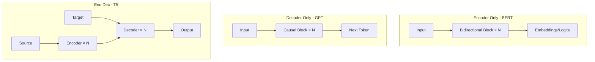

**Interview Q&A:**

*Q: Decoder-only kyu jeet raha hai?*
A: Simplicity aur scaling. Ek architecture, ek objective (next token), data efficient. Encoder-decoder mein two stacks train karna padta hai with cross-attention overhead. GPT-3, GPT-4, Claude, Llama, Gemini — sab decoder-only. In-context learning emerge karti hai sirf decoder-only mein convincingly. Plus, prompting paradigm decoder-only ke liye natural hai.

*Q: BERT abhi bhi relevant hai?*
A: Haan, specific use cases mein. Embeddings ke liye sentence-BERT, classification ke liye RoBERTa/DeBERTa, retrieval ke liye ColBERT. Encoder bidirectional context se richer representations banata hai jo classification/retrieval mein decoder se behtar hain (parameter-matched). Lekin general-purpose tasks ke liye decoder LLMs zyada powerful hain.

*Q: Encoder-decoder ka comeback ho sakta hai?*
A: Possible. Long context tasks mein encoder bidirectional advantage de sakta hai. Multimodal models (image encoder + text decoder, jaise Flamingo) implicitly enc-dec hain. T5 derivatives like Flan-T5 still strong hain specific benchmarks pe. Lekin dominant paradigm decoder-only rahega near future mein.

---

### 2.5 Reading 'Attention is All You Need' line by line

**Definition:** "Attention is All You Need" (Vaswani et al., 2017) Transformer architecture ka original paper hai. 8 pages mein ek architecture introduce kiya jo deep learning ko redefine kar gaya. Padhna mandatory hai.

**Why:** Foundational paper hai. Bina iske LLMs samajhna mushkil. Plus, paper concise aur clear hai — methodology, results, analysis sab hai. Modern deep learning ka "Bible" papers mein se ek hai.

**How (line by line key insights):**

```python
# Section 3.1 — Encoder Decoder Stacks
# "stack of N=6 identical layers"
# Encoder mein 2 sub-layers, decoder mein 3
# d_model = 512, har layer same dimension produce karti hai

# Section 3.2.1 — Scaled Dot-Product Attention
# Attention(Q,K,V) = softmax(QK^T/√d_k)V
# "We suspect that for large values of d_k, the dot products grow large in magnitude"
# Yahi √d_k justification

# Section 3.2.2 — Multi-Head Attention
# h=8, d_k=d_v=d_model/h=64
# "attend to information from different representation subspaces"

# Section 3.3 — Position-wise FFN
# FFN(x) = max(0, xW_1+b_1)W_2+b_2
# "two linear transformations with a ReLU activation"
# d_ff=2048 (4x of d_model)

# Section 3.4 — Embeddings and Softmax
# Input/output embeddings tied, multiplied by √d_model

# Section 3.5 — Positional Encoding
# PE(pos, 2i) = sin(pos/10000^(2i/d_model))
# PE(pos, 2i+1) = cos(pos/10000^(2i/d_model))
# Sinusoidal — "may allow the model to easily learn to attend by relative positions"

# Section 5.4 — Regularization
# Dropout 0.1, label smoothing 0.1
# Adam β1=0.9, β2=0.98, ε=1e-9
# Warmup learning rate schedule
```

**Real-life Example:** Yeh paper deep learning ka "Newton's Principia" hai. Jaise physicist Newton ke laws padhte hain bina sawaal kiye, ML engineer Vaswani ka paper padhta hai. Architecture diagrams, hyperparameter table, training details — sab kuch reproducible hai paper se directly.

**Mermaid Diagram:**

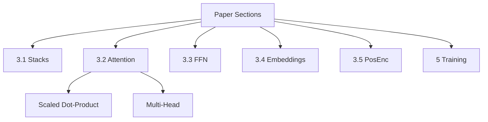

**Interview Q&A:**

*Q: Paper mein WMT 2014 EN-DE BLEU score kya tha?*
A: 28.4 BLEU on EN-DE, beating previous SOTA by 2 points. EN-FR pe 41.8. Ye seq2seq, ConvSeq2Seq se better tha. Lekin asli impact translation se zyada architecture ka tha — har subsequent NLP advance is paper se inspire hua hai.

*Q: Paper mein kya cheez explicit nahi thi jo modern best practice hai?*
A: Pre-norm vs post-norm — paper post-norm use karta hai, but modern models pre-norm. SwiGLU/GeLU — paper ReLU use karta hai. RoPE — paper sinusoidal use karta hai. Tokenizer details limited hain. Scaling laws paper ke 5 saal baad aaye. Toh paper foundation hai, refinements ongoing hain.

*Q: Paper se kya seekhne layak hai writing point of view se?*
A: Concise hai, clear ablation studies, har choice justify ki gayi hai (Table 3 — Variations). Architecture diagram (Figure 1) ek picture mein sab samjha deta hai. Math notation consistent. Code release nahi tha originally but Tensor2Tensor mein add kiya — reproducibility important. Modern ML papers ko padhne ke liye yeh template hai.

---

## 3. Tokenization

### 3.1 Character vs word vs subword

**Definition:** Tokenization text ko chhote units mein todna hai jo model process kar sake. Character-level (har character ek token), word-level (har word ek token), subword-level (BPE, WordPiece — words ko meaningful pieces mein todna).

**Why:** Words infinite hain (vocab explosion), characters too granular (lambi sequence). Subword sweet spot — common words intact, rare words pieces mein. Modern LLMs sab subword use karte hain. Tokenization ka choice model performance, efficiency, multilingual capability sab affect karta hai.

**How:**

```python
text = "Tokenization is fundamental"

# Character level
char_tokens = list(text)
print(f"Char ({len(char_tokens)}):", char_tokens[:10])
# ['T','o','k','e','n','i','z','a','t','i'...] — 27 tokens

# Word level
word_tokens = text.split()
print(f"Word ({len(word_tokens)}):", word_tokens)
# ['Tokenization', 'is', 'fundamental'] — 3 tokens

# Subword level (simplified BPE-like)
# "Tokenization" -> "Token", "ization"
# "is" -> "is"
# "fundamental" -> "fund", "amental"
subword_tokens = ["Token", "ization", "is", "fund", "amental"]
print(f"Subword ({len(subword_tokens)}):", subword_tokens)

# Trade-offs
# Char: vocab=~100, seq_len=very long
# Word: vocab=~1M+, OOV problem, seq_len=short
# Subword: vocab=32K-256K, no OOV, seq_len=medium
```

Math: For corpus C, character tokenization gives |V|≈|alphabet|, seq_len(text)=|text|. Word: |V|≈|unique words|, seq_len=|words|. Subword balances both.

**Real-life Example:** Soch postal address likhna. Character-level: har letter alag — bahut slow. Word-level: poora address ek shabd jaise "MumbaiMaharashtra" — confusing. Subword: "Mumbai", "Maharashtra" — meaningful units. Same logic LLMs ke liye — "unbelievable" ko "un", "believ", "able" mein todke morphology capture karte hain.

**Mermaid Diagram:**

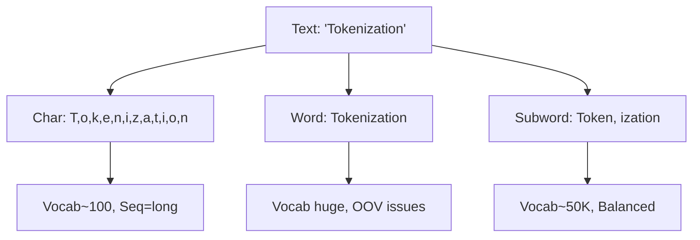

**Interview Q&A:**

*Q: Char-level transformer kab use karein?*
A: Multilingual scenarios mein with extremely diverse scripts, byte-level fallback ke liye, ya jab tokenizer-free approach chahiye (ByT5). Trade-off — sequence length 4-5x lambi ho jaati hai, compute expensive. Modern preference byte-level BPE hai (GPT-2 onwards) — characters ke advantages with subword's efficiency.

*Q: Word-level kyu nahi popular hai?*
A: OOV (out-of-vocabulary) problem — koi bhi naya word, typo, rare word "<UNK>" ban jaata hai. Vocabulary size explode hoti hai (English mein 1M+ unique words). Morphologically rich languages (Hindi, Turkish) mein har root ke 100s forms hote hain. Subword in problems ko elegantly solve karta hai.

*Q: Tokenization model performance ko kitna affect karti hai?*
A: Bohot. Wrong tokenization se model code, numbers, multilingual text mein struggle karta hai. GPT-2 ke tokenizer mein numbers split awkwardly hote the (12345 → "123","45"), arithmetic struggle hota tha. Llama-3 tokenizer specifically improved hai. Tokenizer change karna pretrained model ke liye essentially full retraining requires, so design choice critical hai upfront.

---

### 3.2 Byte-Pair Encoding (BPE)

**Definition:** BPE ek subword tokenization algorithm hai jo iteratively most frequent character pairs ko merge karke vocabulary banata hai. Originally compression algorithm tha, Sennrich et al. 2016 ne NLP mein adapt kiya.

**Why:** BPE language-agnostic, OOV-free, adjustable vocab size hai. GPT, RoBERTa, Llama sab BPE variants use karte hain. Byte-level BPE (GPT-2) toh literally koi text handle kar sakta hai — UTF-8 bytes pe operate karta hai.

**How:**

```python
from collections import Counter, defaultdict

def get_pair_freqs(corpus):
    """Adjacent token pairs ki frequency count karo"""
    pairs = Counter()
    for word, freq in corpus.items():
        symbols = word.split()
        for i in range(len(symbols)-1):
            pairs[(symbols[i], symbols[i+1])] += freq
    return pairs

def merge_pair(pair, corpus):
    """Most frequent pair ko merge karke naya token banao"""
    new_corpus = {}
    bigram = ' '.join(pair)
    replacement = ''.join(pair)
    for word, freq in corpus.items():
        new_word = word.replace(bigram, replacement)
        new_corpus[new_word] = freq
    return new_corpus

def train_bpe(corpus, num_merges):
    # Start: har word characters mein split
    # Format: "l o w </w>" : 5
    merges = []
    for i in range(num_merges):
        pairs = get_pair_freqs(corpus)
        if not pairs:
            break
        best = max(pairs, key=pairs.get)
        corpus = merge_pair(best, corpus)
        merges.append(best)
        print(f"Merge {i+1}: {best} (freq={pairs[best]})")
    return corpus, merges

# Example
corpus = {'l o w </w>': 5, 'l o w e r </w>': 2,
          'n e w e s t </w>': 6, 'w i d e s t </w>': 3}
final_corpus, merges = train_bpe(corpus, num_merges=5)
# Output: e+s -> es, es+t -> est, est+</w>, l+o -> lo, lo+w -> low
```

Math: At each step, find pair (a,b) = argmax count(a,b) in corpus. Replace with new token "ab". Repeat for k iterations to get vocab of size base+k.

**Real-life Example:** Soch tu Hindi shabd "khelte" "khel" "khilad" sab dekh raha hai. BPE pehle "k","h","e","l" alag dekhega, phir realize karega "khel" common hai — merge karega. Phir "te", "ari" jaise suffixes alag rakhega. End result — "khel" + "te" decomposition. Morphology naturally emerge hoti hai.

**Mermaid Diagram:**

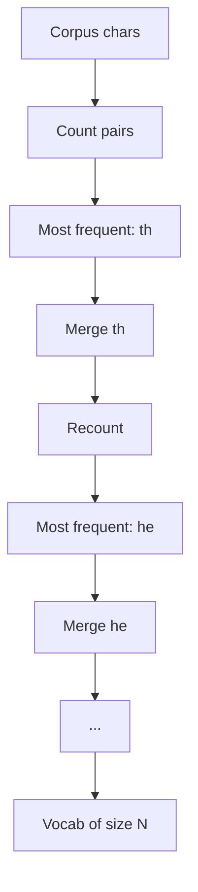

**Interview Q&A:**

*Q: BPE training corpus kaisa hona chahiye?*
A: Representative of target distribution. Domain-specific corpus se domain-specific tokenizer (code → CodeBERT tokenizer). Multilingual tokenizer ke liye balanced multilingual corpus. Size matters — millions of words minimum. Pretokenization (whitespace splitting) zaroori hai mostly. GPT-2 ne 40GB WebText pe train kiya, Llama ne similar scale.

*Q: BPE deterministic hai?*
A: Encoding deterministic hai given trained merges. Lekin training mein ties (equal frequency pairs) ka tie-break implementation-specific ho sakta hai. BPE-dropout (Provilkov et al.) randomization introduce karta hai training time pe — robustness ke liye. Inference mein mostly greedy aur deterministic.

*Q: Byte-level BPE ka advantage?*
A: GPT-2 ne pioneer kiya. Vocabulary base 256 bytes hai (UTF-8). Koi Unicode character handle ho jaata hai bina special <UNK>. Multilingual text, emoji, weird symbols — sab natural. Trade-off — kuch CJK characters multiple bytes mein split ho jaate hain, sequence thodi lambi. Modern preference yahi hai.

---

### 3.3 WordPiece, SentencePiece, Unigram

**Definition:** WordPiece (BERT) BPE jaisa hai but likelihood-based merge selection. SentencePiece (T5, Llama) language-agnostic framework hai — raw text se directly train hota hai. Unigram (Kudo 2018) probabilistic model hai jo top-down approach use karta hai.

**Why:** Different tokenizers different trade-offs. WordPiece good for monolingual deep learning. SentencePiece multilingual ke liye standard. Unigram probabilistic perspective deta hai aur multiple valid tokenizations support karta hai (regularization).

**How:**

```python
# WordPiece: BPE-like but maximize likelihood
# Merge criterion: maximize P(merged) / (P(left) * P(right))
# instead of just frequency

# SentencePiece: text ko bina pre-tokenize kiye train karta hai
# Whitespace ko bhi token treat karta hai (▁ symbol)
# Llama tokenizer: "Hello world" -> ["▁Hello", "▁world"]

# Unigram: top-down
# 1. Bade vocab se start karo (saare possible substrings)
# 2. EM algorithm: probabilities estimate karo
# 3. Lowest probability tokens drop karo
# 4. Target vocab size tak repeat

# Example: SentencePiece usage
import sentencepiece as spm

# Train
spm.SentencePieceTrainer.train(
    input='corpus.txt',
    model_prefix='m',
    vocab_size=8000,
    model_type='bpe',  # ya 'unigram'
    character_coverage=0.9995,
    pad_id=0, unk_id=1, bos_id=2, eos_id=3
)

# Use
sp = spm.SentencePieceProcessor()
sp.load('m.model')
tokens = sp.encode_as_pieces("Hello world")
ids = sp.encode_as_ids("Hello world")
print(tokens, ids)
```

Math: WordPiece scoring: score = P(ab) / (P(a)P(b)) — pointwise mutual information. Unigram: P(sentence) = ∏ P(token_i), maximize over corpus.

**Real-life Example:** WordPiece BERT mein use hota hai — "playing" → "play", "##ing". ## prefix continuation indicate karta hai. SentencePiece Llama mein — "▁Hello" se start indicate hota hai (▁ = space marker). Unigram alternatives provide karta hai — "playing" → "play"+"ing" ya "playing" (jo bhi probability se better ho).

**Mermaid Diagram:**

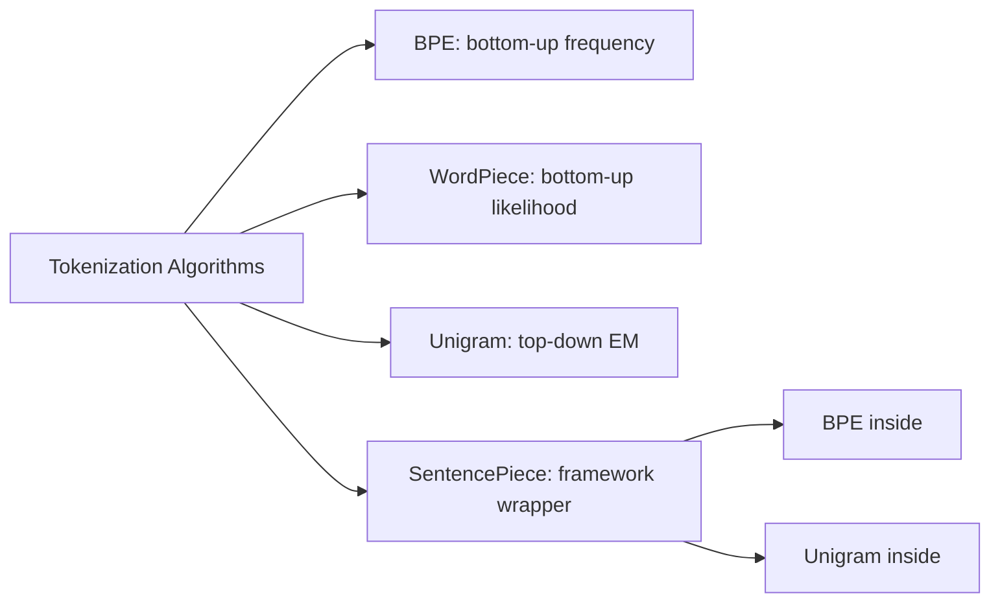

**Interview Q&A:**

*Q: WordPiece aur BPE mein practical farak?*
A: WordPiece likelihood-based merge select karta hai (information-theoretic), BPE pure frequency-based. WordPiece "##" prefix use karta hai non-initial subwords ke liye (BERT-style). Empirically perform similar — bigger differences from training corpus aur vocab size aate hain. BPE simpler aur slightly more popular.

*Q: SentencePiece BPE/WordPiece se kaise different hai?*
A: SentencePiece ek wrapper hai jo BPE ya Unigram inside use kar sakta hai. Key innovation — pre-tokenization ki need nahi (whitespace splitting). Whitespace ko ek special token (▁) treat karta hai. Yeh truly language-agnostic banata hai — Chinese (no spaces), Hindi (devanagari), code, sab ek hi framework mein. Reversible tokenization milti hai (decode → exact original).

*Q: Unigram ka subword regularization ka concept kya hai?*
A: Unigram model multiple valid tokenizations possible deta hai for same text, with probabilities. Training time pe sample karte ho — same sentence different tokenizations mein dekhta hai model. Yeh data augmentation hai, robustness badhata hai. NMT mein BLEU improvement dikha hai. BPE-dropout similar concept hai BPE ke liye.

---

### 3.4 Tiktoken, tokenizers library

**Definition:** Tiktoken OpenAI ki fast BPE tokenizer library hai (Rust + Python). HuggingFace ki "tokenizers" library general-purpose hai — BPE, WordPiece, Unigram, etc. support karti hai with Rust backend.

**Why:** Production mein tokenization fast hona chahiye — millions of tokens/second. Pure Python slow hota hai, Rust-based libraries 100x+ faster. Plus, alignment, special tokens, batch processing handle karna chahiye properly. Yeh libraries production-ready hain.

**How:**

```python
# Tiktoken — OpenAI models ke liye
import tiktoken

# GPT-4 tokenizer
enc = tiktoken.encoding_for_model("gpt-4")
text = "Hello, world! Tokenization is fun."

ids = enc.encode(text)
print(f"Token count: {len(ids)}")
print(f"IDs: {ids}")

# Decode
print(enc.decode(ids))

# Per-token decode (debugging)
for tid in ids:
    print(f"{tid}: '{enc.decode([tid])}'")

# HuggingFace tokenizers
from transformers import AutoTokenizer

tok = AutoTokenizer.from_pretrained("meta-llama/Llama-3-8B")
encoded = tok("Hello, world!", return_tensors="pt")
print(encoded.input_ids)
print(tok.convert_ids_to_tokens(encoded.input_ids[0]))

# Batch processing
batch = tok(["First sentence.", "Second one is longer."],
            padding=True, truncation=True, max_length=512,
            return_tensors="pt")
print(batch.input_ids.shape)  # (2, max_len)
print(batch.attention_mask)    # padding mask
```

Math: BPE encoding is O(n log n) with priority queue or O(n) with linear scan + cached merges.

**Real-life Example:** Tu OpenAI API use kar raha hai. Token count = cost (per-token billing). Tiktoken se accurately count kar sakta hai before sending request — budget control. HuggingFace tokenizers training time pe useful — datasets ko fast tokenize karna padta hai (100GB+ corpora common hain).

**Mermaid Diagram:**

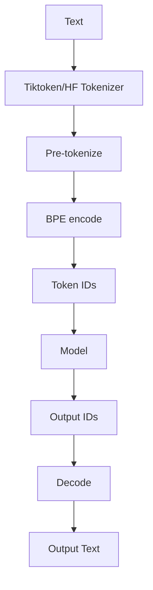

**Interview Q&A:**

*Q: Tokens vs words ka ratio?*
A: English mein typically 1 word ≈ 1.3 tokens (GPT-4). Hindi devanagari mein 1 word = 3-5 tokens (script ki vajah se). Code mein variable — Python keywords single token, but variable names split ho sakte hain. JSON, XML mein structural tokens ({, "} as single ya split tokens. Always tokenize karke check karo agar precise count chahiye.

*Q: Special tokens kaise handle karein?*
A: Most tokenizers reserved IDs rakhte hain: <PAD>, <UNK>, <BOS>, <EOS>, <MASK>. Fine-tuning mein custom tokens add kar sakte ho (chat templates: <|user|>, <|assistant|>). Important — model embeddings resize karna padta hai add karne ke baad. Tokenizers library mein add_special_tokens API hai.

*Q: Tokenizer mismatch error kya hota hai?*
A: Common production bug — model X ke embeddings load kiye but tokenizer Y use kiya. Token IDs alag matlab embeddings wrong tokens ko represent karenge. Output gibberish ya errors. Solution — always model aur tokenizer ek hi checkpoint se load karo: AutoModel.from_pretrained("X"), AutoTokenizer.from_pretrained("X"). Test ek inference karke verify karo.

---

### 3.5 Vocab size vs sequence length

**Definition:** Trade-off — bada vocab matlab kam tokens per text (shorter sequences) but bigger embedding matrix. Chhota vocab matlab zyada tokens (longer sequences) but compact model.

**Why:** Embedding matrix vocab_size × d_model parameters use karta hai. Vocab 50K, d=4096 → 200M params. Vocab 256K, d=4096 → 1B params. Lekin sequence length compute O(N²) hai attention mein. Toh trade-off optimize karna hai for compute aur memory budget.

**How:**

```python
import torch
import torch.nn as nn

def model_size_analysis(vocab_size, d_model, n_layers):
    embedding_params = vocab_size * d_model  # input + output (tied)
    # Per layer: attention 4·d² + FFN 8·d² ≈ 12 d²
    layer_params = 12 * d_model ** 2
    total = embedding_params + n_layers * layer_params
    return embedding_params, total

# Llama-3-8B: vocab=128K, d=4096, layers=32
emb, total = model_size_analysis(128000, 4096, 32)
print(f"Embedding params: {emb/1e9:.2f}B")  # ~1B
print(f"Total params: {total/1e9:.2f}B")    # ~7-8B
print(f"Embedding share: {emb/total*100:.1f}%")  # ~13%

# Smaller vocab same model
emb2, total2 = model_size_analysis(32000, 4096, 32)
print(f"With 32K vocab: emb={emb2/1e9:.2f}B, total={total2/1e9:.2f}B")

# Compression ratio analysis
# 128K vocab → ~3.5 chars/token average
# 32K vocab → ~3.0 chars/token average
# Savings in sequence length: ~17%
# But embedding 4x bigger
```

Math: Total params ≈ V·d + L·(12d²). Sequence length ≈ |text| / avg_chars_per_token. Compute ≈ N²·d + N·d². Vocab ↑ → N ↓ → compute ↓ but params ↑.

**Real-life Example:** Soch tu ek shorthand seekhta hai. Zyada symbols seekhega (bada vocab) toh kam likhna padega (chhoti sequence). Lekin saare symbols yaad rakhne padenge (memory). Less symbols seekho (chhota vocab) toh likhne mein time lagega lekin yaad rakhna easy. Production trade-off similar hai — Llama-3 ne 128K vocab chuna for better multilingual + code coverage despite larger embeddings.

**Mermaid Diagram:**

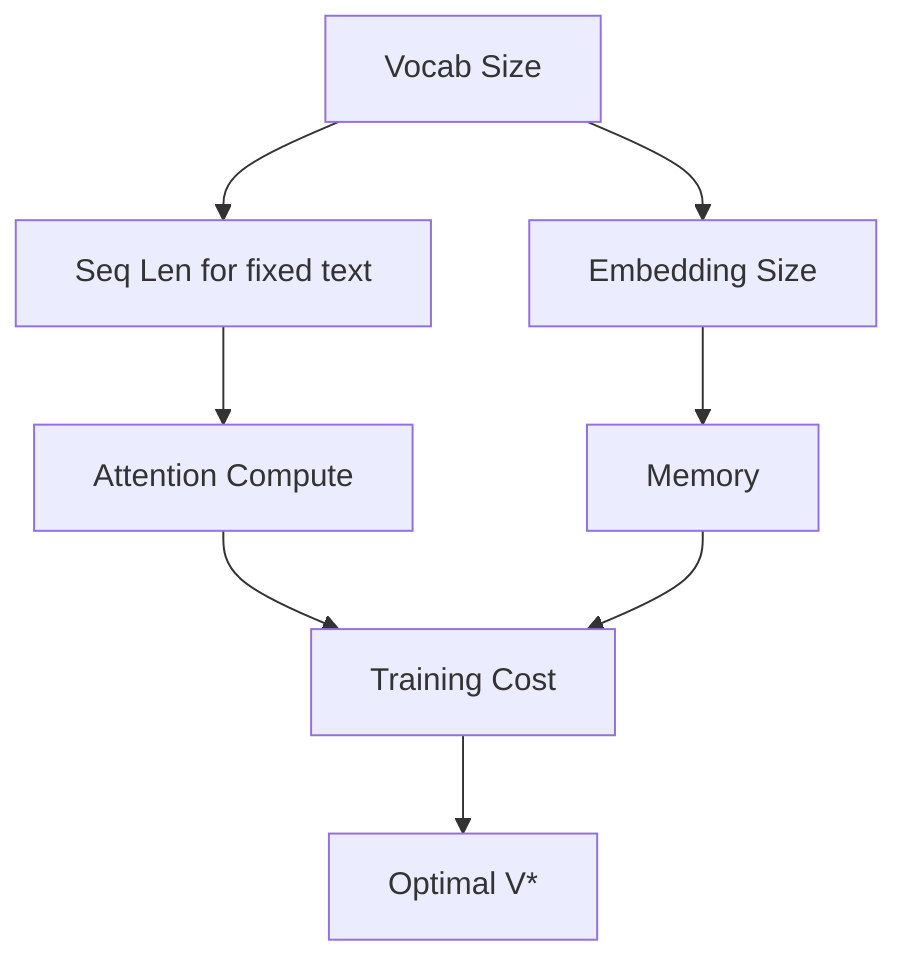

**Interview Q&A:**

*Q: Modern LLMs vocab size kyu badha rahe hain (32K → 128K)?*
A: Multilingual support, code, math symbols. Llama-2 (32K) Hindi mein bohot tokens lagata tha — Llama-3 (128K) ne efficiency hugely improve ki. GPT-4 ka cl100k_base ~100K. Bigger vocab = shorter sequences = less compute per text = more value per context window. Embedding matrix bada hota hai but yeh marginal cost hai compared to attention savings.

*Q: Vocab size aur model scaling ka relation?*
A: Empirically scale karta hai sublinearly with model size. 1B model → 32K vocab fine. 70B model → 100K-256K vocab. Reason — bada model bigger embedding afford kar sakta hai aur usse benefit ho sakta hai. Chhota model mein big embedding waste hai. Chinchilla scaling laws mein vocab ka direct treatment nahi hai but practical wisdom yeh hai.

*Q: Optimal vocab size kaise choose karein?*
A: Target language distribution dekho — multilingual = bigger. Compute budget se balance — embeddings static cost, compute scales with sequences. Practical: 32K (English-focused), 50-100K (general), 128-256K (multilingual+code). Tokenizer train karke compression ratio measure karo target corpus pe — sweet spot 3.5-4 chars/token English ke liye.

---

### 3.6 Numbers, code, multilingual quirks

**Definition:** Tokenization mein edge cases — numbers awkwardly split ho jaate hain, code mein indentation/symbols issues, multilingual mein scripts unevenly represent hote hain. Yeh quirks model performance significantly affect karte hain.

**Why:** Tokenization training corpus ki bias inherit karta hai. English dominated corpus → English efficient, baaki languages waste tokens. Numbers: "12345" kabhi single token, kabhi "123","45". Math, science mein yeh problematic hai. Code: "def" "function" common but variable names split. Awareness se debug karna easy hota hai.

**How:**

```python
import tiktoken

enc = tiktoken.encoding_for_model("gpt-4")

# Numbers
for n in ["1", "12", "123", "1234", "12345", "1,000,000"]:
    tokens = enc.encode(n)
    print(f"{n!r}: {len(tokens)} tokens, decoded: {[enc.decode([t]) for t in tokens]}")

# Code
code = "def calculate_average(numbers):\n    return sum(numbers) / len(numbers)"
tokens = enc.encode(code)
print(f"\nCode ({len(tokens)} tokens):")
for t in tokens:
    print(f"  {t}: {enc.decode([t])!r}")

# Multilingual
texts = {
    "English": "Hello world",
    "Hindi": "नमस्ते दुनिया",
    "Chinese": "你好世界",
    "Arabic": "مرحبا بالعالم",
}
for lang, text in texts.items():
    n = len(enc.encode(text))
    print(f"{lang}: {len(text)} chars, {n} tokens, ratio={n/len(text):.2f}")

# Output dikhayega: English ~0.3 tokens/char, Hindi ~1.0, Chinese ~0.5
# Yani non-English languages mein same content ke liye 2-3x tokens
```

Math: Tokenization efficiency = chars_per_token. English BPE (GPT-4) ≈ 4. Hindi ≈ 1-2. Code ≈ 3.

**Real-life Example:** Tu GPT-4 API use kar raha hai Hindi customer support ke liye. Same English ke 1000 chars 250 tokens consume karte hain, Hindi ke 1000 tokens lag jaate hain. 4x cost. Plus, context window Hindi mein effectively 4x chhoti hoti hai. Yeh production planning mein critical hai. Solutions — fine-tune tokenizer ya use multilingual-optimized models (Llama-3, Aya).

**Mermaid Diagram:**

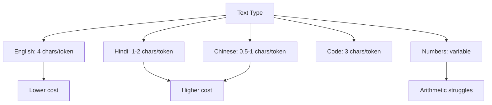

**Interview Q&A:**

*Q: Why LLMs struggle with arithmetic?*
A: Tokenization ek bada reason hai. "12345" ek single token ho sakta hai ya "12","345" — model ko digit-level structure dikhta nahi consistently. "123 + 456" mein "+" alag token, numbers kabhi grouped. Llama-3 ne digit-by-digit tokenization implement ki improvement dikhi. GPT-4 ne tool use (calculator) integrate karke bypass kiya. Native arithmetic models like MathGLM digit-level tokenization use karte hain.

*Q: Code tokenizers kya alag hote hain?*
A: Hain. CodeBERT, StarCoder ke tokenizers code-specific corpus pe train hote hain. Indentation, common keywords (def, function, return), operators properly tokenize karte hain. General tokenizers code mein 20-30% zyada tokens use karte hain. Production code-LLMs custom tokenizers use karte hain. Mixed (code+text) models compromise karte hain.

*Q: Glitch tokens kya hote hain?*
A: Famous case — GPT-3 mein "SolidGoldMagikarp" jaisa tokens train data mein bohot rare the (Reddit username) but tokenizer ne unhe single token assign kiya. Model ne embedding properly seekhi nahi, prompts mein use karne pe weird outputs. Yeh tokenization aur training data mismatch ka result hai. Modern models specifically check karte hain such anomalies.

---

## 4. Positional Encodings

### 4.1 Sinusoidal (original)

**Definition:** Sinusoidal positional encoding fixed (non-learned) sin/cos functions ka use karta hai positions encode karne ke liye. Vaswani paper mein original choice. PE(pos,2i) = sin(pos/10000^(2i/d)), PE(pos,2i+1) = cos(pos/10000^(2i/d)).

**Why:** Self-attention positional info nahi rakhta natively (permutation invariant). Tokens ka order matter karta hai language mein. Sinusoidal ne smart choice — different frequencies, periodic, model relative positions easily seekh sake. Plus, train time se zyada lambi sequences pe extrapolation possible (theoretically).

**How:**

```python
import torch
import math

def sinusoidal_pe(seq_len, d_model):
    pe = torch.zeros(seq_len, d_model)
    position = torch.arange(0, seq_len).unsqueeze(1).float()
    # Different frequencies: 10000^(2i/d), i = 0..d/2
    div_term = torch.exp(torch.arange(0, d_model, 2).float() *
                          -(math.log(10000.0) / d_model))
    # Even dims: sin, odd dims: cos
    pe[:, 0::2] = torch.sin(position * div_term)
    pe[:, 1::2] = torch.cos(position * div_term)
    return pe

pe = sinusoidal_pe(seq_len=100, d_model=512)
print(pe.shape)  # (100, 512)

# Use: input embedding mein add karo
class TransformerWithSinPE(torch.nn.Module):
    def __init__(self, vocab, d_model, max_len=5000):
        super().__init__()
        self.emb = torch.nn.Embedding(vocab, d_model)
        self.register_buffer('pe', sinusoidal_pe(max_len, d_model))

    def forward(self, x):
        # x: (B, N) token ids
        e = self.emb(x)  # (B, N, d)
        return e + self.pe[:x.size(1)]  # PE add karo
```

Math: PE(pos, 2i) = sin(pos · ω_i), PE(pos, 2i+1) = cos(pos · ω_i), ω_i = 1/10000^(2i/d). Property: PE(pos+k) is linear function of PE(pos) — relative positions linearly representable.

**Real-life Example:** Soch ek symphony orchestra hai. Har position pe alag musical note baj raha hai — combination of frequencies. Position 1 vs position 2 vs position 100 sab unique signature hai. Model is signature ko detect karke order figure out karta hai. Different frequencies = different "octaves" of position encoding.

**Mermaid Diagram:**

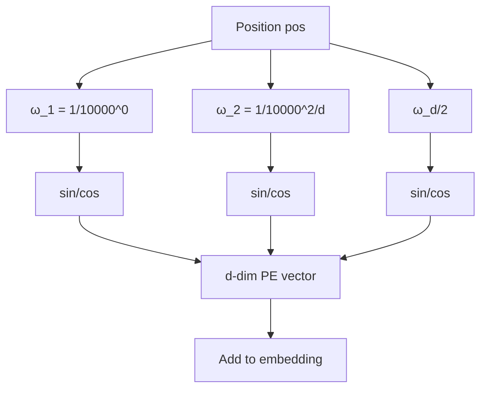

**Interview Q&A:**

*Q: 10000 base ka kya significance?*
A: Yeh design choice tha — wavelengths 2π se 10000·2π tak range. Lambi sequences ke liye low frequencies, chhoti positional differences ke liye high frequencies. Empirically work karta hai. Different bases (base 2, base 100) try kiye gaye but 10000 standard ban gaya. RoPE bhi 10000 use karta hai by default.

*Q: Sinusoidal vs learned PE — performance kaisi?*
A: Empirically similar in-distribution performance. Learned PE thoda better in-domain, sinusoidal slightly better extrapolation. But neither extrapolate well beyond training context length significantly. Yahi reason RoPE, ALiBi develop hue. Original transformer paper mein author maintained PE choice negligible — bigger architectural decisions matter karte hain zyada.

*Q: Sinusoidal PE add karte hain ya concat?*
A: Add. Token embedding mein directly add. Concatenation try kiya gaya tha but performance similar, parameter count badhta hai. Add karne se model decide kar sakta hai PE ko kitna use karna hai — gradient embeddings ko adjust kar deta hai accommodate karne ke liye. Position info embedding ke parallel "channel" jaisa banta hai.

---

### 4.2 Learned positional embeddings

**Definition:** Position 0 to max_len ke liye ek embedding matrix learn karte hain — bilkul token embedding jaise. BERT, GPT-2 use karte hain. Simpler than sinusoidal.

**Why:** Sometimes simpler is better. Learned PE training data se directly seekhta hai best representation. No assumption about smoothness. Lekin trade-off — fixed max length, beyond which model nothing seekh paaya hai.

**How:**

```python
import torch
import torch.nn as nn

class LearnedPositionalEmbedding(nn.Module):
    def __init__(self, max_len, d_model):
        super().__init__()
        # Bilkul token embedding jaise — learnable matrix
        self.pe = nn.Embedding(max_len, d_model)
        self.max_len = max_len

    def forward(self, x):
        # x: (B, N)
        N = x.size(1)
        assert N <= self.max_len, "Sequence too long for learned PE"
        positions = torch.arange(N, device=x.device).unsqueeze(0)  # (1, N)
        return self.pe(positions)  # (1, N, d)

class GPTLikeModel(nn.Module):
    def __init__(self, vocab, d_model, max_len=2048):
        super().__init__()
        self.tok_emb = nn.Embedding(vocab, d_model)
        self.pos_emb = LearnedPositionalEmbedding(max_len, d_model)

    def forward(self, x):
        return self.tok_emb(x) + self.pos_emb(x)

# GPT-2 uses this — wpe (weighted position embedding)
# Limitation: max_len fix hai (1024 in GPT-2)
```

Math: PE = Embedding(position_index). Trained as parameter. Same shape as token embedding.

**Real-life Example:** Soch tu hostel mein hai. Sinusoidal PE = pre-defined seat numbers (1, 2, 3...) jo kabhi change nahi hote. Learned PE = students apne seats ko personalize karte hain — koi "favorite spot" ban jaata hai. Better fit but agar naya student aaya jo spot 100 pe baithna chahta hai aur 99 tak hi seats define hain, problem.

**Mermaid Diagram:**

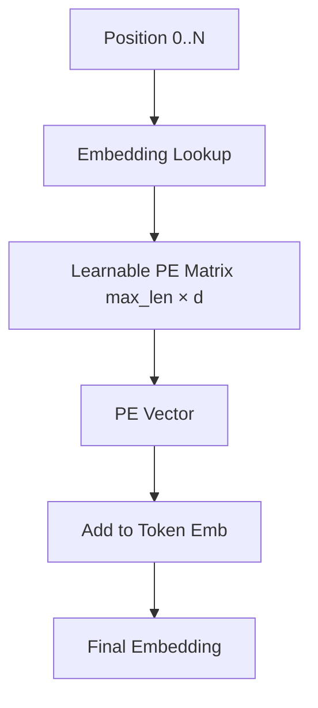

**Interview Q&A:**

*Q: Learned PE ka biggest limitation?*
A: Length extrapolation impossible. Train karte time max_len=1024 set kiya, inference mein 1500 tokens ka prompt diya — positions 1024+ ke liye koi embedding hi nahi hai. Crash ya garbage output. GPT-2 ki fixed 1024 limit yahi reason. Sinusoidal mein at least theoretical extrapolation possible hai, learned mein nahi.

*Q: Learned PE kab prefer karenge?*
A: Jab maximum sequence length fixed aur known hai (BERT classification tasks), aur compute simple rakhna hai. BERT 512 tokens max, learned PE adequate. Production deployment mein prediction ke time pe known max length ho toh learned PE thodi efficient hai. But modern long-context LLMs ke liye RoPE/ALiBi superior.

*Q: BERT aur GPT-2 dono learned PE use karte hain — kyu shift hua?*
A: GPT-3 tak learned PE chala. Lekin context length scaling (4K, 8K, 32K, 100K+) ke saath learned PE ki retraining limitation problematic ban gayi. RoPE (Llama, GPT-NeoX) aur ALiBi (BLOOM, Replit-V1) ne extrapolation enable kiya. Modern frontier models (Llama-3, Claude) sab RoPE-based hain. Learned PE specific narrow tasks tak relegated.

---

### 4.3 RoPE — Llama/Mistral/Qwen

**Definition:** RoPE (Rotary Position Embedding) Su et al. 2021 ka technique hai. Q aur K vectors ko position-dependent rotation matrix se rotate karta hai before attention compute. Llama, Mistral, Qwen, GPT-NeoX, Falcon — sab use karte hain.

**Why:** RoPE elegantly relative position encode karta hai jbki absolute positions provide karta hai. Mathematically — Q_i^T K_j depends only on (i-j) after rotation. Yeh inherent extrapolation property deta hai. Plus, no extra parameters.

**How:**

```python
import torch
import torch.nn as nn

def precompute_rope(d_head, max_len, base=10000):
    """RoPE ke liye sin, cos values precompute"""
    # Frequencies — har dimension pair ke liye
    inv_freq = 1.0 / (base ** (torch.arange(0, d_head, 2).float() / d_head))
    # Positions
    t = torch.arange(max_len).float()
    # Outer product: position × frequency
    freqs = torch.outer(t, inv_freq)
    # Complex form: cos + i sin
    cos = torch.cos(freqs)
    sin = torch.sin(freqs)
    return cos, sin  # (max_len, d_head/2)

def apply_rope(x, cos, sin):
    """x ko rotate karo position ke according"""
    # x: (B, n_heads, N, d_head)
    # Pairs mein split karo
    x1 = x[..., 0::2]  # even indices
    x2 = x[..., 1::2]  # odd indices

    # 2D rotation har pair pe
    # [x1, x2] -> [x1*cos - x2*sin, x1*sin + x2*cos]
    rotated_1 = x1 * cos - x2 * sin
    rotated_2 = x1 * sin + x2 * cos

    # Wapas interleave karo
    rotated = torch.stack([rotated_1, rotated_2], dim=-1)
    return rotated.flatten(-2)

class RoPEAttention(nn.Module):
    def __init__(self, d_model, n_heads, max_len=4096):
        super().__init__()
        self.n_heads = n_heads
        self.d_head = d_model // n_heads
        self.W_qkv = nn.Linear(d_model, 3 * d_model)
        self.W_o = nn.Linear(d_model, d_model)
        cos, sin = precompute_rope(self.d_head, max_len)
        self.register_buffer('cos', cos)
        self.register_buffer('sin', sin)

    def forward(self, x):
        B, N, _ = x.shape
        qkv = self.W_qkv(x).reshape(B, N, 3, self.n_heads, self.d_head)
        Q, K, V = qkv.unbind(dim=2)
        Q = Q.transpose(1, 2)  # (B, h, N, d)
        K = K.transpose(1, 2)
        V = V.transpose(1, 2)

        # RoPE apply karo Q, K pe (V pe nahi)
        cos = self.cos[:N].unsqueeze(0).unsqueeze(0)  # (1,1,N,d/2)
        sin = self.sin[:N].unsqueeze(0).unsqueeze(0)
        Q = apply_rope(Q, cos, sin)
        K = apply_rope(K, cos, sin)

        # Standard attention
        scores = Q @ K.transpose(-2,-1) / (self.d_head ** 0.5)
        attn = torch.softmax(scores, dim=-1)
        out = (attn @ V).transpose(1,2).reshape(B, N, -1)
        return self.W_o(out)
```

Math: RoPE q_m = R(m·θ) q. R is rotation matrix. Key property: q_m^T k_n = q^T R(n-m)^T k — depends only on (n-m).

**Real-life Example:** Soch har token ek clock pe baitha hai aur position ke according clock ka hand rotate hota hai. Position 0 mein hand 12 baje, position 5 mein 5 baje, etc. Jab do tokens "compare" hote hain attention mein, sirf unke clocks ka difference matter karta hai (relative position) — absolute time nahi. Yeh elegantly relative position embed karta hai bina extra parameters ke.

**Mermaid Diagram:**

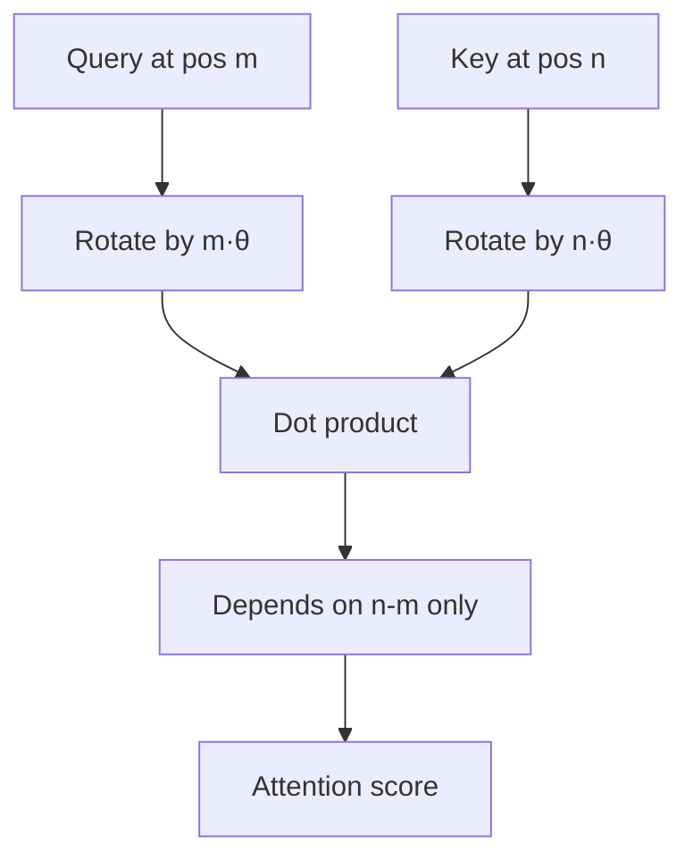

**Interview Q&A:**

*Q: RoPE ne sinusoidal/learned ko kyu replace kiya frontier models mein?*
A: Multiple advantages. (1) Extrapolation — train at 4K, run at 8K passable performance. NTK-aware scaling se 32K, 100K+ achieve hua. (2) Relative position naturally encoded. (3) No extra parameters — pure computation. (4) Works well with KV cache (rotation deterministic per position). Llama, Mistral, GPT-NeoX, Falcon, Qwen — almost universal in modern open LLMs.

*Q: RoPE ki extrapolation ki limit kya hai?*
A: Vanilla RoPE 2x train length pe degrade karta hai. Tricks: (1) NTK-aware scaling — base frequency adjust. (2) YaRN — dynamic NTK + temperature. (3) Position interpolation (PI) — positions ko compress. (4) LongRoPE — frequency tuning. Practical — train at 8K, with tricks 100K+ usable. Llama-3 ne 8K → 128K isi tarike se kiya without retraining everything.

*Q: Q,K pe rotate karte, V pe nahi — kyu?*
A: Attention scores Q^T K se aate hain — position relations yahaan encode karna chahiye. V information content carry karta hai jo position-independent hona chahiye (token ka semantic meaning). Agar V rotate karte toh output bhi rotate hota — undesirable. Yeh design choice mathematical analysis se justified hai original RoPE paper mein.

---

### 4.4 ALiBi

**Definition:** ALiBi (Attention with Linear Biases, Press et al. 2022) — koi explicit positional embedding nahi, bas attention scores mein linear bias add karte hain based on relative distance. Penalizing distant tokens linearly.

**Why:** Maximum simplicity. No PE matrix, no rotations. Bas attention scores mein -m·|i-j| add karo (m head-specific slope hai). Strong extrapolation achieve karta hai — train at 1K, run at 2K+ without degradation. BLOOM, MPT, Replit-V1 use karte hain.

**How:**

```python
import torch
import torch.nn as nn
import math

def alibi_slopes(n_heads):
    """ALiBi mein har head ka apna slope — geometric sequence"""
    def slopes_power_of_2(n):
        start = 2 ** (-2 ** -(math.log2(n) - 3))
        ratio = start
        return [start * ratio ** i for i in range(n)]

    if math.log2(n_heads).is_integer():
        return torch.tensor(slopes_power_of_2(n_heads))
    else:
        # Closest power of 2 ke saath approximate
        closest = 2 ** math.floor(math.log2(n_heads))
        slopes = slopes_power_of_2(closest)
        slopes += slopes_power_of_2(2 * closest)[0::2][:n_heads - closest]
        return torch.tensor(slopes)

def alibi_bias(n_heads, seq_len):
    """ALiBi bias matrix: (n_heads, seq_len, seq_len)"""
    slopes = alibi_slopes(n_heads)  # (n_heads,)
    # Relative positions: distance se -inf nahi, just penalty
    distances = torch.arange(seq_len).unsqueeze(0) - torch.arange(seq_len).unsqueeze(1)
    distances = distances.abs().float()  # |i-j|
    # Causal hai toh upper triangle ko handle karna hai separately
    # bias = -slope * distance
    bias = -slopes.view(-1, 1, 1) * distances.unsqueeze(0)  # (n_heads, N, N)
    return bias

class ALiBiAttention(nn.Module):
    def __init__(self, d_model, n_heads, max_len=2048):
        super().__init__()
        self.n_heads = n_heads
        self.d_head = d_model // n_heads
        self.W_qkv = nn.Linear(d_model, 3 * d_model)
        self.W_o = nn.Linear(d_model, d_model)
        self.register_buffer('alibi', alibi_bias(n_heads, max_len))

    def forward(self, x):
        B, N, _ = x.shape
        qkv = self.W_qkv(x).reshape(B, N, 3, self.n_heads, self.d_head)
        Q, K, V = qkv.unbind(dim=2)
        Q, K, V = [t.transpose(1,2) for t in (Q, K, V)]

        scores = Q @ K.transpose(-2,-1) / (self.d_head ** 0.5)
        # ALiBi bias add karo — koi PE nahi token embeddings mein
        scores = scores + self.alibi[:, :N, :N].unsqueeze(0)

        # Causal mask
        causal = torch.tril(torch.ones(N, N, device=x.device))
        scores = scores.masked_fill(causal == 0, float('-inf'))

        attn = torch.softmax(scores, dim=-1)
        out = (attn @ V).transpose(1,2).reshape(B, N, -1)
        return self.W_o(out)
```

Math: ALiBi modifies attention as: softmax(QK^T/√d - m·|i-j|). m_h = 2^(-8h/H) for head h. No position embeddings on inputs.

**Real-life Example:** Soch tu ek conference mein hai. Apne aas-paas ke logon ki baat clearly sunta hai, doori badhne pe softer lagta hai — linear decay. ALiBi exactly yahi simulate karta hai. Distant tokens ko gradually less weight, automatically. No need for explicit "position number" — just decay.

**Mermaid Diagram:**

```mermaid
graph TD
    QK[QK^T scores] --> S[Add slope · distance]
    DIST[i - j distance] --> S
    SLOPE[Per-head slope] --> S
    S --> SM[Softmax]
    SM --> A[Attention weights]
    A --> NOTE[Distant tokens auto-decay]
```

**Interview Q&A:**

*Q: ALiBi ka extrapolation kaisa hota hai vs RoPE?*
A: ALiBi out-of-the-box better extrapolation deta hai — train at 1K, evaluate at 2K, 4K — graceful degradation. RoPE vanilla 2x ke baad collapse, NTK-tricks se save hota hai. Lekin in-distribution performance pe ALiBi RoPE se thodi piche hai usually. Trade-off — simplicity+extrapolation vs performance. Newer models RoPE+tricks prefer karte hain because base performance matters zyada.

*Q: Per-head slopes geometric kyu?*
A: Different heads alag-alag temporal scales attend karen — kuch local (sharp decay), kuch global (gentle decay). Geometric sequence (2^-1, 2^-2, ...) ensure karta hai diverse slopes. Empirically work karta hai. Authors ne ablation kiya — random slopes worse, uniform slopes worse. Geometric is the sweet spot.

*Q: ALiBi token embeddings mein PE nahi add karta — yeh issue nahi hai?*
A: Surprisingly nahi. Position info attention mein implicit ho jaata hai through bias. Token embeddings position-agnostic rehte hain. Yeh actually elegant — embeddings purely semantic, attention positional. Decouples concerns. Original ALiBi paper ne ablation dikhaya — adding PE on top mein no improvement, sometimes degradation.

---

### 4.5 Why position matters for length extrapolation

**Definition:** Length extrapolation matlab — train kiya N tokens pe, infer karte hain N+ pe acceptable performance ke saath. Position encoding choice yeh capability primarily determine karta hai.

**Why:** Real-world usage train length se zyada lambi sequences demand karta hai. Documents, code repositories, conversations grow karte hain. Retraining bohot expensive — lekin good PE choice se ek model multiple context lengths handle kar sake. Yeh ek active research area hai.

**How:**

```python
import torch
import math

def extrapolation_test(model, train_len, test_lens):
    """Different lengths pe perplexity dekho"""
    model.eval()
    results = {}
    for L in test_lens:
        # Synthetic test
        x = torch.randint(0, 1000, (1, L))
        with torch.no_grad():
            logits = model(x)
            # Compute pseudo-perplexity
            ppl = torch.exp(torch.nn.functional.cross_entropy(
                logits[:, :-1].reshape(-1, logits.size(-1)),
                x[:, 1:].reshape(-1)
            )).item()
        results[L] = ppl
        ratio = L / train_len
        print(f"Length {L} ({ratio:.1f}x train): PPL={ppl:.2f}")
    return results

# Conceptual results expected:
# Sinusoidal: degrades fast beyond train_len
# Learned: hard fail beyond max_len (no embeddings exist)
# RoPE vanilla: degrades 2x beyond train_len
# RoPE + NTK: 4-8x extrapolation
# ALiBi: gradual degradation, often 4x+ usable

# Position interpolation trick (PI) for RoPE
def rope_pi_scale(rope_cos, rope_sin, scale_factor):
    """Positions ko compress karke pretend training context mein hain"""
    # Effectively: position p -> p / scale_factor
    # Sin/cos values resample karo at scaled positions
    new_max = rope_cos.size(0)
    scaled_positions = torch.linspace(0, new_max-1, int(new_max * scale_factor))
    # Interpolate cos, sin at these positions
    return rope_cos[scaled_positions.long()], rope_sin[scaled_positions.long()]
```

Math: Train context T, test context T'. Extrapolation ratio = T'/T. Sinusoidal: degrades for T' > T. ALiBi: graceful for T' = 2-4T. RoPE+PI: rescale θ → θ/(T'/T) for usable T'.

**Real-life Example:** Soch tu cricket player hai. Train kiya 50-over format mein. Achanak Test match (5 days, ~450 overs) khelne bola gaya. Skills transfer hoti hain (extrapolation) but stamina, strategy adjust karni padti hai. Good "PE training" matlab tu format-flexible hai. Bad "PE" matlab T20 tak hi simit ho. Modern LLMs is challenge ko PE design + post-training tricks se solve karte hain.

**Mermaid Diagram:**

```mermaid
graph TD
    T[Train Length T] --> M[Model]
    M --> I1[Infer at T: good]
    M --> I2[Infer at 2T]
    M --> I4[Infer at 4T]
    I2 --> S[Sinusoidal: poor]
    I2 --> L[Learned: fail/crash]
    I2 --> R[RoPE: ok with tricks]
    I2 --> A[ALiBi: graceful]
    I4 --> X[Need: PI, NTK, YaRN]
```

**Interview Q&A:**

*Q: Length extrapolation kyu inherently mushkil hai?*
A: Train distribution mein model ne sirf positions 0..T-1 dekhe. Beyond T, position values out-of-distribution hain. Attention patterns, gradients, all calibrated for in-distribution. Plus, attention dilution problem — N badhne se softmax flat hota jaata hai (many tokens to attend). Yeh fundamental hai, PE choice se mitigate hota hai but solve nahi.

*Q: YaRN aur PI mein kya farak?*
A: Position Interpolation (PI, Chen et al.) — sab positions ko proportionally scale karo. Linear. Simple. NTK-aware (bloc97) — high vs low frequencies alag treat karo (high frequencies less scaling). Better than PI. YaRN (Peng et al.) — NTK + temperature scaling + ramp factor. Llama-2 ko 4K → 128K extend karne mein YaRN successful raha. Trade-off — tricks zyada complex but gains compounding hain.

*Q: Length extrapolation evaluate kaise karein?*
A: (1) Perplexity at different lengths — sanity check. (2) Needle-in-haystack — long context mein specific facts retrieve. (3) RULER benchmark — diverse long-context tasks. (4) Real downstream tasks — long document QA, code repo understanding. Pure perplexity insufficient hai — model "fluent gibberish" produce kar sakta hai while long-range reasoning fail. Frontier evaluation 100K+ context pe specifically designed benchmarks use karte hain.

---

Bhai, yeh tha Part 1 — Attention, Block, Tokenization, Positions. Yeh foundation hai. Ab agar tu Llama ka source code padhega, ya GPT internals samajhega, ya custom transformer banana chahega, yeh saara concepts apply honge. Practice — ek mini transformer (nanoGPT-style) implement kar, har component khud likh, ablation kar. Theory + code dono mein expert ban. Part 2 mein hum Pretraining, Fine-tuning, Alignment cover karenge.
# Transformers & LLM Internals — Part 2: Modern Archs, Pretraining, Inference

Bhai, Part 1 mein humne attention, positional encoding, aur basic transformer block dekha. Ab Part 2 mein hum asli production-grade cheezein dekhenge — modern architectures jaise Llama, Mixtral, Mamba; pretraining ka science (Chinchilla scaling laws, FLOPs budget); aur inference ka actual jadu (KV cache, PagedAttention, speculative decoding). Yeh wahi cheezein hain jo tujhe interview mein 50 LPA aur 80 LPA ke beech ka difference banayengi.

Yaad rakh ek baat — research papers padhna ek skill hai, lekin production mein tu jo cheez optimize karega woh inference hai. Training ek baar hoti hai, inference billion times hota hai. Isliye Section 7 ko sabse seriously padh. KV cache basically inference ki single most important optimization hai. Bina iske 100 token generate karna 100x slower hota.

Hum chalenge senior-dev style — intuition first, math second, code third, war stories ke saath. Code PyTorch mein hoga, comments Hinglish mein. Mermaid diagrams se mental model banayenge. Har subtopic ke end mein interview Q&A milega jo tujhe FAANG/Anthropic/Mistral type interviews mein direct help karega.

---

## 5. Modern LLM Architectures

### 5.1 GPT family (decoder-only)

**Definition:** GPT (Generative Pretrained Transformer) ek decoder-only autoregressive model hai. Matlab — ismein sirf decoder stack hota hai (no encoder), aur har token sirf apne pichle tokens ko dekh sakta hai (causal mask). GPT-2, GPT-3, GPT-4 sab isi family ke hain.

**Why:** Encoder-decoder (jaise original transformer) translation ke liye banaya gaya tha. Lekin language modeling ke liye tujhe sirf "next token predict karna" hota hai. Toh encoder ki zaroorat hi nahi. Decoder-only simpler hai, scale karna easy hai, aur ek hi objective (CLM) sab kuch sikha deta hai — translation, summarization, QA, code, reasoning. OpenAI ne 2018 mein GPT-1 release kiya tha 117M params ka, aaj GPT-4 trillion+ params ka hai. Same architecture, just scale.

**How:** Architecture mein hai — embedding layer, N transformer decoder blocks (each with masked self-attention + FFN), final LayerNorm, aur LM head (vocab_size projection).

```python
import torch
import torch.nn as nn

class GPTBlock(nn.Module):
    def __init__(self, d_model, n_heads, d_ff):
        super().__init__()
        # Pre-LN architecture (GPT-2 style) — LayerNorm pehle, attention baad mein
        self.ln1 = nn.LayerNorm(d_model)
        self.attn = nn.MultiheadAttention(d_model, n_heads, batch_first=True)
        self.ln2 = nn.LayerNorm(d_model)
        self.ffn = nn.Sequential(
            nn.Linear(d_model, d_ff),
            nn.GELU(),  # GPT-2 mein GELU use hota hai, ReLU nahi
            nn.Linear(d_ff, d_model),
        )

    def forward(self, x, causal_mask):
        # Residual connection ke saath pre-norm
        h = self.ln1(x)
        attn_out, _ = self.attn(h, h, h, attn_mask=causal_mask, need_weights=False)
        x = x + attn_out  # Skip connection — gradient flow ke liye crucial
        x = x + self.ffn(self.ln2(x))
        return x

class GPT(nn.Module):
    def __init__(self, vocab_size, d_model=768, n_heads=12, n_layers=12, max_len=1024):
        super().__init__()
        self.tok_emb = nn.Embedding(vocab_size, d_model)
        self.pos_emb = nn.Embedding(max_len, d_model)  # Learned positions, GPT-2 style
        self.blocks = nn.ModuleList([GPTBlock(d_model, n_heads, 4*d_model) for _ in range(n_layers)])
        self.ln_f = nn.LayerNorm(d_model)
        # Weight tying — embedding aur LM head ka weight share karte hain (memory bachta hai)
        self.lm_head = nn.Linear(d_model, vocab_size, bias=False)
        self.lm_head.weight = self.tok_emb.weight

    def forward(self, idx):
        B, T = idx.shape
        # Causal mask — upper triangular True (mask out future)
        mask = torch.triu(torch.ones(T, T, device=idx.device), diagonal=1).bool()
        pos = torch.arange(T, device=idx.device)
        x = self.tok_emb(idx) + self.pos_emb(pos)
        for block in self.blocks:
            x = block(x, mask)
        x = self.ln_f(x)
        return self.lm_head(x)  # logits over vocab
```

**Real-life Example:** ChatGPT, GitHub Copilot, Claude — sab decoder-only hain. Jab tu Cursor mein code likhta hai aur autocomplete aata hai, woh GPT-style model hai jo `prefix → next token` predict kar raha hai.

**Mermaid Diagram:**

```mermaid
graph TD
    A[Input tokens] --> B[Token + Position Embeddings]
    B --> C[Decoder Block 1: Masked Attn + FFN]
    C --> D[Decoder Block 2]
    D --> E[... N blocks ...]
    E --> F[Final LayerNorm]
    F --> G[LM Head: Linear vocab_size]
    G --> H[Softmax → next token probability]
```

**Interview Q&A:**

*Q: GPT decoder-only kyun hai jab original transformer encoder-decoder tha?*
A: Decoder-only mein causal masking ki wajah se ek hi forward pass mein har position pe prediction train hoti hai (parallel training). Encoder-decoder mein cross-attention overhead hai aur task-specific hai. CLM objective universal hai — same model translation bhi karta hai aur code bhi likhta hai. Plus, scaling laws empirically decoder-only ke liye behtar nikle.

*Q: Pre-LN vs Post-LN ka difference?*
A: Original transformer Post-LN tha (attn → add → norm). Lekin deep models mein gradient explode hote the. GPT-2 ne Pre-LN apnaya (norm → attn → add). Pre-LN training stability deta hai bina warmup ke, lekin slightly weaker performance. Production mein ab RMSNorm + Pre-LN standard hai (Llama).

*Q: Weight tying kya hai aur kyun karte hain?*
A: Token embedding (vocab_size × d_model) aur LM head (d_model × vocab_size) ka transpose semantically same role play karte hain — token ko vector mein le jaana aur vector ko token logit banana. Inka weight share karne se 30-50% parameters bachte hain (vocab badi hoti hai), aur empirically perplexity bhi behtar hoti hai.

*Q: Causal mask agar na lagaye toh kya hoga?*
A: Token apna future dekh lega — model basically copy task seekh lega, training loss zero ho jayega, lekin inference pe sab broken. Yeh classic bug hai jo log custom attention likhne mein karte hain.

---

### 5.2 BERT, RoBERTa — for embeddings

**Definition:** BERT (Bidirectional Encoder Representations from Transformers) ek encoder-only model hai. Yeh bidirectional context dekh sakta hai (left aur right dono), aur Masked Language Modeling (MLM) se train hota hai. RoBERTa Facebook ka improved BERT hai — better data, longer training, no NSP task.

**Why:** GPT autoregressive hai — har token sirf left context dekhta hai. Lekin classification, NER, sentence similarity jaise tasks ke liye full bidirectional context chahiye. "Bank" word ka meaning aas-paas ke dono taraf ke words se aata hai. BERT yahi solve karta hai. Aaj 2026 mein bhi embeddings ke liye BERT-family (sentence-transformers, BGE, E5) industry standard hai — har RAG pipeline mein BERT-based encoder hai.

**How:** Architecture decoder-only ka ulta — no causal mask, full bidirectional self-attention. Training mein 15% tokens random mask karte hain aur model unhe predict karta hai.

```python
import torch
import torch.nn as nn
import torch.nn.functional as F

class BERTEncoder(nn.Module):
    def __init__(self, vocab_size, d_model=768, n_heads=12, n_layers=12, max_len=512):
        super().__init__()
        self.tok_emb = nn.Embedding(vocab_size, d_model)
        self.pos_emb = nn.Embedding(max_len, d_model)
        self.seg_emb = nn.Embedding(2, d_model)  # Sentence A vs B (for NSP)
        self.layers = nn.ModuleList([
            nn.TransformerEncoderLayer(d_model, n_heads, 4*d_model, batch_first=True)
            for _ in range(n_layers)
        ])
        self.mlm_head = nn.Linear(d_model, vocab_size)

    def forward(self, input_ids, segment_ids=None, attention_mask=None):
        B, T = input_ids.shape
        pos = torch.arange(T, device=input_ids.device)
        x = self.tok_emb(input_ids) + self.pos_emb(pos)
        if segment_ids is not None:
            x = x + self.seg_emb(segment_ids)
        # NOTE: koi causal mask nahi — full bidirectional attention
        for layer in self.layers:
            x = layer(x, src_key_padding_mask=attention_mask)
        return x  # [B, T, d_model] — har token ka contextual embedding

# MLM training loop ka core idea
def mlm_loss(model, input_ids, mask_positions, true_tokens):
    # mask_positions wahan True hai jahan [MASK] token rakha gaya hai
    hidden = model(input_ids)  # [B, T, D]
    logits = model.mlm_head(hidden)  # [B, T, V]
    # Sirf masked positions pe loss calculate — baaki ignore
    loss = F.cross_entropy(logits[mask_positions], true_tokens[mask_positions])
    return loss
```

**Real-life Example:** Google Search 2019 se BERT use kar raha hai query understanding ke liye. Tu jab Pinecone/Weaviate mein documents store karta hai RAG ke liye, andar `sentence-transformers/all-MiniLM-L6-v2` chal raha hota hai — yeh distilled BERT hai.

**Mermaid Diagram:**

```mermaid
graph LR
    A["[CLS] The bank [MASK] the river [SEP]"] --> B[Token + Pos + Segment Emb]
    B --> C[Bidirectional Encoder Layers]
    C --> D[CLS embedding → classification]
    C --> E[MASK position → predict 'beside']
    C --> F[Each token → contextual vector]
```

**Interview Q&A:**

*Q: BERT generation kyun nahi kar sakta?*
A: BERT bidirectional hai aur MLM se trained hai — usne kabhi "left-to-right autoregressive" task seekha hi nahi. Aur 15% mask rate tha, toh model predict karne ka habit nahi hai. Generation ke liye decoder-only ya encoder-decoder chahiye.

*Q: RoBERTa ne BERT se kya improve kiya?*
A: (1) NSP task hata diya — useless tha. (2) Dynamic masking (har epoch new mask) static ki jagah. (3) 10x zyaada data, 4x longer training. (4) Bigger batches with larger LR. Net result — same architecture, but ~5 points better on GLUE.

*Q: Embeddings ke liye [CLS] token use karein ya mean pooling?*
A: Vanilla BERT mein [CLS] sentence-level classification ke liye hai but raw embeddings noisy hain. Sentence-BERT (SBERT) mean pooling aur contrastive loss use karta hai — yeh similarity tasks pe bahut behtar hai. Production mein hamesha sentence-transformers ya BGE use kar, vanilla BERT [CLS] nahi.

*Q: BERT ka attention complexity kya hai aur 512 limit kyun?*
A: Self-attention O(n²) hai. BERT 512 max length pe trained hai positional embeddings 512 size ki hain. Beyond 512 → either truncate, sliding window, ya Longformer/BigBird use kar. Modern alternatives jaise ModernBERT (2024) 8K tak support karte hain.

---

### 5.3 T5, FLAN-T5 — encoder-decoder

**Definition:** T5 (Text-to-Text Transfer Transformer) Google ka encoder-decoder model hai jo har NLP task ko `text → text` mein convert karta hai. Translation, summarization, classification — sab kuch input string aur output string. FLAN-T5 isi ka instruction-tuned version hai (1800+ tasks pe finetuned).

**Why:** Decoder-only autoregressive hai (slow generation). Encoder-only generate nahi kar sakta. Encoder-decoder dono ka best — encoder full bidirectional context samajhta hai input ka, decoder generate karta hai. Translation jaise tasks mein yeh structurally fit hai (input English, output Hindi). T5 ka magic — har task ko prompt prefix se distinguish karta hai (`"translate English to German: ..."`).

**How:** Standard transformer ka structure, with span corruption objective (BERT MLM ka improved version — contiguous span mask karte hain).

```python
from transformers import T5ForConditionalGeneration, T5Tokenizer

# Inference example — production mein aise use hota hai
tokenizer = T5Tokenizer.from_pretrained("google/flan-t5-base")
model = T5ForConditionalGeneration.from_pretrained("google/flan-t5-base")

# T5 har task ko prompt prefix se identify karta hai
prompt = "summarize: The Indian Premier League is a professional T20 cricket league..."
inputs = tokenizer(prompt, return_tensors="pt", max_length=512, truncation=True)

# Encoder pure input ko ek baar process karta hai (parallel)
# Decoder autoregressively output generate karta hai (token by token)
output_ids = model.generate(
    inputs["input_ids"],
    max_length=64,
    num_beams=4,  # Beam search for quality
    early_stopping=True,
)
print(tokenizer.decode(output_ids[0], skip_special_tokens=True))

# Span corruption pretraining ka idea
def span_corruption_example():
    # Original: "Thank you for inviting me to your party last week"
    # Input:    "Thank you <X> me to your party <Y> week"
    # Target:   "<X> for inviting <Y> last <Z>"
    # Model contiguous spans predict karta hai, single tokens nahi
    pass
```

**Real-life Example:** Hugging Face ka summarization pipeline default mein BART/T5 use karta hai. Google Translate ke andar bhi T5-style architecture hai. AWS Bedrock pe Cohere Command bhi encoder-decoder hai.

**Mermaid Diagram:**

```mermaid
graph TD
    A[Input: 'translate: Hello'] --> B[Encoder Stack: bidirectional]
    B --> C[Encoded representations]
    C --> D[Decoder Stack: causal]
    D --> E[Cross-attention to encoder]
    E --> F[Output: 'Hallo' token by token]
    F -.feedback.-> D
```

**Interview Q&A:**

*Q: T5 decoder-only se slow hai inference mein, toh kyun use karein?*
A: Translation, summarization, structured generation jaise tasks mein quality decoder-only se behtar hai kyunki encoder full input context ko ek baar mein samajh leta hai. Plus shorter outputs ke liye encoder-decoder fast hi hota hai (input length × encoder compute is one-time cost).

*Q: Span corruption MLM se behtar kyun hai?*
A: BERT single tokens mask karta hai — model local context se easily fill kar deta hai. Span corruption mein 3-5 contiguous tokens hatte hain, model ko longer-range planning karna padta hai, aur output sequence-to-sequence ke liye natural hai (T5 decoder generate karta hai).

*Q: FLAN-T5 vs T5 mein kya difference?*
A: FLAN-T5 instruction-tuned hai — 1800+ NLP tasks pe supervised finetuning. Zero-shot performance bahut behtar hai. Vanilla T5 raw pretrained checkpoint hai, prompts ko poori tarah follow nahi karta.

*Q: Cross-attention exactly kahan hota hai?*
A: Decoder ke har layer mein 3 sub-blocks hote hain — masked self-attention (decoder ke pichle tokens), cross-attention (queries decoder se, keys/values encoder se), aur FFN. Cross-attention encoder ke output ko query karta hai har decoder step pe.

---

### 5.4 Llama, Llama 2, Llama 3 details

**Definition:** Llama Meta ka open-weights decoder-only LLM family hai. Llama 1 (Feb 2023) → Llama 2 (Jul 2023, commercial license) → Llama 3 (Apr 2024, 8B/70B) → Llama 3.1 (405B). Architecture choices ne open-source LLM standard set kiya.

**Why:** GPT closed-source hai. Llama ne community ko production-grade architecture diya. Aaj jo bhi open model dekhega — Mistral, Qwen, DeepSeek — sab Llama ki architectural choices follow karte hain. RMSNorm, SwiGLU, RoPE, GQA — yeh sab Llama ne mainstream kiya.

**How:** Key architectural choices:
1. **RMSNorm** instead of LayerNorm (no mean subtraction, faster).
2. **SwiGLU** activation in FFN (better than ReLU/GELU).
3. **RoPE** (Rotary Position Embeddings) instead of learned/sinusoidal.
4. **GQA** (Grouped Query Attention) in Llama 2 70B aur Llama 3 — KV heads kam, query heads zyaada.
5. No bias terms anywhere (cleaner gradients).

```python
import torch
import torch.nn as nn
import torch.nn.functional as F

class RMSNorm(nn.Module):
    def __init__(self, d, eps=1e-6):
        super().__init__()
        # Sirf scale parameter, no bias — variance se normalize karte hain mean nahi
        self.weight = nn.Parameter(torch.ones(d))
        self.eps = eps

    def forward(self, x):
        # RMS = sqrt(mean(x^2)), faster than LayerNorm (no mean subtract, no bias)
        rms = x.pow(2).mean(-1, keepdim=True).add(self.eps).rsqrt()
        return x * rms * self.weight

class SwiGLU(nn.Module):
    """FFN with SwiGLU activation — Llama style."""
    def __init__(self, d_model, d_ff):
        super().__init__()
        # 3 projections instead of 2 — gating mechanism
        self.w_gate = nn.Linear(d_model, d_ff, bias=False)
        self.w_up = nn.Linear(d_model, d_ff, bias=False)
        self.w_down = nn.Linear(d_ff, d_model, bias=False)

    def forward(self, x):
        # Swish(gate) * up — multiplicative gating se non-linearity richer hoti hai
        return self.w_down(F.silu(self.w_gate(x)) * self.w_up(x))

class GroupedQueryAttention(nn.Module):
    """Llama 2 70B / Llama 3 GQA — kv heads < query heads."""
    def __init__(self, d_model, n_heads, n_kv_heads):
        super().__init__()
        self.n_heads = n_heads
        self.n_kv_heads = n_kv_heads
        self.head_dim = d_model // n_heads
        self.q_proj = nn.Linear(d_model, n_heads * self.head_dim, bias=False)
        # KV projections chhoti hain — yahi memory bachata hai
        self.k_proj = nn.Linear(d_model, n_kv_heads * self.head_dim, bias=False)
        self.v_proj = nn.Linear(d_model, n_kv_heads * self.head_dim, bias=False)
        self.o_proj = nn.Linear(d_model, d_model, bias=False)

    def forward(self, x):
        B, T, _ = x.shape
        q = self.q_proj(x).view(B, T, self.n_heads, self.head_dim).transpose(1, 2)
        k = self.k_proj(x).view(B, T, self.n_kv_heads, self.head_dim).transpose(1, 2)
        v = self.v_proj(x).view(B, T, self.n_kv_heads, self.head_dim).transpose(1, 2)
        # KV ko broadcast karte hain query heads ke saath share karne ke liye
        repeat = self.n_heads // self.n_kv_heads
        k = k.repeat_interleave(repeat, dim=1)
        v = v.repeat_interleave(repeat, dim=1)
        out = F.scaled_dot_product_attention(q, k, v, is_causal=True)
        return self.o_proj(out.transpose(1, 2).reshape(B, T, -1))
```

**Real-life Example:** Llama 3 70B Groq pe chalti hai — 300+ tokens/sec inference. Together AI, Replicate, Anyscale sab Llama serve karte hain. Tu local pe ollama se `llama3:8b` chala sakta hai consumer GPU pe (12GB VRAM kaafi).

**Mermaid Diagram:**

```mermaid
graph TD
    A[Input tokens] --> B[Token Embedding]
    B --> C[Llama Block 1]
    C --> D[RMSNorm → GQA + RoPE]
    D --> E[Residual]
    E --> F[RMSNorm → SwiGLU FFN]
    F --> G[Residual]
    G --> H[... 32 blocks for 7B / 80 for 70B ...]
    H --> I[Final RMSNorm]
    I --> J[LM Head]
```

**Interview Q&A:**

*Q: RMSNorm LayerNorm se kyun behtar hai?*
A: LayerNorm mean aur variance dono compute karta hai. RMSNorm sirf RMS (root mean square) — mean subtract karne ki zaroorat nahi (empirically performance same rehti hai). Result: 7-10% faster training, simpler implementation, less memory.

*Q: SwiGLU mein 3 matrices hain — params badh gaye toh trade-off?*
A: Standard FFN: 2 matrices of size d_model × 4*d_model. SwiGLU mein 3 matrices but typically size d_model × (8/3)*d_model rakhte hain — total params same. Better quality at same param count.

*Q: GQA kya hai aur kyun introduce kiya?*
A: Multi-Head Attention mein har head ka apna K aur V hota hai. Inference mein KV cache size = `n_layers × n_heads × head_dim × seq_len`. 70B model mein yeh GBs mein chala jata hai. GQA mein query heads zyaada (32) lekin KV heads kam (8). Memory 4x kam, quality almost same. Multi-Query Attention (MQA) extreme version — sirf 1 KV head.

*Q: Llama 3 ne kya naya kiya 2 ke comparison mein?*
A: (1) Tokenizer 32K → 128K vocab, multilingual better. (2) GQA ab 8B mein bhi (Llama 2 mein sirf 70B mein tha). (3) 15T tokens pretraining (Llama 2 was 2T). (4) 8K context (Llama 3.1 mein 128K).

---

### 5.5 Mistral, Mixtral — sliding window, MoE

**Definition:** Mistral 7B (Sep 2023) Llama 2 7B se behtar performance with sliding window attention. Mixtral 8x7B (Dec 2023) Sparse Mixture of Experts — 47B total params, but inference mein sirf ~13B active.

**Why:** Sliding window attention long context ko handle karta hai O(n) memory mein (full attention O(n²)). MoE allows scaling parameters without proportional compute increase — har token ke liye sirf top-2 experts activate hote hain out of 8.

**How:**

```python
import torch
import torch.nn as nn
import torch.nn.functional as F

class SlidingWindowAttention(nn.Module):
    """Mistral ka sliding window — token sirf last W tokens dekhta hai."""
    def __init__(self, d_model, n_heads, window_size=4096):
        super().__init__()
        self.n_heads = n_heads
        self.head_dim = d_model // n_heads
        self.window = window_size
        self.qkv = nn.Linear(d_model, 3 * d_model, bias=False)
        self.out = nn.Linear(d_model, d_model, bias=False)

    def forward(self, x):
        B, T, D = x.shape
        qkv = self.qkv(x).reshape(B, T, 3, self.n_heads, self.head_dim)
        q, k, v = qkv.unbind(dim=2)
        q, k, v = [t.transpose(1, 2) for t in (q, k, v)]
        # Sliding window mask — token i sirf [i-window, i] range dekh sakta
        i = torch.arange(T, device=x.device)
        mask = (i.unsqueeze(0) - i.unsqueeze(1)).abs() > self.window
        mask = mask | (i.unsqueeze(0) > i.unsqueeze(1))  # + causal
        out = F.scaled_dot_product_attention(q, k, v, attn_mask=~mask)
        return self.out(out.transpose(1, 2).reshape(B, T, D))


class MixtralMoE(nn.Module):
    """8 experts, top-2 routing per token."""
    def __init__(self, d_model, d_ff, n_experts=8, top_k=2):
        super().__init__()
        self.n_experts = n_experts
        self.top_k = top_k
        # Router — har token ke liye expert scores predict karta hai
        self.gate = nn.Linear(d_model, n_experts, bias=False)
        self.experts = nn.ModuleList([SwiGLU(d_model, d_ff) for _ in range(n_experts)])

    def forward(self, x):
        B, T, D = x.shape
        x_flat = x.reshape(-1, D)
        # Gate scores → top-k experts select
        scores = self.gate(x_flat)  # [B*T, n_experts]
        topk_scores, topk_idx = scores.topk(self.top_k, dim=-1)
        topk_weights = F.softmax(topk_scores, dim=-1)  # Renormalize over selected
        out = torch.zeros_like(x_flat)
        # Har expert ke liye, uske assigned tokens process karo
        for e in range(self.n_experts):
            mask = (topk_idx == e).any(dim=-1)
            if mask.any():
                # Token ka weight us expert ke liye
                weight = (topk_weights * (topk_idx == e)).sum(dim=-1, keepdim=True)
                out[mask] += weight[mask] * self.experts[e](x_flat[mask])
        return out.reshape(B, T, D)
```

**Real-life Example:** Mistral 7B ko Apple ke M2 Max pe locally chala sakta hai 30+ tok/s. Mixtral 8x7B Anthropic se before times pe Replit ke code completion mein use hota tha. Groq pe Mixtral 500+ tok/s deta hai.

**Mermaid Diagram:**

```mermaid
graph TD
    A[Token x] --> B[Router/Gate]
    B --> C[Top-2 expert selection]
    C --> D[Expert 3 - active]
    C --> E[Expert 7 - active]
    C -.skipped.-> F[Experts 1,2,4,5,6,8]
    D --> G[Weighted sum]
    E --> G
    G --> H[Output]
```

**Interview Q&A:**

*Q: MoE ka load balancing problem kya hai?*
A: Agar router hamesha same 1-2 experts pick kare, baaki expert untrained reh jate hain. Solution — auxiliary load balancing loss: `aux_loss = n_experts * sum(f_i * P_i)`, jahan f_i = fraction of tokens routed to expert i, P_i = avg gate probability. Yeh routing distribution uniform rakhne ka pressure deta hai.

*Q: Sliding window attention long context mein quality degrade nahi karta?*
A: Mistral mein layers stack hote hain — har layer 4096 window dekhta hai, lekin layer 2 effectively 8192 (kyunki layer 1 ne 4096 tokens ka info compress kar diya). 32 layers × 4096 window = effective receptive field ~131K tokens.

*Q: Mixtral 8x7B 56B nahi 47B kyun?*
A: Sirf FFN duplicate hota hai 8 baar (experts). Attention layers shared hain. Toh 8 × FFN_params + 1 × Attention_params = 47B. Active params ~13B (2 experts × 7B/expert ka FFN portion + shared attention).

*Q: MoE training mein challenges?*
A: (1) Communication overhead — experts different GPUs pe (expert parallelism). (2) Load balancing aux loss tune karna. (3) Capacity factor — agar ek expert pe overflow ho jaye toh tokens drop. (4) Inference mein batching tricky hai because different tokens different experts pe jaate hain.

---

### 5.6 Qwen, DeepSeek, Phi, Gemma

**Definition:** Yeh 4 modern LLM families hain (2024) jo Llama-style architecture pe alag-alag innovations laye:
- **Qwen** (Alibaba) — multilingual focus, strong Chinese, 0.5B se 72B tak.
- **DeepSeek** — V2 mein Multi-head Latent Attention (MLA), V3 mein 671B MoE.
- **Phi** (Microsoft) — small models (1.3B-14B), focus on synthetic high-quality data.
- **Gemma** (Google) — based on Gemini research, 2B/7B/27B sizes.

**Why:** Har family ne ek specific niche solve kiya. Phi proves data quality > scale (3B Phi-3 beats 7B Llama 2 on reasoning). DeepSeek-V3 trained for $5.5M only — efficiency breakthrough. Gemma multimodal-ready architecture. Qwen multilingual strongest.

**How:**

```python
# DeepSeek V2 MLA — Multi-head Latent Attention ka core idea
import torch
import torch.nn as nn

class MultiHeadLatentAttention(nn.Module):
    """KV ko latent space mein compress, runtime pe expand."""
    def __init__(self, d_model, n_heads, kv_lora_rank=512):
        super().__init__()
        self.n_heads = n_heads
        self.head_dim = d_model // n_heads
        # KV ko low-rank latent banate hain — cache karne mein chhota
        self.kv_down = nn.Linear(d_model, kv_lora_rank, bias=False)
        # Runtime pe wapas full dimension mein le aate hain
        self.k_up = nn.Linear(kv_lora_rank, d_model, bias=False)
        self.v_up = nn.Linear(kv_lora_rank, d_model, bias=False)
        self.q_proj = nn.Linear(d_model, d_model, bias=False)
        self.out = nn.Linear(d_model, d_model, bias=False)

    def forward(self, x, kv_cache_latent=None):
        B, T, D = x.shape
        # KV cache mein sirf latent rakhte hain — 10x compression typical
        latent = self.kv_down(x)
        if kv_cache_latent is not None:
            latent = torch.cat([kv_cache_latent, latent], dim=1)
        k = self.k_up(latent).view(B, -1, self.n_heads, self.head_dim).transpose(1, 2)
        v = self.v_up(latent).view(B, -1, self.n_heads, self.head_dim).transpose(1, 2)
        q = self.q_proj(x).view(B, T, self.n_heads, self.head_dim).transpose(1, 2)
        out = F.scaled_dot_product_attention(q, k, v, is_causal=True)
        return self.out(out.transpose(1, 2).reshape(B, T, D)), latent
```

**Real-life Example:** Phi-3-mini 3.8B model phone pe chal jata hai (Apple A17, Snapdragon 8 Gen 3). DeepSeek-V3 ChatGPT-4o level performance pe 1/10th cost. Qwen 2.5 Coder GitHub Copilot ka serious competitor.

**Mermaid Diagram:**

```mermaid
graph LR
    A[Llama-style base] --> B[Qwen: multilingual + RoPE base 1M]
    A --> C[DeepSeek: MLA + MoE + MTP]
    A --> D[Phi: synthetic data + smaller]
    A --> E[Gemma: GeGLU + bigger vocab 256K]
```

**Interview Q&A:**

*Q: DeepSeek-V3 itna sasta kaise train hua?*
A: (1) MLA se KV cache 90% chhota → bigger batch size. (2) FP8 mixed precision training. (3) Multi-token prediction (MTP) auxiliary loss — har step pe 2 tokens predict, sample efficiency double. (4) MoE with 256 experts, top-8 routing. Total ~$5.5M vs GPT-4 ka rumored $100M+.

*Q: Phi family choti hone ke baad bhi kyun strong hai?*
A: "Textbooks Are All You Need" approach — synthetic textbook-quality data GPT-4 se generate karke pretraining mein use kiya. Web data noisy hai, synthetic curriculum dense. 3B params with curated data > 7B with web crawl.

*Q: Gemma ka GeGLU SwiGLU se kaise alag hai?*
A: SwiGLU mein swish activation, GeGLU mein GELU activation. Performance difference minor, but Gemma team ne empirically GeGLU + bigger vocab (256K) chuna. Vocab 256K hone se tokenization efficient — average 1 token per word in many languages.

*Q: Qwen multilingual itna strong kyun?*
A: Pretraining data 30%+ Chinese, balanced across 29 languages. Tokenizer Chinese characters efficiently encode karta hai. Plus alignment phase mein cross-lingual instruction data zyaada.

---

### 5.7 Mixture of Experts — sparse vs dense

**Definition:** MoE mein FFN ko multiple "expert" sub-networks mein split karte hain, aur ek "router" har token ke liye top-k experts choose karta hai. Sparse MoE = sirf top-k active. Dense MoE = sab experts use, weighted average.

**Why:** Scaling laws kehte hain bigger model = better. Lekin compute exponentially expensive hota hai. MoE solution — params badhao without proportional compute. Mixtral 8x7B mein har token sirf 13B params dekhta hai (2 of 8 experts), but model "knows" 47B worth of patterns.

**How:** Already 5.5 mein code dekhi. Yahan focus on theory aur trade-offs.

```python
import torch
import torch.nn as nn
import torch.nn.functional as F

class SwitchTransformer(nn.Module):
    """Switch Transformer — top-1 routing, simplest MoE."""
    def __init__(self, d_model, d_ff, n_experts=64, capacity_factor=1.25):
        super().__init__()
        self.n_experts = n_experts
        self.capacity_factor = capacity_factor
        self.gate = nn.Linear(d_model, n_experts, bias=False)
        self.experts = nn.ModuleList([
            nn.Sequential(nn.Linear(d_model, d_ff), nn.ReLU(), nn.Linear(d_ff, d_model))
            for _ in range(n_experts)
        ])

    def forward(self, x):
        B, T, D = x.shape
        x_flat = x.reshape(-1, D)
        # Capacity = max tokens per expert (overflow drop ya residual mein bhej)
        capacity = int(self.capacity_factor * x_flat.size(0) / self.n_experts)

        gate_logits = self.gate(x_flat)
        gate_probs = F.softmax(gate_logits, dim=-1)
        top1_prob, top1_idx = gate_probs.max(dim=-1)

        # Aux loss — load balancing
        f = torch.zeros(self.n_experts, device=x.device)
        f.scatter_add_(0, top1_idx, torch.ones_like(top1_prob))
        f = f / x_flat.size(0)
        P = gate_probs.mean(dim=0)
        aux_loss = self.n_experts * (f * P).sum()

        out = torch.zeros_like(x_flat)
        for e in range(self.n_experts):
            mask = top1_idx == e
            if mask.sum() > 0:
                # Capacity check
                tokens_e = x_flat[mask][:capacity]
                processed = self.experts[e](tokens_e)
                # Token's gate prob se scale
                indices = mask.nonzero(as_tuple=True)[0][:capacity]
                out[indices] = top1_prob[indices].unsqueeze(-1) * processed
        return out.reshape(B, T, D), aux_loss
```

**Real-life Example:** GPT-4 rumored to be 8x220B MoE (Geohot leak). Gemini 1.5 Pro MoE. Switch Transformer (Google) — 1.6T params with 64 experts. DeepSeek-V3 — 256 experts.

**Mermaid Diagram:**

```mermaid
graph TD
    A[Dense Model] --> B[Every param sees every token]
    A --> C[Compute = params x tokens]
    D[Sparse MoE] --> E[Token routed to k of N experts]
    D --> F[Compute = active_params x tokens]
    F --> G[More params, same FLOPs]
```

**Interview Q&A:**

*Q: MoE inference mein slow nahi ho jata kyunki different tokens different experts pe jaate hain?*
A: Single batch inference mein yes — sequential expert dispatch slow. Solution: expert parallelism (each GPU = subset of experts), all-to-all communication. Production frameworks (vLLM, DeepSpeed-MoE) handle karte hain. Throughput high, latency thoda zyaada vs dense.

*Q: Top-1 (Switch) vs Top-2 (Mixtral) routing?*
A: Top-1 simpler, faster, but quality thodi kam (no expert ensemble). Top-2 mein 2 experts ka weighted combo — better quality, ~2x compute per token. Industry mostly top-2 use karti hai now.

*Q: Capacity factor kya hai?*
A: Har expert ka maximum token budget per batch. CF = 1.25 means expert max 1.25x equal_share tokens process karega. Overflow tokens skip ho jaate hain (residual connection se pass through). CF too low → drops, too high → wasted compute.

*Q: MoE fine-tuning mein kya issues?*
A: Routing instability — small dataset pe router overfit kar jata hai. Solutions: (1) Freeze router. (2) Lower LR for router. (3) LoRA on experts only. Mixtral fine-tuning Llama se 5x trickier hai practically.

---

### 5.8 State Space Models (Mamba, RWKV)

**Definition:** SSMs ek alternative architecture hain transformers ke — recurrent in nature, but parallelizable in training. Mamba (Dec 2023) selective SSM hai — state transitions input-dependent. RWKV transformer-like attention ko linear recurrence se replace karta hai.

**Why:** Transformer attention O(n²) compute aur O(n) memory inference (KV cache). Long sequences (genomics, audio, long documents) mein problem. SSMs O(n) compute, O(1) memory inference. Plus theoretically infinite context.

**How:**

```python
import torch
import torch.nn as nn

class SimplifiedMambaBlock(nn.Module):
    """Mamba ka simplified version — selective state space."""
    def __init__(self, d_model, d_state=16):
        super().__init__()
        self.d_state = d_state
        # Input-dependent A, B, C — yahi "selective" hai
        self.in_proj = nn.Linear(d_model, 2 * d_model)  # x aur z (gate)
        self.x_proj = nn.Linear(d_model, d_state * 2 + d_model)  # B, C, delta
        self.A_log = nn.Parameter(torch.randn(d_model, d_state).log())
        self.D = nn.Parameter(torch.ones(d_model))
        self.out_proj = nn.Linear(d_model, d_model)

    def forward(self, x):
        B, T, D = x.shape
        x_z = self.in_proj(x).chunk(2, dim=-1)
        x, z = x_z[0], x_z[1]
        # Input-dependent params — yeh transformer attention jaisa selective hai
        proj = self.x_proj(x)
        delta, B_param, C_param = proj.split([D, self.d_state, self.d_state], dim=-1)
        delta = F.softplus(delta)
        A = -self.A_log.exp()  # Negative for stability
        # Discretize: A_bar = exp(delta * A), B_bar = delta * B
        # Selective scan — recurrence with input-dependent transitions
        h = torch.zeros(B, D, self.d_state, device=x.device)
        outputs = []
        for t in range(T):
            A_bar = (delta[:, t].unsqueeze(-1) * A).exp()
            B_bar = delta[:, t].unsqueeze(-1) * B_param[:, t].unsqueeze(1)
            h = A_bar * h + B_bar * x[:, t].unsqueeze(-1)
            y = (h * C_param[:, t].unsqueeze(1)).sum(-1) + self.D * x[:, t]
            outputs.append(y)
        y = torch.stack(outputs, dim=1)
        # Gating
        return self.out_proj(y * F.silu(z))
```

**Real-life Example:** Mamba-2 7B trained by Together AI — competitive with Llama 7B on text, much faster on long context. RWKV-5 3B chat models locally chal sakte hain CPU pe. Audio generation (StripedHyena) SSM-based.

**Mermaid Diagram:**

```mermaid
graph LR
    A[x_t input] --> B[Compute selective A_t, B_t, C_t]
    B --> C[h_t = A_t * h_t-1 + B_t * x_t]
    C --> D[y_t = C_t * h_t + D * x_t]
    D --> E[Next step h_t-1 = h_t]
    E -.recurrence.-> C
```

**Interview Q&A:**

*Q: Mamba transformers se behtar hai toh log abhi bhi transformers kyun use karte hain?*
A: Practical reasons: (1) Ecosystem — Flash Attention, vLLM, all tools transformer-optimized. (2) In-context learning empirically transformers mein stronger. (3) Hybrid models (Jamba — Mamba + attention) showing best results. Pure SSM still niche.

*Q: SSM ka "selective" meaning kya?*
A: Original S4 mein A, B, C matrices fixed thi (LTI system). Mamba mein yeh input-dependent ban gayi — token ke content ke basis pe state transitions change hote hain. Yahi "attention-like" selectivity laata hai.

*Q: O(1) inference memory kaise possible hai?*
A: SSM mein state `h` fixed size (d_state typically 16-64). Har step pe yeh update hota hai, full history store nahi karna padta (transformer KV cache ke unlike). Inference memory constant, sequence length se independent.

*Q: RWKV mein kya alag hai Mamba se?*
A: RWKV transformer ka block structure rakhta hai (attention-like + FFN), but attention ko linear time-mix se replace karta hai. Mamba pure SSM hai, alag block design. RWKV training transformer code se easily port hota hai, Mamba ko custom CUDA chahiye selective scan ke liye.

---

## 6. Pre-training Concepts

### 6.1 Causal language modeling

**Definition:** CLM (also called autoregressive LM) — model predict karta hai `P(x_t | x_1, ..., x_{t-1})`. Loss = -log P(true next token). Yeh GPT-family ka primary objective hai.

**Why:** Simple, scalable, universal. Same objective se model translation, code, math, reasoning sab seekh leta hai. No labels needed — internet ka raw text kaafi hai.

**How:**

```python
import torch
import torch.nn as nn
import torch.nn.functional as F

def causal_lm_loss(model, input_ids):
    # input_ids: [B, T]
    # Model predict karta hai har position pe next token
    logits = model(input_ids)  # [B, T, V]
    # Shift — position t ka prediction position t+1 ka token hai
    shift_logits = logits[:, :-1, :].contiguous()
    shift_labels = input_ids[:, 1:].contiguous()
    # Cross-entropy — flatten karke
    loss = F.cross_entropy(
        shift_logits.view(-1, shift_logits.size(-1)),
        shift_labels.view(-1),
        ignore_index=-100,  # Padding tokens ignore
    )
    return loss

# Training loop simplified
def pretrain_step(model, batch, optimizer):
    optimizer.zero_grad()
    loss = causal_lm_loss(model, batch["input_ids"])
    loss.backward()
    # Gradient clipping — exploding gradients prevent
    torch.nn.utils.clip_grad_norm_(model.parameters(), max_norm=1.0)
    optimizer.step()
    return loss.item()
```

**Real-life Example:** Tu jab GitHub Copilot use karta hai, woh CLM kar raha hai — current code ke baad next token predict. ChatGPT bhi inference mein CLM hi karta hai (post-RLHF).

**Mermaid Diagram:**

```mermaid
graph LR
    A["Tokens: 'The cat sat on'"] --> B[Model forward]
    B --> C[logits at each position]
    C --> D["pos 0: predict 'cat'"]
    C --> E["pos 1: predict 'sat'"]
    C --> F["pos 2: predict 'on'"]
    C --> G["pos 3: predict 'mat'"]
    D --> H[Cross-entropy loss vs true tokens]
```

**Interview Q&A:**

*Q: CLM mein teacher forcing kya hai?*
A: Training mein har position pe true previous tokens use karte hain (not model predictions). Iss se parallel training possible hai — sab positions ka loss ek forward pass mein. Inference mein actual generated tokens use karne padte hain (sequential).

*Q: Perplexity = exp(loss) kyun?*
A: Loss = -log P(token). Perplexity = exp(-log P) = 1/P. Iska intuitive meaning — model average kitne options mein confused hai. Perplexity 50 means model effectively choosing between 50 equally likely tokens. Lower better.

*Q: CLM ka exposure bias problem?*
A: Training mein teacher forcing — true tokens. Inference mein model ke own tokens. Distribution mismatch. Model jab apna error dekhta hai chain mein, recovery nahi kar pata. Solutions: scheduled sampling, RLHF, DPO.

*Q: Padding tokens ka loss kaise handle?*
A: `ignore_index=-100` (PyTorch convention) — labels mein padding positions ko -100 se replace karte hain. CrossEntropyLoss inhe skip karta hai. Important — agar miss kar diya toh padding pe overfit hoga.

---

### 6.2 Masked language modeling (BERT-style)

**Definition:** MLM mein input ke 15% tokens random replace karte hain `[MASK]` se, aur model unhe predict karta hai using bidirectional context.

**Why:** CLM unidirectional hai — sirf left context. Classification, NER jaise tasks ke liye full context chahiye. MLM bidirectional samajh deta hai. Trade-off: generation nahi kar sakta.

**How:**

```python
import torch
import torch.nn.functional as F

def mlm_collate(input_ids, vocab_size, mask_token_id, mask_prob=0.15):
    """BERT ka 80-10-10 strategy — 80% MASK, 10% random, 10% unchanged."""
    labels = input_ids.clone()
    # Random masking probability matrix
    prob_matrix = torch.full(input_ids.shape, mask_prob)
    masked_indices = torch.bernoulli(prob_matrix).bool()
    labels[~masked_indices] = -100  # Sirf masked positions pe loss

    # 80% MASK token
    indices_replaced = torch.bernoulli(torch.full(input_ids.shape, 0.8)).bool() & masked_indices
    input_ids[indices_replaced] = mask_token_id

    # 10% random token (model ko robustness ke liye)
    indices_random = (
        torch.bernoulli(torch.full(input_ids.shape, 0.5)).bool()
        & masked_indices & ~indices_replaced
    )
    random_words = torch.randint(vocab_size, input_ids.shape, dtype=torch.long)
    input_ids[indices_random] = random_words[indices_random]

    # Baki 10% unchanged — but loss compute hoti hai (model ko original predict karna hai)
    return input_ids, labels

def mlm_loss(model, input_ids, labels):
    logits = model(input_ids)  # [B, T, V]
    # Sirf labels != -100 positions pe loss
    return F.cross_entropy(logits.view(-1, logits.size(-1)), labels.view(-1), ignore_index=-100)
```

**Real-life Example:** RAG systems mein document encoder typically MLM-pretrained (BERT/RoBERTa/E5). Multilingual XLM-RoBERTa MLM se 100 languages cover karta hai.

**Mermaid Diagram:**

```mermaid
graph LR
    A["Original: 'The cat sat on the mat'"] --> B[15% mask]
    B --> C["Input: 'The [MASK] sat on the [MASK]'"]
    C --> D[Bidirectional encoder]
    D --> E["Predict: 'cat', 'mat'"]
    E --> F[Loss only on masked positions]
```

**Interview Q&A:**

*Q: 80-10-10 strategy ka reason?*
A: Agar 100% MASK use karein, model sirf MASK token expect karega. Real downstream tasks mein MASK token nahi hota. 10% random token — robustness. 10% unchanged — model ko har position pe sahi token verify karna seekhna padta hai. Empirically yeh mix sabse behtar.

*Q: MLM compute efficient hai CLM se?*
A: No — MLM mein sirf 15% tokens pe loss hota hai. CLM mein 100% tokens pe (har position pe next predict). Iss liye CLM ko same data pe ~6x more learning signal milta hai. Yahi reason hai why decoder-only ne MLM ko dominate kar diya.

*Q: ELECTRA kaise different hai?*
A: ELECTRA (replaced token detection) — small generator MLM se tokens replace karta hai, main model "real or fake" classify karta hai har position pe. Loss 100% tokens pe — much more sample efficient than MLM.

*Q: Whole word masking kya hai?*
A: BERT subword tokens mask karta hai independently — "playing" → "play, ##ing", agar "##ing" mask ho gaya, "play" se predict karna trivial. WWM mein full word mask hota hai. RoBERTa, mBERT advanced versions use karte hain.

---

### 6.3 Data curation, dedup, quality filtering

**Definition:** Pretraining data preparation pipeline — raw web crawl se high-quality training data banane ka process. Steps: language ID, dedup, quality filter, toxicity filter, contamination removal.

**Why:** "Garbage in, garbage out". Phi family ne prove kiya — 3B params with curated synthetic data > 7B with raw Common Crawl. Llama 3 ne 15T tokens use kiye but "high quality" 15T (not 50T noisy). Data quality scaling laws ko shift kar deti hai.

**How:**

```python
import hashlib
from datasketch import MinHash, MinHashLSH

def quality_filter(text):
    """Heuristic quality filters."""
    if len(text) < 100:
        return False  # Too short
    words = text.split()
    if len(words) < 20:
        return False
    # Average word length sanity check
    avg_word_len = sum(len(w) for w in words) / len(words)
    if avg_word_len < 3 or avg_word_len > 10:
        return False
    # Symbol-to-word ratio
    symbol_ratio = sum(1 for c in text if not c.isalnum() and not c.isspace()) / len(text)
    if symbol_ratio > 0.1:
        return False  # Probably code/markup
    # Repetition check — top-2 grams ka frequency
    return True

def exact_dedup_hash(text):
    """Exact duplicate detection via hashing."""
    return hashlib.sha256(text.encode()).hexdigest()

def fuzzy_dedup_minhash(documents, threshold=0.8, num_perm=128):
    """Near-duplicate detection — MinHash LSH."""
    lsh = MinHashLSH(threshold=threshold, num_perm=num_perm)
    keep = []
    for i, doc in enumerate(documents):
        m = MinHash(num_perm=num_perm)
        # Shingle the document — n-grams
        for shingle in [doc[j:j+5] for j in range(len(doc) - 4)]:
            m.update(shingle.encode())
        # Check if any near-duplicate exists
        if not lsh.query(m):
            lsh.insert(str(i), m)
            keep.append(i)
    return keep

# Common Crawl pipeline: language → quality → dedup → safety → tokenize
def pretraining_pipeline(raw_docs):
    docs = [d for d in raw_docs if detect_language(d) == "en"]
    docs = [d for d in docs if quality_filter(d)]
    seen_hashes = set()
    deduped = []
    for d in docs:
        h = exact_dedup_hash(d)
        if h not in seen_hashes:
            seen_hashes.add(h)
            deduped.append(d)
    fuzzy_kept = fuzzy_dedup_minhash(deduped)
    return [deduped[i] for i in fuzzy_kept]
```

**Real-life Example:** RedPajama, FineWeb (HuggingFace), DCLM (Apple) — open pretraining datasets. FineWeb-Edu 1.3T tokens — sirf "educational" content filter ke baad. Llama 3 ka data: heuristic filters + classifier-based quality filter (small model trained on Wikipedia-like text).

**Mermaid Diagram:**

```mermaid
graph TD
    A[Common Crawl 200TB] --> B[Language ID — keep English]
    B --> C[Quality heuristics]
    C --> D[Exact dedup — SHA hash]
    D --> E[Fuzzy dedup — MinHash LSH]
    E --> F[Toxicity classifier filter]
    F --> G[Contamination removal — benchmarks]
    G --> H[Final 15T tokens, 5% original size]
```

**Interview Q&A:**

*Q: Dedup kyun matter karta hai?*
A: Duplicate text ko model overfit kar leta hai — memorize karta hai instead of generalize. Empirically, dedup karne se downstream task performance 5-10% improve hoti hai same compute pe. Plus privacy — duplicate PII risk.

*Q: Quality classifier kaise train karte ho?*
A: Positive class — Wikipedia, books, arxiv. Negative class — random Common Crawl. Train fastText classifier on this. Apply on full corpus, keep top X%. Llama 3, FineWeb-Edu sab yeh approach use karte hain.

*Q: Benchmark contamination kya hai aur prevent kaise karein?*
A: Pretraining data mein evaluation benchmarks (MMLU, HumanEval) ka leak. Model "memorizes" answers. Solution: n-gram overlap detection — pretraining text mein benchmark ke 13-grams check karo, match mile toh remove. GPT-4 paper ne explicit decontamination report kiya.

*Q: Data mixing strategy kya hoti hai?*
A: Pretraining mein different sources (web, books, code, papers, math) ka weighted mix. Llama 3 me roughly 50% web, 25% code, 17% math/reasoning, 8% multilingual. Mix weights tune karte hain small model ablations se — full scale pe ek baar hi train hota hai.

---

### 6.4 Chinchilla scaling laws

**Definition:** DeepMind's Chinchilla paper (2022) prove kiya — given a compute budget C, optimal allocation: parameters N aur training tokens D ko equally scale karo. Specifically, `D ≈ 20 × N` (20 tokens per param) is compute-optimal.

**Why:** GPT-3 175B was trained on only 300B tokens — heavily under-trained. Chinchilla 70B trained on 1.4T tokens beat GPT-3 175B on most benchmarks. Lesson — bigger isn't better; right balance is.

**How:**

```python
def chinchilla_optimal_params_and_tokens(compute_flops):
    """Given C FLOPs budget, return optimal N (params) and D (tokens)."""
    # From Chinchilla paper: C = 6 * N * D (approx FLOPs per token forward+backward)
    # Optimal: N and D scale equally with sqrt(C)
    # D ≈ 20 * N (empirical from Chinchilla)
    # So: C = 6 * N * 20*N = 120 * N^2
    # → N = sqrt(C / 120), D = 20 * N
    import math
    N = math.sqrt(compute_flops / 120)
    D = 20 * N
    return int(N), int(D)

# Example: GPT-3 budget vs Chinchilla
# GPT-3 was trained at roughly 3.14e23 FLOPs
# GPT-3: 175B params, 300B tokens (D/N = 1.7) — way under-trained per Chinchilla
# Chinchilla optimal: N = sqrt(3.14e23/120) ≈ 51B, D ≈ 1T
# Chinchilla 70B (close to optimal) beat GPT-3 175B

print(chinchilla_optimal_params_and_tokens(3.14e23))  # ~51B params, 1T tokens

# Llama 3 went BEYOND Chinchilla — 8B model trained on 15T tokens (D/N = 1875!)
# Why? Inference cost matters — smaller model serves cheaper, even if "over-trained"
```

**Real-life Example:** Llama 3 8B is "Chinchilla-overtrained" — 1875 tokens/param vs optimal 20. Reason: serving cost matters more than training optimal. You train once, serve billion times, so smaller model with more data is practically better.

**Mermaid Diagram:**

```mermaid
graph TD
    A[Compute Budget C FLOPs] --> B{Allocate?}
    B --> C[Big model, less data]
    B --> D[Small model, more data]
    B --> E[Balanced N and D ~ sqrt C]
    E --> F[Chinchilla optimal: D = 20 N]
    F --> G[Min loss for given C]
```

**Interview Q&A:**

*Q: Chinchilla law ka exact formula?*
A: `L(N, D) = E + A/N^α + B/D^β`. Constants from paper: α≈0.34, β≈0.28, A≈406, B≈410, E≈1.69. Minimizing for fixed C = 6ND gives D/N ≈ 20. But this is for raw loss — downstream tasks may shift optimum.

*Q: Llama 3 Chinchilla ko kyun violate karta hai?*
A: Chinchilla compute-optimal training cost minimize karta hai. Production mein inference cost dominate karta hai. 8B over 15T = compute-suboptimal training but inference par ek smaller model serve karna sasta hai. Total lifetime cost minimize karne ke liye over-train karte hain.

*Q: 6ND formula ka derivation?*
A: Forward pass: ~2 FLOPs per param per token (matrix multiply). Backward: ~4 FLOPs per param per token. Total ~6. Multiply by N params and D tokens → C ≈ 6ND. This is approximate, MoE/sparse models break it.

*Q: Beyond Chinchilla — kya naye scaling laws hain?*
A: (1) Mosaic ML showed inference-aware scaling — if you serve a lot, train smaller longer. (2) DeepSeek showed data quality shifts the optimal. (3) MoE has different scaling — active params != total. Active research area.

---

### 6.5 Compute budgets, FLOPS calculation

**Definition:** Pretraining ka compute budget total floating-point operations mein measure hota hai (FLOPs). GPU-hours, dollars, energy — sab FLOPs se derive hote hain.

**Why:** Resource planning ke liye critical. Training run launch karne se pehle estimate karna padta hai — kitna time, kitne GPU, kitna kharcha. Off by 10x = startup ka end.

**How:**

```python
def compute_training_flops(n_params, n_tokens):
    """Approximation: 6 * N * D for dense transformer."""
    return 6 * n_params * n_tokens

def estimate_gpu_hours(flops, gpu_throughput_flops, mfu=0.4):
    """MFU = Model FLOPs Utilization. Realistic: 30-50% of peak."""
    seconds = flops / (gpu_throughput_flops * mfu)
    return seconds / 3600

# Example: Train Llama 3 70B
N = 70e9  # params
D = 15e12  # tokens
flops = compute_training_flops(N, D)
print(f"Total FLOPs: {flops:.2e}")  # ~6.3e24

# H100 peak FP16: 989 TFLOPs = 9.89e14 FLOPs/sec
# With MFU 0.4 (good optimization): effective 4e14 FLOPs/sec
# Single GPU hours
hours_single_gpu = estimate_gpu_hours(flops, 9.89e14, mfu=0.4)
print(f"Single H100 hours: {hours_single_gpu:.0f}")  # ~4.4M hours = 500+ years

# With 8000 H100s (Llama 3 setup)
hours_cluster = hours_single_gpu / 8000
print(f"Cluster hours: {hours_cluster:.0f}")  # ~550 hours = 23 days
# Llama 3 actually took ~60 days — accounting for failures, evals, restarts
```

**Real-life Example:** GPT-4 estimated training cost ~$100M (rumored). Llama 3 70B ~$10M-20M. DeepSeek-V3 claimed $5.5M. Phi-3 ~$1M. Tu agar 1B model train karna chahta hai, ~50K-100K $ minimum (cloud rates).

**Mermaid Diagram:**

```mermaid
graph TD
    A[Total FLOPs = 6 N D] --> B[GPU peak FLOPS]
    B --> C[Multiply by MFU 30-50%]
    C --> D[Effective FLOPS per GPU per sec]
    D --> E[Divide total / effective = GPU-seconds]
    E --> F[Divide by num GPUs = wall time]
    F --> G[Add 20-30% buffer for failures]
```

**Interview Q&A:**

*Q: MFU vs HFU kya hai?*
A: MFU (Model FLOPs Utilization) = useful FLOPs / peak FLOPs. HFU (Hardware FLOPs Utilization) includes recomputation overhead. MFU 50%+ excellent, 30% typical. NVIDIA's published Megatron benchmarks ~50%.

*Q: Mixed precision training mein FLOP count kaise change hota hai?*
A: FP16/BF16 training ka theoretical FLOP same hai (multiplications and adds same count). Lekin GPUs FP16 pe 2x faster hain (Tensor Cores). FP8 (H100) 4x faster. So wall time reduces, FLOPs metric same.

*Q: Why 6ND not 2ND?*
A: 2ND = forward pass FLOPs (each weight is 1 multiply + 1 add per token). Backward = 2x forward (gradients w.r.t weights and inputs both). Total = 6ND. Add activation recomputation → ~7-8ND practically.

*Q: Distributed training mein bottleneck kya?*
A: Data parallel: gradient all-reduce (network bandwidth). Tensor parallel: all-reduce in attention/FFN. Pipeline parallel: bubble overhead. Llama 3 used 3D parallelism (DP×TP×PP) on 8000 H100s. NVLink + InfiniBand 400Gbps required.

---

### 6.6 Curriculum learning

**Definition:** Curriculum learning mein training data ko "easy → hard" order mein present karte hain (jaise students ko padhate hain). LLMs mein typically domain-specific — code last, math middle, web first.

**Why:** Random shuffled data se model "everything at once" seekhta hai — slow convergence on hard tasks. Curriculum se foundation strong banti hai phir advanced topics seekhta. Empirically Phi, Llama 3, DeepSeek sab kuch form of curriculum use karte hain.

**How:**

```python
import torch
from torch.utils.data import Dataset, DataLoader

class CurriculumDataset(Dataset):
    """Data sources with difficulty scores; sample distribution changes over training."""
    def __init__(self, sources):
        # sources: dict of {name: (data, difficulty)} — difficulty 0 = easy, 1 = hard
        self.sources = sources
        self.global_step = 0

    def get_weights(self):
        """Time-varying mixture weights — curriculum schedule."""
        progress = min(self.global_step / 100_000, 1.0)
        weights = {}
        for name, (_, diff) in self.sources.items():
            # Easy data: weight high early, decreases
            # Hard data: weight low early, increases
            weights[name] = (1 - progress) * (1 - diff) + progress * diff
        # Normalize
        total = sum(weights.values())
        return {k: v/total for k, v in weights.items()}

    def __getitem__(self, idx):
        weights = self.get_weights()
        # Sample source based on current weights
        source_name = random.choices(
            list(weights.keys()), weights=list(weights.values())
        )[0]
        data, _ = self.sources[source_name]
        return random.choice(data)

# Llama 3 curriculum approach (simplified)
sources = {
    "web_text": ("web_data", 0.2),       # Easy, large
    "code": ("github_data", 0.6),         # Medium
    "math": ("math_data", 0.8),           # Hard
    "reasoning": ("synthetic_data", 0.9), # Hardest, save for later
}
# Annealing phase — last 5% training pe sirf high-quality data
# This is what Llama 3 calls "annealing" — small targeted dataset at end
```

**Real-life Example:** Llama 3 ke training mein last phase mein "annealing" — high-quality math, code, reasoning data ratio badha diya. DeepSeek-V3 mein 4 stage curriculum — general → code → math → instruction.

**Mermaid Diagram:**

```mermaid
graph LR
    A[Stage 1: Web text 70%] --> B[Stage 2: + Code 30%]
    B --> C[Stage 3: + Math 20%]
    C --> D[Stage 4: Annealing — high quality only]
    D --> E[Final eval]
```

**Interview Q&A:**

*Q: Curriculum learning helps kya hota hai measurable terms mein?*
A: Empirically, code performance 5-15% better when code introduced after web pretrain (vs random mix). Math even more sensitive — Phi-3 ne synthetic math curriculum se 7B models ko 70B match karaya GSM8K pe.

*Q: Annealing phase kya hota hai?*
A: Pretraining ke last ~5% steps mein learning rate decay aggressive aur data quality maximize. High-quality books, math, code only. Llama 3 ne annealing se MMLU 2-3 points improve kiya bina extra compute ke.

*Q: Curriculum kab fail hota hai?*
A: Agar order arbitrary lagao bina principled difficulty estimate. Catastrophic forgetting — early-seen easy data forget ho sakta hai if late phase dominates. Solution — replay buffer, mix maintain karna.

*Q: Difficulty kaise estimate karein?*
A: (1) Loss-based — small model train karke har sample ka loss measure. High loss = hard. (2) Heuristic — code, math intrinsically hard. (3) Length — longer sequences harder. (4) Domain specific — medical text harder than news.

---

## 7. Inference Internals

### 7.1 KV cache — single most important optimization

**Definition:** KV cache inference mein ek optimization hai — har layer ke `K` (keys) aur `V` (values) tensors ko cache kar lete hain previous tokens ke. Naya token aane pe sirf uske K, V compute karte hain aur cache mein append karte hain. Past tokens ke K, V recompute nahi karte.

**Why:** Bina KV cache, har naye token generate karne ke liye full sequence ka attention recompute karna padega. Sequence length n ke liye token n+1 generate karne mein O(n²) compute. n tokens generate karne mein O(n³). KV cache se yeh O(n²) ho jata hai — basically n× speedup. Bina iske 100 token generate karna 100x slower hota.

**How:**

```python
import torch
import torch.nn as nn
import torch.nn.functional as F

class CachedAttention(nn.Module):
    """Self-attention with KV cache for incremental decoding."""
    def __init__(self, d_model, n_heads):
        super().__init__()
        self.n_heads = n_heads
        self.head_dim = d_model // n_heads
        self.q_proj = nn.Linear(d_model, d_model, bias=False)
        self.k_proj = nn.Linear(d_model, d_model, bias=False)
        self.v_proj = nn.Linear(d_model, d_model, bias=False)
        self.out = nn.Linear(d_model, d_model, bias=False)

    def forward(self, x, kv_cache=None):
        B, T, D = x.shape
        # T = 1 during decode (single new token)
        q = self.q_proj(x).view(B, T, self.n_heads, self.head_dim).transpose(1, 2)
        k_new = self.k_proj(x).view(B, T, self.n_heads, self.head_dim).transpose(1, 2)
        v_new = self.v_proj(x).view(B, T, self.n_heads, self.head_dim).transpose(1, 2)

        if kv_cache is not None:
            # Cached K, V se concat karte hain — past tokens recompute nahi
            k_cached, v_cached = kv_cache
            k = torch.cat([k_cached, k_new], dim=2)  # along seq dim
            v = torch.cat([v_cached, v_new], dim=2)
        else:
            k, v = k_new, v_new

        # Updated cache return — agla token isse use karega
        new_cache = (k, v)
        # Causal mask not needed during decode (single query attends to all keys)
        out = F.scaled_dot_product_attention(q, k, v)
        return self.out(out.transpose(1, 2).reshape(B, T, D)), new_cache

# Inference loop
def generate(model, prompt_ids, max_new_tokens=100):
    # Prefill phase — full prompt process karo, cache build karo
    logits, cache = model(prompt_ids, kv_cache=None)
    next_token = logits[:, -1, :].argmax(dim=-1, keepdim=True)
    output = [next_token]
    # Decode phase — har step pe single token process
    for _ in range(max_new_tokens - 1):
        logits, cache = model(next_token, kv_cache=cache)
        next_token = logits[:, -1, :].argmax(dim=-1, keepdim=True)
        output.append(next_token)
    return torch.cat(output, dim=1)

# Memory calculation
def kv_cache_memory_gb(n_layers, n_kv_heads, head_dim, seq_len, batch_size, dtype_bytes=2):
    # 2 = K and V both
    bytes_total = 2 * batch_size * n_layers * n_kv_heads * head_dim * seq_len * dtype_bytes
    return bytes_total / 1e9

# Llama 3 70B: 80 layers, 8 KV heads (GQA), 128 head_dim
# Batch 1, seq 8K → 80 * 8 * 128 * 8192 * 2 * 2 / 1e9 = ~2.7 GB just KV cache!
# Without GQA (64 KV heads): ~21.5 GB — model itself only fits in 80GB H100, KV blows it up
```

**Real-life Example:** ChatGPT ka long conversation slow ho jata hai — KV cache memory grow hoti hai. Claude 200K context window — KV cache memory dozens of GB. vLLM ka primary innovation efficient KV cache management hai (PagedAttention).

**Mermaid Diagram:**

```mermaid
graph TD
    A[Token t arrives] --> B[Compute Q, K, V for token t only]
    B --> C[Append K, V to cache]
    C --> D[Q attends over full cache K, V]
    D --> E[Output for token t]
    E --> F[Cache grows by 1 position]
    F --> G[Next iteration]
```

**Interview Q&A:**

*Q: KV cache size kaise calculate karein?*
A: `2 × batch × layers × kv_heads × head_dim × seq_len × dtype_bytes`. 2 hai K aur V dono. Llama 3 70B at batch 1, 8K seq, FP16: ~2.7 GB. At batch 32: ~86 GB — yeh model size se zyaada ho jaata hai!

*Q: KV cache optimizations kya hain?*
A: (1) GQA/MQA — kv_heads reduce. (2) Quantize KV to INT8/INT4 — 2-4x memory save. (3) PagedAttention — fragmentation eliminate. (4) Cache eviction (StreamingLLM — keep first few + last N tokens). (5) Cross-layer attention — cache share.

*Q: Q kyun cache nahi karte?*
A: Q sirf current step ka token chahiye attend karne ke liye. Past Q values use nahi hote (asymmetry of attention). K aur V sab past tokens ke chahiye har new token ke saath. Hence sirf K, V cache.

*Q: Prefix caching production mein?*
A: System prompt or chat history common across requests — uska KV cache compute kar ke share karo across users. vLLM, TensorRT-LLM, SGLang sab support karte hain. 30-50% latency reduction in chat APIs.

---

### 7.2 Prefill vs decode phase

**Definition:** LLM inference do alag computational phases mein split hota hai — **Prefill**: input prompt ko ek go mein process karo (parallel, compute-bound). **Decode**: ek-ek karke output tokens generate karo (sequential, memory-bound).

**Why:** Yeh distinction critical hai because dono ki bottlenecks alag hain. Prefill compute-bound (GPU saturated), decode memory-bound (waiting on HBM bandwidth). Different optimizations chahiye dono ke liye.

**How:**

```python
import time

def benchmark_prefill_vs_decode(model, prompt_ids, n_decode_tokens=100):
    # Prefill — full prompt process at once, builds KV cache
    torch.cuda.synchronize()
    start = time.perf_counter()
    logits, cache = model(prompt_ids, kv_cache=None)  # T tokens parallel
    torch.cuda.synchronize()
    prefill_time = time.perf_counter() - start
    print(f"Prefill {prompt_ids.size(1)} tokens: {prefill_time*1000:.1f} ms")
    print(f"Prefill throughput: {prompt_ids.size(1)/prefill_time:.0f} tok/s")

    # Decode — token by token
    next_token = logits[:, -1, :].argmax(dim=-1, keepdim=True)
    torch.cuda.synchronize()
    start = time.perf_counter()
    for _ in range(n_decode_tokens):
        logits, cache = model(next_token, kv_cache=cache)  # 1 token at a time
        next_token = logits[:, -1, :].argmax(dim=-1, keepdim=True)
    torch.cuda.synchronize()
    decode_time = time.perf_counter() - start
    print(f"Decode {n_decode_tokens} tokens: {decode_time*1000:.1f} ms")
    print(f"Decode throughput: {n_decode_tokens/decode_time:.0f} tok/s")

# Typical numbers on H100 with Llama 7B:
# Prefill: 5000 tokens/sec — compute-bound (matmul saturated)
# Decode: 100 tokens/sec — memory-bound (loading weights from HBM)
# 50x slower per token in decode!
```

**Real-life Example:** When you paste a 5000-word article in ChatGPT, "thinking" indicator pause hai — prefill phase. Phir tokens stream karte hain — decode phase. Latency metrics: TTFT (Time To First Token) = prefill, ITL (Inter-Token Latency) = decode.

**Mermaid Diagram:**

```mermaid
graph TD
    A[User submits prompt] --> B[Prefill phase]
    B --> C[Process all N prompt tokens in parallel]
    C --> D[Build KV cache for full prompt]
    D --> E[Generate first output token]
    E --> F[Decode phase]
    F --> G[1 new token at a time]
    G --> H{Stop condition?}
    H -->|No| G
    H -->|Yes EOS or max| I[Done]
```

**Interview Q&A:**

*Q: Prefill compute-bound, decode memory-bound — kyun?*
A: Prefill mein N tokens × layers ka full matmul — GPU FLOPs use ho rahe hain. Decode mein har step pe sirf 1 token matmul — chhota tile, GPU underutilized. Lekin har step pe full model weights HBM se load karne padte hain — bandwidth limit hit. Arithmetic intensity bahut kam hai decode mein.

*Q: Prefill aur decode batch size alag rakhte hain?*
A: Yes — prefill mein batch chhoti, sequence lambi (compute-saturated). Decode mein batch badi, sequence 1 (memory amortize karte hain weight loading ko zyaada tokens pe). Continuous batching (vLLM) yeh optimize karta hai dynamically.

*Q: Chunked prefill kya hai?*
A: Bahut lambi prompt (32K+) ka prefill ek baar mein latency spike karta hai. Chunked prefill mein prompt ko 2K-4K chunks mein break karte hain, har chunk decode batches ke saath interleave hoti hai. SGLang, vLLM mein available.

*Q: TTFT vs ITL — production mein important kya?*
A: Chat application — TTFT critical (user waits). Streaming app — ITL bhi matter karta hai (smooth streaming). Code completion — TTFT > ITL. Long-form generation (legal docs) — total time = TTFT + ITL × N matter karta hai.

---

### 7.3 Greedy, beam, top-k, top-p, temperature, min-p

**Definition:** Decoding strategies — model ke logits/probabilities se actual token kaise pick karein.

- **Greedy**: argmax — sabse probable token.
- **Beam search**: top-B sequences track karo step-by-step.
- **Temperature**: logits ko T se divide — diversity control.
- **Top-k**: top-k tokens consider karo.
- **Top-p (nucleus)**: cumulative prob p tak ke tokens.
- **Min-p**: threshold = max_prob × min_p.

**Why:** Greedy deterministic but boring/repetitive. Pure sampling diverse but incoherent. Modern strategies balance — top-p + temperature standard hai chat models mein.

**How:**

```python
import torch
import torch.nn.functional as F

def sample_token(logits, temperature=1.0, top_k=None, top_p=None, min_p=None):
    """Combined sampling — production-grade."""
    # 1. Temperature scaling
    logits = logits / max(temperature, 1e-5)
    
    # 2. Top-k filter
    if top_k is not None:
        top_k_logits, _ = logits.topk(top_k, dim=-1)
        # Below kth token ko -inf set karo
        threshold = top_k_logits[..., -1, None]
        logits = torch.where(logits < threshold, torch.tensor(float("-inf")), logits)
    
    probs = F.softmax(logits, dim=-1)
    
    # 3. Top-p (nucleus) filter
    if top_p is not None:
        sorted_probs, sorted_idx = probs.sort(descending=True, dim=-1)
        cumulative = sorted_probs.cumsum(dim=-1)
        # Cumulative > p tokens ko remove (but keep at least 1)
        sorted_remove = cumulative > top_p
        sorted_remove[..., 1:] = sorted_remove[..., :-1].clone()
        sorted_remove[..., 0] = False
        # Restore original indices
        remove_mask = torch.zeros_like(probs, dtype=torch.bool)
        remove_mask.scatter_(-1, sorted_idx, sorted_remove)
        probs = probs.masked_fill(remove_mask, 0.0)
    
    # 4. Min-p filter — modern alternative to top-p
    if min_p is not None:
        max_prob = probs.max(dim=-1, keepdim=True).values
        threshold = max_prob * min_p
        probs = torch.where(probs < threshold, torch.tensor(0.0), probs)
    
    # Renormalize aur sample
    probs = probs / probs.sum(dim=-1, keepdim=True)
    return torch.multinomial(probs, num_samples=1)


def beam_search(model, prompt, beam_size=4, max_len=50):
    """Simplified beam search — top-B sequences track."""
    beams = [(prompt, 0.0)]  # (token_ids, log_prob)
    for _ in range(max_len):
        candidates = []
        for seq, log_prob in beams:
            logits = model(seq)[:, -1, :]  # Last position logits
            log_probs = F.log_softmax(logits, dim=-1)
            top_log_probs, top_ids = log_probs.topk(beam_size, dim=-1)
            for k in range(beam_size):
                new_seq = torch.cat([seq, top_ids[:, k:k+1]], dim=1)
                new_score = log_prob + top_log_probs[0, k].item()
                candidates.append((new_seq, new_score))
        # Keep top-B globally
        candidates.sort(key=lambda x: x[1], reverse=True)
        beams = candidates[:beam_size]
    return beams[0][0]  # Best sequence
```

**Real-life Example:** ChatGPT default temperature 1.0, top-p 1.0 (full distribution but temperature samples). API mein tu temperature=0 (greedy) use kar sakta hai factual tasks. Code generation typically temperature 0.2, top-p 0.95.

**Mermaid Diagram:**

```mermaid
graph TD
    A[Logits over vocab] --> B[Divide by temperature]
    B --> C[Softmax to probs]
    C --> D[Top-k filter]
    D --> E[Top-p nucleus filter]
    E --> F[Min-p threshold filter]
    F --> G[Renormalize]
    G --> H[Multinomial sample]
```

**Interview Q&A:**

*Q: Top-p vs top-k — kab kya use karein?*
A: Top-k fixed budget — high entropy distributions mein under-samples (sirf k considering when many tokens are good). Top-p adapts — high entropy mein zyaada tokens consider, low entropy mein kam. Top-p generally preferred. Min-p latest — best of both.

*Q: Temperature 0 = greedy?*
A: Mathematically T → 0 means softmax → argmax. Implementation mein log T → 0 means division by 0, so usually T=1e-5 or special case. Practically T=0 = deterministic greedy. T > 1 = flatter distribution (more diverse). T < 1 = sharper (more confident).

*Q: Beam search LLMs mein kyun popular nahi?*
A: (1) Open-ended generation mein beam search "boring" repetitive text deta hai (high probability != interesting). (2) Computationally expensive (B× memory). Translation/summarization mein still useful where target distribution narrow hai. Chat me sampling rules.

*Q: Repetition penalty kya hai?*
A: Already-generated tokens ka logit reduce karte hain — repetition discourage. Formula: `logits[t] /= rep_penalty if t in generated else logits[t]`. rep_penalty 1.1-1.3 typical. Different from no_repeat_ngram_size which hard-bans repeated n-grams.

---

### 7.4 Speculative decoding

**Definition:** Speculative decoding inference acceleration technique hai — ek small "draft" model jaldi se k tokens generate karta hai, phir bada "target" model ek go mein verify karta hai. Accept hue tokens keep, reject hue se restart.

**Why:** Decode memory-bound hai — bada model ka har token slow. Agar small model 90% accurate ho, toh hum bade model ke 1 forward pass mein effectively k tokens generate kar lete hain (verification batched hota hai). 2-3x speedup typical, lossless.

**How:**

```python
import torch
import torch.nn.functional as F

def speculative_decoding_step(target_model, draft_model, prompt, k=5):
    """Single speculative step — draft k tokens, target verifies."""
    # 1. Draft model generates k candidate tokens
    draft_tokens = []
    draft_probs = []
    current = prompt
    for _ in range(k):
        with torch.no_grad():
            logits = draft_model(current)[:, -1, :]
            probs = F.softmax(logits, dim=-1)
            sampled = torch.multinomial(probs, 1)
        draft_tokens.append(sampled)
        draft_probs.append(probs.gather(-1, sampled))
        current = torch.cat([current, sampled], dim=-1)
    draft_seq = torch.cat(draft_tokens, dim=-1)
    
    # 2. Target model evaluates ALL k positions in ONE forward pass
    full_input = torch.cat([prompt] + draft_tokens, dim=-1)
    with torch.no_grad():
        target_logits = target_model(full_input)
    # k target distributions for the k draft positions
    
    # 3. Verification — for each draft token, accept/reject
    accepted = []
    for i in range(k):
        # Position i ka target distribution
        target_pos_logits = target_logits[:, prompt.size(1) + i - 1, :]
        target_probs = F.softmax(target_pos_logits, dim=-1)
        draft_token_id = draft_tokens[i]
        
        # Accept probability = min(1, p_target / p_draft)
        p_target = target_probs.gather(-1, draft_token_id)
        p_draft = draft_probs[i]
        accept_prob = torch.clamp(p_target / p_draft, max=1.0)
        
        if torch.rand(1).item() < accept_prob.item():
            accepted.append(draft_token_id)
        else:
            # Reject — sample from adjusted distribution
            adjusted = torch.clamp(target_probs - draft_probs[i].unsqueeze(-1) * 
                                  F.one_hot(draft_token_id.squeeze(-1), target_probs.size(-1)),
                                  min=0)
            adjusted = adjusted / adjusted.sum(dim=-1, keepdim=True)
            new_token = torch.multinomial(adjusted, 1)
            accepted.append(new_token)
            break  # First rejection — stop
    
    # If all k accepted, sample one extra from target's last position
    if len(accepted) == k:
        last_logits = target_logits[:, -1, :]
        last_probs = F.softmax(last_logits, dim=-1)
        accepted.append(torch.multinomial(last_probs, 1))
    
    return torch.cat(accepted, dim=-1)
```

**Real-life Example:** Llama 70B + Llama 7B as draft → 2.5x speedup typical. Medusa heads — parallel prediction heads on same model (no separate draft). EAGLE — feature-level speculation. Production: TensorRT-LLM, vLLM, SGLang sab support karte hain.

**Mermaid Diagram:**

```mermaid
graph TD
    A[Current sequence] --> B[Draft model generates k tokens]
    B --> C[Target model 1 forward over full sequence]
    C --> D[Compare draft vs target distributions]
    D --> E{Accept token?}
    E -->|Accept| F[Keep token, check next]
    E -->|Reject| G[Sample correction from target]
    F --> H[Accept all k? Bonus token from target]
    G --> I[Break, restart]
```

**Interview Q&A:**

*Q: Speculative decoding lossless kaise hai?*
A: Acceptance rule mathematically equivalent to sampling from target distribution. Accept with prob `min(1, p_target/p_draft)`. Reject ke baad correction sample target - draft (adjusted). Net distribution = target. Proof in DeepMind paper.

*Q: Draft model kitna chhota hona chahiye?*
A: Trade-off: chhota = faster draft + lower acceptance rate. Bada = slower draft + higher acceptance. Empirical sweet spot — target ka 5-10% size. Llama 70B → 7B draft is good. Or distilled draft trained on target outputs.

*Q: Tree attention / Medusa kya hai?*
A: Medusa multiple draft tokens per position predict karta hai (tree of candidates). Tree attention multi-token verification ek go mein. 4-5x speedups possible vs vanilla speculative (~2-3x).

*Q: Batch size kaise affect hota hai?*
A: Speculative decoding low batch size pe best (memory-bound regime). High batch size pe target model already compute-bound, speculative ka benefit kam. Production typically dynamic — batch chhoti ho toh speculative on, badi pe off.

---

### 7.5 Continuous batching

**Definition:** Continuous batching (a.k.a. iteration-level scheduling, dynamic batching) — naye requests ko ongoing batch mein dynamically add/remove karte hain, instead of static batches. vLLM ka core innovation hai (Orca paper original).

**Why:** Static batching mein agar batch ke 4 requests mein 1 long generation hai, baki 3 wait karte hain. GPU underutilized. Continuous batching mein jab koi request finish ho jata hai, naya tukda fit ho jata hai — GPU saturated rehta hai.

**How:**

```python
class ContinuousBatchScheduler:
    """Simplified continuous batching scheduler."""
    def __init__(self, model, max_batch_size=32):
        self.model = model
        self.max_batch_size = max_batch_size
        self.active_requests = {}  # request_id → state
        self.waiting_queue = []
    
    def add_request(self, req_id, prompt_ids):
        self.waiting_queue.append((req_id, prompt_ids))
    
    def step(self):
        """Single decoding step across all active + admit new."""
        # 1. Admit new requests if slots available
        while self.waiting_queue and len(self.active_requests) < self.max_batch_size:
            req_id, prompt = self.waiting_queue.pop(0)
            # Prefill phase for new request
            logits, cache = self.model(prompt, kv_cache=None)
            next_token = logits[:, -1, :].argmax(dim=-1, keepdim=True)
            self.active_requests[req_id] = {
                "tokens": [next_token],
                "cache": cache,
                "finished": False,
            }
        
        # 2. Decode step for all active requests in batched manner
        if not self.active_requests:
            return
        # Batch all active requests' last tokens together
        batch_tokens = torch.cat([s["tokens"][-1] for s in self.active_requests.values()])
        batch_caches = [s["cache"] for s in self.active_requests.values()]
        # Real implementation: paged attention handles non-uniform cache sizes
        new_logits, new_caches = self.model.batched_decode(batch_tokens, batch_caches)
        
        # 3. Update state
        finished_ids = []
        for i, (req_id, state) in enumerate(self.active_requests.items()):
            new_token = new_logits[i:i+1].argmax(dim=-1, keepdim=True)
            state["tokens"].append(new_token)
            state["cache"] = new_caches[i]
            if new_token.item() == EOS or len(state["tokens"]) >= MAX_LEN:
                state["finished"] = True
                finished_ids.append(req_id)
        
        # 4. Evict finished requests, freeing slots
        for req_id in finished_ids:
            yield req_id, self.active_requests.pop(req_id)["tokens"]
```

**Real-life Example:** vLLM, TGI (HuggingFace), TensorRT-LLM, SGLang — sab continuous batching use karte hain. Without it, GPU utilization 20-40%. With it, 70-90%. 5-10x throughput gain in real serving.

**Mermaid Diagram:**

```mermaid
graph LR
    A[Static batching] --> B[Wait for all to finish]
    B --> C[GPU idle for short ones]
    
    D[Continuous batching] --> E[Each iteration: check finished]
    E --> F[Evict finished, admit waiting]
    F --> G[GPU always full]
    G --> E
```

**Interview Q&A:**

*Q: Continuous batching aur PagedAttention ka relation?*
A: Continuous batching scheduling-level optimization hai — kab kaunsa request kahan jata hai. PagedAttention memory-level — non-contiguous KV cache pages handle karta hai. Saath-saath kaam karte hain — continuous batching ke liye non-uniform sequence lengths ka management PagedAttention se aata hai.

*Q: Kya issues aate hain implementation mein?*
A: (1) Variable sequence lengths — naive padding wasteful. (2) Tokenization overhead — request admit karte time. (3) Fairness — long generations hog batch slots. (4) Preemption — need to evict mid-generation if memory tight.

*Q: Throughput vs latency trade-off?*
A: Bigger batch = higher throughput but higher per-request latency (more queue time). Continuous batching mein dynamic — system load ke basis pe adjust. SLA tight ho toh batch size limit kar do.

*Q: In-flight batching same hai continuous batching ke?*
A: Different names same concept. Orca paper "iteration-level scheduling", vLLM "continuous batching", TensorRT-LLM "in-flight batching". All refer to dynamic admission/eviction during decoding loop.

---

### 7.6 PagedAttention (vLLM)

**Definition:** PagedAttention KV cache memory ko fixed-size "pages" (blocks) mein break karta hai — operating system ka virtual memory paging concept hi hai. Sequence ke logical contiguous KV cache physically non-contiguous pages mein store hota hai.

**Why:** Naive KV cache contiguous allocate hota hai, max sequence length ke hisaab se. 90% requests short hote hain — wasted memory. Plus dynamic batching mein fragmentation. PagedAttention 4x more concurrent requests handle kar leta hai same GPU pe.

**How:**

```python
class PagedKVCache:
    """Simplified PagedAttention — KV cache in fixed blocks."""
    def __init__(self, num_layers, num_heads, head_dim, block_size=16, num_blocks=1000):
        self.block_size = block_size
        # Physical block storage — flat tensor of all blocks
        self.k_blocks = torch.zeros(num_blocks, num_layers, num_heads, block_size, head_dim)
        self.v_blocks = torch.zeros(num_blocks, num_layers, num_heads, block_size, head_dim)
        # Free list for block allocation
        self.free_blocks = list(range(num_blocks))
        # Logical → physical mapping per request
        self.block_tables = {}  # req_id → list of block indices

    def allocate_for_request(self, req_id, num_tokens):
        """Allocate enough blocks for num_tokens of this request."""
        num_blocks_needed = (num_tokens + self.block_size - 1) // self.block_size
        if len(self.free_blocks) < num_blocks_needed:
            raise MemoryError("KV cache full — need eviction policy")
        allocated = [self.free_blocks.pop() for _ in range(num_blocks_needed)]
        self.block_tables[req_id] = allocated
        return allocated

    def write_kv(self, req_id, position, layer_idx, k, v):
        """Position 0-indexed within request's logical sequence."""
        block_idx_in_request = position // self.block_size
        offset_in_block = position % self.block_size
        physical_block = self.block_tables[req_id][block_idx_in_request]
        self.k_blocks[physical_block, layer_idx, :, offset_in_block, :] = k
        self.v_blocks[physical_block, layer_idx, :, offset_in_block, :] = v

    def get_kv_for_attention(self, req_id, layer_idx, current_pos):
        """Gather KV from non-contiguous blocks for attention compute."""
        blocks = self.block_tables[req_id]
        # Gather k, v from all blocks for this request (custom CUDA kernel in real impl)
        ks = torch.stack([self.k_blocks[b, layer_idx] for b in blocks])
        vs = torch.stack([self.v_blocks[b, layer_idx] for b in blocks])
        # Reshape to seq_len dim and trim to current_pos+1
        seq_k = ks.transpose(1, 2).reshape(-1, self.k_blocks.size(2), self.k_blocks.size(4))
        seq_v = vs.transpose(1, 2).reshape(-1, self.v_blocks.size(2), self.v_blocks.size(4))
        return seq_k[:current_pos+1], seq_v[:current_pos+1]

    def free_request(self, req_id):
        """Request done — return blocks to free pool."""
        for b in self.block_tables.pop(req_id):
            self.free_blocks.append(b)

    def share_prefix(self, src_req_id, dst_req_id, num_shared_tokens):
        """Copy-on-write prefix sharing — system prompt across requests."""
        num_shared_blocks = num_shared_tokens // self.block_size
        src_blocks = self.block_tables[src_req_id][:num_shared_blocks]
        # Reference-count based sharing — actual vLLM implementation
        self.block_tables[dst_req_id] = src_blocks.copy()  # Simplified
```

**Real-life Example:** vLLM ke benchmarks — Llama 7B serving with PagedAttention 14x throughput vs HuggingFace transformers, 3x vs Faster Transformer. Anthropic, Anyscale, Mistral — sab production mein vLLM ya isi family ke runtimes use karte hain.

**Mermaid Diagram:**

```mermaid
graph TD
    A[Request 1 logical seq tokens 0-50] --> B[Block table: pages 5, 12, 7, 20]
    C[Request 2 logical seq tokens 0-30] --> D[Block table: pages 8, 3]
    B --> E[Physical KV memory blocks]
    D --> E
    E --> F[Attention kernel reads non-contiguous blocks]
    F --> G[Gather logically contiguous K, V]
```

**Interview Q&A:**

*Q: PagedAttention ka block size kya optimal hai?*
A: vLLM default 16 — trade-off. Chhota block = less fragmentation but more block table overhead per request. Bada block = wasted memory in last partial block. 16 empirically sweet spot for typical workloads.

*Q: Prefix sharing kaise help karta hai?*
A: System prompts (e.g., "You are a helpful assistant...") common across requests. Naive — har request ka apna copy. PagedAttention mein shared blocks reference count ke saath. 2-5x effective memory savings in chat APIs with long system prompts.

*Q: Eviction policy kya hoti hai when memory full?*
A: vLLM mein swap-out — least-recently-used request ka KV cache CPU memory mein move kar deta hai temporarily. Ya recompute (drop and prefill again later). Trade-off latency vs memory.

*Q: PagedAttention attention compute ko slow nahi karta non-contiguous reads ke wajah se?*
A: Custom CUDA kernel — block-aware attention. Single kernel call mein gather + compute. Overhead ~5% vs contiguous, but throughput 4x because more concurrent requests. Net win huge.

---

## Resources & further reading

- **Attention is All You Need** (Vaswani et al., 2017) — original transformer.
- **Llama 3 paper** (Meta AI, 2024) — 92 pages, complete production playbook.
- **Chinchilla** (Hoffmann et al., 2022) — "Training Compute-Optimal Large Language Models".
- **PagedAttention** (Kwon et al., 2023) — vLLM paper, "Efficient Memory Management for Large Language Model Serving".
- **FlashAttention** (Dao et al., 2022, 2023) — IO-aware exact attention. FlashAttention-2 is what tu actually want to use.
- **Mamba** (Gu & Dao, 2023) — "Linear-Time Sequence Modeling with Selective State Spaces".
- **Mixtral** (Jiang et al., 2024) — Mixture of Experts technical report.
- **Speculative Decoding** (Leviathan et al., DeepMind, 2023).
- **Switch Transformer** (Fedus et al., Google, 2021) — sparse MoE foundations.
- **BERT** (Devlin et al., 2018) and **RoBERTa** (Liu et al., 2019).
- Karpathy's nanoGPT and llm.c repos — sab kuch from scratch implement karne ke liye.
- vLLM, SGLang, TensorRT-LLM source code — production inference engineering ka real teacher.

Bhai, ab tu 50 LPA aur 80 LPA ke beech ka gap close kar sakta hai. Pratyek subtopic ek interview question hai. Code padh, paper padh, aur khud nanoGPT mein KV cache implement kar — yahi se asli gyaan aata hai.
