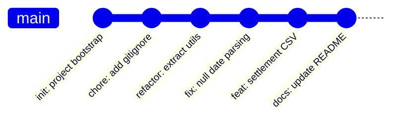
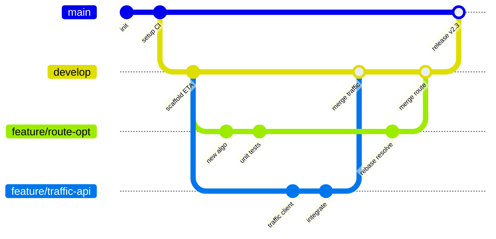
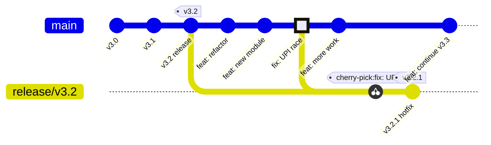

# Git (Version Control)

Bhai, agar tu coding kar raha hai aur Git nahi jaanta, toh tu basically ek aisa surgeon hai jo bina anesthesia ke operate kar raha hai. Git basically tumhare code ka time machine hai. Tu kabhi bhi past me jaa sakta hai, branches me parallel kaam kar sakta hai, aur team ke saath collide nahi karega. Jitne bhi production-grade product companies hain — Google, Stripe, Razorpay, Swiggy, Zomato — sab ke sab Git par chalti hain. Linus Torvalds ne 2005 me ye banaya tha jab BitKeeper ne Linux kernel community ko gaali di thi, aur tab se ye industry ka standard hai.

Ye module IIT-level depth pe likha hai — matlab tu sirf `git add . && git commit -m "stuff"` wala bandar nahi banega. Tu samjhega ki internally Git ek content-addressable filesystem hai, har commit ek SHA-1 (ab SHA-256 bhi) hash se identify hoti hai, aur branches actually me sirf pointers hain ek commit ki taraf. Ye foundational mental model hai jo interview me bhi kaam aata hai aur jab tumhara HEAD detached ho jaata hai 2 AM ko production debugging me, tab bhi.

Hum teen badi cheezein cover karenge: (1) Init/clone/commit ka basic workflow aur Git ka anatomy, (2) Branching aur merging ke patterns including conflict resolution, aur (3) Rebase, cherry-pick aur history rewriting — jo advanced level pe team workflow define karte hain. Har section me real team scenarios honge, bash commands Hinglish comments ke saath, mermaid gitGraph diagrams, aur interview Q&A jo tumhe production company ke senior round me bachayenge.

---

## 1. Init, clone, commit

### 1.1 Basic workflow, .gitignore, .git directory anatomy, staging vs working tree vs HEAD

#### Definition

Git ek **distributed version control system** hai. "Distributed" ka matlab — har developer ke paas pura repository ka complete copy hota hai, including poori history. Centralized systems jaise SVN ya Perforce me ek server hota tha jo single point of failure tha; Git me agar GitHub bhi down ho jaaye, tu apne local copy se pura kaam continue kar sakta hai aur baad me push kar sakta hai.

Git ke teen primary "states" hain jo har developer ko pata hone chahiye:

1. **Working Tree (Working Directory)** — ye tumhari actual files hain disk pe, jise tu editor me edit kar raha hai.
2. **Staging Area (Index)** — ye ek intermediate zone hai jaha tu decide karta hai ki agle commit me kya kya jaayega. Ye Git ki USP hai — granular control over commits.
3. **HEAD (Repository / .git directory)** — ye last commit ka snapshot hai, jo `.git/objects` me content-addressable form me store hota hai.

`.git` directory ek **content-addressable filesystem** hai. Iska matlab — har file ka content SHA-1 hash banake `.git/objects/` me store hota hai. Same content = same hash = deduplication automatic. Ye hi reason hai ki Git itna fast hai, kyunki rename detection bhi content hash se hoti hai, naam se nahi.

#### Why?

Sochke dekh — agar tu Razorpay me payment gateway ka code likh raha hai, aur tune accidentally `payment_processor.py` me ek bug introduce kar diya jo only Diwali traffic me hi trigger hota hai. Bina version control ke tu kya karega? `payment_processor_old.py`, `payment_processor_old_v2.py`, `payment_processor_FINAL_use_this.py` — ye sab bakwas chalegi. Git ke saath tu `git bisect` kar ke 5 minute me exact commit nikal sakta hai jisne bug introduce kiya, even agar wo 6 mahine purana hai.

Aur teen states jo maine batayi — wo isliye hain ki real-world me tu ek baar me 50 files edit kar raha hota hai but logically 3 alag features pe kaam kar raha hai. Staging area ke through tu inhe alag-alag commits me split kar sakta hai, jisse code review clean rahti hai aur git history readable banti hai.

`.gitignore` ka use isliye karte hain ki kuch files repository me kabhi nahi jaani chahiye — `node_modules/` (size bahut bada hai), `.env` (secrets/credentials hain), `*.log` (noise), `.DS_Store` (macOS junk), `dist/` ya `build/` (generated artifacts). Agar tune `.env` accidentally commit kar diya production secrets ke saath, toh tumhari company ki postmortem report me tumhara naam aayega — guaranteed.

#### How?

```bash
# === Repo banane ke do tareeke ===

# Tareeka 1: Naya repo scratch se banao
mkdir my-product           # naya project folder
cd my-product
git init                   # .git directory create hoti hai yahan
                           # ye tumhe ek empty repo deta hai

# Tareeka 2: Existing repo clone karo (most common)
git clone https://github.com/razorpay/razorpay-python.git
# clone karne se origin remote automatically set ho jaata hai
# poori history aa jaati hai local me — ye distributed nature hai

# === .git directory ka anatomy dekhte hain ===
cd my-product
ls -la .git/
# Tumhe ye dikhega:
# HEAD          -> currently checked-out branch ka pointer (refs/heads/main)
# config        -> repo-specific config (remote URLs, user.email)
# objects/      -> saare commits, trees, blobs (content-addressable)
# refs/         -> branches aur tags ke pointers
# index         -> staging area ki binary representation
# hooks/        -> pre-commit, post-merge etc. scripts

cat .git/HEAD
# Output: ref: refs/heads/main
# Matlab HEAD currently main branch ko point kar raha hai

# === Basic workflow: edit -> stage -> commit ===

# Step 1: File banao ya edit karo (Working Tree me change)
echo "console.log('hello swiggy');" > app.js

# Step 2: Status check karo — Git kya soch raha hai
git status
# "Untracked files: app.js" dikhega
# Untracked matlab Git ko abhi pata bhi nahi ki ye file exist karti hai

# Step 3: Staging area me daalo
git add app.js              # specific file stage karo
# git add .                  # saari changes stage karo (be careful!)
# git add -p                 # interactive — hunk-by-hunk decide karo
# git add -p sabse pro move hai, code review apne aap ho jaata hai

# Step 4: Status dobara dekho
git status
# "Changes to be committed: new file: app.js"
# Ab ye staged hai

# Step 5: Commit karo with meaningful message
git commit -m "feat(payments): add basic logger for swiggy integration"
# Ye HEAD ko aage badha deta hai aur ek naya commit object create karta hai

# Step 6: Commit history dekho
git log --oneline --graph --decorate --all
# Pretty graph aata hai with SHA hashes

# === .gitignore setup ===
cat > .gitignore << 'EOF'
# Dependencies — kabhi commit mat karo, package.json se restore ho jaate hain
node_modules/
venv/
__pycache__/

# Environment / secrets — life-or-death rule, kabhi commit mat karna
.env
.env.local
*.pem
secrets.json

# Build artifacts — ye generated hote hain, source nahi
dist/
build/
*.pyc
.next/

# IDE / OS junk
.vscode/
.idea/
.DS_Store
Thumbs.db

# Logs
*.log
logs/
EOF

git add .gitignore
git commit -m "chore: add .gitignore for node + python projects"

# === Pro tip: agar tune galti se .env commit kar diya ===
# Sirf .gitignore me daalna kaafi nahi hai — wo already tracked hai
git rm --cached .env        # staging se hata, file disk pe rahegi
git commit -m "chore: remove accidentally committed .env"
# Lekin yaad rakh — ye history me phir bhi rahega!
# Agar secret leak ho gaya hai, rotate karo immediately

# === Difference between three states dekhne ka tareeka ===
git diff                    # working tree vs staging — abhi tak stage nahi kiya
git diff --staged           # staging vs HEAD — kya commit hone wala hai
git diff HEAD               # working tree vs last commit — total pending changes

# === Internals: object types dekhna ===
git cat-file -t HEAD        # type batayega: commit
git cat-file -p HEAD        # commit ka content: tree, parent, author, message
# Tu dekhega ki commit andar tree ko point karta hai
# Tree andar blobs ko point karta hai (actual file contents)
# Ye hi Git ka content-addressable model hai
```

#### Real-life Example

Scenario: Tu ek fintech startup me junior engineer hai. Tumhe payment-reconciliation service me feature add karna hai — daily settlement reports CSV format me generate karna. Tu kaam start karta hai aur ek hi shaam me tu 4 cheezein kar deta hai: (a) main feature ka logic, (b) ek unrelated bug fix jo tune notice kiya date parsing me, (c) ek refactor jisme tune kuch utility functions extract kiye, aur (d) ek `.env.local` file jisme tune testing ke liye AWS keys daal di.

Agar tu noob hai, tu `git add . && git commit -m "stuff"` maar dega. Senior reviewer (jo tumhe 3 mahine se mentor kar raha hai) tumhari PR dekhke khud ka head desk pe maarega. Sahi tareeka:

```bash
# Pehle .env.local ko gitignore me daalo, FORTHWITH
echo ".env.local" >> .gitignore
git add .gitignore
git commit -m "chore: ignore local env files"

# Ab interactive add se chunks alag karo
git add -p src/utils.js     # sirf refactor wale hunks chuno
git commit -m "refactor(utils): extract date formatting helpers"

git add -p src/parser.js    # sirf bug-fix hunk chuno
git commit -m "fix(parser): handle null dates in legacy CSV format"

git add src/reconciliation/  # ab feature wala kaam
git commit -m "feat(reconciliation): generate daily settlement CSV reports

- Adds new ReconciliationReportGenerator class
- Supports both T+0 and T+1 settlement cycles
- Output schema documented in README

Closes JIRA-2341"
```

Ab tumhari PR me 3 clean commits hain, har ek atomic aur reviewable. Senior khush hai. Production me kuch toot gaya? `git revert <single-commit-sha>` kar do — sirf bug fix wapas aayega, feature aur refactor intact rahenge. Ye discipline hi tumhe junior se mid-level engineer banaata hai.

#### Diagram (gitGraph)



#### Interview Q&A

**Q1: Git ka object model explain karo. Commit, tree, blob — ye sab kaise relate karte hain?**

Bhai, ye question har Google, Atlassian, GitHub interview me aata hai aur 90% candidates ghoomte hain. Sahi answer ye hai — Git internally ek content-addressable filesystem hai jisme 4 primary object types hote hain: blob, tree, commit, aur tag. **Blob** ek file ka raw content store karta hai (bina filename ke, sirf bytes). Same content ka same hash, isliye deduplication free me. **Tree** ek directory structure represent karta hai — isme entries hoti hain jo blobs ya nested trees ko point karti hain, har entry ke saath filename aur permissions. **Commit** ek snapshot pointer hai jo ek root tree ko point karta hai, plus parent commit(s) ka reference, author, committer, timestamp aur message. **Tag** ek named pointer hai kisi commit pe (annotated tags ke case me khud bhi ek object).

Crucial insight ye hai ki commits content snapshots store karte hain, **not diffs**. Bahut log socht te hain Git diffs store karta hai jaise SVN — galat. Git har commit pe pure tree ka snapshot leta hai. Diffs sirf computed hote hain on-the-fly jab tu `git diff` chalata hai. Ye design choice isliye hai ki branching aur merging fast ho jaaye, aur file rename detection content hash se ho — Git ko renames track karne ki zaroorat hi nahi.

Storage efficiency ke liye Git **packfiles** use karta hai (`.git/objects/pack/`). Garbage collection ke time pe Git loose objects ko pack karta hai delta compression ke saath, similar files ke beech delta nikalke. Toh end-of-day storage efficient hai bina diff-based architecture ke complexity ke. Ye hybrid approach hi Git ko brilliant banaata hai — conceptually snapshot-based, physically delta-compressed.

**Q2: Working tree, staging area aur HEAD ka difference kya hai? Real workflow me kaise istemaal karte ho?**

Working tree wo files hain jo tu apni IDE me dekh raha hai — disk pe actual content. Staging area (`.git/index`, ye binary file hai) ek intermediate zone hai jaha tu decide karta hai ki next commit me kya jaayega. HEAD basically last commit ka pointer hai — `git log` ka top entry. Teen states ke beech transitions: working -> staging via `git add`, staging -> HEAD via `git commit`, HEAD -> working via `git checkout`/`git restore`.

Ye three-stage architecture revolutionary hai because real development me tu ek baar me multiple cheezein touch karta hai. Maan le tu ek bug fix kar raha hai aur uske beech tujhe ek typo dikhta hai docs me — dono changes alag commits deserve karte hain. `git add -p` ke through tu hunk-by-hunk choose kar sakta hai, even ek file ke andar bhi alag-alag changes alag commits me daal sakta hai. Mercurial aur SVN me ye granularity nahi thi originally.

Practical workflow me main always `git status` aur `git diff --staged` se verify karta hoon ki staging area me wahi hai jo main commit karna chahta hoon. CI/CD pipelines bhi is model par kaam karti hain — pre-commit hooks staged files par hi linter chalate hain (via `git diff --cached --name-only`), kyunki working tree me half-baked changes ho sakti hain jo abhi commit nahi hone wali.

**Q3: `.git` directory delete kar di galti se — kya hota hai? Recovery possible hai?**

Agar tune `.git` directory delete kar di aur tune push kiya hua tha remote pe, toh tu safe hai — bas `git clone` kar lo wapas, working tree ki uncommitted changes manually copy kar lo. Lekin agar tune push nahi kiya tha aur sirf local commits the, toh wo gaye — content-addressable storage `.git/objects` me thi, jo ab nahi hai. Ye lesson hai ki `.git` ko sacred treat karo — kabhi `rm -rf .git` mat chalao casually.

Partial corruption (jaise ek object file corrupt) ke case me `git fsck --full` chalake check karte hain, aur agar object missing hai but tu jaanta hai SHA, toh kabhi-kabhi `git fsck --lost-found` se recover hota hai dangling objects se. Reflog (`git reflog`) bhi life-saver hai — har HEAD movement log hota hai 90 din ke liye (default), so even agar tune `git reset --hard` kar diya tha, reflog se commit SHA nikaal sakta hai aur `git checkout <sha>` kar sakta hai.

Production wisdom: backup strategy ye honi chahiye ki tu apna kaam din me kam-se-kam ek baar push kare remote pe (even WIP branch pe). GitHub/GitLab khud ka backup hai. Agar critical solo project hai, toh `.git` ko bhi periodically `tar` karke S3 pe daal do. Distributed nature ka faayda tabhi hai jab tu actually distribute kare apna repo.

**Q4: `.gitignore` me file daalne ke baad bhi ye tracked rahti hai — kyun? Aur kaise fix karein?**

Ye gotcha 95% developers ko bites karta hai at least once. `.gitignore` sirf **untracked** files par effect karta hai — jo files already Git ke knowledge me hain (tracked), unhe gitignore ignore nahi karta. Agar tune pehle `secrets.json` commit kar diya tha aur baad me `.gitignore` me daala, toh future changes still track honge.

Fix ka tareeka hai `git rm --cached <file>` chalana — ye file ko Git ke index se hata deta hai but disk se delete nahi karta. Phir commit karo "stop tracking" message ke saath. Future me wo file gitignore ki wajah se ignore hogi. Lekin **history me file rahegi** — agar wo secret tha (jaise API keys, DB passwords), tujhe BFG Repo-Cleaner ya `git filter-repo` use karke history se purge karna padega, aur fir force-push (team ke saath coordinate karke). Aur sabse important — secret rotate karo immediately, kyunki agar ye public repo tha, scanners 60 second me wo key pick kar lete hain.

Pro tip: `git check-ignore -v <file>` se debug karo ki konsa gitignore rule kis line se file ko ignore kar raha hai. Multiple `.gitignore` files ho sakti hain (root pe, subdirs me, even global `~/.gitignore_global` for OS-specific junk). Global gitignore me `.DS_Store`, `*.swp` jaisi cheezein daalo, project gitignore me sirf project-specific patterns. Ye separation clean rakhta hai team workflows.

---

## 2. Branching & merging

### 2.1 Feature branches, fast-forward vs no-ff merges, conflict resolution

#### Definition

**Branch** Git me literally ek pointer hai ek commit ki taraf — `.git/refs/heads/main` me ek text file hoti hai jisme ek 40-character SHA hash hota hai. Bas. Itna sasta hai ki Linus ne intentionally branching ko trivial design kiya, taaki log dharadhar branches banayein bina overhead ke. SVN/Perforce me branch banane ka matlab tha pura folder copy karna — Git me ek pointer file write karna.

**Feature branch workflow** me developer apne kaam ko `main` (ya `master`/`develop`) se alag branch me karta hai, taaki main branch hamesha deployable rahe. Jab feature complete ho, code review ke baad merge ya rebase kar dete hain.

**Merge** do tareeke se hota hai:

1. **Fast-forward (FF) merge** — agar target branch ke last commit ke baad source branch linearly aage badhi hai (matlab target par koi naya commit nahi aaya since branch banayi gayi), toh Git simply target branch ka pointer source ke last commit pe khisak deta hai. No new commit created.

2. **No-fast-forward (no-ff) merge** — Git explicitly ek **merge commit** banata hai jisme do parent commits hote hain. Ye history me clearly dikhata hai ki yahan ek branch merge hui thi, even agar FF possible thi. Many teams `--no-ff` enforce karti hain for audit trail.

**Conflict** tab hota hai jab same line, same file me dono branches me alag-alag changes hain, aur Git auto-merge nahi kar pata. Ye human intervention demand karta hai.

#### Why?

Branching ka real reason ye hai ki software development inherently parallel hai. Tumhari team me 5 log hain — har koi alag feature pe kaam kar raha hai. Sab agar `main` pe directly commit karein, toh koi bhi push se pehle kisi aur ka kaam toot sakta hai. Branches isolation deti hain — tu apni dunia me kaam kar, jab ready ho tab integrate kar.

Feature branches CI/CD ke saath pair ho ke aur powerful banti hain. Har PR pe automated tests chalti hain, tab merge hoti hai. GitHub Flow / GitLab Flow / Trunk-based development — sab ke sab branching strategies hain jo team size aur release cadence ke hisaab se choose ki jaati hain.

FF vs no-ff ka debate isliye matter karta hai kyunki **history readability** matter karti hai. FF me history straight line dikhti hai, lekin tu nahi bata sakta ki konsi commits ek logical feature se belong karti thi. No-ff me merge commits bookmarks ki tarah hote hain — `git log --first-parent main` se tu sirf merge commits dekh sakta hai aur entire feature ka summary mil jaata hai. Big companies (Atlassian, Microsoft) typically no-ff prefer karti hain audit ke liye; OSS projects (Linux kernel) often rebase + FF pass karte hain clean linear history ke liye.

Conflicts inevitable hain in any team larger than 1. Conflict resolution skill ek senior engineer ko junior se distinguish karti hai. Junior panic karta hai aur `git merge --abort` maar deta hai; senior carefully har conflict marker padhta hai, dono sides ka intent samjhta hai, aur correct merge resolve karta hai (often dono sides ka combination, naki sirf "ours" ya "theirs").

#### How?

```bash
# === Branch banana aur switch karna ===

git branch                          # current branches list karo (* current pe)
git branch feature/payment-retry    # nayi branch banao (but switch nahi)
git checkout feature/payment-retry  # purana tareeka
git switch feature/payment-retry    # naya tareeka (Git 2.23+)

# Ek shot me banao aur switch karo
git switch -c feature/oauth-google  # -c = create
# git checkout -b feature/oauth-google (legacy syntax, same kaam)

# === Branch pe kaam karo ===
echo "OAuth logic" > oauth.js
git add oauth.js
git commit -m "feat(auth): add Google OAuth flow"

echo "Token refresh" >> oauth.js
git add oauth.js
git commit -m "feat(auth): handle token refresh"

# === Main branch pe wapas jaake merge karo ===

git switch main
git pull origin main              # pehle remote ke saath sync karo

# Fast-forward merge (default behavior agar possible ho)
git merge feature/oauth-google
# Output: "Fast-forward" — koi merge commit nahi
# main pointer simply aage khisak gaya

# === No-fast-forward merge — explicit merge commit ===
git merge --no-ff feature/oauth-google -m "Merge feature/oauth-google into main"
# Ek naya merge commit banta hai 2 parents ke saath
# History me clearly dikhega ki ye ek feature merge tha

# === Conflict scenario simulate karo ===

# Branch A: main pe ek change
git switch main
echo "API_TIMEOUT = 5000" > config.js
git add config.js
git commit -m "config: set timeout to 5s"

# Branch B: feature pe same line pe alag change
git switch -c feature/timeout-tweak
echo "API_TIMEOUT = 10000" > config.js
git add config.js
git commit -m "config: increase timeout to 10s"

# Ab merge karo — conflict aayega
git switch main
git merge feature/timeout-tweak
# CONFLICT (content): Merge conflict in config.js
# Automatic merge failed; fix conflicts and then commit the result.

# config.js me ye dikhega:
# <<<<<<< HEAD
# API_TIMEOUT = 5000
# =======
# API_TIMEOUT = 10000
# >>>>>>> feature/timeout-tweak

# Resolve karo manually — file edit karo, markers hatao, sahi value rakho
# Maan le tune decide kiya 10000 better hai
echo "API_TIMEOUT = 10000" > config.js

# Resolved file ko stage karo
git add config.js

# Status check — "All conflicts fixed but you are still merging"
git status

# Merge commit complete karo
git commit -m "merge: resolve timeout conflict, prefer 10s for slow networks"

# === Conflict ke beech me hi ghoomne ke tools ===

git merge --abort                  # complete back-out, original state pe wapas
git diff --name-only --diff-filter=U   # sirf conflicted files list karo
git checkout --ours config.js      # apni side rakho (main wali)
git checkout --theirs config.js    # incoming side rakho (feature wali)
git mergetool                      # GUI tool kholega (vimdiff/meld/kdiff3)

# === Branch cleanup ===
git branch -d feature/oauth-google         # merged branch delete karo
git branch -D feature/abandoned-spike      # force delete (unmerged bhi)
git push origin --delete feature/oauth-google  # remote se bhi hatao

# === Visualize ===
git log --oneline --graph --all --decorate
# Beautiful ASCII graph milega jo branches aur merges show karega

# === Useful: merge --squash ===
# Saari feature commits ko ek single commit me collapse karke main pe daalo
git merge --squash feature/oauth-google
git commit -m "feat(auth): complete Google OAuth integration"
# Linear history rakhna hai but merge commit avoid karna hai? Squash use karo
```

#### Real-life Example

Scenario: Tu Swiggy me delivery-tracking team me hai. Quarterly OKR me "real-time ETA prediction" feature aaya hai. Team me 4 log hain — tu, do mid-level, ek senior. Senior ne workflow define kiya:

- `main` branch hamesha production-deployable
- `develop` branch staging environment me deploy hoti hai daily
- Har feature ek `feature/<jira-id>-<short-name>` branch me
- PRs `develop` me jaati hain, `develop` weekly `main` me merge hoti hai
- `--no-ff` enforced for `develop -> main`

Tu `feature/ETA-2341-route-optimizer` pe kaam kar raha hai. Ek mid-level dev `feature/ETA-2342-traffic-api` pe. Dono ne `route_calculator.py` me changes kiye — tune routing algorithm modify kiya, usne traffic data integration add kiya. Same function, alag concerns.

Wo pehle merge ho gaya `develop` me. Jab tune apna PR raise kiya, CI red ho gaya merge conflicts ki wajah se. Tune `develop` se rebase kiya:

```bash
git switch feature/ETA-2341-route-optimizer
git fetch origin
git rebase origin/develop
# Conflict: route_calculator.py me

# Tune carefully dono ke intent dekhe
# Tumhara: optimize_route() function rewrite kiya
# Uska: optimize_route() ke andar traffic_score parameter add kiya

# Tune dono ko merge kiya — apna rewrite + uska traffic param
# Ab function naya optimization algo use karta hai, traffic-aware

git add route_calculator.py
git rebase --continue

# CI dobara chalayi, green
git push --force-with-lease origin feature/ETA-2341-route-optimizer
```

Senior ne PR review ki, comment kiya: "Good conflict resolution — you preserved both teammate's traffic logic and your optimization. Better than just `--ours`." Tumhara naam appraisal cycle me aaya. Ye real conflict resolution ka power hai.

Agar `--no-ff` enforced nahi hota, toh `develop` me sab sequential FF merges hoti, history flat hoti, aur Q1 retrospective me jab CTO poochte "ETA project me kya kya features the?", koi clearly nahi bata pata. `--no-ff` ke saath, `git log --first-parent develop` se 12 merge commits dikhte, har ek ek feature ka summary.

#### Diagram (gitGraph)



#### Interview Q&A

**Q1: Fast-forward merge aur no-ff merge me kya difference hai? Kab konsa use karoge?**

Fast-forward merge tab possible hota hai jab tumhari target branch ka tip source branch ke history me ek ancestor hai — matlab target par koi naya commit nahi hua jab se source branch banayi gayi. Is case me Git ke paas option hota hai ki bina naya commit banaye, target branch ka pointer source ke tip pe khisak de. History flat aur linear dikhti hai, koi extra "merge commit" noise nahi.

No-ff merge me Git explicitly ek merge commit banata hai jiske do parents hote hain — ek target branch ka previous tip, doosra source branch ka tip. Ye merge commit ek artifact hai jo history me forever bata raha hai ki yahan ek branch merge hui thi. Even agar FF possible tha, `--no-ff` flag se tu force kar sakta hai. Iska faayda audit trail aur rollback me hota hai — agar feature buggy nikla, `git revert -m 1 <merge-sha>` se entire feature ek shot me revert ho jaata hai, naki cherry-by-cherry.

Choice context-dependent hai. Solo project ya OSS jaha clean linear history value rakhti hai — FF (often with rebase before merge) prefer karte hain. Enterprise me jaha audit, compliance aur multi-team coordination matter karti hai — no-ff industry standard hai. Atlassian Git workflow (gitflow, GitHub flow with squash) me tu dekhega ki PR merge mostly squash ya no-ff hota hai. Trunk-based development me FF + rebase common hai. Mera personal opinion: feature branches → no-ff merge to develop, develop → main FF after rebase. Best of both.

**Q2: Merge conflict resolve karne ka tumhara approach kya hai? Tools kya use karte ho?**

Pehla step hai conflict ka **scope assess** karna — `git status` se kitni files conflicted hain, aur `git diff --name-only --diff-filter=U` se sirf unhe list karna. Agar 50+ files hain, ye signal hai ki branches bahut zyada diverge ho gayi hain — better merge frequently than once-a-month big-bang merge. Conflict prevention is better than conflict resolution.

Doosra step hai **intent samajhna** dono sides ka. Conflict markers (`<<<<<<< HEAD`, `=======`, `>>>>>>> branch`) sirf mechanical text hain — actual question hai ki "main side ne ye kyu kiya, feature side ne wo kyu kiya, aur logically dono ka combination kya hona chahiye". Iske liye main `git log -p HEAD..feature -- <file>` chalata hoon dono branches pe alag-alag, taaki context mile har change ka. Often original commit messages se intent clear ho jaata hai.

Tools ke liye main `git mergetool` configure kiya hua rakhta hoon `meld` ya `kdiff3` ke saath — three-way visual diff bahut helpful hai. VSCode ka inline merge editor bhi solid hai, "Accept Current/Incoming/Both" buttons ke saath. JetBrains IDEs me three-pane merge tool fantastic hai, even semantic merging karta hai (Java/Kotlin me method-level). Production wisdom: kabhi blindly `--ours` ya `--theirs` mat use karo across the board — har conflict ek decision deserve karta hai.

Final step hai **verification** — merge ke baad full test suite chalao, aur agar critical service hai, manual smoke test bhi. Maine ek baar dekha senior dev ne merge resolve kiya, build green tha, but actually ek subtle business logic toot gayi thi kyunki dono sides ne overlapping invariants assume kiye the. Tests adequate nahi the ye catch karne ke liye. Toh post-merge testing aur stakeholder review (especially conflict zone ke author) ek good safeguard hai.

**Q3: Long-running feature branches ke saath kya problems aati hain? Best practices kya hain?**

Long-running feature branches (2 hafte se zyada zinda) ka primary problem hai **merge debt** — main branch aur feature branch ke beech ka divergence exponentially badhta jaata hai. Har din main pe naye commits aate hain, feature me bhi naye commits aate hain, aur jab finally merge karna hota hai — conflict storm aati hai. Plus refactoring nightmares: agar main me kisi function ka signature change ho gaya, feature branch saari pe usage galat ho jaayegi.

Best practice #1: **frequent integration**. Har 1-2 din me main se merge ya rebase karo apni feature branch me. Conflicts incremental aur small honge — manageable. Ye trunk-based development ka core philosophy hai — keep branches short-lived (ideally < 2 days). Agar feature 2 hafte ka kaam hai, use **feature flags** se split karo — chhote chunks me merge karo to main behind a flag, end me flag enable.

Best practice #2: **branch hygiene**. Naam meaningful rakho (`feature/JIRA-1234-add-paypal`, naki `myfix`). Stale branches periodically delete karo (`git branch --merged | grep -v main | xargs git branch -d`). Remote pe bhi cleanup — GitHub me PR merge ke baad auto-delete enable karo. Aur **hamesha rebase before merge** taaki history clean rahe (or squash if commits messy hain).

Best practice #3: **communication**. Agar tu kisi shared module pe kaam kar raha hai, Slack pe team ko ping kar — "yaar, main payment_processor.py ko refactor kar raha hoon, tum log naya kaam wahan mat shuru karo agle 2 din". Ye proactive communication 80% conflicts prevent kar deti hai. Code is collaborative, version control is collaborative — communication is the meta-layer that makes both work.

**Q4: `git merge` aur `git rebase` ka choice tum kaise karte ho? "Golden rule of rebasing" kya hai?**

Choice ka simple framework: **public history pe merge, private history pe rebase**. Public history = jo already remote pe push ho chuki hai aur doosre log uspe base kar rahe hain. Private history = sirf tumhari local branch jo abhi public hui nahi.

Agar tu apni feature branch ko clean rakhna chahta hai before raising PR, rebase pe rebase karte raho — squash kar sakta ho commits, reorder kar sakta ho, fix typos in messages. Ye sab "private" history pe legal hai. Lekin jaise hi tu PR raise karta hai aur dusre log review karte hain, ya CI build artifacts produce karta hai uss SHA pe — ab history "public" ho gayi. Force-push se SHAs change ho jaayenge, doosron ka local copy break ho jaayega. Toh ab merge use karo.

**Golden Rule of Rebasing**: "Never rebase commits that exist outside your repository and that people may have based work on." — official Git docs ka quote. Iska reason ye hai ki rebase technically purane commits ko discard karke naye commits banata hai (different SHAs), even agar content same hai. Agar teammate ne tumhari purani SHA pe apna kaam base kiya tha, ab uska kaam orphan ho jaayega.

Practical workflow jo main use karta hoon: feature branch pe kaam karta hoon, local me commits banata hoon (kabhi-kabhi messy), `git rebase -i origin/main` kar ke clean karta hoon before push. Push ke baad bas merges, no rebases. Agar kisi shared branch ko rebase karne ki nobat aaye (rare cases), `--force-with-lease` use karta hoon (na ki `--force`) — ye tab fail ho jaata hai agar koi aur ne us branch pe push kiya hai meanwhile, jo race condition se bachata hai. Aur team ko Slack pe announce karta hoon. Coordination > cleverness, hamesha.

---

## 3. Rebase & cherry-pick

### 3.1 History rewriting, interactive rebase, cherry-pick, when to rebase vs merge

#### Definition

**Rebase** ek operation hai jo ek branch ke commits ko utha ke kisi aur base commit ke upar "replay" karta hai. Conceptually: "main branch ke latest commit ke upar mere feature ke commits dobara apply kar do, ek-ek karke." Result: linear history, no merge commit, but **naye commits banate hain** (new SHAs) kyunki parent change ho gaya.

**Interactive rebase** (`git rebase -i`) is rebase ko power user mode me khol deta hai. Tu ek-ek commit ko independently manipulate kar sakta hai: pick (keep as-is), reword (edit message), edit (stop and amend), squash (combine with previous, keep messages), fixup (combine, discard message), drop (delete), reorder (rearrange).

**Cherry-pick** (`git cherry-pick <sha>`) ek specific commit ko utha ke current branch pe apply karta hai. Use case: ek commit jo kisi aur branch me hai aur tujhe wahi specific change chahiye, full branch merge nahi.

**History rewriting** umbrella term hai — rebase, amend, filter-branch (or `git filter-repo`), reset, sab is category me aate hain. Common theme: existing commits ko modify ya replace karna.

#### Why?

Rebase ka primary benefit hai **linear, readable history**. Sochke dekh — agar `main` pe 50 features merge hue saare no-ff merges ke saath, history dekhna ek octopus jaisa lagta hai with criss-crossing branches. Linear history me sirf ek straight line dikhti hai. `git bisect` (binary search to find bad commit) linear history pe magnitudes faster aur cleaner hota hai. Code archaeology — `git log --follow <file>` se file ki evolution trace karna — also way easier.

Interactive rebase ka use **commit hygiene** ke liye hota hai. Real development me tu often "WIP", "fix typo", "oops forgot semicolon" jaise messy commits banata hai. Before pushing, `git rebase -i` se inhe squash karke ek clean atomic commit bana sakta hai jo logically reviewable ho. Senior engineers ki PR me hamesha well-crafted commits hote hain — ye sirf ego ka mamla nahi, ye downstream code review aur debugging ki productivity hai.

Cherry-pick ka killer use case hai **hotfix backporting**. Maan le production v2.3 release hai aur ek critical bug fix tune `main` pe v2.4-dev me kar diya. Production v2.3 pe wahi fix chahiye urgent. `git cherry-pick <fix-sha>` on `release/v2.3` branch — done. Sirf wo specific fix aaya, baaki v2.4 ka kaam nahi.

Lekin shaktiyon ke saath responsibilities aati hain. History rewriting public commits pe disastrous hai — coordinate karke karo, ya never. Yeh rebase-vs-merge ka eternal debate hai aur har company ka apna stance hai.

#### How?

```bash
# === Basic rebase ===

# Setup: main pe 2 commits, feature pe 2 commits
# main:    A - B
#               \
# feature:       C - D

git switch feature/new-api
git rebase main

# Internally: D, C ko save karta hai, feature ko reset karta hai main pe,
# phir C', D' replay karta hai (naye SHAs ke saath, same content)
# Result: A - B - C' - D'
# Linear history, no merge commit

# === Conflict during rebase ===

# Agar C' apply karte time conflict aaye:
# CONFLICT (content): Merge conflict in api.js

# Resolve karo file me, phir:
git add api.js
git rebase --continue       # next commit pe jao

# Ya agar bigad jaaye:
git rebase --abort          # original state pe wapas

# Skip ek problematic commit (rare, careful):
git rebase --skip

# === Interactive rebase — masterclass ===

# Last 5 commits ko interactively edit karne ke liye
git rebase -i HEAD~5

# Editor open hoga ye dikhayega:
# pick a1b2c3 feat: add user model
# pick d4e5f6 fix typo
# pick g7h8i9 feat: add auth flow
# pick j0k1l2 oops forgot test
# pick m3n4o5 feat: add session mgmt
#
# Commands:
# p, pick = use commit
# r, reword = use commit, but edit message
# e, edit = use commit, but stop for amending
# s, squash = use commit, but meld into previous (keep both messages)
# f, fixup = like squash, but discard this commit's message
# d, drop = remove commit

# Tu modify kar sakta hai:
# pick a1b2c3 feat: add user model
# fixup d4e5f6 fix typo                  (typo fix ko user model me merge)
# pick g7h8i9 feat: add auth flow
# fixup j0k1l2 oops forgot test          (test ko auth flow me merge)
# pick m3n4o5 feat: add session mgmt
# reword karna ho? message edit kar do save par

# Save karke editor close karo, Git replay karega instructions ke hisaab se

# === Cherry-pick ===

# Specific commit ko current branch pe apply karo
git switch release/v2.3
git cherry-pick a1b2c3              # main se ek fix utha lo

# Multiple commits cherry-pick
git cherry-pick a1b2c3 d4e5f6 g7h8i9

# Range cherry-pick (a1b2c3 ke baad se g7h8i9 tak)
git cherry-pick a1b2c3..g7h8i9

# Conflict aaye toh:
# Resolve karo, phir
git cherry-pick --continue
# Ya
git cherry-pick --abort

# Cherry-pick without commit (sirf staging me daal de)
git cherry-pick -n a1b2c3
# Ab tu modify kar sakta hai before commit

# Add original SHA reference in message (audit trail ke liye)
git cherry-pick -x a1b2c3
# Message me "(cherry picked from commit a1b2c3...)" line aati hai

# === Amending last commit ===

# Last commit me kuch chhuta tha
echo "missing line" >> file.js
git add file.js
git commit --amend --no-edit          # message same rakho

# Last commit ka message change karo
git commit --amend -m "Better commit message"

# CAUTION: amend bhi history rewrite hai. Pushed commits par mat karo

# === Pulling with rebase ===

# Default `git pull` merge karta hai — messy history banti hai
git pull origin main                  # creates merge commit if diverged

# Better: pull with rebase
git pull --rebase origin main         # local commits ko remote ke upar replay
                                       # cleaner history

# Permanently set kar do globally
git config --global pull.rebase true

# === Reflog — life saver ===

# Agar tune koi galat rebase / reset kiya, ghabrana mat
git reflog
# Ye saari HEAD movements dikhata hai with timestamps:
# a1b2c3 HEAD@{0}: rebase finished
# d4e5f6 HEAD@{1}: rebase started
# g7h8i9 HEAD@{2}: commit: feat add auth
# j0k1l2 HEAD@{3}: checkout: from main to feature

# Wapas jaane ke liye
git reset --hard HEAD@{2}
# Ya specific SHA pe
git reset --hard g7h8i9

# Reflog 90 din tak preserved rahta hai default

# === Filter-branch / git filter-repo ===

# Agar tune galti se sensitive file commit ki aur poori history se hatani hai
# (example: .env file with prod secrets)
# Modern tool: git-filter-repo (filter-branch deprecated)
pip install git-filter-repo
git filter-repo --path .env --invert-paths
# Saari history se .env hata
# CAUTION: SHAs change hoti hain, force-push needed, team coordination zaroori
# Aur secret rotate karna mat bhoolna — wo already leaked ho gaya
```

#### Real-life Example

Scenario: Tu Razorpay me payments-core team me senior developer hai. Production me v3.2 chal raha hai. Tu `main` pe v3.3 ke features develop kar raha hai. Friday evening 9 PM — production alert: ek edge case me UPI refund flow me race condition hai, double-refund issue. Tune `main` pe ek commit bana ke fix kiya — SHA `a1b2c3`. Lekin v3.3 abhi 2 hafte door hai. Production ko fix abhi chahiye, on `release/v3.2` branch.

```bash
# Step 1: release branch pe switch
git switch release/v3.2

# Step 2: cherry-pick the fix
git cherry-pick -x a1b2c3
# -x flag ye add karega message me:
# "(cherry picked from commit a1b2c3...)"
# Ye audit trail ke liye golden hai — 6 mahine baad jab kisi ko poochna hoga
# "ye fix kahan se aaya?", reference clearly hai

# Step 3: Conflict aaya kyunki release/v3.2 me kuch refactoring nahi thi
# jo main pe ho chuki thi
# Maine resolve kiya carefully — main wala fix logic preserved kiya
# v3.2 ke older code structure me adapt kiya
git add upi_refund.py
git cherry-pick --continue

# Step 4: Test, push, hotfix release
pytest tests/test_upi_refund.py
git tag v3.2.1
git push origin release/v3.2 --tags
# CI/CD pipeline ne hotfix deploy kar diya production me

# Step 5: Monday subuh, postmortem ke liye main pe bhi tag karna chahiye
git switch main
git tag --contains a1b2c3
# Verify ki fix main me bhi hai (jahan se cherry-pick hua tha)
```

Doosra scenario — interactive rebase. Tu apni feature branch `feature/JIRA-5678-fraud-detection` par 3 din se kaam kar raha hai. 17 commits ban gaye hain — bahut me "wip", "fix lint", "address review", "another fix". PR raise karne se pehle senior ne kaha "clean up your history". Tu kar diya:

```bash
git fetch origin
git rebase -i origin/main

# Editor me 17 commits dikh rahi
# Tune carefully reorganize kiya into 4 logical commits:
# 1. feat: add fraud detection schema
# 2. feat: implement rule-based detector
# 3. feat: integrate ML model scoring
# 4. test: add comprehensive fraud detection tests

# Saare WIP, lint fixes, typo fixes ko fixup kiya unke logical parents me
# Tine reword bhi kiya 2 messages ko, jo unclear the

# Save kiya, Git ne replay kiya — clean 4 commits
git push --force-with-lease origin feature/JIRA-5678-fraud-detection

# PR me ab 4 reviewable atomic commits hain
# Senior ne approval di pehli review me — "clean history, easy to review"
```

Ye discipline tumhe team me respect dilati hai. Code review tej hoti hai, reviewer ka time bachta hai, aur git history future engineers ke liye ek narrative ban jaati hai naki random noise.

#### Diagram (gitGraph)



#### Interview Q&A

**Q1: Rebase aur merge me technical difference kya hai? Internally Git kya karta hai?**

Merge create karta hai ek **merge commit** jiske do (ya zyada) parents hote hain. Wo merge commit ek tree snapshot rakhta hai jo dono branches ka combined state represent karta hai (after auto-merging or manual conflict resolution). Original commits dono branches pe intact rahte hain — koi history rewrite nahi. Result: directed acyclic graph (DAG) me ek "diamond" pattern banta hai — branch out, branch in.

Rebase fundamentally alag hai — wo **naye commits banata hai**. Internally: feature branch ke commits ka patch nikaalta hai (diff), feature branch ka HEAD reset karta hai target base pe, phir patches ek-ek karke replay karta hai. Har replay ek naya commit object banata hai with naya SHA (different parent = different hash, even agar tree same hai). Original commits orphaned ho jaate hain — reachable nahi reflog ke siwa, garbage collection eventually delete kar deti hain. Result: linear history, no diamond pattern.

Internally jo SHA change hota hai wo ye reflect karta hai ki commit ka **identity** parent commit pe based hai, na sirf content pe. Git ki Merkle-tree-like structure me parent reference commit hash ka part hota hai. Toh logically same change, alag parent → alag hash. Yahi reason hai ki rebase shared history pe khatarnak hai — kisi ka local copy purane SHA pe based hota hai, naya SHA ke saath integrate karna nightmare ban jaata hai. Fundamental tradeoff: merge preserves truth (kya hua exactly), rebase preserves narrative (kya story tell karna chahte ho).

**Q2: Interactive rebase ke options explain karo. `squash` aur `fixup` me kya difference hai?**

Interactive rebase ke main commands hain — `pick` (commit ko as-is rakho), `reword` (commit message edit karo, content same), `edit` (commit pe rebase pause karega, tu manually amend kar sakta hai files), `squash` (current commit ko previous me merge karo, **dono commit messages preserve hote hain** ek combined message me), `fixup` (squash jaisa hi, lekin **current commit ka message discard ho jaata hai**), `drop` (commit ko remove karo entirely), aur reordering — lines ko upar-niche move karke commit order change kar sakte ho.

`squash` aur `fixup` ka difference subtle but important hai. `squash` use karo jab dono commits ke messages me content hai jo combined commit me chahiye — Git tujhe editor me dono messages dikhata hai aur tu compose karta hai final message. `fixup` use karo jab second commit basically pehle ka "fix" tha (typo fix, lint fix, missing import) jiska standalone message koi value nahi rakhta — Git silently first commit ka message rakhta hai, second wala drop hota hai.

Pro workflow: jab tu kaam karte time WIP commits banata hai, message me prefix lagao — "fixup! original commit message". Git ko `--autosquash` flag ke saath rebase chalao (`git rebase -i --autosquash HEAD~10`), aur ye automatically un commits ko correct position pe `fixup` mark kar dega. `git config --global rebase.autoSquash true` permanently enable kar do. Senior developers ye discipline use karte hain — chhote commits banao freely, end me ek `git rebase -i --autosquash` se sab clean ho jaata hai. Ye productivity hack 90% logon ko nahi pata.

**Q3: Cherry-pick aur rebase me kya overlap hai? Kab konsa use karoge?**

Conceptually dono **commits ko ek branch se doosri pe replay** karte hain. Implementation level pe internally similar hi hain — patch nikaalo, apply karo. Lekin scope aur intent alag hain.

Cherry-pick **selective** hai — tu specific commit(s) chunke utha lete ho. Use cases: hotfix backport (main pe fix kiya, release branch pe chahiye), accidentally-wrong-branch commit (tune feature commit galti se main pe kar di, cherry-pick to feature branch karke main se reset karo), partial feature import (kisi aur ki branch se sirf 1 commit chahiye, baaki nahi).

Rebase **wholesale** hai — entire branch ke commits ko replay karta hai. Use case: feature branch ko latest main pe rebase karna before merge, history clean rakhna, linear graph maintain karna, conflicts incrementally resolve karna (one commit at a time, like cherry-pick — yahi reason hai conflict UX same lagta hai).

Decision framework: agar tujhe **specific commits** chahiye → cherry-pick. Agar **entire branch** ka work integrate karna hai aur clean history chahiye → rebase. Cherry-pick subtle danger hai duplicate commits ka — agar tune cherry-pick kiya aur baad me branches merge bhi karli, same change do baar history me aa sakta hai (different SHAs hone ki wajah se Git auto-deduplicate nahi kar pata always). `git cherry-pick -x` flag use karo origin reference rakhne ke liye, aur post-merge audit chalao.

**Q4: "Golden rule of rebasing" kya hai? Public branches ko rebase karne ki nobat aaye toh kya karoge?**

Golden Rule: "Never rebase commits that exist outside your repository and that people may have based work on." Practically iska matlab — `main`, `develop`, ya koi shared branch jo doosre developers use kar rahe hain, unhe **kabhi rebase mat karo**. Apni private feature branch jo sirf tu use kar raha hai — rebase freely, force-push freely. Drawing line is critical for team sanity.

Reason: rebase commit hashes change karta hai. Agar teammate ke local clone me purani SHAs hain aur unke kaam unke ancestors hain, tumhara force-push unke history ko break kar dega. Wo `git pull` karenge aur ya toh weird merge conflicts honge ya unke commits "duplicate" lagne lagenge. Recovery painful hoti hai, often manual cherry-picking se solve karna padta hai. Multiplied by team size — disaster.

Lekin real-world me kabhi-kabhi public branch ko rewrite karna padta hai — example: koi credential leak ho gaya history me, ya legal compliance demand karta hai PII removal, ya repository size out of control hai aur old large binaries purge karne hain. Ye situations rare hain but real. Process: (1) Team ko advance notice do, planned downtime window declare karo. (2) Sab developer apne local branches push kar dein, clean state pe aa jaayein. (3) Backup le lo full repo ka. (4) Rewrite karo (`git filter-repo` use karo, `filter-branch` deprecated hai aur slow hai). (5) Force-push to remote with `--force-with-lease`. (6) Sab developers fresh `git clone` karein — purana clone discard. (7) Open PRs ko rebase aur resubmit karna padega.

**`--force-with-lease` vs `--force`**: hamesha former use karo. `--force` blindly remote ko overwrite karta hai. `--force-with-lease` pehle check karta hai ki remote ka tip wahi hai jo tumne last fetch kiya tha — agar koi aur ne push kiya hai meanwhile, push fail ho jaata hai instead of silently destroying their work. Ye ek line ka safety net 100% adopt karne layak hai. `git config --global push.default current` aur ek alias `git config --global alias.pushf 'push --force-with-lease'` set kar do, life easy ho jaayegi.

---

## Resources & further reading

**Official documentation aur deep references:**

1. **Pro Git Book** by Scott Chacon (free online — git-scm.com/book) — bible. Especially Chapter 10 ("Git Internals") jo `.git` directory anatomy, plumbing commands, aur object model in depth cover karta hai. IIT-level depth chahiye toh ye must-read hai.

2. **Git official docs** (git-scm.com/docs) — har command ka man page available. `git help <command>` se local me bhi access kar sakte ho. Edge cases aur flags ke liye reference.

3. **Atlassian Git tutorials** (atlassian.com/git/tutorials) — visual diagrams ke saath, beginners se advanced tak. Especially "Advanced Git tutorials" section — rebase, hooks, refs.

4. **Think Like (a) Git** (think-like-a-git.net) — graph theory perspective se Git samjhata hai, reachability concepts, jo bahut clarify karta hai mental model.

5. **Linus Torvalds ki Google Tech Talk (2007)** — YouTube pe "Linus Torvalds on Git" search karo. Git ki design philosophy directly creator se. Entertaining aur educational dono.

**Hands-on practice:**

6. **Learn Git Branching** (learngitbranching.js.org) — interactive visual sandbox. Branching, rebasing, cherry-pick scenarios practice karne ke liye best resource. IIT students ke liye ye gold hai.

7. **Oh Shit, Git!?!** (ohshitgit.com) — common disasters aur unke fixes. Real-world emergency cheat sheet.

8. **Git Katas** (github.com/eficode-academy/git-katas) — production-style scenarios pe practice repos. Conflict resolution, merge dilemmas, history rewriting drills.

**Advanced topics jo aage explore karein:**

9. **Git LFS (Large File Storage)** — agar tu ML/data team me jaata hai, large model files version control karne ke liye. `git-lfs.github.com`.

10. **Trunk-Based Development** (trunkbaseddevelopment.com) — Google, Facebook, Netflix scale pe Git workflow. Feature flags + short-lived branches ka philosophy.

11. **GitHub Flow vs GitLab Flow vs Gitflow** — branching strategies ka comparison. Different team sizes aur release cadences ke liye different fits.

12. **`git filter-repo` documentation** — modern history rewriting tool, `filter-branch` ka successor. Jab kabhi nuclear option chahiye history cleaning ke liye.

13. **Hooks** — `.git/hooks/` directory me pre-commit, post-merge, pre-push scripts. Husky (Node.js) ya pre-commit (Python) frameworks team-wide hooks share karne ke liye.

14. **Conventional Commits** (conventionalcommits.org) — commit message standardization. `feat:`, `fix:`, `chore:` prefixes ka semantic meaning. Automated changelog generation ke liye foundation.

15. **Submodules aur Subtrees** — multi-repo dependencies manage karne ke advanced techniques. Microservices architecture me kabhi-kabhi useful, but generally use sparingly.

**Interview-specific prep:**

16. **System design ke saath Git** — distributed systems consistency, vector clocks, Merkle trees ka concept Git me directly relate karta hai. Ye reading product company interviews me bahut help karti hai.

17. **`git bisect` mastery** — production debugging skill. Binary search through history to find regression-introducing commit. Senior interviews me poocha jaata hai.

18. **Conflict resolution scenarios** — real GitHub PRs ke conflicts dekho open-source projects me, resolve karne ki practice karo. Practical skill jo theory padhne se nahi aati.

Ant me: Git ek tool nahi, ek **discipline** hai. Commands yaad rakhna easy hai, but jab tum 3 AM ko production debug kar rahe ho aur reflog tumhe bachata hai, ya jab interviewer pucchti hai "explain why rebase changes commit hashes" — tab ye foundational understanding kaam aati hai. Practice karte raho, real conflicts face karte raho, aur slowly ye second nature ban jaayegi. Senior engineers ki ek pehchaan ye hai ki wo Git me kabhi panic nahi karte — kyunki unhe pata hai har "lost" commit reflog me 90 din tak available hai. Confidence comes from understanding, na ki memorization.
