# HTML (Complete)

HTML basically tumhari webpage ka skeleton hai. Bina HTML ke browser ko samajh hi nahi aata kya kya hai. Ye guide tumhe 14 subtopics ke through le jayegi — document structure se lekar iframes tak. Har subtopic mein definition, why, how, real-life example, diagram aur interview question milega. Production-grade HTML likhna seekhna hai to ye padh.

---

## 1. Document structure

### 1.1 doctype, head, body

#### Definition (kya hai?)
HTML document ka structure ek formal contract hai browser ke saath. `<!DOCTYPE html>` browser ko bolta hai "bhai standards mode mein chal, quirks mode mat lagana". Iske baad `<html>` root element aata hai jisme do bachhe hote hain — `<head>` (metadata, jo user ko dikhta nahi) aur `<body>` (jo screen pe dikhta hai).

Real-life analogy: socho ek courier package hai. DOCTYPE label hai jo bolta hai "ye HTML5 standard package hai". `<head>` package ka shipping label aur invoice hai (sender, receiver, weight — internal info). `<body>` actual saamaan hai jo customer dekhta hai.

#### Why?
Without DOCTYPE, IE jaise puraane browsers quirks mode mein chale jaate the — box model alag, CSS alag behave karta tha. Head/body separation isliye hai ki metadata (charset, viewport, scripts) aur content alag rahein, parsing optimize ho aur SEO crawlers ko structure clear mile.

#### How?
Browser sabse pehle DOCTYPE check karta hai, fir `<html lang>` se language pakadta hai (screen reader ke liye important), fir head parse karta hai blocking resources ke liye, fir body render karta hai.

```html
<!DOCTYPE html>
<html lang="en">
  <head>
    <!-- charset hamesha pehle, parsing fast -->
    <meta charset="UTF-8" />
    <meta name="viewport" content="width=device-width, initial-scale=1" />
    <title>Mera App</title>
  </head>
  <body>
    <h1>Hello</h1>
  </body>
</html>
```

#### Real-life Example
Production app mein head bohot kuch contain karta hai — preconnect, preload, analytics, CSP.

```html
<!DOCTYPE html>
<html lang="hi">
  <head>
    <meta charset="UTF-8" />
    <meta name="viewport" content="width=device-width, initial-scale=1" />
    <title>Flipkart Clone</title>
    <!-- third-party domain se early connection -->
    <link rel="preconnect" href="https://cdn.example.com" />
    <!-- critical font preload -->
    <link rel="preload" as="font" href="/fonts/inter.woff2" type="font/woff2" crossorigin />
    <!-- security header -->
    <meta http-equiv="Content-Security-Policy" content="default-src 'self'" />
    <link rel="stylesheet" href="/styles.css" />
  </head>
  <body>
    <main>App content</main>
    <script src="/app.js" defer></script>
  </body>
</html>
```

#### Diagram
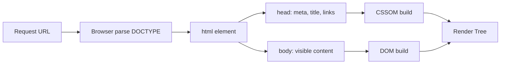

#### Interview Question
**Q:** DOCTYPE declaration kyun zaruri hai aur agar miss kar dein to kya hota hai?

**A:** DOCTYPE browser ko render mode batata hai. HTML5 mein simple `<!DOCTYPE html>` likhne se "standards mode" activate hota hai jisme CSS box model spec ke according kaam karta hai aur layout predictable rehta hai. Agar DOCTYPE miss ho jaye to browser "quirks mode" mein chala jata hai — ye legacy mode hai jisme IE5 era ki buggy behavior emulate hoti hai. Box width content + padding + border ke instead sirf content ho sakti hai, inline elements alag baseline pe sit kar sakte hain.

Production mein iska impact ye hota hai ki same code different browsers mein totally different dikh sakta hai. Modern frameworks (Next.js, Remix) automatic DOCTYPE inject karte hain, lekin agar tum static HTML serve kar rahe ho ya custom SSR likh rahe ho to manually dalna padta hai. Tradeoff koi nahi hai — DOCTYPE always honi chahiye, koi cost nahi hai.

---

## 2. Semantic tags

### 2.1 header, nav, section, article, aside, footer, main

#### Definition (kya hai?)
Semantic tags wo HTML elements hain jinka naam hi unka role bata deta hai. `<div>` ka koi meaning nahi hai — bas ek box hai. Lekin `<nav>`, `<article>`, `<footer>` — ye browsers, screen readers, aur SEO crawlers ko clearly batate hain ki content ka kya purpose hai.

Real-life analogy: ek newspaper socho. Masthead (top with logo) `<header>` hai. Table of contents `<nav>` hai. Main story `<article>` hai. Sports section `<section>` hai. Ad column side mein `<aside>` hai. Bottom credits `<footer>` hai. Sab kuch labelled hai, koi confusion nahi.

#### Why?
Pehle log sab `<div class="header">`, `<div class="nav">` likhte the. Problem ye thi ki screen reader ko nahi pata ki kaunsa div nav hai. Search engines bhi bas guess karte the. Semantic tags accessibility (ARIA landmark roles automatic), SEO (better content understanding), aur code readability — teeno improve karte hain.

#### How?
Har page mein ek `<main>` hota hai (sirf ek, page ka primary content). `<header>` aur `<footer>` page-level ya section-level dono ho sakte hain. `<article>` self-contained content ke liye (blog post, product card). `<section>` thematic grouping ke liye. `<aside>` related but tangential content ke liye.

```html
<body>
  <header>
    <h1>Blog ka naam</h1>
    <nav>
      <a href="/">Home</a>
      <a href="/posts">Posts</a>
    </nav>
  </header>
  <main>
    <article>
      <h2>Post title</h2>
      <p>Content...</p>
    </article>
    <aside>Related posts</aside>
  </main>
  <footer>&copy; 2026</footer>
</body>
```

#### Real-life Example
News website ka full layout:

```html
<body>
  <header role="banner">
    <a href="/" aria-label="Home"></a>
    <nav aria-label="Primary">
      <ul>
        <li><a href="/politics">Politics</a></li>
        <li><a href="/tech">Tech</a></li>
      </ul>
    </nav>
  </header>

  <main>
    <article>
      <header>
        <h1>Election results 2026</h1>
        <time datetime="2026-04-30">30 April 2026</time>
      </header>
      <section>
        <h2>State-wise breakdown</h2>
        <p>Maharashtra mein...</p>
      </section>
      <footer>By Reporter Name</footer>
    </article>

    <aside aria-label="Related stories">
      <h2>Related</h2>
      <ul><li><a href="/...">Story 1</a></li></ul>
    </aside>
  </main>

  <footer>
    <small>&copy; 2026 NewsCorp</small>
  </footer>
</body>
```

#### Diagram
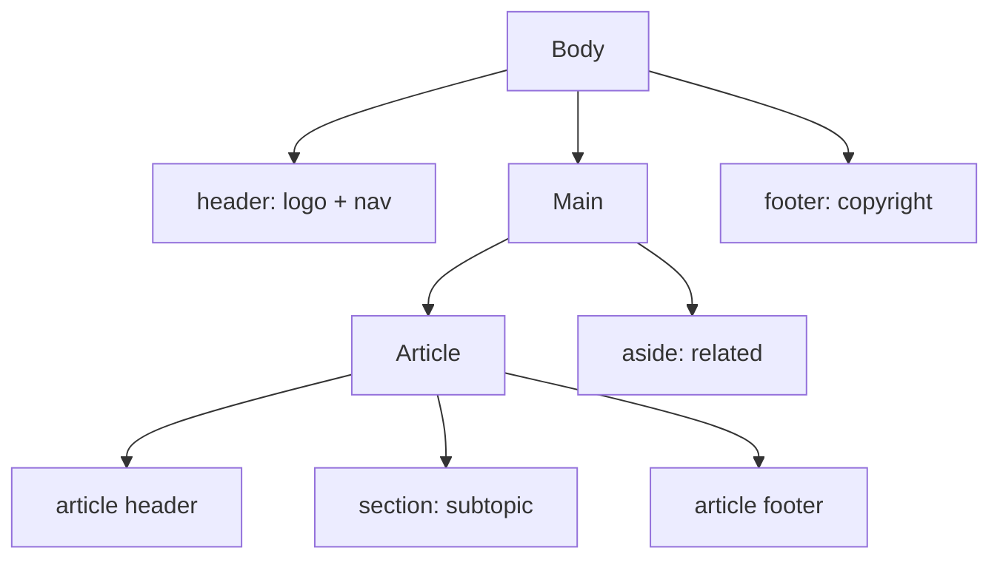

#### Interview Question
**Q:** `<section>` aur `<article>` mein difference kya hai? Kab kya use karoge?

**A:** `<article>` self-contained content hai jo independently distribute kiya ja sake — blog post, news story, product card, comment. Agar tum content ko RSS feed mein dalo ya alag context mein dikhao to bhi sense banta ho, to article use karo. `<section>` ek thematic grouping hai jo apne aap mein independent nahi — jaise article ke andar "Introduction", "Conclusion" sections. Section ka rule ye hai ki uska heading hona chahiye.

Practical tradeoff: agar confused ho to `<div>` use karna better hai bajay galat semantic tag ke. Galat semantic tag se accessibility tree confuse ho jata hai. Example — homepage par "Featured Products" agar standalone cards ka group hai to wrapper `<section>` hoga aur har card `<article>`. Lekin agar ye sirf visual grouping hai bina semantic meaning ke, to plain `<div>` chalega.

---

## 3. Text & inline elements

### 3.1 Text & inline tags (p, span, em, strong, br, hr, abbr, code, kbd)

#### Definition (kya hai?)
Text-level elements wo hain jo content ke chote chote pieces ko meaning dete hain. `<p>` paragraph hai (block). Baaki sab inline hote hain — line ke beech mein flow karte hain. `<em>` emphasis (italic + meaning), `<strong>` strong importance (bold + meaning), `<br>` line break, `<hr>` thematic break, `<abbr>` abbreviation, `<code>` code snippet, `<kbd>` keyboard input.

Real-life analogy: ek book ke andar tum highlighter use karte ho. Yellow highlight = strong, italics = em, footnote = abbr title. Har highlight ka apna meaning hai — sirf decoration nahi.

#### Why?
Visual styling CSS se aati hai (`<i>` and `<b>` purely visual hain), lekin meaning ke liye `<em>` aur `<strong>` use karte hain. Screen reader `<strong>` ko emphasized tone mein padhta hai. `<abbr title="HyperText Markup Language">HTML</abbr>` user ko hover pe full form dikhata hai aur AT ko bhi.

#### How?
Inline elements text flow ke andar baith jate hain. Block elements (`<p>`, `<hr>`) line break dete hain. `<br>` use sirf jab line break content ka part ho (poem, address) — paragraph break ke liye nahi.

```html
<p>
  <strong>Warning:</strong> ye <em>kabhi bhi</em> production mein
  use mat karna. Press <kbd>Ctrl</kbd>+<kbd>C</kbd> to cancel.
</p>
<p>
  <abbr title="Application Programming Interface">API</abbr> ka full form.
</p>
<hr />
<p>Run <code>npm install</code> in terminal.</p>
```

#### Real-life Example
Documentation page snippet:

```html
<article>
  <h2>Installation</h2>
  <p>
    Sabse pehle <strong>Node.js 20+</strong> install karo. Verify karne ke liye
    terminal mein <code>node --version</code> chala. Agar version 20 se kam hai
    to <em>upgrade zaruri hai</em>.
  </p>
  <p>
    Shortcut: <kbd>Cmd</kbd>+<kbd>Shift</kbd>+<kbd>P</kbd> dabakar VS Code ka
    command palette kholo. Search karo
    <abbr title="Node Version Manager">NVM</abbr>: install Node.
  </p>
  <hr />
  <p>
    Reference: 
    <a href="https://nodejs.org">official site</a>.<br />
    Last updated: 30 April 2026.
  </p>
</article>
```

#### Diagram
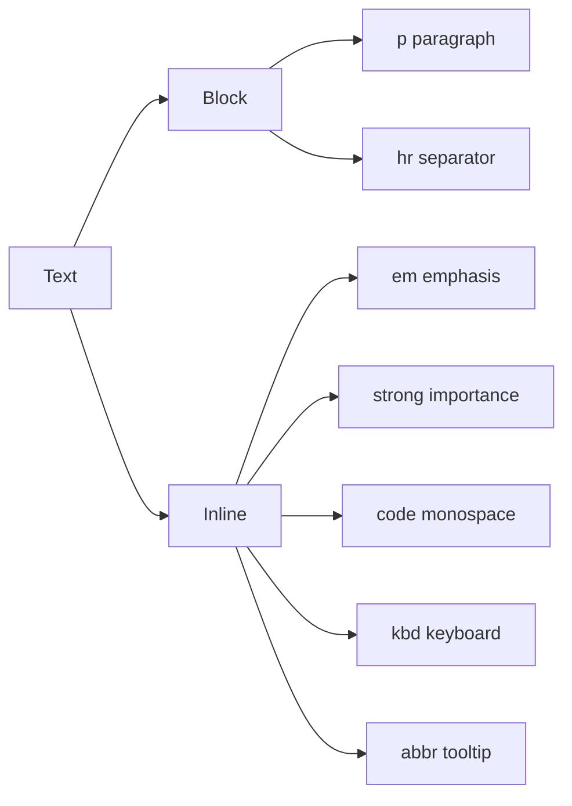

#### Interview Question
**Q:** `<b>` vs `<strong>` aur `<i>` vs `<em>` mein difference batao.

**A:** `<b>` aur `<i>` purely presentational hain — bold aur italic visual styling. Inka semantic meaning nahi hota. `<strong>` aur `<em>` semantic hain — strong importance aur emphasis. Visually dono jodi same dikhti hain by default (bold/italic), lekin assistive tech alag handle karti hai. Screen reader `<strong>` pe vocal stress dega, `<b>` pe nahi.

Production mein rule ye hai: agar tum content ko emphasize kar rahe ho meaning ke liye to em/strong. Agar sirf visual differentiation chahiye (jaise book title italics mein hota hai convention ke liye, ya keyword bold), to `<i>`/`<b>` acceptable hai. HTML5 spec ne `<i>` redefine kiya hai — "alternate voice or mood" (jaise foreign words, technical terms). To dono valid hain, lekin galat use karna common mistake hai. Best practice: doubt ho to em/strong use karo aur CSS se visual control karo.

---

## 4. Links & navigation

### 4.1 Anchor tags (href, target, rel)

#### Definition (kya hai?)
`<a>` anchor tag web ka core hai — bina iske web "web" hi nahi hota. `href` destination batata hai (URL, fragment, mailto, tel). `target` batata hai kahan kholna hai (`_self` default, `_blank` new tab). `rel` relationship describe karta hai source aur target mein.

Real-life analogy: anchor ek doorway hai. href door ka address hai. target batata hai door usi room mein khulta hai ya naye room mein. rel batata hai ye door trusted hai ya nahi (like security check).

#### Why?
Sirf `target="_blank"` lagana security risk hai. Naya tab tumhari window pe `window.opener` se access kar sakta hai aur phishing kar sakta hai (tabnabbing). Isliye `rel="noopener noreferrer"` mandatory hai external links ke liye. SEO mein `rel="nofollow"`, `rel="sponsored"`, `rel="ugc"` Google ko crawling hints dete hain.

#### How?
```html
<!-- internal link -->
<a href="/about">About</a>

<!-- fragment / anchor -->
<a href="#section-2">Jump to section</a>

<!-- external, secure new tab -->
<a href="https://example.com" target="_blank" rel="noopener noreferrer">
  External
</a>

<!-- email & phone -->
<a href="mailto:hi@example.com">Email</a>
<a href="tel:+919999999999">Call</a>

<!-- download -->
<a href="/file.pdf" download="report.pdf">Download PDF</a>
```

#### Real-life Example
E-commerce product page:

```html
<nav aria-label="Breadcrumb">
  <ol>
    <li><a href="/">Home</a></li>
    <li><a href="/electronics">Electronics</a></li>
    <li aria-current="page">iPhone 17</li>
  </ol>
</nav>

<section>
  <h2>Reviews</h2>
  <a href="#all-reviews">All 1,200 reviews</a>

  <p>
    Buy with EMI:
    <a
      href="https://bank.example.com/emi"
      target="_blank"
      rel="noopener noreferrer sponsored"
    >
      Bank EMI options
    </a>
  </p>

  <p>
    Stuck? <a href="mailto:support@shop.com?subject=Order%20help">Email us</a>
  </p>
</section>
```

#### Diagram
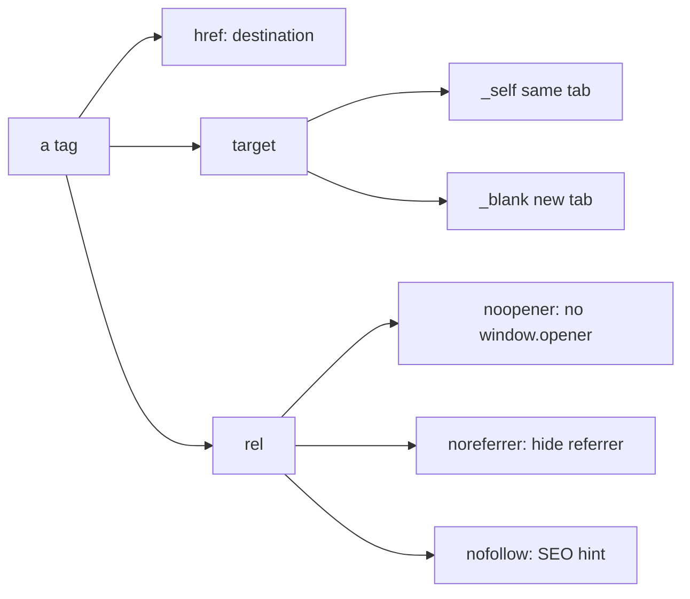

### 4.2 Internal vs external navigation

#### Definition (kya hai?)
Internal navigation tumhari hi site ke andar movement hai (`/about`, `#features`). External external sites pe le jata hai (`https://google.com`). Dono ka UX, security, aur SEO treatment alag hota hai.

Real-life analogy: ghar ke andar ka door internal hai — chabi ki zarurat nahi, free movement. External door bahar le jata hai — ID check, lock, security camera.

#### Why?
Internal links mein tum SPA frameworks (React Router, Next Link) use karke client-side navigation kar sakte ho — full reload nahi hota, fast feel hota hai. External links new tab mein khole jaate hain often, aur security headers (rel) lagaye jate hain.

#### How?
```html
<!-- Internal: relative URL, same site -->
<a href="/dashboard">Dashboard</a>

<!-- Internal fragment: same page jump -->
<a href="#pricing">Pricing</a>

<!-- External: full URL + security rel -->
<a
  href="https://twitter.com/user"
  target="_blank"
  rel="noopener noreferrer external"
>
  Twitter
</a>
```

#### Real-life Example
SaaS landing page navigation:

```html
<header>
  <nav aria-label="Primary">
    <a href="/" aria-current="page">Home</a>
    <a href="/pricing">Pricing</a>
    <a href="#features">Features</a>
    <a href="/docs">Docs</a>
    <a
      href="https://github.com/myorg/repo"
      target="_blank"
      rel="noopener noreferrer"
    >
      GitHub
    </a>
  </nav>
</header>
<main id="features">
  <h2>Features</h2>
</main>
```

#### Diagram
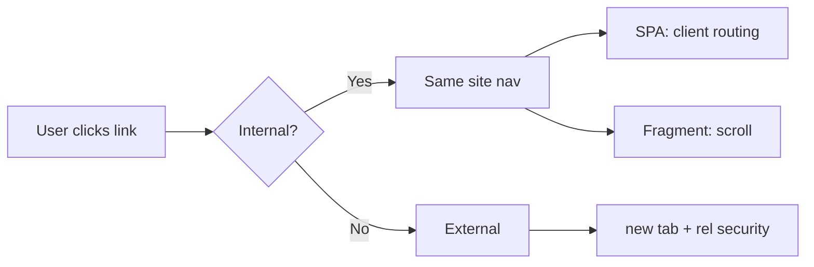

#### Interview Question
**Q:** `target="_blank"` ke saath `rel="noopener noreferrer"` kyun lagana padta hai?

**A:** Jab tum `target="_blank"` lagate ho, naya tab open hota hai jisme `window.opener` property pointer rakhti hai original page ka. Malicious site `window.opener.location = 'phishing-site'` chala kar tumhari original tab redirect kar sakti hai — user wapis aaye to fake login dikhe. Isko "tabnabbing" attack bolte hain. `rel="noopener"` ye reference null kar deta hai, attack block.

`noreferrer` additionally HTTP `Referer` header bhi suppress karta hai — destination ko nahi pata chalega user kahan se aaya. Ye privacy ke liye useful hai. Modern browsers (Chrome 88+, Firefox 79+) automatically `noopener` apply karte hain new tabs pe, lekin explicitly likhna best practice hai backwards compatibility ke liye. Tradeoff ye hai ki `noreferrer` analytics break kar sakta hai (destination ko traffic source nahi pata chalega) — to internal trusted partners ke liye sirf `noopener` kaafi hai.

---

## 5. Media

### 5.1 img with alt, srcset, picture, lazy loading

#### Definition (kya hai?)
`` image embed karta hai. `alt` text accessibility aur fallback ke liye mandatory hai. `srcset` browser ko multiple resolutions deta hai — DPR (device pixel ratio) ke hisaab se best chunti hai. `<picture>` element art direction allow karta hai (mobile pe alag crop, desktop pe alag). `loading="lazy"` browser ko bolta hai viewport mein aane par load karo.

Real-life analogy: ek photo album hai. alt = caption (jo blind person ke liye padhe). srcset = same photo ki different sizes (wallet size, A4, poster) — jiska device chahiye wo le. picture = tum mobile par square crop dete ho aur desktop par wide.

#### Why?
Mobile pe 4K image bhejna data ka waste aur slow. srcset bandwidth save karta hai. alt text screen reader users ke liye accessibility, aur agar image fail ho to text dikhata hai. Lazy loading initial page load fast karta hai — below-fold images defer hoti hain.

#### How?
```html
<!-- basic -->


<!-- responsive with srcset -->


<!-- picture for art direction + format -->
<picture>
  <source type="image/avif" srcset="hero.avif" />
  <source type="image/webp" srcset="hero.webp" />
  <source media="(max-width: 600px)" srcset="hero-mobile.jpg" />
  
</picture>
```

#### Real-life Example
Product listing card:

```html
<article class="product-card">
  <a href="/product/123">
    <picture>
      <source
        type="image/avif"
        srcset="/p/123-400.avif 400w, /p/123-800.avif 800w"
        sizes="(max-width: 768px) 100vw, 400px"
      />
      
    </picture>
    <h3>Nike Air Max</h3>
    <p>Rs 7,999</p>
  </a>
</article>
```

`width` aur `height` dena CLS (Cumulative Layout Shift) prevent karta hai — browser space reserve kar leta hai.

#### Diagram
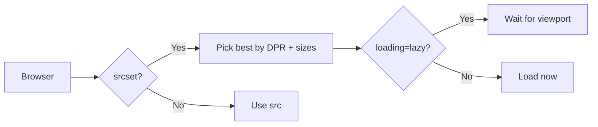

### 5.2 audio, video, sources, captions

#### Definition (kya hai?)
`<audio>` aur `<video>` HTML5 mein native media playback dete hain — pehle Flash needed tha. `<source>` multiple formats provide karta hai for browser compatibility. `<track>` captions, subtitles, descriptions ke liye — accessibility critical.

Real-life analogy: cinema hall mein movie chalti hai (video), background mein music (audio), niche subtitles (track). Sab synchronized.

#### Why?
Different browsers different codecs support karte hain (Safari .mov prefer, Chrome .webm). Multiple sources se compatibility milti hai. Captions deaf users, noisy environments, aur SEO (Google reads caption files) — sab ke liye critical.

#### How?
```html
<video
  controls
  preload="metadata"
  poster="/thumb.jpg"
  width="640"
  height="360"
>
  <source src="movie.webm" type="video/webm" />
  <source src="movie.mp4" type="video/mp4" />
  <track
    kind="captions"
    src="captions-hi.vtt"
    srclang="hi"
    label="Hindi"
    default
  />
  <track kind="captions" src="captions-en.vtt" srclang="en" label="English" />
  <p>Tumhara browser video support nahi karta. <a href="movie.mp4">Download</a></p>
</video>

<audio controls preload="none">
  <source src="podcast.opus" type="audio/ogg; codecs=opus" />
  <source src="podcast.mp3" type="audio/mpeg" />
</audio>
```

#### Real-life Example
YouTube-style player:

```html
<figure>
  <video
    id="lecture-1"
    controls
    preload="metadata"
    poster="/lectures/1-thumb.jpg"
    crossorigin="anonymous"
    playsinline
  >
    <source src="/lectures/1-1080.webm" type="video/webm" media="(min-width: 1080px)" />
    <source src="/lectures/1-720.webm" type="video/webm" />
    <source src="/lectures/1-720.mp4" type="video/mp4" />
    <track kind="subtitles" src="/lectures/1-hi.vtt" srclang="hi" label="Hindi" default />
    <track kind="subtitles" src="/lectures/1-en.vtt" srclang="en" label="English" />
    <track kind="descriptions" src="/lectures/1-desc.vtt" srclang="en" label="Audio descriptions" />
  </video>
  <figcaption>Lecture 1: HTML basics</figcaption>
</figure>
```

VTT file structure:
```
WEBVTT

00:00:01.000 --> 00:00:04.000
Namaste, aaj hum HTML seekhenge.

00:00:04.500 --> 00:00:08.000
Sabse pehle DOCTYPE declaration.
```

#### Diagram
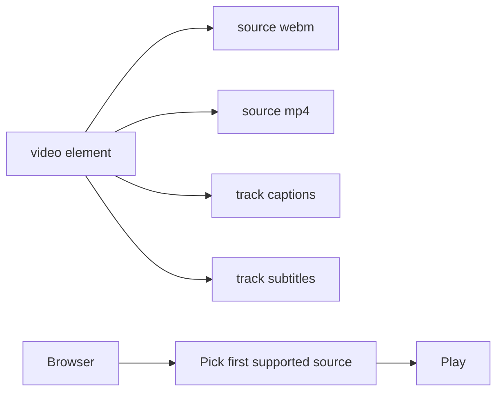

#### Interview Question
**Q:** `<picture>` aur `` mein kab kya use karte ho?

**A:** `srcset` purely resolution switching ke liye — same image ki different sizes, browser DPR aur viewport ke hisaab se best chunta hai. Use case: ek hero image jo har device pe same composition rakhe, bas resolution adjust ho. `sizes` attribute browser ko hint deta hai actual rendered width ke baare mein.

`<picture>` art direction aur format negotiation ke liye. Art direction means mobile pe portrait crop, desktop pe wide landscape — image ki composition badalti hai. Format negotiation means AVIF/WebP modern browsers ko, JPEG fallback. `<picture>` ke andar `<source>` multiple conditions handle karta hai (media queries, type). Tradeoff: `<picture>` zyada verbose hai. Agar sirf resolution issue hai to `srcset` simple aur enough. Agar composition change ho ya format optimization chahiye to `<picture>`. Real apps mein dono combine hote hain — `<picture>` outer wrapper, andar `` fallback.

---

## 6. Lists & tables

### 6.1 ul, ol, dl semantics

#### Definition (kya hai?)
`<ul>` unordered list (bullets, order matter nahi karta). `<ol>` ordered list (numbered, sequence important). `<dl>` description list (term-definition pairs). Inka semantic meaning hota hai — screen reader announces "list with 5 items".

Real-life analogy: shopping list (ul, order doesn't matter), recipe steps (ol, order matters), dictionary entry (dl, word + meaning).

#### Why?
`<div>` mein bullets daalna visually possible hai but accessibility tree mein wo list nahi hai. Screen reader user ko "5 items" announcement nahi milegi, navigation shortcuts nahi chalenge. Semantic lists structure preserve karte hain.

#### How?
```html
<ul>
  <li>Apple</li>
  <li>Banana</li>
</ul>

<ol start="3" reversed>
  <li>Third step</li>
  <li>Second step</li>
</ol>

<dl>
  <dt>HTML</dt>
  <dd>HyperText Markup Language</dd>
  <dt>CSS</dt>
  <dd>Cascading Style Sheets</dd>
</dl>
```

#### Real-life Example
Recipe page:

```html
<article>
  <h2>Maggi Recipe</h2>

  <h3>Ingredients</h3>
  <ul>
    <li>1 packet Maggi</li>
    <li>2 cups water</li>
    <li>Onion, optional</li>
  </ul>

  <h3>Steps</h3>
  <ol>
    <li>Water boil karo</li>
    <li>Maggi aur masala daalo</li>
    <li>2 minute cook</li>
    <li>Serve garam garam</li>
  </ol>

  <h3>Glossary</h3>
  <dl>
    <dt>Tadka</dt>
    <dd>Tempering with hot oil and spices</dd>
    <dt>Masala</dt>
    <dd>Spice mix that comes with the packet</dd>
  </dl>
</article>
```

### 6.2 table semantics (thead, tbody, scope, caption)

#### Definition (kya hai?)
`<table>` tabular data ke liye hai — rows aur columns ka relationship matter karta hai. `<caption>` table ka title/description. `<thead>`, `<tbody>`, `<tfoot>` structural grouping. `<th scope="col|row">` header cells declare karta hai aur batata hai header column ka hai ya row ka.

Real-life analogy: Excel sheet jaisa. Top row column headers, leftmost column row labels, baaki cells data. Caption sheet ka title.

#### Why?
Layout ke liye table use mat karna (CSS grid/flex hai). Tables sirf data ke liye. `scope` screen reader ko batata hai cell kis header se relate karti hai — complex tables mein critical accessibility.

#### How?
```html
<table>
  <caption>Class 10 result 2026</caption>
  <thead>
    <tr>
      <th scope="col">Roll</th>
      <th scope="col">Name</th>
      <th scope="col">Marks</th>
    </tr>
  </thead>
  <tbody>
    <tr>
      <th scope="row">1</th>
      <td>Aarav</td>
      <td>92</td>
    </tr>
    <tr>
      <th scope="row">2</th>
      <td>Priya</td>
      <td>88</td>
    </tr>
  </tbody>
  <tfoot>
    <tr>
      <th scope="row" colspan="2">Average</th>
      <td>90</td>
    </tr>
  </tfoot>
</table>
```

#### Real-life Example
Pricing comparison:

```html
<table>
  <caption>Subscription plans comparison</caption>
  <colgroup>
    <col />
    <col span="3" class="plans" />
  </colgroup>
  <thead>
    <tr>
      <th scope="col">Feature</th>
      <th scope="col">Free</th>
      <th scope="col">Pro</th>
      <th scope="col">Enterprise</th>
    </tr>
  </thead>
  <tbody>
    <tr>
      <th scope="row">Storage</th>
      <td>1 GB</td>
      <td>50 GB</td>
      <td>Unlimited</td>
    </tr>
    <tr>
      <th scope="row">Support</th>
      <td>Community</td>
      <td>Email</td>
      <td>24x7 phone</td>
    </tr>
    <tr>
      <th scope="row">Price/month</th>
      <td>0</td>
      <td>499</td>
      <td>Custom</td>
    </tr>
  </tbody>
</table>
```

#### Diagram
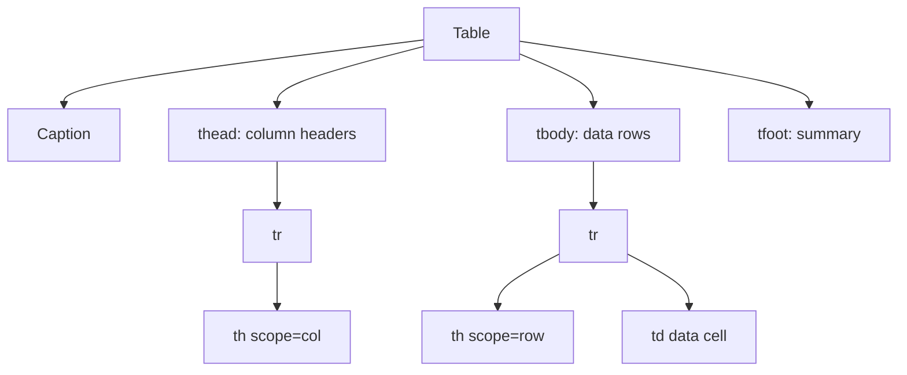

#### Interview Question
**Q:** Layout ke liye `<table>` use karna kyun bad practice hai?

**A:** 90s aur early 2000s mein log layout ke liye tables use karte the kyunki CSS mature nahi tha. Lekin semantically `<table>` data relationships represent karta hai. Screen reader user ko bolega "table with 3 rows and 4 columns" — agar wo actually layout hai data nahi, to user confused ho jayega aur table navigation shortcuts irrelevant info denge.

Modern alternatives — CSS Grid aur Flexbox — purpose-built hain layout ke liye, responsive easily ban jata hai, source order content order hota hai (accessibility friendly), aur smaller HTML output. Tables responsive banana headache hai (horizontal scroll, stacking). Tradeoff sirf ek hai — emails! HTML emails mein CSS support patchy hai aur tables abhi bhi standard hain layout ke liye. Web pages mein table = data only, hamesha.

---

## 7. Forms

### 7.1 Input types

#### Definition (kya hai?)
`<input>` user se data leta hai. `type` attribute behavior decide karta hai — text, email, password, number, date, file, checkbox, radio, range, color, tel, url, search, hidden. HTML5 ne bohot naye types diye jo mobile keyboards optimize karte hain aur browser-level validation dete hain.

Real-life analogy: form ek questionnaire hai. Type batata hai kis tarah ka jawab chahiye — naam (text), email (validate format), DOB (date picker), photo (file upload), gender (radio).

#### Why?
Mobile pe `type="email"` keyboard mein @ key dikhata hai. `type="number"` numeric keypad. `type="date"` native picker. `type="tel"` phone keypad. UX 10x improve hoti hai bina JS likhne ke. Plus browser-level validation free milti hai.

#### How?
```html
<form>
  <input type="text" name="name" />
  <input type="email" name="email" />
  <input type="password" name="pwd" autocomplete="current-password" />
  <input type="number" name="age" min="18" max="100" />
  <input type="date" name="dob" />
  <input type="tel" name="phone" />
  <input type="url" name="website" />
  <input type="file" name="resume" accept=".pdf,.doc" />
  <input type="checkbox" name="terms" />
  <input type="radio" name="gender" value="m" />
  <input type="range" name="volume" min="0" max="100" />
  <input type="color" name="theme" />
  <input type="search" name="q" />
  <input type="hidden" name="csrf" value="abc123" />
</form>
```

### 7.2 Validation (required, pattern, min/max)

#### Definition (kya hai?)
HTML5 mein built-in validation aati hai bina JS ke. `required` field mandatory banata hai. `pattern` regex validate karta hai. `min`, `max`, `minlength`, `maxlength` constraints lagate hain. `:invalid`, `:valid` CSS pseudo-classes se styling control milti hai.

#### Why?
Pehle har validation JS mein likhni padti thi. Ab basic checks browser handle karta hai, server-side validation ke saath defense in depth. UX bhi behtar — submit pe instant feedback, accessible error messages.

#### How?
```html
<form>
  <input
    type="email"
    name="email"
    required
    placeholder="you@example.com"
  />
  <input
    type="text"
    name="pincode"
    required
    pattern="[0-9]{6}"
    title="6-digit Indian pincode"
  />
  <input
    type="number"
    name="age"
    required
    min="18"
    max="120"
  />
  <input
    type="text"
    name="username"
    minlength="3"
    maxlength="20"
    required
  />
  <button type="submit">Submit</button>
</form>

<style>
  input:invalid { border-color: red; }
  input:valid { border-color: green; }
  input:user-invalid { background: pink; }
</style>
```

> **Important:** Client-side validation NEVER trust kar — server-side bhi validate kar. User easily bypass kar sakta hai DevTools se.

### 7.3 Labels, fieldset, legend, accessibility

#### Definition (kya hai?)
`<label>` input ko text se associate karta hai. Click on label = focus on input. Screen reader label padh ke batata hai input ka purpose. `<fieldset>` related inputs ko group karta hai, `<legend>` group ka title.

#### Why?
Bina label ke screen reader user ko nahi pata input kya hai. Mobile pe label tap karne se input focus hota hai — bigger touch target. Fieldset radio buttons jaise grouped inputs ke liye essential.

#### How?
```html
<form>
  <!-- explicit label with for/id -->
  <label for="email">Email</label>
  <input type="email" id="email" name="email" required />

  <!-- implicit (label wraps input) -->
  <label>
    Password
    <input type="password" name="pwd" />
  </label>

  <fieldset>
    <legend>Gender</legend>
    <label><input type="radio" name="g" value="m" /> Male</label>
    <label><input type="radio" name="g" value="f" /> Female</label>
    <label><input type="radio" name="g" value="o" /> Other</label>
  </fieldset>

  <!-- aria-describedby for help text -->
  <label for="pwd2">New password</label>
  <input
    type="password"
    id="pwd2"
    aria-describedby="pwd-help"
    minlength="8"
  />
  <small id="pwd-help">Minimum 8 characters</small>
</form>
```

### 7.4 Form submission (GET vs POST, multipart)

#### Definition (kya hai?)
Form `action` URL pe submit hota hai `method` ke through. `GET` query string mein data bhejta hai (URL mein dikhta hai), `POST` body mein. `enctype="multipart/form-data"` file uploads ke liye mandatory.

Real-life analogy: GET = postcard (sab dikh raha hai address ke saath), POST = sealed envelope (body andar). Multipart = courier with multiple items, har item alag wrapping mein.

#### Why?
GET idempotent hai — same request kitni baar bhejo same result. Search forms, filters ke liye perfect kyunki URL bookmark/share ho sakti hai. POST state change ke liye — login, signup, file upload. Multipart binary data (files) ko properly encode karta hai.

#### How?
```html
<!-- GET: search form -->
<form action="/search" method="get">
  <input type="search" name="q" />
  <input type="hidden" name="page" value="1" />
  <button>Search</button>
</form>
<!-- submits to /search?q=hello&page=1 -->

<!-- POST: login -->
<form action="/login" method="post" autocomplete="on">
  <input type="email" name="email" autocomplete="username" required />
  <input type="password" name="password" autocomplete="current-password" required />
  <button>Login</button>
</form>

<!-- POST multipart: file upload -->
<form action="/upload" method="post" enctype="multipart/form-data">
  <input type="file" name="resume" accept=".pdf" required />
  <input type="text" name="title" required />
  <button>Upload</button>
</form>
```

#### Real-life Example
Signup form with all best practices:

```html
<form action="/api/signup" method="post" novalidate>
  <fieldset>
    <legend>Account details</legend>

    <label for="su-name">Full name</label>
    <input
      type="text"
      id="su-name"
      name="name"
      required
      minlength="2"
      autocomplete="name"
    />

    <label for="su-email">Email</label>
    <input
      type="email"
      id="su-email"
      name="email"
      required
      autocomplete="email"
      aria-describedby="email-help"
    />
    <small id="email-help">Verification link bhejenge</small>

    <label for="su-pwd">Password</label>
    <input
      type="password"
      id="su-pwd"
      name="password"
      required
      minlength="8"
      pattern="(?=.*[A-Z])(?=.*[0-9]).{8,}"
      autocomplete="new-password"
      aria-describedby="pwd-help"
    />
    <small id="pwd-help">8+ chars, 1 uppercase, 1 number</small>
  </fieldset>

  <fieldset>
    <legend>Account type</legend>
    <label><input type="radio" name="type" value="personal" required /> Personal</label>
    <label><input type="radio" name="type" value="business" /> Business</label>
  </fieldset>

  <label>
    <input type="checkbox" name="terms" required />
    I agree to <a href="/terms">terms</a>
  </label>

  <input type="hidden" name="csrf_token" value="..." />
  <button type="submit">Create account</button>
</form>
```

#### Diagram
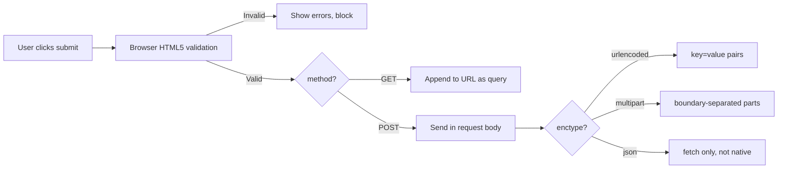

#### Interview Question
**Q:** GET aur POST mein difference, aur kab kaunsa use karoge?

**A:** GET request idempotent hai — server state change nahi karti, sirf data fetch karti hai. Parameters URL ke query string mein jate hain, isliye browser history mein dikhte hain, bookmark ho sakte hain, share ho sakte hain. URL length limit hota hai (~2KB practical), aur sensitive data (password) GET mein bhejna galat hai kyunki logs aur referrer headers mein dikhega.

POST request body mein data bhejti hai, URL clean rehta hai, length limit zyada (server config dependent, usually MB+). Side-effecting actions ke liye — create, update, delete, payment. CSRF protection zaruri hota hai POST forms mein. Multipart enctype tabhi use jab file upload ho — base64 inline karna inefficient hota hai.

Tradeoff: search/filter forms ke liye GET use karo taaki user filtered results bookmark/share kar sake. Login, signup, payment, comment posting ke liye POST. RESTful APIs mein GET=read, POST=create, PUT/PATCH=update, DELETE=delete — HTML forms natively sirf GET/POST support karte hain, baaki ke liye JS fetch ya `<form>` mein hidden field se override karna padta hai (Rails-style `_method`).

---

## 8. SEO basics

### 8.1 meta tags, title, description, canonical, OG tags

#### Definition (kya hai?)
`<title>` browser tab aur Google results mein dikhta hai. `<meta name="description">` SERP snippet. `<link rel="canonical">` duplicate content ka master URL declare karta hai. Open Graph (`og:*`) social sharing previews ke liye — Facebook, LinkedIn, WhatsApp ye padhte hain. Twitter ke apne `twitter:*` tags hain.

Real-life analogy: book ka cover page hai. Title book ka naam, description back cover summary, OG tags catalog entry jo libraries share karte hain.

#### Why?
Search engines aur social platforms HTML download karke metadata extract karte hain. Bina sahi tags ke tumhari site Google mein bad snippet dikhayegi, WhatsApp pe link share hoga to ugly preview. Canonical na ho to duplicate URLs (`?utm=...` etc) SEO weight split kar dete hain.

#### How?
```html
<head>
  <title>Best Pizza in Mumbai - Pizza Hub</title>
  <meta name="description" content="Order fresh wood-fired pizzas in 30 mins. Free delivery in Mumbai." />
  <link rel="canonical" href="https://pizzahub.com/mumbai" />

  <!-- Open Graph -->
  <meta property="og:title" content="Best Pizza in Mumbai" />
  <meta property="og:description" content="Order fresh wood-fired pizzas in 30 mins" />
  <meta property="og:image" content="https://pizzahub.com/og.jpg" />
  <meta property="og:url" content="https://pizzahub.com/mumbai" />
  <meta property="og:type" content="website" />
  <meta property="og:locale" content="en_IN" />

  <!-- Twitter -->
  <meta name="twitter:card" content="summary_large_image" />
  <meta name="twitter:site" content="@pizzahub" />

  <!-- Other useful -->
  <meta name="robots" content="index, follow" />
  <meta name="theme-color" content="#ff5722" />
</head>
```

#### Real-life Example
Blog post:

```html
<head>
  <title>How to learn React in 2026 | DevBlog</title>
  <meta name="description" content="Step-by-step guide for absolute beginners. Build 3 projects in 30 days." />
  <link rel="canonical" href="https://devblog.com/react-2026" />

  <meta property="og:title" content="How to learn React in 2026" />
  <meta property="og:description" content="Step-by-step guide for absolute beginners" />
  <meta property="og:image" content="https://devblog.com/img/react-2026-og.jpg" />
  <meta property="og:image:width" content="1200" />
  <meta property="og:image:height" content="630" />
  <meta property="og:type" content="article" />
  <meta property="article:published_time" content="2026-01-15T10:00:00Z" />
  <meta property="article:author" content="Ratnesh Sharma" />
  <meta property="article:tag" content="React" />

  <meta name="twitter:card" content="summary_large_image" />
  <meta name="twitter:creator" content="@ratnesh" />

  <!-- Structured data -->
  <script type="application/ld+json">
  {
    "@context": "https://schema.org",
    "@type": "BlogPosting",
    "headline": "How to learn React in 2026",
    "datePublished": "2026-01-15",
    "author": { "@type": "Person", "name": "Ratnesh Sharma" }
  }
  </script>
</head>
```

#### Diagram
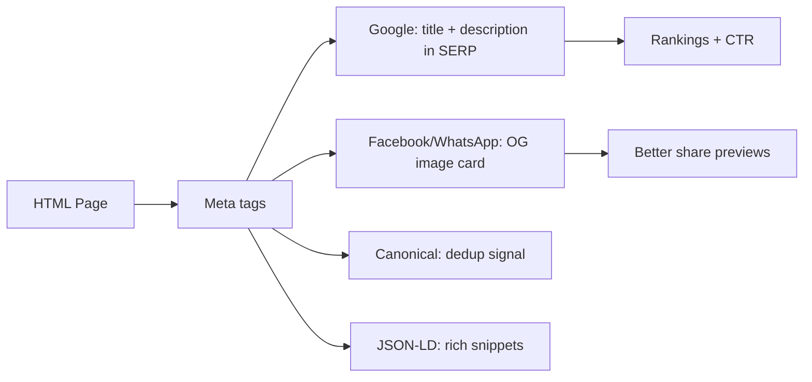

#### Interview Question
**Q:** Canonical URL kya hai aur kab use karte ho?

**A:** Canonical tag Google ko batata hai ki agar same content multiple URLs pe accessible hai, to "official" version kaunsa hai. Common scenarios — query parameters (`?utm_source=fb`, `?ref=email`), trailing slashes, www vs non-www, http vs https, sort/filter variations (`/products?sort=price`), aur paginated listings.

Bina canonical ke Google ye pages duplicate content samjhega aur ranking weight split kar dega — koi single URL strong rank nahi karega. Self-referential canonical (page ka apna URL canonical mein) bhi best practice hai consistency ke liye.

Tradeoff aur gotcha: canonical sirf "hint" hai, Google ignore bhi kar sakta hai agar content significantly different ho. Cross-domain canonical possible hai (syndicated content ke liye), lekin reverse proxy aur i18n setups mein careful rehna padta hai. Common bug — har page same canonical URL point kar raha ho (mistake from CMS template) — tab Google sirf ek page index karta hai. Hreflang ke saath combine karke international SEO handle hota hai.

---

## 9. Accessibility (ARIA)

### 9.1 ARIA roles, aria-label, aria-live, focus

#### Definition (kya hai?)
ARIA (Accessible Rich Internet Applications) attributes ka set hai jo assistive tech ko HTML elements ka role aur state describe karte hain. Roles (role="dialog", role="tablist") batate hain element kya hai. Properties (aria-label, aria-describedby) extra info dete hain. States (aria-expanded, aria-checked) current condition. Live regions (aria-live) dynamic updates announce karte hain.

Real-life analogy: ek building mein signs hote hain — "Exit", "Restroom", "Manager's office". ARIA wahi signs hain code mein for blind users using screen readers.

#### Why?
Native HTML elements (button, a, input) mein ARIA built-in hai. Lekin custom components (modal, dropdown, accordion) jo divs se bante hain unhe ARIA chahiye warna screen reader ko nahi pata ye interactive hai. WCAG compliance legal requirement hai bohot countries mein.

> **Rule of ARIA:** No ARIA is better than bad ARIA. Native HTML use karo jab possible. Custom widgets banao tab ARIA add karo.

#### How?
```html
<!-- Custom button (better to use <button>) -->
<div role="button" tabindex="0" aria-label="Close dialog">×</div>

<!-- Icon-only button needs label -->
<button aria-label="Search">
  <svg aria-hidden="true">...</svg>
</button>

<!-- Toggle state -->
<button aria-expanded="false" aria-controls="menu">Menu</button>
<ul id="menu" hidden>...</ul>

<!-- Live region for dynamic announcements -->
<div role="status" aria-live="polite">
  Cart updated: 3 items
</div>

<div role="alert" aria-live="assertive">
  Error: payment failed
</div>

<!-- Hide decorative content -->

<svg aria-hidden="true">...</svg>

<!-- Focus management -->
<input autofocus />
<button onclick="document.getElementById('next').focus()">Next</button>
```

#### Real-life Example
Modal dialog with full a11y:

```html
<button
  type="button"
  aria-haspopup="dialog"
  aria-expanded="false"
  aria-controls="confirm-modal"
  id="open-modal-btn"
>
  Delete account
</button>

<div
  id="confirm-modal"
  role="dialog"
  aria-modal="true"
  aria-labelledby="modal-title"
  aria-describedby="modal-desc"
  hidden
>
  <h2 id="modal-title">Delete account?</h2>
  <p id="modal-desc">
    Ye action permanent hai. Saari data delete ho jayegi.
  </p>
  <button type="button" id="cancel-btn">Cancel</button>
  <button type="button" id="confirm-btn">Yes, delete</button>
</div>

<!-- Live region for confirmation -->
<div role="status" aria-live="polite" id="toast"></div>
```

JS pseudocode:
- Open: focus first interactive element, trap focus inside modal
- Esc key: close modal, return focus to trigger button
- Background click outside: close
- Announce result via toast aria-live

#### Diagram
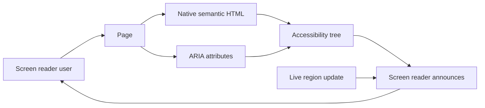

#### Interview Question
**Q:** `aria-label` aur `aria-labelledby` mein difference, kab kya use karoge?

**A:** `aria-label` directly string deta hai accessible name ke liye — `<button aria-label="Close">×</button>`. Useful jab visible text na ho ya icon-only button ho. String inline hai, translate karna manual hai i18n setup mein.

`aria-labelledby` ek ya zyada element IDs reference karta hai — `<div aria-labelledby="title-id desc-id">`. Useful jab label already visible hai page pe (heading ya text). Multiple IDs space-separated dene se concatenated label banta hai. Translation automatic hai kyunki visible content already translated hota hai.

Priority order accessible name calculation mein: aria-labelledby > aria-label > native (label, alt, title). Tradeoff: aria-label ko translation tools (Google Translate, Crowdin) miss kar sakte hain. Production rule — agar visible label exists, labelledby use karo. Agar visual label nahi hai (icon button), aria-label use karo. Dono ek saath laga diya to labelledby jeetega.

---

## 10. Canvas & SVG

### 10.1 Canvas 2D drawing

#### Definition (kya hai?)
`<canvas>` ek raster (pixel-based) drawing surface hai. JavaScript se draw karte ho — `getContext('2d')` se 2D context milta hai aur fir methods se shapes, images, text draw karte ho. Pixel-based hai, zoom karne pe blurry hota hai.

Real-life analogy: blank paper hai jisme tum pen se draw karte ho. Ek baar draw kar diya to paper pe pixel hai, individual stroke yaad nahi hai paper ko. Animation ke liye paper saaf karke firse draw karna padta hai.

#### Why?
Games, data viz with 1000s of points, image manipulation, video filters — yahan canvas perfect hai kyunki performance high hai (no DOM nodes per shape). Disadvantage — accessibility kharab (single image jaisa hai screen reader ko), zoom blur, no event handlers per shape.

#### How?
```html
<canvas id="game" width="400" height="300">
  Tumhara browser canvas support nahi karta.
</canvas>

<script>
  const canvas = document.getElementById('game');
  const ctx = canvas.getContext('2d');

  // Rectangle
  ctx.fillStyle = 'tomato';
  ctx.fillRect(20, 20, 100, 60);

  // Circle
  ctx.beginPath();
  ctx.arc(200, 100, 40, 0, Math.PI * 2);
  ctx.fillStyle = 'royalblue';
  ctx.fill();

  // Text
  ctx.font = '20px sans-serif';
  ctx.fillStyle = 'black';
  ctx.fillText('Hello Canvas', 50, 200);

  // Animation loop
  let x = 0;
  function frame() {
    ctx.clearRect(0, 0, canvas.width, canvas.height);
    ctx.fillRect(x, 50, 30, 30);
    x = (x + 2) % canvas.width;
    requestAnimationFrame(frame);
  }
  frame();
</script>
```

### 10.2 SVG primitives, when to use which

#### Definition (kya hai?)
SVG (Scalable Vector Graphics) XML-based vector format hai — har shape DOM node hai. Resolution-independent (vector hai, zoom karne pe sharp). CSS aur JS se manipulate hota hai. Primitives — `<rect>`, `<circle>`, `<line>`, `<polyline>`, `<polygon>`, `<path>`, `<text>`.

Real-life analogy: cookie cutter. Tumne shape define ki, system har size mein perfectly cut karta hai. Canvas pencil drawing hai, SVG mathematical formula.

#### Why?
Logos, icons, illustrations — jo crisp dikhne chahiye har resolution pe. Charts jahan har data point interactive ho. Animations CSS/SMIL se. File size chote diagrams ke liye small. Accessibility better — har shape ARIA le sakti hai.

#### How?
```html
<svg width="200" height="100" viewBox="0 0 200 100" role="img" aria-label="Sample shapes">
  <rect x="10" y="10" width="80" height="80" fill="tomato" rx="8" />
  <circle cx="140" cy="50" r="35" fill="royalblue" />
  <line x1="0" y1="100" x2="200" y2="100" stroke="black" />
  <path d="M 50 50 Q 100 0 150 50 T 250 50" stroke="green" fill="none" />
  <text x="60" y="55" fill="white">Hi</text>
</svg>

<!-- Inline SVG icon -->
<button aria-label="Search">
  <svg width="20" height="20" viewBox="0 0 24 24" aria-hidden="true">
    <circle cx="11" cy="11" r="8" fill="none" stroke="currentColor" stroke-width="2" />
    <path d="M21 21l-4.3-4.3" stroke="currentColor" stroke-width="2" />
  </svg>
</button>
```

#### Real-life Example
Interactive bar chart (SVG) vs particle effect (Canvas):

```html
<!-- SVG: interactive bar chart -->
<svg viewBox="0 0 300 150" role="img" aria-label="Sales chart">
  <g>
    <rect x="10" y="50" width="40" height="100" fill="steelblue">
      <title>Jan: 100</title>
    </rect>
    <rect x="60" y="30" width="40" height="120" fill="steelblue">
      <title>Feb: 120</title>
    </rect>
    <rect x="110" y="70" width="40" height="80" fill="steelblue">
      <title>Mar: 80</title>
    </rect>
  </g>
</svg>
```

```html
<!-- Canvas: 1000 particles animation -->
<canvas id="particles" width="600" height="400"></canvas>
<script>
  const c = document.getElementById('particles').getContext('2d');
  const parts = Array.from({ length: 1000 }, () => ({
    x: Math.random() * 600,
    y: Math.random() * 400,
    vx: (Math.random() - 0.5) * 2,
    vy: (Math.random() - 0.5) * 2,
  }));
  function tick() {
    c.fillStyle = 'rgba(0,0,0,0.1)';
    c.fillRect(0, 0, 600, 400);
    c.fillStyle = 'lime';
    parts.forEach(p => {
      p.x += p.vx; p.y += p.vy;
      if (p.x < 0 || p.x > 600) p.vx *= -1;
      if (p.y < 0 || p.y > 400) p.vy *= -1;
      c.fillRect(p.x, p.y, 2, 2);
    });
    requestAnimationFrame(tick);
  }
  tick();
</script>
```

#### Diagram
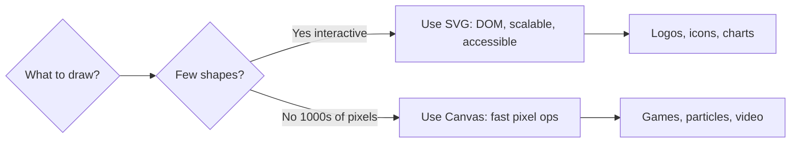

#### Interview Question
**Q:** Canvas vs SVG — kab kya choose karoge?

**A:** SVG choose karo jab — shapes few hain (under ~1000 nodes), interactivity per-shape chahiye (hover, click on individual elements), accessibility important hai (har shape DOM mein hai, ARIA lag sakta hai), output sharp chahiye har zoom level pe (logos, icons, charts), aur CSS animations use karne hain. Examples — D3.js charts, icon systems, illustrations.

Canvas choose karo jab — particles, sprites, ya pixels lakhon mein hain (DOM overhead mar dega), per-frame redraw karte ho (games, simulations), image/video manipulation kar rahe ho (filters, croppers), ya WebGL ke through 3D scenes (Three.js). Examples — Figma's editor, video editors, casual games, image processing.

Tradeoffs: SVG accessibility free deta hai but performance degrade hoti hai zyada nodes pe (browser har shape DOM mein insert karta hai). Canvas performant hai but accessibility manually banani padti hai (alternate text, fallback content). Dono combine bhi ho sakte hain — Canvas drawing surface, SVG overlay for UI controls. Mapbox aur similar mapping tools yahi pattern use karte hain.

---

## 11. Iframes

### 11.1 iframe, sandbox, postMessage, security

#### Definition (kya hai?)
`<iframe>` ek HTML page ke andar dusra HTML page embed karta hai — apna independent browsing context. YouTube videos, payment widgets, ads, embedded maps — sab iframes hain. Default mein same-origin policy enforce hoti hai cross-origin iframes pe.

Real-life analogy: tumhare ghar mein ek TV hai jo ek alag channel chala raha hai. Tum TV control kar sakte ho on/off, lekin TV ke andar ka content alag broadcaster ka hai — tum direct edit nahi kar sakte.

#### Why?
Third-party content embed karna ho without giving them access to your page — iframe perfect hai. YouTube, Stripe Checkout, reCAPTCHA — sab iframes use karte hain. Security boundary milti hai automatically (cross-origin isolation).

#### How?
```html
<!-- Basic embed -->
<iframe
  src="https://youtube.com/embed/abc"
  width="560"
  height="315"
  title="Tutorial video"
  loading="lazy"
  allowfullscreen
  referrerpolicy="strict-origin-when-cross-origin"
></iframe>

<!-- Sandboxed: most restrictive -->
<iframe
  src="/untrusted-user-content.html"
  sandbox
  title="User preview"
></iframe>

<!-- Sandbox with specific allowances -->
<iframe
  src="/preview.html"
  sandbox="allow-scripts allow-same-origin"
  title="Code preview"
></iframe>

<!-- Permissions Policy -->
<iframe
  src="https://maps.example.com"
  allow="geolocation; camera 'none'"
  title="Map"
></iframe>
```

Sandbox tokens — by default sab block: scripts, forms, popups, top navigation, same-origin, pointer lock. Specific allow karne ke liye `allow-scripts`, `allow-forms`, `allow-popups`, `allow-same-origin`, `allow-top-navigation`, `allow-modals`, `allow-presentation`.

`postMessage` cross-origin communication ke liye:

```html
<!-- Parent page -->
<iframe id="child" src="https://child.example.com/widget"></iframe>
<script>
  const iframe = document.getElementById('child');

  // Send message to iframe
  iframe.addEventListener('load', () => {
    iframe.contentWindow.postMessage(
      { type: 'INIT', user: 'aarav' },
      'https://child.example.com' // target origin, NEVER use *
    );
  });

  // Receive from iframe
  window.addEventListener('message', (event) => {
    // ALWAYS verify origin
    if (event.origin !== 'https://child.example.com') return;
    if (event.data.type === 'RESIZE') {
      iframe.style.height = event.data.height + 'px';
    }
  });
</script>
```

```html
<!-- Child iframe page -->
<script>
  window.addEventListener('message', (event) => {
    if (event.origin !== 'https://parent.example.com') return;
    if (event.data.type === 'INIT') {
      document.body.dataset.user = event.data.user;
    }
  });

  // Notify parent of size
  function reportSize() {
    parent.postMessage(
      { type: 'RESIZE', height: document.body.scrollHeight },
      'https://parent.example.com'
    );
  }
  reportSize();
</script>
```

#### Real-life Example
CodePen-style code preview iframe:

```html
<section>
  <h2>Code preview</h2>
  <iframe
    id="preview"
    title="Live code preview"
    sandbox="allow-scripts"
    srcdoc="<!DOCTYPE html><html><body><h1>Hello</h1><script>console.log('hi')</script></body></html>"
    loading="lazy"
    width="100%"
    height="400"
  ></iframe>
</section>

<script>
  // Update preview securely
  function updatePreview(userHTML) {
    const iframe = document.getElementById('preview');
    iframe.srcdoc = userHTML; // sandbox prevents script escaping
  }

  // Receive errors from iframe
  window.addEventListener('message', (e) => {
    // srcdoc iframe origin is "null" with sandbox
    if (e.source !== document.getElementById('preview').contentWindow) return;
    console.log('Iframe says:', e.data);
  });
</script>
```

Security checklist:
- `sandbox` lagao untrusted content pe
- `allow-same-origin` aur `allow-scripts` dono mat dena untrusted content pe (sandbox bypass possible)
- `postMessage` mein target origin specify karo, `*` mat use karo
- Receive side pe `event.origin` aur `event.source` dono verify karo
- Server side `X-Frame-Options: DENY` ya `Content-Security-Policy: frame-ancestors` se clickjacking prevent karo
- `referrerpolicy` strict rakho privacy ke liye
- `loading="lazy"` performance ke liye

#### Diagram
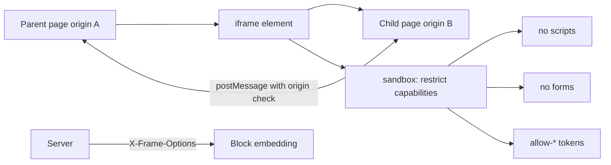

#### Interview Question
**Q:** Iframe security ke liye kya kya measures lete ho?

**A:** Multi-layered defense lagta hai. Pehle, `sandbox` attribute lagao untrusted content pe — by default sab restricted, specific tokens se allow karo selectively. Critical gotcha — `allow-same-origin` aur `allow-scripts` dono ek saath dene se sandbox effectively bypass ho jata hai (script parent page ka sandbox attribute remove kar sakta hai), to avoid karo agar content really untrusted hai.

Doosra, `postMessage` mein target origin always specify karo (`*` use mat karo) aur receiver side pe `event.origin` validate karo strictly. Bina origin check ke koi bhi iframe message bhej kar sensitive actions trigger kar sakta hai. `event.source` se sender iframe verify karo bhi.

Teesra, server-side headers — apni site ko embed hone se rokne ke liye `X-Frame-Options: DENY` ya modern `Content-Security-Policy: frame-ancestors 'self'` lagao. Ye clickjacking prevent karta hai jahan attacker tumhari site invisible iframe mein dalke clicks hijack karta hai. Permissions Policy (`allow="camera 'none'"`) iframe ke capabilities further restrict karta hai. `referrerpolicy="no-referrer"` privacy ke liye. Tradeoff — sandbox bohot strict laga doge to legitimate functionality break ho sakti hai (forms, scripts, popups), to use case ke hisaab se calibrate karo.

---

## Resources & further reading

- MDN Web Docs — https://developer.mozilla.org/en-US/docs/Web/HTML
- HTML Living Standard (WHATWG) — https://html.spec.whatwg.org/
- Web.dev (Google) — https://web.dev/learn/html
- WAI-ARIA Authoring Practices — https://www.w3.org/WAI/ARIA/apg/
- Can I Use (compatibility) — https://caniuse.com/
- HTML5 Doctor — http://html5doctor.com/
- WebAIM (accessibility) — https://webaim.org/
- web.dev/learn/forms — https://web.dev/learn/forms
- Schema.org (structured data) — https://schema.org/
- Open Graph protocol — https://ogp.me/
