# Core Java

> Java ki neev — variables, OOP, collections, streams, sab kuch deeply with Hinglish content.

**Difficulty:** Beginner  ·  **Estimated:** 32h  ·  **Topics:** 7

---

## Data Types

### Primitive types

#### Kya hai? — What are primitive types?

Primitive types Java ke 8 built-in basic data types hain — int, long, short, byte, float, double, char, boolean. Ye direct memory me value store karte hain, kisi object wrapper me nahi.

Real-life analogy le — primitive types tumhari memory ke chhote dabbe hain. int ka dabba 4 bytes ka hai, long ka 8 bytes, byte ka 1 byte. Tu jo bhi value daalega, dabbe ka size fix hai. Bigger value mat daal warna overflow ho jaayega.

Beginner ke liye sabse important: primitive variables sasta aur tez hai. Heap allocation ka jhanjhat nahi, garbage collection ka load nahi. Stack pe bante hain, function khatam to gaye.

#### Kyun zaroori hai? — Why do primitives exist?

Pehle developers Object-only languages me kaam karte the (Smalltalk type). Har Integer object hota tha, allocation overhead aata tha. Loop me 1 crore times int increment karna ho? 1 crore object allocations. Memory aur CPU dono khatam.

Java designers ne practicality choose ki — primitives raw values rakhte hain bina object wrap kiye. CPU register me jaate hain directly. Tight loops me 10x faster than wrapper Integer.

Beginner ke liye yaad rakh: jab tujhe sirf number/character chahiye, primitive use kar. Object methods (.equals, .hashCode) ki zaroorat ho tab wrapper class (Integer, Double) use kar.

#### Kaise kaam karta hai? — How primitives work in memory

Mental model: jab tu int x = 42 likhta hai, Java stack pe 4 bytes reserve karta hai aur direct value 42 likh deta hai. No heap, no reference, no garbage collection.

Step-by-step: 1) Compiler dekhe int → 4 bytes ka box bana. 2) Runtime me stack frame me wo box add ho. 3) Value 42 us box me write ho. 4) Method khatam — stack frame poora gaya, including x.

Default values yaad rakh — int = 0, long = 0L, float = 0.0f, double = 0.0, boolean = false, char = '\u0000'. Local variables ko Java explicitly initialize karne pe force karta hai (compile error agar bhul gaya).

Common gotcha: int range -2^31 to 2^31-1 (about -2.1 billion to +2.1 billion). Razorpay me transaction amounts paise me store karte ho — to large amounts ke liye long use kar (or BigDecimal for money, more on that later).

```java
// Sab 8 primitive types
public class PrimitivesDemo {
    public static void main(String[] args) {
        // Integers — chhote se bade
        byte b = 127;              // 1 byte: -128 to 127
        short s = 32_000;          // 2 bytes: -32,768 to 32,767
        int i = 1_50_00_000;       // 4 bytes: ~±2.1 billion
        long population = 140_00_00_000L;  // 8 bytes: huge range, L suffix zaroori

        // Floats — decimal numbers
        float price = 99.99f;      // 4 bytes, f suffix mandatory
        double pi = 3.14159265;    // 8 bytes, default for decimals

        // Single character
        char grade = 'A';          // 2 bytes (Unicode)

        // Boolean
        boolean isActive = true;   // 1 bit conceptually

        System.out.println("Population: " + population);
        // Output: Population: 1400000000
    }
}
```

#### Real-life example — Real-life example — Razorpay payment amount

Razorpay me payment process karte time amount handle karna common case hai. Beginner sochta hai 'amount? float kar do!' — galat. Floats me precision issues hote hain (0.1 + 0.2 != 0.3 famously).

Production rule: paise/cents me int ya long me store karo, never float/double. ₹99.99 ko 9999 paise (long) ke roop me rakho. Display ke time pe divide karo. UPI ka entire backend isi pattern pe chalata hai.

Long isiliye chahiye kyunki bade transactions (lakhs of rupees in paise = crores of paise) int range cross kar sakte hain. ₹1 crore = 100,00,00,000 paise — int max (~2.1 billion) ke andar hai but margin tight hai.

```java
// Razorpay-style payment amount handling
public class PaymentAmount {
    private final long amountInPaise;  // long, NOT float/double
    private final String currency;

    public PaymentAmount(long amountInPaise, String currency) {
        this.amountInPaise = amountInPaise;
        this.currency = currency;
    }

    // Display ke time pe rupees me convert karo
    public String displayAmount() {
        long rupees = amountInPaise / 100;
        long paise = amountInPaise % 100;
        return String.format("₹%d.%02d", rupees, paise);
    }

    public static void main(String[] args) {
        // ₹1,499.50 = 149950 paise
        PaymentAmount p = new PaymentAmount(149950L, "INR");
        System.out.println(p.displayAmount());  // ₹1499.50
    }
}
```

#### Visual — Primitive types — size & range

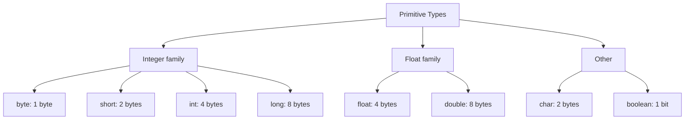

#### Interview question — Common interview question

**Q:** int aur Integer me kya difference hai? Production code me kab kaunsa use karoge?

> int ek primitive type hai jo direct value store karta hai stack pe — 4 bytes raw memory. Integer ek wrapper class hai jo int ko object me wrap karti hai, heap pe store hoti hai with extra fields (header + value).
> Memory comparison: int x = 42 takes 4 bytes. Integer x = 42 takes ~16 bytes (object header 12 bytes + int value 4 bytes, depending on JVM). Performance — int 10x faster in tight loops.
> Production rules: 1) Local variables, loop counters, simple math — int. 2) Collections (List, Map) — Integer because generics need objects (List<int> doesn't exist, only List<Integer>). 3) Nullable values — Integer because int can't be null. 4) Money in production — neither! BigDecimal for accuracy.
> Auto-boxing/unboxing yaad rakh — Java automatic convert karta hai. int x = 5; List<Integer> list = new ArrayList<>(); list.add(x); — yahan x auto-box hota hai Integer me. Reverse bhi automatic — int y = list.get(0); — auto-unbox.
> Gotcha: NullPointerException danger. Integer i = null; int x = i; — NPE. Production debugging me ye common bug hai jab DB se Integer aata hai null aur tu primitive me assign karta hai.
> [Difficulty: Medium · Asked at: TCS, Infosys, Amazon, Razorpay. Follow-ups: 'Integer cache kya hota hai?', 'Why use primitives over wrappers in performance-critical code?']

### Non-primitive (reference) types

#### Kya hai? — What are non-primitive (reference) types?

Non-primitive types woh hain jo primitive nahi — String, Arrays, Classes, Interfaces, Enums, anything user-defined. Inko reference types bhi bolte hain kyunki variable actual data nahi rakhta, data ka address (reference) rakhta hai.

Real-life analogy le — primitive ek dabba hai jisme value seedha hai. Reference type ek slip hai jisme address likha hai 'jaa, locker no. 4521 me actual data hai'. Variable address rakhta hai, actual data heap pe hota hai.

Beginner ke liye sabse zaroori: reference types null ho sakte hain (locker hi nahi hai), primitive nahi. String s = null valid hai, int i = null compile error hai.

#### Kyun zaroori hai? — Why reference types?

Primitives me size fixed hai — int hamesha 4 bytes. But real-world data variable size hai — String could be 5 chars or 500 chars, an Order has variable items. Stack pe variable-size data nahi rakh sakte cleanly.

Solution: heap pe bana, stack me sirf reference (8 bytes pointer) rakh. Heap me objects grow ho sakte hain, methods inhe modify kar sakte hain, multiple references same object pe point kar sakte hain (sharing).

Beginner ke liye yaad rakh: 90% Java code me tu reference types use karta hai — String, ArrayList, HashMap, custom classes. Primitives sirf inn objects ke fields ya counters/loop variables ke liye.

#### Kaise kaam karta hai? — How references work in memory

Mental model: jab tu String s = "hello" likhta hai, do cheezein hoti hain. 1) Heap me String object banta hai "hello" content ke saath. 2) Stack pe variable s 8 bytes ka reference rakhta hai jo us heap object ko point karta hai.

Object passing: jab tu method me reference pass karta hai, COPY of the reference jaata hai (not the object). Method same heap object pe operate karta hai. Method ke andar mutation original object pe dikhega — common confusion area.

Equality samajh — == reference equality check karta hai (same heap object?). .equals() value equality (same content?). String s1 = new String("hi"); String s2 = new String("hi"); s1 == s2 false (different objects), s1.equals(s2) true (same content).

Garbage collection — jab koi reference object ko point nahi karti, JVM automatic clean kar deta hai. Tu manual delete nahi karta. But circular references aur memory leaks still possible hain.

```java
// Reference types in action
public class RefDemo {
    public static void main(String[] args) {
        // String — sabse common reference type
        String name = "Razorpay";  // heap me String object, name reference

        // Array — reference type
        int[] amounts = {100, 200, 300};  // heap me array, amounts reference

        // Custom class
        Order order1 = new Order(101, 5000);
        Order order2 = order1;  // dono SAME object point kar rahe hain

        order2.amount = 9999;
        System.out.println(order1.amount);  // 9999! (shared object)

        // null assignment
        String temp = null;  // valid
        // int x = null;     // COMPILE ERROR — primitives can't be null
    }
}

class Order {
    int id;
    long amount;

    Order(int id, long amount) {
        this.id = id;
        this.amount = amount;
    }
}
```

#### Real-life example — Real-life example — Swiggy order with shared customer

Swiggy ka order system me ek Customer multiple Orders rakh sakta hai. Same Customer object different Orders me reference hota hai — duplicate copy nahi banti memory me.

Reference sharing ka faida: 1) Memory efficient — ek customer 100 orders me share ho raha hai, sirf ek Customer object hai heap me. 2) Update reflect — agar customer ne phone number change kiya, sab orders me automatic dikh jayega kyunki sab same object reference karte hain.

Production gotcha: shared mutable references thread-safety issue create karte hain. Multiple threads same Customer object modify kar rahe hain to race conditions. Solution: immutable objects (final fields, no setters) ya synchronized access.

```java
// Swiggy-style shared reference example
public class SwiggyDemo {
    public static void main(String[] args) {
        Customer rohan = new Customer("Rohan", "+91-9876543210");

        Order o1 = new Order(1001, rohan, "Pizza");
        Order o2 = new Order(1002, rohan, "Burger");
        Order o3 = new Order(1003, rohan, "Biryani");

        // Rohan ne phone number update kiya
        rohan.phone = "+91-9999999999";

        // Saare orders me reflect ho gaya — same object reference
        System.out.println(o1.customer.phone);  // +91-9999999999
        System.out.println(o2.customer.phone);  // +91-9999999999
        System.out.println(o3.customer.phone);  // +91-9999999999

        // Memory me sirf ONE Customer object hai
    }
}

class Customer {
    String name;
    String phone;
    Customer(String name, String phone) {
        this.name = name;
        this.phone = phone;
    }
}

class Order {
    int id;
    Customer customer;  // reference, not copy
    String item;

    Order(int id, Customer customer, String item) {
        this.id = id;
        this.customer = customer;
        this.item = item;
    }
}
```

#### Visual — Stack vs Heap memory

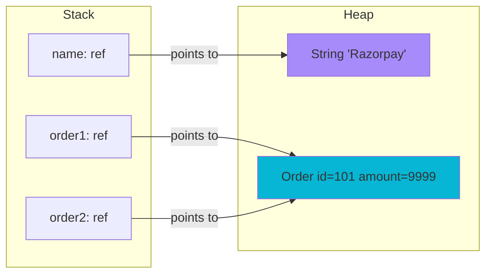

#### Interview question — Common interview question

**Q:** Java me objects pass-by-value hote hain ya pass-by-reference? Apne answer ko code example se justify kar.

> Java is STRICTLY pass-by-value, always. But confusion isiliye hota hai because for reference types, the 'value' that's passed is the reference itself (a copy of the reference).
> Mental model: tu method ko call karta hai with an Order object. Java method ke parameter me reference ki COPY pass karta hai, not the object itself. Both — caller's reference and method's parameter — same heap object ko point karte hain.
> Practical impact: agar method object ke fields modify karta hai (e.g., order.setStatus(...)), changes original object me dikhenge because they're the same heap object. Lekin agar method parameter ko REASSIGN karta hai (parameter = new Order(...)), only the local copy changes — caller's reference unchanged.
> Code example: void update(Order o) { o.status = 'PAID'; } — caller ke order me change dikhega. void replace(Order o) { o = new Order(); } — caller ke order me NO change.
> Why this matters: production debugging me ye sabse common confusion hai. Function-side me 'I just reassigned the reference, why isn't the caller seeing the change?' — because Java passed you a copy of the reference. Reassigning your copy doesn't touch the caller's.
> [Difficulty: Hard · Asked at: Amazon, Microsoft, Atlassian, Razorpay. Follow-ups: 'Can you change a String inside a method?', 'How would you swap two objects in Java?']

### Type casting (implicit & explicit)

#### Kya hai? — What is type casting?

Type casting matlab ek data type ko doosre data type me convert karna. Java strongly typed hai — int aur double directly mix nahi kar sakte without conversion.

Two flavors: 1) Implicit casting (widening) — Java khud kar deta hai, e.g., int → long. Safe hai, no data loss. 2) Explicit casting (narrowing) — tu manually karta hai with (Type) syntax, e.g., (int) double. Risky — data loss possible.

Beginner ke liye yaad rakh: jab smaller type → larger type ho raha hai, automatic. Larger → smaller chahiye to (Type) explicit cast karna padta hai aur tu responsible hai data loss ke liye.

#### Kyun zaroori hai? — Why does type casting exist?

Real code me different types interact karte hain. User input always String hota hai — but tujhe int chahiye for math. DB se long aata hai — but tu int field me store kar raha hai. Without casting, Java code lock ho jaata.

Implicit casting safety net hai — chote types me bade me promote karna safe hai. byte (1 byte) ko int (4 bytes) me daalo, no data loss.

Explicit casting tujhe explicit choice deti hai — 'haan mai jaanta hu data loss ho sakta hai, lekin mujhe accept hai'. JVM me runtime check sometimes (ClassCastException for objects) but primitives me silent truncation.

#### Kaise kaam karta hai? — How casting actually works

Implicit (widening) order: byte → short → int → long → float → double. char → int bhi works (char is treated as unsigned 16-bit). Java ye automatically karta hai.

Explicit (narrowing): (TargetType) value syntax. JVM literally bits truncate karta hai. double 99.999 → int = 99 (decimal lost). int 257 → byte = 1 (high bits truncated, weird overflow).

Object casting alag concept hai. Animal a = new Dog(); Dog d = (Dog) a; — works because actual object is Dog. Dog d = (Dog) new Cat(); — ClassCastException at runtime kyunki actual object Cat hai, Dog nahi.

Best practice: instanceof check kar before object casting to avoid ClassCastException. Java 16+ ne pattern matching diya — if (a instanceof Dog d) { d.bark(); } cleaner syntax hai.

```java
public class CastingDemo {
    public static void main(String[] args) {
        // 1) Implicit (widening) — automatic, no data loss
        int small = 100;
        long bigger = small;          // int → long, automatic
        double biggest = bigger;      // long → double, automatic
        System.out.println(biggest);  // 100.0

        // 2) Explicit (narrowing) — manual, data loss risk
        double price = 999.99;
        int wholeRupees = (int) price;     // 999 — decimal lost!
        System.out.println(wholeRupees);

        // Overflow danger
        int large = 257;
        byte b = (byte) large;        // 1, NOT 257
        System.out.println(b);        // weird truncation

        // 3) String to int — different beast (parsing, not casting)
        String userInput = "42";
        int num = Integer.parseInt(userInput);  // not (int) cast!

        // 4) Object casting
        Object obj = "Hello";
        String s = (String) obj;      // ok — actual object is String
        // Integer i = (Integer) obj; // ClassCastException at runtime!
    }
}
```

#### Real-life example — Real-life example — Flipkart price calculation

Flipkart catalog me product price as int paise stored hai (e.g., 1499 = ₹14.99). Display ke time decimal me convert karna padta hai — int to double cast.

Reverse case: user enters discount percentage as String '15.5'. Tu Double.parseDouble karta hai (technically not casting, but conversion). Phir calculations me float-double mix avoid karna chahiye precision ke liye.

Production gotcha: avoid float/double for money calculations. Cast or no cast, floating point errors hote hain. ₹9.99 × 1.18 (GST) = 11.7882 — but actual stored 11.78819999... — display issues.

```java
// Flipkart-style price + discount calculation
public class PriceCalc {

    // Price stored as long paise (avoid double for money)
    public static long applyDiscount(long priceInPaise, double discountPercent) {
        // Implicit cast: long → double for math
        double discountFactor = 1.0 - (discountPercent / 100.0);
        double discountedDouble = priceInPaise * discountFactor;

        // Explicit cast: double → long, with rounding
        return Math.round(discountedDouble);
    }

    public static void main(String[] args) {
        long iPhonePrice = 12999900L;  // ₹1,29,999 in paise
        double bigSaleDiscount = 7.5;

        long finalPrice = applyDiscount(iPhonePrice, bigSaleDiscount);
        System.out.println("Final: ₹" + (finalPrice / 100.0));
        // Final: ₹120174.07
    }
}
```

#### Visual — Casting hierarchy (widening implicit, narrowing explicit)

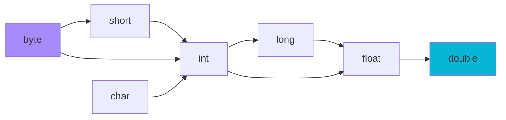

#### Interview question — Common interview question

**Q:** ClassCastException kab aata hai? instanceof check kab use karna chahiye production code me?

> ClassCastException tab aata hai jab tu object cast karta hai to a type that the actual object doesn't represent. JVM runtime check karta hai — agar actual class incompatible hai, ye exception throw karta hai.
> Concrete example: Object obj = "Hello"; Integer i = (Integer) obj; — runtime crash, kyunki obj actually String hai, Integer nahi. Compile-time pe ye allowed hai because Object can technically be anything.
> instanceof check production me critical hai jab tu generic Object handle kar raha hai (e.g., from JSON deserialization, message queue payloads, legacy APIs). Pattern: if (obj instanceof TargetType cast) { use cast; } — Java 16+ pattern matching syntax.
> Real scenarios where this comes up: 1) Kafka message handlers receiving polymorphic events. 2) Reflection-based code reading annotations. 3) Legacy collections without generics returning Object. 4) Deserialization from external systems (JSON/XML/Protobuf).
> Best practice: avoid casting altogether when possible. Use generics (List<Order> instead of List<Object>), use polymorphism (define common interface), use sealed classes (Java 17+) for closed type hierarchies. Casting is a code smell unless absolutely necessary.
> [Difficulty: Medium · Asked at: TCS, Infosys, Amazon, Microsoft. Follow-ups: 'Generic erasure aur casting ka relation?', 'Pattern matching for instanceof Java 16 me kya naya hai?']

## Variables & Scope

### Variables, scope & lifetime

#### Kya hai? — What are variables and scope?

Variable ek named storage hai — type aur ek identifier ke saath. int age = 25 me int type, age identifier, 25 value. Java me variables strict hain — type pehle declare karna mandatory hai.

Scope variable ki visibility define karta hai — kahan se kahan tak access ho sakta hai. Java me 4 tarah ke scopes: local (method ke andar), block (curly braces ke andar), instance (object ka field), class/static (class-level shared).

Beginner analogy: variable ek labeled box hai. Scope is wo room jisme box accessible hai. Method ke andar declared box, sirf usi method me dikhega — bahar nahi. Class field har method me dikhega.

#### Kyun zaroori hai? — Why does scope matter?

Bina scope rules ke hazaron variables global hote, naming conflicts hote, debugging impossible hota. Scope encapsulation deta hai — har variable ka clear lifetime aur reach.

Memory efficiency: local variables stack pe hote hain, method khatam to gaye. Instance variables har object me alag, class khatam tak rehte hain. Static variables ek hi shared, JVM lifetime tak.

Beginner ke liye yaad rakh: smallest possible scope use kar. Local pehle, instance jab object ki state ka part ho, static sirf jab truly shared (counters, constants) ho. Wider scope = harder to reason about.

#### Kaise kaam karta hai? — How scope rules actually work

Local scope: method ya block ke andar declared variables. Stack pe alloc, scope khatam to deallocated. Sub-blocks (if/for/while ke andar) further nested scopes banate hain.

Instance scope: class ke fields, har object me alag copy. this.fieldName se access. Object lifetime tak rehte hain — heap pe object ke saath.

Static (class) scope: static keyword se declared. Class loading pe ek baar initialize, JVM lifetime tak rehte hain. ClassName.staticField se access. Shared across all instances.

Shadowing — same name different scope me. Method ke parameter ya local ne instance field shadow kar liya to local jeetega. this.field se instance reach kar.

```java
public class ScopeDemo {

    // Static (class) scope — shared across all OrderService instances
    private static int totalOrdersProcessed = 0;

    // Instance scope — har OrderService object me alag
    private final String serviceId;
    private long lastOrderTime;

    public ScopeDemo(String serviceId) {
        this.serviceId = serviceId;  // 'this' to disambiguate
    }

    public void process(Order order) {
        // Local scope — sirf is method me
        long startTime = System.currentTimeMillis();
        boolean valid = validate(order);

        if (valid) {
            // Block scope — sirf is if-block me
            int retryCount = 0;
            while (retryCount < 3) {
                // Even more nested — block ke andar block
                String attemptId = "att_" + retryCount;
                if (sendToGateway(order, attemptId)) {
                    break;
                }
                retryCount++;
            }
            // attemptId yahan nahi reach ho sakta
        }
        // retryCount yahan nahi reach ho sakta

        long duration = System.currentTimeMillis() - startTime;
        lastOrderTime = duration;     // instance field
        totalOrdersProcessed++;        // static field
    }

    private boolean validate(Order order) { return true; }
    private boolean sendToGateway(Order o, String id) { return true; }
}

class Order { /* ... */ }
```

#### Real-life example — Real-life example — request-scoped logging

Razorpay's payment service har request pe correlationId generate karta hai for tracing. Ye request ke local scope me chahiye — method calls me pass hota hai, lekin shared state nahi.

Implementation: method parameter as local scope. Cleaner than ThreadLocal for most cases. Each request handler me local correlationId banao, downstream methods me explicitly pass karo.

Why not static? Static field shared across requests — concurrent requests ek-doosre ke correlationIds overwrite kar denge. Race condition disaster.

Why not instance? Service is typically a singleton (single instance), shared across requests. Same problem.

Production rule: request-specific data → method parameters (explicit) ya ThreadLocal (implicit but careful). Not instance/static fields.

```java
// Razorpay-style request-scoped tracing
public class PaymentService {

    private static final Logger log = LoggerFactory.getLogger(PaymentService.class);

    public PaymentResult process(PaymentRequest request) {
        // Local scope — har call pe naya correlationId
        String correlationId = generateCorrelationId();
        log.info("[{}] Processing payment for ₹{}",
                 correlationId, request.getAmount());

        // Explicitly pass to downstream methods
        validatePayment(request, correlationId);
        return chargeCard(request, correlationId);
    }

    private void validatePayment(PaymentRequest req, String correlationId) {
        log.debug("[{}] Validating", correlationId);
        // ...
    }

    private PaymentResult chargeCard(PaymentRequest req, String correlationId) {
        log.debug("[{}] Charging card", correlationId);
        // ...
        return new PaymentResult();
    }

    private String generateCorrelationId() {
        return "pay_" + UUID.randomUUID().toString().substring(0, 8);
    }
}

class PaymentRequest {
    public long getAmount() { return 0L; }
}
class PaymentResult { }
```

#### Visual — Variable scope levels

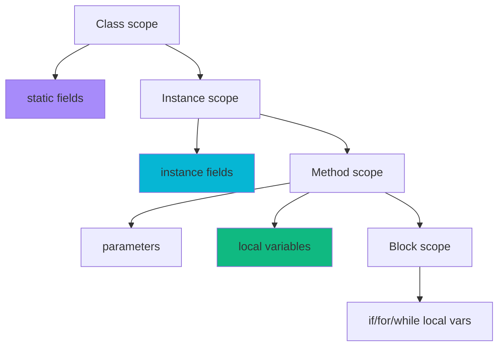

#### Interview question — Common interview question

**Q:** static aur instance variables me kya difference hai? Multi-threaded code me static variable ke saath kya care karna padta hai?

> static variable class ke saath bind hai, instance variable object ke saath. Static ek hi exists in memory, JVM ke pehle class load hone se le ke shutdown tak. Instance har object me alag copy.
> Concrete example: class Counter { static int total = 0; int value = 0; } — naya Counter() banao, value 0 hota hai uska own copy. total shared hai — 100 Counter instances me bhi sirf ek total. Counter.total se access (or instance se but that's confusing).
> Memory: static variables Method Area (or Metaspace in Java 8+) me. Instance variables heap pe object ke saath. Static initialization class loading time pe one-time hota hai.
> Multi-threaded danger: static variables shared mutable state hain. 100 threads concurrently total++ kar rahe hain to race condition — final value indeterminate. Reason: ++ atomic nahi, read-modify-write hai.
> Solutions for thread-safe static state: 1) AtomicInteger jaisi atomic types use kar — totalAtomic.incrementAndGet(). 2) synchronized methods/blocks — slow but simple. 3) ConcurrentHashMap, ConcurrentLinkedQueue jaisi concurrent collections. 4) Best — avoid mutable static state altogether, use dependency injection.
> Real production scenario: Razorpay/Swiggy me singleton services have static-like sharing. Inn services ka any mutable state thread-safe hona zaroori hai. Most common pattern: immutable config + thread-safe metrics (Micrometer's Counter).
> [Difficulty: Medium · Asked at: Amazon, Atlassian, Razorpay, Goldman Sachs. Follow-ups: 'static initialization order kya hota hai?', 'Why are static methods sometimes problematic for testing?']

## Operators

### Arithmetic & relational

#### Kya hai? — What are arithmetic and relational operators?

Arithmetic operators numbers pe math operations karte hain: +, -, *, /, % (modulo). Relational operators do values compare karte hain aur boolean result dete hain: ==, !=, <, >, <=, >=.

Compound operators bhi hain: +=, -=, *=, /=, %=. x += 5 same as x = x + 5. ++ aur -- increment/decrement hain (pre vs post matter karta hai sometimes).

Beginner ke liye yaad rakh: arithmetic int/double pe natural feel karta hai. Relational hamesha boolean return karta hai — if conditions, while loops, ternary me use hota hai.

#### Kyun zaroori hai? — Why these operators matter

Code ka 70% logic conditional flow hai — if x > 10, while count < 100, etc. Without relational operators, looping aur branching unsupported. Arithmetic without these — no calculations possible.

Java me operator overloading nahi hai (unlike C++). + sirf number addition aur String concat ke liye kaam karta hai. Tu apni class banake + operator define nahi kar sakta. Method calls use karne padte hain.

Beginner gotcha: int division integer return karta hai. 7 / 2 = 3 (not 3.5). Decimal chahiye to at least one operand double kar — 7.0 / 2 = 3.5.

#### Kaise kaam karta hai? — How operators evaluate

Precedence aur associativity matter karte hain. Multiplication/division/modulo > addition/subtraction. Tu chahta clarity, parentheses use kar — 2 + 3 * 4 = 14, but (2 + 3) * 4 = 20.

Integer overflow silent hai. int max = Integer.MAX_VALUE; int x = max + 1 — wraps to Integer.MIN_VALUE without exception. Production bugs aate hain. Solution — Math.addExact() throws ArithmeticException on overflow.

Modulo edge case — Java me % sign of dividend follow karta hai. -7 % 3 = -1 (not 2 like Python). Negative modulo handle carefully. Math.floorMod() Python-style positive modulo deta hai.

Comparison operators primitives pe value-compare karte hain. Objects pe == reference equality (same heap object?). Object value comparison ke liye .equals() use karna padta hai. String s1 == s2 vs s1.equals(s2) ka famous bug isi se aata hai.

```java
public class OperatorsDemo {
    public static void main(String[] args) {
        // Arithmetic basics
        int a = 17, b = 5;
        System.out.println(a + b);     // 22
        System.out.println(a - b);     // 12
        System.out.println(a * b);     // 85
        System.out.println(a / b);     // 3 (integer division!)
        System.out.println(a % b);     // 2 (remainder)
        System.out.println((double) a / b);  // 3.4 (decimal)

        // Pre vs post increment
        int x = 5;
        int y = x++;  // y = 5, x = 6 (post-increment)
        int z = ++x;  // z = 7, x = 7 (pre-increment)

        // Compound assignment
        int score = 100;
        score += 50;   // 150
        score *= 2;    // 300
        score %= 7;    // 6

        // Relational — boolean results
        System.out.println(a > b);     // true
        System.out.println(a == b);    // false
        System.out.println(a != b);    // true

        // Overflow danger
        int max = Integer.MAX_VALUE;
        int overflow = max + 1;        // silent wrap
        System.out.println(overflow);  // -2147483648 (negative!)

        // Safe arithmetic
        try {
            int safe = Math.addExact(max, 1);
        } catch (ArithmeticException e) {
            System.out.println("Caught overflow: " + e.getMessage());
        }
    }
}
```

#### Real-life example — Real-life example — Swiggy delivery time estimation

Swiggy ka delivery time calculation simple arithmetic ka extension hai. Restaurant prep time + travel time + buffer = total minutes. Plus relational checks for surge pricing, traffic conditions.

Production challenge: integer overflow — distance in meters could exceed int range for certain edge cases (international expansion). Use long for safety.

Comparison patterns: agar prep time > 20 mins, customer ko notification bhejo. Travel distance > 5km, delivery fee 1.5x. Multiple if-conditions chain hote hain.

```java
// Swiggy-style delivery time + fee calculation
public class DeliveryEstimator {

    public DeliveryEstimate estimate(Order order, Restaurant restaurant) {
        // Arithmetic for time
        int prepMinutes = restaurant.getCurrentPrepTime();
        int travelMinutes = (int) Math.ceil(
            order.getDistanceMeters() / 200.0  // ~200m/min average
        );
        int totalMinutes = prepMinutes + travelMinutes + 5;  // 5 min buffer

        // Relational for fee tiers
        long baseFee = 2900L;  // ₹29 in paise
        long deliveryFee = baseFee;

        if (order.getDistanceMeters() > 5000) {
            deliveryFee = (long) (baseFee * 1.5);  // long-distance surcharge
        }

        if (prepMinutes > 30) {
            // Apologize for long wait — discount
            deliveryFee -= 1000L;  // ₹10 off
        }

        // Modulo for batch optimization
        boolean canBatch = (order.getOrderId() % 10 == 0);  // every 10th eligible

        return new DeliveryEstimate(totalMinutes, deliveryFee, canBatch);
    }
}

class Order {
    public long getDistanceMeters() { return 0; }
    public long getOrderId() { return 0; }
}
class Restaurant {
    public int getCurrentPrepTime() { return 0; }
}
class DeliveryEstimate {
    DeliveryEstimate(int t, long f, boolean b) {}
}
```

#### Visual — Operator precedence (high to low)

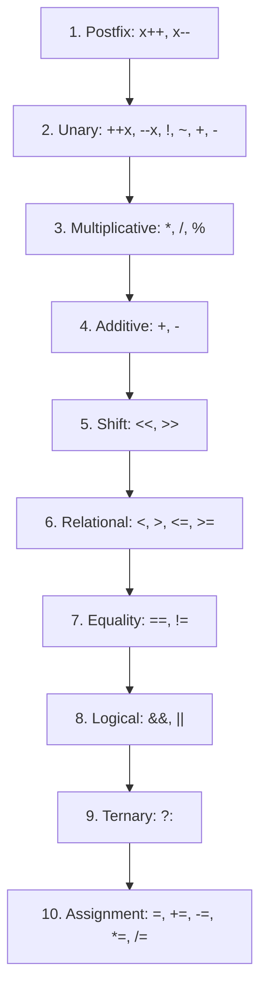

#### Interview question — Common interview question

**Q:** Integer overflow kya hai aur production code me isse kaise prevent karoge? `==` aur `.equals()` ka difference batao with String example.

> Integer overflow tab hota hai jab arithmetic operation ka result type ki range exceed kar jaata hai. Java me default behavior silent hai — value wraps around, no exception. int max = 2,147,483,647. max + 1 = -2,147,483,648 (Integer.MIN_VALUE). Production bugs ka classic source.
> Real bugs: timestamps in milliseconds (long needed beyond 2038), counters that grow large, distance/area calculations. Famous example — 2014 me Y2K38 problem aane lagi thi when 32-bit timestamps overflow honge year 2038.
> Prevention strategies in Java: 1) Use long instead of int for values that might grow — file sizes, timestamps, counts. 2) Math.addExact(), Math.multiplyExact() — throw ArithmeticException on overflow. 3) BigInteger for arbitrary precision. 4) Test with boundary values — Integer.MAX_VALUE - 1, MIN_VALUE + 1.
> Production tip: Razorpay-type fintech me money calculations always BigDecimal — both for precision aur overflow prevention. Loop counters int generally fine, but check if loop iterations can exceed 2 billion.
> Now == vs .equals() with Strings — sabse common Java gotcha:
> == compares references (memory addresses for objects). .equals() compares content (or whatever the class's equals() defines). Strings me confusion isiliye aata hai because of String pool.
> String s1 = "hello"; String s2 = "hello"; — both point to same pooled String. s1 == s2 returns true (same reference!).
> String s3 = new String("hello"); String s4 = new String("hello"); — explicitly create new String objects. s3 == s4 returns false (different references). s3.equals(s4) returns true (same content).
> Production rule: ALWAYS use .equals() for String comparison. Even if it works with == sometimes (due to interning), it's a ticking bomb. Bonus — use Objects.equals(s1, s2) which handles null safely.
> [Difficulty: Hard · Asked at: Amazon, Microsoft, Atlassian, Goldman Sachs. Follow-ups: 'String pool kya hai?', 'Java me hashCode aur equals contract kya hai?']

### Logical & bitwise

#### Kya hai? — What are logical and bitwise operators?

Logical operators: && (AND), || (OR), ! (NOT). Boolean values pe operate karte hain, boolean return karte hain. Conditions chain karne ke liye main use case.

Bitwise operators: & (AND), | (OR), ^ (XOR), ~ (NOT), << (left shift), >> (right shift), >>> (unsigned right shift). Integer ke individual bits pe operate karte hain.

Beginner ke liye sabse important difference: && short-circuits (right side skip karta hai if left determines result). & always evaluates both sides. && for boolean logic, & for bit-level operations.

#### Kyun zaroori hai? — Why both logical and bitwise?

Logical for daily code — chaining conditions in if/while. Bitwise for performance-critical paths, low-level operations, flags packing, hash codes.

Bitwise modern apps me kam dikhta hai — but kab kab — color manipulation (RGB packing), permission flags (read|write|execute), Bloom filters, hash codes, JVM internals, network protocols.

Short-circuit evaluation crucial hai null safety me. if (obj != null && obj.isValid()) — agar obj null hua, .isValid() call hi nahi hota, NPE avoided. Bitwise & yahan disaster hota.

#### Kaise kaam karta hai? — How they evaluate

Logical AND (&&): false then short-circuit, return false. Both true → true. Logical OR (||): true then short-circuit, return true. Both false → false. ! flips boolean.

Bitwise on int (32 bits): 5 & 3 = 0101 & 0011 = 0001 = 1. 5 | 3 = 0111 = 7. 5 ^ 3 = 0110 = 6 (XOR). ~5 = bit flip = -6 (two's complement).

Shift operators: 1 << 3 = 8 (left shift = multiply by 2^n). 16 >> 2 = 4 (right shift = divide by 2^n). >>> unsigned (high bits filled with 0). >> arithmetic (sign-extends).

Common patterns: flag check — (permissions & READ) != 0. Set flag — permissions |= WRITE. Clear flag — permissions &= ~WRITE. Toggle — permissions ^= EXECUTE.

```java
public class LogicalBitwiseDemo {
    // Permission flags using bitwise
    static final int READ    = 1;   // 0001
    static final int WRITE   = 2;   // 0010
    static final int EXECUTE = 4;   // 0100
    static final int ADMIN   = 8;   // 1000

    public static void main(String[] args) {
        // Logical operators (boolean)
        boolean isLoggedIn = true;
        User user = new User("rohan");

        // Short-circuit prevents NPE
        if (user != null && user.getName().length() > 3) {
            System.out.println("Valid user");
        }

        // Logical OR — short-circuit
        if (isAdmin(user) || hasOverride(user)) {
            // hasOverride() not called if isAdmin() true
        }

        // Bitwise — flag manipulation
        int permissions = READ | WRITE;       // 0011 = 3
        permissions |= EXECUTE;                // 0111 = 7

        // Check flag
        if ((permissions & WRITE) != 0) {
            System.out.println("Can write");
        }

        // Clear flag
        permissions &= ~WRITE;                 // remove write
        System.out.println(permissions);       // 5

        // Toggle flag
        permissions ^= ADMIN;                  // toggle admin

        // Shift — fast multiply/divide by 2
        int x = 1 << 4;                         // 16 (2^4)
        int y = 256 >> 3;                       // 32 (256/8)
    }

    static boolean isAdmin(User u) { return false; }
    static boolean hasOverride(User u) { return true; }
}

class User {
    private final String name;
    User(String name) { this.name = name; }
    public String getName() { return name; }
}
```

#### Real-life example — Real-life example — Razorpay permission system

Razorpay dashboard me users ke alag-alag roles hote hain — viewer, operator, admin, owner. Each role has specific permissions: view payments, refund, create API keys, manage users.

Bitwise approach efficient hai: each permission ek bit. User ki permissions ek single int (32 bits = 32 different permissions possible). Database me ek column store karta hai, in-memory check fast hota hai.

Alternative — List<Permission> with .contains() — slower (O(n) lookup), more memory, but more readable. Bitwise (O(1)) production-grade systems me preferred when permission checks are hot path.

Production extension: 32 permissions kam pad jaayein to long (64 bits). Aur zaroorat me BitSet use kar — arbitrary number of bits.

```java
// Razorpay-style permission system (compact + fast)
public class PermissionService {
    public static final int VIEW_PAYMENTS    = 1 << 0;  // 1
    public static final int REFUND_PAYMENTS  = 1 << 1;  // 2
    public static final int VIEW_PAYOUTS     = 1 << 2;  // 4
    public static final int CREATE_API_KEYS  = 1 << 3;  // 8
    public static final int MANAGE_USERS     = 1 << 4;  // 16
    public static final int OWNER_ACTIONS    = 1 << 5;  // 32

    // Pre-defined role bundles
    public static final int VIEWER  = VIEW_PAYMENTS | VIEW_PAYOUTS;
    public static final int OPERATOR = VIEWER | REFUND_PAYMENTS;
    public static final int ADMIN   = OPERATOR | CREATE_API_KEYS | MANAGE_USERS;
    public static final int OWNER   = ADMIN | OWNER_ACTIONS;

    public boolean can(int userPermissions, int requiredPermission) {
        // Single bit check — O(1), super fast
        return (userPermissions & requiredPermission) == requiredPermission;
    }

    public int grant(int userPermissions, int newPermission) {
        return userPermissions | newPermission;
    }

    public int revoke(int userPermissions, int permission) {
        return userPermissions & ~permission;
    }

    public static void main(String[] args) {
        PermissionService svc = new PermissionService();
        int rohanPerms = OPERATOR;

        boolean canRefund = svc.can(rohanPerms, REFUND_PAYMENTS);  // true
        boolean canManageUsers = svc.can(rohanPerms, MANAGE_USERS); // false

        // Promote to admin
        rohanPerms = svc.grant(rohanPerms, MANAGE_USERS | CREATE_API_KEYS);
    }
}
```

#### Visual — Bitwise AND/OR/XOR truth table

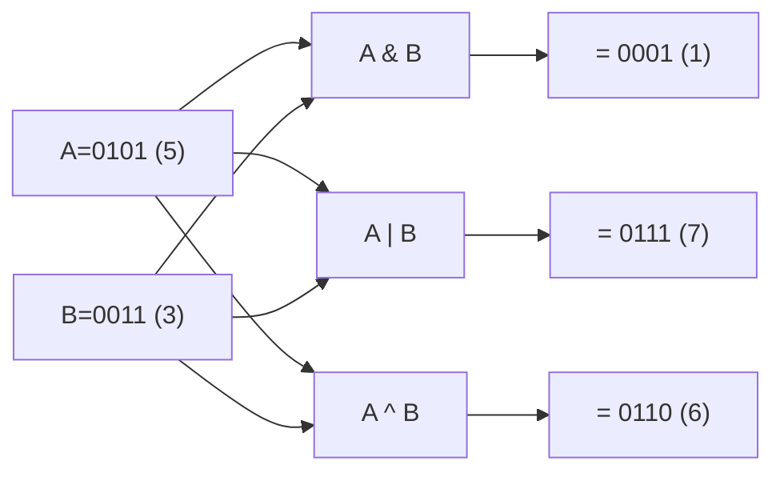

#### Interview question — Common interview question

**Q:** && aur & me kya difference hai? Production code me ek example bata jab tu deliberately & use karega instead of && for boolean values.

> && short-circuit operator hai — left side false hua to right side evaluate hi nahi hota, return false. & non-short-circuit hai — both sides ALWAYS evaluate hote hain, then bitwise AND. Boolean values pe both work but semantics different.
> Concrete example: if (count > 0 && array[count - 1] != null) — agar count 0 hua, && short-circuits, ArrayIndexOutOfBoundsException avoid hua. & version: if (count > 0 & array[count - 1] != null) — count 0 hone par bhi right side evaluate hota, exception throw hoti.
> 99% time tu && use karega for boolean logic. & boolean pe use karne ki realistic scenarios:
> 1) Deliberate side effects: log() method ka return value boolean ho aur tu chahta hai dono log entries always ho — boolean ok = log('start') & log('end'); — both calls happen regardless.
> 2) Validation collection: tu chahta hai user ko ALL validation errors dikhao, not just first failure. boolean valid = validateName(req) & validateEmail(req) & validatePhone(req); — sab validation methods chalti hain, har ek apne errors collect kar leti hai. && me first failure hone par baaki skip ho jaate.
> 3) Performance — when both sides are cheap and you want to avoid branch prediction overhead. Rare case, mostly micro-optimization.
> 4) Tutorial/learning code where you want to demonstrate that both expressions work correctly.
> Real-world production tip: NEVER use & or | on booleans without a specific reason and a code comment explaining why. Reviewer ko confusion hoga otherwise — assume default && behavior. Make exceptions explicit.
> Bonus — short-circuit doesn't prevent ALL exceptions. if (x != null && x.method()) — x.method() me agar internal exception hua, still propagates. Short-circuit only avoids the right side EVALUATION, not exceptions during evaluation.
> [Difficulty: Medium · Asked at: TCS, Amazon, Microsoft, Razorpay. Follow-ups: 'Bitwise operations performance benefits real hain modern JVM me?', '<<< operator kya hota hai aur signed vs unsigned shift kab matter karta hai?']

## Control Flow

### if / else / nested if

#### Kya hai? — What are if/else conditionals?

if/else basic decision-making construct hai. Condition true hui to ek block, false hui to alag block. Nested if-else use karke complex conditions chain kar sakte ho.

Real-life analogy le — flowchart me diamond shape decision points. if-else exactly wahi hai code me. "If barish ho rahi hai, raincoat le. Else, sunglasses."

Java me ternary operator (? :) bhi hai — short if-else. int max = a > b ? a : b. Concise but readable hona chahiye.

#### Kyun zaroori hai? — Why if/else is foundational

Saari business logic essentially branching hai. Payment authorize hua? Send confirmation. Stock available hai? Allow checkout. User logged in? Show dashboard. Without conditionals, programs static hote, koi decision nahi.

Modern alternatives — switch expressions (Java 14+), pattern matching (Java 21), polymorphism — sab eventually if-else jaise constructs pe based hain. Foundation samajhna mandatory hai.

Beginner ke liye yaad rakh: jab tu deeply nested if-else likh raha hai (3-4 levels), refactor sochna chahiye. Early returns, guard clauses, ya polymorphism cleaner hote hain.

#### Kaise kaam karta hai? — How to write clean conditionals

Basic syntax: if (condition) { ... } else if (otherCondition) { ... } else { ... }. Curly braces single-statement me bhi recommend (style guide), bug-prone single-line if avoid kar.

Early return pattern — guard clauses lagao top pe edge cases ke liye, fir main logic. Ye nesting kam karta hai aur readability badhata hai.

Ternary use kar simple cases ke liye: String status = order.isPaid() ? "paid" : "pending". Avoid in complex chains — readable nahi rehta.

Common gotcha: comparison me Yoda condition (10 == x) old-school C-style hai, modern Java me unnecessary. = vs == typo Java me compile error deta hai (boolean only context me — int x = 5 if (x = 10) compile fails).

```java
// Razorpay-style payment validation with guard clauses
public class PaymentValidator {

    public ValidationResult validate(PaymentRequest request) {
        // Guard clauses — early return for edge cases
        if (request == null) {
            return ValidationResult.failure("Request is null");
        }

        if (request.getAmount() <= 0) {
            return ValidationResult.failure("Amount must be positive");
        }

        if (request.getAmount() > 200_00_000_00L) {  // 2 lakh in paise
            return ValidationResult.failure("Amount exceeds limit");
        }

        // Main logic — reduced nesting
        String currency = request.getCurrency();
        boolean isInr = "INR".equals(currency);

        if (!isInr && request.getAmount() < 100_00L) {
            // International payment, less than ₹100
            return ValidationResult.failure("Min for international: ₹100");
        }

        // Ternary for simple branching
        int feeRate = isInr ? 2 : 4;  // 2% INR, 4% international
        long fee = (request.getAmount() * feeRate) / 100;

        return ValidationResult.success(fee);
    }
}

class PaymentRequest {
    public long getAmount() { return 0L; }
    public String getCurrency() { return "INR"; }
}

class ValidationResult {
    static ValidationResult success(long fee) { return new ValidationResult(); }
    static ValidationResult failure(String reason) { return new ValidationResult(); }
}
```

#### Real-life example — Real-life example — Swiggy delivery zone routing

Swiggy ka delivery routing decision multi-step if-else chain hota hai. Distance check, restaurant prep time, current load, weather conditions — sab combine hote hain final decision me.

Approach: layered conditions. Pehle hard rules (impossible cases — too far), fir soft rules (preferred routing), fir fallback (default behavior). Early returns rakhte hain readability ke liye.

Production pattern: complex business rules ko Strategy pattern ya Rule Engine me extract karte hain jab if-else 5+ levels deep ho jaata hai. Maintainability suffer hoti hai otherwise.

```java
// Swiggy delivery zone determination
public class DeliveryRouter {

    public DeliveryDecision route(Order order, Location restaurant, Location customer) {
        double distanceKm = calculateDistance(restaurant, customer);

        // Hard limit
        if (distanceKm > 10.0) {
            return DeliveryDecision.reject("Outside service area");
        }

        // Surge zone check
        boolean inSurgeZone = isSurgeZone(customer);
        long deliveryFee = calculateBaseFee(distanceKm);

        if (inSurgeZone) {
            deliveryFee = (long) (deliveryFee * 1.5);  // 1.5x surge
        }

        // Weather impact
        if (isRaining(customer)) {
            deliveryFee += 1000L;  // ₹10 rain charge
        }

        // Premium customer benefits
        if (order.getCustomer().isOneMember()) {
            deliveryFee = Math.max(0, deliveryFee - 2000L);  // ₹20 off
        }

        return DeliveryDecision.accept(deliveryFee, distanceKm);
    }

    private double calculateDistance(Location a, Location b) { return 0.0; }
    private boolean isSurgeZone(Location l) { return false; }
    private boolean isRaining(Location l) { return false; }
    private long calculateBaseFee(double km) { return 2900L; }
}

class Location {}
class Order { public Customer getCustomer() { return new Customer(); } }
class Customer { public boolean isOneMember() { return false; } }
class DeliveryDecision {
    static DeliveryDecision reject(String reason) { return new DeliveryDecision(); }
    static DeliveryDecision accept(long fee, double km) { return new DeliveryDecision(); }
}
```

#### Visual — Payment validation flow

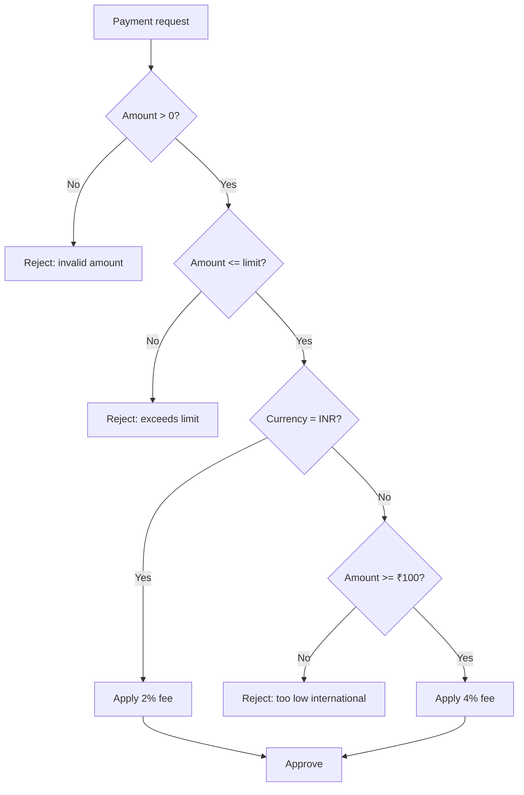

#### Interview question — Common interview question

**Q:** Deeply nested if-else (4-5 levels) ko refactor karne ke kya techniques hain? Code example with 'before' and 'after' bata.

> Deep nesting code smell hai — readability kam, bugs zyada, testing painful. Industry me 'pyramid of doom' bolte hain. Multiple refactoring techniques hain depending on situation:
> 1) Guard clauses + early returns. Pyramid ke instead of nested if, top pe negative cases handle karke return kar do. Body ka indentation flatten ho jaata hai.
> BEFORE: if (user != null) { if (user.isActive()) { if (user.hasPermission()) { /* main logic */ } else { return error; } } else { return error; } } else { return error; }
> AFTER: if (user == null) return error; if (!user.isActive()) return error; if (!user.hasPermission()) return error; /* main logic */ — same logic, half indentation, easier to scan.
> 2) Polymorphism. Agar branches different 'types' represent karte hain, polymorphic class hierarchy banao. Strategy pattern ya State pattern.
> BEFORE: if (paymentMethod.equals("UPI")) { /* UPI logic */ } else if (paymentMethod.equals("CARD")) { /* card logic */ } else if (paymentMethod.equals("NETBANKING")) { /* netbanking logic */ }
> AFTER: PaymentProcessor processor = ProcessorFactory.get(paymentMethod); processor.process(request); — each processor (UPIProcessor, CardProcessor) implements common interface. New payment methods = new class, no if-else changes.
> 3) Switch expressions (Java 14+) — for simple value-based branching cleaner than if-else chains. Plus exhaustiveness check from compiler with sealed types.
> 4) Lookup tables (Map). Conditional logic that maps key to handler can be a Map<Key, Handler>. Database lookup, function dispatch, command pattern — all variants.
> 5) Extract method. Even if you keep if-else, breaking complex conditions into named boolean methods helps. 'if (isEligibleForDiscount(user, order))' clearer than '(user.tier == 'PREMIUM' && order.amount > 1000 && !user.hasUsedDiscount())'.
> 6) Rule engine for truly complex logic — Drools, Easy Rules. Heavier but justified when business team needs to modify rules without code deploys.
> Production tip: refactoring is iterative. Don't try to refactor entire deeply-nested if-else in one go. Start with guard clauses. Then extract methods. Then if needed, full polymorphism.
> [Difficulty: Hard · Asked at: Amazon, Microsoft, Atlassian, Razorpay. Follow-ups: 'Strategy pattern code example dikha', 'When does Rule Engine make sense over polymorphism?']

### switch case

#### Kya hai? — What is switch-case?

switch ek multi-way branching construct hai — ek variable check karta hai aur multiple discrete values pe alag-alag actions trigger karta hai. Long if-else chains ka cleaner alternative jab multiple equality checks ho.

Java 14+ ne switch expressions diye — modern syntax with arrow (->), no fallthrough by default, can return values. Traditional switch (with break) abhi bhi exists for backward compat.

Beginner ke liye yaad rakh: switch sirf equality check karta hai (==). Range checks (x > 5) ke liye if-else use kar. Modern switch supports primitives, String, enums, sealed types (Java 21).

#### Kyun zaroori hai? — Why switch over if-else chains?

Cleaner syntax for value-based branching. 10 cases ka if-else verbose lagta hai — switch compact aur scannable hai.

Performance — JVM switch ko optimize karta hai (jump table, lookup table). Hot paths me micro-benefit hota hai. Negligible for most code but compiler hints clarity bhi useful.

Modern switch expressions (Java 14+) value return karte hain — if-else ka 'temp variable assigned in each branch' pattern eliminate ho jaata hai. Pattern matching with sealed types unlocks elegant type-safe code.

Production tip: enums ke saath switch perfect combo hai — exhaustiveness check (Java 21+ with sealed types) compile-time guarantees.

#### Kaise kaam karta hai? — Traditional vs modern switch

Traditional (Java 7+): switch (variable) { case A: /* code */ break; case B: /* code */ break; default: /* fallback */ }. Break statement zaroori hai — bina break, fallthrough hota hai (next case bhi execute).

Switch expressions (Java 14+): String result = switch (variable) { case A -> 'foo'; case B, C -> 'bar'; default -> 'unknown'; }; — arrow syntax, no break, can return values, exhaustiveness checked.

Pattern matching (Java 21+): switch (obj) { case Integer i -> 'num: ' + i; case String s when s.length() > 5 -> 'long string'; case String s -> 'short string'; default -> 'unknown'; } — type checks + binding + guards.

Common gotcha: traditional switch fallthrough silent bug source. Forgot break? Next case executes. Modern switch expressions ne ye eliminate kiya.

```java
public class SwitchDemo {
    enum OrderStatus { CREATED, PAID, SHIPPED, DELIVERED, CANCELLED }

    // Modern switch expression (Java 14+)
    public static String getActionLabel(OrderStatus status) {
        return switch (status) {
            case CREATED -> "Pending payment";
            case PAID, SHIPPED -> "In transit";   // multiple cases combined
            case DELIVERED -> "Complete";
            case CANCELLED -> "Refunded";
            // No default needed — enum exhaustive
        };
    }

    // Traditional switch (still works)
    public static int getStatusCode(OrderStatus status) {
        int code;
        switch (status) {
            case CREATED:
                code = 100;
                break;
            case PAID:
                code = 200;
                break;
            case SHIPPED:
            case DELIVERED:                          // intentional fallthrough
                code = 300;
                break;
            case CANCELLED:
                code = 400;
                break;
            default:
                code = -1;
        }
        return code;
    }

    // Pattern matching (Java 21+)
    public static String describe(Object obj) {
        return switch (obj) {
            case Integer i when i < 0 -> "negative int";
            case Integer i -> "positive int: " + i;
            case String s when s.isEmpty() -> "empty string";
            case String s -> "string of length " + s.length();
            case null -> "null value";
            default -> "unknown type";
        };
    }
}
```

#### Real-life example — Real-life example — Order state machine

Flipkart's order processing me state transitions strict hain — CREATED → PAID → SHIPPED → DELIVERED. Sometimes CANCELLED at various points. Switch perfect fit hai for state-based behavior.

Each state ka apna allowed action hai — created me sirf 'pay' kar sakte ho, paid me 'cancel' allowed, shipped me 'track', delivered me 'rate' aur 'return'.

Approach: state ko enum me declare karo, switch expression me allowed actions return karo. Type-safe, exhaustive (compiler bata dega agar naya state add hua par switch update nahi kiya), maintainable.

```java
// Flipkart-style order state machine
public class OrderStateMachine {

    enum OrderState { CREATED, PAID, SHIPPED, DELIVERED, CANCELLED, RETURNED }

    public List<String> allowedActions(OrderState state) {
        return switch (state) {
            case CREATED -> List.of("PAY", "CANCEL");
            case PAID -> List.of("SHIP", "CANCEL", "REFUND");
            case SHIPPED -> List.of("TRACK", "DELIVER");
            case DELIVERED -> List.of("RATE", "RETURN");
            case CANCELLED, RETURNED -> List.of("VIEW_DETAILS");
        };
    }

    public OrderState transition(OrderState current, String action) {
        return switch (current) {
            case CREATED -> switch (action) {
                case "PAY" -> OrderState.PAID;
                case "CANCEL" -> OrderState.CANCELLED;
                default -> throw new IllegalStateException(
                    "Invalid action " + action + " from " + current);
            };
            case PAID -> switch (action) {
                case "SHIP" -> OrderState.SHIPPED;
                case "CANCEL" -> OrderState.CANCELLED;
                default -> throw new IllegalStateException(
                    "Invalid action " + action + " from " + current);
            };
            case SHIPPED -> switch (action) {
                case "DELIVER" -> OrderState.DELIVERED;
                default -> throw new IllegalStateException(
                    "Invalid action " + action + " from " + current);
            };
            case DELIVERED -> switch (action) {
                case "RETURN" -> OrderState.RETURNED;
                default -> current;  // no transition
            };
            case CANCELLED, RETURNED -> current;  // terminal states
        };
    }
}
```

#### Visual — Order state machine

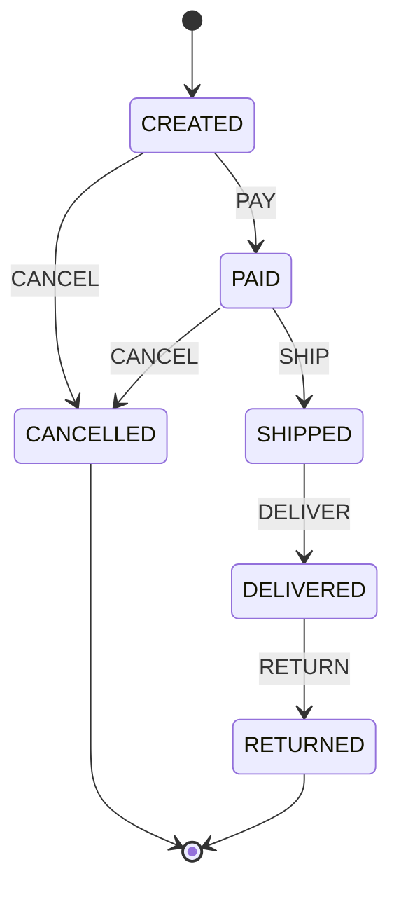

#### Interview question — Common interview question

**Q:** Traditional switch (with break) aur Java 14+ switch expressions me kya difference hai? Production code me kab kaunsa prefer karoge?

> Traditional switch statement hai — kuch execute karta hai but value return nahi karta. Switch expression value return karta hai aur arrow syntax (->) use karta hai. Underlying difference deeper hai — semantics, safety, exhaustiveness.
> Traditional syntax: switch (x) { case A: result = 'foo'; break; case B: result = 'bar'; break; }. Issues: 1) break bhul gaye to fallthrough silent bug. 2) Variable assignment in each branch verbose. 3) No exhaustiveness check — naya enum value add hua, switch update nahi kiya, no compile error.
> Switch expression: result = switch (x) { case A -> 'foo'; case B -> 'bar'; default -> 'unknown'; };. Benefits: 1) No fallthrough — each case independent. 2) Returns value directly. 3) Exhaustiveness check — for enums + sealed types, compiler error if any case missed. 4) Multiple labels per case: case A, B, C -> ...
> Production preference: switch expressions whenever possible. Cleaner, safer, modern. Traditional switch only for legacy code maintenance ya jab tu intentionally fallthrough chahta hai (rare).
> Pattern matching (Java 21+) takes it further: switch (obj) { case Integer i when i > 0 -> ... case String s -> ... }. Type checks + binding + guards combined. Java me functional pattern-matching style code likhne lagta hai.
> Sealed types + switch combo is powerful. sealed interface Shape permits Circle, Square, Triangle defines a closed type hierarchy. switch on Shape → compiler enforces exhaustive coverage. Naya Shape add hua, sab switches ko update karna mandatory hota hai.
> Real production scenario: payment gateway me PaymentMethod sealed interface, switch karke har method ka specific processing logic. Naya method (UPI 2.0) add karte time compiler bataata hai 'aap is switch me handle nahi kiya' — runtime bug avoid hua.
> Performance — switch JVM optimizations: tableswitch (continuous values, O(1) jump) ya lookupswitch (sparse, O(log n) lookup). If-else chains is O(n) sequentially. Negligible for small chains, matters in hot paths.
> [Difficulty: Medium · Asked at: Amazon, Microsoft, Atlassian, Razorpay. Follow-ups: 'sealed types Java 17 me kya hai?', 'Pattern matching for switch ka use case bata.']

### Loops & break/continue

#### Kya hai? — What are loops?

Loop matlab repeat karna code blocks ko jab tak ek condition true hai. Java me 4 main types: for, while, do-while, enhanced for-each. Plus break (loop exit) aur continue (skip to next iteration).

Real-life analogy le — loops conveyor belt jaise hain. Items ek-ek karke aate hain, har item pe same processing chalti hai, list khatam to belt ruk jaata hai.

Beginner ke liye: 90% iterations modern Java me enhanced for-each (for (Order o : orders)) ya streams (orders.forEach(...)). Traditional for index-based (for int i = 0; i < n; i++) sirf jab tujhe index chahiye ya backward iteration.

#### Kyun zaroori hai? — Why all four loop types?

for loop — known iteration count or index needed. Classical pattern from C/C++. 'Run 100 times' or 'iterate with index for swap operations'.

while loop — condition-driven, unknown iterations. 'Read until end of file', 'wait until response received', 'while user hasn't quit'.

do-while — like while but checks condition AFTER body. Body always runs at least once. Menu prompts, input retry loops.

Enhanced for-each — iterate collection without index. Cleaner than traditional for, no off-by-one errors. Default for collection traversal.

break — exit loop early. continue — skip current iteration. Both enable early termination logic.

#### Kaise kaam karta hai? — How to choose the right loop

Classical for: for (int i = 0; i < n; i++) — i is index. Reverse: for (int i = n-1; i >= 0; i--). Step different: for (int i = 0; i < n; i += 2).

while: while (condition) { ... } — checks before body. Body might never run if initial condition false.

do-while: do { ... } while (condition); — body runs at least once. Prompt-retry loop, menu input.

Enhanced for-each: for (Order o : orders) — works on Iterable + arrays. No index access. Can't modify collection structurally during iteration (ConcurrentModificationException).

break: 'agar found, exit loop'. continue: 'skip invalid items, process rest'. Labeled break for nested loops: outer: for(...) { for(...) { if (cond) break outer; } }.

Common gotcha: removing items from list while iterating with enhanced for-each — exception. Use Iterator.remove() or stream filter.

```java
import java.util.*;

public class LoopDemo {

    public static void main(String[] args) {
        List<Order> orders = List.of(
            new Order(1, "PAID"), new Order(2, "PENDING"),
            new Order(3, "PAID"), new Order(4, "FAILED")
        );

        // 1) Enhanced for-each — most common, cleanest
        for (Order o : orders) {
            System.out.println(o);
        }

        // 2) Classical for — when index needed
        for (int i = 0; i < orders.size(); i++) {
            System.out.println(i + ": " + orders.get(i));
        }

        // 3) while — condition-driven
        int retries = 0;
        boolean success = false;
        while (!success && retries < 3) {
            success = tryConnect();
            retries++;
        }

        // 4) do-while — always run at least once
        Scanner scanner = new Scanner(System.in);
        String input;
        do {
            System.out.print("Enter 'quit' to exit: ");
            input = scanner.nextLine();
        } while (!"quit".equals(input));

        // 5) break + continue patterns
        for (Order o : orders) {
            if ("FAILED".equals(o.status)) continue;  // skip
            if ("CANCELLED".equals(o.status)) break;  // stop early
            process(o);
        }

        // 6) Labeled break for nested loops
        int[][] matrix = {{1, 2, 3}, {4, 5, 6}, {7, 8, 9}};
        outer:
        for (int i = 0; i < matrix.length; i++) {
            for (int j = 0; j < matrix[i].length; j++) {
                if (matrix[i][j] == 5) {
                    System.out.println("Found at " + i + "," + j);
                    break outer;  // exit BOTH loops
                }
            }
        }
    }

    static boolean tryConnect() { return Math.random() > 0.5; }
    static void process(Order o) {}
}

record Order(int id, String status) {}
```

#### Real-life example — Real-life example — Razorpay batch settlement

Razorpay daily settlement process: thousands of payments process karne hain, settle karne hain banks ke saath. Loop is heart of this.

Approach: enhanced for-each over payments list. Failed payments ko skip (continue). Settlement amount > 1cr to break (need approval). Counter use kar processed count for monitoring.

Production gotcha: million-level iterations me enhanced for-each + Spring Data pagination combine karte hain — ek baar me 1000 records load, process, next batch. Without pagination, OutOfMemoryError. Stream processing alternative bhi hai.

```java
// Razorpay-style batch settlement loop
public class SettlementProcessor {

    private static final long APPROVAL_THRESHOLD = 1_00_00_000_00L;  // ₹1 cr

    public SettlementResult settleBatch(List<Payment> pendingPayments) {
        long totalSettled = 0L;
        int processedCount = 0;
        int skippedCount = 0;

        for (Payment payment : pendingPayments) {
            // Skip non-eligible
            if (!payment.isEligibleForSettlement()) {
                skippedCount++;
                continue;
            }

            // Stop early if cumulative amount exceeds threshold
            if (totalSettled + payment.getAmount() > APPROVAL_THRESHOLD) {
                System.out.println("Threshold reached, stopping for approval");
                break;
            }

            try {
                processSettlement(payment);
                totalSettled += payment.getAmount();
                processedCount++;
            } catch (Exception e) {
                // Log and continue — don't fail entire batch
                System.err.println("Failed: " + payment.getId() + " - " + e.getMessage());
                skippedCount++;
                continue;
            }
        }

        return new SettlementResult(processedCount, skippedCount, totalSettled);
    }

    private void processSettlement(Payment p) {
        // ... bank API call
    }
}

class Payment {
    public boolean isEligibleForSettlement() { return true; }
    public long getAmount() { return 0L; }
    public String getId() { return ""; }
}
record SettlementResult(int processed, int skipped, long total) {}
```

#### Visual — Loop control flow

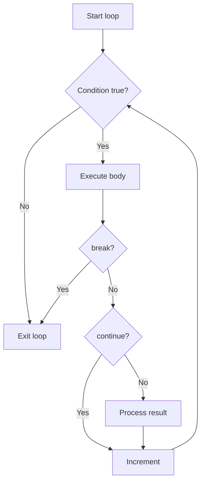

#### Interview question — Common interview question

**Q:** Enhanced for-each, traditional for, aur Stream's forEach() me kya difference hai? Performance aur use case ke hisaab se kab kaunsa choose karoge?

> Three constructs same kaam (iterate) karte hain par alag use cases hain:
> 1) Enhanced for-each: for (Order o : orders). Imperative style. JVM iterator pattern use karta hai. Read-only iteration most common case. Pros: clean, readable, no off-by-one bugs. Cons: index nahi milta, can't modify collection structurally.
> 2) Traditional for: for (int i = 0; i < orders.size(); i++). Imperative + index access. Pros: index for swap/reverse logic, can modify collection by index, can iterate backward. Cons: verbose, off-by-one bugs common.
> 3) Stream forEach: orders.stream().forEach(o -> ...). Functional style. Pros: chains with filter/map/reduce. Easy parallelization (orders.parallelStream()). Cons: less readable for simple cases, breaking out is awkward (no break — must use exception or short-circuit findFirst).
> Performance comparison:
> Single-iteration cases: enhanced for-each fastest in microbenchmarks. Stream has overhead of lambda allocation + iterator wrapping. Traditional for similar to enhanced for-each on ArrayList.
> Parallel processing: parallelStream wins big — utilizes multiple cores automatically. Same task in for-each is single-threaded. For 1M+ elements with CPU-bound work, parallelStream 4-8x faster on multi-core machines.
> Pipeline operations: streams shine when you chain transformations. orders.stream().filter(o -> o.isPaid()).map(Order::getAmount).reduce(0L, Long::sum). Equivalent for-each version is verbose with intermediate variables.
> Production rules:
> - Simple iteration without transformation: enhanced for-each.
> - Index needed (swap, sort, reverse): traditional for.
> - Multi-step transformations + filtering: streams.
> - CPU-bound work on large collections: parallelStream.
> - Need to break out of loop: enhanced for-each with break (or stream's findFirst/anyMatch which short-circuit).
> - Modifying collection structurally during iteration: explicit Iterator with .remove() or stream + collect(filtering).
> Real production tip: don't prematurely optimize with streams. Profile first. Streams add lambda allocation overhead — for super-tight loops (called millions of times), traditional for might be faster. For most application code, readability of streams wins.
> [Difficulty: Medium-Hard · Asked at: Amazon, Microsoft, Atlassian, Razorpay, Goldman Sachs. Follow-ups: 'parallelStream gotchas?', 'Stream lazy evaluation kya hai?']

## Arrays & Strings

### Arrays — declaration, traversal, multi-dim

#### Kya hai? — What are arrays?

Array ek fixed-size, contiguous memory block hai jo same-type elements rakhta hai. int[] arr = new int[10] — 10 ints contiguous memory me, indexed 0 to 9.

Java me arrays objects hain (heap pe), but special — fixed length (bana ke change nahi kar sakte), direct index access O(1).

Beginner analogy: array ek apartment block jisme har flat (index) me ek hi type ka resident (element). Flat number 0 se start, fixed total flats.

#### Kyun zaroori hai? — Why arrays exist when we have ArrayList?

Performance: arrays primitive types directly store karte hain — no boxing. int[] me int hi hai. ArrayList<Integer> me Integer wrapper objects, heap allocation overhead.

Memory: contiguous layout = CPU cache friendly. Iterating int[10000] way faster than List<Integer> me same operation. JIT compiler bhi tighter optimization karta hai arrays pe.

Multi-dimensional: 2D arrays cleaner than List<List<>>. matrix[i][j] readable hai. Game grids, matrices, 2D layouts arrays better.

Limitations: fixed size — runtime grow/shrink nahi kar sakte. ArrayList iska wrapper hai (internally array + auto-resize).

Production rule: production app code me 90% ArrayList. Arrays for performance-critical loops, math/scientific computing, primitive collections, JNI/native interop.

#### Kaise kaam karta hai? — Array operations + multi-dimensional

Declaration + init: int[] arr = new int[5]; (default 0 values). int[] arr = {1, 2, 3, 4, 5}; (literal). int[] arr = new int[]{1, 2, 3}; (explicit type with values).

Length: arr.length — property, not method. arr.size() doesn't exist (vs ArrayList).

Access: arr[0], arr[arr.length - 1]. Out-of-bounds → ArrayIndexOutOfBoundsException (runtime).

Iteration: traditional for or enhanced for-each. Modify in place with index access.

Multi-dim: int[][] matrix = new int[3][4]; — 3 rows, 4 cols. Or jagged: int[][] jagged = new int[3][]; jagged[0] = new int[]{1, 2}; — different row lengths.

Common ops: Arrays.sort(arr), Arrays.toString(arr) for printing, Arrays.copyOf(arr, newLen), System.arraycopy() for partial copy. Arrays.asList() — gotcha, returns fixed-size list backed by array.

```java
import java.util.Arrays;

public class ArrayDemo {
    public static void main(String[] args) {
        // Declaration variants
        int[] scores = new int[5];                    // [0,0,0,0,0]
        int[] primes = {2, 3, 5, 7, 11};              // literal
        String[] names = new String[]{"Rohan", "Priya", "Amit"};

        // Access + modify
        scores[0] = 92;
        scores[1] = 88;
        System.out.println(scores[0]);                // 92
        System.out.println(scores.length);             // 5

        // Iteration
        for (int i = 0; i < primes.length; i++) {
            System.out.println("primes[" + i + "] = " + primes[i]);
        }
        for (int p : primes) {
            System.out.println(p);
        }

        // Multi-dimensional — Restaurant menu (rows = categories, cols = items)
        String[][] menu = {
            {"Idli", "Dosa", "Vada"},          // South Indian
            {"Roti", "Naan", "Paratha"},       // Breads
            {"Paneer", "Chicken", "Mutton"}    // Curry
        };

        // 2D iteration
        for (int i = 0; i < menu.length; i++) {
            for (int j = 0; j < menu[i].length; j++) {
                System.out.print(menu[i][j] + "  ");
            }
            System.out.println();
        }

        // Useful utilities
        int[] sorted = Arrays.copyOf(primes, primes.length);
        Arrays.sort(sorted);
        System.out.println(Arrays.toString(sorted));   // [2, 3, 5, 7, 11]

        // Search (must be sorted)
        int idx = Arrays.binarySearch(sorted, 7);
        System.out.println("Index of 7: " + idx);     // 3

        // Fill
        int[] zeros = new int[10];
        Arrays.fill(zeros, -1);                       // all become -1
    }
}
```

#### Real-life example — Real-life example — Movie booking grid (BookMyShow)

BookMyShow ki seat booking 2D grid problem hai — rows × columns of seats. Each cell ka state: available, booked, blocked.

Implementation: 2D array of enum/int. seats[row][col] = SeatStatus.BOOKED. UI rendering loop iterates 2D array, paints accordingly.

Why array over List<List<>>: fast O(1) access by [row][col], cache-friendly memory, simpler typing. Theaters typically 200-400 seats — array overhead negligible.

Production extension: real BookMyShow uses sparse representation in DB (bookings table) + cache (Redis hash) for hot shows. Frontend gets a dense 2D view assembled at request time.

```java
// BookMyShow-style seat layout
public class TheaterSeating {

    enum SeatStatus { AVAILABLE, BOOKED, BLOCKED }

    private final SeatStatus[][] seats;
    private final int rows;
    private final int cols;

    public TheaterSeating(int rows, int cols) {
        this.rows = rows;
        this.cols = cols;
        this.seats = new SeatStatus[rows][cols];

        // Initialize all available
        for (int r = 0; r < rows; r++) {
            Arrays.fill(seats[r], SeatStatus.AVAILABLE);
        }
    }

    public boolean book(int row, int col) {
        // Bounds check first
        if (row < 0 || row >= rows || col < 0 || col >= cols) {
            return false;
        }
        if (seats[row][col] != SeatStatus.AVAILABLE) {
            return false;
        }
        seats[row][col] = SeatStatus.BOOKED;
        return true;
    }

    public int countAvailable() {
        int count = 0;
        for (SeatStatus[] row : seats) {
            for (SeatStatus s : row) {
                if (s == SeatStatus.AVAILABLE) count++;
            }
        }
        return count;
    }

    // Print visual grid
    public void render() {
        for (int r = 0; r < rows; r++) {
            for (int c = 0; c < cols; c++) {
                char glyph = switch (seats[r][c]) {
                    case AVAILABLE -> '.';
                    case BOOKED -> 'X';
                    case BLOCKED -> '#';
                };
                System.out.print(glyph);
            }
            System.out.println();
        }
    }
}
```

#### Visual — 1D vs 2D array memory layout

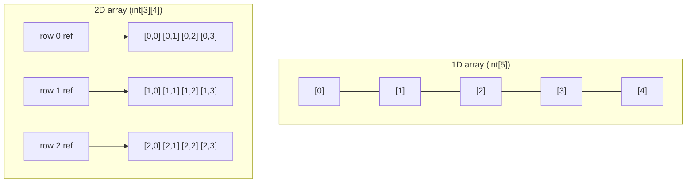

#### Interview question — Common interview question

**Q:** Array vs ArrayList — production code me kab kaunsa choose karoge? Array ko dynamically grow karna ho to kya karoge?

> Trade-offs:
> Array — fixed size, primitive support (int[], double[]), faster (no boxing, contiguous memory, JIT-friendly), simpler. Multi-dim native (int[][]).
> ArrayList — dynamic size, only objects (Integer not int), slightly slower (boxing for primitives, cache locality not guaranteed beyond ~10K elements), richer API (add, remove, indexOf).
> Production rules:
> 1) Performance-critical primitive collections (math, image processing, hot loops): arrays. int[] beats List<Integer> by 3-5x in tight loops due to no boxing + cache friendliness.
> 2) Generic application code where size varies: ArrayList. 90% of business logic falls here.
> 3) Multi-dimensional data (matrices, grids, lookup tables): arrays. int[][] cleaner than List<List<Integer>>.
> 4) Fixed-size known at compile time: arrays. e.g., RGB colors (3 elements), 7 days of week.
> 5) Frequent grow/shrink: ArrayList. Internal array doubling amortizes cost.
> 6) Need indexOf, contains, sublist: ArrayList — array doesn't have these (Arrays utility class has some but feels clunky).
> Dynamically growing arrays — three approaches:
> 1) Use ArrayList. 95% cases the right answer. Don't reinvent the wheel.
> 2) Manual grow with Arrays.copyOf(): if (count == arr.length) { arr = Arrays.copyOf(arr, arr.length * 2); }. This is exactly what ArrayList does internally.
> 3) Use a primitive collection library if you need dynamic + primitive: Eclipse Collections, fastutil. e.g., IntArrayList from Eclipse Collections — dynamic size but stores int[] internally, no boxing. For very large primitive collections, can be 2-3x more memory efficient than ArrayList<Integer>.
> Real production scenario — Razorpay processes 1M payments daily. Storing transaction amounts: long[] for in-memory analytics (money calc tight loops). List<Payment> for business object collection (rich API needed). Key insight — pick by access pattern, not by size alone.
> Common pitfall: Arrays.asList(arr) gotcha. It returns a FIXED-SIZE list backed by array. arr.add(x) → UnsupportedOperationException. To get a real ArrayList: new ArrayList<>(Arrays.asList(arr)).
> [Difficulty: Medium · Asked at: Amazon, Atlassian, Razorpay, Microsoft. Follow-ups: 'ArrayList resize cost amortized analysis?', 'Why doesn't Java have List<int>?']

### String methods & immutability

#### Kya hai? — What is the String class?

String Java me ek IMMUTABLE class hai — once created, content change nahi ho sakta. Sub kuch jo String change karta hai wo actually new String banata hai.

String pool ek special memory area hai (heap me) jaha string literals deduplicate hote hain. "hello" do baar likha — same object reference milta hai. Memory efficient.

Beginner ke liye yaad rakh: Strings sabse common reference type hain. equals() use karna for comparison, not ==. String pool aur immutability concept clear hone se 80% Java string bugs avoid ho jaate hain.

#### Kyun zaroori hai? — Why is String immutable?

Thread safety: immutable objects multiple threads share kar sakte hain bina synchronization ke. Strings are massively shared in Java apps — config keys, hashmap keys, log messages.

Caching/hashing: String ka hashCode() bana ke cache ho sakta hai (immutable hai, change nahi hoga). HashMap performance is heavily reliant on this.

Security: passwords, file paths, URLs as Strings can't be tampered after creation. Caller passes 'admin' to checkPermission, callee can't mutate to 'guest'.

Memory optimization: String pool deduplicates literals. Same "hello" 1000 jagah likha — ek object, 1000 references. Without immutability, pool not safe.

Trade-off: every modification creates new String. "a" + "b" + "c" creates 2 intermediate Strings. Performance hit in concatenation-heavy loops — that's where StringBuilder helps.

#### Kaise kaam karta hai? — How Strings work + common methods

Creation: String s = "hello" — pool reference. String s = new String("hello") — explicitly creates new object on heap, NOT pool. s.intern() returns pool reference.

Equality: == compares references. .equals() compares content. "hello" == "hello" true (same pool entry). new String("hello") == "hello" false. Always use .equals() for content comparison.

Common methods: length(), charAt(int), substring(int, int), indexOf(String), lastIndexOf(String), contains(CharSequence), startsWith/endsWith, replace, split, toUpperCase, toLowerCase, trim, strip (Java 11+).

String.format() for templating: String.format("User %s scored %d", name, score). Java 15+ has formatted String API on String itself: "User %s".formatted(name).

Text blocks (Java 15+): """\n...multiline...""". Cleaner than escape-heavy concatenation for SQL, JSON, HTML.

Common gotchas: split(".") split with regex — '.' matches any char. Use split("\\."). Empty trailing strings dropped by default — split("a,,,", -1) keeps them.

```java
public class StringDemo {

    public static void main(String[] args) {
        // Pool vs new
        String a = "Razorpay";
        String b = "Razorpay";
        String c = new String("Razorpay");

        System.out.println(a == b);          // true (same pool)
        System.out.println(a == c);          // false (different objects)
        System.out.println(a.equals(c));     // true (same content)

        // Common operations — all return NEW Strings (immutable!)
        String name = "  Rohan Sharma  ";
        System.out.println(name.length());            // 16
        System.out.println(name.trim());              // "Rohan Sharma"
        System.out.println(name.toUpperCase());       // "  ROHAN SHARMA  "
        System.out.println(name.replace("Sharma", "Verma"));  // "  Rohan Verma  "

        // Substring
        String email = "rohan@razorpay.com";
        int atIdx = email.indexOf('@');
        String username = email.substring(0, atIdx);  // "rohan"
        String domain = email.substring(atIdx + 1);   // "razorpay.com"

        // Split — careful with regex
        String csv = "name,age,city";
        String[] parts = csv.split(",");              // ["name", "age", "city"]

        // Split gotcha
        String version = "1.2.3";
        // String[] segs = version.split(".");        // WRONG — '.' is regex any-char
        String[] segs = version.split("\\.");        // correct

        // Modern formatting (Java 15+)
        String greeting = "Hello %s, you have ₹%d in wallet"
            .formatted("Rohan", 5000);

        // Text blocks (Java 15+)
        String json = """
            {
              "userId": "%s",
              "amount": %d
            }
            """.formatted("usr_123", 5000);

        // Equality habit
        String userInput = readUserInput();
        if ("admin".equals(userInput)) {  // null-safe — left side null check unnecessary
            // ...
        }
    }

    static String readUserInput() { return ""; }
}
```

#### Real-life example — Real-life example — Phone number normalization

Indian phone numbers many formats me aate hain: +91-9876543210, 9876543210, +919876543210, (098) 7654-3210, 0 9876 543 210. Database me ek consistent format chahiye for matching/dedup.

Normalization: strip non-digits, validate length (10 digits for Indian mobile), prepend country code if missing. Typical user-facing form input ko standardize karte hain.

Approach: Strings ki immutability respect kari — chained method calls. Replace, length checks, substring with concat — har step new String produce karta hai but code readable rahe.

Production tip: Strings ki chaining me each operation O(n) hai. 10-step pipeline on 1M phone numbers — perf check karo. For very high-volume scenarios, regex-based normalization or compiled Pattern + matcher faster than method chaining.

```java
import java.util.regex.Pattern;

public class PhoneNormalizer {

    private static final Pattern DIGITS_ONLY = Pattern.compile("\\D+");

    public static String normalize(String input) {
        if (input == null || input.isBlank()) {
            throw new IllegalArgumentException("Phone is null/empty");
        }

        // Strip non-digits — using regex
        String digits = DIGITS_ONLY.matcher(input).replaceAll("");

        // Handle Indian format variations
        if (digits.length() == 10) {
            // 9876543210 → +919876543210
            return "+91" + digits;
        }
        if (digits.length() == 11 && digits.startsWith("0")) {
            // 09876543210 → +919876543210
            return "+91" + digits.substring(1);
        }
        if (digits.length() == 12 && digits.startsWith("91")) {
            // 919876543210 → +919876543210
            return "+" + digits;
        }
        if (digits.length() == 13 && digits.startsWith("919")) {
            // already has +91 stripped, edge case
            return "+" + digits.substring(0, 12);
        }

        throw new IllegalArgumentException("Invalid phone format: " + input);
    }

    public static void main(String[] args) {
        // All normalize to +919876543210
        String[] inputs = {
            "+91-9876543210",
            "9876543210",
            "+919876543210",
            "(098) 7654-3210",
            "0 9876 543 210"
        };
        for (String in : inputs) {
            try {
                System.out.println(in + " → " + normalize(in));
            } catch (IllegalArgumentException e) {
                System.out.println(in + " → INVALID");
            }
        }
    }
}
```

#### Visual — String pool vs heap (new String)

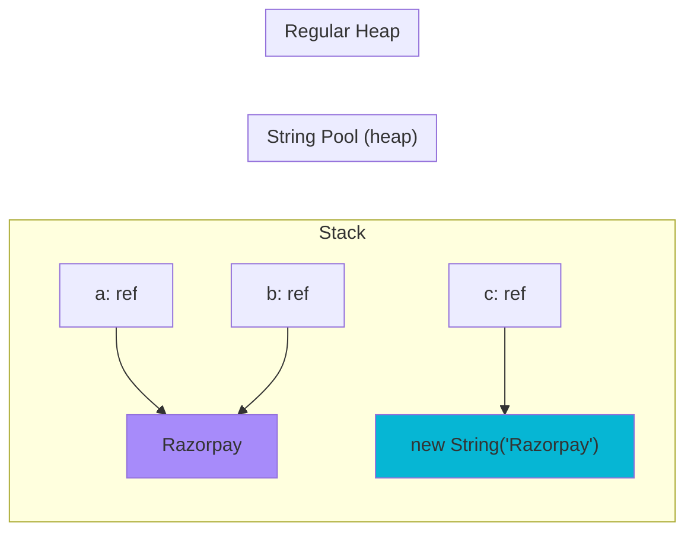

#### Interview question — Common interview question

**Q:** Why is String immutable in Java? String pool kya hai aur intern() method kab use karte hain?

> String immutability ke 4 main reasons hain — sab inter-related:
> 1) Thread safety. Immutable objects are inherently thread-safe — koi mutation nahi to race condition impossible. Java apps me Strings massively shared (config, log keys, HashMap keys). Without immutability, har shared String pe synchronization needed — performance disaster.
> 2) Hashing performance. HashMap ka backbone hashCode hai. Mutable hashes broken HashMap ki tarah hain — key change hua, lookup nahi milega. Strings immutable hain to hashCode cache kar liya jata hai (computed once on first call). HashMap operations on String keys 10-100x faster.
> 3) Security. Passwords, URLs, file paths as Strings safe hain. Caller pass karta hai 'admin', method internally mutate nahi kar sakta to 'guest'. Authentication logic predictable.
> 4) String pool optimization. Pool can deduplicate literals only because they're immutable. 'hello' 1 baar memory me, 1000 references share kar sakte hain. Without immutability, pool unsafe.
> String pool — JVM ka special heap area where String literals are deduplicated. Kab populate hota hai: 1) String literals at compile time. 2) String constants from class files. 3) Explicit s.intern() calls.
> Mechanism: String s1 = "hello" — JVM checks pool. If "hello" exists, returns existing reference. Otherwise creates, adds to pool, returns. String s2 = "hello" — finds existing entry, same reference. s1 == s2 returns true.
> new String("hello") explicitly creates a new object on regular heap, NOT in pool. Reference points to new object. s1 == new String("hello") returns false. Useful when you specifically need distinct objects (rare).
> intern() method — String s = new String("hello").intern() returns the POOL reference. If pool doesn't have "hello", adds it. After intern, s == "hello" returns true.
> When to use intern() in production:
> 1) Memory optimization for repeating Strings. Reading 1M log lines me 100K unique Strings — without intern, 1M objects. With intern, 100K pool entries + 1M references. Massive memory saving.
> 2) Fast equality comparison. After intern, == works for content comparison (same as equals but faster). Useful in hot paths where String comparison is bottleneck.
> Caveats: 1) intern() itself has overhead — synchronized lookup in pool. Not for single comparisons. 2) Pool size limited (configurable via -XX:StringTableSize). Excessive interning can fill it. 3) Older JDKs (pre-Java 7) had pool in PermGen with strict size limits — caused OutOfMemoryError. Java 7+ moved pool to main heap, less risky.
> Real production scenario: financial systems processing millions of currency codes ("INR", "USD", "EUR"). Sirf 200 unique codes but billions of records. Intern karke memory savings huge.
> [Difficulty: Hard · Asked at: Amazon, Microsoft, Atlassian, Razorpay, Goldman Sachs. Follow-ups: 'String concat me + operator JVM kaise handle karta hai?', 'Why doesn't String.equals() use ==?']

### StringBuilder vs StringBuffer

#### Kya hai? — What are StringBuilder and StringBuffer?

StringBuilder aur StringBuffer mutable string-like classes hain — internally character array maintain karte hain jo grow ho sakta hai. Append, insert, delete operations directly modify same buffer.

StringBuilder (Java 5+) — single-threaded use, fast, NOT thread-safe. StringBuffer (Java 1.0+) — synchronized methods, thread-safe but slower (5-15% overhead).

Beginner ke liye yaad rakh: 99% cases me StringBuilder. StringBuffer use karo SIRF when explicitly multi-threaded mutation chahiye — extremely rare in modern code (immutable Strings + concurrent collections preferred).

#### Kyun zaroori hai? — Why StringBuilder over String concatenation?

String immutable hai — har + ya .concat() new String banata hai. Loop me concat = O(n²) complexity. 10000 concats = 50 million char copies. Production hang.

StringBuilder mutable internal array maintain karta hai. append O(1) amortized (occasional resize doubles capacity). 10000 appends = ~10000 char additions, plus log₂(10000) resizes. O(n) total.

Beginner test: 1 lakh String concatenations vs StringBuilder appends. String version 10+ seconds. StringBuilder 50ms. Same end result.

Java compiler kabhi kabhi optimize karta hai (string + concatenation me StringBuilder use kar deta hai internally). But loops me reliable nahi — explicit StringBuilder safer.

#### Kaise kaam karta hai? — How they work + when to use

Construction: new StringBuilder() (default 16 char capacity). new StringBuilder(int capacity) — pre-size if you know final length, avoid resizes.

Methods: append(any) — chains, returns this. insert(idx, value), delete(start, end), reverse(), setCharAt(int, char), substring(int, int).

Conversion: toString() — converts to String. After toString, StringBuilder still mutable, String is snapshot.

StringBuilder vs StringBuffer code identical — only thread safety differs. Refactor by import alone if needed.

Capacity management: ensureCapacity(int) pre-grows array. trimToSize() shrinks. Internal char[] doubles when full.

Performance: pre-sizing helps. SB capacity 100 banake 100 chars append vs default 16 + 3 resizes (16→32→64→128). Saves array copy work.

```java
public class StringBuilderDemo {

    public static void main(String[] args) {
        // ❌ BAD — String + in loop is O(n²)
        String slow = "";
        for (int i = 0; i < 10000; i++) {
            slow += i;  // creates 10000 intermediate Strings!
        }

        // ✅ GOOD — StringBuilder is O(n)
        StringBuilder sb = new StringBuilder(50000);  // pre-size
        for (int i = 0; i < 10000; i++) {
            sb.append(i);
        }
        String fast = sb.toString();

        // Method chaining (returns this for fluency)
        String html = new StringBuilder()
            .append("<div class='order'>")
            .append("<h2>")
            .append("Order #")
            .append(12345)
            .append("</h2>")
            .append("<p>Amount: ₹").append(999.50).append("</p>")
            .append("</div>")
            .toString();

        // Common operations
        StringBuilder query = new StringBuilder("SELECT * FROM orders WHERE 1=1");
        if (filterByStatus) {
            query.append(" AND status = ?");
        }
        if (filterByDate) {
            query.append(" AND created_at >= ?");
        }
        // Cleanly building dynamic SQL

        // Insert + reverse
        StringBuilder palindrome = new StringBuilder("abc");
        palindrome.append("ba");
        palindrome.insert(3, "_");           // "abc_ba"
        StringBuilder reversed = palindrome.reverse();  // "ab_cba"

        // StringBuffer — same API, thread-safe
        StringBuffer threadSafe = new StringBuffer();
        threadSafe.append("Multi-threaded mutation");
        // synchronized methods, slightly slower

        boolean filterByStatus = false;
        boolean filterByDate = false;
    }
}
```

#### Real-life example — Real-life example — Dynamic SQL builder for catalog search

Flipkart's catalog search API supports 10+ optional filters: price range, brand, rating, in-stock, free delivery, etc. Backend dynamically builds SQL based on which filters user selected.

Without StringBuilder: hard to read concatenation, performance issues, security risk (SQL injection if not parameterized). With StringBuilder: clean, fast, structured.

Production approach: StringBuilder for SQL skeleton + ArrayList<Object> for parameters. Combine into PreparedStatement — SQL injection safe.

Gotcha: never directly concat user input into SQL with +. Always use parameterized queries. StringBuilder helps with the SQL TEMPLATE structure, not values.

```java
import java.util.ArrayList;
import java.util.List;

// Flipkart-style dynamic catalog search query builder
public class CatalogQueryBuilder {

    private final StringBuilder sql;
    private final List<Object> params;

    public CatalogQueryBuilder() {
        this.sql = new StringBuilder("SELECT * FROM products WHERE 1=1");
        this.params = new ArrayList<>();
    }

    public CatalogQueryBuilder priceRange(Long minPaise, Long maxPaise) {
        if (minPaise != null) {
            sql.append(" AND price_paise >= ?");
            params.add(minPaise);
        }
        if (maxPaise != null) {
            sql.append(" AND price_paise <= ?");
            params.add(maxPaise);
        }
        return this;
    }

    public CatalogQueryBuilder brand(String brandSlug) {
        if (brandSlug != null && !brandSlug.isBlank()) {
            sql.append(" AND brand_slug = ?");
            params.add(brandSlug);
        }
        return this;
    }

    public CatalogQueryBuilder minRating(Double rating) {
        if (rating != null) {
            sql.append(" AND avg_rating >= ?");
            params.add(rating);
        }
        return this;
    }

    public CatalogQueryBuilder inStockOnly(boolean inStock) {
        if (inStock) {
            sql.append(" AND stock_count > 0");
        }
        return this;
    }

    public CatalogQueryBuilder orderByRelevance() {
        sql.append(" ORDER BY relevance_score DESC, avg_rating DESC");
        return this;
    }

    public Query build() {
        return new Query(sql.toString(), List.copyOf(params));
    }

    public static void main(String[] args) {
        Query q = new CatalogQueryBuilder()
            .priceRange(50000L, 500000L)   // ₹500-5000
            .brand("apple")
            .minRating(4.0)
            .inStockOnly(true)
            .orderByRelevance()
            .build();

        // Pass to JDBC PreparedStatement — safe from SQL injection
        System.out.println(q.sql);
        // SELECT * FROM products WHERE 1=1 AND price_paise >= ?
        // AND price_paise <= ? AND brand_slug = ? AND avg_rating >= ?
        // AND stock_count > 0 ORDER BY relevance_score DESC, avg_rating DESC
        System.out.println(q.params);
        // [50000, 500000, apple, 4.0]
    }
}

record Query(String sql, List<Object> params) {}
```

#### Visual — String concat vs StringBuilder (memory ops)

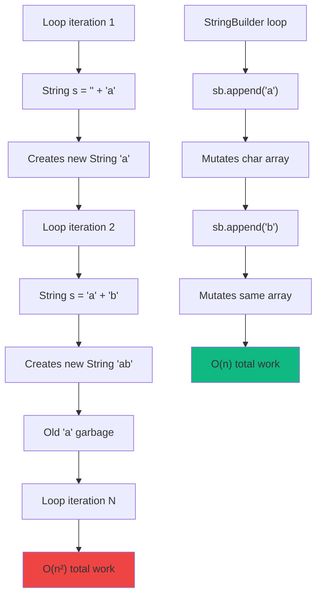

#### Interview question — Common interview question

**Q:** StringBuilder, StringBuffer, aur String concatenation (+) — performance + thread safety angle se compare karo. Modern Java code me StringBuffer kab use karoge?

> Performance comparison (single-threaded):
> String + in loop: O(n²). For n=10000, ~10 seconds. Each + creates new String, copies all previous chars.
> StringBuilder: O(n). For n=10000, ~50ms. Mutable internal array, append in place. Resizes happen but amortized O(1).
> StringBuffer: O(n) but ~10-15% slower than StringBuilder due to method-level synchronization. Same logic.
> Concatenation operator (+): for SIMPLE expressions like 'Hello ' + name + '!', Java compiler internally rewrites to use StringBuilder. So this is NOT slow for one-shot concatenation.
> BUT in LOOPS, compiler can't optimize because each iteration's + creates new StringBuilder (compiler isn't smart enough to hoist). That's why loops with + are slow.
> Thread safety:
> String: thread-safe (immutable). Multiple threads can read concurrently.
> StringBuilder: NOT thread-safe. Concurrent modification → corrupted internal state, potential exceptions, garbage data. Single-threaded use only.
> StringBuffer: thread-safe. All public methods synchronized. Multiple threads can append/insert without external synchronization.
> When to use which in modern Java:
> 1) String concatenation operator (+) — single-line concat, prefer for readability. 'Hello ' + name + ', age ' + age fine.
> 2) StringBuilder — loops, multi-step building, dynamic SQL/JSON construction. 99% of mutable string scenarios.
> 3) StringBuffer — should I ever use this? Honestly, almost never in modern code. Reasons:
>     a) Multi-threaded mutation of strings is itself questionable design. Usually you want immutable Strings shared, or thread-local mutable builders.
>     b) If you really need thread-safe accumulation, ConcurrentLinkedQueue<String> + final concat is cleaner.
>     c) Worker-thread pattern: each thread has own StringBuilder, results merged at end.
>     d) Reactive streams: collectors handle concatenation thread-safely.
> Real scenarios where StringBuffer might appear: legacy code (Java 1.0-1.4 era), Servlet response building (mostly historical), thread-safe string accumulator in shared state. Last resort.
> Modern alternative: StringJoiner (Java 8+) for simple delimited joining. Streams.collect(Collectors.joining(',')) for collection-to-String.
> Production rule: write StringBuilder by default. Profile actual hot paths. If string building in tight loop is bottleneck (often it isn't — DB/network usually dominates), then optimize. Don't reach for StringBuffer reflexively for thread safety — reconsider the design.
> [Difficulty: Medium-Hard · Asked at: Amazon, Microsoft, Atlassian, Razorpay, Goldman Sachs. Follow-ups: 'Java compiler ka Strings + concat ka kya optimization hai?', 'StringJoiner kab use karte ho?']

## OOP Concepts

### Class, object, constructors

#### Kya hai? — What are classes and objects?

Class ek blueprint hai — fields (data) + methods (behavior) ka template. Object us blueprint se bana hua actual instance — heap pe live data with state.

Real-life analogy le — class architectural drawing of a house. Object actual constructed house. Drawing ek hai, kitne bhi houses (objects) us drawing se ban sakte hain. Har house ki apni state (color, residents).

Beginner ke liye yaad rakh: class declare karta hai 'kya hota hai', object 'wo cheez actually banti hai'. new keyword se object banta hai — heap pe memory allocate hoti hai, constructor chalta hai, reference milta hai.

#### Kyun zaroori hai? — Why classes? Why not just functions and data?

Encapsulation: data + operations on that data ek jagah. Customer class me name, email + sendWelcomeEmail() saath hain. Cohesive — Customer ke saare concerns ek class me.

Modularity: 1000-line program me 50 classes break karne se debug, test, maintain easy. Har class ek single responsibility — naya feature add karte time chhote area me change.

Reuse: ek hi class se infinite objects. Customer class me 1 lakh customers represent ho sakte hain — ek blueprint, lakh instances.

Abstraction: caller class ka internal implementation jaane bina use karta hai. customer.sendEmail() — kaise email jaata hai (SMTP, SendGrid, AWS SES) hidden hai.

#### Kaise kaam karta hai? — Class structure + constructors

Class structure: fields (state), constructors (initialization), methods (behavior), nested classes (rarely). Convention — fields private, methods public, getters/setters where needed.

Constructor — special method jo new se call hoti hai. Naam class se same. No return type. Multiple constructors via overloading. this() to call other constructor in same class. super() for parent class constructor.

Default constructor: agar tu kuch nahi likha, Java automatic empty no-arg constructor add kar deta hai. Tu koi constructor likha to default vanish ho jaata hai — agar no-arg chahiye to explicit likhna padega.

Object lifecycle: new Order() → 1) Memory allocate hoti hai heap pe. 2) Fields default values pe set (null, 0, false). 3) Field initializers chalte hain. 4) Constructor body execute hoti hai. 5) Reference return hota hai.

Modern Java alternative: records (Java 16+). public record Order(int id, long amount) {} — immutable data class with auto-generated constructor, equals, hashCode, toString. Use for DTOs, value objects.

```java
// Razorpay-style Customer class with full lifecycle
public class Customer {
    // Fields — private (encapsulation)
    private final String customerId;       // immutable after creation
    private String name;
    private String email;
    private String phone;
    private final Instant createdAt;       // set once at creation

    // Field initializer — runs before constructor body
    private boolean isActive = true;

    // Primary constructor — full state
    public Customer(String customerId, String name, String email, String phone) {
        this.customerId = customerId;
        this.name = name;
        this.email = email;
        this.phone = phone;
        this.createdAt = Instant.now();
    }

    // Overloaded constructor — minimal info
    public Customer(String customerId, String email) {
        // Constructor chaining with this() — DRY principle
        this(customerId, "Unknown", email, "");
    }

    // Methods
    public void updateContact(String newEmail, String newPhone) {
        this.email = newEmail;
        this.phone = newPhone;
    }

    public void deactivate() {
        this.isActive = false;
    }

    // Getter
    public String getName() {
        return name;
    }

    public static void main(String[] args) {
        // new keyword triggers full lifecycle
        Customer c1 = new Customer("cus_abc", "Rohan", "rohan@x.com", "+91...");
        Customer c2 = new Customer("cus_xyz", "priya@y.com");

        c1.updateContact("rohan2@x.com", "+91...");
    }
}

// Modern alternative — record (immutable, concise)
record CustomerSummary(String customerId, String name, String email) {
    // Auto-generated: constructor, getters (id(), name(), email()),
    // equals(), hashCode(), toString()
    // Compact constructor for validation
    CustomerSummary {
        if (customerId == null || customerId.isBlank()) {
            throw new IllegalArgumentException("customerId required");
        }
    }
}
```

#### Real-life example — Real-life example — Swiggy delivery partner class

Swiggy ke delivery partners (riders) ko model karna ek classic OOP example hai. Each partner me state hoti hai (id, name, phone, vehicle, current location, online/offline status, completed deliveries) + behavior (acceptOrder, updateLocation, completeDelivery).

Why class design matters: real-time location updates millions per second. Partner state in-memory hota hai. Class design tight aur thread-safe hona chahiye otherwise location updates corrupt.

Production patterns visible here: 1) immutable identifiers (id, joinedAt) — final fields. 2) mutable state (location, status) — controlled via methods. 3) defensive validation in constructor.

```java
// Swiggy delivery partner — production-style class
public class DeliveryPartner {

    // Immutable identity — final
    private final String partnerId;
    private final String name;
    private final String phone;
    private final Instant joinedAt;
    private final Vehicle vehicle;

    // Mutable state — controlled
    private Location currentLocation;
    private PartnerStatus status;
    private int completedDeliveries;
    private double averageRating;

    public DeliveryPartner(
            String partnerId,
            String name,
            String phone,
            Vehicle vehicle) {
        // Validate — fail fast
        if (partnerId == null || partnerId.isBlank()) {
            throw new IllegalArgumentException("partnerId required");
        }
        if (phone == null || !phone.matches("\\+91[0-9]{10}")) {
            throw new IllegalArgumentException("Invalid phone format");
        }

        this.partnerId = partnerId;
        this.name = name;
        this.phone = phone;
        this.vehicle = vehicle;
        this.joinedAt = Instant.now();
        this.status = PartnerStatus.OFFLINE;
        this.completedDeliveries = 0;
        this.averageRating = 0.0;
    }

    // Behavior methods
    public void goOnline() {
        this.status = PartnerStatus.ONLINE;
    }

    public void goOffline() {
        this.status = PartnerStatus.OFFLINE;
    }

    public void updateLocation(double lat, double lng) {
        this.currentLocation = new Location(lat, lng);
    }

    public void recordDelivery(double rating) {
        this.completedDeliveries++;
        // running average
        this.averageRating =
            ((this.averageRating * (completedDeliveries - 1)) + rating)
            / completedDeliveries;
    }

    public boolean canAcceptOrder() {
        return status == PartnerStatus.ONLINE && currentLocation != null;
    }

    // Getters (no public setters — encapsulation)
    public String getPartnerId() { return partnerId; }
    public PartnerStatus getStatus() { return status; }
    public int getCompletedDeliveries() { return completedDeliveries; }
}

enum PartnerStatus { ONLINE, OFFLINE, ON_DELIVERY }
record Vehicle(String type, String number) {}
record Location(double lat, double lng) {}
```

#### Visual — Class to object lifecycle


#### Interview question — Common interview question

**Q:** Constructor overloading aur this()/super() ka use case bata. Modern Java me records vs traditional classes — production code me kab kaunsa use karoge?

> Constructor overloading — same class me multiple constructors with different parameter lists. Compiler signature dekh ke decide karta hai which one to call. Useful for providing convenience constructors with sensible defaults.
> Example: class Order has 4-field constructor (id, customerId, amount, status) and a 2-field convenience constructor (id, amount) jo defaults pass karta hai. Caller flexibility — full control if needed, defaults if not.
> this() call — same class ke another constructor ko delegate karta hai. Must be FIRST statement. Eliminates code duplication. public Order(int id, long amount) { this(id, null, amount, OrderStatus.CREATED); }
> super() call — parent class ka constructor invoke karta hai. Must be FIRST statement. If absent, Java implicitly inserts super() (no-arg). If parent has no no-arg constructor, child MUST explicitly call super(args) — compile error otherwise.
> Order of execution: 1) super() (parent constructor) runs first. 2) this class ke field initializers run. 3) constructor body runs. 4) reference returned to caller.
> Records (Java 16+) vs traditional classes — major shift in modern Java:
> Records auto-generate: 1) Constructor with all fields. 2) Accessor methods (id(), name() — not getId()). 3) equals() based on all fields. 4) hashCode() based on all fields. 5) toString() with all fields formatted.
> Records are IMMUTABLE — fields are final. No setters. Want changed value? Use 'wither' pattern: order.withStatus(NEW_STATUS) — needs explicit method. Or modern Java preview 'with' expression.
> When to use records:
> 1) DTOs — data transfer between layers. Controller → Service → Repository. Records ideal.
> 2) Value objects — Money, Address, Coordinates. Equality by content, immutable.
> 3) Tuple-like return types — record SearchResult(List<Order> orders, int total, int page). Cleaner than Map<String, Object>.
> 4) Records with patterns matching (Java 21+) — switch over records with destructuring. Powerful for sealed type hierarchies.
> When traditional classes:
> 1) Mutable state needed (Customer with updateContact method). Records don't allow setters cleanly.
> 2) Inheritance — records can implement interfaces but can't extend other classes.
> 3) Complex behavior — many methods, internal state machines. Records meant for data, not heavy logic.
> 4) Frameworks requiring no-arg constructor — JPA, Jackson, etc. (though many now support records).
> Real production scenario: Razorpay backend uses records for API request/response DTOs (PaymentRequest, RefundResponse). Traditional classes for entities (Customer, Payment) where mutation + JPA integration needed.
> Modern Java best practice: records for data, classes for behavior. Don't force everything into one or the other.
> [Difficulty: Hard · Asked at: Amazon, Microsoft, Atlassian, Razorpay. Follow-ups: 'Records ke andar mutable field rakhna possible hai?', 'sealed classes vs records?']

### Inheritance — single, multilevel, hierarchical

#### Kya hai? — What is inheritance?

Inheritance ek class ko doosri class ke fields aur methods inherit karne deti hai. extends keyword se hota hai. Parent class (superclass), child class (subclass). Child me sab kuch inherit hota hai (private excluded), plus child apna naya stuff add kar sakti hai.

Java me inheritance types: single (one parent), multilevel (chain — A extends B extends C), hierarchical (multiple children of one parent). Multiple inheritance (one class extends two parents) — NOT allowed for classes (interfaces se possible).

Beginner analogy: parent class 'Vehicle' ke fields hain — wheels, color, brand. Child class 'Car' apne fields add karti hai — sunroof, gear type. Car automatically Vehicle ke fields rakhti hai, plus apna kuch.

#### Kyun zaroori hai? — Why inheritance?

Code reuse: parent class me common logic, multiple children share karte hain. Bina inheritance, har child me same code repeat hota.

Polymorphism enable karta hai: parent reference se child object handle kar sakte ho. Vehicle v = new Car(); v.start(); — Vehicle method on Car instance.

Type hierarchy: real-world relationships model karne deta hai. CardPayment, UPIPayment, NetBankingPayment — all 'is-a' Payment. Common 'process' method parent me, specific logic child me.

Caveat: inheritance over composition is over-used in 90s/2000s code. Modern best practice — favor composition over inheritance. Inheritance only when true 'is-a' relationship and parent is designed for extension.

#### Kaise kaam karta hai? — How inheritance works

Syntax: class Car extends Vehicle. Single inheritance only — Car can extend ONE class.

Method override: child redefines parent method with same signature. @Override annotation — compiler bata dega agar tu method signature galat type kiya. Best practice always use @Override.

super keyword: super.method() — call parent's version of overridden method. super(args) — call parent's constructor (must be first line in child constructor).

Constructor chain: child constructor pehle parent constructor invoke karta hai (explicit super(...) ya implicit super()). Parent first initialize, then child fields.

final keyword: final class Foo — can't be extended. final method — can't be overridden. Useful for security-critical or immutable classes (String, Integer are final).

Common gotcha: parent's private fields/methods NOT inherited (technically inherited but invisible). Use protected for fields child should access. Public for external + child both. Default (package-private) for same-package access.

```java
// Razorpay payment hierarchy — classic inheritance use case
public abstract class Payment {

    // Common state — protected so children can access
    protected final String paymentId;
    protected final long amountInPaise;
    protected final String currency;
    protected PaymentStatus status;

    // Common constructor
    protected Payment(String paymentId, long amountInPaise, String currency) {
        this.paymentId = paymentId;
        this.amountInPaise = amountInPaise;
        this.currency = currency;
        this.status = PaymentStatus.CREATED;
    }

    // Common method — final, children can't override
    public final void markAuthorized() {
        this.status = PaymentStatus.AUTHORIZED;
    }

    // Hook method — children MUST override
    public abstract ProcessResult process();

    // Optional override — children CAN customize
    public String getDisplayDescription() {
        return "Payment of ₹" + (amountInPaise / 100.0);
    }
}

// Single-level inheritance
public class CardPayment extends Payment {

    private final String cardNetwork;     // Visa, Mastercard, RuPay
    private final String last4Digits;

    public CardPayment(String id, long amount, String currency,
                       String network, String last4) {
        super(id, amount, currency);       // parent constructor first
        this.cardNetwork = network;
        this.last4Digits = last4;
    }

    @Override
    public ProcessResult process() {
        // Card-specific gateway call
        return ProcessResult.success("Charged via " + cardNetwork);
    }

    @Override
    public String getDisplayDescription() {
        // Override for card-specific format
        return super.getDisplayDescription()
            + " on " + cardNetwork + " ****" + last4Digits;
    }
}

public class UPIPayment extends Payment {

    private final String vpa;     // Virtual Payment Address: rohan@razorpay

    public UPIPayment(String id, long amount, String currency, String vpa) {
        super(id, amount, currency);
        this.vpa = vpa;
    }

    @Override
    public ProcessResult process() {
        // UPI-specific NPCI call
        return ProcessResult.success("UPI charge to " + vpa);
    }
}

// Multilevel — class hierarchy depth
public class InternationalCardPayment extends CardPayment {

    private final String countryCode;
    private final double fxRate;

    public InternationalCardPayment(String id, long amount, String currency,
                                     String network, String last4,
                                     String country, double fxRate) {
        super(id, amount, currency, network, last4);
        this.countryCode = country;
        this.fxRate = fxRate;
    }

    @Override
    public ProcessResult process() {
        // International gateway has additional FX conversion
        long convertedAmount = (long) (amountInPaise * fxRate);
        return ProcessResult.success(
            "International charge: " + convertedAmount + " (FX " + fxRate + ")"
        );
    }
}

enum PaymentStatus { CREATED, AUTHORIZED, CAPTURED, FAILED }
record ProcessResult(String message) {
    static ProcessResult success(String msg) { return new ProcessResult(msg); }
}
```

#### Real-life example — Real-life example — JPA Entity hierarchy

Hibernate/JPA me audit-able entities ka common pattern hai — sab entities me createdAt, updatedAt, createdBy fields chahiye. Inheritance se DRY hota hai.

Approach: AuditableEntity abstract class banao with common fields + JPA lifecycle hooks (@PrePersist, @PreUpdate). Saari business entities (Order, Payment, Refund, Customer) extend karein. Common audit logic ek jagah, business logic alag.

Production gotcha: deep inheritance hierarchies (4-5 levels) maintenance nightmare ho sakti hain. Spring/Hibernate convention is 1-2 levels max. Beyond that, composition + interfaces preferred.

```java
import jakarta.persistence.*;
import java.time.Instant;

// Base auditable entity — common audit fields
@MappedSuperclass    // not a table itself, just inheritable fields
public abstract class AuditableEntity {

    @Column(name = "created_at", nullable = false, updatable = false)
    protected Instant createdAt;

    @Column(name = "updated_at", nullable = false)
    protected Instant updatedAt;

    @Column(name = "created_by", length = 64)
    protected String createdBy;

    // JPA lifecycle hooks — auto-set timestamps
    @PrePersist
    protected void onCreate() {
        Instant now = Instant.now();
        this.createdAt = now;
        this.updatedAt = now;
    }

    @PreUpdate
    protected void onUpdate() {
        this.updatedAt = Instant.now();
    }

    public Instant getCreatedAt() { return createdAt; }
    public Instant getUpdatedAt() { return updatedAt; }
}

// Concrete entity — inherits audit fields automatically
@Entity
@Table(name = "orders")
public class Order extends AuditableEntity {

    @Id
    @GeneratedValue
    private Long id;

    @Column(nullable = false)
    private String customerId;

    @Column(name = "amount_paise", nullable = false)
    private long amountInPaise;

    @Enumerated(EnumType.STRING)
    private OrderStatus status;

    // No need to redeclare createdAt, updatedAt, etc.
    // Inherited from AuditableEntity
}

@Entity
@Table(name = "payments")
public class Payment extends AuditableEntity {

    @Id
    @GeneratedValue
    private Long id;

    @Column(nullable = false)
    private String paymentReference;

    @Column(name = "amount_paise", nullable = false)
    private long amountInPaise;
    // Same — audit fields inherited
}

enum OrderStatus { CREATED, PAID, SHIPPED, DELIVERED, CANCELLED }
```

#### Visual — Payment class hierarchy

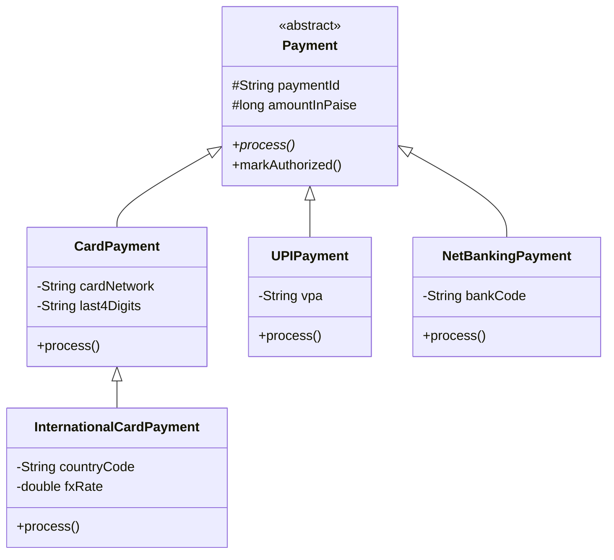

#### Interview question — Common interview question

**Q:** 'Composition over inheritance' principle kya hai? Production code me ek example bata jab inheritance use karna chahiye AUR ek jab composition better hai.

> 'Composition over inheritance' (also called 'has-a over is-a') — design principle from Gang of Four book. Says: prefer building classes by COMPOSING smaller objects rather than INHERITING from a parent.
> Reasons inheritance has fallen out of favor:
> 1) Tight coupling — child tightly bound to parent's implementation. Parent ka private detail change → all children potentially break. 'Fragile base class problem'.
> 2) Inflexibility — single inheritance limits design. Need behavior from two sources? Stuck.
> 3) Encapsulation violation — child can override parent methods, breaking parent's invariants. Parent designed for specific behavior, child changes semantics.
> 4) Hard to test — mocking parent classes is harder than mocking interfaces. Composition with interfaces gives natural seams.
> 5) Run-time vs compile-time behavior change — composition allows behavior swap at runtime. Inheritance is fixed at compile time.
> When inheritance IS appropriate (the few good cases):
> 1) True 'is-a' relationship with stable hierarchy. CardPayment IS-A Payment, always. Geometric shapes (Circle IS-A Shape).
> 2) Framework hooks — extend AbstractController, AbstractFilter. Framework defines extension points, you fill them in.
> 3) Template method pattern — parent defines algorithm skeleton, children fill in steps. Spring's JdbcTemplate, Hibernate's lifecycle hooks.
> 4) Protected fields shared across closely-related classes. JPA @MappedSuperclass for audit fields example I showed earlier.
> When composition is better (most cases):
> 1) Behavior reuse without is-a relationship. Logger logging behavior across classes — don't make Order extends Loggable. Compose: Order has-a Logger.
> 2) Multiple behaviors needed — Java single inheritance can't extend multiple parents. Composition combines any number.
> 3) Run-time flexibility. Stripe/Razorpay payment processor — strategy pattern. PaymentService has-a PaymentGateway. Swap gateway at runtime via DI.
> 4) Testing — composed dependencies are easier to mock than parent class internals.
> Concrete refactoring example:
> BAD (inheritance abuse):
> class EmailNotifier extends Logger { send() { logInfo(...); ... } }
> Why bad: EmailNotifier is NOT a Logger conceptually. It just uses logging. Coupling makes EmailNotifier change with Logger changes.
> GOOD (composition):
> class EmailNotifier { private final Logger logger; EmailNotifier(Logger l) { ... } send() { logger.info(...); } }
> EmailNotifier independently works, tests, evolves. Logger is just a collaborator.
> Real Razorpay-style example: PaymentService uses RetryStrategy. Old design: PaymentService extends RetryableService — wrong, PaymentService is not 'a kind of' retryable thing. Modern design: PaymentService has-a RetryStrategy. Inject specific strategy (ExponentialBackoff, FixedDelay, NoRetry) at runtime. Strategy pattern.
> Rule of thumb: 'is-a' clearly true and stable → maybe inheritance. 'has-a behavior' → composition. When in doubt, compose. You can refactor composition to inheritance later; reverse is harder.
> [Difficulty: Hard · Asked at: Amazon, Atlassian, Microsoft, Razorpay, Goldman Sachs. Follow-ups: 'Liskov Substitution Principle ke saath inheritance kaise tie karta hai?', 'Diamond problem in C++ aur Java me kaise handle hota hai?']

### Polymorphism — overload vs override

#### Kya hai? — What is polymorphism?

Polymorphism = 'multiple forms'. Ek hi method/operator alag-alag types pe alag-alag behave karta hai. Java me 2 types: compile-time (overloading) aur runtime (overriding).

Compile-time polymorphism — method overloading. Same name, different parameter list. Compiler decides which to call based on arguments.

Runtime polymorphism — method overriding. Child class redefines parent method. JVM at runtime decides which version based on actual object type (not reference type). Heart of OOP flexibility.

Beginner ke liye yaad rakh: overloading is convenience. Overriding is the real power — same code with different concrete types behaves differently. Foundation for all design patterns.

#### Kyun zaroori hai? — Why polymorphism matters?

Code generality: function takes Vehicle parameter, processes ANY vehicle (Car, Bike, Truck). New vehicle type added → no change in function. Open-closed principle in action.

Pluggability: payment system me Payment interface me alag-alag implementations (CardPayment, UPIPayment). Switch implementations without changing call sites.

Reduced coupling: caller depends on abstraction, not concrete class. Easier testing (mock implementations), easier feature addition.

Beginner ke liye real impact: polymorphism = clean code at scale. Without it, switch/if-else chains for type checking. With it, methods that adapt naturally.

#### Kaise kaam karta hai? — Overloading vs overriding

Overloading: same class me multiple methods with same name, different parameters (count or types). Compiler signature-match karta hai. Common: constructors, utility methods, builder APIs.

Overloading rules: 1) parameter list MUST differ. 2) return type alone different — NOT enough. 3) modifiers (public/private) can differ. 4) static methods can be overloaded.

Overriding: child class redefines parent method. Same signature (name, params, return type). @Override annotation MANDATORY for clarity. Runtime dispatch.

Overriding rules: 1) signature match. 2) return type same OR covariant (subtype of parent's return). 3) access modifier same OR more permissive (parent protected → child public OK; reverse not). 4) checked exceptions same OR fewer (can't add new).

Static vs instance: static methods can't be overridden (they're hidden, not overridden — different mechanism). Instance methods support overriding.

JVM dynamic dispatch: variable type checked at compile, but actual object type at runtime decides which method runs. Vehicle v = new Car(); v.start() — Car's start() runs.

```java
public class PolymorphismDemo {

    // Overloading — compile-time, same class
    public static int sum(int a, int b) {
        return a + b;
    }

    public static double sum(double a, double b) {
        return a + b;
    }

    public static int sum(int a, int b, int c) {
        return a + b + c;
    }

    // Cannot overload by return type alone
    // public static double sum(int a, int b) { ... }   // COMPILE ERROR

    public static void main(String[] args) {
        System.out.println(sum(2, 3));           // calls (int, int)
        System.out.println(sum(2.5, 3.5));       // calls (double, double)
        System.out.println(sum(1, 2, 3));        // calls (int, int, int)
    }
}

// Overriding — runtime, parent-child
abstract class NotificationChannel {
    public abstract void send(String userId, String message);

    // Default implementation — children CAN override
    public boolean isAvailable() {
        return true;
    }
}

class EmailChannel extends NotificationChannel {
    @Override
    public void send(String userId, String message) {
        // SMTP/SES specific logic
        System.out.println("Email to " + userId + ": " + message);
    }
}

class SMSChannel extends NotificationChannel {
    @Override
    public void send(String userId, String message) {
        // Twilio/MSG91 specific logic
        System.out.println("SMS to " + userId + ": " + message);
    }

    @Override
    public boolean isAvailable() {
        // SMS gateway can be down — runtime check
        return checkSmsGatewayHealth();
    }

    private boolean checkSmsGatewayHealth() { return true; }
}

class PushNotificationChannel extends NotificationChannel {
    @Override
    public void send(String userId, String message) {
        // FCM/APNs specific logic
        System.out.println("Push to " + userId + ": " + message);
    }
}

// Polymorphic method — same code, any channel
class NotificationService {
    public void broadcast(NotificationChannel channel, List<String> users, String msg) {
        if (!channel.isAvailable()) {
            System.out.println("Channel unavailable, queueing");
            return;
        }
        for (String userId : users) {
            channel.send(userId, msg);     // RUNTIME dispatch
        }
    }
}
```

#### Real-life example — Real-life example — Swiggy multi-channel notifications

Swiggy users ko notifications multiple channels se aati hain — push, SMS, email, WhatsApp. Same notification logic, alag-alag delivery.

Approach: NotificationChannel abstract class/interface define karo. Each channel concrete implementation. Service code generic — works with any channel via polymorphism.

Adding a new channel (e.g., WhatsApp Business API) = new class implementing interface. NO change to existing code. New code mein only new channel ka logic.

Production benefit: A/B testing easy. PushChannel vs SMSChannel ke conversion compare karna ho — service me param swap, baaki same. Polymorphism enabled this elegance.

```java
// Swiggy-style notification system
public interface NotificationChannel {
    NotificationResult send(String userId, NotificationContent content);
    String getChannelName();
    boolean supportsRichMedia();
}

// Polymorphic service — works with ANY channel
@Service
public class NotificationOrchestrator {

    private final Map<String, NotificationChannel> channels;

    @Autowired
    public NotificationOrchestrator(List<NotificationChannel> all) {
        this.channels = all.stream()
            .collect(Collectors.toMap(
                NotificationChannel::getChannelName,
                Function.identity()
            ));
    }

    // Same code, any channel
    public void notifyUser(
            String userId,
            NotificationContent content,
            String preferredChannel) {

        NotificationChannel channel = channels.get(preferredChannel);
        if (channel == null) {
            // Fallback to email
            channel = channels.get("email");
        }

        // Optional: rich media downgrade
        if (content.hasImage() && !channel.supportsRichMedia()) {
            content = content.withoutImage();
        }

        // RUNTIME polymorphism — channel.send() is correct impl
        NotificationResult result = channel.send(userId, content);
        if (!result.isSuccess()) {
            // Try fallback channel
            tryFallback(userId, content, preferredChannel);
        }
    }

    private void tryFallback(String userId, NotificationContent content, String failed) {
        // Use a different channel
    }
}

// Concrete implementations — each pluggable
@Component
class PushChannel implements NotificationChannel {
    public NotificationResult send(String userId, NotificationContent c) {
        // FCM/APNs call
        return NotificationResult.success();
    }
    public String getChannelName() { return "push"; }
    public boolean supportsRichMedia() { return true; }
}

@Component
class SMSChannel implements NotificationChannel {
    public NotificationResult send(String userId, NotificationContent c) {
        // Twilio/MSG91 call
        return NotificationResult.success();
    }
    public String getChannelName() { return "sms"; }
    public boolean supportsRichMedia() { return false; }   // text only
}

record NotificationContent(String body, String imageUrl) {
    public boolean hasImage() { return imageUrl != null; }
    public NotificationContent withoutImage() {
        return new NotificationContent(body, null);
    }
}

record NotificationResult(boolean success) {
    static NotificationResult success() { return new NotificationResult(true); }
}
```

#### Visual — Compile-time vs runtime polymorphism

```mermaid
flowchart TD
    A[Compile-time / Overloading] --> A1[Same class, multiple methods]
    A --> A2[Different parameters]
    A --> A3[Compiler picks at compile time]
    A --> A4[print&#40;int&#41; vs print&#40;String&#41;]

    B[Runtime / Overriding] --> B1[Parent + child class]
    B --> B2[Same signature]
    B --> B3[JVM picks at runtime]
    B --> B4["Vehicle v = new Car&#40;&#41;; v.start&#40;&#41;"]

    style A fill:#a78bfa
    style B fill:#06b6d4
```

#### Interview question — Common interview question

**Q:** Java me overriding kab work nahi karta? Static methods, private methods, final methods — kya kya override ho sakti hai aur kya nahi?

> Java me overriding fail/restricted hone ke specific cases hain:
> 1) Static methods — NOT overridden, HIDDEN. If parent has static method foo(), child redefining foo() doesn't override — it hides parent's. Compile-time dispatch based on REFERENCE type, not object type.
> Example: class Parent { static void log() { ... } } class Child extends Parent { static void log() { ... } } Parent.log() calls Parent's. Parent p = new Child(); p.log() calls Parent's (NOT Child's). Static methods bound to class.
> Why this matters: don't try polymorphism with static methods. Doesn't work like instance methods. Use instance methods for dynamic dispatch.
> 2) Private methods — NOT overridden, NOT visible to child. Each class has its own private foo(). Looks like override but isn't.
> Why: private methods are implementation details. Encapsulation — child shouldn't depend on parent's private internals. If you want extension, make it protected.
> 3) final methods — CAN'T be overridden. Compile error if child tries. Used to lock behavior.
> Example: parent has final void verify() — security-critical. Child can't replace this with weaker check. Defensive design.
> 4) Constructors — NOT inherited, NOT overridden. Each class has own constructors. Child constructor must call super() (parent constructor) explicitly or implicitly. But constructor itself is not 'overridden'.
> 5) Final classes — can't be extended at all. Hence, override irrelevant. String, Integer, all wrapper types are final in Java.
> Other override-related gotchas:
> Different return type — covariant return allowed. Parent returns Object, child returns String (subtype). Overriding works. But unrelated types — compile error.
> Different access modifier — broader allowed (parent protected → child public OK). Narrower NOT allowed (parent public → child private — compile error). Liskov Substitution Principle in action.
> Different exceptions — child can throw same OR fewer/narrower checked exceptions. Cannot add new checked exceptions parent doesn't declare. Runtime exceptions always allowed.
> @Override annotation — should be ALWAYS used. Compiler bata dega agar method actually overrides. Catches typos in method name (myMethod vs MyMethod), wrong signature, parent method renamed.
> Tricky question that comes up: 'Method hiding' vs 'method overriding' difference. Static methods are hidden (compile-time, by reference type). Instance methods are overridden (runtime, by object type).
> Practical advice for production: 1) Always use @Override. 2) Document if a method is intentionally NOT for overriding (final). 3) Avoid static method 'inheritance' — use plain utility classes instead. 4) Test overriding paths — runtime polymorphism behavior is the moat of bugs in inherited code.
> [Difficulty: Hard · Asked at: Amazon, Microsoft, Atlassian, Razorpay, Goldman Sachs. Follow-ups: 'Method hiding ka practical use case?', 'Can you override main() method?']

### Abstraction — abstract class & interface

#### Kya hai? — What is abstraction?

Abstraction matlab implementation hide karke sirf essential interface expose karna. User ko 'kya hota hai' bataao, 'kaise hota hai' hidden rakho.

Java me 2 main mechanisms: abstract class (partial abstraction — kuch methods abstract, kuch concrete) aur interface (full abstraction — all method signatures, no body in classic interfaces).

Real-life analogy: tu car drive karta hai — accelerator dabaate ho, car chalti hai. Andar engine combustion hota hai, fuel inject hota hai, transmission shift hoti hai. Tu kuch nahi jaanta — abstracted away.

Beginner ke liye yaad rakh: abstract class jab tu chahta hai shared CODE + interface. Interface jab pure contract chahiye. Java 8+ ne interfaces ko default methods diye hain — boundary blur hui hai.

#### Kyun zaroori hai? — Why abstraction?

Decoupling: caller depends on abstract contract, not concrete impl. Implementation swap kar sakte ho without caller changes. Razorpay payment gateway, Stripe, PayU — same interface, different implementations.

Maintainability: implementation change karo, contract same rakho — clients unaffected. Internal optimization without breaking API consumers.

Testing: mock interfaces easy. Production code uses RealPaymentGateway, tests use MockPaymentGateway. Both implement same interface.

Multiple inheritance: classes single inheritance, interfaces multiple. A class can implement many interfaces — combine behaviors.

Future-proofing: tomorrow new payment method (BNPL — Buy Now Pay Later) add karna hai. New class implementing PaymentGateway interface, inject via DI. Zero changes elsewhere.

#### Kaise kaam karta hai? — Abstract class vs interface

Abstract class: extends keyword. Has fields, constructors, concrete methods + abstract methods. Single inheritance — child can extend ONE abstract class. Use when you have shared CODE + want subclasses to fill specific methods.

Interface: implements keyword. All methods abstract by default (Java 7 and below). Java 8+ — default methods (with body), static methods. Java 9+ — private methods. Multiple inheritance OK — class can implement many interfaces.

Modern Java: interfaces with default methods reduce abstract class need. But abstract class still useful for shared state (fields), constructor logic, template method pattern.

Sealed types (Java 17+): sealed interface Shape permits Circle, Square. Closed type hierarchy — only listed classes can implement. Compiler enforces — pattern matching exhaustive.

When to use which:

- Need shared FIELDS → abstract class. Interfaces can't have instance fields.

- Need shared CODE only → interface with default methods (Java 8+).

- True 'is-a' relationship with shared lifecycle → abstract class.

- Capability/contract for unrelated classes → interface (Comparable, Iterable).

- Multiple type relationships needed → interfaces (class can implement many).

```java
// Abstract class — shared state + partial implementation
public abstract class CacheableRepository<T, ID> {

    // Shared field — concrete state
    protected final Map<ID, T> cache = new ConcurrentHashMap<>();
    protected final long cacheTtlSeconds;

    protected CacheableRepository(long ttl) {
        this.cacheTtlSeconds = ttl;
    }

    // Concrete method — uses cache
    public T findById(ID id) {
        T cached = cache.get(id);
        if (cached != null) return cached;

        T fromDb = loadFromDatabase(id);   // calls abstract method
        if (fromDb != null) {
            cache.put(id, fromDb);
        }
        return fromDb;
    }

    // Abstract — child MUST implement
    protected abstract T loadFromDatabase(ID id);

    // Hook method — child CAN override
    protected void onCacheMiss(ID id) {
        // default: do nothing, child can add metrics
    }
}

// Concrete subclass
public class CustomerRepository extends CacheableRepository<Customer, String> {

    private final JdbcTemplate jdbc;

    public CustomerRepository(JdbcTemplate jdbc) {
        super(300);   // 5-min cache TTL
        this.jdbc = jdbc;
    }

    @Override
    protected Customer loadFromDatabase(String customerId) {
        return jdbc.queryForObject(
            "SELECT * FROM customers WHERE id = ?",
            new Object[]{customerId},
            (rs, rowNum) -> new Customer(rs.getString("id"), rs.getString("name"))
        );
    }
}

// Interface — pure contract
public interface PaymentGateway {

    // All methods abstract (implicitly public abstract)
    GatewayResponse charge(ChargeRequest request);
    GatewayResponse refund(String transactionId, long amountInPaise);
    HealthStatus health();

    // Default method (Java 8+) — implementation in interface
    default boolean isHealthy() {
        return health().status().equals("UP");
    }

    // Static method (Java 8+) — utility on interface
    static PaymentGateway forCountry(String country) {
        return switch (country) {
            case "IN" -> new RazorpayGateway();
            case "US" -> new StripeGateway();
            default -> throw new IllegalArgumentException("Unsupported: " + country);
        };
    }
}

// Multiple interfaces — class can implement many
public class PrioritizedRazorpayGateway
        implements PaymentGateway, HealthCheckable, MetricsReporting {
    // Implements all three
}

class JdbcTemplate {
    public <T> T queryForObject(String sql, Object[] params, Object mapper) { return null; }
}
record Customer(String id, String name) {}
record ChargeRequest(long amount) {}
record GatewayResponse(boolean success) {}
record HealthStatus(String status) {}
class RazorpayGateway implements PaymentGateway {
    public GatewayResponse charge(ChargeRequest r) { return new GatewayResponse(true); }
    public GatewayResponse refund(String t, long a) { return new GatewayResponse(true); }
    public HealthStatus health() { return new HealthStatus("UP"); }
}
class StripeGateway implements PaymentGateway {
    public GatewayResponse charge(ChargeRequest r) { return new GatewayResponse(true); }
    public GatewayResponse refund(String t, long a) { return new GatewayResponse(true); }
    public HealthStatus health() { return new HealthStatus("UP"); }
}
interface HealthCheckable {}
interface MetricsReporting {}
```

#### Real-life example — Real-life example — Pluggable storage abstraction (Postman)

Postman ke API client me requests/responses local me cache hote hain. Storage backend swappable hai — IndexedDB browser me, file system desktop app me, encrypted database enterprise version me.

Approach: Storage interface define karo with put/get/delete/list. Multiple implementations (IndexedDBStorage, FileSystemStorage, EncryptedStorage). Application code depends only on interface.

Benefit: enterprise customers ko encrypted storage chahiye — naya implementation banao, plug in karo. Bina application code touch kiye. Same with adding cloud-synced storage in future.

Production scenario: tests me InMemoryStorage use karte hain (fast, isolated). Production me real backend. Same interface, different implementations.

```java
// Postman-style pluggable storage
public interface RequestStorage {
    void put(String key, ApiRequest request);
    Optional<ApiRequest> get(String key);
    void delete(String key);
    List<ApiRequest> list();

    // Default — derived from list
    default int size() {
        return list().size();
    }
}

// In-memory — for tests
public class InMemoryStorage implements RequestStorage {
    private final Map<String, ApiRequest> store = new ConcurrentHashMap<>();

    public void put(String key, ApiRequest request) {
        store.put(key, request);
    }
    public Optional<ApiRequest> get(String key) {
        return Optional.ofNullable(store.get(key));
    }
    public void delete(String key) {
        store.remove(key);
    }
    public List<ApiRequest> list() {
        return new ArrayList<>(store.values());
    }
}

// File system — for desktop app
public class FileSystemStorage implements RequestStorage {
    private final Path baseDir;
    private final ObjectMapper mapper = new ObjectMapper();

    public FileSystemStorage(Path baseDir) {
        this.baseDir = baseDir;
    }

    public void put(String key, ApiRequest request) {
        try {
            Path file = baseDir.resolve(sanitize(key) + ".json");
            mapper.writeValue(file.toFile(), request);
        } catch (IOException e) {
            throw new StorageException("Failed to write " + key, e);
        }
    }

    public Optional<ApiRequest> get(String key) {
        Path file = baseDir.resolve(sanitize(key) + ".json");
        if (!Files.exists(file)) return Optional.empty();
        try {
            return Optional.of(mapper.readValue(file.toFile(), ApiRequest.class));
        } catch (IOException e) {
            throw new StorageException("Failed to read " + key, e);
        }
    }

    public void delete(String key) {
        try {
            Files.deleteIfExists(baseDir.resolve(sanitize(key) + ".json"));
        } catch (IOException e) {
            throw new StorageException("Failed to delete " + key, e);
        }
    }

    public List<ApiRequest> list() {
        // Walk directory, parse each JSON
        return List.of();
    }

    private String sanitize(String key) {
        return key.replaceAll("[^a-zA-Z0-9-_]", "_");
    }
}

// Service depends only on abstraction
public class RequestHistoryService {
    private final RequestStorage storage;

    public RequestHistoryService(RequestStorage storage) {
        this.storage = storage;
    }

    public void record(ApiRequest request) {
        storage.put(request.getId(), request);
    }
}

class ApiRequest {
    public String getId() { return ""; }
}
class ObjectMapper {
    public void writeValue(File f, Object o) {}
    public <T> T readValue(File f, Class<T> c) { return null; }
}
class StorageException extends RuntimeException {
    StorageException(String m, Throwable t) { super(m, t); }
}
```

#### Visual — Abstract class vs interface

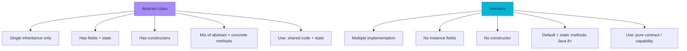

#### Interview question — Common interview question

**Q:** Abstract class vs interface — production code me kab kaunsa choose karoge? Java 8+ default methods ke baad interface kab abstract class replace kar sakti hai?

> Decision criteria for production:
> Use abstract class when:
> 1) You need shared INSTANCE STATE. Interfaces can have constants but not instance fields. CacheableRepository example me cache field — must be in abstract class.
> 2) You need shared CONSTRUCTOR LOGIC. Interfaces don't have constructors. Abstract class can validate inputs, initialize fields.
> 3) Strong 'is-a' relationship — Animal abstract class, Dog/Cat extend. They share an entire structure, not just contract.
> 4) Template method pattern — parent defines algorithm skeleton, subclasses fill specific steps. Spring's JdbcTemplate, Hibernate's lifecycle.
> 5) Want to control extension — abstract class with private constructor + factory methods can prevent direct instantiation, force specific subclasses.
> Use interface when:
> 1) Pure contract / capability. Comparable, Iterable, Cloneable — they describe what an object can DO, not what it IS.
> 2) Multiple implementation needed. Class can implement 10+ interfaces, only 1 abstract class. Mix capabilities.
> 3) No shared state needed — only behavior contract.
> 4) Future-proofing for plugin systems. Storage, PaymentGateway, NotificationChannel — define interface, multiple impls swap in.
> 5) Functional interfaces (single abstract method) — Comparator, Runnable. Lambdas can implement these.
> Java 8+ default methods narrow the gap. Now interfaces can:
> - Have method bodies (default methods)
> - Have static utility methods
> - Java 9+ — private helper methods
> But interfaces still CAN'T:
> - Have instance fields (constants only — public static final)
> - Have constructors
> - Maintain mutable state
> When default methods can replace abstract class:
> Pure contract + small amount of derived/helper logic. e.g., List interface has default method spliterator() — derived from iterator(). Children only implement core methods, get spliterator() free.
> If your abstract class only has methods (no fields, no constructor), Java 8+ default-method-rich interface might replace it. But constructors + fields needed → abstract class still required.
> Real production rule:
> - Public-facing API contract → interface (gives implementers max flexibility).
> - Internal shared state + lifecycle → abstract class (one source of truth).
> - Spring application development typically uses interface for service contracts, no abstract classes needed (Spring's DI provides composition).
> - Library/framework authoring sometimes uses abstract classes for required extension hooks.
> Modern style: prefer interface + composition over abstract class + inheritance. If you find yourself wanting to extend an abstract class, ask: 'Can I compose this behavior instead?' Often yes.
> Sealed types (Java 17+) bring closed-type-hierarchy power that was previously easier with abstract classes. sealed interface Shape permits Circle, Square — exhaustive switch, type-safe, no instance fields needed.
> [Difficulty: Hard · Asked at: Amazon, Atlassian, Microsoft, Razorpay, Goldman Sachs. Follow-ups: 'Diamond problem default methods ke saath kaise solve hota hai?', 'Marker interface kya hai?']

### Encapsulation & access modifiers

#### Kya hai? — What is encapsulation?

Encapsulation matlab data + methods ek class me bandhna AND data ko outside-direct-access se hide karna. Class apni state ko private rakhti hai, controlled methods (getters/setters) se hi access deti hai.

Real-life analogy: ATM le. Tu PIN aur amount enter karta hai (interface). Andar machine cash dispense karta hai, balance update karta hai, transaction log karta hai (implementation). Tu seedha cash drawer nahi khol sakta — encapsulated.

Beginner ke liye yaad rakh: encapsulation = 'data + behavior together' + 'access controlled'. Java me access modifiers (private, default, protected, public) ye enforce karte hain.

#### Kyun zaroori hai? — Why encapsulation matters?

Invariants protection: class apni state ki rules enforce kar sakti hai. Account class ka balance never negative — setter validation se enforce. Direct field access hua to bypass possible.

Implementation freedom: internal field rename ya restructure → only class internal changes. Public method signatures intact → callers unaffected.

Thread safety: synchronized methods/synchronized blocks me state mutations control kar sakte ho. Direct field access concurrent corruption.

Debugging easier: state mutations sirf class methods me hote hain. Stack traces clear rehte hain — debugger me breakpoints lagao methods pe, not field assignments scattered everywhere.

API stability: public surface area chhota rakhne se backward compatibility easy. Field public hua to remove karna breaking change. Method behavior change kar sakte ho more freely.

#### Kaise kaam karta hai? — Access modifiers + encapsulation patterns

Access modifiers (most restrictive to least):

1) private — same class only. Default for fields, helper methods.

2) default (no modifier) — same package. Use for package-internal cooperation.

3) protected — same package + subclasses. Use for fields/methods child classes need.

4) public — any code. Public API surface only.

Encapsulation pattern: private fields + public getters/setters where needed. Setters often have validation. Some fields setter-less (immutable).

Modern best practice: prefer immutability. final fields, no setters, all-args constructor. Use builder pattern for many fields. Records (Java 16+) automate this.

Avoid blanket getters/setters: classic Java code generates getter/setter for every field — anti-pattern. Better — design methods around use cases. order.cancel() instead of order.setStatus(CANCELLED).

Defensive copies: getters returning mutable collections — return Collections.unmodifiableList(internalList) or new ArrayList<>(internalList). Otherwise caller can mutate internal state through returned reference.

```java
import java.util.*;

// BAD encapsulation — public fields, no validation
class BadOrder {
    public long id;
    public long amount;
    public String status;
    public List<String> items;  // mutable, leaks internal state
}

// GOOD encapsulation — controlled access, validation, immutable where possible
public class Order {

    // All fields private
    private final long id;            // immutable identity
    private final long amount;        // immutable amount
    private OrderStatus status;       // controlled mutation
    private final List<String> items; // mutable collection, but controlled access

    public Order(long id, long amount, List<String> items) {
        // Validation in constructor
        if (id <= 0) throw new IllegalArgumentException("id must be positive");
        if (amount <= 0) throw new IllegalArgumentException("amount must be positive");
        if (items == null || items.isEmpty()) {
            throw new IllegalArgumentException("items required");
        }

        this.id = id;
        this.amount = amount;
        this.status = OrderStatus.CREATED;
        // Defensive copy — caller can't mutate our internal list later
        this.items = new ArrayList<>(items);
    }

    // Read-only getters
    public long getId() { return id; }
    public long getAmount() { return amount; }
    public OrderStatus getStatus() { return status; }

    // Read-only view of items — caller can't mutate
    public List<String> getItems() {
        return Collections.unmodifiableList(items);
    }

    // Behavior-oriented mutators — NOT setStatus()
    public void markPaid() {
        if (status != OrderStatus.CREATED) {
            throw new IllegalStateException("Cannot pay from " + status);
        }
        this.status = OrderStatus.PAID;
    }

    public void ship() {
        if (status != OrderStatus.PAID) {
            throw new IllegalStateException("Cannot ship from " + status);
        }
        this.status = OrderStatus.SHIPPED;
    }

    public void cancel(String reason) {
        if (status == OrderStatus.SHIPPED || status == OrderStatus.DELIVERED) {
            throw new IllegalStateException("Cannot cancel " + status);
        }
        this.status = OrderStatus.CANCELLED;
        // log reason internally
    }
}

enum OrderStatus { CREATED, PAID, SHIPPED, DELIVERED, CANCELLED }

// EVEN BETTER — full immutability via record
record OrderSummary(
        long id,
        long amount,
        OrderStatus status,
        List<String> items
) {
    // Compact constructor for validation + defensive copy
    OrderSummary {
        if (id <= 0) throw new IllegalArgumentException("id required");
        if (amount <= 0) throw new IllegalArgumentException("amount required");
        items = List.copyOf(items);  // immutable defensive copy
    }
}
```

#### Real-life example — Real-life example — Razorpay's BankAccount class

Razorpay's payout system me BankAccount represent karta hai recipient ka account. Sensitive data — account number, IFSC, holder name. Encapsulation critical hai — direct mutation se compliance issues + data integrity bugs.

Approach: 1) sensitive fields private + final. 2) Verification status mutation controlled — verify() method only, not setVerified(). 3) sensitive data getter masks output (e.g., account number ke last 4 digits).

Production benefit: compliance audit me dikha sakte ho — 'account number kabhi ALSO log file ya UI me leak nahi hota'. Encapsulation traceable hai.

```java
// Razorpay-style BankAccount — heavily encapsulated
public class BankAccount {

    private final String accountId;
    private final String accountNumber;     // sensitive
    private final String ifscCode;
    private final String accountHolderName;
    private VerificationStatus verificationStatus;
    private Instant lastVerifiedAt;
    private int verificationFailureCount;

    public BankAccount(String accountId, String accountNumber,
                        String ifsc, String holderName) {
        // Comprehensive validation
        if (accountId == null || accountId.isBlank()) {
            throw new IllegalArgumentException("accountId required");
        }
        if (!accountNumber.matches("\\d{9,18}")) {
            throw new IllegalArgumentException("Invalid account number");
        }
        if (!ifsc.matches("[A-Z]{4}0[A-Z0-9]{6}")) {
            throw new IllegalArgumentException("Invalid IFSC");
        }
        if (holderName == null || holderName.isBlank()) {
            throw new IllegalArgumentException("Holder name required");
        }

        this.accountId = accountId;
        this.accountNumber = accountNumber;
        this.ifscCode = ifsc;
        this.accountHolderName = holderName;
        this.verificationStatus = VerificationStatus.UNVERIFIED;
        this.verificationFailureCount = 0;
    }

    // Public read access — IDs and metadata
    public String getAccountId() { return accountId; }
    public String getIfscCode() { return ifscCode; }
    public VerificationStatus getVerificationStatus() { return verificationStatus; }

    // Sensitive data — masked getter for safe display
    public String getMaskedAccountNumber() {
        // 'XXXX1234' format — last 4 only
        if (accountNumber.length() <= 4) return accountNumber;
        return "XXXX" + accountNumber.substring(accountNumber.length() - 4);
    }

    // Full account number — explicit method, used for actual transfers only
    // Logged at audit level when called
    public String revealAccountNumberForTransfer() {
        // log audit trail
        return accountNumber;
    }

    // Mutation: state transitions controlled by methods
    public void markVerified() {
        if (this.verificationStatus == VerificationStatus.VERIFIED) {
            return;  // idempotent
        }
        this.verificationStatus = VerificationStatus.VERIFIED;
        this.lastVerifiedAt = Instant.now();
        this.verificationFailureCount = 0;
    }

    public void markVerificationFailed(String reason) {
        this.verificationFailureCount++;
        if (this.verificationFailureCount >= 3) {
            this.verificationStatus = VerificationStatus.LOCKED;
        }
    }

    // toString safe for logging — never leak full account number
    @Override
    public String toString() {
        return "BankAccount[id=" + accountId
            + ", number=" + getMaskedAccountNumber()
            + ", status=" + verificationStatus + "]";
    }
}

enum VerificationStatus { UNVERIFIED, PENDING, VERIFIED, FAILED, LOCKED }
```

#### Visual — Access modifier visibility scope

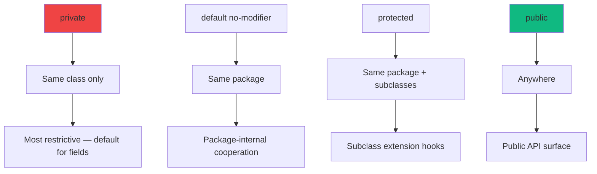

#### Interview question — Common interview question

**Q:** Encapsulation kyu zaroori hai code quality ke liye? 'Just generate getter/setter for everything' approach galat kyu hai? Production design alternative bata.

> Encapsulation core 4 OOP pillars me se ek hai (along with abstraction, inheritance, polymorphism). It's not just 'private fields + getters/setters' — it's about preserving INVARIANTS aur API stability.
> Why encapsulation matters in production code:
> 1) Invariants enforcement. Account class me balance never negative — sirf controlled withdrawal/deposit methods se enforce. Direct field access (account.balance = -1000) ye invariant break kar deta. Bug-prone.
> 2) Implementation flexibility. Internal storage change karna ho — array se ArrayList me, ya cache add karna — public API same rahe to clients unaffected. Public fields = locked-in implementation.
> 3) Thread safety. Synchronized methods se mutation control hota hai. Direct field access multi-threaded environment me race conditions create karta hai.
> 4) Logging/auditing. Setter me log karna easy hai. Direct field access untraceable.
> 5) Lazy computation. Getter me compute karke cache kar sakte ho. Field me precomputed value force karna early-eager binding.
> Why 'getter/setter for everything' is wrong:
> 1) Anti-pattern: looks like encapsulation but isn't. Setter without validation = same as public field with extra steps. Anemic domain models.
> 2) Behavior-empty objects. Class becomes a data bag. Logic scattered across services that operate on the data — Service-Anemic-Domain anti-pattern.
> 3) Mutability everywhere. Setters allow change anytime — concurrency/temporal coupling bugs. Hard to reason about state.
> 4) Discoverability. order.setStatus(CANCELLED) doesn't show 'cancellation' is a meaningful operation. order.cancel(reason) does — and can encode rules (only cancel-able from CREATED/PAID, log reason, emit event).
> Production design alternatives:
> 1) Behavior-oriented methods. Instead of setStatus(), have markPaid(), ship(), cancel(reason). Each method:
>    - Validates pre-conditions (state machine)
>    - Updates state
>    - Logs/emits events
>    - Maintains invariants
> 2) Immutability where possible. final fields, no setters, all-args constructor. Want changed value → wither methods or new instance via copy. Eliminates 70% of state-related bugs.
> 3) Records for data carriers (Java 16+). public record OrderSummary(long id, OrderStatus status, ...) {} — auto-generated immutable, equals, hashCode. No setters possible.
> 4) Builder pattern for many fields. Order.builder().id(123).amount(5000).status(CREATED).build() — controlled construction, validation in build() method.
> 5) Defensive copies. If you must expose a collection, return Collections.unmodifiableList() or List.copyOf(). Don't leak internal mutable state.
> 6) Read models vs write models. CQRS-style — separate immutable view DTOs from internal mutable entities. Public API exposes views; entities are private to domain layer.
> Real production scenario: Razorpay's payment processing me Payment entity ka status 'CREATED → AUTHORIZED → CAPTURED → SETTLED' state machine follow karta hai. setStatus() expose karna disaster hota — illegal transitions possible. Specific methods (authorize(), capture(), settle()) state machine encode karte hain. Compliance + bug prevention.
> Testing benefit: behavior-oriented methods ko test karna meaningful hai. order.cancel() pe verify state, events emitted, audit logged. setStatus() ko test karna useless — just sets a value, says nothing about correctness.
> Modern Java idiom: classes are NOT data bags. They have behavior + state, encapsulated together. If a class is really just data, use record. If it has behavior, encapsulate state behind meaningful methods, not bare setters.
> [Difficulty: Hard · Asked at: Amazon, Microsoft, Atlassian, Razorpay, Goldman Sachs. Follow-ups: 'Anemic Domain Model anti-pattern kya hai?', 'Tell, don\'t ask principle?']

## Advanced Java

### Wrapper classes & autoboxing

#### Kya hai? — What are wrapper classes?

Wrapper classes har primitive type ke liye Java me ek object class deti hai. int → Integer, long → Long, double → Double, boolean → Boolean, char → Character, etc. Ye classes primitive value ko object me wrap karti hain.

Java me autoboxing (Java 5+) ka matlab compiler automatic conversion karta hai — int x = 5; Integer obj = x; — automatic wrap. Reverse — int y = obj; — auto-unbox. Tu manually nahi karta.

Beginner ke liye yaad rakh: Collections (ArrayList, HashMap) generics use karte hain — generics objects pe kaam karte hain, primitives pe nahi. List<Integer> works, List<int> doesn't compile. Wrappers gap fill karte hain.

#### Kyun zaroori hai? — Why wrapper classes exist?

Generics requirement: Java generics type erasure ke saath kaam karte hain — runtime me sab Object hota hai. Primitives object nahi hain, generics work nahi karte. Wrappers compatibility provide karte hain.

Null support: int can't be null. Integer can. DB columns nullable hote hain — Integer better fit karta hai.

Utility methods: Integer.parseInt(), Integer.MAX_VALUE, Integer.toBinaryString() — primitives pe nahi, wrappers pe hain. Convenient API.

Caveat: autoboxing overhead hai. Tight loops me int beats Integer 5-10x. Production rule: business logic me Integer fine, performance-critical (math, image processing) me primitives + arrays.

#### Kaise kaam karta hai? — Autoboxing internals + Integer cache

Autoboxing: Integer obj = 5; — compiler internally Integer.valueOf(5) call karta hai. Unboxing: int x = obj; — obj.intValue() call.

Integer cache (CRITICAL): Integer.valueOf() cache karta hai -128 to 127 range ki values. Same Integer object reuse hota hai. Outside this range, new object banta hai.

Iska bug: Integer a = 100; Integer b = 100; a == b returns TRUE (cache hit). Integer a = 200; Integer b = 200; a == b returns FALSE (different objects). Production bug source — always use .equals() for Integer comparison.

Cache extensible: -XX:AutoBoxCacheMax JVM flag se upper limit badha sakte ho. Rarely needed.

valueOf() vs new: Integer.valueOf(5) cache check karta hai. new Integer(5) (deprecated) hamesha new object. Modern code: NEVER use new for wrappers — use valueOf or autoboxing.

Common gotcha: NPE during unboxing. Integer i = null; int x = i; — NPE. Production debugging — DB se null aaya, code Integer ko int me assign kiya, crash. Defensive: i == null check before unbox.

```java
public class WrapperDemo {

    public static void main(String[] args) {
        // Autoboxing — compiler does Integer.valueOf(5)
        Integer a = 5;

        // Auto-unboxing — compiler does a.intValue()
        int b = a;

        // Integer cache gotcha — within -128 to 127
        Integer x1 = 100;
        Integer x2 = 100;
        System.out.println(x1 == x2);          // true (cached)
        System.out.println(x1.equals(x2));     // true (always correct)

        // Outside cache — different objects
        Integer y1 = 200;
        Integer y2 = 200;
        System.out.println(y1 == y2);          // FALSE — bug source!
        System.out.println(y1.equals(y2));     // true (use this)

        // Parsing — common operation
        int parsed = Integer.parseInt("42");
        long bigParsed = Long.parseLong("9999999999");
        double d = Double.parseDouble("3.14");
        boolean bool = Boolean.parseBoolean("true");

        // Useful constants
        System.out.println(Integer.MAX_VALUE);  // 2147483647
        System.out.println(Long.MAX_VALUE);     // 9223372036854775807

        // NPE during unboxing — production bug
        Integer count = null;  // from DB query
        // int total = count;  // NullPointerException!
        int safeTotal = (count != null) ? count : 0;

        // Deprecated — never use
        // Integer old = new Integer(5);  // since Java 9 deprecated, removed Java 16+

        // Modern preferred
        Integer modern = Integer.valueOf(5);  // explicit
        Integer auto = 5;                      // autoboxing — same effect

        // Performance hot path — unbox once, work with primitives
        List<Integer> scores = List.of(85, 92, 78, 90, 88);
        int sum = 0;
        for (Integer s : scores) {
            sum += s;  // unboxing per iteration — careful in hot loops
        }
        // Better for performance:
        int[] scoresArr = scores.stream().mapToInt(Integer::intValue).toArray();
        long sumPrimitive = 0;
        for (int s : scoresArr) sumPrimitive += s;  // no boxing
    }
}
```

#### Real-life example — Real-life example — Razorpay user activity counter

Razorpay dashboard me user ki activity stats dikhati hai — total payments, total refunds, average response time. Some metrics nullable hain (new user, no data yet) — Long type used.

Why Long not long: nullable. New user me totalPayments = null shows 'no data', vs 0 shows 'has data, but zero'. UX difference matters.

Storage: DB me NULL allowed columns. Hibernate maps to wrapper types automatically. Long, Integer, Boolean — all common in JPA entities for nullable columns.

Production tip: domain entities me wrappers for nullable, primitives for required. clear contract.

```java
// Razorpay user stats — nullable fields use wrappers
@Entity
public class UserActivityStats {

    @Id
    private String userId;

    // Required — primitive
    private long totalLogins;

    // Nullable — wrapper. Null = "no data yet"
    private Long totalPayments;        // could be null for new users
    private Long totalRefunds;
    private Integer averageResponseMs;

    // Required boolean
    private boolean isActive;

    // Nullable boolean
    private Boolean preferredCurrencyConfirmed;  // null = not asked yet

    public Long getTotalPayments() {
        return totalPayments;  // returns Long (nullable)
    }

    public long getTotalPaymentsOrZero() {
        // Defensive — null-safe primitive return
        return totalPayments != null ? totalPayments : 0L;
    }

    public void incrementPayments() {
        // Unbox, increment, box back — autoboxing handles it
        if (totalPayments == null) {
            totalPayments = 1L;
        } else {
            totalPayments++;
        }
    }
}

// Service layer — defensive null handling
@Service
public class StatsService {

    public DashboardStats build(String userId) {
        UserActivityStats stats = repo.findById(userId).orElseThrow();
        return new DashboardStats(
            stats.getTotalLogins(),
            // Optional API for nullable fields
            Optional.ofNullable(stats.getTotalPayments()).orElse(0L),
            Optional.ofNullable(stats.getAverageResponseMs()).orElse(0)
        );
    }

    private final UserStatsRepository repo;
    StatsService(UserStatsRepository repo) { this.repo = repo; }
}

interface UserStatsRepository {
    Optional<UserActivityStats> findById(String id);
}
record DashboardStats(long logins, long payments, int avgResponse) {}
```

#### Visual — Primitive ↔ Wrapper mapping

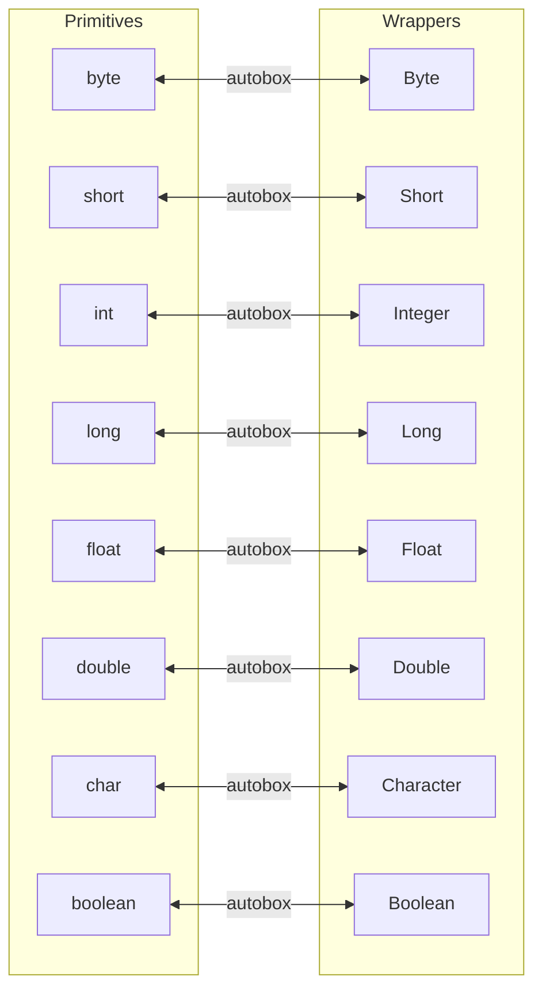

#### Interview question — Common interview question

**Q:** Integer cache kya hai aur production bug ka source kaise ban sakta hai? Autoboxing performance impact in tight loops — kab care karna chahiye?

> Integer cache JVM ki internal optimization hai — Integer.valueOf(int) method automatically caches Integer instances for the range -128 to +127 (default). Same value ke liye hamesha same Integer object return hota hai is range me.
> Mechanism: Integer class has a static IntegerCache inner class. Class loading pe -128 to 127 range ke liye Integer objects pre-create karta hai array me. valueOf(5) → cache[5+128] return. valueOf(200) → naya Integer object every time.
> Production bug source: == operator (reference equality) Integer pe coincidentally work karta hai cached values me, FAIL karta hai outside cache. Programmer assumes == works always.
> Concrete bug: Integer status1 = response1.getStatusCode(); Integer status2 = response2.getStatusCode(); if (status1 == status2) { ... } — works for status 200 (cached), fails for status 503 (not cached). Intermittent bug, hard to reproduce.
> Reason for existence: memory + GC optimization. Most common Integer values (-128 to 127) get reused. Boxing 1 million Integers in this range = same 256 cached objects. Significant memory savings.
> Production rules:
> 1) NEVER use == for Integer comparison. Always .equals() or Objects.equals() (null-safe).
> 2) Same applies to Long, Short, Byte (similar caches), Character (cached for ASCII range), Boolean (cached for true/false). Float and Double have NO cache (any reasonable range too sparse).
> 3) When literal comparison needed across range, intValue() unbox first — primitive == compares values reliably.
> Cache size tuning: -XX:AutoBoxCacheMax=N JVM flag. Increases upper bound (lower stays at -128). Rarely needed — caches at default size handle most use cases.
> Now autoboxing performance:
> Each autobox = method call + object allocation (if outside cache) + reference assignment. Each unbox = method call + value extraction.
> Tight loop example: summing ArrayList<Integer> with 1M elements:
>   for (Integer i : list) { sum += i; }  // 1M unboxings
> Total overhead: 1M method calls + GC pressure from object allocations during boxing operations elsewhere. Compared to int[] iteration — 5-10x slower.
> When to care:
> 1) Performance-critical hot paths — image/video processing, scientific computation, real-time systems. Use int[] not List<Integer>. Or specialized primitive collections (Eclipse Collections IntList, fastutil).
> 2) Massive data sets (10M+ elements). Memory difference is also huge — Integer is 16 bytes, int is 4 bytes. 10M ints = 40MB; 10M Integers = 160MB+ object overhead.
> 3) GC-sensitive applications — low-latency trading systems, real-time bidding. Boxing creates many short-lived objects, increasing GC pressure.
> When NOT to care:
> 1) Standard business logic — fetch order, process, save. Boxing overhead negligible compared to DB call.
> 2) Small data sets (< 10K elements) — overhead doesn't show up in profiling.
> 3) IO-bound code — network/disk dominates, autoboxing irrelevant.
> Profiling rule: don't optimize before measuring. Use JMH (Java Microbenchmark Harness) or async-profiler. If autoboxing is bottleneck, refactor to primitives. Otherwise, prefer code clarity (Integer in collections is more readable than int[]).
> Real production scenario: Razorpay's transaction processing. 99% code uses Long for amounts in business logic — clarity matters. Hot path analytics (millions of rows aggregation) uses long[] for streaming math.
> [Difficulty: Hard · Asked at: Amazon, Microsoft, Atlassian, Razorpay, Goldman Sachs. Follow-ups: 'Specialized primitive collections kya hote hain?', 'Why does Boolean.valueOf(true) return same object?']

### Collections — List, Set, Map, Queue

#### Kya hai? — What is the Collections Framework?

Java Collections Framework (java.util package) standardized data structure interfaces + implementations deta hai. Core interfaces: List, Set, Map, Queue, Deque. Concrete classes: ArrayList, LinkedList, HashSet, TreeSet, HashMap, ConcurrentHashMap, etc.

Each interface ek specific access pattern model karta hai: List = ordered + indexed, Set = unique elements, Map = key-value pairs, Queue = FIFO, Deque = double-ended.

Beginner analogy: Collections framework like furniture store. List shelf hai (ordered, indexed), Set unique-item box (no duplicates), Map labeled drawer (key → value), Queue post office line (first in, first out).

Production rule: 95% Java code Collection use karta hai. ArrayList aur HashMap sabse common. Specialized variants specific patterns ke liye.

#### Kyun zaroori hai? — Why Collections framework over arrays?

Dynamic size: arrays fixed-size hain. ArrayList grow karta hai automatically — add karte raho, framework resize handle karta hai.

Rich API: add, remove, contains, indexOf, sort, filter, etc. Arrays me sirf indexed access. Collection methods abstract iteration patterns.

Different access patterns optimized: HashMap O(1) lookup vs LinkedList O(n) for unordered list. Right choice = right performance.

Generics + type safety: List<Order> compile-time guarantees. Old Java raw collections (List orders) had runtime ClassCastExceptions. Generics fix this.

Ecosystem: streams, sort, Collections.unmodifiableList, Concurrent variants, sorted variants — entire ecosystem built on top.

#### Kaise kaam karta hai? — Choosing the right collection

List — ordered, indexed, allows duplicates. ArrayList: O(1) random access, O(n) insertion in middle. LinkedList: O(1) add/remove at ends, O(n) random access. Use ArrayList default; LinkedList only if heavy add/remove at ends needed (queue use case better with ArrayDeque).

Set — unique elements, no order guarantee (HashSet) or sorted (TreeSet) or insertion-ordered (LinkedHashSet). HashSet: O(1) add/contains. TreeSet: O(log n), keeps sorted. LinkedHashSet: O(1), preserves insertion order.

Map — key-value pairs. HashMap: O(1) get/put, no order. TreeMap: O(log n), sorted by keys. LinkedHashMap: O(1), insertion order. ConcurrentHashMap: thread-safe with O(1).

Queue/Deque — FIFO/LIFO. ArrayDeque preferred over LinkedList for queue use. PriorityQueue for ordered processing (min-heap by default).

Iteration: enhanced for-each, Iterator, streams. ConcurrentModificationException if modify collection during iteration — use Iterator.remove() or stream filtering.

Comparable vs Comparator: Comparable defines natural ordering (class implements). Comparator external strategy (sort by different criteria). For sorting, prefer Comparator (can swap strategies).

```java
import java.util.*;
import java.util.concurrent.*;

public class CollectionsDemo {

    public static void main(String[] args) {
        // 1) List — ordered, indexed
        List<String> orders = new ArrayList<>();
        orders.add("ord_001");
        orders.add("ord_002");
        orders.add("ord_003");
        System.out.println(orders.get(1));     // ord_002 (O(1))
        orders.remove("ord_002");

        // 2) Set — unique elements
        Set<String> uniqueCustomers = new HashSet<>();
        uniqueCustomers.add("rohan@x.com");
        uniqueCustomers.add("priya@x.com");
        uniqueCustomers.add("rohan@x.com");    // duplicate ignored
        System.out.println(uniqueCustomers.size());  // 2

        // TreeSet — sorted
        Set<String> sortedNames = new TreeSet<>();
        sortedNames.add("Rohan");
        sortedNames.add("Aarav");
        sortedNames.add("Priya");
        System.out.println(sortedNames);  // [Aarav, Priya, Rohan]

        // 3) Map — key-value
        Map<String, Long> orderAmounts = new HashMap<>();
        orderAmounts.put("ord_001", 49900L);
        orderAmounts.put("ord_002", 89900L);
        Long amount = orderAmounts.get("ord_001");

        // Iteration over Map
        for (Map.Entry<String, Long> entry : orderAmounts.entrySet()) {
            System.out.println(entry.getKey() + " = ₹" + (entry.getValue() / 100));
        }

        // Modern API — getOrDefault, computeIfAbsent
        long defaultAmount = orderAmounts.getOrDefault("ord_999", 0L);
        Map<String, List<String>> orderItems = new HashMap<>();
        orderItems.computeIfAbsent("ord_001", k -> new ArrayList<>()).add("pizza");

        // 4) Queue/Deque
        Deque<String> deliveryQueue = new ArrayDeque<>();
        deliveryQueue.addLast("ord_001");
        deliveryQueue.addLast("ord_002");
        String next = deliveryQueue.pollFirst();   // FIFO

        // PriorityQueue — sorted processing
        PriorityQueue<Integer> pq = new PriorityQueue<>();
        pq.offer(5); pq.offer(1); pq.offer(3);
        System.out.println(pq.poll());  // 1 (min-heap)

        // 5) Concurrent — thread-safe
        ConcurrentHashMap<String, Long> liveOrders = new ConcurrentHashMap<>();
        liveOrders.put("ord_001", 49900L);
        liveOrders.computeIfPresent("ord_001", (k, v) -> v + 1000);

        // Sorting with Comparator
        List<Order> orderList = new ArrayList<>(List.of(
            new Order(1, 5000), new Order(2, 1000), new Order(3, 8000)
        ));
        orderList.sort(Comparator.comparingLong(Order::amount));
        // [Order(2,1000), Order(1,5000), Order(3,8000)]

        orderList.sort(Comparator.comparingLong(Order::amount).reversed());
        // [Order(3,8000), Order(1,5000), Order(2,1000)]
    }
}

record Order(int id, long amount) {}
```

#### Real-life example — Real-life example — Swiggy live order management

Swiggy backend live orders track karta hai — orders by ID (Map), pending delivery queue (Deque), unique active customers (Set). Each collection apni access pattern serve karti hai.

Production design: ConcurrentHashMap for orders (multi-threaded reads/writes). ArrayDeque for ordered processing of pending. ConcurrentHashMap.newKeySet() for thread-safe Set of customers.

Performance critical: 1M+ orders concurrent me. HashMap me lookup O(1) — instant. List<Order>.contains() O(n) — disaster at scale.

```java
import java.util.concurrent.*;
import java.util.*;

// Swiggy live orders system
@Service
public class LiveOrderManager {

    // Orders by ID — fast lookup
    private final ConcurrentHashMap<String, Order> ordersById = new ConcurrentHashMap<>();

    // Pending delivery queue — ordered FIFO
    private final ConcurrentLinkedDeque<String> pendingDelivery = new ConcurrentLinkedDeque<>();

    // Active customers — unique
    private final Set<String> activeCustomers = ConcurrentHashMap.newKeySet();

    // Orders grouped by restaurant — many orders per restaurant
    private final ConcurrentHashMap<String, List<String>> ordersByRestaurant = new ConcurrentHashMap<>();

    public void placeOrder(Order order) {
        ordersById.put(order.getId(), order);
        pendingDelivery.addLast(order.getId());
        activeCustomers.add(order.getCustomerId());

        // computeIfAbsent — thread-safe lazy init
        ordersByRestaurant
            .computeIfAbsent(order.getRestaurantId(), k -> new CopyOnWriteArrayList<>())
            .add(order.getId());
    }

    public Order getOrder(String orderId) {
        // O(1) lookup
        return ordersById.get(orderId);
    }

    public Order pollNextForDelivery() {
        // FIFO — oldest pending first
        String orderId = pendingDelivery.pollFirst();
        return orderId != null ? ordersById.get(orderId) : null;
    }

    public boolean isCustomerActive(String customerId) {
        // O(1) set membership
        return activeCustomers.contains(customerId);
    }

    public List<Order> getOrdersForRestaurant(String restaurantId) {
        List<String> ids = ordersByRestaurant.getOrDefault(restaurantId, List.of());
        return ids.stream()
            .map(ordersById::get)
            .filter(Objects::nonNull)
            .toList();
    }

    public Map<String, Long> getOrdersCountByStatus() {
        // Stream collector — group counts by status
        return ordersById.values().stream()
            .collect(Collectors.groupingBy(
                Order::getStatus,
                Collectors.counting()
            ));
    }

    public int totalActiveCustomers() {
        return activeCustomers.size();  // O(1)
    }
}

class Order {
    public String getId() { return ""; }
    public String getCustomerId() { return ""; }
    public String getRestaurantId() { return ""; }
    public String getStatus() { return "PENDING"; }
}
```

#### Visual — Collections framework hierarchy

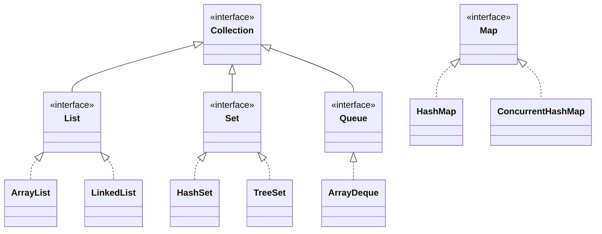

#### Interview question — Common interview question

**Q:** HashMap kaise kaam karta hai internally? ConcurrentHashMap aur Collections.synchronizedMap me kya difference hai? Production me kab kaunsa use karoge?

> HashMap internals — Java 8+ implementation:
> 1) Internal structure: array of buckets (Node[] table). Default size 16, grows when load factor (default 0.75) exceeded.
> 2) put(key, value) flow: a) hashCode() of key compute. b) Hash adjusted (XOR with high bits — better distribution). c) Index = hash & (table.length - 1). d) If bucket empty — Node bana, place. If exists — collision, traverse chain.
> 3) Collision handling (Java 8+ key change): bucket me 8+ entries hain to LinkedList → Red-Black Tree (O(log n) lookup). Pre-Java 8 sirf LinkedList — DoS attack prone (bad hash function → all in one bucket → O(n) lookup).
> 4) get(key) flow: a) Hash compute. b) Bucket find. c) Linear search in chain (or tree walk if treeified). d) Equality check via .equals().
> 5) Resize (rehashing): table.length * 2 jab threshold cross. All entries redistributed. Expensive O(n) — initial size set kar sakte ho jab approx size known.
> Critical contracts: equals() and hashCode() consistency. Two objects equal hain to same hashCode hona MUST. Different hashCode → different buckets → equals never called. Override karna padta hai dono together.
> Now ConcurrentHashMap vs Collections.synchronizedMap:
> Collections.synchronizedMap(new HashMap<>()) — wraps HashMap with synchronized methods. Every operation acquires SAME lock on whole map. Thread-safe but bottleneck for high concurrency. 100 threads doing get → all serialize on one lock.
> ConcurrentHashMap — fundamentally different design:
> 1) Java 7: segmented locking. Map divided into 16 segments, each with own lock. Threads can write to different segments concurrently.
> 2) Java 8+: bucket-level locking. CAS operations for non-contended cases. synchronized only on individual buckets when contention. Far more concurrent.
> 3) Iteration is weakly consistent — doesn't throw ConcurrentModificationException. Iterator reflects state at construction time, may show updates from other threads but won't crash.
> 4) putIfAbsent, computeIfAbsent, merge — atomic compound operations. Avoids check-then-act races common in synchronizedMap.
> Performance comparison: 16 threads, 1M ops each, 50% read 50% write:
> - HashMap (unsafe): crashes / corrupted data.
> - Collections.synchronizedMap: ~5-10s. Single lock contention.
> - ConcurrentHashMap: ~1-2s. 5-10x faster.
> When to use which:
> 1) Single-threaded code: HashMap. No synchronization overhead.
> 2) Multi-threaded with mostly reads, infrequent writes: ConcurrentHashMap. Default for any concurrent scenario.
> 3) NEVER Collections.synchronizedMap in new code. Legacy compat only. ConcurrentHashMap strictly better.
> 4) Mostly reads, never writes: Collections.unmodifiableMap (immutability + thread-safe).
> 5) Need sorted by key: TreeMap (single-threaded), ConcurrentSkipListMap (concurrent sorted).
> Production scenario: Razorpay's payment processor cache. ConcurrentHashMap<String, MerchantConfig> — millions of reads per minute (every payment lookups merchant config), occasional writes (config updates). ConcurrentHashMap perfect fit.
> Common mistakes to avoid:
> 1) Using HashMap from multiple threads without sync. Will work 99% time, fail catastrophically 1% (corrupted internal state, infinite loops in pre-Java 8).
> 2) ConcurrentHashMap pe atomic compound ops missing. map.containsKey(k) ? map.get(k) : computeNew() — race. Use computeIfAbsent.
> 3) Iterating a HashMap while another thread modifies — ConcurrentModificationException. Use ConcurrentHashMap.
> [Difficulty: Hard · Asked at: Amazon, Microsoft, Atlassian, Razorpay, Goldman Sachs. Follow-ups: 'Bucket treeification kab hota hai HashMap me?', 'CopyOnWriteArrayList kab use karte ho?']

### Exception handling

#### Kya hai? — What is exception handling?

Exception ek runtime event hai jo normal program flow disrupt karta hai — file not found, null pointer access, network error, divide by zero. Java me exceptions Throwable class hierarchy ke through represent hote hain.

Two main branches: Error (JVM-level — OutOfMemoryError, StackOverflowError, mostly unrecoverable) aur Exception (application-level — handle ho sakte hain).

Exception further: checked (compile-time enforced — IOException, SQLException) aur unchecked (RuntimeException — NullPointerException, IllegalArgumentException). Compiler checked ka handling enforce karta hai, unchecked ka nahi.

Beginner ke liye yaad rakh: try-catch wo zone hai jaha tu errors ko gracefully handle karta hai. throw karke error explicitly raise karta hai. throws declare karta hai 'ye method ye exceptions throw kar sakti hai'.

#### Kyun zaroori hai? — Why exception handling matters?

Without exceptions: error codes return karte programs (C-style). int result = doSomething(); if (result == -1) {...}. Pollutes signature, easy to ignore, no stack trace.

With exceptions: clean separation — happy path ka code main flow me, error path ka catch block me. Stack trace automatic — debugging traceable.

Reliability: top-level catch (e.g., REST controller's @ExceptionHandler) ensures crash hone se pehle proper response. Production stability.

API contract: throws clause method's failure modes documents. Caller knows kya failures handle karne hain.

#### Kaise kaam karta hai? — Exception handling mechanics

try-catch: try { riskyCode(); } catch (SpecificException e) { handle(e); } catch (GeneralException e) { fallback(e); } finally { cleanup(); }. Try block executes, exception hua to matching catch run karta hai, finally always runs.

Multi-catch (Java 7+): catch (IOException | SQLException e) — single block for multiple exception types. Reduces duplication.

try-with-resources (Java 7+): try (BufferedReader r = new BufferedReader(...)) { ... } — automatic close() call after block. Cleaner than manual finally.

throw vs throws: throw raise karta hai exception (throw new IllegalArgumentException(...)). throws declare karta hai method signature me — public void foo() throws IOException.

Custom exceptions: extend Exception (checked) ya RuntimeException (unchecked). Add fields/constructors as needed for context.

Exception chaining: try { ... } catch (LowLevelException e) { throw new HighLevelException('msg', e); }. Cause preserves stack trace.

Best practices: catch specific exceptions, not Exception/Throwable. Don't swallow — log or rethrow. Resource cleanup with try-with-resources, not manual finally.

```java
import java.io.*;
import java.sql.*;

// Custom domain exceptions
public class PaymentException extends RuntimeException {
    private final String paymentId;
    private final String errorCode;

    public PaymentException(String paymentId, String errorCode, String message) {
        super(message);
        this.paymentId = paymentId;
        this.errorCode = errorCode;
    }

    public PaymentException(String paymentId, String errorCode,
                             String message, Throwable cause) {
        super(message, cause);   // exception chaining
        this.paymentId = paymentId;
        this.errorCode = errorCode;
    }

    public String getPaymentId() { return paymentId; }
    public String getErrorCode() { return errorCode; }
}

public class InsufficientBalanceException extends PaymentException {
    public InsufficientBalanceException(String paymentId, long requested, long available) {
        super(paymentId, "INSUFFICIENT_BALANCE",
              "Need ₹" + requested + ", have ₹" + available);
    }
}

public class PaymentService {

    // Method declares which exceptions it throws
    public PaymentResult process(PaymentRequest request)
            throws PaymentException {

        // try-with-resources — auto-close
        try (Connection conn = dataSource.getConnection();
             PreparedStatement stmt = conn.prepareStatement("...")) {

            stmt.setString(1, request.getId());
            ResultSet rs = stmt.executeQuery();

            if (!rs.next()) {
                throw new PaymentException(
                    request.getId(),
                    "NOT_FOUND",
                    "Payment record missing"
                );
            }

            long balance = rs.getLong("balance");
            if (balance < request.getAmount()) {
                throw new InsufficientBalanceException(
                    request.getId(), request.getAmount(), balance
                );
            }

            return chargeGateway(request);

        } catch (SQLException e) {
            // Wrap low-level exception with domain context
            throw new PaymentException(
                request.getId(),
                "DB_ERROR",
                "DB error during payment",
                e   // chain the cause
            );
        }
    }

    private PaymentResult chargeGateway(PaymentRequest req) throws PaymentException {
        try {
            return gateway.charge(req);
        } catch (GatewayException e) {
            // Transform external exception
            throw new PaymentException(
                req.getId(),
                "GATEWAY_ERROR",
                "Gateway failed: " + e.getMessage(),
                e
            );
        }
    }

    private DataSource dataSource;
    private PaymentGateway gateway;
}

// Multi-catch — different exceptions, same handling
class FileProcessor {
    public String readFile(String path) {
        try {
            return Files.readString(Path.of(path));
        } catch (IOException | SecurityException e) {
            // Both handled the same way
            log.error("Read failed: {}", path, e);
            return null;
        }
    }

    private static final Logger log = LoggerFactory.getLogger(FileProcessor.class);
}

class DataSource {
    public Connection getConnection() { return null; }
}
class PaymentGateway {
    public PaymentResult charge(PaymentRequest r) throws GatewayException { return null; }
}
class GatewayException extends Exception {}
class PaymentRequest {
    public String getId() { return ""; }
    public long getAmount() { return 0; }
}
class PaymentResult {}
```

#### Real-life example — Real-life example — Razorpay payment failure modes

Razorpay payment process me 10+ failure modes hain — invalid card, expired, insufficient balance, fraud detected, gateway timeout, network error, regulatory block. Each ek specific exception type with structured handling.

Approach: domain-specific exception class hierarchy. Top-level PaymentException with errorCode. Specific subclasses (InsufficientBalanceException, FraudDetectedException) for type-safe handling.

Production architecture: REST controllers ke @ExceptionHandler global mapping convert these to HTTP responses with structured error JSON. Mobile app/web frontend specific UI dikhata hai based on error code.

Logging strategy: full stack trace logs me (with correlation ID), only sanitized message in API response. Compliance + debug-ability balance.

```java
// Razorpay-style exception hierarchy
abstract class PaymentException extends RuntimeException {
    private final String paymentId;
    private final String errorCode;

    protected PaymentException(String paymentId, String errorCode, String message) {
        super(message);
        this.paymentId = paymentId;
        this.errorCode = errorCode;
    }

    public String getPaymentId() { return paymentId; }
    public String getErrorCode() { return errorCode; }
}

class InvalidCardException extends PaymentException {
    public InvalidCardException(String paymentId, String reason) {
        super(paymentId, "INVALID_CARD", "Card validation failed: " + reason);
    }
}

class GatewayTimeoutException extends PaymentException {
    public GatewayTimeoutException(String paymentId, long timeoutMs) {
        super(paymentId, "GATEWAY_TIMEOUT",
              "Gateway did not respond in " + timeoutMs + "ms");
    }
}

class FraudDetectedException extends PaymentException {
    private final String fraudReason;
    public FraudDetectedException(String paymentId, String fraudReason) {
        super(paymentId, "FRAUD_DETECTED", "Fraud detected: " + fraudReason);
        this.fraudReason = fraudReason;
    }
    public String getFraudReason() { return fraudReason; }
}

// Service throws specific types
@Service
public class PaymentProcessingService {

    public PaymentResult process(PaymentRequest req) {
        // Validate
        if (req.getCard() == null || !req.getCard().isValid()) {
            throw new InvalidCardException(req.getPaymentId(), "Invalid format");
        }

        // Fraud check
        if (fraudCheck.score(req) > 0.9) {
            throw new FraudDetectedException(req.getPaymentId(),
                                              "high-risk transaction");
        }

        // Gateway call with timeout
        try {
            return gateway.charge(req, 3000);   // 3s timeout
        } catch (TimeoutException e) {
            throw new GatewayTimeoutException(req.getPaymentId(), 3000);
        }
    }

    private FraudCheckService fraudCheck;
    private PaymentGateway gateway;
}

// Spring controller maps exceptions to HTTP responses
@RestControllerAdvice
public class PaymentExceptionHandler {

    @ExceptionHandler(InvalidCardException.class)
    public ResponseEntity<ErrorResponse> handleInvalidCard(InvalidCardException e) {
        return ResponseEntity.badRequest().body(
            new ErrorResponse(e.getErrorCode(), "Please check your card details")
        );
    }

    @ExceptionHandler(FraudDetectedException.class)
    public ResponseEntity<ErrorResponse> handleFraud(FraudDetectedException e) {
        // Log full details internally — but DON'T leak fraud reason to user
        log.warn("Fraud detected for payment {}: {}",
                 e.getPaymentId(), e.getFraudReason());
        return ResponseEntity.status(403).body(
            new ErrorResponse("PAYMENT_DECLINED", "Payment could not be processed")
        );
    }

    @ExceptionHandler(GatewayTimeoutException.class)
    public ResponseEntity<ErrorResponse> handleTimeout(GatewayTimeoutException e) {
        return ResponseEntity.status(504).body(
            new ErrorResponse(e.getErrorCode(), "Service temporarily unavailable")
        );
    }

    private static final Logger log = LoggerFactory.getLogger(PaymentExceptionHandler.class);
}

record ErrorResponse(String code, String message) {}
class FraudCheckService { public double score(PaymentRequest r) { return 0.5; } }
class PaymentGateway { public PaymentResult charge(PaymentRequest r, long t) throws TimeoutException { return new PaymentResult(); } }
class PaymentRequest {
    public String getPaymentId() { return ""; }
    public Card getCard() { return null; }
}
class Card { public boolean isValid() { return true; } }
class PaymentResult {}
class TimeoutException extends Exception {}
```

#### Visual — Exception class hierarchy

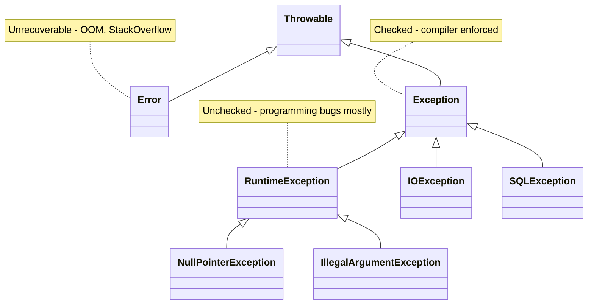

#### Interview question — Common interview question

**Q:** Checked vs unchecked exceptions — design choice me kab kaunsa use karte hain modern Java? throws clause vs catching aur transforming — production code me preferred approach?

> Java me checked vs unchecked design discussion ek classic debate hai. Modern best practices:
> Checked exceptions: compile-time enforced — caller MUST handle (catch) or declare (throws). Designed for 'recoverable' situations the caller can reasonably react to.
> Examples: IOException (network might recover, file might appear), SQLException (transaction can be retried).
> Unchecked exceptions (RuntimeException + subclasses): no compile-time enforcement. Designed for 'programming bugs' — NullPointerException, IllegalArgumentException, IllegalStateException.
> Examples: dividing by zero, accessing null, invalid argument from caller.
> Modern Java reality (Effective Java, Spring world):
> 1) Most modern Java code uses UNCHECKED exceptions even for recoverable situations. Reason: checked exception's 'forced handling' often leads to bad practices — empty catch blocks (swallowed), excessive throws clauses propagating up, throws Exception (too broad).
> 2) Spring framework wraps almost all checked exceptions into unchecked: SQLException → DataAccessException, IOException → various RuntimeExceptions. Caller handles only when they choose to.
> 3) Frameworks like JPA, Hibernate, Spring Data — all use unchecked exceptions. Following the trend, application code does too.
> 4) New checked exceptions in business code = anti-pattern. Define unchecked exceptions for domain errors.
> When checked still appropriate (rare):
> - Truly external interactions: file IO, network IO. Standard library historical commitment.
> - API design where you want compile-time enforcement of error handling. Trade-off: forces caller engagement.
> - Public library APIs where you have less control over caller behavior.
> Production guidance: extend RuntimeException for application-specific exceptions (PaymentException, ValidationException, ServiceUnavailableException). Catch specific types where you can recover, let others propagate to global handler.
> Now — throws vs catch+transform:
> Approach 1 — propagate (throws clause):
> public Order findOrder(String id) throws DBException { return db.find(id); }
> Caller deals with DBException. Pros: no information loss. Cons: caller burdened with DB-level exception types in business logic.
> Approach 2 — catch + transform (preferred at layer boundaries):
> public Order findOrder(String id) { try { return db.find(id); } catch (DBException e) { throw new OrderServiceException('Order lookup failed', e); } }
> Pros: caller works with domain exceptions, not DB internals. Stack trace preserved via cause chaining. Layer abstraction maintained.
> When to transform exceptions:
> 1) Layer boundaries — Repository → Service. DBException at repo, ServiceException at service. Caller doesn't need to know about DB internals.
> 2) External system → internal — Stripe SDK throws StripeException, you throw PaymentGatewayException. Domain abstraction preserved.
> 3) Adding context — caller doesn't know which 'Order' or 'paymentId' failed without your context. Custom exception with fields adds it.
> When to propagate (let pass):
> 1) Same logical layer — pass-through helpers, internal utility methods.
> 2) RuntimeExceptions you can't meaningfully transform (e.g., NullPointerException from a true bug — let it propagate, debugging clearer).
> Common anti-patterns:
> 1) Catching and swallowing: catch (Exception e) { /* nothing */ }. Loses error, debugger blind. Always log or rethrow.
> 2) Catching too broadly: catch (Throwable e). Catches Errors (OutOfMemoryError) which shouldn't be caught — JVM should crash.
> 3) Wrapping without context: throw new RuntimeException(e). Lose original message context. Add meaningful message.
> 4) Re-throwing wrong type: catch (IOException e) { throw new ServletException(e); } — masking, not adding info.
> Real production scenario: Razorpay's payment service. Repository catches SQLException → throws DataAccessException with payment ID. Service catches DataAccessException → throws PaymentException with operation context. Controller's @ExceptionHandler catches PaymentException → returns structured 4xx/5xx response. Layered exception transformation, each layer adding context.
> [Difficulty: Hard · Asked at: Amazon, Microsoft, Atlassian, Razorpay, Goldman Sachs. Follow-ups: 'try-with-resources me suppressed exceptions kya hote hain?', 'finally block return statement me kya hota hai?']

### Multithreading & concurrency

#### Kya hai? — What is multithreading?

Multithreading matlab program me multiple threads parallel chalti hain. Thread ek independent execution path hai jo same JVM process ke andar shared memory pe kaam karti hai.

Modern CPU multi-core hote hain — 4, 8, 16+ cores. Single-threaded program 1 core use karta hai, baaki idle. Multi-threaded utilizes all cores → throughput badhata hai.

Java me thread create karne ke 2 ways: Thread class extend ya Runnable interface implement. Modern: ExecutorService + thread pools (almost always preferred).

Beginner ke liye yaad rakh: multithreading powerful but DANGEROUS. Race conditions, deadlocks, visibility issues — all real production problems. Synchronization aur immutability se manage karte hain.

#### Kyun zaroori hai? — Why multithreading?

Performance: CPU-bound work parallelize karke multiple cores utilize. 1M data items process karne 8 cores pe 8x faster than single thread.

Responsiveness: long-running task background me, UI/main thread responsive. Web server me request handle karte time DB call wait pe other requests serve.

Asynchronous IO: network/disk operations slow hain. Worker threads block ho jaate hain wait pe — meanwhile other threads useful kaam.

Realistic limitations: not all problems parallelizable. Inherently sequential code (state machine transitions) parallel se faayda nahi. Plus synchronization overhead — wrong design me multi-threaded slower than single-threaded.

#### Kaise kaam karta hai? — Modern Java concurrency

Don't use raw Thread for production. Always ExecutorService — manages thread pool, queues tasks, handles lifecycle.

ExecutorService types: Executors.newFixedThreadPool(8), newCachedThreadPool(), newSingleThreadExecutor(), newScheduledThreadPool(). Pick based on workload.

Submit Runnable (no return) or Callable<T> (returns value). submit() returns Future<T> — get result, check status, cancel.

Java 8+ CompletableFuture: composable async. .thenApply(), .thenCompose(), .thenCombine() for pipelines. Better than raw Future for complex async flows.

Synchronization mechanisms: synchronized keyword (method/block), Lock interface (more flexible), Atomic types (lock-free for simple ops), ConcurrentHashMap (concurrent collections).

Memory visibility: thread changes ek thread me dusri thread ko visible nahi automatically. volatile keyword ya synchronized blocks ensure visibility (memory barriers).

Common patterns: thread pool for CPU-bound work, ScheduledExecutorService for periodic tasks, ForkJoinPool for divide-and-conquer (parallelStream uses this).

Java 21 virtual threads (project Loom): lightweight threads, millions can run cheaply. Game-changer for IO-bound workloads. Thread.startVirtualThread(...) or Executors.newVirtualThreadPerTaskExecutor().

```java
import java.util.concurrent.*;
import java.util.concurrent.atomic.AtomicLong;

public class ConcurrencyDemo {

    public static void main(String[] args) throws Exception {
        // Modern way: ExecutorService with thread pool
        ExecutorService executor = Executors.newFixedThreadPool(4);

        // Submit Runnable — fire and forget
        executor.submit(() -> System.out.println("Hello from worker thread"));

        // Submit Callable — returns result
        Future<Long> future = executor.submit(() -> {
            // Simulate work
            Thread.sleep(100);
            return 42L;
        });
        Long result = future.get();   // blocks until done

        // Parallel processing — multiple submissions
        List<Future<Long>> futures = new ArrayList<>();
        for (int i = 0; i < 100; i++) {
            int id = i;
            futures.add(executor.submit(() -> processOrder(id)));
        }

        // Collect results
        long total = 0;
        for (Future<Long> f : futures) {
            total += f.get();
        }

        // Modern: CompletableFuture for async pipelines
        CompletableFuture<Long> async = CompletableFuture
            .supplyAsync(() -> fetchUserId(), executor)
            .thenApply(userId -> loadOrders(userId))
            .thenApply(orders -> orders.size())
            .exceptionally(ex -> {
                log.error("Pipeline failed", ex);
                return 0;
            });

        // Always shutdown
        executor.shutdown();
        executor.awaitTermination(30, TimeUnit.SECONDS);

        // Atomic operations — lock-free counter
        AtomicLong counter = new AtomicLong();
        // 100 threads incrementing safely
        try (ExecutorService pool = Executors.newFixedThreadPool(10)) {
            for (int i = 0; i < 1000; i++) {
                pool.submit(counter::incrementAndGet);   // atomic
            }
            pool.shutdown();
            pool.awaitTermination(10, TimeUnit.SECONDS);
        }
        System.out.println(counter.get());   // exactly 1000

        // Synchronized for compound operations
        Object lock = new Object();
        Map<String, Long> counts = new HashMap<>();
        synchronized (lock) {
            counts.merge("key", 1L, Long::sum);
        }
        // Better: ConcurrentHashMap.merge() — built-in atomic compound

        // Java 21 virtual threads — for IO-bound work
        try (ExecutorService virtual = Executors.newVirtualThreadPerTaskExecutor()) {
            for (int i = 0; i < 10000; i++) {
                virtual.submit(() -> {
                    // Each task can block on IO without consuming OS thread
                    fetchFromHttpApi();
                });
            }
        }
    }

    static long processOrder(int id) { return id * 100L; }
    static String fetchUserId() { return "user_123"; }
    static List<Order> loadOrders(String userId) { return List.of(); }
    static void fetchFromHttpApi() {}
    static final org.slf4j.Logger log = org.slf4j.LoggerFactory.getLogger(ConcurrencyDemo.class);
}

class Order {}
```

#### Real-life example — Real-life example — Razorpay parallel settlement processing

Razorpay daily settlements: 1M+ payments to settle. Single-threaded approach 5+ hours leta. Parallel processing across thread pool 30 min me complete.

Approach: ExecutorService with 16 threads (matching CPU cores). Batches of 1000 payments per task. CompletableFuture for orchestration + result collection.

Production gotcha: thread-safe shared state. Settlement totals, error counts — AtomicLong instead of long. Concurrent collections instead of HashMap.

Critical: error isolation. One batch fails → other batches continue. Failed batch logged, retried separately. Avoid 'one bad payment kills all settlements'.

```java
import java.util.concurrent.*;
import java.util.concurrent.atomic.*;
import java.util.*;

// Razorpay-style parallel settlement
@Service
public class SettlementBatchProcessor {

    private static final int BATCH_SIZE = 1000;
    private static final int THREAD_COUNT = 16;

    public SettlementSummary processSettlements(List<Payment> allPayments) {
        // Thread-safe accumulators
        AtomicLong successCount = new AtomicLong();
        AtomicLong failureCount = new AtomicLong();
        AtomicLong totalAmountSettled = new AtomicLong();

        // Concurrent failure tracking
        Map<String, String> failures = new ConcurrentHashMap<>();

        ExecutorService executor = Executors.newFixedThreadPool(THREAD_COUNT);
        List<CompletableFuture<Void>> futures = new ArrayList<>();

        // Split into batches, submit each as a task
        for (int i = 0; i < allPayments.size(); i += BATCH_SIZE) {
            int end = Math.min(i + BATCH_SIZE, allPayments.size());
            List<Payment> batch = allPayments.subList(i, end);

            CompletableFuture<Void> task = CompletableFuture.runAsync(() -> {
                processBatch(batch, successCount, failureCount,
                              totalAmountSettled, failures);
            }, executor);

            futures.add(task);
        }

        // Wait for all
        CompletableFuture.allOf(futures.toArray(new CompletableFuture[0])).join();

        executor.shutdown();
        try {
            executor.awaitTermination(1, TimeUnit.HOURS);
        } catch (InterruptedException e) {
            Thread.currentThread().interrupt();
        }

        return new SettlementSummary(
            successCount.get(),
            failureCount.get(),
            totalAmountSettled.get(),
            new HashMap<>(failures)
        );
    }

    private void processBatch(
            List<Payment> batch,
            AtomicLong successCount,
            AtomicLong failureCount,
            AtomicLong totalAmount,
            Map<String, String> failures) {

        for (Payment payment : batch) {
            try {
                bankApi.settle(payment);
                successCount.incrementAndGet();        // atomic
                totalAmount.addAndGet(payment.getAmount());
            } catch (Exception e) {
                failureCount.incrementAndGet();
                failures.put(payment.getId(), e.getMessage());
                // Continue — don't fail entire batch
            }
        }
    }

    private BankApi bankApi;
}

record Payment(String id, long amount) {
    public long getAmount() { return amount; }
    public String getId() { return id; }
}
record SettlementSummary(long success, long failure, long total, Map<String, String> failures) {}
class BankApi { public void settle(Payment p) {} }
```

#### Visual — Thread lifecycle states

```mermaid
stateDiagram-v2
    [*] --> NEW: Thread created
    NEW --> RUNNABLE: start() called
    RUNNABLE --> RUNNING: scheduler picks
    RUNNING --> BLOCKED: waiting for monitor lock
    RUNNING --> WAITING: wait(), join() with no timeout
    RUNNING --> TIMED_WAITING: sleep(), wait(timeout)
    BLOCKED --> RUNNABLE: lock acquired
    WAITING --> RUNNABLE: notify(), interrupt
    TIMED_WAITING --> RUNNABLE: timeout / notify
    RUNNING --> TERMINATED: run() returns
    TERMINATED --> [*]
```

#### Interview question — Common interview question

**Q:** synchronized keyword vs Lock interface (ReentrantLock) — production code me kab kaunsa? Race condition aur deadlock me difference, aur prevention strategies?

> synchronized vs Lock — both achieve mutual exclusion but with different trade-offs:
> synchronized — keyword built into Java since 1.0. synchronized methods or synchronized(obj) blocks. Implicit locking.
> Pros: 1) Simple syntax. 2) Auto-released on exception (no manual unlock). 3) JVM optimizations (biased locking, lock elision).
> Cons: 1) No timeout (try indefinitely or fail). 2) No interruptibility (can't cancel waiting thread). 3) No fairness (which waiting thread gets lock is JVM-dependent). 4) No 'try' semantics (can't check if lock available without acquiring).
> ReentrantLock (java.util.concurrent.locks) — explicit Lock object with methods.
> Pros: 1) tryLock() — non-blocking attempt. 2) tryLock(timeout) — bounded wait. 3) lockInterruptibly() — can be interrupted. 4) Fairness option (FIFO ordering). 5) Multiple Conditions (await/signal). 6) hold count visible.
> Cons: 1) Verbose syntax. 2) MUST manually unlock in finally — easy to forget, deadlock risk. 3) Less JVM optimizations than synchronized.
> Production decision matrix:
> 1) Default: synchronized. Simpler, safer, sufficient for 90% cases. JVM 17+ biased locking optimization makes it virtually free in uncontended cases.
> 2) Need timeout (don't wait forever): ReentrantLock.tryLock(timeout).
> 3) Need interruptibility: ReentrantLock.lockInterruptibly().
> 4) Need fairness (avoid starvation): new ReentrantLock(true).
> 5) Multiple condition variables: ReentrantLock.newCondition().
> 6) Read-heavy workload: ReadWriteLock or StampedLock — multiple readers concurrent.
> Race conditions vs deadlocks (different problems):
> Race condition — multiple threads access shared state, ordering matters, results depend on interleaving. counter++ from 100 threads — final value indeterminate (could be anywhere from 1 to 100). Read-modify-write not atomic.
> Detection: bug appears intermittently. Output 'wrong' but inconsistent. Hard to reproduce.
> Prevention: 1) synchronization (synchronized, Lock). 2) atomic operations (AtomicLong.incrementAndGet). 3) immutable objects (no mutation = no race). 4) thread-local state. 5) message passing (pass copies, not shared state).
> Deadlock — two+ threads stuck waiting for each other forever. Thread A holds lock1, waits for lock2. Thread B holds lock2, waits for lock1. Neither makes progress.
> Detection: thread dump shows BLOCKED threads in cycle. jstack output reveals 'waiting to lock 0x... held by thread B'. Thread analysis tools (VisualVM, JConsole) detect.
> Prevention strategies:
> 1) Lock ordering — always acquire locks in same global order. Account A → Account B always (sort by account ID). Eliminates cycles.
> 2) Avoid nested locking — don't hold lock1 and try to acquire lock2 simultaneously. Refactor to acquire one at a time.
> 3) Use tryLock(timeout) — don't wait forever. Detect deadlock potential, back off.
> 4) Single-threaded actor model — Akka, Vert.x. Each actor processes messages sequentially, no shared state.
> 5) Lock-free algorithms — AtomicReference + compare-and-swap. No locks = no deadlock.
> 6) Concurrent collections — designed to be deadlock-free for normal operations.
> Real production scenario: Razorpay's payment lock during transaction. If account A → account B transfer holds lock on A then tries B, but parallel B → A holds B then tries A — deadlock. Solution: lock in account-ID order. tx.lockAccount(min(A.id, B.id)); tx.lockAccount(max(A.id, B.id)); — both threads acquire in same order, no cycle.
> Modern Java guidance: prefer non-blocking patterns. Use Atomic classes for counters/flags. Use ConcurrentHashMap.compute() for atomic compound operations on map values. Use CompletableFuture for async pipelines instead of explicit thread coordination. Use Java 21 virtual threads for IO-bound work — they make blocking acceptable cheaply.
> [Difficulty: Hard · Asked at: Amazon, Microsoft, Atlassian, Razorpay, Goldman Sachs. Follow-ups: 'volatile keyword kya karta hai?', 'ThreadLocal kab use karte ho?']

### Java 8+ — Lambda, Streams, Optional

#### Kya hai? — What are Java 8+ features?

Java 8 (2014) ne language ko fundamentally modernize kiya — Lambda expressions, Streams API, Functional Interfaces, Optional, Method references, Default methods on interfaces. Functional programming style enable kiya in mostly-OOP language.

Lambda: anonymous functions (a, b) -> a + b. Compact syntax for single-method-interface implementations.

Streams: declarative collection processing. orders.stream().filter(o -> o.isPaid()).map(Order::getAmount).reduce(0L, Long::sum). Pipeline of operations.

Optional: explicit null handling. Optional.ofNullable(value).orElse(default). Replaces hidden null returns with explicit type signal.

Beginner ke liye yaad rakh: Java 8 features OPTIONAL hain (legacy code still works), but modern Java code heavily uses them. Production codebases (Spring, Hibernate) deeply functional now.

#### Kyun zaroori hai? — Why functional Java?

Conciseness: lambdas + streams replace 10-line traditional loops with 2-3 readable lines. Less code = less bugs.

Composability: stream operations chain. Filter then map then reduce — express transformation as pipeline. Easier to reason about than imperative loops with intermediate variables.

Parallelism: parallelStream() — entire pipeline runs across cores automatically. Same code, 4-8x faster on multi-core. Imperative loops need explicit thread management.

Better APIs: collections, IO, concurrent — all gain functional methods (forEach, map, filter, etc.). Standard library more expressive.

Beginner trade-off: learning curve. Functional patterns initially confusing. But production code today demands functional fluency.

#### Kaise kaam karta hai? — Lambda + Streams + Optional patterns

Lambda syntax: (params) -> expression OR (params) -> { statements; }. Single param parens optional. (a, b) -> a + b. x -> x * 2. () -> System.out.println('hi').

Functional interfaces: interface with exactly ONE abstract method. Lambdas implement these. java.util.function package me prebuilt: Function<T,R>, Predicate<T>, Consumer<T>, Supplier<T>, BiFunction<T,U,R>.

Method references: shortcut for lambdas. ClassName::staticMethod, instance::method, ClassName::instanceMethod. e.g., Object::toString, String::length, System.out::println.

Stream operations — two types: intermediate (return Stream — filter, map, sorted, distinct, limit) vs terminal (return non-Stream — collect, reduce, forEach, count, anyMatch). Pipeline lazy — terminal triggers execution.

Common collectors: Collectors.toList(), toSet(), toMap(keyFn, valueFn), groupingBy(classifier), partitioningBy(predicate), joining(separator), summingLong(...).

Optional patterns: ofNullable(value).orElse(default), orElseGet(supplier — lazy), orElseThrow(exceptionSupplier), map(transform), filter(predicate), ifPresent(consumer). DON'T use Optional.get() without isPresent() check — defeats purpose.

Modern stream features (Java 16+): toList() shortcut, mapMulti, takeWhile/dropWhile (Java 9+).

```java
import java.util.*;
import java.util.stream.*;
import java.util.function.*;

public class FunctionalJavaDemo {

    public static void main(String[] args) {
        List<Order> orders = List.of(
            new Order("ord_1", 4900L, "PAID", "rohan@x.com"),
            new Order("ord_2", 7900L, "PENDING", "priya@x.com"),
            new Order("ord_3", 12000L, "PAID", "rohan@x.com"),
            new Order("ord_4", 2500L, "FAILED", "amit@x.com"),
            new Order("ord_5", 8900L, "PAID", "priya@x.com")
        );

        // Lambda + Stream basics — total of paid orders
        long paidTotal = orders.stream()
            .filter(o -> o.status().equals("PAID"))
            .mapToLong(Order::amount)         // method reference
            .sum();
        System.out.println("Paid total: ₹" + (paidTotal / 100));

        // Stream → Map: group orders by customer email
        Map<String, List<Order>> byCustomer = orders.stream()
            .collect(Collectors.groupingBy(Order::customer));

        // Stream → Map with sum: revenue per customer
        Map<String, Long> revenueByCustomer = orders.stream()
            .filter(o -> o.status().equals("PAID"))
            .collect(Collectors.groupingBy(
                Order::customer,
                Collectors.summingLong(Order::amount)
            ));
        // {rohan@x.com=16900, priya@x.com=8900}

        // Top 3 orders by amount
        List<Order> top3 = orders.stream()
            .sorted(Comparator.comparingLong(Order::amount).reversed())
            .limit(3)
            .toList();    // Java 16+ shortcut

        // Find first paid order
        Optional<Order> firstPaid = orders.stream()
            .filter(o -> o.status().equals("PAID"))
            .findFirst();

        // Optional patterns
        firstPaid.ifPresent(o -> System.out.println("First paid: " + o.id()));

        long defaultAmount = firstPaid.map(Order::amount).orElse(0L);

        Order requiredPaid = firstPaid.orElseThrow(
            () -> new IllegalStateException("No paid orders")
        );

        // Functional interfaces
        Predicate<Order> isPaid = o -> o.status().equals("PAID");
        Predicate<Order> highValue = o -> o.amount() > 5000L;
        Predicate<Order> highValuePaid = isPaid.and(highValue);

        long count = orders.stream().filter(highValuePaid).count();

        Function<Order, String> formatOrder = o ->
            o.id() + ": ₹" + (o.amount() / 100) + " (" + o.status() + ")";

        orders.stream()
            .map(formatOrder)
            .forEach(System.out::println);

        // Method references — different types
        // Static: Integer::parseInt
        // Bound: System.out::println
        // Unbound: String::length
        // Constructor: ArrayList::new

        // Parallel stream — multi-core processing
        long parallelTotal = orders.parallelStream()
            .filter(o -> o.status().equals("PAID"))
            .mapToLong(Order::amount)
            .sum();

        // Optional — null-safe chaining
        Order maybeOrder = orders.isEmpty() ? null : orders.get(0);
        String displayName = Optional.ofNullable(maybeOrder)
            .map(Order::customer)
            .map(c -> c.split("@")[0])
            .map(String::toUpperCase)
            .orElse("UNKNOWN");

        // Anti-pattern (don't do this) — calling get without check
        // Optional<Order> opt = ...;
        // opt.get();  // throws if empty — defeats Optional purpose

        // Better
        opt.ifPresentOrElse(
            o -> System.out.println("Got " + o.id()),
            () -> System.out.println("Empty")
        );
    }

    static Optional<Order> opt = Optional.empty();
}

record Order(String id, long amount, String status, String customer) {}
```

#### Real-life example — Real-life example — Flipkart catalog analytics

Flipkart catalog analytics: 100M+ products, complex aggregations needed — top categories, average rating per brand, in-stock count by warehouse. Streams enable elegant declarative queries.

Approach: in-memory streams for hot dashboards (10K-100K items). Database queries for big aggregations (millions of rows). Hybrid — DB pre-aggregates, app-level streams shape final response.

Production benefit: streams + collect = readable equivalent of SQL queries. New analytics added in 30 lines instead of 200 lines of imperative loops.

Performance tip: parallelStream not always faster. For small collections (< 10K), overhead exceeds benefit. For CPU-bound work on large data, parallel wins big.

```java
import java.util.*;
import java.util.stream.*;

// Flipkart-style catalog analytics
public class CatalogAnalytics {

    public AnalyticsResult analyze(List<Product> products) {
        // Top 5 categories by count
        Map<String, Long> productsByCategory = products.stream()
            .collect(Collectors.groupingBy(
                Product::category,
                Collectors.counting()
            ));

        List<Map.Entry<String, Long>> topCategories = productsByCategory
            .entrySet().stream()
            .sorted(Map.Entry.<String, Long>comparingByValue().reversed())
            .limit(5)
            .toList();

        // Average rating per brand (where 4+ stars)
        Map<String, Double> avgRatingByBrand = products.stream()
            .filter(p -> p.rating() >= 4.0)
            .collect(Collectors.groupingBy(
                Product::brand,
                Collectors.averagingDouble(Product::rating)
            ));

        // Brands with highest revenue (price × stock available)
        Map<String, Long> revenueByBrand = products.stream()
            .filter(p -> p.stockCount() > 0)
            .collect(Collectors.groupingBy(
                Product::brand,
                Collectors.summingLong(p -> p.priceInPaise() * p.stockCount())
            ));

        // Out-of-stock by category
        Map<String, Long> outOfStockByCategory = products.stream()
            .filter(p -> p.stockCount() == 0)
            .collect(Collectors.groupingBy(
                Product::category,
                Collectors.counting()
            ));

        // Premium products (price > ₹50000) — joined string
        String premiumProducts = products.stream()
            .filter(p -> p.priceInPaise() > 5_00_00_00L)
            .map(Product::name)
            .sorted()
            .collect(Collectors.joining(", "));

        // Search products with multiple optional filters
        List<Product> filtered = filterProducts(
            products,
            Optional.of("Apple"),    // brand
            Optional.empty(),         // category — no filter
            Optional.of(4.0)          // min rating
        );

        // Parallel processing for huge dataset
        double avgPriceParallel = products.parallelStream()
            .mapToLong(Product::priceInPaise)
            .average()
            .orElse(0);

        return new AnalyticsResult(
            topCategories,
            avgRatingByBrand,
            revenueByBrand,
            outOfStockByCategory,
            premiumProducts
        );
    }

    public List<Product> filterProducts(
            List<Product> products,
            Optional<String> brandFilter,
            Optional<String> categoryFilter,
            Optional<Double> minRating) {

        Stream<Product> stream = products.stream();

        if (brandFilter.isPresent()) {
            String b = brandFilter.get();
            stream = stream.filter(p -> p.brand().equals(b));
        }
        if (categoryFilter.isPresent()) {
            String c = categoryFilter.get();
            stream = stream.filter(p -> p.category().equals(c));
        }
        if (minRating.isPresent()) {
            double min = minRating.get();
            stream = stream.filter(p -> p.rating() >= min);
        }

        return stream.toList();
    }
}

record Product(String id, String name, String category, String brand,
                long priceInPaise, double rating, int stockCount) {}
record AnalyticsResult(
    List<Map.Entry<String, Long>> topCategories,
    Map<String, Double> avgRatingByBrand,
    Map<String, Long> revenueByBrand,
    Map<String, Long> outOfStockByCategory,
    String premiumProducts
) {}
```

#### Visual — Stream pipeline operators

```mermaid
flowchart LR
    A[Source: List/Set/Map] --> B[stream / parallelStream]
    B --> C[filter predicate]
    C --> D[map transform]
    D --> E[sorted]
    E --> F[limit/skip]
    F --> G{Terminal op}
    G --> H[collect]
    G --> I[reduce]
    G --> J[forEach]
    G --> K[count]
    G --> L[anyMatch/allMatch]
    style C fill:#a78bfa
    style D fill:#a78bfa
    style E fill:#a78bfa
    style H fill:#06b6d4
    style I fill:#06b6d4
```

#### Interview question — Common interview question

**Q:** Stream API ke 'lazy evaluation' ka kya matlab hai? Optional ka misuse kaise hota hai production code me — anti-patterns aur correct patterns bata.

> Stream lazy evaluation core concept hai modern Java me. Intermediate operations (filter, map, sorted) actual computation NAHI karte. Stream pipeline build karte hain. Terminal operation (collect, reduce, forEach) trigger karta hai actual processing.
> Concrete example: orders.stream().filter(o -> { System.out.println('checking ' + o); return o.isPaid(); }).map(Order::amount). Yeh code RUN nahi hota. No 'checking' prints. Terminal op chahiye: .toList() ya .findFirst() — tab pipeline executes.
> Why lazy is powerful:
> 1) Short-circuiting: orders.stream().filter(...).findFirst() — first matching element pe stop. Don't process rest. Million-element list me 10th element matched → 999990 elements never touched.
> 2) Operation fusion: filter + map ek single pass me hote hain. Imperative me intermediate list bana. Streams memory-efficient.
> 3) Infinite streams: Stream.iterate(0, i -> i + 1).filter(i -> i > 100).findFirst(). Infinite source, but limit/findFirst bounds the work. Lazy makes this possible.
> 4) Composition: build complex pipelines without performance penalty. Each stage adds capability without re-iteration.
> Common gotchas with lazy evaluation:
> 1) Streams are SINGLE-USE. After terminal operation, stream is consumed. Re-iterate? Re-create the stream from source.
> 2) Order of operations matters. .sorted() before .filter() is wasteful — sort everything, then throw away. .filter() first, then sort fewer elements.
> 3) Side effects in lambdas dangerous. parallelStream() me side effects race conditions create karte hain. Pure functions only.
> 4) Optional.get() without check is anti-pattern (covered below).
> Now Optional misuse — production anti-patterns:
> ANTI-PATTERN 1: opt.get() without isPresent() check.
> Optional<Order> opt = repo.findById(id);
> return opt.get();   // throws NoSuchElementException if empty
> Defeats Optional's purpose. NPE-style bug back. Better: opt.orElseThrow(() -> new OrderNotFoundException(id)).
> ANTI-PATTERN 2: Optional fields in classes/entities.
> class User { private Optional<String> middleName; }
> Optional designed for METHOD RETURN VALUES. As field, breaks serialization (Jackson can't easily handle), JPA (Hibernate doesn't support), increases memory. Use null + null-safe handling, or use a separate query method.
> ANTI-PATTERN 3: Optional parameters.
> void updateUser(String id, Optional<String> name, Optional<String> email)
> Caller has to wrap nulls in Optional.ofNullable(). Verbose, no real benefit. Better: nullable parameters with explicit null-check, or builder pattern, or partial-update DTO with nullable fields.
> ANTI-PATTERN 4: chaining without map.
> if (opt.isPresent()) { Order o = opt.get(); return o.getCustomer().getEmail(); }
> Imperative inside Optional context. Use map: opt.map(Order::getCustomer).map(Customer::getEmail).orElse('unknown').
> ANTI-PATTERN 5: Optional.of(possiblyNull). Throws NPE if null. Use Optional.ofNullable() unless guaranteed non-null.
> ANTI-PATTERN 6: Optional<List<X>> instead of empty list. Just return empty list — caller doesn't need null check. Optional only for 'no data' semantically distinct from 'empty data'.
> ANTI-PATTERN 7: Optional.orElse(expensive()). orElse always evaluates argument. orElseGet(() -> expensive()) is lazy.
> Correct Optional patterns:
> 1) Method return type when null is meaningful: Optional<User> findById(String id). Caller knows lookup might fail.
> 2) Chain map/filter for transformations: opt.map(User::getEmail).filter(e -> e.contains('@')).orElse('invalid').
> 3) ifPresent/ifPresentOrElse for side-effect handling: opt.ifPresent(this::sendEmail). Java 9+ ifPresentOrElse for both branches.
> 4) Stream interop: opt.stream().toList() — converts Optional to Stream. Useful in pipelines where some lookups might fail.
> 5) Default value: opt.orElse(default). Lazy version: opt.orElseGet(() -> compute()).
> 6) Throw if absent: opt.orElseThrow() (NoSuchElementException) or opt.orElseThrow(() -> new CustomException(...)).
> Production wisdom: Optional is a tool, not a panacea. Default to null-safe primitives where possible (records with required fields, validated constructors, defensive checks). Use Optional sparingly — for truly optional return values where caller absolutely needs to handle absence.
> [Difficulty: Hard · Asked at: Amazon, Microsoft, Atlassian, Razorpay, Goldman Sachs. Follow-ups: 'Stream parallelism gotchas?', 'Functional interfaces hierarchy bata.']
