# JavaScript (Deep) — Part 1: Basics, Core Concepts, Objects & Arrays

JavaScript ek aisi language hai jo dikhne mein simple lagti hai but andar se kaafi gehri hai. Tu jab pehli baar `var x = 10` likhta hai, tujhe lagta hai bas itna hi hai. But asli khel tab shuru hota hai jab tu execution context, hoisting, closures, aur `this` ke chakkar mein padhta hai. Ye guide tujhe woh sab cheezein deeply samjhayegi jo har senior dev se interview mein puchhi jaati hain.

Is Part 1 mein hum teen bade topics cover karenge — Basics (variables, operators, functions), Core Concepts (execution context, call stack, hoisting, closures, scope, `this`), aur Objects & Arrays (destructuring, spread/rest, array methods). Har subtopic ko hum definition, why, how, real-life example, diagram aur interview question ke through todenge. Ready ho? Chal shuru karte hain.

---

## 1. Basics

### 1.1 Variables (var/let/const), data types, type coercion

#### Definition

JavaScript mein variable banane ke teen tareeke hain — `var`, `let`, aur `const`. `var` purana wala hai, function-scoped hota hai aur hoist hota hai with `undefined`. `let` aur `const` ES6 mein aaye, dono block-scoped hain. `const` ka matlab hai reference change nahi hoga, but agar object hai toh uski properties change ho sakti hain.

Analogy soch — `var` ek aisa locker hai jo poori building (function) mein khula hai, koi bhi access kar sakta hai. `let` ek room ka locker hai (block scope). `const` woh locker hai jiski chaabi tu kisi ko nahi de sakta — but agar locker khula hai aur kisi ne andar saaman badal diya, toh woh ho sakta hai.

Data types do bade groups mein hain — primitives (`string`, `number`, `boolean`, `null`, `undefined`, `symbol`, `bigint`) aur reference types (`object`, `array`, `function`). Type coercion JavaScript ki ek "feature" hai jahan woh apne aap types convert kar deta hai, jaise `"5" + 1` ka result `"51"` aata hai (string concatenation), but `"5" - 1` ka result `4` aata hai (numeric).

#### Why?

Tu sochta hoga sirf `let` aur `const` kyun? Kyunki `var` mein bahut saare bugs hote the — variable function ke kisi bhi corner se accessible tha, redeclaration allowed tha, aur hoisting ne bahut log fasaaya hai. `let`/`const` predictable hain, scope tight hai, aur code reasoning easy ho jaati hai. Type coercion samajhna zaroori hai because production mein silent bugs yahin se aate hain.

#### How?

```js
// var function-scoped — block ke bahar bhi visible
function demo() {
  if (true) {
    var a = 10;
  }
  console.log(a); // 10 — leak ho gaya
}

// let/const block-scoped
function demoNew() {
  if (true) {
    let b = 20;
    const c = 30;
  }
  // console.log(b); // ReferenceError
}

// Type coercion
console.log("5" + 1);  // "51" — string wins
console.log("5" - 1);  // 4   — minus forces number
console.log(0 == false); // true — loose equality
console.log(0 === false); // false — strict equality
```

#### Real-life Example

Production mein tune dekha hoga API se data aata hai aur tu form validation kar raha hai. Coercion bugs yahin aate hain.

```js
// User ne form bhara, age string mein aayi
const userInput = { age: "18" };

// BAD — coercion pe bharosa
if (userInput.age > 17) {
  console.log("adult");  // chalega, but flaky hai
}

// GOOD — explicit conversion
const age = Number(userInput.age);
if (Number.isFinite(age) && age > 17) {
  console.log("adult");
}
```

#### Diagram

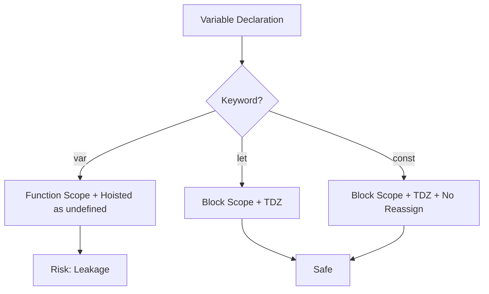

#### Interview Question

**Q:** `var`, `let`, aur `const` mein difference kya hai? Aur `const` se banaya gaya object modify ho sakta hai ya nahi?

**A:** `var` function-scoped hota hai aur hoisting ke time `undefined` initialize ho jaata hai, isliye declaration se pehle access karne pe error nahi aata. `let` aur `const` block-scoped hain aur Temporal Dead Zone (TDZ) mein rehte hain — declaration line se pehle access karoge toh `ReferenceError` milega.

`const` ka matlab hai binding immutable hai — yaani jis memory address pe variable point kar raha hai, woh change nahi hoga. But agar woh address ek object ka hai, toh object ki properties freely modify ho sakti hain. Agar tujhe poora object freeze karna hai toh `Object.freeze()` use karna padega.

Production mein default `const` use kar, jab reassign zaroori ho tabhi `let`. `var` ko bilkul mat use kar — legacy code ke alawa.

---

### 1.2 Operators, control flow

#### Definition

Operators woh tools hain jinse tu values pe operations karta hai — arithmetic (`+`, `-`, `*`, `/`, `%`, `**`), comparison (`==`, `===`, `!=`, `!==`, `<`, `>`), logical (`&&`, `||`, `??`), assignment (`=`, `+=`, `??=`), bitwise, ternary (`? :`), aur nullish coalescing (`??`). Control flow ka matlab hai code kis order mein chalega — `if/else`, `switch`, `for`, `while`, `do-while`, `for...of`, `for...in`.

Soch operators tere code ke verbs hain aur control flow grammar ki tarah sentence ka structure decide karta hai. `&&` short-circuits — agar pehla falsy hai toh dusra evaluate hi nahi hota. `??` sirf `null` aur `undefined` pe fallback deta hai, `||` sab falsy values pe (0, "", false bhi).

#### Why?

`||` aur `??` ka difference samajhna critical hai. Agar tu `count || 10` likhega aur `count = 0` aaya, toh `10` mil jayega — bug! `count ?? 10` se sirf `null/undefined` pe fallback hoga. Optional chaining `?.` aur nullish coalescing combine karke tu defensive code likh sakta hai bina nested if-else ke.

#### How?

```js
// Logical short-circuit
const user = null;
const name = user && user.name; // null, kyunki user falsy
const safe = user?.name ?? "Guest"; // "Guest"

// Ternary chaining (avoid deep nesting)
const role = age < 13 ? "kid" : age < 18 ? "teen" : "adult";

// Switch with fallthrough
switch (status) {
  case "pending":
  case "processing":
    showSpinner();
    break;
  case "done":
    showResult();
    break;
  default:
    showError();
}

// for...of vs for...in
const arr = ["a", "b", "c"];
for (const val of arr) console.log(val);   // values
for (const idx in arr) console.log(idx);   // keys (string)
```

#### Real-life Example

API response handle karna — defensive coding.

```js
// API se user aaya, kuch fields optional hain
function getDisplayName(user) {
  // Old way — verbose
  // if (user && user.profile && user.profile.name) return user.profile.name;
  // return "Anonymous";

  // Modern way
  return user?.profile?.name ?? "Anonymous";
}

// Feature flags
const showBeta = config?.features?.beta ?? false;
```

#### Diagram

```mermaid
flowchart TD
  A[Expression] --> B{Operator Type}
  B -->|Logical &&| C[Left Truthy? -> Right, else Left]
  B -->|Logical ||| D[Left Truthy? -> Left, else Right]
  B -->|Nullish ??| E[Left null/undefined? -> Right, else Left]
  B -->|Optional ?.| F[Left null/undefined? -> undefined, else Access]
```

#### Interview Question

**Q:** `||` aur `??` mein kya difference hai? Production mein kya use karega?

**A:** `||` operator left side ko falsy check karta hai — yaani `0`, `""`, `false`, `null`, `undefined`, `NaN` sab pe right side return karega. `??` sirf `null` aur `undefined` pe right side return karta hai, baaki falsy values ko respect karta hai.

Production mein default values dene ke liye `??` zyada safe hai. Example — agar user ne quantity `0` enter ki hai aur tu `quantity || 1` likhega, toh `1` aa jayega which is wrong. `quantity ?? 1` correctly `0` rakhega.

`||` abhi bhi useful hai jab tu sach mein "any falsy" check karna chahta hai, jaise empty string ko bhi default mein replace karna ho.

---

### 1.3 Functions (declarations, expressions, arrow, HOF, IIFE)

#### Definition

Function declaration `function foo() {}` hoist hota hai poora — top pe available ho jaata hai. Function expression `const foo = function() {}` sirf variable declaration hoist hoti hai (TDZ), function body baad mein assign hoti hai. Arrow function `const foo = () => {}` ka apna `this`, `arguments`, ya `super` nahi hota — yeh lexical scope se inherit karte hain. Higher-order functions (HOF) woh hain jo function ko argument lete hain ya function return karte hain. IIFE (Immediately Invoked Function Expression) — `(function(){})()` — define karte hi chal jaata hai.

Analogy — function declaration ek registered company hai, sab jagah pehle se known. Function expression ek freelancer hai jo specific time pe hire hota hai. Arrow function ek intern hai jo apna context nahi laata, surroundings se context borrow karta hai.

#### Why?

Different function forms ki zaroorat alag use cases mein hai. Arrow functions callbacks mein bahut useful hain kyunki `this` confusion nahi hota. HOFs functional programming ka core hain — `map`, `filter`, `reduce` sab HOFs hain. IIFE pre-ES6 era mein modules banane ke liye use hota tha, ab bhi private scope create karne ke liye useful hai.

#### How?

```js
// Declaration — hoisted
sayHi(); // "hi" — works
function sayHi() { console.log("hi"); }

// Expression — TDZ
// sayHello(); // ReferenceError
const sayHello = function() { console.log("hello"); };

// Arrow — lexical this
const obj = {
  name: "Ravi",
  greet: function() {
    setTimeout(() => console.log(this.name), 100); // "Ravi"
    // setTimeout(function(){ console.log(this.name) }, 100); // undefined
  }
};

// HOF
const withLog = (fn) => (...args) => {
  console.log("calling", fn.name);
  return fn(...args);
};

// IIFE
(function() {
  const secret = 42;
  console.log("module loaded");
})();
```

#### Real-life Example

Middleware pattern — HOF in action.

```js
// Auth middleware HOF
const requireAuth = (handler) => async (req, res) => {
  const token = req.headers.authorization;
  if (!token) return res.status(401).json({ error: "Unauthorized" });
  req.user = await verifyToken(token);
  return handler(req, res);
};

// Use
const getProfile = requireAuth(async (req, res) => {
  res.json(req.user);
});
```

#### Diagram

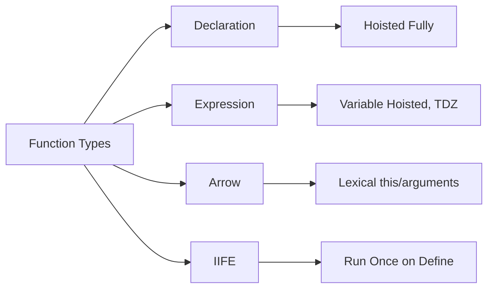

#### Interview Question

**Q:** Arrow function aur regular function mein kya difference hai? Kab kaunsa use karega?

**A:** Sabse bada difference `this` binding ka hai. Regular function ka `this` call site pe decide hota hai — jis object pe call hua, woh `this` banta hai. Arrow function ka apna `this` nahi hota, woh enclosing lexical scope se `this` leta hai. Iske alawa arrow function mein `arguments` object nahi hota, `new` se construct nahi kar sakte, aur `prototype` property nahi hoti.

Use case — class methods ya object methods regular function se likh, kyunki tujhe instance ka `this` chahiye. Callbacks (jaise `setTimeout`, `map`, `filter`) mein arrow use kar, kyunki tu outer `this` preserve karna chahta hai. Constructor banana hai toh regular function ya class use kar.

Ek subtle point — arrow function ko bind/call/apply se `this` nahi badal sakte, ignore ho jaata hai.

---

## 2. Core concepts

### 2.1 Execution context (creation phase, execution phase)

#### Definition

Execution context woh environment hai jismein JavaScript code execute hota hai. Har function call ek naya execution context banata hai. Do phases hote hain — Creation phase aur Execution phase. Creation phase mein JavaScript engine memory allocate karta hai variables aur functions ke liye (yahin hoisting hoti hai), aur scope chain set hota hai. Execution phase mein code line-by-line chalta hai aur values assign hoti hain.

Analogy — ek theatre stage soch. Creation phase mein stage set hota hai — props (variables) place hote hain, actors (functions) ready hote hain, lekin abhi performance shuru nahi hui. Execution phase mein curtain uthta hai aur actually performance hoti hai.

#### Why?

Execution context samajhna isliye zaroori hai kyunki hoisting, closures, `this`, scope — sab isi se nikalte hain. Jab tu debug karta hai aur dekhta hai variable `undefined` kyun aaya, toh creation phase ka logic dimaag mein aana chahiye.

#### How?

```js
// Creation phase mein:
// - 'a' undefined assign hota hai
// - 'foo' poora function memory mein
// Execution phase mein:
// - a = 10
// - foo() call hota hai -> naya execution context

console.log(a); // undefined (creation phase mein hoist)
var a = 10;

function foo() {
  // naya execution context
  var b = 20;
  console.log(b);
}
foo();
```

#### Real-life Example

Debugging mein tu dekhega — ek React component mein async data fetch kar raha hai, aur initial render pe `undefined` aa raha hai. Wahi creation vs execution ka concept — jab component pehli baar render hua, state abhi populate nahi hui thi.

```js
function Component() {
  const [data, setData] = useState(); // creation: undefined
  useEffect(() => {
    fetchData().then(setData); // execution: baad mein populate
  }, []);
  return <div>{data?.name ?? "loading"}</div>;
}
```

#### Diagram

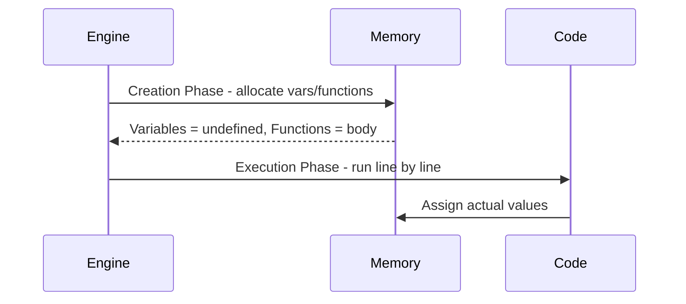

#### Interview Question

**Q:** Execution context kya hai aur kitne types ke hote hain?

**A:** Execution context woh environment hai jismein JavaScript code chalta hai. Teen types hote hain — Global Execution Context (GEC) jo poore program ke liye ek hi banta hai aur `window`/`global` object create karta hai; Function Execution Context (FEC) jo har function call pe naya banta hai; aur Eval Execution Context jo `eval()` ke andar code ke liye banta hai (rarely used, avoid karo).

Har context ke do phases hain — creation aur execution. Creation phase mein memory allocate hoti hai — variables ko `undefined` mil jaata hai (var) ya TDZ mein chalte hain (let/const), function declarations poori memory mein aa jaati hain, aur scope chain plus `this` binding set hoti hai. Execution phase mein actual code chalta hai aur values assign hoti hain.

Ye samajhna isliye zaroori hai kyunki hoisting, scope, closures sab execution context ke building blocks pe banty hain.

---

### 2.2 Call stack

#### Definition

Call stack ek LIFO (Last In First Out) data structure hai jo JavaScript engine use karta hai function calls track karne ke liye. Jab koi function call hota hai, uska execution context stack pe push hota hai. Function return hone pe pop ho jaata hai. Stack ke top pe jo hai, wahi currently execute ho raha hai.

Analogy — plates ka dher soch kitchen mein. Naya plate (function) upar rakhte ho, dishwasher upar wala plate hi nikalta hai. Agar tu bahut zyada plates rakh dega bina nikale, toh stack overflow ho jayega — yahi hota hai infinite recursion mein.

#### Why?

Call stack samajhna debugging aur performance ke liye critical hai. Stack traces tujhe error ka path dikhate hain. Recursion ki depth limit yahin se aati hai (~10000 frames). Async operations stack pe nahi chalte — woh task queue se aate hain (event loop topic).

#### How?

```js
function third() {
  console.log("third");
  // stack: [main, first, second, third]
}
function second() {
  third();
  // stack: [main, first, second]
}
function first() {
  second();
  // stack: [main, first]
}
first();

// Stack overflow example
function infinite() {
  return infinite();
}
// infinite(); // RangeError: Maximum call stack size exceeded
```

#### Real-life Example

Production mein tune dekha hoga deep recursion se app crash ho jaata hai. Solution — convert to iteration ya use trampolining.

```js
// Tree traversal — recursion crash karega bade trees pe
function deepCount(node) {
  if (!node) return 0;
  return 1 + node.children.reduce((sum, c) => sum + deepCount(c), 0);
}

// Iterative — stack apne haath se manage
function safeCount(root) {
  const stack = [root];
  let count = 0;
  while (stack.length) {
    const node = stack.pop();
    if (!node) continue;
    count++;
    stack.push(...node.children);
  }
  return count;
}
```

#### Diagram

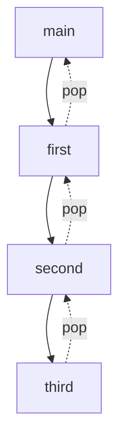

#### Interview Question

**Q:** Call stack kaise kaam karta hai aur "Maximum call stack size exceeded" error kab aati hai?

**A:** Call stack ek LIFO structure hai jismein har function invocation ek frame ke roop mein push hoti hai. Jab function execute ho raha hota hai, uska frame top pe rehta hai. Return hone pe pop ho jaata hai aur control wapas neeche wale frame ko mil jaata hai.

"Maximum call stack size exceeded" error tab aati hai jab stack ki capacity (browser mein generally ~10000-15000 frames) cross ho jaati hai. Ye usually infinite recursion ya bahut deep recursion ke wajah se hota hai. Solution — base case check kar, ya recursion ko iteration mein convert kar, ya tail call optimization use kar (though V8 mein implemented nahi hai properly).

Ek aur cheez — async functions stack pe block nahi karte. `setTimeout` ya promise stack se hatkar task/microtask queue se aate hain via event loop.

---

### 2.3 Hoisting (var/function/let/const — TDZ)

#### Definition

Hoisting JavaScript ka woh behaviour hai jismein variable aur function declarations execution se pehle hi memory mein "uthaaye" jaate hain. But sab equally nahi hote. `var` declarations hoist hoti hain aur `undefined` assign hota hai. Function declarations poori hoist hoti hain — body sahit. `let` aur `const` bhi technically hoist hote hain, but "Temporal Dead Zone" (TDZ) mein rehte hain — declaration line tak access karoge toh `ReferenceError`.

Analogy — soch ek class mein roll call ho rahi hai. `var` aur function ke naam pehle hi register mein chadh jaate hain (undefined values ke saath). `let/const` ke naam bhi hain register mein, but tu unhe call nahi kar sakta jab tak teacher line tak nahi pahunchti.

#### Why?

Hoisting samajhna zaroori hai because most "weird" JavaScript bugs hoisting se aate hain — variable use kar liya declaration se pehle, ya function expression ko declaration ki tarah call kar diya. TDZ ka faayda — yeh strict ordering enforce karta hai aur "use before declare" bugs catch karta hai.

#### How?

```js
// var — hoisted as undefined
console.log(a); // undefined
var a = 10;

// let — TDZ
// console.log(b); // ReferenceError
let b = 20;

// Function declaration — fully hoisted
greet(); // "hi"
function greet() { console.log("hi"); }

// Function expression — only var hoisted
// sayBye(); // TypeError: sayBye is not a function
var sayBye = function() { console.log("bye"); };

// Class — TDZ bhi hai
// const p = new Person(); // ReferenceError
class Person {}
```

#### Real-life Example

Production mein tu module top pe sab imports rakhega aur constants declare karega — hoisting confusion avoid karne ke liye.

```js
// BAD — relying on hoisting
function process() {
  doWork(); // works because hoisted
  function doWork() { /* ... */ }
}

// GOOD — declare before use
function process() {
  const doWork = () => { /* ... */ };
  doWork();
}
```

#### Diagram

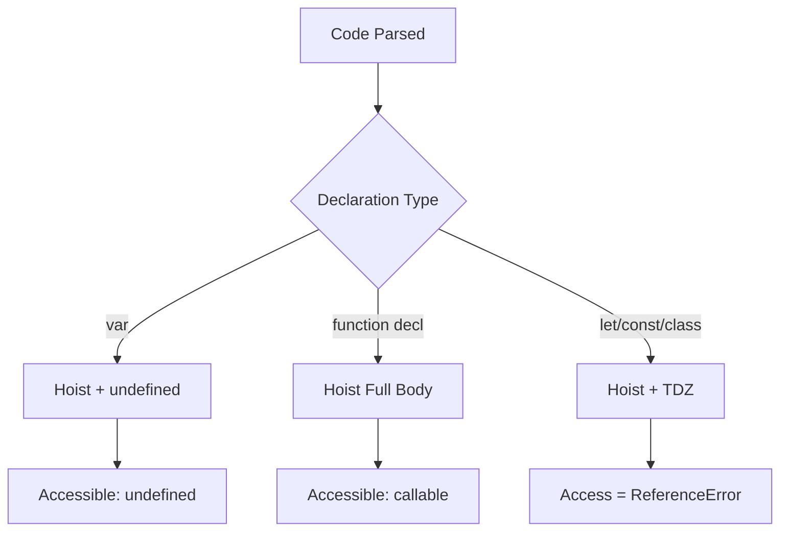

#### Interview Question

**Q:** TDZ kya hai aur `let`/`const` hoist hote hain ya nahi?

**A:** Temporal Dead Zone (TDZ) woh time period hai jab variable scope mein toh aa chuka hai (creation phase mein), but abhi initialize nahi hua hai. Is window mein agar tu variable access karega toh `ReferenceError` milega.

Technically `let` aur `const` bhi hoist hote hain — engine ko unke existence ka pata block ke shuru se hi hota hai. But unhe `undefined` initialize nahi kiya jaata jaise `var` ke saath hota hai. Isliye declaration line tak woh "dead zone" mein rehte hain.

TDZ ka faayda — strict use-before-declare error catch ho jaata hai jo predictable code likhne mein madad karta hai. `var` ke case mein silent `undefined` milta tha jo bugs cause karta tha.

---

### 2.4 Closures (deep — multiple levels, common patterns)

#### Definition

Closures basically tumhare function ki memory hai. Function jab banta hai, uske around ka scope yaad rakh leta hai — even after that outer function returns. Yaani inner function apne parent ke variables ko "close over" karta hai aur baad mein bhi access kar sakta hai.

Multiple levels mein closures aur powerful ho jaate hain — ek function dusre ke andar, woh teesre ke andar, har level ka scope chain bana rehta hai. Common patterns hain — module pattern, data privacy, currying, memoization, event handlers with state.

#### Why?

Closures JavaScript ke sabse important features hain. Inse tu private variables bana sakta hai (encapsulation), partial application kar sakta hai, factory functions bana sakta hai. React hooks (`useState`, `useEffect`) closures pe hi bane hain. Without closures, modern JS itna powerful nahi hota.

#### How?

```js
// Basic closure
function counter() {
  let count = 0;
  return {
    inc: () => ++count,
    get: () => count
  };
}
const c = counter();
c.inc(); c.inc();
console.log(c.get()); // 2 — count zinda hai

// Multi-level
function outer(a) {
  return function middle(b) {
    return function inner(c) {
      return a + b + c; // teeno scopes accessible
    };
  };
}
console.log(outer(1)(2)(3)); // 6

// Memoization pattern
function memoize(fn) {
  const cache = new Map();
  return (arg) => {
    if (cache.has(arg)) return cache.get(arg);
    const result = fn(arg);
    cache.set(arg, result);
    return result;
  };
}
```

#### Real-life Example

React-style state hook (simplified).

```js
// Apna chhota useState
function createState(initial) {
  let value = initial;
  const setValue = (newVal) => { value = newVal; };
  const getValue = () => value;
  return [getValue, setValue];
}

const [getCount, setCount] = createState(0);
setCount(5);
console.log(getCount()); // 5

// Debounce — production utility
function debounce(fn, delay) {
  let timer;
  return (...args) => {
    clearTimeout(timer);
    timer = setTimeout(() => fn(...args), delay);
  };
}
```

#### Diagram

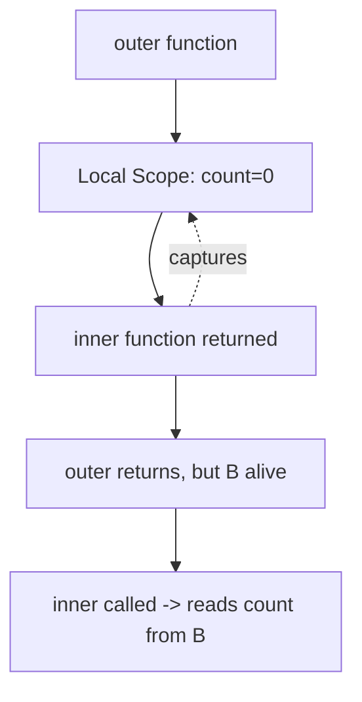

#### Interview Question

**Q:** Closure kya hai aur ye memory leak kaise cause kar sakta hai?

**A:** Closure ek function hai jo apne lexical scope ke variables ko remember karta hai, even after the outer function execution complete ho chuki hai. Jab inner function reference somewhere stored ho jaata hai (jaise event listener, setTimeout, ya returned value), woh outer scope ke variables ko zinda rakhta hai garbage collection se.

Memory leak tab hota hai jab tu closures ko unintentionally rakhta hai aur woh bade objects pe hold karte hain. Common scenario — DOM elements ko closure mein capture karna aur listener remove na karna; large data structures ko closure mein hold karna jab actually zaroori nahi.

Solution — listeners ko cleanup karo, weak references use karo jahan possible, aur closures mein sirf zaroori variables capture karo. React mein `useEffect` cleanup functions yahi kaam karte hain — stale closures aur leaks se bachne ke liye.

---

### 2.5 Scope (lexical, block, function, module)

#### Definition

Scope decide karta hai variables aur functions kaha accessible hain. JavaScript mein scope types hain — Global scope (poore program mein available), Function scope (`var` aur regular functions ke liye — function ke andar bound), Block scope (`let`/`const` — `{}` ke andar bound), aur Module scope (ES modules mein har file apna scope).

Lexical scoping ka matlab hai scope code likhne ke time pe decide hota hai (statically), runtime pe nahi. Jahan function physically likha gaya hai, wahi uska scope chain hai. Yahin closure ki neev hai.

#### Why?

Scope samajhna isliye zaroori hai kyunki bug usually scope confusion se aate hain — variable kaha visible hai, kaha shadow ho raha hai. Module scope ki wajah se modern JS mein global pollution kam ho gaya hai.

#### How?

```js
// Lexical
const x = 10;
function outer() {
  function inner() {
    console.log(x); // 10 — lexical lookup
  }
  inner();
}

// Block scope
{
  let secret = "shh";
}
// console.log(secret); // ReferenceError

// Shadowing
const name = "global";
function greet() {
  const name = "local";
  console.log(name); // "local"
}

// Module scope
// file: utils.js
// const helper = () => {}; — sirf is file mein, jab tak export na ho
```

#### Real-life Example

Module pattern with private state.

```js
// userService.js — sab kuch module-scoped
const cache = new Map();

export function getUser(id) {
  if (cache.has(id)) return cache.get(id);
  const user = fetchFromDB(id);
  cache.set(id, user);
  return user;
}
// 'cache' bahar se accessible nahi — encapsulation
```

#### Diagram

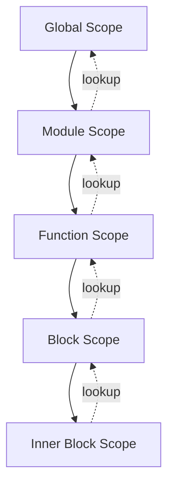

#### Interview Question

**Q:** Lexical scoping aur dynamic scoping mein kya difference hai?

**A:** Lexical scoping (jise static scoping bhi kehte hain) mein variable kahan accessible hai ye code likhne ke time pe decide hota hai — yaani function jahan physically nest hua hai, wahin uska scope chain hai. JavaScript lexical scoping use karta hai. Jab tu function call karta hai, engine variable lookup ke liye function ki definition wali nesting dekhta hai, call site nahi.

Dynamic scoping mein scope call stack pe depend karta hai — function call kahan se hua, wahan ka context use hota hai. Bash shell variables aur kuch older languages dynamic scope use karte hain.

JavaScript mein `this` keyword exception hai — woh dynamic-ish hota hai (call site pe decide hota hai for regular functions), but variable lookup hamesha lexical hi hota hai. Arrow functions `this` ko bhi lexical bana dete hain.

---

### 2.6 `this` keyword (implicit, explicit with call/apply/bind, default, arrow exception)

#### Definition

`this` keyword ek dynamic reference hai jo decide hota hai function kaise call hua. Different binding rules hain — Default binding (standalone function call — strict mode mein `undefined`, non-strict mein `window`/`global`); Implicit binding (object method call — `obj.method()` mein `this` = `obj`); Explicit binding (`call`, `apply`, `bind` se manually set); New binding (`new Constructor()` mein fresh object); Arrow function exception (`this` lexical, change nahi hota).

Analogy — `this` ek context-sensitive pronoun hai. "Main" bolne se decide hota hai kaun bol raha hai. Function `this` bhi waise hi — kis object ne call kiya, woh `this` banta hai. Arrow functions ne decide kar liya hai "main" hamesha mere parent ka hi rahega.

#### Why?

`this` JavaScript ke sabse confusing topics mein se hai. Method ko callback mein pass karte hi `this` lose ho jaata hai — production bug. Class methods, event handlers, async callbacks — sab jagah `this` track karna padta hai. Iska sahi pakad rakhna senior dev ki nishaani hai.

#### How?

```js
// Implicit
const obj = { name: "A", say() { console.log(this.name); } };
obj.say(); // "A"

// Lost binding
const fn = obj.say;
fn(); // undefined (strict) — this lost

// Explicit
fn.call(obj);  // "A"
fn.apply(obj); // "A"
const bound = fn.bind(obj);
bound(); // "A"

// New
function Person(name) { this.name = name; }
const p = new Person("Ravi"); // this = new {}

// Arrow — lexical
const obj2 = {
  name: "B",
  delayed: function() {
    setTimeout(() => console.log(this.name), 100); // "B"
  }
};
```

#### Real-life Example

React class component me classic `this` bug.

```js
class Button extends Component {
  state = { clicks: 0 };

  // PROBLEM — this lost in callback
  handleClick() {
    this.setState({ clicks: this.state.clicks + 1 }); // this undefined
  }

  // FIX 1 — bind in constructor or arrow
  handleClickFixed = () => {
    this.setState(s => ({ clicks: s.clicks + 1 }));
  };

  render() {
    return <button onClick={this.handleClickFixed}>+</button>;
  }
}
```

#### Diagram

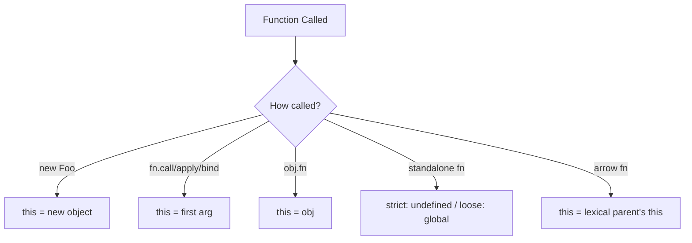

#### Interview Question

**Q:** `call`, `apply`, aur `bind` mein kya difference hai?

**A:** Teeno explicit binding ke methods hain `this` set karne ke liye. `call(thisArg, arg1, arg2, ...)` function ko immediately invoke karta hai given `this` aur individual arguments ke saath. `apply(thisArg, [args])` bilkul `call` jaisa hi hai, but arguments array ya array-like object mein leta hai. `bind(thisArg, ...args)` invoke nahi karta — naya function return karta hai jismein `this` permanently set ho jaata hai aur partial arguments bhi pre-fill ho sakte hain.

Use case difference — `call` jab arguments separately pass karne ho. `apply` jab arguments dynamic array mein hain (modern code mein spread `fn(...args)` zyada use hota hai). `bind` jab tu function ko callback ke roop mein pass karna chahta hai aur uska `this` fix rakhna chahta hai (event handlers, setTimeout callbacks).

Note — arrow functions ke saath teeno mein se kuch bhi `this` change nahi karta, ignore ho jaata hai because arrow ka `this` lexical hota hai.

---

## 3. Objects & arrays

### 3.1 Destructuring (object & array patterns, defaults, renaming)

#### Definition

Destructuring ek concise syntax hai object ya array se values nikaal kar variables mein assign karne ke liye. Object destructuring `{}` use karta hai property names ke saath, array destructuring `[]` use karta hai position ke according. Defaults set kar sakte ho `=` se, rename kar sakte ho `:` se, aur nested destructuring bhi possible hai.

Analogy — soch ek dabba (object) hai jismein items hain naam ke saath. Destructuring ek wishlist hai — "mujhe ye, ye, aur ye chahiye". Agar item nahi hai toh default le lo. Agar item ka naam alag rakhna hai toh rename kar do.

#### Why?

Destructuring code ko clean aur readable banata hai. Function parameters mein options object destructure karna ek standard pattern hai. API responses se specific fields extract karna easy ho jaata hai. React props mein bahut common hai.

#### How?

```js
// Object
const user = { name: "Ravi", age: 25, city: "Delhi" };
const { name, age } = user;

// Rename + default
const { name: userName, country = "India" } = user;

// Nested
const data = { user: { profile: { email: "a@b.com" } } };
const { user: { profile: { email } } } = data;

// Array
const [first, second, ...rest] = [1, 2, 3, 4, 5];

// Skip
const [, , third] = [10, 20, 30]; // 30

// Function params
function createUser({ name, role = "user", active = true }) {
  return { name, role, active };
}
```

#### Real-life Example

API response handling.

```js
async function loadProfile(userId) {
  const response = await fetch(`/api/users/${userId}`);
  const {
    data: {
      user: { name, email, settings: { theme = "light" } = {} } = {}
    } = {}
  } = await response.json();

  return { name, email, theme };
}
```

#### Diagram

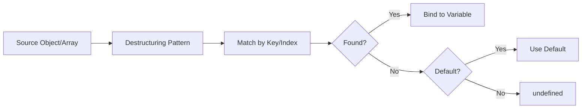

#### Interview Question

**Q:** Object destructuring mein default value kab apply hoti hai — `null` pe ya `undefined` pe?

**A:** Default value sirf `undefined` pe apply hoti hai. Agar property exist hi nahi karti object mein, ya explicitly `undefined` set hai, toh default kick in karega. But agar value `null`, `0`, `""`, ya `false` hai, toh default ignore ho jaayega aur woh actual falsy value milegi.

Ye behaviour `||` operator se different hai jo sab falsy values pe fallback deta hai. Default destructuring `??` ki tarah behave karta hai but sirf `undefined` pe — `null` pe bhi default nahi aata.

Practical impact — agar tu API se data le raha hai aur backend `null` bhej raha hai missing fields ke liye, toh destructuring defaults nahi chalegi. Tujhe `??` use karna padega ya backend ko bolna padega `undefined`/missing bhejne ke liye (JSON mein `undefined` nahi hota, isliye property hi remove karwa).

---

### 3.2 Spread / rest

#### Definition

Spread operator (`...`) ek iterable (array, string, object) ko individual elements/properties mein "spread" kar deta hai. Rest operator (same syntax `...`) opposite hai — multiple arguments ya remaining elements ko ek array/object mein collect karta hai. Context decide karta hai kaunsa hai — function call ya array/object literal mein spread, function parameter ya destructuring mein rest.

Analogy — spread ek packet kholne jaisa hai, saare items table pe phaila do. Rest ek bag mein bachi hui cheezein daalne jaisa hai.

#### Why?

Spread/rest immutability ke liye essential hain — naya array/object banao bina mutate kiye. React state updates, Redux reducers, function arguments — sab jagah use hota hai. Pre-spread era mein `Array.prototype.slice.call(arguments)` jaise hacks karne padte the.

#### How?

```js
// Spread — array
const a = [1, 2, 3];
const b = [...a, 4, 5]; // [1,2,3,4,5]

// Spread — object
const user = { name: "A", age: 25 };
const updated = { ...user, age: 26 }; // override

// Spread — function call
Math.max(...[5, 2, 8, 1]); // 8

// Rest — function params
function sum(...nums) {
  return nums.reduce((a, b) => a + b, 0);
}
sum(1, 2, 3, 4); // 10

// Rest — destructuring
const [first, ...others] = [1, 2, 3, 4];
const { name, ...metadata } = { name: "A", age: 25, city: "X" };
```

#### Real-life Example

Redux-style state update.

```js
// Reducer pattern
function todoReducer(state, action) {
  switch (action.type) {
    case "ADD":
      return { ...state, todos: [...state.todos, action.payload] };
    case "UPDATE":
      return {
        ...state,
        todos: state.todos.map(t =>
          t.id === action.id ? { ...t, ...action.changes } : t
        )
      };
    case "REMOVE":
      const { [action.id]: removed, ...rest } = state.todoMap;
      return { ...state, todoMap: rest };
  }
}
```

#### Diagram

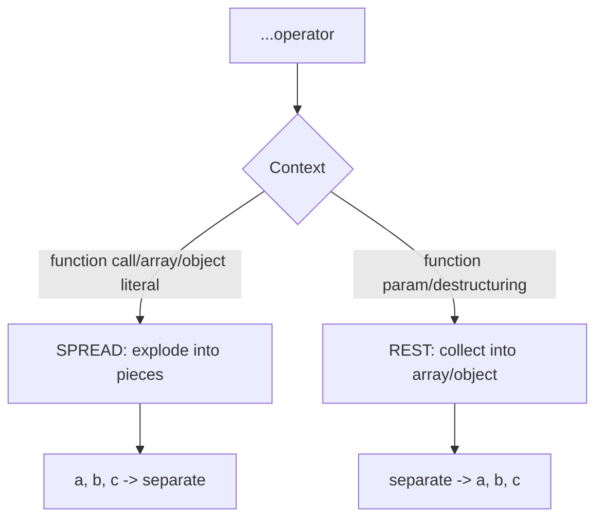

#### Interview Question

**Q:** Spread operator shallow copy karta hai ya deep copy?

**A:** Spread operator hamesha shallow copy karta hai. Top-level properties copy ho jaati hain, but nested objects/arrays ka reference share hota hai. Yaani agar tu `{ ...obj }` karega aur `obj` mein koi nested object hai, toh original aur copy dono us nested object ko same memory location pe point karenge.

Production mein yeh bug ka source ban sakta hai — tu sochta hai naya state banaya, but nested mutation original ko bhi affect karega. React mein "state directly mutate mat karo" rule isi liye hai.

Deep copy ke liye options hain — `structuredClone(obj)` (modern, native, recommended), `JSON.parse(JSON.stringify(obj))` (limited, functions/dates/undefined miss hote hain), ya Lodash ka `cloneDeep`. Performance concern ho toh sirf zaroori levels manually copy karo, full deep copy avoid karo.

---

### 3.3 Array methods (map, filter, reduce, flat, flatMap, find, some, every, etc.)

#### Definition

Array methods JavaScript ke functional programming tools hain. `map` har element transform karta hai aur naya array banata hai. `filter` condition pe based subset return karta hai. `reduce` array ko ek single value mein reduce karta hai. `flat` nested arrays ko flatten karta hai. `flatMap` map + flat ek step mein. `find` first matching element return karta hai, `findIndex` index. `some` checks if at least one matches, `every` checks if all match. `includes` membership check. Sab non-mutating hain (mostly).

Analogy — array ek dabba hai chocolates ka. `map` har chocolate pe wrapper change karta hai. `filter` sirf dark chocolates rakh leta hai. `reduce` sab chocolates ka total weight nikalta hai. `find` pehli mil jaaye toh nikal de.

#### Why?

Functional array methods loops se zyada declarative aur readable hain. Chaining se complex transformations clean dikhte hain. Immutability by default — original array safe rehta hai. Performance bhi modern engines mein optimized hai.

#### How?

```js
const nums = [1, 2, 3, 4, 5];

// map
const doubled = nums.map(n => n * 2); // [2,4,6,8,10]

// filter
const evens = nums.filter(n => n % 2 === 0); // [2,4]

// reduce
const sum = nums.reduce((acc, n) => acc + n, 0); // 15

// flat / flatMap
const nested = [[1, 2], [3, [4, 5]]];
nested.flat();    // [1,2,3,[4,5]]
nested.flat(2);   // [1,2,3,4,5]

const sentences = ["hello world", "foo bar"];
sentences.flatMap(s => s.split(" ")); // ["hello","world","foo","bar"]

// find / some / every
nums.find(n => n > 3);     // 4
nums.some(n => n > 4);     // true
nums.every(n => n > 0);    // true

// Chaining
const result = nums
  .filter(n => n % 2 === 0)
  .map(n => n * 10)
  .reduce((a, b) => a + b, 0); // 60
```

#### Real-life Example

E-commerce cart calculations.

```js
const cart = [
  { id: 1, name: "Book", price: 200, qty: 2, inStock: true },
  { id: 2, name: "Pen", price: 50, qty: 5, inStock: false },
  { id: 3, name: "Bag", price: 800, qty: 1, inStock: true },
];

// Total of in-stock items
const total = cart
  .filter(item => item.inStock)
  .map(item => item.price * item.qty)
  .reduce((sum, val) => sum + val, 0); // 1200

// Group by stock status
const grouped = cart.reduce((acc, item) => {
  const key = item.inStock ? "available" : "out";
  (acc[key] ||= []).push(item);
  return acc;
}, {});

// Any out-of-stock?
const hasOOS = cart.some(item => !item.inStock); // true
```

#### Diagram


#### Interview Question

**Q:** `forEach` aur `map` mein kya difference hai? Performance ya use case ke liye kab kaunsa choose karega?

**A:** `forEach` ek iteration utility hai jo har element pe callback chalata hai but kuch return nahi karta (returns `undefined`). Iska use side effects ke liye hota hai — logging, DOM updates, external state changes. `map` har element ko transform karke naya array return karta hai of same length, isliye purely functional transformations ke liye use hota hai.

Use case — agar tu naya array banana chahta hai elements transform karke, `map` use kar. Agar bas iterate karke side effect karna hai, `forEach` ya `for...of` use kar. Chaining mein `forEach` kaam nahi aayega kyunki return value nahi hai.

Performance ki baat kare toh `for` loop technically fastest hota hai modern engines mein, lekin `map`/`forEach` itne optimized hain ki aam tor pe difference negligible hai. Readability prefer karo. Bahut hot path mein hi loop pe shift karo, profile karne ke baad.

Ek aur nuance — `map` original array mutate nahi karta, but agar callback mein tu mutate karta hai toh mutate ho jaayega. Pure functions likh callbacks mein.

---
# JavaScript (Deep) — Part 2: Async, Browser APIs, Modules & Tooling

Bhai, Part 1 me humne language ke fundamentals dekhe — types, scope, closures, prototypes, `this`. Ab Part 2 me hum us layer ki taraf jaa rahe hain jaha JavaScript apna asli rang dikhata hai: **async world**. Ye wahi jagah hai jaha junior devs sabse zyada phaste hain — `setTimeout` 0ms ka kyu late chalta hai, Promise resolve hone ke baad bhi `.then` baad me kyu fire hota hai, aur `await` actually background me kya kar raha hai.

Iske baad hum **browser APIs** dekhenge — DOM, events, fetch, storage, cookies. Ye sab tools hain jinse tu actual UI banata hai. Aur end me **modules + tooling** — ESM, npm, bundlers, env vars. Ye production-grade JS likhne ke liye non-negotiable hai. Chal shuru karte hain.

---

## 4. Async JS

### 4.1 Event loop (microtask vs macrotask queue, render frames)

#### Definition
Event loop basically JS ka traffic controller hai — kaun-sa task pehle, kaun-sa baad me, sab decide karta hai. JS single-threaded hai, matlab ek time pe ek hi cheez chal sakti hai call stack pe. Lekin browser/Node ke paas extra threads hain jo timers, network, file I/O handle karte hain. Jab unka kaam khatam hota hai, callbacks queue me daal diye jaate hain — aur event loop call stack khaali hote hi unhe utha leta hai.

Analogy: socho ek single chef (call stack) hai jo ek dish banata hai at a time. Uske paas do tray hain — **microtask tray** (Promise callbacks, `queueMicrotask`) aur **macrotask tray** (setTimeout, setInterval, I/O, UI events). Chef pehle apni current dish khatam karta hai, fir microtask tray puri ki puri saaf karta hai (saari microtasks ek go me), tabhi macrotask se ek pick karta hai. Render frame (paint) macrotask aur microtask ke beech kabhi-kabhi sneak in karta hai (~16ms pe).

#### Why?
Without event loop, JS blocking ho jaata — ek `fetch` call puri UI freeze kar deti. Event loop async ko sync-jaisa likhne deta hai bina threads ke headache ke. Microtask vs macrotask ka difference samajhna critical hai kyunki UI smoothness aur ordering bugs yahin se aate hain.

#### How?
```js
// Order ka classic puzzle
console.log('1'); // sync — stack pe turant

setTimeout(() => console.log('2'), 0); // macrotask queue

Promise.resolve().then(() => console.log('3')); // microtask queue

queueMicrotask(() => console.log('4')); // microtask queue

console.log('5'); // sync

// Output: 1, 5, 3, 4, 2
// Sync first, fir saari microtasks (3,4), tab macrotask (2)
```

Mechanism: stack empty hone par engine microtask queue ko **completely drain** karta hai (naye microtasks bhi included). Tab ek macrotask uthata hai. Iske baad render hota hai (agar browser ko zaroorat lage).

#### Real-life Example
Maan le tu ek search box bana raha hai jo har keystroke pe API call karta hai. Tu debounce karega, lekin saath me UI bhi update karna hai. Agar tu microtasks me bhaari kaam daal de, paint freeze ho jaayegi.

```js
// Production: debounced search input
let timer;
input.addEventListener('input', (e) => {
  clearTimeout(timer);
  // setTimeout = macrotask, browser ko paint karne ka chance milega
  timer = setTimeout(() => {
    fetch(`/api/search?q=${e.target.value}`)
      .then((r) => r.json())
      .then((data) => {
        // .then microtask hai — turant chalega jab fetch resolve ho
        renderResults(data);
      });
  }, 300);
});
```

#### Diagram
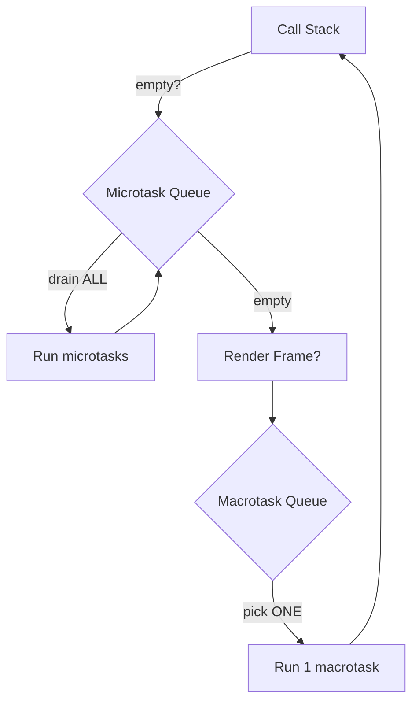

#### Interview Question
**Q:** Agar `Promise.resolve().then(...)` aur `setTimeout(..., 0)` dono ek hi sync block me schedule karein, to kaun pehle chalega aur kyu?

**A:** Promise wala pehle chalega. Reason — `Promise.then` callback **microtask queue** me jaata hai, jabki `setTimeout` callback **macrotask queue** me. Event loop ka rule hai ki current sync code khatam hone ke baad, engine pehle microtask queue ko **fully drain** karta hai (matlab agar microtask ke andar aur microtasks schedule hue, wo bhi same turn me chalengi). Tab jaake ek macrotask uthaya jaata hai.

Production me iska impact ye hai ki agar tu Promise chains ke andar infinite microtasks daal de, to setTimeout kabhi nahi chalega aur UI freeze ho jaayegi (microtask starvation). Isliye heavy work ko `setTimeout` ya `requestIdleCallback` me daalna best practice hai. Node.js me thoda extra layer hai — `process.nextTick` microtasks se bhi pehle chalta hai.

---

### 4.2 Promises (states, chaining, all/race/allSettled/any)

#### Definition
Promise ek object hai jo future ki value represent karta hai — kuch jo abhi nahi hai par baad me hoga (ya fail hoga). Iske teen states hain: **pending** (kuch ho raha hai), **fulfilled** (success, value mil gayi), **rejected** (error aaya). Ek baar settle ho gaya (fulfilled ya rejected), to wapas pending nahi ho sakta — immutable hai.

Analogy: Zomato pe order place kiya — ye Promise hai. Pending matlab "khaana aa raha hai", fulfilled matlab "khaana aagaya", rejected matlab "restaurant closed". Tu order place karte hi parallel me kaam kar sakta hai, khaana aane ka wait nahi karna.

#### Why?
Callback hell se bachne ke liye. Pehle nested callbacks (`callback(callback(callback()))`) likhte the — debug karna nightmare. Promises **chainable** hain (`.then().then().catch()`) — code linear padhta hai. Plus combinators (`Promise.all` etc) parallel async kaam easy bana dete hain.

#### How?
```js
// Promise create
const p = new Promise((resolve, reject) => {
  setTimeout(() => {
    Math.random() > 0.5 ? resolve('data') : reject(new Error('fail'));
  }, 1000);
});

// Chaining — har .then naya Promise return karta hai
p.then((v) => v.toUpperCase())
 .then((v) => console.log(v))
 .catch((e) => console.error(e))
 .finally(() => console.log('done'));

// Combinators
Promise.all([p1, p2, p3]);        // sab fulfill -> array; ek bhi reject -> reject
Promise.allSettled([p1, p2, p3]); // sab settle ka wait, har ek ka result
Promise.race([p1, p2, p3]);       // jo pehle settle ho (success ya fail)
Promise.any([p1, p2, p3]);        // jo pehle fulfill ho; sab reject -> AggregateError
```

#### Real-life Example
Ek dashboard banana hai jisme user info, notifications, aur recent orders dikhane hain — teen alag APIs se. Sequence me karega to 3x time lagega.

```js
async function loadDashboard(userId) {
  // Parallel fire — fastest path
  const [user, notifs, orders] = await Promise.all([
    fetch(`/api/users/${userId}`).then((r) => r.json()),
    fetch(`/api/notifs/${userId}`).then((r) => r.json()),
    fetch(`/api/orders/${userId}`).then((r) => r.json()),
  ]);
  return { user, notifs, orders };
}

// Agar partial failure tolerate karna hai — allSettled
async function loadDashboardSafe(userId) {
  const results = await Promise.allSettled([...]);
  return results.map((r) => r.status === 'fulfilled' ? r.value : null);
}
```

#### Diagram
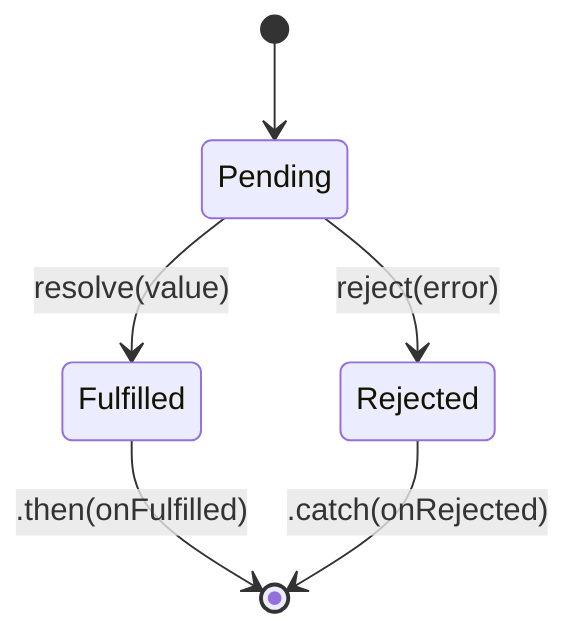

#### Interview Question
**Q:** `Promise.all` aur `Promise.allSettled` me kya difference hai, aur production me kab kaunsa use karega?

**A:** `Promise.all` **fail-fast** hai — agar input array me se ek bhi promise reject ho jaaye, pura `Promise.all` immediately reject ho jaata hai aur baaki ke promises ka result tu kabhi nahi dekh paayega (wo background me complete to honge, par ignore). Use case: jab saari calls critical hain — like ek form submit me user create + email send + analytics log. Ek bhi fail to overall fail.

`Promise.allSettled` har promise ke settle hone ka wait karta hai aur ek array deta hai jisme `{ status, value }` ya `{ status, reason }` hota hai. Use case: dashboard jaise UI jaha partial data bhi acceptable hai — agar notifications API down hai, tab bhi user profile dikha do. Production me main rule ye hai: **critical-path = `all`, best-effort = `allSettled`**. Beginners ki common mistake — `all` use karke ek widget fail hone se pura page crash karwa lena.

---

### 4.3 async / await + error handling

#### Definition
`async/await` Promises pe syntactic sugar hai. `async` function hamesha Promise return karta hai. `await` Promise ko "unwrap" karta hai — function execution pause hota hai (non-blocking, baaki JS chalti rehti hai), aur jab Promise resolve ho jaaye, value milti hai. Reject hua to `await` exception throw karta hai jise tu `try/catch` se pakad sakta hai.

Analogy: `.then` chains likhna jaise dominoes set karna — har ek pe explicit callback. `await` likhna jaise Notion me checklist — top-to-bottom sequential, par engine background me efficiently handle karta hai.

#### Why?
Readability. Nested `.then` me error handling, conditional logic, loops sab awkward ho jaata hai. `async/await` se code synchronous-jaisa dikhta hai — `try/catch` regular tarike se kaam karta hai, `if/else` bhi natural hai.

#### How?
```js
// .then chain version
function getUser(id) {
  return fetch(`/api/users/${id}`)
    .then((r) => {
      if (!r.ok) throw new Error('fail');
      return r.json();
    })
    .then((u) => fetch(`/api/posts/${u.id}`))
    .then((r) => r.json());
}

// async/await version — same kaam, padhne me clean
async function getUser(id) {
  const r = await fetch(`/api/users/${id}`);
  if (!r.ok) throw new Error('fail');
  const user = await r.json();
  const postsRes = await fetch(`/api/posts/${user.id}`);
  return postsRes.json();
}

// Error handling
async function safeCall() {
  try {
    const data = await getUser(1);
    return data;
  } catch (err) {
    console.error('caught:', err);
    return null;
  } finally {
    console.log('cleanup');
  }
}
```

Pitfall: sequential `await` jab parallel chahiye. `await a; await b` me total time `a+b` hai. Agar independent hain, `Promise.all([a, b])` use kar — `max(a,b)` time.

#### Real-life Example
Ek checkout flow — payment process karo, order DB me save karo, email bhejo. Payment fail ho to rest skip, but email fail ho to order roll back nahi karna.

```js
async function checkout(cart, user) {
  try {
    const payment = await chargeCard(cart.total, user.cardToken);
    const order = await saveOrder({ ...cart, paymentId: payment.id });
    
    // Email best-effort — fail hone par order rollback nahi
    sendConfirmationEmail(user.email, order).catch((e) =>
      logger.warn('email failed', e)
    );
    
    return { success: true, orderId: order.id };
  } catch (err) {
    if (err.code === 'CARD_DECLINED') return { success: false, reason: 'card' };
    logger.error('checkout failed', err);
    throw err; // re-throw unexpected errors
  }
}
```

#### Diagram
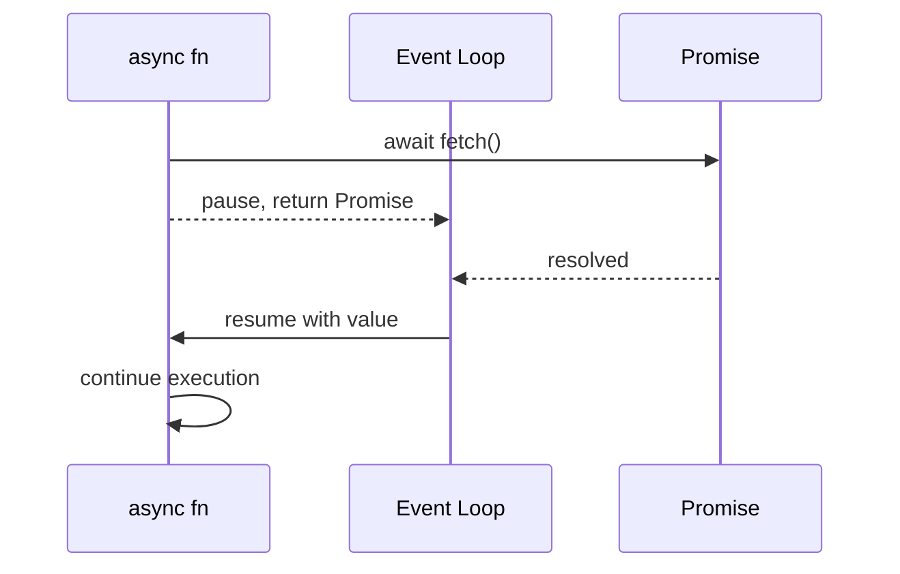

#### Interview Question
**Q:** `await` ke saath sequential vs parallel execution ka kya farak hai? Code example de.

**A:** Sequential `await` har Promise ka wait karta hai pichle wala settle hone ke baad hi next start hota hai. Code: `const a = await fetchA(); const b = await fetchB();` — agar dono 1 sec lete hain, total 2 sec. Ye sahi hai jab `b` ko `a` ka result chahiye (data dependency).

Parallel execution `Promise.all` se hota hai — promises pehle fire kar diye, fir collectively await kiye: `const [a, b] = await Promise.all([fetchA(), fetchB()]);` — total ~1 sec. Junior devs ki sabse common mistake hai loop me `await` likhna jab independent calls hain — `for (const id of ids) { await fetchOne(id); }` ko `Promise.all(ids.map(fetchOne))` se replace kar do, 10x speed-up milta hai.

Caveat: parallel me agar ek reject hua, baaki ke errors ignore ho sakte hain (unhandled rejection warning) — isliye `allSettled` consider karna chahiye jab errors collect karne hain.

---

## 5. Browser APIs

### 5.1 DOM manipulation (query, create, update, remove, traversal)

#### Definition
DOM (Document Object Model) HTML page ka tree-shaped representation hai jo browser memory me banata hai. Har element ek node hai, parent-child rishtey hain. JavaScript se hum is tree ko query, modify, add, remove kar sakte hain — yahi to UI dynamic banata hai.

Analogy: HTML page ek family tree hai. `document` dada-dadi (root), `<body>` papa, har `<div>` ek beta. Tu kisi bhi rishtedaar tak `querySelector` se pahunch sakta hai, naya member `createElement` se add kar sakta hai, ya `remove()` se ghar se nikaal sakta hai.

#### Why?
Static HTML server se aata hai, par modern apps me UI react karna chahiye user interactions pe. DOM API direct manipulation ka tareeka hai. Even React/Vue jaise frameworks underneath DOM hi modify karte hain — fundamentals samajhna debug me bahut help karta hai.

#### How?
```js
// Query
const btn = document.querySelector('#submit');           // ek
const items = document.querySelectorAll('.item');        // NodeList (sab)

// Create
const li = document.createElement('li');
li.textContent = 'New item';
li.classList.add('active');
li.dataset.id = '42';

// Update
btn.disabled = true;
btn.setAttribute('aria-busy', 'true');
btn.style.background = 'red'; // inline style — avoid in production

// Insert
document.querySelector('ul').append(li);     // last child
parent.prepend(li);                          // first child
existing.before(li);                         // before sibling

// Remove
li.remove();

// Traversal
li.parentElement;
li.children;
li.nextElementSibling;
li.closest('.container'); // upward search
```

#### Real-life Example
Ek todo list me item add/remove. Production tip — bulk inserts ke liye `DocumentFragment` use kar, har append pe reflow nahi hoga.

```js
function renderTodos(todos) {
  const list = document.querySelector('#todo-list');
  const frag = document.createDocumentFragment();
  
  todos.forEach((t) => {
    const li = document.createElement('li');
    li.textContent = t.title;
    li.dataset.id = t.id;
    if (t.done) li.classList.add('done');
    frag.appendChild(li);
  });
  
  list.replaceChildren(frag); // ek hi reflow
}
```

#### Diagram
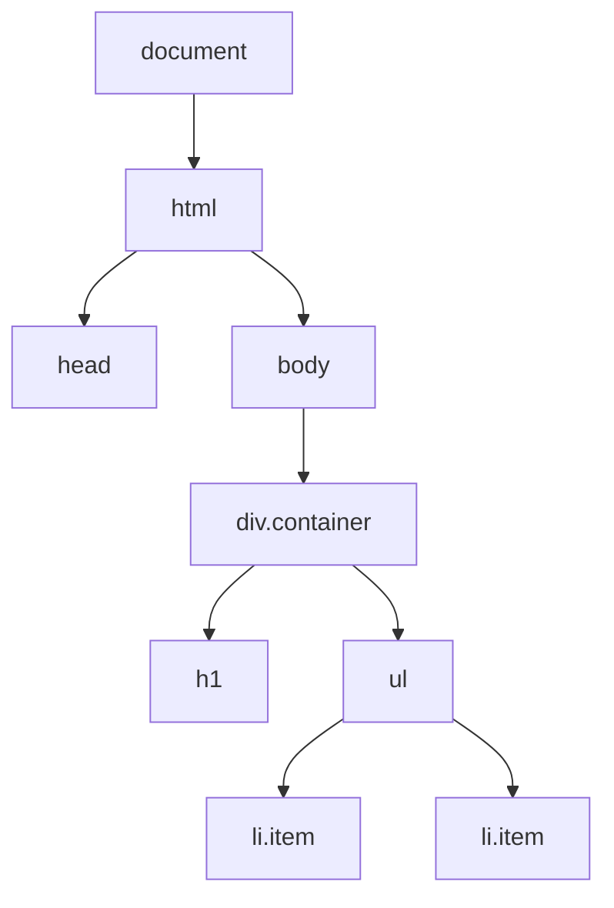

#### Interview Question
**Q:** `innerHTML` aur `textContent` me kya difference hai, aur security ke nazariye se kaunsa prefer karega?

**A:** `innerHTML` element ka HTML string return/set karta hai — browser usse parse karta hai, matlab `<script>`, `` etc execute ho sakte hain. `textContent` plain text deta/leta hai, no parsing — sab kuch literal string treat hota hai.

Security ke liye **`textContent` always preferred** jab user input render karna hai. `innerHTML` me untrusted data daalna direct **XSS vulnerability** hai — attacker `` inject kar sakta hai. Agar HTML render karna hi hai (rich content), DOMPurify jaisi sanitization library use kar.

Performance bhi farak padta hai — `innerHTML` parsing overhead leta hai, `textContent` straightforward hai. Modern code me `element.replaceChildren()` aur `createElement` + `append` chain use karna best practice hai.

---

### 5.2 Events & delegation (capture/bubble, stopPropagation, passive)

#### Definition
Events jab kuch hota hai (click, scroll, keypress) tab fire hote hain. Browser do phases me event propagate karta hai — **capture** (root se target tak neeche), aur **bubble** (target se wapas root tak upar). Default listeners bubble phase me chalte hain. **Event delegation** matlab parent pe ek listener lagao, child events bubble hote-hote wahin pakdo — hazar children ke liye hazar listeners ki zaroorat nahi.

Analogy: capture matlab "boss neeche descend kar raha hai problem dekhne", bubble matlab "complaint neeche se upar promote ho rahi hai HR tak". Delegation matlab "saare cubicles me CCTV mat lagao, ek HR ke saamne lagao — sab event uske paas pahunch jaayega".

#### Why?
Performance — bahut saare elements ke liye individual listeners memory aur attach time waste karte hain. Dynamically added elements ke liye delegation auto-work karta hai (na re-bind karna padta). `stopPropagation` zaroori hai jab tu event ko upar leak nahi hone dena chahta. `passive: true` scroll performance ke liye game-changer hai.

#### How?
```js
// Direct listener
btn.addEventListener('click', (e) => console.log('clicked'));

// Delegation
document.querySelector('#list').addEventListener('click', (e) => {
  const li = e.target.closest('li');
  if (!li) return;
  console.log('clicked id:', li.dataset.id);
});

// Capture phase (rare)
parent.addEventListener('click', handler, { capture: true });

// Stop propagation
child.addEventListener('click', (e) => {
  e.stopPropagation(); // parent ke listener tak nahi pahunchega
});

// Passive — scroll/touch ke liye must
window.addEventListener('scroll', onScroll, { passive: true });
// passive matlab tu preventDefault nahi karega — browser smooth scroll kar sakta hai
```

#### Real-life Example
Ek table me 1000 rows, har row pe edit/delete buttons. 2000 listeners attach karna pagalpan hai.

```js
table.addEventListener('click', (e) => {
  const action = e.target.dataset.action;
  if (!action) return;
  const row = e.target.closest('tr');
  const id = row.dataset.id;
  
  if (action === 'edit') openEditModal(id);
  if (action === 'delete') confirmDelete(id);
});

// Naye rows add hone par bhi automatically work karega — koi rebind nahi
```

#### Diagram
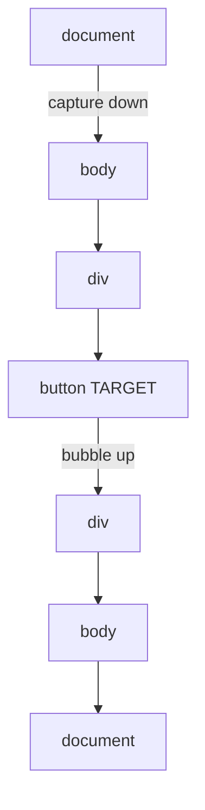

#### Interview Question
**Q:** `addEventListener` me `passive: true` ka kya matlab hai aur ye kab use karna chahiye?

**A:** `passive: true` browser ko bata raha hai ki is listener ke andar tu `event.preventDefault()` **nahi** call karega. Iska matlab browser default behavior (jaise scroll) ko block karke wait nahi karta listener finish hone ka — wo parallel scroll kar sakta hai. Performance me huge difference padta hai, especially mobile pe.

Use case: `scroll`, `touchstart`, `touchmove`, `wheel` — ye sab high-frequency events hain. Agar tu non-passive listener attach karta hai aur uske andar bhaari kaam karta hai, scroll laggy ho jaata hai kyunki browser ko 200ms wait karna padta hai pehle agar tu `preventDefault` to nahi karega.

Modern browsers (Chrome) `touchstart`/`touchmove` ko default passive treat karte hain. Agar tu galti se `preventDefault` call karta hai passive listener me, console warning aati hai aur call ignore hoti hai. Production pattern: jab tak preventDefault genuinely chahiye, hamesha `{ passive: true }` use kar.

---

### 5.3 Fetch API / AJAX (XHR comparison)

#### Definition
`fetch()` modern browsers ka built-in API hai HTTP requests bhejne ke liye. Promise-based hai — clean syntax, `async/await` ke saath beautiful kaam karta hai. Ye purane `XMLHttpRequest` (XHR) ka replacement hai jo callback-based aur ugly tha.

Analogy: XHR purana landline phone hai — operator se baat karo, callbacks me ulajh jao. `fetch` WhatsApp hai — async, clean, Promise-based, easily chainable.

#### Why?
XHR me callback hell, no Promise support, weird API (`open`, `send`, `onreadystatechange`). Fetch standardized, streaming-capable, request/response objects ke saath aata hai. Plus `AbortController` se cancellation native support hai (XHR me bhi tha but awkward).

#### How?
```js
// Basic GET
const res = await fetch('/api/users/1');
if (!res.ok) throw new Error(`HTTP ${res.status}`); // fetch 4xx/5xx pe reject NAHI hota
const data = await res.json();

// POST with body + headers
await fetch('/api/users', {
  method: 'POST',
  headers: { 'Content-Type': 'application/json' },
  body: JSON.stringify({ name: 'Ram' }),
  credentials: 'include', // cookies bhejna
});

// Cancellation
const controller = new AbortController();
fetch('/api/slow', { signal: controller.signal });
setTimeout(() => controller.abort(), 5000); // 5s timeout

// XHR (purana way — reference ke liye)
const xhr = new XMLHttpRequest();
xhr.open('GET', '/api/users');
xhr.onload = () => console.log(xhr.responseText);
xhr.send();
```

**Gotcha:** fetch network errors pe reject karta hai, par HTTP 4xx/5xx ko reject nahi karta — manually `res.ok` check karna padta hai.

#### Real-life Example
Search-as-you-type me purani requests cancel karna zaroori hai — user ne "rama" type kiya, "ram" wali response baad me aakar UI overwrite kar sakti hai.

```js
let activeController;

async function search(query) {
  activeController?.abort(); // pichli cancel
  activeController = new AbortController();
  
  try {
    const res = await fetch(`/api/search?q=${query}`, {
      signal: activeController.signal,
    });
    if (!res.ok) throw new Error('search failed');
    return res.json();
  } catch (err) {
    if (err.name === 'AbortError') return; // expected, ignore
    throw err;
  }
}
```

#### Diagram
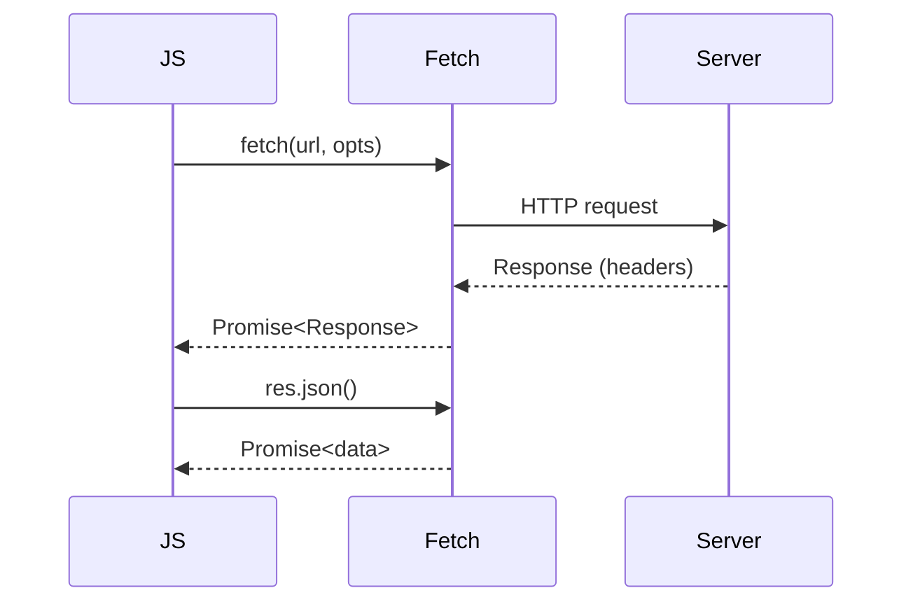

#### Interview Question
**Q:** `fetch` HTTP error status (404, 500) pe reject kyu nahi karta, aur production me iska kya implication hai?

**A:** Spec design choice hai — `fetch` sirf network-level failures pe reject karta hai (DNS fail, no internet, CORS block). HTTP response actually receive ho gaya, chaahe wo 500 ho — ye fetch ke liye "success" hai, kyunki communication to hua. Status code application-level concern hai.

Production implication ye hai ki tujhe har fetch ke baad **explicitly `res.ok` check karna padega** (ya `res.status`). Common bug — `await fetch()` ke turant baad `res.json()` call karna without status check, aur 500 response ka HTML body parse karne ki koshish — `Unexpected token < in JSON` error.

Best practice: ek wrapper banao jo automatic error throwing kare:
```js
async function api(url, opts) {
  const res = await fetch(url, opts);
  if (!res.ok) throw new Error(`HTTP ${res.status}: ${await res.text()}`);
  return res.json();
}
```
Axios ye by default karta hai, isliye log usse prefer karte hain — par modern fetch + thin wrapper bhi sufficient hai.

---

### 5.4 Storage (localStorage, sessionStorage, IndexedDB intro)

#### Definition
Browsers me client-side data store karne ke teen primary options hain. **localStorage** persistent hai (manually clear na ho jaye), **sessionStorage** sirf tab band hone tak rehta hai, **IndexedDB** ek full-fledged async NoSQL database hai browser ke andar.

Analogy: localStorage tera ghar ka cupboard — kuch bhi rakho, lambe time tak rahega. sessionStorage hotel ka room — checkout (tab band) hote hi gone. IndexedDB poora godown — bahut saara structured data, indexes, transactions, lekin paperwork (API) thoda complex.

#### Why?
- **localStorage/sessionStorage**: simple key-value, sync, ~5-10 MB limit, sirf strings store hote hain. JWT tokens, user preferences, theme.
- **IndexedDB**: large data (hundreds of MB), structured queries, offline-first apps, async, complex API. PWAs, offline editors, caching big API responses.

#### How?
```js
// localStorage / sessionStorage
localStorage.setItem('theme', 'dark');
const t = localStorage.getItem('theme');
localStorage.removeItem('theme');
localStorage.clear();

// Object store karna ho to JSON
localStorage.setItem('user', JSON.stringify({ id: 1, name: 'A' }));
const user = JSON.parse(localStorage.getItem('user') || 'null');

// IndexedDB — verbose, isliye libraries (idb, Dexie) use karte hain
const dbReq = indexedDB.open('myapp', 1);
dbReq.onupgradeneeded = (e) => {
  const db = e.target.result;
  db.createObjectStore('todos', { keyPath: 'id' });
};
dbReq.onsuccess = (e) => {
  const db = e.target.result;
  const tx = db.transaction('todos', 'readwrite');
  tx.objectStore('todos').put({ id: 1, title: 'Buy milk' });
};
```

#### Real-life Example
Ek note-taking app jo offline kaam kare. Notes IndexedDB me, last sync timestamp localStorage me.

```js
// idb library wrapper
import { openDB } from 'idb';

const dbPromise = openDB('notes-app', 1, {
  upgrade(db) {
    db.createObjectStore('notes', { keyPath: 'id', autoIncrement: true });
  },
});

export async function saveNote(note) {
  const db = await dbPromise;
  return db.put('notes', { ...note, updatedAt: Date.now() });
}

export async function getAllNotes() {
  const db = await dbPromise;
  return db.getAll('notes');
}

// Settings — small, localStorage ka use
localStorage.setItem('lastSync', Date.now().toString());
```

#### Diagram
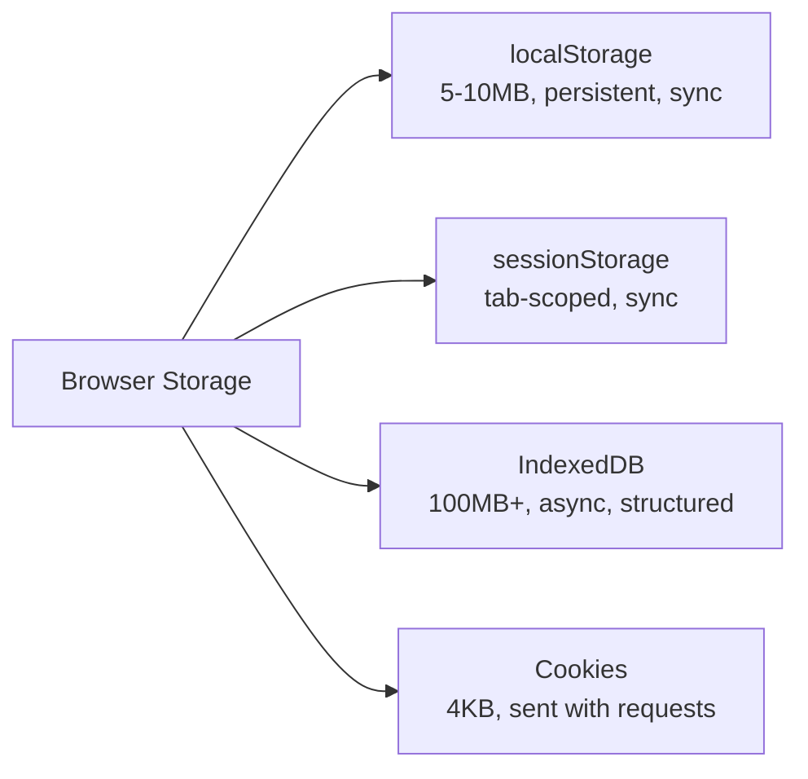

#### Interview Question
**Q:** Sensitive auth tokens (JWT) localStorage me store karna safe hai?

**A:** Short answer — **nahi**, recommended nahi hai. localStorage **JavaScript se accessible** hai, matlab agar tere site pe XSS vulnerability hai (kahin bhi — ek third-party library compromise, ek `innerHTML` mistake), attacker `localStorage.getItem('token')` se token chura sakta hai.

Better approach: **httpOnly + Secure cookies**. httpOnly flag JS access block karta hai (sirf browser request me bhejta hai), Secure flag HTTPS-only ensure karta hai, SameSite flag CSRF se bachata hai. Backend authentication ke liye ye gold standard hai.

localStorage thik hai non-sensitive cheezo ke liye — theme preference, last visited page, cached UI state. Agar tu spa/api separation me JWT use kar raha hai aur cookies feasible nahi (cross-domain), tab bhi minimum **short expiry + refresh token rotation + strict CSP** lagana zaroori hai. Production teams jo localStorage use karti hain wo aksar ye trade-off accept karti hain explicitly.

---

### 5.5 Cookies — flags, domains, security

#### Definition
Cookies chhote (4KB max) text strings hote hain jo browser server ke liye **automatically har request me bhej deta hai** ek matching domain pe. Server `Set-Cookie` header se set karta hai, browser store karta hai, fir aage har request me `Cookie` header me bhej deta hai. Authentication, sessions, tracking ke liye decades se use ho rahe hain.

Analogy: cookie tera identity card hai jo har bar gate par show karna padta hai. Server bolta hai "le ye card rakh", aur jab bhi tu wapas aaye, automatically dikhana padta hai — tujhe har bar yaad dilana nahi padta.

#### Why?
HTTP stateless hai — har request fresh hai. Server ko kaise pata chale ki ye wahi user hai jo abhi-abhi login hua tha? Cookies ye continuity provide karte hain. Properly flag karne pe ye sabse secure auth mechanism hai (much better than localStorage tokens).

#### How?
```js
// Browser side se set/read (limited)
document.cookie = 'theme=dark; path=/; max-age=31536000';
console.log(document.cookie); // saari accessible cookies, semicolon-separated

// httpOnly cookies JS me visible NAHI hoti — ye intentional security feature

// Server side (Node/Express example)
res.cookie('session', 'abc123', {
  httpOnly: true,    // JS se access nahi hoga
  secure: true,      // sirf HTTPS pe bhejega
  sameSite: 'lax',   // CSRF protection
  maxAge: 24 * 60 * 60 * 1000, // 1 day
  domain: '.example.com',      // subdomains bhi share karenge
  path: '/',
});
```

**Important flags:**
- `httpOnly` — XSS se bachata hai
- `Secure` — HTTPS-only
- `SameSite=Strict/Lax/None` — CSRF se bachata hai
- `Domain` — kis domain pe valid
- `Path` — kis URL prefix pe bhejna
- `Max-Age`/`Expires` — kab tak valid

#### Real-life Example
Auth flow — user login karta hai, server session cookie set karta hai, har subsequent request automatic authenticate.

```js
// Server: login endpoint
app.post('/login', async (req, res) => {
  const user = await authenticate(req.body.email, req.body.password);
  if (!user) return res.status(401).json({ error: 'invalid' });
  
  const session = await createSession(user.id);
  res.cookie('session', session.id, {
    httpOnly: true,
    secure: process.env.NODE_ENV === 'production',
    sameSite: 'lax',
    maxAge: 7 * 24 * 60 * 60 * 1000,
  });
  res.json({ user });
});

// Client: bas fetch karo, cookie auto-attach
await fetch('/api/profile', { credentials: 'include' });
```

#### Diagram
```mermaid
sequenceDiagram
    Client->>Server: POST /login
    Server-->>Client: Set-Cookie: session=abc; HttpOnly; Secure
    Note over Client: Browser stores cookie
    Client->>Server: GET /profile<br/>Cookie: session=abc (auto)
    Server-->>Client: User data
```

#### Interview Question
**Q:** `SameSite` cookie attribute kya karta hai aur `Strict`, `Lax`, `None` me kya farak hai?

**A:** `SameSite` cross-site request me cookie bhejne ko control karta hai — primarily **CSRF (Cross-Site Request Forgery)** attacks rokne ke liye. CSRF me attacker ki site (evil.com) tere bank.com pe forged request bhejti hai user ke session cookie ke saath — SameSite is hi se bachata hai.

`Strict`: cookie sirf same-site requests pe jaayegi. Agar user kisi external site se link click karke aaya, cookie nahi jaayegi — user logged out lagega initially. Banking apps jaha maximum security chahiye.

`Lax` (modern default): cookie same-site requests pe jaayegi + top-level navigations (link click, manual URL) pe bhi. Background requests (iframe, image, fetch from another origin) pe nahi. Most apps ke liye sweet spot — security + UX.

`None`: cookie cross-site bhi jaayegi (purana behavior). Ab compulsorily `Secure` flag ke saath honi chahiye warna browser reject karta hai. Use case: third-party embeds, payment gateways. Production rule: default `Lax` rakho, sensitive ops ke liye `Strict`, aur `None` sirf jab business case ho.

---

## 6. Module system & tooling

### 6.1 ES Modules (import/export, named vs default, dynamic import)

#### Definition
ES Modules (ESM) JavaScript ka **official, standardized** module system hai. Pehle CommonJS (`require`/`module.exports`) tha Node me, AMD tha browser me — fragmented mess. ESM ne unify kar diya — same `import`/`export` syntax browser, Node, Deno, sab jagah.

Analogy: pehle har building ka apna alag plug socket tha — phone charger nahi lagta dusre ghar me. ESM Type-C universal port hai — sab jagah same.

#### Why?
- **Static analysis** — bundlers tree-shake kar sakte hain (unused exports remove)
- **Top-level await** support
- **Async by default** — non-blocking load
- **Strict mode** by default
- **Live bindings** — exported variable update ho to importer ko bhi updated value milti hai

#### How?
```js
// utils.js — named exports
export const PI = 3.14;
export function add(a, b) { return a + b; }

// math.js — default export
export default class Calculator { /* ... */ }

// main.js — imports
import Calculator from './math.js';      // default
import { PI, add } from './utils.js';    // named
import * as utils from './utils.js';     // namespace
import { add as sum } from './utils.js'; // alias

// Dynamic import — runtime, returns Promise
const mod = await import('./heavy-feature.js');
mod.run();

// Re-export
export { PI, add } from './utils.js';
export * from './utils.js';
```

**Default vs named:** named exports tree-shaking aur autocomplete me better hain. Default ka use rare karna chahiye — sirf jab module ka clear "main thing" ho (React component, Express app).

#### Real-life Example
Code splitting — bhaari feature (chart library, rich text editor) sirf jab user uska button click kare tab load ho.

```js
// Heavy chart sirf dashboard pe chahiye
button.addEventListener('click', async () => {
  const { renderChart } = await import('./chart-module.js');
  renderChart(data);
});

// Initial bundle me chart code nahi gaya — faster page load
```

#### Diagram
```mermaid
flowchart LR
    A[main.js] -->|import| B[utils.js]
    A -->|import| C[math.js]
    B -->|export named| A
    C -->|export default| A
    A -.->|dynamic import| D[heavy.js]
```

#### Interview Question
**Q:** ES Modules aur CommonJS me kya core differences hain?

**A:** Pehla — **syntax**: ESM `import/export`, CommonJS `require/module.exports`. Lekin asli farak deeper hai. ESM **static** hai — imports file ke top pe parse hote hain, runtime se pehle dependency graph build hota hai. Iska matlab bundler dead code eliminate kar sakta hai (tree-shaking) aur conditionally import nahi kar sakta (top-level static). CommonJS **dynamic** hai — `require` ek function call hai, runtime pe execute hota hai, kahin bhi conditionally call kar sakte ho.

Doosra — **bindings**. ESM live bindings deta hai — agar module A me `count` export ho aur baad me update ho, B me jo import ki gayi `count` automatically updated value dikhayegi. CommonJS me copy hoti hai — initial value freeze.

Teesra — **execution**: ESM async load hota hai, top-level await support karta hai. CommonJS sync hai. Node ab dono support karta hai (`.mjs` ESM, `.cjs` CommonJS, `package.json` me `"type": "module"`). Modern code ESM use kare — old packages ke liye interop hai.

---

### 6.2 NPM/Yarn — package.json, lockfile, scripts, semver

#### Definition
**npm** (Node Package Manager) JavaScript ka package registry hai — duniya ki sabse badi software registry. **Yarn** aur **pnpm** alternatives hain same registry use karne wale, with different speeds/features. **package.json** project ka manifest hai — dependencies, scripts, metadata. **Lockfile** (`package-lock.json` / `yarn.lock`) exact versions ko freeze karta hai reproducibility ke liye.

Analogy: package.json shopping list hai (Maggi chahiye, version "approx 2.x"). Lockfile receipt hai (Maggi 2.5.3, with these exact masala packets) — taaki har machine pe same install ho.

#### Why?
- Reuse — million packages already likhe ja chuke hain, wheel reinvent mat kar
- Versioning — controlled updates, breaking changes se safety
- Lockfile — "works on my machine" ka antidote
- Scripts — `npm run dev`, `npm test` standardized commands

#### How?
```json
// package.json
{
  "name": "my-app",
  "version": "1.0.0",
  "type": "module",
  "scripts": {
    "dev": "next dev",
    "build": "next build",
    "test": "vitest"
  },
  "dependencies": {
    "react": "^18.2.0"
  },
  "devDependencies": {
    "vitest": "~1.0.0"
  }
}
```

**Semver (semantic versioning):** `MAJOR.MINOR.PATCH`
- `^1.2.3` — 1.x.x me kuch bhi >= 1.2.3 (minor + patch updates allowed)
- `~1.2.3` — 1.2.x me >= 1.2.3 (sirf patch)
- `1.2.3` — exact
- `*` — kuch bhi (DON'T)

```bash
npm install lodash         # latest, ^ ke saath save
npm install lodash@4.17.0  # specific
npm install -D vitest      # devDependency
npm ci                     # CI me — lockfile se exact install
```

#### Real-life Example
Production deployment me hamesha `npm ci` use karna chahiye, `npm install` nahi. `npm install` lockfile update kar sakta hai chuppi-chuppi.

```yaml
# CI pipeline (GitHub Actions)
- run: npm ci            # lockfile-strict, fast, deterministic
- run: npm run build
- run: npm test
```

```bash
# Audit — security vulnerabilities check
npm audit
npm audit fix

# Outdated check
npm outdated
```

#### Diagram
```mermaid
flowchart TD
    A[package.json<br/>declared deps] --> B[npm install]
    B --> C[node_modules<br/>actual files]
    B --> D[package-lock.json<br/>exact versions]
    D --> E[npm ci<br/>reproducible install]
    E --> C
```

#### Interview Question
**Q:** `package-lock.json` commit karna chahiye git me? `npm install` aur `npm ci` me kya farak hai?

**A:** Haan, **lockfile commit karo always**. Without lockfile, do developers same `package.json` pe `npm install` chala ke alag versions install kar sakte hain (kyunki `^1.2.3` matlab "1.x ka latest", aur "latest" time pe change hota rehta hai). Production bug "works on my machine" yahin se shuru hota hai. Lockfile har dependency aur sub-dependency ka exact version + hash store karta hai — guaranteed reproducibility.

`npm install` lockfile ko **update** kar sakta hai — agar registry me naya patch aaya jo `^` range ke andar fit ho, ya tu naya package add kare. Local dev me theek hai. `npm ci` (clean install) lockfile ko **read-only treat** karta hai — agar package.json aur lockfile mismatch hai to error throw karta hai. Plus `node_modules` pehle delete karta hai for clean state. CI/CD aur production deploys me hamesha `npm ci` — fast (no resolution), deterministic (exact versions), safe.

---

### 6.3 Bundlers (Webpack vs Vite — concepts)

#### Definition
Bundler ek tool hai jo tere multiple JS/CSS/asset files ko combine, optimize, aur browser-ready bundles me convert karta hai. Browsers historically ESM ko well support nahi karte the (aur abhi bhi production me hundreds of small files inefficient hain due to HTTP overhead). Bundler dependency graph build karta hai, transformations apply karta hai (Babel, TypeScript), aur final output deta hai.

Analogy: Webpack purana traditional builder hai — pure ghar ka blueprint pehle ready karta hai, fir ek-saath sara material laata hai (dev me bhi). Vite naya smart contractor hai — dev me sirf wahi room banata hai jise tu abhi dekh raha hai (browser-native ESM use karke), production me Rollup se efficient final build karta hai.

#### Why?
- **Code transformation** — TypeScript, JSX, SCSS browser samajhta nahi
- **Bundling** — fewer HTTP requests (ya code-split chunks)
- **Tree-shaking** — unused code remove
- **Minification** — file size reduce
- **HMR (Hot Module Replacement)** — dev me page refresh ke bina updates
- **Asset handling** — images, CSS, fonts pipeline me

#### How?
**Webpack** (traditional approach):
```js
// webpack.config.js
module.exports = {
  entry: './src/index.js',
  output: { path: __dirname + '/dist', filename: 'bundle.js' },
  module: {
    rules: [
      { test: /\.jsx?$/, use: 'babel-loader' },
      { test: /\.css$/, use: ['style-loader', 'css-loader'] },
    ],
  },
};
```

**Vite** (modern):
```js
// vite.config.js — minimal config
import { defineConfig } from 'vite';
import react from '@vitejs/plugin-react';

export default defineConfig({
  plugins: [react()],
});
```

**Key conceptual difference:** Webpack dev server bhi everything bundle karta hai pehle — bade projects me dev startup 30+ seconds. Vite dev me browser-native ESM directly serve karta hai — startup instant, sirf changed file rebuild hoti hai. Production me dono bundle karte hain (Vite uses Rollup).

#### Real-life Example
Tu ek React app banata hai `npm create vite@latest`. Dev me `npm run dev` chalaya — 200ms me ready. File save karta hai — HMR se sirf wahi component refresh hota hai bina state lose kiye. `npm run build` se production bundle banta hai jo gzipped, minified, hashed-filenames ke saath aata hai for caching.

```js
// vite.config.js — production tweak
export default defineConfig({
  build: {
    rollupOptions: {
      output: {
        manualChunks: {
          vendor: ['react', 'react-dom'],
          ui: ['@mui/material'],
        },
      },
    },
  },
});
```

#### Diagram
```mermaid
flowchart LR
    A[src/*.ts, *.css, *.jsx] --> B[Bundler]
    B --> C[Transform<br/>TS, JSX, SCSS]
    C --> D[Bundle &<br/>Tree-shake]
    D --> E[Minify]
    E --> F[dist/<br/>bundle.[hash].js]
```

#### Interview Question
**Q:** Vite Webpack se dev me itna fast kyu hai?

**A:** Core reason — **architecture difference**. Webpack dev server bhi pehle pura dependency graph traverse karta hai aur ek bundle banata hai (chaahe in-memory ho). 1000+ files wale projects me ye startup pe 20-60 seconds le sakta hai. Har bar config change ya cold start pe ye repeat.

Vite **browser-native ES Modules** ka leverage karta hai dev me. Browser khud import statements parse karta hai aur jaise zaroorat ho files request karta hai. Vite ka dev server **on-demand** serve karta hai — tu jo route open kare, sirf wahi modules transform aur serve hote hain, baaki untouched. Plus dependencies (node_modules) ko esbuild se ek bar pre-bundle kar deta hai (Go-based, 10-100x faster than JS bundlers).

HMR me bhi fark hai — Webpack ko module graph invalidate karke partial rebuild karna padta hai, Vite seedha changed module replace karta hai kyunki ESM granular hai. Production me Vite Rollup use karta hai (well-optimized output). Trade-off — Webpack ka ecosystem zyada mature hai for legacy/complex setups, but greenfield projects ke liye Vite default choice ban gaya hai.

---

### 6.4 Environment variables

#### Definition
Environment variables runtime configuration mechanism hain — values jo code ke bahar set hote hain (OS env, `.env` file, deployment platform) aur app code unhe access karta hai. Dev/staging/production me alag-alag values rakhne ke liye, aur secrets ko code se bahar rakhne ke liye essential.

Analogy: tera code ek chef hai jo recipe follow karta hai. Env vars ingredients hain — kabhi salt 1 chamach (dev), kabhi 2 (prod), recipe nahi badalti. Aur secret ingredient (API keys) recipe me likhi nahi jaati, kitchen me alag se rakhi jaati hai.

#### Why?
- **Secrets** kabhi code/git me commit nahi hone chahiye (API keys, DB passwords)
- **Environment-specific config** — dev local DB, prod cloud DB
- **Feature flags** without redeploy
- **Twelve-factor app** principle — config in environment

#### How?
```js
// Node.js — process.env
const dbUrl = process.env.DATABASE_URL;
const port = process.env.PORT || 3000;

// .env file (dotenv package)
// DATABASE_URL=postgres://localhost/myapp
// API_KEY=secret123
```

**Browser ke liye special:** `process.env` browser me exist nahi karta. Bundlers (Vite, Webpack) build time pe replace karte hain.

```js
// Vite
const apiUrl = import.meta.env.VITE_API_URL; // VITE_ prefix mandatory
const isDev = import.meta.env.DEV;

// Next.js
const publicVar = process.env.NEXT_PUBLIC_API_URL; // browser me available
const serverOnly = process.env.DATABASE_URL;       // server me only
```

**Critical:** browser me jo bhi env var inject hoga, **public** ho jaayega — view-source me dikhega. Secrets sirf server-side env vars me rakho.

```bash
# .gitignore me hamesha
.env
.env.local
.env.*.local
```

#### Real-life Example
Multi-environment Next.js app:

```bash
# .env.local (dev, gitignored)
DATABASE_URL=postgres://localhost/dev
NEXT_PUBLIC_API_URL=http://localhost:3001
STRIPE_SECRET_KEY=sk_test_xxx

# .env.example (committed, template)
DATABASE_URL=
NEXT_PUBLIC_API_URL=
STRIPE_SECRET_KEY=
```

```js
// lib/db.js — server only
import { Pool } from 'pg';
export const db = new Pool({ connectionString: process.env.DATABASE_URL });

// components/Api.jsx — browser
const API = process.env.NEXT_PUBLIC_API_URL; // safe, public

// app/api/charge/route.js — server only
import Stripe from 'stripe';
const stripe = new Stripe(process.env.STRIPE_SECRET_KEY); // never expose
```

Production me values Vercel/AWS/Railway ke dashboard se set hoti hain, `.env` file deploy nahi hoti.

#### Diagram
```mermaid
flowchart TD
    A[.env.local<br/>dev secrets] --> B{Bundler/Runtime}
    C[Vercel Dashboard<br/>prod secrets] --> B
    D[OS env vars] --> B
    B --> E[process.env.X<br/>or import.meta.env.X]
    E --> F[App Code]
    G[.env.example<br/>git committed] -.template.-> A
```

#### Interview Question
**Q:** Frontend code me API secret keys (jaise Stripe secret key) rakhna safe hai agar tu env var use kar raha hai?

**A:** **Bilkul nahi.** Ye fundamental mistake hai jo bahut common hai. Bundlers (Webpack, Vite, Next.js) build time pe `process.env.X` ko **literal value se replace** kar dete hain — matlab final JS bundle me string hardcoded ho jaati hai. Browser me jo bhi run hota hai wo user dekh sakta hai (DevTools, view-source, network tab). Env var "naam" private hai par "value" public ho jaati hai jab browser ko ship karte ho.

Frameworks isliye prefix-based separation enforce karte hain. Next.js me `NEXT_PUBLIC_*` prefix wale browser me available, baaki server-only. Vite me `VITE_*` browser-exposed. Ye prefix jaan-bujhke loud hai — developer ko explicit decision lena padta hai.

Production rule: **secrets sirf backend pe**. Frontend ko payment lena hai? Stripe **publishable key** (starts with `pk_`) frontend pe, **secret key** (`sk_`) backend pe. Backend Stripe SDK call kare aur frontend ko intent token bheje. Same pattern saare third-party APIs ke liye — frontend kabhi direct sensitive credential use na kare. Galti se push kar diya git me to immediately key rotate kar (revoke + new generate), kyunki bots GitHub continuously scan karte hain.

---

Bhai itna content padh liya to tu ab JavaScript ka mid-to-senior level samajh rakhta hai. Practice me ye sab tabhi solidify hoga jab tu actual project bana ke debug kare. Part 3 me hum aur deep concepts dekhenge — performance, memory, security patterns, runtime internals. Tab tak in patterns ko apne current project me try kar — har concept ka ek small experiment likhna best learning method hai.
