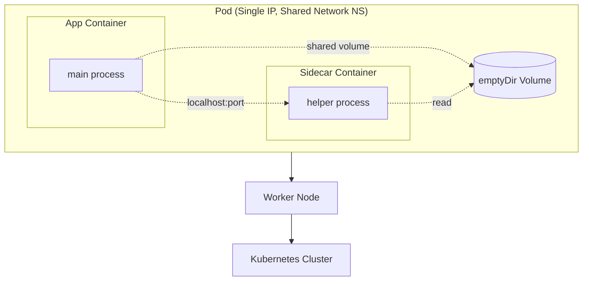
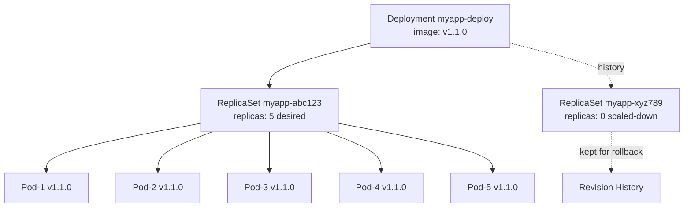
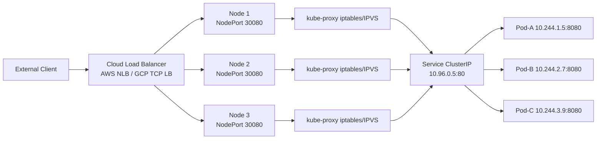
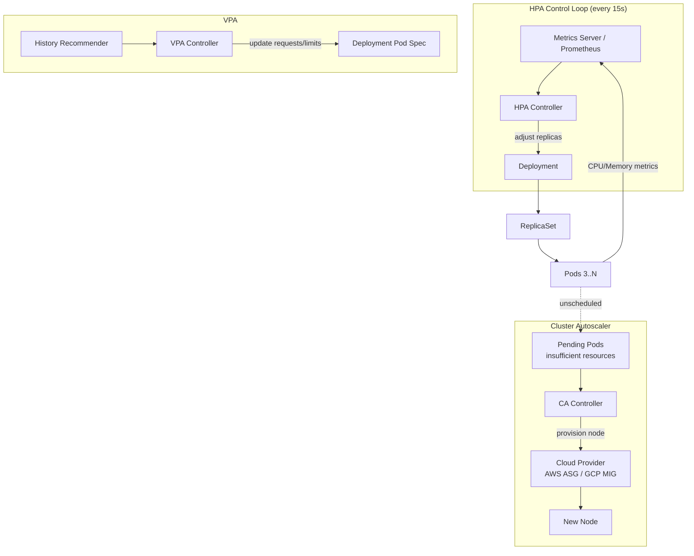

# Kubernetes

Kubernetes basically Docker se aage ki story hai. Docker ek container chala sakta hai — Kubernetes 100s containers ko orchestrate karta hai across machines, with auto-healing, scaling, load balancing — sab built-in. Tu socho tere paas 50 microservices hain, har ek 10-20 instances chahiye, traffic spike pe scale up karna hai, kuch crash ho jaaye toh auto-restart, deployment ke time zero downtime — yeh sab manually karna ek nightmare hai. Kubernetes (K8s) bolo, "yeh mera desired state hai" — aur woh khud reconcile karta rehta hai. Declarative API + control loop = magic.

Production mein Kubernetes ka matlab hai cluster of machines (nodes) — ek control plane (brain: API server, scheduler, controller-manager, etcd) aur multiple worker nodes (kubelet + container runtime + kube-proxy). Tu YAML manifest likhta hai, `kubectl apply` karta hai, aur K8s decide karta hai kaunsa pod kis node pe chalega, kab restart karna hai, kaise traffic route karna hai. Yeh document IIT-level depth pe le jaayega — Pods se start karke Deployments, Services, aur Scaling tak — har concept ke saath production-grade YAML, kubectl commands, aur real interview questions.

Ek baat clear rakh: Kubernetes "magic" nahi hai, yeh ek control loop system hai. Har controller continuously dekhta hai "actual state vs desired state" — agar mismatch hai toh action leta hai. Yeh mental model agar samajh gaya, toh K8s ka 80% clear ho jaayega. Chal shuru karte hain.

Ek aur foundation set kar dein. K8s objects four-part identity rakhte hain — `apiVersion`, `kind`, `metadata`, `spec`. `apiVersion` group + version hai (e.g., `apps/v1`, `autoscaling/v2`) — yeh evolution allow karta hai backward compat ke saath. `kind` resource type hai (Pod, Deployment, Service). `metadata` mein `name`, `namespace`, `labels` (selector ke liye), `annotations` (metadata for tooling). `spec` desired state hai — tu yeh likhta hai, K8s `status` calculate karta hai. Saare CRUD operations API server through hote hain — etcd is source of truth. Controllers watch karte hain via long-lived HTTP connections (watch streams), instant reactions to state changes possible hote hain. Yeh declarative + watch-based architecture K8s ka core elegance hai.

---

## 1. Pods

### 1.1 Smallest deployable unit, single vs multi-container pods, sidecar/ambassador/adapter patterns

#### Definition

Pod Kubernetes ka smallest deployable unit hai — yeh ek ya ek se zyada containers ka group hai jo same network namespace, same IPC namespace, aur same storage volumes share karte hain. Mat soch ki container hi smallest unit hai — K8s mein tu container directly schedule nahi karta, tu Pod schedule karta hai. Ek Pod ke andar saare containers hamesha same node pe chalte hain, same lifecycle share karte hain (saath start, saath die — usually), aur localhost (127.0.0.1) ke through ek doosre se baat kar sakte hain.

Pod ke andar har container ka apna filesystem hota hai (image se), but network stack shared — ek pod ka ek hi IP address hota hai. Storage volumes pod-level pe define hote hain aur containers mount karte hain. Pod ephemeral hai — yeh die ho sakta hai, restart ho sakta hai with new IP. Isliye production mein tu Pod directly create nahi karta — Deployment/StatefulSet/DaemonSet ke through banata hai, taaki replication aur self-healing mile.

#### Why?

Sawaal yeh aata hai: agar container hi process hai, toh ek extra abstraction (Pod) kyun chahiye? Reason hai "tightly coupled helper processes". Sometimes tera main app container ko ek helper chahiye — log shipper, proxy, config reloader — jo same lifecycle, same network, same disk share kare. Ye helpers ko alag pod mein daalna overkill hai (network hop add ho jaayega, lifecycle decoupled ho jaayega). Pod abstraction se tu in helpers ko "co-located" rakhta hai — sidecar pattern.

Doosra reason — atomic scheduling unit. Scheduler ko pata hona chahiye "yeh saare containers ek saath ek node pe chahiye". Pod yeh guarantee deta hai. Plus, shared volumes aur shared network = zero-copy data passing between containers. Production mein log aggregation, service mesh proxies (Istio's envoy), config management — sab sidecar pattern use karte hain.

#### How?

Single-container pod (most common case):

```yaml
# pod-single.yaml — ek simple nginx pod
apiVersion: v1
kind: Pod
metadata:
  name: nginx-pod
  labels:
    app: web        # labels selector ke liye use honge baad mein
    tier: frontend
spec:
  containers:
  - name: nginx
    image: nginx:1.25-alpine    # specific tag, latest mat use kar production mein
    ports:
    - containerPort: 80
    resources:
      requests:                  # scheduler isse decide karta hai placement
        cpu: "100m"              # 100 milli-cores = 0.1 CPU
        memory: "128Mi"
      limits:                    # cgroup yeh enforce karega
        cpu: "500m"
        memory: "256Mi"
    livenessProbe:               # agar fail ho toh container restart hoga
      httpGet:
        path: /
        port: 80
      initialDelaySeconds: 10
      periodSeconds: 5
    readinessProbe:              # agar fail ho toh service se traffic cut
      httpGet:
        path: /
        port: 80
      initialDelaySeconds: 2
      periodSeconds: 3
```

Multi-container pod with **sidecar pattern** — main app + log shipper:

```yaml
# pod-sidecar.yaml — app likhega logs to shared volume, fluent-bit ship karega
apiVersion: v1
kind: Pod
metadata:
  name: app-with-logger
spec:
  volumes:
  - name: logs               # emptyDir = pod ke saath die ho jaata hai
    emptyDir: {}
  containers:
  - name: app                # main application container
    image: myapp:1.0
    volumeMounts:
    - name: logs
      mountPath: /var/log/app    # app yahan likhega
  - name: log-shipper        # SIDECAR — helper, lifecycle main ke saath
    image: fluent/fluent-bit:2.1
    volumeMounts:
    - name: logs
      mountPath: /var/log/app    # same volume, read karega aur ship karega
    - name: fluent-config
      mountPath: /fluent-bit/etc
  - name: fluent-config-vol
    configMap:
      name: fluent-bit-config
```

**Ambassador pattern** — proxy container jo external service ko abstract karta hai:

```yaml
# pod-ambassador.yaml — app sirf localhost se baat karega, ambassador real DB tak route karega
apiVersion: v1
kind: Pod
metadata:
  name: app-with-ambassador
spec:
  containers:
  - name: app
    image: myapp:1.0
    env:
    - name: REDIS_HOST
      value: "127.0.0.1"      # app sirf localhost jaanta hai
    - name: REDIS_PORT
      value: "6379"
  - name: redis-ambassador    # AMBASSADOR — proxy to real redis cluster
    image: twemproxy:latest
    ports:
    - containerPort: 6379     # localhost:6379 pe sun raha hai
    args:
    - "-c"
    - "/etc/twemproxy/nutcracker.yml"   # config mein real redis nodes
    volumeMounts:
    - name: twemproxy-config
      mountPath: /etc/twemproxy
  volumes:
  - name: twemproxy-config
    configMap:
      name: twemproxy-config
```

**Adapter pattern** — output format ko standardize karne ke liye:

```yaml
# pod-adapter.yaml — legacy app ka output ko prometheus format mein convert
apiVersion: v1
kind: Pod
metadata:
  name: legacy-with-adapter
spec:
  containers:
  - name: legacy-app
    image: legacy-app:0.9     # purana app, custom metrics format
    ports:
    - containerPort: 8080
  - name: prometheus-adapter  # ADAPTER — converts output format
    image: prom-adapter:1.0
    ports:
    - containerPort: 9090     # standard prometheus scrape port
    env:
    - name: SOURCE_URL
      value: "http://localhost:8080/metrics"   # legacy endpoint
```

kubectl commands:

```bash
# pod create karne ka direct tarika (production mein avoid kar)
kubectl apply -f pod-single.yaml

# saare pods dekhne ke liye, with node info
kubectl get pods -o wide

# specific pod ke andar jhaank
kubectl describe pod nginx-pod

# multi-container pod mein specific container ka log
kubectl logs app-with-logger -c log-shipper

# pod ke andar shell le
kubectl exec -it app-with-logger -c app -- /bin/sh

# pod delete (graceful shutdown 30s default)
kubectl delete pod nginx-pod

# port forward for local testing
kubectl port-forward nginx-pod 8080:80
```

#### Real-life Example

Tu Razorpay-type payment gateway bana raha hai. Tera main payment-processor container hai jo transactions handle karta hai. Compliance ke liye har transaction ka audit log file pe likhna hai, aur woh logs ek central SIEM (security info) system pe jaane chahiye. Tu kya karega? Sidecar pattern!

Main container `/var/log/audit/` mein structured JSON likhega. Sidecar container `audit-forwarder` (filebeat ya custom Go binary) wahi volume mount karega read-only mode mein, aur Kafka ya central SIEM tak push karega. Dono saath start, saath die. Agar payment-processor crash hua aur restart hua, sidecar bhi restart hoga (because pod-level lifecycle). Yeh much better than separate deployment kyunki: (a) network latency zero hai (localhost write), (b) atomic scheduling guaranteed hai, (c) logs lose hone ka risk minimal — same node pe disk share kar rahe.

Doosra example: service mesh (Istio). Har application pod ke saath ek `istio-proxy` (envoy) sidecar inject hota hai automatically. Saara incoming/outgoing traffic envoy ke through jaata hai — mTLS, retries, circuit breaking, observability — sab transparent. Tera app code unchanged, but ab tujhe enterprise-grade networking mil gaya.

Teesra production scenario: secrets management. Vault Agent injector annotation-driven sidecar hai — pod pe `vault.hashicorp.com/agent-inject: "true"` annotation lagao, MutatingAdmissionWebhook automatically `vault-agent` sidecar inject karega. Sidecar Vault se secrets fetch karega aur shared volume pe templated files likhega — main app `/vault/secrets/db-credentials` se read karega. Secrets rotation transparent — sidecar continuously refresh karta rehta hai, app restart bhi nahi karna padta. Security teams ko explicit secret references K8s objects mein nahi chahiye, woh Vault policies enforce karte hain — pod identity (service account) Vault auth method ke through resolve hoti hai.

#### Diagram



#### Interview

**Q1: Pod aur Container mein difference kya hai? Container hi smallest unit nahi ho sakti?**

Container ek runtime concept hai — Docker/containerd ka instance jo image se chalta hai. Pod Kubernetes ka logical wrapper hai jo ek ya zyada containers ko group karta hai with shared network and storage. K8s direct container schedule isliye nahi karta kyunki real-world mein tightly-coupled helper processes ek hi network namespace mein chahiye hote hain — agar har helper alag container ka matlab alag pod hota, toh tu localhost se baat nahi kar paata, tujhe service discovery aur network hop chahiye hota har baar. Pod abstraction zero-overhead co-location deta hai.

Plus, atomic scheduling — agar tera app aur uska config-reloader saath nahi chala toh app crash ho jaayega. Pod scheduler ko bolta hai "yeh dono ek node pe ek saath place karo, ya kisi pe bhi mat karo". Yeh guarantee container-level abstraction nahi de sakta. Aur ek aur point — Pod ka apna IP hota hai, container ka nahi. Yeh CNI (Container Network Interface) plugin pod ke `pause` container (infrastructure container) pe network attach karta hai, baaki containers usi netns mein join karte hain. `pause` container ek special tiny image hai (`registry.k8s.io/pause`) jiska ek hi kaam hai — netns alive rakhna jab tak pod jeeta hai, taaki application containers restart ho ya crash, IP same rahe pod-lifetime ke liye.

**Q2: Sidecar, Ambassador, aur Adapter patterns mein farak kya hai?**

Teeno multi-container patterns hain but use-case alag. **Sidecar** main container ko enhance karta hai — woh kuch extra functionality add karta hai jo main app khud nahi karna chahta (logging, monitoring, config refresh). Direction matters nahi — both can read/write shared resources. **Ambassador** outbound communication ko proxy karta hai — main app sirf localhost se baat karta hai, ambassador external service (sharded DB, remote API) tak route karta hai. Yeh complexity ko hide karta hai.

**Adapter** opposite of ambassador — incoming format ko standardize karta hai. Legacy app ka non-standard metrics format ko Prometheus format mein convert karne ke liye adapter use hota hai. Mental model: Sidecar = co-worker, Ambassador = outbound proxy, Adapter = inbound translator. Production mein yeh patterns mix bhi hote hain — Istio's envoy effectively sidecar + ambassador combined hai.

**Q3: Pod fail kar de toh kya hota hai? Self-healing kaise kaam karta hai?**

Pod khud-ba-khud "self-heal" nahi karta — yeh common misconception hai. Pod ek dumb unit hai, agar woh die ho gaya toh permanently die ho gaya, naya nahi banega. Self-healing actually controllers (Deployment, ReplicaSet, StatefulSet) provide karte hain. ReplicaSet ka controller continuously check karta hai "kitne pods desired hain vs kitne running hain" — agar mismatch hai toh naya pod schedule karta hai.

Container-level failures (process crash) ke liye `restartPolicy` hota hai pod spec mein — Always (default for Deployment), OnFailure, Never. Kubelet container ko restart karega same pod ke andar. But agar pure node die ho gaya, toh node-controller after `--pod-eviction-timeout` (default 5 min) pods ko evict karega aur ReplicaSet naye node pe schedule karega. Plus liveness probes — agar probe fail hua toh kubelet container restart karta hai. Readiness probes alag — woh pod ko service endpoints se remove karta hai but restart nahi karta.

Probe tuning subtle hai. `initialDelaySeconds` realistic rakh — agar app ko 30s lagte boot hone mein, probe interval 5s, fail threshold 3 — initialDelay 10s mein liveness fail hoga, container infinite restart loop mein chala jaayega. Solution: K8s 1.16+ mein `startupProbe` introduce hua — yeh slow-starting apps ke liye specifically — jab tak startupProbe success nahi hota, liveness/readiness probes start nahi hote. Yeh init phase ko separate kar deta hai steady state se. Plus failureThreshold sensible — too aggressive = unnecessary restarts on transient blips, too lenient = unhealthy pods serving traffic.

**Q4: emptyDir, hostPath, aur PersistentVolume mein kab kya use karein?**

`emptyDir` pod-scoped ephemeral volume hai — pod die toh data gone. Use cases: scratch space, sidecar log sharing, cache. Tu memory-backed bhi bana sakta hai (`medium: Memory`) for tmpfs. `hostPath` node ke filesystem se directly mount karta hai — dangerous in production kyunki pod kisi bhi node pe schedule ho sakta hai aur data tied to specific node hai. Use only for node-level agents (DaemonSets) jo specific host paths chahte hain — like log collectors `/var/log` mount karte.

`PersistentVolume` (PV) + `PersistentVolumeClaim` (PVC) production-grade storage hai. PV cluster-level resource hai (admin provisions ya StorageClass dynamically), PVC namespace-level claim hai jo apps karte hain. Backing storage AWS EBS, GCE PD, NFS, Ceph, anything ho sakta hai through CSI drivers. Stateful apps (databases, message queues) ke liye PVC + StatefulSet combination use karna chahiye — pod restart ho ya naye node pe migrate ho, data persist karega.

**Q5: Init containers kya hote hain? Sidecar se kaise alag hain?**

Init containers main app containers se pehle chalte hain, sequentially, aur har ek successfully complete hone ke baad agla shuru hota hai. Saare init containers complete hone ke baad hi main containers start hote hain. Yeh ek-shot setup tasks ke liye design kiye gaye hain — schema migration, dependency wait, config download, secrets fetch from vault. Agar koi init container fail hua, pod restartPolicy ke hisaab se behave karega — Always/OnFailure pe retry, Never pe pod fail.

Sidecar se key difference: lifecycle. Sidecar parallel chalta hai main container ke saath — saath start, saath die. Init container sequential aur transient hai. Resource accounting bhi different — init containers ke `requests`/`limits` ka max use hota hai pod ke effective request calculation mein (because woh sequential hain, peak ek time pe ek hi init chal raha hota), vs sidecars ke requests sum mein add hote hain (parallel chal rahe).

Common patterns: (a) `wait-for-db` init container — netcat ya custom script se database ready hone tak loop, then exit 0. (b) `git-clone` init container — config repository clone kar shared volume pe. (c) `migrate` init container — DB schema migration run kar before app starts. K8s 1.28+ mein actually "sidecar containers" formal feature ban gaya hai (`restartPolicy: Always` on init container) — yeh init containers jo continuously chalte hain main app ke saath, but init phase mein start hote hain. Yeh hybrid pattern best of both worlds deta hai.

---

## 2. Deployments

### 2.1 ReplicaSets, rolling update strategies (maxSurge, maxUnavailable), rollback, history

#### Definition

Deployment Kubernetes ka higher-level abstraction hai jo stateless applications ko manage karta hai. Yeh internally ek ReplicaSet create karta hai, aur ReplicaSet pods ko create/manage karta hai. Tu directly Pods ya ReplicaSets nahi banata production mein — tu Deployment banata hai, aur woh sab handle karta hai: replication, rolling updates, rollbacks, version history. Three-level hierarchy: Deployment > ReplicaSet > Pods.

ReplicaSet ka kaam simple hai — "exactly N pods always running, with this template". Agar koi pod die ho jaaye, naya banao. Agar zyada hain, kuch delete karo. Yeh ek control loop hai. Deployment iske upar declarative updates aur rollback functionality add karta hai. Jab tu image version change karta hai, Deployment naya ReplicaSet banata hai aur old ko gradually scale down karta hai — yeh hai rolling update.

#### Why?

Production mein tujhe yeh chahiye:
1. **Replication** — single pod = single point of failure. 10 replicas chahiye load handle karne ke liye.
2. **Self-healing** — pod crash ho ya node fail ho, naya pod automatically aaye.
3. **Zero-downtime deployments** — naya version deploy karo bina users ko impact kiye.
4. **Rollback** — agar naya version buggy hai, ek command mein purane pe wapas jao.
5. **Audit history** — kab kya deploy hua, kis revision pe rollback karna hai — pata chalna chahiye.

Yeh sab Deployment deta hai out of the box. Manually karna means tu pod-controller-loop khud likh raha hai, jo basically reinventing K8s. Plus declarative model — tu desired state likhta hai, K8s reconcile karta hai. No imperative "do step 1, then step 2" scripts.

#### How?

Basic Deployment manifest:

```yaml
# deployment-basic.yaml — 5 replicas of myapp v1.0
apiVersion: apps/v1
kind: Deployment
metadata:
  name: myapp-deploy
  labels:
    app: myapp
spec:
  replicas: 5                  # desired pod count
  revisionHistoryLimit: 10     # kitne purane ReplicaSets keep karna for rollback
  strategy:
    type: RollingUpdate        # default. doosra option Recreate (downtime hota hai)
    rollingUpdate:
      maxSurge: 25%            # max extra pods during update (above replicas)
      maxUnavailable: 25%      # max pods that can be down during update
  selector:
    matchLabels:
      app: myapp               # yeh selector ReplicaSet pods se match karega
  template:                    # pod template — ReplicaSet isse pods banayega
    metadata:
      labels:
        app: myapp             # selector ke saath match hona chahiye
        version: v1
    spec:
      containers:
      - name: app
        image: myorg/myapp:1.0.0
        ports:
        - containerPort: 8080
        readinessProbe:        # rolling update isse depend karta hai
          httpGet:
            path: /healthz
            port: 8080
          initialDelaySeconds: 5
          periodSeconds: 3
        resources:
          requests:
            cpu: "200m"
            memory: "256Mi"
          limits:
            cpu: "1000m"
            memory: "512Mi"
```

Rolling update math samajh — `maxSurge=25%, maxUnavailable=25%` with replicas=5:
- Max pods at any time: 5 + ceil(5*0.25) = 5 + 2 = 7
- Min available pods: 5 - floor(5*0.25) = 5 - 1 = 4
- K8s pehle 2 naye pods banayega, 1 purana terminate, then continue

Aggressive deployment for low-risk apps:

```yaml
# deployment-aggressive.yaml — fast rollout, more disruption tolerance
spec:
  replicas: 10
  strategy:
    type: RollingUpdate
    rollingUpdate:
      maxSurge: 50%            # 5 extra pods can spin up
      maxUnavailable: 0        # zero downtime — pehle naya pod ready ho phir purana hatega
```

Conservative deployment for critical services (payment, auth):

```yaml
# deployment-conservative.yaml — slow, careful rollout
spec:
  replicas: 20
  strategy:
    type: RollingUpdate
    rollingUpdate:
      maxSurge: 1              # ek time pe sirf 1 extra pod
      maxUnavailable: 0        # zero unavailability
  minReadySeconds: 30          # naya pod ready ke 30s baad next step
  progressDeadlineSeconds: 600 # agar 10 min mein progress nahi toh fail mark karo
```

kubectl deployment commands — yeh roz use hoti hain:

```bash
# deployment apply karna
kubectl apply -f deployment-basic.yaml

# image update — naya rollout trigger hoga
kubectl set image deployment/myapp-deploy app=myorg/myapp:1.1.0

# rollout status dekhna real-time
kubectl rollout status deployment/myapp-deploy

# rollout history dekhna
kubectl rollout history deployment/myapp-deploy

# specific revision ka detail
kubectl rollout history deployment/myapp-deploy --revision=3

# previous version pe rollback
kubectl rollout undo deployment/myapp-deploy

# specific revision pe rollback
kubectl rollout undo deployment/myapp-deploy --to-revision=3

# rollout pause karna mid-deployment (canary-like behavior)
kubectl rollout pause deployment/myapp-deploy

# resume
kubectl rollout resume deployment/myapp-deploy

# manually scale (HPA na ho toh)
kubectl scale deployment/myapp-deploy --replicas=10

# replica sets dekho (purane bhi dikhenge)
kubectl get rs -l app=myapp

# delete deployment (saare pods + RS gone)
kubectl delete deployment myapp-deploy
```

Deployment internals — jab tu image change karta hai:

```bash
# step 1: tu command chalata hai
kubectl set image deployment/myapp-deploy app=myorg/myapp:1.1.0

# step 2: K8s naya ReplicaSet banata hai with new template hash
# step 3: new RS ko replicas=2 set karta (maxSurge=25% of 5)
# step 4: old RS replicas reduce karta as new pods become ready
# step 5: continue till old RS = 0, new RS = 5
```

#### Real-life Example

Tu Swiggy-type food delivery app pe order-service deploy kar raha hai. 50 replicas running hain, peak time hai. Tujhe ek bug fix push karna hai. Agar tu `Recreate` strategy use kare toh saare 50 pods ek saath die ho jaayenge, naye start honge — 30-60 second total outage. Lakhs of orders impact. Galat strategy.

Sahi approach: `RollingUpdate` with `maxSurge=10%` aur `maxUnavailable=0`. K8s pehle 5 naye pods banayega (replicas=55 temporarily), readiness probes pass ho jaayein toh 5 purane terminate karega. Loop chalega — no downtime, no capacity drop. Total deployment ~3-5 minutes lagega for 50 pods, but zero customer impact.

Ab maan le naye image mein critical bug nikla — orders fail ho rahe hain. Tu 30 second mein detect karta hai (alerts firing), instant `kubectl rollout undo deployment/order-service` chala deta hai. K8s reverse direction mein roll karta hai — old ReplicaSet ko scale up karta hai, new ko scale down. 2-3 minutes mein previous stable version pura back. Agar tu manually karta toh 30 minutes lagte. Yeh hai Deployment ki real power.

Doosra real example: Hotstar IPL streaming. Match start hone se 30 minutes pehle naye image deploy hota hai with optimizations. `maxSurge=20%, maxUnavailable=0` — 1000 replicas hain, gradually 1000 naye add hote, purane drain hote. Match shuru hone tak fully migrated.

Teesra production case: Paytm fintech. Compliance ke liye every deployment audited hai — `kubernetes.io/change-cause` annotation har rollout pe set hota hai with JIRA ticket reference. `revisionHistoryLimit: 50` rakha gaya hai because regulatory audits 90-days retention demand karte hain — koi bhi past version pe rollback evidence chahiye hota. CI pipeline mein gradual rollout — staging mein full deploy, then prod canary (5% pods), then 25%, then 100% — automated promotion gates with synthetic transaction tests at each stage. Argo Rollouts CRD use hota hai native Deployment ke upar, traffic shifting Istio se manage hoti hai.

#### Diagram



#### Interview

**Q1: Rolling Update aur Recreate strategies mein difference kya hai? Kab kaunsa use karein?**

`Recreate` strategy mein saare existing pods pehle delete hote hain, phir naye banaye jaate hain — yeh poora downtime cause karta hai for the duration. Use only when: (a) app multiple versions concurrent run nahi kar sakta (schema migration jaisa), (b) shared storage exclusive lock chahiye, (c) dev/test environments where downtime ok hai. Production stateless services mein bhul ke bhi `Recreate` mat use kar.

`RollingUpdate` (default) gradual replacement karta hai — `maxSurge` aur `maxUnavailable` se control karta hai pace. Production standard. Lekin yeh assume karta hai naya aur purana version simultaneously chal sakte hain (backward compatibility). Database schema changes mein careful rehna padta hai — pehle additive migration deploy karo (naya column add), phir new code (jo column use kare), phir old column drop. This is "expand-contract" pattern — Deployment isi assumption pe kaam karta hai.

**Q2: maxSurge aur maxUnavailable kya control karte hain? Trade-offs kya hain?**

`maxSurge` batata hai update ke dauran kitne extra pods (above desired replicas) spawn ho sakte hain. Higher value = faster rollout but more cluster resource consumption. `maxUnavailable` batata hai kitne pods ek time pe unavailable ho sakte hain (below desired). Higher = faster rollout but reduced capacity during update. Dono percentage ya absolute number ho sakte hain.

Trade-off: speed vs availability vs resource cost. Critical services (payment, auth): `maxSurge=1, maxUnavailable=0` — slow but bulletproof, requires extra capacity. Bulk worker pods: `maxSurge=50%, maxUnavailable=25%` — fast rollout, ok with temporary capacity dip. Compute-constrained clusters: `maxSurge=0, maxUnavailable=25%` — no extra resources used, but capacity reduces during rollout. Ek aur bat — `maxSurge=0` aur `maxUnavailable=0` simultaneously invalid hai (deadlock — kuch ho hi nahi sakta).

**Q3: Deployment ka rollback kaise kaam karta hai? K8s purane pod images store karta hai?**

Common misconception — K8s purane pods ya images store nahi karta. Rollback mechanism revision history ke through hota hai. Deployment object multiple ReplicaSets maintain karta hai — current active one (replicas=N) plus old ones (replicas=0). `revisionHistoryLimit` (default 10) controls kitne purane ReplicaSets keep karne hain. Har ReplicaSet ka apna pod template hai with specific image, env, etc.

Jab tu `kubectl rollout undo` chalata hai, K8s previous ReplicaSet ko scale up karta hai aur current ko scale down — same rolling update logic, but reverse direction. Image registry mein purane image tags available hone chahiye — agar tune `:latest` use kiya hai aur registry mein purana tag overwrite ho gaya hai, rollback fail hoga even though K8s logic correct hai. Isliye production mein **immutable tags** use karne chahiye — `v1.0.0`, `v1.1.0`, ya commit SHA. `:latest` curse hai.

Plus `kubectl rollout history` `--record` flag ya `kubernetes.io/change-cause` annotation se enrich hota hai — woh sirf metadata hai, actual rollback ReplicaSet hash se hota hai.

**Q4: Production mein Deployment kab fail kar sakti hai? Stuck rollouts kaise debug karein?**

Common stuck scenarios: (a) image pull fails — registry credential galat ya image absent. (b) readiness probe permanently fail — naya version healthcheck endpoint break kar diya. (c) insufficient cluster resources — naye pods Pending state mein, no node mein room. (d) PodDisruptionBudget tight hai — `minAvailable` block kar raha update progress.

Debug karne ka systematic approach: pehle `kubectl rollout status deployment/X` se overall status. Phir `kubectl describe deployment/X` — events section dekho, condition status. Phir `kubectl get rs` — naya RS replicas vs ready dekho. Pods inspect — `kubectl get pods -l app=X` aur Pending wala pod ka `kubectl describe pod` events dikhayega "FailedScheduling: insufficient memory" ya "ImagePullBackOff" jaisi reasons. `progressDeadlineSeconds` (default 600s) ke baad K8s khud `Progressing=False` mark karega aur tu CI mein detect kar sakta hai.

Recovery options: agar bug major hai `kubectl rollout undo` instant. Agar fix kar sakta hai forward, naya image push karke fresh `set image` chala. Stuck non-critical case mein `kubectl rollout pause` kar le, debug karke `resume` ya `undo`.

**Q5: Blue-green aur canary deployments K8s mein kaise implement karein? Native Deployment se kya milega kya nahi?**

Native K8s Deployment sirf RollingUpdate aur Recreate strategy support karta hai — blue-green aur canary out-of-the-box nahi hain. Lekin manually achievable hain. **Blue-green** pattern: do alag Deployments banao — `app-blue` (current production) aur `app-green` (new version). Service selector switch karke instant cutover karo. YAML approach: `app-green` deploy karo full replicas, smoke test, phir Service ka `selector` `version: blue` se `version: green` update karo. Rollback ek selector change away. Resource cost: 2x during transition.

**Canary** pattern: 90% traffic old version pe, 10% new version pe — gradually shift. Native Deployment se simple weighted approach: do Deployments — old (9 replicas) aur new (1 replica) — single Service dono ko select karta hai (matching label). Service IPVS/iptables proportional load balance karega based on endpoint count. Limited control though — granular % control nahi, sticky sessions tough. Production mein Argo Rollouts ya Flagger use hote hain — yeh Deployment ke upar layered hain, native traffic shifting (with Istio/Linkerd integration), automated metric-based promotion (Prometheus queries), automatic rollback on bad metrics. CRD-based, declarative.

Native cheez missing: traffic mirroring (production traffic ki copy new version pe bina response affect kiye), header-based routing (sirf beta users ko naya version dikhao), automated promotion (latency p99 < 200ms hai 5 min tak toh next stage). Yeh sab Argo Rollouts ya service mesh layer pe milta hai. For simple use cases native Deployment + manual Service swap kaam karta hai — large teams aur compliance-heavy environments mein advanced tooling justify hota hai.

---

## 3. Services

### 3.1 ClusterIP, NodePort, LoadBalancer, ExternalName — when each, kube-proxy basics

#### Definition

Service Kubernetes ka networking abstraction hai jo dynamic pod IPs ke upar ek stable virtual IP/DNS endpoint provide karta hai. Pods ephemeral hain — IP change hota hai, replicas aate jaate hain. Agar tera frontend backend ke pod IPs hardcode kare toh disaster. Service is the answer — yeh ek stable name (DNS) aur IP deta hai jo automatically backend pods ke set ko load-balance karta hai.

Service selector ke through pods choose karta hai (labels match karke), aur unke endpoints ko track karta hai (Endpoints/EndpointSlice resource). Traffic Service IP pe aata hai, kube-proxy (har node pe running) iptables/IPVS rules ke through actual pod IP pe forward karta hai. Four primary types: ClusterIP (internal), NodePort (per-node port), LoadBalancer (cloud LB), ExternalName (DNS alias). Plus headless services jo DNS-based discovery karte hain.

#### Why?

Without Services tu networking nightmare mein phasega:
1. Pod IPs ephemeral hain — har restart pe naya IP. Hardcoded refs break karenge.
2. Multiple replicas hain — kaunse pod ko request bhejna? Manual load balancing? Insanity.
3. Service discovery — naye pods spin up ho rahe, kaise pata chalega kahan call karna?
4. External access — cluster ke bahar se kaise reach karein cluster ke andar ke pod ko?

Service abstraction yeh sab solve karti hai. Plus DNS integration through CoreDNS — `myservice.namespace.svc.cluster.local` jaise stable name resolve hota hai. Kube-proxy IPVS mode mein high-performance L4 load balancing free deta hai. Yeh fundamental K8s networking primitive hai — bina iske kuch nahi chalega production mein.

#### How?

**ClusterIP** — internal-only, default type:

```yaml
# service-clusterip.yaml — internal microservice communication
apiVersion: v1
kind: Service
metadata:
  name: backend-svc
  namespace: production
spec:
  type: ClusterIP            # default, omit kar bhi sakta hai
  selector:
    app: backend             # ye labels match hone chahiye target pods se
  ports:
  - name: http
    port: 80                 # service port (clients yeh use karte hain)
    targetPort: 8080         # pod ke andar app kis port pe sun raha
    protocol: TCP
  - name: grpc
    port: 9090
    targetPort: 9090
  sessionAffinity: None      # default. ClientIP option hai sticky sessions ke liye
```

Other pods access karenge: `http://backend-svc.production.svc.cluster.local:80` ya same namespace mein simply `http://backend-svc:80`.

**NodePort** — exposes service on every node's IP at static port:

```yaml
# service-nodeport.yaml — basic external access without LB
apiVersion: v1
kind: Service
metadata:
  name: web-nodeport
spec:
  type: NodePort
  selector:
    app: web
  ports:
  - port: 80                 # ClusterIP port (internal)
    targetPort: 8080         # pod port
    nodePort: 30080          # 30000-32767 range. omit toh K8s auto-assign
    protocol: TCP
```

Access: `http://<any-node-ip>:30080`. Production mein direct NodePort rarely use hota — usually behind cloud LB ya Ingress.

**LoadBalancer** — cloud provider LB provision karta hai:

```yaml
# service-loadbalancer.yaml — production external endpoint on AWS/GCP/Azure
apiVersion: v1
kind: Service
metadata:
  name: api-lb
  annotations:
    # AWS-specific: NLB for L4 high-throughput
    service.beta.kubernetes.io/aws-load-balancer-type: "nlb"
    service.beta.kubernetes.io/aws-load-balancer-scheme: "internet-facing"
    # Health check tuning
    service.beta.kubernetes.io/aws-load-balancer-healthcheck-interval: "10"
spec:
  type: LoadBalancer
  selector:
    app: api
  ports:
  - port: 443
    targetPort: 8443
    protocol: TCP
  externalTrafficPolicy: Local   # source IP preserve karta hai, but only routes to local pods
  # alternative: Cluster (default) — even distribution but SNATs source IP
  loadBalancerSourceRanges:        # firewall — sirf yeh CIDRs LB tak pohonch sakte
  - "10.0.0.0/8"
  - "203.0.113.0/24"
```

**ExternalName** — DNS alias to external service:

```yaml
# service-externalname.yaml — abstract external DB endpoint
apiVersion: v1
kind: Service
metadata:
  name: legacy-db
  namespace: production
spec:
  type: ExternalName
  externalName: prod-db.legacy.example.com   # CNAME pointer
  # no selector, no ports — sirf DNS aliasing
```

Apps `legacy-db.production.svc.cluster.local` use karte hain — CoreDNS `prod-db.legacy.example.com` pe CNAME resolve karega. Kal agar tu DB ko cluster ke andar move kare, sirf service definition update kar — apps ko code change ki zaroorat nahi.

**Headless Service** — no virtual IP, direct pod DNS:

```yaml
# service-headless.yaml — StatefulSet ke saath use hota
apiVersion: v1
kind: Service
metadata:
  name: cassandra
spec:
  clusterIP: None            # headless! koi virtual IP nahi
  selector:
    app: cassandra
  ports:
  - port: 9042
```

DNS query `cassandra.default.svc.cluster.local` saare pod IPs return karega (round-robin). Each pod also gets `cassandra-0.cassandra.default.svc.cluster.local` style stable name (with StatefulSet).

kubectl service commands:

```bash
# saare services
kubectl get svc -A

# specific service ka detail
kubectl describe svc backend-svc

# service ke endpoints (actual pod IPs jisko traffic jaayega)
kubectl get endpoints backend-svc
kubectl get endpointslices -l kubernetes.io/service-name=backend-svc

# DNS test from inside cluster
kubectl run -it --rm debug --image=busybox --restart=Never -- nslookup backend-svc.production

# external IP wait for LoadBalancer service
kubectl get svc api-lb -w

# port-forward for local debugging (bypass service)
kubectl port-forward svc/backend-svc 8080:80

# expose deployment quickly (creates service)
kubectl expose deployment myapp --port=80 --target-port=8080 --type=ClusterIP
```

Kube-proxy basics — yeh har worker node pe daemon hai jo iptables/IPVS rules program karta hai:

```bash
# iptables mode (default in many setups)
sudo iptables -t nat -L KUBE-SERVICES | head -20
# yahan tujhe rules dikhenge — service VIP destination hone par random pod IP pe DNAT

# IPVS mode (better performance for large clusters)
sudo ipvsadm -Ln
# IPVS uses kernel-level hash tables — O(1) lookup vs iptables O(n)
```

#### Real-life Example

Tu Zomato ka backend architect hai. Cluster mein services hain: `restaurant-svc` (catalog), `order-svc` (orders), `payment-svc` (payment processing), `notification-svc` (push notifications), aur `external-stripe` (Stripe gateway abstraction). Mobile app load balancer ke through `api-gateway` pod tak pohonchta hai.

Architecture decisions:
- `restaurant-svc`, `order-svc`, `payment-svc`, `notification-svc` → **ClusterIP**. Internal-only, koi external direct access ki zaroorat nahi. Microservices apas mein DNS se baat karte hain.
- `api-gateway` → **LoadBalancer** (AWS NLB). Public internet face. NLB use isliye kyunki L4 pe high throughput chahiye, TLS termination application layer pe ho rahi hai.
- `external-stripe` → **ExternalName**. `external-stripe.svc.cluster.local` resolve karta hai `api.stripe.com` pe. Agar kal Stripe se Razorpay pe migrate karna hai, sirf service object update — code untouched.
- Database (legacy MySQL outside cluster) → **ExternalName** pointing to RDS endpoint.
- Internal admin dashboard → **NodePort** with VPN-only access (NetworkPolicy se enforce).

Production reality: 200+ services running, kube-proxy IPVS mode use kar rahe hain (iptables would create thousands of rules causing slow updates aur high CPU). External LoadBalancers ke saamne CloudFront CDN. Health checks aggressive — `readinessProbe` ka 5-second interval, NLB target removal in 30 seconds if pod becomes unhealthy.

DNS optimization angle bhi important hai. Default CoreDNS configuration mein har service lookup `<svc>.<ns>.svc.cluster.local` resolve karne ke liye multiple search domains try karta hai (`ns.svc.cluster.local`, `svc.cluster.local`, `cluster.local`, then default external suffixes). Yeh "ndots:5" issue famous hai — kuch apps mein external DNS lookup pe bhi 4-5 internal lookups pehle hote hain — latency aur load badhta hai. Production fix: NodeLocal DNSCache deploy karna (DaemonSet jo har node pe local DNS cache provide karta hai), aur application-level DNS caching enable karna. Plus pods mein `dnsConfig.options[ndots]: "2"` set karke unnecessary search domain expansion avoid kar sakte hain.

Doosra example: PhonePe payment service. `payment-svc` ko `externalTrafficPolicy: Local` set kiya hai because compliance ke liye source IP (client ka real IP) preserve hona chahiye fraud detection ke liye. Default `Cluster` mode SNAT karta hai aur source IP gum ho jaata. Trade-off: ab traffic sirf un nodes pe jaayega jin pe payment-svc pods hain — cluster autoscaler ko careful tune karna padta hai.

#### Diagram



#### Interview

**Q1: Service aur Ingress mein difference kya hai? Kab kya use karein?**

Service is L4 (TCP/UDP) abstraction — IP aur port level pe load balancing. Ingress is L7 (HTTP/HTTPS) abstraction — URL paths, hostnames, TLS, middleware (rate limit, auth). Service alone bhi external access de sakti hai (NodePort, LoadBalancer) but L4 only. Ingress sirf HTTP traffic ke liye hai aur internally Service ke upar layered hota hai (Ingress controller jaisa nginx-ingress traffic ko service tak forward karta hai).

Kab kya: agar tu ek hi domain pe multiple services chahiye paths ke basis pe (`/api` → backend, `/static` → static-svc), Ingress use kar — ek hi LoadBalancer pe multiple services. Agar TCP-based service hai (database proxy, custom protocol), Service of type LoadBalancer use kar. Production mein typical setup: ek Ingress controller (nginx/traefik/istio) hai LoadBalancer service ke andar — ek public IP, andar host/path-based routing 50 different ClusterIP services pe.

**Q2: kube-proxy kya karta hai exactly? iptables vs IPVS modes mein farak?**

kube-proxy DaemonSet hai — har worker node pe ek instance chalta hai. Yeh API server se Services aur Endpoints/EndpointSlices ko watch karta hai aur node ke kernel-level networking rules update karta hai. Jab koi pod service IP pe packet bhejta hai, kernel rules use karke actual backend pod IP pe DNAT (destination NAT) hota hai — yeh decision local node pe hi hota hai, no extra hop.

iptables mode (default): Linux iptables NAT table mein rules add karta hai. Random selection backends mein. Issue: rules linearly evaluate hote hain — har service ke 4-5 rules, 1000 services = 4000+ rules. Connection setup latency badhti hai O(n). Plus rule updates expensive (full table reload).

IPVS mode: kernel-level Layer 4 load balancer use karta hai. Hash tables based — O(1) lookup. Multiple algorithms support — round-robin, least-connections, source-hash. 10000+ services pe smooth chalta hai. Production large clusters mein IPVS recommended. Switch karne ke liye kube-proxy config mein `mode: ipvs` set kar plus required kernel modules (`ip_vs`, `ip_vs_rr`, etc.) load karne padte hain.

**Q3: externalTrafficPolicy Cluster vs Local — trade-offs?**

`Cluster` (default): traffic kisi bhi node pe aaye, kube-proxy kisi bhi backend pod pe forward kar deta hai (even if pod doosre node pe hai). Pros: even load distribution across all backend pods. Cons: extra network hop (node-to-node), aur SNAT hota hai source IP preserve karne ke liye node-to-node — client ka real IP gum ho jaata hai.

`Local`: traffic sirf un pods pe forward hota hai jo same node pe hain. Agar node pe pod nahi hai, packet drop. Pros: no extra hop, source IP preserved (no SNAT needed). Cons: uneven load — agar Node-A pe 5 pods hain aur Node-B pe 1 pod, dono ko same external traffic milega, Node-B overloaded.

Use cases: `Local` for IP-sensitive workloads (rate limiting by client IP, geo-routing, audit logging), bhi cloud LB health checks proper configure karna padta hai (un nodes pe healthy mark karo jin pe pods hain). `Cluster` for stateless services jahan source IP nahi chahiye. Production mein hybrid — Ingress controller pods ko `Local` set karke external LB se source IP preserve karte hain, internal services `Cluster` use karte hain.

**Q4: Headless service ka use case kya hai? StatefulSet ke saath kyun?**

Regular service ka ek virtual IP hota hai jo backends ko abstract karta hai — clients ko individual pods nahi dikhte. Headless service (`clusterIP: None`) yeh layer remove kar deti hai — DNS query directly saare backend pod IPs return karti hai. Client khud decide karta hai kis pod se baat karna hai.

Use cases: (1) StatefulSet apps jaise Cassandra, Kafka, Elasticsearch — peers ko ek doosre ki actual identity chahiye, virtual IP nahi chalegi. Cassandra node-to-node gossip needs direct addressability. (2) Service discovery jahan client-side load balancing chahiye — gRPC clients direct subchannels banate hain har pod ko. (3) Custom load balancing logic — agar tu round-robin ke alawa kuch chahiye.

StatefulSet ke saath specifically headless service use hota hai kyunki StatefulSet stable network identity provide karta hai — `cassandra-0`, `cassandra-1`, `cassandra-2` named pods. Headless service plus StatefulSet ke combination se DNS milega: `cassandra-0.cassandra.default.svc.cluster.local` — yeh stable hai across restarts (jab tak pod ka ordinal index same hai). Kafka brokers ek doosre ko isi naam se discover karte hain. Bina headless service ke yeh stable per-pod DNS nahi milta.

**Q5: Service ka Endpoints object kya hai? EndpointSlices kyun introduce kiye gaye?**

Jab tu Service banata hai, K8s automatically uske selector se matching pods ko track karta hai aur unke IP+port ek `Endpoints` object mein store karta hai (same name as Service). Kube-proxy isi Endpoints object ko watch karta hai aur node ke iptables/IPVS rules update karta hai. Yeh layer of indirection important hai — Service spec selector pe based hai, but actual routing data Endpoints mein hai. Tu manually Endpoints bhi bana sakta hai (selector-less Service ke saath) for legacy databases ya VM-based services jo cluster ke bahar hain.

Problem at scale: ek Service ke 10000 endpoints hain (large StatefulSet ya massive deployment). Endpoints ek single object hai — har update pe poora object API server pe transmit hota hai. Pod add/remove hone pe complete list re-broadcast — etcd pe load, API server bandwidth, kube-proxy CPU consumption. K8s 1.16+ mein **EndpointSlices** introduce hue — same data ko multiple smaller objects mein split (default max 100 endpoints per slice). Sirf changed slice broadcast hota hai — much more efficient.

EndpointSlices automatic hain (EndpointSlice mirroring controller backward compat ke liye Endpoints bhi maintain karta hai). Plus EndpointSlices mein extra metadata hai — topology hints (`hints.forZones`) — kube-proxy AZ-local routing kar sakta hai inter-AZ traffic costs save karne ke liye. Production large clusters ke liye EndpointSlices critical optimization hai. Tu directly query kar sakta hai: `kubectl get endpointslices -l kubernetes.io/service-name=my-svc`.

---

## 4. Scaling

### 4.1 HPA (CPU/memory/custom metrics), Cluster Autoscaler, VPA intro

#### Definition

Scaling in K8s do dimensions mein hota hai: **horizontal** (more replicas) aur **vertical** (bigger replicas). Plus cluster-level scaling (more nodes). Three primary autoscalers:

1. **Horizontal Pod Autoscaler (HPA)** — replicas count automatically adjust karta hai based on metrics (CPU, memory, custom). Stateless services ka go-to.
2. **Cluster Autoscaler (CA)** — nodes ko cloud provider se add/remove karta hai jab pods schedule nahi ho paate (insufficient capacity) ya nodes underutilized hain.
3. **Vertical Pod Autoscaler (VPA)** — individual pod ke CPU/memory requests aur limits ko adjust karta hai based on actual usage.

Inka kaam coordinate karna important hai — HPA replicas badhata hai → koi naya pod fit nahi ho raha node pe → CA naya node spawn karta hai → pod schedule ho jaata hai. VPA aur HPA ka same metric (CPU) pe simultaneously chalna conflict create karta hai — so usually mutually exclusive on a given metric.

#### Why?

Production reality: traffic predictable nahi hota. Cricket match start hua, news event hua, festival sale hua — load 10x ya 100x ho sakta hai. Agar tu fixed replicas pe chal raha — under-provisioned hai toh outage, over-provisioned hai toh paisa waste. Autoscaling ek answer hai — supply demand ke saath grow/shrink kare.

Pre-K8s world mein yeh manual ya custom scripts se hota tha — slow, error-prone, no central state. K8s mein declarative — tu policy likhta hai "70% CPU pe scale karo, 3-50 replicas range mein", aur HPA control loop continuously adjust karta hai. Cluster Autoscaler infrastructure layer pe same logic — node pool size adjust. VPA legacy/right-sizing problem ko solve karta hai — log-based recommendations ke bajaaye automated.

Cost optimization angle: production mein 30-50% infra savings achievable hain proper autoscaling se. Spot instances + Cluster Autoscaler combo se aur bhi save hota hai — non-critical workloads ko cheap spot pe chala, autoscaler interruptions ko handle kar le.

#### How?

**HPA basic — CPU based:**

```yaml
# hpa-cpu.yaml — sabse common scenario
apiVersion: autoscaling/v2
kind: HorizontalPodAutoscaler
metadata:
  name: myapp-hpa
spec:
  scaleTargetRef:
    apiVersion: apps/v1
    kind: Deployment
    name: myapp-deploy           # kis deployment ko scale karna
  minReplicas: 3                 # neeche se 3 ke kam nahi
  maxReplicas: 50                # upar se 50 se zyada nahi
  metrics:
  - type: Resource
    resource:
      name: cpu
      target:
        type: Utilization
        averageUtilization: 70   # 70% CPU per pod target
  behavior:                       # scaling speed control
    scaleDown:
      stabilizationWindowSeconds: 300   # 5 min wait before scaling down
      policies:
      - type: Percent
        value: 10                # max 10% reduce in window
        periodSeconds: 60
    scaleUp:
      stabilizationWindowSeconds: 0     # immediate scale up
      policies:
      - type: Percent
        value: 100               # double if needed
        periodSeconds: 60
      - type: Pods
        value: 5                 # ya 5 pods at once, jo zyada ho
        periodSeconds: 60
      selectPolicy: Max
```

HPA math: `desiredReplicas = ceil(currentReplicas * (currentMetric / targetMetric))`. Agar 10 pods 90% CPU use kar rahe, target 70%: `ceil(10 * 90/70) = ceil(12.86) = 13`.

**HPA with multiple metrics — CPU + memory:**

```yaml
# hpa-multi.yaml — jo bhi pehle threshold hit kare, scale trigger
apiVersion: autoscaling/v2
kind: HorizontalPodAutoscaler
metadata:
  name: api-hpa
spec:
  scaleTargetRef:
    apiVersion: apps/v1
    kind: Deployment
    name: api-deploy
  minReplicas: 5
  maxReplicas: 100
  metrics:
  - type: Resource
    resource:
      name: cpu
      target:
        type: Utilization
        averageUtilization: 60
  - type: Resource
    resource:
      name: memory
      target:
        type: Utilization
        averageUtilization: 75
```

**HPA with custom metrics (Prometheus adapter required):**

```yaml
# hpa-custom.yaml — RPS based scaling, more meaningful than CPU for I/O bound apps
apiVersion: autoscaling/v2
kind: HorizontalPodAutoscaler
metadata:
  name: web-hpa
spec:
  scaleTargetRef:
    apiVersion: apps/v1
    kind: Deployment
    name: web
  minReplicas: 2
  maxReplicas: 30
  metrics:
  - type: Pods
    pods:
      metric:
        name: http_requests_per_second   # custom metric from Prometheus
      target:
        type: AverageValue
        averageValue: "1000"             # target 1000 RPS per pod
  - type: Object
    object:
      metric:
        name: queue_depth                # external queue length
      describedObject:
        apiVersion: v1
        kind: Service
        name: rabbitmq
      target:
        type: Value
        value: "100"
```

**Cluster Autoscaler config (AWS EKS example):**

```yaml
# cluster-autoscaler.yaml — Deployment as system add-on
apiVersion: apps/v1
kind: Deployment
metadata:
  name: cluster-autoscaler
  namespace: kube-system
spec:
  replicas: 1
  selector:
    matchLabels:
      app: cluster-autoscaler
  template:
    metadata:
      labels:
        app: cluster-autoscaler
    spec:
      serviceAccountName: cluster-autoscaler   # IAM role with EC2 perms
      containers:
      - image: registry.k8s.io/autoscaling/cluster-autoscaler:v1.28.0
        name: cluster-autoscaler
        command:
        - ./cluster-autoscaler
        - --v=4
        - --cloud-provider=aws
        - --skip-nodes-with-local-storage=false
        - --expander=least-waste            # cheapest node type chuno
        - --node-group-auto-discovery=asg:tag=k8s.io/cluster-autoscaler/enabled
        - --balance-similar-node-groups
        - --scale-down-delay-after-add=10m
        - --scale-down-unneeded-time=10m
        - --scale-down-utilization-threshold=0.5
```

Node group tags ASG pe (AWS):
```bash
# AWS ke andar har auto-scaling group ko tag karna padta
aws autoscaling create-or-update-tags --tags \
  ResourceId=my-eks-asg,ResourceType=auto-scaling-group,\
Key=k8s.io/cluster-autoscaler/enabled,Value=true,PropagateAtLaunch=false \
  ResourceId=my-eks-asg,ResourceType=auto-scaling-group,\
Key=k8s.io/cluster-autoscaler/my-cluster,Value=owned,PropagateAtLaunch=false
```

**VPA — Vertical Pod Autoscaler:**

```yaml
# vpa-recommend.yaml — start with recommendation mode, no auto-update
apiVersion: autoscaling.k8s.io/v1
kind: VerticalPodAutoscaler
metadata:
  name: myapp-vpa
spec:
  targetRef:
    apiVersion: apps/v1
    kind: Deployment
    name: myapp-deploy
  updatePolicy:
    updateMode: "Off"                # "Off" = recommendations only
    # other modes: "Initial" (only on pod create), "Auto" (recreate pods)
  resourcePolicy:
    containerPolicies:
    - containerName: '*'
      minAllowed:
        cpu: 100m
        memory: 128Mi
      maxAllowed:
        cpu: 4
        memory: 8Gi
      controlledResources: ["cpu", "memory"]
```

```bash
# VPA recommendations dekhna
kubectl describe vpa myapp-vpa
# Output mein "Recommendation:" section dikhega — target, lowerBound, upperBound, uncappedTarget
```

kubectl scaling commands:

```bash
# HPA dekhna with current metrics
kubectl get hpa
kubectl get hpa myapp-hpa -o wide

# HPA detail with events
kubectl describe hpa myapp-hpa

# manual scale (HPA na ho toh, ya emergency)
kubectl scale deployment myapp-deploy --replicas=20

# disable HPA temporarily (delete kar de)
kubectl delete hpa myapp-hpa

# cluster autoscaler logs
kubectl logs -n kube-system deployment/cluster-autoscaler

# nodes ki status (CA ne add kiye hain ya nahi)
kubectl get nodes -L node.kubernetes.io/instance-type,topology.kubernetes.io/zone

# pending pods jo trigger karte hain CA
kubectl get pods -A --field-selector=status.phase=Pending
```

Metrics server (HPA ka prerequisite):
```bash
# install metrics-server (HPA ko required)
kubectl apply -f https://github.com/kubernetes-sigs/metrics-server/releases/latest/download/components.yaml

# verify
kubectl top nodes
kubectl top pods -A
```

#### Real-life Example

Tu Flipkart Big Billion Days ka SRE hai. Sale 12 AM se shuru hoti hai. Normal traffic 50 pods of `product-svc` handle karte hain. Sale start hote hi traffic 30x spike karega. Kya setup chahiye?

**HPA configuration**: `product-svc` ka HPA `minReplicas: 50, maxReplicas: 1500`, target 60% CPU. Custom metric add — `cart_add_rate` per pod. Scale-up policy aggressive — 100% increase per minute, immediate (no stabilization window). Scale-down conservative — 5 min stabilization, max 10% reduction per minute. Sale ke baad slowly normalize hoga.

**Cluster Autoscaler**: 3 node groups configured — (1) on-demand m5.2xlarge for critical services with `taint: critical=true:NoSchedule`, (2) spot m5.2xlarge for general workloads with diverse instance types for spot stability, (3) on-demand m5.4xlarge for memory-heavy services. CA can scale from 30 nodes baseline to 600 nodes peak. `--expander=least-waste` selects most cost-efficient node type for pending pods.

**Pre-warming strategy**: 30 min before sale, manually `kubectl scale deployment product-svc --replicas=300`. Kyun? Cold start time + image pull + readiness probe = 60-90 seconds per pod. Sale ke first 30 seconds sabse critical hain — autoscaler reactive hai, proactive scaling required. Plus CA ke through pre-add nodes — `--scale-down-delay-after-add=30m` ensure karta hai woh nodes drain nahi honge.

**VPA**: Background services jaise `recommendation-svc` (low traffic, infrequent) pe VPA "Auto" mode mein chal raha hai. Yeh continuously right-sizing kar raha hai based on actual usage — over time `requests` ko optimal value pe la raha hai. Resource utilization 80%+ achievable. Critical path services (product, cart, payment) pe VPA "Off" mode — sirf recommendations dekhne ke liye, manual review karke quarterly update karte hain.

**Real numbers** (typical e-commerce sale): 50 pods → 1200 pods in 90 seconds (HPA aggressive scale-up triggered). 30 nodes → 250 nodes in parallel (CA reacted to pending pods). Sale peak: 1200 pods stable. Sale end (after 24 hours): 8 hours mein gradual scale-down to baseline. Total infrastructure cost during sale: 8x normal. Without autoscaling, baseline would have to be 1500 pods + 300 nodes 24/7 — 30x cost.

Pitfalls jo seekhe gaye production se: (1) **Database connection storms** — 50 pods se 1200 pods scale hua, har pod ne 20 connections kholi DB pe — sudden 20000+ connections, DB ka connection pool exhaust ho gaya. Fix: pgBouncer/RDS Proxy use kar connection multiplexing ke liye, aur application-level connection pool size carefully tune kar (per-pod 5-10 connections max). (2) **Cold start cascade** — naye pods ready hone mein 60s lagte the (JVM warm-up), pure waqt existing pods overload pe the, woh crash hone shuru ho gaye. Fix: warm pods with `startupProbe` (separate from liveness), use AOT compilation jaisa GraalVM native, ya pre-warmed pod pool. (3) **Throttling on downstream services** — payment-svc scale ho gaya, but third-party gateway rate limit pe — 429 errors flood. Fix: client-side circuit breakers, graceful degradation, queueing.

Doosra example: Cred app — daily morning-evening peak (people checking rewards). HPA on `feed-svc` 10-200 replicas based on RPS metric. Spot instances dominate — CA selects cheapest available capacity. Saving: ~60% vs always-on m5.large fleet.

Teesra example: Dream11 fantasy sports — match dino ko lineup deadline pe (toss se 5 min pehle) traffic 50x spike karta hai because lakhs of users simultaneously team finalize karte hain. Pre-match warming: 30 min pehle scheduled job manually `lineup-svc` ko 500 replicas pe leke jaata hai. HPA usi se aage scale karta hai based on `team_save_rate` custom metric. Cluster Autoscaler aggressive — `--scale-down-delay-after-add=2h` taaki match khatam hone tak nodes na hate. Match khatam hone ke 30 min baad gradual scale down. VPA off-mode mein recommendations collect karta hai — har quarter resource requests review aur tune hote hain based on aggregate data.

#### Diagram



#### Interview

**Q1: HPA ke liye metrics server kyun chahiye? Custom metrics kaise add karte hain?**

HPA controller har 15 seconds (default) pe metrics query karta hai. Resource metrics (CPU, memory) ke liye `metrics.k8s.io` API chahiye — yeh `metrics-server` provide karta hai. Metrics server kubelet se cAdvisor data collect karta hai aur in-memory mein store karta hai. Without metrics-server, HPA `<unknown>` dikhayega aur kuch nahi karega.

Custom metrics ke liye `custom.metrics.k8s.io` aur external metrics ke liye `external.metrics.k8s.io` API chahiye. Common implementation: Prometheus + prometheus-adapter. Prometheus tere apps ke `/metrics` endpoint scrape karta hai (jaise `http_requests_total` counter). Prometheus-adapter rules define karte hain ki kaunse Prometheus metrics ko K8s custom metrics API mein expose karna hai (PromQL queries). Phir HPA mein `type: Pods` ya `type: External` use karke us metric pe scale kar sakta hai.

Setup steps: (1) deploy Prometheus + grafana stack, (2) deploy prometheus-adapter with config mapping queries to API names, (3) verify `kubectl get --raw /apis/custom.metrics.k8s.io/v1beta1` se available metrics dekho, (4) HPA YAML mein reference kar. KEDA (Kubernetes Event Driven Autoscaling) ek alternative hai jo Kafka lag, SQS depth, cron schedules — yeh sab metrics ko pre-built source provide karta hai.

**Q2: Cluster Autoscaler kab fail karta hai? Spot instances ke saath strategies?**

CA fail ya suboptimal scenarios: (1) **PodDisruptionBudget (PDB) too strict** — CA scale-down karne ke liye nodes drain karta hai, agar PDB allow nahi karta toh node stuck rehta. (2) **Local storage on pods** — `--skip-nodes-with-local-storage=false` flag se override but data loss risk. (3) **System pods** — kube-dns, monitoring agents ko reschedule karne mein time lagta hai. (4) **Pod affinity/anti-affinity rules** — pending pod ke constraints ko satisfy karne wala node type available nahi hai. (5) **Node group at max** — ASG ka maxSize hit ho gaya hai.

Spot instances strategies: (a) **Diversification** — multiple instance types use kar (m5.large, m5a.large, m4.large) — agar ek type ka spot interrupt hua, doosre available rahenge. (b) **Multiple AZs** — har AZ mein spot pool independent hai. (c) **Spot + on-demand mix** — critical workloads on-demand pe taints/tolerations se pin kar, bulk workloads spot pe. (d) **Termination handler** — `aws-node-termination-handler` DaemonSet 2-minute warning catch karta hai aur pods ko gracefully evict karta hai. (e) **Karpenter** alternative use kar (AWS specific) — yeh CA se better — direct EC2 fleet API use karta hai, faster provisioning, better bin-packing, instance selection.

**Q3: HPA aur VPA ek saath kab nahi use karne chahiye? Conflict scenario?**

HPA aur VPA same metric (e.g., CPU) pe simultaneously chalein toh conflict hota hai. Scenario: load badha, HPA replicas badhane ki try kar raha hai (CPU 70% se zyada hai per pod), simultaneously VPA pod ki request badhane ki try kar raha hai (actual usage zyada hai allocated se). Result: VPA pods ko recreate karta hai (new request values ke saath), HPA in-flight scaling decision bigad jaati hai, oscillation hota hai — pods scale up, recreate, scale down, recreate, infinite loop.

Safe combinations: (a) HPA on CPU, VPA on memory — different metrics, no overlap. (b) HPA on custom metric (RPS, queue depth), VPA on CPU/memory — HPA replicas decide karta hai based on business metric, VPA right-sizes individual pods based on resource usage. (c) VPA "Off" mode (recommendation only) + HPA active — VPA sirf advisor, manual review karke updates apply. Production safest combo: VPA off-mode for recommendations + HPA on custom business metric.

KEDA aur HPA combine karna safe hai — KEDA actually HPA ko underneath use karta hai. KEDA event-driven scaling deta hai (Kafka lag pe scale up, queue empty pe scale to zero). VPA only safely use kar batch jobs aur low-criticality services pe — frequent pod recreations critical services ke liye disruptive hain.

**Q4: Production mein HPA tuning best practices kya hain?**

Pehla — **right metrics select kar**. CPU metric I/O-bound services ke liye misleading hota hai (low CPU but bottlenecked on DB/network). RPS, queue depth, response latency more meaningful business metrics hain. Stateful services mein active connection count ya consumer lag better.

Doosra — **stabilization windows configure kar**. Default HPA flap kar sakta hai if metrics noisy hain. `scaleDown stabilizationWindowSeconds: 300` (5 min) prevents premature scale-down. `scaleUp` aggressive rakh (0 ya 30 sec) for quick reaction to spikes. `behavior` block use kar percent vs absolute pod limits define karne ke liye.

Teesra — **right targetUtilization**. 70% CPU bahut common starting point but conservative for spiky workloads. Agar tu jaanta hai traffic 2x spike kar sakta hai 30 seconds mein, target 50% rakh — headroom for spike before HPA reacts. Buffer = 1 / utilization. 50% utilization = 2x buffer, 80% = 1.25x buffer.

Chautha — **minReplicas tuning**. Don't set too low — single pod failure = 50% capacity loss in 2-pod setup. Minimum 3 for HA, ideally distributed across AZs with topology spread constraints. maxReplicas should reflect realistic peak — too low cause throttling during real spike, too high may overwhelm downstream dependencies (database, cache). Plus pre-warming strategies for known events (sale, match) — manual scale before HPA kicks in. Aur load-test karke HPA behavior validate kar — synthetic traffic generate kar staging mein, observe scaling behavior, adjust parameters.

**Q5: KEDA aur HPA mein kya farak hai? Scale-to-zero kab safe hai?**

KEDA (Kubernetes Event-Driven Autoscaling) ek HPA extension hai — yeh actually internally HPA banata hai, but additional event sources support karta hai jo native HPA nahi karta. Native HPA limited hai metrics-server (CPU/memory) aur custom metrics adapter (Prometheus) tak. KEDA 60+ "scalers" provide karta hai out-of-the-box — Kafka consumer lag, RabbitMQ queue depth, AWS SQS message count, Azure Service Bus, cron schedules, Prometheus, Redis lists, Postgres queries — yeh saare predefined hain, sirf YAML config karna hai. ScaledObject CRD se HPA banta hai automatically.

Killer feature: **scale-to-zero**. Native HPA `minReplicas` zero set nahi kar sakta (validation error). KEDA can — agar koi event source mein activity nahi hai, replicas zero ho jaate hain. Cost massive saving for batch workloads, dev environments, infrequent jobs. Jab event aata hai (Kafka message arrives, queue length > 0), KEDA `Activator` component pod spawn karta hai — first message handle karta hai while waiting for actual replica to be ready.

Scale-to-zero safe hai jab: (a) latency-tolerant workloads — cold start 30-60s acceptable. (b) async processing (queues, batches). (c) dev/staging environments. NOT safe for: (a) user-facing synchronous APIs — first request will timeout. (b) services with long warm-up (JVM apps with class loading, ML model loading). (c) database pools — scale-from-zero may overload DB with sudden connection spike. Production pattern: API services minReplicas=2-3 always, async workers KEDA scale-to-zero with Kafka/SQS triggers, dev environments aggressive scale-to-zero with `cooldownPeriod: 300s`.

---

## Resources & further reading

- **Official Kubernetes Docs** — https://kubernetes.io/docs/concepts/ — gold standard. Pods, Deployments, Services sab ke detailed concept pages.
- **Kubernetes the Hard Way** by Kelsey Hightower — https://github.com/kelseyhightower/kubernetes-the-hard-way — manually setup karke internals samajhne ke liye.
- **Programming Kubernetes** by Michael Hausenblas (O'Reilly) — controllers aur custom resources kaise likhne hain.
- **Kubernetes Patterns** by Bilgin Ibryam — sidecar, ambassador, adapter, plus 20+ patterns with examples.
- **The Kubernetes Book** by Nigel Poulton — beginner-friendly but covers production scenarios.
- **CNCF Landscape** — https://landscape.cncf.io/ — ecosystem ka full picture (service mesh, observability, security).
- **kubectl cheat sheet** — https://kubernetes.io/docs/reference/kubectl/cheatsheet/ — daily reference.
- **Production Best Practices** — https://learnk8s.io/production-best-practices — comprehensive checklist.
- **HPA deep dive** — https://kubernetes.io/docs/tasks/run-application/horizontal-pod-autoscale/ — algorithm aur tuning.
- **Cluster Autoscaler FAQ** — https://github.com/kubernetes/autoscaler/blob/master/cluster-autoscaler/FAQ.md — every edge case covered.
- **Karpenter** (AWS modern alternative to CA) — https://karpenter.sh/ — direct EC2 provisioning, faster, smarter.
- **KEDA** — https://keda.sh/ — event-driven autoscaling, 50+ scalers (Kafka, SQS, Prometheus, cron, etc.).
- **Istio Service Mesh docs** — https://istio.io/latest/docs/ — sidecar pattern at scale.
- **Krew plugin manager** — `kubectl krew install` — useful plugins like `tree`, `neat`, `images`, `ctx`, `ns`.
- **Lens IDE** — https://k8slens.dev/ — graphical cluster management for development.
- **k9s** — https://k9scli.io/ — terminal UI, blazingly fast, daily-driver tool.

Production-grade clusters tab tak nahi banti jab tak tu manifests likh likh ke fingertips pe yaad nahi ho jaate. Practice kar — minikube ya kind se local cluster bana, deployments break kar, debug kar, rollback kar. Interview mein woh log accept hote hain jo "kya hota hai jab X fail kare" pe instant answer dete hain — and woh sirf hands-on debugging se aata hai, theory se nahi.

### Practice exercises (interview prep)

1. **Pod debugging** — ek pod create kar with intentional CrashLoopBackOff (e.g., wrong command). `kubectl describe`, `kubectl logs --previous`, `kubectl get events --sort-by='.lastTimestamp'` use karke root cause find kar. Phir fix karke verify kar. Iss flow ko muscle memory bana — interviews mein yeh exact scenario aata hai.

2. **Multi-container coordination** — sidecar pattern implement kar: main container ek loop mein file likhega `/shared/log.txt`, sidecar `tail -f` karke print karega. emptyDir volume use kar. Phir extend kar — sidecar fail kar de manually (`kubectl exec` se kill), observe ki main container pe kya impact hota hai (none, because pod-level lifecycle nahi yahan). Phir liveness probe lagao — observe pod-level restart behavior.

3. **Rolling update deep-dive** — Deployment ka `maxSurge=1, maxUnavailable=0` set kar with replicas=10. Naya image set kar with intentionally failing readiness probe. Observe — rollout stuck ho jaayega `progressDeadlineSeconds` ke baad. `kubectl rollout undo` chala, observe reverse direction. Phir fix kar image, fresh rollout kar.

4. **Service traffic flow** — Deployment + Service ClusterIP banao. Ek doosre pod se `curl <svc>:port` kar. Phir endpoints inspect kar — `kubectl get endpoints`. Pods scale up/down karke endpoints automatically update hote dekh. `externalTrafficPolicy: Local` switch karke source IP preservation test kar.

5. **HPA load test** — `stress-ng` ya `hey` jaisa load tool se artificial CPU load create kar pods pe, HPA scale-up dekh real-time mein `kubectl get hpa -w`. Stop load, observe scale-down with stabilization window. Custom metric setup karke practice karna bonus — Prometheus + adapter chain samajh aayega.

Inn exercises ko karne ke baad confidence aayega ki tu real-world scenarios handle kar sakta hai. Theory pad ke koi K8s engineer nahi banta — break karke fix karne se banta hai.
