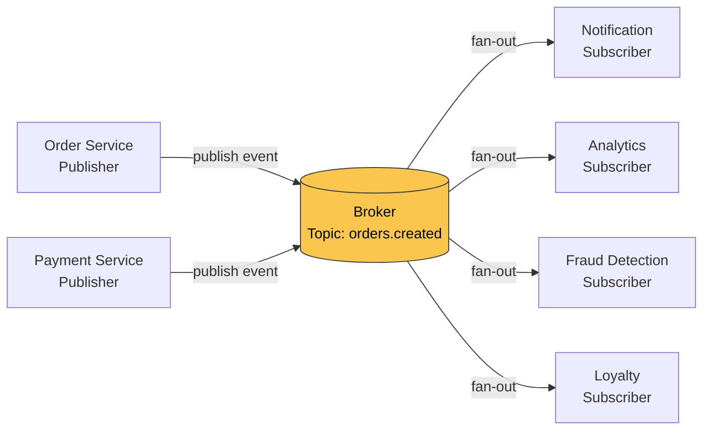
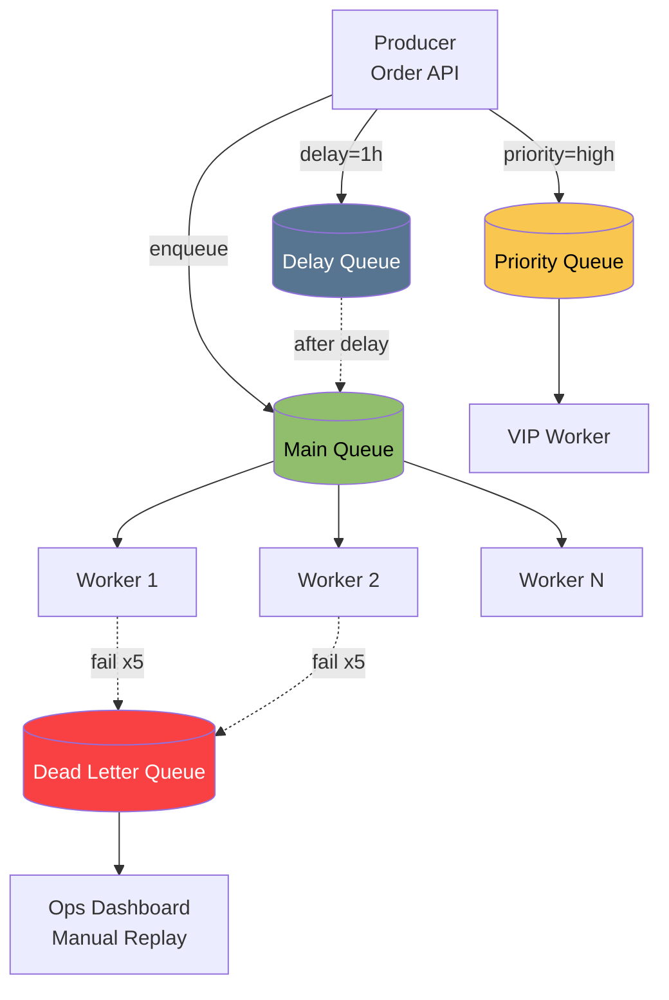
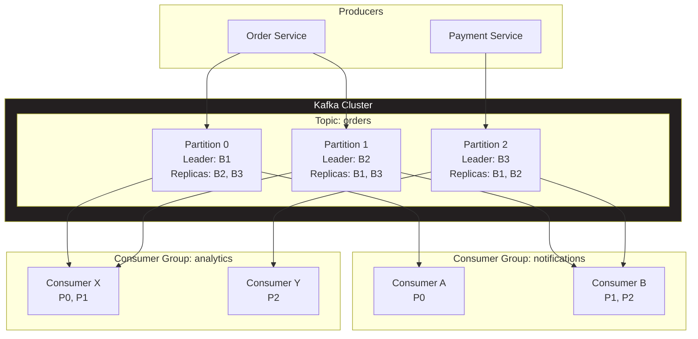
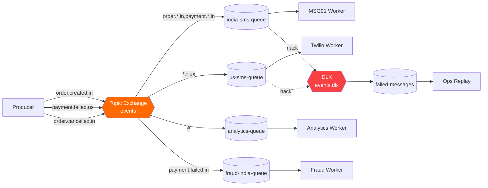

# Messaging Systems

Messaging systems basically tumhe asynchronous communication dete hain. Direct call karne ki jagah tu message ek queue me daal deta hai — receiver apne pace se uthaata hai. Yeh decoupling production scale pe game-changer hota hai. Synchronous HTTP calls me agar downstream service slow ho gayi, toh upstream bhi block ho jaata hai — cascading failure ka recipe. Messaging systems is dependency ko todte hain: producer "fire and forget" karta hai, consumer apni speed se kaam karta hai, aur broker beech me durability, ordering, aur delivery guarantees handle karta hai.

Production-grade systems jaise Uber, Swiggy, Flipkart — saare in messaging systems pe heavily depend karte hain. Order placed hua? Ek event topic pe publish ho gaya. Inventory service, notification service, analytics service, fraud detection — sab apne-apne consumer group se uthaate hain, parallel me process karte hain. Iska matlab agar notification service down bhi ho gayi, order processing nahi rukti — eventual consistency milti hai with isolation. Yeh "event-driven architecture" ka backbone hai.

Is module me hum 4 critical topics cover karenge: Pub/Sub pattern (foundational mental model), Message Queues (work distribution + DLQ + priority + delay), Apache Kafka (distributed log, partitions, exactly-once), aur RabbitMQ (AMQP, exchanges, routing keys). Har topic me production code (Java + Node.js), real-life examples, mermaid diagrams, aur interview-grade Q&A milegi. Tu jab interview me bolega "Kafka partition count is bottleneck for parallelism" — interviewer ko pata chal jayega tu seriously samajhta hai.

---

## 1. Pub/Sub

### 1.1 Publish-Subscribe pattern — broker, topics, subscribers, fan-out

#### Definition

Publish-Subscribe (Pub/Sub) ek messaging pattern hai jisme **publishers** messages ko directly receivers ko nahi bhejte — woh ek **topic** (ya channel) pe publish karte hain. Jo bhi **subscribers** us topic ko subscribe kiye hue hain, unko message ka copy mil jaata hai. Beech me ek **broker** (Kafka, RabbitMQ, Redis Pub/Sub, Google Pub/Sub) baitha hota hai jo routing, buffering, aur delivery handle karta hai.

Key property: **fan-out**. Ek single message multiple consumers tak pahuchta hai. Yeh point-to-point queue se fundamentally alag hai — queue me ek message sirf ek consumer ko milta hai (work distribution), Pub/Sub me sab ko milta hai (broadcast).

#### Why?

- **Loose coupling**: Publisher ko nahi pata kaun sun raha hai. Aaj 2 subscribers, kal 10 — publisher code change nahi hota.
- **Scalability**: Naya subscriber add karna trivial hai. Publisher ki load nahi badhti.
- **Fault tolerance**: Ek subscriber crash ho gaya, baaki kaam karte rahenge. Broker buffer karta hai messages.
- **Heterogeneous consumers**: Same event ko alag-alag teams alag-alag tarike se consume kar sakti hain — analytics team Spark me, notification team Node.js me, fraud team Python me.

Without Pub/Sub: order service ko har downstream ko HTTP call karna padega — tight coupling, latency add-up, partial failures hard to manage.

#### How?

**Node.js producer-consumer with Redis Pub/Sub:**

```javascript
// publisher.js — order service
const Redis = require('ioredis');
const publisher = new Redis({ host: 'localhost', port: 6379 });

async function publishOrderEvent(order) {
  // Topic ka naam: "orders.created" — convention follow kar
  const topic = 'orders.created';
  const payload = JSON.stringify({
    orderId: order.id,
    userId: order.userId,
    amount: order.amount,
    timestamp: Date.now(),
  });

  // publish() returns count of subscribers jo message receive kar gaye
  const subscribersReached = await publisher.publish(topic, payload);
  console.log(`Order ${order.id} bhej diya, ${subscribersReached} subscribers ko mila`);
}

// Example usage
publishOrderEvent({ id: 'ORD-101', userId: 'U-42', amount: 1499 });
```

```javascript
// subscriber-notification.js — notification service
const Redis = require('ioredis');
const subscriber = new Redis({ host: 'localhost', port: 6379 });

// Subscribe karo topic pe
subscriber.subscribe('orders.created', (err, count) => {
  if (err) {
    console.error('Subscribe failed:', err);
    return;
  }
  console.log(`${count} topic(s) pe subscribed`);
});

// Message handler — har message yahan aayega
subscriber.on('message', (channel, message) => {
  const event = JSON.parse(message);
  // Notification logic — SMS/email bhejo
  console.log(`Notification bhej raha hu user ${event.userId} ko for order ${event.orderId}`);
  sendSMS(event.userId, `Aapka order ${event.orderId} confirm ho gaya hai`);
});

function sendSMS(userId, msg) {
  // Twilio/MSG91 integration yahan
}
```

**Java producer-consumer with Google Cloud Pub/Sub:**

```java
// OrderPublisher.java
import com.google.cloud.pubsub.v1.Publisher;
import com.google.protobuf.ByteString;
import com.google.pubsub.v1.PubsubMessage;
import com.google.pubsub.v1.TopicName;

public class OrderPublisher {
    private final Publisher publisher;

    public OrderPublisher(String projectId, String topicId) throws Exception {
        // Topic ka full naam project-scoped hota hai
        TopicName topicName = TopicName.of(projectId, topicId);
        this.publisher = Publisher.newBuilder(topicName).build();
    }

    public void publishOrder(String orderId, String userId, double amount) throws Exception {
        // JSON payload bana — production me Avro/Protobuf use kar
        String json = String.format(
            "{\"orderId\":\"%s\",\"userId\":\"%s\",\"amount\":%.2f}",
            orderId, userId, amount
        );

        ByteString data = ByteString.copyFromUtf8(json);
        // Attributes me metadata daal — filtering ke kaam aata hai
        PubsubMessage message = PubsubMessage.newBuilder()
            .setData(data)
            .putAttributes("eventType", "order.created")
            .putAttributes("region", "ap-south-1")
            .build();

        // Async publish — future return karta hai
        publisher.publish(message).get(); // .get() block karta hai, production me async handle kar
        System.out.println("Order " + orderId + " published");
    }
}
```

```java
// OrderSubscriber.java — notification service
import com.google.cloud.pubsub.v1.AckReplyConsumer;
import com.google.cloud.pubsub.v1.MessageReceiver;
import com.google.cloud.pubsub.v1.Subscriber;
import com.google.pubsub.v1.ProjectSubscriptionName;

public class OrderSubscriber {
    public static void main(String[] args) {
        ProjectSubscriptionName subName =
            ProjectSubscriptionName.of("my-project", "notification-sub");

        // MessageReceiver — har message ke liye callback
        MessageReceiver receiver = (message, consumer) -> {
            String payload = message.getData().toStringUtf8();
            System.out.println("Mila: " + payload);

            try {
                // Business logic — notification bhejo
                processNotification(payload);
                consumer.ack(); // Ack karna IMPORTANT — warna redelivery hogi
            } catch (Exception e) {
                // Nack karne se message dobara aayega (retry) ya DLQ jayega
                consumer.nack();
            }
        };

        Subscriber subscriber = Subscriber.newBuilder(subName, receiver).build();
        subscriber.startAsync().awaitRunning();
        // Subscriber background me chalta rahega
    }

    static void processNotification(String payload) {
        // SMS/email/push logic
    }
}
```

#### Real-life Example: Swiggy order placed event

Tu Swiggy pe order place karta hai. Order service `order.placed` event ko Pub/Sub topic pe publish karta hai. Yeh event simultaneously inn subscribers tak pahuchta hai:

1. **Restaurant service** — restaurant ko KOT (Kitchen Order Ticket) bhejti hai
2. **Delivery service** — nearby delivery partners ko ping karti hai
3. **Notification service** — user ko "Order confirmed" SMS/push bhejta hai
4. **Analytics service** — real-time dashboard update karta hai (orders per minute)
5. **Fraud detection** — ML model run karta hai suspicious patterns ke liye
6. **Loyalty service** — points calculate karta hai

Order service ko inn 6 services ka existence pata bhi nahi hai. Kal agar Swiggy 7th service add kare (e.g., carbon footprint tracker), order service ka code touch nahi karna padega — bas naya subscriber spin up kar do.

#### Diagram



#### Interview Q&A

**Q1: Pub/Sub aur Message Queue me fundamental difference kya hai? Kab kaunsa use karega?**

Pub/Sub me ek message **multiple subscribers** tak pahuchta hai — broadcast/fan-out semantics. Message Queue (point-to-point) me ek message **sirf ek consumer** uthaata hai — work distribution semantics. Pub/Sub use hota hai jab same event pe multiple independent reactions chahiye — jaise order placed hone pe notification + analytics + fraud check sab parallel chalein. Queue use hota hai jab tu kaam ko parallelize karna chahta hai across worker instances — jaise 100 image resize jobs ko 10 workers me distribute karna. Real systems me dono hybrid me use hote hain — Kafka me consumer groups use karke tu dono pattern implement kar sakta hai (different groups = fan-out, same group = work distribution).

**Q2: Pub/Sub me message delivery guarantees kya hote hain? At-least-once vs at-most-once vs exactly-once?**

At-most-once: message ek baar ya zero baar deliver hoga — fast but data loss possible (UDP-like). At-least-once: message kam se kam ek baar deliver hoga, but duplicate possible — most common in production (Kafka default, RabbitMQ with ack). Exactly-once: ek hi baar deliver hoga, no duplicates — hardest to achieve, requires idempotent consumers + transactional writes (Kafka EOS). Production me at-least-once + idempotent consumer pattern most practical hai. Tu consumer side pe ek `processedMessageIds` set maintain karta hai (Redis/DB me) aur duplicate detect karke skip karta hai. Exactly-once "claim" karne wale systems bhi internally at-least-once + dedup karte hain.

**Q3: Agar subscriber slow hai aur publisher fast hai, kya hota hai? Backpressure kaise handle karega?**

Yeh classic producer-consumer mismatch problem hai. Broker me messages accumulate hone lagte hain — memory/disk bharta jaata hai. Solutions: (1) **Bounded buffers** — broker pe queue size limit lagao, full hone pe publisher ko block karo ya reject (Kafka me `producer.buffer.memory`, RabbitMQ me `x-max-length`). (2) **Multiple consumers** — slow subscriber ke jagah consumer group bana, parallelize karo. (3) **Reactive backpressure** — RxJS/Project Reactor me publisher demand-driven hota hai, consumer signal karta hai kitna le sakta hai. (4) **Drop policies** — old messages drop karo (Redis Streams me `MAXLEN ~`), ya newest drop karo. (5) **Dead-letter queue** — jo messages timeout ho gaye, DLQ me daal do for later analysis. Production me hum monitoring (lag metrics) + auto-scaling consumers (Kubernetes HPA on Kafka lag) use karte hain.

**Q4: Topic naming convention production me kaisa rakhega? Schema evolution kaise handle karega?**

Topic naming hierarchical rakh: `<domain>.<entity>.<action>` jaise `commerce.order.created`, `commerce.order.cancelled`, `payments.refund.initiated`. Yeh subscribers ko wildcard subscribe karne ka option deta hai (RabbitMQ topic exchange me `commerce.order.*`). Schema evolution ke liye **Avro/Protobuf with Schema Registry** (Confluent Schema Registry) use kar — backward/forward compatibility enforce hoti hai. JSON use karega toh contract testing aur consumer-driven contracts (Pact) zaruri hain. Versioning strategy: schema version field add kar payload me, ya topic me version embed kar (`order.created.v2`). Breaking change aaye toh dual-publish karo (v1 + v2) parallel me, consumers migrate hone do, phir v1 deprecate karo. Yeh production-grade event-driven architecture ka core hygiene hai.

**Q5: Pub/Sub me ordering kaise guarantee karega? Global vs per-key ordering ka trade-off?**

Pub/Sub me **global ordering** guarantee dena distributed system me almost impossible hai — single sequencer banoge toh throughput single-node-bound ho jayega. Practical solution: **per-key ordering** (also called partition ordering). Producer message ke saath ek key attach karta hai (e.g., `userId`, `orderId`), broker hash-based routing karta hai — same key hamesha same partition/queue/sub-stream me jaata hai, jahan FIFO maintain hota hai. Kafka me yeh partitioning key se hota hai, Google Pub/Sub me `orderingKey` field hai, AWS SNS FIFO me `MessageGroupId`. Trade-off: agar key cardinality kam hai (sirf 5 unique keys), toh sirf 5 partitions me distribute hoga — parallelism limited. Agar key cardinality bahut zyada (har message unique key), toh ordering meaningless ho jaati hai. Sweet spot: business entity-level keys (userId, accountId) — entity-level ordering preserved, parallelism across entities. Production me agar tu kahin global ordering chahiye toh single partition use kar — par jaano throughput cap aa jayega (~10MB/s typical).

**Q6: Idempotent consumer kaise design karega? Dedup store ka choice?**

Consumer ko idempotent banane ka matlab — same message N baar process kar do, business state pe ek hi baar effect ho. Strategies: (1) **Natural idempotence** — operation hi idempotent hai (e.g., "set status=COMPLETED" — kitni baar bhi karo, result same). (2) **Dedup store** — `processedMessageIds` set maintain kar (Redis SET ya DB unique constraint). Message process karne se pehle check kar — already processed? Skip. Yeh pattern me race condition se bachne ke liye atomic check-and-set chahiye (Redis `SET NX`, DB unique index). (3) **Outbox pattern** — DB transaction me business write + processed flag dono ek saath. (4) **Versioned writes** — message me version/sequence number, DB me `WHERE version > current_version` clause. Dedup store choice: Redis fast (sub-ms) but volatile — TTL set kar (e.g., 24 hours, message age se zyada). DynamoDB/Postgres durable but slower. Kafka me Streams ka built-in `KTable` use kar sakte ho. Production tip: dedup key message ID se nahi, **business event ID** se rakh — agar producer retry kare toh new message ID generate ho sakta hai, but business event same hoga.

---

## 2. Message Queues

### 2.1 Queue patterns (work distribution, dead-letter queues, priority queues, delay queues)

#### Definition

Message Queue ek FIFO (mostly) data structure hai jisme producers messages **enqueue** karte hain aur consumers **dequeue** karte hain. Pub/Sub se difference: ek message sirf ek consumer ko milta hai (competing consumers pattern). Yeh **work distribution** ka foundation hai.

Queue patterns:
- **Work distribution (worker queue)**: N consumers, ek message ek consumer ko — parallelize work
- **Dead-letter queue (DLQ)**: jo messages process nahi ho paaye (max retries exceed), wahan jaate hain — debugging/replay ke liye
- **Priority queue**: high-priority messages pehle process — VIP customer orders, urgent alerts
- **Delay queue (scheduled)**: message X seconds/minutes baad available ho — reminders, retries with backoff

#### Why?

- **Decoupling + load leveling**: traffic spike aaye toh queue buffer karta hai, consumers steady rate pe process karte hain
- **Reliability**: producer crash ho ya consumer crash ho — message persist rehta hai (durable queue)
- **Retry semantics**: message process fail ho toh requeue, max retries ke baad DLQ
- **Async workflows**: long-running tasks (PDF generation, video encoding) ko background me kar
- **SLA differentiation**: priority queue se paid users ko fast lane

Without queue: synchronous processing, request timeout, lost work, poor UX during traffic spikes (Diwali sale!).

#### How?

**Node.js with BullMQ (Redis-backed):**

```javascript
// queue-setup.js
const { Queue, Worker, QueueEvents } = require('bullmq');
const connection = { host: 'localhost', port: 6379 };

// 1. Work distribution queue — image processing
const imageQueue = new Queue('image-processing', { connection });

// 2. Priority queue — VIP orders pehle
const orderQueue = new Queue('orders', { connection });

// 3. Delay queue — reminder 24 hours baad
const reminderQueue = new Queue('reminders', { connection });

// Producer: image upload hone pe job add kar
async function enqueueImageJob(imageId, userId) {
  await imageQueue.add('resize', { imageId, userId }, {
    attempts: 5, // max 5 retries
    backoff: { type: 'exponential', delay: 2000 }, // 2s, 4s, 8s, 16s, 32s
    removeOnComplete: 1000, // last 1000 success store kar
    removeOnFail: false, // failed jobs DLQ ke liye rakh
  });
}

// Producer: priority order
async function enqueueOrder(orderId, isVIP) {
  await orderQueue.add('process-order', { orderId }, {
    priority: isVIP ? 1 : 10, // lower number = higher priority
  });
}

// Producer: delay queue
async function scheduleReminder(userId, msg) {
  await reminderQueue.add('send-reminder', { userId, msg }, {
    delay: 24 * 60 * 60 * 1000, // 24 hours baad
  });
}
```

```javascript
// worker.js — consumer
const { Worker } = require('bullmq');
const connection = { host: 'localhost', port: 6379 };

// Worker: image processing — concurrency 10 means 10 parallel jobs
const imageWorker = new Worker('image-processing', async (job) => {
  const { imageId, userId } = job.data;
  console.log(`Worker ${process.pid} processing image ${imageId}`);

  // Actual resize logic — failure pe throw karega, BullMQ retry karega
  await resizeImage(imageId);

  // Job complete — return value job result me store hoga
  return { resized: true, imageId };
}, { connection, concurrency: 10 });

// Failed jobs — DLQ ka kaam BullMQ "failed" set me karta hai
imageWorker.on('failed', (job, err) => {
  console.error(`Job ${job.id} fail ho gaya after ${job.attemptsMade} attempts:`, err.message);
  if (job.attemptsMade >= job.opts.attempts) {
    // Manually DLQ me daal — dusri queue me move kar
    moveToDLQ(job);
  }
});

async function moveToDLQ(job) {
  const dlq = new Queue('image-processing-dlq', { connection });
  await dlq.add('failed', { ...job.data, originalJobId: job.id, error: job.failedReason });
}

async function resizeImage(id) {
  // sharp/imagemagick logic
}
```

**Java with AWS SQS — work distribution + DLQ + delay:**

```java
// SqsProducer.java
import software.amazon.awssdk.services.sqs.SqsClient;
import software.amazon.awssdk.services.sqs.model.SendMessageRequest;
import software.amazon.awssdk.services.sqs.model.SendMessageResponse;

public class SqsProducer {
    private final SqsClient sqs = SqsClient.create();
    private final String queueUrl = "https://sqs.ap-south-1.amazonaws.com/123/orders-queue";

    public void sendOrder(String orderId, int delaySeconds) {
        // SQS me delaySeconds 0-900 (15 min) ke beech hota hai
        // Lambi delays ke liye SQS + Step Functions ya scheduled lambdas use kar
        SendMessageRequest req = SendMessageRequest.builder()
            .queueUrl(queueUrl)
            .messageBody("{\"orderId\":\"" + orderId + "\"}")
            .delaySeconds(delaySeconds) // delay queue pattern
            .build();

        SendMessageResponse resp = sqs.sendMessage(req);
        System.out.println("Bhej diya, messageId: " + resp.messageId());
    }
}
```

```java
// SqsConsumer.java
import software.amazon.awssdk.services.sqs.SqsClient;
import software.amazon.awssdk.services.sqs.model.*;
import java.util.List;

public class SqsConsumer {
    private final SqsClient sqs = SqsClient.create();
    private final String queueUrl = "https://sqs.ap-south-1.amazonaws.com/123/orders-queue";

    public void pollAndProcess() {
        while (true) {
            // Long polling — 20 sec wait, network calls kam
            ReceiveMessageRequest req = ReceiveMessageRequest.builder()
                .queueUrl(queueUrl)
                .maxNumberOfMessages(10) // batch
                .waitTimeSeconds(20)
                .visibilityTimeout(30) // 30 sec ke liye message dusre consumer ko nahi dikhega
                .build();

            List<Message> messages = sqs.receiveMessage(req).messages();
            for (Message m : messages) {
                try {
                    processOrder(m.body());
                    // Success — delete kar warna visibility timeout ke baad dobara aayega
                    sqs.deleteMessage(DeleteMessageRequest.builder()
                        .queueUrl(queueUrl)
                        .receiptHandle(m.receiptHandle())
                        .build());
                } catch (Exception e) {
                    // Delete nahi karenge — SQS automatically retry karega
                    // maxReceiveCount exceed hone pe SQS khud DLQ me daal dega
                    // (DLQ redrive policy queue config me set hoti hai)
                    System.err.println("Process failed, retry hoga: " + e.getMessage());
                }
            }
        }
    }

    private void processOrder(String body) throws Exception {
        // Business logic
    }
}
```

**Priority queue with RabbitMQ in Java:**

```java
// RabbitPriorityProducer.java
import com.rabbitmq.client.*;
import java.util.Map;
import java.util.HashMap;

public class RabbitPriorityProducer {
    public static void main(String[] args) throws Exception {
        ConnectionFactory factory = new ConnectionFactory();
        factory.setHost("localhost");

        try (Connection conn = factory.newConnection();
             Channel channel = conn.createChannel()) {

            // Priority queue declare — max-priority arg zaruri hai
            Map<String, Object> args2 = new HashMap<>();
            args2.put("x-max-priority", 10); // 0-10 priority levels
            channel.queueDeclare("orders-priority", true, false, false, args2);

            // VIP order — priority 9
            AMQP.BasicProperties vipProps = new AMQP.BasicProperties.Builder()
                .priority(9)
                .deliveryMode(2) // persistent
                .build();
            channel.basicPublish("", "orders-priority", vipProps,
                "{\"orderId\":\"VIP-101\"}".getBytes());

            // Normal order — priority 1
            AMQP.BasicProperties normalProps = new AMQP.BasicProperties.Builder()
                .priority(1)
                .deliveryMode(2)
                .build();
            channel.basicPublish("", "orders-priority", normalProps,
                "{\"orderId\":\"ORD-202\"}".getBytes());

            // VIP wala pehle consume hoga
        }
    }
}
```

#### Real-life Example: Flipkart Big Billion Days order pipeline

Sale start hua, 1 lakh orders/sec aa rahe hain. Direct database write karna suicide hai. Flow:

1. Order API request leta hai, basic validation karta hai, **`orders-incoming` queue** me daal deta hai. User ko 200 OK turant.
2. **50 worker instances** queue se consume karte hain (work distribution) — inventory check, fraud check, payment hold.
3. **VIP Plus members** ka order **priority queue** me high priority pe — pehle process hota hai.
4. **Payment failed** orders 5 baar retry hote hain exponential backoff ke saath, phir **DLQ** me jaate hain. Ops team review karti hai DLQ ko.
5. **Reminder system**: cart abandon kiya 1 hour pehle? **Delay queue** me message daala — 1 hour baad consumer uthayega, push notification bhejega "aapka cart wait kar raha hai".

Without queue: API server crash, database connection pool exhaust, sale FAIL. Ye sab patterns mil ke production-grade system banate hain.

#### Diagram



#### Interview Q&A

**Q1: Visibility timeout kya hota hai SQS me? Agar consumer crash kar gaya beech me toh?**

Visibility timeout woh duration hai jab tak ek message dequeue hone ke baad **dusre consumers ko invisible** rehta hai. Default 30 sec, max 12 hours. Consumer ne message receive kiya — clock start. Agar consumer ne timeout ke andar `deleteMessage()` call kar diya, message permanent delete. Agar consumer crash kar gaya bina delete kiye, timeout expire hone pe message dobara visible ho jaayega — koi aur consumer uthayega. Yeh **at-least-once** delivery ka mechanism hai. Pitfall: agar processing 30 sec se zyada lagti hai, message dubara dequeue ho jayega aur duplicate processing hogi. Solution: `ChangeMessageVisibility` API call karke timeout extend kar (heartbeat pattern), ya processing time predict karke timeout sahi set kar. Idempotent consumer banana zaruri hai kyunki duplicates aayenge guaranteed.

**Q2: DLQ kab use karega? DLQ me messages aaye toh kya karega? Replay strategy?**

DLQ tab use kar jab message poison hai — schema invalid, downstream service permanently down, business logic bug, ya max retries exceed. Direct discard karna data loss hai, isliye DLQ me park karte hain investigation ke liye. Strategy: (1) **Monitoring** — DLQ depth alert lagao (CloudWatch, Prometheus), threshold cross hone pe PagerDuty fire. (2) **Categorize errors** — schema error (re-process won't help, fix code first) vs transient error (retry-able). (3) **Replay tool** — DLQ se main queue me move karne ka tool bana (idempotent re-process). AWS SQS me "DLQ redrive" feature hai. (4) **Root cause fix** — DLQ growing? Bug hai. Fix deploy kar, phir replay. (5) **Retention** — DLQ me 14 days retention rakh, baad me archive S3 me. Production me DLQ ek "circuit breaker" hai jo cascading failure se bachata hai.

**Q3: Priority queue Kafka me kaise implement karega? Native support nahi hai na?**

Sahi pakda — Kafka me native priority nahi hota kyunki partitions me messages strict offset order me hote hain. Workarounds: (1) **Multiple topics** — `orders.high`, `orders.medium`, `orders.low` — consumer round-robin ya weighted strategy se pull kare (high se 70%, medium 20%, low 10%). (2) **Single topic + consumer-side priority** — consumer batch pull kare, in-memory priority queue me daale, phir process. Ordering guarantee toot jaati hai. (3) **Header-based filtering** — consumer skip kare low priority messages tab tak jab tak high backlog clear na ho — but skipping = lag inflation. Production me **multi-topic approach** most common hai. RabbitMQ priority queue native hai (x-max-priority arg), agar strict priority chahiye toh RabbitMQ better fit. Trade-off: Kafka throughput beats RabbitMQ priority feature in 99% e-commerce cases.

**Q4: Delay queue kaise implement karega Redis pe? Distributed scheduling problem kya hai?**

Redis sorted set (ZSET) use kar — score = `processAt timestamp`, member = job ID/payload. Producer `ZADD delay:queue 1730000000 jobId` karta hai. Consumer poller periodically `ZRANGEBYSCORE delay:queue -inf <now>` karta hai — jo time aa gaya wo nikaalo, main queue (LIST) me push karo, ZSET se remove karo. Atomicity ke liye Lua script use kar (compare-and-set). BullMQ exactly yahi karta hai internally. Distributed scheduling problems: (1) **Multiple pollers** — same job ko 2 nodes uthaa lein toh duplicate. Solution: `ZPOPMIN` atomic hai, ya distributed lock. (2) **Clock skew** — nodes ke clock diverge ho gaye toh wrong timing. NTP sync zaruri. (3) **Long delays** (e.g., 30 days) — Redis memory me sab park karna costly. Better: DB me schedule store, periodic batch job poll kare. AWS me EventBridge Scheduler ya Step Functions wait state use kar long delays ke liye — built-in distributed scheduler hai.

**Q5: Poison pill messages kya hote hain aur unko kaise detect karega? DLQ flooding ka problem?**

Poison pill woh message hai jo permanently fail karta hai — koi bhi consumer process nahi kar paayega kyunki message hi corrupt/invalid hai (schema violation, malformed JSON, missing required field, business rule violation jo retry se solve nahi hoga). Agar tu naive retry loop chala raha hai, poison pill consumer ko infinitely block kar dega — pura partition stuck. Detection patterns: (1) **Retry counter** — message header me `retryCount` field, consumer increment kar ke check kare. Threshold cross hua = poison, DLQ. (2) **Time-bounded retry** — message me `firstSeenAt` timestamp, X minutes ke baad poison declare. (3) **Error classification** — exception type dekho. `JsonParseException`, `ValidationException` = poison (immediate DLQ). `TimeoutException`, `ConnectionRefused` = transient (retry). DLQ flooding problem: agar upstream sudden bug deploy ho gaya, lakhs messages DLQ me ja sakte hain rapidly. Mitigation: (a) **DLQ depth alarm** — Prometheus alert at 1000 messages threshold. (b) **Circuit breaker** — error rate >50% pe consumer pause kar de naye messages, manual intervention trigger. (c) **Sampling** — DLQ me sirf first N similar errors store kar (deduped by error signature), baaki count metric me. (d) **Bulkhead pattern** — different message types alag queues me, ek poison pill pure system ko nahi gira sakta.

**Q6: FIFO queue vs standard queue (SQS) — kab kya use? Throughput limits?**

Standard SQS queue: **at-least-once delivery, best-effort ordering, unlimited throughput**. Cheap, scales horizontally. Use jab ordering loose hai aur throughput priority hai (e.g., log aggregation, analytics events, image processing jobs). FIFO queue: **exactly-once processing, strict ordering within MessageGroup, but limited throughput** (3000 msg/s with batching, 300 without). Use jab ordering business-critical hai — financial transactions, order state machines, banking ledger entries. FIFO queue me `MessageGroupId` ek partition key ki tarah kaam karta hai — same group ID wale messages strict order me, alag groups parallel. `MessageDeduplicationId` 5-minute window me duplicates filter karta hai. Trade-offs: FIFO double the cost of standard, throughput cap real bottleneck Big Billion Day pe. Hybrid pattern: **standard queue + idempotent consumer + sequence numbers in payload** — throughput aur ordering dono pa sakte ho consumer-side reordering buffer ke saath. Production decision tree: agar duplicates ka business cost > FIFO premium cost, FIFO le. Warna standard + idempotence pattern.

---

## 3. Apache Kafka

### 3.1 Topics, partitions, consumer groups, offsets, exactly-once semantics, replication, ISR

#### Definition

Apache Kafka ek **distributed, partitioned, replicated commit log** hai. LinkedIn me bana, ab open-source Apache project. Yeh "messaging system" se zyada **streaming platform** hai — high throughput (millions of messages/sec), durable, horizontally scalable.

Core concepts:
- **Topic**: logical category of messages (e.g., `user.events`)
- **Partition**: topic ka physical sharded unit — append-only log file. Parallelism aur scale ki unit.
- **Offset**: partition ke andar message ka unique sequential ID (long)
- **Consumer Group**: consumers ka group jo together ek topic consume karte hain. Har partition ek hi consumer ko assign hoti hai group ke andar.
- **Broker**: Kafka server node. Cluster me multiple brokers hote hain.
- **Replication**: har partition ki copies multiple brokers pe hoti hain (replication factor)
- **ISR (In-Sync Replicas)**: woh replicas jo leader ke saath fully caught up hain — failover candidates
- **Exactly-once semantics (EOS)**: producer idempotence + transactional writes se duplicates eliminate

#### Why?

- **Scale**: petabyte-scale data, millions of messages/sec (LinkedIn, Uber, Netflix prove karte hain)
- **Durability**: disk-based persistence, configurable replication
- **Replay**: consumers offset rewind kar sakte hain — historical reprocessing possible (rebuild caches, fix bugs)
- **Ordering guarantee**: per-partition strict ordering (full topic ordering nahi, but partition key se logical entity ordering)
- **Decoupling**: producers aur consumers independent — Kafka buffer karta hai
- **Stream processing**: Kafka Streams, Flink, Spark Streaming integration

Kafka use kar jab tu high-throughput event streaming, log aggregation, change data capture (Debezium), ya event sourcing kar raha ho.

#### How?

**Java producer (transactional, exactly-once):**

```java
// KafkaTransactionalProducer.java
import org.apache.kafka.clients.producer.*;
import org.apache.kafka.common.serialization.StringSerializer;
import java.util.Properties;

public class KafkaTransactionalProducer {
    public static void main(String[] args) {
        Properties props = new Properties();
        props.put("bootstrap.servers", "broker1:9092,broker2:9092,broker3:9092");
        props.put("key.serializer", StringSerializer.class.getName());
        props.put("value.serializer", StringSerializer.class.getName());

        // Idempotence — duplicate messages prevent (retry pe same offset)
        props.put("enable.idempotence", true);
        // acks=all — sab ISR replicas ack karein tab success
        props.put("acks", "all");
        // Transactions — atomic multi-partition writes
        props.put("transactional.id", "order-producer-1"); // unique per producer instance

        KafkaProducer<String, String> producer = new KafkaProducer<>(props);
        producer.initTransactions();

        try {
            producer.beginTransaction();

            // Order key se partition decide hoga — same orderId hamesha same partition
            // Yeh ordering guarantee deta hai per-order
            ProducerRecord<String, String> record1 = new ProducerRecord<>(
                "orders", "ORD-101",
                "{\"orderId\":\"ORD-101\",\"amount\":1499}"
            );
            producer.send(record1);

            ProducerRecord<String, String> record2 = new ProducerRecord<>(
                "inventory", "ORD-101",
                "{\"orderId\":\"ORD-101\",\"action\":\"reserve\"}"
            );
            producer.send(record2);

            // Dono atomically commit — ya dono honge ya koi nahi
            producer.commitTransaction();
            System.out.println("Transaction commit ho gaya");
        } catch (Exception e) {
            producer.abortTransaction();
            System.err.println("Transaction abort: " + e.getMessage());
        } finally {
            producer.close();
        }
    }
}
```

**Java consumer (consumer group, manual offset commit):**

```java
// KafkaConsumerGroup.java
import org.apache.kafka.clients.consumer.*;
import org.apache.kafka.common.serialization.StringDeserializer;
import java.time.Duration;
import java.util.*;

public class KafkaConsumerGroup {
    public static void main(String[] args) {
        Properties props = new Properties();
        props.put("bootstrap.servers", "broker1:9092,broker2:9092");
        props.put("key.deserializer", StringDeserializer.class.getName());
        props.put("value.deserializer", StringDeserializer.class.getName());

        // Consumer group ID — same group ke consumers partitions share karenge
        props.put("group.id", "notification-service");

        // Manual commit — process success ke baad commit, at-least-once
        props.put("enable.auto.commit", false);

        // EOS read side — sirf committed transactions read kar
        props.put("isolation.level", "read_committed");

        // Earliest offset se start — agar group naya hai
        props.put("auto.offset.reset", "earliest");

        KafkaConsumer<String, String> consumer = new KafkaConsumer<>(props);
        consumer.subscribe(Collections.singletonList("orders"));

        try {
            while (true) {
                // poll() me partition assignment, heartbeat, fetch sab hota hai
                ConsumerRecords<String, String> records = consumer.poll(Duration.ofMillis(1000));

                for (ConsumerRecord<String, String> record : records) {
                    System.out.printf("Mila: partition=%d, offset=%d, key=%s, value=%s%n",
                        record.partition(), record.offset(), record.key(), record.value());

                    try {
                        processOrder(record.value());
                    } catch (Exception e) {
                        // Failure — DLQ topic me bhej, fir bhi commit kar warna stuck ho jayega
                        sendToDLQ(record);
                    }
                }

                // Batch ke baad commit — at-least-once guarantee
                // Agar yahan se pehle crash hua, batch dubara process hoga
                if (!records.isEmpty()) {
                    consumer.commitSync();
                }
            }
        } finally {
            consumer.close();
        }
    }

    static void processOrder(String value) throws Exception {
        // Business logic — idempotent banana zaruri (orderId dedupe)
    }

    static void sendToDLQ(ConsumerRecord<String, String> record) {
        // DLQ topic me publish — error metadata ke saath
    }
}
```

**Node.js with KafkaJS:**

```javascript
// kafka-producer.js
const { Kafka, CompressionTypes, Partitioners } = require('kafkajs');

const kafka = new Kafka({
  clientId: 'order-service',
  brokers: ['broker1:9092', 'broker2:9092', 'broker3:9092'],
});

const producer = kafka.producer({
  idempotent: true, // EOS producer side
  maxInFlightRequests: 5,
  createPartitioner: Partitioners.DefaultPartitioner, // key hash based
});

async function sendOrder(orderId, amount) {
  await producer.connect();
  await producer.send({
    topic: 'orders',
    compression: CompressionTypes.Snappy, // bandwidth save
    messages: [
      {
        key: orderId, // same key = same partition = ordering preserved
        value: JSON.stringify({ orderId, amount, ts: Date.now() }),
        headers: { 'event-type': 'order.created' },
      },
    ],
    acks: -1, // all ISR ack
  });
  console.log(`Order ${orderId} bhej diya`);
}

sendOrder('ORD-101', 1499).catch(console.error);
```

```javascript
// kafka-consumer.js
const { Kafka } = require('kafkajs');
const kafka = new Kafka({ clientId: 'notif-service', brokers: ['broker1:9092'] });

const consumer = kafka.consumer({
  groupId: 'notification-group', // group ID — partitions share honge group ke andar
  sessionTimeout: 30000,
  heartbeatInterval: 3000,
});

async function run() {
  await consumer.connect();
  await consumer.subscribe({ topic: 'orders', fromBeginning: false });

  await consumer.run({
    autoCommit: false, // manual control for at-least-once
    eachMessage: async ({ topic, partition, message, heartbeat }) => {
      const event = JSON.parse(message.value.toString());
      console.log(`Partition ${partition}, offset ${message.offset}, order ${event.orderId}`);

      try {
        await sendNotification(event);
        // Commit ke baad agla message — agar yahan crash, dubara process
        await consumer.commitOffsets([{
          topic, partition, offset: (Number(message.offset) + 1).toString(),
        }]);
      } catch (e) {
        // Retry ya DLQ — yahan bina commit kiye throw karenge toh consumer rebalance pe dubara aayega
        throw e;
      }
    },
  });
}

async function sendNotification(event) {
  // SMS/push logic — idempotent (orderId dedupe)
}

run().catch(console.error);
```

#### Real-life Example: Uber's surge pricing pipeline

Uber me har ride request, GPS update, driver location ek event hai. Daily 10+ trillion events Kafka me flow karte hain. Pipeline:

1. **Driver app** har 4 sec me location update bhejta hai → `driver.location` topic (1000 partitions, key = driverId)
2. **Rider app** ride request → `ride.request` topic
3. **Surge pricing service** dono topics ko Kafka Streams se join karta hai, real-time demand-supply ratio calculate karta hai per geohash
4. Result `pricing.surge` topic pe publish — frontend service consume karta hai, app me dynamic price dikhata hai
5. Same `ride.request` topic ko **fraud detection consumer group**, **analytics consumer group**, **dispatcher consumer group** parallel consume karte hain — fan-out via groups
6. Replication factor 3, min ISR 2 — ek data center fail ho toh bhi service up

Partitions = parallelism. 1000 partitions matlab 1000 consumers parallel consume kar sakte hain. Key = driverId ensures same driver ka data hamesha same partition me jaata hai — ordering preserved per driver, but globally not.

#### Diagram



#### Interview Q&A

**Q1: Partition kya hai aur partition count decide kaise karega? Bahut zyada partitions ka downside?**

Partition ek append-only log file hai jo broker ke disk pe sit karti hai. Topic ko N partitions me split karte hain — har partition independently consume hoti hai, isliye **parallelism = number of partitions** (ek partition ek hi consumer ko milti hai group ke andar). Decision factors: (1) **Target throughput** — agar producer 100 MB/s lik raha hai aur per-partition throughput 10 MB/s achievable hai, minimum 10 partitions chahiye. (2) **Consumer parallelism** — peak load pe kitne consumers parallel chahiye? (3) **Future growth** — partitions sirf badha sakte hain (key-based ordering toot jaati hai), kam nahi kar sakte easily. Downsides of too many: (a) **Memory overhead** — har partition pe broker me file handles, page cache. 10K+ partitions per broker se latency badh jaati hai. (b) **Leader election time** — broker fail hua toh sab partitions ka leader re-elect karna mehnga. (c) **End-to-end latency** — producer batching kam efficient. Industry rule: <4000 partitions per broker, total cluster <200K. Confluent recommends 12-30 partitions for most topics initially.

**Q2: Exactly-once semantics Kafka me kaise kaam karta hai? Idempotence aur transactions ka role?**

EOS do guarantees combine karta hai: (1) **Idempotent producer** — `enable.idempotence=true`. Producer ko unique PID (producer ID) milta hai, har message pe sequence number. Broker duplicate detect karta hai retry ke case me — same (PID, partition, sequence) wala message dubara aaya toh discard. Yeh single-partition single-session duplicates fix karta hai. (2) **Transactions** — `transactional.id` set karke producer multiple partitions/topics me atomically write karta hai. `beginTransaction → send (multiple) → commitTransaction`. Consumer side `isolation.level=read_committed` set kare toh sirf committed messages padhe — aborted ya in-progress nahi. (3) **Read-process-write** — Kafka Streams me consumer offset commit + producer write ek transaction me hota hai (`sendOffsetsToTransaction`), so process exactly-once. Caveats: EOS sirf Kafka-to-Kafka pipelines me works. External side effects (DB write, HTTP call) idempotent design karne padte hain — distributed transactions Kafka guarantee nahi karta.

**Q3: ISR (In-Sync Replicas) kya hai? `min.insync.replicas` aur `acks=all` ka relation?**

Har partition ka ek **leader** broker hota hai (writes/reads handle karta hai) aur N-1 **follower** replicas (passive copy). Followers leader se constantly fetch karte hain. **ISR** woh replicas hain jo leader ke saath fully caught up hain (lag < `replica.lag.time.max.ms`, default 30 sec). Agar follower laggard ho gaya, ISR se nikal jaata hai (OSR — out of sync). `acks=all` matlab producer wait karega jab tak **sab ISR replicas** ne message ack na kiya. `min.insync.replicas=2` config kahta hai write tab successful jab kam se kam 2 ISR ne ack kiya — agar ISR me sirf 1 reh gaya (network partition), producer ko `NotEnoughReplicasException` milega aur write fail. Yeh **durability vs availability trade-off** hai. Replication factor 3, min ISR 2, acks=all = production gold standard. Ek broker fail ho gaya, write continue (2 ISR remaining). Do fail ho gaye, write block — better than silent data loss. **Unclean leader election** disable kar (`unclean.leader.election.enable=false`) — out-of-sync replica leader nahi banegi (data loss prevent).

**Q4: Consumer group rebalance kya hai aur kab trigger hota hai? "Stop the world" problem kaise mitigate karega?**

Rebalance woh process hai jab Kafka group coordinator partitions ko consumers ke beech redistribute karta hai. Triggers: (1) New consumer join, (2) Existing consumer leave (graceful shutdown ya crash — heartbeat miss), (3) Topic me partitions add. During rebalance, **sab consumers processing rok dete hain** (stop-the-world) — naya assignment milne tak. Bade groups me yeh seconds-to-minutes lag jaata hai, end-to-end latency spike. Mitigation: (1) **Static membership** (`group.instance.id`) — Kafka 2.3+. Consumer restart pe wahi partitions retain karta hai, transient disconnects pe rebalance avoid. (2) **Cooperative rebalancing** (`partition.assignment.strategy=CooperativeStickyAssignor`) — Kafka 2.4+. Sirf affected partitions revoke hoti hain, baaki consumers chalte rehte hain — incremental. (3) **Tune session timeout** — `session.timeout.ms` aur `heartbeat.interval.ms` properly. Kam timeout = jaldi failure detect but false positives. (4) **Commit offsets sync** rebalance ke pehle — `onPartitionsRevoked` callback me. Production me cooperative + static membership combo standard hai bade microservice fleets me.

**Q5: Kafka me log compaction kya hai aur retention policies kaise kaam karti hain?**

Kafka me 2 retention strategies hain: **time-based** (`retention.ms`, default 7 days) aur **size-based** (`retention.bytes`). Iske alawa **log compaction** ek special policy hai (`cleanup.policy=compact`) jo time-based retention se fundamentally alag kaam karta hai. Compaction me Kafka same key ke purane records ko delete kar deta hai, sirf **latest value per key** retain karta hai. Yeh "changelog topic" pattern enable karta hai — perfect for caching, materialized views, configuration, user profiles. Example: `user-profiles` topic me ek user ke 100 update events hain, compaction ke baad sirf latest event reh jayega — but full key history rebuild possible. Tombstone messages (key with null value) deletion signal karte hain. Compaction background me chalti hai, configurable lag (`min.cleanable.dirty.ratio`). Production use case: **Kafka Streams KTable** internally compacted topics use karta hai. Failure recovery: consumer crash ho gaya, restart pe pure state ko changelog topic se replay kar lega — DB jaisa behavior. Trade-off: compacted topic me sequential ordering toot jaati hai (only latest per key), aur tu specific timestamp ka snapshot nahi le sakta. Mixed strategy possible hai (`compact,delete`) — compact + time-bounded retention dono.

**Q6: Kafka producer me batching, linger.ms, compression — production tuning kaise karega?**

Producer throughput optimization ke 4 main knobs hain. (1) **`batch.size`** (default 16KB) — producer ek partition ke liye records ko batch me combine karta hai before sending. Bada batch = fewer network calls, higher throughput, but higher latency. Production me 64KB-1MB common hai. (2) **`linger.ms`** (default 0) — producer kitna time wait kare batch fill hone ka. 0 = jaise hi message aaya, send karo (low latency). 5-100ms = batches build hone ka chance, throughput 5-10x improve. Real-time vs analytics workload pe depend karta hai. (3) **`compression.type`** — `snappy` (fast, moderate compression), `lz4` (faster, similar compression), `zstd` (best compression, more CPU), `gzip` (slow, deprecated). JSON payloads pe compression 5-10x bandwidth save karta hai. CPU vs network trade-off — modern Kafka me `zstd` standard. (4) **`buffer.memory`** (default 32MB) — producer ki client-side buffer. Full ho gaya toh `block.on.buffer.full` semantics — block ya throw. Slow brokers ke saath badhao. Tuning checklist: peak load pe metrics dekho — `record-send-rate`, `request-latency-avg`, `batch-size-avg`. Agar batch-size-avg << batch.size = linger.ms badhao. Agar latency spike = batch.size kam karo. acks=all + idempotence + compression=zstd + linger.ms=20 + batch.size=128KB ek decent baseline hai high-throughput producers ke liye.

**Q7: Kafka Streams vs Flink vs Spark Streaming — kab kya choose karega?**

Stream processing me 3 major frameworks hain Kafka ecosystem me. (1) **Kafka Streams** — JVM library, no separate cluster, application embedded. Light-weight, exactly-once with Kafka EOS, KTable/KStream abstractions, stateful processing with RocksDB. Use jab tu Java/Scala microservice me streaming logic embed karna chahta hai (e.g., real-time aggregations, joins). Limitation: sirf Kafka source/sink, no batch unification. (2) **Apache Flink** — separate cluster, true streaming engine (record-at-a-time, not micro-batch). Best for complex event processing, low-latency (sub-second), event-time semantics with watermarks, savepoints for upgrades. Production at scale (Uber, Alibaba). Steeper learning curve, ops overhead. (3) **Spark Structured Streaming** — micro-batch model (recently continuous mode added). Best when tu already Spark ecosystem me ho — same APIs as batch, ML pipeline integration, multi-source. Higher latency than Flink (100ms-seconds), but easier developer experience. Decision: Kafka-only + light streaming = Kafka Streams. Complex CEP + low latency + multi-source = Flink. Existing Spark shop + analytics-heavy = Spark Streaming. Indian product companies (PhonePe, Razorpay) Flink use kar rahe hain payment fraud detection ke liye — sub-second SLA chahiye.

---

## 4. RabbitMQ

### 4.1 Exchanges (direct, topic, fanout, headers), queues, bindings, routing keys, AMQP basics

#### Definition

RabbitMQ ek **message broker** hai jo **AMQP 0.9.1** (Advanced Message Queuing Protocol) implement karta hai. Erlang me likha hua, battle-tested, financial systems se IoT tak everywhere use hota hai.

AMQP model:
- **Producer** message ko **exchange** pe publish karta hai (queue pe nahi seedha!)
- **Exchange** routing logic apply karke message ko ek ya zyada **queues** me daalta hai
- **Binding** queue aur exchange ke beech ka relationship hai, with **routing key** ya **headers** matching rule
- **Consumer** queue se messages consume karta hai (push ya pull)

Exchange types:
- **Direct**: routing key exact match — `routingKey == bindingKey`
- **Topic**: pattern matching with `*` (single word) aur `#` (multi-word) — e.g., `order.*.in` matches `order.created.in`
- **Fanout**: routing key ignore, sab bound queues ko broadcast (Pub/Sub style)
- **Headers**: routing key ke jagah message headers ka match (rarely used)

#### Why?

- **Flexible routing**: complex routing logic exchange me hi solve, application code clean
- **AMQP standard**: protocol-level interop, kai languages me clients
- **Per-message acknowledgment**: fine-grained reliability
- **Priority queues, TTL, DLX (dead-letter exchange)**: rich feature set out-of-box
- **Lower latency** than Kafka for low-throughput, complex routing scenarios
- **Plugins**: MQTT, STOMP, Shovel, Federation — multi-protocol broker

Use Kafka jab high-throughput stream processing chahiye. Use RabbitMQ jab complex routing, traditional queueing, RPC patterns, ya per-message reliability with priority chahiye.

#### How?

**Java RabbitMQ — topic exchange:**

```java
// RabbitTopicProducer.java
import com.rabbitmq.client.*;

public class RabbitTopicProducer {
    private static final String EXCHANGE = "events";

    public static void main(String[] args) throws Exception {
        ConnectionFactory factory = new ConnectionFactory();
        factory.setHost("localhost");
        factory.setUsername("guest");
        factory.setPassword("guest");

        try (Connection conn = factory.newConnection();
             Channel channel = conn.createChannel()) {

            // Topic exchange declare — durable=true matlab broker restart pe survive
            channel.exchangeDeclare(EXCHANGE, BuiltinExchangeType.TOPIC, true);

            // Routing key format: <domain>.<entity>.<region>
            String[][] events = {
                {"order.created.in",   "{\"orderId\":\"IN-1\"}"},
                {"order.created.us",   "{\"orderId\":\"US-1\"}"},
                {"payment.failed.in",  "{\"paymentId\":\"P-1\"}"},
                {"order.cancelled.in", "{\"orderId\":\"IN-2\"}"}
            };

            for (String[] e : events) {
                AMQP.BasicProperties props = new AMQP.BasicProperties.Builder()
                    .deliveryMode(2) // persistent — disk pe likha jaayega
                    .contentType("application/json")
                    .build();

                // Publish — exchange + routing key
                channel.basicPublish(EXCHANGE, e[0], props, e[1].getBytes());
                System.out.println("Bhej diya: " + e[0]);
            }
        }
    }
}
```

```java
// RabbitTopicConsumer.java — India-specific orders consumer
import com.rabbitmq.client.*;

public class RabbitTopicConsumer {
    private static final String EXCHANGE = "events";

    public static void main(String[] args) throws Exception {
        ConnectionFactory factory = new ConnectionFactory();
        factory.setHost("localhost");
        Connection conn = factory.newConnection();
        Channel channel = conn.createChannel();

        // Exchange ko declare karna idempotent hai — agar already exist hai, no-op
        channel.exchangeDeclare(EXCHANGE, BuiltinExchangeType.TOPIC, true);

        // Queue declare — durable, non-exclusive, non-auto-delete
        // Queue arguments me DLX, TTL, priority set kar sakte hain
        java.util.Map<String, Object> args2 = new java.util.HashMap<>();
        args2.put("x-dead-letter-exchange", "events.dlx"); // failure pe yahan jayega
        args2.put("x-message-ttl", 300000); // 5 min TTL
        channel.queueDeclare("india-orders", true, false, false, args2);

        // Bindings — multiple patterns ek queue pe possible
        channel.queueBind("india-orders", EXCHANGE, "order.*.in"); // sab order events from India
        channel.queueBind("india-orders", EXCHANGE, "payment.*.in"); // payment events from India

        // Prefetch count — ek consumer ek time me itne unacked messages le sakta hai
        // 1 = strict round-robin, higher = throughput but unfair distribution
        channel.basicQos(10);

        DeliverCallback callback = (consumerTag, delivery) -> {
            String routingKey = delivery.getEnvelope().getRoutingKey();
            String body = new String(delivery.getBody());
            System.out.println("Mila [" + routingKey + "]: " + body);

            try {
                processEvent(routingKey, body);
                // Manual ack — true means individual message
                channel.basicAck(delivery.getEnvelope().getDeliveryTag(), false);
            } catch (Exception e) {
                // Nack with requeue=false — DLX me jayega
                channel.basicNack(delivery.getEnvelope().getDeliveryTag(), false, false);
            }
        };

        // autoAck=false — manual ack chahiye reliability ke liye
        channel.basicConsume("india-orders", false, callback, ct -> {});
    }

    static void processEvent(String routingKey, String body) throws Exception {
        // Business logic
    }
}
```

**Node.js RabbitMQ — fanout for broadcast:**

```javascript
// fanout-producer.js
const amqp = require('amqplib');

async function broadcast() {
  const conn = await amqp.connect('amqp://localhost');
  const channel = await conn.createChannel();

  const exchange = 'config.updates';
  // Fanout exchange — routing key ignore hota hai, sab queues ko broadcast
  await channel.assertExchange(exchange, 'fanout', { durable: true });

  const update = JSON.stringify({ feature: 'darkMode', enabled: true });
  // Routing key '' (empty) — fanout me matter nahi karta
  channel.publish(exchange, '', Buffer.from(update), { persistent: true });
  console.log('Config update broadcast kar diya');

  setTimeout(() => conn.close(), 500);
}
broadcast().catch(console.error);
```

```javascript
// fanout-consumer.js — har service apna ephemeral queue banaye
const amqp = require('amqplib');

async function consume(serviceName) {
  const conn = await amqp.connect('amqp://localhost');
  const channel = await conn.createChannel();

  const exchange = 'config.updates';
  await channel.assertExchange(exchange, 'fanout', { durable: true });

  // Anonymous exclusive queue — service ke restart pe naya queue
  // Yeh fanout broadcast ka classic pattern hai (per-instance state)
  const q = await channel.assertQueue('', { exclusive: true });
  await channel.bindQueue(q.queue, exchange, '');

  console.log(`${serviceName} listening on ${q.queue}`);

  channel.consume(q.queue, (msg) => {
    if (msg) {
      const update = JSON.parse(msg.content.toString());
      console.log(`[${serviceName}] config update mila:`, update);
      // In-memory config refresh
      applyConfig(update);
      channel.ack(msg);
    }
  });
}

function applyConfig(update) {
  // Update local cache, feature flags, etc.
}

consume(process.argv[2] || 'service-A').catch(console.error);
```

**Direct exchange — RPC pattern:**

```javascript
// rpc-server.js
const amqp = require('amqplib');

async function start() {
  const conn = await amqp.connect('amqp://localhost');
  const channel = await conn.createChannel();
  await channel.assertQueue('rpc.compute', { durable: false });
  channel.prefetch(1); // ek time me ek request

  console.log('RPC server ready');

  channel.consume('rpc.compute', (msg) => {
    const n = parseInt(msg.content.toString());
    const result = fibonacci(n);

    // Reply queue me result bhej, correlationId match karna zaruri
    channel.sendToQueue(
      msg.properties.replyTo,
      Buffer.from(result.toString()),
      { correlationId: msg.properties.correlationId }
    );
    channel.ack(msg);
  });
}

function fibonacci(n) {
  if (n < 2) return n;
  return fibonacci(n - 1) + fibonacci(n - 2);
}

start().catch(console.error);
```

#### Real-life Example: Multi-region e-commerce notifications

Tu ek e-commerce platform chala raha hai — India, US, UK 3 regions me operations. Notification system me regional + event-type based routing chahiye:

- Topic exchange `events` setup
- Routing key format: `<domain>.<event>.<region>` (e.g., `order.created.in`, `payment.failed.us`)
- Queues:
  - `india-sms-queue` bound with `order.*.in`, `payment.*.in` — Indian SMS provider (MSG91)
  - `us-sms-queue` bound with `*.*.us` — Twilio
  - `analytics-queue` bound with `#` (everything) — global analytics
  - `fraud-india-queue` bound with `payment.failed.in` — Indian fraud team
- DLX `events.dlx` — failed messages, ops team review
- Priority queue for VIP user events — `x-max-priority=10` arg

Producer code service me sirf `channel.basicPublish(exchange, routingKey, ...)` likhna hai. Routing intelligence broker me hai. Naya region add karna? Naya queue + binding, producer code untouched.

#### Diagram



#### Interview Q&A

**Q1: AMQP me exchange aur queue ka separation kyun? Direct queue pe publish kyun nahi karte?**

AMQP ka design philosophy hai **routing decoupling from production**. Producer ko nahi pata kaunse queues exist karte hain — woh sirf exchange ko bolta hai "yeh message hai, yeh routing key hai". Exchange decide karta hai message kaunse queues me jayega based on bindings. Benefits: (1) **Dynamic topology** — naya consumer aaya, naya queue bana, exchange se bind kar diya — producer code untouched. (2) **Multi-binding flexibility** — ek message multiple queues me ja sakta hai (fanout, topic with overlapping patterns) bina producer ko duplicate publish kiye. (3) **Different exchange types** — same producer code, exchange type change karke broadcast/point-to-point/pattern-based switch kar sakte ho. Direct-to-queue publish bhi possible hai (default exchange `""` use karke routing key = queue name) — but yeh anti-pattern hai production me, kyunki tight coupling waapas aa jaata hai. Kafka me topic ki concept exchange + queue ko merge karti hai with partitions — design philosophy alag.

**Q2: Topic exchange me `*` aur `#` ka difference? Real example me kaise use karega?**

Routing key dot-separated words ka sequence hota hai (e.g., `order.created.in.mumbai`). Pattern matching: `*` matches **exactly one word**, `#` matches **zero ya zyada words**. Examples: pattern `order.*` matches `order.created` but NOT `order.created.in` (do words). Pattern `order.#` matches `order`, `order.created`, `order.created.in.mumbai` — anything starting with `order`. Pattern `*.created.*` matches `order.created.in` but not `order.created` (sirf 2 words). Pattern `#.failed.#` matches anything containing `failed`. Real example: e-commerce me routing key `<domain>.<entity>.<action>.<region>` rakhne se: (a) Audit team `#` se sab kuch consume kare (b) Indian fraud team `*.*.failed.in` consume kare (c) Order analytics `order.#` consume kare. Hierarchy design upfront important hai — schema evolution mushkil hota hai patterns ke saath.

**Q3: RabbitMQ me message reliability ke layers kya hain? Producer publish confirms, consumer acks, persistence — sab kya karte hain?**

Reliability stack: (1) **Publish confirms** (`channel.confirmSelect()`) — broker producer ko ack/nack bhejta hai jab message exchange tak pahuch jaaye. Without this, `basicPublish` fire-and-forget hai. (2) **Persistent messages** (`deliveryMode=2`) — broker message ko disk pe likhta hai. Restart pe survive. Without this, RAM-only — broker crash = data loss. (3) **Durable queues/exchanges** — declaration time pe `durable=true`, broker restart pe topology survive. Persistent message + non-durable queue = useless (queue gayab toh message kahan jayega). (4) **Consumer ack** (`autoAck=false` + `basicAck`) — consumer process karne ke baad ack kare. Crash hua bina ack ke = message dusre consumer ko deliver. (5) **Mirrored/Quorum queues** — multiple nodes pe replica, single node failure pe data safe (modern Quorum queues use kar, classic mirror deprecated). (6) **DLX** — failed messages safe rakho. Production me sab layers chahiye. Performance trade-off: persistent + confirms + quorum = throughput drop ~50% but durability solid. Tune as per use case.

**Q4: RabbitMQ vs Kafka — production decision kab kaunsa? Throughput, ordering, retention pe trade-offs?**

Decision matrix: **Kafka** choose kar jab — (a) **High throughput** (>100K msg/s sustained), (b) **Long retention + replay** (days/weeks of history for stream processing, debugging, reprocessing), (c) **Stream processing** (Kafka Streams, Flink, Spark integration), (d) **Event sourcing** ya CDC (Debezium), (e) **Per-key ordering** at scale (partition-based). Throughput 1M+ msg/s easily, disk-based, horizontally scales by adding partitions/brokers. **RabbitMQ** choose kar jab — (a) **Complex routing** (topic exchanges with patterns, header matching), (b) **Per-message priority**, TTL, delay, (c) **RPC patterns** (request-reply with correlation IDs), (d) **Lower latency** for low-throughput scenarios (sub-millisecond), (e) **Traditional task queue** (Celery-like worker pools), (f) **Multi-protocol** (MQTT, STOMP plugins). Throughput 10-50K msg/s comfortable, beyond that tuning needed. Retention pe Kafka winning — RabbitMQ me consume hone ke baad message gone (delete from queue), Kafka me offset commit hone pe bhi data retained till retention period. Modern arch me dono use hote hain — RabbitMQ for command/task routing, Kafka for event streaming. Don't pick one religiously — match tool to problem.

**Q5: Quorum queues vs Classic mirrored queues — RabbitMQ 3.8+ ka game-changer kya hai?**

Pehle RabbitMQ me HA ke liye **classic mirrored queues** hote the — master node + N mirror nodes, async replication, leader election problems, split-brain scenarios. Production me kai stories hain data loss ki, especially network partition pe. RabbitMQ 3.8 me **Quorum queues** introduce hue — Raft consensus algorithm pe based, similar to etcd/Consul. Properties: (1) **Strong consistency** — write tab acknowledged jab quorum (majority) replicas ne ack kiya. Split-brain impossible. (2) **Predictable failover** — Raft leader election seconds me, mirror queues ki tarah unpredictable nahi. (3) **Better disk performance** — segment-based on-disk format, classic queues se efficient. (4) **No transient state issues** — classic me agar mirror lag jata tha toh sync pe pure queue copy hota tha (minutes-hours). Quorum me incremental sync. Trade-offs: Quorum queues me **only persistent messages**, transient nahi (memory-only fast queues use case alag tool). Throughput slightly lower than classic non-mirrored, but mirrored se much better. Production me 3 ya 5 nodes (odd number for quorum) standard. Migration path: declare karte time `x-queue-type=quorum` arg pass kar. Naye deployments me Quorum default rakh, classic mirrored deprecated maan le. Stream queues (3.9+) ek aur option hain — Kafka-like log abstraction RabbitMQ me, fan-out + replay use cases ke liye.

**Q6: Connection pooling, channel multiplexing, prefetch tuning — RabbitMQ scaling pitfalls?**

RabbitMQ me scaling subtle hai. (1) **Connection vs Channel** — Connection ek TCP connection hai, expensive (handshake, auth). Channel ek lightweight virtual connection hai connection ke andar, multiplex hota hai. **Rule**: ek service me 1-2 connections, but multiple channels (per-thread channel banao, channels thread-safe nahi hain). Naive code jo har request pe naya connection banata hai = broker pe TCP exhaustion in load. (2) **Prefetch (basicQos)** — consumer ke saath broker kitne unacked messages "prefetch" kare. Default unlimited (broker sab push kar dega) = ek consumer pe sab load, dusre idle. Set `basicQos(prefetchCount)` per channel. Production sweet spot 10-100 depending on processing time. Slow consumers (DB writes, external APIs) = prefetch 1-5. Fast consumers (memory ops) = 100-500. (3) **Publisher confirms in batches** — har publish pe `waitForConfirms()` blocking hai. Batch publish karo (1000 messages send → ek baar confirm) for higher throughput. (4) **Lazy queues** — `x-queue-mode=lazy` se messages directly disk pe likhe jaate hain, RAM nahi bharta. Bade backlogs (millions) handle karne me critical. (5) **Connection per-vhost** — multi-tenant me alag vhosts use kar, ek tenant doosre ko affect na kare. Pitfall: developers connection pooling library use nahi karte, har request pe `new ConnectionFactory()` — broker file descriptor limit hit, weird "connection refused" errors at peak load. Use Spring AMQP, MassTransit, or `amqp-connection-manager` (Node) for production-grade pooling.

**Q7: Saga pattern messaging me kaise implement karega? Distributed transaction without 2PC?**

Microservices me distributed transaction ka classic problem — order service ne DB write ki, payment service ne kar di, par notification service fail ho gayi. 2-phase commit doesn't scale, blocking. **Saga pattern** solution hai — long-lived business transaction ko local transactions ke sequence me todo, har step ke liye **compensating action** define kar. Do approaches: (1) **Choreography** — har service event listen karta hai aur next step trigger karta hai via event. Order placed → payment service listens, charges card, emits "payment.success" → inventory service listens, reserves stock. Failure pe compensating events emit (refund, release stock). RabbitMQ topic exchanges ya Kafka topics se implement. Pros: decentralized, no single point of failure. Cons: hard to track flow, "event spaghetti" possible. (2) **Orchestration** — central orchestrator (e.g., Camunda, Temporal, AWS Step Functions) explicitly har step coordinate karta hai. Saga state machine define kar — current step, success/failure handler, compensation. Pros: visible flow, easier debugging, retries built-in. Cons: orchestrator central dependency. Production-grade implementations: **Temporal** (DurableLab Inc., Uber-origin) Java/Go workflows write karte ho jaisi normal code, framework durability/retries/compensation handle karta hai. Indian companies me Razorpay, Cred wide use karte hain payment workflows ke liye. Messaging is the substrate — actual saga semantics framework deta hai. Plain Kafka pe saga implement karna possible but error-prone (exactly-once across multiple writes mushkil) — orchestrator use kar.

---

---

## Cross-cutting production concerns

Messaging systems me kuch concerns hain jo har broker (Kafka, RabbitMQ, SQS, Pub/Sub) pe apply hote hain — yeh production-grade engineer hone ke liye must-know hain.

### Observability — what to monitor?

Messaging system "black box" nahi rakhna chahiye. Critical metrics:

- **Producer-side**: send rate, send latency (p50, p99), error rate, batch size, buffer utilization
- **Broker-side**: disk usage per topic/queue, partition leader skew, ISR shrinks (Kafka), connection count, memory/CPU, file descriptor usage
- **Consumer-side**: **consumer lag** (the most important metric — how far behind consumer is from latest offset), processing latency per message, ack rate, rebalance count
- **End-to-end**: message age (time from publish to consume), DLQ depth, throughput per topic

Kafka me `kafka-consumer-groups.sh --describe` se lag dekho. Production me Prometheus + Grafana + Alertmanager standard hai. Confluent Control Center, Datadog Kafka integration, AWS CloudWatch SQS metrics — sab tools available. Alert rules: consumer lag > 10000 messages for 5 min = page on-call. ISR shrinks repeatedly = broker disk slow ya network issue. DLQ growth rate > 10/min = upstream bug deployed.

### Security — auth, encryption, ACLs

- **Authentication**: Kafka me SASL (PLAIN, SCRAM, GSSAPI/Kerberos, OAUTHBEARER), RabbitMQ me username/password + LDAP/x509. AWS managed services use IAM. Production me TLS mutual auth (mTLS) gold standard.
- **Encryption in transit**: TLS enable kar sab connections pe — producers, consumers, inter-broker. Performance hit ~10-15% but non-negotiable for compliance (GDPR, RBI, PCI-DSS).
- **Encryption at rest**: disk-level encryption (LUKS, AWS EBS encryption). Application-level encryption (per-message field encryption) for PII — even broker admin nahi padh sakta.
- **ACLs**: Kafka me topic-level ACLs (read/write/create), RabbitMQ me vhost + permissions per user. Principle of least privilege — order service ko sirf `orders.*` write access, baaki nahi. Audit logs enable kar.

### Schema management

Schema-less JSON me chalana easy hai initially but production me schema drift se debugging nightmare. **Confluent Schema Registry** with Avro/Protobuf solve karta hai — central registry pe schema register, producer publish ke time pe validate, consumer schema fetch karke decode. Compatibility levels: BACKWARD (consumers can read new producer's data — most common), FORWARD (old consumers read new data), FULL (both), NONE (free-for-all). Breaking change toh new topic banao, dual-publish, migrate, deprecate — never break the contract silently.

### Multi-region / disaster recovery

Bade systems me messaging cross-region replicate karna padta hai for DR aur low-latency local reads. **Kafka MirrorMaker 2** ek cluster se doosre me topics replicate karta hai, with `__consumer_offsets` translation. **Confluent Replicator**, **Uber's uReplicator** alternatives hain. RabbitMQ me **Federation** plugin (loose coupling, async) ya **Shovel** (point-to-point queue movement). Strategies: **active-passive** (one region writes, other read-only standby — failover on disaster) ya **active-active** (both regions accept writes, conflict resolution needed — last-write-wins ya CRDT-like merging). Active-active me **bidirectional replication loops** prevent karne ke liye source cluster ID tagging zaruri.

### Cost optimization at scale

Messaging bills explode jaldi. Tips: (1) **Compression** — zstd/snappy use kar, network + storage saving. (2) **Tiered storage** — Kafka 3.6+ me hot data brokers pe, cold data S3/GCS pe — 10x cost reduction for long retention. (3) **Right-size partitions** — har partition me file handles, replication overhead. Monitor and consolidate. (4) **Consumer batch processing** — fewer commits, less broker load. (5) **Avoid chatty topics** — log INFO ko Kafka pe bhejna costly, use Loki/CloudWatch Logs. (6) **Self-hosted vs managed** — Confluent Cloud, AWS MSK, Aiven — managed me 2-3x cost premium but ops-free. Calculate TCO including SRE time. (7) **Compaction** for changelog topics — store sirf latest state, infinite retention without cost blowup.

### Failure scenarios — what breaks first?

Production fires aate hain, prepare rahega: (1) **Broker disk full** — retention policy galat tune ki, ya partition imbalance. Kafka log auto-cleanup nahi karta agar policy `compact` hai aur compaction lag rahi. Monitor disk usage at 70% threshold. (2) **Network partition** — split-brain in clusters. Kafka me ZooKeeper/KRaft quorum protect karta hai but consumer apps confused ho sakte hain. (3) **Slow consumer cascade** — ek consumer slow = lag badhta = broker disk fill = pure cluster impact. Bulkhead karke isolate kar critical topics. (4) **Producer thundering herd** — service restart pe sab producers reconnect karein simultaneously, broker overload. Stagger startup, jittered backoff. (5) **Schema breaking change** — naya producer deploy hua, schema incompatible, consumers crash. Schema Registry compatibility checks save karte hain. (6) **Misconfigured retention** — retention 1 day rakha, lekin batch consumer weekly chalta tha — data loss. Always cross-check retention vs consumption SLA.

### Testing messaging code

Unit test producer/consumer logic mock broker ke saath. Integration tests Testcontainers use kar — Docker me actual Kafka/RabbitMQ spin up kar test ke time. Contract tests Pact ya Spring Cloud Contract se — producer-consumer schemas verify. Chaos engineering — broker kill karke consumer recovery test, network latency inject karke timeout behavior. Production me canary deploys — naya consumer version 5% traffic pe pehle, metrics dekho, phir rollout.

---

## Resources & further reading

**Official documentation:**
- Apache Kafka docs: https://kafka.apache.org/documentation/
- RabbitMQ docs + tutorials: https://www.rabbitmq.com/getstarted.html
- AMQP 0.9.1 specification: https://www.rabbitmq.com/resources/specs/amqp0-9-1.pdf
- AWS SQS developer guide: https://docs.aws.amazon.com/sqs/

**Books:**
- *Designing Data-Intensive Applications* by Martin Kleppmann (Chapters 4, 11) — must-read for messaging fundamentals, log-based architectures
- *Kafka: The Definitive Guide* (2nd ed.) by Narkhede, Shapira, Palino — Confluent engineers ki book
- *RabbitMQ in Depth* by Gavin Roy
- *Enterprise Integration Patterns* by Gregor Hohpe — classic patterns reference

**Engineering blogs:**
- Confluent blog (https://www.confluent.io/blog/) — Kafka deep dives, EOS internals
- LinkedIn Engineering — Kafka origin stories, scale lessons
- Uber Engineering — uReplicator (cross-cluster Kafka replication), Cherami queue
- Netflix tech blog — Mantis, Keystone (Kafka pipeline)
- Slack engineering — RabbitMQ at scale lessons learned, why they migrated
- Shopify engineering — message buses, Kafka topology

**Talks (YouTube):**
- Jay Kreps — "The Log: What every software engineer should know"
- Tim Berglund — Kafka fundamentals series (Confluent)
- Martin Kleppmann — "Turning the database inside out"
- Pivotal — RabbitMQ deep dive talks

**Hands-on:**
- `docker-compose` based Kafka + Schema Registry + Kafka UI: https://github.com/conduktor/kafka-stack-docker-compose
- RabbitMQ tutorials (6 lessons): https://www.rabbitmq.com/tutorials
- KafkaJS playground (Node.js): https://kafka.js.org/
- BullMQ documentation (Redis queues, Node.js): https://docs.bullmq.io/

**Tools to know:**
- **Kafka UI / Conduktor / AKHQ** — Kafka cluster GUI
- **kcat (formerly kafkacat)** — CLI for Kafka producer/consumer debugging
- **rabbitmqctl, rabbitmq-diagnostics** — RabbitMQ ops
- **Schema Registry (Confluent)** — Avro/Protobuf schema evolution
- **Kafka Connect** — source/sink connectors (JDBC, Debezium, S3, Elasticsearch)
- **Mirror Maker 2** — cross-cluster Kafka replication
- **Shovel/Federation plugins** (RabbitMQ) — inter-broker message movement

**Interview prep — system design questions involving messaging:**
- Design WhatsApp/Slack messaging
- Design Uber dispatch + surge pricing
- Design notification system at scale
- Design distributed task scheduler (delay queues)
- Design event-driven order processing (Amazon/Flipkart)
- Design real-time analytics pipeline
- Design CDC (change data capture) pipeline from MySQL to data warehouse
- Design log aggregation pipeline (similar to ELK/Splunk)
- Design rate limiter with distributed message queue backend
- Design multi-region active-active event replication with conflict resolution
- Design saga orchestrator for travel booking (flight + hotel + car combined)

**Final advice for the interview**: messaging systems ko sirf "Kafka aur RabbitMQ ki tulna" tak limit mat rakh. Interviewers dekhte hain tu trade-offs bol pa raha hai ya nahi — ordering vs throughput, durability vs latency, exactly-once vs simplicity. Real production stories bata — kab DLQ overflow hua, kab consumer lag spike hua, kab rebalance se outage aaya, kaise handle kiya. Yeh stories tujhe senior engineer ki tarah project karti hain, junior nahi.
