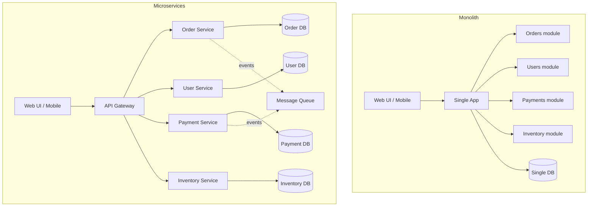
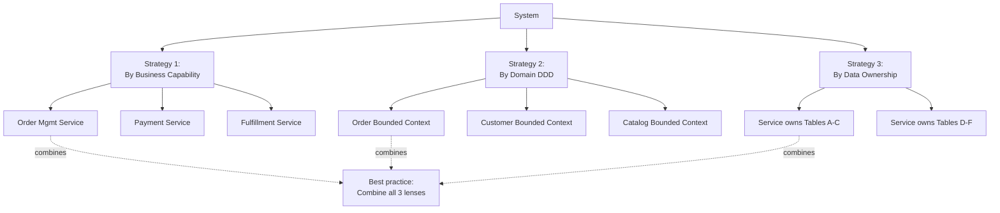
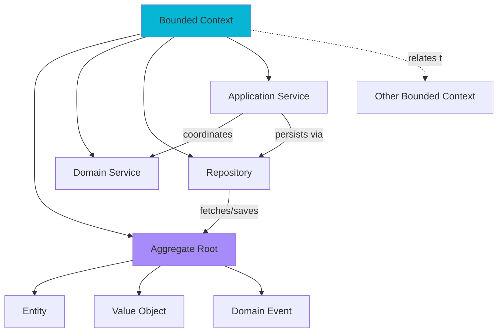
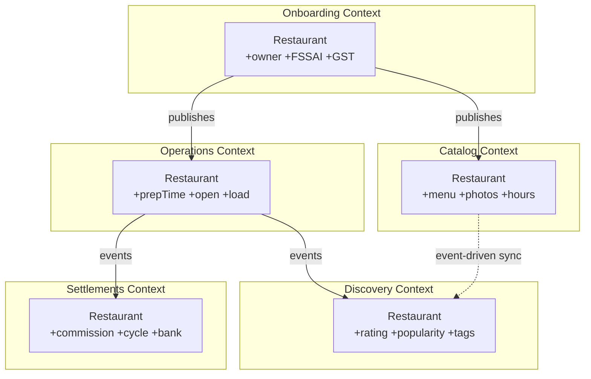
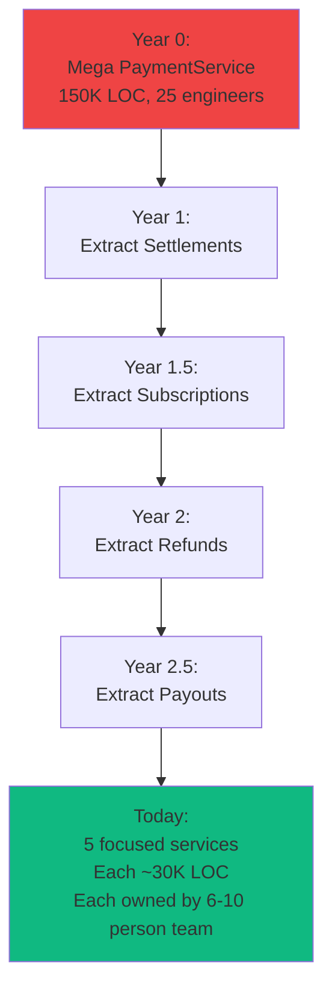

# Microservices

> Monolith se microservices tak — DDD, bounded contexts, communication, resilience, Saga, observability, deployment. Production-grade patterns.

**Difficulty:** Advanced  ·  **Estimated:** 40h  ·  **Topics:** 5

---

## Core concepts & decomposition

### Microservices vs Monolith

#### Kya hai? — What are microservices vs monoliths?

Monolith — entire application ek single deployable unit me. Saari features (orders, payments, users, inventory) ek hi codebase, ek hi process, ek hi DB. Build ek JAR, deploy ek server.

Microservices — application split into small independent services. Har service apna codebase, apna process, often apni DB. Network ke through communicate karte hain (REST, gRPC, message queue). Each service independently deployable.

Real-life analogy: monolith ek bada general store hai — sab kuch ek hi shop me bechte hain. Microservices ek mall hai — alag-alag specialized shops, har ek apna business chalata hai, but together ek complete experience dete hain.

Beginner ke liye yaad rakh: microservices solution to scaling/team/deployment problems. Default monolith hai. Microservices complexity add karte hain — sirf jab monolith genuinely break ho rahi ho.

#### Kyun zaroori hai? — When microservices over monolith?

Monolith ka pain points jo microservices solve karte hain:

1) Scaling: monolith poora scale up karna padta hai even agar sirf payment module bottleneck ho. Microservices: payment service alag scale, baaki untouched. Cost-efficient at scale.

2) Team independence: 100-developer monolith me merge conflicts, coordination overhead. Microservices: 5-person team ek service own karti hai, independent deployment. Conway's Law in action.

3) Technology diversity: monolith me ek language stack (e.g., Java + Postgres). Microservices: ML team Python use kare, payments Go ya Java, frontend Node.js. Right tool for each job.

4) Failure isolation: monolith me ek bug poori app crash kara sakta hai. Microservices: payment service down hua, browsing still works. Resilience.

5) Deployment velocity: monolith me ek-line bug fix bhi entire app redeploy. Microservices: only affected service redeploy. Frequent, low-risk releases.

Microservices ke costs (genuine):

1) Operational complexity: 1 monolith vs 50 services to monitor, log, deploy, debug. Need DevOps maturity.

2) Network latency + failures: in-process call vs HTTP call. New failure modes (timeouts, retries, partial failures).

3) Distributed transactions: monolith me single DB transaction. Microservices: cross-service consistency hard. Saga, eventual consistency.

4) Testing complexity: integration tests need multiple services running. Contract testing, end-to-end orchestration.

5) Initial development overhead: more boilerplate, more config, more infra.

When NOT to start with microservices: small team (< 10 devs), early-stage startup, unclear domain boundaries. Monolith first → split later when pain points clear.

#### Kaise kaam karta hai? — Migration path + decision framework

Most successful microservices systems started as monoliths and EVOLVED. Famous example: Amazon, Netflix, Uber — all started monolithic, split when bottlenecks emerged.

Decision framework — split when:

- Module has clear bounded context (e.g., billing has different domain language than catalog).

- Team grows beyond 8-10 people on one service.

- Different scaling requirements (search needs 10x compute vs user-mgmt).

- Different deployment cadence (payments deploys daily, admin once a month).

- Independent technology needs (ML pipeline needs Python, rest can be Java).

Don't split when:

- Team < 10 people total — coordination overhead exceeds benefit.

- Bounded contexts unclear — premature splits cause endless refactoring.

- All modules scale same way — no scaling benefit.

Strangler pattern (Martin Fowler's famous pattern):

1) Identify bounded context to extract.

2) Build new microservice alongside monolith.

3) Route specific traffic to new service via API gateway / proxy.

4) Gradually migrate functionality (and DB tables).

5) Remove old code from monolith once 100% traffic is on new service.

Common pitfall: 'distributed monolith' — split into services but they're tightly coupled (sync calls everywhere, shared DB, deploy together). Worst of both worlds. True microservices need autonomy.

```java
// MONOLITH style — single project, all features together
@Service
public class OrderService {
    private final UserRepository userRepo;       // direct DB call
    private final InventoryRepository invRepo;
    private final PaymentService paymentSvc;    // direct method call
    private final NotificationService notifSvc;

    @Transactional   // single DB transaction across everything
    public Order placeOrder(OrderRequest req) {
        User user = userRepo.findById(req.getUserId());        // SQL query
        invRepo.reserve(req.getItems());                        // SQL query
        Payment p = paymentSvc.charge(user, req.getAmount());  // method call
        notifSvc.sendConfirmation(user.getEmail());            // method call

        Order order = new Order(user, req.getItems(), p);
        return orderRepo.save(order);
    }

    private OrderRepository orderRepo;
}

// MICROSERVICES style — separate services, network calls
@Service
public class OrderService {
    private final UserClient userClient;          // HTTP call to user service
    private final InventoryClient invClient;     // HTTP call to inventory
    private final PaymentClient paymentClient;   // HTTP call to payment
    private final NotificationProducer notifProducer;  // publish to message queue
    private final OrderRepository orderRepo;     // OWN DB

    public Order placeOrder(OrderRequest req) {
        // No single transaction across services — eventual consistency
        UserDto user = userClient.fetchUser(req.getUserId());        // HTTP
        invClient.reserveItems(req.getItems());                        // HTTP

        // Payment may take seconds — handle async
        PaymentInitResult initResult = paymentClient.initiate(user, req.getAmount());

        Order order = new Order(user, req.getItems(),
                                 initResult.getPaymentId(), OrderStatus.PENDING);
        Order saved = orderRepo.save(order);

        // Publish event — other services react asynchronously
        notifProducer.publishEvent(new OrderPlacedEvent(saved.getId(), user.getEmail()));

        return saved;
    }
}

class User { public String getEmail() { return ""; } }
class UserDto { public String getEmail() { return ""; } }
class Order {
    Order(Object u, Object items, Object p) {}
    Order(Object u, Object items, String pId, OrderStatus s) {}
}
enum OrderStatus { PENDING, CONFIRMED, FAILED }
class OrderRequest {
    public String getUserId() { return ""; }
    public Object getItems() { return null; }
    public long getAmount() { return 0; }
}
class Payment {}
class PaymentInitResult { public String getPaymentId() { return ""; } }
class OrderPlacedEvent {
    OrderPlacedEvent(Object id, String email) {}
}
interface UserRepository { User findById(String id); }
interface InventoryRepository { void reserve(Object items); }
interface OrderRepository { Order save(Order o); }
interface PaymentService { Payment charge(User u, long amount); }
interface NotificationService { void sendConfirmation(String email); }
interface UserClient { UserDto fetchUser(String id); }
interface InventoryClient { void reserveItems(Object items); }
interface PaymentClient { PaymentInitResult initiate(UserDto u, long amount); }
interface NotificationProducer { void publishEvent(Object event); }
```

#### Real-life example — Real-life example — Swiggy's monolith-to-microservices journey

Swiggy started as a monolith — one Rails app handling restaurants, orders, delivery, users, payments. Worked fine at 1000 orders/day.

At 100K orders/day, problems emerged: deploy takes 30 min, peak-time scaling expensive (whole monolith scaled), one bug crashes everything, 50+ devs me code review/merge nightmare.

Migration approach (Strangler pattern):

1) Started extracting payments first — clear bounded context, regulatory needs (PCI compliance). Payment service in Go, behind API gateway.

2) Then extracted delivery routing — different scaling (real-time GPS streams), different team (mapping experts).

3) Restaurant catalog — different read/write patterns (cached aggressively), different team.

4) Order service core remained — eventually broken into order-create, order-tracking, order-fulfillment.

Result: 100+ microservices today. Each scales independently. Different teams own different services. Tech stack diverse — Go, Java, Python, Node.js per service.

Lesson: didn't 'big bang' rewrite. Gradually carved out clear contexts. Each extraction proved value before next. 5+ year journey.

#### Visual — Monolith vs Microservices architecture



#### Interview question — Common interview question

**Q:** When would you choose monolith over microservices in 2026? 'Distributed monolith' anti-pattern kya hota hai aur kaise avoid karoge?

> Monolith over microservices — counterintuitive but realistic answer:
> Monolith makes sense when:
> 1) Small team (< 10 devs total). Coordination overhead of 50 microservices for 5 people is overkill. Single monolith easier to understand, debug, deploy.
> 2) Early-stage product. Domain boundaries unclear — what's a 'user', what's an 'account'? Splitting prematurely creates wrong boundaries you'll fight forever.
> 3) Modest scale. < 10K daily active users, < 1M requests/day. Monolith handles this comfortably. Optimize when bottleneck appears.
> 4) Single language/tech stack works for all features. No genuine need for polyglot.
> 5) Limited DevOps maturity. Microservices need observability, CI/CD per service, container orchestration, service mesh. If team can't operate this, monolith wins.
> Modular monolith trend (modern alternative):
> Monolith with strong INTERNAL module boundaries — separate modules, separate packages, no direct DB access between modules. Communicate through interfaces only.
> Pros of microservices (clear boundaries, independent dev) WITHOUT cost (network, distributed transactions, deployment complexity).
> Famous proponents: Shopify (Ruby modular monolith), Stack Overflow. They've consciously stayed with monolith despite scale.
> When to migrate to microservices: clear pain points emerge — specific module needs different scaling, team size makes coordination painful, deployment cadence diverges.
> Now distributed monolith anti-pattern:
> Distributed monolith = microservices that are tightly coupled, lose all microservices benefits but pay all costs.
> Smell signs:
> 1) Synchronous chains. Order Service → User Service → Payment Service → Notification — sequential blocking calls. One service slow → entire chain slow. One down → entire flow down.
> 2) Shared database. Multiple services reading/writing same tables. Schema changes affect all of them. Worst — they directly query each other's tables.
> 3) Coupled deployments. Service A's new feature requires Service B redeploy. Have to coordinate releases like monolith deploys.
> 4) Shared libraries with business logic. Versioning hell — service A on v2, service B on v1, breaking changes propagate everywhere.
> 5) Synchronous transactions across services. Two-phase commit, distributed locks. Performance + reliability disaster.
> How to avoid:
> 1) Asynchronous communication where possible. Events over direct calls. Order placed → event → other services react. Order service doesn't wait for payment to complete.
> 2) Database per service. Strict ownership. Service A NEVER queries Service B's DB. Communication only via API.
> 3) Event-driven architecture. Decouple flows. Order service publishes 'order placed', notification + analytics + inventory all listen independently.
> 4) Versioned APIs with backward compatibility. New version of API doesn't break existing consumers. Multiple versions supported simultaneously.
> 5) Bounded contexts done right. Each service has clear domain — minimal cross-service workflows in critical path.
> 6) Saga pattern for distributed workflows. Rather than 2PC, compensating transactions. Reservation expires, refund automatic.
> Real production scenario: Razorpay payment microservices well-designed. Order placed → publishes event → fraud check, audit, ML scoring, settlement scheduling — all independent reactors. Payment service doesn't wait for any of them. If fraud check service down, payment still flows; fraud check catches up later. True async decoupling.
> Anti-pattern in same domain: an early version had OrderService synchronously calling FraudService synchronously calling RiskMLService. 800ms p99 latency just from chain. Refactored to event-driven — 100ms p99, FraudService results streamed asynchronously. 8x improvement.
> Modern guidance: start monolith. Or modular monolith. Migrate to microservices ONLY when clear pain points emerge. When you do migrate, make services genuinely autonomous — async-first, own database, independently deployable. Otherwise you have all the cost without the benefit.
> [Difficulty: Hard · Asked at: Amazon, Microsoft, Razorpay, Swiggy, Atlassian. Follow-ups: 'Modular monolith vs microservices?', 'When does Conway's Law force architecture decisions?']

### Service decomposition strategies

#### Kya hai? — What is service decomposition?

Service decomposition matlab system ko microservices me kaise divide karna. Wrong decomposition = chatty services, tight coupling, distributed monolith. Right decomposition = autonomous services that scale, deploy, evolve independently.

Three main strategies:

1) Decompose by business capability — each service covers one business function (orders, payments, users, inventory).

2) Decompose by domain (DDD-driven) — services align with bounded contexts (next subtopic).

3) Decompose by data — services own their data, decomposition follows data ownership.

Beginner ke liye yaad rakh: decomposition is critical decision. Wrong cuts mean services that can't act independently. Industry famous quote: 'You don't choose microservice architecture for fun — you choose it because monolith is killing you. Choose decomposition seriously.'

#### Kyun zaroori hai? — Why decomposition strategy matters?

Independence: services should be able to evolve, deploy, scale independently. Bad decomposition kills this — change in one forces changes in many.

Team alignment: Conway's Law — system architecture mirrors team structure. Service boundaries align with team boundaries. 'You build it, you run it'. Misaligned boundaries → constant cross-team coordination.

Performance: chatty services (lots of cross-service calls) = network overhead. Right boundaries minimize cross-service traffic for common operations.

Data ownership: each service owns specific data. Without clear ownership, two services modify same data = inconsistencies, race conditions, debugging nightmare.

Domain alignment: services match how business thinks. Marketing team talks 'campaigns', engineering builds 'campaign service'. Vocabulary alignment reduces translation overhead.

#### Kaise kaam karta hai? — Decomposition strategies + criteria

Strategy 1: Decompose by business capability

Identify business capabilities — what does the company DO? Order management, payment processing, customer onboarding, fulfillment, etc. Each capability = candidate service.

Pros: maps to business model. Stable — capabilities change less than tech. Good for greenfield.

Cons: capabilities can be too coarse. 'Order management' might still be too big internally.

Strategy 2: Decompose by domain (DDD)

Use Domain-Driven Design. Identify bounded contexts — areas where domain language is consistent. Each bounded context → service.

Pros: handles complex domains well. Aligns with how experts think.

Cons: requires domain expertise to identify contexts. Up-front investment in domain modeling.

Strategy 3: Decompose by data ownership

Each microservice owns specific data tables. No two services share tables. Decompose along data lines.

Pros: clear ownership. Forces thinking about data boundaries.

Cons: data shapes don't always match service boundaries. Joins across services needed sometimes.

In practice: combine all three. Start with business capabilities. Apply DDD to clarify boundaries. Verify data ownership clean.

Decomposition criteria checklist:

✓ Service has single, clear responsibility

✓ Owns its data exclusively

✓ Independently deployable

✓ Team-sized (one team can own end-to-end)

✓ Common operations don't span many services

✓ Failure isolated (one service down doesn't cascade)

✓ Independent scaling profile

Anti-patterns:

✗ 'Microservice per database table' — too granular, chatty

✗ 'Microservice per UI screen' — UI-driven not domain-driven

✗ 'Microservice per developer' — premature, over-fragmented

```yaml
# Razorpay-style microservices decomposition

# Business capability mapping:
business_capabilities:
  - name: payment_processing
    services:
      - payment-service        # accepts payments, status tracking
      - gateway-routing-service  # routes to specific gateway based on rules
      - fraud-detection-service  # ML-based fraud scoring
      - settlement-service      # T+N settlement to merchant banks

  - name: customer_management
    services:
      - customer-service       # customer profiles
      - kyc-service           # KYC verification, regulatory compliance

  - name: financial_operations
    services:
      - reconciliation-service # daily reconciliation
      - reporting-service     # merchant dashboards, reports
      - tax-service           # GST calculation, invoicing

  - name: integrations
    services:
      - bank-connector-service # bank API integrations
      - notification-service  # SMS/email/webhook
      - audit-service         # immutable audit log

# Each service owns specific data:
data_ownership:
  payment-service:
    tables: [payments, payment_methods, payment_attempts]
  customer-service:
    tables: [customers, customer_addresses]
  fraud-detection-service:
    tables: [fraud_signals, fraud_rules, fraud_scores]
  settlement-service:
    tables: [settlements, settlement_batches]
  audit-service:
    tables: [audit_log]      # write-only, never modified

# Communication patterns:
communication:
  sync_calls:                # use sparingly
    - payment-service → fraud-detection-service  # real-time score
    - payment-service → gateway-routing-service  # which gateway?
  async_events:              # default for cross-service
    - payment-service → settlement-service      # payment.captured event
    - payment-service → notification-service    # payment.completed
    - payment-service → audit-service          # all events
    - payment-service → reconciliation-service # daily batch

# Team alignment:
team_ownership:
  payments_team: [payment-service, gateway-routing-service]
  ml_platform_team: [fraud-detection-service]
  compliance_team: [kyc-service, audit-service]
  operations_team: [settlement-service, reconciliation-service]
  growth_team: [reporting-service, notification-service]
```

#### Real-life example — Real-life example — Flipkart catalog decomposition done wrong then right

Flipkart's first attempt at catalog microservices: split by data tables. Product service, Image service, Specification service, Variant service, Pricing service, Inventory service. Looked clean.

Problem in production: showing single product page = 6 service calls in parallel. Latency p99 jumped from 200ms (monolith) to 1.2s (microservices). Plus failure mode bad — any one service slow → product page slow.

Wrong reasoning: 'each table = service'. Over-decomposition. Common operations crossed too many service boundaries.

Refactored decomposition (lesson learned):

- Catalog service — owns product, image, specification, variants together (all needed for product display).

- Pricing service — owns pricing logic (different team, different update cadence, different scale).

- Inventory service — owns stock counts (real-time updates, different scaling).

- Search service — owns search index (different storage, ElasticSearch).

Now product page = 1 service call (catalog returns everything needed) + maybe parallel pricing/inventory calls. p99 back to 250ms. Failure modes acceptable — pricing down, show 'price unavailable' but page works.

Lesson: decompose by capability + data ownership, not naive per-table. Common access patterns guide boundaries.

#### Visual — Decomposition strategies



#### Interview question — Common interview question

**Q:** Greenfield project me tu kaise decide karega service boundaries? Common decomposition mistakes aur unke symptoms — production me kaise spot karoge?

> Greenfield decomposition decision process:
> Step 1: Don't start with microservices. Period. Start monolith ya modular monolith. 6-12 months me domain clear hoti hai. Premature decomposition almost always wrong cuts.
> Step 2: Identify pain points before splitting. Specific problems forcing the split:
> - 'Order processing 10x more traffic than rest, scaling whole monolith expensive.'
> - 'Payments team needs PCI compliance — separate codebase + infra mandatory.'
> - 'Search needs ElasticSearch + ML team using Python — Java monolith doesn't fit.'
> - 'Mobile team needs different deploy cadence than backend — coupling slows them.'
> If you can't articulate specific pain, don't split.
> Step 3: Apply lenses:
> - Business capability: what does the org DO? Each capability = candidate service.
> - DDD bounded contexts: where does domain language change? 'Order' might mean different things in fulfillment vs analytics.
> - Data ownership: which data needs to stay together? Frequently joined data shouldn't span services.
> - Team structure: who would own this service end-to-end?
> - Scaling profile: does this part scale differently?
> Step 4: Sanity check candidate boundaries:
> Q: Can common user journey complete with 1-2 service calls?
> Q: Can each service deploy independently?
> Q: Does each service own its data exclusively?
> Q: Can each service team make decisions autonomously?
> Q: Is failure isolated?
> If any answer is no, boundaries probably wrong.
> Step 5: Start with coarse-grained services. 5 well-designed services > 50 fragmented ones. Refactor finer-grained later if needed. Easier to split than merge.
> Common decomposition mistakes + production symptoms:
> MISTAKE 1: Per-table services (over-decomposition).
> Symptom: simple operations require 5+ service calls. Latency jumps. p99 dominated by network overhead.
> Fix: combine services that are always called together. If A and B are always queried jointly, they belong together.
> MISTAKE 2: Shared database among 'separate' services.
> Symptom: schema migrations need coordinated deploys. Two services deadlock on same row. Direct table queries from another service.
> Fix: each service owns its tables. Cross-service data access only via API calls. Data duplication if needed (with eventual consistency).
> MISTAKE 3: Synchronous chains.
> Symptom: single user request creates serialized HTTP call chain across 5+ services. p99 latency = sum of all services. Any one slow → all slow.
> Fix: async events. Order placed → events → reactors. Order service doesn't wait. Use Kafka/RabbitMQ.
> MISTAKE 4: Wrong bounded contexts.
> Symptom: same business concept (e.g., 'Order') has DIFFERENT models in different services causing translation hell. APIs constantly evolving to align.
> Fix: invest in DDD. Identify true bounded contexts. Same name might be different concepts (Order in fulfillment context vs Order in analytics context — both legitimate).
> MISTAKE 5: UI-driven services.
> Symptom: every UI screen has corresponding microservice. Adding new UI feature = new microservice + 5 service calls.
> Fix: services align with domain capabilities, not UI. Use API gateway / BFF (Backend For Frontend) pattern to aggregate for UI.
> MISTAKE 6: Data joins across services.
> Symptom: reports require data from 5 services. Queries are slow, complex, often inconsistent.
> Fix: events + materialized views. Each event updates a read-optimized data store. Reporting queries that store, not source services. CQRS pattern.
> MISTAKE 7: Shared business logic libraries.
> Symptom: changing 'TaxCalculator' library forces all services to redeploy. Different services on different versions causes bugs.
> Fix: business logic should live in owning service. Shared libraries only for cross-cutting (logging, observability, security plumbing) — not business logic.
> Real production debugging story: Razorpay early payment service had decomposition where 'fee calculator' was shared library. Different services calculated fees inconsistently when library evolved. Refactored to fee-calculation-service — single source of truth, called via API. Inconsistencies eliminated.
> Final rule: bounded contexts > technology > organizational structure > data shape. In that priority. Don't let your DB schema dictate microservice boundaries. Don't let team structure dictate (might evolve). Domain boundaries are most stable.
> [Difficulty: Hard · Asked at: Amazon, Microsoft, Razorpay, Atlassian, Swiggy, Flipkart. Follow-ups: 'BFF pattern kya hai?', 'Conway's Law in microservice context kaise apply karta hai?']

### Domain-Driven Design basics

#### Kya hai? — What is Domain-Driven Design (DDD)?

DDD ek software design methodology hai jo Eric Evans ne 2003 me popularize ki. Core idea: software should reflect the BUSINESS domain it represents. Code structure mirrors how business experts think.

Key concepts:

1) Ubiquitous language — business + tech team same vocabulary use karein. 'Order' code me bhi 'Order' hai, business meeting me bhi.

2) Domain model — code structures (classes, methods) match domain concepts. Customer.cancel(reason) is meaningful, customer.setStatus('CANCELLED') is not.

3) Bounded context — same word may mean different things in different contexts. 'Account' in banking = bank account, 'Account' in marketing = customer profile. Different models in each.

4) Aggregates, entities, value objects — types of domain objects with specific characteristics.

Beginner ke liye yaad rakh: DDD complex domains ke liye hai. Simple CRUD apps me DDD overkill. Microservices design me DDD essential — bounded contexts naturally become services.

#### Kyun zaroori hai? — Why DDD for microservices?

Without DDD: technical teams build what they understand. Business stakeholders can't recognize their domain in code. Translation overhead in every meeting. Code feels disconnected from reality.

With DDD: code is a model of business. Stakeholders can understand high-level. Business changes map clearly to code changes. Reduced translation overhead.

For microservices specifically: bounded contexts naturally suggest service boundaries. Wrong boundaries = chatty services. Right boundaries (DDD-derived) = autonomous services.

Domain knowledge captured: senior engineers leave, but domain model in code preserves understanding. New engineers ramp faster.

Trade-off: DDD requires investment. Domain modeling sessions, ubiquitous language workshops, refactoring as understanding deepens. Pays off for complex domains, overhead for simple ones.

#### Kaise kaam karta hai? — Core DDD building blocks

Tactical patterns (within a bounded context):

1) Entity — has identity that persists over time. Customer entity — same customer over years even if attributes change. equals() based on ID, not attributes.

2) Value object — defined by attributes, no identity. Money(100, 'INR') — two instances with same value are interchangeable. Immutable. equals() based on values.

3) Aggregate — cluster of entities + values treated as single unit. Has aggregate ROOT (the entry point). e.g., Order aggregate = Order entity + OrderItem entities + Money values. Operations go through Order (root). External code doesn't manipulate OrderItems directly.

4) Domain service — operations that don't naturally belong to a single entity. e.g., FundsTransferService operates on two Account aggregates.

5) Domain event — something significant happened in the domain. OrderPlaced, PaymentCaptured, ShipmentDispatched. Used for cross-aggregate / cross-context communication.

6) Repository — abstraction for fetching/persisting aggregates. CustomerRepository.findById(...). Hides DB.

Strategic patterns (across bounded contexts):

1) Bounded context — explicit boundary where a domain model applies. Outside that boundary, model doesn't make sense.

2) Context map — how different bounded contexts relate. Customer-Supplier, Conformist, Anti-Corruption Layer, Shared Kernel, etc.

3) Anti-Corruption Layer (ACL) — translation layer between contexts. Prevents one context's model polluting another.

Ubiquitous language workshops:

Bring business + tech together. Define every key term. Document. Update as understanding evolves. Code reflects this language directly.

```java
// DDD example — Razorpay payment domain

// VALUE OBJECT — no identity, defined by values
public record Money(long amountInPaise, String currency) {
    public Money {
        if (amountInPaise < 0) throw new IllegalArgumentException("Negative amount");
        if (currency == null || currency.length() != 3) {
            throw new IllegalArgumentException("Invalid currency");
        }
    }

    public Money add(Money other) {
        if (!currency.equals(other.currency)) {
            throw new IllegalArgumentException("Currency mismatch");
        }
        return new Money(amountInPaise + other.amountInPaise, currency);
    }

    public Money subtract(Money other) {
        if (!currency.equals(other.currency)) {
            throw new IllegalArgumentException("Currency mismatch");
        }
        return new Money(amountInPaise - other.amountInPaise, currency);
    }
}

// ENTITY — has identity (paymentId)
public class Payment {
    private final String paymentId;       // identity
    private final String customerId;
    private final Money amount;            // value object
    private PaymentStatus status;
    private final List<DomainEvent> events = new ArrayList<>();

    public Payment(String paymentId, String customerId, Money amount) {
        this.paymentId = paymentId;
        this.customerId = customerId;
        this.amount = amount;
        this.status = PaymentStatus.CREATED;
        this.events.add(new PaymentCreatedEvent(paymentId, customerId, amount));
    }

    // Domain method — business operation, not a setter
    public void authorize(String gatewayReference) {
        if (status != PaymentStatus.CREATED) {
            throw new IllegalStateException(
                "Cannot authorize payment in state " + status);
        }
        this.status = PaymentStatus.AUTHORIZED;
        this.events.add(new PaymentAuthorizedEvent(paymentId, gatewayReference));
    }

    public void capture() {
        if (status != PaymentStatus.AUTHORIZED) {
            throw new IllegalStateException(
                "Cannot capture payment in state " + status);
        }
        this.status = PaymentStatus.CAPTURED;
        this.events.add(new PaymentCapturedEvent(paymentId, amount));
    }

    public void fail(String reason) {
        this.status = PaymentStatus.FAILED;
        this.events.add(new PaymentFailedEvent(paymentId, reason));
    }

    // Identity-based equals (entity)
    @Override
    public boolean equals(Object o) {
        if (this == o) return true;
        if (!(o instanceof Payment p)) return false;
        return Objects.equals(paymentId, p.paymentId);
    }

    @Override
    public int hashCode() {
        return Objects.hash(paymentId);
    }

    public List<DomainEvent> pullEvents() {
        List<DomainEvent> pulled = new ArrayList<>(events);
        events.clear();
        return pulled;
    }
}

// AGGREGATE ROOT — Refund aggregate root
// Refund encompasses RefundLineItem (sub-entity) + Money (value)
public class Refund {
    private final String refundId;
    private final String paymentId;
    private final List<RefundLineItem> items = new ArrayList<>();
    private RefundStatus status;
    private final List<DomainEvent> events = new ArrayList<>();

    public Refund(String refundId, String paymentId) {
        this.refundId = refundId;
        this.paymentId = paymentId;
        this.status = RefundStatus.INITIATED;
    }

    // External code MUST go through aggregate root
    public void addLineItem(String orderItemId, Money amount, String reason) {
        if (status != RefundStatus.INITIATED) {
            throw new IllegalStateException("Cannot add items to " + status);
        }
        items.add(new RefundLineItem(orderItemId, amount, reason));
    }

    public Money totalAmount() {
        return items.stream()
            .map(RefundLineItem::amount)
            .reduce(new Money(0, "INR"), Money::add);
    }

    public void process() {
        // Domain logic — root coordinates
        if (items.isEmpty()) {
            throw new IllegalStateException("Cannot process empty refund");
        }
        this.status = RefundStatus.PROCESSING;
        this.events.add(new RefundInitiatedEvent(refundId, totalAmount()));
    }
}

// SUB-ENTITY — only accessed via aggregate root
record RefundLineItem(String orderItemId, Money amount, String reason) {}

// DOMAIN EVENTS
sealed interface DomainEvent permits
    PaymentCreatedEvent, PaymentAuthorizedEvent, PaymentCapturedEvent,
    PaymentFailedEvent, RefundInitiatedEvent {}

record PaymentCreatedEvent(String paymentId, String customerId, Money amount)
    implements DomainEvent {}
record PaymentAuthorizedEvent(String paymentId, String gatewayRef)
    implements DomainEvent {}
record PaymentCapturedEvent(String paymentId, Money amount)
    implements DomainEvent {}
record PaymentFailedEvent(String paymentId, String reason)
    implements DomainEvent {}
record RefundInitiatedEvent(String refundId, Money amount)
    implements DomainEvent {}

enum PaymentStatus { CREATED, AUTHORIZED, CAPTURED, FAILED }
enum RefundStatus { INITIATED, PROCESSING, COMPLETED, FAILED }
```

#### Real-life example — Real-life example — Razorpay subscription billing domain modeling

Razorpay subscriptions complex hai — plans, subscriptions, billing cycles, invoices, retries, dunning. Naive 'CRUD per table' approach quickly becomes mess.

DDD approach:

1) Ubiquitous language workshop — defined: 'Plan' (template), 'Subscription' (active customer commitment), 'BillingCycle' (one period of subscription), 'Invoice' (charge for one cycle), 'Dunning' (sequential retries on failure).

2) Bounded contexts:

- Subscription Management — manages plans, active subscriptions, lifecycle.

- Billing — handles invoice generation, charging, dunning.

- Reporting — read-optimized view of subscription/billing data.

3) Aggregates:

- Subscription aggregate (root) + BillingCycle entities.

- Invoice aggregate (root) + LineItem entities + Money values.

- DunningSchedule aggregate (root) + RetryAttempt entities.

4) Domain events:

- SubscriptionStarted, SubscriptionRenewed, SubscriptionCancelled.

- InvoiceGenerated, InvoicePaid, InvoiceFailed.

- DunningTriggered, DunningEscalated, DunningGivenUp.

Result: code reads like business document. New product manager can read Subscription class and understand business rules. Adding new feature (e.g., 'free trial period') = new domain concept in right aggregate. Microservices boundaries naturally aligned to bounded contexts.

#### Visual — DDD building blocks



#### Interview question — Common interview question

**Q:** Aggregate root pattern kya hai aur kyu important hai? DDD apply karne se pehle tu kaise decide karega ki domain complex enough hai?

> Aggregate root pattern — DDD ka core building block. Defines transactional consistency boundaries.
> Aggregate = cluster of related domain objects (entities + value objects) that should be treated as a single unit. e.g., Order aggregate includes Order entity, OrderLineItem entities, ShippingAddress value object.
> Aggregate ROOT = single entity that's the entry point. External code can only reference the root, never internal entities directly. Order is root; OrderLineItems accessible only via Order.
> Why aggregate root pattern?
> 1) Consistency boundary. Within an aggregate, transactions ensure invariants. Outside aggregate, eventual consistency. e.g., Order.totalAmount must equal sum of OrderLineItem amounts — invariant. Adding/removing items goes through Order, which recalculates. External code can't modify items independently and break this.
> 2) Encapsulation. Internal structure hidden. Order.addItem(...) controls how items are added — validates capacity, applies discounts, recomputes totals. External code can't bypass this with direct OrderLineItem.save().
> 3) Locking + concurrency. Single root = single point for optimistic locking. version field on Order. Concurrent modifications fail predictably.
> 4) Repository simplicity. One repository per aggregate. OrderRepository.save(order) — saves entire aggregate (root + children). No OrderLineItemRepository — would break encapsulation.
> 5) Cross-aggregate references by ID only. Order doesn't hold reference to Customer entity — holds customerId. Crossing aggregate = crossing transaction boundary.
> Aggregate design rules:
> - Keep aggregates small. Big aggregates = lock contention, slow updates. Aim for 1-3 entities + values typically.
> - One aggregate per transaction. Don't update Order and Customer in same transaction. Use events.
> - Reference other aggregates by ID only. Order has customerId (Long), not Customer (entity).
> - Aggregate boundary = consistency boundary. Within: ACID. Across: eventual consistency.
> Anti-pattern: 'God aggregate' — Customer aggregate that has Orders, Payments, Refunds, Sessions all inside. Becomes huge. Lock contention. Refactor — these are separate aggregates referenced by ID.
> When to apply DDD vs not:
> Apply DDD when:
> 1) Complex business domain. Banking, insurance, healthcare, payments, supply chain, telecom. Domain has its own language and rules that go beyond simple CRUD.
> 2) Long-lived product. Investment in domain modeling pays back over years. Throwaway prototypes don't need DDD.
> 3) Cross-functional teams. Business + tech collaboration intensive. DDD provides shared vocabulary.
> 4) Microservices target. Bounded contexts give natural service boundaries.
> 5) Domain experts available. DDD requires deep domain knowledge. Without business expert engagement, just buzzwords.
> DON'T apply DDD when:
> 1) Simple CRUD app. Form-based UI mapping to DB tables. Overengineering.
> 2) Domain unclear. Early-stage product, pivots happening. Wait until domain stabilizes.
> 3) Small team without domain experts. DDD without expert input = wrong abstractions.
> 4) Performance-first apps. DDD adds layers (repositories, application services). For ultra-low-latency code, simpler structures faster.
> 5) Generic infrastructure. Logging library, HTTP framework — no business domain. DDD irrelevant.
> Decision heuristic: explain the business to a non-technical friend. Does it sound complex with specific rules and exceptions? DDD likely helps. Does it sound like 'create user, create order, list orders'? Simple CRUD is fine.
> Modern reality check: full DDD heavy. Most teams adopt 'lite DDD' — ubiquitous language, value objects, aggregate roots, domain events. Skip strategic patterns until truly needed (multiple bounded contexts emerge organically).
> Real production scenario: Razorpay's KYC service. Domain extremely complex — different KYC requirements for individuals vs businesses, different compliance levels (Aadhaar, PAN, GST, bank statements), state machines per document type, regulatory deadlines. Heavy DDD application. Each KYC type as separate aggregate. Domain events drive workflow. Domain language matches RBI regulations literally.
> Counter-example: same Razorpay's notification service. Just send email/SMS based on event. Simple CRUD with templates. Zero DDD. Right level of complexity for the problem.
> [Difficulty: Hard · Asked at: Amazon, Microsoft, Atlassian, Razorpay, Goldman Sachs. Follow-ups: 'Anti-Corruption Layer kya hai?', 'CQRS aur DDD ka relation kya hai?']

### Bounded contexts

#### Kya hai? — What is a bounded context?

Bounded context ek explicit boundary hai jisme ek specific domain model apply hota hai. Outside that boundary, the model doesn't make sense — terms might mean different things, operations might not exist.

Real-life analogy: 'Customer' word le. Sales team ke liye 'Customer' = potential buyer + lead source + sales pipeline stage. Support team ke liye 'Customer' = ticket count + satisfaction score + active subscriptions. Same word, completely different mental models.

DDD says: don't force one mega-model. Sales bounded context me Customer is one thing. Support bounded context me Customer is different thing. Both legitimate. Don't unify.

Beginner ke liye yaad rakh: bounded contexts almost always = microservice boundaries. Right contexts = autonomous services. Wrong contexts = distributed monolith.

#### Kyun zaroori hai? — Why bounded contexts matter?

Without bounded contexts: 'Customer' must be one model that satisfies all teams. Result: God class with 50 fields, 20 of which are relevant per use case. Teams fight over field changes.

With bounded contexts: each team owns its model. Sales has its Customer optimized for sales workflows. Support has its Customer optimized for ticket handling. Independent evolution.

Microservices alignment: each bounded context → one service. Service ownership clear. Service team owns its model entirely. No cross-service model bleeding.

Reduced translation overhead: within a context, vocabulary is consistent. New team member ramp-up faster — they learn ONE Customer model, not the union of all interpretations.

Failure isolation at conceptual level: marketing's Customer model changes don't break support workflow. Different evolution speeds tolerated.

#### Kaise kaam karta hai? — Identifying contexts + context mapping

Identifying bounded contexts:

1) Listen to language. Where do same terms have different meanings? 'Order', 'Account', 'Product' — often span contexts.

2) Watch team boundaries. Different teams using same words differently = strong signal.

3) Notice translation layers. If one team's data needs significant transformation for another team's use, contexts boundary.

4) Identify business processes. Each high-level process (order placement, customer support, financial reconciliation) often = its own bounded context.

Context mapping patterns (how contexts relate):

1) Shared Kernel — two contexts share a small piece of model (e.g., User ID). Tight coupling on that piece. Use sparingly.

2) Customer-Supplier — upstream (supplier) provides data, downstream (customer) consumes. Clear directional dependency.

3) Conformist — downstream just accepts upstream's model as-is. Simple but couples downstream to upstream's evolution.

4) Anti-Corruption Layer (ACL) — downstream wraps upstream API in a translation layer. Protects downstream model from upstream's changes/quirks.

5) Open Host Service — upstream provides clean public API. Multiple consumers can adopt it. Common for shared microservices.

6) Published Language — well-documented format consumers integrate against (REST API spec, event schema).

7) Separate Ways — two contexts intentionally don't integrate. Independent.

Practical: don't try to identify all contexts upfront. Start with a few clear ones. Refactor as understanding deepens.

Microservices = bounded contexts: rule of thumb. One service = one context. Multiple aggregates can be in same context. Don't split context across services.

```java
// Razorpay-style bounded contexts illustrated

// ============ PAYMENT bounded context ============
// 'Customer' here = entity making payment, with payment methods
package com.razorpay.payment.domain;

public class Customer {
    private final String customerId;
    private final String email;
    private final List<PaymentMethod> savedMethods;
    private RiskScore riskScore;
    // Focus: payment-related attributes

    public boolean canMakePayment(Money amount) {
        return riskScore.allows(amount);
    }
}

class PaymentMethod {}
class RiskScore { boolean allows(Money m) { return true; } }
record Money(long amount, String currency) {}

// ============ KYC bounded context ============
// 'Customer' here = entity being verified, with documents
package com.razorpay.kyc.domain;

public class Customer {     // SAME class name but DIFFERENT model
    private final String customerId;
    private final EntityType type;     // INDIVIDUAL or BUSINESS
    private final List<Document> documents;
    private VerificationStatus verificationStatus;
    private final List<RegulatoryRequirement> requirements;
    // Focus: compliance + verification

    public void submitDocument(Document doc) {
        documents.add(doc);
        evaluateVerificationStatus();
    }
}

class Document {}
enum EntityType { INDIVIDUAL, BUSINESS }
enum VerificationStatus { PENDING, VERIFIED, REJECTED }
class RegulatoryRequirement {}

// ============ MARKETING bounded context ============
// 'Customer' here = lead, with attribution + lifecycle
package com.razorpay.marketing.domain;

public class Customer {     // SAME name AGAIN, DIFFERENT model
    private final String customerId;
    private final AttributionSource source;
    private LifecycleStage stage;
    private final Map<String, String> tags;
    private final List<Campaign> exposedCampaigns;
    // Focus: marketing analytics + segmentation

    public void track(MarketingEvent event) {
        // Update lifecycle stage based on event
    }
}

class AttributionSource {}
enum LifecycleStage { LEAD, SIGNED_UP, ACTIVE, CHURNED }
class Campaign {}
class MarketingEvent {}

// ============ ANTI-CORRUPTION LAYER (ACL) ============
// When marketing context needs payment data, ACL translates
package com.razorpay.marketing.acl;

@Service
public class PaymentDataAdapter {
    private final PaymentApiClient paymentApi;

    public CustomerSpendingProfile fetchSpending(String customerId) {
        // Talk to payment service
        PaymentSummary raw = paymentApi.getSummary(customerId);

        // Translate to marketing's vocabulary
        return new CustomerSpendingProfile(
            customerId,
            mapToTier(raw.totalAmountInPaise()),    // marketing thinks in tiers
            mapToFrequency(raw.transactionCount())  // not transaction count
        );
    }

    private SpendingTier mapToTier(long paise) {
        if (paise > 100_000_00L) return SpendingTier.HIGH;
        if (paise > 10_000_00L) return SpendingTier.MEDIUM;
        return SpendingTier.LOW;
    }

    private TransactionFrequency mapToFrequency(int count) { /* ... */
        return TransactionFrequency.OCCASIONAL;
    }
}

// Internal marketing types — not aware of payment internals
record CustomerSpendingProfile(String customerId, SpendingTier tier, TransactionFrequency freq) {}
enum SpendingTier { LOW, MEDIUM, HIGH, VIP }
enum TransactionFrequency { RARE, OCCASIONAL, FREQUENT }
record PaymentSummary(long totalAmountInPaise, int transactionCount) {}
interface PaymentApiClient { PaymentSummary getSummary(String customerId); }
```

#### Real-life example — Real-life example — Swiggy's contexts: Restaurant in different worlds

Swiggy's 'Restaurant' is canonical bounded context illustration:

Restaurant Onboarding context: Restaurant has owner details, FSSAI license, GST number, bank account, contracts. Focus: signup + compliance.

Catalog context: Restaurant has menu, photos, hours, cuisines, price range. Focus: customer-facing display.

Operations context: Restaurant has current prep time, accepting/closed status, peak load, partner staff. Focus: real-time order routing.

Discovery / Search context: Restaurant has ratings, popularity scores, search keywords, featured tags, distance from user. Focus: ranking + filtering.

Settlements context: Restaurant has commission rate, payment cycle, tax structure, account info. Focus: financial transactions.

Same restaurant entity, 5 DIFFERENT models in 5 different services. Each optimized for its concern.

Cross-context coordination via events: catalog publishes 'menu updated', operations publishes 'restaurant closed', settlements publishes 'payment processed'. Other services subscribe selectively.

Data ownership clear: each service owns ITS view of restaurant. Restaurant ID is the only shared concept (acts as Shared Kernel — minimal).

Lesson: don't build 'Restaurant Service' that holds all data. Each context owns its slice. Coordination through events.

#### Visual — Context map example



#### Interview question — Common interview question

**Q:** Two services need same data — kya wo same bounded context me hain ya alag? How do you handle data sharing across bounded contexts without making services tightly coupled?

> First answer: same data ≠ same context. Data overlap doesn't define context boundary. CONCEPTUAL boundary defines context.
> Diagnostic: do the services THINK about data the same way?
> 1) Same vocabulary — both call it 'Customer' with same meaning.
> 2) Same operations — both create, modify, query similarly.
> 3) Same lifecycle — created/updated/deleted at similar times.
> 4) Same invariants — same business rules apply.
> If yes to most → maybe same context. If different vocab/operations/lifecycle → different contexts even with overlapping data.
> Example: Razorpay's Customer ID exists in payment service, KYC service, marketing service. Same ID. Different concepts attached. Different contexts despite shared identifier.
> Now data sharing across contexts:
> Anti-pattern 1: Shared database. Two services both read/write same tables. Tight coupling, schema migrations affect everything, transaction conflicts. Distributed monolith hallmark.
> Anti-pattern 2: Synchronous chains for read. Service A always calls Service B for customer email, always calls Service C for address. Latency adds up, failure cascades.
> Anti-pattern 3: Direct entity sharing across services. Shared library with 'Customer' class. Library version conflicts. Forces lockstep deployment.
> Correct patterns:
> 1) Each service owns its data slice. Service A has its view of Customer (relevant fields). Service B has its view. Different tables, different services.
> 2) Event-driven synchronization. Source service publishes events when data changes. Consuming services maintain local read replicas.
> Example: Customer-master service owns customer profile. Other services maintain local cache of customer fields they need.
> When customer.email changes in master:
> - master publishes CustomerEmailUpdated event
> - Order service updates local customers_cache table with new email
> - Notification service updates local copy
> - Both services have what they need locally without runtime calls to master
> Trade-off: eventual consistency. Brief window where caches stale. Acceptable for most use cases.
> 3) Anti-Corruption Layer (ACL). When forced to integrate with external service whose model doesn't match yours, build ACL. Translation layer between contexts. ACL is part of YOUR context, isolates external model.
> 4) Published Language. Source service exposes well-defined event schema or REST API. Consumers integrate against this contract. Source can change internals — contract stays stable. Versioning critical.
> 5) Materialized views (CQRS). Read-optimized view aggregating from multiple services. View built from events. Reporting/dashboard scenarios.
> 6) Reference by ID, not by entity. Order references customerId (Long), not Customer (entity). Avoid shared object models.
> Concrete production pattern at Razorpay: customer email needed in 5+ services for notifications, support, etc.
> BAD: each service calls customer-master.getEmail(customerId) on every operation. Latency + master service overload.
> GOOD: customer-master publishes CustomerCreated, CustomerUpdated events. Each service subscribes, maintains local copy of fields it needs (email, name, phone). Async eventual consistency. Master service load minimal — handles writes + cold reads only.
> Key principle: 'Tell, don't ask'. Don't ask master service for customer's email constantly. Master TELLS interested parties when email changes. They store locally.
> Operationally: events go through Kafka. Each service has consumer group, processes events, updates local table. If consumer down, Kafka retains events. When back up, catches up. Resilient.
> Schema evolution challenge: customer-master adds new field to event. Old consumers ignore. New consumers parse it. Backward compatibility via additive-only schema changes.
> What about real-time queries needing fresh data? E.g., fraud check needs latest customer risk score before payment.
> Answer: synchronous call IS appropriate here. Real-time decision needs latest data. But this is the EXCEPTION, not norm. Most cross-service data needs are tolerant of slight staleness.
> Identification: ask 'how stale is acceptable?'. Seconds → events fine. Milliseconds → might need sync call (but reconsider design).
> Mature microservices culture: 80% async events, 20% sync calls. Sync for real-time decisions. Async for everything else.
> Final wisdom: 'Database per service' isn't a goal — it's a CONSEQUENCE of contexts being properly bounded. If two services need same database, they're probably same bounded context badly split.
> [Difficulty: Hard · Asked at: Amazon, Microsoft, Razorpay, Atlassian, Swiggy. Follow-ups: 'Event sourcing aur bounded contexts ka relation?', 'CDC (Change Data Capture) for context sync?']

### Single Responsibility per service

#### Kya hai? — What is Single Responsibility per service?

SRP for microservices: each service should have ONE clear, focused responsibility. Service description should fit in one sentence: 'Payment service handles charging, capturing, and refunding payments.' Not 'payment + notifications + analytics + reporting'.

Note: NOT same as SRP for classes (Robert Martin). At service level, 'single responsibility' is broader — one bounded context, one team, one cohesive set of capabilities.

Beginner ke liye yaad rakh: SRP per service is a guiding principle, not a rigid rule. The question is: does this service have a coherent purpose? If you can't explain it in one sentence without 'and' multiple times, probably violating SRP.

#### Kyun zaroori hai? — Why SRP matters at service level?

Cognitive load: developers can understand 'what does this service do?' easily. Onboarding faster.

Independent deployment: small focused services release frequently. Big multi-purpose services need coordination — multiple features in one deploy = risky.

Independent scaling: payment service traffic 10x at sale time, but reporting service traffic constant. Different scaling profiles. Force them together = waste resources.

Team ownership: one team owns end-to-end. Multi-purpose service needs multiple teams or ambiguous ownership. Both bad.

Failure isolation: payment service down doesn't break reporting. If combined, one bad code path can degrade unrelated functionality.

Right-sized changes: feature for payment doesn't require knowing reporting code. Mental model focused.

#### Kaise kaam karta hai? — Right-sizing services + smell signals

How big should a microservice be?

Industry guidance:

- '2 pizza team' (Amazon, Bezos) — team that fits at 2-pizza dinner. Roughly 6-10 people. Service that team fully owns.

- '~10K-50K LOC' rough range. Anything over 100K LOC, probably should split.

- 'Twitter rewrite-able' — could rewrite in 2-4 weeks if needed. Forces small scope.

- 'Domain-aligned' — covers exactly one bounded context.

Smell signals service is TOO BIG (need to split):

- Multiple unrelated bounded contexts inside (smell: 'order + inventory + shipping' bundled).

- Different scaling profiles within (REST API + batch jobs + ML inference).

- Multiple teams have to coordinate to deploy.

- Code review takes hours because logic spans many concerns.

- Deployment cycle limited because multiple features need coordination.

- Failure of one feature affects unrelated features (database overloaded, container crashed).

Smell signals service is TOO SMALL (premature decomposition):

- Service does 'one thing' but has only one or two methods.

- Constant chatty calls between services for simple operations.

- Almost every code change touches multiple services.

- Latency overhead from network calls dominates user requests.

- Operational overhead of monitoring/deploying multiple tiny services exceeds benefit.

Right-sized service indicators:

✓ Owns one cohesive business capability or bounded context

✓ One team can own + understand + maintain

✓ Independent deployment cadence makes sense

✓ Common operations don't require multiple service calls

✓ Tests can be meaningful at service level

✓ Failure mode predictable + isolated

If splitting, do it gradually. Strangler pattern. Big-bang refactors fail.

```yaml
# Right-sized services examples (Razorpay-style)

✓ GOOD service definitions:

  payment-service:
    responsibility: "Handle payment lifecycle: charge, capture, refund"
    capabilities:
      - Accept payment requests
      - Route to gateway
      - Track payment status
      - Handle refunds
    team_size: 8 engineers
    LOC: ~30K
    deploy_cadence: daily

  fraud-detection-service:
    responsibility: "Score payments for fraud risk in real-time"
    capabilities:
      - Real-time fraud scoring
      - Rule engine
      - ML model serving
    team_size: 6 engineers (ML + backend)
    LOC: ~15K
    deploy_cadence: 2-3 times per week

  settlement-service:
    responsibility: "Settle merchant accounts T+N"
    capabilities:
      - Settlement scheduling
      - Bank file generation
      - Reconciliation matching
    team_size: 7 engineers
    LOC: ~25K
    deploy_cadence: weekly

✗ BAD examples — split needed:

  mega-service:
    responsibility: "Handles payments, refunds, settlements, fraud, notifications, reporting, customer onboarding"
    # 7 different things. SRP heavily violated.
    # Why: started small, kept adding features. Should have been split at #3-4.
    LOC: 250K
    team_size: 25 engineers (multiple teams coordinating)
    deploy_cadence: every 2 weeks (too risky)
    fix: split along bounded contexts —
      - payment-service
      - settlement-service
      - fraud-detection-service
      - notification-service
      - reporting-service
      - onboarding-service

✗ BAD example — too small:

  email-template-service:
    responsibility: "Stores email templates"
    capabilities:
      - CRUD on templates
    # Only data store + CRUD. No business logic. Anemic.
    fix: merge into notification-service (which handles sending)
    # OR if templates have rich functionality (versioning, A/B testing,
    # template rendering engine), keep separate. Depends on real value.

# Decision criteria:
right_sized:
  - One cohesive responsibility, expressible in one sentence
  - Owned end-to-end by one team
  - Independently deployable without coordination
  - Failure mode isolated
  - Common operations don't require multiple service calls
  - Tests meaningful at service level
  - Operational overhead justified by complexity managed
```

#### Real-life example — Real-life example — Razorpay's PaymentService evolution

Razorpay's payment domain evolved over years. Early 'PaymentService' was big — handled payments, refunds, payouts, subscriptions, recurring billing, settlements. ~150K LOC. Multiple teams stepping on each other.

Refactor decisions over 2 years:

1) Extracted Settlements first — different domain (merchant payouts), different team, different scaling. Separate service.

2) Extracted Subscriptions — recurring billing logic complex enough to deserve own service. Subscription team formed.

3) Refunds spun off — refund flow has different states, different reconciliation, different compliance.

4) Eventually Payouts (different domain — paying merchants, vendors) became own service.

5) Core PaymentService now focused: charge, capture, basic operations on payment objects. ~40K LOC. 10-person team owns it. Daily deploys.

Each split was driven by:

- Clear bounded context emerged (subscriptions had different vocabulary than one-off payments).

- Team grew large enough to split.

- Different scaling/operational needs.

- Compliance boundaries (Payouts has different RBI compliance than Payments).

Result: 5 focused services instead of 1 mega-service. Better velocity, better operability, clearer ownership.

Lesson: don't pre-split. Wait for genuine pain. But when you split, do it surgically — extract one bounded context at a time. Each split should make individual services SIMPLER, not just smaller.

#### Visual — Service splitting evolution



#### Interview question — Common interview question

**Q:** How do you decide when to split a microservice further? Reverse — kab tu do existing services ko merge karega? Real production examples me kya kya factors weigh karte hain?

> Splitting decision criteria — concrete signals to look for:
> 1) Different scaling profile within service. Payment-service handling both real-time charges (need low latency) AND bulk batch reconciliation (CPU heavy). Forces compromise on container size, scaling triggers. Split makes sense.
> 2) Different deployment cadence. UI-related changes deploy daily, billing logic changes monthly. Tying them together blocks UI velocity. Split.
> 3) Different compliance boundaries. PCI-compliant code (handles card data) needs separate audit, separate access controls. Mix with non-PCI code = entire service in PCI scope. Split for narrower compliance surface.
> 4) Different team ownership. One feature is purely owned by team A, another by team B. Coordinated deploys, code review across teams = friction. Split for clean ownership.
> 5) Service grew beyond manageable size. > 100K LOC, > 15-person team, > 2-week deploy cycles. Diminishing returns on velocity. Split.
> 6) Bounded contexts emerged. Initially fuzzy domain became clear — two distinct contexts inside. Time to honor those boundaries with services.
> 7) Failure modes blending. One feature's bugs cascading to unrelated features. Indicates poor isolation within service. Split for true failure isolation.
> Process for splitting:
> 1) Identify the bounded context to extract. Clear scope first.
> 2) Design new service interface. What APIs/events does it expose? What does it own?
> 3) Build new service alongside old. Strangler pattern.
> 4) Migrate functionality gradually. Route specific traffic to new service.
> 5) Migrate data. Often hardest step — split shared tables, set up sync.
> 6) Switch all traffic to new service. Remove old code.
> 7) Monitor for regressions over weeks before declaring success.
> Reverse — when to MERGE services:
> Merging is rare but valid in specific cases. Signals:
> 1) Two services constantly chatting. 80% of operations involve calls between them. They're conceptually one thing, mistakenly split.
> 2) Same data needed in both — sync overhead exceeds independence benefit. e.g., 'profile-service' and 'preferences-service' constantly synchronizing user data. Maybe just user-service.
> 3) Same team owns both, deploys together always. Operational overhead without team-boundary benefit.
> 4) Premature decomposition discovered. Splits made before domain understood — wrong boundaries. Merge back, redo split correctly later.
> 5) Performance bottleneck from network overhead. Merging eliminates network calls, response time critical.
> Process for merging:
> Reverse strangler — gradual move into combined codebase. Less common but doable.
> Real production examples + factors:
> Razorpay's notification service:
> - Originally three: email-service, sms-service, webhook-service.
> - All three handled similar concerns (template rendering, retry, queue management).
> - 80% of code was duplicated.
> - Merged into one notification-service with channel-pluggable architecture.
> - Single team owns all notifications. Deploys together when retry logic improves.
> - Lesson: same-pattern services with shared infrastructure = candidates for merge.
> Razorpay's payment service:
> - Had option to extract 'card-handling-service' from payment-service.
> - Decided NOT to. Reason: card handling is core to payments. Always called together. Tight integration justified.
> - Kept inside payment service as a module.
> - Lesson: not everything that could be a microservice should be. Cohesion matters.
> Swiggy's logistics:
> - Started as 'order-management' bigger service.
> - Real-time delivery routing emerged as separate concern (different scaling, ML algorithms).
> - Extracted delivery-routing-service.
> - Order-management still owns order placement, status tracking. Routing called via API.
> - Lesson: extract along functional + scaling boundaries.
> Flipkart's catalog:
> - Initial over-decomposition (per-table services).
> - Merged Product, Image, Specification, Variants services back into Catalog service.
> - Pricing, Inventory remained separate (truly different concerns).
> - Lesson: merging is real refactoring tool. Don't be afraid to undo bad splits.
> Decision framework — concrete:
> Score the service on:
> - Cohesion (1-10): how related are its responsibilities?
> - Coupling (1-10): how dependent on other services?
> - Team load (1-10): can current team manage?
> - Velocity (1-10): can it ship features quickly?
> - Operability (1-10): is it reliable, observable, debuggable?
> Low cohesion + high coupling + slow velocity = split candidate.
> Medium cohesion + low coupling + slow velocity = grow team or improve tools first.
> High cohesion + low coupling + healthy velocity = leave alone.
> Two services with very high coupling, low independent value = merge candidate.
> Final wisdom from industry: most teams err on side of MORE microservices than needed. Premature decomposition + premature optimization both common. Default — keep services bigger, split when pain is real and specific. Resist 'microservices means lots of services' fallacy.
> [Difficulty: Hard · Asked at: Amazon, Microsoft, Razorpay, Atlassian, Swiggy, Flipkart. Follow-ups: 'Service mesh + micro-frontends extension of this thinking?', 'How do you decide service ownership when org changes?']
