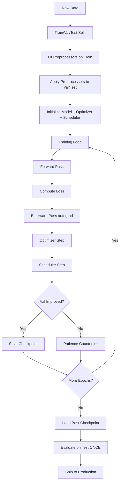
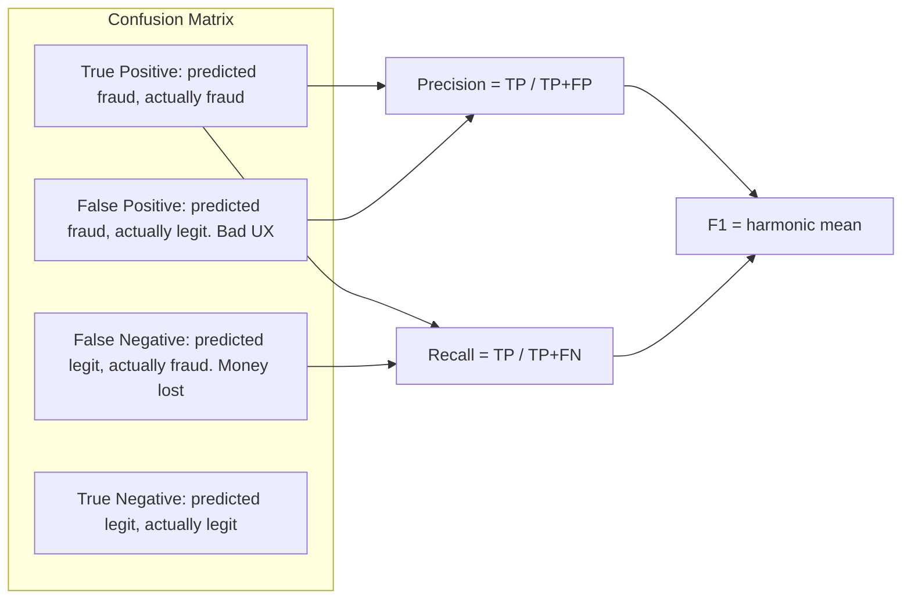

# ML Engineer / Data Scientist — From Notebook to Production

Bhai, suno. Tu agar yeh subject open kiya hai, tu shayad confused hai — Data Analyst, Data Scientist, ML Engineer, GenAI Engineer — yeh sab alag-alag roles hain ya same hi hain rebrand karke? Real talk: yeh **alag** roles hain, alag salary band, alag day-to-day, alag interview loop. Razorpay risk team, Swiggy demand-forecasting wing, Cred fraud team, Hotstar churn squad — sab specifically *ML Engineer* / *Applied Data Scientist* hire karte hain, not "DA who knows ML." Yeh document tujhe woh role banata hai jo Razorpay ke risk loop mein clear ho jaaye.

Hum ek hi domain — **Indian fintech fraud detection (Razorpay-style)** — pe har concept apply karenge taki cheezein compound karein. Ek dataset tujhe EDA mein milegi, wahi training mein, wahi production monitoring mein. Aur cross-link karenge `genai-classical-ml.md` aur `genai-deep-learning.md` se jahaan deeper jaane ka mann ho.

> **Voice contract:** Hinglish narration, but **English in code, formulas, and metric names**. Galti karna allowed hai, galat concept seekhna nahi.

Chai-pani saath rakh, ye ek lamba safar hai but har section interview mein direct sawaal banta hai.

---

## 1. Why ML Engineering — and how it differs from DA / GenAI

Pehle role-clarity, kyunki yahi 90% candidates galat samajhte hain aur galat resume bhejte hain.

### 1.1 The three roles, side by side

| Aspect | Data Analyst (DA) | Data Scientist / MLE | GenAI Engineer |
|--------|------------------|---------------------|----------------|
| **Primary output** | Dashboards, SQL reports, A/B test reads | Trained model in production serving predictions | LLM-powered application (RAG, agent) |
| **Tech stack** | SQL, Excel, Tableau / Looker, Python (pandas) | Python, scikit-learn, PyTorch, Spark, MLflow | Python, LangChain, vector DBs, OpenAI/Anthropic APIs |
| **Maths bar** | Stats (A/B, regression) | Stats + linear algebra + optimization | Mostly tooling, deeper math optional |
| **Typical question** | "Why did GMV drop 8% last week?" | "Build a model that flags fraud at 0.5% FPR" | "Build a chatbot that answers from our docs" |
| **Owns prod?** | No (owns dashboard) | Yes (owns model + endpoint + monitoring) | Yes (owns prompt + retrieval + endpoint) |
| **Fresher band (India, product co)** | 8-15 LPA | 12-25 LPA | 15-30 LPA |
| **2-4 yr band** | 18-30 LPA | 25-50 LPA | 30-60 LPA |

**Important:** DA → DS transition is the most common upskill path. DS → MLE is mostly about taking ownership of the *deployment* + *monitoring* + *retraining* pipeline. MLE → GenAI is mostly tooling shift; the math foundations transfer.

### 1.2 Where MLE / DS sit in Indian product cos

Real teams that hire heavily for this role (as of 2025-26):

- **Razorpay Risk** — every transaction passes through a model that predicts fraud probability in <50ms. Team is ~30 MLEs + DSes. They hire from Tier-1/2 colleges, but skill bar > pedigree. Open-box take-home is standard.
- **Swiggy Demand-Forecasting** — predicts orders per dark-store per 30-min window. Tabular + time-series. LightGBM heavy. They lost ₹40Cr/yr to over-staffing before this team scaled.
- **Zomato Recommendation** — restaurant ranking on home feed. Two-tower retrieval + reranker. Heavy use of implicit feedback.
- **Cred Fraud / Risk Underwriting** — gives a CIBIL-like internal score. Random Forest + GBM ensembles. Strict feature-store discipline.
- **Hotstar Churn** — predicts which subscriber will not renew within 7 days, triggers retention campaign. Survival analysis territory.
- **Flipkart Search Relevance** — learning-to-rank with click logs.
- **PhonePe Risk** — UPI fraud detection at lakh-TPS scale. Online inference latency budget: 80ms p99.

**Salary anchor (2025 numbers, Bangalore/Hyderabad, base + RSU):**

| Years exp | Tier-3 startup | Indian unicorn (Razorpay, Cred) | FAANG India |
|-----------|---------------|----------------------------------|-------------|
| Fresher | 8-12 LPA | 18-25 LPA | 28-40 LPA |
| 2-3 yrs | 14-20 LPA | 30-45 LPA | 50-75 LPA |
| 4-6 yrs | 22-35 LPA | 50-80 LPA | 90 LPA - 1.5 Cr |

The MLE band sits ~30% above SDE-1 in product cos because supply is thin. Tu ye role pakka kar le, life set hai.

### 1.3 What this doc gives you

After 1100 lines you'll know — math foundations, EDA, classical ML algorithms with derivations, deep-learning entry points, training loops, evaluation metrics, MLOps, and business framing. You'll also have a 30-question interview cheatsheet at the end.

---

## 2. Math Foundations — Just Enough

Bhai, math se mat dar. Tu PhD nahi kar raha, tu *engineer* hai. **Just enough** chahiye taki backprop samajh aaye, regularization ka geometry samajh aaye, aur p-values pe interviewer ko confidently jawab de sake.

### 2.1 Linear algebra in 25 lines

A **vector** is a list of numbers. A **matrix** is a 2-D grid. ML mein `X` is usually `(n_samples, n_features)`.

```python
import numpy as np

x = np.array([2.0, 3.0])             # shape (2,) — a vector
W = np.array([[1.0, 0.5],            # shape (2, 2) — a matrix
              [0.2, 1.5]])

# Dot product — sum of element-wise products. Backbone of every ML model.
dot = np.dot(x, x)                   # 2*2 + 3*3 = 13
print(dot)

# Matrix-vector product — every NN layer is one of these.
y = W @ x                            # [1.0*2 + 0.5*3, 0.2*2 + 1.5*3] = [3.5, 4.9]
print(y)

# Transpose — flip rows and columns.
print(W.T)

# Identity, inverse — used in closed-form linear regression.
I = np.eye(2)
W_inv = np.linalg.inv(W)
```

**Eigenvalues / eigenvectors — intuition only.** For a square matrix `A`, an eigenvector `v` is a direction along which `A` only stretches (doesn't rotate) — `A v = λ v`. The stretch factor `λ` is the eigenvalue. Why care? **PCA** finds the eigenvectors of the data's covariance matrix — these are the "natural axes" of your dataset. In production you rarely compute this by hand; `sklearn.decomposition.PCA` does it.

### 2.2 Calculus — gradient is the only word that matters

A **derivative** measures how fast a function changes as you nudge its input. For `f(x) = x²`, `df/dx = 2x`. For multivariable functions like `L(w1, w2)` (a loss surface over two weights), the **gradient** `∇L = [∂L/∂w1, ∂L/∂w2]` points in the direction of *steepest ascent*. Gradient descent walks in the *opposite* direction:

```
w_new = w_old - η * ∇L(w_old)
```

`η` (eta) is the learning rate. Yahaan se backprop banta hai — chain rule lagao layer-by-layer, partial derivatives multiply karo, weights update karo.

### 2.3 Probability — Bayes is the boss

**Conditional probability:** `P(A|B) = P(A ∩ B) / P(B)`.

**Bayes' theorem** (asked in *every* interview):

```
P(H | E) = P(E | H) * P(H) / P(E)
```

`H` = hypothesis (e.g., "this transaction is fraud"). `E` = evidence (e.g., "amount > ₹1L from new device"). `P(H)` is the **prior**, `P(E|H)` the **likelihood**, `P(H|E)` the **posterior**.

> **Razorpay-style interview Q:** 1 in 10,000 transactions is fraud. Your model has 99% TPR and 99% TNR. A new transaction is flagged. What's the probability it's actually fraud?
>
> `P(fraud | flagged) = (0.99 * 0.0001) / (0.99 * 0.0001 + 0.01 * 0.9999) ≈ 0.0098` — under 1%. Yahi baat hai — class imbalance pe accuracy jhooth bolti hai, precision and recall hi sach.

**Distributions you must know:**

- **Bernoulli** — single coin flip, parameter `p`. Used in logistic-regression loss.
- **Binomial** — `n` Bernoulli flips. Used in conversion-rate A/B tests.
- **Normal (Gaussian)** — bell curve, parameters `μ, σ`. Default assumption for most continuous features.
- **Poisson** — counts in fixed time window (orders per hour, fraud incidents per day). Parameter `λ`.
- **Log-normal** — `log(X)` is normal. Many real-world quantities (income, transaction amount, session length) are log-normal — that's why we often `log1p` them.

### 2.4 Statistics — mean, std, hypothesis tests

```python
import numpy as np
from scipy import stats

x = np.array([100, 105, 98, 110, 102, 95, 108])

print("mean:", x.mean())                # central tendency
print("median:", np.median(x))          # robust to outliers
print("std:", x.std(ddof=1))            # ddof=1 for sample std
print("variance:", x.var(ddof=1))

# Two-sample t-test — A/B test ki neev
control = np.random.normal(100, 10, 1000)
treatment = np.random.normal(102, 10, 1000)
t, p = stats.ttest_ind(control, treatment)
print(f"t={t:.3f} p={p:.4f}")
# p < 0.05 → reject null hypothesis at 95% confidence
```

**p-value plain English:** Assuming nothing changed (null hypothesis is true), what's the probability of seeing a difference *at least this big* by random chance? If p < 0.05, the result is unlikely under the null, so we reject it.

**A/B test design checklist:**

1. State the **null** (`H₀`: no difference) and **alternative** (`H₁`: treatment > control).
2. Pick `α = 0.05` (false positive tolerance) and `β = 0.20` (power = 80%).
3. **Power-calc** the required sample size *before* you start. Use `statsmodels.stats.power`.
4. Randomize at the right unit (user, session, request). Wrong unit → SUTVA violation.
5. Pre-register your primary metric. Do *not* peek and stop early ("p-hacking").
6. After the test, report effect size + confidence interval, not just the p-value.

---

## 3. Data Preparation + EDA

Sirf model train karne se kuch nahi hota. Production mein 70% time data cleaning aur EDA mein jaata hai. Bina EDA ke train kiya hua model interview mein hi pakda jata hai.

### 3.1 Pandas walkthrough — Razorpay-style fraud dataset

```python
import pandas as pd
import numpy as np

# Load the data — kaggle credit-card fraud dataset, par yahan synthetic
df = pd.read_csv("transactions.csv")
print(df.shape)                  # (284807, 31) — 284k txns, 31 cols
print(df.head())
print(df.dtypes)
print(df.describe(include="all"))  # numerical + categorical summary

# Missing values — yeh interview ki pehli check
print(df.isna().sum().sort_values(ascending=False).head(10))

# Class imbalance — fraud datasets are 0.1-0.5% positive
print(df["is_fraud"].value_counts(normalize=True))
# 0    0.99827
# 1    0.00173

# Quick distribution check
print(df["amount"].describe())
print(df["amount"].quantile([0.01, 0.5, 0.9, 0.99, 0.999]))
```

### 3.2 Missing values — three real strategies

```python
# Strategy 1: Drop — only if missing rate < 1% AND missingness is random
df_clean = df.dropna(subset=["merchant_id"])

# Strategy 2: Impute — mean/median for continuous, mode for categorical
df["amount"] = df["amount"].fillna(df["amount"].median())
df["device_type"] = df["device_type"].fillna(df["device_type"].mode()[0])

# Strategy 3: Treat missingness as a signal — add a "_was_missing" flag
df["device_score_was_missing"] = df["device_score"].isna().astype(int)
df["device_score"] = df["device_score"].fillna(-1)
# Yeh fraud detection mein gold hai — fraudsters often leave fields blank
```

> **Production rule:** Whatever imputation you compute, fit on *train* and apply on *val/test*. Otherwise data leakage.

### 3.3 Outliers — IQR + domain knowledge

```python
# Statistical outlier detection
q1, q3 = df["amount"].quantile([0.25, 0.75])
iqr = q3 - q1
upper = q3 + 1.5 * iqr
lower = q1 - 1.5 * iqr
outliers = df[(df["amount"] > upper) | (df["amount"] < lower)]
print(f"{len(outliers)} statistical outliers")

# But careful: in fraud data, the "outliers" ARE the signal. Don't blindly drop.
# Instead, log-transform highly-skewed features.
df["amount_log"] = np.log1p(df["amount"])
```

### 3.4 Feature engineering — the part that wins competitions

**Encoding categorical variables:**

```python
from sklearn.preprocessing import OneHotEncoder, OrdinalEncoder

# One-hot — for low-cardinality, no order (e.g., payment_method: card/upi/netbanking)
ohe = OneHotEncoder(sparse_output=False, handle_unknown="ignore")
X_oh = ohe.fit_transform(df[["payment_method"]])

# Ordinal — for ordered categories (e.g., kyc_tier: basic/standard/full)
oe = OrdinalEncoder(categories=[["basic", "standard", "full"]])
df["kyc_tier_enc"] = oe.fit_transform(df[["kyc_tier"]])

# Target encoding — for high-cardinality (e.g., 50k merchants)
# Replace each category with the mean target rate. CAREFUL of leakage.
def target_encode(train, test, col, target):
    means = train.groupby(col)[target].mean()
    return train[col].map(means), test[col].map(means).fillna(train[target].mean())
```

**Scaling continuous features:**

```python
from sklearn.preprocessing import StandardScaler, MinMaxScaler, RobustScaler

# StandardScaler — (x - mean) / std → mean=0, std=1. Default for linear models, NN.
ss = StandardScaler()

# MinMaxScaler — (x - min) / (max - min) → [0, 1]. Use when bounded inputs needed.
mm = MinMaxScaler()

# RobustScaler — uses median + IQR, ignores outliers. Use on heavy-tailed data.
rs = RobustScaler()

X_train_scaled = ss.fit_transform(X_train)
X_val_scaled = ss.transform(X_val)   # NEVER fit on val/test
```

> Tree-based models (RF, XGB, LightGBM) **don't need scaling**. They split on thresholds. Linear models, SVMs, KNN, NNs all need scaling.

### 3.5 Train/val/test split — the data-leakage trap

```python
from sklearn.model_selection import train_test_split

# Stratified split preserves class ratio — critical for imbalanced data
X_train, X_temp, y_train, y_temp = train_test_split(
    X, y, test_size=0.30, stratify=y, random_state=42
)
X_val, X_test, y_val, y_test = train_test_split(
    X_temp, y_temp, test_size=0.50, stratify=y_temp, random_state=42
)
# Final: 70% train, 15% val, 15% test
```

**Time-series data:** NEVER random-split. Use chronological split — train on Jan-Jun, val on Jul, test on Aug. Otherwise you leak future info.

### 3.6 Data leakage — the most common interview trap

Leakage = test/future info sneaks into training. Six classic forms:

1. **Pre-processing leakage** — fitting `StandardScaler` on full data, then splitting. Always split *first*.
2. **Target encoding without K-fold** — using full-data target means leaks the val labels. Use out-of-fold encoding.
3. **Group leakage** — same `user_id` appears in both train and val. Use `GroupKFold`.
4. **Time leakage** — random-splitting a time-series. Use `TimeSeriesSplit`.
5. **Feature leakage** — including a feature only available *after* the prediction time (e.g., `chargeback_filed` for fraud).
6. **Duplicate rows** — bad de-dup → near-identical rows in train and test.

> Razorpay interviewer ka direct sawaal: "Tera AUC 0.99 hai — convince me it's not leakage." If you can't enumerate these six, you're out.

---

## 4. Classical ML Algorithms

Yeh section thoda dense hai but har ek algorithm interview mein direct aata hai. Cross-link `genai-classical-ml.md` ke saath — wahaan deeper derivations hain.

### 4.1 Linear Regression — closed-form + gradient descent

**Model:** `y = Xw + b + ε`, where `ε ~ N(0, σ²)`.

**Loss (MSE):** `L(w) = (1/n) Σ (yᵢ - xᵢ·w)²`.

**Closed-form (Normal Equation):** `w* = (XᵀX)⁻¹ Xᵀy`. Works only when `XᵀX` is invertible (no perfect multicollinearity, n > d). O(d³) — too slow for d > 10⁴.

**Gradient descent:** iteratively update `w := w - η * (2/n) Xᵀ(Xw - y)`. Scales to billions of features.

```python
from sklearn.linear_model import LinearRegression, Ridge, Lasso
import numpy as np

# Closed-form via sklearn
lr = LinearRegression()
lr.fit(X_train, y_train)
print("R²:", lr.score(X_val, y_val))
print("coefs:", lr.coef_)

# Ridge — adds L2 penalty: L = MSE + α * ||w||²
ridge = Ridge(alpha=1.0).fit(X_train, y_train)

# Lasso — L1 penalty: L = MSE + α * |w|. Drives weights to exactly 0 → feature selection.
lasso = Lasso(alpha=0.01).fit(X_train, y_train)
```

**Assumptions** (interview classic): linearity, independence of errors, homoscedasticity (constant variance), no multicollinearity, normal residuals. Violate them → SE estimates lie, p-values lie.

### 4.2 Logistic Regression — sigmoid + log-loss

For binary classification: `p = σ(w·x + b) = 1 / (1 + e^-(w·x+b))`.

**Loss (Binary Cross-Entropy / Log-loss):**

```
L = -(1/n) Σ [yᵢ log(pᵢ) + (1-yᵢ) log(1-pᵢ)]
```

Beautiful gradient: `∂L/∂w = (1/n) Xᵀ(p - y)`. Same shape as linear regression — that's why backprop in NN works the same way.

```python
from sklearn.linear_model import LogisticRegression

lr = LogisticRegression(
    penalty="l2",
    C=1.0,                # C = 1/α, smaller C → stronger regularization
    class_weight="balanced",  # auto-weight inverse to class freq — KEY for imbalance
    max_iter=1000,
    solver="lbfgs"
)
lr.fit(X_train, y_train)
proba = lr.predict_proba(X_val)[:, 1]   # P(fraud)
```

> **Why not MSE for classification?** Sigmoid + MSE gives a non-convex loss with multiple local minima. Cross-entropy + sigmoid is convex → global optimum guaranteed.

### 4.3 Decision Trees — Gini vs Entropy + pruning

A tree recursively splits feature space to maximize purity. Each internal node = a question (`amount > 5000`?), each leaf = a prediction.

**Impurity measures** — measured at each potential split, you pick the split that *reduces* impurity the most:

- **Gini:** `1 - Σ pᵢ²`. Computationally cheap. Default in sklearn.
- **Entropy:** `-Σ pᵢ log pᵢ`. Slightly slower (log), almost same trees in practice.

**Why prune?** A fully-grown tree fits training perfectly → overfits. Prune via `max_depth`, `min_samples_leaf`, or post-prune with `ccp_alpha`.

```python
from sklearn.tree import DecisionTreeClassifier

dt = DecisionTreeClassifier(
    criterion="gini",
    max_depth=8,
    min_samples_leaf=50,    # don't split below 50 samples
    class_weight="balanced",
    random_state=42
)
dt.fit(X_train, y_train)
```

### 4.4 Random Forests — bagging intuition

**Bagging (Bootstrap Aggregating):** train many trees, each on a bootstrap sample (with replacement) of rows AND a random subset of features (`sqrt(d)` for classification). Vote / average their predictions.

**Why it works:** each tree overfits *differently*; averaging cancels the variance while keeping the signal. Bias stays roughly the same, variance drops by ~1/n_trees.

```python
from sklearn.ensemble import RandomForestClassifier

rf = RandomForestClassifier(
    n_estimators=500,
    max_depth=None,           # let trees grow, ensemble handles overfitting
    min_samples_leaf=20,
    max_features="sqrt",
    class_weight="balanced_subsample",
    n_jobs=-1,
    random_state=42
)
rf.fit(X_train, y_train)

# Feature importance is a free byproduct
import pandas as pd
fi = pd.Series(rf.feature_importances_, index=X_train.columns).sort_values()
print(fi.tail(10))
```

### 4.5 Gradient Boosting — XGBoost / LightGBM / CatBoost

**Boosting** trains trees *sequentially*. Each new tree fits the *residuals* (errors) of the previous ensemble. Mathematically you're doing gradient descent in *function space* — at each step, fit a tree to the negative gradient of the loss.

```python
import lightgbm as lgb

lgb_train = lgb.Dataset(X_train, y_train)
lgb_val = lgb.Dataset(X_val, y_val, reference=lgb_train)

params = {
    "objective": "binary",
    "metric": "auc",
    "learning_rate": 0.05,
    "num_leaves": 63,
    "feature_fraction": 0.9,
    "bagging_fraction": 0.9,
    "bagging_freq": 5,
    "scale_pos_weight": 99,    # for ~1% positive class
}

model = lgb.train(
    params,
    lgb_train,
    num_boost_round=2000,
    valid_sets=[lgb_val],
    callbacks=[lgb.early_stopping(stopping_rounds=50)],
)
```

**When each wins:**

| Library | Sweet spot | Pain points |
|---------|-----------|-------------|
| **XGBoost** | Mid-size tabular, well-understood, deterministic | Slower on large data |
| **LightGBM** | Large data (>1M rows), high-cardinality categoricals | Can overfit on small data |
| **CatBoost** | Heavy categorical features (no need to one-hot) | Slowest training, smallest community |

Swiggy demand-forecasting uses LightGBM. Cred fraud uses XGBoost (legacy choice that works). Razorpay risk has been migrating to LightGBM for speed.

### 4.6 SVM — kernel trick, one paragraph

SVM finds the **maximum-margin hyperplane** separating classes. The "kernel trick" implicitly maps data into a higher-dimensional space (using `K(x, x') = φ(x)·φ(x')`) where it might be linearly separable, *without* computing `φ(x)` explicitly. Common kernels: linear, polynomial, RBF (`exp(-γ||x-x'||²)`). Beautiful theory, but in 2025 SVMs are rare in production — they don't scale beyond ~50k rows. Still asked in interviews because the math is elegant.

### 4.7 K-Means + DBSCAN — unsupervised clustering

**K-Means:** pick `k`, randomly init `k` centroids, assign each point to nearest centroid, recompute centroids, repeat. Minimizes within-cluster sum of squared distances. **Limitations:** assumes spherical clusters, sensitive to init (use `k-means++`), need to pick `k` (use elbow method or silhouette score).

**DBSCAN:** density-based — a cluster is a dense region of points. Two params: `eps` (neighborhood radius) and `min_samples`. Finds arbitrary-shape clusters and labels low-density points as noise. No `k` needed. Used for fraud-ring detection — find dense clusters of suspicious devices.

```python
from sklearn.cluster import KMeans, DBSCAN
from sklearn.metrics import silhouette_score

km = KMeans(n_clusters=5, n_init=10, random_state=42)
labels = km.fit_predict(X)
print("silhouette:", silhouette_score(X, labels))

db = DBSCAN(eps=0.5, min_samples=10)
db_labels = db.fit_predict(X)
print("clusters:", len(set(db_labels)) - (1 if -1 in db_labels else 0))
print("noise points:", (db_labels == -1).sum())
```

---

## 5. Deep Learning Intro

Deep learning ka full treatment `genai-deep-learning.md` aur `genai-transformers.md` mein hai. Yahaan basics + interview-grade understanding.

### 5.1 Perceptron → MLP → Backprop

A **perceptron** is `y = step(w·x + b)` — Rosenblatt 1958. Cannot learn XOR (not linearly separable). An **MLP (Multi-Layer Perceptron)** stacks layers with non-linear activations:

```
h₁ = ReLU(W₁ x + b₁)
h₂ = ReLU(W₂ h₁ + b₂)
y_hat = softmax(W₃ h₂ + b₃)
```

**Backpropagation** is the chain rule applied layer-by-layer to compute `∂L/∂W_i` for every weight. PyTorch / autograd does this automatically.

```python
import torch
import torch.nn as nn
import torch.optim as optim

class FraudMLP(nn.Module):
    def __init__(self, d_in, d_hidden=64):
        super().__init__()
        self.net = nn.Sequential(
            nn.Linear(d_in, d_hidden),
            nn.ReLU(),
            nn.Dropout(0.2),
            nn.Linear(d_hidden, d_hidden),
            nn.ReLU(),
            nn.Dropout(0.2),
            nn.Linear(d_hidden, 1),
        )

    def forward(self, x):
        return self.net(x).squeeze(-1)  # logits, NOT probabilities

model = FraudMLP(d_in=X_train.shape[1])
loss_fn = nn.BCEWithLogitsLoss(pos_weight=torch.tensor([99.0]))
optimizer = optim.AdamW(model.parameters(), lr=1e-3, weight_decay=1e-4)

for epoch in range(50):
    model.train()
    optimizer.zero_grad()
    logits = model(X_train_t)
    loss = loss_fn(logits, y_train_t)
    loss.backward()       # autograd computes all gradients
    optimizer.step()
```

### 5.2 Activation functions

| Activation | Formula | Pros | Cons |
|-----------|---------|------|------|
| **Sigmoid** | `1/(1+e⁻ˣ)` | Smooth, [0,1] output | Vanishing gradient on extremes |
| **Tanh** | `(eˣ-e⁻ˣ)/(eˣ+e⁻ˣ)` | Zero-centered | Still saturates |
| **ReLU** | `max(0, x)` | Fast, no saturation on `+` side | "Dying ReLU" — neurons that get stuck at 0 |
| **Leaky ReLU** | `max(0.01x, x)` | Fixes dying ReLU | Adds a hyperparam |
| **GELU** | `x · Φ(x)` | Smooth, used in BERT/GPT | Slightly slower |
| **Softmax** | `eˣⁱ / Σ eˣʲ` | Output probability over classes | Used only at final layer |

Default for hidden layers: ReLU. For transformers: GELU. For final layer: depends on task — sigmoid (binary), softmax (multi-class), linear (regression).

### 5.3 CNNs — for images

A **convolution layer** slides a small filter (e.g., 3x3) over the input image, computing dot products. Learns local patterns (edges → textures → parts → objects). **Pooling** (max or average) downsamples spatial dims — `2x2 maxpool` halves H and W.

```python
import torch.nn as nn

class SimpleCNN(nn.Module):
    def __init__(self, n_classes=10):
        super().__init__()
        self.features = nn.Sequential(
            nn.Conv2d(3, 32, kernel_size=3, padding=1),
            nn.ReLU(),
            nn.MaxPool2d(2),                # 32x32 -> 16x16
            nn.Conv2d(32, 64, kernel_size=3, padding=1),
            nn.ReLU(),
            nn.MaxPool2d(2),                # 16x16 -> 8x8
        )
        self.classifier = nn.Sequential(
            nn.Flatten(),
            nn.Linear(64 * 8 * 8, 128),
            nn.ReLU(),
            nn.Linear(128, n_classes),
        )

    def forward(self, x):
        return self.classifier(self.features(x))
```

In 2025, CNNs are still the default for medical imaging, defect detection, OCR. For general image classification, **Vision Transformers (ViT)** have taken over — see `genai-vlm.md`.

### 5.4 RNNs / LSTMs — superseded but asked

RNNs process sequences token-by-token, maintaining a hidden state `h_t = f(W_x x_t + W_h h_{t-1})`. **Vanishing gradient** kills learning over long sequences. **LSTMs / GRUs** add gating (input/forget/output gates) to selectively remember.

In 2025 production, LSTMs are gone except in (a) tiny on-device models, (b) some time-series forecasting where transformers overkill. **Transformers** (`genai-transformers.md`) replaced them everywhere. But interviewers love asking the difference — be ready.

> Cross-link: dive into `content/genai-deep-learning.md` for MLP/CNN/RNN derivations and `content/genai-transformers.md` for attention.

---

## 6. Training Pipeline

Yahaan se "ML Engineer" wala part start hota hai — model train karna alag baat hai, train *correctly* karna alag.

### 6.1 Loss functions — match to task

| Task | Loss | When |
|------|------|------|
| Regression | **MSE** = `(1/n) Σ (y - ŷ)²` | Default, smooth |
| Regression with outliers | **MAE / Huber** | Robust to tails |
| Binary classification | **BCE / Log-loss** | Standard |
| Multi-class | **Cross-entropy** | Standard |
| Imbalanced binary | **Focal loss** = `-(1-p_t)^γ log(p_t)` | Down-weights easy examples |
| Ranking | **Pairwise hinge / LambdaRank** | Search, recsys |

```python
# Focal loss in PyTorch — Razorpay risk team uses this
class FocalLoss(nn.Module):
    def __init__(self, gamma=2.0, alpha=0.25):
        super().__init__()
        self.gamma, self.alpha = gamma, alpha

    def forward(self, logits, targets):
        bce = nn.functional.binary_cross_entropy_with_logits(
            logits, targets, reduction="none"
        )
        p = torch.sigmoid(logits)
        p_t = p * targets + (1 - p) * (1 - targets)
        alpha_t = self.alpha * targets + (1 - self.alpha) * (1 - targets)
        return (alpha_t * (1 - p_t) ** self.gamma * bce).mean()
```

### 6.2 Optimizers

- **SGD** — `w := w - η ∇L`. Simple, can need lots of tuning.
- **SGD + Momentum** — adds velocity term: `v := βv + ∇L; w := w - η v`. Smooths noisy gradients.
- **Adam** — adaptive per-parameter learning rate, uses 1st + 2nd moments. Default for most NN work.
- **AdamW** — Adam with *decoupled* weight decay. Use this over Adam — it's strictly better for transformers.

```python
optimizer = torch.optim.AdamW(
    model.parameters(),
    lr=1e-3,
    betas=(0.9, 0.999),
    eps=1e-8,
    weight_decay=1e-4,    # L2-style regularization
)
```

### 6.3 Learning-rate schedules

A constant LR rarely works. Common schedules:

- **Step decay** — drop LR by 10x every N epochs.
- **Cosine annealing** — smooth decay from `lr_max` to `lr_min` following a cosine curve.
- **Warmup + cosine** — ramp up linearly for first ~10% of steps, then cosine. Default for transformers.
- **ReduceLROnPlateau** — drop LR when val loss stops improving.

```python
scheduler = torch.optim.lr_scheduler.CosineAnnealingLR(
    optimizer, T_max=num_epochs, eta_min=1e-5
)
```

### 6.4 Regularization — control overfitting

- **L1 (Lasso)** — adds `λ Σ |w|` to loss. Drives weights to *exactly zero* → automatic feature selection.
- **L2 (Ridge / weight decay)** — adds `λ Σ w²`. Shrinks weights smoothly. Default in NNs.
- **Dropout** — randomly zero out fraction `p` of activations during training. Forces redundancy. Disabled at inference (PyTorch handles via `model.eval()`).
- **BatchNorm** — normalize each layer's pre-activations across the batch. Stabilizes training, allows higher LR. Has a regularization side-effect.
- **LayerNorm** — normalize across features (not batch). Used in transformers because batches are tiny in fine-tuning.
- **Early stopping** — stop training when val loss hasn't improved for `patience` epochs.

```python
best_val = float("inf")
patience, counter = 5, 0

for epoch in range(100):
    train_one_epoch(model, train_loader)
    val_loss = evaluate(model, val_loader)
    if val_loss < best_val - 1e-4:
        best_val = val_loss
        counter = 0
        torch.save(model.state_dict(), "best.pt")
    else:
        counter += 1
        if counter >= patience:
            print(f"Early stop at epoch {epoch}")
            break
```

### 6.5 The full training pipeline (mermaid)



> Test set ko **sirf ek baar** chhoona hai — final reporting ke time. Baar-baar test pe tune kiya, tu test set ko val set bana raha hai aur leakage ho raha hai.

---

## 7. Evaluation Metrics

Wrong metric → wrong model → wrong production decision → wrong promotion. Metric chunna sabse important skill hai.

### 7.1 Classification metrics

Setup: confusion matrix for binary classification:

```
                Predicted
                Pos     Neg
Actual  Pos     TP      FN     (recall = TP/(TP+FN))
        Neg     FP      TN     (FPR = FP/(FP+TN))
                ↑
        precision = TP/(TP+FP)
```



| Metric | Formula | Use when |
|--------|---------|----------|
| **Accuracy** | `(TP+TN)/Total` | Balanced classes (rarely true) |
| **Precision** | `TP/(TP+FP)` | False positives are costly (spam filter blocking real email) |
| **Recall (TPR)** | `TP/(TP+FN)` | False negatives are costly (fraud missed, cancer missed) |
| **F1** | `2·P·R/(P+R)` | Want balance, no preference |
| **F-beta** | `(1+β²)·P·R/(β²·P+R)` | β > 1 weights recall more |
| **ROC-AUC** | Area under TPR vs FPR curve | Threshold-agnostic, balanced data |
| **PR-AUC** | Area under Precision vs Recall | Imbalanced data — use this over ROC-AUC |
| **Log-loss** | `-Σ y log p + (1-y)log(1-p)` | Calibration matters |

```python
from sklearn.metrics import (
    accuracy_score, precision_score, recall_score, f1_score,
    roc_auc_score, average_precision_score, confusion_matrix,
    classification_report,
)

y_pred = (proba > 0.5).astype(int)

print("accuracy:", accuracy_score(y_val, y_pred))
print("precision:", precision_score(y_val, y_pred))
print("recall:", recall_score(y_val, y_pred))
print("f1:", f1_score(y_val, y_pred))
print("roc-auc:", roc_auc_score(y_val, proba))
print("pr-auc:", average_precision_score(y_val, proba))   # use this on fraud
print(confusion_matrix(y_val, y_pred))
print(classification_report(y_val, y_pred))
```

### 7.2 Why accuracy lies on imbalanced data

Razorpay fraud rate is 0.17%. A "model" that predicts "legit" for every transaction has 99.83% accuracy. Useless. Hence:

- For imbalanced classification, report **PR-AUC**, **recall at fixed FPR**, or **precision at fixed recall**.
- "Recall at 0.5% FPR" is the standard fraud-detection benchmark. "Of fraudsters caught, what fraction did we catch while blocking only 0.5% of legit users?"

### 7.3 Threshold tuning

`predict_proba` gives probabilities; `predict` defaults to threshold=0.5. **Don't trust 0.5** — pick the threshold that maximizes business value.

```python
import numpy as np
from sklearn.metrics import precision_recall_curve

precision, recall, thresholds = precision_recall_curve(y_val, proba)
# Find threshold that achieves recall >= 0.80 with max precision
mask = recall >= 0.80
if mask.any():
    best_idx = np.argmax(precision[:-1][mask[:-1]])
    print(f"threshold={thresholds[mask[:-1]][best_idx]:.3f}")
```

### 7.4 Regression metrics

| Metric | Formula | Notes |
|--------|---------|-------|
| **MSE** | `(1/n) Σ (y-ŷ)²` | Penalizes big errors more |
| **RMSE** | `√MSE` | Same units as `y`, easier to communicate |
| **MAE** | `(1/n) Σ |y-ŷ|` | Robust to outliers |
| **MAPE** | `(1/n) Σ |y-ŷ|/|y|` | Percentage error, problematic when `y≈0` |
| **R²** | `1 - SS_res/SS_tot` | 1 = perfect, 0 = same as predicting mean |

For Swiggy demand-forecasting, MAE is preferred — they care about absolute order misses, not squared.

### 7.5 Ranking metrics — for search / recsys

- **NDCG@k** (Normalized Discounted Cumulative Gain) — measures the quality of the top-k ranking, with logarithmic discount on lower positions.
- **MAP** (Mean Average Precision) — average of precision@k over all relevant items.
- **MRR** (Mean Reciprocal Rank) — `1/rank_of_first_relevant`. Used when only the first hit matters.
- **Recall@k / Hit@k** — fraction of users where at least one relevant item is in top-k.

Zomato uses NDCG@10 for restaurant ranking, Hit@1 for "exact match" intent queries.

---

## 8. Cross-Validation + Hyperparameter Tuning

### 8.1 K-fold CV

Split data into K folds. For each i, train on K-1 folds, val on fold i. Average the K val scores → estimate of generalization. Standard K=5 or K=10.

```python
from sklearn.model_selection import (
    KFold, StratifiedKFold, GroupKFold, TimeSeriesSplit, cross_val_score
)

# Stratified K-fold preserves class ratio per fold — for classification
skf = StratifiedKFold(n_splits=5, shuffle=True, random_state=42)
scores = cross_val_score(model, X, y, cv=skf, scoring="roc_auc")
print(f"AUC: {scores.mean():.4f} ± {scores.std():.4f}")

# Group K-fold — same group never appears in both train and val
gkf = GroupKFold(n_splits=5)
# splits = gkf.split(X, y, groups=df["user_id"])

# Time-series split — only past predicts future
tscv = TimeSeriesSplit(n_splits=5, gap=24)   # gap of 24 hours
```

### 8.2 Hyperparameter search

| Method | When | Tool |
|--------|------|------|
| **Grid Search** | <50 configs, small models | `GridSearchCV` |
| **Random Search** | Larger spaces, often beats grid | `RandomizedSearchCV` |
| **Bayesian (Optuna)** | Expensive trials, want efficiency | `optuna` |
| **Hyperband / ASHA** | Anytime stopping, NN training | `optuna`, `ray.tune` |

```python
import optuna

def objective(trial):
    params = {
        "learning_rate": trial.suggest_float("lr", 1e-3, 0.3, log=True),
        "num_leaves": trial.suggest_int("num_leaves", 16, 256),
        "feature_fraction": trial.suggest_float("ff", 0.5, 1.0),
        "bagging_fraction": trial.suggest_float("bf", 0.5, 1.0),
        "min_child_samples": trial.suggest_int("mcs", 5, 200),
    }
    params.update({"objective": "binary", "metric": "auc", "verbose": -1})
    model = lgb.train(
        params,
        lgb.Dataset(X_train, y_train),
        num_boost_round=1000,
        valid_sets=[lgb.Dataset(X_val, y_val)],
        callbacks=[lgb.early_stopping(50)],
    )
    return roc_auc_score(y_val, model.predict(X_val))

study = optuna.create_study(direction="maximize")
study.optimize(objective, n_trials=50, n_jobs=4)
print("best params:", study.best_params)
print("best AUC:", study.best_value)
```

### 8.3 Test-set leakage in CV

Common mistake: tuning hyperparameters on CV folds *and* reporting CV score as final. The CV folds become val sets. Rules:

1. Hold out a final test set BEFORE CV.
2. CV inside training data only.
3. Pick best config based on CV mean.
4. Retrain on all training data with best config.
5. Evaluate ONCE on test set. That's your honest number.

For nested CV (CV-on-CV), use `cross_val_score` inside an inner loop and `cross_val_score` again outside — slow but the gold standard.

---

## 9. MLOps + Productionising

Model trained in notebook ≠ ML system in production. Here's where DA-turned-MLE candidates lose offers.

### 9.1 Model serving — pick by latency budget

| Tool | Latency | Use case |
|------|---------|----------|
| **FastAPI** | 5-50 ms | Default — wraps any sklearn / XGB / PyTorch model |
| **Flask** | 10-80 ms | Legacy; FastAPI is better for new work |
| **TorchServe** | 5-30 ms | Pure PyTorch, batch-friendly |
| **Triton (NVIDIA)** | 1-10 ms | GPU multi-framework, dynamic batching |
| **MLflow Models** | 20-100 ms | Quick prototype, packaging story |
| **BentoML** | 10-50 ms | Modern MLflow alternative, better DX |
| **AWS SageMaker / Vertex AI** | 30-100 ms | Managed, autoscaling, monitoring built-in |

```python
# fastapi_serve.py — the 80% solution
from fastapi import FastAPI
from pydantic import BaseModel
import joblib
import numpy as np

app = FastAPI()
model = joblib.load("fraud_model.pkl")
preprocessor = joblib.load("preprocessor.pkl")

class Transaction(BaseModel):
    amount: float
    merchant_id: str
    payment_method: str
    device_score: float
    hour_of_day: int

@app.post("/predict")
def predict(tx: Transaction):
    X = preprocessor.transform([tx.dict()])
    proba = float(model.predict_proba(X)[0, 1])
    return {"fraud_probability": proba, "decision": "block" if proba > 0.85 else "allow"}
```

Run: `uvicorn fastapi_serve:app --host 0.0.0.0 --port 8000 --workers 4`. Wrap in Docker, deploy on K8s. Razorpay's actual fraud-serving stack is FastAPI + gRPC + Redis feature cache, p99 < 60ms.

### 9.2 Feature stores — Feast

Feature store = single source of truth for features, used at *both* train time and serve time. Solves the two biggest production bugs:

1. **Train-serve skew** — feature computed differently in offline pipeline vs online API.
2. **Point-in-time correctness** — at training time, you must use the feature value as it existed *at the historical event time*, not "now".

```yaml
# feature_repo/features.py (Feast)
from feast import Entity, FeatureView, Field
from feast.types import Float32, Int64

merchant = Entity(name="merchant_id", description="Unique merchant ID")

merchant_stats = FeatureView(
    name="merchant_stats",
    entities=[merchant],
    ttl=timedelta(days=30),
    schema=[
        Field(name="avg_txn_amount_7d", dtype=Float32),
        Field(name="chargeback_rate_30d", dtype=Float32),
        Field(name="txn_count_24h", dtype=Int64),
    ],
    source=BigQuerySource(table="enriched.merchant_stats"),
)
```

### 9.3 Model versioning + experiment tracking

- **MLflow** — open-source, tracks experiments, parameters, metrics, artifacts. Has model registry + serving.
- **Weights & Biases (wandb)** — best UI, tightest PyTorch integration, paid for teams.
- **DVC** — git-like versioning for data and models. Reproducibility focused.

```python
import mlflow
import mlflow.sklearn

mlflow.set_experiment("fraud_v3")
with mlflow.start_run(run_name="lgb_focal_v1"):
    mlflow.log_params({"lr": 0.05, "num_leaves": 63})
    model = train(...)
    auc = roc_auc_score(y_val, model.predict(X_val))
    mlflow.log_metric("val_auc", auc)
    mlflow.sklearn.log_model(model, "model", registered_model_name="fraud_classifier")
```

### 9.4 Monitoring — drift, performance, fairness

After deploy, three things break:

1. **Data drift** — input distribution shifts (new merchant categories, new device types). Detect with KS-test, PSI (Population Stability Index), or Chi-square per feature.
2. **Concept drift** — relationship between X and y changes (fraudsters evolve tactics). Detect by tracking labelled performance with a delay.
3. **Performance degradation** — even without drift, label-noise or upstream bugs cause silent decay.

```python
# Population Stability Index — industry standard for drift
def psi(reference, current, bins=10):
    breakpoints = np.linspace(0, 1, bins + 1)
    ref_hist, _ = np.histogram(reference, bins=breakpoints)
    cur_hist, _ = np.histogram(current, bins=breakpoints)
    ref_pct = np.where(ref_hist == 0, 1e-4, ref_hist / ref_hist.sum())
    cur_pct = np.where(cur_hist == 0, 1e-4, cur_hist / cur_hist.sum())
    return float(np.sum((cur_pct - ref_pct) * np.log(cur_pct / ref_pct)))

# Rule of thumb: PSI < 0.1 = stable, 0.1-0.25 = moderate drift, > 0.25 = retrain
```

Tools to look at: **Evidently AI**, **WhyLabs**, **Arize AI**, **NannyML**.

### 9.5 Shadow deployment + canarying

Before flipping 100% traffic to a new model:

- **Shadow mode** — new model receives every request in parallel with old, but its predictions don't affect the response. You compare offline. Zero user risk.
- **Canary** — route 1% of traffic to new model, watch metrics, ramp to 5%, 25%, 100% over hours/days.
- **Multi-armed bandit / interleaved** — for ranking models, more efficient than fixed-traffic A/B.

Razorpay's policy: every fraud-model change goes through 7 days of shadow + 3 days of canary at 5% before full rollout. Sounds slow, prevents ₹crores of losses.

---

## 10. Business Framing — The Senior MLE Skill

This is what separates an SDE-1 MLE (writes pipelines) from an SDE-3 MLE (decides what gets built). Junior MLEs optimize AUC; senior MLEs optimize business outcomes.

### 10.1 Translating product KPIs to ML metrics

Product KPI is rarely "AUC". Map it:

| Product KPI | ML problem | ML metric |
|-------------|-----------|-----------|
| Reduce fraud loss by ₹10Cr/yr | Binary classification | Recall @ 0.5% FPR |
| Increase Swiggy ETA accuracy | Regression | MAE (minutes) — bound at 2 min |
| Reduce Hotstar churn by 2pp | Classification + uplift | Top-decile lift |
| Increase Zomato CTR by 5% | Ranking | NDCG@10 |
| Reduce dispatch cost | Optimization | ₹ per delivered order |

### 10.2 Cost-sensitive learning

Every false positive and false negative has a different rupee cost. Encode it.

```python
# Razorpay risk: blocking a legit ₹50k transaction = ₹50k in lost fees + churn risk
# Letting through a fraudulent ₹50k transaction = ₹50k chargeback + fines
# Build a cost matrix:
#   FP cost = 0.005 * amount (small fee loss)
#   FN cost = amount (full chargeback)

def expected_cost(y_true, y_pred, amount, fp_cost_rate=0.005):
    fp = (y_true == 0) & (y_pred == 1)
    fn = (y_true == 1) & (y_pred == 0)
    return float(amount[fp].sum() * fp_cost_rate + amount[fn].sum())

# Tune threshold to minimize expected cost, NOT to maximize F1
thresholds = np.linspace(0.01, 0.99, 100)
costs = [expected_cost(y_val, (proba > t).astype(int), amount_val) for t in thresholds]
best_t = thresholds[int(np.argmin(costs))]
print(f"optimal threshold: {best_t:.3f}, expected cost: ₹{min(costs):,.0f}")
```

### 10.3 The "should we even build a model?" decision matrix

Senior MLEs say "no" 60% of the time. Reasons to *not* build a model:

| Situation | Better alternative |
|-----------|-------------------|
| < 1000 labeled examples | Rules / heuristics, collect more data first |
| Volatile target (concept drift weekly) | Hand-crafted rules with quick override |
| No clear KPI / business owner | Don't build. Period. |
| Latency budget < 5ms and no GPU | Cached lookups + rules |
| Stakes too high (medical, legal) | Human-in-the-loop |
| Expected uplift < 1% over baseline | Often not worth ops cost |

Rule of thumb: ML adds engineering complexity equivalent to ~3 microservices. The business value must clear that bar.

### 10.4 Communicating to non-ML stakeholders

When the product manager asks "why did the model say X?":

- Show **feature contributions** (SHAP values, LIME) — "this transaction was flagged because the device was new (+0.3 logit) and the amount was 12x the user's usual (+0.5 logit)."
- Translate ML-metric deltas to ₹: "AUC went from 0.91 to 0.93 → expected fraud catch goes from 78% to 84% → ~₹2.4Cr/yr saved at current TPV."
- Always give a confidence interval, never a point estimate.

---

## 11. Top 30 ML Interview Questions

Quick-reference cheatsheet. Each should be a 60-90 second answer in interview.

| # | Question | Core idea |
|---|----------|-----------|
| 1 | Bias-variance tradeoff? | High-bias = underfit, high-variance = overfit. Add capacity / reduce reg → less bias more variance. |
| 2 | Why split into train/val/test? | Train fits, val tunes hyperparams, test reports honest generalization. |
| 3 | What is data leakage and 3 examples? | Future / target info in train. Pre-process before split, target-encode without K-fold, group leakage. |
| 4 | Why not MSE for classification? | Sigmoid+MSE is non-convex. Cross-entropy is convex and has clean gradient. |
| 5 | L1 vs L2? | L1 → sparse weights (feature selection). L2 → smooth shrink. |
| 6 | Bagging vs boosting? | Bagging trains parallel on bootstraps (RF). Boosting trains sequentially on residuals (XGB). |
| 7 | Why is accuracy bad on imbalanced data? | Predicting majority class gets high accuracy with zero recall. Use PR-AUC. |
| 8 | ROC-AUC vs PR-AUC? | ROC stable across class ratio; PR shows true picture on imbalance. |
| 9 | Curse of dimensionality? | Distance becomes meaningless in high-d. KNN/clustering degrade. Use PCA / feature selection. |
| 10 | Bias-variance for KNN? | Small k = low bias high variance; large k = opposite. |
| 11 | Random Forest vs XGBoost? | RF: parallel, robust, less tuning. XGB: sequential, higher ceiling, more tuning. |
| 12 | How does dropout work? | Randomly zero p% of activations; forces redundancy. Off at inference. |
| 13 | Vanishing gradient? | Deep nets with sigmoid/tanh → tiny gradients in early layers. Fix: ReLU, skip connections, BatchNorm. |
| 14 | BatchNorm vs LayerNorm? | BN normalizes across batch (good for CNN). LN across features (good for NLP / small batches). |
| 15 | Adam vs SGD? | Adam: adaptive per-param LR, fast convergence. SGD+momentum often generalizes better on vision. |
| 16 | Why warm-up + cosine LR? | Warm-up avoids early instability; cosine smooths convergence. Default for transformers. |
| 17 | What is class imbalance and 3 fixes? | Class-weighted loss, oversampling (SMOTE), focal loss, threshold tuning. |
| 18 | What is SHAP? | Game-theoretic feature attribution; per-prediction contributions that sum to logit. |
| 19 | How do you detect data drift? | KS-test or PSI on each feature; track over time; alert if PSI > 0.25. |
| 20 | Train-serve skew? | Feature computed differently offline vs online. Solve with feature store. |
| 21 | Why is the test set sacred? | Use it more than once → it becomes a val set → optimistic estimate. |
| 22 | Cross-validation for time series? | TimeSeriesSplit — only past predicts future, no random shuffle. |
| 23 | When does PCA help vs hurt? | Helps high-d linear models / KNN. Hurts when you need interpretability. |
| 24 | Logistic regression interpretation? | `exp(w_i)` is odds-ratio for unit increase in `x_i`. |
| 25 | What is calibration? | Predicted prob ≈ true prob. Check with reliability diagram, fix with Platt / isotonic. |
| 26 | Multi-class strategy for binary classifiers? | One-vs-rest or one-vs-one. Most modern algos support multi-class natively. |
| 27 | Why does XGBoost handle missing values? | Per node, learns "default direction" for missing. Free imputation. |
| 28 | Transfer learning steps? | Freeze backbone, replace head, train head, optionally unfreeze top layers with lower LR. |
| 29 | When would you NOT use a neural network? | Tabular data <1M rows → GBM beats NN almost always. |
| 30 | Walk me through deploying a model. | Train → register → containerize → shadow → canary → full → monitor → retrain. |

---

## 12. Pre-Interview Checklist + What to Learn Next

### 12.1 The night-before checklist

- [ ] Implement linear regression with gradient descent on paper in 10 min.
- [ ] Explain BCE loss and its gradient end-to-end.
- [ ] Draw confusion matrix and label all four cells; write precision, recall, F1.
- [ ] Distinguish ROC-AUC vs PR-AUC and state when to prefer each.
- [ ] Enumerate six forms of data leakage.
- [ ] Walk through training a LightGBM model with early stopping on a CSV.
- [ ] Recite Adam's update rule (or at least name `m_t`, `v_t`, `β1`, `β2`).
- [ ] Explain bias-variance tradeoff with one example.
- [ ] State at least three regularization techniques and what each does.
- [ ] Pitch a fraud-detection system end-to-end in 5 minutes (data → features → model → serving → monitoring).
- [ ] Have one project where you can show `mlflow ui` or `wandb` runs on your laptop.
- [ ] Be ready to defend a metric choice with rupee/business reasoning.

### 12.2 Mini-projects to put on your resume (one is enough)

1. **Fraud detection** — Kaggle credit-card fraud dataset → LightGBM + Optuna + MLflow + FastAPI deployment with PSI monitoring stub. ~4 weekends.
2. **Demand forecasting** — Walmart M5 dataset → LightGBM hierarchical forecast + cross-validation by time-series split. ~3 weekends.
3. **Recommender** — MovieLens 1M → matrix factorization + two-tower neural ranker. ~3 weekends.
4. **End-to-end MLOps pet project** — Iris classifier deployed with FastAPI + Docker + GitHub Actions CI/CD + drift monitor. Boring data, *production-grade* infra. Recruiters love this.

### 12.3 What to learn next

- **Deeper classical ML** → `content/genai-classical-ml.md` — fuller derivations of every algorithm here, plus SVMs and PCA.
- **Deep learning** → `content/genai-deep-learning.md` — backprop derivations, CNN architectures, RNNs.
- **Transformers / GenAI** → `content/genai-transformers.md`, `content/genai-finetuning.md` — modern NLP / multimodal.
- **System design** → `content/system-design-basics.md` — at L4+ MLE interviews, you'll design Razorpay-fraud-system end-to-end.
- **MLOps depth** → `content/genai-llmops.md`, `content/cicd-pipelines.md`, `content/docker-containers.md`.
- **SQL + DBMS** → `content/dbms-complete.md`, `content/da-sql-mastery.md` — features come from joins; DS interviews always have a SQL round.
- **Statistics depth** → `content/da-statistics-foundations.md`, `content/da-causal-inference.md` — for senior DS roles.
- **A/B testing** → `content/da-ab-testing.md` — every MLE eventually owns an experiment.

### 12.4 Final pep-talk

Bhai, ye role ka secret yahi hai — *math + code + business*, teen log mein se kisi ek pe weak hua, tu interview mein dikhega. DA wale code mein weak hote hain, SDEs business mein weak hote hain, researchers production mein weak hote hain. Tu teeno karenga, tu top 5% MLE bana gaya. Razorpay risk team ka L4 offer ka median CTC ₹42 LPA hai — har 2 saal mein ~50% bump. Math jhol nahi, hard work jhol hai.

Chal, ab notebook open kar aur ek dataset utha. Aaj se daily ek concept se ek code, ek interview question.

Best of luck. Tu kar lega.
