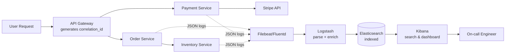
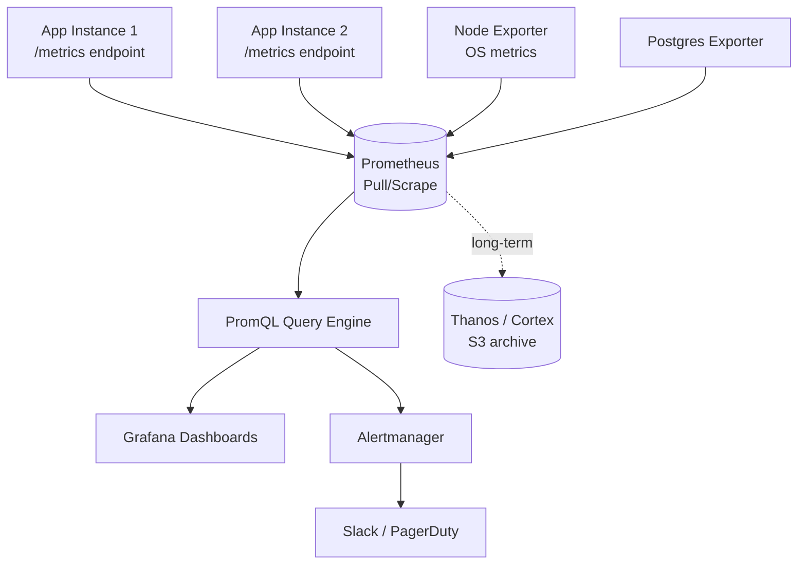
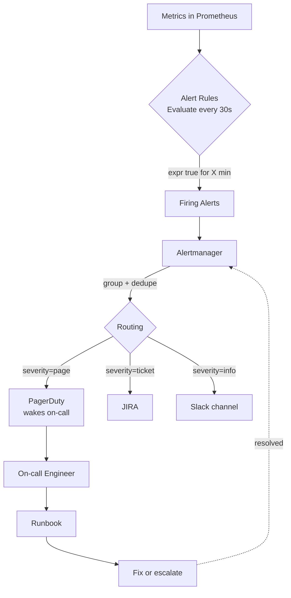
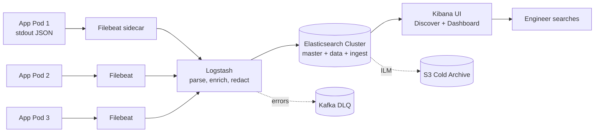
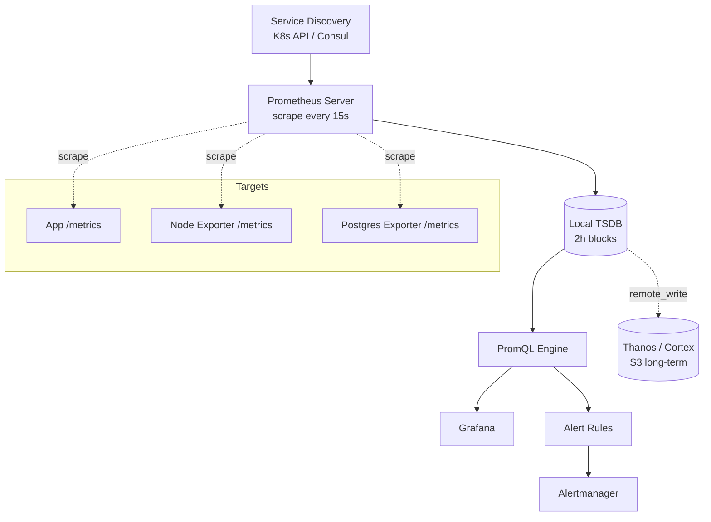
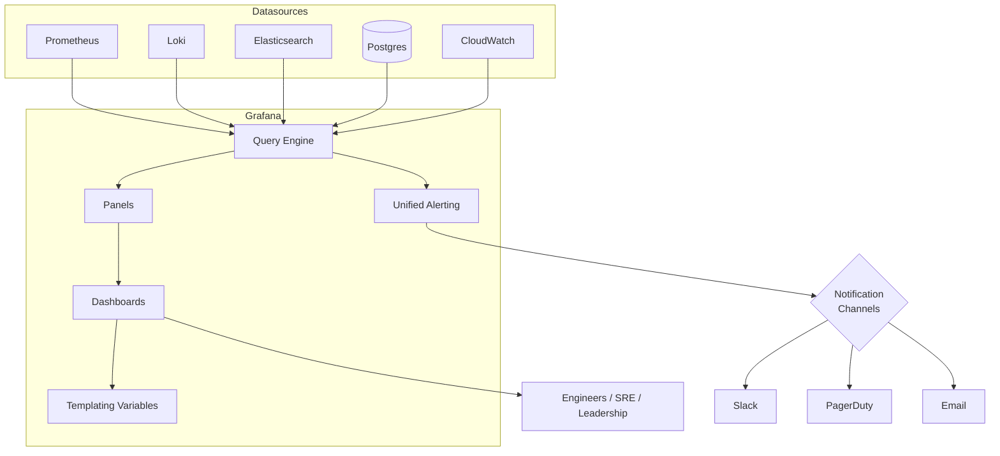

# Monitoring & Observability

Dekh bhai, seedha-saadha baat karte hain. Monitoring basically tumhare production ki health-check hai. Bina monitoring ke tu blind hai — kuch toot raha hai aur tujhe pata bhi nahi. Tu agar ek service deploy karke chain ki neend so raha hai, aur subah uthke dekhega ki Twitter pe log gaali de rahe hain "yaar yeh API down hai 3 ghante se" — toh samajh le, tune monitoring ko seriously nahi liya. Ek senior engineer aur ek junior engineer mein farak hi yahi hota hai: senior pehle se jaanta hai ki kya tootne wala hai, junior tab jaanta hai jab CEO ka WhatsApp message aata hai.

Observability ek step aage ki cheez hai. Monitoring tujhe batati hai "kuch toot gaya hai" — observability tujhe batati hai "kya, kahan, kyun, aur kab toota". Jab tu black-box system ke andar ki state ko sirf bahar ke signals dekh ke samajh sakta hai, tab tu observable system bana raha hai. Yeh distinction important hai kyunki interviews mein log "monitoring vs observability" pe ghapla kar dete hain.

Industry mein teen pillars (तीन स्तंभ) mane jaate hain — **Logs**, **Metrics**, aur **Traces**. Logs batate hain "kya hua" (event-level detail). Metrics batate hain "kitna hua" (aggregated numbers over time). Traces batate hain "kahan time gaya" (request ka journey across services). In teeno ko milake tu apne distributed system ki ek complete picture banata hai. Is module mein hum centralized logging, metrics collection, alerting, aur ELK + Prometheus + Grafana toolchain — sab cover karenge, deep level pe, with real config aur Hinglish comments.

---

## 1. Centralized logging

### 1.1 Structured logs (JSON), log levels (DEBUG/INFO/WARN/ERROR), retention, correlation IDs

#### Definition

Centralized logging matlab tumhare saare microservices, containers, aur servers ke logs ek hi jagah pe collect, index, aur search ho sakein. Pehle zamane mein log SSH karke `/var/log/app.log` mein `tail -f` karke padhe jaate the. Aaj ke distributed world mein agar tumhare paas 50 services aur 200 pods chal rahe hain, toh tu kahan-kahan SSH karega? Isliye centralized logging system (jaise ELK, Loki, Splunk, Datadog) zaroori ho gaya hai.

**Structured logs** matlab plain-text "User login failed" likhne ke bajaye, tu JSON format mein likhta hai jismein har field machine-parseable hota hai. **Log levels** severity batate hain — DEBUG (verbose, dev environment), INFO (normal flow), WARN (kuch galat ho sakta hai), ERROR (kuch toot gaya hai), FATAL/CRITICAL (system down). **Retention** matlab logs kitne din rakhna hai — compliance, cost, aur debugging needs ke beech balance. **Correlation IDs** woh magic dhaaga hai jo ek request ke saare logs ko, chahe woh 5 services ke through gayi ho, ek saath jodta hai.

#### Why?

Bhai, sochke dekh — tu Amazon jaisa platform chala raha hai. User ne checkout dabaya, payment fail ho gaya. Ab tu kya karega? Frontend logs, API gateway logs, order-service logs, payment-service logs, database logs — sab dekhne padhenge. Agar har log ek alag server pe hai, plain-text mein hai, aur koi correlation ID nahi hai — toh tu basically bhuse ke dher mein sui dhundh raha hai.

Structured JSON logs isliye zaroori hain kyunki Elasticsearch jaisa search engine `level:ERROR AND service:payment AND user_id:12345` jaisa query 50ms mein chala deta hai. Plain-text mein tujhe `grep` chalana padhega, woh bhi multiple files pe — slow, painful, aur production mein toh impossible.

Log levels production mein cost bachate hain. DEBUG logs prod mein chhodne ka matlab hai disk full, paisa barbaad, aur signal-to-noise ratio kharab. Retention policies isliye banti hain kyunki 1 TB logs/day rakhna 1 saal ke liye lakhon rupaye ka kharcha hai — tu hot/warm/cold tier strategy use karta hai.

Correlation IDs distributed tracing ka backbone hain. Bina ID ke, tu kabhi nahi jaan paayega ki yeh ERROR log usi user ki request ka hai jo 3 service hops cross karke aayi thi.

#### How?

Pehle ek structured logger setup karte hain Node.js mein using `pino` (industry standard, super fast):

```javascript
// logger.js — yeh hamara central logger hai, sab services isi ko import karenge
const pino = require('pino');
const { AsyncLocalStorage } = require('async_hooks');

// AsyncLocalStorage correlation ID ko request ke poore lifecycle mein carry karta hai
const als = new AsyncLocalStorage();

const logger = pino({
  level: process.env.LOG_LEVEL || 'info',  // prod mein 'info', dev mein 'debug'
  formatters: {
    level: (label) => ({ level: label.toUpperCase() }),  // "INFO" not 30
    bindings: (bindings) => ({
      service: process.env.SERVICE_NAME,   // har log mein service name aayega
      env: process.env.NODE_ENV,
      version: process.env.APP_VERSION,
      host: bindings.hostname,
    }),
  },
  // Mixin har log mein correlation ID auto-inject karega
  mixin() {
    const store = als.getStore();
    return {
      correlation_id: store?.correlationId,
      user_id: store?.userId,
      trace_id: store?.traceId,
    };
  },
  timestamp: pino.stdTimeFunctions.isoTime,  // ISO 8601 format, UTC
  redact: ['req.headers.authorization', 'password', '*.creditCard'],  // PII hide karo
});

module.exports = { logger, als };
```

Express middleware jo har incoming request ke liye correlation ID generate ya propagate karta hai:

```javascript
// correlationMiddleware.js
const { v4: uuidv4 } = require('uuid');
const { als, logger } = require('./logger');

function correlationMiddleware(req, res, next) {
  // Agar upstream ne ID bhej di hai (gateway se), use karo; varna nayi banao
  const correlationId = req.headers['x-correlation-id'] || uuidv4();
  const traceId = req.headers['x-trace-id'] || correlationId;

  // Response header mein bhi set karo, taaki client/downstream dekh sake
  res.setHeader('x-correlation-id', correlationId);

  // ALS context mein store karo — ab is request ke andar jo bhi log hoga,
  // usme yeh ID automatically aa jaayega
  als.run({ correlationId, traceId, userId: req.user?.id }, () => {
    logger.info({ method: req.method, url: req.url }, 'request received');
    next();
  });
}

module.exports = correlationMiddleware;
```

Sample log output (prod mein yeh JSON Elasticsearch mein jaayega):

```json
{
  "level": "ERROR",
  "time": "2026-04-30T14:23:45.123Z",
  "service": "payment-service",
  "env": "production",
  "version": "2.4.1",
  "correlation_id": "a1b2c3d4-e5f6-7890",
  "user_id": "user_98765",
  "trace_id": "a1b2c3d4-e5f6-7890",
  "msg": "Stripe charge failed",
  "stripe_error_code": "card_declined",
  "amount": 1299,
  "currency": "INR",
  "stack": "Error: card_declined\n  at Stripe.charges.create..."
}
```

**Retention policy** — Elasticsearch ILM (Index Lifecycle Management):

```yaml
# ilm-policy.yml — ye Elasticsearch ko batata hai indices ko kaise age karna hai
PUT _ilm/policy/logs-policy
{
  "policy": {
    "phases": {
      "hot": {
        # Pehle 7 din: SSDs pe, fast search, full indexing
        "min_age": "0ms",
        "actions": {
          "rollover": { "max_size": "50gb", "max_age": "1d" },
          "set_priority": { "priority": 100 }
        }
      },
      "warm": {
        # 7-30 din: HDDs pe shift karo, force merge karo (segments compact)
        "min_age": "7d",
        "actions": {
          "allocate": { "require": { "data": "warm" } },
          "forcemerge": { "max_num_segments": 1 },
          "set_priority": { "priority": 50 }
        }
      },
      "cold": {
        # 30-90 din: cheap storage, searchable but slow
        "min_age": "30d",
        "actions": { "freeze": {} }
      },
      "delete": {
        # 90 din ke baad uda do (compliance allow karta ho toh)
        "min_age": "90d",
        "actions": { "delete": {} }
      }
    }
  }
}
```

#### Real-life Example

Maan le tu Zomato pe kaam kar raha hai. Ek user ne order place kiya, paisa cut gaya, par order confirm nahi hua. Customer support ko complaint aayi at 14:25.

Bina centralized logging:
- Tu order-service ke 12 pods mein se kis pod pe gayi request, woh dhundh.
- Phir payment-service ke logs khol.
- Phir notification-service.
- 4 ghante baad pata chala ki Kafka consumer lag tha.

With centralized logging + correlation ID:
1. Support agent ne user ka phone number diya.
2. Tune Kibana mein query maari: `user_phone:"+919876543210" AND time:[14:20 TO 14:30]`.
3. Mila correlation ID `a1b2c3d4`.
4. Query: `correlation_id:"a1b2c3d4"` — saare 5 services ke logs chronologically aa gaye.
5. Dekha — payment-service ne `success` log kiya at 14:25:03, par order-service ne Kafka message receive nahi kiya till 14:25:47. 44 second ka lag.
6. Root cause: Kafka consumer thread pool exhausted. Fix in 30 minutes.

Yeh hai centralized logging ka power.

#### Diagram



#### Interview Q&A

**Q1: Structured logging vs unstructured logging — kab kaunsa use karein, aur trade-offs kya hain?**

Bhai, structured logging (JSON, key-value) almost always preferred hai production systems mein, especially distributed systems mein jahan logs ko machine-parse karna hai. Unstructured plain-text logs sirf chhote scripts ya local dev mein theek hain jahan tu khud `cat` karke padh raha hai. Trade-off yeh hai ki structured logs thoda zyada verbose hote hain (har field key ke saath) aur disk space lete hain — typically 30-40% zyada raw size. Lekin yeh "cost" tab pay-off karta hai jab tujhe Elasticsearch ya Splunk mein query karna hai. `level:ERROR AND service:payment AND latency_ms:>500` jaisa query plain-text logs pe regex se chalana 100x slower hai aur reliable nahi hai. Production mein hamesha structured logs use karo, aur ek shared schema define karo (kaunse fields mandatory hain — timestamp, level, service, correlation_id, message — aur kaunse optional). Schema enforcement ke liye tu logger library mein wrapper laga sakta hai jo missing fields pe warning de.

**Q2: Correlation ID kaise propagate hoti hai across async boundaries jaise message queues?**

Yeh ek classic gotcha hai. HTTP requests mein simple hai — `x-correlation-id` header bhej do, downstream service utha le. Lekin jab tu Kafka, RabbitMQ, ya SQS pe message daalta hai, toh tu message ke metadata/headers mein correlation ID embed karta hai. Kafka mein har `ProducerRecord` ke saath headers attach kar sakte ho. Consumer side pe message receive karte hi pehla kaam — headers se correlation_id nikaalo aur usse current execution context mein set karo (Node.js mein AsyncLocalStorage, Java mein MDC/ThreadLocal, Go mein context.Context). Agar tu yeh nahi karta, toh consumer ke logs ek naye correlation ID se start ho jaayenge aur upstream se link toot jaayega. Modern observability standards jaise W3C Trace Context ya OpenTelemetry yeh propagation automate kar dete hain across HTTP, gRPC, aur messaging systems. Interview mein yeh bolne pe extra brownie points milte hain ki tu OpenTelemetry standards ko jaanta hai.

**Q3: Log retention strategy kaise design karein cost vs compliance ke beech?**

Yeh ek economics aur regulation ka problem hai, sirf tech ka nahi. Pehle apne stakeholders se baat kar — legal team, security team, finance. PCI-DSS keh sakta hai 1 saal retention chahiye for payment logs. GDPR keh sakta hai user PII 30 din baad delete karo. SOC 2 audit ke liye 90 din minimum. In sab ke baad tu tier strategy banata hai: hot tier (0-7 din, SSD, fast search, expensive) for active debugging; warm tier (7-30 din, slower disk, force-merged indices, sasta) for recent investigations; cold tier (30-90 din, S3/Glacier, searchable archive) for audits; aur phir delete ya permanent archive. Hot tier ka cost typically 10x cold tier ka hota hai, isliye aggressive lifecycle policy se 70-80% cost saving possible hai. Ek aur tip — application logs aur audit logs ko alag indices mein rakho, kyunki dono ki retention requirements bahut alag hoti hain.

**Q4: DEBUG logs production mein chhodna kab acceptable hai?**

Honestly? Almost never by default. DEBUG logs verbose hote hain — ek single API call 50-100 DEBUG lines generate kar sakta hai. Yeh disk bhi bharta hai, network bhi choke karta hai (logs shipping mein), aur signal-to-noise ratio kharab karta hai jab tu ERROR dhundh raha hai. Best practice: production mein default level INFO ya WARN rakho, lekin runtime mein dynamically badalne ka mechanism rakho. Bahut saare logger libraries (logback, log4j2, pino with sighup) yeh support karte hain ki tu ek API call ya signal bhej ke specific service ya specific user ke liye DEBUG turn on kar sakta hai for next 5 minutes. Yeh "sampling" approach kaafi powerful hai — tu kisi specific user ke saare requests pe DEBUG enable kar sakta hai jab woh complain kare, baaki sabke liye INFO chal raha ho. Bloomberg aur Netflix is pattern ko production mein use karte hain.

---

## 2. Metrics collection

### 2.1 Counters, gauges, histograms, summaries; cardinality (and the trap of high-cardinality labels)

#### Definition

Metrics numerical measurements hain jo time ke saath aggregate hote hain. Logs "events" hain (kya hua), metrics "numbers over time" hain (kitna ho raha hai). Charon principal metric types — **Counter, Gauge, Histogram, Summary** — Prometheus aur OpenMetrics standard ka core hain.

- **Counter**: Monotonically increasing number. Sirf badhta hai (ya restart pe zero). Example: total HTTP requests, total errors, bytes sent.
- **Gauge**: Up-down kar sakta hai. Current state batata hai. Example: current memory usage, active connections, queue depth, temperature.
- **Histogram**: Distribution of values into pre-defined buckets. Example: HTTP request latency distribution. Server-side bucketing, aggregatable across instances.
- **Summary**: Similar to histogram, par client-side quantile calculation karta hai (e.g., p50, p95, p99). Less flexible for aggregation, but pre-computed quantiles.

**Cardinality** matlab kitne unique time-series tu create kar raha hai. Har unique combination of metric name + labels = ek time-series. Yeh observability ka sabse bada landmine hai — high-cardinality labels Prometheus ko ghutno pe la sakte hain.

#### Why?

Logs se tu individual events dekhta hai, par "average response time last 5 minutes" jaisa question logs pe answer karna costly hai (har baar millions of log lines aggregate karne padhenge). Metrics pre-aggregated time-series hain — ek single query 5 minute ki avg latency 10ms mein de degi.

Metrics scale karte hain bahut acche se. Ek service jo 10,000 RPS handle kar rahi hai, woh logs as text 10 GB/hour generate kar sakti hai, par metrics as time-series sirf 50 MB/hour. Isliye dashboards aur alerts metrics pe banaye jaate hain, logs pe nahi.

Cardinality samajhna critical hai. Agar tu `user_id` ko label bana de, aur tere paas 10 million users hain — tu 10 million time-series bana raha hai per metric. Prometheus ka memory blow ho jayega. Yeh "cardinality explosion" wala bug bahut common hai juniors mein. Rule of thumb: label values bounded honi chahiye, ideally <100 unique values per label, aur total cardinality per metric ideally <10K.

#### How?

Node.js mein Prometheus client setup:

```javascript
// metrics.js — Prometheus instrumentation
const promClient = require('prom-client');
const register = new promClient.Registry();

// Default Node.js metrics (memory, CPU, GC) auto-collect karo
promClient.collectDefaultMetrics({ register, prefix: 'nodejs_' });

// COUNTER: total HTTP requests — sirf badhega
const httpRequestsTotal = new promClient.Counter({
  name: 'http_requests_total',
  help: 'Total HTTP requests received',
  labelNames: ['method', 'route', 'status_code'],  // BOUNDED labels — methods 5-7, routes ~50, status ~10
  registers: [register],
});

// GAUGE: current active connections
const activeConnections = new promClient.Gauge({
  name: 'http_active_connections',
  help: 'Current number of active HTTP connections',
  registers: [register],
});

// HISTOGRAM: request latency distribution
const httpRequestDurationSeconds = new promClient.Histogram({
  name: 'http_request_duration_seconds',
  help: 'HTTP request latency in seconds',
  labelNames: ['method', 'route', 'status_code'],
  // Buckets carefully chuno — apne SLO ke around granular ho
  buckets: [0.005, 0.01, 0.025, 0.05, 0.1, 0.25, 0.5, 1, 2.5, 5, 10],
  registers: [register],
});

// SUMMARY: client-side quantiles
const httpRequestDurationSummary = new promClient.Summary({
  name: 'http_request_duration_summary_seconds',
  help: 'HTTP request latency summary',
  percentiles: [0.5, 0.9, 0.95, 0.99],
  maxAgeSeconds: 600,  // sliding window 10 min
  ageBuckets: 5,
  registers: [register],
});

module.exports = { register, httpRequestsTotal, activeConnections, httpRequestDurationSeconds };
```

Express middleware jo metrics record karta hai:

```javascript
// metricsMiddleware.js
const { httpRequestsTotal, activeConnections, httpRequestDurationSeconds } = require('./metrics');

function metricsMiddleware(req, res, next) {
  activeConnections.inc();  // gauge ko increment
  const end = httpRequestDurationSeconds.startTimer();  // histogram timer start

  res.on('finish', () => {
    activeConnections.dec();

    // CRITICAL: route ko parameterize karo, raw URL nahi
    // GALAT: req.url => "/users/12345" — high cardinality!
    // SAHI: req.route.path => "/users/:id" — bounded
    const route = req.route?.path || 'unknown';

    const labels = {
      method: req.method,
      route,
      status_code: res.statusCode,
    };

    httpRequestsTotal.inc(labels);
    end(labels);  // histogram observe with same labels
  });

  next();
}
```

**HIGH-CARDINALITY TRAP — yeh mat karna**:

```javascript
// EK MAHA-PAAP — kabhi mat karna
httpRequestsTotal.inc({
  method: req.method,
  route: req.url,           // raw URL — /users/12345, /users/12346, ... infinite series
  user_id: req.user.id,     // 10 million unique users => 10 million series
  request_id: uuid(),       // every request unique => infinite series, RIP Prometheus
});
```

Yeh 5 line ka code ek 32 GB Prometheus instance ko 30 minute mein OOM kar dega. High-cardinality data logs aur traces mein daalo, metrics mein nahi.

Prometheus scrape config:

```yaml
# prometheus.yml — Prometheus ko batata hai kahan se metrics utha
global:
  scrape_interval: 15s       # har 15 sec mein scrape
  evaluation_interval: 15s   # alert rules har 15 sec mein evaluate

scrape_configs:
  - job_name: 'node-app'
    metrics_path: '/metrics'
    static_configs:
      - targets: ['app1:3000', 'app2:3000', 'app3:3000']
        labels:
          env: 'production'
          service: 'api-gateway'

  - job_name: 'kubernetes-pods'
    kubernetes_sd_configs:
      - role: pod          # service discovery via K8s API
    relabel_configs:
      # Sirf wahi pods scrape karo jinpe annotation hai
      - source_labels: [__meta_kubernetes_pod_annotation_prometheus_io_scrape]
        action: keep
        regex: true
```

PromQL queries — example:

```promql
# Last 5 min mein per-second request rate, grouped by route
rate(http_requests_total[5m])

# Error rate (5xx) percentage
sum(rate(http_requests_total{status_code=~"5.."}[5m]))
/ sum(rate(http_requests_total[5m]))

# p99 latency from histogram
histogram_quantile(0.99,
  sum(rate(http_request_duration_seconds_bucket[5m])) by (le, route))

# Active connections — gauge ka instant value
http_active_connections

# Cardinality check — kitne unique series hain
count(count by (__name__)({__name__=~".+"}))
```

#### Real-life Example

Flipkart sale ke time pe traffic 10x spike karta hai. Tu metrics se kya dekhega?

- **Counter**: `http_requests_total` har second 50K se 500K ho gaya — traffic surge confirmed.
- **Gauge**: `db_connection_pool_active` 80/100 se 100/100 ho gaya — pool exhausted, queries queue kar rahi hain.
- **Histogram**: `http_request_duration_seconds` ka p99 200ms se 4s ho gaya — users ko slow lag raha hai.
- **Summary**: cart-service ka p99 5s, but checkout-service p99 200ms — bottleneck cart-service mein hai.

Ab tu cart-service scale karta hai, db pool 200 karta hai, aur 5 minute mein metrics normal aa jaate hain. Ek aur scenario — junior dev ne `path` label mein raw URL daal diya. Prometheus ek hafte baad 64 GB RAM consume karne laga. PagerDuty bajne lagi. Senior ne `count(count by(__name__)({__name__=~".+"}))` chala ke dekha — 8 million unique series. Culprit metric drop kiya, prod bach gaya.

#### Diagram



#### Interview Q&A

**Q1: Counter aur gauge mein farak kya hai, aur galat type chunne ka kya impact hota hai?**

Counter monotonically increasing hota hai — sirf badhta hai (ya process restart pe zero ho jaata hai, jo Prometheus rate() function automatically handle karta hai). Gauge up-down dono kar sakta hai. Counters ke liye `total_requests`, `total_errors`, `bytes_sent` jaisi cheezein perfect hain. Gauges ke liye `current_memory_bytes`, `queue_size`, `active_users_now` perfect hain. Galat type choose karne ka direct impact alerts aur dashboards pe hota hai. Agar tu request count ko gauge bana de, toh `rate()` apply nahi kar sakta meaningfully — kyunki PromQL counter reset detection ke saath rate calculate karta hai. Agar tu memory ko counter bana de, toh restart pe woh "decrease" rate engine ko confuse karega. Naming convention bhi help karta hai — counters ka naam `_total` se khatam karo (e.g., `http_requests_total`), gauges ka naam current state describe kare (e.g., `memory_usage_bytes`).

**Q2: Histogram vs Summary — kab kaunsa use karein production mein?**

Yeh ek subtle but critical distinction hai. Histogram pre-defined buckets mein observations distribute karta hai server-side (Prometheus ke paas), aur quantiles query time pe `histogram_quantile()` function se calculate hote hain. Summary client-side mein hi quantiles (p50, p95, p99) calculate kar leta hai aur Prometheus ko already-computed values bhejta hai. Trade-offs major hain. Histograms aggregate hote hain across instances — agar tere paas 10 pods hain, tu un sabke buckets ko `sum()` karke ek combined p99 nikaal sakta hai. Summary mein yeh mathematically galat hai — tu p99 of p99s nahi nikaal sakta, woh meaningless number aata hai. Lekin histogram mein bucket boundaries pehle se decide karni padti hain — agar tune buckets [0.1, 0.5, 1, 5] choose kiye aur tera p99 actually 0.7 hai, toh tujhe sirf "0.5 se 1 ke beech" pata chalega, exact value nahi. Production mein 95% cases mein histogram use karo, especially distributed services mein. Summary tab use karo jab tujhe single-instance accurate quantiles chahiye aur aggregation ki zaroorat nahi.

**Q3: Cardinality explosion ka detection aur prevention kaise karein?**

Yeh sabse common production incident hai metrics ke saath. Detection ke liye Prometheus self-metrics check karo — `prometheus_tsdb_head_series` total active series batata hai, aur agar yeh exponentially badh raha hai toh red flag. Kisi specific metric ki cardinality dekhne ke liye `count by (__name__)({__name__="my_metric"})` query maaro. Prevention multi-layered hai. Pehla — code review mein label values ko verify karo, har label ka expected unique value count document karo. Doosra — Prometheus mein `metric_relabel_configs` use karke high-cardinality labels ko drop ya hash karo at scrape time. Teesra — recording rules use karke pre-aggregated metrics banao taaki query-time pe poori cardinality scan na ho. Chautha — kuch teams limit lagati hain via OPA policies ya admission controllers jo PR merge hone se pehle cardinality budget check karte hain. Ek practical rule — agar koi label `user_id`, `request_id`, `email`, ya kuch unbounded hai, toh woh log/trace mein hona chahiye, metric mein nahi. Metrics mein cardinality budget tightly enforce karo.

**Q4: Pull vs Push model — Prometheus pull kyun karta hai, aur kab push better hota hai?**

Prometheus deliberately pull-based hai (Prometheus apne aap targets se metrics scrape karta hai), as opposed to StatsD ya InfluxDB jo push-based hote hain. Pull ke advantages — service discovery centralize hota hai (Prometheus ko bas pata hona chahiye kahan-kahan se scrape karna hai), failed targets clearly visible hote hain (`up` metric 0 ho jaata hai), aur load on the application predictable hota hai. Push ke saath problem yeh hai ki agar 10K instances ek hi metrics endpoint pe push karein, toh receiver overwhelm ho sakta hai, aur service discovery distributed ho jaati hai. Lekin push ki bhi jagah hai — short-lived batch jobs ya cron jobs jo 30 second mein khatam ho jaate hain, woh pull se catch nahi honge (Prometheus 15s interval pe scrape karta hai). Iske liye Prometheus ka **Pushgateway** hai — batch job apne metrics push karta hai pushgateway pe, Prometheus pushgateway ko pull karta hai. Mobile apps, IoT devices, ya serverless functions jo NAT ke peeche hain, woh bhi push-based use karte hain typically. Modern OpenTelemetry collector hybrid model support karta hai — receive push, expose for pull.

---

## 3. Alerting

### 3.1 SLO/SLI/SLA basics, error budget, alert fatigue, alert design (symptom vs cause)

#### Definition

**SLI (Service Level Indicator)** ek measurable metric hai jo service ki health/quality batati hai. Example: "99.5% of requests complete in <300ms".

**SLO (Service Level Objective)** ek target hai jo tu apne SLI pe set karta hai internally. Example: "99.9% of requests will succeed (non-5xx) over 30 days rolling window".

**SLA (Service Level Agreement)** customer ke saath ek contract hai, often legal, with penalties. Example: "99.5% uptime ya hum aapko credit denge". SLA hamesha SLO se thoda lower hota hai, kyunki tu apne aap ko buffer dena chahta hai.

**Error budget** = (1 - SLO). Agar SLO 99.9% hai, error budget 0.1% hai. 30 din mein 0.1% = ~43 minutes downtime allowed. Yeh budget tujhe deliberately "spend" karne deta hai — risky deployments, chaos engineering experiments, etc.

**Alert fatigue** woh psychological state hai jab on-call engineer itne alerts dekh leta hai ki ab unhe ignore karne lagta hai. Yeh real outages ko miss karne ka biggest cause hai.

**Symptom-based vs cause-based alerts** — symptom alerts user-facing impact pe based hote hain (latency high, error rate up), cause alerts internal state pe (CPU 90%, disk 80%). Best practice: symptom-based alert karo, cause logs mein dekho.

#### Why?

Alerting ka asli purpose hai "wake up a human when something user-facing is broken or about to break." Agar tu CPU 80% pe alert maar raha hai par users ko koi farak nahi pad raha, tu un engineers ki neend kharab kar raha hai bina value diye. Google ke SRE book ka famous quote — "Every page should be actionable, urgent, real, and novel."

SLO-based alerting matlab tu user impact pe alert karta hai, internal noise pe nahi. Agar tera SLO 99.9% hai aur error rate 0.05% hai, koi panic nahi — error budget mein hai. Agar error rate 0.5% sustained hai for 1 hour, ab error budget burn ho raha hai — alert valid hai.

Alert fatigue real problem hai. Studies show ki agar engineer ko din mein 20+ alerts aate hain jismein 80% noise ho, woh genuine alert ko 4x slower respond karta hai. Industry me companies jo alert quality optimize karti hain (Google, Netflix, Stripe), unka MTTR (mean time to recovery) 5-10x better hota hai.

Symptom-based alerts isliye preferred hain kyunki cause-based alerts brittle hote hain. CPU 90% pe alert — par agar code optimize ho gaya aur ab 90% mein bhi sub-second latency hai, toh alert noise hai. Latency >500ms pe alert — yeh hamesha user impact ko reflect karta hai.

#### How?

Prometheus alerting rules:

```yaml
# alerts.yml — production-grade alerting rules
groups:
  - name: slo-alerts
    interval: 30s
    rules:
      # SYMPTOM-BASED: high error rate (user-impact)
      - alert: HighErrorRate
        expr: |
          (
            sum(rate(http_requests_total{status_code=~"5.."}[5m]))
            / sum(rate(http_requests_total[5m]))
          ) > 0.01
        for: 5m   # 5 min sustained, taaki transient blip pe na bajay
        labels:
          severity: page    # PagerDuty wala — neend kharab
          team: platform
        annotations:
          summary: "Error rate >1% for 5m on {{ $labels.service }}"
          description: "Current error rate {{ $value | humanizePercentage }}. Check Kibana for correlation_id traces."
          runbook: "https://wiki.company.com/runbooks/high-error-rate"

      # SYMPTOM-BASED: high latency (user-impact)
      - alert: HighLatencyP99
        expr: |
          histogram_quantile(0.99,
            sum(rate(http_request_duration_seconds_bucket[5m])) by (le, service)
          ) > 1.0
        for: 10m
        labels:
          severity: page
        annotations:
          summary: "p99 latency >1s for {{ $labels.service }}"

      # MULTI-WINDOW BURN RATE — Google SRE pattern
      # Fast burn: 14.4x burn rate over 1h (poora 30-day budget 2 din mein khatam)
      - alert: ErrorBudgetFastBurn
        expr: |
          (
            sum(rate(http_requests_total{status_code=~"5.."}[1h]))
            / sum(rate(http_requests_total[1h]))
          ) > (14.4 * 0.001)   # 0.001 = 1 - SLO (99.9%)
          and
          (
            sum(rate(http_requests_total{status_code=~"5.."}[5m]))
            / sum(rate(http_requests_total[5m]))
          ) > (14.4 * 0.001)
        for: 2m
        labels:
          severity: page
        annotations:
          summary: "Fast error budget burn — at this rate, monthly budget exhausted in 2 days"

      # CAUSE-BASED but used as TICKET, not page
      - alert: DiskFillingSoon
        expr: |
          predict_linear(node_filesystem_free_bytes[6h], 24*3600) < 0
        for: 30m
        labels:
          severity: ticket   # JIRA/email, not page
        annotations:
          summary: "Disk will fill in <24h on {{ $labels.instance }}"
```

Alertmanager config — routing aur deduplication:

```yaml
# alertmanager.yml
route:
  receiver: 'default'
  group_by: ['alertname', 'service', 'severity']  # similar alerts group
  group_wait: 30s        # 30s wait karo grouping ke liye
  group_interval: 5m     # same group ke aage alerts 5 min mein send
  repeat_interval: 4h    # resolved nahi hua toh 4h mein dobara
  routes:
    - matchers:
        - severity=page
      receiver: pagerduty-platform
    - matchers:
        - severity=ticket
      receiver: jira

receivers:
  - name: pagerduty-platform
    pagerduty_configs:
      - service_key: 'XXXX'
        description: '{{ .CommonAnnotations.summary }}'
  - name: jira
    webhook_configs:
      - url: 'https://jira.company.com/api/alerts'

inhibit_rules:
  # Agar entire datacenter down hai, individual service alerts mat bhejo
  - source_matchers: [alertname="DataCenterDown"]
    target_matchers: [severity="page"]
    equal: ['datacenter']
```

#### Real-life Example

Hotstar IPL final ke time — maan le 50 million concurrent users. SLO: 99.95% requests successful. Error budget for 30 days = 0.05% = ~21 minutes.

Day 1 of month: deployment ne 5 min mein 0.3% errors generate kiye. Total budget consumed: 0.0005% — koi tension nahi.

Match day: ek bug ne 15 min mein 2% error rate spike kiya. Multi-window burn rate alert turant baja — fast burn 40x detected. On-call engineer ne 8 min mein rollback kiya. Budget consumed: ~0.01% — abhi bhi 80% budget remaining.

Agar tu sirf "any error >0%" pe alert maarta, har deployment pe page baj jaata, engineer fed up ho jaata. SLO + burn rate alerting ne signal-to-noise ratio amazing rakha.

Alert fatigue ka counter-example: ek startup ne disk usage >70% pe page set kiya. Roz raat ko 3 baar bajne laga (cron jobs disk fill karte the, fir clean hota tha). 2 hafte baad on-call ne mute kar diya. Ek din real disk fill ho gaya, alert mute tha, 3 hour DB down. Lesson: cause-based alerts ko ticket banao, page mat banao.

#### Diagram



#### Interview Q&A

**Q1: SLO design kaise karein ek nayi service ke liye?**

Pehla step — apne users se baat karo, ya analytics dekho, ya support tickets analyze karo. Find karo ki kaunse user journeys critical hain (login, checkout, search). Yeh "critical user journeys" hi tumhare SLI choose karne mein guide karenge. Phir SLI define karo — typically availability (success rate) aur latency. Example: "checkout API ka 99% requests <500ms mein complete hone chahiye, aur 99.9% requests successful hone chahiye." SLO target choose karte time aspirational mat ban — start with achievable target based on current performance. Agar tera current p99 latency 800ms hai, 200ms ka SLO set karna setup for failure hai. Start with 700ms, gradually tighten karo. Common framework: "happiness test" — SLO break hone se user unhappy hota hai? Agar haan, valid SLO. Always include a measurement window (30-day rolling typical hai), aur error budget calculate karke team ke saath share karo. Senior wisdom — 100% SLO target mat banao. 100% impossible hai aur deployments rok dega. 99.99% bhi typically over-engineering hai for non-critical services.

**Q2: Alert fatigue ko kaise prevent karein systematically?**

Yeh organizational problem hai, sirf technical nahi. Pehla — har alert ke liye 4 questions answer karo: (1) Actionable hai? On-call kuch kar sakta hai abhi? (2) Urgent hai? Subah tak wait nahi kar sakte? (3) Real hai? False positive rate <5%? (4) Novel hai? Saame alert har 2 ghante mein nahi aata? Kisi ek mein bhi "no" hai toh page nahi banao. Doosra — alert review meetings rakho weekly. Sab alerts review karo, false positive rate measure karo, noisy alerts ko tune ya delete karo. Pinterest aur Stripe ke famous "alert hygiene" practices yeh hi hain. Teesra — runbook mandatory rakho. Agar alert ka runbook nahi hai, alert valid nahi hai. Chautha — multi-window burn rate alerts use karo SLO violations ke liye, single-threshold alerts ke bajaye. Single threshold pe alerts ya toh too sensitive hote hain ya too laggy. Paanchwa — severity tiers strictly enforce karo: page (wake up), ticket (next business day), info (just FYI in Slack). Page ki bar bahut high rakho.

**Q3: Symptom-based vs cause-based alerting — practical guideline kya hai?**

Symptom-based alerts user impact pe focus karte hain — error rate, latency, availability. Cause-based alerts internal state pe — CPU, memory, disk, queue depth. Best practice yeh hai ki primary alerts symptom-based ho, kyunki user ko CPU usage se farak nahi padta, latency se padta hai. Agar latency theek hai aur CPU 95% hai, toh probably tu efficient code chala raha hai — alert mat baja. Lekin cause-based metrics ko monitor karna important hai, just for diagnosis aur capacity planning. Practical rule: cause-based metrics ko ticket-severity rakho ya predictive bana do (e.g., "disk will fill in 24h" — actionable), aur symptom-based ko page-severity rakho. Ek aur nuance — kabhi-kabhi cause-based alert valuable hota hai jab woh leading indicator hai imminent user impact ka. Example: replication lag >30s — abhi user ko impact nahi, par 2 min mein primary fail ho gaya toh data loss. Yeh "cause-but-leading-indicator" type alerts page-worthy hain, par bahut carefully design karo.

**Q4: Error budget policy practically kaise enforce karein?**

Error budget sirf metric nahi hai, ek policy hai jo team behavior change karti hai. Typical policy yeh hoti hai — "agar 30-day rolling error budget 50% se zyada consume ho gaya, naye non-critical features deploy karna stop, focus on reliability work". 90% consume ho gaya — only critical bug fixes deploy honge. 100% breach ho gaya — feature freeze, postmortem mandatory, tech debt sprint. Yeh policy product manager aur engineering leadership dono ke saath align karni padti hai, varna engineers ko constant pressure rahega features ship karne ka. Tools level pe — error budget burn rate ko ek prominent dashboard mein dikhao, weekly engineering review mein discuss karo. Kuch companies (LinkedIn, Google) ne CD pipelines mein error budget gates lagaye hain — agar service ka budget low hai, deployment automatically block ho jaata hai, manual override sirf VP level pe milta hai. Yeh "deployment freeze on budget exhaustion" wala policy controversial hai par effective hai. Honest interview answer — yeh organizational challenge hai engineering challenge se zyada, aur leadership buy-in ke bina yeh sirf paper pe rehta hai.

---

## 4. Tools

### 4.1 ELK Stack (Elasticsearch + Logstash + Kibana) — pipeline overview

#### Definition

ELK = **E**lasticsearch + **L**ogstash + **K**ibana. Modern variant EFK use karta hai Logstash ki jagah Fluentd/Fluent-bit (lighter weight). Even more modern setup mein Beats/Filebeat shippers add hote hain — issliye log "Elastic Stack" ya "Beats + Logstash + Elasticsearch + Kibana" bolne lage.

- **Elasticsearch**: Distributed search aur analytics engine, Lucene ke upar bana. Logs ko inverted index mein store karta hai for fast full-text search.
- **Logstash**: Server-side data processing pipeline — input se data leta hai, transform karta hai (parse, enrich, filter), output mein bhejta hai.
- **Kibana**: Web UI for visualization, search, dashboards, aur alerting.
- **Filebeat/Fluent-bit**: Lightweight log shippers jo apps ki log files ya stdout ko collect karke aage bhejte hain.

#### Why?

Elasticsearch isliye chuna jaata hai kyunki yeh full-text search seconds mein de deta hai across terabytes of data — relational DB mein `LIKE '%error%'` query ka 10000x faster equivalent. Distributed by design — sharding aur replication automatic. Aggregations bhi karta hai (count, avg, percentiles), so dashboards bante hain.

Logstash powerful hai kyunki uske 200+ plugins hain — JSON parse karo, GeoIP enrichment karo, sensitive data redact karo, timestamps normalize karo. Lekin Logstash JVM-based hai aur RAM-hungry hai. Modern setups Filebeat/Fluent-bit at edge use karte hain (low overhead) aur Logstash centrally for heavy transformations.

Kibana ka Discover view literally engineers ka second home hai during incidents. Saved searches, dashboards, lens visualizations, aur alert rules — sab integrated.

#### How?

Filebeat config (app pods pe):

```yaml
# filebeat.yml — har container/host pe chalega, logs collect karega
filebeat.inputs:
  - type: container          # K8s containers ke logs
    paths:
      - /var/log/containers/*.log
    processors:
      - add_kubernetes_metadata:
          host: ${NODE_NAME}
          matchers:
            - logs_path:
                logs_path: "/var/log/containers/"

processors:
  # JSON logs parse karo agar app already JSON likh raha hai
  - decode_json_fields:
      fields: ["message"]
      target: ""
      overwrite_keys: true
  # Sensitive fields drop karo
  - drop_fields:
      fields: ["agent.ephemeral_id", "ecs.version"]

output.logstash:
  hosts: ["logstash.observability.svc:5044"]
  loadbalance: true
```

Logstash pipeline:

```ruby
# logstash.conf — server-side processing
input {
  beats {
    port => 5044
  }
}

filter {
  # Agar message JSON nahi hai, grok pattern se parse karo
  if ![level] {
    grok {
      match => { "message" => "%{TIMESTAMP_ISO8601:ts} %{LOGLEVEL:level} %{GREEDYDATA:msg}" }
    }
  }

  # Timestamp normalize karo
  date {
    match => ["ts", "ISO8601"]
    target => "@timestamp"
  }

  # GeoIP enrichment — IP se country/city add karo
  if [client_ip] {
    geoip {
      source => "client_ip"
      target => "geo"
    }
  }

  # PII redact — credit card numbers ko mask karo
  mutate {
    gsub => [
      "message", "\\b\\d{13,16}\\b", "[REDACTED-CARD]",
      "message", "(?i)password['\"]?\\s*[:=]\\s*['\"]?[^'\"]+", "password=[REDACTED]"
    ]
  }

  # Kubernetes pod ke labels se environment infer karo
  if [kubernetes][labels][env] {
    mutate { add_field => { "env" => "%{[kubernetes][labels][env]}" } }
  }
}

output {
  elasticsearch {
    hosts => ["http://es-master:9200"]
    # Daily indices — ILM se age handle hoga
    index => "logs-%{[service]}-%{+YYYY.MM.dd}"
    template_name => "logs"
  }

  # Errors ko dead-letter queue pe bhi bhejo for later analysis
  if [level] == "ERROR" {
    kafka {
      topic_id => "error-logs-replay"
      bootstrap_servers => "kafka:9092"
    }
  }
}
```

Elasticsearch index template:

```json
PUT _index_template/logs-template
{
  "index_patterns": ["logs-*"],
  "template": {
    "settings": {
      "number_of_shards": 3,
      "number_of_replicas": 1,
      "index.lifecycle.name": "logs-policy",
      "index.lifecycle.rollover_alias": "logs"
    },
    "mappings": {
      "properties": {
        "@timestamp": { "type": "date" },
        "level": { "type": "keyword" },
        "service": { "type": "keyword" },
        "correlation_id": { "type": "keyword" },
        "user_id": { "type": "keyword" },
        "message": { "type": "text" },
        "latency_ms": { "type": "long" },
        "geo": {
          "properties": {
            "location": { "type": "geo_point" }
          }
        }
      }
    }
  }
}
```

#### Real-life Example

Paytm production incident: 14:00 baje payment failure complaints. SRE ne Kibana mein ja ke `level:ERROR AND service:payment AND @timestamp:[now-30m TO now]` query maari. 50K errors mile, sab "stripe timeout" type. GeoIP filter laga ke dekha — sirf Mumbai region. Aage drilldown: `geo.city:"Mumbai" AND error_code:"stripe_timeout"`. Dashboard mein dekha — Mumbai DC se Stripe API egress latency 5x ho gaya hai. Network team ko escalate kiya, Mumbai-Stripe peering link congested tha. 20 min mein resolve. ELK ke bina yeh debugging hours leta.

#### Diagram



#### Interview Q&A

**Q1: Elasticsearch ke shard aur replica configuration kaise tune karein logs ke liye?**

Sharding ka primary purpose horizontal scalability aur parallel query execution hai. Rule of thumb logs ke liye — har shard 20-50 GB se zyada nahi hona chahiye. Agar tera daily index 150 GB hai, 3-5 primary shards reasonable hain. Bahut zyada shards (over-sharding) bhi anti-pattern hai — har shard ka apna Lucene segment overhead hota hai (file handles, memory), aur cluster state heavy ho jaata hai. Replica count typically 1 rakhte hain production mein — yani har shard ki ek copy aur node pe. Yeh availability deta hai (ek node fail ho jaye toh data accessible) aur read throughput double karta hai (queries replicas pe bhi distribute hoti hain). Cold tier mein replica 0 kar dete hain cost bachane ke liye. Time-series indices ke liye rollover-based approach use karo — ek "logs-write" alias pe likhte raho, jab woh 50 GB ya 1 day hit kare, automatically nayi index pe rollover ho jaye. Yeh approach indices ko predictable size mein rakhta hai aur old indices ko independently optimize/freeze/delete karne deta hai.

**Q2: Logstash bottleneck ho raha hai — kaise debug karein?**

Pehla check — Logstash ka monitoring API. `GET /_node/stats/pipelines` se pipeline-level stats milte hain — events in/out, queue size, plugin-level latencies. Agar input queue bharti ja rahi hai aur output slow hai, bottleneck downstream (Elasticsearch) mein hai. Agar filter pe time spend ho raha hai, kuch heavy plugin hai — typically grok regex jo backtracking pe stuck ho rahi hai. Grok patterns ko anchor karo (`^` aur `$`), aur dissect plugin prefer karo grok over (faster aur predictable). Persistent queues enable karo (`queue.type: persisted`) — yeh Logstash crash hone pe data loss prevent karta hai. Worker threads (`pipeline.workers`) tune karo — default CPU count ke barabar hota hai, par I/O-bound workloads pe 2x kar sakta hai. Batch size (`pipeline.batch.size`) bhi important — 125 default hai, par bulk ES indexing ke liye 500-2000 better throughput deta hai. Modern alternative — Logstash ko hi replace karo with Vector ya Fluent-bit jo Rust/C mein likha hai, 5-10x kam memory aur 2-3x throughput.

**Q3: Sensitive data (PII) ko logs mein leak hone se kaise rokein?**

Multi-layer defense lagao. Layer 1 — application code mein logger ke `redact` config use karo (pino, winston dono support karte hain). Authorization headers, password fields, credit card numbers automatic mask ho. Layer 2 — Logstash filter mein regex-based redaction lagao for any PII jo accidentally application redaction ko bypass kar gayi. Email, phone, Aadhaar numbers ke patterns. Layer 3 — Elasticsearch field-level security use karo — sensitive fields ko sirf specific roles dekh sakein. Layer 4 — schema review process bana — naya field add karne se pehle data classification (public/internal/confidential/PII) tag karna mandatory ho. Regular audits chalao — ek Spark job ya Elastic SIEM rule jo sample logs scan kare for known PII patterns aur alerts maare. GDPR/DPDP Act ke under "right to erasure" implement karna logs ke liye actually tough hai — best practice yeh hai ki user_id ko hash karo (deterministic but not reversible), aur original PII na log karo at all. Pseudonymization ke baad agar user delete request karta hai, tu hash mapping table delete karke sab logs effectively de-identified ho jaate hain.

---

### 4.2 Prometheus — pull model, PromQL basics, exporters

#### Definition

Prometheus ek open-source monitoring system hai jo SoundCloud ne 2012 mein bnaaya, baad mein CNCF project bana (Kubernetes ke saath second graduated project). Core design choices — pull model (Prometheus targets se metrics scrape karta hai), time-series database (TSDB) on local disk, multi-dimensional data model (metric name + labels), aur PromQL query language.

**Pull model** — Prometheus periodically (default 15s) HTTP GET karta hai targets ke `/metrics` endpoint pe, jahan application apne current metrics expose karti hai in Prometheus exposition format.

**PromQL** Prometheus ka query language — functional, time-series oriented, aur powerful for aggregations.

**Exporters** woh adapters hain jo non-Prometheus systems (Postgres, Redis, Kafka, hardware) ko Prometheus format mein metrics expose karne ke liye banaye gaye hain.

#### Why?

Prometheus ka adoption itna explosive isliye hua kyunki:
1. Operational simplicity — single binary, no external dependencies, local TSDB. Tu 5 min mein chala sakta hai.
2. Kubernetes-native — service discovery K8s ke saath seamless integrate hota hai.
3. Powerful query language — PromQL itna expressive hai ki complex SLO calculations bhi possible hain.
4. Massive ecosystem — har database, queue, cache ke exporters available hain.
5. Reliability — pull model network partition mein bhi data loss minimize karta hai (Prometheus knows targets are down).

Lekin Prometheus single-node hai by default — long-term storage aur HA ke liye Thanos, Cortex, ya Mimir use karte hain.

#### How?

Application instrumentation toh upar Section 2 mein dikhaya. Yahan Prometheus server config aur PromQL deep dive.

```yaml
# prometheus.yml — production config
global:
  scrape_interval: 15s
  scrape_timeout: 10s
  evaluation_interval: 30s
  external_labels:
    cluster: 'prod-mumbai'
    region: 'ap-south-1'

# Recording rules — pre-compute expensive queries
rule_files:
  - 'rules/*.yml'

# Alertmanager config
alerting:
  alertmanagers:
    - static_configs:
        - targets: ['alertmanager:9093']

scrape_configs:
  # Self-monitoring
  - job_name: 'prometheus'
    static_configs:
      - targets: ['localhost:9090']

  # Kubernetes pods with annotation prometheus.io/scrape=true
  - job_name: 'kubernetes-pods'
    kubernetes_sd_configs:
      - role: pod
    relabel_configs:
      - source_labels: [__meta_kubernetes_pod_annotation_prometheus_io_scrape]
        action: keep
        regex: true
      - source_labels: [__meta_kubernetes_pod_annotation_prometheus_io_path]
        action: replace
        target_label: __metrics_path__
        regex: (.+)
      - source_labels: [__address__, __meta_kubernetes_pod_annotation_prometheus_io_port]
        action: replace
        regex: ([^:]+)(?::\d+)?;(\d+)
        replacement: $1:$2
        target_label: __address__
      - action: labelmap
        regex: __meta_kubernetes_pod_label_(.+)
      - source_labels: [__meta_kubernetes_namespace]
        target_label: namespace
      - source_labels: [__meta_kubernetes_pod_name]
        target_label: pod

  # Node exporter — har host ki OS metrics
  - job_name: 'node-exporter'
    kubernetes_sd_configs:
      - role: node
    relabel_configs:
      - source_labels: [__address__]
        regex: '(.*):10250'
        replacement: '${1}:9100'
        target_label: __address__

  # Postgres exporter
  - job_name: 'postgres'
    static_configs:
      - targets: ['postgres-exporter:9187']
```

Recording rules — pre-aggregated queries:

```yaml
# rules/recording.yml — heavy queries pre-compute karke nayi metric banao
groups:
  - name: http_aggregations
    interval: 30s
    rules:
      # 5-min request rate by service
      - record: service:http_requests:rate5m
        expr: sum(rate(http_requests_total[5m])) by (service)

      # 5-min error rate by service
      - record: service:http_errors:rate5m
        expr: sum(rate(http_requests_total{status_code=~"5.."}[5m])) by (service)

      # Error ratio (used in SLO alerts)
      - record: service:http_error_ratio:5m
        expr: |
          service:http_errors:rate5m / service:http_requests:rate5m

      # p99 latency by service
      - record: service:http_latency:p99_5m
        expr: |
          histogram_quantile(0.99,
            sum(rate(http_request_duration_seconds_bucket[5m])) by (le, service))
```

PromQL examples:

```promql
# Instant query — abhi ka active connections
http_active_connections{service="api"}

# Range query — last 1 hour ka request rate
rate(http_requests_total[5m])

# Aggregation — total errors across all services in last 5 min
sum(increase(http_requests_total{status_code=~"5.."}[5m]))

# Top 5 services by error rate
topk(5, service:http_errors:rate5m)

# CPU utilization across cluster (using node_exporter)
100 - (avg by (instance) (rate(node_cpu_seconds_total{mode="idle"}[5m])) * 100)

# Memory pressure
1 - (node_memory_MemAvailable_bytes / node_memory_MemTotal_bytes)

# Predict disk full — linear regression
predict_linear(node_filesystem_free_bytes[6h], 24*3600) < 0

# Service availability over 30 days (SLO calculation)
1 - (
  sum(increase(http_requests_total{status_code=~"5.."}[30d]))
  / sum(increase(http_requests_total[30d]))
)

# Heatmap data — request latency distribution
sum(rate(http_request_duration_seconds_bucket[5m])) by (le)
```

#### Real-life Example

Swiggy peak-time scaling: 8-9 PM dinner rush mein RPS 5x spike karta hai. Kubernetes HPA (Horizontal Pod Autoscaler) Prometheus metrics use karta hai through `prometheus-adapter`. PromQL: `sum(rate(http_requests_total[2m])) by (deployment) / count(kube_pod_info) by (deployment)` — per-pod request rate. Threshold 100 RPS/pod cross hua, HPA new pods spin up. 8 PM se pehle 50 pods, 8:30 PM tak 250 pods. 10 PM ke baad scale down. Yeh sab metric-driven autoscaling ka magic hai, possible because Prometheus pull model reliably current state batata hai.

#### Diagram



#### Interview Q&A

**Q1: Prometheus ki storage limitations kya hain aur scale kaise karte hain?**

Prometheus by default single-node hai aur local disk pe TSDB rakhta hai. Default retention 15 din hai, aur typical instance 1-2 TB local SSD pe handle kar sakta hai before query performance degrades. Cardinality limit practically 5-10 million active series per instance hota hai before memory pressure unmanageable ho. Long-term retention aur HA ke liye 3 popular options hain. **Thanos** sidecar approach use karta hai — har Prometheus ke saath ek sidecar uploadkarta hai 2-hour blocks ko S3 pe, aur query gateway saare Prometheus + S3 ko uniformly query karta hai. **Cortex / Mimir** Prometheus ka multi-tenant horizontally scalable replacement hai — receives metrics via remote_write protocol from local Prometheus, stores in object storage with chunks index. **VictoriaMetrics** ek alternative TSDB hai, claims to be 10x more efficient than Prometheus for storage, drop-in replacement. Choice depends on scale — under 100M series/day Thanos easy hai, beyond that Cortex/Mimir ya VictoriaMetrics. HA ke liye paired Prometheus instances chalao with same scrape config — Thanos query layer dedupe kar leta hai.

**Q2: PromQL ka rate() vs increase() vs irate() — kab kya use karein?**

`rate()` per-second rate calculate karta hai over a time range, smoothed average. `increase()` total increase over the range deta hai (essentially `rate * range_seconds`). `irate()` instant rate — sirf last 2 data points use karta hai. Counter resets ko teeno handle karte hain (ek dip detect ho toh skip karte hain). Practical guideline — almost hamesha `rate()` use karo for graphs aur alerts. `rate(http_requests_total[5m])` smooth, predictable rate deta hai. `increase()` tab use karo jab tujhe absolute count chahiye specific window mein — e.g., "last 1 hour mein kitne errors aaye" `increase(errors[1h])`. `irate()` highly volatile metrics ke liye useful hai jahan tujhe latest spike dekhna hai for debugging — but alerts mein `irate()` mat use karo, woh too sensitive hota hai aur false alerts bahut maarega. Time range bhi important — `rate(metric[1m])` over 15s scrape interval mein sirf 4 samples consider karega, jo unreliable hai. Rule: range duration scrape_interval ka 4x se zyada hona chahiye. 15s scrape pe 1m minimum, 5m better.

**Q3: Exporter design kab khud likhna chahiye, aur kab existing use karna chahiye?**

Existing exporters (node_exporter, postgres_exporter, redis_exporter, kafka_exporter, blackbox_exporter, etc.) lagbhag har common system ke liye production-ready hain — pehle Prometheus exporters list check karo, almost certainly kuch exist karta hai. Existing exporter use karna isliye preferable hai kyunki community ne already metric naming, label conventions, aur edge cases handle kiye hain. Custom exporter likhne ka case tab banta hai jab tu apna proprietary system monitor kar raha hai (internal database, custom protocol service), ya existing exporter critical metrics miss kar raha hai. Custom exporter likhte time best practices follow karo — Prometheus client library use karo (Go, Python, Java), metrics ko `<system>_<unit>` naming convention follow karne do, counters ko `_total` suffix do, units explicit rakho (`_seconds`, `_bytes`), aur HELP text meaningful likho. Exporter ko stateless rakho — har scrape pe fresh data fetch karo from source. Caching karo agar source slow hai (e.g., external API), but cache TTL scrape_interval ke around rakho. Health check endpoint expose karo. Don't embed business logic — exporter ka kaam sirf "translate source format to Prometheus format" hai.

---

### 4.3 Grafana — dashboards, panels, alerting, datasources

#### Definition

Grafana ek open-source visualization aur alerting platform hai. Started in 2014 as a Kibana fork, ab a multi-datasource analytics tool ban gaya hai. Prometheus, Elasticsearch, Loki, MySQL, Postgres, CloudWatch, Datadog — 100+ datasources support karta hai, jo iski biggest USP hai.

**Dashboards** — collection of panels organized for a specific use case (service health, infra capacity, business KPIs).

**Panels** — individual visualizations: time-series graph, gauge, stat, table, heatmap, bar chart, geomap.

**Alerting** — Grafana 8+ se unified alerting hai, jo multiple datasources ko ek alert mein combine kar sakta hai.

**Datasources** — connection configurations to underlying data systems with auth aur query options.

#### Why?

Grafana popular hai kyunki yeh visualization layer ko data layer se decouple karta hai. Tu Prometheus aur Elasticsearch dono se data leke ek hi dashboard mein metrics + logs side by side dikha sakta hai — incident triage 10x faster ho jaata hai. Templating (variables) se ek dashboard 100 services ke liye reusable ho jaata hai. Versioned-as-code (JSON) — Git mein store, code review, automated provisioning. Annotations from deployments, incidents, releases timeline pe overlay ho sakte hain — tu turant correlate kar sakta hai "deployment ke baad latency badhi".

#### How?

Datasource provisioning (Grafana ko Git-managed config se setup karo):

```yaml
# datasources.yml — provisioning config
apiVersion: 1
datasources:
  - name: Prometheus-Prod
    type: prometheus
    access: proxy
    url: http://prometheus.monitoring.svc:9090
    isDefault: true
    jsonData:
      timeInterval: 15s
      queryTimeout: 60s
      httpMethod: POST    # POST for long PromQL queries
    editable: false       # UI se modify nahi ho sake

  - name: Loki-Logs
    type: loki
    url: http://loki.monitoring.svc:3100
    jsonData:
      maxLines: 1000
      derivedFields:
        # Logs mein trace_id ko clickable banao, Tempo mein jump kare
        - matcherRegex: 'trace_id=(\w+)'
          name: TraceID
          url: '${__value.raw}'
          datasourceUid: tempo-uid

  - name: Elasticsearch-Logs
    type: elasticsearch
    url: http://es-master:9200
    database: 'logs-*'
    jsonData:
      esVersion: '8.0.0'
      timeField: '@timestamp'
      logMessageField: message
      logLevelField: level
```

Dashboard JSON snippet (representative — full dashboards 1000+ lines hote hain):

```json
{
  "title": "API Service Overview",
  "templating": {
    "list": [
      {
        "name": "service",
        "type": "query",
        "datasource": "Prometheus-Prod",
        "query": "label_values(http_requests_total, service)",
        "multi": true,
        "includeAll": true
      },
      {
        "name": "env",
        "type": "custom",
        "options": [
          {"text": "prod", "value": "prod", "selected": true},
          {"text": "staging", "value": "staging"}
        ]
      }
    ]
  },
  "panels": [
    {
      "title": "Request Rate by Service",
      "type": "timeseries",
      "datasource": "Prometheus-Prod",
      "targets": [
        {
          "expr": "sum(rate(http_requests_total{service=~\"$service\", env=\"$env\"}[5m])) by (service)",
          "legendFormat": "{{service}}"
        }
      ]
    },
    {
      "title": "Error Rate %",
      "type": "stat",
      "targets": [
        {
          "expr": "100 * sum(rate(http_requests_total{status_code=~\"5..\"}[5m])) / sum(rate(http_requests_total[5m]))"
        }
      ],
      "fieldConfig": {
        "defaults": {
          "thresholds": {
            "steps": [
              {"value": 0, "color": "green"},
              {"value": 1, "color": "yellow"},
              {"value": 5, "color": "red"}
            ]
          }
        }
      }
    },
    {
      "title": "p99 Latency Heatmap",
      "type": "heatmap",
      "targets": [
        {
          "expr": "sum(rate(http_request_duration_seconds_bucket[1m])) by (le)",
          "format": "heatmap"
        }
      ]
    }
  ],
  "annotations": {
    "list": [
      {
        "name": "Deployments",
        "datasource": "Prometheus-Prod",
        "expr": "changes(kube_deployment_status_observed_generation[1m]) > 0",
        "iconColor": "blue"
      }
    ]
  }
}
```

Unified alerting rule:

```yaml
# Grafana alert rule (managed via API or provisioning)
apiVersion: 1
groups:
  - orgId: 1
    name: api-slo-alerts
    folder: production
    interval: 1m
    rules:
      - uid: api-error-rate-high
        title: API Error Rate High
        condition: B
        data:
          - refId: A
            datasourceUid: prometheus-prod-uid
            model:
              expr: 'sum(rate(http_requests_total{status_code=~"5.."}[5m])) / sum(rate(http_requests_total[5m]))'
              instant: true
          - refId: B
            datasourceUid: __expr__
            model:
              type: threshold
              expression: A
              conditions:
                - evaluator: { type: gt, params: [0.01] }
        for: 5m
        annotations:
          summary: "Error rate > 1% for 5 minutes"
          runbook: "https://wiki.company.com/runbooks/api-errors"
        labels:
          severity: page
          team: platform
```

#### Real-life Example

Razorpay payments dashboard: ek hi screen pe — top stat panels (success rate, current TPS, p99 latency), middle row time-series (request rate by gateway, error rate by issuer bank), heatmap (latency distribution), bottom logs panel from Loki filtered by `service=payments AND level=ERROR`. Annotations show deployments aur incidents. Templating variables — environment (prod/staging), region (Mumbai/Singapore), gateway (Stripe/Razorpay/PayU). Ek incident ke time pe support team, on-call engineer, aur leadership sab ek hi dashboard dekh ke real-time situation samajh sakte hain.

#### Diagram



#### Interview Q&A

**Q1: Dashboard design ke best practices kya hain — RED, USE, golden signals?**

Industry mein 3 famous frameworks hain. **RED method** (Tom Wilkie, Weaveworks) microservices ke liye — Rate (requests per sec), Errors (failed requests), Duration (latency distribution). Service-level dashboards mein RED ko default rakho. **USE method** (Brendan Gregg) infrastructure resources ke liye — Utilization (% busy), Saturation (queue length / waiting work), Errors. Hosts, disks, network interfaces ke liye USE perfect hai. **Four Golden Signals** (Google SRE) — Latency, Traffic, Errors, Saturation. Yeh RED + saturation hai basically. Practical advice — service-level dashboards mein top row pe golden signals stat panels rakho (instant glance pe health), middle mein time-series breakdowns by labels, niche logs panel for diagnostics. Templating variables use karke ek dashboard sab services ke liye reusable banao. Color thresholds consistent rakho across dashboards (green/yellow/red ka meaning same ho). Time range default to "last 1 hour" rakho — common debugging window. Annotations pe deployments overlay karo — root cause correlation immediate ho jaata hai. Avoid "wall of graphs" — 6-12 panels per dashboard ideal hai, beyond that cognitive overload hai.

**Q2: Grafana alerting vs Prometheus Alertmanager — kab kaunsa use karein?**

Yeh ek genuine architectural decision hai. Prometheus + Alertmanager ka classical approach hai — alerts metric server pe close to data evaluate hote hain, Alertmanager dedupes/groups/routes karta hai. Grafana unified alerting (8+) mein alerts Grafana mein evaluate hote hain, multiple datasources combine kar sakta hai (e.g., "alert when error rate > X AND log volume spike"). Trade-offs — Prometheus alerting battle-tested hai, single metric source ke liye optimal, lower latency (15-30s evaluation), aur high availability with Alertmanager replication. Grafana alerting flexible hai cross-datasource queries ke liye, lekin Grafana single point of failure ban jaata hai alerting ke liye, aur evaluation thoda slow hota hai. Practical guideline — agar tera primary datasource Prometheus hai aur SLO alerts hai, Prometheus + Alertmanager rakho. Agar tu Grafana Cloud ya hosted Grafana use kar raha hai, ya cross-datasource alerts genuine requirement hai, Grafana alerting use karo. Bahut saare prod setups mein dono coexist karte hain — critical SLO alerts Prometheus pe, business/cross-source alerts Grafana pe.

**Q3: Dashboards-as-code kaise implement karein?**

UI mein dashboards banana fast hai for prototyping, lekin production mein dashboards version-controlled hone chahiye. Approach 1 — Grafana ka native provisioning. Dashboard JSONs ko Git mein rakho, ConfigMap/Secret se mount karo `/etc/grafana/provisioning/dashboards/` mein, Grafana auto-loads karega. Approach 2 — Grafonnet (Jsonnet library) use karke programmatically dashboards generate karo. Yeh DRY principle apply karne deta hai — common panels, layouts, templating ko functions banake reuse karo. Approach 3 — Terraform Grafana provider use karke dashboards aur datasources declare karo as IaC. Agar tu cloud-native shop hai, Terraform approach preferable hai kyunki uniform management of all infra resources hota hai. Approach 4 — Grizzly tool (Grafana Labs) — Kubernetes-style YAML for Grafana resources, kubectl-like CLI. Best practice in any approach — dashboards ko hand-edit prod mein mat karo. UI mein editing disable kar do (`editable: false`). Devs/SREs PR raise karein dashboard changes ke liye, code review ho, CI deploy kare.

**Q4: Grafana ko secure kaise karein production mein?**

Multi-layer security important hai. Authentication — built-in user/password chhodo, OIDC/SAML SSO integrate karo with Okta/Azure AD/Google Workspace. Anonymous access disable karo unless explicitly required for status pages. RBAC — Grafana 9+ mein fine-grained RBAC hai, "Editor" sabko mat do, viewers ko Viewer rakho, dashboard creation ko specific teams tak limit karo. Datasource permissions — datasources ko team-based folders mein organize karo, sensitive datasources (production DB) sirf authorized teams ko visible karo. Query restrictions — datasource ke level pe `editable: false` aur whitelist of allowed queries lagao, taaki user `DELETE FROM users` jaisa query na chala sake. Secrets — datasource passwords environment variables se ya secret manager (Vault, AWS Secrets Manager) se inject karo. Plugin security — sirf signed/trusted plugins enable karo, marketplace se random plugins mat install karo. Audit logging — Grafana Enterprise mein available hai, OSS mein basic logs Grafana logs mein hote hain — SIEM mein forward karo. HTTPS mandatory hai — Grafana ke saamne reverse proxy (nginx/envoy) lagao with TLS termination. CSRF aur cookie security headers config mein enable karo.

---

## Resources & further reading

Bhai, agar tu seriously observability mein deep dive karna chahta hai, yeh resources roadmap hain:

**Books:**
- *Site Reliability Engineering* (Google SRE Book) — free online at sre.google. Chapters on monitoring, alerting, SLOs are foundational reading. Skim Part II.
- *The Site Reliability Workbook* — sequel to SRE book, more practical examples, especially Chapter 5 on alerting on SLOs.
- *Observability Engineering* by Charity Majors, Liz Fong-Jones, George Miranda — modern take on observability, great on high-cardinality and structured events.
- *Prometheus: Up & Running* by Brian Brazil — definitive Prometheus reference.
- *Database Internals* by Alex Petrov — Chapter on storage engines helps you understand TSDB design.

**Documentation (read these end-to-end at least once):**
- prometheus.io/docs — especially "Best practices" section on metric naming and instrumentation.
- grafana.com/docs — dashboarding and unified alerting guides.
- elastic.co/guide — Elasticsearch + Kibana reference.
- opentelemetry.io/docs — OTel is the future of unified instrumentation, learn it.

**Blogs and engineering posts:**
- Honeycomb blog (Charity Majors) — observability philosophy.
- Grafana Labs blog — practical dashboarding and Loki/Tempo content.
- Datadog engineering blog — at-scale monitoring real-world stories.
- Stripe engineering blog — alerting and incident response.
- Cloudflare blog — Prometheus at massive scale.
- Robust Perception blog (Brian Brazil) — Prometheus deep dives.

**Tools to play with hands-on:**
- Set up local Prometheus + Grafana with docker-compose. Instrument a Node/Go/Python toy app. Write 5 alerting rules.
- Set up ELK with docker-elk repo. Ship Filebeat logs from a sample app.
- Try Loki + Promtail as lightweight ELK alternative. Compare ergonomics.
- Try Jaeger or Tempo for distributed tracing. Connect from Grafana.
- Chaos engineering — inject failures with Litmus or Chaos Mesh, watch your dashboards/alerts behavior.

**Communities:**
- CNCF Slack — #prometheus, #grafana, #opentelemetry channels are gold.
- r/devops, r/sre on Reddit.
- HashiCorp / Grafana Labs / Honeycomb webinars (free, often deep technical).

**Final pep talk:** Observability ek skill hai jo experience se aati hai. Tu jitne incidents handle karega, tu utna better dashboards aur alerts banayega. Har incident ke baad postmortem mein "what alert would have caught this earlier?" puchh — yeh question is the seed of alert design wisdom. Aur yaad rakh — perfect observability ek myth hai. Goal hai "good enough to find issues fast", not "every metric tracked". Cardinality, cost, aur cognitive load real constraints hain. Engineer wisely.

Chal ab nikal aur kuch deploy karke break kar — aur dekh ki tera dashboard tujhe kya batata hai.
