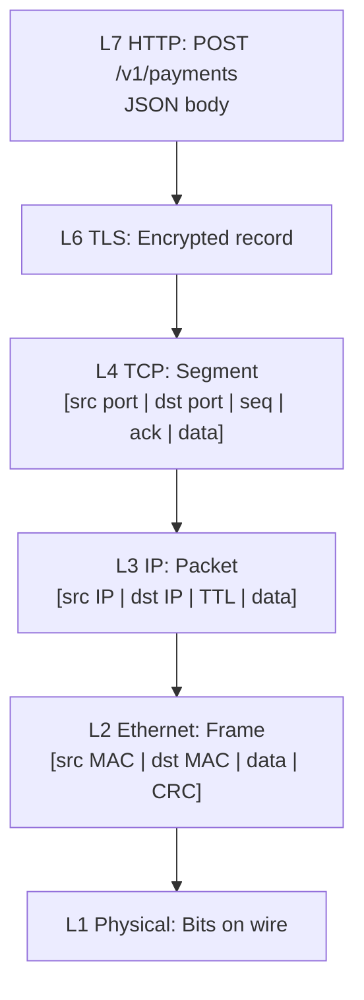
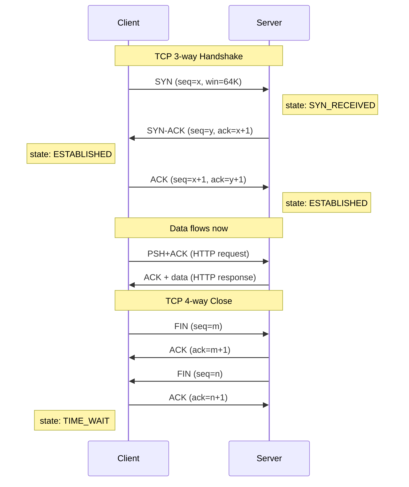
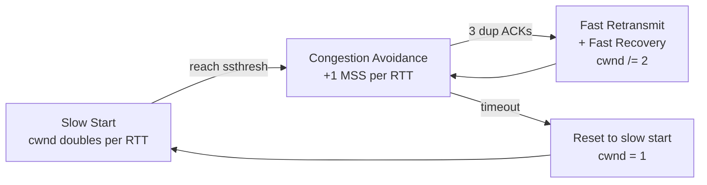
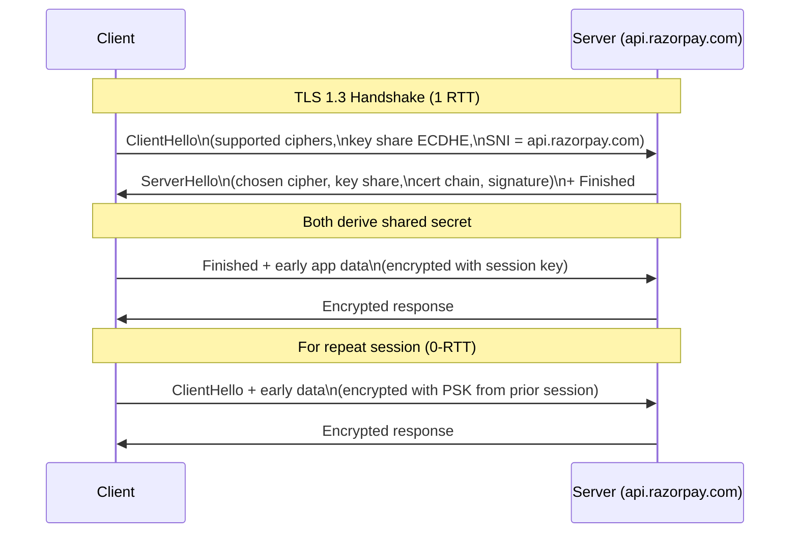

# Computer Networks — From OSI Theory to Production Stacks

Networks ek aisa subject hai jo har backend / DevOps / SRE interview mein chhupke nahi, *seedhe* aata hai. "What happens when you type google.com and press Enter?" — yeh ek single sawaal poori OSI stack chala deta hai: keyboard event se le ke browser paint tak, aur beech mein DNS, TCP, TLS, HTTP/2, load balancer, reverse proxy, CDN, origin server — sab ek ek karke unfold hote hain. Tu agar yeh chain articulate nahi kar paaya, interview mein interviewer turant samajh jaata hai ki "isko bas framework yaad hai, fundamentals nahi."

Aur production mein? Razorpay ke payment gateway pe TLS handshake 100ms se 60ms karna means crore rupees ka conversion difference. Hotstar IPL final pe CDN cache hit ratio 95% se 85% gir gaya — origin servers fat gaye, fans angry, Twitter trends. Swiggy IPL day pe DNS misconfig — TTL 86400s pe set tha, regional failover 3 hours laga, ek pura match miss. Yeh kahaaniyan textbook OSI ko production se jodti hain. Yeh subject usi gap ko bharne ke liye hai.

> **Reader profile:** 3rd/4th-year engineering student going into placements + early-career backend engineer hardening fundamentals. Tu DSA strong hai, OS theek-thaak, DBMS bhi padh chuka. Ab har system call ke neeche se network layers nikaalni hain.

Chai-pani saath rakh, packet captures dekhte hain.

---

## 1. Why Networks decide production outcomes

Pehle ek baat saaf — networks padhne ka point sirf "OSI layers yaad karna" nahi hai. Production mein har latency number, har 5xx error, har "site slow chal rahi hai" complaint kisi network layer pe jaa ke ruk jaati hai. Chal seedhe Indian product-co war stories pe chalte hain.

### 1.1 The Hotstar IPL CDN moment

Imagine: IPL final, Mumbai vs Chennai, last over, 1.2 crore concurrent viewers. Hotstar ke paas Akamai + Cloudflare + apna internal CDN — saare edge POPs (Points of Presence) ke through manifest aur HLS segments serve ho rahe hain. Cache hit ratio target: 97%. Reality strikes — ek new ad creative push hua, cache key change ho gaya silently, hit ratio 87% pe gir gaya. Origin servers (Mumbai region) ka load 6x ho gaya, p99 latency 200ms se 1.4s pe pahuncha. SRE team ne emergency `Cache-Control` header fix kiya, edges ko purge bheja, 8 minute mein ratio recover hua. Lekin un 8 minutes mein lakhs viewers buffering screen dekh rahe the. **Network layer 7 (HTTP semantics) ki ek galti production crisis ban gayi.**

### 1.2 The Razorpay TLS handshake moment

Razorpay payment gateway. Merchant checkout flow mein hota hai — client ke browser se Razorpay ke checkout iframe tak TLS handshake. TLS 1.2 mein 2 RTTs lagte the. Mumbai-based merchant, US-based shopper — RTT 220ms. Handshake alone 440ms add karta tha har transaction ke pehle. Razorpay engineering team ne TLS 1.3 + session resumption + OCSP stapling roll out kiya. Handshake 1 RTT mein, resumption pe 0-RTT. p50 checkout latency 380ms se 210ms gir gayi. Conversion rate? 1.4% jump. **TLS handshake math seedha business KPI hila deti hai.**

### 1.3 The Swiggy DNS TTL moment

Swiggy ka primary load balancer ek availability zone mein down ho gaya — AWS network event. Failover plan: Route53 health check fail → DNS record alternate LB pe point ho jaaye. Lekin authoritative DNS record ka TTL 3600s set tha, aur bohot saare ISP resolvers (Jio, Airtel) ne 1-2 hours tak stale entry serve ki. Result: 30% traffic dead endpoint pe jaata raha. Order failures, IPL day, social media explosion. Fix: TTL 60s pe le aaye, plus client-side retry with exponential backoff. **DNS TTL — ek number — multi-hour outage ka difference tha.**

### 1.4 The CRED gRPC head-of-line moment

CRED ke microservices internally gRPC bolte hain (HTTP/2 over TLS). Ek service ne accidentally HTTP/1.1 keep-alive client use kar liya — pipelining bina multiplexing. Ek slow request ne baaki sab block kar diya (head-of-line blocking). p99 latency 4x ho gayi. Migration to HTTP/2 multiplexing ne issue solve kiya. **HTTP version choice production behaviour ka direct driver hai.**

### 1.5 What you'll know after this doc

- OSI 7-layer aur TCP/IP 4-layer ka real-world mapping
- IP addressing, subnet math, CIDR — interview mein worked example
- TCP 3-way handshake, sliding window, congestion control — har state
- HTTP/1.1 vs HTTP/2 vs HTTP/3 — kab kaunsa win karta hai
- DNS resolution end-to-end, record types, caching
- TLS 1.2 vs 1.3 handshake, certs, mTLS, forward secrecy
- Sockets API, blocking vs non-blocking, epoll
- Load balancing L4 vs L7, sticky sessions, geo-LB
- 30 interview questions ka jhatpat answer

Chal shuru karte hain.

---

## 2. OSI 7-layer + TCP/IP 4-layer model

### 2.1 Why two models exist

OSI (Open Systems Interconnection) ek **conceptual** 7-layer model hai jo ISO ne 1984 mein standardize kiya. Idea: networking ko clean abstractions mein break karo, har layer ka clear responsibility. TCP/IP 4-layer model **practical** model hai — actually ye internet pe deploy hua, OSI uske baad theory ke liye aaya. Interview mein dono ka mapping pucha jaata hai. Production mein TCP/IP hi tu touch karta hai.

### 2.2 OSI 7-layer (top-down) with TCP/IP mapping

| OSI # | OSI Layer | Job | TCP/IP Layer | Real Examples |
|-------|-----------|-----|--------------|---------------|
| 7 | Application | App-level protocol semantics | Application | HTTP, gRPC, FTP, SMTP, DNS, SSH |
| 6 | Presentation | Encoding, encryption, compression | Application | TLS/SSL, JPEG, gzip, JSON serialization |
| 5 | Session | Connection sessions, sync | Application | TLS session resumption, NetBIOS, RPC |
| 4 | Transport | End-to-end delivery, reliability | Transport | TCP, UDP, QUIC, SCTP |
| 3 | Network | Routing across networks | Internet | IP (v4/v6), ICMP, OSPF, BGP |
| 2 | Data Link | Frames on local link | Link | Ethernet, Wi-Fi (802.11), ARP, MAC |
| 1 | Physical | Bits on wire/air | Link | Cables, fiber, radio, voltage levels |

Mnemonic for OSI top-down: **A**ll **P**eople **S**eem **T**o **N**eed **D**ata **P**rocessing. Top-down: Application, Presentation, Session, Transport, Network, Data Link, Physical.

### 2.3 What lives at each layer in modern stacks

Ek HTTP request `https://api.razorpay.com/v1/payments` jab tu hit karta hai, har layer ka kya role hai? Chal frame-by-frame dekhte hain:

- **L7 (HTTP/2):** `POST /v1/payments` request line, headers (`authorization`, `content-type`), JSON body.
- **L6 (TLS):** Encrypts the HTTP request bytes using AES-GCM session key derived in handshake.
- **L5 (TLS session):** Session ID / PSK so resumption can skip the full handshake.
- **L4 (TCP):** Breaks ciphertext into segments, assigns sequence numbers, dest port 443.
- **L3 (IP):** Wraps each segment in an IP packet, src IP = your laptop, dst IP = Razorpay edge LB.
- **L2 (Ethernet):** Wraps packet in a frame, src MAC = your laptop NIC, dst MAC = your home router.
- **L1 (Wi-Fi radio / fiber):** Modulates bits onto 5GHz radio waves or photons in fiber.

Server side: reverse — L1 receives bits, L2 reconstructs frame, L3 routes to right server, L4 reassembles segments, L6 decrypts, L7 nginx parses HTTP and proxies to Node.js backend.

> **Pro tip:** Modern stacks blur Presentation + Session into Application. So in TCP/IP 4-layer, "Application" includes everything from HTTP to TLS to JSON. OSI is mostly a teaching tool now.

### 2.4 Encapsulation — the matryoshka doll

Har layer apna header (and sometimes trailer) add karti hai data ke around. Yeh process **encapsulation** kehlaata hai. Sender side: data → segment → packet → frame → bits. Receiver side: opposite — **decapsulation**.



Each layer adds ~20-40 bytes of header overhead. That's why a 1-byte payload over TCP/IP/Ethernet is actually ~80+ bytes on the wire — important for IoT and ultra-low-bandwidth scenarios.

### 2.5 Why layered design wins

- **Modularity:** Tu HTTP/2 se HTTP/3 pe migrate kar sakta hai bina IP layer chhede.
- **Interop:** Cisco router aur Mikrotik router ek doosre se baat kar sakte hain — same L3 standard.
- **Debugging:** `ping` (L3), `traceroute` (L3), `tcpdump` (L2-7), `curl -v` (L7) — har tool ek layer ka lens.
- **Innovation:** QUIC ne L4 (UDP-based) reinvent kiya without breaking apps.

Layered ka cost: per-layer overhead, latency. But scale + interop wins.

---

## 3. Physical + Data Link layer essentials

Physical aur Data Link layer interview mein deep nahi pucha jaata, lekin **basics** clear hone chahiye. Yahaan se MAC, ARP, Ethernet — yeh teen cheezein zaroori hain.

### 3.1 MAC address — the hardware ID

Har Network Interface Card (NIC) ka ek **MAC address** hota hai — 48 bits, factory-burned, globally unique (mostly). Format: `aa:bb:cc:11:22:33` — 6 bytes hex. First 3 bytes = OUI (Organizationally Unique Identifier, vendor like Apple/Intel), last 3 bytes = serial.

```bash
# Linux pe apna MAC dekhne ke liye
ip link show
# ya
ifconfig | grep ether
```

MAC L2 mein use hota hai — same Ethernet/Wi-Fi segment pe frames kaha bhejni hain. IP cross-network routing karta hai, MAC same-link delivery karta hai.

### 3.2 Ethernet frame — the L2 envelope

Ethernet frame structure (simplified):

```
[ Preamble | Dst MAC (6) | Src MAC (6) | EtherType (2) | Payload (46-1500) | CRC (4) ]
```

- **EtherType:** 0x0800 = IPv4, 0x86DD = IPv6, 0x0806 = ARP. Tells receiver "what's inside the payload."
- **MTU (Max Transmission Unit):** Standard Ethernet payload max = 1500 bytes. Jumbo frames = 9000 bytes (data center networks). MTU mismatch = fragmentation = pain.

### 3.3 ARP — the bridge between L3 and L2

Tu jaanta hai ki Razorpay edge ka IP `13.234.56.78` hai. Lekin tera router doosri machine ka MAC address kaise dhoondhe? **ARP (Address Resolution Protocol).**

ARP flow on local network:
1. "Who has IP `192.168.1.1`? Tell me your MAC." — broadcast ARP request.
2. Router replies: "I have it, MAC = `aa:bb:cc:11:22:33`." — unicast ARP reply.
3. Your machine caches this in **ARP table** for ~60 seconds.

```bash
# Apna ARP cache dekho
arp -a
ip neigh show
```

Cross-subnet traffic mein ARP sirf default gateway tak resolve hota hai. Beyond that, IP routing handles karta hai.

### 3.4 Switch vs hub vs bridge

- **Hub:** Dumb. Ek port pe data aaya, sab ports pe broadcast. Half-duplex, collision-prone. Aaj museum pieces.
- **Bridge:** Two segments ko join karta hai based on MAC learning. 2-port version of switch.
- **Switch:** Multi-port, learns MAC table, forwards frames only to the correct port. Full-duplex. Modern LAN ka backbone.

Switches L2 device hain. Routers L3. Layer 3 switches both kar sakti hain.

### 3.5 Wi-Fi vs Ethernet (one note)

Wi-Fi (802.11) bhi L2 hai, lekin physically wireless. CSMA/CA (collision avoidance) use karta hai vs CSMA/CD (collision detection) on wired Ethernet. From L3+ perspective, dono same hain — IP packet runs over both.

---

## 4. IP addressing + subnetting

Yeh section interview ka **golden** zone hai. Subnet math directly poocha jaata hai. Razorpay-CRED-Atlassian level companies "split this CIDR into 4 equal subnets" type questions firte hain. Concentrate.

### 4.1 IPv4 vs IPv6 head-to-head

| Aspect | IPv4 | IPv6 |
|--------|------|------|
| Address size | 32 bits | 128 bits |
| Format | Dotted decimal `192.168.1.1` | Colon hex `2001:db8::1` |
| Total addresses | ~4.3 billion | ~3.4 × 10^38 |
| Header size | 20 bytes (variable) | 40 bytes (fixed) |
| Fragmentation | Routers can fragment | Source-only fragmentation |
| Broadcast | Yes (`255.255.255.255`) | No (multicast + anycast only) |
| NAT typical? | Yes (IPv4 exhaustion) | No (enough address space) |
| Auto-config | DHCP | SLAAC + DHCPv6 |
| Checksum | In header | Removed (relies on L2/L4) |

IPv4 exhaust ho gaya hai — yahi reason hai NAT, CGNAT, aur IPv6 push. India pe Jio + Airtel ne IPv6 deployment heavily kiya hai (60%+ Indian mobile traffic IPv6).

### 4.2 IPv4 address structure

32 bits = 4 octets, har octet 0-255. Example: `192.168.1.42` = `11000000.10101000.00000001.00101010`.

Address ka split: **network portion** + **host portion**. Original split via **classes**:

| Class | Range | Default Mask | Use |
|-------|-------|--------------|-----|
| A | 1.0.0.0 - 126.255.255.255 | /8 | Huge networks (16M hosts) |
| B | 128.0.0.0 - 191.255.255.255 | /16 | Medium (65K hosts) |
| C | 192.0.0.0 - 223.255.255.255 | /24 | Small (254 hosts) |
| D | 224.0.0.0 - 239.255.255.255 | — | Multicast |
| E | 240.0.0.0 - 255.255.255.255 | — | Reserved |

Classes wasteful the (Class B = 65K hosts, kaun use karega?). 1993 mein **CIDR (Classless Inter-Domain Routing)** aaya.

### 4.3 CIDR — the modern way

CIDR notation: `IP/prefix-length`. Example: `192.168.1.0/24` — first 24 bits = network, last 8 bits = host.

| Prefix | Subnet Mask | # of /32 hosts | Usable hosts | Common use |
|--------|-------------|----------------|--------------|------------|
| /8 | 255.0.0.0 | 16,777,216 | 16,777,214 | Class A equivalent |
| /16 | 255.255.0.0 | 65,536 | 65,534 | Mid corp |
| /24 | 255.255.255.0 | 256 | 254 | Office subnet |
| /28 | 255.255.255.240 | 16 | 14 | Small VLAN |
| /30 | 255.255.255.252 | 4 | 2 | Point-to-point link |
| /32 | 255.255.255.255 | 1 | 1 | Single host (route) |

Usable hosts = total - 2 (network address + broadcast address reserved). For /30: 4-2 = 2. For /24: 256-2 = 254.

### 4.4 Subnet math — worked examples

**Example A: From `/24` derive everything**

Given: `10.5.20.0/24`.

- Subnet mask: `255.255.255.0`
- Total addresses: 2^(32-24) = 256
- Network address: `10.5.20.0` (host bits all 0)
- Broadcast address: `10.5.20.255` (host bits all 1)
- Usable host range: `10.5.20.1` to `10.5.20.254`
- First usable: `10.5.20.1` (often gateway)
- Last usable: `10.5.20.254`

**Example B: Split `10.0.0.0/16` into 4 equal subnets**

`/16` has 65,536 addresses. 4 subnets means each gets 65536/4 = 16,384 addresses = 2^14. So new prefix = 32-14 = `/18`.

| Subnet # | CIDR | Range | Network | Broadcast | Usable hosts |
|----------|------|-------|---------|-----------|--------------|
| 1 | `10.0.0.0/18` | 0.0 - 63.255 | 10.0.0.0 | 10.0.63.255 | 10.0.0.1 – 10.0.63.254 (16,382) |
| 2 | `10.0.64.0/18` | 64.0 - 127.255 | 10.0.64.0 | 10.0.127.255 | 10.0.64.1 – 10.0.127.254 |
| 3 | `10.0.128.0/18` | 128.0 - 191.255 | 10.0.128.0 | 10.0.191.255 | 10.0.128.1 – 10.0.191.254 |
| 4 | `10.0.192.0/18` | 192.0 - 255.255 | 10.0.192.0 | 10.0.255.255 | 10.0.192.1 – 10.0.255.254 |

Trick: walk the third octet in steps of 64 (= 256/4).

**Example C: How many /27 subnets fit in a /24?**

/27 has 32 addresses. /24 has 256. So 256/32 = **8 subnets**. Each /27 gets 30 usable hosts.

### 4.5 Special / private ranges

**RFC 1918 private ranges** (not routable on public internet):

| Range | CIDR | Use |
|-------|------|-----|
| 10.0.0.0 - 10.255.255.255 | `10.0.0.0/8` | Big enterprises, VPCs |
| 172.16.0.0 - 172.31.255.255 | `172.16.0.0/12` | Mid corps, Docker default |
| 192.168.0.0 - 192.168.255.255 | `192.168.0.0/16` | Home routers |

Other reserved:
- `127.0.0.0/8` — loopback (`127.0.0.1` = your own machine)
- `169.254.0.0/16` — link-local (DHCP failure fallback, AWS metadata service `169.254.169.254`)
- `0.0.0.0/0` — "all addresses" (default route)

### 4.6 NAT — making IPv4 last forever

**Network Address Translation.** Router maps internal private IPs to a single public IP, tracking ports. Your laptop `192.168.1.42:51234` becomes `49.36.x.y:62100` on the public side. Return packets get reverse-translated.

NAT types:
- **SNAT (Source NAT):** Outbound — typical home/office.
- **DNAT (Destination NAT):** Inbound — port forwarding to a server.
- **PAT (Port Address Translation):** Many internal IPs share one public via different ports.
- **CGNAT (Carrier-Grade NAT):** ISP-level NAT (Jio, Airtel) — multiple subscribers share one public IP. Pain for P2P, gaming.

NAT broke "every host has a unique public IP" assumption. P2P, VoIP, online games — sab NAT traversal techniques (STUN, TURN, ICE) use karte hain.

### 4.7 IPv6 brief

128 bits = 8 groups of 16 bits hex, separated by `:`. Example: `2001:0db8:85a3:0000:0000:8a2e:0370:7334`.

**Notation rules:**
- Leading zeros drop: `2001:db8:85a3:0:0:8a2e:370:7334`
- Consecutive zero groups collapse to `::` (only once): `2001:db8:85a3::8a2e:370:7334`
- Loopback: `::1`
- All-zeros: `::`

**Scope:**
- **Link-local** (`fe80::/10`): only on the same link, auto-assigned.
- **Unique-local** (`fc00::/7`): private, like RFC 1918.
- **Global unicast** (`2000::/3`): public internet.
- **Multicast** (`ff00::/8`): one-to-many.

No broadcast — replaced by multicast. IPv6 native auto-config via SLAAC + Router Advertisements.

---

## 5. TCP vs UDP

Transport layer ka boss yahaan se shuru hota hai. TCP and UDP — same L4, opposite philosophies.

### 5.1 The two protocols at a glance

| Feature | TCP | UDP |
|---------|-----|-----|
| Connection | Stateful (handshake) | Connectionless |
| Reliability | Guaranteed delivery + order | None — fire and forget |
| Ordering | Yes (sequence numbers) | No |
| Flow control | Yes (sliding window) | No |
| Congestion control | Yes | No (app must handle) |
| Header size | 20 bytes (min) | 8 bytes |
| Use cases | HTTP, SSH, SMTP, DB | DNS, video stream, gaming, VoIP, QUIC |

### 5.2 TCP 3-way handshake — the canonical sequence

Connection establishment between client (laptop) and server (Razorpay edge `:443`):



- **SYN** = "Synchronize, want to start." Carries initial sequence number (ISN).
- **SYN-ACK** = "Sure, my ISN is y, I acknowledge yours."
- **ACK** = "Got it." Now both sides have ISNs, connection ESTABLISHED.

This 3-way handshake = 1.5 RTTs round-trip, but the data send happens at 1 RTT after handshake. Total: ~1 RTT before app data exchange begins.

### 5.3 TCP sequence numbers + acknowledgments

Har byte stream mein sequence number get karta hai. ISN random (security). ACK = "next expected byte." If client sends bytes 1-100, server ACKs 101 (= I got 100, send me 101 next).

```
Client sends: SEQ=1, payload=100 bytes
Server replies: ACK=101 (I got bytes 1-100, send 101 next)
```

Loss → no ACK in time → retransmission.

### 5.4 Sliding window — flow control

Receiver advertises `window` = how many bytes it can buffer. Sender can have at most `window` bytes "in flight" (sent but unacked). Window slides forward as ACKs arrive.

```
Window = 8 segments
Sent + unacked: [1][2][3][4]
Acked: [_][_][_]
Free to send: [5][6][7][8]

After ACK for 1-3:
Window slides → can now send [9][10][11]
```

Window size negotiated dynamically based on receiver buffer. Modern systems use **window scaling** (RFC 7323) to allow > 64KB windows for high-bandwidth links.

### 5.5 Congestion control — TCP's traffic management

Sliding window protects receiver. **Congestion window (cwnd)** protects the *network*. Algorithms:

**Slow start:**
- Start cwnd = 1 MSS (Maximum Segment Size, ~1460 bytes).
- For every ACK received, cwnd *= 2 (exponential growth).
- Continue until `ssthresh` (slow start threshold).

**Congestion avoidance (AIMD — Additive Increase, Multiplicative Decrease):**
- After ssthresh, cwnd grows linearly (+1 MSS per RTT).
- On packet loss, cwnd /= 2 (multiplicative decrease) and ssthresh updated.

**Fast retransmit:**
- 3 duplicate ACKs = packet probably lost (not just out-of-order). Retransmit immediately, don't wait for timeout.

**Fast recovery:**
- After fast retransmit, don't drop cwnd to 1 (that's "slow start"). Instead, halve cwnd and continue from there.



Modern algorithms: Reno, NewReno, CUBIC (Linux default), BBR (Google's bottleneck-bandwidth). BBR doesn't use loss as signal — uses bandwidth estimation. Production CDNs increasingly use BBR.

### 5.6 TCP states — the lifecycle

| State | Meaning |
|-------|---------|
| `LISTEN` | Server waiting for incoming connections |
| `SYN_SENT` | Client sent SYN, waiting for SYN-ACK |
| `SYN_RECEIVED` | Server got SYN, sent SYN-ACK, waiting for ACK |
| `ESTABLISHED` | Connection live, data flowing |
| `FIN_WAIT_1` | One side sent FIN |
| `FIN_WAIT_2` | Got ACK for FIN, waiting for other side's FIN |
| `CLOSE_WAIT` | Got FIN, app hasn't called close yet |
| `LAST_ACK` | Sent FIN after close_wait, waiting for ACK |
| `TIME_WAIT` | Wait 2*MSL (~60s) before fully closing — handles delayed packets |
| `CLOSED` | Fully done |

```bash
# Live connections + states dekho
ss -tan
netstat -an | grep ESTABLISHED
```

> **Production gotcha:** Too many `TIME_WAIT` sockets exhausts ephemeral port range. Symptom: "cannot assign requested address." Fix: `SO_REUSEADDR`, tune `tcp_tw_reuse` (Linux), or use connection pooling.

### 5.7 When UDP wins

UDP has no handshake, no retransmit, no ordering. Sounds bad, but for some workloads it's exactly right:

- **DNS:** Queries are tiny, mostly fit in one packet. App-level retry is fine. Saves handshake overhead.
- **Video streaming (live):** A dropped frame is better than a 200ms-late frame. App layer (HLS, DASH) handles missing chunks.
- **Online gaming:** Latest game state matters more than every state. UDP + custom sequencing wins.
- **VoIP:** Same — old audio packet useless, drop it.
- **NTP:** Time sync, single packet round trip.
- **DHCP, SNMP:** Small, stateless.

### 5.8 QUIC — TCP and UDP have a child

QUIC = Quick UDP Internet Connections. Google built it, IETF standardized. Sits on UDP, but provides:
- Reliable delivery (like TCP) at the QUIC layer
- Built-in TLS 1.3 (no separate handshake)
- Stream multiplexing (each stream independent — no head-of-line blocking)
- Connection migration (switch from Wi-Fi to 4G without dropping)
- 0-RTT for repeat connections

HTTP/3 runs on QUIC. Cloudflare, Google, Facebook serve large fractions of traffic via QUIC today.

### 5.9 TCP vs UDP — interview cheat sheet

> "Why does DNS use UDP, but zone transfers use TCP?" — Standard queries fit in 512 bytes (UDP), zone transfers (AXFR) are large, ordered, need TCP reliability.

> "Why does HTTP/3 use UDP if TCP is reliable?" — HTTP/2 had head-of-line blocking at TCP level. QUIC moved reliability per-stream into user-space, on UDP.

> "Why TIME_WAIT is 2*MSL?" — MSL = Max Segment Lifetime (~30s). 2*MSL ensures any old duplicate packet from this connection has died before the same 4-tuple can be reused.

---

## 6. HTTP versions

HTTP = the workhorse of L7. Har web request, REST API, GraphQL, gRPC — sab HTTP ke ya HTTP/2 ke top pe baithte hain.

### 6.1 HTTP/1.0 (1996)

- Simple request/response, plaintext.
- New TCP connection per request.
- No `Host` header initially — one site per IP.

```http
GET /index.html HTTP/1.0
User-Agent: Mozilla/2.0
```

Cost: handshake per request kills throughput. Prehistoric for production today.

### 6.2 HTTP/1.1 (1997, refined to RFC 7230 in 2014)

Major improvements:
- **`Host` header** — multiple sites per IP (virtual hosting).
- **Persistent connections (`Connection: keep-alive`)** — reuse TCP for many requests.
- **Pipelining** — send multiple requests without waiting for responses (rarely used in practice — head-of-line blocking).
- **Chunked transfer encoding** — stream responses without knowing total length.
- **Caching headers** — `Cache-Control`, `ETag`, `If-Modified-Since`.

```http
GET /api/user/123 HTTP/1.1
Host: api.razorpay.com
Connection: keep-alive
Accept: application/json
```

Production reality: most browsers open 6 parallel TCP connections per origin to work around HoL blocking. HTTP/1.1 is still ubiquitous in 2026 (server-to-server, legacy).

### 6.3 HTTP/2 (2015, RFC 7540)

Binary protocol, breaks from plaintext heritage. Key features:

- **Multiplexing:** Many requests/responses over one TCP connection, identified by stream IDs. No HoL at HTTP layer.
- **Binary framing:** Headers + body framed in binary, easier to parse, less ambiguous.
- **Header compression (HPACK):** Repeated headers (cookies, user-agent) compressed via dictionary.
- **Server push:** Server can preemptively send resources (e.g., CSS) before client asks. (Mostly deprecated now.)
- **Priority + flow control per stream.**

Caveat: HTTP/2 still uses TCP. So while HTTP-layer HoL is gone, **TCP-layer HoL** remains — one lost packet stalls all streams sharing that TCP connection.

### 6.4 HTTP/3 (2022, RFC 9114)

HTTP semantics on **QUIC** (not TCP). Properties:

- **No TCP HoL:** Per-stream reliability inside QUIC means one lost packet only stalls one stream.
- **Faster handshake:** TLS 1.3 baked in, 1-RTT connection setup, 0-RTT for resumption.
- **Connection migration:** Mobile network switch (Wi-Fi → 4G) doesn't drop connection.
- **UDP-based:** Some networks block/throttle UDP; rare but real.

Current 2026 state: ~30% of public internet traffic is HTTP/3. Major CDNs and Big Tech serve it; long tail still HTTP/1.1 or HTTP/2.

### 6.5 REST verbs + status codes

REST uses HTTP verbs semantically:

| Verb | Use | Idempotent? | Safe? |
|------|-----|-------------|-------|
| GET | Read resource | Yes | Yes |
| HEAD | Like GET, headers only | Yes | Yes |
| POST | Create / non-idempotent ops | No | No |
| PUT | Replace resource (full) | Yes | No |
| PATCH | Partial update | No (typically) | No |
| DELETE | Remove resource | Yes | No |
| OPTIONS | CORS preflight, capabilities | Yes | Yes |

**Status codes — interview hot zone:**

| Code | Meaning | Common confusion |
|------|---------|------------------|
| 200 | OK | — |
| 201 | Created | Use after successful POST that creates a resource |
| 204 | No Content | DELETE success |
| 301 | Moved Permanently | Browsers cache aggressively; bad redirects = permanent SEO damage |
| 302 | Found / Temporary Redirect | Don't cache; safer for A/B routing |
| 304 | Not Modified | Conditional GET hit, body absent |
| 400 | Bad Request | Malformed JSON, validation fail |
| 401 | Unauthorized | "Auth missing or invalid" — really *unauthenticated* |
| 403 | Forbidden | Authenticated but not allowed — really *unauthorized* |
| 404 | Not Found | Resource missing |
| 409 | Conflict | Version mismatch, duplicate insert |
| 422 | Unprocessable Entity | Semantic validation failure |
| 429 | Too Many Requests | Rate limit hit |
| 500 | Internal Server Error | Generic server crash |
| 502 | Bad Gateway | LB/proxy got an invalid response from upstream |
| 503 | Service Unavailable | Server overloaded or in maintenance |
| 504 | Gateway Timeout | LB/proxy didn't get a response in time |

> **Interview classic:** "401 vs 403?" 401 = "I don't know who you are" (login first). 403 = "I know you but you can't access this." The names confuse — "Unauthorized" really means unauthenticated. Stripe famously uses 401 for missing key, 403 for valid key without permission.

> **502 vs 504?** 502 = upstream gave a *malformed* / connection-reset response. 504 = upstream didn't respond in time at all.

### 6.6 REST vs gRPC vs GraphQL vs WebSockets

| Approach | Transport | Strengths | Weaknesses | Use cases |
|----------|-----------|-----------|------------|-----------|
| **REST** | HTTP/1.1 or HTTP/2, JSON | Simple, cacheable, ubiquitous tooling | Over/under-fetching, no built-in streaming | Public APIs, CRUD |
| **gRPC** | HTTP/2, protobuf | Fast, schema-driven, bidirectional streaming | Browsers can't use directly (need grpc-web) | Microservices internal RPC |
| **GraphQL** | HTTP, JSON | Client picks fields, single endpoint | Caching hard, complex resolver logic, N+1 risk | Mobile apps, BFFs |
| **WebSockets** | HTTP upgrade → raw TCP frames | Bidirectional realtime | Stateful, scaling tricky | Chat, live dashboards, trading |
| **SSE** | HTTP/1.1 chunked | Server → client one-way push, simple | One-way only, browser limit | Notifications, log streams |

Real choice example: Razorpay public API = REST. Razorpay internal service mesh = gRPC. Hotstar live score updates = SSE. Cred chat support = WebSockets. Swiggy mobile app aggregator = GraphQL.

---

## 7. DNS — the internet's phonebook

DNS resolution silent rehta hai jab tak break na ho. Jab toot ta hai, **everything** breaks — har request DNS pe nirbhar hai.

### 7.1 The hierarchy

DNS is a distributed, hierarchical database:

```
. (root)
├── com (TLD nameserver)
│   ├── google.com
│   ├── razorpay.com (authoritative NS)
│   │   ├── api.razorpay.com (A record)
│   │   └── checkout.razorpay.com
│   └── hotstar.com
├── in
│   └── swiggy.in
└── org
    └── wikipedia.org
```

13 root nameserver clusters worldwide (anycast). TLD servers handle `.com`, `.in`, `.org`. Authoritative servers are owned by domain registrars or hosted via Route53 / Cloudflare DNS / NS1.

### 7.2 Recursive vs iterative resolution

- **Recursive resolver** (your ISP's DNS, 8.8.8.8, 1.1.1.1) does the heavy lifting — walks the chain on your behalf.
- **Iterative** = each step you do yourself — you ask root, root says "ask .com TLD," you ask TLD, etc.

Browser → Recursive resolver: "What's `api.razorpay.com`?"
Resolver does iterative walk:
1. Ask root: "Who handles `.com`?" → Verisign TLD NS.
2. Ask Verisign TLD: "Who's authoritative for `razorpay.com`?" → e.g., `ns1.aws.amazon.com`.
3. Ask Route53: "What's `api.razorpay.com`?" → A record `13.234.56.78`.
4. Cache + return.

```bash
# Trace yourself
dig +trace api.razorpay.com
nslookup -type=NS razorpay.com
```

### 7.3 Record types

| Record | Maps | Example |
|--------|------|---------|
| **A** | name → IPv4 | `api.razorpay.com → 13.234.56.78` |
| **AAAA** | name → IPv6 | `api.razorpay.com → 2406:da00:...` |
| **CNAME** | alias → another name | `www.swiggy.com → swiggy.com` |
| **MX** | mail exchange | `swiggy.com mail → mx1.swiggy.com (priority 10)` |
| **TXT** | arbitrary text | SPF, DKIM, domain verification |
| **NS** | which servers are authoritative | `razorpay.com → ns1.aws.amazon.com` |
| **SOA** | zone metadata | serial, refresh, expire timers |
| **PTR** | IP → name (reverse DNS) | `13.234.56.78 → api.razorpay.com` |
| **SRV** | service location | `_xmpp._tcp` for chat services |
| **CAA** | which CAs may issue certs | `razorpay.com → letsencrypt.org` |

### 7.4 TTL + caching

Every DNS record has TTL (Time To Live) in seconds. Resolvers cache. Browsers cache. OS caches. Apps cache.

- **Short TTL (60s):** Fast failover, more queries, more load on auth NS.
- **Long TTL (3600s+):** Better cache hit rate, but slow change propagation.

> **War story:** Swiggy IPL outage — TTL 3600 was too long for a fast LB switch. Production rule: critical records (LB endpoints, API hosts) → 60s TTL. Stable records (MX, NS) → 86400s.

### 7.5 DNS security + DoH

Plain DNS = UDP port 53, unencrypted. ISPs and middleboxes can snoop and tamper.

- **DNSSEC:** Signs records, prevents tampering. Adoption: meh.
- **DNS over HTTPS (DoH):** DNS queries inside HTTPS to a DoH resolver (Cloudflare `1.1.1.1`, Google `8.8.8.8`). Encrypted. Used by Firefox, Chrome.
- **DNS over TLS (DoT):** Same idea, dedicated TLS port 853.

DoH bypasses ISP-level DNS censorship — controversial in some countries, but a privacy win.

---

## 8. TLS / SSL

TLS = Transport Layer Security (modern). SSL = predecessor (deprecated). When people say "SSL cert," they mean TLS cert. TLS sits at L6/L7 boundary, encrypting everything above TCP.

### 8.1 What TLS provides

1. **Confidentiality:** Eavesdroppers can't read your data.
2. **Integrity:** Tampering is detected (MAC / AEAD).
3. **Authentication:** You know you're really talking to `api.razorpay.com`, not a man-in-the-middle.
4. **Forward secrecy (modern):** Even if server's long-term key leaks tomorrow, today's recorded traffic stays unreadable.

### 8.2 Symmetric vs asymmetric — the dance

- **Asymmetric (RSA, ECDHE):** Public + private key pair. Slow but enables key exchange and signatures.
- **Symmetric (AES-GCM, ChaCha20):** Single shared key. Fast — actual data encryption.

TLS uses asymmetric only to **bootstrap** a symmetric session key. Then the bulk traffic is symmetric.

### 8.3 TLS 1.2 vs TLS 1.3 handshake

TLS 1.2 = 2 RTTs. TLS 1.3 = 1 RTT (or 0-RTT with PSK). Visualize TLS 1.3:



TLS 1.2 had a separate `ClientKeyExchange` and `ChangeCipherSpec` round, hence 2 RTTs.

### 8.4 Certificates and CAs

TLS authentication via X.509 certificates. A cert binds:
- **Subject:** the domain (`api.razorpay.com`)
- **Public key:** server's public key
- **Issuer:** the CA that signed it
- **Validity period:** start + expiry
- **Signature:** issuer's signature over the cert content

**Chain of trust:**

```
Root CA (e.g., DigiCert Root) — pre-installed in OS/browser
   └── Intermediate CA (e.g., DigiCert SHA2)
        └── End-entity cert (api.razorpay.com)
```

Browser verifies up the chain, terminating at a trusted root in its trust store. Let's Encrypt democratized certs (free, automated).

```bash
# Inspect a cert chain
openssl s_client -connect api.razorpay.com:443 -servername api.razorpay.com < /dev/null
```

### 8.5 Mutual TLS (mTLS)

Standard TLS authenticates the server. **mTLS** authenticates **both** sides. Client must also present a cert. Used in:
- Service-to-service auth in microservice meshes (Istio, Linkerd)
- Internal RPC (CRED's gRPC mesh)
- Banking / fintech regulated APIs (Razorpay <> partner banks)
- Zero-trust networks

### 8.6 Forward secrecy

Without forward secrecy: if attacker records traffic today and steals server's private key in 5 years, they can decrypt everything retroactively.

With FS (via ECDHE — Ephemeral Diffie-Hellman): each session has an ephemeral key derived fresh, never written to disk. Long-term key only signs the exchange, doesn't decrypt it.

TLS 1.3 mandates FS. TLS 1.2 with non-DHE ciphers (RSA key exchange) is forbidden in modern config.

### 8.7 SNI + ALPN

- **SNI (Server Name Indication):** TLS handshake sends the domain in plaintext (`ClientHello`) so a server hosting many domains on one IP picks the right cert. Pre-SNI, you needed one IP per HTTPS site.
- **ALPN (Application-Layer Protocol Negotiation):** Client and server negotiate `h2` (HTTP/2), `http/1.1`, or `h3` during TLS handshake — saves a round trip vs separate negotiation.

> **Privacy note:** SNI is plaintext, so eavesdroppers see *which* site you're visiting (not content). **ECH (Encrypted Client Hello)** addresses this; rolling out 2023+.

---

## 9. Sockets programming

Sockets = the OS-level API for network I/O. Berkeley sockets (BSD, 1983) became the de-facto standard. Every language ka socket library wahi underlying syscalls call karta hai: `socket()`, `bind()`, `listen()`, `accept()`, `connect()`, `send()`, `recv()`, `close()`.

### 9.1 The Berkeley sockets mental model

A socket = a (protocol, IP, port) tuple endpoint. Server flow:

```
socket() → bind(IP, port) → listen() → accept() → read/write → close()
```

Client flow:

```
socket() → connect(server_IP, port) → read/write → close()
```

Each `accept()` returns a *new* socket dedicated to that client; the listening socket keeps accepting more.

### 9.2 Blocking vs non-blocking I/O

- **Blocking (default):** `recv()` blocks until data is available. Simple to write, but one socket per thread = thousands of threads = death.
- **Non-blocking:** `recv()` returns immediately with `EWOULDBLOCK` if no data. App must poll or use an event loop.

### 9.3 select / poll / epoll progression

Multiplexing thousands of sockets in one thread evolved through 3 generations:

| API | Year | Limit | Cost per call |
|-----|------|-------|---------------|
| `select` | 1983 | FD_SETSIZE = 1024 | O(N) scan of fdset |
| `poll` | 1986 | No hard limit | O(N) scan |
| `epoll` (Linux) / `kqueue` (BSD) | 2002 | Millions | O(active events) |

`epoll` is the engine behind nginx, HAProxy, Node.js (via libuv), Redis. It uses kernel-level event registration; you only get notified about ready FDs.

### 9.4 Python TCP echo server (runnable)

Yeh server kisi bhi machine pe run karke `nc localhost 9000` se test kar sakta hai.

```python
# echo_server.py
import socket

HOST, PORT = "127.0.0.1", 9000

with socket.socket(socket.AF_INET, socket.SOCK_STREAM) as s:
    s.setsockopt(socket.SOL_SOCKET, socket.SO_REUSEADDR, 1)
    s.bind((HOST, PORT))
    s.listen()
    print(f"echo server listening on {HOST}:{PORT}")
    while True:
        conn, addr = s.accept()
        with conn:
            print(f"connected by {addr}")
            while True:
                data = conn.recv(1024)
                if not data:
                    break
                conn.sendall(data)
```

Test:

```bash
python3 echo_server.py &
echo "hello networks" | nc 127.0.0.1 9000
# Output: hello networks
```

### 9.5 Async / event-loop — the modern model

Every modern server (Node.js, Python asyncio, Go's runtime, Rust's tokio) uses event loops powered by epoll/kqueue under the hood. You write `async`/`await`, runtime multiplexes thousands of in-flight connections on a small thread pool.

Go's goroutines are special — each goroutine looks blocking, but the runtime parks it on epoll when it does network I/O. Best of both worlds: simple code + scalable runtime.

---

## 10. Load balancing + reverse proxies

Production traffic kabhi seedha tere app server pe nahi aata — beech mein load balancer baithta hai. LB ka job: traffic distribute, health check, TLS terminate, rate limit, observability.

### 10.1 L4 vs L7 load balancing

| Aspect | L4 (Transport) | L7 (Application) |
|--------|----------------|------------------|
| Sees | TCP/UDP + IP only | Full HTTP request |
| Decisions | By IP, port, connection | By URL path, header, cookie, body |
| Speed | Faster, less CPU | Slower, more flexible |
| TLS | Pass-through (or terminate at LB but no path-based logic) | Terminate at LB, decrypt, route |
| Examples | AWS NLB, IPVS, HAProxy TCP mode | AWS ALB, nginx, Envoy, HAProxy HTTP mode, CloudFront |

L4 example: route `tcp/443` to a pool of 50 backends, hash by source IP for stickiness.

L7 example: route `GET /api/payments/*` to payments service, `GET /api/orders/*` to orders service, with retries on 5xx and weighted canaries.

### 10.2 Algorithms

- **Round-robin:** request 1 → server A, 2 → B, 3 → C, repeat. Simple. Doesn't account for server load.
- **Weighted round-robin:** A gets weight 3, B weight 1 → A handles 75%. For heterogeneous fleets.
- **Least connections:** Pick server with fewest active connections. Better when request durations vary.
- **Least response time:** Pick server with lowest avg latency. Even smarter, harder to compute.
- **IP hash / consistent hash:** Hash client IP → server. Sticky without cookies. Used for session affinity, cache locality (memcached-style).
- **Random + 2 choices:** Pick 2 servers at random, send to less-loaded one. Surprisingly close to optimal, very simple.

### 10.3 HAProxy vs nginx vs cloud LBs

- **HAProxy:** Battle-tested, fast, deep TCP/HTTP smarts, runs everywhere. Used at GitHub, Stack Overflow, fintechs.
- **nginx:** Reverse proxy first, LB second. Excels at static serving, caching, rewrite rules. Often paired with app servers (uWSGI, gunicorn, PHP-FPM). nginx Plus adds full-featured LB.
- **Envoy:** Modern, dynamic config, native gRPC + HTTP/2, the data plane for service meshes (Istio).
- **AWS ELB family:** Classic (deprecated), ALB (L7), NLB (L4 ultra-fast), GWLB (firewall-style). Auto-scales, integrates with target groups.
- **GCP Load Balancer:** Global anycast, single IP for worldwide traffic, integrates with Cloud Armor.
- **Cloudflare / Akamai:** Anycast edge, DDoS scrubbing, baked-in CDN.

### 10.4 Geo + sticky sessions

**Geo LB:** Route users to nearest region. Razorpay typical setup — Mumbai region for India traffic, Singapore for SEA, fallback Frankfurt. Done via:
- **DNS geo-routing** (Route53 latency-based / geolocation)
- **Anycast IP** (single IP, BGP routes to nearest POP)

**Sticky sessions:** Some apps store session state in memory; subsequent requests must hit the same server. Mechanisms:
- Cookie-based: LB sets cookie naming server, routes by it.
- IP-hash: same client IP always to same server (breaks behind CGNAT).
- Better: store session in Redis, kill stickiness, scale horizontally freely.

### 10.5 Reverse proxy vs forward proxy

- **Reverse proxy:** Sits in front of servers (nginx in front of Node app). Clients see only the proxy.
- **Forward proxy:** Sits in front of clients (corporate proxy filtering web traffic). Servers see only the proxy.

LB is usually a reverse proxy with extra features.

### 10.6 Production tip: connection draining + health checks

When deploying, you don't want active connections killed mid-request. **Connection draining** — LB stops sending new connections to that backend, lets existing ones complete (with timeout), then removes it.

**Health checks** — LB pings `/health` every N seconds; failure threshold removes the backend. Pro tip: differentiate **liveness** (is process alive?) from **readiness** (is it ready to serve traffic?). Kubernetes formalizes both.

---

## 11. Top 30 Networks interview Q+A

| # | Question | One-line answer |
|---|----------|-----------------|
| 1 | What are the OSI 7 layers top-down? | Application, Presentation, Session, Transport, Network, Data Link, Physical |
| 2 | TCP vs UDP one-line? | TCP = connection, reliable, ordered; UDP = connectionless, fast, no guarantees |
| 3 | Why is TCP handshake 3-way and not 2? | Both sides must confirm receipt of each other's ISN; 2-way leaves ambiguity on duplicate SYNs |
| 4 | What is TIME_WAIT and how long? | Wait state after close, 2*MSL (~60s) to absorb stray packets |
| 5 | Explain congestion control. | Slow start (exponential), then AIMD (linear up, halve on loss); modern: CUBIC, BBR |
| 6 | HTTP/1.1 vs HTTP/2 vs HTTP/3? | 1.1 plaintext+keepalive; 2 binary+multiplexing on TCP; 3 on QUIC/UDP, no TCP HoL |
| 7 | 401 vs 403? | 401 = not authenticated; 403 = authenticated but not allowed |
| 8 | 502 vs 504? | 502 = bad upstream response; 504 = upstream timeout |
| 9 | What is DNS recursion vs iteration? | Recursive resolver does the full chain walk; iterative = client walks it step by step |
| 10 | Common DNS records? | A, AAAA, CNAME, MX, TXT, NS, SOA, PTR, SRV |
| 11 | TLS 1.2 vs 1.3 RTTs? | 1.2 = 2 RTTs; 1.3 = 1 RTT (or 0-RTT with PSK) |
| 12 | What is forward secrecy? | Past traffic stays safe even if long-term key leaks; via ephemeral DH keys |
| 13 | What is mTLS? | Both client and server present certs; used in service meshes and zero-trust |
| 14 | What is SNI? | TLS extension that tells server which hostname is requested, so it picks the right cert |
| 15 | What is ARP? | Resolves IP → MAC on a local subnet; broadcast question, unicast answer |
| 16 | Public vs private IP ranges? | RFC 1918: 10/8, 172.16/12, 192.168/16; rest is publicly routable |
| 17 | What is NAT? | Maps private IPs+ports to public IP+port, lets many internal hosts share one public IP |
| 18 | Subnet mask of /27? | 255.255.255.224, 32 addresses, 30 usable hosts |
| 19 | How many usable hosts in /29? | 2^(32-29) - 2 = 6 |
| 20 | Why broadcast address reserved? | "All hosts on this subnet" — sending here floods all hosts; can't be a unicast host |
| 21 | What is MTU? | Largest payload size at L2; standard Ethernet 1500 bytes; mismatch causes fragmentation |
| 22 | What is HoL blocking in HTTP/2? | At TCP layer — one lost packet stalls all multiplexed streams; QUIC/HTTP3 fixes it |
| 23 | When to use UDP over TCP? | DNS queries, live video, gaming, VoIP, NTP — speed > reliability |
| 24 | What is QUIC? | UDP-based transport with built-in TLS 1.3, per-stream reliability, used by HTTP/3 |
| 25 | L4 vs L7 LB? | L4 routes by IP/port; L7 routes by HTTP path/headers/cookies |
| 26 | What is sticky session? | LB pins client to same backend, via cookie or IP hash; needed for in-memory session apps |
| 27 | What is a CDN? | Geo-distributed cache near users, reduces origin load + latency; serves static + dynamic |
| 28 | DoH vs plain DNS? | DoH wraps DNS in HTTPS, hides queries from ISPs and middleboxes |
| 29 | What does `traceroute` use? | Sends UDP/ICMP packets with increasing TTL; each hop replies "Time Exceeded" revealing path |
| 30 | How does HTTPS protect you on coffee-shop Wi-Fi? | TLS encrypts payload + authenticates server; ARP spoofing or evil-twin can't read your data without breaking TLS |

---

## 12. Pre-interview checklist

Last 60 seconds before you walk in — mentally tick these:

- [ ] Can I list OSI 7 layers in order, top-down, with one example each?
- [ ] Can I draw TCP 3-way handshake on a whiteboard with sequence numbers?
- [ ] Can I explain TCP states: LISTEN, ESTABLISHED, FIN_WAIT, TIME_WAIT?
- [ ] Can I describe slow start, AIMD, fast retransmit, fast recovery in 60 seconds?
- [ ] Can I tell when UDP wins over TCP — at least 4 cases?
- [ ] Can I explain QUIC and why HTTP/3 needs it?
- [ ] Can I split a /16 into 4 equal subnets and write CIDRs?
- [ ] Can I name RFC 1918 private ranges?
- [ ] Can I explain NAT and CGNAT in 30 seconds?
- [ ] Do I know IPv6 notation rules + scope (link-local, global)?
- [ ] Can I trace a `https://api.foo.com` request from URL to HTTP response?
- [ ] Can I describe DNS recursive vs iterative resolution?
- [ ] Do I know A vs AAAA vs CNAME vs MX vs TXT?
- [ ] Can I explain TTL trade-off (short vs long) with a real war story?
- [ ] Can I draw TLS 1.3 handshake and contrast with TLS 1.2?
- [ ] Can I distinguish symmetric vs asymmetric crypto roles in TLS?
- [ ] Can I explain forward secrecy + why ECDHE matters?
- [ ] Can I explain mTLS + at least one production use case?
- [ ] Can I write a 10-line Python TCP echo server from memory?
- [ ] Do I know epoll vs select vs poll big-O differences?
- [ ] Can I explain L4 vs L7 LB with two example algorithms each?
- [ ] Can I distinguish 301 vs 302, 401 vs 403, 502 vs 504?
- [ ] Can I justify gRPC vs REST vs GraphQL vs WebSockets per use case?
- [ ] Will I narrate trade-offs out loud — not just give yes/no answers?

If 18+ ticked, walk in confident. Networks rewards depth — agar tu *kyu* samajh raha hai, tu jeet jayega.

---

## What to learn next

Networks strong ho gaya — ab compounding effect ke liye yeh order follow kar:

- **`system-design-basics`** — client-server, API design, monolith vs microservices, CDN; networks ka direct extension
- **`system-design-advanced`** — sharding, replication, consensus, geo-distributed systems; har section networks pe stand karta hai
- **`server-deployment`** — nginx, HAProxy, TLS configs, real ops
- **`monitoring-observability`** — RED/USE metrics, distributed tracing — har trace ek network call hai
- **`docker-containers`** + **`kubernetes-orchestration`** — overlay networks, CNI plugins, service meshes — networks ka next chapter
