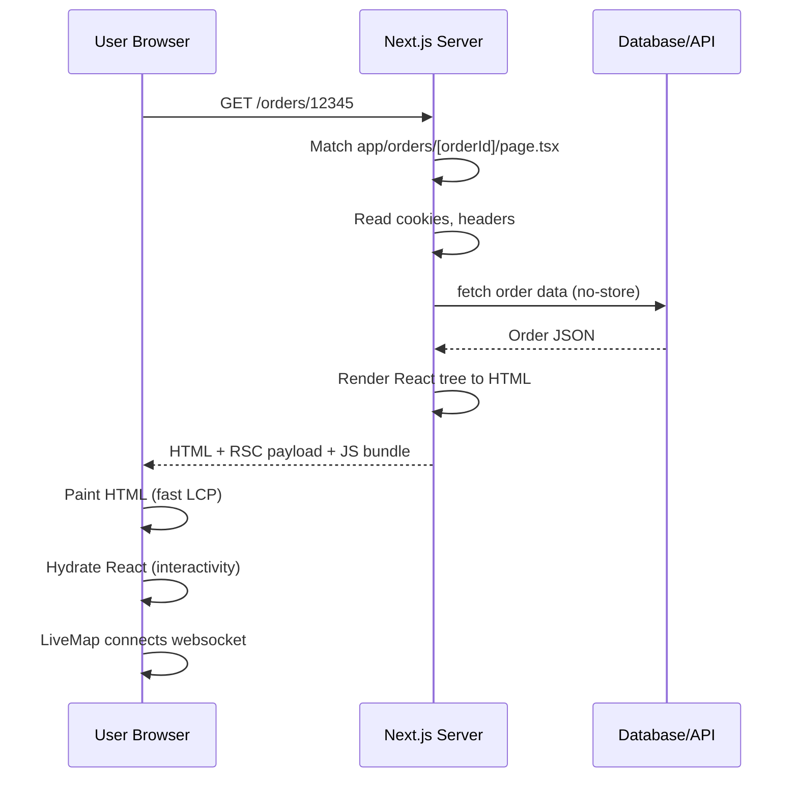
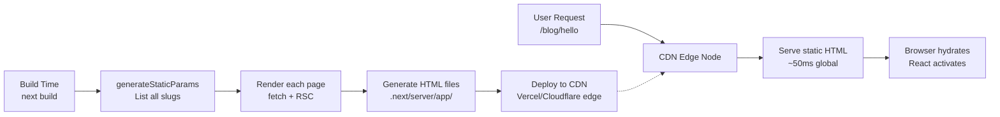
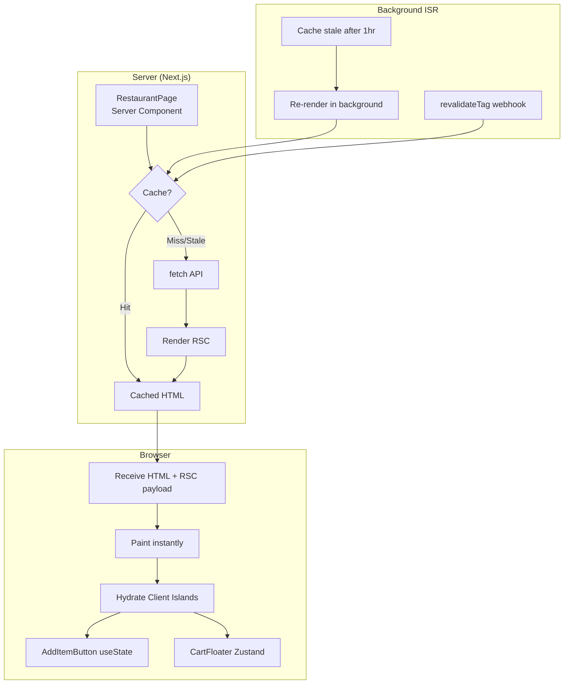
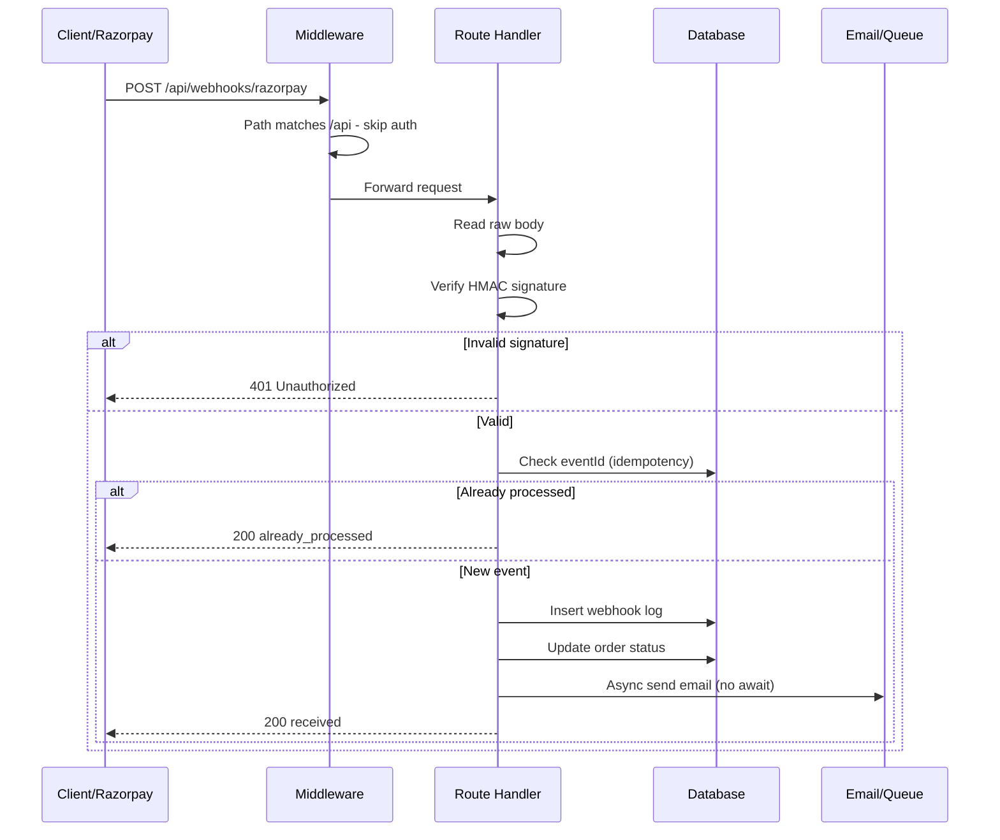

# Next.js (Modern, App Router)

Bhai, suno. Next.js basically React ka full-stack version hai. Sirf React me tu UI bana sakta hai, but Next.js me routing, server-side rendering, API routes, image optimization, sab kuch ek framework me milta hai. Aaj ki date 2026 hai aur hum jo version padh rahe hain woh Next.js 14/15/16 (App Router) hai — ye purane Pages Router se fundamentally alag hai. Pages Router me sab kuch client-side React tha aur server-side ek thin layer thi. App Router me React Server Components (RSC) first-class citizens hain, matlab default har component server pe render hota hai jab tak tu khud `'use client'` directive na lagaye.

Ye paradigm shift kyon zaroori hai? Kyunki modern web apps me data fetching, SEO, performance — sab cheezein matter karti hain. Pure client-side React me tu `useEffect` me fetch karta tha, loading spinner dikhata tha, phir data render hota tha — slow aur SEO-unfriendly. Next.js App Router me tu component ko `async` bana ke directly database se data fetch kar sakta hai, aur server pe HTML render karke browser ko bhej sakta hai. Browser ko milta hai already-rendered HTML jo turant dikhta hai, phir React hydrate karta hai interactivity ke liye.

Is module me hum teen bade topics cover karenge — rendering modes (SSR, SSG, ISR + RSC vs Client), API routes (Route Handlers + middleware), aur SEO optimization (metadata, sitemap, robots, OpenGraph). Har subtopic ke saath tujhe definition, kyon zaroori hai, kaise kaam karta hai, real-life production example, mermaid diagram aur ek interview question milega. Razorpay, Postman, Atlassian, Swiggy, FAANG India — har jagah ye concepts ghoom-firke poochhe jaate hain. Chal shuru karte hain.

> **Note (2026 update):** Next.js 16 me `params` aur `searchParams` ab `Promise` hain — tujhe `await` karna padta hai. Ye breaking change tha jo Next.js 15 me aaya. Purane tutorials me direct destructuring dikhega — woh ab kaam nahi karega. Cache Components (`'use cache'` directive, `cacheLife`, `cacheTag`) bhi naye model hain jo old `fetch` cache options ko replace kar rahe hain.

---

## 1. Rendering modes

Rendering mode matlab tera page kab aur kahan HTML me convert hota hai. Tin major modes hain — SSR (server-side rendering, har request pe server pe banta hai), SSG (static site generation, build time pe ek baar banta hai), aur ISR (incremental static regeneration, static hai but background me revalidate hota hai). Inke upar baitha hai RSC (React Server Components) vs Client Components ka concept jo decide karta hai ki ek component ka JavaScript bundle browser tak jayega ya nahi.

App Router me default har page Server Component hai. Tu `async` keyword laga sakta hai page function pe, directly DB se fetch kar sakta hai. Jab interactivity chahiye — onClick, useState, useEffect — tab `'use client'` directive ek file ke top pe lagata hai aur woh component Client Component ban jaata hai. Boundary samajhna critical hai. Chal ek ek karke dekhte hain.

### 1.1 SSR — server-side rendering

#### Definition (kya hai?)

SSR matlab Server-Side Rendering. Jab user browser me URL hit karta hai, server us request ko receive karta hai, database/API se data fetch karta hai, React component ko HTML string me convert karta hai (renderToString jaisa internally), aur woh ready-made HTML browser ko bhejta hai. Browser turant content dikhata hai, phir React JavaScript download hoke "hydrate" karta hai — matlab existing HTML pe event listeners attach karta hai taaki interactivity kaam kare.

App Router me SSR default behavior hai jab tera page dynamic data use karta hai — jaise `cookies()`, `headers()`, ya `searchParams` access karna, ya `fetch` ko `cache: 'no-store'` ke saath call karna. Next.js automatically samajh jaata hai ki ye page har request pe naya banana padega. Tu explicitly `export const dynamic = 'force-dynamic'` bhi likh sakta hai page file me.

Real-life analogy soch — tu Domino's me pizza order karta hai. Order aane ke baad pizza taiyaar hota hai (fresh, customized tere liye). Ye SSR hai. Versus, McDonald's me burger pehle se bana hota hai shelf pe (SSG). SSR fresh hai but thoda time lagta hai. SSG fast hai but stale ho sakta hai.

#### Why? (kyon zaroori hai?)

Beginner perspective: agar tu pure client-side React banata hai (Create React App jaisa), toh user ko pehle ek empty `<div id="root">` milta hai, phir bundle.js download hota hai, phir React mount hota hai, phir API call hoti hai, phir data dikhta hai. Ye 3-4 second ka delay hota hai slow networks pe. SEO crawlers (Google bot, social media link previews) ko empty page milta hai — search ranking kharab.

Senior perspective: SSR personalization ke liye must hai. User-specific dashboards, authenticated content, location-based pricing — ye sab SSG se nahi ho sakta. Razorpay ka merchant dashboard SSR hota hai kyunki har merchant ka data alag hota hai. SSR me tu auth cookies read karke ek hi request me personalized HTML bhej sakta hai — Time to First Byte (TTFB) thoda zyada hota hai but Largest Contentful Paint (LCP) bahut accha hota hai. Tradeoff: server cost zyada hota hai (har request compute karni padti hai) aur cold-start latency serverless me painful hoti hai.

#### How? (kaise kaam karta hai?)

Step-by-step mechanism: (1) User browser me URL hit karta hai. (2) Next.js server request receive karta hai. (3) Matching `app/.../page.tsx` file find karta hai. (4) Server Component as async function execute karta hai — DB/API calls await hote hain. (5) React tree HTML string me serialize hota hai. (6) HTML + minimal RSC payload + small JS bundle browser ko bheja jaata hai. (7) Browser HTML paint karta hai (instant!). (8) JS download hoke hydrate karta hai — interactivity activate.

```tsx
// app/dashboard/page.tsx
// Ye Server Component hai by default. async likh sakte hain seedha.
import { cookies } from 'next/headers'

// Force dynamic — har request pe SSR ho. Cache mat kar.
export const dynamic = 'force-dynamic'

async function getUserData(userId: string) {
  // Server pe direct DB call. Browser ko ye code dikhega bhi nahi.
  const res = await fetch(`https://api.internal/users/${userId}`, {
    cache: 'no-store', // SSR ka signal — fresh data har baar
    headers: { Authorization: `Bearer ${process.env.API_TOKEN}` },
  })
  return res.json()
}

export default async function DashboardPage() {
  // Next.js 15+ me cookies() async hai, await karna padega
  const cookieStore = await cookies()
  const userId = cookieStore.get('userId')?.value

  if (!userId) {
    return <div>Please login bhai</div>
  }

  const user = await getUserData(userId)

  return (
    <main>
      <h1>Welcome {user.name}</h1>
      <p>Balance: Rs.{user.balance}</p>
    </main>
  )
}
```

Note: `cache: 'no-store'` ya `dynamic = 'force-dynamic'` — dono SSR trigger karte hain. `cookies()`, `headers()`, `searchParams` use karna bhi automatically dynamic banata hai.

#### Real-life Example

Maan le tu Swiggy ka order tracking page bana raha hai. Har user ka order alag hai, status real-time change hota rahta hai, aur location-specific delivery partner show karna hai. Ye SSG se possible hi nahi — must SSR ho.

```tsx
// app/orders/[orderId]/page.tsx
import { notFound } from 'next/navigation'
import { cookies } from 'next/headers'
import OrderTimeline from '@/components/OrderTimeline'
import LiveMap from '@/components/LiveMap'

// Next.js 15+: params ab Promise hai
type PageProps = {
  params: Promise<{ orderId: string }>
}

async function getOrder(orderId: string, authToken: string) {
  // Internal API call — server-to-server, fast aur secure
  const res = await fetch(`${process.env.API_URL}/orders/${orderId}`, {
    cache: 'no-store', // har refresh pe latest status chahiye
    headers: { Authorization: `Bearer ${authToken}` },
  })
  if (res.status === 404) return null
  if (!res.ok) throw new Error('Order fetch fail')
  return res.json()
}

export default async function OrderPage({ params }: PageProps) {
  // params await karna padega ab — breaking change Next 15 me aaya
  const { orderId } = await params
  const cookieStore = await cookies()
  const token = cookieStore.get('auth_token')?.value

  if (!token) {
    return <div>Login karo pehle</div>
  }

  const order = await getOrder(orderId, token)
  if (!order) notFound() // built-in 404 page render hoga

  return (
    <main className="p-6">
      <h1>Order #{order.id}</h1>
      <p>Status: {order.status}</p>
      <p>ETA: {order.eta} minutes</p>
      {/* Server se data, but LiveMap client component hai (uses websocket) */}
      <LiveMap initialLocation={order.deliveryLocation} orderId={order.id} />
      <OrderTimeline events={order.events} />
    </main>
  )
}
```

Yahan dekh — `OrderPage` server pe render hota hai, auth token cookies se nikalta hai, order data ek round-trip me fetch hota hai. Browser ko already-rendered HTML milta hai with order details. `LiveMap` client component hai jo websocket pe live updates leta hai — woh hydrate hone ke baad activate hota hai. Ye hybrid model App Router ki real power hai.

#### Diagram



#### Interview Question

**Q (Razorpay):** "SSR aur Client-Side Rendering me kab kaunsa choose karoge? Aur Next.js App Router me SSR ka cost kya hota hai production me?"

**A:** Bhai, choice depend karta hai page ke nature pe. Agar page personalized hai (user dashboard, cart, order history) ya SEO-critical hai with dynamic content (product detail page with live price/stock), toh SSR ka use karunga. Reason — search engine crawlers ko complete HTML milta hai immediately, aur user ko Time to First Byte (TTFB) ke baad turant content dikhta hai. Pure client-side rendering me empty shell milta hai jab tak JS load nahi hota — SEO disaster aur slow networks pe terrible UX.

But SSR free nahi hai. Production me main cost hota hai server compute. Har request pe React tree render hoti hai, DB calls hoti hain, HTML serialize hoti hai. Agar 1000 RPS hai toh 1000 baar ye sab hoga. Serverless deployments (Vercel, AWS Lambda) me cold start latency add hoti hai — pehli request pe 500ms+ ka delay common hai. Memory bhi consume hoti hai per request.

Mitigation strategies main use karta — (1) Aggressive caching at CDN level for non-personalized parts using `revalidate` ya `cacheLife`. (2) Streaming with React Suspense — non-critical sections ko lazy stream kar, initial HTML jaldi bhej. (3) Edge runtime use kar (`export const runtime = 'edge'`) for low-latency global rendering. (4) Database connection pooling via Prisma Accelerate ya PgBouncer — serverless me connection storms common hain.

Tradeoff comparison: SSR gives best LCP for personalized content but worst server cost. SSG gives best LCP overall but useless for dynamic data. ISR is sweet spot — static fast lekin background refresh. Real apps me main mix karta hoon — marketing pages SSG, product pages ISR, dashboard SSR, checkout SSR with edge runtime. Iss decision matrix se cost aur UX dono optimize hote hain.

---

### 1.2 SSG — static generation

#### Definition (kya hai?)

SSG matlab Static Site Generation. Build time pe (jab tu `next build` chalata hai) Next.js har page ko execute karta hai, HTML generate karta hai, aur woh HTML files ko static assets ki tarah CDN pe deploy karta hai. Production me jab user request karta hai, server kuch render nahi karta — bas pre-built HTML file serve karta hai. Lightning fast, kyunki CDN edge se direct file aati hai, no compute, no database hits.

App Router me SSG default behavior hai jab tera page koi dynamic data source use nahi karta — no `cookies()`, no `headers()`, no `fetch` with `no-store`, no `searchParams`. Agar tu fetch karta hai with default cache (ya `force-cache`), toh build time pe ek baar fetch hoga aur HTML me bake ho jayega. Dynamic routes ke liye `generateStaticParams` function export karta hai jo build time pe batata hai kaun kaun se paths pre-render karne hain.

Real-life analogy — soch tu ek printing press chala raha hai. Newspaper roz subah ek baar print hota hai (build time), phir lakhs copies vendors ko bhej di jaati hain (CDN). Reader ko already-printed paper milta hai. Versus, fresh report (SSR) jo har reader ke liye custom likhi jaaye — slow but personalized.

#### Why? (kyon zaroori hai?)

Beginner perspective: blog, documentation, marketing landing pages — ye sab content rarely change hota hai. Har request pe DB hit karna bewakoofi hai. Build time pe ek baar render kar lo, CDN pe rakh do, fast for everyone. Vercel/Netlify pe deploy karte hi global edge me distribute ho jaata hai — Tokyo se Mumbai tak same speed.

Senior perspective: SSG sabse cheap hosting model hai. Compute cost zero in steady state. CDN pe 100M requests bhi handle ho sakte hain few dollars me. Failure isolation — agar database down hai toh bhi static pages serve hote rahenge. SEO ekdam perfect, kyunki HTML pre-rendered hai with all metadata. But limitation — build time data ke baad change ho gaya toh stale dikhega jab tak rebuild na ho. Large sites (10K+ pages) me build time minutes/hours me chala jaata hai — Vercel pe build cost spike. Ye problem ISR solve karta hai.

#### How? (kaise kaam karta hai?)

Step-by-step: (1) Tu `next build` chalata hai. (2) Next.js har page file scan karta hai. (3) Static pages ke liye HTML generate karta hai. (4) Dynamic routes (`[slug]`) ke liye `generateStaticParams` call hoti hai — list of slugs return karti hai. (5) Har slug ke liye page render hota hai. (6) Output `.next/server/app/` me HTML files ban jaati hain. (7) Deploy time pe ye HTML CDN pe push hoti hain. (8) Production me requests CDN pe hit hoti hain, server zero compute karta hai.

```tsx
// app/blog/[slug]/page.tsx
import { notFound } from 'next/navigation'

type PageProps = {
  params: Promise<{ slug: string }>
}

// Build time pe ye function call hota hai — saare slugs return karo
export async function generateStaticParams() {
  // CMS ya filesystem se saare blog posts ki list lao
  const posts = await fetch('https://cms.example.com/posts').then((r) =>
    r.json()
  )
  // Ye array Next.js ko batata hai kaun kaun se paths pre-render karne hain
  return posts.map((post: { slug: string }) => ({ slug: post.slug }))
}

// Default fetch behavior — build time pe ek baar, HTML me bake
async function getPost(slug: string) {
  const res = await fetch(`https://cms.example.com/posts/${slug}`)
  if (!res.ok) return null
  return res.json()
}

export default async function BlogPost({ params }: PageProps) {
  const { slug } = await params
  const post = await getPost(slug)
  if (!post) notFound()

  return (
    <article>
      <h1>{post.title}</h1>
      {/* Build time pe ye HTML me hard-code ho jayega */}
      <div dangerouslySetInnerHTML={{ __html: post.content }} />
    </article>
  )
}
```

Build ke baad `.next/server/app/blog/hello-world.html` jaisi files ban jaayengi. CDN pe directly serve hongi.

#### Real-life Example

Postman ka public documentation site — `learning.postman.com`. Hazaaron articles, rarely updated, SEO critical (Google ke through traffic aata hai). Perfect SSG candidate.

```tsx
// app/docs/[...slug]/page.tsx
import { notFound } from 'next/navigation'
import { Metadata } from 'next'
import { compileMDX } from 'next-mdx-remote/rsc'
import fs from 'fs/promises'
import path from 'path'

type PageProps = {
  params: Promise<{ slug: string[] }>
}

// Filesystem se saare MDX files scan karo build time pe
export async function generateStaticParams() {
  const docsDir = path.join(process.cwd(), 'content/docs')
  const files = await getAllMdxFiles(docsDir)
  // Har file ka path slug array me convert kar
  return files.map((filePath) => ({
    slug: filePath
      .replace(docsDir + '/', '')
      .replace(/\.mdx$/, '')
      .split('/'),
  }))
}

async function getAllMdxFiles(dir: string): Promise<string[]> {
  // Recursive scan — saare nested folders dekho
  const entries = await fs.readdir(dir, { withFileTypes: true })
  const files = await Promise.all(
    entries.map((entry) => {
      const full = path.join(dir, entry.name)
      if (entry.isDirectory()) return getAllMdxFiles(full)
      if (entry.name.endsWith('.mdx')) return [full]
      return []
    })
  )
  return files.flat()
}

// Metadata bhi build time pe generate hoga — SEO ke liye
export async function generateMetadata({
  params,
}: PageProps): Promise<Metadata> {
  const { slug } = await params
  const filePath = path.join(
    process.cwd(),
    'content/docs',
    ...slug
  ) + '.mdx'
  try {
    const source = await fs.readFile(filePath, 'utf8')
    const { frontmatter } = await compileMDX<{
      title: string
      description: string
    }>({ source, options: { parseFrontmatter: true } })
    return {
      title: frontmatter.title,
      description: frontmatter.description,
      openGraph: { title: frontmatter.title },
    }
  } catch {
    return {}
  }
}

export default async function DocsPage({ params }: PageProps) {
  const { slug } = await params
  const filePath =
    path.join(process.cwd(), 'content/docs', ...slug) + '.mdx'
  let source: string
  try {
    source = await fs.readFile(filePath, 'utf8')
  } catch {
    notFound()
  }
  const { content, frontmatter } = await compileMDX<{ title: string }>({
    source,
    options: { parseFrontmatter: true },
  })
  return (
    <article className="prose lg:prose-xl mx-auto">
      <h1>{frontmatter.title}</h1>
      {content}
    </article>
  )
}
```

Build time pe har MDX file ek static HTML banegi. Deploy ke baad CDN se serve hogi — Google crawler ko fully-rendered content milega, user ko 50ms me page dikhega. Update karna hai? CMS me edit karo, redeploy trigger karo (webhook se Vercel build).

#### Diagram



#### Interview Question

**Q (Atlassian):** "Tum 50,000 articles ka documentation site bana rahe ho with SSG. Build time 45 minutes ja raha hai. Iss problem ko kaise solve karoge?"

**A:** Sahi sawaal hai bhai, real production problem. 50K pages SSG me build itself ek bottleneck ban jaata hai. Mera approach multi-layered hoga.

Pehla — Incremental Static Regeneration (ISR) use karunga `generateStaticParams` ke saath. Build time pe sirf top 1000 most-viewed pages pre-render karunga (analytics se priority list). Baaki 49K pages ko `dynamicParams = true` ke saath leave karunga — first request pe render honge on-demand, phir cache me chale jayenge. Isse build time 45 min se 5 min ho jayega.

Doosra — `cacheLife` aur `cacheTag` use karke fine-grained revalidation. Har article ko ek tag de — `cacheTag(`article-${slug}`)`. Jab CMS me article update ho, webhook trigger karke `revalidateTag('article-${slug}')` call karunga. Sirf woh page invalidate hoga, baaki untouched. Yeh stale-while-revalidate model best UX deta hai.

Teesra — partial prerendering (PPR) consider karunga jo Next.js 14/15 me aaya. Static shell instantly serve hota hai (header, sidebar), dynamic content (live comment count, view count) Suspense boundary me stream hota hai. Best of both worlds.

Chautha — build infrastructure scale karunga. Vercel pe build concurrency badhana, monorepo structure me Turborepo cache use karna, ya self-host karke build CI me distributed render karna (Nx Cloud jaisa). Agar still slow toh CMS ko search index me push karke runtime pe directly fetch karunga — pure SSG chhod ke ISR-only model adopt karunga.

Tradeoffs — ISR me first user ko slow response milta hai (cold cache). Mitigation: pre-warming script jo deploy ke baad top URLs hit kar de. Stale data risk — webhook miss ho gaya toh outdated content. Solution: time-based fallback `cacheLife({ revalidate: 3600 })` taaki worst case ek ghante me refresh ho. Cost-wise ISR thoda mehnga hai pure SSG se but 50K pages ke scale pe practical.

---

### 1.3 ISR + RSC vs Client components ('use client', boundary, hydration)

#### Definition (kya hai?)

Yahan teen interconnected concepts hain. ISR (Incremental Static Regeneration) matlab static page jo background me revalidate hota hai — build time pe HTML banta hai, but ek configured interval ke baad ya on-demand trigger se Next.js wapas render karke fresh HTML cache me daal deta hai. User ko stale page mil sakta hai temporarily but eventually fresh ho jaata hai (stale-while-revalidate pattern).

RSC (React Server Components) ek React feature hai jo Next.js 13+ App Router me deeply integrated hai. Default har component server pe hi render hota hai — woh JS bundle me browser tak nahi jaata. Server pe data fetch, render, phir wire format me serialize hota hai aur browser pe sirf HTML + minimal payload jaata hai. Client Components woh hain jinke top pe `'use client'` directive hota hai — ye browser pe bhi run hote hain, hooks (`useState`, `useEffect`) use kar sakte hain, event handlers attach kar sakte hain.

Boundary samajhna critical hai — ek tree me agar parent server hai aur child me `'use client'` hai, toh us child se neeche sab kuch client side run hota hai. Hydration matlab browser me React ka woh process jisme already-rendered HTML pe event listeners aur state attach karte hain — DOM dobara nahi banta, sirf "alive" hota hai.

Real-life analogy — Zomato restaurant ka menu soch. Menu card pre-printed hai (static, RSC), rarely change hota hai — ye Server Component. But "Add to Cart" button interactive hai, click pe state update hoti hai — ye Client Component. Menu card pe button stuck hai but har button independent client-side widget hai. ISR matlab menu monthly update hota hai — purana print chalta rahta hai jab tak naya nahi aaya.

#### Why? (kyon zaroori hai?)

Beginner perspective: pure client-side React me sab kuch JS bundle me jaata hai — bundle size badhta hai, page slow hota hai. Library use ki (jaise markdown parser, date formatter), 200KB extra ho gaya. RSC me ye sab server pe execute hota hai, browser ko sirf rendered output milta hai. Bundle size dramatically kam hota hai. Beginner ko ye samajhna chahiye — har component ko `'use client'` mat banao, jab zaroori ho tabhi karo.

Senior perspective: RSC architecturally fundamental shift hai. Component boundary se data fetching, secrets, business logic — sab server-side ho sakti hai bina API layer banaye. Tu directly Prisma se DB access kar sakta hai component me. ISR + RSC combine karke tu CDN-cached personalized-feeling pages bana sakta hai jo SEO-perfect hain. Tradeoff: mental model thoda complex hai. Server/client serialization rules samajhne padte hain — server component se client component ko props pass karte time woh serializable hone chahiye (no functions, no Date objects in some cases). Hydration mismatch errors common hain agar server aur client render diverge ho jaye.

#### How? (kaise kaam karta hai?)

ISR mechanism: page build time pe render hota hai with `cacheLife` ya `revalidate` configured. Production me request aane par cached HTML serve hoti hai. Background me agar revalidate window expire ho gayi, Next.js next request pe re-render trigger karta hai (stale-while-revalidate). On-demand revalidation ke liye `revalidateTag()` ya `revalidatePath()` server action ya route handler se call kar sakta hai.

RSC boundary mechanism: Next.js compiler tree analyze karta hai. `'use client'` wali file aur uske imports JS bundle me bundle hote hain. Server Components ka output ek special wire format me serialize hota hai (RSC payload) — HTML + props + serialized component tree. Browser RSC payload parse karta hai, HTML render karta hai, phir client islands hydrate karta hai.

```tsx
// app/products/[id]/page.tsx
// SERVER component — default. async, DB se fetch.
import { cacheLife, cacheTag } from 'next/cache'
import AddToCartButton from '@/components/AddToCartButton'
import ReviewList from '@/components/ReviewList'

type PageProps = { params: Promise<{ id: string }> }

async function getProduct(id: string) {
  'use cache' // Next.js 15+ Cache Components directive
  cacheLife('hours') // 1 hour stale, then revalidate
  cacheTag(`product-${id}`) // on-demand invalidation tag

  const res = await fetch(`${process.env.API_URL}/products/${id}`)
  if (!res.ok) throw new Error('Product fetch fail')
  return res.json()
}

export default async function ProductPage({ params }: PageProps) {
  const { id } = await params
  const product = await getProduct(id)

  return (
    <main>
      {/* Pure server-rendered, zero JS for these */}
      <h1>{product.name}</h1>
      <p>Rs. {product.price}</p>
      

      {/* Client component — hydrate hoga, interactive */}
      <AddToCartButton productId={product.id} price={product.price} />

      {/* Server component — stays server-rendered */}
      <ReviewList productId={product.id} />
    </main>
  )
}
```

```tsx
// components/AddToCartButton.tsx
'use client' // Ye directive iss file aur imports ko client bundle me daal dega

import { useState, useTransition } from 'react'
import { addToCart } from '@/app/actions/cart' // server action

type Props = { productId: string; price: number }

export default function AddToCartButton({ productId, price }: Props) {
  const [count, setCount] = useState(1) // client state
  const [isPending, startTransition] = useTransition()

  const handleClick = () => {
    // Server action call — RPC-like, type-safe
    startTransition(async () => {
      await addToCart(productId, count)
    })
  }

  return (
    <div>
      <button onClick={() => setCount(count - 1)}>-</button>
      <span>{count}</span>
      <button onClick={() => setCount(count + 1)}>+</button>
      <button onClick={handleClick} disabled={isPending}>
        {isPending ? 'Adding...' : `Add ${count} to Cart - Rs.${price * count}`}
      </button>
    </div>
  )
}
```

`'use cache'` ke saath `cacheLife` aur `cacheTag` — ye Next.js 15+ ka new caching model hai. Purane `fetch` cache options abhi bhi work karte hain but new directive cleaner hai.

#### Real-life Example

Swiggy ka restaurant page. Menu rarely change hota hai (ISR for caching), price/availability dynamic hai (revalidate frequently), "Add to Cart" buttons interactive (client components). Real production architecture.

```tsx
// app/restaurant/[id]/page.tsx
import { cacheLife, cacheTag } from 'next/cache'
import { Suspense } from 'react'
import { Metadata } from 'next'
import RestaurantHeader from '@/components/RestaurantHeader'
import MenuSection from '@/components/MenuSection'
import LiveAvailabilityBadge from '@/components/LiveAvailabilityBadge'
import CartFloater from '@/components/CartFloater'

type PageProps = { params: Promise<{ id: string }> }

// Static-ish data — restaurant details, menu structure
async function getRestaurant(id: string) {
  'use cache'
  cacheLife('hours') // menu rarely changes
  cacheTag(`restaurant-${id}`)
  cacheTag('all-restaurants')

  const res = await fetch(`${process.env.API}/restaurants/${id}`)
  return res.json()
}

// Dynamic data — kitchen open/closed, current wait time
async function getLiveStatus(id: string) {
  'use cache'
  cacheLife('seconds') // very short — feels real-time
  cacheTag(`status-${id}`)

  const res = await fetch(`${process.env.API}/restaurants/${id}/live`)
  return res.json()
}

// SEO metadata — generated per restaurant, cached with page
export async function generateMetadata({
  params,
}: PageProps): Promise<Metadata> {
  const { id } = await params
  const restaurant = await getRestaurant(id)
  return {
    title: `${restaurant.name} - Order Online | Swiggy`,
    description: `Order from ${restaurant.name}. ${restaurant.cuisines.join(', ')}. Min order Rs.${restaurant.minOrder}.`,
    openGraph: {
      title: restaurant.name,
      images: [restaurant.heroImage],
      type: 'website',
    },
  }
}

export default async function RestaurantPage({ params }: PageProps) {
  const { id } = await params
  // Parallel fetch — dono saath me chalu, faster page render
  const [restaurant, liveStatus] = await Promise.all([
    getRestaurant(id),
    getLiveStatus(id),
  ])

  return (
    <main>
      {/* Server component — pure HTML, zero JS ship hota hai */}
      <RestaurantHeader
        name={restaurant.name}
        rating={restaurant.rating}
        cuisines={restaurant.cuisines}
      />

      {/* Suspense boundary — slow data ko stream karega */}
      <Suspense fallback={<div>Status loading...</div>}>
        <LiveAvailabilityBadge isOpen={liveStatus.isOpen} waitTime={liveStatus.waitTime} />
      </Suspense>

      {/* Server-rendered menu — SEO-friendly */}
      <MenuSection menu={restaurant.menu} restaurantId={id} />

      {/* Client component — global cart state, sticky bottom */}
      <CartFloater />
    </main>
  )
}
```

```tsx
// components/MenuSection.tsx
// Ye Server Component hai — menu HTML pe ja raha hai directly
import AddItemButton from './AddItemButton'

type Props = { menu: MenuCategory[]; restaurantId: string }

export default function MenuSection({ menu, restaurantId }: Props) {
  return (
    <section>
      {menu.map((category) => (
        <div key={category.id}>
          <h2>{category.name}</h2>
          {category.items.map((item) => (
            <article key={item.id} className="menu-item">
              <h3>{item.name}</h3>
              <p>{item.description}</p>
              <p>Rs. {item.price}</p>
              {/* Client island — sirf button interactive hai */}
              <AddItemButton
                itemId={item.id}
                restaurantId={restaurantId}
                price={item.price}
              />
            </article>
          ))}
        </div>
      ))}
    </section>
  )
}
```

```tsx
// components/AddItemButton.tsx
'use client'

import { useCartStore } from '@/lib/cart-store' // Zustand client store

type Props = { itemId: string; restaurantId: string; price: number }

export default function AddItemButton({ itemId, restaurantId, price }: Props) {
  // Sirf isi button me JS jaata hai — bundle small
  const addItem = useCartStore((s) => s.addItem)
  return (
    <button
      onClick={() => addItem({ itemId, restaurantId, price })}
      className="bg-orange-500 px-4 py-2"
    >
      ADD
    </button>
  )
}
```

Yahan ka beauty — pura menu (text, prices, descriptions) server-rendered HTML hai. Crawler ko full content milta hai. Sirf har item ka `AddItemButton` client island hai — minimal JS. Cart state Zustand me client side managed hai. ISR ki wajah se restaurant data CDN cached hai — Mumbai aur Bangalore dono jagah 50ms me page load. Live availability short cache se feel real-time deti hai.

#### Diagram



#### Interview Question

**Q (FAANG India - Google):** "RSC me ek server component se ek client component ko props pass kar rahe ho. Kya constraints hain? Aur server component ko client component ke andar render kar sakte ho?"

**A:** Bahut accha question, depth check karta hai. Server-to-client props pass karte time main constraint hai serializability. Props ko RSC wire format me serialize hona padta hai, jo basically structured clone algorithm follow karta hai. Toh tu primitives (string, number, boolean), plain objects, arrays, Date, Map, Set, Promises pass kar sakta hai. But functions, class instances, React elements with refs — ye serialize nahi hote. Common galti hai DB query result me Prisma model object directly pass kar dena — uske methods hote hain jo serialize nahi hote, runtime error aata hai. Solution: `JSON.parse(JSON.stringify(data))` ya proper DTO mapping.

Doosra constraint — sensitive data leak. Tu accidentally `process.env.SECRET_KEY` ya pura user object (with password hash) client component ko pass kar de, woh browser me visible ho jaayega. Next.js me `server-only` package hai jo build time pe error throw karta hai agar server module client me import ho. Always production me ye discipline rakhna chahiye.

Server component client component ke andar render karne ka case interesting hai. Direct import nahi kar sakte — agar `ClientComponent.tsx` me `import ServerComponent from './Server'` likhoge aur `<ServerComponent />` use karoge, toh woh build me automatically client component me convert ho jaayega (even without `'use client'` in it). Reason — client boundary se neeche sab kuch client side run hota hai by default.

Solution: composition pattern. Server component se client component ko `children` prop me ya named slot me pass karo. Example: `<ClientLayout><ServerSidebar /></ClientLayout>`. Yahan `ClientLayout` ka children RSC payload se aata hai, woh server-rendered rehta hai. Ye pattern advanced hai but bahut powerful — tu interactive shells ke andar server-rendered islands rakh sakta hai. Real example: shadcn/ui ka `<Sheet>` component client hai, but uske children server components ho sakte hain. Iss interleaving se bundle size minimize hoti hai aur architecture flexible rehti hai.

---

## 2. API routes

API routes matlab tera Next.js app sirf frontend nahi, full-stack hai. App Router me inko Route Handlers bolte hain. Tu `app/api/.../route.ts` file me HTTP method functions export karta hai (`GET`, `POST`, etc.) aur Next.js automatically us URL pe API endpoint expose kar deta hai. Internally ye Web standard `Request`/`Response` API use karta hai — Edge runtime compatible.

Pehle Pages Router me `pages/api/` folder hota tha aur `req`/`res` Express-like API tha. Ab modern App Router me `route.ts` files use hoti hain Web Fetch API ke saath. Middleware top-level rehta hai (`middleware.ts` root me) aur har request pe pehle execute hota hai.

### 2.1 Route handlers (app/api/.../route.ts), dynamic segments, middleware

#### Definition (kya hai?)

Route Handler ek `route.ts` (ya `route.js`) file hai jo `app/` directory me kahin bhi rakhi ja sakti hai, jo HTTP request handle karta hai. Tu standard HTTP methods export karta hai — `GET`, `POST`, `PUT`, `PATCH`, `DELETE`, `HEAD`, `OPTIONS` — har ek async function hota hai jo `Request` (ya `NextRequest`) leta hai aur `Response` (ya `NextResponse`) return karta hai. Web standards-compliant — same code Vercel Edge, Cloudflare Workers, ya Node.js me chalega.

Dynamic segments matlab URL me variable parts. `app/api/users/[id]/route.ts` banaye toh `/api/users/123` request pe `id="123"` params me milega (Next.js 15+ me `Promise<{ id: string }>` type hai). Catch-all segments `[...slug]` aur optional catch-all `[[...slug]]` bhi available hain. Search params (query string) `request.nextUrl.searchParams` se nikalte hain.

Middleware ek special `middleware.ts` file hai jo project root pe rakhi jaati hai. Har incoming request pe ye function pehle chalta hai — rendering ya route handler se pehle. Tu yahan auth check kar sakta hai, redirects kar sakta hai, headers add kar sakta hai, geolocation-based routing kar sakta hai. Middleware Edge runtime pe chalta hai by default — fast aur global.

Real-life analogy — soch tu society ka security guard. Har visitor (request) pehle gate (middleware) se guzarta hai. Guard check karta hai ID card, entry log karta hai, kabhi rok bhi deta hai. Phir visitor specific flat (route handler) tak jaata hai. Route handlers tere flats hain jahan business logic execute hota hai.

#### Why? (kyon zaroori hai?)

Beginner perspective: Frontend-only React app me tu external API pe depend karta hai (Express server, Django, etc.). Next.js me tu ek hi project me frontend + backend dono rakh sakta hai. Same TypeScript types share kar sakta hai client aur server me — type safety end-to-end. Deployment simple ho jaata hai, ek hi codebase, ek hi deploy.

Senior perspective: Route Handlers Edge runtime support karte hain, jo serverless cold start avoid karta hai aur globally distributed hai. Webhook receivers (Stripe, Razorpay), proxy endpoints (CORS bypass for third-party APIs), file uploads, OAuth callbacks, BFF (Backend for Frontend) pattern — ye sab use cases route handlers me elegant ho jaate hain. Middleware me auth check karke unauthorized requests ko response generate karne se pehle reject kar dete ho — compute save hota hai. Trade-off: Edge runtime me Node.js APIs limited hain (no `fs`, limited `crypto`), aur cold node modules unavailable.

#### How? (kaise kaam karta hai?)

```ts
// app/api/users/[id]/route.ts
import { NextRequest, NextResponse } from 'next/server'
import { z } from 'zod'

type RouteParams = { params: Promise<{ id: string }> }

// GET /api/users/123 — user fetch karna
export async function GET(request: NextRequest, { params }: RouteParams) {
  const { id } = await params // Next.js 15+ me await karna padega

  // Search params nikalo — /api/users/123?include=orders
  const includeOrders = request.nextUrl.searchParams.get('include') === 'orders'

  try {
    const user = await db.user.findUnique({
      where: { id },
      include: { orders: includeOrders },
    })

    if (!user) {
      return NextResponse.json(
        { error: 'User nahi mila bhai' },
        { status: 404 }
      )
    }

    return NextResponse.json(user)
  } catch (err) {
    console.error('DB error:', err)
    return NextResponse.json(
      { error: 'Internal server error' },
      { status: 500 }
    )
  }
}

// PATCH /api/users/123 — user update karna with validation
const updateSchema = z.object({
  name: z.string().min(1).max(100).optional(),
  email: z.string().email().optional(),
})

export async function PATCH(request: NextRequest, { params }: RouteParams) {
  const { id } = await params
  const body = await request.json()

  // Validation Zod se — runtime type check
  const parsed = updateSchema.safeParse(body)
  if (!parsed.success) {
    return NextResponse.json(
      { error: 'Invalid input', issues: parsed.error.issues },
      { status: 400 }
    )
  }

  const updated = await db.user.update({
    where: { id },
    data: parsed.data,
  })
  return NextResponse.json(updated)
}

// DELETE /api/users/123
export async function DELETE(_req: NextRequest, { params }: RouteParams) {
  const { id } = await params
  await db.user.delete({ where: { id } })
  return new NextResponse(null, { status: 204 })
}

// Edge runtime opt-in — fast global execution
export const runtime = 'edge'
```

Middleware example:

```ts
// middleware.ts (project root me, app/ ke bahar)
import { NextRequest, NextResponse } from 'next/server'
import { jwtVerify } from 'jose'

export async function middleware(request: NextRequest) {
  const { pathname } = request.nextUrl

  // Public routes — middleware skip
  if (
    pathname.startsWith('/_next') ||
    pathname.startsWith('/api/public') ||
    pathname === '/login'
  ) {
    return NextResponse.next()
  }

  // Auth check — JWT cookie verify karo
  const token = request.cookies.get('auth_token')?.value
  if (!token) {
    // Login page pe redirect, original URL save karo
    const loginUrl = new URL('/login', request.url)
    loginUrl.searchParams.set('next', pathname)
    return NextResponse.redirect(loginUrl)
  }

  try {
    const secret = new TextEncoder().encode(process.env.JWT_SECRET!)
    const { payload } = await jwtVerify(token, secret)

    // User ID downstream pass karne ke liye header inject kar
    const requestHeaders = new Headers(request.headers)
    requestHeaders.set('x-user-id', payload.sub as string)

    return NextResponse.next({
      request: { headers: requestHeaders },
    })
  } catch {
    // JWT invalid — clear cookie aur redirect
    const response = NextResponse.redirect(new URL('/login', request.url))
    response.cookies.delete('auth_token')
    return response
  }
}

// Matcher — kis paths pe middleware chale, performance ke liye specific rakho
export const config = {
  matcher: [
    /*
     * Match karega saare paths except:
     * - /api routes (route handlers me khud auth karenge)
     * - /_next/static (static files)
     * - /_next/image (image optimization)
     * - /favicon.ico
     */
    '/((?!api|_next/static|_next/image|favicon.ico).*)',
  ],
}
```

#### Real-life Example

Production-grade webhook handler for Razorpay payment events. Real-world security concerns — signature verification, idempotency, async processing.

```ts
// app/api/webhooks/razorpay/route.ts
import { NextRequest, NextResponse } from 'next/server'
import crypto from 'crypto'
import { db } from '@/lib/db'
import { sendOrderConfirmationEmail } from '@/lib/email'

// Razorpay webhook secret — dashboard se setup karte time milta hai
const WEBHOOK_SECRET = process.env.RAZORPAY_WEBHOOK_SECRET!

// Edge runtime nahi — crypto.createHmac Node.js me reliable hai
export const runtime = 'nodejs'
// Webhook ko cache mat kar — har event unique hai
export const dynamic = 'force-dynamic'

export async function POST(request: NextRequest) {
  // Raw body chahiye signature verification ke liye
  // request.json() nahi kar sakte yahan — body byte-exact hona chahiye
  const rawBody = await request.text()

  // Step 1 — signature verify karo
  const signature = request.headers.get('x-razorpay-signature')
  if (!signature) {
    return NextResponse.json({ error: 'Missing signature' }, { status: 400 })
  }

  const expectedSignature = crypto
    .createHmac('sha256', WEBHOOK_SECRET)
    .update(rawBody)
    .digest('hex')

  // Timing-safe compare to prevent timing attacks
  if (
    signature.length !== expectedSignature.length ||
    !crypto.timingSafeEqual(
      Buffer.from(signature),
      Buffer.from(expectedSignature)
    )
  ) {
    return NextResponse.json({ error: 'Invalid signature' }, { status: 401 })
  }

  // Step 2 — body parse karo, ab safe hai
  const event = JSON.parse(rawBody) as {
    event: string
    payload: { payment: { entity: any } }
    created_at: number
  }

  // Step 3 — Idempotency check. Razorpay same event multiple baar bhej sakta hai
  const eventId = `${event.event}:${event.payload.payment.entity.id}`
  const existing = await db.webhookEvent.findUnique({ where: { id: eventId } })
  if (existing) {
    // Already processed — 200 return karo taaki Razorpay retry na kare
    return NextResponse.json({ status: 'already_processed' })
  }

  // Step 4 — Database me record event (audit log)
  await db.webhookEvent.create({
    data: {
      id: eventId,
      type: event.event,
      payload: event,
      receivedAt: new Date(),
    },
  })

  // Step 5 — Event-specific logic
  switch (event.event) {
    case 'payment.captured': {
      const payment = event.payload.payment.entity
      // Order ko paid mark karo
      const order = await db.order.update({
        where: { razorpayOrderId: payment.order_id },
        data: {
          status: 'PAID',
          paymentId: payment.id,
          paidAt: new Date(),
        },
        include: { user: true, items: true },
      })

      // Email async bhej — user wait nahi karta
      // Production me ye queue (BullMQ, SQS) me daalna better
      sendOrderConfirmationEmail(order).catch((err) =>
        console.error('Email send fail:', err)
      )
      break
    }
    case 'payment.failed': {
      const payment = event.payload.payment.entity
      await db.order.update({
        where: { razorpayOrderId: payment.order_id },
        data: { status: 'FAILED', failureReason: payment.error_description },
      })
      break
    }
    default:
      console.log('Unhandled event type:', event.event)
  }

  // Step 6 — Razorpay ko 200 jaldi return karo, warna woh retry karega
  return NextResponse.json({ received: true })
}
```

Yahan dekh kya kya important hai — raw body for signature, timing-safe compare, idempotency via DB lookup, audit logging, async email, fast 200 response. Ye production-ready webhook pattern hai.

#### Diagram



#### Interview Question

**Q (Postman):** "Ek API endpoint banao jo file upload accept kare, validate kare (size, type), aur S3 pe store kare. Edge runtime use kar sakte ho? Aur rate limiting kaise add karoge?"

**A:** Bhai, multi-part question hai, step by step.

Pehle file upload — Route Handler me `request.formData()` use karta hoon. Modern Next.js Web standards me ye built-in hai. File ko `Blob` ya `File` object ke roop me extract karta hoon. Validation: size check (`file.size > MAX_BYTES`), type check (`file.type` ya magic number from first bytes — kyunki MIME type spoof ho sakta hai). Production me magic number check zaroori hai — `file-type` npm package use karta hoon.

Edge runtime ka question tricky hai. Edge me `fs` nahi hai, `Buffer` limited hai, AWS SDK v3 ka core kaam karta hai but heavy operations slow ho sakte hain. File upload ke liye main usually Node.js runtime use karta hoon (`export const runtime = 'nodejs'`) — kyunki S3 SDK aur stream handling Node me reliable hai. Better pattern: presigned URL generate karna Edge me, phir client direct S3 pe upload kare. Ye Next.js server pe load nahi daalta aur global edge me fast response. `aws-sdk/client-s3` ka `getSignedUrl` Edge-compatible hai mostly.

Rate limiting ke liye middleware best jagah hai. Production me main `@upstash/ratelimit` use karta hoon Redis-backed. Sliding window algorithm — last 60 seconds me kitne requests, agar limit cross to 429 return. IP-based ya user-based rate limit. Middleware me check karke `NextResponse.json({ error: 'rate limit' }, { status: 429 })` return karta hoon. Trade-off: middleware har request pe chalta hai — Redis call latency add hoti hai (~10ms Edge to nearest region). Optimization: in-memory cache layer, fallback strategy agar Redis down ho.

Trade-offs overall — direct upload simpler hai but server pe bandwidth/memory load. Presigned URL complex setup but scalable. Edge runtime fast but limited. Mera default — small files (< 5MB) Node.js route handler, large files presigned URL pattern, rate limit middleware me Upstash, virus scan async via Lambda trigger on S3 PUT event.

---

## 3. SEO optimization

SEO matlab Search Engine Optimization. Tera page Google me kaise rank karega ye decide karta hai metadata. Title, description, OpenGraph tags, structured data — ye sab `<head>` me jaate hain. App Router me Metadata API first-class feature hai — file-based aur function-based dono support hain. Sitemap aur robots.txt special files hain jo `app/` directory me directly create kar sakte ho.

### 3.1 metadata API, sitemap.xml, robots.txt, OpenGraph (generateMetadata)

#### Definition (kya hai?)

Metadata API matlab Next.js ka built-in system jisse tu page-level metadata define karta hai. Static metadata ke liye `metadata` object export karta hai page ya layout me. Dynamic metadata ke liye `generateMetadata` async function export karta hai jo runtime/build time pe data fetch karke metadata return kare. Next.js automatically `<head>` ke andar `<title>`, `<meta>`, `<link>` tags inject kar deta hai.

Sitemap ek XML file hoti hai (`/sitemap.xml`) jo search engines ko batati hai tere site me kaun-kaun se URLs hain, kab last update hue, priority kya hai. Robots.txt ek plain text file hai (`/robots.txt`) jo crawlers ko rules deti hai — kaun se paths crawl karne hain, kaun se nahi, sitemap kahan hai. App Router me dono ko special files se generate kiya jaata hai — `app/sitemap.ts` aur `app/robots.ts`.

OpenGraph (OG) Facebook ka standard hai jo ab universal ho gaya — WhatsApp, LinkedIn, Twitter (X), Slack — sab OG tags use karte hain link preview banane ke liye. `og:title`, `og:description`, `og:image`, `og:type` — ye basic fields hain. Dynamic OG images bhi ban sakti hain `ImageResponse` API se — runtime pe SVG/HTML se PNG generate.

Real-life analogy soch — tera page ek shop hai mall me. Metadata woh signboard hai jo bahar laga hai — naam, kya milta hai, photo. Customer (search engine) signboard padh ke decide karta hai andar aana hai ya nahi. OG image woh fancy display window hai jo social media pe link share hone pe dikhti hai. Sitemap mall ka directory map hai. Robots.txt is the security guard's instructions — kahan jaana allowed hai.

#### Why? (kyon zaroori hai?)

Beginner perspective: SEO bina tera site Google me rank nahi karega. Title aur description default Next.js title rahega — embarrassing. Social media pe link share karoge aur preview blank hoga — click-through rate giregi. Metadata 5 minute ka kaam hai but conversion 30%+ improve kar sakta hai marketing pages pe.

Senior perspective: Large-scale apps me metadata strategic decision hai. Razorpay ka /pricing page targeted keywords ke saath optimize karna padta hai. Swiggy ke har restaurant ki unique title + city + cuisine help karte hain long-tail SEO me. Dynamic OG images branded preview dete hain — viral content me huge impact (Vercel ki dynamic OG images famously achhi hain). Sitemap me `lastmod` aur `priority` correctly set karna se Google crawl budget efficiently use hota hai — millions of URLs wali sites me critical. Robots.txt me sensitive paths block karna (e.g. `/admin`, `/api/internal`) basic security hygiene hai.

#### How? (kaise kaam karta hai?)

```tsx
// app/layout.tsx — global default metadata
import type { Metadata } from 'next'

export const metadata: Metadata = {
  // metadataBase important hai for relative URLs
  metadataBase: new URL('https://www.myshop.in'),
  title: {
    default: 'MyShop - Best Online Shopping in India',
    template: '%s | MyShop', // child pages title pattern
  },
  description: 'Buy electronics, fashion, home goods online with fast delivery.',
  keywords: ['online shopping', 'india', 'electronics', 'fashion'],
  openGraph: {
    type: 'website',
    locale: 'en_IN',
    siteName: 'MyShop',
    images: [{ url: '/og-default.png', width: 1200, height: 630 }],
  },
  twitter: {
    card: 'summary_large_image',
    creator: '@myshop',
  },
  robots: {
    index: true,
    follow: true,
    googleBot: {
      index: true,
      follow: true,
      'max-image-preview': 'large',
    },
  },
}

export default function RootLayout({ children }: { children: React.ReactNode }) {
  return (
    <html lang="en">
      <body>{children}</body>
    </html>
  )
}
```

```tsx
// app/products/[slug]/page.tsx — dynamic metadata per product
import type { Metadata } from 'next'
import { notFound } from 'next/navigation'

type Props = {
  params: Promise<{ slug: string }>
  searchParams: Promise<{ [key: string]: string | string[] | undefined }>
}

// generateMetadata — Next.js iss function ko call karta hai page render se pehle
export async function generateMetadata({ params }: Props): Promise<Metadata> {
  const { slug } = await params
  const product = await getProduct(slug) // same fetch — cache deduped

  if (!product) {
    return { title: 'Product not found' }
  }

  return {
    // Title template apply hoga: "iPhone 16 Pro | MyShop"
    title: product.name,
    description: `Buy ${product.name} at Rs.${product.price}. ${product.shortDesc}`,
    openGraph: {
      title: product.name,
      description: product.shortDesc,
      images: [
        {
          url: product.heroImage,
          width: 1200,
          height: 630,
          alt: product.name,
        },
      ],
      type: 'website',
    },
    twitter: {
      card: 'summary_large_image',
      title: product.name,
      images: [product.heroImage],
    },
    alternates: {
      canonical: `/products/${slug}`,
    },
    other: {
      // Product-specific structured data hint
      'product:price:amount': String(product.price),
      'product:price:currency': 'INR',
    },
  }
}

export default async function ProductPage({ params }: Props) {
  const { slug } = await params
  const product = await getProduct(slug)
  if (!product) notFound()
  return <main>{/* ... product UI ... */}</main>
}
```

```ts
// app/sitemap.ts — dynamic sitemap generation
import type { MetadataRoute } from 'next'

export default async function sitemap(): Promise<MetadataRoute.Sitemap> {
  const baseUrl = 'https://www.myshop.in'

  // Static pages
  const staticPages: MetadataRoute.Sitemap = [
    {
      url: baseUrl,
      lastModified: new Date(),
      changeFrequency: 'daily',
      priority: 1.0,
    },
    {
      url: `${baseUrl}/about`,
      lastModified: new Date('2026-01-15'),
      changeFrequency: 'monthly',
      priority: 0.5,
    },
  ]

  // Dynamic pages — saare products DB se
  const products = await db.product.findMany({
    where: { published: true },
    select: { slug: true, updatedAt: true },
  })
  const productPages: MetadataRoute.Sitemap = products.map((p) => ({
    url: `${baseUrl}/products/${p.slug}`,
    lastModified: p.updatedAt,
    changeFrequency: 'weekly',
    priority: 0.8,
  }))

  return [...staticPages, ...productPages]
}
```

```ts
// app/robots.ts — robots.txt generation
import type { MetadataRoute } from 'next'

export default function robots(): MetadataRoute.Robots {
  return {
    rules: [
      {
        userAgent: '*',
        allow: '/',
        disallow: ['/admin/', '/api/', '/checkout/private/'],
      },
      {
        // GPTBot ko AI training ke liye block kar
        userAgent: 'GPTBot',
        disallow: '/',
      },
    ],
    sitemap: 'https://www.myshop.in/sitemap.xml',
    host: 'https://www.myshop.in',
  }
}
```

#### Real-life Example

Production scenario — e-commerce product page jo dynamic OG image generate karta hai with price, image, branding. Twitter pe share karne pe customized preview banta hai.

```tsx
// app/products/[slug]/opengraph-image.tsx
// Special file — har page ke liye OG image generate karega runtime pe
import { ImageResponse } from 'next/og'

export const runtime = 'edge' // fast image gen at edge
export const alt = 'Product preview'
export const size = { width: 1200, height: 630 }
export const contentType = 'image/png'

type Props = { params: Promise<{ slug: string }> }

export default async function Image({ params }: Props) {
  const { slug } = await params
  const product = await fetch(
    `${process.env.API_URL}/products/${slug}`
  ).then((r) => r.json())

  // ImageResponse JSX ko PNG me convert karta hai (using satori internally)
  return new ImageResponse(
    (
      <div
        style={{
          width: '100%',
          height: '100%',
          display: 'flex',
          flexDirection: 'column',
          background: 'linear-gradient(135deg, #FF6B35 0%, #F7931E 100%)',
          padding: 60,
          color: 'white',
          fontFamily: 'sans-serif',
        }}
      >
        <div style={{ display: 'flex', alignItems: 'center', gap: 16 }}>
          <span style={{ fontSize: 32, fontWeight: 700 }}>MyShop</span>
        </div>
        <div style={{ display: 'flex', marginTop: 60, gap: 40 }}>
          
          <div style={{ display: 'flex', flexDirection: 'column', flex: 1 }}>
            <h1 style={{ fontSize: 64, fontWeight: 800, lineHeight: 1.1 }}>
              {product.name}
            </h1>
            <div style={{ fontSize: 88, fontWeight: 900, marginTop: 24 }}>
              Rs. {product.price}
            </div>
            {product.discount > 0 && (
              <div
                style={{
                  fontSize: 28,
                  marginTop: 16,
                  background: 'white',
                  color: '#FF6B35',
                  padding: '8px 24px',
                  borderRadius: 999,
                  alignSelf: 'flex-start',
                }}
              >
                {product.discount}% OFF
              </div>
            )}
          </div>
        </div>
        <div
          style={{
            marginTop: 'auto',
            fontSize: 24,
            opacity: 0.9,
          }}
        >
          Shop now at myshop.in
        </div>
      </div>
    ),
    { ...size }
  )
}
```

```tsx
// app/products/[slug]/page.tsx — metadata se OG image link
import type { Metadata } from 'next'

export async function generateMetadata({
  params,
}: {
  params: Promise<{ slug: string }>
}): Promise<Metadata> {
  const { slug } = await params
  const product = await getProduct(slug)

  return {
    title: product.name,
    description: product.shortDesc,
    // opengraph-image.tsx automatically pick ho jayega — yahan manually nahi likhna
    openGraph: {
      title: `${product.name} - Rs.${product.price}`,
      description: product.shortDesc,
      url: `https://www.myshop.in/products/${slug}`,
      type: 'website',
    },
    // JSON-LD structured data — Google rich results ke liye
    other: {
      'application/ld+json': JSON.stringify({
        '@context': 'https://schema.org',
        '@type': 'Product',
        name: product.name,
        image: product.heroImage,
        description: product.shortDesc,
        offers: {
          '@type': 'Offer',
          priceCurrency: 'INR',
          price: product.price,
          availability:
            product.stock > 0
              ? 'https://schema.org/InStock'
              : 'https://schema.org/OutOfStock',
        },
        aggregateRating: product.rating
          ? {
              '@type': 'AggregateRating',
              ratingValue: product.rating,
              reviewCount: product.reviewCount,
            }
          : undefined,
      }),
    },
  }
}
```

Jab user WhatsApp pe `https://myshop.in/products/iphone-16` share kare, WhatsApp `<head>` parse karta hai, `og:image` URL fetch karta hai (jo `/products/iphone-16/opengraph-image` hai), aur fancy preview dikhata hai with product image + price + brand. Click-through rate dramatically badh jaati hai. Same Twitter, LinkedIn, Slack pe.

#### Diagram

```mermaid
flowchart TB
    subgraph Build["Build/Request Time"]
        Page[app/products/slug/page.tsx]
        GenMeta[generateMetadata function]
        OGImage[opengraph-image.tsx<br/>ImageResponse]
        Sitemap[app/sitemap.ts]
        Robots[app/robots.ts]
    end

    subgraph Output["Generated Output"]
        Head[<head> tags<br/>title, meta, og:*]
        OGPng[/products/x/opengraph-image]
        SitemapXml[/sitemap.xml]
        RobotsTxt[/robots.txt]
    end

    Page --> Head
    GenMeta --> Head
    OGImage --> OGPng
    Sitemap --> SitemapXml
    Robots --> RobotsTxt

    subgraph Consumers["Consumers"]
        Google[Google Crawler]
        WhatsApp[WhatsApp/Twitter<br/>Link Preview]
        Browser[Browser Tab Title]
    end

    Head --> Google
    Head --> WhatsApp
    Head --> Browser
    OGPng --> WhatsApp
    SitemapXml --> Google
    RobotsTxt --> Google
```

#### Interview Question

**Q (Swiggy):** "Tumhari ecommerce site pe 1 million products hain. SEO ke liye sitemap kaise design karoge? Aur metadata generation ka cost optimize kaise karoge?"

**A:** Bhai, scale wala question — yahan naive solution toot jayega. 1 million URLs ek hi sitemap.xml me daalna possible nahi — Google ka limit 50,000 URLs ya 50MB per sitemap hai. Toh sitemap index pattern use karunga. Master `sitemap.xml` me child sitemaps ki list — `sitemap-products-1.xml`, `sitemap-products-2.xml`, etc. Next.js me ye `app/sitemap.ts` me array of sitemap files return karke ya generateSitemaps API se ho sakta hai. Har shard 50K URLs handle karega — total 20 shards.

Sitemap data fast generate karne ke liye, full table scan nahi karunga — woh DB pe load daalega. Strategies — (1) Database me dedicated index `sitemap_entries` table jisme published products ka denormalized data ho with `updatedAt`. (2) Sitemap ko CDN cache karunga `Cache-Control: public, max-age=3600` ke saath. (3) Generation ko offline batch job me move kar sakta hoon — cron job har raat sitemap files generate karke S3 pe daale, aur Next.js route handler S3 se serve kare.

Metadata generation cost — yahan main concern hai N+1 fetch problem. Har page render pe `generateMetadata` call hota hai aur same data page render me bhi fetch hota hai. Solution: React `cache()` function use karta hoon — same request ke andar dedupe ho jaata hai. Ya `'use cache'` directive with `cacheTag` lagaa kar permanent cache. Long-tail products jo rarely visit hote hain unhe ISR ke saath cache karunga — first request slow but baad me CDN se serve hoga.

Trade-offs — sitemap aggressive caching means freshness kam, naye products Google tak late pahunchenge. Mitigation: Indexing API (Google) ka use karke high-priority products immediately notify karna. Ek aur trade-off — dynamic OG image generation expensive hai (~200ms per image). Solution: build time pe top 10K products ke OG images pre-generate karke S3 pe daal do, baaki on-demand generate ho with edge cache (`Cache-Control: public, max-age=86400, s-maxage=31536000, stale-while-revalidate`). Real production me ye cost-performance trade-off carefully balance karna padta hai.

---

## Resources & further reading

- **Official Next.js docs** — `nextjs.org/docs/app` — App Router ke liye authoritative source hai. Beginner se advanced tak structured.
- **Vercel blog** — `vercel.com/blog` — RSC, PPR, Cache Components jaise naye features pe deep dives milte hain.
- **React Server Components RFC** — `github.com/reactjs/rfcs` — RSC ka theoretical foundation. Senior level ke liye must-read.
- **Lee Robinson YouTube channel** — Vercel ke VP of DX. Practical Next.js patterns clearly explain karta hai.
- **Theo Browne (t3.gg)** — Trade-offs aur opinions on RSC, edge runtime, etc. Spicy lekin insightful.
- **Next.js GitHub Discussions** — `github.com/vercel/next.js/discussions` — production issues aur edge cases yahan discuss hote hain.
- **web.dev** by Google — Core Web Vitals, LCP, INP, CLS — performance ka foundation.
- **schema.org** — structured data types reference for SEO.
- **Razorpay/Stripe webhooks docs** — production webhook patterns ke liye reference.

Bhai, ye module thik se padh, code khud likh ke chalaa, aur har subtopic ka apna mini-project bana — ek blog (SSG), ek dashboard (SSR), ek webhook handler (route handler), ek SEO-optimized landing page. Interview me ye real experience baat karega, theory nahi.
