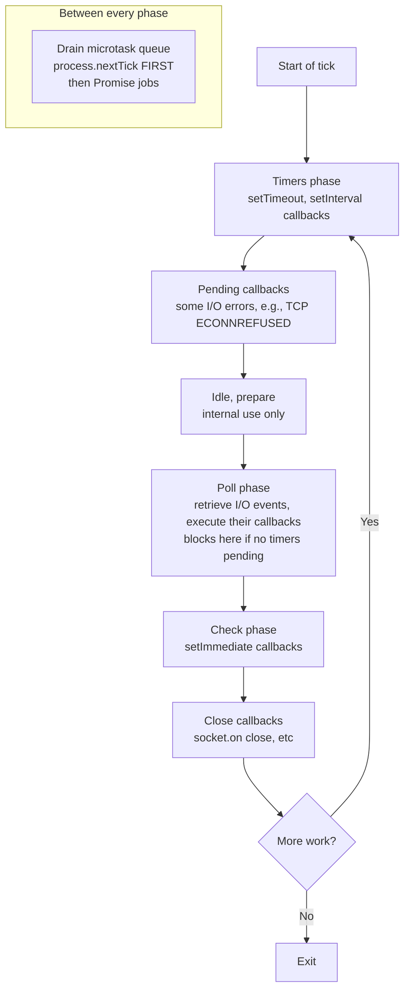
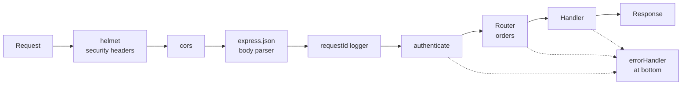
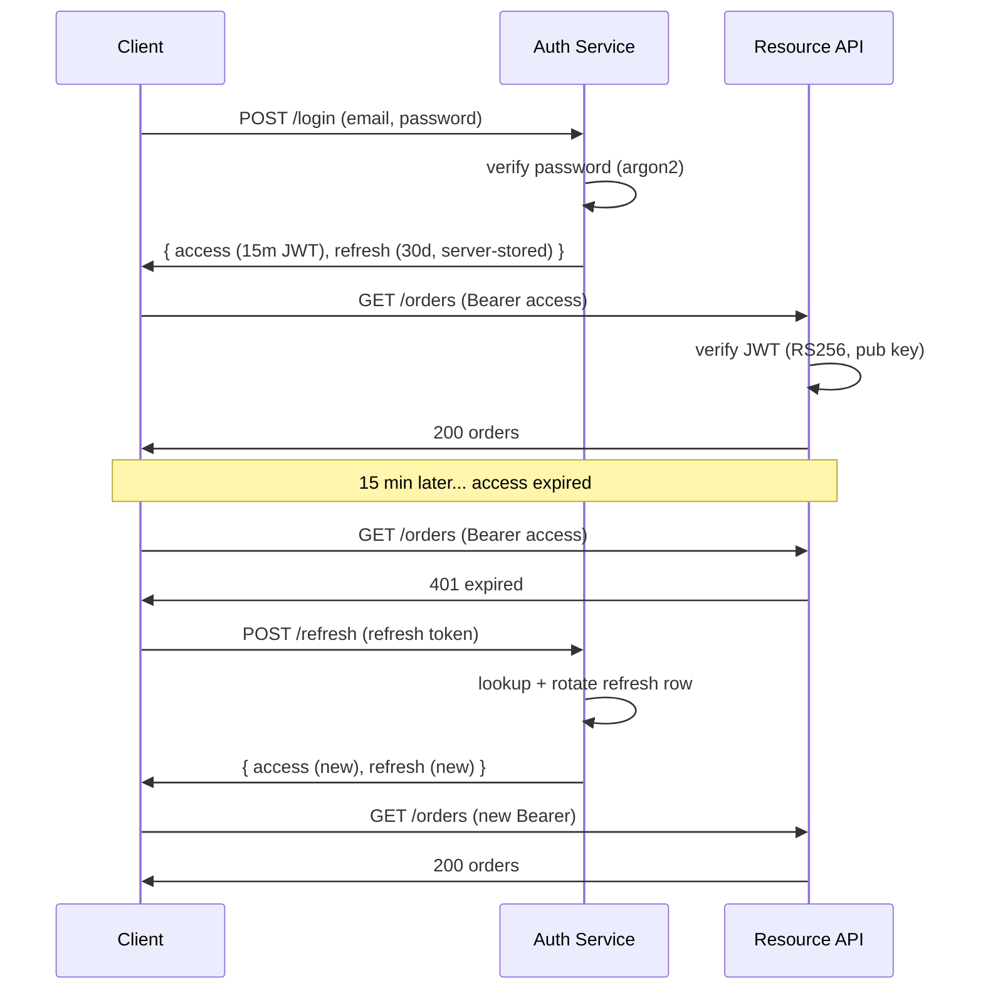

# Node.js + Express + Backend Engineering — From Routes to Production

Bhai, agar tu MERN stack pe hire hona chahta hai — Indian product startup ka #1 sought-after track — to React tujhe pretty UI dega, MongoDB tujhe storage dega, lekin **Node + Express** wo glue hai jo "frontend dev" se tujhe "full-stack engineer" banata hai. Razorpay ke dashboard ka backend partly Node, Swiggy ka order-orchestration layer Node + Go, Zomato ka API gateway largely Node, Cred ka feature-flag service Node, Meesho ka catalog ingestion Node — list lambi hai. JS already aati hai, ab bas server-side thinking add karni hai.

Iss subject ka goal: tujhe **event loop ki feel**, **Express ke middleware pipeline ka mental model**, **REST + auth + validation ka production-grade pattern**, aur **deploy + observe karne ka muscle** dena hai. Hum end-to-end ek "Swiggy-lite Orders API" build karte chalenge — same domain jo `dbms-complete` aur `system-design-basics` mein use kiya hai, taaki tu cross-link kar sake. Code samples ES2022+ mein, async/await first, ESM jahaan natural ho.

> **Why depth?** Senior Node interviews mein literal sawaal aata hai — "Yeh `setTimeout(fn, 0)` aur `setImmediate(fn)` ka order kya hoga, aur kyu?" Ya — "JWT refresh token rotate kaise karega?" Surface-level rattu yahaan kaam nahi karega. Hum theoretical model + library code + production gotchas teeno cover karenge.

Chai-pani saath rakh, ye thoda lamba safar hai — par ek baar event loop click ho gaya, tu Node ko *deeply* samajhne lagega, aur woh leverage lifetime ka hai.

---

## 1. Why Node.js for backend?

### 1.1 The single-threaded event loop premise

Node ka core proposition ek line mein: **"JavaScript ka single thread + libuv ka non-blocking I/O = high concurrency without threads."** Java/Spring tujhe har request pe ek thread deta hai (or thread-pool se uthata hai). 10k concurrent connections = 10k threads = ~10GB RAM (1MB stack each) + insane context-switch cost. Node mein ek hi main thread sab connections handle karta hai, kyunki disk/network I/O block nahi karte — kernel ko bola "yeh kaam ho jaye to bata", aur main thread aage badh gaya. Jab callback ready hota hai, libuv use queue mein daal deta hai, event loop pick karta hai.

Iska matlab: Node ek **I/O-bound concurrency machine** hai. JSON API jahan time DB query mein jaata hai aur CPU work negligible hai — Node shines. Ek 4GB box pe 50k+ concurrent WebSocket connections trivially possible hain.

### 1.2 When Node wins, when Node loses

| Use case | Node fit | Reason |
|----------|----------|--------|
| JSON REST/GraphQL APIs | Excellent | I/O bound, JSON-native |
| Real-time (chat, live scores, collab) | Excellent | Long-lived sockets, event-driven |
| API gateway / BFF | Excellent | Lightweight, fast startup |
| Streaming uploads/downloads | Great | Built-in `stream` module |
| Microservice glue | Great | Fast deploy, small image |
| **Heavy CPU work** (image resize, ML inference, PDF gen) | **Bad** | Single thread blocks; use worker threads or offload to Python/Go service |
| **Long synchronous computation** (graph traversal on millions of nodes) | **Bad** | Same reason |

Rule of thumb: agar tera handler ka 95% time `await db.query(...)`, `await fetch(...)`, `await redis.get(...)` mein jaata hai — Node best. Agar tera handler 200ms tak `for` loop mein matrix multiplication kar raha hai — har request poori event loop ko block kar degi, aur P99 latency phat jaayegi.

### 1.3 The Indian product-co stack reality

Real talk — Bharat ki product cos kya use kar rahi hain:

- **Razorpay**: Core payments backend Java (Dropwizard), but dashboards, internal tools, webhooks pipeline = Node + TS. Their Curlec & RazorpayX surfaces are Node-heavy.
- **Swiggy**: Order ingestion + dispatch in Go for hot path, but customer-facing APIs and BFF layer in Node + TS. Their menu service Node.
- **Zomato**: API gateway Node, ML serving Python, but hyperpure & blinkit catalog APIs Node-leaning.
- **CRED**: Polyglot — Kotlin + Spring for core finance, Node + TS for member-facing APIs and feature flag service.
- **Meesho**: Catalog ingestion Node, search Java/Go, but member experience BFF Node.
- **Flipkart**: Java-heavy, but WhatsApp/PWA layer Node.

Pattern dekho: **financial ledger / hot path = Java/Go, edge / BFF / real-time / dev velocity = Node**. Tu jab MERN sikhta hai, tu BFF + edge + product layers hire ho raha hai — exactly where Node demand peak hai.

> Cross-link: Node vs Java thread-per-request comparison ke detail ke liye `os-complete` (threads, context switches) padh, aur scaling pe `system-design-basics` (load balancer + horizontal scaling) padh.

---

## 2. The event loop deep-dive

Yeh section interview ka sabse common deep question hai. Agar tu yeh internalize kar le, "kya hoga `setTimeout(0)` vs `setImmediate` mein?" sapne mein answer kar dega.

### 2.1 libuv + V8 — who does what

Node ka anatomy:

- **V8** — Google ka JS engine. Tera JS code parse + JIT compile + execute karta hai. Single thread.
- **libuv** — C library. Event loop + thread pool + OS-level async I/O abstractions (epoll on Linux, kqueue on macOS, IOCP on Windows).
- **Node bindings** — C++ glue. `fs.readFile` JS → libuv → kernel → callback queue → V8 main thread.

V8 ka thread (main thread) JS execute karta hai. Jab tu `fs.readFile` call karta hai, woh libuv ko delegate ho jaata hai. libuv ke paas ek **thread pool** (default 4 threads, `UV_THREADPOOL_SIZE` se badha sakte ho) hota hai jo blocking-by-nature operations (filesystem, DNS via getaddrinfo, crypto.pbkdf2) ke liye background mein kaam karta hai. Network I/O (sockets) thread pool use *nahi* karta — woh seedha kernel ke epoll/kqueue se notify hota hai.

### 2.2 The 6 phases of the event loop

Ek "tick" ka sequence:



Phase-by-phase:

1. **Timers** — `setTimeout(fn, ms)` aur `setInterval` ke callbacks jin ka time aa gaya hai. Note: `ms` is *minimum*, not exact — agar event loop busy tha, callback late chalega.
2. **Pending callbacks** — Kuch system-level I/O callbacks jo previous tick mein defer hue (e.g., TCP errors). Production code mein rarely matters.
3. **Idle, prepare** — Internal libuv bookkeeping.
4. **Poll** — *The* important phase. Yahan event loop new I/O events ke liye block karta hai (kernel ko poochta hai "kuch ready hai?"). I/O callbacks (file read complete, socket data arrived) yahan execute hote hain. Agar koi timer due ho raha hai aur poll queue empty hai, loop poll phase chhod ke timers pe jaata hai.
5. **Check** — `setImmediate` callbacks. Yeh "immediately after poll" semantics deta hai.
6. **Close callbacks** — `socket.on('close', ...)` types.

**Microtask queue** har phase ke beech mein drain hoti hai (har callback ke baad bhi, technically) — `process.nextTick` first (highest priority), then `Promise.then` / `queueMicrotask`. Iska matlab: agar tu `Promise.resolve().then(...)` chain bana ke event loop ko bhuka rakh de, timers / I/O kabhi nahi chalenge — yeh starvation footgun hai.

### 2.3 process.nextTick — the loaded gun

`process.nextTick(fn)` ka callback **current operation ke turant baad** chalta hai, before event loop next phase ko jaaye, aur Promise microtasks se bhi pehle. Yeh isliye banaya gaya tha ki user code "yield" kar sake bina full async ka cost utha ke.

```js
// Footgun example
function recurse() {
  process.nextTick(recurse);
}
recurse();
// Yeh forever chalta rahega; I/O, timers, kuch nahi chalega.
// CPU 100%, server frozen.
```

Real-world: Node core me hi kabhi-kabhi `process.nextTick` accidental tight loops ban gayi hain (historical bugs). Tu apna code likh raha hai — `nextTick` se bach, `queueMicrotask` ya `setImmediate` use kar.

### 2.4 The classic ordering question

```js
// File: order.js
import { readFile } from 'node:fs';

setTimeout(() => console.log('1: setTimeout'), 0);
setImmediate(() => console.log('2: setImmediate'));
Promise.resolve().then(() => console.log('3: promise.then'));
process.nextTick(() => console.log('4: nextTick'));
queueMicrotask(() => console.log('5: queueMicrotask'));

console.log('0: sync');
```

Output (deterministic part):

```
0: sync
4: nextTick
3: promise.then
5: queueMicrotask
1: setTimeout    // OR
2: setImmediate  // order between these two is non-deterministic in main module
```

Why?

- Sync code first (`console.log('0')`).
- Tick ends → drain microtasks → `nextTick` queue first → `4`. Then promise jobs → `3`, `5`.
- Now event loop phases. Timers vs check ka order **depends on whether the loop's current phase is past timers or not, and on timer drift**. In main module, both `setTimeout(0)` aur `setImmediate` enter different phases, and which "phase" the loop happens to enter first when starting up is timing-sensitive (often `setTimeout` first, but flaky).

**Stable answer**: agar tu `setTimeout(0)` aur `setImmediate` dono ko ek I/O callback ke andar daale, **`setImmediate` always wins** — because after I/O callback, poll phase done → check phase → `setImmediate` runs. Then next tick → timers.

```js
import { readFile } from 'node:fs';

readFile('package.json', () => {
  setTimeout(() => console.log('timeout'), 0);
  setImmediate(() => console.log('immediate'));
});
// Output GUARANTEED:
// immediate
// timeout
```

Iss exact question Razorpay aur Atlassian dono pooch chuke hain — official interview reports public hain.

### 2.5 Don't block the loop

Single-threaded ka curse: agar ek handler 500ms CPU-bound kaam karega, *poori* server blocks. P50 thik dikh sakti hai (load light), but P99 disaster. Mitigation:

1. **Worker threads** (`node:worker_threads`) for CPU-bound — JSON parsing of huge payloads, image processing, hashing.
2. **Offload to a queue** — drop the job in BullMQ/SQS/Kafka, let a worker process it.
3. **Stream instead of buffer** — never `JSON.parse(fs.readFileSync('huge.json'))` in handler.
4. **Profile** — `clinic.js doctor` / `0x` flame graphs har Node engineer ko aani chahiye.

> **Pro tip**: Production mein ek `event-loop-lag` metric expose kar (npm pkg `event-loop-lag` ya manually `setInterval` measuring drift). Agar ye 100ms+ jaaye, tu loop block ho raha hai — alert.

---

## 3. Async patterns in modern Node

### 3.1 The evolution: callbacks → promises → async/await

**Callbacks (Node 0.x to ~6.x)** — node-style "error-first":

```js
// fs.readFile
import { readFile } from 'node:fs';
readFile('a.txt', 'utf8', (err, data) => {
  if (err) return handle(err);
  readFile('b.txt', 'utf8', (err2, data2) => {
    if (err2) return handle(err2);
    // ...callback hell starts here
  });
});
```

Pyramid of doom + you must remember to forward errors at every level. One missed `return` and you double-call the parent callback.

**Promises (Node 4+)** — chainable:

```js
import { readFile } from 'node:fs/promises';

readFile('a.txt', 'utf8')
  .then(a => readFile('b.txt', 'utf8').then(b => [a, b]))
  .then(([a, b]) => console.log(a, b))
  .catch(handle);
```

Better, but nested `.then` for dependent reads still messy.

**async/await (Node 7.6+, mainstream Node 10+)** — the way:

```js
import { readFile } from 'node:fs/promises';

async function loadBoth() {
  try {
    const a = await readFile('a.txt', 'utf8');
    const b = await readFile('b.txt', 'utf8');
    return { a, b };
  } catch (err) {
    handle(err);
  }
}
```

Reads like sync, behaves async, integrates with normal `try/catch`. Default in 2026.

### 3.2 Combinators — Promise.all / allSettled / race / any

Tujhe inka difference must clear honi chahiye:

| Method | Resolves when | Rejects when |
|--------|---------------|--------------|
| `Promise.all([...])` | **All** fulfill | **Any** rejects (fast-fail) |
| `Promise.allSettled([...])` | **All** settle (fulfilled or rejected) | Never |
| `Promise.race([...])` | **First** settles (either way) | First rejects (if first to settle) |
| `Promise.any([...])` | **First** fulfills | All reject (`AggregateError`) |

Real example — Swiggy restaurant page needs 3 things:

```js
async function getRestaurantPage(restaurantId) {
  // Want all three; if any fails, fail the whole page
  const [details, menu, reviews] = await Promise.all([
    db.restaurants.findById(restaurantId),
    db.menu.findByRestaurant(restaurantId),
    db.reviews.findByRestaurant(restaurantId, { limit: 10 }),
  ]);
  return { details, menu, reviews };
}
```

Vs reviews ko optional rakhna ho:

```js
const [details, menu, reviewsResult] = await Promise.all([
  db.restaurants.findById(restaurantId),
  db.menu.findByRestaurant(restaurantId),
  // Wrap in allSettled-style or catch
  db.reviews.findByRestaurant(restaurantId, { limit: 10 }).catch(() => []),
]);
```

`Promise.allSettled` use kar jab tu sab ke results dekhna chahta hai, kuch fail bhi ho jayein:

```js
const results = await Promise.allSettled(
  webhookUrls.map(url => fetch(url, { method: 'POST', body }))
);
const failed = results.filter(r => r.status === 'rejected');
log.warn({ failedCount: failed.length }, 'webhook delivery summary');
```

### 3.3 Error handling in async

Three rules:

1. **Always `await` inside `try` if you want to catch.** Otherwise the promise rejects after the function returns and becomes unhandled.

   ```js
   // BAD — unhandled rejection
   async function bad() {
     try {
       return doThing();   // forgot await!
     } catch (e) { /* never runs */ }
   }
   ```

2. **Top-level: install `unhandledRejection` and `uncaughtException` handlers.** Log + crash gracefully (PM2/k8s will restart).

   ```js
   process.on('unhandledRejection', (reason, promise) => {
     log.error({ reason }, 'unhandled rejection');
     // Optional: throw to convert to uncaughtException -> exit
   });
   process.on('uncaughtException', (err) => {
     log.fatal({ err }, 'uncaught exception, crashing');
     process.exit(1);
   });
   ```

3. **Async errors in Express need wrapping** (more on this in section 4 + 7).

### 3.4 Common anti-patterns

- **Forgotten `await`**: returns pending promise, downstream code thinks it's data. TS strict + ESLint `@typescript-eslint/no-floating-promises` saves you.
- **Sequential when parallel works**:

  ```js
  // BAD: 2 RTTs serial
  const a = await fetchA();
  const b = await fetchB();    // independent of a!
  // GOOD: 1 RTT
  const [a, b] = await Promise.all([fetchA(), fetchB()]);
  ```

- **`forEach` with async** — `forEach` doesn't await. Use `for...of` for serial, `Promise.all(.map(...))` for parallel.
- **Async constructor** — JS class constructors can't be async. Use a static factory: `static async create() { ... return new Foo(...) }`.

### 3.5 Streams + async iteration

Node streams (readable, writable, duplex, transform) backbone hain har efficient backend ka. Kabhi 1GB CSV process karna ho — buffer mat kar, stream kar.

```js
import { createReadStream } from 'node:fs';
import { pipeline } from 'node:stream/promises';
import { parse } from 'csv-parse';

async function ingestOrders(path) {
  const parser = createReadStream(path).pipe(parse({ columns: true }));
  // for-await: async iteration over a readable stream
  for await (const row of parser) {
    await db.orders.insert(row);
  }
}
```

`pipeline` se errors propagate properly + cleanup automatic:

```js
import { pipeline } from 'node:stream/promises';
import { createReadStream, createWriteStream } from 'node:fs';
import { createGzip } from 'node:zlib';

await pipeline(
  createReadStream('input.log'),
  createGzip(),
  createWriteStream('input.log.gz')
);
```

> **Production gotcha**: never `pipe()` without error handlers — leaks. Always `pipeline` (promises form).

---

## 4. Express fundamentals

Express 5 (stable in 2024) is what we'll target. It's the ubiquitous, "I'll run on anything" framework. Fastify aur Hono faster hain, but Express has the largest ecosystem and is what almost every Indian startup hires for.

### 4.1 Mental model: app = chain of middleware

Express app ek **middleware pipeline** hai. Har middleware ek function hai with signature `(req, res, next) => void`. Order matters. Request enters at the top, flows down, response either gets sent (terminal middleware) or `next()` ko call kar ke aage pass ho jaata hai. Errors bubble up via `next(err)` ya thrown errors (Express 5).



### 4.2 Routing

```js
import express from 'express';
const app = express();

// All HTTP verbs
app.get('/orders/:id', getOrder);
app.post('/orders', createOrder);
app.put('/orders/:id', replaceOrder);
app.patch('/orders/:id', updateOrder);
app.delete('/orders/:id', cancelOrder);

// Route params + query
// GET /orders/123?expand=items
app.get('/orders/:id', (req, res) => {
  req.params.id;        // '123' (string)
  req.query.expand;     // 'items'
});

// Routers — modular grouping
import { Router } from 'express';
const orders = Router();
orders.get('/', listOrders);
orders.get('/:id', getOrder);
orders.post('/', createOrder);
app.use('/api/v1/orders', orders);
```

### 4.3 req / res shape (the cheat sheet)

```js
// Frequently used req fields
req.method        // 'GET'
req.path          // '/orders/123'
req.params        // { id: '123' }
req.query         // { expand: 'items' }
req.body          // parsed body (after express.json())
req.headers       // { 'content-type': 'application/json', ... }
req.ip            // client IP (after `app.set('trust proxy', true)`)
req.cookies       // after cookie-parser

// Frequently used res
res.status(201)
res.json({ id, status: 'created' })
res.set('X-Request-ID', req.id)
res.cookie('session', token, { httpOnly: true, secure: true })
res.redirect(302, '/login')
```

### 4.4 Middleware ordering — the production recipe

Order from outermost to innermost:

1. **Trust proxy** (if behind LB/CDN) — `app.set('trust proxy', 1)`.
2. **Security headers** — `helmet()`.
3. **CORS** — `cors({ origin: [...] })`.
4. **Compression** — `compression()` (skip if behind a CDN that handles it).
5. **Body parser** — `express.json({ limit: '1mb' })`.
6. **Request ID + logger** — for tracing.
7. **Rate limiter** — `express-rate-limit`.
8. **Auth** — extract user from JWT/session, attach to `req.user`.
9. **Routes**.
10. **404 fallback**.
11. **Centralised error handler** (4-arity function).

### 4.5 Worked example: 30-line server

```js
// server.js — production-shape baseline
import express from 'express';
import helmet from 'helmet';
import cors from 'cors';
import { randomUUID } from 'node:crypto';
import { pino } from 'pino';
import pinoHttp from 'pino-http';

const log = pino();
const app = express();

app.set('trust proxy', 1);
app.use(helmet());
app.use(cors({ origin: ['https://app.swiggy-lite.in'], credentials: true }));
app.use(express.json({ limit: '1mb' }));
app.use((req, _res, next) => { req.id = randomUUID(); next(); });
app.use(pinoHttp({ logger: log, genReqId: req => req.id }));

// auth
app.use((req, res, next) => {
  const token = req.headers.authorization?.replace('Bearer ', '');
  if (!token) return next();
  try { req.user = verifyJwt(token); } catch { return res.status(401).json({ error: 'invalid_token' }); }
  next();
});

// route
app.get('/api/v1/orders/:id', async (req, res, next) => {
  try {
    const order = await db.orders.findById(req.params.id);
    if (!order) return res.status(404).json({ error: 'not_found' });
    res.json(order);
  } catch (err) { next(err); }
});

// 404
app.use((_req, res) => res.status(404).json({ error: 'not_found' }));

// errors
app.use((err, req, res, _next) => {
  req.log.error({ err }, 'handler error');
  res.status(err.status ?? 500).json({ error: err.code ?? 'internal' });
});

app.listen(3000, () => log.info('listening on 3000'));
```

Yeh sample tujhe production mein 80% jagah pe straight chal jayega. Note: Express 5 mein async errors auto-forward ho jaate hain, but explicit `next(err)` still recommended for clarity.

---

## 5. REST API design

REST koi religion nahi hai, but conventions follow karne se onboarding fast, tooling automatic (Postman, OpenAPI, gateways), aur teammates ka mental model match karta hai.

### 5.1 Resource-oriented URLs

Verbs URLs mein nahi, HTTP method mein. Resources nouns ho:

| Bad | Good |
|-----|------|
| `GET /getOrder?id=123` | `GET /orders/123` |
| `POST /createOrder` | `POST /orders` |
| `POST /cancelOrder/123` | `POST /orders/123/cancel` *(action sub-resource)* ya `PATCH /orders/123 {status:"cancelled"}` |
| `GET /orders_by_user?id=42` | `GET /users/42/orders` |

Plural nouns. Hyphens (not underscores) for multi-word. Lowercase. No file extensions.

### 5.2 HTTP verbs + idempotency

| Verb | Semantics | Idempotent? | Safe? |
|------|-----------|-------------|-------|
| GET | Read | Yes | Yes |
| HEAD | Headers only | Yes | Yes |
| OPTIONS | CORS pre-flight | Yes | Yes |
| POST | Create / non-idempotent action | **No** | No |
| PUT | Replace whole resource | Yes | No |
| PATCH | Partial update | Conventionally yes if server-implemented carefully | No |
| DELETE | Remove | Yes (deleting twice = same end state) | No |

Idempotency *huge* in payments. Razorpay's create-order API takes an `Idempotency-Key` header — same key, same response, even if client retries. Implement using a `(idempotency_key, response_hash, response_body)` table with unique constraint on key. Cross-link `dbms-complete` for the SQL.

### 5.3 Status codes that matter

You don't need all 60. Master these:

| Code | Meaning | When |
|------|---------|------|
| 200 | OK | Standard success with body |
| 201 | Created | POST that created a resource — return `Location: /orders/123` |
| 202 | Accepted | Async work queued, not done |
| 204 | No Content | DELETE success, PUT with no body |
| 301/302/308 | Redirects | 301 permanent, 302 temp, 308 perm + preserve method |
| 400 | Bad Request | Malformed request, validation failure |
| 401 | Unauthorized | Missing/invalid auth — really means "unauthenticated" |
| 403 | Forbidden | Authenticated but lacks permission |
| 404 | Not Found | Resource doesn't exist (or you don't want to reveal it does) |
| 409 | Conflict | Duplicate, version mismatch, optimistic lock fail |
| 422 | Unprocessable Entity | Validation errors (semantics-level, body parsed but rules violated) |
| 429 | Too Many Requests | Rate limited — include `Retry-After` |
| 500 | Internal Server Error | Unexpected — log it |
| 502 | Bad Gateway | Upstream broken (LB couldn't reach backend) |
| 503 | Service Unavailable | Overloaded / maintenance — `Retry-After` |
| 504 | Gateway Timeout | Upstream too slow |

400 vs 422 debate: 400 = "couldn't parse / wrong shape", 422 = "parsed fine, but business rules violated". Many teams just use 400 for both — fine, just be consistent.

### 5.4 Pagination patterns

**Offset/limit** (simple, but degrades on big tables):

```
GET /orders?limit=20&offset=200
```

`OFFSET 200` makes Postgres skip 200 rows — slow on page 500. Cross-link `dbms-complete` indexing section.

**Cursor** (production-grade):

```
GET /orders?limit=20&cursor=eyJpZCI6MTIzNDV9
# Response:
{ "items": [...], "next_cursor": "eyJpZCI6MTIzMjV9" }
```

Cursor opaque base64 of `(last_id, last_sort_value)`. Server decodes, queries `WHERE (created_at, id) < (:ts, :id) ORDER BY created_at DESC, id DESC LIMIT 20`. O(1) per page regardless of depth.

### 5.5 Versioning

Two camps:

- **URL versioning**: `/api/v1/orders` → `/api/v2/orders`. Pros: visible, easy to route, easy to deprecate. Cons: arguably "not RESTful" because URI should identify resource not representation. *Practical winner* for product APIs.
- **Header versioning**: `Accept: application/vnd.swiggy.v2+json`. Pros: clean URLs. Cons: invisible in browser, harder to debug, gateways need extra config.

In India most teams (Razorpay, Flipkart Marketplace API, Hotstar) use URL versioning. Pick one and stick.

> Cross-link: HTTP semantics, caching headers (Cache-Control, ETag), CORS internals — `networks-complete`.

---

## 6. Authentication + authorization

Yeh section interview mein guaranteed deep-dive hai. Practical recipes + theory dono kavar karo.

### 6.1 JWT vs session — when each wins

**Session (stateful)**: server pe session store (Redis/Postgres) hai jisme `session_id → user_id, expires_at`. Client cookie mein `session_id` carry karta hai. Logout = server side row delete.

- Pros: instant revoke, session data update real-time, opaque ID se kuch leak nahi.
- Cons: every request needs Redis hit, harder to scale horizontally without sticky sessions or shared store.

**JWT (stateless)**: server signs a token containing `{ sub, exp, ... }`. Client carries it. Server verifies signature + `exp`, no DB hit needed.

- Pros: stateless, scales beautifully, microservice-friendly (downstream service verifies same JWT).
- Cons: revocation hard (token valid till `exp`), payload size in every request, secret rotation needs care.

| Use case | Pick |
|----------|------|
| Monolith, browser-only, login/logout matters | **Session** |
| Microservices fan-out, mobile + web, third-party API | **JWT** (often with refresh tokens) |
| Banking-grade where instant revoke critical | **Session** or JWT + revocation list |

### 6.2 JWT structure

```
header.payload.signature
```

Each part is base64url-encoded JSON (header, payload) or signature bytes.

```json
// header
{ "alg": "HS256", "typ": "JWT", "kid": "k-2026-01" }
// payload
{
  "sub": "user_42",
  "iss": "https://auth.swiggy-lite.in",
  "aud": "swiggy-lite-api",
  "iat": 1714627200,
  "exp": 1714630800,
  "scope": "orders:read orders:write"
}
```

`HS256` = HMAC-SHA256 with shared secret. Same secret signs and verifies. Easy to set up, but every service that verifies needs the secret — leak risk multiplies.

`RS256` / `ES256` = asymmetric. Auth service has the **private key** (signs), every other service has the **public key** (verifies). Key rotation safer. Industry standard for production.

```js
// signing with jose
import { SignJWT } from 'jose';
const jwt = await new SignJWT({ scope: 'orders:read' })
  .setProtectedHeader({ alg: 'RS256', kid: 'k-2026-01' })
  .setSubject(user.id)
  .setIssuer('https://auth.swiggy-lite.in')
  .setAudience('swiggy-lite-api')
  .setIssuedAt()
  .setExpirationTime('15m')
  .sign(privateKey);
```

### 6.3 Refresh tokens

Access token short-lived (5-15 min). Refresh token long-lived (7-30 days), opaque, stored server-side, rotated on each use.

Flow:

1. Login → returns `{ access, refresh }`. Refresh stored server-side hashed.
2. Client uses `access` for APIs.
3. `access` expires (401) → client calls `POST /auth/refresh` with refresh token.
4. Server verifies refresh, issues new `access` + new `refresh`, **invalidates old refresh** (rotation).
5. Logout → delete server-side refresh row.



### 6.4 Cookie security (when not using Bearer)

If you ship cookies (browser app), set them right:

```js
res.cookie('session', token, {
  httpOnly: true,           // JS can't read it (XSS protection)
  secure: true,             // HTTPS only
  sameSite: 'lax',          // 'strict' for max, 'lax' default, 'none' if cross-site
  path: '/',
  maxAge: 7 * 24 * 60 * 60 * 1000,
  domain: '.swiggy-lite.in', // careful with subdomains
});
```

`SameSite=Lax` is the modern default — prevents CSRF on cross-site POSTs. For cross-site SPA + API on different domains, use `SameSite=None; Secure` and add CSRF tokens explicitly.

### 6.5 Authorization middleware pattern

Authentication = "who are you?" Authorization = "what can you do?"

```js
// authn — sets req.user
function authenticate(req, res, next) {
  const token = req.headers.authorization?.replace('Bearer ', '');
  if (!token) return res.status(401).json({ error: 'auth_required' });
  try {
    req.user = verifyJwt(token);   // throws if invalid
    next();
  } catch {
    res.status(401).json({ error: 'invalid_token' });
  }
}

// authz — factory of guards
function requireScope(...needed) {
  return (req, res, next) => {
    const have = (req.user?.scope ?? '').split(' ');
    if (needed.every(s => have.includes(s))) return next();
    res.status(403).json({ error: 'insufficient_scope', needed });
  };
}

// usage
app.get('/orders/:id',
  authenticate,
  requireScope('orders:read'),
  getOrder
);
```

For RBAC (admin vs user vs partner), same pattern with `req.user.role`. For fine-grained (resource ownership), check inside the handler:

```js
async function getOrder(req, res) {
  const order = await db.orders.findById(req.params.id);
  if (!order) return res.status(404).end();
  if (order.user_id !== req.user.sub && req.user.role !== 'admin') {
    return res.status(403).end();   // or 404 to not leak existence
  }
  res.json(order);
}
```

### 6.6 OWASP Top 10 — at minimum, defend

OWASP Top 10 (2021/2026) includes Broken Access Control, Crypto Failures, Injection, Insecure Design, Security Misconfiguration, Vulnerable Components, Auth Failures, Integrity Failures, Logging Failures, SSRF. Practical baseline:

- Always validate input (section 7).
- Never concatenate SQL — use parameterised queries.
- `helmet()` for headers.
- Secrets in env, never in code (use `dotenv` for dev, AWS Secrets Manager / Vault prod).
- Hash passwords with `argon2id` (not bcrypt-only, definitely not SHA*).
- Audit deps with `npm audit` / Snyk in CI.

> Cross-link: deeper auth + crypto theory in `frontend-security`.

---

## 7. Validation + error handling

### 7.1 Zod — schema-first validation

`zod` 2026 standard hai (or `valibot` for tree-shake). Define schema once, get TypeScript type for free.

```ts
import { z } from 'zod';

const CreateOrderBody = z.object({
  restaurantId: z.string().uuid(),
  items: z.array(z.object({
    name: z.string().min(1).max(150),
    qty: z.number().int().positive().max(50),
    priceEach: z.number().positive(),
  })).min(1).max(30),
  couponCode: z.string().regex(/^[A-Z0-9]{3,12}$/).optional(),
});

type CreateOrderBody = z.infer<typeof CreateOrderBody>;

// middleware factory
function validateBody(schema) {
  return (req, res, next) => {
    const result = schema.safeParse(req.body);
    if (!result.success) {
      return res.status(422).json({
        error: 'validation_failed',
        issues: result.error.issues.map(i => ({ path: i.path, message: i.message })),
      });
    }
    req.body = result.data;   // typed!
    next();
  };
}

app.post('/orders', authenticate, validateBody(CreateOrderBody), createOrder);
```

Same pattern for query, params, headers. Bonus: generate OpenAPI from your Zod schemas using `zod-to-openapi`.

### 7.2 Centralised error middleware

Express error middleware = function with **4 arguments**. Define ONCE at the bottom.

```ts
class AppError extends Error {
  constructor(public code: string, public status: number, message?: string) {
    super(message ?? code);
  }
}

// usage in handler
if (!order) throw new AppError('order_not_found', 404);
if (order.user_id !== req.user.sub) throw new AppError('forbidden', 403);

// global handler
app.use((err, req, res, _next) => {
  if (err instanceof AppError) {
    return res.status(err.status).json({ error: err.code });
  }
  // Unexpected — log with stack, hide details
  req.log.error({ err }, 'unexpected error');
  res.status(500).json({ error: 'internal_error', request_id: req.id });
});
```

### 7.3 Operational vs programmer errors

Distinction from Joyent's old guide, still gold:

- **Operational** — expected: DB down, network blip, validation fail, 4xx-shape. Handle gracefully, return appropriate HTTP code, retry if safe.
- **Programmer** — bugs: TypeError, ReferenceError, undefined property access. These mean the process is in undefined state. Log + crash + restart (PM2/k8s).

Don't swallow programmer errors with broad try/catch. Let them bubble to the top, log with full stack, exit. Process supervisor restarts.

### 7.4 Don't leak stack traces

In dev, return `err.stack` for fast feedback. In prod, return only a `request_id`. Stack traces leak filesystem paths, library versions, sometimes secrets via interpolation. Pair with structured logs so support can grep by `request_id`.

```ts
const isProd = process.env.NODE_ENV === 'production';
res.status(500).json({
  error: 'internal_error',
  request_id: req.id,
  ...(isProd ? {} : { stack: err.stack }),
});
```

---

## 8. Database integration

Backend without DB integration is theatre. Two stacks dominate Indian cos: Postgres (relational, ACID) and MongoDB (document, flexible).

### 8.1 Postgres via `pg`, Drizzle, or Prisma

**Raw `pg`** — minimal, fastest, no abstraction:

```ts
import pg from 'pg';
const pool = new pg.Pool({ connectionString: process.env.DATABASE_URL, max: 10 });

export async function findOrderById(id: string) {
  const { rows } = await pool.query(
    'SELECT order_id, user_id, status, total_amount FROM orders WHERE order_id = $1',
    [id]
  );
  return rows[0];
}
```

**Drizzle ORM** (2024+ favorite) — TypeScript-native, generates SQL transparently:

```ts
import { drizzle } from 'drizzle-orm/node-postgres';
import { eq } from 'drizzle-orm';
import { orders } from './schema.js';

export const db = drizzle(pool);

export async function findOrderById(id: string) {
  const [row] = await db.select().from(orders).where(eq(orders.id, id)).limit(1);
  return row;
}
```

**Prisma** — DSL-based schema, great DX, slightly heavier runtime. Big in India because the docs are fantastic.

```prisma
model Order {
  id           String   @id @default(uuid())
  userId       String
  status       String   @default("PLACED")
  totalAmount  Decimal  @db.Decimal(10, 2)
  placedAt     DateTime @default(now())
  user         User     @relation(fields: [userId], references: [id])
}
```

### 8.2 MongoDB via official driver or Mongoose

Native driver:

```ts
import { MongoClient } from 'mongodb';
const client = new MongoClient(process.env.MONGO_URL!);
const db = client.db('swiggy_lite');
const orders = db.collection('orders');

await orders.insertOne({ userId, items, status: 'PLACED', placedAt: new Date() });
const order = await orders.findOne({ _id: new ObjectId(id) });
```

Mongoose — schema + middleware + virtuals. Many MERN tutorials default to it. Trade-off: extra abstraction layer.

### 8.3 Connection pooling — the lambda problem

Postgres connections are expensive (~10MB each, capped at ~100 by default). Pool size = total connections / number of app instances. If you have 4 server pods × pool of 10 = 40 connections, well under 100. Fine.

**Lambda problem**: serverless functions spin up *per request*. 1000 concurrent invocations = 1000 fresh connections trying. DB falls over. Mitigations:

1. **External pooler**: PgBouncer (transaction mode) or Supabase pooler / Neon connection pooling. App connects to pooler, pooler multiplexes onto fewer real connections.
2. **HTTP-style drivers**: Neon's serverless driver, PlanetScale (MySQL HTTP). Each query is HTTP, no persistent conn.
3. **Stay long-running** — Render, Fly, ECS, EC2, k8s. Easier mental model for stateful pools.

### 8.4 Migrations

Schema changes need to be tracked. Tools: Prisma Migrate, Drizzle Kit, Knex migrations, Flyway. Each migration = `up.sql` + `down.sql` (or single SQL with `--up`/`--down` markers). Deploy = run migrations before new app code.

```bash
# Drizzle Kit
npx drizzle-kit generate          # generate from schema diff
npx drizzle-kit migrate           # apply
```

Production rules:

- Migrations forward-compatible: deploy column ADDs before code that reads them; column DROPs only after code stops referencing.
- Long-running migrations (adding index on huge table) — use `CREATE INDEX CONCURRENTLY` in Postgres; non-blocking.
- Never write migrations that lose data without explicit approval.

> Cross-link: indexes, transactions, isolation, ACID — `dbms-complete`. NoSQL trade-offs — `database-nosql`.

---

## 9. Testing

Untested backend = ticking time bomb. Modern Node testing:

### 9.1 Unit tests with Vitest (or Jest)

Vitest (Vite-based) is the 2024+ default for new projects — same API as Jest, faster, better TS support. For pure functions:

```ts
// src/lib/coupon.ts
export function applyCoupon(total: number, code: string) {
  if (code === 'WELCOME10') return total * 0.9;
  if (code === 'FLAT50' && total > 200) return total - 50;
  return total;
}

// src/lib/coupon.test.ts
import { describe, it, expect } from 'vitest';
import { applyCoupon } from './coupon.js';

describe('applyCoupon', () => {
  it('applies WELCOME10 percentage', () => {
    expect(applyCoupon(100, 'WELCOME10')).toBe(90);
  });
  it('refuses FLAT50 below threshold', () => {
    expect(applyCoupon(150, 'FLAT50')).toBe(150);
  });
  it('returns total for unknown code', () => {
    expect(applyCoupon(100, 'UNKNOWN')).toBe(100);
  });
});
```

### 9.2 Integration tests with supertest

`supertest` mounts your Express app in-memory, fires real HTTP-shaped requests:

```ts
import request from 'supertest';
import { app } from '../src/app.js';

describe('POST /orders', () => {
  it('rejects unauthenticated', async () => {
    const res = await request(app).post('/orders').send({});
    expect(res.status).toBe(401);
  });

  it('creates an order for authenticated user', async () => {
    const token = await loginAs('user_42');
    const res = await request(app)
      .post('/orders')
      .set('Authorization', `Bearer ${token}`)
      .send({ restaurantId: 'rest_1', items: [{ name: 'Veg Biryani', qty: 1, priceEach: 200 }] });
    expect(res.status).toBe(201);
    expect(res.body).toMatchObject({ status: 'PLACED' });
    expect(res.headers.location).toMatch(/^\/orders\//);
  });
});
```

### 9.3 Mocking external HTTP with msw

`msw` (Mock Service Worker) intercepts fetch/Node http at the network level — same mocks work in browser tests too:

```ts
import { setupServer } from 'msw/node';
import { http, HttpResponse } from 'msw';

const server = setupServer(
  http.post('https://api.razorpay.com/v1/orders', () =>
    HttpResponse.json({ id: 'order_test_1', status: 'created' })
  ),
);

beforeAll(() => server.listen());
afterEach(() => server.resetHandlers());
afterAll(() => server.close());

it('creates payment when placing order', async () => {
  const order = await createOrder({ amount: 500 });
  expect(order.razorpayId).toBe('order_test_1');
});
```

### 9.4 Test database strategies

**Strategy A: schema reset** — drop + migrate before each suite. Slow but rock solid.

**Strategy B: transaction rollback** — open a transaction in `beforeEach`, rollback in `afterEach`. Tests can't see each other's writes; super fast.

```ts
let tx;
beforeEach(async () => {
  tx = await db.transaction();
  // override db client used in handlers to use tx
});
afterEach(async () => {
  await tx.rollback();
});
```

**Strategy C: per-test schema** — each test gets a unique Postgres schema. Maximum isolation, best for parallel.

**Strategy D: testcontainers** — spin a real Postgres in Docker per CI run. Closest to prod parity.

In Indian startups: A or B for unit + integration; D in pre-prod CI gate.

> Cross-link: unit vs integration vs e2e pyramid — `software-testing`.

---

## 10. Production deployment

Code chal raha hai laptop pe — ab usko 24x7 chalana, observe karna, scale karna. The ops half of backend.

### 10.1 Deployment platforms

| Platform | When |
|----------|------|
| **PM2 on a VM** (EC2, DigitalOcean) | Smallest scale, single box, manual scaling |
| **Docker + container orchestrator** (ECS, k8s) | Standard for prod scale |
| **Render, Fly.io, Railway** | Best DX for solo / small team — `git push` deploys |
| **Vercel Functions / Netlify Functions** | Serverless, edge-deployed, watch out for cold starts + DB pool issue (section 8.3) |
| **AWS Lambda** | Event-driven workloads, async jobs |

For a typical MERN startup at seed/Series A, **Render or Fly.io** for backend + **Vercel** for Next frontend is the path of least resistance.

### 10.2 Health endpoints

Every service exposes:

```js
app.get('/healthz', (_req, res) => res.json({ ok: true }));
app.get('/readyz', async (_req, res) => {
  try {
    await pool.query('SELECT 1');
    await redis.ping();
    res.json({ ok: true });
  } catch (e) {
    res.status(503).json({ ok: false });
  }
});
```

`/healthz` (liveness) — am I running? `/readyz` (readiness) — can I serve? Kubernetes uses both. Liveness fails → restart pod. Readiness fails → remove from service endpoints, no restart.

### 10.3 Logging with pino

`pino` is the fastest Node logger. Structured (JSON) logs, levels, redaction.

```js
import { pino } from 'pino';

const log = pino({
  level: process.env.LOG_LEVEL ?? 'info',
  redact: ['req.headers.authorization', '*.password', '*.token'],
});

log.info({ userId, orderId }, 'order placed');
log.error({ err, orderId }, 'failed to charge card');
```

In dev, pretty-print: `node server.js | pino-pretty`. In prod, ship JSON to stdout — let the platform (CloudWatch, Datadog, Loki) ingest.

### 10.4 Metrics + tracing

**Metrics** — `prom-client`:

```js
import client from 'prom-client';
client.collectDefaultMetrics();

const httpDuration = new client.Histogram({
  name: 'http_request_duration_seconds',
  help: 'HTTP request duration',
  labelNames: ['method', 'route', 'status'],
  buckets: [0.05, 0.1, 0.3, 0.5, 1, 3, 5],
});

app.use((req, res, next) => {
  const end = httpDuration.startTimer();
  res.on('finish', () => end({ method: req.method, route: req.route?.path ?? 'unknown', status: res.statusCode }));
  next();
});

app.get('/metrics', async (_req, res) => {
  res.set('Content-Type', client.register.contentType);
  res.end(await client.register.metrics());
});
```

**Tracing** — OpenTelemetry SDK auto-instruments Express, pg, fetch — span propagation across services for free.

```js
import { NodeSDK } from '@opentelemetry/sdk-node';
import { getNodeAutoInstrumentations } from '@opentelemetry/auto-instrumentations-node';
import { OTLPTraceExporter } from '@opentelemetry/exporter-trace-otlp-http';

new NodeSDK({
  traceExporter: new OTLPTraceExporter({ url: process.env.OTEL_EXPORTER_OTLP_ENDPOINT }),
  instrumentations: [getNodeAutoInstrumentations()],
}).start();
```

Send to Honeycomb / Tempo / Datadog. Now in prod you can grep one trace ID across web → API → DB.

### 10.5 Rate limiting

`express-rate-limit` + Redis store:

```js
import rateLimit from 'express-rate-limit';
import RedisStore from 'rate-limit-redis';

const apiLimiter = rateLimit({
  store: new RedisStore({ sendCommand: (...args) => redis.sendCommand(args) }),
  windowMs: 60 * 1000,
  max: 100,                 // 100 reqs / min / IP
  standardHeaders: true,
  legacyHeaders: false,
  message: { error: 'rate_limited' },
});

app.use('/api/', apiLimiter);

// Stricter on auth endpoints
const authLimiter = rateLimit({ windowMs: 15 * 60 * 1000, max: 10 });
app.use('/auth/login', authLimiter);
```

For per-user (not per-IP) limits, key by `req.user.sub`.

### 10.6 Graceful shutdown

When deploy/scale-down sends SIGTERM, finish in-flight requests, close DB pool, then exit.

```js
const server = app.listen(3000);

async function shutdown() {
  log.info('shutting down...');
  server.close(async () => {
    await pool.end();
    await redis.quit();
    log.info('clean exit');
    process.exit(0);
  });
  // failsafe
  setTimeout(() => process.exit(1), 30_000).unref();
}

process.on('SIGTERM', shutdown);
process.on('SIGINT', shutdown);
```

> Cross-link: containers, k8s primitives, deployment strategies — `docker-containers`, `kubernetes-orchestration`, `server-deployment`.

---

## 11. Top 30 Node/Express interview questions

Quick-fire, the kind they actually ask in Razorpay/Swiggy/Cred/Atlassian/Microsoft IDC loops.

| # | Question | One-liner answer |
|---|----------|------------------|
| 1 | What is the event loop? | libuv-driven loop with 6 phases that processes I/O callbacks on the single JS thread. |
| 2 | `setTimeout(0)` vs `setImmediate` ordering? | Inside an I/O callback: `setImmediate` first; in main module: non-deterministic. |
| 3 | What does `process.nextTick` do? | Queue runs before next phase, before promise jobs; can starve loop if recursive. |
| 4 | Microtask vs macrotask? | Microtasks (Promise/queueMicrotask/nextTick) drain between every callback; macrotasks (timers, I/O, setImmediate) per phase. |
| 5 | Is Node single-threaded? | JS is, but libuv has a thread pool (default 4) for blocking ops + kernel does network async. |
| 6 | When does Node use the thread pool? | fs (most), dns.lookup, crypto (pbkdf2/randomBytes async), zlib. |
| 7 | How to do CPU-bound work in Node? | `worker_threads` or offload to a queue + worker process (BullMQ/SQS). |
| 8 | What is middleware in Express? | A function `(req, res, next)` in the request pipeline; can short-circuit by responding or pass via `next()`. |
| 9 | Order: helmet, cors, body-parser, auth, routes? | helmet → cors → compression → body-parser → requestId → auth → routes → 404 → error handler. |
| 10 | How does Express 5 handle async errors? | Throws/rejections in async handlers auto-forward to the error handler. |
| 11 | JWT vs session — which to pick? | Session for monolith + browser; JWT for microservices + mobile + scale-out. |
| 12 | What is in a JWT? | base64url(header).base64url(payload).signature; payload has sub/iat/exp/aud/iss + custom claims. |
| 13 | HS256 vs RS256? | HS256 symmetric (one shared secret); RS256 asymmetric (private signs, public verifies) — production preferred. |
| 14 | How to revoke a JWT? | Short TTL + refresh-token rotation, or a server-side denylist keyed on `jti`. |
| 15 | What is a refresh token? | Long-lived opaque token to mint new access tokens; rotated on each use, server-stored. |
| 16 | Cookie flags for security? | `httpOnly`, `secure`, `sameSite=lax/strict`, `path`, `domain`. |
| 17 | 401 vs 403? | 401 = no/invalid credentials; 403 = authenticated but not allowed. |
| 18 | 400 vs 422? | 400 = malformed/parse error; 422 = parsed but validation rules violated (semantic). |
| 19 | Idempotency in REST? | GET/PUT/DELETE inherently; POST via Idempotency-Key header + dedup table. |
| 20 | Cursor vs offset pagination? | Offset slow on deep pages; cursor uses last-seen key, O(1) per page. |
| 21 | How to validate request bodies? | Zod / valibot schemas in middleware; on fail return 422 with issue list. |
| 22 | Operational vs programmer error? | Operational = expected (DB blip), handle; programmer = bug, log + crash + restart. |
| 23 | How to prevent SQL injection? | Parameterised queries; never string-concatenate user input. |
| 24 | Connection pool size formula? | (max DB connections) ÷ (app instances), with headroom; tune via load test. |
| 25 | What is PgBouncer for? | External connection pooler — multiplexes many app connections onto few real Postgres connections. |
| 26 | How to gracefully shutdown? | Listen for SIGTERM, `server.close()` to drain requests, close DB/Redis, then exit; failsafe timeout. |
| 27 | How to rate limit per user? | `express-rate-limit` + Redis store, key by `req.user.sub` (fallback to IP if anon). |
| 28 | What does `helmet` do? | Sets safe HTTP headers — CSP, HSTS, X-Frame-Options, X-Content-Type-Options, etc. |
| 29 | Liveness vs readiness probe? | Liveness (`/healthz`) = alive? restart if not; readiness (`/readyz`) = ready to serve? remove from LB if not. |
| 30 | Why `pino` over `winston`? | Significantly faster, structured JSON by default, low overhead under load. |

---

## 12. Pre-interview checklist + what to learn next

### 12.1 The night-before checklist

- [ ] Can you explain the 6 event loop phases without notes?
- [ ] Can you predict ordering of `setTimeout(0)` / `setImmediate` / `Promise.then` / `nextTick` in main module *and* inside an I/O callback?
- [ ] Can you sketch a 30-line Express server with helmet, cors, body parser, auth, routes, 404, error handler in correct order?
- [ ] Can you write JWT signing + verification using `jose` from memory?
- [ ] Can you draw the refresh-token rotation flow on whiteboard?
- [ ] Can you explain operational vs programmer errors + when to crash?
- [ ] Do you know status codes 200/201/204/400/401/403/404/409/422/429/500/503?
- [ ] Have you written one supertest integration test in your portfolio?
- [ ] Can you explain why serverless + Postgres = connection pool issue, and how PgBouncer helps?
- [ ] Do you have `prom-client` metrics and `pino` logs in at least one of your projects?

### 12.2 What to learn next

- **`system-design-basics`** — load balancers, caching, sharding. Backend without scale-thinking is half-cooked.
- **`database-sql`** + **`dbms-complete`** — your APIs are 80% DB. Indexing + transactions = your superpower.
- **`networks-complete`** — HTTP/2 + HTTP/3, TLS internals, CORS deep-dive, DNS — the substrate beneath Express.
- **`microservices`** — once one Express app gets fat, what next? Service mesh, gRPC, async messaging.
- **`messaging-systems`** — Kafka, RabbitMQ, Redis Streams. Decouple your write path.
- **`docker-containers`** + **`kubernetes-orchestration`** — every prod Node app today ships in a container.
- **`monitoring-observability`** — metrics, logs, traces, SLOs. Senior eng starts here.
- **`software-testing`** — testing pyramid, contract tests, mutation testing.

Once you have Node + Express on top of your React + Next foundation, plus a relational DB you actually understand — you are MERN-ready, and more importantly, you can defend your choices in any senior loop. Now go ship.
