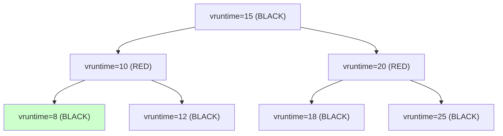
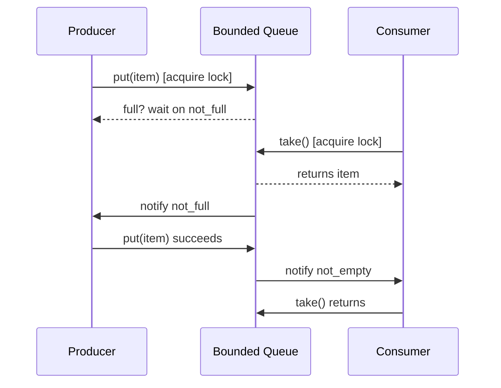

# Operating Systems — From Placement to Production

OS ek aisa subject hai jiske bina tu na interview mein survive kar sakta hai, na production mein. DBMS tujhe data ka thinking deta hai, OS tujhe **machine** ka thinking deta hai — process kaise ban-ta hai, thread kaise schedule hota hai, lock kab deadlock banta hai, memory kaise leak hoti hai, file system kab corrupt hota hai. Tu jab "Why is my Java service eating 8 GB?" debug kar raha hota hai 3 AM ko, ya jab "Service ne 200 OK diya but DB pe entry nahi gayi" sort kar raha hota hai — wahaan OS ka knowledge hi tujhe seedha solution tak le jata hai.

Iss subject ka goal: tujhe **systems thinking** deni hai. Process vs thread, scheduler ka pet ka raaz, mutex aur semaphore ke beech ka jhagda, virtual memory ka illusion, deadlock ka chakkar, aur production mein ye sab kaise compound hota hai. Hum Linux ko default mein rakhenge (kyuki 99% production usi pe chalti hai), x86 hardware ko mind mein rakhenge, aur Java/Python/C ka real code dekhenge — pseudo-code nahi.

> **Why this depth?** Microsoft, Amazon, Razorpay ke senior interviews mein literal sawaal aata hai — "Walk me through what `fork()` does, byte-by-byte." Flipkart pucchta hai — "Tu Round Robin chunega ya MLFQ — kyu, aur Linux ka CFS kahan fit hota hai?" Surface-level rattu ratta yahaan kaam nahi karta.

Chai-pani saath rakh, ye safar lamba hai — but har section ek interview question solve karega.

---

## 1. Why OS matters for placement (and production)

Pehle ye baat seedhi karte hain — **kyu** OS itna important hai jab tu Next.js, Spring Boot, microservices sab sikh raha hai? Kyuki tera har service ek **process** hai, har request handle karne wala ek **thread** hai, har file write ek **syscall** hai, har OOM ek **kernel** ka decision hai. Tu agar OS ka basic nahi samjha, tu apni hi service ko debug nahi kar payega.

### 1.1 The interview reality

Tu jab 6-8 round ka product company loop face karega, OS-related kuch yeh hota hai:

| Round | OS question type | Example |
|-------|------------------|---------|
| Online assessment | MCQ | "Which scheduling algorithm causes convoy effect?" |
| Technical screen | Concept + code | "Write a producer-consumer using semaphores" |
| LLD round | Concurrency | "Two threads incrementing a counter — race?" |
| HLD round | Memory + scale | "Why does Java take 4 GB just to print Hello World?" |
| Bar raiser | War story | "Tell me about a deadlock you debugged" |

DSA tu kitna bhi strong ho, agar tu thread-safety nahi samajhta, tu SDE-2+ reject hai. Real talk — Microsoft IDC, Amazon SDE-1, CRED platform team ke interview reports public hain — **process/thread + scheduling + sync + memory** unka top filter hai.

### 1.2 The production reality — three war stories

**Story 1: Razorpay's webhook worker pool, 2 AM.** Payment confirmation webhooks lag rahe the. SRE on-call ne dekha — Java process 4 GB se 12 GB pe pahunch gayi, GC pause 8 seconds. Root cause? Thread pool unbounded tha — har webhook ne ek nayi `Thread` banayi, har thread ne 1 MB stack liya, plus heap ka apna byte[]. 2000 concurrent webhooks = 2 GB just stacks. Linux ka oom-killer agle 30 seconds mein process ko maar deta. **Fix:** bounded `ThreadPoolExecutor` with `LinkedBlockingQueue(1000)`. OS-level samajh ke bina ye debug 6 ghante lagta.

**Story 2: Hotstar IPL spike — thread starvation.** IPL final ke 9:30 PM toss ke saath traffic 50x ho gaya. Login service ne pehle 200ms response time diya, fir 8 seconds, fir timeout. Logs mein kuch error nahi tha. Cause? Tomcat ka default `maxThreads=200`, har request ek slow downstream call (auth-service) pe 6 seconds wait kar raha tha. Pool exhaust ho gaya, baaki sab threads queue mein. Ye **classic thread starvation** hai. Fix: async I/O (Netty/WebFlux) + circuit breaker on auth-service. OS knowledge — "blocking I/O on bounded thread pool" — bina iska kuch samajh nahi aata.

**Story 3: Flipkart's deadlock postmortem (Big Billion Day, 2022).** Order placement service ne ek user pe simultaneously inventory deduct + cart clear kiya. Inventory service ne `lock(item) -> lock(cart)` order liya, cart service ne `lock(cart) -> lock(item)`. 14000 transactions per second pe ye **dining philosophers** ban gaya. P99 latency 8 seconds, error rate 12%. Postmortem ka recommendation? "Always acquire locks in canonical order: item_id ASC, then cart_id." Pure OS textbook lesson — but yahaan se LinkedIn pe likhne wali story banti hai.

### 1.3 What you'll know after this doc

- Process vs thread — address space level
- `fork()`, `exec()`, `wait()`, `clone()` — Linux ki realities
- 6 scheduling algorithms + Linux's CFS internals
- Semaphore, mutex, monitor, spinlock — kab kaunsa
- Producer-consumer, reader-writer, dining philosophers — runnable code
- Deadlock 4-condition + Banker's algorithm
- Virtual memory, paging, TLB, page replacement
- File system internals (ext4 inode, journaling)
- I/O models: blocking, non-blocking, epoll, io_uring
- Top 30 OS interview questions with one-line answers

Chal shuru karte hain.

---

## 2. Process vs Thread — the foundation

Sab kuch yahin se shuru hota hai. Aur ye wahi sawaal hai jo *har* interviewer puchta hai.

### 2.1 What is a process?

Process = a running program + uska context. OS ke nazar mein, process matlab ek **address space** + ek **execution context** + **OS resources** (file descriptors, signals, etc).

Tu jab `java -jar app.jar` chalata hai, Linux:
1. Ek naya **PID** allocate karta hai
2. Ek alag **virtual address space** banata hai (4 GB on 32-bit, 256 TB on 64-bit)
3. Memory ko 4 segments mein divide karta hai: **text** (code), **data** (globals), **heap** (malloc), **stack** (function calls)
4. Ek **PCB** (Process Control Block) maintain karta hai — `task_struct` Linux mein

```
+----------------------+   high address
|       Stack          |   <- grows down
|         |            |
|         v            |
+----------------------+
|                      |
|     (free space)     |
|                      |
+----------------------+
|         ^            |
|         |            |
|       Heap           |   <- grows up
+----------------------+
|     BSS (uninit)     |
+----------------------+
|     Data (init)      |
+----------------------+
|     Text (code)      |   low address
+----------------------+
```

### 2.2 The PCB — what kernel actually stores

Linux ka `task_struct` (in `include/linux/sched.h`) mein 1500+ fields hain. Important wale:

- **PID, PPID** — process id, parent pid
- **State** — RUNNING, SLEEPING, ZOMBIE, STOPPED
- **Registers** — saved CPU state for context switch
- **Page table base** — pointer to MMU mapping
- **File descriptor table** — open files, sockets
- **Signal handlers**
- **Scheduling info** — priority, vruntime, nice value

Jab context switch hota hai, kernel saari registers PCB mein save karta hai, fir naye process ki PCB se restore karta hai. Ye expensive operation hai — niche numbers dekhenge.

### 2.3 fork() — the way Linux makes processes

```c
#include <unistd.h>
#include <stdio.h>
#include <sys/wait.h>

int main() {
    pid_t pid = fork();
    if (pid == 0) {
        // Child process
        printf("Child: my pid=%d, parent=%d\n", getpid(), getppid());
    } else if (pid > 0) {
        // Parent process
        printf("Parent: my pid=%d, child=%d\n", getpid(), pid);
        wait(NULL);  // wait for child to die
    } else {
        perror("fork failed");
    }
    return 0;
}
```

`fork()` returns **twice** — once in parent (returns child's PID), once in child (returns 0). Internally:
- Kernel duplicates parent's `task_struct`
- **Page tables copied**, but actual pages **shared** with copy-on-write (CoW) flag
- Sirf jab koi process write karega, tab kernel us page ki copy banayega
- Ye `fork()` ko sasta banata hai — full memory copy nahi hoti

> **Production note:** Redis ka `BGSAVE` exactly is feature pe banaya hua hai. Parent process serve karta rehta hai, child fork hota hai aur snapshot disk pe likhta hai. Both share memory until parent updates kuch. Razorpay's Redis cluster ka 16 GB process fork karta hai 200ms mein — physical memory copy kabhi nahi hoti, bas page tables.

### 2.4 exec() — replace yourself

`fork()` se child banaya, ab usko kuch alag karna ho? `exec()` family use kar:

```c
char *args[] = {"/bin/ls", "-l", "/tmp", NULL};
execv("/bin/ls", args);
// agar yahaan tak pahuncha, exec failed
perror("exec failed");
```

`exec()` current process ka address space *replace* kar deta hai naye binary ke saath. PID same rehta hai. Shell exactly aisa hi karta hai — `bash` fork karta hai, child mein `exec("/usr/bin/ls")` chalata hai. Yeh "fork-then-exec" model Unix ka core hai.

### 2.5 wait() and zombies

Child mar gaya but parent ne `wait()` nahi kiya — child becomes a **zombie** (state Z). Kernel uska PID + exit status hold karke baithta hai jab tak parent collect na kare. Zombies system ke PID space khaate hain.

```c
pid_t pid = fork();
if (pid > 0) {
    int status;
    waitpid(pid, &status, 0);
    if (WIFEXITED(status)) {
        printf("Child exited with %d\n", WEXITSTATUS(status));
    }
}
```

Production reality: Docker containers mein PID 1 nahi sahi se zombies reap nahi karta — isiliye `tini` ya `dumb-init` use hota hai as PID 1.

### 2.6 What is a thread?

Thread = lightweight process. Same address space share karte hain, but har thread ka apna **stack** aur **registers** hota hai.

```
Process ke andar:

+----------------------+
| Shared: text, data,  |
|         heap, fds    |
+----------------------+
| Thread 1 stack       |
| Thread 2 stack       |
| Thread 3 stack       |
| Thread 1 registers   |  <- per-thread
| Thread 2 registers   |
| Thread 3 registers   |
+----------------------+
```

Threads ka **superpower**: shared memory = fast communication. Same process ke threads bina syscall ke ek doosre ka data dekh sakte hain. Lekin yahi danger bhi hai — race conditions, deadlocks.

### 2.7 Kernel vs user threads + M:N model

Three models historically:

| Model | Description | Example |
|-------|-------------|---------|
| **1:1 (kernel threads)** | Har user thread = ek kernel thread | Linux NPTL, Windows |
| **N:1 (user threads)** | Saare user threads ek kernel thread pe | Old Java green threads |
| **M:N (hybrid)** | M user threads on N kernel threads | Solaris, Go runtime, Java Loom (virtual threads) |

Modern Linux: **1:1**. `pthread_create()` aur `clone()` ke through har thread ka apna kernel-side `task_struct` banta hai.

Go ki goroutines aur Java 21 ki **virtual threads (Loom)** M:N model wapas le aaye. 10000 goroutines = 4 OS threads pe multiplex. Cheap context switch (~50 ns vs 1-10 µs for kernel threads). Iska reason hai ki Go aur Loom IO-heavy workloads ke liye perfect hain.

### 2.8 Linux clone() — the great unifier

Linux mein process aur thread ka koi alag syscall nahi hai. Sab `clone()` se banta hai. Difference sirf flags ka hai.

```c
// Process: nothing shared
clone(child_func, stack, 0, arg);

// Thread: share everything
clone(child_func, stack,
      CLONE_VM | CLONE_FS | CLONE_FILES |
      CLONE_SIGHAND | CLONE_THREAD,
      arg);
```

`fork()` internally `clone()` ke saath specific flags call karta hai. `pthread_create()` bhi `clone()` ko alag flags ke saath call karta hai. **Ek hi mechanism, alag-alag sharing levels.**

### 2.9 Context switching cost — the numbers

Yeh interview mein concrete numbers maange jaate hain:

| Operation | Typical time (x86) |
|-----------|-------------------|
| Function call | ~1 ns |
| L1 cache hit | ~1 ns |
| L2 cache hit | ~5 ns |
| Main memory access | ~100 ns |
| Thread context switch (same process) | ~1-2 µs |
| Process context switch | ~5-10 µs (TLB flush adds cost) |
| Syscall (cheap) | ~100 ns |
| Disk seek | ~10 ms |
| Network round-trip (datacenter) | ~500 µs |

Process switch thread switch se 5-10x mehnga kyu? Kyuki page table change karna padta hai, jisse **TLB flush** hota hai. TLB miss = ~100 ns extra per memory access until TLB warms up.

### 2.10 When to choose thread vs process

| Choose **threads** when | Choose **processes** when |
|------------------------|--------------------------|
| Shared state, fast IPC | Isolation needed (security) |
| CPU-bound parallelism | Failure isolation (one crash != all crash) |
| Lots of concurrent I/O | Different binaries needed |
| Tight memory budget | Different users / privileges |

Production examples:
- **Tomcat** uses threads — share connection pools, caches
- **PostgreSQL** uses processes — one crashed query doesn't kill others
- **Chrome** uses processes per tab — security isolation
- **Nginx** uses processes (workers) + event loops — best of both

---

## 3. CPU Scheduling

Tere CPU pe 1 core hai (assume), 200 processes hain. Kaun pehle chalega? Yeh decision **scheduler** lega. Sahi scheduler chuna to system smooth, galat chuna to convoy / starvation.

### 3.1 Goals of scheduling

- **CPU utilization**: keep CPU busy (~100%)
- **Throughput**: jobs completed per second
- **Turnaround time**: submission → completion
- **Waiting time**: time spent in ready queue
- **Response time**: submission → first response (interactive ke liye)
- **Fairness**: no starvation

In sab mein trade-off hota hai. Throughput maximize karoge to interactive feel kharab. Latency minimize karoge to throughput drop.

### 3.2 Pre-emptive vs non-pre-emptive

- **Non-pre-emptive**: process voluntarily release karega CPU (block on I/O ya complete)
- **Pre-emptive**: scheduler force se yank karega CPU (timer interrupt ke through)

Modern OS = pre-emptive. Old Mac OS 9 was non-pre-emptive — ek hung app pure system ko hang kar deti.

### 3.3 The 6 classic algorithms

#### FCFS — First Come First Served

```
Process | Burst time
P1      | 24
P2      | 3
P3      | 3

Gantt: | P1 (24) | P2 (3) | P3 (3) |
       0        24       27       30

Avg waiting = (0 + 24 + 27)/3 = 17 ms
```



```mermaid
gantt
    title FCFS Scheduling — Convoy Effect
    dateFormat X
    axisFormat %s
    section CPU
    P1 (long) :0, 24
    P2 (short):24, 27
    P3 (short):27, 30
```

**Problem: convoy effect**. Ek long job ke piche short jobs lag jaate hain. Avg wait = ridiculous.

#### SJF — Shortest Job First (non-preemptive)

```
Same processes, sorted by burst:

Gantt: | P2 (3) | P3 (3) | P1 (24) |
       0        3        6         30

Avg waiting = (6 + 0 + 3)/3 = 3 ms
```

**Optimal** for avg waiting time. Problem: kaise pata burst kitna hoga? Estimate via exponential averaging of past bursts.

#### SRTF — Shortest Remaining Time First (preemptive SJF)

Naya process aaya jiska burst current se chhota hai → preempt. Best avg wait but starvation risk.

#### Priority Scheduling

Har process ko priority do (lower number = higher priority typically).
- **Problem: starvation** — low priority jobs kabhi run nahi honge if high-priority constantly arriving
- **Solution: aging** — har waiting second priority badhao

#### Round Robin (RR)

Time quantum (e.g., 10 ms). Har process ko quantum bhar CPU, fir back of queue.

```
Quantum = 4ms, P1=24, P2=3, P3=3

Gantt: |P1|P2|P3|P1|P1|P1|P1|P1|
       0  4  7  10 14 18 22 26 30
```



```mermaid
gantt
    title Round Robin (quantum=4ms)
    dateFormat X
    axisFormat %s
    section CPU
    P1 :0, 4
    P2 :4, 7
    P3 :7, 10
    P1 :10, 14
    P1 :14, 18
    P1 :18, 22
    P1 :22, 26
    P1 :26, 30
```

**Quantum tuning critical:**
- Too small (1 ms) → context switch overhead dominates
- Too large (1 sec) → effectively FCFS
- Sweet spot Linux: ~1-10 ms based on load

#### MLFQ — Multi-Level Feedback Queue

Multiple priority queues. Naye process highest priority queue mein. Quantum exhaust kiya without blocking → demoted. I/O block kiya → stay or promote (interactive process bonus).

```
Q0 (highest, quantum=2ms)  ----> [interactive, short jobs]
Q1 (quantum=4ms)           ----> [demoted from Q0]
Q2 (quantum=8ms, RR)       ----> [CPU-bound, batch]
```

This is essentially **Windows scheduler** + base for Linux's old O(1) scheduler. Idea: "let the system *learn* which jobs are interactive."

### 3.4 Convoy effect, starvation, aging — quick recap

| Problem | Where | Fix |
|---------|-------|-----|
| Convoy effect | FCFS | Use SJF or RR |
| Starvation | Priority, SRTF | Aging |
| Trashing under load | RR with too-small quantum | Tune quantum |

### 3.5 Linux's CFS — Completely Fair Scheduler

2007 mein Ingo Molnar ne O(1) scheduler ko replace kiya CFS se. Aaj bhi Linux ka default. Idea bahut elegant hai.

**Core concept: vruntime.** Har process ka ek "virtual runtime" track hota hai — kitna CPU is process ne consume kiya, weighted by its priority (nice value).

```
vruntime += actual_runtime * (NICE_0_LOAD / weight)
```

Higher priority (lower nice) = weight zyada = vruntime slower badhta hai = zyada CPU paayega.

**Data structure: red-black tree** of all runnable processes, keyed by vruntime. Always pick **leftmost** (min vruntime). O(log N) insert/delete, O(1) leftmost lookup.



Leftmost = vruntime 8 → next to run.

**Why "fair"?** Over time, all processes accumulate roughly equal vruntime (weighted). No starvation, no fixed quanta. Quantum dynamically calculated:

```
sched_period = max(sched_min_granularity * nr_running, sched_latency)
quantum = sched_period * (weight_i / total_weight)
```

Default: `sched_latency = 6ms`, `min_granularity = 0.75ms`. With 4 equal-weight processes → 6ms / 4 = 1.5ms each.

> **Why it matters in production:** When a Razorpay payment service runs alongside a backup-cron, CFS gives both fair share. To prioritize payment, run cron with `nice 19` — now payment gets ~30x more CPU automatically. No code change.

### 3.6 Real-time scheduling

For low-latency stuff (audio, robotics), Linux supports `SCHED_FIFO` and `SCHED_RR` — these always preempt CFS tasks. Used in trading systems, kernel threads, audio servers.

---

## 4. Synchronisation — the heart of concurrency

Threads share memory = **race conditions** ka khatra. Yahaan se interview mein 80% sawaal aate hain.

### 4.1 The race condition — concrete example

Bank account, two threads doing `withdraw(100)`:

```java
class Account {
    int balance = 1000;
    void withdraw(int amount) {
        if (balance >= amount) {       // 1. read
            balance = balance - amount; // 2. compute, 3. write
        }
    }
}
```

Two threads simultaneously call `withdraw(800)`:

| Time | Thread A | Thread B | balance |
|------|----------|----------|---------|
| T1 | reads balance=1000 | | 1000 |
| T2 | | reads balance=1000 | 1000 |
| T3 | checks 1000>=800, ok | | 1000 |
| T4 | | checks 1000>=800, ok | 1000 |
| T5 | balance = 1000-800 = 200 | | 200 |
| T6 | | balance = 1000-800 = 200 | 200 |

**Both withdrew 800 from a 1000 balance.** Bank lost 600. This is the *lost update* race condition.

### 4.2 Critical section + atomicity

Critical section = code chunk jisko atomically execute hona chahiye. Sync primitives ka kaam — guarantee karna ki **only one thread at a time** ho.

Three properties needed:
1. **Mutual exclusion** — only one thread in CS
2. **Progress** — koi block nahi rahega forever
3. **Bounded waiting** — finite wait time

### 4.3 Mutex — mutual exclusion lock

Simplest primitive. `lock()` aur `unlock()`. Owner thread hi unlock kar sakta hai.

```python
import threading

balance = 1000
lock = threading.Lock()

def withdraw(amount):
    global balance
    with lock:                   # acquires + releases
        if balance >= amount:
            balance -= amount

# 100 threads each withdrawing 10
threads = [threading.Thread(target=withdraw, args=(10,)) for _ in range(100)]
for t in threads: t.start()
for t in threads: t.join()

print(balance)   # always 0, never weird intermediate
```

Java equivalent:

```java
private final ReentrantLock lock = new ReentrantLock();

void withdraw(int amount) {
    lock.lock();
    try {
        if (balance >= amount) balance -= amount;
    } finally {
        lock.unlock();   // always in finally
    }
}
```

Or Java's `synchronized` (compiler-managed monitor):

```java
synchronized void withdraw(int amount) {
    if (balance >= amount) balance -= amount;
}
```

### 4.4 Semaphore — counting permits

Mutex = binary (0/1). Semaphore = counter. Two ops: `acquire()` (wait, decrement) and `release()` (signal, increment).

**Counting semaphore**: e.g., a connection pool of 10 DB connections.

```python
import threading, time, random

db_pool = threading.Semaphore(10)   # 10 permits

def query():
    with db_pool:                   # acquire
        # at most 10 threads here at any time
        time.sleep(random.random())
        # release on exit

threads = [threading.Thread(target=query) for _ in range(100)]
for t in threads: t.start()
```

**Binary semaphore**: like a mutex, but ownership not enforced. Thread A can `acquire`, thread B can `release`. Useful for **signaling** between threads.

### 4.5 Mutex vs Semaphore — interview gotcha

| Aspect | Mutex | Semaphore |
|--------|-------|-----------|
| Counter | Binary (locked/unlocked) | Integer (N permits) |
| Ownership | Owner thread must release | Anyone can release |
| Use case | Mutual exclusion | Signaling, resource pools |
| Recursion | Reentrant variant exists | No |

Common mistake: using a semaphore where a mutex was needed → harder to reason, and `release()` can be called by wrong thread.

### 4.6 Monitor (Java's `synchronized`, Python's `Condition`)

Higher-level construct. Combines mutex + condition variables. Most languages mein built-in.

```java
class BoundedQueue<T> {
    private final Queue<T> q = new LinkedList<>();
    private final int capacity;

    public BoundedQueue(int cap) { this.capacity = cap; }

    public synchronized void put(T item) throws InterruptedException {
        while (q.size() == capacity) wait();   // release lock + wait
        q.add(item);
        notifyAll();                           // wake waiting consumers
    }

    public synchronized T take() throws InterruptedException {
        while (q.isEmpty()) wait();
        T item = q.poll();
        notifyAll();
        return item;
    }
}
```

`wait()` atomically releases lock + blocks. `notifyAll()` wakes up all waiters; they re-acquire lock one by one. **Always use `while` loop**, not `if` — spurious wakeups happen.

### 4.7 Producer-Consumer — the canonical example

Bounded buffer between producer + consumer threads.

```python
import threading, queue, time

buffer = queue.Queue(maxsize=10)

def producer():
    for i in range(100):
        buffer.put(f"item-{i}")           # blocks if full
        print(f"produced item-{i}")

def consumer():
    while True:
        item = buffer.get()                # blocks if empty
        print(f"consumed {item}")
        buffer.task_done()
        if item == "item-99": break

threading.Thread(target=producer).start()
threading.Thread(target=consumer).start()
```

`queue.Queue` internally = mutex + 2 condition variables (`not_full`, `not_empty`). Production-grade: **do not implement bounded buffer by hand** — use stdlib.



### 4.8 Reader-Writer — concurrent reads, exclusive writes

Many threads read same data, occasional writers. Mutex would serialize all → wasteful.

```python
import threading

class RWLock:
    def __init__(self):
        self.lock = threading.Lock()
        self.readers_ok = threading.Condition(self.lock)
        self.writers_ok = threading.Condition(self.lock)
        self.readers = 0
        self.writers = 0
        self.write_waiting = 0

    def acquire_read(self):
        with self.lock:
            while self.writers > 0 or self.write_waiting > 0:
                self.readers_ok.wait()
            self.readers += 1

    def release_read(self):
        with self.lock:
            self.readers -= 1
            if self.readers == 0:
                self.writers_ok.notify()

    def acquire_write(self):
        with self.lock:
            self.write_waiting += 1
            while self.readers > 0 or self.writers > 0:
                self.writers_ok.wait()
            self.write_waiting -= 1
            self.writers += 1

    def release_write(self):
        with self.lock:
            self.writers -= 1
            self.readers_ok.notify_all()
            self.writers_ok.notify()
```

This favors writers (avoids writer starvation under heavy reads). Java's `ReentrantReadWriteLock` is the production-grade equivalent.

### 4.9 Dining Philosophers — the deadlock classic

5 philosophers, 5 forks, each needs 2 forks (left + right) to eat.

```python
import threading, time, random

N = 5
forks = [threading.Lock() for _ in range(N)]

def philosopher(i):
    left, right = forks[i], forks[(i+1) % N]
    # Naive (deadlock-prone): always pick left first
    # Fix: smaller-index first → breaks circular wait
    first, second = (left, right) if i < (i+1) % N else (right, left)
    while True:
        time.sleep(random.random())
        with first:
            with second:
                print(f"phil {i} eating")
                time.sleep(0.1)

for i in range(N):
    threading.Thread(target=philosopher, args=(i,), daemon=True).start()

time.sleep(5)
```

Naive version (always left → right) deadlocks: every philosopher grabs left, all wait for right. **Fix: always grab lower-numbered fork first** — breaks circular wait.

### 4.10 Spinlocks vs blocking locks

| | Spinlock | Mutex (blocking) |
|-|----------|------------------|
| What | Loops checking the lock | Sleeps in kernel |
| Cost when free | Cheap (CAS instruction) | Syscall overhead |
| Cost when held long | CPU wasted spinning | Cheap (sleeping) |
| Use | Critical section ~100ns | Anything longer |

Linux kernel mein dono use hote hain. User space mein Java's `synchronized` adaptive — pehle thoda spin karta hai (in case lock free ho jaaye soon), fir block.

### 4.11 Atomic operations + CAS

Modern CPUs support atomic instructions: `LOCK XADD`, `LOCK CMPXCHG` (compare-and-swap).

```java
import java.util.concurrent.atomic.AtomicInteger;

AtomicInteger counter = new AtomicInteger(0);

// Lock-free increment
counter.incrementAndGet();

// CAS-based update
int prev, next;
do {
    prev = counter.get();
    next = prev * 2;
} while (!counter.compareAndSet(prev, next));
```

CAS = "if value is `prev`, set to `next` atomically; else fail". Foundation of **lock-free** data structures.

### 4.12 Lock-free vs wait-free

| Term | Guarantee |
|------|-----------|
| **Lock-free** | At least one thread makes progress in finite steps (some may retry forever) |
| **Wait-free** | Every thread completes in bounded steps |
| **Obstruction-free** | A thread completes in finite steps if run alone |

ConcurrentHashMap, AtomicInteger = lock-free. Wait-free is rare and complex (Herlihy 1991 paper).

> **Production note:** Disruptor (LMAX) pattern — wait-free ring buffer used by trading systems (and inside Razorpay's webhook dispatcher reportedly) — handles 6 million events/sec on a single thread. Bina lock ke. CAS + memory barriers + careful cache-line padding.

---

## 5. Deadlock

Deadlock = ek group of threads forever wait kar rahe hain ek doosre ke resources ke liye. System effectively frozen.

### 5.1 The 4 necessary conditions (Coffman, 1971)

All four required simultaneously for deadlock:

1. **Mutual exclusion** — resource held by at most one thread
2. **Hold and wait** — thread holds one resource, waiting for another
3. **No preemption** — resource can only be released voluntarily
4. **Circular wait** — chain T1 → T2 → ... → Tn → T1

Break any one → no deadlock.

### 5.2 Resource Allocation Graph (RAG)

Nodes: processes (circles) + resources (squares). Edge `P → R` = process requesting; `R → P` = resource allocated.

```
P1 ─→ R1
       │
       ↓
       P2 ─→ R2
              │
              ↓
              P1   ← cycle! deadlock
```

Cycle in RAG (with single-instance resources) = deadlock confirmed.

### 5.3 The 4 strategies

| Strategy | What | Used by |
|----------|------|---------|
| **Prevention** | Disallow one of 4 conditions structurally | Banking apps, careful systems |
| **Avoidance** | Banker's algorithm: only grant if safe | Theoretical, rare in practice |
| **Detection + recovery** | Periodically scan for cycles, kill victim | DBs (Postgres, MySQL InnoDB) |
| **Ignore (ostrich)** | Pretend it can't happen, reboot if it does | Linux, Windows for app-level |

Linux's stance: "User-space deadlocks are user's problem. Kernel itself uses careful lock ordering."

### 5.4 Banker's Algorithm — deadlock avoidance

System knows max each process can claim. On each request, simulate granting → check if a **safe sequence** exists. If yes, grant; else, block.

**Worked example.** 3 processes, 3 resource types (A=10, B=5, C=7).

| Process | Allocation | Max | Need |
|---------|-----------|-----|------|
| P0 | (0,1,0) | (7,5,3) | (7,4,3) |
| P1 | (2,0,0) | (3,2,2) | (1,2,2) |
| P2 | (3,0,2) | (9,0,2) | (6,0,0) |
| P3 | (2,1,1) | (2,2,2) | (0,1,1) |
| P4 | (0,0,2) | (4,3,3) | (4,3,1) |

Available = total - sum(allocated) = (10,5,7) - (7,2,5) = (3,3,2).

Find safe sequence:
- P1 needs (1,2,2). Available (3,3,2) ≥ (1,2,2)? Yes. Run, release: avail = (5,3,2).
- P3 needs (0,1,1). avail (5,3,2) ≥ (0,1,1)? Yes. Run: avail = (7,4,3).
- P0 needs (7,4,3). avail (7,4,3) ≥ (7,4,3)? Yes. Run: avail = (7,5,3).
- P2 needs (6,0,0). avail (7,5,3) ≥ (6,0,0)? Yes. Run: avail = (10,5,5).
- P4 needs (4,3,1). avail (10,5,5) ≥ (4,3,1)? Yes. Run: avail = (10,5,7).

Safe sequence found: <P1, P3, P0, P2, P4>. State is **safe**.

If a request would leave no safe sequence → deny it (process blocks).

**In practice:** Banker's needs `max` declared upfront. Real systems can't predict that. Mostly an interview/textbook concept.

### 5.5 Detection + recovery — what DBs actually do

Postgres / MySQL InnoDB build a wait-for graph among transactions every few hundred milliseconds. Cycle detected → pick victim (usually youngest tx) → abort it → application retries.

```sql
-- Postgres error you'll see
ERROR: deadlock detected
DETAIL: Process 1234 waits for ShareLock on transaction 5678; blocked by 1235.
        Process 1235 waits for ShareLock on transaction 5677; blocked by 1234.
HINT: See server log for query details.
```

### 5.6 Prevention via lock ordering

The single most important production technique:

> **Always acquire locks in a globally consistent order.**

Example: transferring money A → B and B → A simultaneously:

```python
# BAD - deadlock prone
def transfer(src, dst, amt):
    with src.lock:
        with dst.lock:
            src.balance -= amt
            dst.balance += amt

# GOOD - order by id
def transfer(src, dst, amt):
    first, second = sorted([src, dst], key=lambda a: a.id)
    with first.lock:
        with second.lock:
            src.balance -= amt
            dst.balance += amt
```

Flipkart's deadlock postmortem (mentioned in section 1.2) was exactly this fix: "lock(item_id, cart_id) sorted ASC."

### 5.7 Livelock — deadlock's evil cousin

Threads not blocked, but constantly retrying and undoing. Like two people trying to pass in a hallway, both step left, both step right, repeat. CPU 100%, no progress. Fix: random backoff (TCP-style).

---

## 6. Memory Management

Tu jab `malloc(1MB)` karta hai, kernel actually 1 MB allocate nahi karta — page fault aane par lazy allocate karta hai. Yeh aur saari magic yahaan samjhenge.

### 6.1 The evolution

1. **Contiguous allocation** — process gets one continuous chunk. **Problem:** external fragmentation, can't grow.
2. **Paging** — split memory into fixed-size **pages** (4 KB typical). Map virtual → physical via page table. No fragmentation in physical memory.
3. **Segmentation** — split by logical units (code, data, stack). Variable-size, semantic. **x86 used both** — segmentation + paging. Modern Linux mostly flat (segmentation as identity).
4. **Virtual memory** — process sees contiguous huge address space, kernel pages it in/out from disk on demand.

### 6.2 Virtual memory — the illusion

64-bit Linux process: 256 TB virtual address space. Physical RAM: maybe 16 GB. Fits because:
- Most virtual memory is unmapped
- Pages mapped to disk (backing store)
- Multiple processes share read-only pages (libc, kernel)

**Address translation flow:**

```
CPU emits virtual address  →  MMU consults page table  →  physical address  →  RAM
                              (cached in TLB)
```

Page = 4 KB usually. Address split:

```
| Page Number (52 bits) | Offset (12 bits) |
   ↑ used to look up page table       ↑ within-page offset
```

### 6.3 Page table

Maps virtual page number (VPN) → physical frame number (PFN) + flags.

| VPN | PFN | Present | R/W | User | Dirty | Accessed |
|-----|-----|---------|-----|------|-------|----------|
| 0x100 | 0x55A | 1 | 1 | 1 | 0 | 1 |

For a 64-bit address space, single-level page table = absurd size (~petabytes). Solution: **multi-level page tables**. x86-64 uses **4 levels** (PML4 → PDPT → PD → PT). Each table 4 KB, 512 entries × 8 bytes.

```
Virtual address (48 bits useful):
| PML4 (9) | PDPT (9) | PD (9) | PT (9) | Offset (12) |
```

Empty regions don't allocate sub-tables → sparse address spaces are cheap.

### 6.4 TLB — the cache that makes it tolerable

Without caching, *every* memory access = 4 extra memory reads (walk page table). Disaster.

**TLB (Translation Lookaside Buffer)** = small associative cache (64-1024 entries) inside MMU, mapping VPN → PFN. Hit rate typically >99%. Miss = walk page tables.

**Context switch flushes TLB** (on x86 unless using PCID). That's why process switch costs more than thread switch.

### 6.5 Page replacement algorithms

Physical RAM full, need to evict a page. Reference string: 1, 2, 3, 4, 1, 2, 5, 1, 2, 3, 4, 5. Frames = 3.

#### FIFO

Evict oldest loaded.

```
ref:  1 2 3 4 1 2 5 1 2 3 4 5
cache:1 1 1 4 4 4 5 5 5 3 3 3
        2 2 2 1 1 1 1 1 1 4 4
          3 3 3 2 2 2 2 2 2 5
miss: M M M M M M M       M M M
9 misses
```

#### LRU — Least Recently Used

Evict whichever was used longest ago.

```
9 misses on this trace too — but LRU usually beats FIFO.
```

Implementation: stack/linked list (move to top on use), or counter (find min). Hardware approximations: clock algorithm.

#### Clock (Second Chance) — LRU approximation

Pages in a circular list. Each has an "accessed" bit. Hand sweeps:
- If accessed bit = 0 → evict
- If accessed bit = 1 → clear bit, advance hand

Cheap, used in real OSes (Linux's PFRA loosely follows this).

#### Optimal (Belady's MIN)

Evict the page that won't be used for the longest time in future. **Theoretical bound** — needs future knowledge. Use as benchmark.

### 6.6 Belady's anomaly

Increasing frames should reduce misses, right? **Not for FIFO!**

Reference: 1,2,3,4,1,2,5,1,2,3,4,5

- 3 frames → 9 misses
- 4 frames → 10 misses

Counter-intuitive. Why? FIFO not stack-property. **LRU and Optimal don't suffer this.** Interview question gold.

### 6.7 Working set + thrashing

**Working set** of a process = pages actively used in last τ time units. If sum(working sets) > physical RAM → **thrashing**: every memory access page-faults, system spends 99% time swapping. CPU utilization drops to floor.

```
Cause:                   Symptom:
- Too many processes     - Disk I/O 100%
- Memory leaks           - CPU usage low
- Working set too big    - Latency 1000x
```

**Linux's defense:** the OOM killer. When RAM + swap nearly exhausted, kernel picks "worst" process (high `oom_score`) and SIGKILL.

> **Production reality:** Razorpay's 2 AM webhook story (section 1.2) → JVM heap grew, swap started, P99 went from 50ms → 8 sec. Eventually `oom-killer` zapped the process. Lesson: **set heap < physical RAM and disable swap on Linux production servers** (`vm.swappiness=1`).

### 6.8 Page faults — major vs minor

| Type | What | Cost |
|------|------|------|
| **Minor** | Page in RAM but not yet mapped to this process | ~1 µs |
| **Major** | Page must be read from disk | 1-10 ms (1000x slower) |

Track via `getrusage()`. Major faults = your service is being killed by the OS.

### 6.9 Copy-on-write fork()

Earlier mentioned. When `fork()` runs:
1. Parent's page tables copied to child
2. All pages marked **read-only** in both
3. On write, MMU traps → kernel allocates new physical page, copies content, marks both writable in respective process

```
Before fork:
parent → page A (RW) → frame 100

After fork (no writes yet):
parent → page A (RO) → frame 100
child  → page A (RO) → frame 100   (shared!)

After parent writes to A:
parent → page A (RW) → frame 200   (new)
child  → page A (RO) → frame 100   (original)
```

Massive savings when child immediately `exec()`s.

### 6.10 Memory-mapped files (mmap)

`mmap()` maps a file into virtual address space. Reads/writes = memory accesses; kernel pages in/out as needed.

```c
int fd = open("data.bin", O_RDONLY);
size_t len = ...;
char *p = mmap(NULL, len, PROT_READ, MAP_PRIVATE, fd, 0);
// p[i] reads byte i; kernel auto-pages
munmap(p, len);
```

Used by Postgres (shared buffers), Kafka log segments, SQLite. Avoid copy between user space + kernel buffer.

### 6.11 Allocators — malloc, jemalloc, tcmalloc

C library `malloc()` doesn't directly hit kernel — it uses **arenas** carved out via `brk()`/`mmap()` upfront. Reduces syscall cost.

- **glibc malloc** — default, OK
- **jemalloc** — Facebook, low fragmentation
- **tcmalloc** — Google, thread-cached, fast for high-concurrency

JVM has its own allocator (TLAB — Thread-Local Allocation Buffers) for object allocation. Bypasses OS malloc entirely for small objects.

---

## 7. File Systems

Disk pe data store karne ka tareeka. Choices matter for perf, durability.

### 7.1 inode-based — ext4

ext4 (Linux default) and friends store **metadata in inodes**, separate from filename → inode mapping in directory entries.

```
Directory entry:  "report.txt" → inode #4521
Inode #4521:
   - mode (file/dir, perms)
   - uid, gid
   - size
   - atime, mtime, ctime
   - 12 direct block pointers
   - 1 single-indirect pointer
   - 1 double-indirect pointer
   - 1 triple-indirect pointer
```

Direct pointers: 12 × 4 KB = 48 KB. Indirect adds GBs. Triple-indirect supports TB-sized files.

**Hard links** = multiple directory entries → same inode. Inode has refcount. Delete = decrement; when zero, free blocks.

**Soft (symbolic) links** = a small file containing a path string.

### 7.2 FAT — File Allocation Table

Used by old DOS, Windows, SD cards. A linked list per file: each entry in the FAT says "next cluster of this file." Simple, but:
- Slow random access (must walk chain)
- No real metadata (no UNIX perms)
- Max file size 4 GB (FAT32)

Still ubiquitous because every OS reads it.

### 7.3 B-tree filesystems — xfs, btrfs, zfs

Files + directories indexed in B+ trees. Scales to billions of files in one directory (where ext4 starts to crawl). Snapshots, checksums, copy-on-write built in.

| FS | Strength |
|----|----------|
| ext4 | Stable, fast for typical loads, default Linux |
| xfs | Excellent for huge files (DB, video), parallel I/O |
| btrfs | Snapshots, RAID, COW |
| zfs | Strongest data integrity, snapshots, tiered storage |

### 7.4 Journaling

Crash mid-write → file system inconsistent. Journaling FS writes intent to a **journal** first:

```
1. Write metadata changes to journal (small, sequential, fast)
2. Sync journal to disk (fsync)
3. Apply changes to actual FS
4. Mark journal entry done
```

Crash between 2-3 → on reboot, replay journal. ext4 supports 3 modes:
- **journal**: full data + metadata journaled (slowest, safest)
- **ordered**: metadata journaled, data written first (default)
- **writeback**: only metadata, data may lag (fastest, least safe)

### 7.5 File allocation strategies

| Method | How | Pros | Cons |
|--------|-----|------|------|
| **Contiguous** | All blocks together | Fast read | External fragmentation, can't grow |
| **Linked** | Each block points to next | No fragmentation | Slow random access |
| **Indexed** | Index block stores all pointers | Random access fast | Index overhead |

ext4 = indexed + extents (groups of contiguous blocks).

### 7.6 The page cache

Linux aggressively caches file blocks in RAM. `read()` checks cache first; miss → disk → fill cache. **All "free" RAM is page cache.** This is why `free -h` showing "0 free" is normal.

```
$ free -h
              total   used   free   buff/cache
Mem:           16G    8G     200M   7.5G
```

`buff/cache` = page cache. Reclaimable instantly.

---

## 8. I/O Systems

Tera service ka 90% time I/O wait pe jaata hai. Models samajh.

### 8.1 Polling

CPU repeatedly checks: "data ready? data ready?". Wastes CPU. Used in tight low-latency contexts (NIC drivers, some embedded).

### 8.2 Interrupts

Device raises interrupt when ready. CPU saves state, runs ISR (Interrupt Service Routine), resumes. Standard for keyboards, network, disk.

**Top half / bottom half**: ISR does minimum (acknowledge, queue work). Kernel's "softirq" or "tasklet" finishes in non-urgent context.

### 8.3 DMA — Direct Memory Access

Big I/O (disk, network) → CPU shouldn't shuffle bytes. Device's DMA controller writes directly to RAM. CPU only sets up + gets interrupt on completion. Throughput ~GBs/sec without CPU load.

### 8.4 Blocking vs non-blocking I/O

```python
# Blocking (default)
data = sock.recv(1024)   # thread blocked until data arrives

# Non-blocking
sock.setblocking(False)
try:
    data = sock.recv(1024)
except BlockingIOError:
    # nothing yet, do other work
    pass
```

### 8.5 I/O multiplexing — select / poll / epoll

One thread, many connections.

- `select()` — O(N) scan, FD limit 1024. Old.
- `poll()` — O(N) scan, no FD limit. Mid.
- `epoll()` — O(1), edge/level triggered, scales to 100k+ connections. Linux's killer feature.

```python
import selectors, socket

sel = selectors.DefaultSelector()  # epoll on Linux
server = socket.socket()
server.bind(('localhost', 8080))
server.listen(100)
server.setblocking(False)
sel.register(server, selectors.EVENT_READ)

while True:
    for key, _ in sel.select():
        sock = key.fileobj
        if sock is server:
            conn, _ = sock.accept()
            conn.setblocking(False)
            sel.register(conn, selectors.EVENT_READ)
        else:
            data = sock.recv(1024)
            if data: sock.send(data)
            else:
                sel.unregister(sock); sock.close()
```

This is how Nginx, Node.js, Netty all serve 100k connections per process.

### 8.6 io_uring — the future

Linux 5.1+ ka new async I/O interface. Submission + completion queues shared between kernel + userspace via mmap. Zero syscall in fast path (after setup). 2-10x faster than epoll+blocking ops for some workloads.

Used by ScyllaDB, modern Redis, Postgres (experimental). Likely replaces epoll in next-gen high-perf servers.

### 8.7 Async I/O — programming model

Callbacks → promises → async/await. Same epoll/io_uring underneath; nicer syntax on top.

```python
import asyncio

async def fetch(reader, writer):
    data = await reader.read(1024)   # epoll under the hood
    writer.write(data)
    await writer.drain()
    writer.close()

async def main():
    server = await asyncio.start_server(fetch, '0.0.0.0', 8080)
    await server.serve_forever()

asyncio.run(main())
```

One Python process can handle 10k+ concurrent connections this way. Same idea = Node.js, Go's goroutines, Java Loom.

---

## 9. Top 30 OS interview questions (with one-line answers)

| # | Question | Answer |
|---|----------|--------|
| 1 | Process vs thread? | Process: own address space, expensive switch. Thread: shares address space, cheap switch (~1 µs). |
| 2 | What does `fork()` return? | Twice: 0 in child, child's PID in parent, -1 on failure. |
| 3 | What's an orphan vs zombie? | Orphan: parent dead, init adopts. Zombie: dead child not yet `wait()`-ed. |
| 4 | `fork()` vs `exec()`? | fork() duplicates process; exec() replaces current process image with new binary. |
| 5 | What is copy-on-write fork? | Pages shared read-only after fork; copied lazily on first write — saves memory. |
| 6 | User vs kernel thread? | Kernel thread: scheduled by OS. User thread: scheduled in user-space (Go, Loom). |
| 7 | Linux `clone()` and threads? | clone() with CLONE_VM/FS/FILES/SIGHAND/THREAD flags creates threads; without = process. |
| 8 | Pre-emptive vs non-pre-emptive scheduling? | Pre-emptive: scheduler can yank CPU. Non-pre-emptive: process must yield. |
| 9 | Convoy effect? | FCFS: short jobs queued behind a long one — terrible average wait. |
| 10 | Starvation + aging? | Low-priority tasks never run; aging boosts priority over wait time. |
| 11 | What is Linux CFS? | Completely Fair Scheduler: red-black tree on vruntime, picks min vruntime always. |
| 12 | Race condition? | Outcome depends on thread interleaving — non-deterministic bug. |
| 13 | Mutex vs semaphore? | Mutex binary + ownership. Semaphore counter, no ownership, used for signaling/pools. |
| 14 | Counting vs binary semaphore? | Counting: N permits (resource pool). Binary: 0/1 (mutex-like). |
| 15 | Monitor? | High-level construct = mutex + condition variables. Java's `synchronized`. |
| 16 | Spinlock vs mutex? | Spinlock busy-waits (good for very short CS); mutex sleeps (good for longer waits). |
| 17 | What's CAS? | Compare-and-swap atomic instruction; basis of lock-free programming. |
| 18 | Lock-free vs wait-free? | Lock-free: at least one thread progresses. Wait-free: every thread progresses in bounded steps. |
| 19 | 4 deadlock conditions? | Mutual exclusion, hold-and-wait, no preemption, circular wait. |
| 20 | Banker's algorithm? | Avoidance: grant request only if a safe sequence still exists. |
| 21 | How to prevent deadlock practically? | Lock ordering, lock timeouts, keep critical sections short. |
| 22 | What does Linux do about deadlocks? | Mostly nothing (ostrich); user-space's job. Kernel uses careful ordering. |
| 23 | Virtual memory? | Each process sees own large address space; mapped via page tables to physical RAM. |
| 24 | What's a TLB? | Cache of recent virtual→physical translations inside MMU; flushed on context switch. |
| 25 | LRU vs FIFO replacement? | LRU evicts least-recently-used; FIFO evicts oldest. LRU usually better, immune to Belady's anomaly. |
| 26 | Belady's anomaly? | More frames cause more page faults — happens with FIFO, not LRU. |
| 27 | Thrashing? | Working sets exceed RAM; system spends most time paging, throughput collapses. |
| 28 | Page fault — major vs minor? | Minor: page in RAM, not mapped (~1 µs). Major: must read disk (~ms). |
| 29 | Inode? | File metadata structure (size, perms, block pointers); separate from filename. |
| 30 | `epoll` vs `select`? | epoll O(1), scales to 100k+ FDs. select O(N), capped at 1024. |

---

## 10. Pre-interview checklist

Last 60 seconds before you walk into the room — mentally tick these:

- [ ] Can I explain process vs thread at the address-space level?
- [ ] Do I know what `fork()` returns and what CoW means?
- [ ] Can I explain how Linux's `clone()` unifies process + thread?
- [ ] Can I quote rough numbers: thread switch ~1µs, process switch ~10µs?
- [ ] Can I draw a Gantt chart for FCFS / SJF / RR for given burst times?
- [ ] Do I know convoy effect, starvation, aging, and a fix for each?
- [ ] Can I explain CFS in 30 seconds: vruntime + red-black tree?
- [ ] Can I write a producer-consumer in Python or Java?
- [ ] Can I distinguish mutex / semaphore / monitor / spinlock?
- [ ] Can I state the 4 conditions of deadlock + a way to break each?
- [ ] Can I work through Banker's algorithm on a small example?
- [ ] Do I know "always lock in canonical order" as the real-world fix?
- [ ] Can I explain virtual memory + TLB + multi-level page tables?
- [ ] Can I trace LRU vs FIFO on a reference string?
- [ ] Do I know what Belady's anomaly is and where it occurs?
- [ ] Can I explain thrashing and the role of working set?
- [ ] Do I know what mmap does and why Postgres uses it?
- [ ] Can I distinguish minor vs major page fault + cost in time?
- [ ] Can I explain inode vs FAT vs B-tree filesystems briefly?
- [ ] Can I explain blocking vs non-blocking I/O + epoll's role?
- [ ] Will I narrate trade-offs out loud — not just answer "yes/no"?

If 18+ checked, walk in confident. OS rewards depth over rote — agar tu *kyu* samajh raha hai (kyu CFS not Round Robin, kyu mutex not semaphore, kyu lock ordering deadlock se bachata hai), tu jeet jaayega.

---

## What to learn next

OS strong ho gaya — ab compounding effect ke liye yeh order follow kar:

- **`networks-complete`** — har socket, har epoll wait, ek TCP packet ka journey hai. OS + Networks ek doosre ke without adhoore hain.
- **`system-design-basics`** — process/thread/memory thinking ko app architecture pe map kar; load balancers, caching, database connections — sab OS principles ka extension hain.
- **`system-design-advanced`** — distributed locking (Redlock, Zookeeper), consensus (Raft), event-driven systems — yahaan OS ka concurrency knowledge multiply hota hai.
