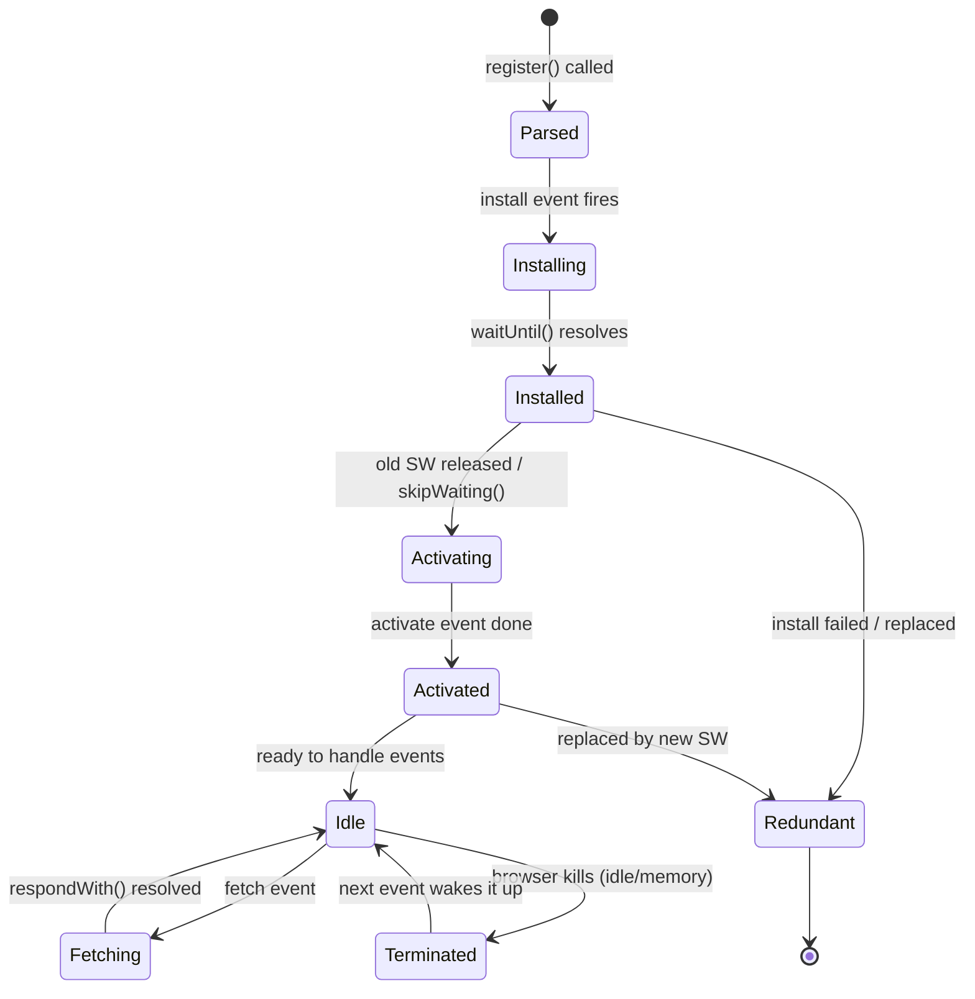
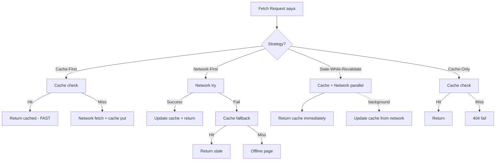
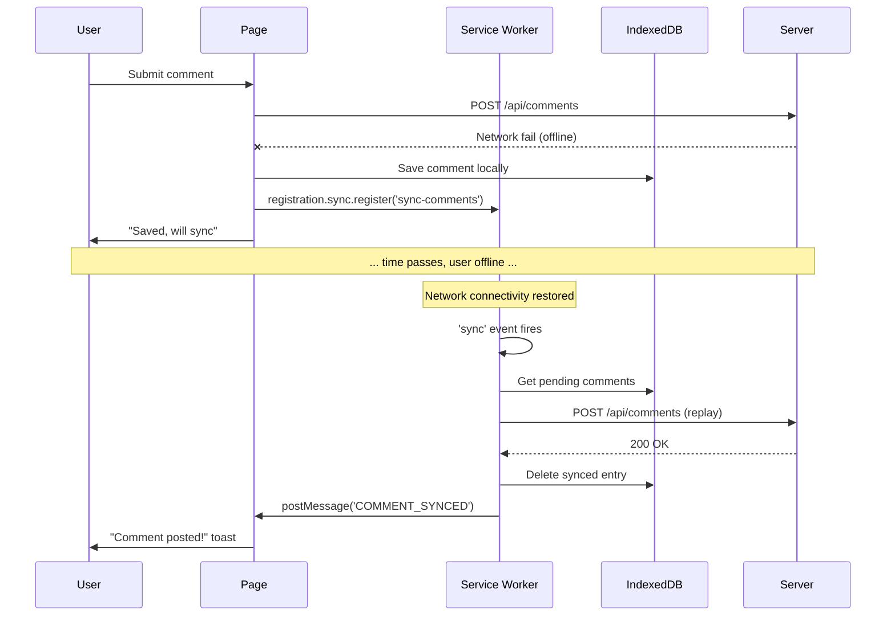
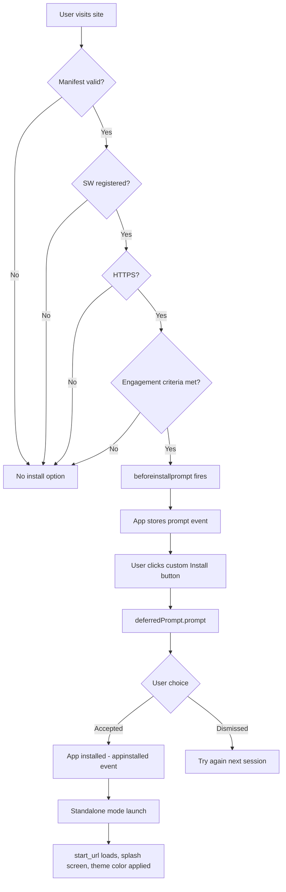

# Progressive Web Apps (PWA)

Dekh bhai, PWA basically web app ko native app jaisa feel deta hai. Install ho jaata hai home screen pe, offline chalta hai, push notifications bhejta hai, splash screen dikhata hai — Twitter Lite, Pinterest, Spotify, Starbucks, Flipkart Lite, Uber — yeh sab PWA hain. Idea simple hai: user ko Play Store / App Store ke jhanjhat se bachao, browser se hi install kara do, aur native jaisa experience do — bina 50MB ka APK download karaye.

PWA koi naya framework nahi hai, na hi koi specific library. Ye ek **set of web platform capabilities** hai jo milke chalti hain — Service Workers (background script), Cache API (offline storage), Web App Manifest (install metadata), Push API (notifications), Background Sync (queue requests jab offline ho), aur HTTPS (mandatory, kyunki SW power dete hain). Inko mila ke jab tu use karta hai, browser bolta hai "ye app install ho sakta hai" aur user ko install button dikhta hai. Native ke comparison mein PWA fast ship hota hai (no review process), cross-platform hai (Android + iOS + desktop ek hi codebase), aur SEO-friendly bhi hai kyunki end of the day ye web hi hai.

Lekin bhai, real talk: iOS pe PWA support thoda lacha hai (push notifications iOS 16.4 ke baad aaye, background sync abhi tak nahi hai), aur Service Worker debug karna ek alag level ka pain hai — "Update on reload" check karna bhul gaya toh ghanton barbaad. Is module mein hum chaar core pillars cover karenge: **Service Workers** (lifecycle, scope, debug), **Caching** (Cache API, strategies), **Offline Support** (offline pages, background sync, request queueing), aur **Web Manifest** (install prompt, display modes). Interview mein ye topics frequently aate hain — especially Flipkart, Myntra, MakeMyTrip, Swiggy types ke product companies mein jahan slow network India ka reality hai.

---

## 1. Service Workers

### 1.1 Lifecycle (install, activate, fetch), registration, scope, debugging in DevTools

#### Definition

Service Worker ek **JavaScript file hai jo browser background mein chalti hai**, separate thread pe — main UI thread se alag. Ye ek **programmable network proxy** hai jo tere web page aur network ke beech baith ke har fetch request intercept kar sakta hai. DOM ka access nahi hota isko (kyunki DOM main thread mein hai), but `fetch`, `Cache`, `IndexedDB`, `postMessage` sab milte hain. Ye **event-driven** hai — install, activate, fetch, push, sync — events fire hote hain aur SW handle karta hai.

Sabse important baat: SW **HTTPS pe hi chalta hai** (localhost is exception for dev). Aur ek baar register ho gaya, toh page band hone ke baad bhi tab tak alive reh sakta hai jab tak browser usko terminate na kare (memory pressure, idle timeout, etc.).

#### Why?

- **Offline-first experience:** Network gaya toh bhi app chalta rahe — user ko "No Internet" ka sad face na dikhe
- **Performance:** Cache se serve karne se network round-trip bachta hai, page sub-second mein load hota hai
- **Background tasks:** Push notification, background sync — page band hone ke baad bhi kaam ho jaaye
- **Reliability:** Flaky 2G/3G network pe bhi app predictable behave kare — Indian context mein huge win
- **Update control:** Naya version aate hi user ko force update karna ya gracefully migrate karna — sab tere haath mein

#### How?

Pehle `sw.js` file root pe rakh. Phir main app se register kar.

```js
// app.js — main thread, browser tab mein chal raha hai

// Pehle check karo browser support karta hai ya nahi (old browsers, IE wagairah)
if ('serviceWorker' in navigator) {
  // Page load hone ke baad register karo, taaki critical resources first load ho jaayein
  window.addEventListener('load', async () => {
    try {
      // Register karte waqt scope define kar sakte ho — default = sw.js ki location
      const registration = await navigator.serviceWorker.register('/sw.js', {
        scope: '/', // Pura origin SW control karega
      });
      console.log('SW registered, scope:', registration.scope);

      // Update available hua toh handle karo (naya SW waiting state mein hai)
      registration.addEventListener('updatefound', () => {
        const newWorker = registration.installing;
        newWorker.addEventListener('statechange', () => {
          if (newWorker.state === 'installed' && navigator.serviceWorker.controller) {
            // Naya SW ready hai, user ko bolo "refresh karo for update"
            console.log('Naya version available hai bhai, refresh kar');
          }
        });
      });
    } catch (err) {
      // SW register nahi hua — HTTPS issue ya syntax error
      console.error('SW registration fail:', err);
    }
  });
}
```

```js
// sw.js — service worker file, separate thread

const CACHE_NAME = 'app-shell-v1';
const ASSETS = ['/', '/index.html', '/styles.css', '/app.js', '/offline.html'];

// INSTALL phase — pehli baar SW download hone ke baad fire hota hai
// Yahan app shell ke critical assets cache karte hain
self.addEventListener('install', (event) => {
  console.log('SW install ho raha hai...');
  // waitUntil promise resolve hone tak install ko pending rakhta hai
  event.waitUntil(
    caches.open(CACHE_NAME).then((cache) => {
      // App shell ek shot mein cache kar do
      return cache.addAll(ASSETS);
    })
  );
  // skipWaiting se naya SW activate phase mein turant chala jaata hai (without waiting)
  // Production mein careful — user ke open tabs break ho sakte hain
  // self.skipWaiting();
});

// ACTIVATE phase — install ke baad fire hota hai, purane SW remove hone ke baad
// Yahan purane caches clean karte hain (versioning)
self.addEventListener('activate', (event) => {
  console.log('SW activate ho gaya');
  event.waitUntil(
    caches.keys().then((keys) => {
      return Promise.all(
        keys
          .filter((key) => key !== CACHE_NAME) // Sirf naya wala rakho
          .map((key) => caches.delete(key)) // Purane delete kar do
      );
    })
  );
  // clients.claim() se SW immediately existing pages ko control karna shuru kar deta hai
  // Default behavior: next page load tak wait karta hai
  self.clients.claim();
});

// FETCH phase — har network request intercept hoti hai yahan
self.addEventListener('fetch', (event) => {
  // event.request mein sari request details — URL, method, headers
  event.respondWith(
    caches.match(event.request).then((cachedResponse) => {
      // Cache mein hai? Wahi return karo. Nahi hai? Network se laao.
      return cachedResponse || fetch(event.request);
    })
  );
});
```

**Scope ka funda:** Agar tu `/sw.js` register karta hai with scope `/`, toh pure origin ke requests intercept hote hain. Lekin agar tu `/app/sw.js` rakhta hai, toh default scope `/app/` ho jaata hai — `/api/` ke requests nahi pakdega. Tu chahe toh `Service-Worker-Allowed` header se scope expand kar sakta hai, but normally root mein hi rakhte hain SW file.

**DevTools Debugging:**
- Chrome DevTools → **Application** tab → **Service Workers** section
- "Update on reload" checkbox **always tick rakhna** dev ke time — warna SW update nahi hoga aur tu ghanton tak purane code se ladd raha hoga
- "Bypass for network" — SW ko temporarily disable karne ke liye
- "Offline" checkbox — offline simulate karne ke liye
- Console mein SW context dropdown se switch kar sakte ho — wahin SW ke `console.log` dikhenge
- **Cache Storage** section mein dekho kya kya cache hua hai
- `chrome://serviceworker-internals/` — deep level debug ke liye

#### Real-life Example

**Twitter Lite:** Pehli baar load hota hai, SW register hota hai, app shell (HTML, CSS, JS, fonts) cache ho jaata hai. Next time user aata hai — even on 2G — app shell instant render hota hai cache se, aur tweets fetch hote hain background mein. Result: **65% reduction in data usage**, 30% faster session length. India, Brazil, Indonesia mein ye game changer raha.

**Flipkart Lite (one of the original PWA case studies):** First load 800KB, repeat visit 100KB (rest cached). 70% increase in time spent, 3x more time on site vs previous mobile web.

#### Diagram



#### Interview Q&A

**Q: Service Worker aur Web Worker mein kya difference hai? Kab kaunsa use karoge?**

Bhai, dono background threads hain JavaScript mein, but use case bilkul alag hai. **Web Worker** ek general-purpose worker hai — heavy computation offload karne ke liye, jaise image processing, large JSON parsing, encryption. Ye page se tightly coupled hota hai — page band, worker bhi gaya. Multiple instances ho sakte hain.

**Service Worker** specifically network proxy + lifecycle events ke liye banaya gaya hai. Ye **origin-scoped** hota hai — ek origin pe ek hi SW chalega multiple tabs ke across. Page band hone ke baad bhi alive rehta hai (push notifications receive karne ke liye). Persistent cache, offline support, background sync — sab SW ke domain hain. Web Worker ye sab nahi kar sakta.

Practical example: Agar tujhe ek 50MB CSV file parse karni hai client-side, Web Worker use kar. Agar tujhe app ko offline-capable banana hai with caching, Service Worker. Dono ek saath bhi use kar sakte ho — SW se Web Worker spawn karna possible hai.

Ek aur cheez — SW ke saath `self` global hota hai (`ServiceWorkerGlobalScope`), Web Worker mein bhi `self` hai but `DedicatedWorkerGlobalScope`. DOM dono mein nahi milta, but SW mein `clients` API hai jisse tu open tabs se communicate kar sakta hai.

**Q: SW lifecycle mein "waiting" state kab aati hai? Isse kaise handle karte ho?**

Jab tu SW update karta hai (file content change), browser naya SW download karta hai, install karta hai, lekin **purana SW abhi bhi active hai** — kyunki uske control mein open tabs hain. Naya SW "waiting" state mein chala jaata hai — jab tak saare controlled tabs band na ho jaayein.

Production mein ye actually safe behavior hai — agar naya SW kuch break karta hai, purane controlled clients affected nahi hote. Lekin user experience ke liye tujhe iska handle karna padta hai. Generally do approaches:

1. **`self.skipWaiting()` SW mein call karo** — naya SW waiting skip karke turant active ho jaata hai. Risk: agar kisi tab mein purane SW se cache hua HTML use ho raha hai, naya SW ke saath asset URLs mismatch ho sakte hain (chunkhash badal gaya), aur user ko 404s ya broken UI dikhe.

2. **User ko notify karo, "Refresh for update" prompt dikhao**, aur jab user click kare, `registration.waiting.postMessage({ type: 'SKIP_WAITING' })` send karo. SW mein listener `skipWaiting()` call kare, phir page reload. Workbox ka `workbox-window` library yahi pattern implement karta hai cleanly.

Senior engineer hint: **Cache versioning bahut zaroori hai** — `CACHE_NAME = 'app-v' + BUILD_HASH` rakho, taaki activate phase mein purane caches clean ho. Aur HTML files ko `network-first` strategy pe rakho, JS/CSS ko `cache-first` with hashed filenames pe — to avoid the version mismatch nightmare.

**Q: SW debug karte time tu kaunse common pitfalls dekha hai?**

Bhai, SW debugging ek alag level ka pain hai. Top issues jo maine face kiye:

1. **"Update on reload" disabled** — DevTools mein ye check nahi kara, aur tu ghanton tak purane SW se ladd raha hai. Code change ho raha hai, but browser purana hi serve kar raha hai. Always pehle ye check kar.

2. **HTTPS issue** — production mein deploy kiya, SW register nahi ho raha. Logs check karo, mostly mixed content ya invalid certificate ka issue hota hai. localhost pe HTTP chalta hai, but `127.0.0.1` ke alawa LAN IP pe nahi.

3. **Scope mismatch** — `/app/sw.js` register kara aur expect kar raha hai `/api/` requests pakdega. Default scope file location ka folder hota hai. Either root pe rakho ya `Service-Worker-Allowed` header bhejo.

4. **`event.respondWith` na call karo / async chain mein call karo** — fetch event mein synchronously `respondWith` call karna padta hai. `await` ke baad call karoge toh browser already network request bhej chuka hoga.

5. **Cache mein opaque responses** — cross-origin requests (no CORS) ka response opaque hota hai, size 0 dikhta hai but actually pura download hota hai. Cache quota jaldi exhaust ho jaata hai. Selective caching karo.

6. **`clients.claim()` aur `skipWaiting()` ka misuse** — production mein bina sochke use mat karo. Initial SW pe theek hai, but updates pe danger.

DevTools ke alawa, `chrome://inspect/#service-workers` se cross-tab dekh sakte ho. Lighthouse audit chalao — PWA score detailed feedback deta hai. Aur Workbox use karo wherever possible — vanilla SW likhna error-prone hai production mein.

---

## 2. Caching

### 2.1 Cache API, strategies — network-first, cache-first, stale-while-revalidate, cache-only

#### Definition

**Cache API** ek browser-level storage hai specifically `Request`/`Response` pairs ke liye. HTTP cache se alag hai — ye **programmable** hai, tu decide karta hai kya store hoga, kab evict hoga, kaun-si strategy use hogi. SW ke saath ye killer combination banta hai.

**Caching strategies** wo patterns hain jo decide karte hain — request aaya, kahan se serve karoge: cache se, network se, ya dono ka mix? Har strategy ka apna trade-off hai between **freshness** (latest data) aur **performance/reliability** (fast + offline-capable).

#### Why?

- **Speed:** Cache se serve karna network se 10-100x faster hai (no DNS lookup, no TCP handshake, no TLS, no server processing)
- **Offline:** Network nahi hai? Cache ki maa-behen ek hai
- **Cost:** User ke data plan ka khyaal — cached responses zero bandwidth use karte hain
- **Reliability:** Server down hai? CDN flake kar raha hai? Cache backup hai
- **Server load:** Lakhs users ke liye assets cache se serve hone se backend pe load kam

Lekin saavdhan: galat strategy = stale data, broken UI, ya wasted bandwidth. Asset type ke hisab se strategy chuno.

#### How?

Cache API ka core API:

```js
// sw.js — Cache API basics

// Open ya create cache (named cache, versioning ke liye)
const cache = await caches.open('static-v1');

// Single request store karo
await cache.add('/styles.css'); // fetch + put combined
await cache.addAll(['/app.js', '/logo.svg']); // batch

// Manually request-response pair daalna
const response = await fetch('/api/user');
await cache.put('/api/user', response.clone()); // clone karo, response stream ek baar consume hoti hai

// Cache se nikaalo
const cached = await cache.match('/styles.css');

// Delete entries
await cache.delete('/old-asset.js');

// Saare caches list karo
const cacheNames = await caches.keys();
```

**Strategy 1: Cache-First (Cache, falling back to Network)**

```js
// Best for: Static assets jo rarely change — JS, CSS, fonts, images with hashed filenames
self.addEventListener('fetch', (event) => {
  // Sirf static assets ke liye ye strategy use karo
  if (event.request.url.match(/\.(js|css|woff2|png|jpg|svg)$/)) {
    event.respondWith(
      caches.match(event.request).then((cached) => {
        // Cache hit? Wahi de do, blazing fast
        if (cached) return cached;

        // Cache miss — network se laao aur cache mein daal do
        return fetch(event.request).then((response) => {
          // Sirf successful responses cache karo (200 OK)
          if (response.status === 200) {
            const clone = response.clone(); // Stream ek baar consume hoti hai, clone bana lo
            caches.open('static-v1').then((cache) => cache.put(event.request, clone));
          }
          return response;
        });
      })
    );
  }
});
```

**Strategy 2: Network-First (Network, falling back to Cache)**

```js
// Best for: HTML pages, API responses jahan freshness > speed
self.addEventListener('fetch', (event) => {
  if (event.request.mode === 'navigate' || event.request.url.includes('/api/')) {
    event.respondWith(
      // Pehle network try karo
      fetch(event.request)
        .then((response) => {
          // Network success — cache update kar do future ke liye
          const clone = response.clone();
          caches.open('runtime-v1').then((cache) => cache.put(event.request, clone));
          return response;
        })
        .catch(() => {
          // Network fail — cache se serve karo
          // Agar cache mein bhi nahi hai, offline page de do
          return caches.match(event.request).then((cached) => {
            return cached || caches.match('/offline.html');
          });
        })
    );
  }
});
```

**Strategy 3: Stale-While-Revalidate (Best of both worlds)**

```js
// Best for: Profile pics, news feed, comments — slight staleness OK, but fresh chahiye
self.addEventListener('fetch', (event) => {
  if (event.request.url.includes('/avatars/')) {
    event.respondWith(
      caches.open('images-v1').then((cache) => {
        return cache.match(event.request).then((cached) => {
          // Network request bhi parallel mein fire karo
          const fetchPromise = fetch(event.request).then((networkResponse) => {
            // Background mein cache update kar do
            cache.put(event.request, networkResponse.clone());
            return networkResponse;
          });

          // Cache se IMMEDIATELY de do, network background mein update karta rahega
          // Next request pe fresh data milega
          return cached || fetchPromise;
        });
      })
    );
  }
});
```

**Strategy 4: Cache-Only**

```js
// Best for: Pre-cached app shell, offline-only assets — guaranteed available
self.addEventListener('fetch', (event) => {
  if (event.request.url.includes('/app-shell/')) {
    event.respondWith(
      caches.match(event.request).then((cached) => {
        // Sirf cache se serve, nahi hai toh fail
        // Useful jab tu confident hai resource pre-cached hai
        return cached || new Response('Not in cache', { status: 404 });
      })
    );
  }
});
```

**Strategy 5: Network-Only** (mention ke liye)

```js
// Analytics, payments, real-time data — cache ka koi role nahi
// Bas pass-through, ya event handler hi mat lagao isspe
if (event.request.url.includes('/analytics/')) {
  event.respondWith(fetch(event.request));
}
```

**Workbox shortcut (production mein recommended):**

```js
import { registerRoute } from 'workbox-routing';
import { CacheFirst, NetworkFirst, StaleWhileRevalidate } from 'workbox-strategies';
import { ExpirationPlugin } from 'workbox-expiration';

// Static assets — cache first with 30-day expiry
registerRoute(
  /\.(js|css|woff2)$/,
  new CacheFirst({
    cacheName: 'static-v1',
    plugins: [new ExpirationPlugin({ maxEntries: 60, maxAgeSeconds: 30 * 24 * 60 * 60 })],
  })
);

// API — network first with 5s timeout
registerRoute(
  /\/api\//,
  new NetworkFirst({ cacheName: 'api-v1', networkTimeoutSeconds: 5 })
);

// Avatars — stale while revalidate
registerRoute(/\/avatars\//, new StaleWhileRevalidate({ cacheName: 'avatars-v1' }));
```

#### Real-life Example

**News website (Times of India, NDTV style):** Article HTML ko **network-first** rakho — latest update chahiye breaking news ke liye, but agar offline ho toh cached version dikhao. Article images ko **stale-while-revalidate** — purani image fine hai, background mein update ho jaayegi. CSS/JS bundles (with content hash) ko **cache-first** — kabhi nahi badlenge file name, content same.

**Spotify Web Player:** Audio chunks ko **cache-first** with size-based eviction (LRU). Album art **stale-while-revalidate**. Search API **network-first** with cache fallback. Ye exact pattern unke production mein hai.

#### Diagram



#### Interview Q&A

**Q: Network-first vs Stale-while-revalidate — kab kaunsa use karoge? Trade-offs samjhao.**

Dono strategies fresh data chahiye scenarios ke liye hain, but timing different hai. **Network-first** mein tu user ko wait karwata hai network response ke liye — best case fresh data milta hai, worst case (slow network) user ko 5-10 seconds spin dikhta hai before fallback to cache. Critical data ke liye theek hai — banking app ka balance, e-commerce ka order status, breaking news.

**Stale-while-revalidate** mein user ko **immediate response** milta hai cache se, aur background mein update ho jaata hai cache. Next time fresh data dikhega. Trade-off: pehli baar user ko slightly stale data dikh sakta hai. Profile pictures, news feed thumbnails, blog post content — yahan SWR perfect hai. Performance ke liye killer.

Decision tree:
- Data 5 second purana hone se UI break hoga? → Network-first (with timeout fallback)
- Data 30 second-1 minute purana fine hai? → SWR
- Data kabhi nahi badlta (versioned assets)? → Cache-first
- Data har baar latest chahiye, no exception? → Network-only

Production hint: **Network-first ke saath `networkTimeoutSeconds` zaroor lagao** (Workbox mein built-in). Warna 30s timeout pe user ka session barbaad ho jaayega slow network pe. India context mein 3s timeout reasonable hai.

**Q: Cache invalidation kaise handle karte ho? "There are only two hard things in CS: cache invalidation and naming things" — practical strategies?**

Bhai ye sach hai, but PWA mein hum kuch tricks use karte hain:

1. **Versioned cache names:** `CACHE_NAME = 'static-v' + BUILD_HASH`. Activate event mein purane caches delete kar do. Deploy hote hi naya cache create hota hai, purane assets garbage collect.

2. **Content-hashed filenames:** Webpack/Vite se `app.[contenthash].js` generate karo. File ka content badla = naya filename = naya cache entry. Purane filename ka cache hit hi nahi hoga, naturally invalidate.

3. **Cache expiration plugin:** Workbox ka `ExpirationPlugin` — `maxEntries` (LRU eviction) aur `maxAgeSeconds`. Storage quota khatam hone se pehle purane evict.

4. **Manual purge with messaging:** Admin panel se ya feature flag se SW ko `postMessage` bhejo, SW selectively cache entries delete kare. Useful jab kuch specific asset force-update karna hai.

5. **HTTP headers ka respect:** Workbox by default `Cache-Control` headers honor karta hai. Server se `no-store` aaya toh cache nahi hota, `max-age` ke baad stale mark hota hai.

6. **Versioned API endpoints:** `/api/v2/products` — backend change toh new endpoint, naturally fresh data.

Real production: news site ke liye main use karta hoon — HTML network-first with 3s timeout, JS/CSS cache-first with content hash, images SWR with 7-day expiry, fonts cache-first forever (URL hashed). Cache size cap 50MB. Worked beautifully for slow-network India users.

**Q: Cache aur HTTP cache (browser cache) mein kya difference hai? Dono kab fire hote hain?**

Bahut achha question hai bhai, log confuse hote hain. **HTTP cache** browser-managed hai — `Cache-Control`, `ETag`, `Expires` headers ke basis pe browser apne aap cache karta hai. Tu code mein direct manipulate nahi kar sakta. Ye request flow mein **before fetch** check hota hai — agar fresh hai, network request fire bhi nahi hoti.

**Cache API** programmable hai — SW ke andar tu likhta hai. Ye HTTP cache ke alag layer hai, persistent across sessions. Tu strategies define kar sakta hai, eviction logic, cross-cache transfer — sab control mein.

Order of operations: Request fire hoti hai → SW intercept karta hai (`fetch` event) → SW ke andar agar `fetch()` call hoti hai (network request), wo HTTP cache se check karti hai pehle. Toh dono layers stacked hain.

Practical implication: Agar tu SW mein `fetch(event.request)` karta hai, response HTTP cache se aa sakti hai (memory cache / disk cache). Agar tu force fresh chahta hai, `fetch(event.request, { cache: 'no-store' })` use kar.

Ek aur tricky thing: Cache API ka response HTTP cache headers ko respect nahi karta automatically — Workbox karta hai with plugins, but vanilla mein tu manually expiry handle karta hai. Storage quota dono share karte hain (Origin-level quota). DevTools mein dono separately dikhte hain — Application → Cache Storage (Cache API) and Network tab mein "(disk cache)" / "(memory cache)" indicators (HTTP cache).

---

## 3. Offline Support

### 3.1 Offline pages, background sync, request queueing

#### Definition

**Offline support** ka matlab — network nahi ho tab bhi app **kaam kare meaningfully**, na ki bas "No Internet" error throw kare. Three pillars: (1) **Offline fallback page** for navigation requests, (2) **Background Sync API** for retrying failed requests jab connectivity wapas aaye, (3) **Request queueing** for actions like form submissions, comments, likes — locally save karke sync karna.

#### Why?

India context mein critical hai — metro mein train tunnel, lift, basement, rural areas, flaky 4G — har 5 min mein connectivity drops. User ne form bhara, submit kara, network gaya — agar tu ne kuch nahi kiya toh data lost. Background sync se tu ye recover kar sakta hai automatically.

- **User trust:** "App ne mera data save kar liya" feeling = retention
- **Data integrity:** No lost form submissions, comments, likes
- **Reduced rage-quits:** "Network nahi hai" wala dead-end avoid
- **Native parity:** WhatsApp jaise messages "pending" state mein jaata hai aur connectivity aate hi sync — native feel

#### How?

**Offline fallback page setup:**

```js
// sw.js
const OFFLINE_PAGE = '/offline.html';
const FALLBACK_IMG = '/offline-image.svg';

self.addEventListener('install', (event) => {
  // Offline assets ko pre-cache karo install pe
  event.waitUntil(
    caches.open('offline-v1').then((cache) => {
      return cache.addAll([OFFLINE_PAGE, FALLBACK_IMG]);
    })
  );
});

self.addEventListener('fetch', (event) => {
  // Sirf navigation requests handle karo (HTML pages)
  if (event.request.mode === 'navigate') {
    event.respondWith(
      fetch(event.request).catch(() => {
        // Network fail — offline page serve karo
        return caches.match(OFFLINE_PAGE);
      })
    );
    return;
  }

  // Image fail hone pe placeholder
  if (event.request.destination === 'image') {
    event.respondWith(
      fetch(event.request).catch(() => caches.match(FALLBACK_IMG))
    );
    return;
  }
});
```

**Background Sync API — basic example:**

```js
// app.js — main thread, form submission

async function submitComment(commentData) {
  try {
    // Pehle direct submit try karo
    const response = await fetch('/api/comments', {
      method: 'POST',
      body: JSON.stringify(commentData),
      headers: { 'Content-Type': 'application/json' },
    });
    if (!response.ok) throw new Error('Server error');
    return response.json();
  } catch (err) {
    // Network fail — IndexedDB mein save karo aur sync register karo
    await saveCommentToIDB(commentData);

    // Sync register — connectivity wapas aate hi SW ko fire hoga
    const registration = await navigator.serviceWorker.ready;
    await registration.sync.register('sync-comments');

    // User ko bolo "comment queue mein hai, jaldi sync hoga"
    showToast('Comment saved, will sync when online');
  }
}

// IndexedDB helper — full implementation idb library use kar
async function saveCommentToIDB(data) {
  const db = await openDB('app-db', 1, {
    upgrade(db) {
      db.createObjectStore('pending-comments', { keyPath: 'id', autoIncrement: true });
    },
  });
  await db.add('pending-comments', { ...data, timestamp: Date.now() });
}
```

```js
// sw.js — sync event handler

self.addEventListener('sync', (event) => {
  if (event.tag === 'sync-comments') {
    // event.waitUntil mandatory hai — warna SW ko terminate kar sakta hai mid-sync
    event.waitUntil(syncPendingComments());
  }
});

async function syncPendingComments() {
  const db = await openDB('app-db', 1);
  const pending = await db.getAll('pending-comments');

  for (const comment of pending) {
    try {
      const response = await fetch('/api/comments', {
        method: 'POST',
        body: JSON.stringify(comment),
        headers: { 'Content-Type': 'application/json' },
      });

      if (response.ok) {
        // Sync success — IDB se hata do
        await db.delete('pending-comments', comment.id);

        // Open tabs ko notify karo — "comment synced" toast dikhane ke liye
        const clients = await self.clients.matchAll();
        clients.forEach((client) =>
          client.postMessage({ type: 'COMMENT_SYNCED', id: comment.id })
        );
      } else {
        throw new Error('Server rejected: ' + response.status);
      }
    } catch (err) {
      // Sync fail — browser khud retry karega exponential backoff ke saath
      // Bas error throw kar do, browser handle karega
      throw err;
    }
  }
}
```

**Workbox Background Sync (production-ready):**

```js
// Workbox automatic queueing + replay
import { Queue } from 'workbox-background-sync';
import { registerRoute } from 'workbox-routing';
import { NetworkOnly } from 'workbox-strategies';
import { BackgroundSyncPlugin } from 'workbox-background-sync';

const bgSyncPlugin = new BackgroundSyncPlugin('comments-queue', {
  maxRetentionTime: 24 * 60, // 24 hours mein retry karte raho, baad mein give up
});

// POST /api/comments — fail hua toh queue mein daalo, automatically replay
registerRoute(
  /\/api\/comments/,
  new NetworkOnly({ plugins: [bgSyncPlugin] }),
  'POST'
);
```

**Periodic Background Sync** (newer, limited support):

```js
// Periodic sync — har 12 hours pe news refresh, etc.
async function registerPeriodicSync() {
  const registration = await navigator.serviceWorker.ready;
  const status = await navigator.permissions.query({ name: 'periodic-background-sync' });

  if (status.state === 'granted') {
    await registration.periodicSync.register('refresh-news', {
      minInterval: 12 * 60 * 60 * 1000, // 12 ghante minimum
    });
  }
}

// SW mein:
self.addEventListener('periodicsync', (event) => {
  if (event.tag === 'refresh-news') {
    event.waitUntil(updateNewsCache());
  }
});
```

**Connectivity detection in main thread:**

```js
// Online/offline events
window.addEventListener('online', () => {
  showToast('Wapas online ho gaye, sync ho raha hai...');
});
window.addEventListener('offline', () => {
  showToast('Offline mode — actions queue ho rahi hain');
});

// Programmatic check — but ye reliable nahi hai (sirf network interface check karta hai, actual connectivity nahi)
if (navigator.onLine) {
  // Probably online
}

// Reliable check — actual server ping
async function isReallyOnline() {
  try {
    const r = await fetch('/api/health', { method: 'HEAD', cache: 'no-store' });
    return r.ok;
  } catch {
    return false;
  }
}
```

#### Real-life Example

**Twitter Lite:** Tweet karo, network gaya — tweet "sending" state mein dikhta hai, IDB mein save hota hai. Connectivity aate hi background sync fire hota hai, tweet auto-post hota hai. User ko zero friction.

**Google Docs offline:** Pura editing offline kaam karta hai — text changes IDB mein OT (Operational Transform) ke saath log hoti hain. Online aate hi server ke saath merge hota hai conflict resolution ke saath. Pure background sync magic.

**Trello PWA:** Card move karo offline, IDB mein save, online hote hi sync. Multiple users ke conflicts last-write-wins ya CRDT-based merge.

#### Diagram



#### Interview Q&A

**Q: Background Sync API ki limitations kya hain? Production mein tu kya fallback rakhega?**

Bhai, Background Sync ek beautiful API hai but real-world mein limitations hain:

1. **Browser support:** Chrome/Edge mein hai, **Firefox aur Safari mein nahi**. iOS Safari pe bilkul nahi. So agar tera userbase iOS-heavy hai, ye solo solution nahi.

2. **No timing guarantee:** Browser decide karta hai kab fire karega — connectivity, battery, idle state — sab consider karke. Tu force nahi kar sakta "abhi sync karo". User-initiated actions ke liye theek hai, time-sensitive ke liye nahi.

3. **Permission/visibility issues:** User ne site close kar di, browser ne SW terminate kar diya — sync fire hone ke chances kam hote hain. Browser tab open ya recently used hona chahiye usually.

4. **Retry exhaustion:** Default 24 hours / few retries ke baad browser give up karta hai. Custom retention time set karna padta hai.

Production fallback strategy:
- **Primary:** Background Sync API for supported browsers
- **Fallback 1:** `online` event listener — connectivity aate hi page se manually sync trigger
- **Fallback 2:** Page load pe IDB check karo — koi pending items hain? Sync attempt karo
- **Fallback 3:** Server-side eventual consistency — agar same idempotency key se duplicate request aaya toh ignore (so retries safe hain)
- **Idempotency keys mandatory:** Har request mein UUID, server side dedup

Production app mein maine ye sab combined kiya — Background Sync + online event + page-load-check. iOS pe fallback chal jaata hai, Android pe SW handle kar leta hai. Server pe idempotency for safety.

**Q: IndexedDB vs localStorage vs Cache API — offline data ke liye kab kya use karoge?**

Tinno different beasts hain bhai:

**localStorage:**
- Simple key-value, strings only
- Synchronous (main thread block karta hai!)
- ~5-10 MB limit
- SW se accessible nahi
- Use: Tiny config, feature flags, last-visited timestamp. Nothing serious.

**IndexedDB:**
- Full transactional database, structured data with indexes
- Asynchronous (Promise-based with `idb` library)
- Hundreds of MB to GB limit (origin quota)
- SW + main thread dono se accessible
- Use: Pending requests queue, user's draft messages, offline-edited documents, large lookup tables. **Background sync ke liye standard.**

**Cache API:**
- Specifically `Request`/`Response` pairs
- Async, SW-friendly
- Same origin quota
- Use: Network responses cache (HTML, JS, CSS, images). Data cache nahi karte yahan typically.

Real architecture: PWA mein dono use hote hain. Cache API se app shell + static assets cache, IndexedDB se user data + pending mutations. Cache API mein JSON API responses bhi rakh sakte ho but query/index nahi kar sakte — phir IDB better.

Quota share karte hain — origin pe `navigator.storage.estimate()` se dekho kitna available, kitna used. Persistent storage ke liye `navigator.storage.persist()` request karo (user prompt aata hai), warna browser low-memory pe evict kar sakta hai.

**Q: Tu ek delivery app bana raha hai (Swiggy/Zomato style). Order place karne ka offline flow design kar.**

Bhai, real production thinking — let's go:

**1. Detection layer:** `navigator.onLine` + actual ping to `/api/health`. Order screen pe banner: "Offline — order will be placed when you're back online."

**2. Form validation:** Client-side strict validation (price, items, address, payment method). Offline mein bhi user ko same validation chahiye, no server roundtrip.

**3. Order persistence:** Order placed → IndexedDB mein store with:
   - `orderId` (UUID generated client-side, idempotency key)
   - `status: 'pending-sync'`
   - `payload` (full order)
   - `timestamp`
   - `attempts: 0`

**4. Optimistic UI:** Order list mein turant dikha do "Order Placed (Pending sync)" badge ke saath. User ko trust feeling dena critical hai.

**5. Sync trigger:**
   - Background Sync API register: `sync-orders`
   - Fallback: `online` event listener
   - Fallback 2: App open pe IDB check

**6. Sync execution (in SW):**
   - For each pending order: POST with idempotency key
   - Server check: ye order ID already processed? → return existing response, don't double-create
   - Success → IDB se hatao, push notification se confirm "Order #123 confirmed"
   - Fail (retryable) → increment attempts, wait for next sync
   - Fail (4xx, e.g. item out of stock) → user notify with `clients.postMessage`, IDB mein "failed" mark, manual resolution

**7. Edge cases:**
   - **Payment:** Offline orders generally COD allowed only — UPI/card needs network. Show clearly.
   - **Stock:** Server reject kar sakta hai sync time pe ("item out of stock"). Push notify, refund flow if pre-paid.
   - **Restaurant closed:** Time-bound — agar 30 min se zyada offline raha order, expire kar do.
   - **Conflict:** User ne offline aur online dono jagah order place kara — idempotency key se prevent.

**8. Observability:** Telemetry — kitne orders sync se gaye, kitne fail, average lag. India-tier-2 cities mein ye huge insight deta hai.

Senior interviewer iss answer mein impressed hota hai jab tu **idempotency, optimistic UI, conflict resolution, payment edge case, observability** mention karta hai. Naive answer "IDB mein save aur sync" kaafi nahi hai.

---

## 4. Web Manifest

### 4.1 manifest.json — icons, display modes, install prompt, theme_color

#### Definition

**Web App Manifest** ek JSON file hai (`manifest.json` ya `manifest.webmanifest`) jo browser ko bolti hai "ye web app install ho sakta hai, aur install hone pe aisa dikhana." Ismein app ka naam, icons, theme color, display mode, start URL — sab metadata hota hai. Iske bina PWA install nahi hota — manifest + SW = installable PWA criteria.

#### Why?

- **Installability:** Manifest hi browser ko trigger karta hai "Add to Home Screen" prompt ke liye
- **Native look:** Standalone mode mein browser chrome (URL bar, tabs) gayab — looks like native app
- **Branding:** Splash screen, theme color, status bar — sab tere control mein
- **Cross-platform:** Same manifest Android, iOS, Windows, ChromeOS sab pe consistent
- **Discoverability:** Browsers manifest se metadata padh ke "install" suggestion dete hain

#### How?

**`/public/manifest.json` (root mein):**

```json
{
  "name": "Enginerd Notes",
  "short_name": "Enginerd",
  "description": "Senior dev notes for product company prep",
  "start_url": "/?source=pwa",
  "scope": "/",
  "display": "standalone",
  "orientation": "portrait-primary",
  "background_color": "#0f172a",
  "theme_color": "#3b82f6",
  "lang": "en-IN",
  "dir": "ltr",
  "categories": ["education", "productivity"],
  "icons": [
    {
      "src": "/icons/icon-72x72.png",
      "sizes": "72x72",
      "type": "image/png",
      "purpose": "any"
    },
    {
      "src": "/icons/icon-192x192.png",
      "sizes": "192x192",
      "type": "image/png",
      "purpose": "any"
    },
    {
      "src": "/icons/icon-512x512.png",
      "sizes": "512x512",
      "type": "image/png",
      "purpose": "any"
    },
    {
      "src": "/icons/maskable-512x512.png",
      "sizes": "512x512",
      "type": "image/png",
      "purpose": "maskable"
    }
  ],
  "screenshots": [
    {
      "src": "/screenshots/home.png",
      "sizes": "1080x1920",
      "type": "image/png",
      "form_factor": "narrow"
    },
    {
      "src": "/screenshots/desktop.png",
      "sizes": "1920x1080",
      "type": "image/png",
      "form_factor": "wide"
    }
  ],
  "shortcuts": [
    {
      "name": "New Note",
      "short_name": "New",
      "url": "/notes/new",
      "icons": [{ "src": "/icons/new-96.png", "sizes": "96x96" }]
    },
    {
      "name": "Recent",
      "url": "/notes/recent"
    }
  ],
  "related_applications": [],
  "prefer_related_applications": false
}
```

**HTML mein link karo:**

```html
<!DOCTYPE html>
<html lang="en">
<head>
  <meta charset="UTF-8" />
  <meta name="viewport" content="width=device-width, initial-scale=1.0, viewport-fit=cover" />
  <title>Enginerd Notes</title>

  <!-- Manifest link — most important -->
  <link rel="manifest" href="/manifest.json" />

  <!-- Theme color (browser status bar pe lagta hai) -->
  <meta name="theme-color" content="#3b82f6" />

  <!-- iOS specific (manifest support partial hai) -->
  <link rel="apple-touch-icon" href="/icons/icon-192x192.png" />
  <meta name="apple-mobile-web-app-capable" content="yes" />
  <meta name="apple-mobile-web-app-status-bar-style" content="black-translucent" />
  <meta name="apple-mobile-web-app-title" content="Enginerd" />

  <!-- Microsoft tiles -->
  <meta name="msapplication-TileColor" content="#3b82f6" />
</head>
<body>...</body>
</html>
```

**Display modes deep-dive:**

| Mode | Behavior | Use case |
|---|---|---|
| `fullscreen` | No UI at all, full screen | Games, kiosks, video players |
| `standalone` | No browser chrome, status bar visible | Most PWAs (Twitter Lite, Spotify) |
| `minimal-ui` | Minimal back/forward, URL bar hidden | Reading apps |
| `browser` | Regular browser tab | Default — basically not a PWA |

99% PWAs `standalone` use karte hain — perfect native feel without sacrificing fullscreen UX.

**Install prompt — programmatic control:**

```js
// app.js
let deferredPrompt;

// Browser tab pe "installable" criteria meet hote hi ye fire hota hai
window.addEventListener('beforeinstallprompt', (event) => {
  // Default mini-infobar ko prevent karo (Chrome ka)
  event.preventDefault();

  // Save kar do, baad mein dikhayenge tere custom button se
  deferredPrompt = event;

  // Apna "Install" button visible kar do
  document.getElementById('install-btn').hidden = false;
});

document.getElementById('install-btn').addEventListener('click', async () => {
  if (!deferredPrompt) return;

  // Native install prompt dikhao
  deferredPrompt.prompt();

  // User ka decision wait karo
  const { outcome } = await deferredPrompt.userChoice;
  console.log('User choice:', outcome); // 'accepted' or 'dismissed'

  if (outcome === 'accepted') {
    // Analytics: install conversion
    trackEvent('pwa_installed');
  }

  // Prompt ek hi baar use kar sakte ho — clear kar do
  deferredPrompt = null;
  document.getElementById('install-btn').hidden = true;
});

// Successfully install hua toh
window.addEventListener('appinstalled', () => {
  console.log('PWA installed!');
  trackEvent('pwa_install_success');
});

// Detect karo app pehle se installed hai ya nahi
function isPWAInstalled() {
  // Standalone mode mein chal raha hai = installed hai
  return (
    window.matchMedia('(display-mode: standalone)').matches ||
    window.navigator.standalone === true // iOS specific
  );
}

if (isPWAInstalled()) {
  // Install button hide karo, "Open in app" wagairah
  document.getElementById('install-btn').hidden = true;
}
```

**Installability criteria (Chrome):**
1. HTTPS pe served (localhost exception)
2. Valid `manifest.json` linked
3. `name` ya `short_name`, `start_url`, `icons` (192x192 aur 512x512 minimum), `display` = standalone/fullscreen/minimal-ui
4. Service Worker registered with `fetch` event handler
5. User engagement signal (some browsing on the site)

**Maskable icons** — Android adaptive icons ke liye. `purpose: "maskable"` icon mein safe zone (centered 80% area) mein logo rakho, edges crop ho sakte hain. Without maskable, Android pe icon ke chaaron taraf white box dikh sakta hai — bhayanak.

**Theme color implications:**
- Mobile browser address bar ka color
- Standalone mode mein status bar (Android)
- Task switcher mein app card color
- Dark mode ke liye `media` query bhi support hai:

```html
<meta name="theme-color" media="(prefers-color-scheme: light)" content="#ffffff" />
<meta name="theme-color" media="(prefers-color-scheme: dark)" content="#0f172a" />
```

#### Real-life Example

**Pinterest PWA:** Manifest mein standalone display, vibrant red theme color (`#E60023`). Install prompt strategically — user 2-3 sessions ke baad show karte hain (engagement signal). Result: 60% increase in core engagements after PWA, 40% more time spent.

**Starbucks PWA:** Beautifully designed manifest with shortcuts ("Order Now", "Stores"). Just 233KB total app size vs 100MB+ native app. Install prompt non-intrusive. Doubled daily active users post-PWA.

**Flipkart Lite:** First major Indian PWA case study. Manifest set up perfectly with multiple icon sizes for diverse Android devices. Add-to-home-screen drove 70% return visits.

#### Diagram



#### Interview Q&A

**Q: Manifest mein `start_url` aur `scope` ka role kya hai? Galat set kiya toh kya hoga?**

Bhai, ye dono critically important hain:

**`start_url`:** Jab user installed PWA launch karta hai, ye URL load hota hai. Ye **homepage hona chahiye, deep link nahi**. Best practice: `?source=pwa` query param add karo so analytics mein track kar sako PWA launches.

```json
"start_url": "/?source=pwa"
```

Galat set kiya — for example `/dashboard` rakh diya without auth check — toh logged-out user PWA open karega, broken state mein land karega.

**`scope`:** Ye define karta hai PWA ke "boundary" — ke kaun-se URLs PWA context (standalone window) mein khulenge, kaun-se browser mein. Default `start_url` ke folder. Generally `/` rakhte hain — pure origin PWA mein.

Agar tu `scope: "/app/"` rakhe aur user `/blog/post` pe navigate kare PWA ke andar — wo URL **browser mein open ho jaayega** (PWA window se bahar). Useful agar tu specific section ko hi PWA banana chahta hai.

Common bug: scope galat set, user PWA mein link click karta hai jo scope se bahar hai, suddenly browser open ho jaata hai — UX disaster. Production mein usually `/` rakhte hain unless very specific reason.

Ek aur subtle thing: Service Worker scope aur Manifest scope dono **align hone chahiye**. SW scope `/app/` aur manifest scope `/` ho — installable nahi hoga ya half-broken behavior milega.

**Q: `beforeinstallprompt` event ka best practice kya hai? Kab user ko prompt karo?**

Spamming users with install prompts = bad UX. Senior approach:

1. **Defer karo, immediately mat dikhao:** `event.preventDefault()` se Chrome ka mini-infobar suppress karo. Apna custom button rakho header/menu mein.

2. **Engagement signals ke baad show karo:** User ne 2-3 pages browse kiye, kuch interaction ki, kuch minutes spend kiye — phir prompt karo. "Install for faster access" type of message.

3. **Context-aware:** User ne kuch save kiya / favorite kiya — "Install app to access offline" — ye more compelling hai.

4. **Dismiss handle karo:** User ne dismiss kiya, localStorage mein flag rakho, 30 days tak na poocho. Spam karoge toh annoyance.

5. **Already installed detect:** `display-mode: standalone` se check karo — already installed, install button hide.

6. **iOS pe special handling:** iOS Safari `beforeinstallprompt` support nahi karta. Manual instruction dikhao — "Tap Share → Add to Home Screen". User-agent detect karke iOS ke liye custom UI.

7. **Analytics:** `appinstalled` event track karo, conversion rate measure karo. A/B test prompts.

8. **Don't block content:** Install prompt modal pura screen cover na kare. Toast/banner better hai.

Real prod code:

```js
const promptShownKey = 'pwa-prompt-shown-at';
const lastShown = localStorage.getItem(promptShownKey);
const daysSince = lastShown ? (Date.now() - +lastShown) / 86400000 : Infinity;

if (daysSince > 30 && pageViews > 3 && !isPWAInstalled()) {
  showInstallButton();
}
```

**Q: PWA install hua, lekin update kaise rollout karoge? Native app jaise "force update" kar sakte ho?**

Bhai, ye thoda nuanced hai. PWA mein technically "force update" possible hai but not as harsh as native:

1. **SW-driven update:** Naya code deploy hua → naya `sw.js` → install + waiting → user ke next visit pe activate. Yeh natural flow hai. **No app store, no version review** — within hours of deploy, all users update.

2. **In-app update prompt:** SW `updatefound` event pe banner dikhao "New version available, refresh to update". User control mein.

3. **Force update for critical bugs:**
   - SW mein `self.skipWaiting()` + `clients.claim()` use karo. Naya SW immediately active.
   - `clients.matchAll()` se sab open tabs ko `postMessage` bhejo: `{ type: 'FORCE_RELOAD' }`.
   - Tabs reload kar do programmatically. User ka kaam loss ho sakta hai — careful.

4. **Server-side feature flag:** App startup pe `/api/version` check karo, agar minimum required version se kam ho client, force reload ya degraded mode.

5. **Critical security update:** SW activate mein purane caches aggressively delete, fresh fetch force. User ko wait karna padega but security comes first.

Pitfall: "Update on reload" toggle DevTools mein on rakhna remember karo dev mein, warna tu testing mein bhi force update simulate nahi kar paayega.

Native app vs PWA update advantage: **PWA mein 100% users 24-48 hours mein updated ho jaate hain**, native mein weeks/months — kuch users kabhi update karte hi nahi. Critical bug fix PWA mein 2 hours mein global, native mein review + rollout = days. Senior eng iss point ko interview mein highlight zaroor karta hai — PWA's **shipping velocity** native ko thrash karti hai for content-heavy/utility apps.

---

## Resources & further reading

**Official docs (must-read):**
- web.dev: Progressive Web Apps — `https://web.dev/progressive-web-apps/`
- MDN Service Worker API — `https://developer.mozilla.org/en-US/docs/Web/API/Service_Worker_API`
- MDN Web App Manifest — `https://developer.mozilla.org/en-US/docs/Web/Manifest`
- W3C Service Worker spec — `https://www.w3.org/TR/service-workers/`

**Tools (production mein use kar):**
- Workbox by Google — caching, background sync, precaching abstractions
- `idb` library by Jake Archibald — IndexedDB ka clean Promise-based wrapper
- Lighthouse — PWA audit, scoring, recommendations
- PWA Builder (Microsoft) — manifest generator, store packaging
- Chrome DevTools — Application tab is your best friend

**Case studies (Indian context):**
- Flipkart Lite — original PWA case study from India
- Twitter Lite — globally cited, optimized for emerging markets
- Pinterest — engagement metrics post-PWA
- Tinder PWA — performance focus, app size reduction

**Books / Talks:**
- "Building Progressive Web Apps" by Tal Ater (O'Reilly)
- Jake Archibald's Chrome Dev Summit talks on SW
- Surma's talks on rendering performance and SW
- web.dev's "Learn PWA" course

**Advanced topics (after this module):**
- Push Notifications API + VAPID keys
- Web Share API
- File System Access API
- Periodic Background Sync
- Web Bluetooth, Web USB (advanced PWA capabilities)
- Trusted Web Activities (TWA) — Android Play Store mein PWA publish karna
- App Shortcuts, Widgets (PWA on Windows 11)

**Frameworks ke saath PWA:**
- Next.js — `next-pwa` plugin
- React — `vite-plugin-pwa` ya CRA built-in
- Vue — `@vite-pwa/vue`
- Angular — `@angular/pwa` schematic

Bhai, ek hi advice — pehle vanilla SW likh ke samjho lifecycle, scope, fetch interception. Phir Workbox use karo production mein. Vanilla likhna error-prone hai but understanding ke bina Workbox black box rahega. Lighthouse score 90+ target rakho — wahi industry benchmark hai. India context mein 3G Fast / Slow throttling pe test karna mandatory — aur backend response 3 sec se zyada hua toh strategy galat hai. All the best!
