# React (Complete) — Part 1: Components, Props/State, Hooks

React basically ek UI library hai jo declarative tarike se interfaces banane deti hai. Tu state describe karta hai, React figure out karta hai DOM mein kya update karna hai. Iska core mental model simple hai: UI = f(state). Matlab tumhari UI ek pure function hai jo current state ko consume karke ek tree return karti hai. Tu imperative DOM manipulation ke chakkar mein nahi padta — React reconciler khud diff nikalta hai aur minimal updates apply karta hai.

Is Part 1 mein hum components ka foundation pakdenge — functional vs class, JSX/fragments, props.children — phir props/state ka data flow samjhenge (lifting state up, prop drilling), aur finally six core hooks deeply cover karenge: useState, useEffect, useContext, useRef, useMemo, useCallback. Senior dev se intern wali baat hai — main tujhe bataunga kya use karna hai, kab use karna hai, aur kahan log galti karte hain production mein.

---

## 1. Components

### 1.1 Functional vs class components, JSX, fragments, props.children

#### Definition

Components React ka building block hain. Soch ek Lego brick — chhota, reusable, composable. Pehle do flavors the: **class components** (extends `React.Component`, lifecycle methods, `this.state`) aur **functional components** (plain JS functions). Aaj ke din practically sirf functional components likhe jaate hain kyunki hooks ke aane ke baad classes ka koi advantage nahi bacha. Class components abhi bhi work karte hain — deprecated nahi hain — but new code mein tu inhe touch nahi karega.

**JSX** ek syntax extension hai jo HTML jaisa dikhta hai but actually `React.createElement()` calls mein compile hota hai. **Fragments** (`<>...</>`) tumhe multiple elements return karne dete hain bina extra wrapper div daale — DOM clean rehta hai. **`props.children`** ek special prop hai jo component ke opening aur closing tags ke beech ka content pass karta hai — yeh composition ka magic ingredient hai.

Analogy: component ek function hai, JSX uska return statement hai (UI ka shape), fragment ek invisible bag hai (multiple cheezein le jaane ke liye), aur `children` ek empty box hai jismein parent kuch bhi daal sakta hai.

#### Why?

Components isliye exist karte hain ki tu UI ko chhote, testable, reusable pieces mein break kar sake. Functional components ka winning move yeh hai ki woh just functions hain — easy to reason about, easy to test, less boilerplate, aur hooks ke saath tightly integrate hote hain. Fragments performance aur semantics dono fix karte hain. `children` composition pattern ko enable karta hai jo inheritance se kahin zyada flexible hai (React docs literally bolte hain "composition over inheritance").

#### How?

JSX Babel/SWC se compile hota hai. `<Button color="red">Click</Button>` becomes `React.createElement(Button, {color: "red"}, "Click")`. Functional component bas ek function hai jo props leta hai aur JSX return karta hai.

```jsx
// Functional component — yeh tu 99% time likhega
function Card({ title, children }) {
  // children = jo bhi content <Card>...</Card> ke beech aayega
  return (
    <div className="card">
      <h2>{title}</h2>
      <div className="card-body">{children}</div>
    </div>
  );
}

// Class component — legacy code mein milega, naya mat likhna
class OldCard extends React.Component {
  render() {
    return <div>{this.props.title}</div>;
  }
}

// Fragment — extra div nahi chahiye toh
function UserInfo() {
  return (
    <>
      <span>Ratnesh</span>
      <span>ratneshs230@gmail.com</span>
    </>
  );
}
```

#### Real-life Example

Production mein tu ek `Modal` component banayega jo `children` use karta hai taaki har page apna content daal sake — modal ka frame reusable rahe.

```jsx
// components/Modal.jsx — production grade dialog
function Modal({ isOpen, onClose, title, children }) {
  if (!isOpen) return null; // early return — render hi mat karo

  return (
    <div className="modal-overlay" onClick={onClose}>
      {/* stopPropagation taaki andar click se close na ho */}
      <div className="modal-content" onClick={(e) => e.stopPropagation()}>
        <header>
          <h2>{title}</h2>
          <button onClick={onClose}>X</button>
        </header>
        <main>{children}</main>
      </div>
    </div>
  );
}

// Usage — checkout flow mein
<Modal isOpen={showConfirm} onClose={() => setShowConfirm(false)} title="Confirm Order">
  <p>Tum sure ho? Total: Rs 4,999</p>
  <button onClick={placeOrder}>Place Order</button>
</Modal>
```

#### Diagram

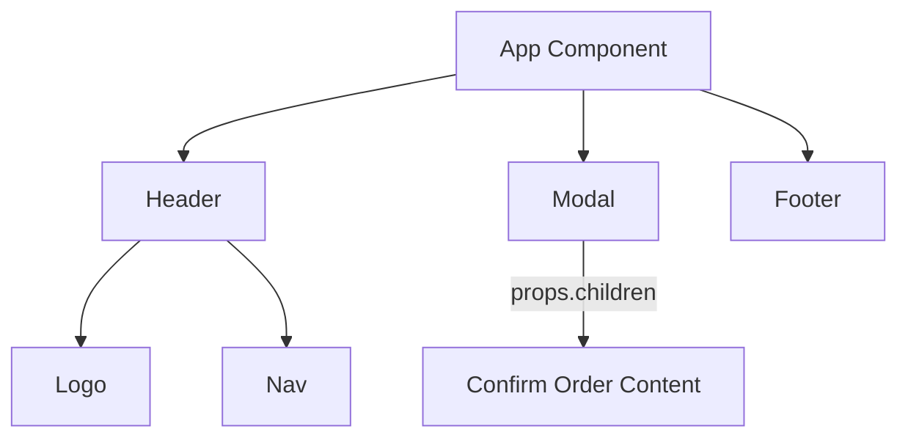

#### Interview Question

**Q:** Functional components hooks ke baad class components ko kyun replace kar diye, aur `props.children` ka real benefit kya hai?

**A:** Class components mein `this` binding ka mess tha, lifecycle methods scattered the (componentDidMount, componentDidUpdate, componentWillUnmount — same logic teen jagah split hoti thi), aur logic reuse karna painful tha (HOCs aur render props ka jungle). Functional components + hooks ne yeh sab fix kiya — `useEffect` mount/update/unmount ek jagah handle karta hai, custom hooks logic reuse trivial bana dete hain, aur `this` ka koi issue nahi.

`props.children` ka real benefit composition hai. Tu ek `Card` ya `Modal` ek baar likhta hai aur har consumer apna unique content daalta hai — parent ko child ki shape jaanne ki zaroorat nahi. Yeh inversion of control deta hai. Without children, tu props mein content explicitly pass karta — fragile aur verbose. Children ke saath UI tree natural HTML jaisa likha jaata hai, jo readable aur maintainable dono hai.

---

## 2. Props & state

### 2.1 Props, state, lifting state up, prop drilling problem

#### Definition

**Props** parent se child ko data dene ka readonly mechanism hai — function arguments samjho. Child props mutate nahi kar sakta, kyunki React ka data flow one-way hai (top-down). **State** component ke andar ka mutable data hai jo time ke saath change hota hai — user input, server response, toggles, etc. Jab state change hoti hai, React re-render trigger karta hai.

**Lifting state up** ka matlab hai jab do siblings ko same state share karni ho, tu state ko unke common parent mein move kar deta hai aur dono ko props ke through pass karta hai. **Prop drilling** tab hota hai jab tu ek prop ko 5-6 levels deep components ke through pass karta hai sirf isliye ki bottom wala component use kar sake — middle wale components ko us prop ki zaroorat hi nahi, woh sirf relay station bante hain.

Analogy: props ek courier package hai (sealed, mat khol), state ek diary hai (sirf owner likh sakta hai), lifting state up matlab dono bhaiyon ko ek hi diary se padhna padega toh maa rakhegi, aur prop drilling matlab Mumbai se Delhi ka parcel Pune-Nashik-Jaipur har city mein roak ke bhejna.

#### Why?

Props isliye readonly hain taaki data flow predictable rahe — debugging ek direction mein hoti hai. State component ke local concerns ke liye perfect hai. Lifting up tab zaroori hota hai jab state shared ho — duplication se bachna hai. Prop drilling problem isliye solve karna padta hai kyunki deeply nested apps mein components tightly coupled ho jaate hain — koi intermediate component refactor karo toh chain tootta hai. Solution: Context API, ya state management library (Zustand, Redux).

#### How?

State `useState` se manage hoti hai. Props bas function parameter hain. Lifting up matlab `useState` ko parent mein le jaao. Prop drilling fix karne ke liye `createContext` + `useContext` use karte hain (next section mein detail).

```jsx
// Props flow + lifting state up example
function TemperatureConverter() {
  const [celsius, setCelsius] = useState(0); // state parent mein

  return (
    <>
      <CelsiusInput value={celsius} onChange={setCelsius} />
      <FahrenheitDisplay celsius={celsius} />
    </>
  );
}

function CelsiusInput({ value, onChange }) {
  // child sirf props padhta hai, parent ko notify karta hai callback se
  return <input type="number" value={value} onChange={(e) => onChange(+e.target.value)} />;
}

function FahrenheitDisplay({ celsius }) {
  return <p>{(celsius * 9) / 5 + 32}°F</p>;
}
```

#### Real-life Example

E-commerce app mein cart count navbar mein dikhana hai, but cart state product page mein update hoti hai. Naive solution: prop drill through 6 components. Better solution: lift state to App level, ya Context use karo.

```jsx
// Naive prop drilling — anti-pattern
function App() {
  const [cartCount, setCartCount] = useState(0);
  return <Layout cartCount={cartCount} setCartCount={setCartCount} />;
}
function Layout({ cartCount, setCartCount }) {
  // Layout ko cartCount ki zaroorat nahi, sirf pass kar raha hai
  return (
    <>
      <Navbar cartCount={cartCount} />
      <Main setCartCount={setCartCount} />
    </>
  );
}
function Main({ setCartCount }) {
  return <ProductPage setCartCount={setCartCount} />;
}
function ProductPage({ setCartCount }) {
  return <button onClick={() => setCartCount((c) => c + 1)}>Add to Cart</button>;
}
// Layout aur Main bekaar mein props relay kar rahe — yeh prop drilling hai
```

#### Diagram

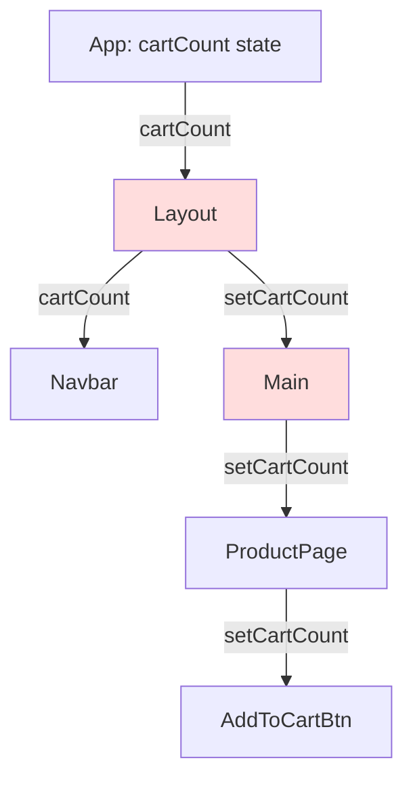

#### Interview Question

**Q:** Prop drilling kab actually problem hai, aur tu kab use karna avoid karega Context ko?

**A:** Prop drilling 2-3 levels tak theek hai — over-engineering mat kar. Problem tab start hoti hai jab same prop 4+ levels travel karta hai aur intermediate components uska use bhi nahi karte. Yeh refactoring ko hard banata hai aur components ka contract pollute karta hai. Common signs: tujhe ek prop add karne ke liye 5 files edit karni padti hain.

Context use karne se main tab bachata hun jab data frequently change hota hai aur consumers bahut hain — Context har consumer ko re-render karta hai jab value change ho, jo expensive ho sakta hai. Yeh stuff (form state, list items) ke liye main local state ya state library (Zustand) prefer karta hun. Context theme, auth user, locale — yani rarely-changing global stuff ke liye perfect hai. Production mein hum aksar Context + reducer ya Zustand combine karte hain — best of both.

---

## 3. Hooks

### 3.1 useState

#### Definition

`useState` functional component ko local state dene wala hook hai. Tu initial value deta hai, woh tujhe ek tuple deta hai: `[currentValue, setterFunction]`. Setter call karne se React re-render schedule karta hai. State updates **asynchronous** aur **batched** hote hain — matlab `setX(1); setX(2);` lagatar call kiye toh dono batch ho jaate hain, ek hi render hota hai.

Analogy: state ek whiteboard hai. `setState` matlab marker se naya value likhna — purana mit jaata hai, aur jo log whiteboard dekh rahe hain (UI) unhe naya version dikhta hai.

#### Why?

Pure functions deterministic hote hain, but UI ko memory chahiye — kya user ne button click kiya, kya modal open hai, kya input mein kya type hua. `useState` yeh memory deta hai bina class ki ceremony ke. React component re-render hone par bhi state preserve karta hai (component instance ke liye).

#### How?

State ka identity matter karta hai — `setState({...obj, x: 1})` (new object) trigger karega re-render, but `obj.x = 1; setState(obj)` (mutate) nahi karega kyunki reference same hai. **Functional updater** (`setX(prev => prev + 1)`) tab use kar jab naya value purane par depend karta ho — stale closure se bachta hai.

```jsx
function Counter() {
  const [count, setCount] = useState(0); // initial = 0
  const [user, setUser] = useState({ name: "Ratnesh", age: 25 });

  // GALAT — stale value use ho sakta hai
  const wrongIncrement = () => {
    setCount(count + 1);
    setCount(count + 1); // dono baar same count, final = 1 not 2
  };

  // SAHI — functional updater
  const rightIncrement = () => {
    setCount((c) => c + 1);
    setCount((c) => c + 1); // final = 2
  };

  // Object update — spread zaroori, mutate mat kar
  const birthday = () => setUser((u) => ({ ...u, age: u.age + 1 }));

  return <button onClick={rightIncrement}>{count}</button>;
}
```

#### Real-life Example

Login form — email, password, loading, error — char states.

```jsx
function LoginForm() {
  const [form, setForm] = useState({ email: "", password: "" });
  const [loading, setLoading] = useState(false);
  const [error, setError] = useState(null);

  const handleSubmit = async (e) => {
    e.preventDefault();
    setLoading(true);
    setError(null);
    try {
      await api.login(form);
    } catch (err) {
      setError(err.message);
    } finally {
      setLoading(false);
    }
  };

  return (
    <form onSubmit={handleSubmit}>
      <input
        value={form.email}
        onChange={(e) => setForm((f) => ({ ...f, email: e.target.value }))}
      />
      {/* password field similar */}
      {error && <p className="err">{error}</p>}
      <button disabled={loading}>{loading ? "Logging in..." : "Login"}</button>
    </form>
  );
}
```

#### Diagram

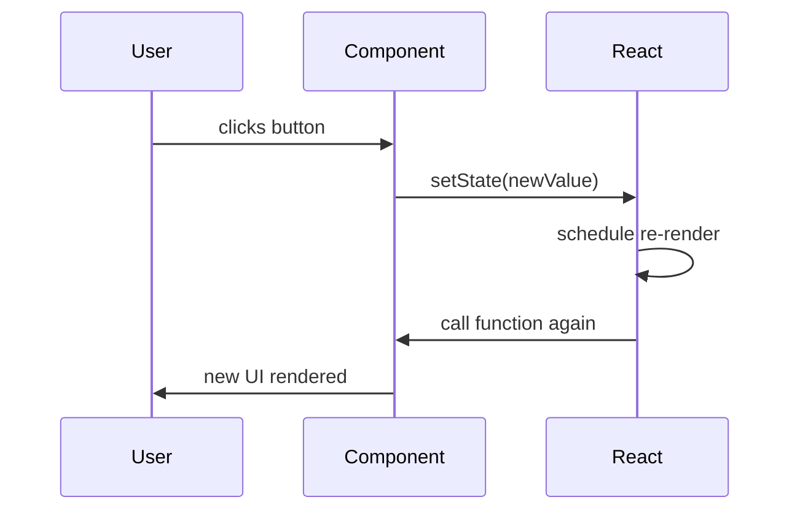

#### Interview Question

**Q:** `setState(count + 1)` aur `setState(prev => prev + 1)` mein difference kya hai, aur kab kaunsa use karein?

**A:** Direct value (`setState(count + 1)`) tab kaam karta hai jab tu sure hai ki `count` current value hai. But agar tu multiple updates ek event handler mein kar raha hai ya async code (timeout, promise) ke andar setter call kar raha hai, toh `count` stale ho sakta hai — uss closure ka snapshot purana hoga. Result: updates lose ho sakte hain.

Functional updater (`setState(prev => prev + 1)`) React ko bolta hai "jo bhi latest value hai, uspe yeh function apply karna." React internally queue mein store karta hai aur sequentially apply karta hai. Rule of thumb: agar new state purane state pe depend karta hai, hamesha functional updater use kar. Independent set (jaise `setName("Ravi")`) mein direct value theek hai.

---

### 3.2 useEffect — deps array, cleanup, common pitfalls

#### Definition

`useEffect` side effects run karne ka hook hai — data fetching, subscriptions, manual DOM manipulation, timers, logging — yani jo cheezein render ke output ka part nahi hain. Effect render ke baad run hota hai (committed DOM ke saath). Dependency array (`[deps]`) decide karta hai effect kab re-run ho. Cleanup function (effect ka return) old effect ko clean karta hai before new one runs, aur unmount par bhi.

Analogy: render hai painting karna, useEffect hai painting ke baad gallery mein hang karna ya frame lagana — sab finishing touches.

#### Why?

Components pure rehne chahiye — render mein side effects (fetch, subscribe) anti-pattern hain kyunki render multiple times call ho sakta hai. useEffect side effects ko ek defined lifecycle moment pe move karta hai. Cleanup memory leaks rokta hai (subscriptions, timers, event listeners).

#### How?

Three forms: `useEffect(fn)` (har render), `useEffect(fn, [])` (sirf mount), `useEffect(fn, [a, b])` (jab `a` ya `b` change ho). Cleanup function return kar jo subscription cancel kare.

```jsx
function UserProfile({ userId }) {
  const [user, setUser] = useState(null);

  useEffect(() => {
    let cancelled = false; // race condition guard
    fetch(`/api/users/${userId}`)
      .then((r) => r.json())
      .then((data) => {
        if (!cancelled) setUser(data); // unmount ke baad setState mat kar
      });

    return () => {
      cancelled = true; // cleanup
    };
  }, [userId]); // userId change toh refetch

  // Common pitfall #1 — missing dep
  // useEffect(() => { console.log(userId); }, []); // ESLint warning, stale closure

  // Common pitfall #2 — object dep, infinite loop
  // const config = { id: userId }; // naya object har render
  // useEffect(() => {...}, [config]); // har baar trigger, infinite

  return user ? <h1>{user.name}</h1> : <p>Loading...</p>;
}
```

#### Real-life Example

Window resize listener — subscribe on mount, unsubscribe on unmount.

```jsx
function useWindowSize() {
  const [size, setSize] = useState({ w: window.innerWidth, h: window.innerHeight });

  useEffect(() => {
    const handler = () => setSize({ w: window.innerWidth, h: window.innerHeight });
    window.addEventListener("resize", handler);
    return () => window.removeEventListener("resize", handler); // memory leak prevention
  }, []); // empty deps — sirf mount/unmount

  return size;
}

// Usage
function Dashboard() {
  const { w } = useWindowSize();
  return <p>{w < 768 ? "Mobile layout" : "Desktop layout"}</p>;
}
```

#### Diagram

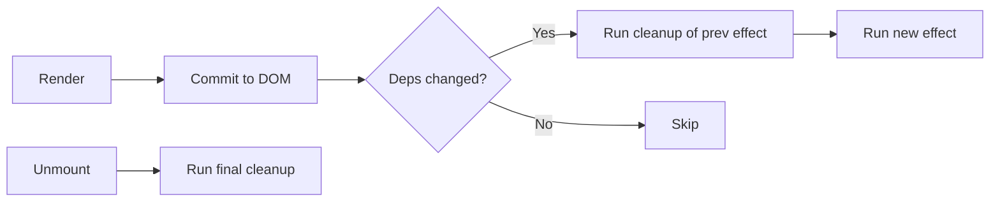

#### Interview Question

**Q:** useEffect ke top 3 pitfalls kya hain production mein?

**A:** Pehla — **missing dependencies**. ESLint warning ignore karke `[]` daal dena common hai, but isse stale closure milta hai — effect purane props/state ke saath chalta hai. Solution: ESLint rule on rakh, ya `useRef` use kar latest value ke liye, ya effect ko refactor kar.

Doosra — **race conditions in fetch**. User fast click karta hai, multiple requests jaate hain, response order non-deterministic hota hai. Wrong response display ho sakta hai. Solution: cleanup mein `cancelled` flag, ya `AbortController` use kar.

Teesra — **infinite loops with object/array deps**. Agar tu `[someObject]` daalta hai aur woh object har render naya banta hai (inline literal), effect har baar fire karega. Solution: `useMemo` se memoize kar, ya primitive values destructure karke deps mein daal. Bonus pitfall: setState inside useEffect bina condition ke — same loop. Always check pehle: kya update zaroori hai?

---

### 3.3 useContext

#### Definition

`useContext` React Context ko consume karne ka hook hai. Context global-ish data ko component tree mein propagate karta hai bina props drill kiye. Tu `createContext(defaultValue)` se context banata hai, `<Context.Provider value={...}>` se subtree ko value provide karta hai, aur `useContext(Context)` se kahin bhi consume karta hai.

Analogy: Context ek WiFi router hai — Provider router hai jo signal broadcast karta hai, useContext laptop hai jo connect karke data leta hai. Beech ke walls (intermediate components) signal pass karne ki tension nahi.

#### Why?

Prop drilling fix karta hai. Theme, auth user, locale, feature flags — yeh sab globally needed hote hain. Context bina library ke yeh solve karta hai. But warning: Context har consumer re-render karta hai jab value change hoti hai — frequently changing data ke liye perform karne wala kaam library (Zustand, Jotai) better hai.

#### How?

Three steps: create, provide, consume.

```jsx
// 1. Create
const ThemeContext = createContext("light"); // default value

// 2. Provide — usually App ke top mein
function App() {
  const [theme, setTheme] = useState("dark");
  return (
    <ThemeContext.Provider value={{ theme, setTheme }}>
      <Layout />
    </ThemeContext.Provider>
  );
}

// 3. Consume — kahin bhi deep
function ThemedButton() {
  const { theme, setTheme } = useContext(ThemeContext);
  return (
    <button
      className={theme}
      onClick={() => setTheme(theme === "light" ? "dark" : "light")}
    >
      Toggle ({theme})
    </button>
  );
}
```

#### Real-life Example

Auth context — logged-in user app-wide accessible.

```jsx
const AuthContext = createContext(null);

export function AuthProvider({ children }) {
  const [user, setUser] = useState(null);
  const [loading, setLoading] = useState(true);

  useEffect(() => {
    api.getCurrentUser()
      .then(setUser)
      .finally(() => setLoading(false));
  }, []);

  const login = async (creds) => setUser(await api.login(creds));
  const logout = async () => { await api.logout(); setUser(null); };

  return (
    <AuthContext.Provider value={{ user, login, logout, loading }}>
      {children}
    </AuthContext.Provider>
  );
}

// Custom hook — cleaner consumer API
export function useAuth() {
  const ctx = useContext(AuthContext);
  if (!ctx) throw new Error("useAuth must be used inside AuthProvider");
  return ctx;
}

// Usage
function Navbar() {
  const { user, logout } = useAuth();
  return user ? <button onClick={logout}>Logout {user.name}</button> : <LoginLink />;
}
```

#### Diagram

```mermaid
graph TD
  A[AuthProvider value={user, login}] --> B[Layout]
  B --> C[Navbar]
  B --> D[Main]
  D --> E[Sidebar]
  E --> F[ProfileWidget]
  C -.useContext.-> A
  F -.useContext.-> A
```

#### Interview Question

**Q:** Context ka biggest performance issue kya hai aur tu kaise solve karega?

**A:** Sabse bada issue yeh hai ki jab Provider ka `value` change hota hai, **saare consumers re-render hote hain** — chahe woh value ke jis specific field pe depend karte hain woh change hua ho ya nahi. Common mistake: `<Provider value={{ user, theme, locale }}>` jaise inline object daal dena — har render naya object, har consumer re-render.

Solutions: pehla, `value` ko `useMemo` se memoize kar taaki reference stable rahe. Doosra, agar context mein bahut alag-alag concerns hain (auth + theme + cart), toh **split contexts** — har concern ka apna provider, consumer sirf relevant ko subscribe kare. Teesra, agar fine-grained updates chahiye toh Zustand ya Jotai use kar — yeh selectors support karte hain (sirf jis slice pe depend karte ho usi pe re-render). Production mein hum context ko slow-changing data (auth, theme) ke liye rakhte hain aur frequently-changing data (form state, cart items) ke liye dedicated state library use karte hain.

---

### 3.4 useRef

#### Definition

`useRef` ek mutable container deta hai jo renders ke beech persist karta hai but **uska change re-render trigger nahi karta**. `ref.current` mein kuch bhi store kar — DOM node, timer ID, previous value, mutable counter. Two main uses: (1) DOM access, (2) instance variables jo state nahi banni chahiye.

Analogy: useRef ek locker hai. Tu chizein rakhta nikalta hai, but locker khulne par building mein announcement nahi hoti (no re-render). State announcement system hai, ref private storage.

#### Why?

State har change pe re-render karta hai — kabhi-kabhi yeh chahiye nahi. Example: timer ID store karna jo cleanup mein clear ho — UI ko isse koi matlab nahi. Ya DOM node pakadna focus karne ke liye. Ref in cases mein perfect hai. Plus, state immutable update karna padta hai (spread, etc.), ref direct mutation allow karta hai (`ref.current = newVal`).

#### How?

DOM ke liye `<input ref={inputRef} />` JSX attribute. Mutable value ke liye bas `ref.current` access kar.

```jsx
function SearchBar() {
  const inputRef = useRef(null);
  const renderCount = useRef(0); // re-render counter (debug)

  renderCount.current += 1; // mutate freely, no re-render

  useEffect(() => {
    inputRef.current.focus(); // DOM access — autofocus on mount
  }, []);

  return (
    <>
      <input ref={inputRef} placeholder="Search..." />
      <small>Renders: {renderCount.current}</small>
    </>
  );
}
```

#### Real-life Example

Debounced search — typing pe API call rok ke 500ms baad bhejna. Timer ID ref mein store, taaki har keystroke pe purana cancel kar saken.

```jsx
function DebouncedSearch({ onSearch }) {
  const [query, setQuery] = useState("");
  const timerRef = useRef(null);

  const handleChange = (e) => {
    const value = e.target.value;
    setQuery(value);

    // purana timer cancel
    if (timerRef.current) clearTimeout(timerRef.current);

    // naya timer set
    timerRef.current = setTimeout(() => {
      onSearch(value);
    }, 500);
  };

  // unmount pe cleanup
  useEffect(() => () => clearTimeout(timerRef.current), []);

  return <input value={query} onChange={handleChange} placeholder="Type to search..." />;
}
```

#### Diagram

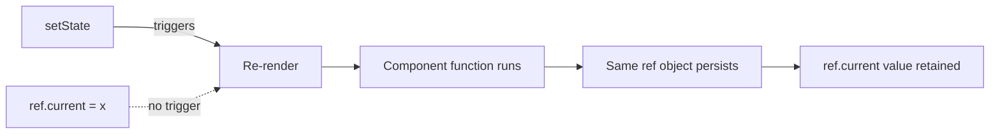

#### Interview Question

**Q:** useState aur useRef mein conceptual difference kya hai? Ek scenario bata jahan tujhe ref chahiye state nahi.

**A:** Dono values store karte hain renders ke beech, but key difference: state immutable hai aur change re-render trigger karta hai; ref mutable hai aur change silently happens. State UI mein jhalakta hai, ref UI ke peeche kaam karta hai. Agar value JSX mein render ho rahi hai ya effect dependency hai, woh state honi chahiye. Agar value sirf event handlers ya effects mein read/write hoti hai aur UI ko isse koi farq nahi padta, ref better hai.

Concrete scenario: video player banaya hai, tujhe `<video>` element pe `play()` method call karna hai button click pe. DOM node pakadna padega — ref se. State use karna meaningless hai kyunki node ek hi rahega, change nahi hoga, aur tu use render mein nahi dikhayega. Doosra example: previous value track karna (`usePrevious` pattern) — har render mein ref update karte rehte hain, but state jaisa re-render trigger nahi hota, jo infinite loop bana deta.

---

### 3.5 useMemo

#### Definition

`useMemo` ek **expensive computation ka result cache** karta hai. Tu function aur deps array deta hai — jab tak deps same hain, React cached result return karta hai bina function dobara chalaye. Deps badle, function fir se chalta hai aur naya result cache hota hai.

Analogy: tu maths problem solve karta hai aur answer notebook mein likh leta hai. Agle din wahi problem aaye toh notebook se answer padh leta hai, dobara solve nahi karta. Problem badle (deps changed) toh fresh solve.

#### Why?

Performance optimization. Agar tu render mein heavy computation kar raha hai (sorting 10k items, complex calculation, derived data), har render woh dobara chalta hai. useMemo isse skip karta hai. Doosra use case: **referential stability** — object/array memoize karke same reference rakhna, taaki child `React.memo` components ya `useEffect` deps unnecessarily trigger na ho.

But warning: useMemo bhi cost hai (deps comparison, cache management). Cheap computations memoize karna **dheere** bhi kar sakta hai. Premature optimization mat kar — measure pehle, then memoize.

#### How?

```jsx
function ProductList({ products, filter }) {
  // expensive — har render pe filter+sort
  const visibleProducts = useMemo(() => {
    console.log("Computing..."); // sirf jab products ya filter change ho
    return products
      .filter((p) => p.name.toLowerCase().includes(filter.toLowerCase()))
      .sort((a, b) => a.price - b.price);
  }, [products, filter]); // deps

  return (
    <ul>
      {visibleProducts.map((p) => (
        <li key={p.id}>{p.name} — Rs {p.price}</li>
      ))}
    </ul>
  );
}
```

#### Real-life Example

Dashboard mein 5000 transactions ka summary calculate karna — total, average, by category. Bina memoize, har keystroke (search bar mein) pe re-calculate hota — 50ms ka jank.

```jsx
function FinanceDashboard({ transactions, searchTerm }) {
  // search se transactions filter
  const filtered = useMemo(
    () => transactions.filter((t) => t.description.includes(searchTerm)),
    [transactions, searchTerm]
  );

  // heavy aggregation
  const summary = useMemo(() => {
    const total = filtered.reduce((s, t) => s + t.amount, 0);
    const byCategory = filtered.reduce((acc, t) => {
      acc[t.category] = (acc[t.category] || 0) + t.amount;
      return acc;
    }, {});
    return { total, count: filtered.length, byCategory };
  }, [filtered]);

  return (
    <div>
      <h2>Total: Rs {summary.total}</h2>
      <p>Transactions: {summary.count}</p>
      {/* category breakdown */}
    </div>
  );
}
```

#### Diagram

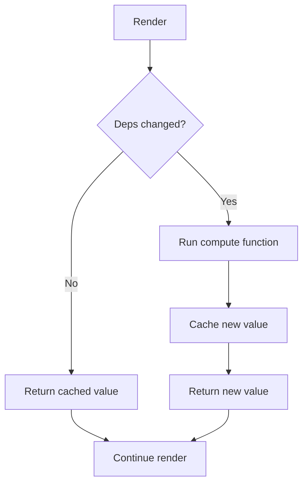

#### Interview Question

**Q:** useMemo har computation pe lagana chahiye? Kab actually use karna hai?

**A:** Bilkul nahi. useMemo khud overhead deta hai — deps compare karna, cache maintain karna. Cheap operations (`a + b`, simple map of 10 items) memoize karne se code dheere ho sakta hai aur readability bhi maari jaati hai. React explicitly bolta hai: default mein mat lagao.

Use kar tab jab: (1) computation actually heavy hai (measure with Profiler — 1ms+ ka kaam), jaise large list filter/sort, complex math, parsing. (2) Result ko `React.memo` child ke prop ke roop mein pass kar raha hai aur referential equality break ho rahi hai (nayi array har render). (3) Result kisi `useEffect` ke deps mein hai aur tu unnecessary re-runs rokna chahta hai. Production rule: pehle profile kar, slow component identify kar, phir targeted memoization lagao. Blanket memoization premature optimization hai.

---

### 3.6 useCallback (when actually needed)

#### Definition

`useCallback` `useMemo` ka special case hai — function memoize karta hai. `useCallback(fn, deps)` basically `useMemo(() => fn, deps)` ke barabar hai. Jab tak deps same, same function reference return hota hai. Iska point yeh hai ki JavaScript mein har render naye function literals ban-te hain (`() => {}`) — naye references — jo `React.memo` children ya `useEffect` deps ko break karte hain.

Analogy: tu har subah naya pen kharidne ke bajaye purane pen ko reuse karta hai. Pen ka function same hai, identity bhi same hai — koi confusion nahi.

#### Why?

Sirf tab useful hai jab function reference matter karta hai. Common cases: (1) Function ko memoized child ko prop bhej rahe ho (`React.memo` wrapper). Bina useCallback, parent re-render = naya function = memo bypass = child re-render. (2) Function `useEffect` deps mein hai. Bina useCallback, har render effect re-runs. (3) Custom hook return karta hai jo consumers deps mein use karenge.

Warning: agar koi child memoized nahi hai aur function effect deps mein nahi, useCallback **bekaar overhead** hai. Naya function banane ki cost negligible hai, useCallback ki cost (deps compare, closure track) usse zyada ho sakti hai.

#### How?

```jsx
const Button = React.memo(({ onClick, children }) => {
  console.log("Button render", children);
  return <button onClick={onClick}>{children}</button>;
});

function Parent() {
  const [count, setCount] = useState(0);
  const [other, setOther] = useState(0);

  // bina useCallback — har render naya function, Button re-render
  // const handleClick = () => setCount((c) => c + 1);

  // useCallback — same reference jab tak deps same
  const handleClick = useCallback(() => setCount((c) => c + 1), []);

  return (
    <>
      <Button onClick={handleClick}>Increment</Button>
      <button onClick={() => setOther((o) => o + 1)}>Other: {other}</button>
      <p>Count: {count}</p>
    </>
  );
}
```

#### Real-life Example

Data table component jo har row ke liye delete handler leta hai. Rows memoized hain (10000 items). Bina useCallback, parent re-render = sare 10000 rows re-render = jank.

```jsx
const TableRow = React.memo(({ item, onDelete }) => {
  return (
    <tr>
      <td>{item.name}</td>
      <td>{item.email}</td>
      <td><button onClick={() => onDelete(item.id)}>Delete</button></td>
    </tr>
  );
});

function UserTable({ users, setUsers }) {
  // useCallback — stable reference, TableRow memo work karega
  const handleDelete = useCallback((id) => {
    setUsers((us) => us.filter((u) => u.id !== id));
  }, [setUsers]);

  return (
    <table>
      <tbody>
        {users.map((u) => (
          <TableRow key={u.id} item={u} onDelete={handleDelete} />
        ))}
      </tbody>
    </table>
  );
}
```

#### Diagram

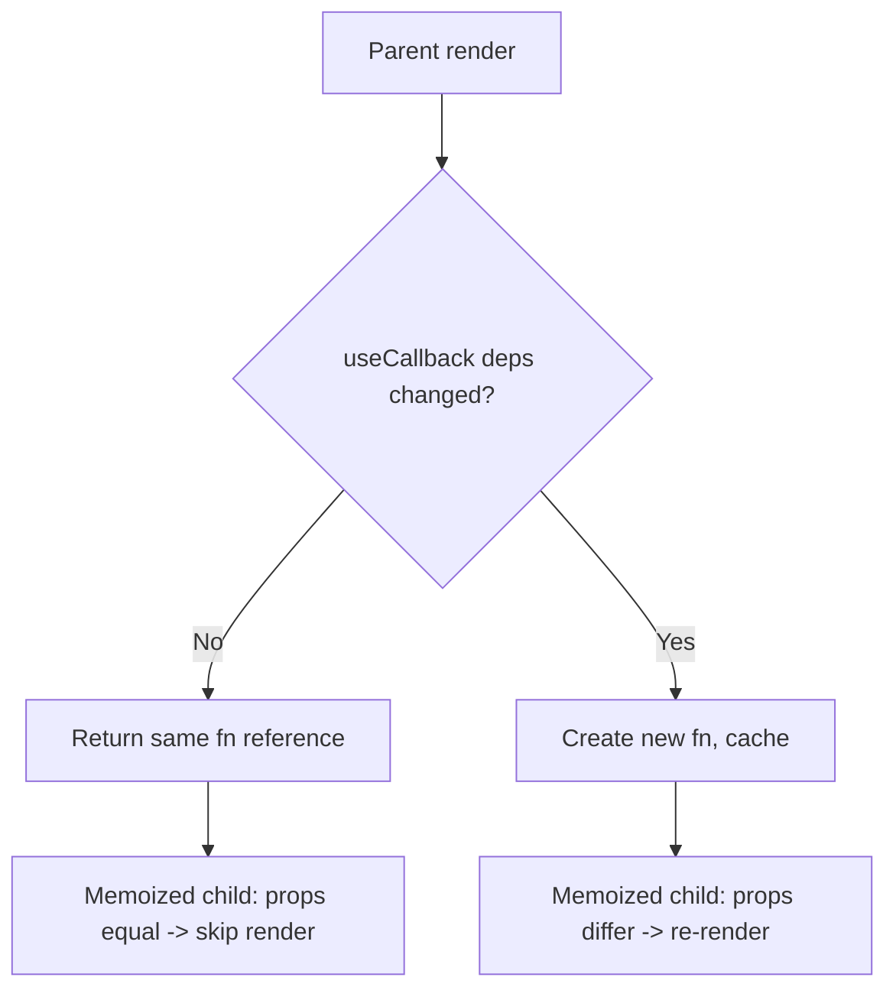

#### Interview Question

**Q:** useCallback aur useMemo mein actual difference kya hai? useCallback overuse ka kya nuksan?

**A:** Mechanically `useCallback(fn, deps)` aur `useMemo(() => fn, deps)` identical hain. useCallback bas syntactic sugar hai functions ke liye. Difference sirf API ka hai — useMemo factory leta hai jo value return kare, useCallback seedha function leta hai aur usi ko cache karta hai.

Overuse ka nuksan teen layer ka hai. Pehla — **performance regression**. useCallback har render pe deps array compare karta hai aur function reference manage karta hai. Naya function literal banana JS engine ke liye nearly free hai (modern V8 optimized hai). Toh tu micro-cost (function creation) ko macro-cost (hook overhead + memory pressure) se replace kar raha hai. Doosra — **code noise**. Har inline function ko useCallback mein wrap karne se readability gir jaati hai. Teesra — **false sense of optimization**. Log soch te hain "useCallback laga diya, fast ho gaya" — but agar child memoized nahi hai, fayda zero hai. Production rule: useCallback tab use kar jab tu measurably prove kar sake ki function ka reference matter karta hai (memoized child, effect dep, custom hook contract). Otherwise inline function bilkul fine hai.

---

End of Part 1. Part 2 mein hum custom hooks, performance patterns (React.memo, virtualization), aur React 19 ke naye features cover karenge.
# React (Complete) — Part 2: Routing, State Management, Advanced

Bhai, Part 1 mein humne basics aur hooks dekh liye. Ab asli production-level cheezein aati hain — routing kaise handle karte hain SPA mein, state ko scale kaise karte hain jab prop drilling se sar phatne lagta hai, aur advanced patterns jaise code splitting, error boundaries, aur performance optimization. Yeh wo cheezein hain jo junior developer ko mid-level se distinguish karti hain.

Is part mein hum react-router-dom v6+ ke saath client-side routing dekhenge, Context API aur Redux Toolkit ke through state management samjhenge, aur phir advanced topics jaise custom hooks composition, error boundaries, React.lazy + Suspense, aur memoization ki actual real-world utility par baat karenge. Code production-grade hoga, comments Hinglish mein, taaki tujhe lage ki senior bhaiya samjha raha hai, na ki documentation chip-chip karke padh raha hai.

---

## 4. Routing

### 4.1 Client routing, dynamic routes, nested routes (react-router-dom v6+)

#### Definition

Client-side routing matlab page reload kiye bina URL change karna aur uske hisaab se UI swap karna. Traditional server routing mein har link click pe full HTML server se aata tha — slow, jhatkedaar. SPA mein router URL ko intercept karta hai, history API se manipulate karta hai, aur React component swap kar deta hai. User ko lagta hai page badla, par actually sirf component re-render hua.

Analogy: Soch tu ek mall mein hai. Server-side routing matlab har dukaan ke liye mall se bahar ja ke wapas naye gate se enter karna. Client-side routing matlab tu mall ke andar hi escalator se floor change karta hai — same building, alag view, zero rebuild.

#### Why?

Performance, smoothness, aur stateful navigation ke liye. Jab tu Gmail use karta hai, inbox se sent items pe jaata hai — pura page reload hota toh experience garbage ho jaata. Client routing se transitions instant lagti hain, scroll position preserve hoti hai, aur tu nested layouts (sidebar persistent, content swap) easily bana sakta hai.

#### How?

react-router-dom v6+ mein `BrowserRouter`, `Routes`, `Route`, `Link`, `useNavigate`, `useParams`, aur `Outlet` core primitives hain. v5 wala `Switch` ab `Routes` ho gaya hai, aur `component` prop ki jagah `element` aata hai. Nested routes ke liye `Outlet` use hota hai — parent route render karta hai apna shell, aur child routes Outlet ke andar slot ho jaate hain.

```tsx
// app/router.tsx — basic setup with dynamic + nested routes
import { BrowserRouter, Routes, Route, Link, Outlet, useParams } from "react-router-dom";

function DashboardLayout() {
  // yeh parent route hai — sidebar yahin rahega, content Outlet mein aayega
  return (
    <div className="flex">
      <aside>
        <Link to="/dashboard">Home</Link>
        <Link to="/dashboard/users">Users</Link>
      </aside>
      <main>
        <Outlet /> {/* child route yahan render hoga */}
      </main>
    </div>
  );
}

function UserDetail() {
  const { userId } = useParams(); // dynamic segment :userId yahan se milega
  return <h1>User ID: {userId}</h1>;
}

export default function AppRouter() {
  return (
    <BrowserRouter>
      <Routes>
        <Route path="/" element={<Home />} />
        <Route path="/dashboard" element={<DashboardLayout />}>
          {/* nested routes — index matlab default child */}
          <Route index element={<DashboardHome />} />
          <Route path="users" element={<UsersList />} />
          <Route path="users/:userId" element={<UserDetail />} />
        </Route>
        <Route path="*" element={<NotFound />} /> {/* 404 catch-all */}
      </Routes>
    </BrowserRouter>
  );
}
```

#### Real-life Example

Maan le tu ek e-commerce dashboard bana raha hai. Admin ko orders list, individual order detail, aur uske andar items dikhane hain. Sidebar har jagah persistent rahega.

```tsx
// admin orders module
import { Routes, Route, Outlet, useParams, useNavigate } from "react-router-dom";

function OrdersLayout() {
  return (
    <div>
      <header>Orders Management</header>
      <Outlet />
    </div>
  );
}

function OrderDetail() {
  const { orderId } = useParams();
  const navigate = useNavigate();

  // imagine API call: GET /orders/:orderId
  // agar order na mile toh list pe wapas bhej do
  if (!orderId) navigate("/admin/orders");

  return (
    <section>
      <h2>Order #{orderId}</h2>
      {/* nested - items ke liye aur child route */}
      <Outlet />
    </section>
  );
}

<Routes>
  <Route path="/admin/orders" element={<OrdersLayout />}>
    <Route index element={<OrdersList />} />
    <Route path=":orderId" element={<OrderDetail />}>
      <Route path="items" element={<OrderItems />} />
      <Route path="invoice" element={<Invoice />} />
    </Route>
  </Route>
</Routes>
```

URL `/admin/orders/123/invoice` hit karte hi: OrdersLayout → OrderDetail → Invoice — teen levels deep, sab Outlets se chain hue.

#### Diagram

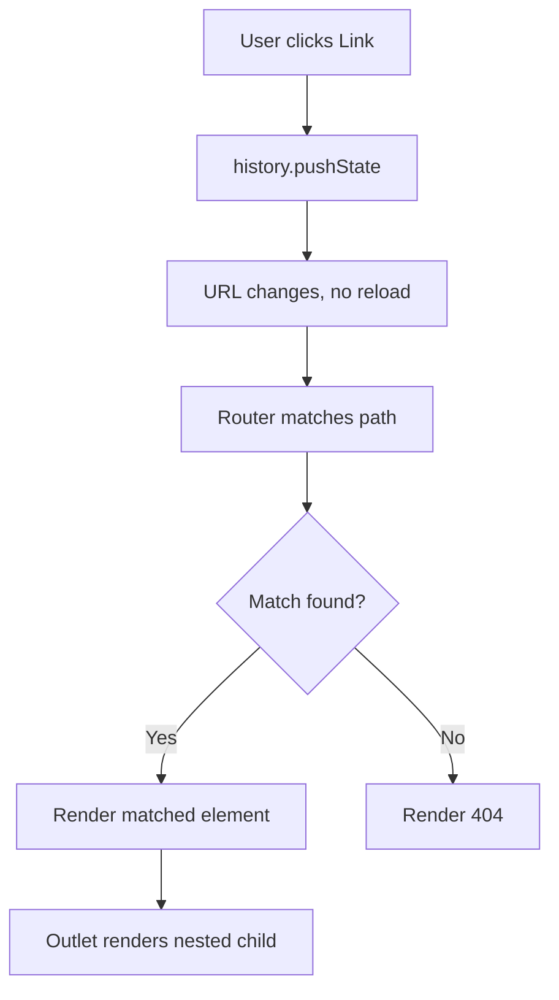

#### Interview Question

**Q:** v5 se v6 mein react-router ne kya breaking changes laaye, aur nested routing ka mental model kaise samjhaoge?

**A:** v6 mein sabse bada change `Switch` ka `Routes` ban jaana hai, aur `component`/`render` props ki jagah single `element` prop ka aana — JSX ki form mein. v6 ab automatically best match karta hai (no more `exact` prop needed), relative paths support karta hai, aur nesting first-class citizen ban gayi hai through `Outlet`.

Nested routing ka mental model yeh hai ki parent route ek "shell" provide karta hai — layout, sidebar, header — aur uske andar `<Outlet />` ek slot hota hai jahan matched child route render hoga. Toh tu apne URL hierarchy ko component hierarchy se directly map kar sakta hai. URL `/dashboard/users/42` matlab DashboardLayout > UsersLayout > UserDetail — teen components stack ho gaye, har ek apna chunk render karega Outlet mein.

Plus, v6 mein `useNavigate` hook ne `useHistory` ko replace kiya — programmatic navigation cleaner hai. `useParams` typed support deta hai TypeScript mein. Overall philosophy: declarative, JSX-first, and nesting-friendly.

---

## 5. State Management

### 5.1 Context API (when enough)

#### Definition

Context API React ka built-in mechanism hai globally accessible data ke liye — bina props drill kiye. Tu ek Provider banata hai jo value broadcast karta hai, aur kahin bhi component tree mein `useContext` se woh value pull kar sakta hai. Theme, current user, locale jaise data ke liye perfect hai.

Analogy: Context ek office ka WiFi hai. Tu Provider ko WiFi router samajh, jo "value" emit kar raha hai. Koi bhi consumer (laptop) jo same network mein hai, useContext call kar ke connect ho jaata hai. Ab har laptop ko alag-alag cable se connect karne ki zaroorat nahi.

#### Why?

Prop drilling se bachane ke liye. Jab tujhe 5 levels deep ek `currentUser` bhejna padta hai aur beech ke 4 components ko us prop se koi matlab nahi — irritating ho jaata hai. Context se tu directly leaf component mein consume kar leta hai. Lekin ek catch hai: Context har value change pe sab consumers ko re-render karta hai — toh high-frequency state ke liye Redux/Zustand better hote hain.

#### How?

`createContext`, `Provider`, `useContext` — bas teen cheezein.

```tsx
import { createContext, useContext, useState, ReactNode } from "react";

type Theme = "light" | "dark";
interface ThemeCtx {
  theme: Theme;
  toggle: () => void;
}

// default value (rarely used, mostly fallback)
const ThemeContext = createContext<ThemeCtx | null>(null);

export function ThemeProvider({ children }: { children: ReactNode }) {
  const [theme, setTheme] = useState<Theme>("light");
  const toggle = () => setTheme((t) => (t === "light" ? "dark" : "light"));
  // provider value ko memoize karna chahiye production mein
  return (
    <ThemeContext.Provider value={{ theme, toggle }}>
      {children}
    </ThemeContext.Provider>
  );
}

// custom hook — clean consumer pattern
export function useTheme() {
  const ctx = useContext(ThemeContext);
  if (!ctx) throw new Error("useTheme must be inside ThemeProvider");
  return ctx;
}
```

#### Real-life Example

Auth context — current logged-in user pure app mein available chahiye.

```tsx
const AuthContext = createContext<{ user: User | null; logout: () => void } | null>(null);

export function AuthProvider({ children }: { children: ReactNode }) {
  const [user, setUser] = useState<User | null>(null);

  // app load pe session check kar le
  useEffect(() => {
    fetch("/api/me").then((r) => r.json()).then(setUser);
  }, []);

  const logout = async () => {
    await fetch("/api/logout", { method: "POST" });
    setUser(null);
  };

  return <AuthContext.Provider value={{ user, logout }}>{children}</AuthContext.Provider>;
}

// kahin bhi:
function Navbar() {
  const { user, logout } = useAuth();
  return user ? <button onClick={logout}>Logout {user.name}</button> : <LoginLink />;
}
```

Yeh use case Context ke liye perfect hai — value rarely change hoti hai (login/logout pe), aur globally chahiye.

#### Diagram

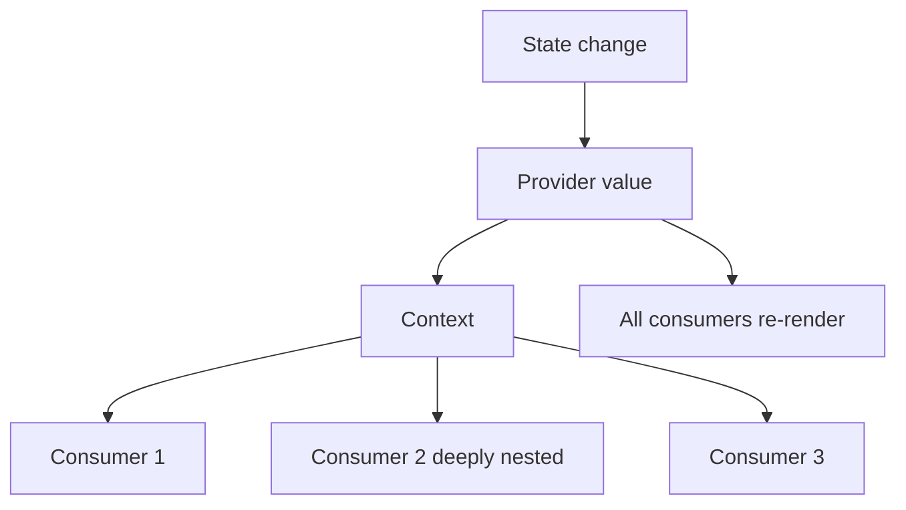

#### Interview Question

**Q:** Context API kab kaafi hai aur kab Redux/Zustand chahiye?

**A:** Context tab kaafi hai jab data low-frequency change hota hai aur globally read-only jaisa behave karta hai — theme, locale, current user, feature flags. In sab cases mein value rarely update hoti hai, toh re-render storm nahi banta.

Lekin jab tujhe high-frequency updates chahiye (like form state, real-time data, complex derived state), ya tujhe time-travel debugging chahiye, ya multiple slices independently update karne hain bina ek doosre ko trigger kiye — tab Redux/Zustand/Jotai better hain. Context ka koi selector mechanism nahi hai by default — Provider value badli toh sab consumers re-render. Redux mein `useSelector` se tu specific slice subscribe kar sakta hai, aur sirf wahi component re-render hoga jiska selected slice change hua.

Practical rule: agar tu Context ko value memoize karne ke liye `useMemo` mein wrap kar raha hai aur splitting providers kar raha hai performance ke liye — tu Redux/Zustand reinvent kar raha hai. Better adopt the real tool.

---

### 5.2 Redux — store, reducers, actions, middleware, RTK

#### Definition

Redux basically tumhare app ka centralized brain hai. Har action wahin se decide hota hai, har state change wahin pe trace hoti hai. Single source of truth — ek immutable store, jisme state tree rehta hai. State change karne ke liye tu action dispatch karta hai (plain object describing what happened), reducer (pure function) us action ko le ke nayi state return karta hai. Middleware beech mein sit karta hai — async ops, logging, side effects ke liye.

RTK (Redux Toolkit) modern Redux hai — boilerplate khatam, Immer integrated (mutable syntax likho, immutable result), aur `createSlice` se reducer + actions ek shot mein. RTK Query ke saath data fetching bhi handled.

Analogy: Redux ek bank hai. Store = vault. Actions = withdraw/deposit slips (intent). Reducers = bank teller (rules apply karta hai). Middleware = security checks, logging cameras. Tu directly vault mein haath nahi daal sakta — slip submit karo, teller process karega.

#### Why?

Predictability aur debuggability. Bade apps mein state ka flow track karna nightmare ho jaata hai. Redux DevTools se tu har action replay kar sakta hai, time-travel kar sakta hai, state snapshots dekh sakta hai. Plus, reducers pure hote hain — testing trivial.

Pure Context se Redux switch karne ki real reason: selector-based subscription (sirf relevant components re-render), middleware ecosystem (saga, thunk, listeners), aur structured async handling.

#### How?

RTK pattern (modern, recommended):

```tsx
// store/cartSlice.ts
import { createSlice, PayloadAction, createAsyncThunk } from "@reduxjs/toolkit";

interface CartItem { id: string; qty: number; price: number; }
interface CartState { items: CartItem[]; loading: boolean; }

const initialState: CartState = { items: [], loading: false };

// async thunk — middleware handle karega
export const checkout = createAsyncThunk("cart/checkout", async (_, { getState }) => {
  const state = getState() as { cart: CartState };
  const res = await fetch("/api/checkout", {
    method: "POST",
    body: JSON.stringify(state.cart.items),
  });
  return res.json();
});

const cartSlice = createSlice({
  name: "cart",
  initialState,
  reducers: {
    // Immer ke wajah se mutate karke likh sakte hain
    addItem(state, action: PayloadAction<CartItem>) {
      const existing = state.items.find((i) => i.id === action.payload.id);
      if (existing) existing.qty += action.payload.qty;
      else state.items.push(action.payload);
    },
    removeItem(state, action: PayloadAction<string>) {
      state.items = state.items.filter((i) => i.id !== action.payload);
    },
  },
  extraReducers: (builder) => {
    builder
      .addCase(checkout.pending, (s) => { s.loading = true; })
      .addCase(checkout.fulfilled, (s) => { s.loading = false; s.items = []; })
      .addCase(checkout.rejected, (s) => { s.loading = false; });
  },
});

export const { addItem, removeItem } = cartSlice.actions;
export default cartSlice.reducer;
```

```tsx
// store/index.ts
import { configureStore } from "@reduxjs/toolkit";
import cartReducer from "./cartSlice";

export const store = configureStore({
  reducer: { cart: cartReducer },
  // middleware default mein thunk + serializability check aata hai
});

export type RootState = ReturnType<typeof store.getState>;
export type AppDispatch = typeof store.dispatch;
```

```tsx
// component
import { useSelector, useDispatch } from "react-redux";
import { addItem, checkout } from "./store/cartSlice";

function CartButton() {
  const items = useSelector((s: RootState) => s.cart.items);
  const dispatch = useDispatch<AppDispatch>();

  return (
    <>
      <span>Items: {items.length}</span>
      <button onClick={() => dispatch(checkout())}>Checkout</button>
    </>
  );
}
```

#### Real-life Example

Real-world: e-commerce mein cart, user, products, ui (modals, toasts) — sab alag slices. Middleware se analytics events fire hote hain har action pe.

```tsx
// middleware/analytics.ts
import { Middleware } from "@reduxjs/toolkit";

export const analyticsMiddleware: Middleware = (store) => (next) => (action) => {
  // har action ko analytics ko bhej do
  if (typeof action === "object" && "type" in action) {
    window.analytics?.track(action.type, action.payload);
  }
  return next(action);
};

// store mein add karo
configureStore({
  reducer: { cart, user, ui },
  middleware: (gDM) => gDM().concat(analyticsMiddleware),
});
```

Production mein yeh bahut common hai — har user action automatic tracked, aur reducer logic clean rehta hai.

#### Diagram

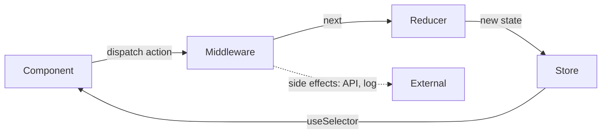

#### Interview Question

**Q:** RTK ne plain Redux ke kaunse pain points solve kiye, aur kab tu Redux skip karega?

**A:** Plain Redux mein boilerplate insane tha — actions constants alag, action creators alag, reducers alag, switch-case statements, manually immutable updates with spread operators. RTK ne `createSlice` diya jo teeno ek jagah karta hai, Immer integrate kiya so mutable-style writes kar sakte ho, `createAsyncThunk` se async handling built-in, aur `configureStore` automatically devtools + thunk middleware setup karta hai. RTK Query ke saath data fetching, caching, invalidation bhi covered.

Redux skip karne ka call tab hota hai jab app chhota ya medium hai aur global state minimal hai — auth, theme, maybe ek shopping cart. Tab Context + useReducer kaafi hota hai. Ya phir Zustand jaisi lightweight library — 1KB, no provider, hooks-first. Redux ka real value tab dikhta hai jab tu 50+ slices, complex middleware chains, time-travel debugging, ya server-state sync (RTK Query) deal kar raha ho. Otherwise overkill.

Modern recommendation: server state ke liye TanStack Query/RTK Query, client state ke liye Zustand ya Redux Toolkit (depending on team familiarity), aur small global config ke liye Context.

---

## 6. Advanced

### 6.1 Custom hooks (composition patterns)

#### Definition

Custom hook ek normal function hai jo `use` se start hota hai aur andar React hooks use karta hai. Iska kaam hai stateful logic ko reusable banana — taaki tu same logic alag-alag components mein bina copy-paste duplicate kiye use kar sake. Hooks compose hote hain — ek hook doosre hook ko call kar sakta hai, aur tu chhote primitives se badi abstractions bana sakta hai.

Analogy: Custom hooks LEGO blocks hain. `useFetch` ek block, `useDebounce` doosra, `useLocalStorage` teesra. Ab tu `useDebouncedSearch` bana sakta hai jo `useDebounce` + `useFetch` combine kare. Composition se tu pure ecosystem build karta hai.

#### Why?

DRY principle — same logic 5 components mein paste karna anti-pattern hai. Custom hook se tu encapsulate karta hai, test karna easy ho jaata hai, aur API surface clean rehta hai. Plus, hooks composable hain — tu domain-specific abstractions bana sakta hai (`useCart`, `useAuth`, `usePagination`).

#### How?

```tsx
// useDebounce.ts — basic primitive
import { useState, useEffect } from "react";

export function useDebounce<T>(value: T, delay = 300): T {
  const [debounced, setDebounced] = useState(value);
  useEffect(() => {
    const t = setTimeout(() => setDebounced(value), delay);
    return () => clearTimeout(t); // cleanup pe purana timeout cancel
  }, [value, delay]);
  return debounced;
}

// useFetch.ts
export function useFetch<T>(url: string) {
  const [data, setData] = useState<T | null>(null);
  const [loading, setLoading] = useState(true);
  const [error, setError] = useState<Error | null>(null);

  useEffect(() => {
    let cancelled = false;
    setLoading(true);
    fetch(url)
      .then((r) => r.json())
      .then((d) => { if (!cancelled) setData(d); })
      .catch((e) => { if (!cancelled) setError(e); })
      .finally(() => { if (!cancelled) setLoading(false); });
    return () => { cancelled = true; }; // race condition prevention
  }, [url]);

  return { data, loading, error };
}

// composition — chhote hooks ko combine karke bada hook
export function useDebouncedSearch(query: string) {
  const debouncedQuery = useDebounce(query, 400);
  return useFetch<SearchResult[]>(`/api/search?q=${debouncedQuery}`);
}
```

#### Real-life Example

Form validation hook — production form mein common.

```tsx
function useForm<T extends Record<string, any>>(initial: T, validate: (v: T) => Partial<Record<keyof T, string>>) {
  const [values, setValues] = useState(initial);
  const [errors, setErrors] = useState<Partial<Record<keyof T, string>>>({});
  const [touched, setTouched] = useState<Partial<Record<keyof T, boolean>>>({});

  const handleChange = (key: keyof T) => (e: React.ChangeEvent<HTMLInputElement>) => {
    setValues((v) => ({ ...v, [key]: e.target.value }));
  };

  const handleBlur = (key: keyof T) => () => {
    setTouched((t) => ({ ...t, [key]: true }));
    setErrors(validate(values));
  };

  const isValid = Object.keys(validate(values)).length === 0;
  return { values, errors, touched, handleChange, handleBlur, isValid };
}

// usage
function SignupForm() {
  const { values, errors, handleChange, handleBlur, isValid } = useForm(
    { email: "", password: "" },
    (v) => {
      const e: any = {};
      if (!v.email.includes("@")) e.email = "invalid email";
      if (v.password.length < 8) e.password = "min 8 chars";
      return e;
    }
  );
  // ...render
}
```

Ek hi hook se sab forms handle ho gaye.

#### Diagram

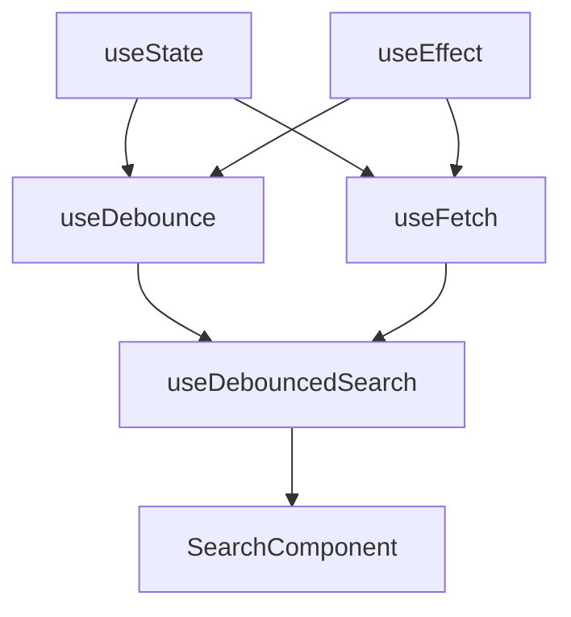

#### Interview Question

**Q:** Custom hooks aur HOCs/render props mein farak kya hai, aur kab kaunsa choose karoge?

**A:** Custom hooks function-based composition hain — tu logic share karta hai bina component tree mein extra wrappers add kiye. Clean, type-safe, aur multiple hooks ek component mein use kar sakte ho without nesting hell. Modern React mein yeh default approach hai.

HOCs (Higher-Order Components) component leke ehnance kiya hua component return karte hain. Pre-hooks era ka pattern. Problems: wrapper hell (nested HOCs), prop name collisions, ref forwarding issues, aur TypeScript mein typing painful. Render props similar — flexibility deti hai par JSX nesting badhati hai (callback hell jaisa).

Aaj ka rule: 95% cases mein custom hooks use karo. HOCs sirf tab when tu component tree mein structural change kar raha hai (like injecting providers, withAuth that redirects). Render props rarely needed, mostly for libraries jo controlled component patterns expose karte hain.

---

### 6.2 Error boundaries

#### Definition

Error boundary ek React component hai jo apne child tree mein occur hone wali rendering errors, lifecycle errors, aur constructor errors ko catch karta hai. Without error boundary, ek child mein error matlab pura React tree unmount — blank screen. Error boundary fallback UI dikhata hai, app baaki normal chalta rehta hai.

Analogy: Error boundary ek try-catch hai component tree ke liye. Ya phir socho ek apartment building mein fire suppression system — ek floor pe aag lagi toh poora building nahi jala, woh floor isolate ho gaya.

#### Why?

Production mein single component crash matlab user ko white screen of death. Error boundary se tu graceful degradation karta hai — broken widget ki jagah "Something went wrong, retry" button. Plus, error logging service (Sentry) mein report bhej sakte ho centrally.

Important: error boundaries class components se hi banti hain abhi tak (React 19 mein bhi). Function component mein hooks-based equivalent nahi — `react-error-boundary` library use kar saktein, jo wrapper provide karti hai.

#### How?

```tsx
import { Component, ReactNode, ErrorInfo } from "react";

interface Props { fallback: ReactNode; children: ReactNode; }
interface State { hasError: boolean; error: Error | null; }

export class ErrorBoundary extends Component<Props, State> {
  state: State = { hasError: false, error: null };

  // jab child render mein error aaye
  static getDerivedStateFromError(error: Error): State {
    return { hasError: true, error };
  }

  // side effect — logging karne ke liye
  componentDidCatch(error: Error, info: ErrorInfo) {
    console.error("Caught:", error, info.componentStack);
    // Sentry.captureException(error, { extra: info });
  }

  render() {
    if (this.state.hasError) return this.props.fallback;
    return this.props.children;
  }
}

// usage
<ErrorBoundary fallback={<p>Kuch toot gaya, refresh karo</p>}>
  <Dashboard />
</ErrorBoundary>
```

#### Real-life Example

Production app mein granular error boundaries — har major widget ko separate boundary se wrap karo, taaki ek widget crash poore page ko na le jaaye.

```tsx
function AppLayout() {
  return (
    <div>
      <ErrorBoundary fallback={<NavbarFallback />}>
        <Navbar />
      </ErrorBoundary>

      <main>
        <ErrorBoundary fallback={<WidgetError name="Sales Chart" />}>
          <SalesChart />
        </ErrorBoundary>

        <ErrorBoundary fallback={<WidgetError name="User List" />}>
          <UserList />
        </ErrorBoundary>
      </main>
    </div>
  );
}
```

Agar SalesChart mein API parsing error aaya, sirf woh widget red box mein dikhega — UserList aur Navbar normal chalte rahenge.

#### Diagram

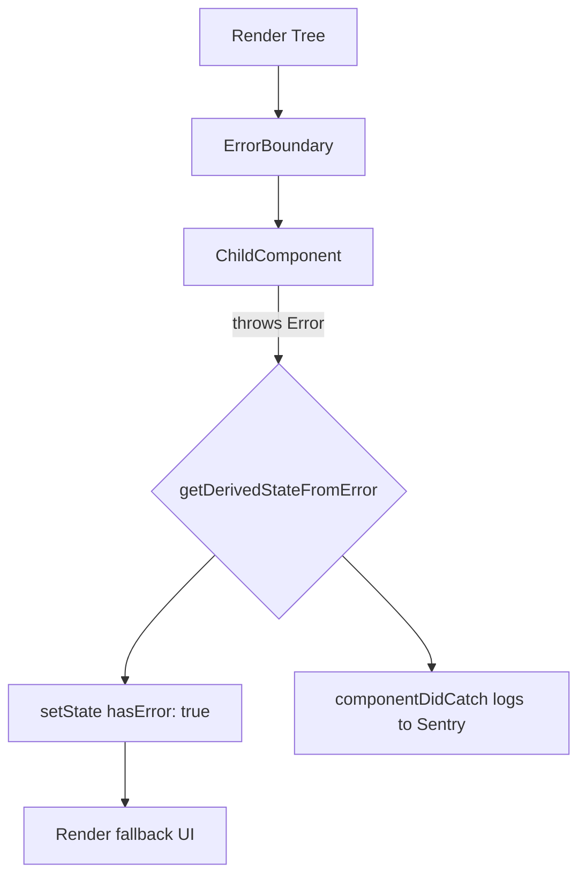

#### Interview Question

**Q:** Error boundary kya catch nahi karta, aur why is that?

**A:** Error boundary catch nahi karta: event handler errors (onClick mein throw), async code (setTimeout, promises, fetch), server-side rendering errors, aur error boundary khud ke andar ka error. Reason — error boundaries React ke render lifecycle ke andar hi work karte hain. Event handlers React ke render cycle se bahar execute hote hain (synchronously after user interaction), aur async code event loop ke alag tick pe.

Iss ke liye tu manual try-catch use karta hai event handlers mein, aur promises mein `.catch()` ya async/await ke saath try-catch. Global unhandled rejection ke liye `window.addEventListener("unhandledrejection")` use kar sakta hai. React 18+ mein concurrent features ke saath kuch async errors error boundary tak propagate hote hain Suspense ke through, par mostly tu manually handle karega.

Production tip: layered approach — top-level ErrorBoundary as last resort, granular boundaries around risky widgets, aur explicit error handling async ops mein. Sab milake robust UX deta hai.

---

### 6.3 Code splitting (React.lazy + Suspense)

#### Definition

Code splitting matlab ek bade JS bundle ko chhote chunks mein todna, taaki initial page load mein sirf zaroori code aaye. Baaki code on-demand load ho — jab user us route ya feature pe navigate kare. React.lazy aur Suspense isko ergonomic banate hain — dynamic import ke around React-friendly wrapper.

Analogy: Soch tu Netflix khol raha hai. Pura Netflix ka code (movies, settings, search, profiles) ek baar mein download karna pagalpan hai — minutes lag jaayenge. Iski jagah, sirf homepage ka code aaya, jab tu search pe gaya tab search ka code aaya. Yeh code splitting hai — bundle ko on-demand load karna.

#### Why?

Initial bundle size matter karta hai user experience ke liye — har 100KB extra matlab seconds slower load on 3G. Time-to-interactive metrics improve karne ke liye splitting essential hai. Plus, jo features sab users use nahi karte (admin panel, settings), unka code zaroorat padne par hi load karo.

#### How?

```tsx
import { lazy, Suspense } from "react";
import { Routes, Route } from "react-router-dom";

// dynamic import — alag chunk banega build time pe
const AdminPanel = lazy(() => import("./pages/AdminPanel"));
const Reports = lazy(() => import("./pages/Reports"));

function App() {
  return (
    <Suspense fallback={<div className="spinner">Loading...</div>}>
      <Routes>
        <Route path="/admin" element={<AdminPanel />} />
        <Route path="/reports" element={<Reports />} />
      </Routes>
    </Suspense>
  );
}
```

Bundler (Vite/Webpack) automatically AdminPanel aur Reports ke liye separate chunks generate kar dega. Pehli baar `/admin` visit pe network request hogi us chunk ke liye.

#### Real-life Example

Heavy library (chart library, rich text editor) ko lazy load karo — sirf jab user us feature ko khole.

```tsx
// dashboard mein chart sirf jab "Show Analytics" click ho
const AnalyticsChart = lazy(() => import("./AnalyticsChart")); // includes chart.js (200KB)

function Dashboard() {
  const [showChart, setShowChart] = useState(false);

  return (
    <div>
      <button onClick={() => setShowChart(true)}>Show Analytics</button>
      {showChart && (
        <Suspense fallback={<ChartSkeleton />}>
          <AnalyticsChart />
        </Suspense>
      )}
    </div>
  );
}
```

200KB chart library tab tak nahi aayegi jab tak user button na dabaye. Initial load fast.

#### Diagram

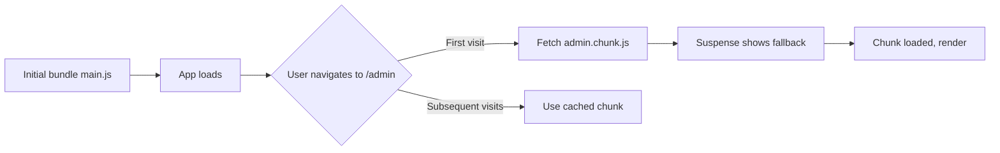

#### Interview Question

**Q:** React.lazy ke saath kya limitations hain, aur production mein chunk strategy kaise plan karoge?

**A:** React.lazy sirf default exports support karta hai — agar tujhe named export lazy load karna hai, tu re-export wrapper banayega. SSR mein React.lazy directly support nahi tha pehle (Next.js ka apna `dynamic` import use karna padta tha), React 18+ Suspense improvements se yeh better hua hai. Plus, Suspense boundary error boundary ke saath combine karna chahiye — chunk load fail ho sakta hai (network), toh fallback chahiye.

Production strategy: route-level splitting baseline hai — har route apna chunk. Phir heavy components (charts, editors, video players) ko component-level split karo. Vendor splitting (react, lodash alag chunk) caching ke liye useful — vendor change rare hota hai. Webpack/Vite mein magic comments se chunk names control karo (`/* webpackChunkName: "admin" */`). Preloading critical chunks ko `<link rel="preload">` se kar sakte ho jab tujhe pata hai user wahan jaayega.

Measure karo bundle analyzer (rollup-plugin-visualizer, webpack-bundle-analyzer) se — bina data ke optimize karna guesswork hai. Goal: initial bundle 200-300KB se kam, har route chunk 100KB se kam.

---

### 6.4 Lazy loading

#### Definition

Lazy loading broader concept hai — sirf code nahi, balki images, videos, data, components — sab kuch on-demand load karna. Idea: jo screen pe nahi hai ya turant zaroorat nahi, usse delay karo. Code splitting iska ek subset hai. Image lazy loading, infinite scroll, intersection observer based component loading — sab lazy patterns hain.

Analogy: Restaurant mein menu mein 200 items hain. Kitchen pehle se sab nahi banati — order aaya tabhi banaya. Lazy loading bhi yahi philosophy: demand pe production.

#### Why?

Initial render fast karne ke liye, bandwidth bachane ke liye, aur memory efficient rakhne ke liye. Mobile users ke liye specially crucial — slow network, limited data plans.

#### How?

Browser-native image lazy loading (modern, easiest):

```tsx

```

Component lazy loading with intersection observer — viewport mein aaye tab load:

```tsx
import { useEffect, useRef, useState } from "react";

function LazyMount({ children }: { children: ReactNode }) {
  const ref = useRef<HTMLDivElement>(null);
  const [visible, setVisible] = useState(false);

  useEffect(() => {
    const observer = new IntersectionObserver(
      ([entry]) => {
        if (entry.isIntersecting) {
          setVisible(true);
          observer.disconnect(); // ek baar visible, observe khatam
        }
      },
      { rootMargin: "200px" } // 200px pehle hi load shuru
    );
    if (ref.current) observer.observe(ref.current);
    return () => observer.disconnect();
  }, []);

  return <div ref={ref}>{visible ? children : <Skeleton />}</div>;
}
```

Data lazy loading — pagination ya infinite scroll:

```tsx
function InfiniteList() {
  const [page, setPage] = useState(1);
  const { data } = useFetch(`/api/items?page=${page}`);
  // jab user bottom near aaye, page+1
}
```

#### Real-life Example

E-commerce product grid — 1000 products. Tu sab ek saath nahi load karega.

```tsx
function ProductGrid() {
  return (
    <div className="grid">
      {products.map((p) => (
        <article key={p.id}>
          {/* image lazy via browser */}
          
          <h3>{p.name}</h3>
          {/* heavy 3D preview component lazy via intersection */}
          <LazyMount>
            <Product3DPreview id={p.id} />
          </LazyMount>
        </article>
      ))}
    </div>
  );
}
```

Sirf viewport mein dikhne wale 3D previews mount honge — baaki skeleton dikhayenge.

#### Diagram

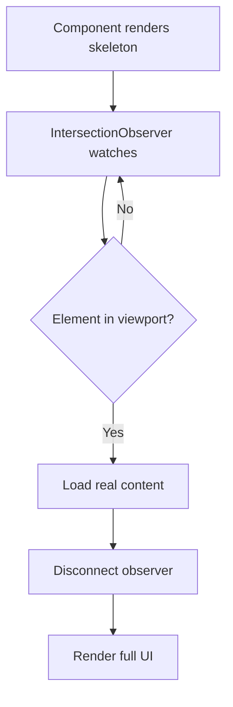

#### Interview Question

**Q:** Lazy loading kab counter-productive ho jaata hai?

**A:** Jab tu above-the-fold content lazy load karta hai — yaani jo user pehli screen pe dekh raha hai. Hero image, primary CTA, navigation — yeh sab eager load chahiye. Lazy karne se LCP (Largest Contentful Paint) bigad jaata hai aur user ko jhatkedaar load experience milta hai.

Doosra case — agar tu chhote chunks ko bhi split kar raha hai. Har chunk ek HTTP request hai, aur HTTP overhead aur JS parse cost hota hai. 5KB ka chunk lazy load karne mein utna hi time lag sakta hai jitna 50KB ka — overhead dominate karta hai. Rule of thumb: chunks 30KB se chhote nahi hone chahiye.

Aur teesra — agar tu predictable navigation ko delay kar raha hai. Agar 95% users login ke baad dashboard pe jaate hain, dashboard ko lazy karne ka koi point nahi — uska code shipping bundle mein rakh, ya prefetch kar de jaise hi login successful ho. Lazy loading data-driven decision honi chahiye, blanket policy nahi.

---

### 6.5 Performance optimization (React.memo, profiler, when memoization actually helps)

#### Definition

React.memo HOC hai jo functional component ko wrap karke shallow prop comparison karta hai — agar props badle nahi, re-render skip. `useMemo` value memoize karta hai (expensive computation cache), `useCallback` function reference stable rakhta hai. Profiler API React DevTools mein hai jo render times measure karta hai. In sab tools ka maksad: unnecessary re-renders aur expensive computations avoid karna.

Analogy: Memoization ek bookmark hai. Agar tu same page baar-baar padh raha hai, har baar shuru se nahi padhega — bookmark se directly jump. Lekin agar pages alag-alag hain har baar, bookmark useless — overhead extra.

#### Why?

Bade apps mein unnecessary re-renders performance ki silent killer hain. Ek parent state change pe pure subtree re-render — agar bottom mein ek heavy chart component hai jo unrelated props pe depend karta hai, woh bhi re-render hoga unnecessarily. Memoization se yeh skip ho jaata hai.

LEKIN — premature memoization apna overhead bring karta hai. Comparison cost > re-render cost ho sakta hai chhote components mein. Profile pehle, memoize baad mein.

#### How?

```tsx
import { memo, useMemo, useCallback, useState } from "react";

// expensive child — props change na ho toh re-render skip
const ExpensiveChart = memo(function ExpensiveChart({ data }: { data: number[] }) {
  // imagine bahut heavy rendering
  return <svg>{/* 10000 paths */}</svg>;
});

function Dashboard() {
  const [filter, setFilter] = useState("");
  const [theme, setTheme] = useState("light");

  const rawData = useFetchData();

  // expensive derive — sirf rawData/filter change pe recompute
  const chartData = useMemo(() => {
    return rawData.filter((d) => d.label.includes(filter)).map((d) => d.value);
  }, [rawData, filter]);

  // function reference stable — warna har render pe naya function = memo break
  const handleClick = useCallback((id: string) => {
    console.log("clicked", id);
  }, []);

  return (
    <>
      <ThemeToggle theme={theme} setTheme={setTheme} />
      <ExpensiveChart data={chartData} />
      <ItemList onItemClick={handleClick} />
    </>
  );
}
```

Note: `ExpensiveChart` ko `memo` se wrap kiya, aur `chartData` ko `useMemo` se stable rakha — taaki theme change pe chart re-render na ho.

#### Real-life Example

Real production scenario: data table with 1000 rows, filter input above it. Filter type karne pe sirf filter input re-render ho, table memoized rahe.

```tsx
const DataRow = memo(function DataRow({ item, onSelect }: Props) {
  return (
    <tr onClick={() => onSelect(item.id)}>
      <td>{item.name}</td>
      <td>{item.email}</td>
    </tr>
  );
});

function DataTable({ items }: { items: Item[] }) {
  // stable callback so memoized rows don't re-render
  const onSelect = useCallback((id: string) => {
    // ...
  }, []);

  return (
    <table>
      <tbody>
        {items.map((it) => (
          <DataRow key={it.id} item={it} onSelect={onSelect} />
        ))}
      </tbody>
    </table>
  );
}
```

Without memo, sorting/filtering pe sab 1000 rows re-render — janky. With memo + stable callback, sirf changed rows re-render.

#### Profiler usage

React DevTools mein "Profiler" tab. Record karo, action perform karo, stop karo. Flame graph dikhayega kaun se components kab render hue, kitna time liya, aur why (props changed, hooks changed). Targeted optimization ka data milta hai.

#### Diagram

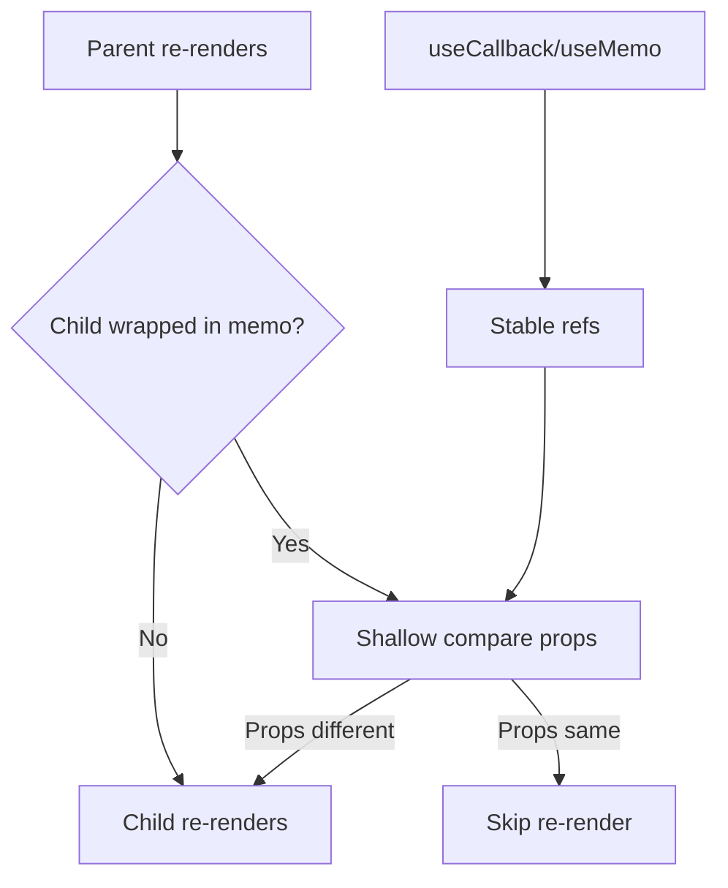

#### Interview Question

**Q:** "Sab kuch memoize kar do" — yeh approach kyun galat hai?

**A:** Memoization free nahi hai. `React.memo` har render pe shallow comparison karta hai props ka — primitive props ke liye fast, but objects/arrays ke liye reference comparison hoti hai. Agar parent har render pe naya object/array bana raha hai (which is common — `{...spread}`, `.map()`), memo break ho jaata hai aur tu comparison cost extra de raha hai bina benefit ke. `useMemo`/`useCallback` bhi closure capture aur dependency comparison overhead lete hain.

Real impact: small components (button, label, simple div) ko memoize karna negative net effect deta hai — comparison time render time se zyada. Memoize karne ke valid scenarios: (1) component visually heavy hai (charts, large lists, complex SVG), (2) component itself pure hai, (3) parent frequently re-renders due to unrelated state, (4) profiler ne actual bottleneck dikhaya hai.

Best practice: pehle profile karo. Agar component slow hai, dekho kyun — actual render slow hai (then optimize render logic), ya unnecessary re-renders ho rahe hain (then memoize). Andhadhund memoize karne se code complexity badhti hai, dependencies tracking nightmare ban jaati hai (eslint exhaustive-deps fights), aur perf gain often illusory hota hai.

React 19 ke React Compiler ne yeh problem mostly solve kar di hai — auto-memoization at compile time. Lekin jab tak woh stable nahi, manual judgement chahiye, with profiler as guide.

---

## Resources & further reading

- **react.dev** — official docs, especially "Learn" section aur "Reference" — sabse authoritative source
- **Kent C. Dodds blog (kentcdodds.com)** — practical patterns, testing, hooks deep dives
- **overreacted.io (Dan Abramov)** — React internals, mental models, "A Complete Guide to useEffect" must-read
- **Redux Toolkit docs (redux-toolkit.js.org)** — modern Redux, RTK Query
- **TanStack Query docs** — server state ka modern approach
- **React Router docs (reactrouter.com)** — v6+ routing patterns
- **Web.dev** — performance, lazy loading, Core Web Vitals
- **Profiler** — React DevTools extension, measure before optimize

Yeh part 2 kahan le aaya tujhe: routing fluently kar sakta hai nested + dynamic, state management ka decision tree clear hai (Context vs Redux vs Zustand), aur advanced patterns — error boundaries, code splitting, lazy loading, memoization — sab production-grade samajh aa gaye. Ab tu junior nahi raha bhai, ab tu mid-level React developer hai. Part 3 mein testing, SSR/Next.js, aur architecture patterns aayenge.
