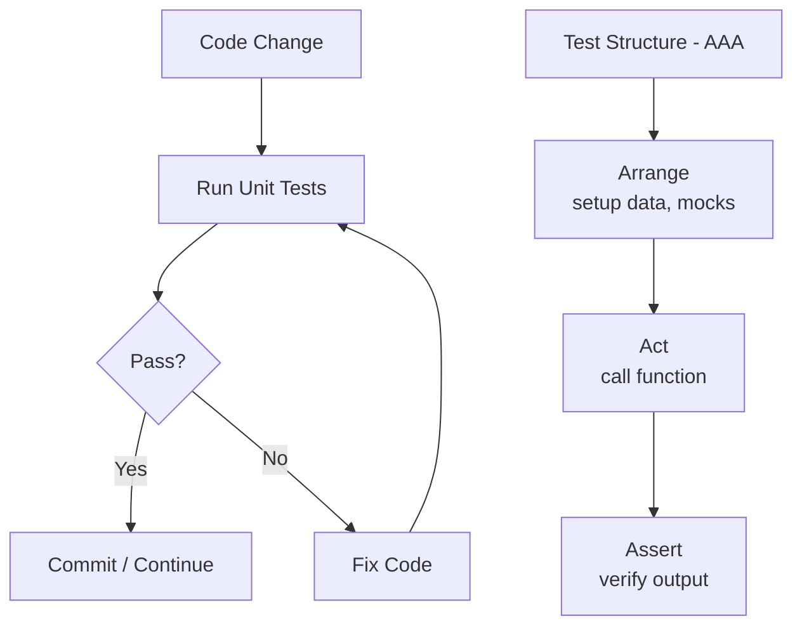
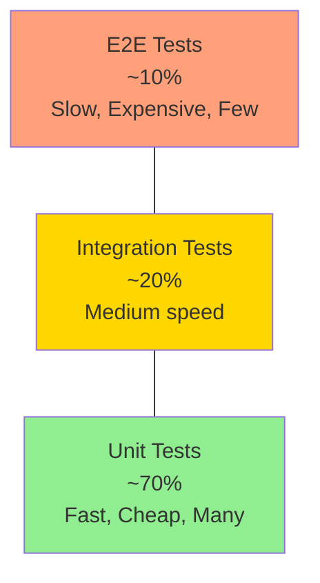
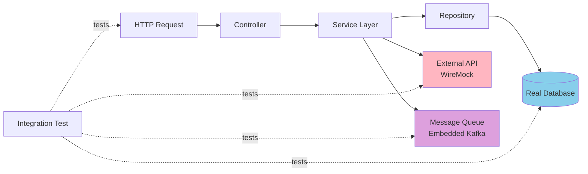
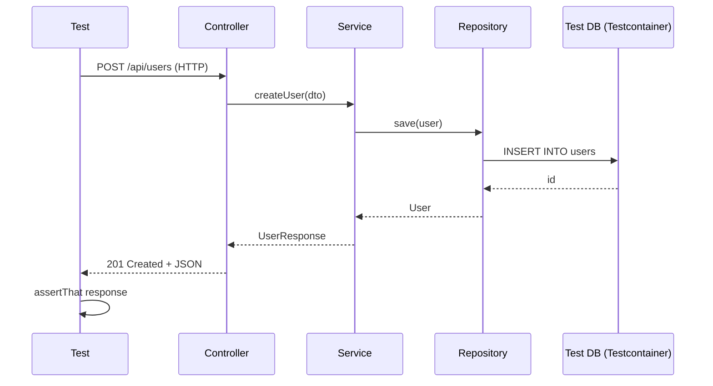
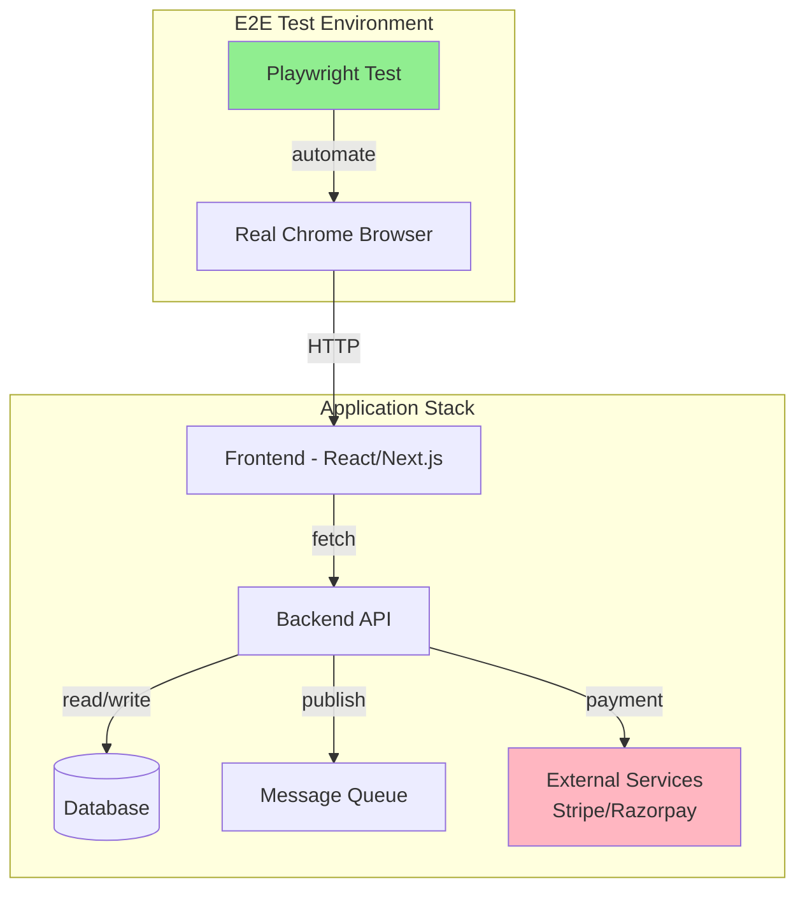
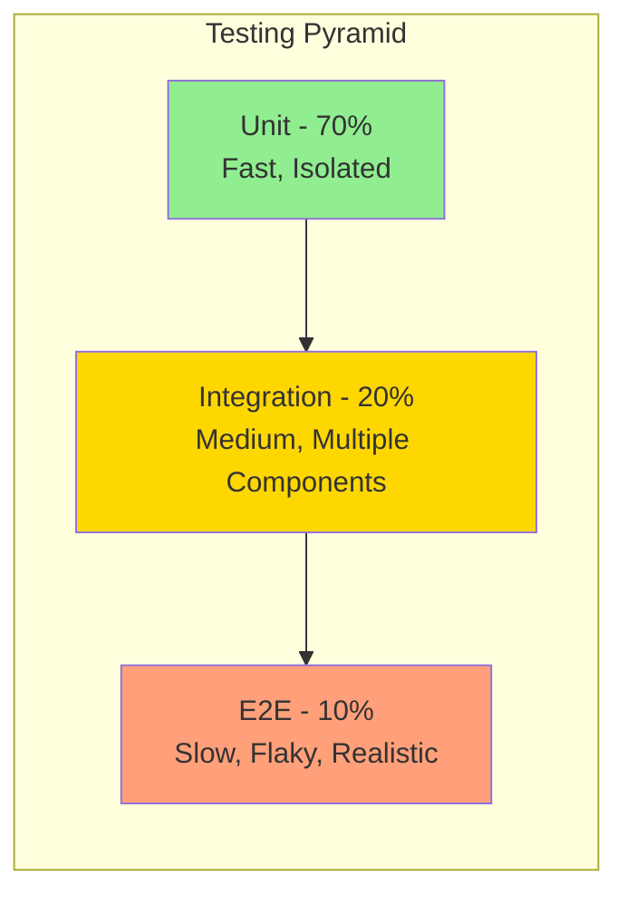
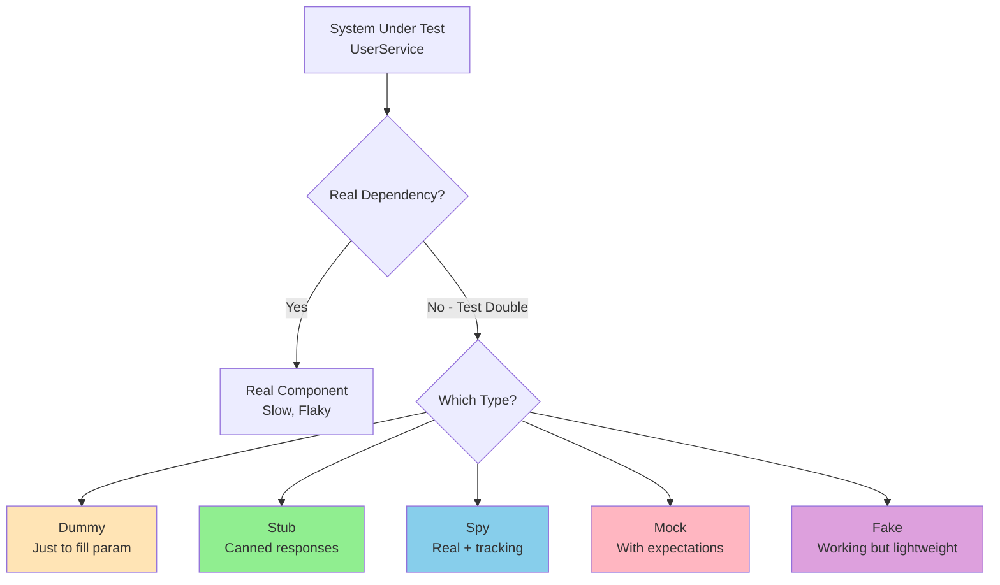
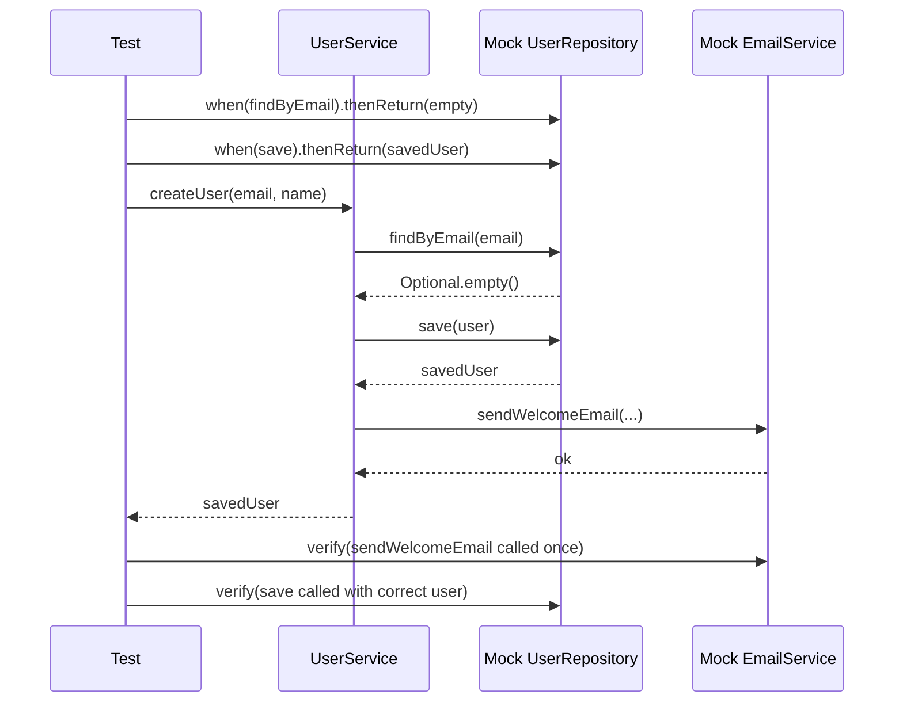

# Software Testing

Testing basically tumhe yeh batata hai ki tumhara code expected behaviour kar raha hai. Bina testing ke tu hamesha guess kar raha hai — production me nikalne ke baad samjhega. Aur jab production me bug nikalta hai, tab tak customer ne ticket file kar diya hota hai, on-call engineer ki neend kharab ho gayi hoti hai, aur PM tere desk pe khada hai. Toh testing koi "extra time" wala kaam nahi hai — yeh tumhare engineering process ka core hai. Senior engineers testing ko code likhne ke saath-saath karte hain (TDD ya simply test-first thinking), kyunki yeh design improve karta hai aur bugs ko shift-left karta hai (development phase me hi pakad lo, production me nahi).

Industry me ek standard mental model hai jise **Testing Pyramid** kehte hain (Mike Cohn ne popularise kiya). Iska basic argument: tumhare paas teen layer hote hain — Unit, Integration, aur End-to-End (E2E). Pyramid ka shape isliye hai kyunki **unit tests** sabse zyada hone chahiye (~70%), **integration tests** medium (~20%), aur **E2E tests** sabse kam (~10%). Reason simple hai: unit tests fast hote hain (milliseconds), cheap hote hain (no infra needed), aur deterministic hote hain. E2E tests slow hote hain (seconds-to-minutes), flaky hote hain (network, timing, browser quirks), aur expensive hote hain (browser/device farms). Agar tu pyramid ko ulta kar de — zyada E2E aur kam unit — to "ice cream cone anti-pattern" ban jaata hai: CI 30 min lagayega, tests randomly fail honge, aur developers tests likhna chhod denge.

Yeh module Java (JUnit 5 + Mockito + Spring Boot) aur Node.js (Jest) ke examples ke saath chalega. Hum cover karenge: unit testing fundamentals (pure functions, AAA pattern), integration testing (DB, API, Spring Boot's `@SpringBootTest`), end-to-end testing (Playwright, Cypress, REST Assured, Postman/Newman), aur mocking strategies (stubs, mocks, spies, fakes — har ek ka apna use-case hai). Interview me yeh topics constantly aate hain — especially "tu kab integration test likhega vs unit test?" wala question. End tak tujhe pyramid intuition aa jayegi aur tu apne PR me automatically poochhega "iska test hai kya?".

---

## 1. Unit testing

### 1.1 Pure functions, fast feedback, AAA (Arrange-Act-Assert) pattern, JUnit/Jest basics

#### Definition

Unit testing matlab tumhari code ki **smallest testable unit** ko isolation me test karna. "Unit" ka definition project-specific hai — kabhi yeh ek function hota hai, kabhi ek class ka method, kabhi ek pure module. Key idea: **isolation**. Tumhara unit test database ko hit nahi karega, network call nahi karega, file system me nahi likhega. Jo bhi external dependency hai — uska mock/stub use karoge ya test ko isi tarah design karoge ki dependency hi na ho (pure function).

**Pure function** ka concept yahan crucial hai. Pure function woh hota hai jo:
1. Same input pe hamesha same output deta hai (deterministic).
2. Koi side effect nahi karta — global state modify nahi karta, I/O nahi karta, console pe print nahi karta.

Pure functions test karna sabse easy hota hai kyunki tum bas input do aur output check karo. `add(2, 3) === 5` — bas. Real-world code me pure functions kam hote hain, par jab bhi possible ho, business logic ko pure functions me extract karo (yeh "functional core, imperative shell" pattern hai).

**AAA Pattern** (Arrange-Act-Assert) ek discipline hai test likhne ka:
- **Arrange**: Test data set up karo, dependencies inject karo, mocks configure karo.
- **Act**: Jis function/method ko test kar rahe ho usko call karo. Yeh ideally ek hi line hoti hai.
- **Assert**: Output verify karo — equality check, exception check, side-effect check.

Three sections clearly separate honi chahiye, comments ya blank lines se. Yeh discipline isliye hai ki test padhne wala 5 second me samajh jaaye ki test kya verify kar raha hai.

#### Why?

Sochke dekho — agar tumhare paas 50,000 lines ka backend service hai aur tum ek small refactor karte ho, tumhe kaise pata chalega ki tumne kuch break nahi kiya? Manual testing? Bhai 50,000 lines ka manual regression 3 din lagega. Unit tests yeh problem solve karte hain — **fast feedback loop**. Tumne code change kiya, `mvn test` ya `npm test` chalaya, 30 second me tumhe pata chal gaya 200 functions me se kaunsa toota hai.

Unit tests ke specific benefits:

1. **Fast feedback (sub-second per test)**: Tu code likhte-likhte tests run kar sakta hai. IDE me JUnit/Jest watch mode laga ke save karte hi tests run ho jaate hain.

2. **Design pressure**: Agar tum apne function ka unit test nahi likh paa rahe ho, toh problem function me hai — probably tumne database, network, aur business logic sab ek hi method me dump kar diya hai. Unit testing tumhe **single responsibility principle** automatically follow karne pe majboor karta hai.

3. **Regression safety net**: Jab bhi naya feature ya bug fix daloge, existing 1000 tests run honge. Agar koi toot gaya, tumhe pata chal jayega ki tumne accidentally kuch break kar diya. Yeh **confidence to refactor** deta hai.

4. **Documentation**: Test code, production code se zyada readable hota hai because it shows usage examples. Naya developer codebase me aaye, woh test files padh ke samajh sakta hai ki function kaise use hota hai.

5. **Shift-left**: Bug ko production me pakadne ka cost 100x hota hai vs development me. Unit test development me bug pakadta hai.

#### How?

Chalo dono examples dekhte hain — Java (JUnit 5) aur Node.js (Jest).

**Example 1: Java + JUnit 5 — Pure function testing**

```java
// PriceCalculator.java — pure function, no side effects
public class PriceCalculator {
    
    // discount apply karne ka pure function
    // input: price, discountPercent | output: discounted price
    public static double applyDiscount(double price, double discountPercent) {
        if (price < 0) {
            throw new IllegalArgumentException("Price negative nahi ho sakta");
        }
        if (discountPercent < 0 || discountPercent > 100) {
            throw new IllegalArgumentException("Discount 0-100 ke beech ho");
        }
        return price - (price * discountPercent / 100);
    }
}
```

```java
// PriceCalculatorTest.java — JUnit 5 test class
import org.junit.jupiter.api.Test;
import org.junit.jupiter.api.DisplayName;
import static org.junit.jupiter.api.Assertions.*;

class PriceCalculatorTest {

    @Test
    @DisplayName("10% discount on 100 should give 90")
    void shouldApplyTenPercentDiscount() {
        // Arrange — input data setup
        double price = 100.0;
        double discount = 10.0;
        
        // Act — function ko call karo
        double result = PriceCalculator.applyDiscount(price, discount);
        
        // Assert — output verify karo (delta 0.001 floating point ke liye)
        assertEquals(90.0, result, 0.001);
    }
    
    @Test
    @DisplayName("Negative price should throw exception")
    void shouldThrowOnNegativePrice() {
        // Arrange + Act + Assert combined for exception testing
        IllegalArgumentException ex = assertThrows(
            IllegalArgumentException.class,
            () -> PriceCalculator.applyDiscount(-50, 10)
        );
        // exception message bhi verify karo
        assertTrue(ex.getMessage().contains("negative"));
    }
    
    @Test
    @DisplayName("Boundary: 0% discount should return same price")
    void shouldReturnSamePriceOnZeroDiscount() {
        // Arrange
        double price = 250.0;
        
        // Act
        double result = PriceCalculator.applyDiscount(price, 0);
        
        // Assert — boundary value testing
        assertEquals(price, result, 0.001);
    }
    
    @Test
    @DisplayName("Boundary: 100% discount should give 0")
    void shouldReturnZeroOnFullDiscount() {
        // Arrange-Act-Assert
        double result = PriceCalculator.applyDiscount(500, 100);
        assertEquals(0.0, result, 0.001);
    }
}
```

Notice karo — har test ka naam clearly bata raha hai kya verify ho raha hai. Test method names sentences ki tarah padhne chahiye.

**Example 2: Node.js + Jest — Same concept**

```javascript
// priceCalculator.js — pure function module
function applyDiscount(price, discountPercent) {
    // input validation pehle
    if (price < 0) {
        throw new Error('Price negative nahi ho sakta');
    }
    if (discountPercent < 0 || discountPercent > 100) {
        throw new Error('Discount 0-100 ke beech ho');
    }
    // pure calculation, no side effects
    return price - (price * discountPercent / 100);
}

module.exports = { applyDiscount };
```

```javascript
// priceCalculator.test.js — Jest test file
const { applyDiscount } = require('./priceCalculator');

describe('applyDiscount', () => {
    
    test('10% discount on 100 should give 90', () => {
        // Arrange
        const price = 100;
        const discount = 10;
        
        // Act
        const result = applyDiscount(price, discount);
        
        // Assert — Jest ka toBeCloseTo float comparison ke liye
        expect(result).toBeCloseTo(90, 2);
    });
    
    test('negative price throws error', () => {
        // Act + Assert — exception expect karo
        expect(() => applyDiscount(-50, 10))
            .toThrow('Price negative nahi ho sakta');
    });
    
    // parameterized tests Jest me describe.each se hote hain
    describe.each([
        [100, 0, 100],   // 0% discount
        [100, 50, 50],   // 50% discount
        [100, 100, 0],   // 100% discount
        [200, 25, 150],  // 25% on 200
    ])('applyDiscount(%d, %d)', (price, discount, expected) => {
        test(`should return ${expected}`, () => {
            expect(applyDiscount(price, discount)).toBeCloseTo(expected, 2);
        });
    });
});
```

**Run karne ka command:**
- Java: `mvn test` ya `./gradlew test`
- Node: `npm test` ya `npx jest`

**Best practices:**

1. **Ek test, ek assertion concept**: Ideally ek test ek hi cheez verify kare. Agar tumhe 5 assertions chahiye, sochlo kya yeh 5 alag tests hone chahiye? Multiple related assertions OK hain (jaise object ke multiple fields), par 5 different scenarios same test me na ghuso.

2. **Naming convention**: `should_<expectedBehavior>_when_<condition>` ya `<methodName>_<condition>_<expected>`. Examples: `shouldReturnZero_whenDiscountIs100`, `applyDiscount_negativePrice_throwsException`.

3. **No `if` in tests**: Agar test me `if-else` aa raha hai, tumne probably do alag tests ko ek me ghusa diya hai. Split karo.

4. **F.I.R.S.T principles**:
   - **F**ast — milliseconds me chale
   - **I**ndependent — kisi order me chale, koi shared state nahi
   - **R**epeatable — same result har baar
   - **S**elf-validating — pass/fail spit kare, manual interpretation nahi
   - **T**imely — code ke saath ya pehle likho

#### Real-life Example

Maan le tu Flipkart-jaise e-commerce ka pricing service likh raha hai. Pricing logic me:
- Base price
- Category-wise discount
- Coupon code discount
- Membership tier multiplier
- GST calculation

Tu yeh sab ek `calculateFinalPrice()` me daal sakta hai — 200 lines, koi test nahi. Ya tu chhote pure functions me todh sakta hai: `applyCategoryDiscount()`, `applyCoupon()`, `applyMembershipMultiplier()`, `calculateGST()`. Har ek pure function — input do, output milta hai. Har ek ke 5-10 unit tests likho — edge cases (zero discount, max discount, expired coupon, invalid GST rate).

Production me ek baar Flipkart-jaisi company me pricing bug aaya tha — Diwali sale me kuch products 1 rupee me bik gaye. Agar pricing logic me unit tests hote with boundary checks, woh bug pre-prod me pakda jaata. Yeh real cost hai testing skip karne ka.

Doosra example: payment service. Tu Razorpay/Stripe se integrate kar raha hai. Apne webhook handler me signature validation logic hai (HMAC SHA256). Yeh ek pure function hai — `validateSignature(payload, signature, secret)`. Iska unit test bahut critical hai — agar signature validation me bug aaya, koi bhi banda fake webhook bhej ke order ko "paid" mark kar dega. Real attack vector. Yahan unit test = security guarantee.

#### Diagram





#### Interview Q&A

**Q1: Pure functions ko test karna easy kyun hota hai? Aur agar tumhare paas pure function nahi hai, kya karoge?**

Pure functions ka core property hai determinism aur no-side-effects. Tum bas input pass karte ho aur output verify karte ho — koi mock setup nahi, koi DB seed nahi, koi cleanup nahi. Test code 5 lines ka hota hai aur 1 millisecond me chalta hai. Refactor karte time bhi pure functions safest hote hain kyunki unka behaviour completely deterministic hai. Industry me senior devs intentionally apne business logic ko pure functions me extract karte hain — yeh "functional core, imperative shell" pattern hai (Gary Bernhardt ne popularize kiya). Side effects (DB writes, API calls) ko outer layer me push karo, andar pure logic rakho.

Agar tumhare paas pure function nahi hai — matlab function database hit kar raha hai ya time.now() use kar raha hai — toh tumhe **dependency injection** karna padega. Database access ko ek interface ke peeche chhupao, test me iska mock pass karo. Time-dependent code me `Clock` abstraction inject karo (Java me `java.time.Clock`, Node me `Date.now()` ko replace karo). Goal yeh hai ki test me tum saari "impure" parts ko control kar sako. Agar yeh bhi possible nahi hai (legacy code), tab integration tests likho — but unit tests pe insist mat karo har jagah.

**Q2: AAA pattern ki jagah BDD style (`given-when-then`) ka use kab karoge? Difference kya hai?**

AAA aur Given-When-Then conceptually same hain — bas naming aur audience different hai. AAA ka audience developer hai, GWT ka audience non-technical stakeholder bhi ho sakta hai (PM, QA). Cucumber/SpecFlow jaise BDD frameworks me Given-When-Then natural language me likha jaata hai (`.feature` files), aur woh executable test ban jaata hai. Yeh tab useful hai jab tumhe acceptance criteria stakeholder ke saath validate karna hai.

Practically, 95% backend unit tests me AAA hi use hota hai kyunki yeh fast aur concise hai. BDD tab karo jab tumhare team me product/QA ke saath collaboration zyada hai aur tum business rules document kar rahe ho. Mixing dono is a bad idea — pick one and stick to it per layer. Senior interview me agar yeh question aaye, toh bolo "AAA for unit and integration, BDD/Cucumber for acceptance scenarios where business stakeholders need readability."

**Q3: F.I.R.S.T principles me se kaunsa sabse zyada violate hota hai real codebases me, aur kaise fix karoge?**

Sabse zyada **Independent** violate hota hai. Tests shared state pe depend karte hain — ek test database me record insert karta hai, doosra test usko read karta hai. Agar tests parallel chaloge ya order change ho, sab fail. Yeh classic anti-pattern hai. Fix: har test ka apna `@BeforeEach` (JUnit) ya `beforeEach` (Jest) ho jo fresh state setup kare. Database tests me transactions use karo aur har test ke baad rollback karo. In-memory database (H2 for Java, sqlite for Node) use karo for unit-level integration tests.

Doosra commonly violated principle hai **Fast**. Tests me devs accidentally `Thread.sleep(2000)` ya real network calls daal dete hain. Fix: time-dependent code me virtual time use karo (Jest me `jest.useFakeTimers()`, Java me `TestClock`). Network calls ko mock karo. Goal: 1000 unit tests 10 second se kam me chale. Agar tests slow hain, devs unhe skip karne lagte hain — aur phir tests existed but didn't catch bugs ka problem hota hai.

**Q4: Test coverage 100% target karna chahiye? 70% acceptable hai?**

Coverage ek **vanity metric** hai — yeh batata hai ki tumhare tests ne kaunsi lines execute ki, but yeh nahi batata ki actually behaviour verify hua ya nahi. Tum 100% line coverage le sakte ho saare tests me bina ek bhi assertion ke — woh useless hai. Industry standard generally 70-80% line coverage hota hai for backend services, with critical paths (payment, auth, security) at 95%+. Google internally ~85% target karta hai, with strict review on critical code.

Better metric hai **mutation testing** (PIT for Java, Stryker for Node). Yeh tumhare code me intentionally bugs introduce karta hai (`+` ko `-` se replace, `>` ko `>=`) aur dekhta hai ki tumhare tests fail hote hain ya nahi. Agar tests pass ho gaye despite bug — toh tumhare tests weak hain. Real interview answer: "Coverage as a guide, not a goal. 100% coverage with weak assertions is worse than 70% with strong assertions on critical paths. Focus on testing behaviour, edge cases, and error paths — coverage will follow naturally."

---

## 2. Integration testing

### 2.1 Multiple components together — DB integration, API integration, Spring Boot @SpringBootTest

#### Definition

Integration testing matlab **multiple components ka interaction test karna**. Unit test isolation me tha — yahan tum real dependencies use karte ho (ya near-real, like in-memory DB). Goal: verify karna ki components correctly wire up ho rahe hain — service layer correctly repository ko call kar raha hai, repository correctly DB me likh raha hai, transactions correctly commit/rollback ho rahe hain, configurations correctly load ho rahe hain.

Integration tests do flavours me aate hain:

1. **Narrow integration** (component-level): Ek module ke andar multiple classes ko milake test karna. Service + Repository, with real DB. Bahar ke services mock kiye jaate hain.

2. **Broad integration** (multi-service): Multiple microservices ko milake test karna — Service A, Service B, message queue, DB. Yeh kabhi-kabhi "contract testing" me convert ho jaata hai (Pact framework).

Spring Boot world me `@SpringBootTest` annotation full application context boot karta hai — saari beans wire ho jaati hain, configurations load ho jaati hain. Yeh slow hota hai (10-30 seconds startup), but bahut realistic test environment deta hai. Lighter alternatives hain `@DataJpaTest` (sirf JPA layer), `@WebMvcTest` (sirf web layer), `@JsonTest` (sirf JSON serialization).

#### Why?

Unit tests sab pass ho gaye, deploy kiya, production crash. Kyun? Kyunki **integration ke level pe bug tha** — tumne service ko test kiya with mocked repository, repository ko test kiya with mocked DB, par actual SQL query me typo tha aur woh production-grade Postgres pe fail ho raha tha. Integration tests yeh scenarios pakadte hain:

1. **SQL/ORM bugs**: Hibernate ka N+1 query problem, native query me column name galat, JPA cascade misconfiguration. Yeh sab unit test kabhi nahi pakadega.

2. **Transaction boundaries**: Tumne `@Transactional` lagana bhool gaya, ya wrong propagation level use kiya. Real DB ke saath integration test isko expose karega.

3. **Configuration bugs**: `application.yml` me galat property name, environment variable missing, bean wiring conflict. `@SpringBootTest` poora context boot karta hai — yeh sab pakad jaata hai.

4. **API contract bugs**: REST endpoint correct status code return kar raha hai? Validation errors correctly map ho rahe hain `400 Bad Request` me? Authentication filter correctly chain me hai? Yeh integration tests verify karte hain.

5. **Serialization bugs**: JSON me `LocalDateTime` correctly serialize ho raha hai? Date format expected hai? Null fields exclude ho rahe hain? Yeh bugs unit test me invisible hote hain.

Trade-off: integration tests slow hote hain (per test 1-5 seconds vs unit test 1ms), aur flaky ho sakte hain. Isliye pyramid me inka share kam rakha jaata hai.

#### How?

**Example 1: Spring Boot — Repository integration test with H2/Testcontainers**

```java
// User entity (JPA)
@Entity
@Table(name = "users")
public class User {
    @Id
    @GeneratedValue(strategy = GenerationType.IDENTITY)
    private Long id;
    
    @Column(unique = true, nullable = false)
    private String email;
    
    @Column(nullable = false)
    private String name;
    
    // getters, setters, constructors
}
```

```java
// Repository interface
public interface UserRepository extends JpaRepository<User, Long> {
    Optional<User> findByEmail(String email);
    
    @Query("SELECT u FROM User u WHERE u.name LIKE %:keyword%")
    List<User> searchByName(@Param("keyword") String keyword);
}
```

```java
// Repository integration test using @DataJpaTest
import org.junit.jupiter.api.Test;
import org.springframework.beans.factory.annotation.Autowired;
import org.springframework.boot.test.autoconfigure.orm.jpa.DataJpaTest;
import org.springframework.boot.test.autoconfigure.jdbc.AutoConfigureTestDatabase;
import org.springframework.boot.test.autoconfigure.jdbc.AutoConfigureTestDatabase.Replace;
import org.testcontainers.containers.PostgreSQLContainer;
import org.testcontainers.junit.jupiter.Container;
import org.testcontainers.junit.jupiter.Testcontainers;

import static org.assertj.core.api.Assertions.assertThat;

@DataJpaTest
@AutoConfigureTestDatabase(replace = Replace.NONE)  // real DB use karo, H2 nahi
@Testcontainers
class UserRepositoryIntegrationTest {

    // Testcontainers se real Postgres container start hoga
    @Container
    static PostgreSQLContainer<?> postgres = new PostgreSQLContainer<>("postgres:15")
        .withDatabaseName("testdb")
        .withUsername("test")
        .withPassword("test");

    @DynamicPropertySource
    static void configureProperties(DynamicPropertyRegistry registry) {
        registry.add("spring.datasource.url", postgres::getJdbcUrl);
        registry.add("spring.datasource.username", postgres::getUsername);
        registry.add("spring.datasource.password", postgres::getPassword);
    }

    @Autowired
    private UserRepository userRepository;

    @Test
    void shouldFindUserByEmail_whenUserExists() {
        // Arrange — DB me data daalo
        User saved = userRepository.save(
            new User("ujjwal@example.com", "Ujjwal Sharma")
        );
        
        // Act — repository method call karo (real SQL chalega)
        Optional<User> found = userRepository.findByEmail("ujjwal@example.com");
        
        // Assert
        assertThat(found).isPresent();
        assertThat(found.get().getId()).isEqualTo(saved.getId());
        assertThat(found.get().getName()).isEqualTo("Ujjwal Sharma");
    }
    
    @Test
    void shouldReturnEmpty_whenEmailNotFound() {
        // Act
        Optional<User> found = userRepository.findByEmail("nonexistent@example.com");
        
        // Assert
        assertThat(found).isEmpty();
    }
    
    @Test
    void searchByName_shouldReturnPartialMatches() {
        // Arrange
        userRepository.save(new User("a@x.com", "Rahul Kumar"));
        userRepository.save(new User("b@x.com", "Rahul Sharma"));
        userRepository.save(new User("c@x.com", "Priya Singh"));
        
        // Act — custom JPQL query test
        List<User> results = userRepository.searchByName("Rahul");
        
        // Assert — 2 Rahul honi chahiye
        assertThat(results).hasSize(2);
        assertThat(results).extracting(User::getName)
            .containsExactlyInAnyOrder("Rahul Kumar", "Rahul Sharma");
    }
}
```

**Example 2: Spring Boot — Full API integration test with `@SpringBootTest`**

```java
// Controller layer test using MockMvc
import org.junit.jupiter.api.Test;
import org.springframework.beans.factory.annotation.Autowired;
import org.springframework.boot.test.context.SpringBootTest;
import org.springframework.boot.test.autoconfigure.web.servlet.AutoConfigureMockMvc;
import org.springframework.test.web.servlet.MockMvc;
import org.springframework.transaction.annotation.Transactional;

import static org.springframework.test.web.servlet.request.MockMvcRequestBuilders.*;
import static org.springframework.test.web.servlet.result.MockMvcResultMatchers.*;

@SpringBootTest                  // poora app context load karega
@AutoConfigureMockMvc            // MockMvc auto-configure
@Transactional                   // har test ke baad rollback
class UserApiIntegrationTest {

    @Autowired
    private MockMvc mockMvc;

    @Test
    void shouldCreateUser_andReturnUser() throws Exception {
        // Arrange — request body
        String requestBody = """
            {
                "email": "test@example.com",
                "name": "Test User"
            }
            """;
        
        // Act + Assert — POST request and verify response
        mockMvc.perform(post("/api/users")
                .contentType("application/json")
                .content(requestBody))
            .andExpect(status().isCreated())
            .andExpect(jsonPath("$.id").exists())
            .andExpect(jsonPath("$.email").value("test@example.com"))
            .andExpect(jsonPath("$.name").value("Test User"));
    }
    
    @Test
    void shouldReturn400_whenEmailMissing() throws Exception {
        // Arrange — invalid request
        String requestBody = """
            {
                "name": "Test User"
            }
            """;
        
        // Act + Assert — validation error expected
        mockMvc.perform(post("/api/users")
                .contentType("application/json")
                .content(requestBody))
            .andExpect(status().isBadRequest())
            .andExpect(jsonPath("$.errors[0].field").value("email"));
    }
    
    @Test
    void shouldReturn409_whenDuplicateEmail() throws Exception {
        // Arrange — pehle ek user create karo
        String body = """
            {"email": "dup@example.com", "name": "First"}
            """;
        mockMvc.perform(post("/api/users")
                .contentType("application/json")
                .content(body))
            .andExpect(status().isCreated());
        
        // Act + Assert — same email se dobara create karo, conflict
        mockMvc.perform(post("/api/users")
                .contentType("application/json")
                .content(body))
            .andExpect(status().isConflict());
    }
}
```

**Example 3: Node.js — Express API integration test with Supertest**

```javascript
// userRoutes.test.js — Express + Jest + Supertest
const request = require('supertest');
const app = require('../app');           // Express app
const db = require('../db');             // DB connection
const { setupTestDb, teardownTestDb } = require('./testHelpers');

describe('User API Integration', () => {
    
    // Test database setup before all tests
    beforeAll(async () => {
        await setupTestDb();   // run migrations, seed nothing
    });
    
    // Cleanup after each test — fresh state
    afterEach(async () => {
        await db.query('TRUNCATE users CASCADE');
    });
    
    afterAll(async () => {
        await teardownTestDb();
        await db.end();
    });
    
    test('POST /api/users should create user', async () => {
        // Arrange
        const newUser = { email: 'test@x.com', name: 'Test' };
        
        // Act — real HTTP request
        const response = await request(app)
            .post('/api/users')
            .send(newUser)
            .expect('Content-Type', /json/)
            .expect(201);
        
        // Assert
        expect(response.body.id).toBeDefined();
        expect(response.body.email).toBe('test@x.com');
        
        // DB me actually save hua ya nahi verify karo
        const dbResult = await db.query(
            'SELECT * FROM users WHERE email = $1',
            ['test@x.com']
        );
        expect(dbResult.rows).toHaveLength(1);
    });
    
    test('GET /api/users/:id should return 404 for missing user', async () => {
        await request(app)
            .get('/api/users/99999')
            .expect(404);
    });
    
    test('full user lifecycle: create, get, update, delete', async () => {
        // Create
        const created = await request(app)
            .post('/api/users')
            .send({ email: 'a@b.com', name: 'A' })
            .expect(201);
        const id = created.body.id;
        
        // Read
        await request(app)
            .get(`/api/users/${id}`)
            .expect(200)
            .expect(res => {
                expect(res.body.email).toBe('a@b.com');
            });
        
        // Update
        await request(app)
            .put(`/api/users/${id}`)
            .send({ name: 'A Updated' })
            .expect(200);
        
        // Delete
        await request(app)
            .delete(`/api/users/${id}`)
            .expect(204);
        
        // Verify deletion
        await request(app)
            .get(`/api/users/${id}`)
            .expect(404);
    });
});
```

**Best practices:**

1. **Testcontainers > H2/in-memory**: H2 SQL dialect Postgres se different hai. Production me Postgres-specific feature use karta hai (JSON columns, array types) — H2 me test pass, Postgres me fail. Testcontainers real Postgres container spin karta hai, fully realistic. Slow hota hai (10s startup) but trustworthy.

2. **Transactional rollback**: `@Transactional` test method pe lagao — Spring automatically rollback karega test ke baad. DB clean rehta hai. Caveat: agar tumhara code khud transaction manage karta hai (`REQUIRES_NEW`), yeh kaam nahi karega — manual cleanup karo.

3. **Test profiles**: `application-test.yml` rakho with separate config (different DB, mocked external services). `@ActiveProfiles("test")` se activate karo.

4. **Don't test framework code**: Tum Spring ke `findById()` ka test mat likho — woh Spring ne test kiya hai. Tum apna **custom** logic test karo — custom queries, business rules, validation.

#### Real-life Example

Maan le tu Swiggy ka order service likh raha hai. Order create karne ka flow:
1. Customer cart se order place karta hai (REST API)
2. Service inventory check karta hai (DB query)
3. Payment service call karta hai (HTTP call)
4. Order DB me save hota hai
5. Restaurant ko notification jaati hai (Kafka publish)

Yeh poora flow integration test me cover karoge:
- Real DB (Testcontainers Postgres)
- WireMock se payment service mock (specific response codes)
- Embedded Kafka for messaging
- `@SpringBootTest` se full application context

Ek baar production me bug aaya tha — agar payment fail hota tha, order DB me partially save reh jaata tha (because transaction rollback miss). Customer ko paisa nahi cut hua, but order "pending payment" me 24 ghante stuck. Iska integration test missing tha. Aaj yeh standard scenario hai — happy path + failure paths sab integration tests me hain.

Doosra example: Razorpay webhook handler. Webhook aata hai → signature verify → order DB me update → email send. Yeh full chain ka integration test critical hai. Race conditions, idempotency (same webhook 2 baar aaye), out-of-order delivery — yeh sab integration level pe verify hota hai.

#### Diagram





#### Interview Q&A

**Q1: `@SpringBootTest` slow hai — kab use karoge vs `@WebMvcTest` vs `@DataJpaTest`?**

`@SpringBootTest` poora application context boot karta hai — saari beans, security filters, schedulers, message listeners. Use isko karo jab tum **end-to-end backend flow** test kar rahe ho — controller se DB tak. Yeh tumhe maximum confidence deta hai but cost pe — startup 10-30 sec, har test 1-5 sec. Pyramid me 10-15% tests `@SpringBootTest` honge.

`@WebMvcTest` sirf web layer load karta hai — controller, validators, exception handlers. Service layer mocked hota hai (`@MockBean`). Yeh fast hai (1-2 sec startup) aur tumhe controller-level concerns test karne deta hai — request mapping, validation, JSON serialization, security. `@DataJpaTest` sirf JPA layer load karta hai — repositories, entities, embedded H2/Testcontainer. Service aur web layer involved nahi.

Strategy: `@DataJpaTest` for repository tests, `@WebMvcTest` for controller tests, `@SpringBootTest` for critical end-to-end backend flows. Yeh combination tumhe pyramid follow karne deta hai. Junior devs har test pe `@SpringBootTest` lagate hain — phir CI 20 min lagti hai. Senior dev sliced annotations use karta hai.

**Q2: Integration tests me database state kaise manage karoge? Tests parallel chalane hain.**

Three strategies hain. **First**: `@Transactional` annotation — Spring har test ke baad rollback karega, fresh state. Simple aur fast. Caveat: agar code khud `REQUIRES_NEW` propagation use karta hai ya async operations hain, yeh fail karega. **Second**: Manual cleanup `@AfterEach` me — `TRUNCATE` saari tables. Reliable but slow agar tables zyada hain. **Third**: Per-test schema/database — har test apna schema banaye. Slowest but maximum isolation.

Parallel execution ke liye unique data approach best hai — har test apna unique email, unique ID generate kare (UUID). Phir tests ek doosre se collide nahi karenge despite shared DB. JUnit 5 me `@Execution(ExecutionMode.CONCURRENT)` se parallel chala sakte ho. Better approach: Testcontainers me har test class ke liye separate container — overhead hai but full isolation. Real production codebases me hybrid approach common hai: unit tests parallel, integration tests sequential per class but parallel across classes.

**Q3: Testcontainers vs H2 — kab kya use karoge?**

H2 ek embedded in-memory Java database hai — milliseconds me start hota hai, koi setup nahi. Test perfect hai for **simple JPA queries** jo standard SQL use karte hain. Drawback: H2 ka SQL dialect Postgres/MySQL se different hai. JSON columns, array types, window functions, full-text search — yeh sab Postgres-specific features H2 me alag behave karte hain ya unsupported hain. Real bug example: Postgres me `ILIKE` (case-insensitive) chalta hai, H2 me nahi — H2 me test pass, Postgres me crash.

Testcontainers real Docker container me actual database run karta hai — Postgres 15, MySQL 8, MongoDB, Redis, Kafka — kuch bhi. Startup slow (5-15 sec first time, then cached), but **production-identical** environment. Modern best practice: Testcontainers for ALL integration tests. CI me Docker hota hai, local pe bhi mostly Docker hota hai. H2 sirf legacy projects me use karo jahan migrate karna costly hai. Senior interview answer: "Testcontainers default, H2 only for fast smoke tests of vendor-neutral SQL."

**Q4: Tumne integration test likha, woh CI me kabhi-kabhi fail hota hai (flaky). Debug kaise karoge?**

Flaky tests integration testing ki sabse badi problem hai. Root causes typically: **(1) Race conditions** — async code me test result check karne se pehle operation complete nahi hua. Fix: explicit waits with `Awaitility` (Java) ya proper `await` (Node) — but timeouts liberal rakho. **(2) Shared state leak** — pichle test ka data current test affect kar raha hai. Fix: clean state per test, transactional rollback ya truncation. **(3) Time dependency** — `LocalDateTime.now()` use kar raha hai, midnight pe test fail. Fix: inject `Clock` aur tests me fixed time. **(4) Network/external dependency** — actual external API hit kar raha hai test. Fix: WireMock se stub karo.

Debug approach: pehle test ko 100 baar local pe chalao — `@RepeatedTest(100)` (JUnit) ya `--testNamePattern` loop. Reproduce karo. Phir add detailed logging — assertions ke pehle aur baad current DB state print karo. Concurrency issues ke liye thread dumps. CI me hi fail hota hai? Container resources kam ho sakte hain — CPU throttling se timeouts. CI logs me JVM GC pause check karo. Flaky tests ko **quarantine** karo (separate suite me daal do, build break na ho), but unhe unfix mat chhodo — woh root cause hai bigger problems ka.

---

## 3. End-to-end testing

### 3.1 Full system tests — browser-based (Playwright/Cypress), API E2E (Postman/REST Assured)

#### Definition

End-to-end (E2E) testing matlab **poori system ko ek user ki tarah test karna**, real environment ke saath. Browser khulta hai, real backend hit hota hai, real database me data jaata hai, real external services bhi (ya unka staging version) involve hote hain. Matlab production ke 95% similar setup. Goal: validate karna ki saari pieces actually milake kaam karti hain — UI, API, DB, queue, cache, third-party.

E2E tests do major flavours:

1. **UI-driven E2E**: Browser automation — Playwright, Cypress, Selenium. Real Chromium/Firefox/Safari me page load hota hai, clicks/typing simulate hote hain, assertions DOM ya backend state pe lagti hain. Use case: critical user journeys — signup, checkout, payment, password reset.

2. **API-driven E2E**: HTTP-level full workflow — Postman/Newman, REST Assured (Java), Karate. Browser nahi — tum directly APIs ko sequence me hit karte ho aur saari microservices ki interaction verify karte ho. Faster than UI E2E, lekin UI bugs nahi pakad sakta.

E2E tests pyramid ka top hote hain — **kam quantity, high value**. Critical happy paths cover karo (top 5-10 user journeys), edge cases unit/integration me. E2E me edge cases test karna trap hai — test suite blow up ho jaata hai, flakiness badh jaati hai, CI 1 ghante chalti hai.

#### Why?

Unit pass, integration pass, deploy kar diya — par login button click karne pe page hi nahi load ho raha. Kyun? Frontend ne API contract change kiya, backend purana hai. Ya CDN ne JS bundle invalidate nahi kiya. Ya CORS misconfigured hai. Yeh sab unit/integration ke level pe nahi pakda jaata — system-level bugs hote hain. E2E tests yeh pakadte hain.

Specific value of E2E:

1. **Real user behaviour validation**: Tumhare beautifully tested components ek saath kaam kar rahe hain ya nahi — yeh sirf E2E confirm karta hai. Login form se lekar dashboard tak, real auth tokens, real session management.

2. **Cross-cutting concerns**: Authentication, authorization, CORS, CSP, cookies, redirects — yeh sab sirf real browser me test hote hain.

3. **Third-party integrations**: Stripe payment flow, OAuth login (Google/GitHub), reCAPTCHA — real environment me hi test ho sakte hain.

4. **Confidence for releases**: Bade releases ke pehle E2E suite green hone par hi production deploy approve hota hai. "Smoke test" production me bhi run karte hain — deploy ke baad critical paths verify.

5. **Production-like infra issues**: Load balancer config, database connection pooling, rate limiting, caching layers — yeh sab E2E me test hote hain.

Cost: E2E slow hai (5-30 sec per test), flaky hai (network, timing, browser quirks), expensive hai (browser farms, infra). Maintenance bhi heavy — UI change, sab tests update karne padte hain.

#### How?

**Example 1: Playwright (Node.js) — Browser E2E**

```javascript
// e2e/login.spec.js — Playwright test
const { test, expect } = require('@playwright/test');

test.describe('Login flow', () => {
    
    test.beforeEach(async ({ page }) => {
        // Test ke pehle login page pe jao
        await page.goto('http://localhost:3000/login');
    });
    
    test('successful login redirects to dashboard', async ({ page }) => {
        // Arrange — credentials fill karo
        await page.fill('input[name="email"]', 'user@example.com');
        await page.fill('input[name="password"]', 'correct-password');
        
        // Act — submit button click
        await page.click('button[type="submit"]');
        
        // Assert — dashboard pe redirect hua
        await expect(page).toHaveURL(/\/dashboard/);
        await expect(page.locator('h1')).toContainText('Welcome');
        
        // Cookie check — auth token set hua
        const cookies = await page.context().cookies();
        const authCookie = cookies.find(c => c.name === 'auth_token');
        expect(authCookie).toBeDefined();
    });
    
    test('wrong password shows error', async ({ page }) => {
        // Arrange + Act
        await page.fill('input[name="email"]', 'user@example.com');
        await page.fill('input[name="password"]', 'wrong-password');
        await page.click('button[type="submit"]');
        
        // Assert — error message visible
        await expect(page.locator('.error-message'))
            .toContainText('Invalid credentials');
        
        // URL change nahi hua
        await expect(page).toHaveURL(/\/login/);
    });
    
    test('full purchase flow: login -> add to cart -> checkout -> payment', 
        async ({ page }) => {
        
        // Step 1: Login
        await page.fill('input[name="email"]', 'buyer@example.com');
        await page.fill('input[name="password"]', 'password123');
        await page.click('button[type="submit"]');
        await expect(page).toHaveURL(/\/dashboard/);
        
        // Step 2: Product page pe jao
        await page.goto('http://localhost:3000/products/iphone-15');
        await expect(page.locator('h1')).toContainText('iPhone 15');
        
        // Step 3: Add to cart
        await page.click('button:has-text("Add to Cart")');
        await expect(page.locator('.cart-count')).toHaveText('1');
        
        // Step 4: Checkout
        await page.click('a[href="/cart"]');
        await page.click('button:has-text("Checkout")');
        
        // Step 5: Payment details fill (Stripe test card)
        // Stripe iframe ke andar jana padta hai
        const stripeFrame = page.frameLocator('iframe[name^="__privateStripeFrame"]');
        await stripeFrame.locator('input[name="cardnumber"]').fill('4242424242424242');
        await stripeFrame.locator('input[name="exp-date"]').fill('12/30');
        await stripeFrame.locator('input[name="cvc"]').fill('123');
        
        // Step 6: Pay button
        await page.click('button:has-text("Pay")');
        
        // Step 7: Order confirmation
        await expect(page).toHaveURL(/\/order\/confirmed/, { timeout: 10000 });
        await expect(page.locator('.order-id')).toBeVisible();
    });
});

// Playwright config example (playwright.config.js)
// projects: chromium, firefox, webkit — saare browsers me chalega
```

**Example 2: Cypress — Alternative browser E2E**

```javascript
// cypress/e2e/checkout.cy.js
describe('Checkout flow', () => {
    
    beforeEach(() => {
        // Clean state — DB seed via API
        cy.request('POST', '/api/test/reset-db');
        
        // Test user create karo
        cy.request('POST', '/api/users', {
            email: 'test@example.com',
            password: 'pass123'
        });
        
        // Custom command se login
        cy.login('test@example.com', 'pass123');
    });
    
    it('user can complete checkout with valid coupon', () => {
        // Cart me product daalo
        cy.visit('/products/laptop');
        cy.contains('button', 'Add to Cart').click();
        
        // Cart pe jao
        cy.get('[data-testid="cart-icon"]').click();
        cy.url().should('include', '/cart');
        
        // Coupon apply
        cy.get('input[name="coupon"]').type('SAVE10');
        cy.contains('button', 'Apply').click();
        cy.get('[data-testid="discount"]').should('contain', '-10%');
        
        // Checkout
        cy.contains('Checkout').click();
        
        // Address fill
        cy.get('input[name="address"]').type('123 MG Road, Bangalore');
        cy.get('input[name="pincode"]').type('560001');
        
        // Place order
        cy.contains('Place Order').click();
        
        // Confirmation page verify
        cy.url().should('include', '/order/');
        cy.contains('Order Confirmed').should('be.visible');
        cy.get('[data-testid="order-id"]').should('be.visible');
        
        // Backend state verify — order DB me hai
        cy.request('/api/orders/recent').then(response => {
            expect(response.body.orders).to.have.length(1);
            expect(response.body.orders[0].status).to.eq('placed');
        });
    });
});

// cypress/support/commands.js me custom command
Cypress.Commands.add('login', (email, password) => {
    cy.request('POST', '/api/auth/login', { email, password })
        .then(response => {
            window.localStorage.setItem('token', response.body.token);
        });
});
```

**Example 3: REST Assured (Java) — API-only E2E**

```java
// OrderApiE2ETest.java — REST Assured for full API workflow
import io.restassured.RestAssured;
import io.restassured.http.ContentType;
import org.junit.jupiter.api.BeforeAll;
import org.junit.jupiter.api.Test;
import org.junit.jupiter.api.TestMethodOrder;
import org.junit.jupiter.api.MethodOrderer;
import org.junit.jupiter.api.Order;

import static io.restassured.RestAssured.given;
import static org.hamcrest.Matchers.*;

@TestMethodOrder(MethodOrderer.OrderAnnotation.class)
class OrderApiE2ETest {

    static String authToken;
    static String orderId;
    
    @BeforeAll
    static void setup() {
        // Base URL — staging environment
        RestAssured.baseURI = "https://staging-api.example.com";
    }
    
    @Test
    @Order(1)
    void shouldRegisterUser() {
        // POST /api/auth/register
        given()
            .contentType(ContentType.JSON)
            .body("""
                {
                    "email": "e2e-test@example.com",
                    "password": "TestPass123!",
                    "name": "E2E Test"
                }
                """)
        .when()
            .post("/api/auth/register")
        .then()
            .statusCode(201)
            .body("email", equalTo("e2e-test@example.com"));
    }
    
    @Test
    @Order(2)
    void shouldLoginAndGetToken() {
        // POST /api/auth/login
        authToken = given()
            .contentType(ContentType.JSON)
            .body("""
                {
                    "email": "e2e-test@example.com",
                    "password": "TestPass123!"
                }
                """)
        .when()
            .post("/api/auth/login")
        .then()
            .statusCode(200)
            .body("token", notNullValue())
            .extract()
            .path("token");
    }
    
    @Test
    @Order(3)
    void shouldCreateOrder() {
        // POST /api/orders — auth required
        orderId = given()
            .header("Authorization", "Bearer " + authToken)
            .contentType(ContentType.JSON)
            .body("""
                {
                    "items": [
                        {"productId": "P123", "quantity": 2}
                    ],
                    "address": "123 MG Road"
                }
                """)
        .when()
            .post("/api/orders")
        .then()
            .statusCode(201)
            .body("status", equalTo("PENDING"))
            .extract()
            .path("orderId");
    }
    
    @Test
    @Order(4)
    void shouldProcessPayment() {
        // POST /api/payments
        given()
            .header("Authorization", "Bearer " + authToken)
            .contentType(ContentType.JSON)
            .body(String.format("""
                {
                    "orderId": "%s",
                    "method": "card",
                    "cardToken": "tok_visa_test"
                }
                """, orderId))
        .when()
            .post("/api/payments")
        .then()
            .statusCode(200)
            .body("status", equalTo("SUCCESS"));
    }
    
    @Test
    @Order(5)
    void shouldShowOrderAsConfirmed() {
        // GET /api/orders/{id} — final state verify
        given()
            .header("Authorization", "Bearer " + authToken)
        .when()
            .get("/api/orders/" + orderId)
        .then()
            .statusCode(200)
            .body("status", equalTo("CONFIRMED"))
            .body("paymentStatus", equalTo("PAID"));
    }
}
```

**Example 4: Postman + Newman — CI integration**

Postman me collection banao (saare API calls + assertions). Phir Newman se CI me chalao:

```bash
# Newman CLI command
newman run collection.json \
    --environment staging.json \
    --reporters cli,htmlextra \
    --reporter-htmlextra-export ./reports/e2e-report.html
```

Postman test scripts (collection ke andar):

```javascript
// Postman test script — har request ke baad chalega
pm.test("Status code is 201", () => {
    pm.response.to.have.status(201);
});

pm.test("Response has orderId", () => {
    const json = pm.response.json();
    pm.expect(json.orderId).to.be.a('string');
    
    // Save for next request
    pm.environment.set("orderId", json.orderId);
});

pm.test("Response time below 500ms", () => {
    pm.expect(pm.response.responseTime).to.be.below(500);
});
```

**Best practices:**

1. **Minimize E2E tests**: 5-10 critical user journeys, na zyada na kam. Rest unit/integration me cover karo.

2. **Use data-testid**: Selectors me `class` ya `id` use mat karo (CSS change pe break ho jate hain). Use dedicated `data-testid` attributes — yeh test-only contract hai.

3. **Page Object Model**: Selectors aur actions ko ek class me encapsulate karo. UI change ho, test code nahi badle.

4. **Stable test data**: Random data se randomly fail hote hain. Specific test users, specific test products use karo — DB seed scripts maintain karo.

5. **Run in parallel**: Playwright/Cypress dono parallel execution support karte hain. 50 tests ko 1 ghante me chalane ke bajaye 5 min me chala lo.

6. **Visual regression** (optional): Percy/Chromatic se screenshots compare karo — UI me unintended change pakda jaata hai.

#### Real-life Example

Maan le tu Zomato pe "place order" feature shipped kar raha hai. Tu unit tests likhega cart calculation ke, integration tests likhega order API ke, but production me actual flow yeh hai:
1. Restaurant search
2. Menu browse
3. Item add to cart
4. Apply coupon
5. Address select
6. Payment gateway (Razorpay/Stripe)
7. Order confirmation
8. Real-time order tracking

E2E test full flow simulate karega (Playwright ya Cypress) staging environment me, with test payment cards. Agar koi bhi step me bug hai — coupon validation, payment redirect, order ID generation — yeh pakda jata hai. Without E2E, frontend team APIs mock kar ke develop karta hai aur deploy ke baad pata chalta hai ki backend ne field name change kar diya tha.

Real story: ek e-commerce company ne payment gateway upgrade kiya. Unit tests sab pass. Integration tests pass. But staging me payment redirect URL me extra trailing slash tha — Razorpay 404 de raha tha. Yeh E2E test ne pakda — saved them from 50 lakh ka revenue loss in 1 hour of production downtime.

#### Diagram





#### Interview Q&A

**Q1: Cypress vs Playwright — kya difference hai aur kab kya use karoge?**

Dono modern browser automation tools hain, similar use case. Cypress 2017 me launch hua, mature ecosystem, beautiful debugging UI (time travel). Architecture: tests browser ke andar chalte hain — yeh fast hai but iframes aur multi-tab handling difficult. Sirf Chromium-based browsers + Firefox properly support karta hai (Safari recently added). Network stubbing built-in hai, but real-event simulation thoda limited.

Playwright Microsoft ne 2020 me launch kiya, jo Cypress ki limitations address karta hai. Architecture: out-of-process — test runner browser ko Chrome DevTools Protocol/Playwright protocol se control karta hai. Iss design ke karan: multi-tab, iframes, multiple origins, multi-browser (Chromium, Firefox, WebKit) full support. Auto-wait built-in hai, parallel execution faster, mobile emulation better. API also more language-agnostic — JS, Python, Java, .NET sab supported.

Practical answer: 2024+ me **Playwright default choice hai** for new projects. Cypress acha hai jab tum already invested ho ya component testing zyada karna hai (Cypress component testing strong hai). Senior interview answer: "Playwright for greenfield, Cypress for existing teams that already have Cypress expertise. Avoid Selenium for new projects unless you need niche browsers."

**Q2: E2E tests flaky kyun hote hain aur kaise stabilize karoge?**

Flakiness E2E ka biggest pain point hai. Top causes: **(1) Race conditions in async UI** — element appear hone se pehle test interact karta hai. Fix: explicit waits with auto-retry — Playwright ka `expect().toHaveText()` automatically retry karta hai 5 sec tak. Hard waits (`sleep(2000)`) avoid karo — yeh sometimes too short, sometimes too long. **(2) Network latency** — staging slow hai, timeout. Fix: liberal timeouts (30s for E2E), retry logic, separate fast smoke suite. **(3) Test data conflicts** — parallel tests same data manipulate kar rahe. Fix: unique data per test (UUID-based emails). **(4) Animations** — clicks animation ke beech me ho rahe. Fix: animations disable karo CI me, ya wait for animation end.

Stabilization framework: **First**, har flaky test ko quarantine karo (separate suite, build break na ho). **Second**, root cause investigate — har flake ka pattern dekho (timing, data, environment). **Third**, common patterns extract karo into utilities (login helper, data seed helper). **Fourth**, monitoring set karo — flaky test rate >2% red flag, address karo. Industry benchmark: 99%+ E2E success rate. Below that, tests harm dete hain (false alarms, dev distrust).

**Q3: API-only E2E (REST Assured/Postman) vs Browser E2E — kab kya?**

API-only E2E faster hai (10x faster than browser), more stable hai (no UI flakiness), aur backend bugs precisely pakadta hai. Browser E2E slow hai but UI bugs aur frontend-backend integration bugs pakadta hai. Strategy depends on your stack.

Pure backend service (API only — no UI): API-only E2E sufficient hai. REST Assured/Karate suit karta hai. Full-stack product: dono chahiye — API-only for backend flow validation (auth, data integrity, business logic), browser E2E for critical user journeys (signup, checkout). Mostly companies 80% API-only + 20% browser do.

Senior answer: "API-only E2E ko **contract testing** ke saath mix karte hain — Pact framework consumer-driven contracts validate karta hai between microservices. Production-grade backends API-only E2E ko CI ka hard gate banate hain (must pass before deploy), browser E2E nightly run karte hain (slow, allow some flakiness). Smoke tests both API and browser, run post-deploy in production for instant rollback signal."

**Q4: E2E test fail hua production-like environment me — how do you debug?**

Debugging E2E is harder than unit tests. Modern tools provide rich debugging:

**Playwright**: Trace viewer — full step-by-step replay with DOM snapshots, network logs, console logs. Failed test pe `--trace=on` lagao, run karo, phir `npx playwright show-trace trace.zip`. Time-travel through every action, see exact state when failure occurred. **Cypress**: Built-in command log + DOM snapshots. Cypress Dashboard pe video recordings + screenshots automatically saved.

Step-by-step debug process: **First**, screenshot/video dekho failure point pe. **Second**, network logs dekho — koi 500 aaya? Slow response? **Third**, console errors check karo. **Fourth**, locally reproduce karo same environment me — staging URL pe local test run. **Fifth**, agar reproduce nahi ho raha, environment difference investigate karo (data, config, deploy version). **Sixth**, ek bar pakad lo, regression test add karo so it doesn't recur.

Bigger systemic issue: track flake rate per test over time. Top 10 flaky tests fix karo first — usually 80% of flake comes from 10% of tests. Senior practice: **post-mortem culture** — har production-impacting bug for which E2E missed catch, add a test. Slowly suite gets stronger.

---

## 4. Mocking

### 4.1 Stubs vs Mocks vs Spies vs Fakes — when to use what; Mockito/Jest mocks examples

#### Definition

Mocking ka generic concept: **real dependency ki jagah ek controlled fake use karna** taaki tum focus rakh sako apne code pe, na ki dependency pe. Lekin "mock" word loosely use hota hai — actually 4 distinct concepts hain (Gerard Meszaros' xUnit Patterns book me classified):

**1. Dummy**: Object jo sirf parameter pass karne ke liye chahiye, kabhi actually use nahi hota. Example: ek method ko User object chahiye but tum Logger functionality test kar rahe ho — bas null ya empty User pass kar do.

**2. Stub**: Pre-canned responses provide karta hai. "Jab `getUser(123)` call ho, return karo `User('Ujjwal')`". Stub state se concerned hai — input do, fixed output do. Verification nahi karta ki kitni baar call hua.

**3. Spy**: Real object hai, but call records track karta hai. "Real method chala but mujhe bhi bata kis param se kitni baar call hua." Behaviour verify karne ke liye useful.

**4. Mock**: Pre-programmed expectations ke saath. "Yeh method definitely call hona chahiye, exactly 2 baar, with these arguments". Mocks behaviour verification ke liye hote hain — agar expected call nahi hua, test fail.

**5. Fake**: Working implementation hai, but production-ready nahi. Common example: in-memory database (HashMap-based UserRepository) replacing actual JPA repository. Behaves like real but lightweight.

Most modern frameworks (Mockito, Jest) yeh distinctions blur kar dete hain — `mock()` function se sab kuch ho jaata hai. But conceptually distinction matter karta hai for clear test design.

When to use what:
- **Stub**: Jab tumhe sirf input-output control karna hai. Most common.
- **Spy**: Jab tumhe real behaviour chahiye but interactions verify karne hain.
- **Mock**: Jab tumhe interactions strictly verify karne hain (X method call hona chahiye).
- **Fake**: Jab dependency itni complex hai ki stub maintain karna painful hai (DB).

#### Why?

Mocking ke specific reasons:

1. **Isolation**: Pure functions test karna easy hai, but real code me dependencies hain. Tum payment service ka test kar rahe ho — har test me real Razorpay hit nahi kar sakte (paisa katega, slow hoga, flaky hoga). Razorpay client ko mock karo, controlled responses do.

2. **Speed**: Real DB access 10ms, mocked 0.01ms. 1000 tests me ye 10 sec vs 10ms ka difference hai.

3. **Determinism**: External service down ho, test fail. Network slow, test timeout. Mock se tum control me ho.

4. **Edge cases**: Real Razorpay ke "card declined" scenario kaise reproduce karoge har test me? Mock se trivial — `when(paymentClient.charge(...)).thenThrow(new CardDeclinedException())`.

5. **Verification**: "Maine email service ko correct subject ke saath call kiya?" — yeh sirf mock se verify hota hai.

Cons:
1. **Over-mocking**: Agar tum sab kuch mock karte ho, test sirf mock-implementation verify karta hai, real code nahi. Tests pass, production fail. Yeh "vacuous tests" anti-pattern hai.

2. **Brittle tests**: Refactor karte time mock setup tootta hai, even though behaviour same hai. Implementation details mock me leak ho jaate hain.

3. **False confidence**: Mocked DB pe test pass, real DB pe SQL fail.

Rule of thumb: **Mock at the boundaries** — apne code ke andar minimal mocking, external dependencies (HTTP clients, message queues, third-party APIs) pe mocking aggressive.

#### How?

**Example 1: Mockito (Java) — Service layer test with mocked repository**

```java
// UserService.java — depends on UserRepository and EmailService
public class UserService {
    private final UserRepository userRepo;
    private final EmailService emailService;
    
    public UserService(UserRepository userRepo, EmailService emailService) {
        this.userRepo = userRepo;
        this.emailService = emailService;
    }
    
    public User createUser(String email, String name) {
        // Duplicate check
        if (userRepo.findByEmail(email).isPresent()) {
            throw new DuplicateUserException(email);
        }
        
        // Save user
        User user = new User(email, name);
        User saved = userRepo.save(user);
        
        // Welcome email send
        emailService.sendWelcomeEmail(saved.getEmail(), saved.getName());
        
        return saved;
    }
}
```

```java
// UserServiceTest.java — Mockito mocks
import org.junit.jupiter.api.Test;
import org.junit.jupiter.api.extension.ExtendWith;
import org.mockito.InjectMocks;
import org.mockito.Mock;
import org.mockito.junit.jupiter.MockitoExtension;
import org.mockito.ArgumentCaptor;

import java.util.Optional;

import static org.junit.jupiter.api.Assertions.*;
import static org.mockito.Mockito.*;

@ExtendWith(MockitoExtension.class)
class UserServiceTest {

    @Mock                       // mock object create
    private UserRepository userRepo;
    
    @Mock
    private EmailService emailService;
    
    @InjectMocks                // mocks ko inject karega
    private UserService userService;
    
    @Test
    void shouldCreateUser_andSendWelcomeEmail() {
        // Arrange — STUB: jab findByEmail call ho, empty return karo
        when(userRepo.findByEmail("new@example.com"))
            .thenReturn(Optional.empty());
        
        // STUB: jab save call ho, saved user return karo (with id)
        User savedUser = new User(1L, "new@example.com", "New User");
        when(userRepo.save(any(User.class))).thenReturn(savedUser);
        
        // Act — actual method call
        User result = userService.createUser("new@example.com", "New User");
        
        // Assert — return value verify
        assertEquals(1L, result.getId());
        assertEquals("new@example.com", result.getEmail());
        
        // VERIFY (mock-style): emailService.sendWelcomeEmail call hua
        verify(emailService, times(1))
            .sendWelcomeEmail("new@example.com", "New User");
    }
    
    @Test
    void shouldThrowDuplicateUserException_whenEmailExists() {
        // Arrange — STUB: existing user mil gaya
        when(userRepo.findByEmail("existing@example.com"))
            .thenReturn(Optional.of(new User(1L, "existing@example.com", "Existing")));
        
        // Act + Assert — exception expected
        assertThrows(DuplicateUserException.class, () -> 
            userService.createUser("existing@example.com", "Anyone")
        );
        
        // VERIFY: save call hi nahi hua
        verify(userRepo, never()).save(any());
        // VERIFY: email bhi nahi gaya
        verify(emailService, never()).sendWelcomeEmail(anyString(), anyString());
    }
    
    @Test
    void shouldCaptureUserPassedToSave() {
        // Arrange
        when(userRepo.findByEmail(anyString())).thenReturn(Optional.empty());
        when(userRepo.save(any(User.class))).thenAnswer(inv -> {
            User u = inv.getArgument(0);
            u.setId(99L);  // simulate DB-assigned ID
            return u;
        });
        
        // Act
        userService.createUser("captured@example.com", "Captured Name");
        
        // ARGUMENT CAPTOR — exactly kya pass hua woh capture karo
        ArgumentCaptor<User> userCaptor = ArgumentCaptor.forClass(User.class);
        verify(userRepo).save(userCaptor.capture());
        
        User captured = userCaptor.getValue();
        assertEquals("captured@example.com", captured.getEmail());
        assertEquals("Captured Name", captured.getName());
    }
}
```

**Example 2: Mockito Spy — partial real behaviour**

```java
@Test
void shouldUseSpyForPartialMock() {
    // Spy — real list ka use, but specific method override
    List<String> spyList = spy(new ArrayList<>());
    
    // Real method — actually add ho jata hai
    spyList.add("first");
    spyList.add("second");
    
    assertEquals(2, spyList.size());
    
    // Stub size() to override
    when(spyList.size()).thenReturn(100);
    assertEquals(100, spyList.size());  // stubbed value
    
    // Verify: add 2 baar call hua
    verify(spyList).add("first");
    verify(spyList).add("second");
}
```

**Example 3: Jest — Mocking in Node.js**

```javascript
// userService.js
const { getUserByEmail, saveUser } = require('./userRepo');
const { sendEmail } = require('./emailService');

async function createUser(email, name) {
    const existing = await getUserByEmail(email);
    if (existing) {
        throw new Error('User already exists');
    }
    
    const user = await saveUser({ email, name });
    await sendEmail(user.email, 'Welcome!', `Hi ${user.name}`);
    return user;
}

module.exports = { createUser };
```

```javascript
// userService.test.js — Jest mocks
const { createUser } = require('./userService');
const userRepo = require('./userRepo');
const emailService = require('./emailService');

// Mock entire modules
jest.mock('./userRepo');
jest.mock('./emailService');

describe('createUser', () => {
    
    beforeEach(() => {
        // Reset mocks before each test
        jest.clearAllMocks();
    });
    
    test('creates new user and sends welcome email', async () => {
        // Arrange — STUB return values
        userRepo.getUserByEmail.mockResolvedValue(null);  // no existing user
        userRepo.saveUser.mockResolvedValue({
            id: 1,
            email: 'new@example.com',
            name: 'New User'
        });
        emailService.sendEmail.mockResolvedValue(true);
        
        // Act
        const result = await createUser('new@example.com', 'New User');
        
        // Assert — return value
        expect(result.id).toBe(1);
        
        // VERIFY interactions (mock-style)
        expect(userRepo.getUserByEmail).toHaveBeenCalledWith('new@example.com');
        expect(userRepo.saveUser).toHaveBeenCalledWith({
            email: 'new@example.com',
            name: 'New User'
        });
        expect(emailService.sendEmail).toHaveBeenCalledWith(
            'new@example.com',
            'Welcome!',
            'Hi New User'
        );
        expect(emailService.sendEmail).toHaveBeenCalledTimes(1);
    });
    
    test('throws when user exists, no email sent', async () => {
        // Arrange — existing user
        userRepo.getUserByEmail.mockResolvedValue({
            id: 1, email: 'existing@example.com'
        });
        
        // Act + Assert — exception
        await expect(createUser('existing@example.com', 'X'))
            .rejects.toThrow('User already exists');
        
        // VERIFY: saveUser aur sendEmail call hi nahi hua
        expect(userRepo.saveUser).not.toHaveBeenCalled();
        expect(emailService.sendEmail).not.toHaveBeenCalled();
    });
});
```

**Example 4: Jest Spy — track real function calls**

```javascript
// Spy — real implementation chalti hai, par calls tracked
test('spy on real implementation', () => {
    const calculator = {
        add: (a, b) => a + b
    };
    
    // jest.spyOn — real method ko track karo
    const spy = jest.spyOn(calculator, 'add');
    
    // Real method calls
    expect(calculator.add(2, 3)).toBe(5);   // real chalega
    expect(calculator.add(10, 20)).toBe(30);
    
    // Verify calls
    expect(spy).toHaveBeenCalledTimes(2);
    expect(spy).toHaveBeenNthCalledWith(1, 2, 3);
    expect(spy).toHaveBeenNthCalledWith(2, 10, 20);
    
    // Optionally — overwrite implementation
    spy.mockImplementation(() => 999);
    expect(calculator.add(1, 1)).toBe(999);
    
    // Restore
    spy.mockRestore();
    expect(calculator.add(1, 1)).toBe(2);  // real again
});
```

**Example 5: Fake — In-memory implementation**

```java
// FakeUserRepository.java — proper fake, not mock
public class FakeUserRepository implements UserRepository {
    private final Map<String, User> store = new HashMap<>();
    private long idCounter = 1;
    
    @Override
    public User save(User user) {
        if (user.getId() == null) {
            user.setId(idCounter++);
        }
        store.put(user.getEmail(), user);
        return user;
    }
    
    @Override
    public Optional<User> findByEmail(String email) {
        return Optional.ofNullable(store.get(email));
    }
    
    @Override
    public List<User> findAll() {
        return new ArrayList<>(store.values());
    }
}

// Use in tests directly — no Mockito needed
@Test
void serviceWorksWithFakeRepo() {
    UserRepository fakeRepo = new FakeUserRepository();
    EmailService fakeEmail = new FakeEmailService();  // similar pattern
    UserService service = new UserService(fakeRepo, fakeEmail);
    
    User created = service.createUser("a@b.com", "A");
    assertNotNull(created.getId());
    
    // Real behaviour — duplicate detection actually works
    assertThrows(DuplicateUserException.class, () ->
        service.createUser("a@b.com", "Another")
    );
}
```

**Best practices:**

1. **Don't mock what you don't own**: Apni classes mock karna easy, but third-party (Stripe SDK, AWS SDK) ko directly mock mat karo. Wrap karo apne interface me, wrapper ko mock karo. Yeh "anti-corruption layer" pattern hai.

2. **Mock at architectural boundaries**: HTTP clients, DB repositories, message queues — yeh natural boundaries hain. Andar of business logic mocking minimize karo.

3. **Verify behaviour, not implementation**: `verify(repo, times(1)).save(any())` — yeh OK. But internal helper methods kitni baar call hue — yeh implementation detail hai, mat verify karo.

4. **Argument matchers carefully**: `any()` use karna easy hai but tumhe specific arguments verify karne chahiye. `eq()` ya specific values use karo.

5. **Stub ya Mock decide karo deliberately**: Stub for state, mock for behaviour. Mockito me dono blur ho jate hain, but mind me clear rakho.

#### Real-life Example

Maan le tu Paytm-jaisi payments app ka backend likh raha hai. PaymentService me code:
1. Razorpay client se charge create karta hai
2. DB me transaction record karta hai
3. SMS service se confirmation bhejta hai
4. Analytics service me event track karta hai

Agar tu real Razorpay use kare har test me — paisa katega, slow hoga, weekends pe rate-limit lagega. Toh `RazorpayClient` ko interface ke peeche chhupao, mock karo:

```java
@Test
void shouldHandlePaymentSuccess() {
    when(razorpayClient.charge(amount)).thenReturn(new ChargeResponse("ch_123", "SUCCESS"));
    when(transactionRepo.save(any())).thenReturn(savedTxn);
    
    PaymentResult result = paymentService.processPayment(order);
    
    assertEquals("SUCCESS", result.getStatus());
    verify(smsService).sendConfirmation(anyString(), anyString());
    verify(analyticsService).track("payment_success", any());
}

@Test  
void shouldHandleCardDeclined() {
    // Edge case jo real Razorpay me trigger karna hard hai
    when(razorpayClient.charge(amount)).thenThrow(new CardDeclinedException());
    
    PaymentResult result = paymentService.processPayment(order);
    
    assertEquals("FAILED", result.getStatus());
    // Critical: SMS aur analytics NAHI jaani chahiye
    verify(smsService, never()).sendConfirmation(anyString(), anyString());
}
```

Iss tarah tum sab edge cases — card declined, network timeout, fraud detected, partial refund — easily test kar sakte ho. Real production me yeh scenarios pakad ne hote hain mocks ke through.

Doosra example: notification service. Yeh email, SMS, push, WhatsApp — sab provider use karta hai. Har provider ki apni quirks hain. Tests me sab providers ko mock karke verify karo ki sahi provider sahi message ke saath chuna gaya. Real providers integration tests me, sandbox mode me, separately test karo.

#### Diagram





#### Interview Q&A

**Q1: "Don't mock what you don't own" — yeh principle kya hai aur kab apply hota hai?**

Yeh principle Steve Freeman aur Nat Pryce ne "Growing Object-Oriented Software, Guided by Tests" me articulate kiya. Idea: third-party libraries (Stripe SDK, AWS SDK, HttpClient) ko directly mock karna risky hai. Tum unke API surface ko nahi control karte — agar woh new version me method signature change kar de, tumhare mocks behaviour wrong simulate karenge but tests pass honge. Aur agar third-party me side effects hote hain (caching, retry), mock unhe simulate nahi karega.

Solution: third-party ke around apna **wrapper interface** banao. Apna `PaymentGateway` interface jo internally Razorpay use kare. Tests me `PaymentGateway` mock karo (which you own). Production me real Razorpay-backed implementation. Iska dual benefit: tum vendor lock-in se bhi bachte ho — kal Razorpay se Stripe pe shift karna hai, sirf wrapper change. Yeh **anti-corruption layer** pattern hai (Domain-Driven Design).

Practically: HTTP clients, SDK clients, JDBC drivers — sab wrap karo. JPA repositories already Spring abstractions hain (effectively interfaces) — yeh mock kar sakte ho. Direct `RestTemplate` ya `WebClient` mock karna anti-pattern. Senior interview answer: "Always mock through your own interface boundary. The cost of one extra interface is much less than the cost of brittle vendor-coupled tests."

**Q2: Stub vs Mock — interview me clearly differentiate karo with example.**

**Stub** = state-based testing me use hota hai. Tum bas tumhari SUT ko required input dene ke liye dependency ko program karte ho. Verification SUT ke output pe hoti hai. Example: `when(userRepo.findById(1L)).thenReturn(user)` — tum bas bata rahe ho repo se kya milega. Test verify karega ki service ne us user ka data correctly process kiya.

**Mock** = behaviour-based testing me use hota hai. Tum verify karte ho ki SUT ne dependency ke saath sahi tarah interact kiya. `verify(emailService, times(1)).sendEmail("ujjwal@x.com", "Welcome", anyString())` — yeh mock-style assertion. Example: tu yeh test kar raha hai ki "user create hone par welcome email JAANA chahiye" — yeh interaction is the behaviour you want to verify.

In Mockito/Jest, ek hi `mock()` function se dono kar sakte ho — yeh syntactic blur hai. But mentally distinction rakho. Stub-heavy tests robust hote hain (refactor-friendly). Mock-heavy tests brittle ho sakte hain (implementation details verify karte hain). Default approach: **stub jab tak possible ho, mock sirf jab interaction hi behaviour hai** (jaise email send hona, audit log likhna). London school of TDD mock-heavy hota hai, Chicago school stub-heavy. Modern industry hybrid.

**Q3: Over-mocking ka problem kya hai? Real example do.**

Over-mocking = tests jo sirf mocks verify karte hain, real code ka behaviour nahi. Classic anti-pattern: tu service ka test likh raha hai, repository ko mock karta hai, every method ka return value carefully stub karta hai, then verify karta hai ki kaunse method kis order me call hue. Test pass — green. Refactor karne pe test fail (because internal method calls change). Production me actual bug — slip out. Reason: test ne implementation verify ki, behaviour nahi.

Real example: `OrderService.processOrder()` me tu repository, payment client, notification, analytics — sab mock karta hai. 500 lines ka test setup. Phir tu logic refactor karta hai — `analytics` ko event-based bana deta hai. Test fail because `verify(analytics).track(...)` doesn't match new pattern. Functionally same. Frustration aata hai, devs tests ko delete kar dete hain.

Fix: **Test behaviour from outside in**. Service ka public output check karo (return values, exceptions, important side effects). Internal helper interactions ignore karo. Use **fakes** instead of mocks where possible — fake repository real-like behave karega, test naturally robust hoga. Senior interview signal: "I avoid mocking my own internal collaborators when possible. I mock external boundaries (HTTP, DB driver, message queue), use fakes for in-app dependencies, and test through the public API of the unit under test."

**Q4: Mockito ke `when().thenReturn()` me arguments matchers (any, eq, anyString) use karne ke trade-offs?**

Argument matchers Mockito ka feature hai jo flexible argument matching deta hai. `any()` matches anything, `eq("specific")` matches exactly that value, `anyString()` matches any string but not null, `argThat(condition)` matches custom predicate. Yeh useful hai jab argument exactly predict nahi kar sakte (timestamps, generated IDs).

Trade-off: **`any()` overuse a smell hai**. Test me `when(repo.save(any(User.class))).thenReturn(savedUser)` likh diya — toh tum check nahi kar rahe ki actually correct user save hua. Bug ho — galat field set kiya — test pass. Better: `argThat(u -> u.getEmail().equals("expected@x.com"))` ya `ArgumentCaptor` use karke captured object pe assertions lagao. Yeh strict but safer.

Convention: stubbing (`when`) me liberal matchers OK (you're saying "regardless of input, return this"). Verification (`verify`) me strict matchers — exactly verify karo ki sahi argument se call hua. `verify(emailService).sendEmail(eq("user@x.com"), eq("Welcome"), argThat(body -> body.contains(name)))`. Senior practice: ArgumentCaptor for complex objects, matchers for simple primitives. Captor approach me captured object ke multiple fields pe AssertJ/Hamcrest se rich assertions lag sakti hain.

---

## Resources & further reading

**Books:**
- *The Art of Unit Testing* — Roy Osherove (foundational)
- *xUnit Test Patterns* — Gerard Meszaros (definitive reference for test doubles)
- *Growing Object-Oriented Software, Guided by Tests* — Freeman & Pryce (mock-driven design)
- *Working Effectively with Legacy Code* — Michael Feathers (testing untestable code)
- *Test-Driven Development by Example* — Kent Beck (classic TDD)
- *Unit Testing Principles, Practices, and Patterns* — Vladimir Khorikov (modern, opinionated)

**Online:**
- Martin Fowler's blog — articles on Test Pyramid, Mocks Aren't Stubs, Contract Testing
- Mike Cohn's Succeeding with Agile — Test Pyramid origin
- JUnit 5 User Guide — `junit.org/junit5/docs/current/user-guide/`
- Mockito Documentation — `site.mockito.org`
- Jest Documentation — `jestjs.io/docs/getting-started`
- Playwright Docs — `playwright.dev/docs/intro`
- Cypress Docs — `docs.cypress.io`
- Testcontainers — `testcontainers.com`
- REST Assured — `rest-assured.io`

**Spring Testing:**
- Spring Boot Testing reference: `docs.spring.io/spring-boot/reference/testing/`
- Baeldung Spring testing series — practical guides

**Advanced topics for further depth:**
- **Mutation Testing**: PIT (Java), Stryker (JS) — measure test strength
- **Property-Based Testing**: jqwik (Java), fast-check (JS) — random input generation
- **Contract Testing**: Pact, Spring Cloud Contract — microservices contracts
- **Chaos Engineering**: Gremlin, Chaos Monkey — resilience testing
- **Performance Testing**: JMeter, k6, Gatling — load and stress
- **Security Testing**: OWASP ZAP, Burp Suite — penetration

**Interview-prep checklist:**
- Explain testing pyramid with ratios and reasoning
- AAA / Given-When-Then patterns
- F.I.R.S.T principles
- Differences between Stub/Mock/Spy/Fake
- When to use `@SpringBootTest` vs `@WebMvcTest` vs `@DataJpaTest`
- Testcontainers vs H2 trade-offs
- Cypress vs Playwright comparison
- "Don't mock what you don't own" principle
- Coverage as guide vs goal — mutation testing
- Flaky test debugging strategies
- TDD vs BDD vs ATDD differences
- Contract testing in microservices

Yaad rakh — interview me yeh topics theory ke saath practical examples maange jaate hain. Kabhi-kabhi whiteboard pe ek small function ke 5 unit tests likhne ko bolenge. Tab AAA pattern, edge cases (null, empty, boundary), happy + error paths — sab show karna padega. Code review me bhi yeh sab apply hota hai — PR me agar tests nahi hain, senior reject karega. Testing ek skill hai jo time ke saath improve hoti hai — production bugs ka post-mortem karke seekho ki kaunsa test missing tha, woh add karo. Slowly tests ka muscle build hota hai.
