# Spring Framework + Spring Boot

> Spring foundation (IoC, DI, Beans, Context) + production-grade Spring Boot — REST APIs, JPA, transactions, security.

**Difficulty:** Intermediate  ·  **Estimated:** 36h  ·  **Topics:** 12

---

## Spring Core foundation

### IoC & Dependency Injection

#### Kya hai? — What are IoC and Dependency Injection?

IoC (Inversion of Control) — control flip karna. Traditional code me tu khud objects banaata hai (new PaymentService(...)), unke dependencies create karta hai. IoC me framework banaata hai aur tujhe inject karta hai. Tu kuch nahi banata — tu sirf declare karta hai 'mujhe ye chahiye'.

Dependency Injection (DI) — IoC ka concrete pattern. Dependencies (other objects/services your class needs) class ke andar create karne ke bajaye, baahar se inject hoti hain (constructor, setter, ya field via reflection).

Beginner analogy: traditional code me tu khud kitchen me sab ingredients laata hai. IoC me restaurant aata hai — tu menu order karta hai, sab ingredients pre-prepared serve hote hain. Restaurant (Spring) decides what ingredient comes from where.

Critical for production: testing easy hota hai (mock dependencies), code flexible (swap implementations), decoupled (caller depends on interface, not concrete class).

#### Kyun zaroori hai? — Why IoC over manual object construction?

Without IoC: PaymentService class me PaymentGateway, FraudCheck, AuditLog, NotificationSender, MetricsCollector — 5+ dependencies new karne padte. Constructor pyramid of doom. Plus tightly coupled — RazorpayGateway hardcoded, kal Stripe par switch karna ho to har jagah change.

With IoC: PaymentService bolta hai 'mujhe PaymentGateway interface inject karo'. Spring runtime pe dekhta hai 'kaunsi bean PaymentGateway implement karti hai? RazorpayGateway. Inject karo'. Configuration change → dusri implementation. Code untouched.

Testing benefit: PaymentService ko test karna ho — mock PaymentGateway, mock FraudCheck inject kar do. Real implementations production-only. Without IoC, har test me complex setup boilerplate.

Decoupling benefit: PaymentService doesn't 'know' about RazorpayGateway. Just knows about PaymentGateway interface. Open-closed principle satisfied — naya gateway add karna existing code touch kiye bina.

#### Kaise kaam karta hai? — Three injection styles + recommendations

1) Constructor injection (PREFERRED). Class me final fields, constructor jo dependencies leta hai. Spring auto-wires by type. Pros: immutable dependencies, fail-fast (missing dependency = startup failure), testable without Spring (just new with mocks).

2) Setter injection. Public setter methods for each dependency. Spring calls them after construction. Pros: optional dependencies, circular deps possible. Cons: object can be partially constructed (NPE risk).

3) Field injection (AVOID in modern code). @Autowired private FieldType field. Spring uses reflection to set. Pros: less boilerplate. Cons: hidden dependencies, hard to test without Spring, can't make field final, encourages too many dependencies.

Modern Spring (5+): constructor injection is default and recommended. @Autowired on constructor not even required if class has only one constructor. Use @RequiredArgsConstructor (Lombok) for automatic generation.

Auto-wiring: Spring matches by type. Multiple implementations of same interface? Use @Qualifier('beanName') to disambiguate, or @Primary on preferred default.

Common gotcha: circular dependency. A needs B, B needs A. Constructor injection fails immediately at startup (good — design smell exposed). Setter/field injection silently 'works' but creates unstable state. Refactor — extract shared logic to third class C, both A and B depend on C.

```java
// PREFERRED — constructor injection
@Service
public class PaymentService {

    private final PaymentGateway gateway;
    private final FraudCheckService fraudCheck;
    private final AuditLogger audit;

    // Single constructor — @Autowired implicit, can omit
    public PaymentService(
            PaymentGateway gateway,
            FraudCheckService fraudCheck,
            AuditLogger audit) {
        this.gateway = gateway;
        this.fraudCheck = fraudCheck;
        this.audit = audit;
    }

    public PaymentResult process(PaymentRequest request) {
        if (fraudCheck.score(request) > 0.9) {
            audit.log("FRAUD_DETECTED", request.id());
            throw new FraudDetectedException(request.id());
        }
        PaymentResult result = gateway.charge(request);
        audit.log("PAYMENT_PROCESSED", request.id());
        return result;
    }
}

// Multiple implementations — @Qualifier disambiguates
public interface PaymentGateway { /* ... */ }

@Service("razorpay")
public class RazorpayGateway implements PaymentGateway { /* ... */ }

@Service("stripe")
public class StripeGateway implements PaymentGateway { /* ... */ }

@Service
public class InternationalPaymentService {
    private final PaymentGateway gateway;

    public InternationalPaymentService(@Qualifier("stripe") PaymentGateway gateway) {
        this.gateway = gateway;   // specifically Stripe injected
    }
}

// Or use @Primary to mark a default
@Service
@Primary
public class DefaultPaymentGateway implements PaymentGateway { /* ... */ }

// AVOID — field injection
@Service
public class BadStyleService {
    @Autowired
    private PaymentGateway gateway;  // hidden dependency, can't be final
    @Autowired
    private FraudCheckService fraudCheck;
    // ... untestable without Spring, can't be sure all deps wired
}

// Lombok shortcut for constructor injection
@Service
@RequiredArgsConstructor
public class CleanService {
    // Lombok auto-generates constructor for these final fields
    private final PaymentGateway gateway;
    private final FraudCheckService fraudCheck;
    private final AuditLogger audit;
}

class PaymentRequest { public String id() { return ""; } }
class PaymentResult {}
class FraudDetectedException extends RuntimeException {
    FraudDetectedException(String id) {}
}
@FunctionalInterface
interface FraudCheckService { double score(PaymentRequest r); }
interface AuditLogger { void log(String event, String id); }
```

#### Real-life example — Real-life example — Swappable payment gateway

Razorpay's payments service supports multiple gateways — primary (Razorpay's own infra), secondary fallback (external like Stripe for international). Switching strategies based on currency, region, customer tier.

Approach: PaymentGateway interface + multiple implementations. Service uses interface only. Configuration (application.yml + profiles) decides which implementation gets injected at runtime.

Production benefit: A/B testing easy. Production traffic 90% to RazorpayGateway, 10% to NewPaymentGateway. ConditionalOnProperty annotation routes based on config. Zero code changes for traffic split.

Testing benefit: integration tests use FakePaymentGateway (in-memory). Production uses real impl. Same service code, different bean wired via test profile.

```java
// Razorpay-style swappable gateway design
public interface PaymentGateway {
    PaymentResponse charge(ChargeRequest req);
    PaymentResponse refund(String txId, long amount);
    HealthStatus health();
}

// Real implementations
@Service
@ConditionalOnProperty(name = "payment.gateway.primary", havingValue = "razorpay")
public class RazorpayGateway implements PaymentGateway {
    private final RestTemplate http;
    private final RazorpayConfig config;

    public RazorpayGateway(RestTemplate http, RazorpayConfig config) {
        this.http = http;
        this.config = config;
    }

    @Override
    public PaymentResponse charge(ChargeRequest req) {
        // Razorpay-specific HTTP call
        return http.postForObject(
            config.getBaseUrl() + "/payments",
            req,
            PaymentResponse.class
        );
    }
    // ... refund, health
}

@Service
@ConditionalOnProperty(name = "payment.gateway.primary", havingValue = "stripe")
public class StripeGateway implements PaymentGateway {
    // Stripe-specific impl
}

// Test fake — wired via @TestConfiguration
@TestConfiguration
class TestPaymentConfig {
    @Bean @Primary
    public PaymentGateway fakeGateway() {
        return new FakePaymentGateway();   // in-memory, no network
    }
}

// Service uses interface — implementation swapped externally
@Service
@RequiredArgsConstructor
public class PaymentService {
    private final PaymentGateway gateway;

    public PaymentResponse processPayment(ChargeRequest req) {
        return gateway.charge(req);   // doesn't know which impl
    }
}

// Config bean
@ConfigurationProperties(prefix = "razorpay")
record RazorpayConfig(String baseUrl, String apiKey) {
    public String getBaseUrl() { return baseUrl; }
}

class RestTemplate {
    public <T> T postForObject(String url, Object req, Class<T> type) { return null; }
}
record ChargeRequest(long amount) {}
record PaymentResponse(boolean success) {}
record HealthStatus(String status) {}
```

#### Visual — Traditional vs IoC flow

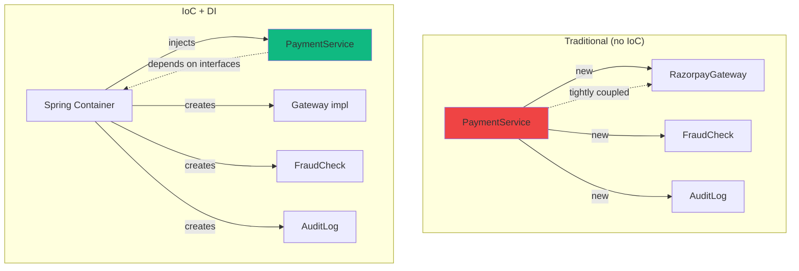

#### Interview question — Common interview question

**Q:** Constructor injection vs field injection vs setter injection — production code me kab kaunsa? Circular dependency kaise solve karoge?

> Three injection styles aur unka modern Spring (5+) me preferred ranking:
> 1) Constructor injection — DEFAULT for production. final fields, dependencies in constructor params.
> Pros:
> - Immutability — final fields can't change post-construction. Thread-safe by design.
> - Fail-fast — missing required dependency = startup failure. Caught immediately, not at runtime call.
> - Testable without Spring — just new ServiceClass(mockA, mockB). No Spring context needed for unit tests.
> - Explicit dependencies — class constructor signature shows what it depends on. Visible in code review.
> - Cyclic dependency caught — Spring can't construct circular constructor chain, errors at startup. Forces refactor.
> 2) Setter injection — for OPTIONAL dependencies.
> Pros: optional fields — service can work without them. Set after construction.
> Cons: object partially constructed period. NPE if setter not called. Less common in modern code.
> Use case: optional features. e.g., setMetricsCollector() — if not set, no-op. Most code prefers constructor with default no-op impl instead.
> 3) Field injection — AVOID in modern code, despite being common in older codebases.
> @Autowired private SomeService field — Spring uses reflection to set after construction.
> Cons:
> - Hidden dependencies — class constructor doesn't show what it needs. Code review must read full class.
> - Can't make field final — field gets reassigned via reflection.
> - Untestable without Spring — to inject mocks, need Spring test framework or reflection. Verbose.
> - Encourages bloat — easy to add another @Autowired field, classes accumulate too many dependencies.
> - IDE warnings — Spring 4.3+, IntelliJ flag this as anti-pattern.
> Why field injection 'feels' easier? It's less boilerplate. But maintainability cost real.
> Modern recommendation: ALWAYS constructor injection. Use Lombok's @RequiredArgsConstructor to eliminate boilerplate.
> Now circular dependency:
> Two beans depend on each other. ServiceA needs ServiceB, ServiceB needs ServiceA.
> Spring's behavior:
> 1) Constructor injection: BeanCurrentlyInCreationException at startup. Spring can't construct one without the other being ready. Fails immediately.
> 2) Setter/field injection: Spring 'works around' — creates partial bean, sets field later. Works but symptom of bad design.
> Why circular dependency is a code smell:
> - Indicates classes are too coupled. Single Responsibility Principle violated.
> - Hard to reason about behavior — A calls B, B calls A, infinite loop possible.
> - Hard to test — circular instances complicate setup.
> Solutions (refactoring):
> 1) Extract third class. ServiceA and ServiceB both depend on ServiceC. Common logic moves to C, A and B independent.
> 2) Combine if cohesive. If A and B are tightly related (always change together), maybe they should be ONE class.
> 3) Event-based decoupling. ServiceA emits event, ServiceB listens. No direct dependency. Spring's ApplicationEvent or message queue.
> 4) Lazy injection (workaround, not solution). @Lazy annotation creates proxy that resolves dependency on first use. Hides circular dep but doesn't fix design.
> 5) Setter injection (last resort). Sets dependencies after construction. Works around the cycle but design smell remains.
> Real production scenario: Razorpay's PaymentService and RefundService both wanted access to common audit logging logic. Earlier code had circular dep — PaymentService had RefundService, RefundService had PaymentService. Refactor: extracted AuditLogger as separate service. Now PaymentService → AuditLogger, RefundService → AuditLogger. Clean dependency tree.
> Code review red flag: any time you see @Lazy used to break a cycle, ask 'is the design wrong?'. Usually yes. Refactor instead of patch.
> [Difficulty: Hard · Asked at: Amazon, Microsoft, Atlassian, Razorpay, Goldman Sachs. Follow-ups: '@Qualifier vs @Primary?', 'How does Spring resolve auto-wiring by type?']

### Spring Beans — lifecycle & scopes

#### Kya hai? — What are Spring beans?

Spring bean — Spring container managed object. Tu @Component / @Service / @Repository / @Bean annotations se mark karta hai, Spring at startup detect karta hai, instances banata hai, lifecycle manage karta hai, aur auto-injects karta hai jaha required.

Bean is just a regular Java object — but Spring 'manages' kar raha hai. Tu khud new nahi karta. Tu reference inject karva ke use karta hai.

Bean scope: kitne instances banenge aur kab. Default singleton — ek instance, sab consumers share karte hain. Other scopes: prototype, request, session, application.

Beginner ke liye yaad rakh: 99% beans singleton. Stateless services (PaymentService, OrderRepository) singleton perfect. Stateful or per-request beans alag scope.

#### Kyun zaroori hai? — Why Spring manages beans?

Lifecycle management: Spring decides when to create (eager or lazy), when to wire dependencies, when to call init methods (@PostConstruct), when to destroy (@PreDestroy). Tu kuch nahi karta.

Caching: singleton beans ek instance, sab requests share. Memory efficient, no unnecessary object creation.

Dependency resolution: Spring sees @Component, scans for what it depends on, creates beans in correct order, wires together. Manual setup me dependency order tracking error-prone.

Configuration centralization: bean definitions one place me. application.yml + @Configuration classes. Application's structure declarative, not scattered new() calls.

Testing: bean overrides easy. Production has RealEmailService bean, test has MockEmailService bean. Same code uses 'EmailService' — Spring decides which impl injects.

#### Kaise kaam karta hai? — Bean declaration + lifecycle + scopes

Stereotype annotations declare beans:

- @Component — generic bean. Spring detects via component scan.

- @Service — semantic for business logic services. Same as @Component functionally.

- @Repository — semantic for data access. Plus exception translation (DB exceptions → Spring DataAccessException).

- @Controller / @RestController — web layer. Same as @Component plus MVC handling.

- @Configuration — class containing @Bean methods. Used for third-party libraries (no Spring annotations) you want to register.

Bean lifecycle phases:

1) Container startup → component scan finds @Component classes → bean definitions registered.

2) Eager beans (default singleton) instantiated. Lazy beans wait for first injection.

3) Constructor called → dependencies injected.

4) @PostConstruct method (if any) called — bean's own init logic.

5) Bean ready for use.

6) Container shutdown → @PreDestroy method called — cleanup.

Bean scopes:

- singleton (default): one instance per Spring container. Stateless services.

- prototype: new instance every time injected/requested. Stateful objects, per-call data.

- request: web — new bean per HTTP request.

- session: web — one per HTTP session.

- application: web — one per ServletContext.

- websocket: web — one per WebSocket session.

Common gotcha: prototype bean injected into singleton. Singleton creates wrapper proxy. Without proxy/lookup method, prototype injected once at singleton's startup — same 'prototype' reused. Use @Lookup or ObjectFactory<T> for true per-call prototype.

```java
import jakarta.annotation.*;
import org.springframework.beans.factory.annotation.*;
import org.springframework.context.annotation.*;
import org.springframework.stereotype.*;

// Stereotype annotations — different semantic, same effect
@Component  // generic
public class UtilityHelper {}

@Service    // business logic
public class PaymentService {}

@Repository // data access
public class OrderRepository {}

@RestController  // web controller
public class PaymentController {}

// Lifecycle hooks
@Service
public class CacheService {

    @PostConstruct
    public void init() {
        System.out.println("Loading cache from disk");
        // Pre-warm cache, register listeners, etc.
    }

    @PreDestroy
    public void cleanup() {
        System.out.println("Persisting cache to disk");
        // Close resources, flush state
    }
}

// @Configuration + @Bean — for third-party objects
@Configuration
public class AppConfig {

    @Bean
    public RestTemplate restTemplate() {
        // Spring detects this method, calls it once,
        // returned object becomes a singleton bean
        return new RestTemplate();
    }

    @Bean
    public DataSource dataSource(@Value("${db.url}") String url) {
        return new HikariDataSource();   // configure as needed
    }
}

// Bean scopes
@Component
@Scope("singleton")  // default — explicit for clarity
public class ConfigService {}

@Component
@Scope("prototype")  // new instance every time injected
public class RequestProcessor {
    private long createdAt = System.currentTimeMillis();
    // each injection gets fresh instance
}

@Component
@Scope(value = "request", proxyMode = ScopedProxyMode.TARGET_CLASS)
public class RequestContextHolder {
    // One instance per HTTP request
    // proxyMode required to inject into singleton
    private String correlationId;
}

// Prototype-into-singleton problem + solution
@Service
public class OrderProcessingService {

    // BAD — prototype injected once into singleton
    @Autowired
    private RequestProcessor processor;   // same instance reused

    // GOOD — fresh prototype each call
    @Autowired
    private ObjectFactory<RequestProcessor> processorFactory;

    public void processOrder(Order order) {
        RequestProcessor fresh = processorFactory.getObject();   // new instance
        fresh.process(order);
    }
}

class Order {}
class HikariDataSource implements DataSource {}
interface DataSource {}
class RestTemplate {}
```

#### Real-life example — Real-life example — Razorpay backend service hierarchy

Razorpay's payment service backend has dozens of bean types: controllers, services, repositories, gateways, validators, formatters. Spring orchestrates them all.

Approach: layered architecture. Controllers depend on services. Services depend on repositories + gateways. Repositories depend on DataSource. All wired by Spring.

Lifecycle examples: at startup, GatewayHealthChecker bean's @PostConstruct pings all gateway endpoints to verify connectivity. At shutdown, AuditFlushService's @PreDestroy ensures pending audit logs persist.

Production patterns: stateless singletons for everything. Per-request state moved to method parameters or thread-local. Avoid prototype scope unless truly needed (rare).

```java
// Razorpay-style layered bean architecture

@RestController
@RequestMapping("/api/v1/payments")
@RequiredArgsConstructor
public class PaymentController {
    private final PaymentService paymentService;   // singleton, injected
    private final RequestValidator validator;

    @PostMapping
    public ResponseEntity<PaymentResponse> create(@RequestBody PaymentRequest req) {
        validator.validate(req);
        PaymentResult result = paymentService.process(req);
        return ResponseEntity.ok(toResponse(result));
    }

    private PaymentResponse toResponse(PaymentResult r) { return null; }
}

@Service
@RequiredArgsConstructor
public class PaymentService {
    private final PaymentRepository repo;
    private final PaymentGateway gateway;
    private final FraudCheckService fraud;
    private final EventPublisher events;

    public PaymentResult process(PaymentRequest req) {
        // ... business logic
        return null;
    }
}

@Repository
@RequiredArgsConstructor
public class PaymentRepository {
    private final JdbcTemplate jdbc;

    public Payment findById(String id) {
        // ... DB query
        return null;
    }
}

// Lifecycle bean — startup health check
@Component
@RequiredArgsConstructor
@Slf4j
public class GatewayHealthChecker {
    private final List<PaymentGateway> gateways;

    @PostConstruct
    public void verifyOnStartup() {
        log.info("Verifying {} gateways", gateways.size());
        for (PaymentGateway g : gateways) {
            HealthStatus status = g.health();
            if (!"UP".equals(status.status())) {
                log.error("Gateway {} unhealthy at startup", g.getClass().getSimpleName());
            }
        }
    }
}

// Lifecycle bean — graceful shutdown
@Component
@RequiredArgsConstructor
public class AuditFlushService {
    private final AuditQueue queue;

    @PreDestroy
    public void flushOnShutdown() throws InterruptedException {
        // Drain queue before shutdown
        while (!queue.isEmpty()) {
            queue.flushBatch();
            Thread.sleep(100);
        }
    }
}

// Configuration class — third-party beans
@Configuration
public class HttpClientConfig {

    @Bean
    public RestTemplate paymentGatewayRestTemplate() {
        SimpleClientHttpRequestFactory f = new SimpleClientHttpRequestFactory();
        f.setConnectTimeout(2000);
        f.setReadTimeout(5000);
        return new RestTemplate(f);
    }

    @Bean
    @ConditionalOnProperty(name = "razorpay.gateway.enabled", havingValue = "true")
    public RazorpayGateway razorpayGateway(RestTemplate template) {
        return new RazorpayGateway(template);
    }
}

class JdbcTemplate {}
class Payment {}
class PaymentRequest {}
class PaymentResult {}
class PaymentResponse {}
interface PaymentGateway { HealthStatus health(); }
class FraudCheckService {}
class EventPublisher {}
class RequestValidator { public void validate(Object o) {} }
class AuditQueue {
    public boolean isEmpty() { return true; }
    public void flushBatch() {}
}
record HealthStatus(String status) {}
class RazorpayGateway {
    RazorpayGateway(RestTemplate t) {}
}
class RestTemplate {
    RestTemplate() {}
    RestTemplate(SimpleClientHttpRequestFactory f) {}
}
class SimpleClientHttpRequestFactory {
    public void setConnectTimeout(int t) {}
    public void setReadTimeout(int t) {}
}
```

#### Visual — Bean lifecycle phases

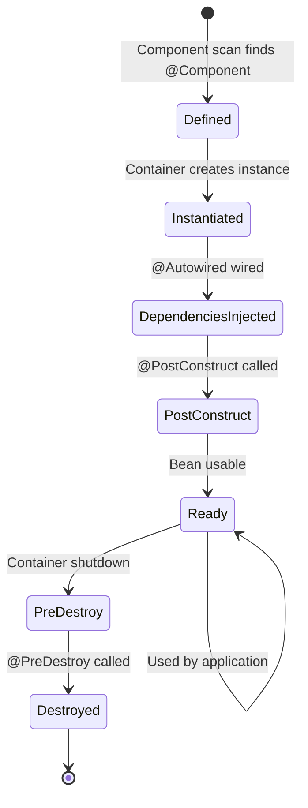

#### Interview question — Common interview question

**Q:** Bean scopes — singleton vs prototype me kya difference hai? Production me prototype scope kab use karoge? Singleton bean me thread safety kaise ensure karte hain?

> Bean scope determines kitne instances Spring container manage karta hai aur unka lifecycle.
> Singleton (default):
> - ONE instance per Spring container, application lifetime ke liye.
> - Sab consumers same instance share karte hain.
> - Spring eagerly creates at startup (unless @Lazy).
> - Memory efficient — minimal allocation.
> - Use case: stateless services. PaymentService, OrderRepository, controllers, repositories, utilities.
> Prototype:
> - New instance EVERY TIME injected/requested.
> - Spring creates the instance, but doesn't manage its destruction (you handle it).
> - Memory cost — frequent allocations.
> - Use case: rare. Stateful objects, per-operation context.
> When prototype actually makes sense:
> 1) Mutable state per usage. e.g., a builder object that accumulates state during a method call. After method, instance discarded. Each method call needs fresh state.
> 2) Non-thread-safe libraries wrapped as beans. Some legacy SDK clients are not thread-safe — prototype gives each consumer its own instance.
> 3) Stateful per-request configuration. e.g., a complex query builder being assembled across method calls within one request flow.
> Better alternatives often exist:
> - Stateful per-request: pass state as method parameter, return new state. Functional/immutable approach.
> - Per-request bean: use @Scope('request') in web context — properly managed by Spring.
> - Builder objects: just use new in method, don't make a bean. Bean overhead unnecessary for short-lived objects.
> Critical gotcha — prototype injected into singleton:
> If singleton's @Autowired field is prototype, Spring resolves once at singleton's startup. Same prototype instance reused for singleton's lifetime — defeats prototype semantics.
> Solution: inject ObjectFactory<PrototypeBean> or Provider<PrototypeBean>. Call .getObject() each time — fresh instance.
> Or @Lookup method: declare abstract method, Spring overrides at runtime to return fresh prototype.
> Now thread safety in singleton beans (CRITICAL for production):
> Since singleton is shared across all threads (every request handler may use same instance), thread safety is essential.
> Strategies:
> 1) Stateless design (BEST). No instance fields that mutate. All state in method parameters/locals. Most services should follow this. PaymentService with constructor-injected dependencies, no own mutable state.
> 2) Immutable state. Final fields, set once at construction. Configuration objects, lookup tables.
> 3) Synchronized access (when state must be mutable). synchronized methods or blocks. Performance bottleneck — every method serial. Avoid unless absolutely needed.
> 4) Concurrent collections. ConcurrentHashMap, ConcurrentLinkedQueue for shared state. Lock-free or fine-grained locking — better than blanket synchronized.
> 5) Atomic types. AtomicLong, AtomicInteger for counters. Lock-free, fast. AtomicReference<T> for swappable references.
> 6) ThreadLocal for per-thread state. Don't share across threads — each gets own copy. Common for correlation IDs, security context. CAREFUL — not garbage collected automatically, must remove() in finally block.
> 7) Immutable copies on read/write. Copy-on-write style. Read-heavy data with rare updates — Collections.unmodifiableList + AtomicReference swap.
> Anti-patterns to avoid:
> 1) Mutable instance fields in singletons without sync. Race conditions, lost updates, corrupted state.
> 2) Storing per-request state in singleton fields. e.g., currentUser field set at start of request, read at end. Two concurrent requests overwrite each other.
> 3) Mixing thread-unsafe libraries without per-thread isolation. e.g., SimpleDateFormat in singleton — NOT thread-safe. Use DateTimeFormatter (thread-safe) or ThreadLocal<SimpleDateFormat>.
> Real production scenario: Razorpay's MetricsCollector singleton. Counts API calls, payment statuses. Used AtomicLong for each counter — thread-safe increment. ConcurrentHashMap<String, AtomicLong> for per-merchant counters. Would have been a corruption bug if plain HashMap + long fields.
> Code review red flag: any singleton bean with non-final, non-thread-safe instance fields. Check if mutation happens. If yes, sync mechanism mandatory.
> [Difficulty: Hard · Asked at: Amazon, Microsoft, Atlassian, Razorpay, Goldman Sachs. Follow-ups: 'Request scope bean kaise inject karte ho singleton me?', '@Lazy aur @DependsOn kab use hote hain?']

### ApplicationContext

#### Kya hai? — What is the Spring ApplicationContext?

ApplicationContext Spring ka core IoC container hai — beans manage karta hai, dependencies wire karta hai, environment-aware configuration provide karta hai. Spring application = ApplicationContext + beans inside it.

ApplicationContext extends BeanFactory (Spring's lower-level container) and adds enterprise features: i18n message resolution, event publishing, environment abstraction, lifecycle callbacks, AOP integration.

Spring Boot apps me ApplicationContext automatically banta hai SpringApplication.run() call pe. Tu kabhi explicitly nahi banaata standard apps me — but understand karna important hai for debugging, advanced configuration.

Beginner analogy: ApplicationContext = restaurant kitchen. Sab chefs (beans), ingredients (dependencies), recipes (configuration) ek jagah managed. Order aaya — kitchen serve karti hai. Tu ingredients fetch nahi karta.

#### Kyun zaroori hai? — Why does ApplicationContext exist?

Single source of truth for beans: poori app me ek registry. 'PaymentService kahan hai?' — context ke andar. No global state scattered.

Lifecycle orchestration: beans ka order — kis sequence me create, kab init, kab destroy. Manual would be huge boilerplate.

Environment abstraction: same code different environments (dev, staging, prod) me run karta hai with different configs. Context profile activates relevant beans.

Event publishing: decoupled communication. PaymentService emits PaymentCompletedEvent — multiple listeners (audit, notification, analytics) react. Context routes events.

Bean post-processing: AOP, transactions, security — inn cross-cutting concerns ke liye Spring beans wrap karta hai with proxies. Context manages this transparently.

#### Kaise kaam karta hai? — Context types + configuration

ApplicationContext implementations:

- AnnotationConfigApplicationContext — annotation-based, modern. Default for Spring Boot.

- ClassPathXmlApplicationContext — legacy XML config (rare in new code).

- WebApplicationContext — extends with web-specific (request/session scopes).

- AnnotationConfigWebApplicationContext — modern web config.

Configuration sources:

1) Component scan — @ComponentScan('com.razorpay') auto-detects @Component, @Service, etc. in package + subpackages.

2) @Configuration classes — explicit @Bean methods.

3) @Import — combine multiple config classes.

4) application.yml/properties — externalized config injected via @Value, @ConfigurationProperties.

5) Profiles — @Profile('dev') — beans only active in matching profile.

Context hierarchy: parent-child contexts. Web app: parent = root context (services, repos), child = web context (controllers). Beans defined in parent visible to child, but not vice versa.

Spring Boot's auto-configuration adds beans based on classpath. spring-boot-starter-web adds Tomcat + DispatcherServlet beans automatically. spring-boot-starter-data-jpa adds DataSource, EntityManager. Less manual config.

Context events: ContextRefreshedEvent (startup), ContextClosedEvent (shutdown), custom application events. ApplicationEventPublisher.publishEvent() emits, @EventListener catches.

```java
import org.springframework.boot.SpringApplication;
import org.springframework.boot.autoconfigure.SpringBootApplication;
import org.springframework.context.ApplicationContext;
import org.springframework.context.annotation.*;
import org.springframework.context.event.*;

// Spring Boot — context auto-created
@SpringBootApplication
public class RazorpayApplication {
    public static void main(String[] args) {
        // SpringApplication.run() returns context for advanced inspection
        ApplicationContext context = SpringApplication.run(RazorpayApplication.class, args);

        // Inspect registered beans
        String[] beanNames = context.getBeanDefinitionNames();
        System.out.println("Total beans: " + beanNames.length);

        // Manually fetch bean (rare in normal code)
        PaymentService svc = context.getBean(PaymentService.class);

        // Get all beans of a type (multiple impls)
        Map<String, PaymentGateway> gateways = context.getBeansOfType(PaymentGateway.class);
    }
}

// Standalone @Configuration class
@Configuration
@ComponentScan(basePackages = "com.razorpay")
@PropertySource("classpath:custom.properties")
public class CustomConfig {

    @Bean
    public ObjectMapper objectMapper() {
        return new ObjectMapper().registerModule(new JavaTimeModule());
    }

    // Profile-specific bean
    @Bean
    @Profile("prod")
    public CacheService prodCache() {
        return new RedisCache();
    }

    @Bean
    @Profile("dev")
    public CacheService devCache() {
        return new InMemoryCache();
    }
}

// Custom application event
public class PaymentCompletedEvent {
    private final String paymentId;
    private final long amount;

    public PaymentCompletedEvent(String paymentId, long amount) {
        this.paymentId = paymentId;
        this.amount = amount;
    }

    public String getPaymentId() { return paymentId; }
    public long getAmount() { return amount; }
}

// Publisher — service emits event
@Service
@RequiredArgsConstructor
public class PaymentService {
    private final ApplicationEventPublisher events;

    public void processPayment(PaymentRequest req) {
        // ... business logic
        events.publishEvent(new PaymentCompletedEvent(req.getId(), req.getAmount()));
    }
}

// Listener 1 — audit
@Component
public class PaymentAuditListener {
    @EventListener
    public void onPaymentCompleted(PaymentCompletedEvent event) {
        System.out.println("Audit: payment " + event.getPaymentId());
    }
}

// Listener 2 — notification (independent)
@Component
public class NotificationListener {
    @EventListener
    @Async   // run in separate thread, doesn't block payment flow
    public void onPaymentCompleted(PaymentCompletedEvent event) {
        System.out.println("Notification: ₹" + event.getAmount());
    }
}

// Listener for context lifecycle
@Component
public class StartupListener {
    @EventListener(ContextRefreshedEvent.class)
    public void onStartup() {
        System.out.println("App started, all beans ready");
    }

    @EventListener(ContextClosedEvent.class)
    public void onShutdown() {
        System.out.println("App shutting down");
    }
}

class ObjectMapper {
    public ObjectMapper registerModule(Object m) { return this; }
}
class JavaTimeModule {}
interface CacheService {}
class RedisCache implements CacheService {}
class InMemoryCache implements CacheService {}
class PaymentRequest {
    public String getId() { return ""; }
    public long getAmount() { return 0L; }
}
interface PaymentGateway {}
```

#### Real-life example — Real-life example — Multi-module Razorpay backend

Razorpay backend modular hai — payment-core, refund-service, settlement-service, audit-module, etc. Each module has own beans. ApplicationContext manages cross-module wiring.

Approach: each module ek @Configuration class export karta hai. Main app's @SpringBootApplication imports them. Beans wire across modules via interfaces (PaymentGateway, AuditLogger).

Profile-based config powerful: dev profile uses in-memory beans (fast tests). Staging uses Razorpay's test environment. Production uses real services + Vault credentials. Same code, different ApplicationContext composition.

Event-driven design: payment-core emits events. Refund-service, audit-module, analytics listen — but have ZERO compile-time dependency on payment-core. Loose coupling, independent deployments.

```java
// Module-level configuration classes

// payment-core/PaymentCoreConfig.java
@Configuration
@ComponentScan("com.razorpay.payment.core")
public class PaymentCoreConfig {
    @Bean
    public PaymentValidator validator() {
        return new PaymentValidator();
    }
}

// audit-module/AuditConfig.java
@Configuration
@ComponentScan("com.razorpay.audit")
@EnableAsync   // for @Async listeners
public class AuditConfig {
    @Bean
    public AuditLogger auditLogger(KafkaTemplate kafka) {
        return new KafkaAuditLogger(kafka);
    }
}

// Main app — composes modules
@SpringBootApplication
@Import({
    PaymentCoreConfig.class,
    AuditConfig.class,
    SettlementConfig.class,
    SecurityConfig.class
})
public class RazorpayApp {
    public static void main(String[] args) {
        SpringApplication.run(RazorpayApp.class, args);
    }
}

// Profile-aware beans
@Configuration
public class DataSourceConfig {

    @Bean
    @Profile("dev")
    public DataSource devDataSource() {
        // H2 in-memory
        return new HikariDataSource(/* h2 config */);
    }

    @Bean
    @Profile("prod")
    public DataSource prodDataSource(VaultClient vault) {
        // Postgres with Vault-managed credentials
        DataSource ds = new HikariDataSource(/* postgres */);
        // Setup credential rotation
        return ds;
    }

    @Bean
    @Profile("test")
    public DataSource testDataSource() {
        // Testcontainers Postgres
        return new HikariDataSource(/* testcontainers */);
    }
}

// Event-driven cross-module decoupling

// payment-core emits events
@Service
@RequiredArgsConstructor
public class PaymentService {
    private final ApplicationEventPublisher events;
    private final PaymentValidator validator;

    public void processPayment(PaymentRequest req) {
        validator.validate(req);
        // ... process
        events.publishEvent(new PaymentCompletedEvent(req.getId()));
    }
}

// audit-module listens (no compile-time dependency on payment-core's class)
@Component
@RequiredArgsConstructor
public class AuditEventHandler {
    private final AuditLogger logger;

    @EventListener
    @Async
    public void on(PaymentCompletedEvent event) {
        logger.log("PAYMENT_COMPLETED", event.getPaymentId());
    }
}

// settlement-service also listens, independently
@Component
@RequiredArgsConstructor
public class SettlementSchedulingHandler {
    private final SettlementQueue queue;

    @EventListener
    public void on(PaymentCompletedEvent event) {
        queue.scheduleSettlement(event.getPaymentId());
    }
}

class PaymentValidator { void validate(Object o) {} }
class KafkaTemplate {}
class KafkaAuditLogger implements AuditLogger {
    KafkaAuditLogger(KafkaTemplate t) {}
    public void log(String event, String id) {}
}
class SettlementConfig {}
class SecurityConfig {}
interface DataSource {}
class HikariDataSource implements DataSource {}
class VaultClient {}
class PaymentRequest { String getId() { return ""; } }
class PaymentCompletedEvent {
    PaymentCompletedEvent(String id) {}
    public String getPaymentId() { return ""; }
}
interface AuditLogger { void log(String event, String id); }
class SettlementQueue { void scheduleSettlement(String id) {} }
```

#### Visual — ApplicationContext loading flow

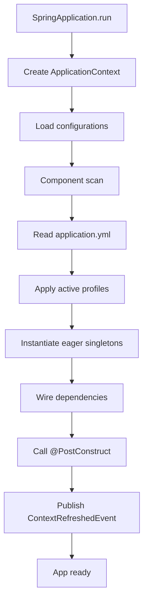

#### Interview question — Common interview question

**Q:** BeanFactory vs ApplicationContext me kya difference hai? Spring Boot startup pe ApplicationContext me kya hota hai step by step?

> BeanFactory aur ApplicationContext dono Spring containers hain — both manage beans. Difference scope and features ka hai.
> BeanFactory:
> - Lower-level container. Spring's foundational interface for bean management.
> - Lazy initialization by default — beans created when first requested via getBean().
> - Minimal feature set: bean definitions, basic dependency injection, lifecycle.
> - Memory-efficient — useful for resource-constrained environments (rare modern use case).
> - Limited integration with enterprise features.
> ApplicationContext:
> - Extends BeanFactory + adds enterprise features.
> - Eager initialization by default (singletons created at startup).
> - Features:
>   1) Internationalization (i18n) — MessageSource for locale-aware text.
>   2) Event publishing — ApplicationEvent + @EventListener.
>   3) Resource loading — Resource abstraction for files, classpath, URLs.
>   4) Environment abstraction — profiles, property sources.
>   5) AOP integration — proxy creation for transactions, security.
>   6) Lifecycle callbacks — ContextRefreshedEvent, ContextClosedEvent.
> Production usage: ApplicationContext is the standard. BeanFactory is foundational interface — almost never directly instantiated. Spring Boot uses ApplicationContext (specifically AnnotationConfigApplicationContext or AnnotationConfigServletWebServerApplicationContext for web).
> Now Spring Boot startup sequence (ApplicationContext lifecycle):
> 1) main() calls SpringApplication.run(MyApp.class, args).
> 2) SpringApplication object created. Defaults set: log banner, exit code generators, listeners.
> 3) ApplicationStartingEvent fired — earliest event, before context creation.
> 4) Environment prepared:
>    - System properties, env vars loaded.
>    - application.yml / application.properties read.
>    - --spring.profiles.active argument processed.
>    - ConfigurableEnvironment populated. Profile activation decided.
> 5) ApplicationEnvironmentPreparedEvent fired.
> 6) ApplicationContext created (AnnotationConfigApplicationContext for non-web, web variant otherwise).
> 7) ApplicationContextInitializers applied — last chance to customize before refresh.
> 8) ApplicationContextInitializedEvent fired.
> 9) Bean definitions loaded:
>    - @SpringBootApplication entry point processed.
>    - Component scan finds @Component, @Service, @Repository, @RestController, @Configuration.
>    - @Configuration classes processed — @Bean methods registered as bean definitions.
>    - Auto-configurations from spring-boot-starter-* JARs applied (conditional based on classpath).
> 10) ApplicationPreparedEvent fired.
> 11) Context refresh — the BIG step:
>     a) BeanFactoryPostProcessors run — modify bean definitions before instantiation.
>     b) BeanPostProcessors registered — wrap beans with proxies as needed.
>     c) ApplicationContext-specific BeanPostProcessors registered.
>     d) Internationalization, event multicaster initialized.
>     e) Singleton beans instantiated:
>        - Constructor called with auto-wired dependencies.
>        - Setter injections (if any) applied.
>        - BeanPostProcessors' postProcessBeforeInitialization() run.
>        - @PostConstruct methods called.
>        - InitializingBean.afterPropertiesSet() if implemented.
>        - Custom init-method (declared in @Bean(initMethod=...)) called.
>        - BeanPostProcessors' postProcessAfterInitialization() run.
>        - This is where AOP proxies wrap the bean (transactions, security).
>     f) ContextRefreshedEvent published — beans ready, app starting.
> 12) Web server started (if web app) — Tomcat/Jetty embedded server starts on configured port.
> 13) ApplicationStartedEvent fired.
> 14) ApplicationRunner / CommandLineRunner beans run (custom startup logic).
> 15) ApplicationReadyEvent fired — app fully ready to handle requests.
> On shutdown (SIGTERM, JVM exit):
> 1) ContextClosedEvent fired.
> 2) Singletons destroyed in reverse order:
>    - @PreDestroy methods called.
>    - DisposableBean.destroy() if implemented.
>    - Custom destroy-method called.
> 3) BeanFactory closed.
> 4) JVM exits.
> Production debugging tip: enable DEBUG logging for org.springframework — see entire startup sequence in logs. Slow startups often due to specific bean initialization. Spring Boot's actuator /beans endpoint shows runtime context state.
> Common startup issues: bean creation cycles, missing required beans (UnsatisfiedDependencyException), property resolution failures, port conflicts. Stack trace usually points to the failing bean — start there.
> [Difficulty: Hard · Asked at: Amazon, Atlassian, Razorpay, Microsoft. Follow-ups: 'BeanPostProcessor kab use hota hai?', 'Spring Boot ki ApplicationStartedEvent vs ApplicationReadyEvent me kya fark hai?']

## Spring Boot fundamentals

### Auto-configuration

#### Kya hai? — What is auto-configuration?

Spring Boot ka auto-configuration basically tujhe XML-hell se bachata hai. Pehle har Spring project me hundreds of lines of XML config likhna padta tha — DataSource, EntityManager, TransactionManager, sab manually wire karna padta tha. Auto-configuration ne ye sab khatam kar diya.

Idea simple hai: Spring Boot dekh leta hai tumhare classpath pe kya kya jars hain. JDBC driver mila? Auto-configure DataSource. Tomcat starter mila? Auto-configure embedded server. Hibernate mila? JPA setup ready. Tu kuch nahi karta — Spring khud sambhal leta hai.

Beginner ke liye sabse important: tu sirf @SpringBootApplication annotation lagaata hai aur 90% cases me bina kuch likhe app run kar leta hai.

#### Kyun zaroori hai? — Why does auto-configuration exist?

Pehle Spring framework me ek simple Hello World REST API banane ke liye 5-6 XML files likhni padti thi. ApplicationContext.xml me beans declare karo, web.xml me servlets configure karo, dispatcher-servlet.xml me view resolvers... Boring tha aur error-prone bhi. Ek typo aur app start nahi hota.

Auto-configuration ne 'convention over configuration' approach diya. Spring assume karta hai sensible defaults, aur tu sirf tab override karta hai jab specific custom behavior chahiye.

Result: 50 lines of XML jo pehle likhni padti thi, ab @SpringBootApplication ka ek annotation kaafi hai. Productivity 10x ho gayi.

#### Kaise kaam karta hai? — How does it actually work?

Auto-configuration ka core @EnableAutoConfiguration annotation me hai (jo @SpringBootApplication ke andar built-in hai). Spring Boot startup pe ye karta hai:

1. Classpath scan — kaunse jars available hain check karta hai. 2. AutoConfiguration.imports file read karta hai jo har starter me hoti hai aur auto-configure classes list karti hai. 3. Har auto-configure class pe @ConditionalOnClass, @ConditionalOnMissingBean jaisi conditions check karta hai. 4. Conditions match hone par beans create karta hai.

Practical example le. Tune spring-boot-starter-data-jpa add kiya pom.xml me. Spring Boot ne dekha — Hibernate jar classpath me hai, JDBC URL configured hai, user ne apna custom DataSource bean nahi banaya. Conditions match — Spring Boot khud HikariDataSource, EntityManagerFactory, TransactionManager, sab beans bana deta hai.

Common gotcha: kabhi sochta hai 'ye bean kahan se aaya?' — log level DEBUG kar de aur 'CONDITIONS EVALUATION REPORT' milega jo bata dega kaunsa auto-config evaluate hua aur kyu match/mismatch hua.

```java
// Bas itna — Spring Boot ke andar 100+ auto-configurations evaluate hote hain
@SpringBootApplication
public class OrderServiceApplication {
    public static void main(String[] args) {
        // SpringApplication.run() classpath scan karke
        // sab applicable beans wire kar deta hai
        SpringApplication.run(OrderServiceApplication.class, args);
    }
}

// @SpringBootApplication = @Configuration + @EnableAutoConfiguration + @ComponentScan
// teen alag annotations ka shortcut hai
```

#### Real-life example — Real-life example — Razorpay payment service

Socho tu Razorpay ka payment-service bana raha hai. Tujhe chahiye: HTTP endpoints, PostgreSQL connectivity, Redis caching, Kafka events, health checks. Bina Spring Boot ke ye sab manually wire karne me 200+ lines of config aati.

Spring Boot ke saath? application.yml me 15-20 lines plus pom.xml me 5 starter dependencies. App run kar do — sab kuch ready. Tu sirf business logic likhta hai (PaymentController, PaymentService), infra Spring sambhalta hai.

Production me jab traffic spike aata hai aur tu connection pool tune karna chahta hai? application.properties me 1 line: spring.datasource.hikari.maximum-pool-size=50. Auto-config ne HikariDataSource banaya tha, ab tune kar liya. Override transparent hai.

```yaml
# application.yml — auto-config ko sirf credentials chahiye
spring:
  datasource:
    url: jdbc:postgresql://db.internal:5432/payments
    username: razorpay
    # Spring Boot khud HikariDataSource bana ke pool manage karta hai
  data:
    redis:
      host: redis.internal
      # RedisTemplate auto-wired ho jaata hai
  kafka:
    bootstrap-servers: kafka.internal:9092
    # KafkaTemplate aur listener container auto-configured

management:
  endpoints:
    web:
      exposure:
        include: health,metrics,info
# /actuator/health endpoint instantly available
```

#### Visual — Auto-configuration flow

```mermaid
flowchart LR
    A[App starts] --> B[@SpringBootApplication detected]
    B --> C[Classpath scan]
    C --> D[Read AutoConfiguration.imports]
    D --> E{Conditions match?}
    E -- Yes --> F[Create beans]
    E -- No --> G[Skip class]
    F --> H[App ready]
    G --> H
```

#### Interview question — Common interview question

**Q:** Spring Boot auto-configuration kaise kaam karta hai? Production me ek scenario bata jab tu auto-config disable karega.

> Auto-configuration Spring Boot ka core feature hai. Mechanism samajh — startup pe Spring Boot do cheezein check karta hai: classpath pe kaunse jars available hain, aur har auto-config class pe lagi @Conditional annotations.
> Practical flow: tu @SpringBootApplication lagaata hai jo internally @EnableAutoConfiguration include karta hai. Ye Spring Boot ko bolta hai — META-INF/spring/org.springframework.boot.autoconfigure.AutoConfiguration.imports me listed sab classes load karo. Har class pe conditions hote hain — agar Hibernate classpath me hai aur user ne apna EntityManagerFactory nahi banaya, to JpaAutoConfiguration kick in karta hai.
> Production me auto-config disable karne ka realistic scenario: tu Vault-managed credentials use kar raha hai jo runtime me rotate hote hain. Default DataSourceAutoConfiguration se Vault integration nahi hota. Tu @EnableAutoConfiguration(exclude = DataSourceAutoConfiguration.class) lagaata hai aur apna custom DataSource bean banata hai jo VaultTemplate se credentials fetch karta hai.
> Ek aur scenario — testing me. Integration test me tu in-memory H2 chahta hai but production config Postgres pakad raha hai. @SpringBootTest ke saath @AutoConfigureTestDatabase use karke specific auto-configs override karte hain.
> Common follow-ups: '@ConditionalOnMissingBean kab use karte ho?', 'Custom auto-configuration kaise banayein?', 'spring-boot-actuator ke /conditions endpoint kya batata hai?' — Asked at TCS, Infosys, Razorpay, Amazon. Difficulty: Medium.

### Starters & dependencies

#### Kya hai? — What are Spring Boot starters?

Starters basically curated dependency bundles hain. Ek convenient package jisme ek specific feature ke liye saare jars pre-packaged hote hain — compatible versions ke saath, transitive dependencies handled, sab ready-to-use.

Naming convention strict hai: spring-boot-starter-* format. Jaise spring-boot-starter-web (REST APIs ke liye), spring-boot-starter-data-jpa (database ke liye), spring-boot-starter-security (auth ke liye), spring-boot-starter-test (testing ke liye).

Tu apne pom.xml me ek starter add karta hai — pichhe se 10-20 jars compatible versions ke saath aa jaate hain. Tu version conflicts ka headache bhi nahi sambhalta.

#### Kyun zaroori hai? — Why starters exist — dependency hell se bachao

Pehle Spring project me agar tujhe Hibernate use karna hai, tujhe ye sab manually pom.xml me daalna padta tha: hibernate-core, hibernate-validator, jakarta.persistence-api, javax.transaction-api, plus DataSource library, plus connection pool. Aur har version manually compatible select karna padta tha — agar Hibernate 6.x hai to validator 8.x chahiye, etc.

Version mismatch = NoClassDefFoundError, ClassCastException, ya MethodNotFoundException production me. Ek dev ne dependency upgrade kiya, doosre dev ka code break ho gaya. 'JAR hell' bola jaata tha.

Starters ne ye solve kiya — Spring team curate karti hai compatible versions. Tu spring-boot-starter-data-jpa add karta hai, sab 12 transitive jars ek-doosre ke saath tested hain. Update karte time bas Spring Boot version bump kar — sab transitives update ho jaate hain.

#### Kaise kaam karta hai? — How to use starters

Maven me bas dependency add kar — version mat de (Spring Boot parent pom version manage karta hai). Gradle me 'implementation' use kar.

Important hierarchy: tu spring-boot-starter-parent ko apne parent pom me set karta hai. Ye parent dependency-management, plugin-management, sensible defaults sab provide karta hai. Iske bina tujhe har dependency ka version manually likhna padega.

Custom starter bhi bana sakta hai — agar tu organization me 5 microservices bana raha hai jo same logging/metrics/security setup share karte hain, ek company-internal-starter bana le. Saare microservices is starter ko import kar lenge, consistent infra mil jayega.

Common starters jaanna zaroori hai: -web (REST + Tomcat), -webflux (reactive), -data-jpa (Hibernate + JPA), -data-mongodb, -data-redis, -security, -oauth2-resource-server, -test, -actuator, -validation.

```xml
<!-- pom.xml — minimal Spring Boot REST + DB project -->
<parent>
    <groupId>org.springframework.boot</groupId>
    <artifactId>spring-boot-starter-parent</artifactId>
    <version>3.3.0</version>
</parent>

<dependencies>
    <!-- REST APIs + embedded Tomcat — ek starter, sab ready -->
    <dependency>
        <groupId>org.springframework.boot</groupId>
        <artifactId>spring-boot-starter-web</artifactId>
    </dependency>

    <!-- JPA + Hibernate + transactions, version Spring Boot manage karega -->
    <dependency>
        <groupId>org.springframework.boot</groupId>
        <artifactId>spring-boot-starter-data-jpa</artifactId>
    </dependency>

    <!-- PostgreSQL driver — ye Spring ka nahi, but version still managed -->
    <dependency>
        <groupId>org.postgresql</groupId>
        <artifactId>postgresql</artifactId>
        <scope>runtime</scope>
    </dependency>

    <!-- Testing — JUnit 5, Mockito, AssertJ, Spring test, sab ek bundle me -->
    <dependency>
        <groupId>org.springframework.boot</groupId>
        <artifactId>spring-boot-starter-test</artifactId>
        <scope>test</scope>
    </dependency>
</dependencies>
```

#### Real-life example — Real-life example — Swiggy delivery service

Swiggy ka delivery-tracking microservice hai jo real-time location updates handle karta hai. Stack chahiye: WebSocket support, Redis for caching, MongoDB for trip history, security for partner auth, observability for SLO monitoring.

Manually setup kiya jaaye to 25+ dependencies, sab versions manually compatible. Starters ke saath 6 starters add karo — sab handled. Ye kaam 10 minutes me ho jaata hai jo pehle 2-3 ghante leta tha.

Production tip: agar tu dependency tree dekhna chahta hai (kaun-kaunse transitive jars aaye), 'mvn dependency:tree' run kar. Surprise milte hain — ek starter andar se 20-30 jars include kar leta hai. Audit ke liye useful, kabhi-kabhi unused transitive ko exclude bhi karte hain.

```xml
<!-- 6 starters cover the entire Swiggy delivery-tracking stack -->
<dependencies>
    <dependency>
        <artifactId>spring-boot-starter-websocket</artifactId>
    </dependency>
    <dependency>
        <artifactId>spring-boot-starter-data-redis</artifactId>
    </dependency>
    <dependency>
        <artifactId>spring-boot-starter-data-mongodb</artifactId>
    </dependency>
    <dependency>
        <artifactId>spring-boot-starter-oauth2-resource-server</artifactId>
    </dependency>
    <dependency>
        <artifactId>spring-boot-starter-actuator</artifactId>
        <!-- /metrics, /health, /prometheus endpoints free -->
    </dependency>
    <dependency>
        <artifactId>spring-boot-starter-validation</artifactId>
    </dependency>
</dependencies>
```

#### Visual — Starter dependency expansion

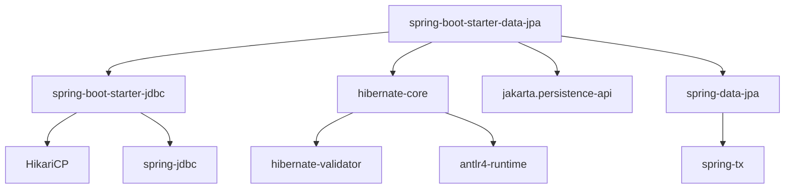

#### Interview question — Common interview question

**Q:** Spring Boot starter aur regular Maven dependency me kya farak hai? Custom starter kab banayega tu apne org me?

> Difference samajh: regular Maven dependency ek single jar artifact hai. Starter ek 'meta-dependency' hai jo khud kuch code provide nahi karta — sirf POM me curated transitive dependencies aur version-management metadata declare karta hai.
> spring-boot-starter-data-jpa ka apna code zero hai. Wo internally 12+ jars (hibernate-core, spring-data-jpa, jakarta.persistence-api, etc.) ko apne POM me list karta hai with tested-compatible versions. Tu ek line lagata hai, 12 jars aate hain.
> Custom starter banane ka realistic scenario org-internal: maan le tu Razorpay me 8 microservices maintain karta hai. Sab me same logging format, same Prometheus metrics, same Vault credential rotation, same correlation-id middleware chahiye. Har service me ye repeat karna painful hai.
> Tu ek razorpay-platform-starter banata hai. Iske POM me spring-boot-starter-actuator + micrometer-registry-prometheus + custom auto-configuration class jo VaultClient, LoggingFilter, CorrelationIdInterceptor beans wire karti hai. Saari 8 services bas ek dependency add karti hain — consistent infra mil jaata hai.
> Implementation pattern: starter ke andar src/main/resources/META-INF/spring/org.springframework.boot.autoconfigure.AutoConfiguration.imports file create kar jisme tera @AutoConfiguration class listed ho. Spring Boot startup pe usse pakad lega.
> Asked at: Razorpay, Flipkart, Amazon. Follow-ups: 'Starter aur autoconfigure module ko alag jars me kyu rakhte hain?', 'Spring Boot BOM kya hai?'

### Application properties

#### Kya hai? — What is application.properties / application.yml?

Application configuration file hai jisme tu apne Spring Boot app ke saare environment-specific settings rakhta hai — database URL, server port, log levels, feature flags, third-party API keys, sab kuch.

Two formats supported: application.properties (key=value) ya application.yml (YAML hierarchy). YAML usually cleaner hota hai jab nesting hoti hai. Functionality dono me same hai.

Important property hai 'externalized configuration' ki — code change kiye bina different environments (dev, staging, prod) me different values inject kar sakta hai.

#### Kyun zaroori hai? — Why externalize configuration?

Production-grade app me database URL, secrets, feature flags hardcode karna disaster hai. Dev me 'localhost', staging me 'staging.db', prod me 'prod.db' — agar tu code me likhega to har env ke liye alag JAR build karna padega. Yuck.

Ek aur problem: secrets rotate hote hain. Agar password code me hai aur leak hua, sab repos me leak ho gaya — git history forever me hai. Externalized config se tu prod password Vault/AWS Secrets Manager me rakh ke runtime me inject karta hai.

Spring Boot ka twelve-factor compatibility iska hi extension hai — config strict alag se environment se aata hai. App container immutable rehta hai.

#### Kaise kaam karta hai? — How property resolution works

Spring Boot multiple sources se properties read karta hai, with priority order. High to low: command-line arguments > environment variables > application-{profile}.yml > application.yml > defaults. Higher priority lower ko override karta hai.

Profiles ka use case: dev me embedded H2 chahiye, prod me PostgreSQL. Tu application.yml me defaults rakh, application-dev.yml me dev overrides, application-prod.yml me prod overrides. Run karte time SPRING_PROFILES_ACTIVE=prod set kar de — Spring Boot prod profile load karega.

Properties read karne ke 3 ways: @Value('${prop.name}') for single value injection, @ConfigurationProperties(prefix='app') for typed config classes (preferred), Environment env injection for programmatic access.

Type-safe @ConfigurationProperties best practice hai — refactoring safe, validation possible, IDE autocomplete works. Plain @Value strings mein chhoti typo bhi runtime me crash karayegi.

```java
// application.yml me ye properties hain:
//   payment:
//     gateway:
//       url: https://api.razorpay.com
//       timeout-seconds: 30
//       max-retries: 3

// Type-safe config — recommended
@ConfigurationProperties(prefix = "payment.gateway")
@Validated
public record PaymentGatewayConfig(
    @NotBlank String url,
    @Min(1) @Max(120) int timeoutSeconds,
    @Min(0) @Max(10) int maxRetries
) {}

// Service me direct inject — fully typed
@Service
public class PaymentService {
    private final PaymentGatewayConfig config;

    // Constructor injection — Spring khud wire karta hai
    public PaymentService(PaymentGatewayConfig config) {
        this.config = config;
    }

    public void charge(Order order) {
        // config.url() type-safe hai, IDE autocomplete works
        var client = HttpClient.newBuilder()
            .connectTimeout(Duration.ofSeconds(config.timeoutSeconds()))
            .build();
        // ...
    }
}
```

#### Real-life example — Real-life example — multi-environment Flipkart catalog service

Flipkart ka catalog-search-service different environments me run hota hai — dev (developer laptop), staging (pre-prod), prod-canary (10% traffic), prod-main. Har env me different DB, different cache, different log level chahiye.

Approach: ek base application.yml me defaults, fir application-dev.yml, application-staging.yml, application-prod.yml me env-specific overrides. Deployment pipeline SPRING_PROFILES_ACTIVE env variable set karti hai.

Secrets prod me Hashicorp Vault se aate hain — Spring Cloud Vault integration use hota hai. application-prod.yml me sirf vault path likha hota hai, actual credentials runtime me fetch hote hain. Agar koi engineer accidentally git me kuch commit karta hai, prod secrets safe hain.

```yaml
# application.yml — defaults (sab envs me apply)
server:
  port: 8080
spring:
  application:
    name: catalog-search-service
logging:
  level:
    root: INFO

---
# application-dev.yml — dev overrides
spring:
  config:
    activate:
      on-profile: dev
  datasource:
    url: jdbc:h2:mem:catalog
logging:
  level:
    com.flipkart.catalog: DEBUG  # extra logs in dev

---
# application-prod.yml — prod overrides
spring:
  config:
    activate:
      on-profile: prod
  datasource:
    # Vault se inject hota hai runtime me
    url: ${vault.db.url}
    username: ${vault.db.username}
    password: ${vault.db.password}
  cloud:
    vault:
      uri: https://vault.flipkart.internal
      token: ${VAULT_TOKEN}
logging:
  level:
    root: WARN  # noise kam, signal zyada
```

#### Visual — Property resolution priority

```mermaid
flowchart TD
    A[Application starts] --> B[Read application.yml defaults]
    B --> C[Read application-{profile}.yml]
    C --> D[Read environment variables]
    D --> E[Read command-line args]
    E --> F[Resolve placeholders]
    F --> G[Inject into beans]
    style D fill:#a78bfa
    style E fill:#06b6d4
```

#### Interview question — Common interview question

**Q:** @Value vs @ConfigurationProperties — production grade code me kaunsa prefer karega aur kyu? Property resolution order kya hai?

> @ConfigurationProperties prefer karna chahiye production code me, multiple solid reasons ke liye.
> First, type safety. @Value('${app.timeout}') string-based hai — agar tu typo karta hai 'app.timoeut', compile time pe nahi pakda jaata, runtime me NullPointerException ya weird behavior. @ConfigurationProperties me record/class fields type-checked hain, IDE autocomplete works, refactoring rename safe.
> Second, validation. @ConfigurationProperties pe Bean Validation annotations (@NotBlank, @Min, @Max) lag sakti hain. Agar prod me galat config aaya — for example timeout=-5 — app boot pe hi fail karta hai with clear error. @Value silently galat value le leta hai aur prod me weird bug aata hai.
> Third, grouping aur testability. Related config ek class me group karna logical hai. Test me tu @ConfigurationProperties class ko mock kar sakta hai, ya @TestConfiguration me override kar sakta hai. @Value scattered remains across services.
> Fourth, IDE support. IntelliJ/VSCode @ConfigurationProperties detect karte hain aur application.yml me autocomplete dete hain. @Value me ye nahi hota.
> Property resolution order — Spring Boot multiple sources se properties merge karta hai with priority. High to low: 1) command-line arguments (--server.port=9090), 2) JNDI attributes, 3) Java System properties (-Dserver.port), 4) OS environment variables (SERVER_PORT), 5) application-{profile}.yml/properties, 6) application.yml/properties, 7) @PropertySource annotations, 8) Default properties via SpringApplication.setDefaultProperties().
> Higher priority lower ko override karta hai. Production deployment me typically env variables se sensitive config inject karte hain (12-factor compliant). Asked at: Amazon, Microsoft, Razorpay, Atlassian. Follow-ups: 'Profile-specific config files ka resolution kaise hota hai?', 'Spring Cloud Config server kab use karte ho?'

### Profiles (dev, staging, prod)

#### Kya hai? — What are Spring profiles?

Profiles Spring ka mechanism hai different environments (dev, staging, prod, test) ke liye different beans + configuration activate karne ka. Same JAR — different profile selected → different runtime behavior.

Use cases: dev me H2 in-memory DB + verbose logging, prod me PostgreSQL + Vault credentials + minimal logging. Code zero changes, profile flag me change.

Activation: --spring.profiles.active=prod CLI flag, SPRING_PROFILES_ACTIVE env variable, spring.profiles.active in application.properties. Multiple profiles comma-separated.

Beginner ke liye yaad rakh: profiles 12-factor app principles ke aligned hain — same code, env-specific config externalized. Production deployment me critical.

#### Kyun zaroori hai? — Why profiles matter?

Single artifact deployment: ek hi JAR build karte ho. Same JAR dev, staging, prod me deploy hota hai. Profile decides behavior. No 'works on my machine' — bit-identical artifact moves through environments.

Sensible defaults + overrides: application.yml me defaults, application-{profile}.yml me overrides. Properties hierarchically merged.

Environment isolation: prod credentials accidentally dev me na chale jaayein. Profile-gated config — prod-only beans (Vault integration, real payment gateway) sirf prod me load.

Testing: @ActiveProfiles('test') in integration tests forces test config. Real DB connections nahi, mock services activate.

#### Kaise kaam karta hai? — Profile usage patterns

Profile-specific properties files: application-dev.yml, application-prod.yml, application-test.yml. Spring auto-loads based on active profile.

@Profile annotation on beans: @Profile('prod') public DataSource prodDataSource() — bean only active in prod profile.

Multi-profile activation: spring.profiles.active=prod,asia-region — ANDed activation. @Profile('prod & asia-region') for combined gate.

Negation: @Profile('!prod') — active in everything except prod. Useful for dev-only debugging tools.

Profile groups (Spring Boot 2.4+): spring.profiles.group.production=prod-config,prod-monitoring,prod-security. One activation triggers multiple sub-profiles.

Common patterns: 'cloud' profile for AWS/GCP-specific beans. 'feature-x-enabled' for feature flags. 'demo' for demo mode with seeded data.

Production gotcha: never default @Profile('!prod') beans to be active in prod. If profile not set in prod config, it falls into '!prod' bucket and dev tools activate. Always explicitly set spring.profiles.active in production deployment.

```yaml
# application.yml — defaults shared across all profiles
server:
  port: 8080
spring:
  application:
    name: razorpay-payment-service
  datasource:
    hikari:
      maximum-pool-size: 10
logging:
  level:
    root: INFO
    com.razorpay: INFO

---
# application-dev.yml — dev overrides
spring:
  config:
    activate:
      on-profile: dev
  datasource:
    url: jdbc:h2:mem:payments
    driver-class-name: org.h2.Driver
    username: sa
    password:
  h2:
    console:
      enabled: true
logging:
  level:
    com.razorpay: DEBUG          # verbose for debugging
    org.springframework.web: DEBUG
debug: true

---
# application-staging.yml
spring:
  config:
    activate:
      on-profile: staging
  datasource:
    url: jdbc:postgresql://staging-db.internal:5432/payments
    username: ${DB_USER}
    password: ${DB_PASSWORD}
logging:
  level:
    com.razorpay: INFO

---
# application-prod.yml
spring:
  config:
    activate:
      on-profile: prod
  datasource:
    url: ${vault.db.url}        # Vault-injected
    username: ${vault.db.username}
    password: ${vault.db.password}
    hikari:
      maximum-pool-size: 50      # higher for prod load
  cloud:
    vault:
      uri: https://vault.razorpay.internal
logging:
  level:
    root: WARN                   # signal-to-noise ratio
    com.razorpay.audit: INFO
management:
  endpoints:
    web:
      exposure:
        include: health,metrics,info,prometheus
```

#### Real-life example — Real-life example — Razorpay payment gateway selection per environment

Razorpay's payment service deployment: dev me fake payment gateway (always succeed), staging me Razorpay's test environment (real flows but no real money), prod me real gateway with real money.

Approach: PaymentGateway interface + 3 implementations annotated with @Profile. Spring auto-wires correct one based on active profile.

Production benefit: integration tests in CI use FakeGateway — zero external dependencies, super fast. Manual QA in staging tests real flows safely. Production deploys zero-config — profile activation does the work.

Audit benefit: prod deployment me FakeGateway accidentally inject nahi ho sakti. @Profile('!prod') gates dev/staging-only beans firmly.

```java
// PaymentGateway interface — same contract everywhere
public interface PaymentGateway {
    PaymentResponse charge(ChargeRequest req);
}

// Dev profile — no external calls
@Component
@Profile("dev")
@Slf4j
public class FakePaymentGateway implements PaymentGateway {
    @Override
    public PaymentResponse charge(ChargeRequest req) {
        log.info("[DEV] Fake charging ₹{}", req.amount() / 100);
        return PaymentResponse.success("fake_txn_" + UUID.randomUUID());
    }
}

// Staging — Razorpay test environment
@Component
@Profile("staging")
public class RazorpayTestGateway implements PaymentGateway {
    private final RestTemplate http;
    private final String testApiKey;

    public RazorpayTestGateway(RestTemplate http,
                                @Value("${razorpay.test.api-key}") String testApiKey) {
        this.http = http;
        this.testApiKey = testApiKey;
    }

    @Override
    public PaymentResponse charge(ChargeRequest req) {
        // Hits api.razorpay.com but in test mode (no real money)
        return http.postForObject("https://api.razorpay.com/v1/payments",
                                   req, PaymentResponse.class);
    }
}

// Prod — real money flow
@Component
@Profile("prod")
public class RazorpayProductionGateway implements PaymentGateway {
    private final RestTemplate http;
    private final VaultClient vault;

    public RazorpayProductionGateway(RestTemplate http, VaultClient vault) {
        this.http = http;
        this.vault = vault;
    }

    @Override
    public PaymentResponse charge(ChargeRequest req) {
        // Vault-managed credentials
        String apiKey = vault.getSecret("razorpay/prod/api-key");
        // Real charge with real money
        return http.postForObject("https://api.razorpay.com/v1/payments",
                                   req, PaymentResponse.class);
    }
}

// Profile-gated dev tools — never in prod
@RestController
@RequestMapping("/dev")
@Profile("!prod")   // ANY profile EXCEPT prod
public class DevToolsController {

    @GetMapping("/seed-data")
    public String seedTestData() {
        // Populate fake test data — dangerous in prod
        return "Seeded";
    }

    @PostMapping("/reset-db")
    public String resetDatabase() {
        // Wipe DB — only for dev/test
        return "Reset";
    }
}

// Test setup
@SpringBootTest
@ActiveProfiles("test")   // forces test profile
class PaymentServiceIntegrationTest {
    // Test runs with FakePaymentGateway + Testcontainers Postgres
}

class RestTemplate {
    public <T> T postForObject(String url, Object req, Class<T> type) { return null; }
}
class VaultClient { public String getSecret(String path) { return ""; } }
record ChargeRequest(long amount) {}
record PaymentResponse(boolean success, String txnId) {
    static PaymentResponse success(String id) { return new PaymentResponse(true, id); }
}
```

#### Visual — Profile activation flow

```mermaid
flowchart TD
    A[App startup] --> B{spring.profiles.active set?}
    B -- No --> C[Use 'default' profile]
    B -- Yes --> D[Read profile values]
    D --> E[Load application.yml]
    E --> F[Load application-{profile}.yml]
    F --> G[Filter @Profile-annotated beans]
    G --> H[Wire only matching beans]
    H --> I[App ready]
```

#### Interview question — Common interview question

**Q:** Spring profiles + property hierarchy — production deployment me sensitive credentials kaise inject karte ho? @Profile vs @ConditionalOnProperty me kya difference hai?

> Production credential injection — secure approach with profiles + property sources:
> 1) NEVER commit credentials to git. application.yml me actual values nahi, placeholders. application-prod.yml me ${vault.db.password} — runtime resolution.
> 2) Property sources hierarchy (Spring Boot reads in order, later overrides earlier):
>    - Default properties via SpringApplication.setDefaultProperties()
>    - @PropertySource on @Configuration classes
>    - application.yml / application.properties
>    - application-{profile}.yml — profile-specific overrides
>    - OS environment variables — DB_PASSWORD env var maps to db.password property
>    - Java system properties — -Ddb.password=... CLI
>    - Command line arguments — --db.password=... CLI
>    Last wins — production deploys typically use env vars or external systems.
> 3) External credential management options for production:
>    - HashiCorp Vault — Spring Cloud Vault integration. application-prod.yml me vault path likha hota hai. App startup pe Vault se fetch hota hai. Credentials in memory only, never on disk.
>    - AWS Secrets Manager — Spring Cloud AWS Secrets Manager integration. Similar pattern.
>    - Kubernetes Secrets — env vars from K8s secrets. Less secure than Vault (secrets in env vars), but operationally simpler.
>    - 12-factor approach — env variables passed by orchestration (K8s, ECS).
> 4) Profile-gated security setup:
>    - @Profile('prod') public Vault prodVault() — Vault client only loads in prod.
>    - @Profile('!prod') public Map<String, String> devSecrets() — hardcoded fake secrets for dev/test.
>    - Dev developers can run without Vault, prod has Vault automatically.
> 5) Best practice in CI/CD:
>    - Build stage produces single JAR.
>    - Deploy stage sets SPRING_PROFILES_ACTIVE=prod plus all required env vars.
>    - JAR doesn't change between staging/prod — only profile + env vars change.
> Now @Profile vs @ConditionalOnProperty:
> @Profile annotation:
> - Activates beans based on active profile name. @Profile('prod') — bean loads only when prod profile active.
> - Profile binary: matches or doesn't.
> - Multiple profile expressions supported: @Profile('prod & cloud'), @Profile('dev | test').
> - Use case: environment-specific beans. 'In production environment' kind of distinction.
> @ConditionalOnProperty (Spring Boot specific):
> - Activates beans based on specific property values. @ConditionalOnProperty(name='feature.payments.enabled', havingValue='true').
> - Property-driven: any boolean/string match.
> - Use case: feature flags, optional integrations. 'When this specific config is set to X'.
> Practical difference:
> Profile: 'I'm running in production environment' — coarse-grained, broad swing.
> ConditionalOnProperty: 'feature X is enabled' — fine-grained, single feature toggle.
> Profile = environment dimension. ConditionalOnProperty = feature dimension. Often used together — production environment WITH specific feature enabled.
> Other Spring Boot conditionals worth knowing:
> - @ConditionalOnClass(SomeClass.class) — bean loads only if class on classpath. Auto-config uses this heavily.
> - @ConditionalOnMissingBean — only if no other bean of same type defined. Default fallback beans.
> - @ConditionalOnBean — only if specified bean exists.
> - @ConditionalOnExpression("#{...SpEL...}") — complex conditions.
> Real production scenario: Razorpay's payment service. Profile = prod (environment). Within prod, several features behind ConditionalOnProperty: razorpay.fraud.ml-enabled (controls ML-based fraud check). razorpay.gateway.fallback-enabled (multi-gateway routing). Granular toggles within an environment.
> Anti-pattern: using profiles for feature flags. @Profile('feature-x-enabled') — works but profiles meant for environment, not features. Mixing dimensions makes config confusing. Use ConditionalOnProperty for features.
> [Difficulty: Hard · Asked at: Amazon, Razorpay, Atlassian, Microsoft. Follow-ups: 'Spring Cloud Config Server kya hai?', 'Vault credential rotation Spring me kaise handle hota hai?']

## Building REST APIs

### HTTP methods (GET/POST/PUT/PATCH/DELETE)

#### Kya hai? — What are HTTP methods?

HTTP methods (verbs) batate hain client kya operation perform karna chahta hai server pe. REST APIs me 5 main methods: GET (read), POST (create), PUT (replace), PATCH (partial update), DELETE (remove).

Each method ka semantic + safety/idempotency properties hote hain. Safe = read-only, no server state change. Idempotent = same request multiple times same effect — first call ke baad agla call kuch nahi badlega.

GET — safe, idempotent. POST — neither safe nor idempotent. PUT — idempotent (replacing X with same data again = same result). DELETE — idempotent (deleting already-deleted = same state). PATCH — depends on operation (usually NOT idempotent).

Beginner ke liye yaad rakh: HTTP methods properly use karna API design ka core. Wrong method = client confusion + caching issues + retry safety problems.

#### Kyun zaroori hai? — Why HTTP method semantics matter?

Caching: GET responses cache ho sakti hain CDN/proxy me. POST/PUT/DELETE ki responses normally cache nahi hoti — write operation, response stale ho sakta hai.

Retry safety: idempotent methods (GET, PUT, DELETE) safely retried jaa sakte hain network errors pe. POST risky — duplicate creates ho sakta. Idempotency-Key header POST ko effectively idempotent banata hai.

Browser behavior: GET URL me dikhta hai, bookmarkable. POST request body me data — invisible. Form submissions traditionally POST.

Tooling support: API testing tools (Postman, curl), API gateways, monitoring all method-aware. Wrong method confuses metrics — 'why are POSTs being cached?'.

Industry conventions: REST guidelines + practical adoption. Mismatch creates surprises for API consumers.

#### Kaise kaam karta hai? — Spring Boot HTTP method handling

Mapping annotations: @GetMapping, @PostMapping, @PutMapping, @PatchMapping, @DeleteMapping. Spring routes incoming requests by method + path.

Path variables: @GetMapping('/users/{id}') with @PathVariable Long id. Query parameters: ?status=active with @RequestParam(required=false) String status.

Request body: @PostMapping with @RequestBody @Valid CreateUserRequest req. Spring auto-deserializes JSON to Java object via Jackson.

Response: return value automatically serialized to JSON. ResponseEntity<T> for full control over status code + headers.

PUT vs PATCH semantics:

  PUT replaces ENTIRE resource. PUT /users/42 with name='Rohan' — if no email field sent, email becomes null. Idempotent.

  PATCH partial update. PATCH /users/42 with only name='Rohan' — other fields unchanged. JSON Patch (RFC 6902) or JSON Merge Patch (RFC 7396) for standardized partial updates.

Status codes (next subtopic). Method + status combination conveys meaning. 201 Created with POST, 204 No Content with DELETE, 200 OK with GET.

CORS: cross-origin requests need preflight OPTIONS. Spring auto-handles with @CrossOrigin or global CorsConfiguration.

```java
// Razorpay-style payment REST controller
@RestController
@RequestMapping("/api/v1/payments")
@RequiredArgsConstructor
public class PaymentController {
    private final PaymentService service;

    // GET — read, safe, idempotent
    @GetMapping
    public Page<Payment> list(
            @RequestParam(required = false) PaymentStatus status,
            @RequestParam(defaultValue = "0") int page,
            @RequestParam(defaultValue = "20") int size) {
        Pageable pageable = PageRequest.of(page, size,
                                            Sort.by("createdAt").descending());
        return service.findByStatus(status, pageable);
    }

    @GetMapping("/{id}")
    public Payment getById(@PathVariable String id) {
        return service.findById(id)
            .orElseThrow(() -> new PaymentNotFoundException(id));
    }

    // POST — create, NOT idempotent (without Idempotency-Key)
    @PostMapping
    @ResponseStatus(HttpStatus.CREATED)
    public Payment create(
            @RequestBody @Valid CreatePaymentRequest request,
            @RequestHeader(value = "Idempotency-Key", required = false) String idemKey) {
        return service.create(request, idemKey);
    }

    // PUT — full replacement, idempotent
    @PutMapping("/{id}/details")
    public Payment updateAllDetails(
            @PathVariable String id,
            @RequestBody @Valid PaymentDetailsRequest details) {
        // Replaces all editable details. Same request twice = same result
        return service.replaceDetails(id, details);
    }

    // PATCH — partial update, may or may not be idempotent
    @PatchMapping("/{id}/notes")
    public Payment updateNotes(
            @PathVariable String id,
            @RequestBody Map<String, String> notes) {
        // Partial update — only notes field changes
        return service.updateNotes(id, notes);
    }

    // DELETE — remove, idempotent
    @DeleteMapping("/{id}")
    @ResponseStatus(HttpStatus.NO_CONTENT)   // 204 — no body
    public void delete(@PathVariable String id) {
        service.cancel(id);
    }

    // Action endpoints — POST (state change, not strictly RESTful)
    @PostMapping("/{id}/capture")
    public Payment capture(
            @PathVariable String id,
            @RequestHeader("Idempotency-Key") String idemKey) {
        // Captures an authorized payment.
        // Idempotency-Key required — captures should not duplicate
        return service.capture(id, idemKey);
    }

    @PostMapping("/{id}/refund")
    public Refund refund(
            @PathVariable String id,
            @RequestBody RefundRequest req,
            @RequestHeader("Idempotency-Key") String idemKey) {
        return service.refund(id, req, idemKey);
    }
}

class Payment {}
enum PaymentStatus { CREATED, AUTHORIZED, CAPTURED }
class PaymentNotFoundException extends RuntimeException {
    PaymentNotFoundException(String id) {}
}
record CreatePaymentRequest(long amount) {}
record PaymentDetailsRequest(String notes) {}
record RefundRequest(long amount) {}
class Refund {}
class PaymentService {
    public Page<Payment> findByStatus(PaymentStatus s, Pageable p) { return null; }
    public Optional<Payment> findById(String id) { return Optional.empty(); }
    public Payment create(Object req, String key) { return null; }
    public Payment replaceDetails(String id, Object d) { return null; }
    public Payment updateNotes(String id, Map<String, String> n) { return null; }
    public void cancel(String id) {}
    public Payment capture(String id, String key) { return null; }
    public Refund refund(String id, Object r, String key) { return null; }
}
```

#### Real-life example — Real-life example — Razorpay idempotent payment capture

Payment capture (authorized → captured) is critical operation. Network blip me retry hua to double-capture risk hai. Razorpay solves this with Idempotency-Key header.

Approach: POST /payments/{id}/capture with Idempotency-Key: req_abc123 header. First call processes, stores result with key. Second call with same key returns cached result, no duplicate operation.

Production pattern: idempotency cache (Redis) with 24-hour TTL. Key includes operation type — req_abc123 for capture different from req_abc123 for refund. Per-operation isolation.

Why POST despite idempotency-key making it idempotent? Semantics. Capture is action/transition, not pure read. POST is right method. Idempotency-Key adds safe-retry property without changing method.

```java
// Idempotent capture implementation
@Service
@RequiredArgsConstructor
public class PaymentCaptureService {

    private final PaymentRepository repo;
    private final IdempotencyStore idemStore;
    private final PaymentGateway gateway;
    private final EventPublisher events;

    @Transactional
    public Payment capture(String paymentId, String idempotencyKey) {
        // 1) Idempotency check — cached response if key seen before
        String cacheKey = "capture:" + idempotencyKey;
        Optional<Payment> cached = idemStore.lookup(cacheKey, Payment.class);
        if (cached.isPresent()) {
            return cached.get();    // return cached, no operation
        }

        // 2) Fetch payment, validate state
        Payment payment = repo.findById(paymentId)
            .orElseThrow(() -> new PaymentNotFoundException(paymentId));

        if (payment.getStatus() != PaymentStatus.AUTHORIZED) {
            throw new InvalidStateException(
                "Cannot capture payment in state " + payment.getStatus());
        }

        // 3) Capture via gateway
        GatewayResponse gwResp = gateway.capture(payment.getGatewayId());
        if (!gwResp.success()) {
            throw new GatewayException(gwResp.errorMessage());
        }

        // 4) Update local state
        payment.markCaptured();
        Payment saved = repo.save(payment);

        // 5) Cache result for future retries with same key
        idemStore.store(cacheKey, saved, Duration.ofHours(24));

        // 6) Emit event for downstream
        events.publishEvent(new PaymentCapturedEvent(saved.getId()));

        return saved;
    }
}

interface IdempotencyStore {
    <T> Optional<T> lookup(String key, Class<T> type);
    <T> void store(String key, T value, Duration ttl);
}
interface PaymentRepository {
    Optional<Payment> findById(String id);
    Payment save(Payment p);
}
interface EventPublisher {
    void publishEvent(Object event);
}
class Payment {
    public PaymentStatus getStatus() { return PaymentStatus.AUTHORIZED; }
    public String getGatewayId() { return ""; }
    public String getId() { return ""; }
    public void markCaptured() {}
}
enum PaymentStatus { CREATED, AUTHORIZED, CAPTURED }
class PaymentGateway {
    public GatewayResponse capture(String id) { return null; }
}
record GatewayResponse(boolean success, String errorMessage) {}
class GatewayException extends RuntimeException {
    GatewayException(String msg) { super(msg); }
}
class InvalidStateException extends RuntimeException {
    InvalidStateException(String m) { super(m); }
}
class PaymentNotFoundException extends RuntimeException {
    PaymentNotFoundException(String id) {}
}
record PaymentCapturedEvent(String paymentId) {}
```

#### Visual — HTTP method properties matrix

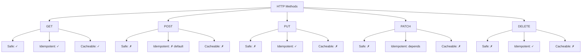

#### Interview question — Common interview question

**Q:** PUT vs PATCH semantically aur practically — production REST APIs me kaunsa kab use karoge? POST kab use hota hai non-create scenarios me?

> PUT vs PATCH:
> PUT — full replacement of resource. Send complete representation. Server replaces existing with what you sent. Missing fields → null/default.
> Example: PUT /users/42 with body {"name":"Rohan"}. If user previously had email, address, etc., they all become null/empty. PUT is 'here is the complete new state'.
> Idempotency: PUT same request twice = same final state. Idempotent.
> PATCH — partial update. Send only fields you want to change. Server merges with existing.
> Example: PATCH /users/42 with body {"name":"Rohan"}. Other fields unchanged. PATCH is 'apply this delta'.
> Idempotency: depends on operation. JSON Merge Patch (RFC 7396) — usually idempotent. JSON Patch (RFC 6902) with operations like 'add' or 'increment' may NOT be idempotent.
> Production practical guidance:
> 1) Most modern APIs prefer PATCH for updates. UI sends only changed fields. Network efficient. Forgiving of UI bugs (missing field doesn't accidentally null it).
> 2) PUT for true full replacement scenarios — admin tools that explicitly want to overwrite, configuration files, complete document replacement.
> 3) PATCH semantics need clear contract:
>    a) JSON Merge Patch (simpler) — null means 'set to null', missing means 'unchanged'. Limitation: can't unset a value to null cleanly (treated as 'set to null'). Most APIs use this for simplicity.
>    b) JSON Patch (full) — array of operations like {"op":"replace","path":"/name","value":"Rohan"}. Verbose but precise. Used in complex APIs (Kubernetes, GitHub).
> 4) Spring Boot doesn't have built-in PATCH support like PUT. You manually implement merge logic — fetch existing entity, apply only present fields, save.
> Real production design:
> - Razorpay's POST /payments/{id} for partial update (their API uses POST instead of PATCH for some legacy reasons).
> - Most modern fintech APIs (Stripe, Razorpay): mix of PATCH for fields like notes, addresses; POST for actions like capture, refund.
> Now POST in non-create scenarios:
> REST purists say POST = create, PUT = update, etc. In practice, REST has many edge cases:
> 1) Actions on resources — capture, refund, archive, cancel. These aren't pure CRUD. POST is the conventional choice.
> Example: POST /payments/{id}/capture — captures an authorized payment. Not a create (payment exists). Not an update (state transition is the operation, not editing fields).
> 2) Complex queries — sometimes filters in URL too long for GET. POST /search with filter body. Not creating anything, just querying. Practical workaround.
> 3) RPC-style endpoints — POST /accounts/{id}/charge with {"amount":5000}. Imperative style. Some APIs go this route fully (gRPC-over-HTTP, JSON-RPC).
> 4) Bulk operations — POST /payments/bulk with array body. Bulk reads sometimes too.
> 5) File uploads — POST with multipart/form-data. Universal convention.
> 6) Authentication — POST /auth/login, POST /auth/logout. Operations, not resources.
> When NOT to use POST:
> - Pure read operations — use GET, even if filtering complex. Maybe pagination + indexed search makes it work.
> - Idempotent updates with full body — use PUT.
> - Idempotent partial updates — use PATCH.
> Idempotency-Key header pattern (industry standard for safe POST retries):
> - Client generates UUID per logical operation.
> - Sends Idempotency-Key: {uuid} with POST.
> - Server stores {uuid → response} cache. Same key seen → return cached, no duplicate operation.
> - 24-hour cache TTL typical. Stripe, Razorpay, Square all use this.
> Real production scenario: Razorpay's payment flow. POST /payments creates intent (not idempotent without key — but with Idempotency-Key, safe retries). POST /payments/{id}/capture transitions to captured (action, not create). POST /payments/{id}/refund creates refund object (action + create combined).
> Industry trend: HATEOAS and pure REST adoption decreased. RPC-style APIs (gRPC, GraphQL, JSON-RPC) growing. REST stayed but loosened. POST for actions is widely accepted.
> [Difficulty: Hard · Asked at: Amazon, Microsoft, Atlassian, Razorpay, Postman. Follow-ups: 'OPTIONS method kab use hota hai?', 'CORS preflight kya hai?']

### HTTP status codes

#### Kya hai? — What are HTTP status codes?

HTTP status codes 3-digit numbers hain jo server return karta hai response me — request kya hua iska standardized signal. 5 categories: 1xx (informational), 2xx (success), 3xx (redirect), 4xx (client error), 5xx (server error).

Common codes: 200 OK, 201 Created, 204 No Content, 301 Moved Permanently, 400 Bad Request, 401 Unauthorized, 403 Forbidden, 404 Not Found, 409 Conflict, 422 Unprocessable Entity, 429 Too Many Requests, 500 Internal Server Error, 502 Bad Gateway, 503 Service Unavailable, 504 Gateway Timeout.

Each code ka semantic meaning hai. Wrong code = client confusion + bad UX. 200 with error JSON in body — terrible practice. Status code first contract.

Beginner ke liye yaad rakh: status codes API ka first-class signal hain. Body parse karne se pehle client status code dekh ke decide karta hai — error handling, retry logic, UX.

#### Kyun zaroori hai? — Why correct status codes matter?

Client-side handling: HTTP libraries (Axios, Fetch) automatic catch karte hain non-2xx responses. Wrong codes break this — 200 with error body forces manual parsing of body to detect error.

Caching: 2xx responses cache ho sakti hain (per Cache-Control). 4xx/5xx never cached. Wrong codes confuse CDN/proxy layers.

Retry logic: 5xx safe to retry (transient server issues). 429 retry after delay. 4xx (except 429) — don't retry, client bug. Wrong codes break retry libraries.

Monitoring/alerting: 5xx error rate is key metric. Wrong codes (returning 500 for client errors) inflate metrics, false alerts.

API consumer experience: developers reading docs expect standard codes. 422 means 'validation failed', not 400. Specific enough to handle differently.

#### Kaise kaam karta hai? — Status code selection guide

2xx Success:

- 200 OK — standard success. GET, PUT, PATCH, POST that returns data.

- 201 Created — resource created. Typically POST. Include Location header pointing to created resource.

- 202 Accepted — async operation queued. Returns immediately, work continues background.

- 204 No Content — success but no body. DELETE typically. Or PUT/PATCH that doesn't return updated entity.

4xx Client Errors:

- 400 Bad Request — malformed request. JSON parse error, missing required fields. Caller fixed it before retrying.

- 401 Unauthorized — missing or invalid auth credentials. Misnomer (should be 'Unauthenticated'). Caller logs in/refreshes token.

- 403 Forbidden — authenticated but not authorized for this resource. User can't escalate without admin help.

- 404 Not Found — resource doesn't exist. Could mean genuinely missing OR access denied (security: 404 vs 403 sometimes intentional).

- 409 Conflict — state conflict. Trying to create duplicate, optimistic lock failure, version mismatch.

- 422 Unprocessable Entity — well-formed but semantically invalid. Validation failures (email wrong format, amount negative). 400 vs 422 — 400 for syntax, 422 for semantics.

- 429 Too Many Requests — rate limit exceeded. Include Retry-After header.

5xx Server Errors:

- 500 Internal Server Error — generic server-side bug. Don't expose details (stack trace) to client — security risk.

- 502 Bad Gateway — upstream service responded incorrectly. Reverse proxy/gateway scenario.

- 503 Service Unavailable — temporary unavailability. Maintenance, overload. Include Retry-After.

- 504 Gateway Timeout — upstream service didn't respond in time.

Spring Boot — return ResponseEntity<T> with status, or @ResponseStatus on exceptions. @ExceptionHandler maps exceptions to specific codes globally.

```java
import org.springframework.http.*;
import org.springframework.web.bind.annotation.*;

@RestController
@RequestMapping("/api/v1/payments")
@RequiredArgsConstructor
public class PaymentController {
    private final PaymentService service;

    // 200 OK — standard success with body
    @GetMapping("/{id}")
    public Payment getById(@PathVariable String id) {
        return service.findById(id)
            .orElseThrow(() -> new PaymentNotFoundException(id));
    }

    // 201 Created with Location header — created resource
    @PostMapping
    public ResponseEntity<Payment> create(@RequestBody @Valid CreatePaymentRequest req) {
        Payment created = service.create(req);
        URI location = URI.create("/api/v1/payments/" + created.getId());
        return ResponseEntity.created(location).body(created);
    }

    // 202 Accepted — async operation queued
    @PostMapping("/{id}/refund-async")
    public ResponseEntity<RefundJob> refundAsync(@PathVariable String id,
                                                   @RequestBody RefundRequest req) {
        RefundJob job = service.queueRefund(id, req);
        return ResponseEntity
            .status(HttpStatus.ACCEPTED)
            .header("Job-Status-URL", "/jobs/" + job.getId())
            .body(job);
    }

    // 204 No Content — success, no body
    @DeleteMapping("/{id}")
    @ResponseStatus(HttpStatus.NO_CONTENT)
    public void cancel(@PathVariable String id) {
        service.cancel(id);
    }
}

// Global exception handler — maps exceptions to status codes
@RestControllerAdvice
public class ApiExceptionHandler {

    // 404 Not Found
    @ExceptionHandler(PaymentNotFoundException.class)
    public ResponseEntity<ErrorResponse> handleNotFound(PaymentNotFoundException e) {
        return ResponseEntity.status(HttpStatus.NOT_FOUND)
            .body(new ErrorResponse("PAYMENT_NOT_FOUND", e.getMessage()));
    }

    // 409 Conflict — duplicate, state conflict
    @ExceptionHandler(DuplicatePaymentException.class)
    public ResponseEntity<ErrorResponse> handleDuplicate(DuplicatePaymentException e) {
        return ResponseEntity.status(HttpStatus.CONFLICT)
            .body(new ErrorResponse("DUPLICATE_PAYMENT", e.getMessage()));
    }

    // 422 Unprocessable Entity — semantic validation
    @ExceptionHandler(MethodArgumentNotValidException.class)
    public ResponseEntity<ErrorResponse> handleValidation(MethodArgumentNotValidException e) {
        Map<String, String> errors = e.getBindingResult().getFieldErrors().stream()
            .collect(Collectors.toMap(
                FieldError::getField,
                FieldError::getDefaultMessage
            ));
        return ResponseEntity.unprocessableEntity()
            .body(new ErrorResponse("VALIDATION_FAILED", "Invalid input", errors));
    }

    // 429 Too Many Requests — rate limit
    @ExceptionHandler(RateLimitException.class)
    public ResponseEntity<ErrorResponse> handleRateLimit(RateLimitException e) {
        return ResponseEntity.status(HttpStatus.TOO_MANY_REQUESTS)
            .header("Retry-After", String.valueOf(e.getRetryAfterSeconds()))
            .body(new ErrorResponse("RATE_LIMIT_EXCEEDED", e.getMessage()));
    }

    // 401 Unauthorized
    @ExceptionHandler(UnauthorizedException.class)
    public ResponseEntity<ErrorResponse> handleUnauth(UnauthorizedException e) {
        return ResponseEntity.status(HttpStatus.UNAUTHORIZED)
            .header("WWW-Authenticate", "Bearer")
            .body(new ErrorResponse("UNAUTHORIZED", e.getMessage()));
    }

    // 403 Forbidden
    @ExceptionHandler(ForbiddenException.class)
    public ResponseEntity<ErrorResponse> handleForbidden(ForbiddenException e) {
        return ResponseEntity.status(HttpStatus.FORBIDDEN)
            .body(new ErrorResponse("FORBIDDEN", "Access denied"));
    }

    // 500 Internal Server Error — generic fallback
    @ExceptionHandler(Exception.class)
    public ResponseEntity<ErrorResponse> handleGeneric(Exception e) {
        log.error("Unexpected error", e);   // log full details internally
        return ResponseEntity.internalServerError()
            .body(new ErrorResponse("INTERNAL_ERROR", "Something went wrong"));
    }

    private static final org.slf4j.Logger log =
        org.slf4j.LoggerFactory.getLogger(ApiExceptionHandler.class);
}

record ErrorResponse(String code, String message, Map<String, String> details) {
    ErrorResponse(String code, String message) { this(code, message, null); }
}
class Payment { public String getId() { return ""; } }
class PaymentNotFoundException extends RuntimeException {
    PaymentNotFoundException(String id) { super("Payment " + id + " not found"); }
}
class DuplicatePaymentException extends RuntimeException {}
class RateLimitException extends RuntimeException {
    public int getRetryAfterSeconds() { return 60; }
}
class UnauthorizedException extends RuntimeException {}
class ForbiddenException extends RuntimeException {}
class FieldError {
    public String getField() { return ""; }
    public String getDefaultMessage() { return ""; }
}
record CreatePaymentRequest(long amount) {}
record RefundRequest(long amount) {}
class RefundJob { public String getId() { return ""; } }
class PaymentService {
    public Optional<Payment> findById(String id) { return Optional.empty(); }
    public Payment create(Object req) { return new Payment(); }
    public RefundJob queueRefund(String id, Object r) { return new RefundJob(); }
    public void cancel(String id) {}
}
```

#### Real-life example — Real-life example — Swiggy order API status codes

Swiggy's order API me clear status code contract — mobile app aur web frontend dono robust handling kar sakte hain.

Cases:

201 Created on POST /orders — order created. Body has order ID + estimated delivery.

404 Not Found on GET /orders/xyz — order doesn't exist or doesn't belong to user.

409 Conflict on POST /orders — duplicate idempotency key, restaurant unavailable.

422 Unprocessable Entity — validation failed (delivery address out of zone, item out of stock).

429 Too Many Requests — user spamming order creation. Retry-After: 30 header tells client to back off.

503 Service Unavailable — Swiggy partner restaurant API down. Show retry option.

Production benefit: client's error handling clean. UI shows specific messages per code. No 'Something went wrong' for everything.

```java
// Swiggy order API — comprehensive status code usage
@RestController
@RequestMapping("/api/v1/orders")
@RequiredArgsConstructor
public class OrderController {
    private final OrderService service;

    // 201 with Location header
    @PostMapping
    public ResponseEntity<Order> placeOrder(
            @RequestBody @Valid PlaceOrderRequest req,
            @RequestHeader("Idempotency-Key") String idemKey,
            @AuthenticationPrincipal User user) {
        Order order = service.placeOrder(req, idemKey, user);
        return ResponseEntity
            .created(URI.create("/api/v1/orders/" + order.getId()))
            .body(order);
    }

    // 200 with full order, or 404
    @GetMapping("/{id}")
    public Order getOrder(@PathVariable String id,
                           @AuthenticationPrincipal User user) {
        Order order = service.findById(id)
            .orElseThrow(() -> new OrderNotFoundException(id));

        // Authorization check — user can only see own orders
        if (!order.getCustomerId().equals(user.getId())) {
            throw new ForbiddenException();   // → 403
        }

        return order;
    }

    // 204 — success, no content
    @DeleteMapping("/{id}")
    @ResponseStatus(HttpStatus.NO_CONTENT)
    public void cancelOrder(@PathVariable String id,
                             @AuthenticationPrincipal User user) {
        service.cancel(id, user);
    }
}

// Service throws specific exceptions per failure mode
@Service
public class OrderService {

    public Order placeOrder(PlaceOrderRequest req, String idemKey, User user) {
        // 1) Idempotency check
        Optional<Order> existing = idemStore.lookup(idemKey, Order.class);
        if (existing.isPresent()) return existing.get();

        // 2) Validation — delivery zone
        if (!isAddressInDeliveryZone(req.address())) {
            throw new ValidationException(
                "address",
                "Delivery not available at this address"
            );
            // → 422 Unprocessable Entity
        }

        // 3) Inventory check
        for (OrderItem item : req.items()) {
            if (!isInStock(item)) {
                throw new ItemUnavailableException(item.productId());
                // → 409 Conflict
            }
        }

        // 4) Restaurant availability
        Restaurant r = restaurantRepo.findById(req.restaurantId())
            .orElseThrow(() -> new RestaurantNotFoundException(req.restaurantId()));
            // → 404

        if (!r.isAcceptingOrders()) {
            throw new RestaurantClosedException(r.getId());
            // → 503 Service Unavailable
        }

        // ... process
        return new Order();
    }

    private boolean isAddressInDeliveryZone(String address) { return true; }
    private boolean isInStock(OrderItem item) { return true; }
    private IdempotencyStore idemStore;
    private RestaurantRepository restaurantRepo;
}

// Exception → status code mapping
@RestControllerAdvice
public class OrderExceptionHandler {

    @ExceptionHandler(OrderNotFoundException.class)
    public ResponseEntity<ErrorResponse> handleNotFound(OrderNotFoundException e) {
        return ResponseEntity.status(404).body(
            new ErrorResponse("ORDER_NOT_FOUND", e.getMessage())
        );
    }

    @ExceptionHandler(ForbiddenException.class)
    public ResponseEntity<ErrorResponse> handleForbidden(ForbiddenException e) {
        return ResponseEntity.status(403).body(
            new ErrorResponse("ACCESS_DENIED", "You can't access this order")
        );
    }

    @ExceptionHandler(ValidationException.class)
    public ResponseEntity<ErrorResponse> handleValidation(ValidationException e) {
        return ResponseEntity.status(422).body(
            new ErrorResponse(e.getField().toUpperCase() + "_INVALID", e.getMessage())
        );
    }

    @ExceptionHandler(ItemUnavailableException.class)
    public ResponseEntity<ErrorResponse> handleUnavailable(ItemUnavailableException e) {
        return ResponseEntity.status(409).body(
            new ErrorResponse("ITEM_OUT_OF_STOCK",
                              "Item " + e.getProductId() + " is out of stock")
        );
    }

    @ExceptionHandler(RestaurantClosedException.class)
    public ResponseEntity<ErrorResponse> handleClosed(RestaurantClosedException e) {
        return ResponseEntity.status(503)
            .header("Retry-After", "300")  // try again in 5 min
            .body(new ErrorResponse("RESTAURANT_UNAVAILABLE",
                                     "Restaurant temporarily closed"));
    }
}

class Order {
    public String getId() { return ""; }
    public String getCustomerId() { return ""; }
}
class User {
    public String getId() { return ""; }
}
record PlaceOrderRequest(String address, List<OrderItem> items, String restaurantId) {}
record OrderItem(String productId) {}
class Restaurant {
    public boolean isAcceptingOrders() { return true; }
    public String getId() { return ""; }
}
class OrderNotFoundException extends RuntimeException {
    OrderNotFoundException(String id) { super("Order " + id + " not found"); }
}
class ForbiddenException extends RuntimeException {}
class ValidationException extends RuntimeException {
    private final String field;
    ValidationException(String f, String m) { super(m); field = f; }
    public String getField() { return field; }
}
class ItemUnavailableException extends RuntimeException {
    private final String productId;
    ItemUnavailableException(String id) { productId = id; }
    public String getProductId() { return productId; }
}
class RestaurantNotFoundException extends RuntimeException {
    RestaurantNotFoundException(String id) {}
}
class RestaurantClosedException extends RuntimeException {
    RestaurantClosedException(String id) {}
}
interface IdempotencyStore {
    <T> Optional<T> lookup(String key, Class<T> type);
}
interface RestaurantRepository {
    Optional<Restaurant> findById(String id);
}
record ErrorResponse(String code, String message) {}
```

#### Visual — Status code categories

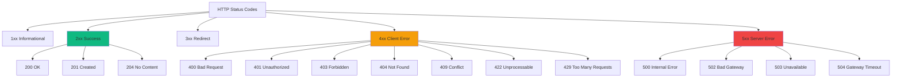

#### Interview question — Common interview question

**Q:** 401 Unauthorized vs 403 Forbidden — practical difference + when to use each? 400 vs 422 — semantic difference between 'malformed' and 'invalid'?

> 401 vs 403 — common confusion, important distinction:
> 401 Unauthorized — you're NOT AUTHENTICATED. Server doesn't know who you are. Missing or invalid credentials (no token, expired token, wrong API key).
> Action: client should authenticate (login, refresh token, provide credentials). Re-attempting same request without auth change won't work.
> Spec naming is misleading — 401 actually means 'Unauthenticated'. Real 'unauthorized' is 403.
> WWW-Authenticate header should be included telling client what auth scheme to use: 'WWW-Authenticate: Bearer realm=...'.
> 403 Forbidden — you're AUTHENTICATED but NOT AUTHORIZED. Server knows who you are but you don't have permission for this resource.
> Action: client can't fix this on their own. Need admin to grant permission, or accept that this resource is off-limits.
> No re-auth flow helps — 'try logging in as someone else' isn't usually a valid response.
> Real production usage:
> - 401 — JWT expired, no Authorization header, signature invalid. Client refreshes token and retries.
> - 403 — User authenticated but trying to access another user's data, or non-admin trying admin endpoint.
> Sometimes 404 instead of 403 (security through obscurity):
> - Don't reveal that resource exists if user shouldn't see it. GitHub does this — private repos return 404 for non-members, not 403.
> - Pro: doesn't leak existence info. Con: confusing if legitimate user lost permission.
> Rule: 401 = 'who are you?', 403 = 'I know you, you can't have this'.
> Now 400 vs 422:
> Both client errors. Both about request being wrong. Different layers of 'wrong'.
> 400 Bad Request — request itself MALFORMED. Server can't parse it.
> Examples: invalid JSON syntax, missing required header, query parameter format wrong, content-type mismatch.
> Symbolically: 'I can't even understand what you're trying to send'.
> 422 Unprocessable Entity — request well-formed but SEMANTICALLY INVALID. Server understood what you sent but the business rules say no.
> Examples: email field doesn't match email pattern, amount is negative, date in past for future-only field, foreign key references missing entity.
> Symbolically: 'I understand exactly what you want but the values don't make sense'.
> Practical examples in Razorpay context:
> - POST /payments with invalid JSON → 400. Body parse error, can't even attempt validation.
> - POST /payments with valid JSON but {amount: -100} → 422. Parsed fine but amount must be positive.
> - POST /payments with valid JSON but missing required field → could be either. 400 if you treat it as 'malformed'. 422 if you treat it as 'semantically incomplete'. Industry leans 422 for missing required.
> Why this matters:
> 1) Client error handling: 400 means 'fix your code'. 422 means 'fix your data'. Different UX flows.
> 2) Logging: 400 errors often indicate broken clients (deploy bug, version mismatch). 422 errors are routine (user input issues). Different alerting thresholds.
> 3) Spec compliance: Spring's default behavior for @Valid violations is 400 — but 422 is more semantically correct. Many APIs configure to use 422.
> Default Spring behavior:
> - @Valid validation failure → 400 (Spring's default).
> - Customizable via @ResponseStatus on exception or in @ExceptionHandler.
> - Industry trend: APIs using 422 for validation errors. Gives 400 unique meaning of 'malformed input'.
> Other related codes:
> - 415 Unsupported Media Type — content-type wrong. Client sent XML, server expects JSON.
> - 405 Method Not Allowed — wrong HTTP method on existing endpoint. PUT on read-only resource.
> - 406 Not Acceptable — Accept header asks for format server can't produce.
> Real production wisdom: Document your status codes in API spec (OpenAPI). Be consistent across endpoints. Use specific codes (422, 409) when meaningful, not just 400 for everything client-side. Helps API consumers handle errors gracefully.
> [Difficulty: Medium-Hard · Asked at: Amazon, Microsoft, Razorpay, Atlassian, Postman. Follow-ups: 'Idempotency key conflicts → 409 ya 422?', 'OPTIONS request status code kya hota hai?']

### REST controllers

#### Kya hai? — What is a Spring Boot REST controller?

REST controller ek class hota hai jisme tu HTTP endpoints expose karta hai. Spring Boot @RestController annotation lagaata hai aur auto-magically request mapping handle kar deta hai.

Mtlb tu method bana, @GetMapping ya @PostMapping laga, JSON return kar — Spring baaki sab handle karta hai (serialization, status codes, headers).

#### Kyun zaroori hai? — Why use it?

Java me REST APIs banane ka boilerplate pehle insane tha — servlets, web.xml, manual JSON parsing. Bahut painful tha.

Spring Boot ne ye sab abstract kar diya. Ek class likh, annotation laga, server start kar — done.

Plus testing, security, observability sab built-in hai. Production-ready APIs sirf 30 lines me ban jaate hain.

#### Kaise kaam karta hai? — How does it work?

Tu @RestController class banata hai. @RequestMapping se base path set karta hai. Phir har method pe HTTP method annotation lagata hai (@GetMapping, @PostMapping etc.).

Spring scan karta hai inn classes ko at startup, routes register karta hai, aur Tomcat embedded server pe sab serve karta hai.

```java
@RestController
@RequestMapping("/api/users")
public class UserController {

    private final UserService service;

    public UserController(UserService service) {
        this.service = service;
    }

    // GET /api/users
    @GetMapping
    public List<User> list() {
        return service.findAll();
    }

    // GET /api/users/42
    @GetMapping("/{id}")
    public User get(@PathVariable Long id) {
        return service.findById(id);
    }

    // POST /api/users
    @PostMapping
    @ResponseStatus(HttpStatus.CREATED)
    public User create(@RequestBody @Valid CreateUserRequest req) {
        return service.create(req);
    }
}
```

#### Real-life example — Real-life example

Maan le ek e-commerce app banana hai. Tujhe orders ke endpoints chahiye — list karna, ek specific order dekhna, naya order banana.

Bas ek OrderController bana, in-memory ya DB se data fetch kar, aur frontend (React/Flutter) seedha API call kar sakta hai.

#### Interview question — Common interview question

**Q:** What's the difference between @RestController and @Controller?

> @Controller traditional Spring MVC controller hai — return value ko view name ke jaisa treat karta hai. Mtlb agar tu 'home' return karta hai, to Spring 'home.html' template render karega.
> @RestController = @Controller + @ResponseBody. Hard-coded JSON-first behaviour. Tu jo bhi return karta hai, Jackson use karke JSON me serialize ho jata hai. View resolution skip ho jaata hai.
> Bottom line: APIs build kar raha hai → @RestController. Server-rendered HTML pages → @Controller.

### Request mapping

#### Kya hai? — What is request mapping?

Request mapping basically Spring ko batata hai — kaunsa HTTP request kaunsi Java method pe route karna hai. URL path, HTTP method (GET/POST/PUT/DELETE), query params, headers, request body — sab map karne ke annotations hote hain.

Pure shorthand annotations: @GetMapping, @PostMapping, @PutMapping, @DeleteMapping, @PatchMapping. Pehle @RequestMapping(method=GET, path='/users') likhna padta tha — ab @GetMapping('/users') kaafi hai.

Plus path variables (@PathVariable), query params (@RequestParam), request body (@RequestBody), aur headers (@RequestHeader) ke liye separate annotations hain — type-safe binding ke saath.

#### Kyun zaroori hai? — Why explicit request mapping?

Pehle Java me servlets ke saath HttpServletRequest se manually parameters extract karne padte the. request.getParameter('userId'), request.getMethod(), JSON parsing manually with Jackson — bahut boilerplate.

Spring's request mapping declarative hai — tu sirf declare karta hai 'ye method GET /users/{id} handle karta hai, id Long type ka hai, response JSON bana ke return karo'. Spring khud HTTP parsing, type conversion, JSON serialization sab handle karta hai.

Plus testing benefit: framework-managed routing means tu MockMvc se HTTP layer mock kar ke unit-level test likh sakta hai bina actual server start kiye.

#### Kaise kaam karta hai? — How to map requests properly

Class-level @RequestMapping('/api/v1/users') base path set karta hai. Method-level @GetMapping('/{id}') us pe append hota hai — final path /api/v1/users/{id} ban jaata hai.

Path variables capture kar — @PathVariable Long id method parameter pe lagaa. Spring URL se id extract karta hai aur Long me convert karta hai automatically.

Query params — @RequestParam(defaultValue='10') int limit. Default value optional, agar nahi diya to required.

Request body for POST/PUT — @RequestBody @Valid CreateUserRequest req. Spring JSON parse karke object bana deta hai. @Valid Bean Validation trigger karta hai.

Common gotcha: @PathVariable name vs URL placeholder name match karna chahiye. Agar mismatch ho aur tu java compile -parameters flag se compile nahi kar raha, runtime me crash hoga. Best practice — explicit name dena: @PathVariable('id') Long userId.

```java
// Razorpay-style payments REST controller
@RestController
@RequestMapping("/api/v1/payments")  // base path
public class PaymentController {

    private final PaymentService service;

    public PaymentController(PaymentService service) {
        this.service = service;
    }

    // GET /api/v1/payments?status=PENDING&limit=20
    @GetMapping
    public List<Payment> list(
        @RequestParam(required = false) PaymentStatus status,
        @RequestParam(defaultValue = "20") @Min(1) @Max(100) int limit
    ) {
        return service.findByStatus(status, limit);
    }

    // GET /api/v1/payments/pay_abc123
    @GetMapping("/{id}")
    public Payment get(@PathVariable("id") String paymentId) {
        return service.findById(paymentId);
    }

    // POST /api/v1/payments
    @PostMapping
    @ResponseStatus(HttpStatus.CREATED)
    public Payment create(@RequestBody @Valid CreatePaymentRequest req) {
        // @Valid trigger karta hai Bean Validation on the request
        return service.create(req);
    }

    // PATCH /api/v1/payments/pay_abc123/capture
    @PatchMapping("/{id}/capture")
    public Payment capture(
        @PathVariable("id") String paymentId,
        @RequestHeader("Idempotency-Key") String idempotencyKey
    ) {
        // header se idempotency key le ke duplicate calls handle karte hain
        return service.capture(paymentId, idempotencyKey);
    }
}
```

#### Real-life example — Real-life example — versioned API for mobile clients

Swiggy ka order-service mobile app ke alag-alag versions support karta hai. Older app v1 schema bhejti hai, naya app v2 enriched payload. Backend dono support karta hai bina code break kiye.

Approach: URL versioning. /api/v1/orders aur /api/v2/orders — alag controllers, alag DTOs, alag mappings. v1 deprecated hone tak chalta rahega.

Alternative approaches: header versioning (Accept: application/vnd.swiggy.v2+json), query parameter (?version=2). Industry me URL versioning sabse common hai — debugging easy, monitoring me dikhta hai, caching layer me different keys.

```java
// Swiggy order service — supports v1 + v2 APIs simultaneously
@RestController
@RequestMapping("/api/v1/orders")
public class OrderControllerV1 {

    @PostMapping
    public OrderResponseV1 place(@RequestBody @Valid PlaceOrderRequestV1 req) {
        // v1 schema: simple order with items
        return service.placeV1(req);
    }
}

@RestController
@RequestMapping("/api/v2/orders")
public class OrderControllerV2 {

    @PostMapping
    public OrderResponseV2 place(@RequestBody @Valid PlaceOrderRequestV2 req) {
        // v2 schema: includes delivery preferences,
        // dietary tags, scheduled delivery time
        return service.placeV2(req);
    }
}

// Production tip: actuator + Micrometer se per-version metrics nikalte hain.
// Jab v1 traffic 1% se neeche jaaye, retire kar do.
```

#### Visual — Request routing flow

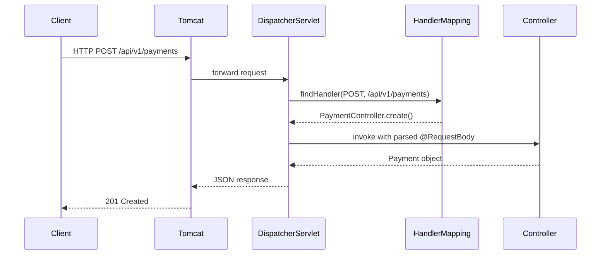

#### Interview question — Common interview question

**Q:** @RequestParam aur @PathVariable me kya difference hai? Production API design me kab kaunsa use karega?

> Difference URL me hai. Path variables URL ke structure ka part hote hain, query params URL ke baad ?key=value format me append hote hain.
> Example: /users/42 me '42' path variable hai (@PathVariable). /users?status=active me 'status' query parameter hai (@RequestParam).
> Semantic rule: path variables resource ki identity batate hain — kis specific resource pe operation ho rahi hai. Query parameters operation ko modify karte hain — filter, sort, paginate.
> GET /orders/ord_abc123 — path variable kyunki specific order ki baat hai. GET /orders?status=DELIVERED&limit=20 — query params kyunki filtering aur pagination batate hain.
> Production API design me ye REST conventions follow karna chahiye. Reasons: 1) Caching layers (CDN, proxies) URL pe based cache karte hain — clean URLs better cache hit rate dete hain. 2) Bookmarkability — log /orders/ord_abc123 share kar sakte hain easily. 3) Monitoring — Datadog/New Relic me URL patterns se aggregate metrics nikalna easy hota hai.
> Edge cases: nested resources jaise /users/42/orders/abc123 me dono path variables hote hain — /users/{userId}/orders/{orderId}. @PathVariable parameter name URL placeholder se match karna chahiye, ya explicit @PathVariable('userId') Long id likhna chahiye.
> Boolean ya optional flags ke liye query params better — /search?fuzzy=true. Agar tu inhe path me daalega to URL ugly aur cache-unfriendly ho jaayega.
> Asked at: Amazon, Atlassian, Razorpay, Postman. Follow-ups: 'POST aur PUT me kab kaunsa use karte ho?', '@MatrixVariable kya hota hai?'

### Validation (@Valid, custom validators)

#### Kya hai? — What is request validation?

Request validation matlab incoming HTTP request data ko checks ke through pass karna — required fields present hain, formats correct hain, ranges valid hain — business logic execute karne se PEHLE.

Spring Boot me Bean Validation API (JSR 380, Jakarta Validation) ka use hota hai. Annotations like @NotNull, @Email, @Min, @Max DTO classes pe lagaate hain. @Valid annotation method parameter pe trigger karta hai validation.

Failure handling: validation fail hota hai to MethodArgumentNotValidException throw hoti hai. Global @ExceptionHandler isse 422/400 response me convert karta hai with field-level error details.

Beginner ke liye yaad rakh: validation FIRST line of defense hai. Bina validation business logic me invalid data jaata hai → cryptic errors deep me. With validation → clean error response at API boundary.

#### Kyun zaroori hai? — Why annotation-based validation?

Declarative > imperative: @NotBlank @Email String email — ek line. Imperative version: 'if (email == null) ... if (!email.matches(EMAIL_REGEX)) ...'. Declarative reads as data contract.

Centralized: validation rules DTO classes pe. Controller code clean. Service layer clean. Validation crosses request boundary only.

Standardized errors: framework consistent error format generate karta hai. Field name + violation message structured response. Frontend can display per-field errors easily.

Reusable: same DTO multiple endpoints me use ho sakti hai with same validation. Inheritance + composition support.

Tooling: OpenAPI/Swagger documentation auto-generate validation rules from annotations. API contract me visible.

#### Kaise kaam karta hai? — Bean Validation in Spring Boot

Setup: spring-boot-starter-validation dependency. Hibernate Validator (reference impl) included.

Common annotations:

- @NotNull — must be non-null

- @NotBlank — non-null + non-empty + has at least one non-whitespace char (for Strings)

- @NotEmpty — non-null + non-empty (for Strings, Collections, Maps, Arrays)

- @Size(min, max) — string length / collection size

- @Min, @Max — numeric bounds

- @Positive, @Negative — sign checks

- @Email — email format

- @Pattern(regexp) — regex match

- @Past, @Future — date relative to now

Trigger: @Valid on @RequestBody parameter activates validation. Without @Valid, annotations ignored.

Custom validators: implement ConstraintValidator + create custom annotation. e.g., @ValidIndianPhone with regex + length check.

Cross-field validation: class-level annotation. e.g., @PasswordsMatch on registration DTO comparing password and confirmPassword.

Nested validation: @Valid on nested objects. CreateOrderRequest with List<@Valid OrderItemRequest> items — validates each item.

Groups: validate different rules in different contexts. @Validated(CreateGroup.class) vs @Validated(UpdateGroup.class) — different rules trigger.

```java
import jakarta.validation.constraints.*;
import jakarta.validation.Valid;

// DTO with comprehensive validation annotations
public record CreatePaymentRequest(

    @NotNull(message = "Customer ID is required")
    @Pattern(regexp = "cust_[a-zA-Z0-9]{8,}", message = "Invalid customer ID format")
    String customerId,

    @NotNull(message = "Amount is required")
    @Positive(message = "Amount must be positive")
    @Max(value = 200_00_000_00L, message = "Amount exceeds limit (₹2 lakh)")
    Long amountInPaise,

    @NotBlank(message = "Currency is required")
    @Size(min = 3, max = 3, message = "Currency must be 3-letter code")
    @Pattern(regexp = "INR|USD|EUR|GBP", message = "Unsupported currency")
    String currency,

    @NotNull(message = "Payment method is required")
    PaymentMethod method,

    @Valid    // validates nested object
    @NotNull(message = "Card details required for CARD method")
    CardDetails card,

    @Email(message = "Invalid email format")
    String customerEmail,    // optional but if present, must be email

    @Pattern(regexp = "\\+91[0-9]{10}", message = "Phone must be +91 followed by 10 digits")
    String customerPhone,

    @Size(max = 500, message = "Notes cannot exceed 500 characters")
    String notes,

    @NotNull
    @Future(message = "Expiry must be future date")
    LocalDate cardExpiry
) {}

// Nested DTO — also validated when parent has @Valid
public record CardDetails(
    @NotBlank @Pattern(regexp = "[0-9]{16}") String number,
    @NotBlank @Pattern(regexp = "[0-9]{3,4}") String cvv,
    @NotBlank @Size(min = 3, max = 100) String holderName
) {}

enum PaymentMethod { CARD, UPI, NETBANKING, WALLET }

// Controller — @Valid triggers validation
@RestController
@RequestMapping("/api/v1/payments")
public class PaymentController {

    @PostMapping
    public Payment create(@RequestBody @Valid CreatePaymentRequest req) {
        // Reaches here only if all validations pass
        // Otherwise MethodArgumentNotValidException thrown
        return new Payment();
    }

    // Path variable + query param validation
    @GetMapping("/{id}")
    public Payment getById(
            @PathVariable @Pattern(regexp = "pay_[a-zA-Z0-9]{8,}") String id) {
        return new Payment();
    }
}

// Custom validator — Indian phone number
@Documented
@Constraint(validatedBy = IndianPhoneValidator.class)
@Target({ElementType.FIELD, ElementType.PARAMETER})
@Retention(RetentionPolicy.RUNTIME)
public @interface ValidIndianPhone {
    String message() default "Invalid Indian phone number";
    Class<?>[] groups() default {};
    Class<? extends Payload>[] payload() default {};
}

public class IndianPhoneValidator implements ConstraintValidator<ValidIndianPhone, String> {
    @Override
    public boolean isValid(String value, ConstraintValidatorContext context) {
        if (value == null) return true;   // null handled by @NotNull
        String digits = value.replaceAll("\\D", "");
        if (digits.length() == 10) return true;       // 9876543210
        if (digits.length() == 11 && digits.startsWith("0")) return true;  // 09876543210
        if (digits.length() == 12 && digits.startsWith("91")) return true; // 919876543210
        return false;
    }
}

// Cross-field validation
@Documented
@Constraint(validatedBy = AmountWithinLimitValidator.class)
@Target(ElementType.TYPE)
@Retention(RetentionPolicy.RUNTIME)
public @interface AmountWithinLimit {
    String message() default "Amount exceeds tier limit";
    Class<?>[] groups() default {};
    Class<? extends Payload>[] payload() default {};
}

public class AmountWithinLimitValidator
        implements ConstraintValidator<AmountWithinLimit, CreatePaymentRequest> {
    @Override
    public boolean isValid(CreatePaymentRequest req, ConstraintValidatorContext ctx) {
        // Cross-field: amount limit depends on payment method
        long limit = switch (req.method()) {
            case UPI -> 100_000_00L;     // ₹1 lakh for UPI
            case CARD, NETBANKING -> 200_000_00L;
            case WALLET -> 50_000_00L;
        };
        return req.amountInPaise() == null || req.amountInPaise() <= limit;
    }
}

class Payment {}
```

#### Real-life example — Real-life example — Razorpay's payment intent validation

Razorpay's POST /v1/payments endpoint receives 100s of requests/second. Many invalid requests come from buggy integrations — wrong amount format, missing fields, expired cards.

Validation strategy: comprehensive annotation-based on DTO. Catches 90% of issues at API boundary. Service layer assumes clean data — focuses on business logic.

Production benefits: 1) faster failure — invalid request rejected before DB call. 2) consistent error format — frontend handles all validation errors uniformly. 3) clear API contract — OpenAPI spec auto-generated shows validation rules. 4) reduced server load — invalid requests don't reach business logic.

Edge case handling: cross-field validation for tier-based limits. Custom validator for Indian phone formats. Nested @Valid for card details, address details.

```java
// Razorpay-style validation error response

@RestControllerAdvice
public class ValidationExceptionHandler extends ResponseEntityExceptionHandler {

    @Override
    protected ResponseEntity<Object> handleMethodArgumentNotValid(
            MethodArgumentNotValidException ex,
            HttpHeaders headers,
            HttpStatusCode status,
            WebRequest request) {

        // Collect all field errors
        List<FieldError> fieldErrors = ex.getBindingResult().getFieldErrors();
        List<ValidationError> errors = fieldErrors.stream()
            .map(fe -> new ValidationError(
                fe.getField(),
                fe.getDefaultMessage(),
                fe.getRejectedValue() != null ? fe.getRejectedValue().toString() : null
            ))
            .toList();

        // Cross-field errors (class-level constraints)
        List<ObjectError> globalErrors = ex.getBindingResult().getGlobalErrors();
        List<ValidationError> crossFieldErrors = globalErrors.stream()
            .map(oe -> new ValidationError(
                "_global",
                oe.getDefaultMessage(),
                null
            ))
            .toList();

        List<ValidationError> allErrors = new ArrayList<>(errors);
        allErrors.addAll(crossFieldErrors);

        ApiErrorResponse response = new ApiErrorResponse(
            "VALIDATION_FAILED",
            "Request validation failed. Check 'errors' for details.",
            allErrors
        );

        // 422 Unprocessable Entity — semantic error
        return ResponseEntity
            .status(HttpStatus.UNPROCESSABLE_ENTITY)
            .body(response);
    }
}

record ValidationError(String field, String message, String rejectedValue) {}
record ApiErrorResponse(String code, String message, List<ValidationError> errors) {}

// Example response on validation failure:
// {
//   "code": "VALIDATION_FAILED",
//   "message": "Request validation failed. Check 'errors' for details.",
//   "errors": [
//     { "field": "amountInPaise", "message": "Amount must be positive", "rejectedValue": "-100" },
//     { "field": "currency", "message": "Unsupported currency", "rejectedValue": "JPY" },
//     { "field": "card.number", "message": "must match \"[0-9]{16}\"", "rejectedValue": "1234" }
//   ]
// }

// Frontend handles per-field errors elegantly:
// - amountInPaise field shows "Amount must be positive" inline
// - currency dropdown shows "Unsupported currency"
// - card number shows red border with format hint
```

#### Visual — Validation flow

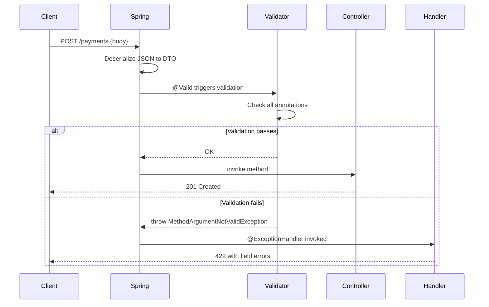

#### Interview question — Common interview question

**Q:** Bean Validation me @NotNull, @NotEmpty, @NotBlank ka exact difference bata. Custom cross-field validators kaise banate hain — when annotation level isn't enough?

> @NotNull, @NotEmpty, @NotBlank — three similar-looking but distinctly different validators:
> @NotNull — value must NOT be null. Empty string '' is valid! Whitespace '   ' is valid! Just must not be null.
> Use case: integer/long primitives wrapper (Long can be null), boolean wrapper (Boolean), enum, custom objects.
> @NotEmpty — value must NOT be null AND must not be empty. Length > 0 required. But '   ' (whitespace only) IS valid.
> Use case: collections (List, Set, Map) — must have at least one element. Strings — must have at least one character (any character including whitespace).
> @NotBlank — value must NOT be null AND must contain at least one NON-WHITESPACE character. Most strict. Whitespace-only strings rejected.
> Use case: Strings only. Names, IDs, descriptions where blank entry doesn't make sense.
> Quick comparison table:
> Value           | @NotNull | @NotEmpty | @NotBlank
> null            | FAIL     | FAIL      | FAIL
> ''              | pass     | FAIL      | FAIL
> '   '           | pass     | pass      | FAIL
> 'rohan'         | pass     | pass      | pass
> Production rule: for String fields, default to @NotBlank. Whitespace-only entries almost always invalid in practice. Only use @NotEmpty if blank actually meaningful (rare). Use @NotNull only on non-String types.
> Common mistake: @NotEmpty on String hopes to reject whitespace — it doesn't. User submits '   ' (5 spaces), passes @NotEmpty, business logic crashes on .trim().length() == 0 check later. Use @NotBlank.
> Now custom cross-field validators:
> Bean Validation annotations target single fields. Cross-field rules need class-level validators.
> Examples of cross-field rules:
> 1) Password match — passwordField equals confirmPasswordField.
> 2) Date range — startDate before endDate.
> 3) Conditional required — if paymentMethod=CARD, cardDetails required.
> 4) Tier-based limit — amount within limit set by user's tier (joined to user data).
> Implementation steps:
> 1) Define a custom annotation with @Target({ElementType.TYPE}) — class level.
> 2) Implement ConstraintValidator<YourAnnotation, TheClass>.
> 3) Override isValid() with cross-field logic.
> 4) Apply annotation to DTO class. @Valid on parameter triggers it.
> Detailed implementation:
> @Documented @Constraint(validatedBy = PasswordsMatchValidator.class)
> @Target(ElementType.TYPE) @Retention(RetentionPolicy.RUNTIME)
> public @interface PasswordsMatch {
>   String message() default 'Passwords do not match';
>   String passwordField() default 'password';
>   String confirmField() default 'confirmPassword';
>   Class<?>[] groups() default {};
>   Class<? extends Payload>[] payload() default {};
> }
> public class PasswordsMatchValidator implements ConstraintValidator<PasswordsMatch, RegisterRequest> {
>   public boolean isValid(RegisterRequest req, ConstraintValidatorContext ctx) {
>     if (req.getPassword() == null) return true;  // let @NotNull handle
>     return req.getPassword().equals(req.getConfirmPassword());
>   }
> }
> @PasswordsMatch  // applied at class level
> public class RegisterRequest { ... }
> Practical tips:
> 1) Custom error path: ctx.disableDefaultConstraintViolation(); ctx.buildConstraintViolationWithTemplate(msg).addPropertyNode('confirmPassword').addConstraintViolation();. Without this, error attaches to whole object — frontend can't bind to specific field.
> 2) Validation groups: define interfaces (CreateGroup, UpdateGroup). @Validated(CreateGroup.class) on parameter activates only annotations marked with that group. Different rules for different operations.
> 3) Conditional logic: validators can read multiple fields, return based on combinations. e.g., 'if order.shippingType == EXPRESS, addressLine2 required'.
> 4) Hibernate Validator extensions: @ScriptAssert (SpEL/JS expressions for cross-field rules). Avoid in production — performance + maintenance.
> 5) Service-layer validation: some checks need DB lookup (existing email, foreign key validity). Validators can inject services in Spring (with @Autowired in validator class), but consider pushing to service layer with explicit checks.
> Real production scenario: Razorpay's payment service. Bean Validation handles 80% — format checks, required fields, range constraints. Cross-field validators handle: payment method requires specific details (CARD → cardDetails non-null, UPI → vpa non-null). Service layer handles: customer-tier limits, daily transaction caps, fraud scoring. Layered validation — each catches different class of issues.
> [Difficulty: Hard · Asked at: Amazon, Atlassian, Razorpay, Microsoft, Postman. Follow-ups: '@AssertTrue/@AssertFalse kab use karoge?', 'Validation groups production code me kab help karte hain?']

### Exception handling

#### Kya hai? — What is exception handling in Spring?

Spring Boot me exception handling basically ek centralized mechanism hai exceptions ko catch karne, log karne, aur consistent JSON error response client ko bhejne ke liye.

Three main approaches: 1) @ExceptionHandler method controller ke andar (only that controller ke liye), 2) @ControllerAdvice class — global, saare controllers cover karta hai, 3) ResponseEntityExceptionHandler extend karke Spring's built-in exceptions handle karna.

Goal: business code me try-catch nahi karna chahta tu, sirf exceptions throw kar — central handler clean error response generate kar dega.

#### Kyun zaroori hai? — Why centralized exception handling?

Bina central handler ke kya hota hai — har controller method me try-catch, error responses inconsistent (kabhi 500, kabhi {error: '...'}, kabhi plain string), production me debug karna nightmare. API consumers ko error contract pe trust nahi reh jaata.

Centralized handling me ek jagah error contract define hota hai — saari errors same JSON shape me aati hain (timestamp, status, error code, message, optional details). Frontend apps consistent error handling likh sakte hain.

Plus security — internal exception details (stack traces, DB errors) leak nahi hone chahiye client ko. Central handler me sanitize kar sakte hain. Logs me full detail, response me sirf user-safe message.

#### Kaise kaam karta hai? — How to implement global exception handling

@RestControllerAdvice class banao — ye @ControllerAdvice + @ResponseBody hai. Iske @ExceptionHandler methods saare REST controllers ke liye apply hote hain.

Pattern: ek base RuntimeException class banao (e.g., ApiException) jisme HTTP status, error code, message hote hain. Saari business exceptions usse extend karein. Global handler base class catch karta hai aur consistent response generate karta hai.

Spring's built-in exceptions (MethodArgumentNotValidException, HttpMessageNotReadableException, etc.) bhi handle karna chahiye — clean validation errors return karne ke liye. ResponseEntityExceptionHandler extend karte hain to override these.

Important — exception class hierarchy plan kar. NotFoundException (404), ValidationException (400), UnauthorizedException (401), ConflictException (409), InternalServiceException (500). Generic Exception/Throwable catch nahi karna chahiye routine flow me — sirf last-resort 500 ke liye.

```java
// Standard error response shape — saari APIs me same
public record ErrorResponse(
    Instant timestamp,
    int status,
    String code,
    String message,
    Map<String, String> details
) {}

// Custom business exception base class
public class ApiException extends RuntimeException {
    private final HttpStatus status;
    private final String code;

    public ApiException(HttpStatus status, String code, String message) {
        super(message);
        this.status = status;
        this.code = code;
    }
    public HttpStatus getStatus() { return status; }
    public String getCode() { return code; }
}

// Specific exceptions extend karein
public class PaymentNotFoundException extends ApiException {
    public PaymentNotFoundException(String paymentId) {
        super(HttpStatus.NOT_FOUND, "PAYMENT_NOT_FOUND",
              "Payment " + paymentId + " not found");
    }
}

// Global handler — saare controllers cover karta hai
@RestControllerAdvice
public class GlobalExceptionHandler extends ResponseEntityExceptionHandler {

    private static final Logger log = LoggerFactory.getLogger(GlobalExceptionHandler.class);

    // Saari custom business exceptions
    @ExceptionHandler(ApiException.class)
    public ResponseEntity<ErrorResponse> handleApi(ApiException ex) {
        log.warn("API exception: {} {}", ex.getCode(), ex.getMessage());
        return ResponseEntity.status(ex.getStatus()).body(
            new ErrorResponse(Instant.now(), ex.getStatus().value(),
                              ex.getCode(), ex.getMessage(), null)
        );
    }

    // Validation errors (Spring built-in)
    @Override
    protected ResponseEntity<Object> handleMethodArgumentNotValid(
        MethodArgumentNotValidException ex, HttpHeaders headers,
        HttpStatusCode status, WebRequest request) {
        Map<String, String> details = ex.getBindingResult().getFieldErrors()
            .stream()
            .collect(Collectors.toMap(
                FieldError::getField,
                e -> e.getDefaultMessage() != null ? e.getDefaultMessage() : ""
            ));
        return ResponseEntity.badRequest().body(
            new ErrorResponse(Instant.now(), 400, "VALIDATION_FAILED",
                              "Invalid request", details)
        );
    }

    // Last-resort fallback for unexpected exceptions
    @ExceptionHandler(Exception.class)
    public ResponseEntity<ErrorResponse> handleGeneric(Exception ex) {
        log.error("Unexpected error", ex);  // full stack trace logs me
        return ResponseEntity.internalServerError().body(
            new ErrorResponse(Instant.now(), 500, "INTERNAL_ERROR",
                              "Something went wrong", null)
            // ☝️ user ko sanitized message — internals leak nahi hote
        );
    }
}
```

#### Real-life example — Real-life example — Razorpay payment failure flow

Razorpay payment capture flow me kai jagah failures ho sakte hain — invalid card, insufficient funds, gateway timeout, idempotency conflict, regulatory block. Har failure ka unique error code, unique HTTP status, structured details chahiye.

Bina central handler ke har controller method me 5-6 try-catch — code messy aur duplicated. Central handler me 8-10 specific exception handlers — clean, testable, consistent.

Production me mobile app aur web dashboard error code dekh ke specific UX dikhate hain. INSUFFICIENT_FUNDS pe alag screen, CARD_EXPIRED pe alag, GATEWAY_TIMEOUT pe retry button. Error contract API ka first-class citizen hai — accidentally break nahi karte.

```java
// Service layer me clean exception flow
@Service
public class PaymentCaptureService {

    public Payment capture(String paymentId, String idempotencyKey) {
        Payment payment = repo.findById(paymentId)
            .orElseThrow(() -> new PaymentNotFoundException(paymentId));

        if (payment.getStatus() != PaymentStatus.AUTHORIZED) {
            throw new InvalidStateException(
                "Payment is " + payment.getStatus() + ", cannot capture"
            );
        }

        // Idempotency check
        if (isDuplicate(idempotencyKey)) {
            throw new IdempotencyConflictException(idempotencyKey);
        }

        try {
            return gateway.capture(payment);
        } catch (GatewayTimeoutException e) {
            // Specific gateway exception — handler 504 return karega
            throw new PaymentGatewayException("Gateway timeout, retry safe", e);
        }
    }
}

// Frontend ko milta hai — clean structured error:
// {
//   "timestamp": "2026-04-29T18:30:00Z",
//   "status": 404,
//   "code": "PAYMENT_NOT_FOUND",
//   "message": "Payment pay_abc123 not found"
// }
```

#### Visual — Exception flow with @RestControllerAdvice

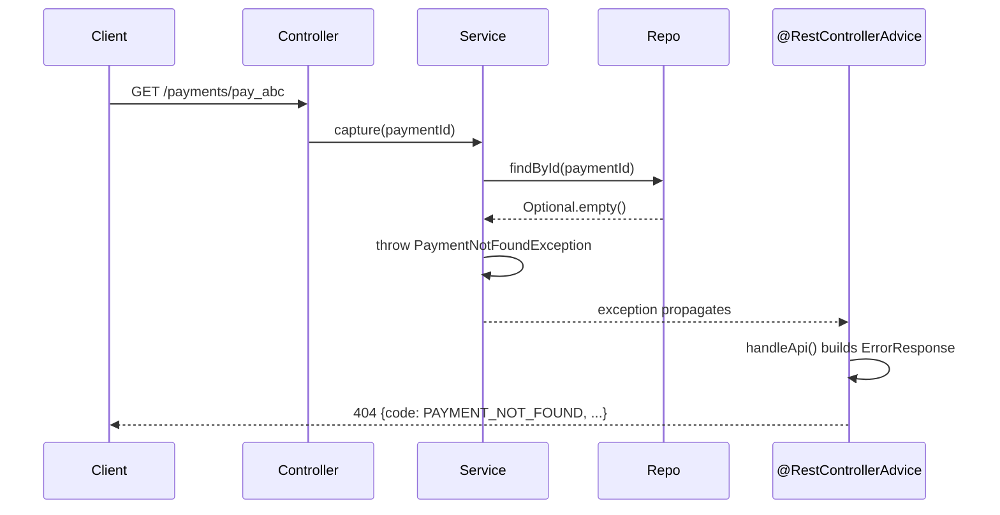

#### Interview question — Common interview question

**Q:** @ControllerAdvice vs @RestControllerAdvice me kya difference hai? Stack trace API response me leak hone se kaise rokoge production me?

> Difference simple hai: @RestControllerAdvice = @ControllerAdvice + @ResponseBody. REST APIs ke liye @RestControllerAdvice use karna chahiye — automatically returns ko JSON serialize karta hai. @ControllerAdvice traditional MVC apps ke liye hai jaha return value view name treat hota hai.
> Practical impact: @RestControllerAdvice me tu ResponseEntity<ErrorResponse> return karta hai aur Spring directly JSON banakar client ko bhej deta hai. @ControllerAdvice me wahi return type would resolve to a view template — galat behavior REST APIs ke liye.
> Stack trace leak rokne ke liye production me multiple layers chahiye:
> 1) Generic Exception handler always sanitized message return kare. Internal exception message kabhi user ko mat dikhao — 'Something went wrong' jaisi static string ho ya error code (INTERNAL_ERROR). Stack trace logs me jaaye, client ko nahi.
> 2) DataIntegrityViolationException, SQLException jaisi DB-level exceptions ko specifically catch karke generic 500 banao. Default behavior me Spring inka detail message expose kar deta hai jisme table names, column names leak ho sakte hain — schema info attacker ke liye gold hai.
> 3) Spring Boot me 'server.error.include-stacktrace=never' set kar de application-prod.yml me. Default 'on-param' hai jo ?trace=true query param me stack trace de deta hai — production me disable karo.
> 4) 'server.error.include-message=never' bhi consider kar — internal exception messages me sensitive info ho sakti hai (file paths, internal IPs).
> 5) Validation errors me bhi careful — field names sometimes internal naming dikha dete hain. Custom MessageSource ke through user-friendly messages translate karo.
> 6) Logging strategy — full stack trace + correlation ID logs me, response me sirf correlation ID. Support team correlation ID se logs trace kar leti hai.
> Asked at: Amazon, Microsoft, Razorpay, Atlassian, Goldman Sachs. Follow-ups: 'ResponseEntityExceptionHandler extend kab karte ho?', '@RestControllerAdvice ko specific package pe limit kaise karte ho?'

### Pagination & sorting

#### Kya hai? — What is REST API pagination?

Pagination matlab large datasets ko chunks (pages) me serve karna instead of all-at-once. Client requests one page, gets fixed number of items + metadata to navigate other pages.

Three main pagination styles:

1) Offset-based: ?page=2&size=20 — skip 40, return next 20. Simple but inefficient for deep pages on large datasets.

2) Cursor-based: ?cursor=abc&size=20 — server returns next 20 starting after cursor token. Efficient for any page depth.

3) Token-based: opaque next-page token in response. Server-controlled pagination logic.

Spring Data has built-in Page<T>, Pageable, PageRequest. Repository methods accept Pageable, return Page<T> with content + total count + has-next.

Beginner ke liye yaad rakh: pagination user experience + database performance — both critical. /orders without pagination → 1M rows in response → app crash. With pagination → 20 rows fast.

#### Kyun zaroori hai? — Why pagination matters?

Memory efficiency: backend doesn't load 1M rows in RAM. DB streams 20 rows. App heap stays manageable.

Network efficiency: response size bounded. Mobile users on slow networks → 20 items load fast.

User experience: progressive disclosure. Show first 20 quickly. User scrolls → load next 20. Better than 'loading 10000 items' progress bar.

Database performance: indexed pagination is fast. 'WHERE id > last_seen ORDER BY id LIMIT 20' uses index, doesn't scan whole table.

Common pitfall: offset-based pagination on huge tables. SELECT ... OFFSET 1000000 LIMIT 20 — DB still scans+discards first 1M rows. Slow. Cursor-based avoids this.

#### Kaise kaam karta hai? — Spring Boot pagination patterns

Spring Data Pageable interface: page, size, sort encoded. PageRequest.of(0, 20, Sort.by('createdAt').descending()).

Repository method: Page<Order> findByCustomerId(String customerId, Pageable pageable). Spring Data auto-generates SQL with LIMIT/OFFSET + COUNT query.

Page<T> response shape: content (List<T>), totalElements, totalPages, number (current page), size, first/last booleans, hasNext/hasPrevious.

Slice<T> alternative: like Page but skips COUNT query. Faster for large tables but no totalElements/totalPages. Use when count not needed.

Controller wiring: @PageableDefault(size=20, sort='createdAt', direction=DESC) Pageable pageable. Spring auto-binds query params (page=0&size=20&sort=createdAt,desc).

Cursor-based: implement manually. Last seen ID as cursor. Repository: 'WHERE id > :lastSeen ORDER BY id LIMIT :size'. Response includes next cursor.

Production tip: limit max page size. Without cap, malicious client could request size=10000 — DDoS vector. Configure spring.data.web.pageable.max-page-size=100.

```java
import org.springframework.data.domain.*;
import org.springframework.data.web.*;
import org.springframework.data.jpa.repository.*;

// Repository — Spring Data magic
public interface PaymentRepository extends JpaRepository<Payment, String> {

    // Auto-generates SQL with LIMIT/OFFSET + COUNT
    Page<Payment> findByCustomerId(String customerId, Pageable pageable);

    // Custom @Query with pagination
    @Query("SELECT p FROM Payment p WHERE p.amount > :minAmount")
    Page<Payment> findHighValuePayments(
        @Param("minAmount") long minAmount,
        Pageable pageable
    );

    // Slice — no count query (faster)
    Slice<Payment> findByStatus(PaymentStatus status, Pageable pageable);

    // Cursor-based — for high-volume tables
    @Query("""
        SELECT p FROM Payment p
        WHERE (:cursor IS NULL OR p.id > :cursor)
        AND p.customerId = :customerId
        ORDER BY p.id ASC
    """)
    List<Payment> findAfterCursor(
        @Param("customerId") String customerId,
        @Param("cursor") String cursor,
        Pageable limit       // Pageable used just for size, not offset
    );
}

// Controller — clean offset-based pagination
@RestController
@RequestMapping("/api/v1/payments")
@RequiredArgsConstructor
public class PaymentController {
    private final PaymentRepository repo;

    @GetMapping
    public Page<Payment> listPayments(
            @RequestParam String customerId,
            @PageableDefault(size = 20, sort = "createdAt", direction = Sort.Direction.DESC)
            Pageable pageable) {

        // Spring auto-binds ?page=0&size=20&sort=createdAt,desc
        // PageableDefault sets defaults if not provided

        return repo.findByCustomerId(customerId, pageable);
    }

    // Cursor-based — better for huge tables
    @GetMapping("/cursor")
    public CursorPage<Payment> listWithCursor(
            @RequestParam String customerId,
            @RequestParam(required = false) String cursor,
            @RequestParam(defaultValue = "20") @Max(100) int size) {

        Pageable limit = PageRequest.of(0, size + 1);  // fetch +1 to detect next
        List<Payment> items = repo.findAfterCursor(customerId, cursor, limit);

        boolean hasNext = items.size() > size;
        if (hasNext) items.remove(size);  // remove the extra one

        String nextCursor = hasNext ? items.get(items.size() - 1).getId() : null;

        return new CursorPage<>(items, nextCursor, hasNext);
    }
}

// Response shape for cursor pagination
record CursorPage<T>(List<T> items, String nextCursor, boolean hasNext) {}

// Spring's Page<T> response (auto-serialized to JSON):
// {
//   "content": [Payment, Payment, ...],
//   "pageable": { "pageNumber": 0, "pageSize": 20, "sort": {...} },
//   "totalElements": 1543,
//   "totalPages": 78,
//   "first": true,
//   "last": false,
//   "number": 0,
//   "size": 20,
//   "numberOfElements": 20,
//   "empty": false
// }

class Payment {
    public String getId() { return ""; }
}
enum PaymentStatus { CREATED, PAID }
```

#### Real-life example — Real-life example — Flipkart product catalog with cursor-based pagination

Flipkart catalog has 100M+ products. User browses Electronics → page 47 of 50,000. Offset-based: SELECT ... OFFSET 940 LIMIT 20 — still ok. But search results me page 1000 — OFFSET 19980 — DB reads + discards 20,000 rows. Slow.

Cursor-based solves this. Each page returns 'last seen product ID'. Next request: WHERE id > :cursor LIMIT 20. Index lookup, fast regardless of page depth.

Production design: catalog uses cursor-based for infinite scroll. Search results use offset-based with depth cap (max 1000 results). Different patterns for different UX needs.

Performance numbers: offset OFFSET 1M = 5+ seconds. Cursor at any depth = ~10ms. Massive difference at scale.

```java
// Flipkart-style cursor pagination
@RestController
@RequestMapping("/api/v1/catalog")
@RequiredArgsConstructor
public class CatalogController {
    private final ProductService service;

    @GetMapping("/products")
    public CatalogPage browseCatalog(
            @RequestParam(required = false) String category,
            @RequestParam(required = false) String cursor,
            @RequestParam(defaultValue = "20") @Min(1) @Max(100) int size,
            @RequestParam(defaultValue = "RELEVANCE") SortOrder sort) {

        ProductFilter filter = new ProductFilter(category, cursor, size + 1, sort);
        List<Product> products = service.search(filter);

        boolean hasMore = products.size() > size;
        if (hasMore) {
            products = products.subList(0, size);
        }

        String nextCursor = hasMore
            ? encodeCursor(products.get(products.size() - 1))
            : null;

        return new CatalogPage(products, nextCursor, hasMore);
    }

    private String encodeCursor(Product last) {
        // Encode cursor using product attributes for sort consistency
        // For RELEVANCE: encode (relevanceScore, productId) tuple
        // For PRICE: encode (price, productId)
        // base64 of JSON for opacity (clients shouldn't parse)
        return Base64.getUrlEncoder().encodeToString(
            ("{\"id\":\"" + last.getId() + "\"}").getBytes(StandardCharsets.UTF_8)
        );
    }
}

@Service
@RequiredArgsConstructor
public class ProductService {
    private final ProductRepository repo;

    public List<Product> search(ProductFilter filter) {
        // Decode cursor
        String afterId = filter.cursor() != null
            ? decodeCursor(filter.cursor())
            : null;

        // Index-friendly query
        return switch (filter.sort()) {
            case RELEVANCE -> repo.searchByRelevance(filter.category(), afterId, filter.limit());
            case PRICE_ASC -> repo.searchByPriceAsc(filter.category(), afterId, filter.limit());
            case PRICE_DESC -> repo.searchByPriceDesc(filter.category(), afterId, filter.limit());
            case NEWEST -> repo.searchByNewest(filter.category(), afterId, filter.limit());
        };
    }

    private String decodeCursor(String cursor) {
        String json = new String(Base64.getUrlDecoder().decode(cursor), StandardCharsets.UTF_8);
        // parse JSON, extract id
        return json;  // simplified
    }
}

interface ProductRepository {
    @Query("""
        SELECT p FROM Product p
        WHERE p.category = :category
        AND (:afterId IS NULL OR p.id > :afterId)
        ORDER BY p.relevanceScore DESC, p.id ASC
    """)
    List<Product> searchByRelevance(
        @Param("category") String category,
        @Param("afterId") String afterId,
        Pageable limit
    );

    List<Product> searchByPriceAsc(String category, String afterId, int limit);
    List<Product> searchByPriceDesc(String category, String afterId, int limit);
    List<Product> searchByNewest(String category, String afterId, int limit);
}

record ProductFilter(String category, String cursor, int limit, SortOrder sort) {}
enum SortOrder { RELEVANCE, PRICE_ASC, PRICE_DESC, NEWEST }
record CatalogPage(List<Product> items, String nextCursor, boolean hasMore) {}
class Product { public String getId() { return ""; } }

// Frontend usage:
// 1st request: GET /products?category=electronics
// Response: { items: [...], nextCursor: "eyJpZCI6InByb2RfMTAwMCJ9", hasMore: true }
//
// 2nd request: GET /products?category=electronics&cursor=eyJpZCI6InByb2RfMTAwMCJ9
// Response: { items: [...], nextCursor: "eyJpZCI6InByb2RfMTAyMCJ9", hasMore: true }
//
// Continue until hasMore=false
```

#### Visual — Offset vs cursor pagination

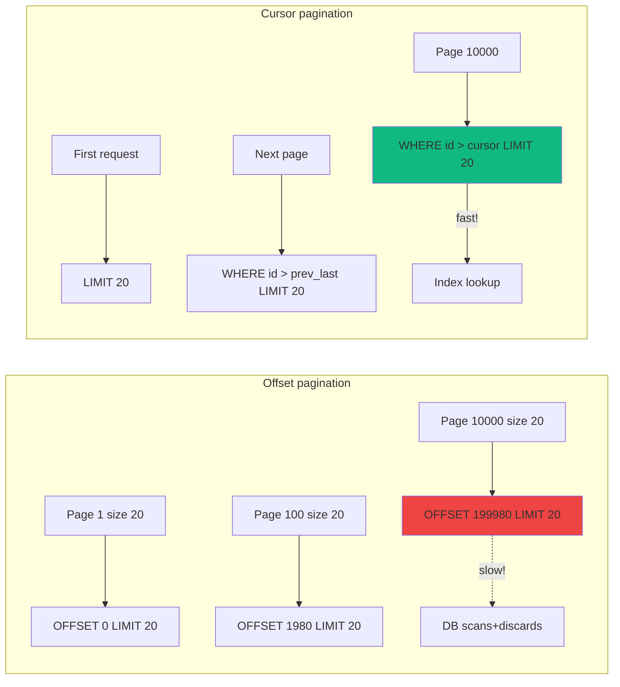

#### Interview question — Common interview question

**Q:** Offset-based vs cursor-based pagination — production me kab kaunsa choose karoge? Edge cases — duplicates / missed items in cursor pagination — kaise handle karte ho?

> Offset vs Cursor — major decision factors:
> Offset-based pagination (?page=N&size=20):
> Pros:
> 1) Simple to implement. Spring Data Pageable supports out of box.
> 2) UI can show 'Page 47 of 200' — user sees total, can jump to specific page.
> 3) Works well for small datasets (< 100K rows).
> 4) Random page access — user clicks page 50 directly, works fine.
> Cons:
> 1) Performance degrades with depth. OFFSET 1M = scan + discard 1M rows. Some DBs optimize, most don't.
> 2) Inconsistent results when data changes. New rows added → page boundaries shift → user sees duplicates or skips.
> 3) Total count query expensive on huge tables. SELECT COUNT(*) on 100M rows can be slow.
> Cursor-based pagination (?cursor=abc&size=20):
> Pros:
> 1) Consistent performance regardless of depth. Index lookup at any 'page'.
> 2) Stable across data changes. New rows don't shift existing pagination.
> 3) No COUNT query needed.
> 4) Real-time feeds work correctly. Twitter/Facebook timeline → cursor-based, no missed posts.
> Cons:
> 1) No 'page 47 of 200' display — only 'next/previous'. UX trade-off.
> 2) No random access — can't jump to page 50 directly.
> 3) Implementation complexity — cursor encoding/decoding, sort stability.
> Decision matrix:
> Use OFFSET when:
> - Small to medium dataset (< 100K rows).
> - UI needs page numbers + jump capability.
> - Admin panels, traditional dashboards.
> - Static data (rarely modified during pagination).
> Use CURSOR when:
> - Large dataset (> 100K rows) or expected to grow.
> - Infinite scroll / load more UX.
> - High write rate during pagination — feeds, logs, real-time data.
> - Mobile apps where pagination depth could be huge.
> - Public-facing APIs (predictable performance under load).
> Now cursor pagination edge cases — important pitfalls:
> 1) Duplicate items at page boundaries:
> Scenario: cursor based on createdAt timestamp. Two items at exactly same timestamp. Page 1 ends with item A (createdAt = T). Page 2 starts WHERE createdAt > T — skips item B that also has createdAt = T.
> Solution: composite cursor. Sort by (timestamp, id) — stable secondary key. Cursor includes both. WHERE (timestamp > T) OR (timestamp = T AND id > lastId). Tiebreaker on id ensures no duplicates or skips.
> 2) Missed items when sort key updates:
> Scenario: paginating by 'lastModifiedAt' DESC. User updates an item — its sort key changes. Item moves from page 5 to page 1. User scrolling sees same item twice or misses other items.
> Solution: paginate by IMMUTABLE field (id, createdAt — never modified). Or version/snapshot pagination — cursor includes snapshot version, gets consistent view.
> 3) New items appearing during scroll:
> Scenario: paginating Twitter-like feed by createdAt DESC. User on page 3 (older posts). New post created — appears at top, on page 1. User doesn't see it (already past page 1).
> Solution: depends on UX. Twitter shows 'X new tweets' banner at top — user clicks to refresh from beginning. Or bidirectional cursor — cursor for both 'older' and 'newer' navigation.
> 4) Deleted items at boundary:
> Scenario: page 1 shows items 1-20. User deletes item 20. Page 2 starts WHERE cursor = (T20, id20). But id20 doesn't exist anymore.
> Solution: cursor still works — WHERE (timestamp > T20) OR (timestamp = T20 AND id > id20). Even if id20 is deleted, comparison with cursor value works mathematically.
> 5) Backward navigation (previous page):
> Cursor-based naturally only goes forward. Backward needs 'inverse query' — WHERE clause flipped, sort reversed, then re-reverse results.
> Or, store cursor history client-side. User clicks 'prev' → use previous cursor.
> Real production wisdom:
> Composite cursor with secondary key is ESSENTIAL for cursor pagination. Single-key (just timestamp) breaks at duplicate values. Always include id as tiebreaker.
> Document cursor opacity. Don't let clients parse cursor format. Encode as base64 JSON. Allows server-side cursor format changes without breaking clients.
> Test with realistic data — duplicate timestamps, modifications during pagination, deletions. Easy to miss in unit tests, common in production.
> Real production scenario: Razorpay's transaction list. Cursor based on (createdAt DESC, id DESC). Composite key handles same-timestamp transactions correctly. Frontend uses infinite scroll, backend handles 100M+ transactions efficiently. No 'page 47' UX needed in this flow.
> [Difficulty: Hard · Asked at: Amazon, Atlassian, Razorpay, Postman, Microsoft. Follow-ups: 'Keyset pagination kya hai?', 'Pagination + caching strategy?']

## Data persistence with JPA

### JPA entities

#### Kya hai? — What are JPA entities?

JPA entity basically ek Java class hai jo database table represent karti hai. Class fields = table columns. Class instance = table row. JPA ye mapping handle karta hai — tu Java me kaam karta hai, JPA SQL generate karta hai.

Standard annotations: @Entity (class ko entity mark karta hai), @Table (table name override), @Id (primary key field), @Column (column name/properties), @GeneratedValue (auto-generated PK strategy).

Basic concept ye hai: tu Order class banata hai with fields like id, customerEmail, totalAmount, status. JPA orders table maintain karta hai with corresponding columns. Tu Java code likhta hai — orderRepo.save(order) — JPA INSERT/UPDATE SQL generate karta hai.

#### Kyun zaroori hai? — Why use JPA over plain JDBC?

Plain JDBC me kya karna padta hai: Connection open, PreparedStatement bana, parameters set kar, executeQuery, ResultSet iterate kar, har column manually map karke object banao, exceptions handle karo, connection close. Sirf ek INSERT ke liye 30+ lines.

JPA me wahi kaam 1 line: orderRepo.save(order). Behind the scenes JPA SQL generate karta hai, parameters bind karta hai, transactions manage karta hai, ResultSet ko object me convert karta hai automatically.

Plus JPA gives you object graph navigation. Order ke pas customer hai? order.getCustomer().getAddress().getCity() — JPA needed JOINs khud kar leta hai (with care — N+1 problem real hai).

Tradeoff: JPA learning curve hai. Lazy vs eager loading, transactions, N+1 queries, second-level cache — ye samajhna padta hai. Plain JDBC simpler hai but verbose. Industry me 90% Spring Boot apps JPA + Hibernate use karte hain.

#### Kaise kaam karta hai? — How to define entities properly

Basic entity me @Entity, @Table optional but recommended (explicit naming), @Id with generation strategy. ID generation: AUTO (let Hibernate decide), IDENTITY (DB auto-increment), SEQUENCE (DB sequence — preferred for Postgres), UUID for distributed systems.

Field mapping: @Column for non-default mapping (null constraints, length, unique). @Enumerated(EnumType.STRING) for enums — never use ORDINAL because adding new enum values shifts indices and corrupts data.

Relationships: @OneToMany, @ManyToOne, @OneToOne, @ManyToMany. @ManyToOne owning side hota hai usually (foreign key wahan hota hai). Lazy loading default — eager loading se bachna chahiye unless specifically chahiye.

Best practice: separate domain entities aur DTOs. Entity DB shape represent karta hai, DTO API contract. Direct entity expose karna anti-pattern hai — couples your DB schema to API consumers.

Always equals/hashCode override karne se bach jab tak business identity nahi hai. Default Object.equals reference equality use karta hai — safer hai entities ke liye. Lombok @Data avoid kar entities pe — pitfalls hain.

```java
// Razorpay-style payment entity
@Entity
@Table(name = "payments", indexes = {
    @Index(name = "idx_payments_status", columnList = "status"),
    @Index(name = "idx_payments_customer", columnList = "customer_id")
})
public class Payment {

    @Id
    @GeneratedValue(strategy = GenerationType.UUID)
    private UUID id;

    @Column(name = "payment_id", nullable = false, unique = true, length = 32)
    private String paymentId;  // public-facing ID like "pay_abc123"

    @Column(name = "customer_id", nullable = false)
    private UUID customerId;

    @Column(name = "amount", nullable = false, precision = 19, scale = 2)
    private BigDecimal amount;  // money is BigDecimal, NEVER double

    @Column(nullable = false, length = 3)
    private String currency;

    @Enumerated(EnumType.STRING)  // string, NOT ordinal
    @Column(nullable = false)
    private PaymentStatus status;

    @Column(name = "created_at", nullable = false, updatable = false)
    private Instant createdAt;

    @Column(name = "updated_at", nullable = false)
    private Instant updatedAt;

    @PrePersist
    void onCreate() {
        Instant now = Instant.now();
        this.createdAt = now;
        this.updatedAt = now;
    }

    @PreUpdate
    void onUpdate() {
        this.updatedAt = Instant.now();
    }

    // No-arg constructor required by JPA
    protected Payment() {}

    public Payment(String paymentId, UUID customerId, BigDecimal amount, String currency) {
        this.paymentId = paymentId;
        this.customerId = customerId;
        this.amount = amount;
        this.currency = currency;
        this.status = PaymentStatus.CREATED;
    }

    // ... getters / setters
}

public enum PaymentStatus {
    CREATED, AUTHORIZED, CAPTURED, FAILED, REFUNDED
}
```

#### Real-life example — Real-life example — Flipkart order entity with relationships

Flipkart order me ek Order multiple OrderItems contain karta hai. Customer ki ek profile hai jisme orders attached hain. Production-grade entity design me ye relationships properly model karna padta hai.

Approach: @ManyToOne for OrderItem → Order (FK orders me hai), @OneToMany for Order → OrderItems (collection). FetchType.LAZY default — explicit eager loading sirf wahan jahan zaroorat hai.

Pitfall sabse common — N+1 query problem. List of Orders fetch karte ho — har Order ke OrderItems lazy load hote hain. 100 orders = 1 + 100 queries. Solution: @EntityGraph ya JOIN FETCH JPQL me use karo specific queries me.

Cascade types important hain. CascadeType.ALL on @OneToMany matlab Order delete hoga to OrderItems bhi automatically delete. CascadeType.PERSIST sirf save par cascade. Wrong cascade choose karna data integrity issues create karta hai.

```java
@Entity
@Table(name = "orders")
public class Order {

    @Id
    @GeneratedValue(strategy = GenerationType.UUID)
    private UUID id;

    @ManyToOne(fetch = FetchType.LAZY, optional = false)
    @JoinColumn(name = "customer_id", nullable = false)
    private Customer customer;

    // Order delete = OrderItems delete (cascade)
    // orphanRemoval — agar OrderItem list se hata diya, DB se bhi delete
    @OneToMany(
        mappedBy = "order",
        cascade = CascadeType.ALL,
        orphanRemoval = true,
        fetch = FetchType.LAZY
    )
    private List<OrderItem> items = new ArrayList<>();

    @Column(name = "total_amount", precision = 19, scale = 2)
    private BigDecimal totalAmount;

    // Helper method — bidirectional consistency maintain karta hai
    public void addItem(OrderItem item) {
        items.add(item);
        item.setOrder(this);
    }

    public void removeItem(OrderItem item) {
        items.remove(item);
        item.setOrder(null);
    }
}

@Entity
@Table(name = "order_items")
public class OrderItem {

    @Id
    @GeneratedValue(strategy = GenerationType.UUID)
    private UUID id;

    @ManyToOne(fetch = FetchType.LAZY, optional = false)
    @JoinColumn(name = "order_id", nullable = false)
    private Order order;  // owning side — FK yahan hai

    @Column(name = "product_id", nullable = false)
    private UUID productId;

    private int quantity;

    @Column(precision = 19, scale = 2)
    private BigDecimal unitPrice;
}
```

#### Visual — Entity relationships

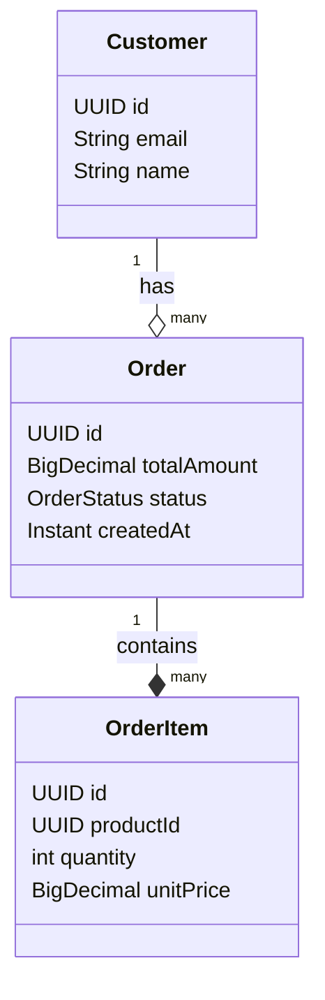

#### Interview question — Common interview question

**Q:** FetchType.LAZY vs FetchType.EAGER — production me default kya rakhega aur kyu? N+1 query problem kya hai aur solve kaise karoge?

> Production me LAZY default rakhna chahiye, almost always. EAGER reasoning samajh — wo bolta hai 'jab bhi parent entity load ho, ye related entities bhi fetch kar lo'. Innocent lagta hai but production performance disaster hai.
> Concrete example: Order entity me @ManyToOne(fetch=EAGER) Customer hai. Tu 1000 orders fetch karta hai list endpoint pe. Hibernate har order ke saath customer fetch karega — agar EAGER use JOIN ya separate queries, depending on configuration. Memory me 1000 customer objects unnecessary load ho gaye.
> Worse: agar Customer ke pas EAGER Address hai, aur Address pe EAGER City — chain reaction. Ek query bahut bada object graph load karne lagta hai. Latency 10ms se 500ms ho jaata hai mysteriously.
> LAZY default karne se tu explicit hota hai — jahan zaroori hai, JOIN FETCH ya @EntityGraph se specifically fetch karta hai. Object graph control me rehta hai.
> N+1 query problem ye hai: tu list of Orders fetch karta hai (1 query). Har Order pe lazy customer hai. Jab tu loop karke order.getCustomer().getEmail() access karta hai, har order ke liye separate SELECT chal jaata hai. 100 orders = 1 + 100 = 101 queries. DB load badh jaata hai exponentially.
> Solution multiple hain:
> 1) JOIN FETCH JPQL me — '@Query("SELECT o FROM Order o JOIN FETCH o.customer")'. Single query me sab data aata hai. Best for one-time queries.
> 2) @EntityGraph annotation — repository method pe @EntityGraph(attributePaths = {"customer", "items"}) lagaate hain. Cleaner than JPQL, type-safe.
> 3) Open Session in View pattern avoid karo — anti-pattern hai jo problem hide karta hai instead of solving.
> 4) DTO projection — agar tu sirf email aur name chahiye, full entity load karne se kya fayda? Custom @Query SELECT new com.flipkart.OrderSummary(o.id, c.email, c.name) FROM Order o JOIN o.customer c.
> 5) Profile me Hibernate statistics enable karo. Production traffic pe slow endpoints me N+1 detect karna critical skill hai.
> Asked at: Amazon, Microsoft, Razorpay, Atlassian, Flipkart. Follow-ups: '@OneToMany default fetch kya hai?', 'JOIN FETCH ke saath Pageable use kar sakte ho?'

### Repository pattern

#### Kya hai? — What is the Spring Data repository pattern?

Spring Data repository basically ek interface hai jo standard CRUD operations (save, findById, findAll, delete) automatic provide kar deta hai. Tu sirf interface declare karta hai — Spring Data implementation runtime me generate karta hai.

Hierarchy: Repository (marker), CrudRepository (basic CRUD), PagingAndSortingRepository (+ pagination), JpaRepository (everything + JPA-specific stuff like flush, batch, etc.). Most projects me JpaRepository extend karte hain.

Plus query method magic: tu method declare karta hai 'List<Order> findByCustomerIdAndStatus(...)' — Spring Data parse karta hai method name aur SQL generate kar deta hai. No implementation needed.

#### Kyun zaroori hai? — Why use Spring Data repositories?

Pehle DAO (Data Access Object) pattern me tu manually OrderDAO class likhta tha har entity ke liye. Inside, EntityManager inject karke find/persist/createQuery calls. 80% boilerplate hota tha — same CRUD pattern har entity ke liye.

Spring Data ne DRY enforce kiya. CRUD operations free milte hain. Tu sirf custom queries likhta hai jo unique business needs ke liye chahiye.

Plus benefits: pagination/sorting built-in (Pageable parameter), auditing (createdAt/updatedAt automatic), specifications (dynamic queries), projections (return only needed columns).

Tradeoff: query method names complex queries ke liye unreadable ho jaate hain. findByCustomerIdAndStatusInAndCreatedAtBetweenOrderByCreatedAtDesc — kaisa lagta hai? Complex queries ke liye @Query annotation use kar JPQL ya native SQL ke saath.

#### Kaise kaam karta hai? — How to design repositories well

Basic interface: 'public interface PaymentRepository extends JpaRepository<Payment, UUID>' — automatic CRUD ready. Type parameters: entity class aur primary key type.

Query methods rules: prefix find/exists/count/delete + By + property name + comparison operators (Equals, GreaterThan, Between, In, Like, etc.). Spring docs me full grammar hai.

Complex queries — @Query JPQL ya nativeQuery=true with raw SQL. Always parameter binding use karo (?1 ya :name) — string concatenation = SQL injection.

Pagination — method parameter pe Pageable add kar, return type Page<T>. 'Page<Payment> findByStatus(PaymentStatus status, Pageable pageable)'. Service layer PageRequest.of(0, 20, Sort.by('createdAt').descending()) pass karta hai.

Custom repository methods (when query methods nahi enough hote): custom interface bana, implementation class bana, main repo extend kar dono. Spring Data merge kar deta hai.

```java
// Spring Data magic — interface extend, methods declare, implementation FREE
public interface PaymentRepository extends JpaRepository<Payment, UUID> {

    // Query method — Spring Data SQL khud generate karta hai
    Optional<Payment> findByPaymentId(String paymentId);

    // Multiple criteria + pagination
    Page<Payment> findByCustomerIdAndStatus(
        UUID customerId, PaymentStatus status, Pageable pageable
    );

    // Existence check — efficient SELECT 1 query
    boolean existsByPaymentIdAndStatus(String paymentId, PaymentStatus status);

    // Custom JPQL query — complex logic ke liye
    @Query("""
        SELECT p FROM Payment p
        WHERE p.status = :status
        AND p.createdAt BETWEEN :start AND :end
        ORDER BY p.amount DESC
    """)
    List<Payment> findFailedInWindow(
        @Param("status") PaymentStatus status,
        @Param("start") Instant start,
        @Param("end") Instant end
    );

    // Native SQL — JPQL me express nahi ho sakti complex queries
    @Query(value = """
        SELECT date_trunc('hour', created_at) AS bucket,
               COUNT(*) AS count,
               SUM(amount) AS total
        FROM payments
        WHERE created_at >= :since
        GROUP BY bucket
        ORDER BY bucket DESC
    """, nativeQuery = true)
    List<HourlyStats> getHourlyStats(@Param("since") Instant since);

    // Update query — write operations need @Modifying
    @Modifying
    @Query("UPDATE Payment p SET p.status = :status WHERE p.id IN :ids")
    int bulkUpdateStatus(@Param("ids") List<UUID> ids,
                          @Param("status") PaymentStatus status);
}

// Service me clean usage
@Service
public class PaymentService {
    private final PaymentRepository repo;

    public Page<Payment> listPayments(UUID customerId, PaymentStatus status, int page) {
        Pageable pageable = PageRequest.of(page, 20,
                                            Sort.by("createdAt").descending());
        return repo.findByCustomerIdAndStatus(customerId, status, pageable);
    }
}
```

#### Real-life example — Real-life example — Swiggy order analytics dashboard

Swiggy ka analytics dashboard restaurant partners ko revenue, order counts, peak hours dikhata hai. Backend me complex queries chahiye — daily aggregates, customer LTV, top items, etc.

Approach: simple CRUD queries Spring Data query methods se, complex aggregates @Query JPQL se ya native SQL se. Materialized views (Postgres) bhi consider karte hain heavy aggregates ke liye — daily refresh ke saath.

Production tip: read replicas use karo analytics queries ke liye. Writes primary DB pe, analytics queries replica pe — main transaction load slow nahi hota dashboard se. Spring Boot me @Transactional(readOnly = true) replicas pe route ho sakta hai with proper datasource routing.

```java
// Restaurant analytics ke liye repository methods
public interface OrderAnalyticsRepository extends JpaRepository<Order, UUID> {

    // Per-restaurant daily aggregates — projection use karke sirf needed columns
    @Query("""
        SELECT new com.swiggy.analytics.DailyStats(
            CAST(o.createdAt AS LocalDate) AS day,
            COUNT(o) AS orders,
            SUM(o.totalAmount) AS revenue,
            AVG(o.totalAmount) AS avgOrderValue
        )
        FROM Order o
        WHERE o.restaurantId = :restaurantId
        AND o.createdAt >= :since
        GROUP BY CAST(o.createdAt AS LocalDate)
        ORDER BY day DESC
    """)
    List<DailyStats> getDailyStats(
        @Param("restaurantId") UUID restaurantId,
        @Param("since") Instant since
    );

    // Top items — native SQL kyunki window functions JPQL me limited hain
    @Query(value = """
        SELECT product_id, COUNT(*) AS cnt
        FROM order_items oi
        JOIN orders o ON o.id = oi.order_id
        WHERE o.restaurant_id = :restaurantId
        AND o.created_at >= :since
        GROUP BY product_id
        ORDER BY cnt DESC
        LIMIT :topN
    """, nativeQuery = true)
    List<TopItem> getTopItems(
        @Param("restaurantId") UUID restaurantId,
        @Param("since") Instant since,
        @Param("topN") int topN
    );
}
```

#### Visual — Repository abstraction layer

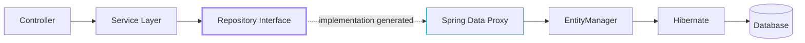

#### Interview question — Common interview question

**Q:** Query method (findByXxx) vs @Query annotation vs custom repository implementation — kab kaunsa use karte ho production code me?

> Three approaches hain Spring Data me, har ek ka apna sweet spot:
> 1) Query methods (findByCustomerIdAndStatus) — best for simple CRUD-style queries with 1-3 conditions. Pros: no SQL/JPQL likhna, type-safe parameters, refactoring me method rename karne pe IDE handle kar leta hai. Cons: complex queries me method names monstrous ho jaate hain. findByCustomerIdAndStatusInAndCreatedAtBetweenOrderByCreatedAtDescNullsLast — readable nahi.
> Rule of thumb: agar method name 80 characters se zyada ho rahi hai, ya 4+ conditions hain, switch to @Query.
> 2) @Query annotation — best for complex JPQL/native SQL with joins, subqueries, aggregations. Pros: full SQL power, readable, parameter binding safe with :name syntax. Cons: refactoring me JPQL strings update karne padte hain manually. Type safety method parameters tak hi hai.
> Practical: aggregate queries, joins with multiple tables, subqueries, window functions — sab @Query me likhta hu. JPQL preferred over native SQL kyunki database-portable hai. Native SQL sirf jab JPQL me feature support nahi (e.g., Postgres-specific GIN index queries, window functions me edge cases).
> 3) Custom repository implementation — best for complex programmatic logic, dynamic queries, multi-step operations. Pros: full control, can use Criteria API for type-safe dynamic queries, can mix multiple repositories ya external services. Cons: most code, most maintenance.
> Use cases: dynamic search (user can filter on any combination of 10 fields — Specification API ya Querydsl), bulk operations with custom batching, audit log writes, queries that need custom transaction semantics.
> Pattern: PaymentRepositoryCustom interface define kar with custom methods, PaymentRepositoryCustomImpl class implement kar, main PaymentRepository dono extend kare. Spring Data automatically merge karta hai.
> Real example — Razorpay search API users ko 8 different filters allow karta hai (status, amount range, customer, gateway, etc.). Query methods se nahi ho sakta — combinatorial explosion. @Query bhi sub-optimal kyunki dynamic conditions handle karna painful. Solution: custom impl with Specification API jo at runtime predicates compose karta hai.
> Asked at: Amazon, Microsoft, Razorpay, Atlassian, Flipkart. Follow-ups: 'Specification kya hai aur kab use karte ho?', 'JPA Criteria API vs Querydsl?'

### Transactions

#### Kya hai? — What are transactions in Spring?

Transaction basically database operations ka ek atomic group hai — ya to saari operations succeed kare, ya saari rollback ho jaayein. ACID properties guarantee karne ka mechanism.

Spring me declarative transactions — @Transactional annotation method ya class pe lagaate hain. Spring AOP proxies use karke bean methods ke around transaction begin/commit/rollback inject karta hai.

Programmatic transactions bhi possible hain (TransactionTemplate ya PlatformTransactionManager), but declarative @Transactional 99% cases me sufficient aur cleaner.

#### Kyun zaroori hai? — Why transactions matter in production?

Money transfer example le. Customer A ke account se 100 rupees nikaalo, Customer B ke account me 100 rupees daalo. Two separate UPDATE statements. Agar pehla succeed hua aur doosra fail hua (network timeout, app crash, anything), 100 rupees vanish ho gaye thin air me. Disaster.

Transactions ye prevent karte hain. Begin, two updates, commit. Agar bich me kuch fail hua, automatic rollback — pehla update bhi undo. Money conserved.

Plus consistency. Concurrent users same row update kar rahe hain — kaun jeetega? Without transactions, race conditions, lost updates, dirty reads. Transactions isolation levels provide karte hain — different tradeoffs of consistency vs performance.

#### Kaise kaam karta hai? — How @Transactional actually works

@Transactional annotation Spring AOP proxy banata hai. Jab tu method call karta hai, actually proxy method call hoti hai jo: 1) transaction start kare, 2) actual method invoke kare, 3) success pe commit, exception pe rollback, 4) transaction end.

Default behavior: Spring sirf RuntimeException pe rollback karta hai. Checked exception (IOException etc.) pe nahi. Agar tu chahta hai ki checked exception pe bhi rollback ho, @Transactional(rollbackFor = Exception.class) likh.

Propagation defaults to REQUIRED — agar transaction already running hai use karo, warna naya start karo. Nested transactions, READ-ONLY, REQUIRES_NEW — different propagation modes hain. REQUIRES_NEW common hai jab tu chahta hai ki ek operation parent transaction se independent ho (e.g., audit log writes).

Important gotcha — @Transactional self-invocation pe kaam nahi karta. Agar tu same class me ek method dusra @Transactional method call kare 'this.otherMethod()' se, proxy bypass ho jaata hai aur transaction nahi banta. Either alag class me method dal, ya programmatic transaction use kar.

Read-only transactions — @Transactional(readOnly = true) — read-only intent declare karta hai. Hibernate dirty checking skip karta hai, performance better. Read replicas pe routing bhi possible.

```java
// Razorpay-style refund service — atomic operation
@Service
public class RefundService {

    private final PaymentRepository paymentRepo;
    private final RefundRepository refundRepo;
    private final NotificationService notifications;

    public RefundService(PaymentRepository paymentRepo,
                         RefundRepository refundRepo,
                         NotificationService notifications) {
        this.paymentRepo = paymentRepo;
        this.refundRepo = refundRepo;
        this.notifications = notifications;
    }

    // Saara database work ek transaction me — atomic guarantee
    @Transactional(rollbackFor = Exception.class)
    public Refund processRefund(String paymentId, BigDecimal amount, String reason) {
        Payment payment = paymentRepo.findByPaymentId(paymentId)
            .orElseThrow(() -> new PaymentNotFoundException(paymentId));

        if (payment.getStatus() != PaymentStatus.CAPTURED) {
            throw new InvalidStateException("Payment not captured, cannot refund");
        }

        if (amount.compareTo(payment.getAmount()) > 0) {
            throw new ValidationException("Refund amount exceeds payment");
        }

        // 1) Payment status update
        payment.setStatus(PaymentStatus.REFUNDED);
        paymentRepo.save(payment);

        // 2) Refund record create
        Refund refund = new Refund(payment.getId(), amount, reason);
        refundRepo.save(refund);

        // Agar ye throw kare, dono saved entries rollback ho jaayengi
        // (declarative transaction beauty)

        // 3) Notification — alag transaction me chahte hain
        // kyunki notification fail ho to refund still commit hona chahiye
        // REQUIRES_NEW yahi situation me kaam aata hai (next method dekho)
        notifications.notifyAsync(payment.getCustomerId(), refund);

        return refund;
    }
}

// Audit logger — REQUIRES_NEW se parent transaction se independent
@Service
public class AuditService {

    @Transactional(propagation = Propagation.REQUIRES_NEW)
    public void log(String action, UUID entityId, String details) {
        // Even agar caller ka transaction rollback ho,
        // audit log alag transaction me hai — committed reh jaata hai
        AuditLog log = new AuditLog(action, entityId, details, Instant.now());
        auditRepo.save(log);
    }
}

// Read-only optimization
@Service
public class PaymentQueryService {

    @Transactional(readOnly = true)
    public Page<Payment> search(SearchCriteria criteria, Pageable pageable) {
        // Hibernate dirty checking skip — better perf
        return repo.search(criteria, pageable);
    }
}
```

#### Real-life example — Real-life example — Flipkart order placement

Order place karna multi-step operation hai: 1) Inventory reduce kar (lock product rows), 2) Order entity create kar, 3) Payment authorize kar, 4) Notification trigger kar. Agar bich me kuch fail hua, sab undo hona chahiye — partial state never.

Approach: top-level @Transactional method. Inventory + Order + Payment authorize sab ek transaction me. Notification REQUIRES_NEW me (failure tolerable, parent rollback nahi karna chahiye).

Edge case — payment gateway slow ho raha hai, transaction lambi chal rahi hai, DB connection block ho rahi hai dusre orders ke liye. Solution: payment gateway call ko transaction se BAHAR rakhte hain. Pattern: pehle DB me 'authorization pending' state save karte hain, transaction commit, fir gateway call. Gateway result aane pe naya transaction with state update.

Lesson: long-running external calls (HTTP, message queue) ko @Transactional ke andar avoid karo. Connection holds ho jaata hai, throughput crash hota hai. Saga pattern ya event-driven workflows use karte hain distributed transactions ke liye.

```java
// Order service — careful transaction boundaries
@Service
public class OrderPlacementService {

    @Transactional(rollbackFor = Exception.class, timeout = 5)
    // ☝️ timeout 5 sec — long-running transaction se bach
    public OrderResult placeOrder(PlaceOrderRequest req) {
        // 1) Inventory check + reserve (DB locks)
        for (CartItem item : req.items()) {
            inventoryRepo.reserveStock(item.productId(), item.quantity());
            // pessimistic lock le ke stock decrement, agar nahi mila throw exception
        }

        // 2) Order entity create
        Order order = new Order(req.customerId(), req.totalAmount());
        order.setStatus(OrderStatus.PAYMENT_PENDING);
        for (CartItem ci : req.items()) {
            order.addItem(new OrderItem(ci.productId(), ci.quantity(), ci.price()));
        }
        order = orderRepo.save(order);

        // 3) Authorization record save — actual gateway call NHI yaha
        Authorization auth = new Authorization(order.getId(), req.totalAmount());
        authRepo.save(auth);

        return new OrderResult(order.getId(), auth.getId());
        // Transaction commits here — DB state consistent
    }

    // Gateway call ALAG method, NO transaction
    public PaymentResult authorizePayment(UUID orderId, UUID authId) {
        // External HTTP call — slow, can fail, retry karna ho sakta hai
        return paymentGateway.authorize(authId);
        // Result aaya, fir agla transactional method call kar order update karne
    }

    @Transactional
    public void completeOrder(UUID orderId, PaymentResult result) {
        Order order = orderRepo.findById(orderId).orElseThrow();
        if (result.success()) {
            order.setStatus(OrderStatus.CONFIRMED);
        } else {
            order.setStatus(OrderStatus.PAYMENT_FAILED);
            // Inventory rollback as compensating action
            for (OrderItem item : order.getItems()) {
                inventoryRepo.restoreStock(item.getProductId(), item.getQuantity());
            }
        }
        orderRepo.save(order);
    }
}
```

#### Visual — Transaction lifecycle

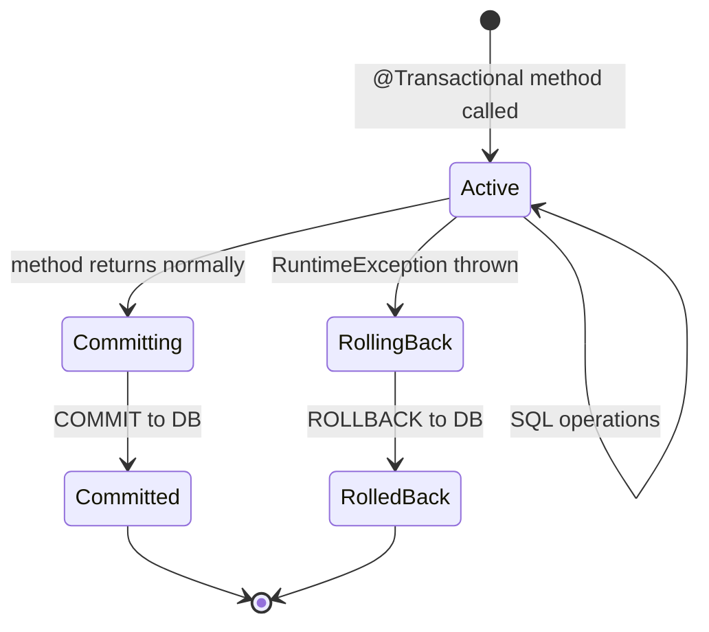

#### Interview question — Common interview question

**Q:** @Transactional self-invocation problem kya hai? Production code me kab REQUIRES_NEW propagation use karoge?

> Self-invocation problem ye hai — Spring's @Transactional AOP proxies pe based hai. Jab tu external code se @Transactional method call karta hai, proxy intercept karta hai aur transaction wrap karta hai. But agar tu SAME class ke andar ek method se dusra @Transactional method call kare 'this.otherMethod()' se, proxy bypass ho jaata hai. Direct method invocation hota hai, transaction NAHI banta.
> Concrete example: PaymentService me publicMethod() hai (no @Transactional) jo internalUpdate() call karta hai (jisme @Transactional hai). External caller publicMethod() call karta hai — proxy invoke hua. Lekin publicMethod() ke andar 'this.internalUpdate()' direct call hai, proxy bypass — internalUpdate ka @Transactional ignore ho gaya. Bug catastrophic hai kyunki silent failure hai.
> Detection: usually production me jab koi expected rollback nahi hota, code review me catch karte hain. Better: Spring AOP debug logs enable, ya code analysis tools jaise SpotBugs use kar.
> Solutions: 1) Methods ko alag classes me extract kar — natural transaction boundaries banti hain. 2) Self-injection — same class apne aap ko @Autowired field pe inject kare aur 'self.internalUpdate()' call kare. Hacky but works. 3) AspectJ weaving (instead of proxy AOP) — compile-time weaving, no proxy needed. Setup complex hai. 4) Programmatic transactions (TransactionTemplate) — proxy independent.
> Industry best practice — Solution 1 ya 4. Service classes ka responsibility split karna design improvement bhi hai.
> REQUIRES_NEW propagation kab use karte hain production me:
> 1) Audit logging. Tu chahte hain ki business operation rollback ho fir bhi audit entry committed reh — security/compliance ke liye. AuditService.log() pe REQUIRES_NEW lagaaya. Parent transaction rollback ho, audit log fir bhi DB me hai.
> 2) Notification dispatch records. SMS/email send karne ki record table me likhna chahte hain even agar parent operation fail ho. Independent transaction needed.
> 3) Outbox pattern for event publishing. Reliable event delivery ke liye event ko alag transaction me record karte hain. Even if business transaction rollback, no event leaked. Conversely, agar business commit hua, event row guaranteed exists for outbox poller to pick up.
> 4) Counter/metric writes that should be eventual-consistent. Failed counter update should not fail business operation.
> 5) Long-running operations broken into chunks — har chunk REQUIRES_NEW me, partial progress preserve hota hai even if later chunks fail.
> Caveat: REQUIRES_NEW alag DB connection le leta hai parent transaction ke saath simultaneously. Pool exhaustion ka risk hai high-traffic me. Pool size tune karna padta hai.
> Asked at: Amazon, Atlassian, Razorpay, Goldman Sachs, Microsoft. Follow-ups: 'NESTED propagation kya hai?', 'Distributed transactions Spring Boot me kaise handle karte ho?'
