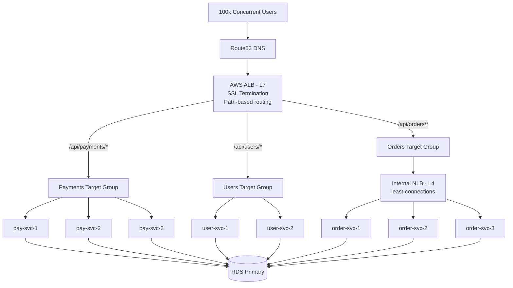
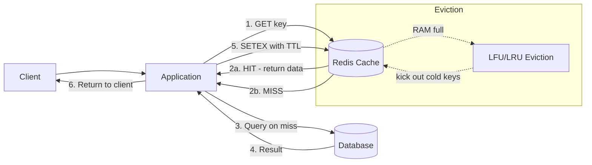
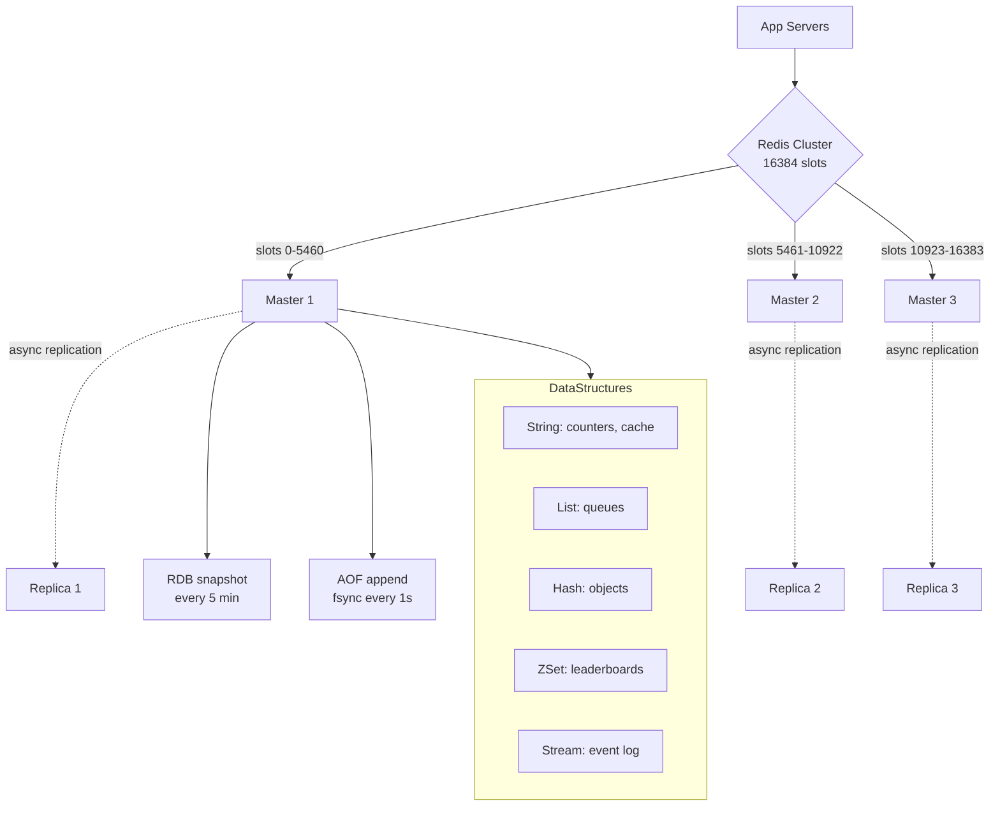
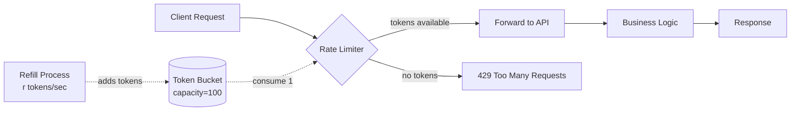
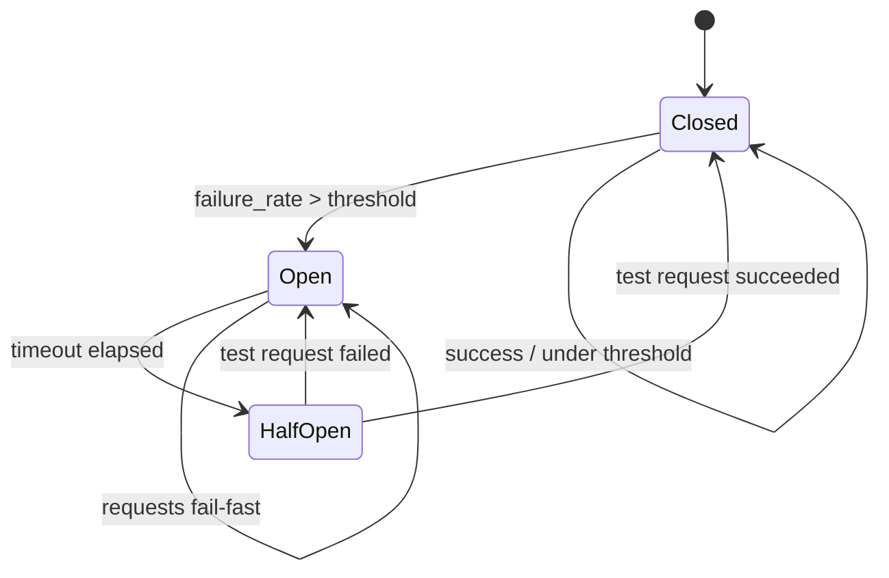
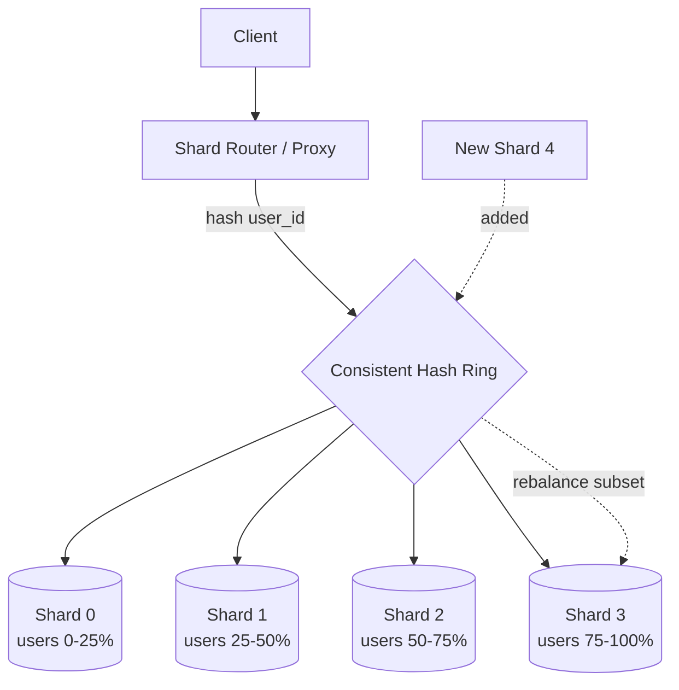
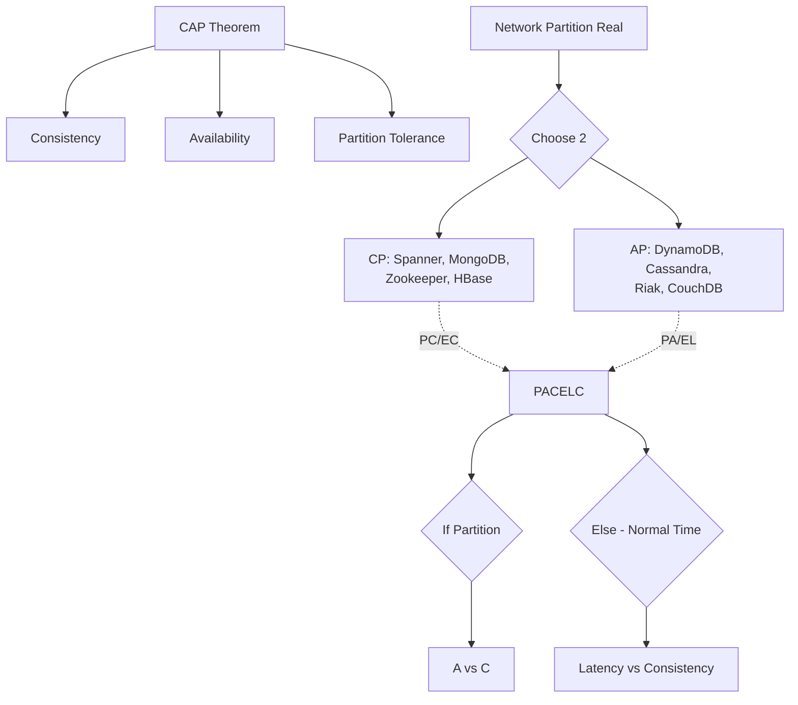

# System Design Advanced — Part 1: Load Balancing & Caching

Bhai, welcome to advanced system design. Ab tak tu basics dekh chuka hai — REST APIs, databases, basic deployment. Lekin jab traffic 100 req/sec se badhke 100k req/sec ho jaata hai, tab simple architecture todhne lagta hai. Ek server kaafi nahi hota, database queries slow ho jaati hain, aur users ko 5-second latency milne lagti hai. Yahin pe load balancing aur caching teri zindagi bachate hain.

Is part mein hum do core pillars cover karenge — load balancing (jo traffic ko multiple servers mein baant ta hai) aur caching (jo expensive operations ko avoid karta hai by storing results). Ye dono milke teri system ki throughput ko 10x-100x tak badha sakte hain agar sahi se implement kiye jaayein. Production mein ye optional nahi hain, mandatory hain. Chal shuru karte hain.

---

## 1. Load balancing

### 1.1 L4 (transport) vs L7 (application) load balancers, algorithms — round-robin, least-connections, IP-hash, weighted

#### Definition

Load balancer basically ek traffic cop hai jo incoming requests ko multiple backend servers ke beech distribute karta hai. Tu socho — ek single server pe 10000 concurrent users aa rahe hain, woh CPU 100% pe pahunch jaayega aur crash ho jaayega. Lekin agar tu 10 servers laga de aur ek load balancer unke aage rakh de, har server ko sirf 1000 users handle karne padenge. Simple, lekin powerful.

Ab L4 vs L7 ka jhamela samajh. L4 load balancer transport layer pe kaam karta hai — yaani TCP/UDP packets ko dekhta hai, IP aur port ke basis pe routing karta hai. Usse pata bhi nahi hota ki packet ke andar HTTP hai ya kuch aur — woh blind forwarding karta hai. L7 load balancer application layer pe kaam karta hai — woh HTTP headers, URLs, cookies, JSON body sab parse kar sakta hai aur intelligent decisions le sakta hai jaise "/api/payments wala request payment-service ko bhej, /api/users wala user-service ko". Analogy le — L4 ek courier company hai jo sirf address dekh ke parcel forward karta hai bina khole, aur L7 ek smart receptionist hai jo parcel khol ke contents dekhta hai aur phir decide karta hai kahan bhejna hai.

#### Why?

Load balancing ke bina tu single point of failure mein phasega — ek server gira to poora system gira. Plus horizontal scaling ka koi tarika nahi rahega. Load balancer milta hai high availability (ek server marne pe traffic doosre ko jaata hai), horizontal scalability (servers add karke capacity badha sakte ho), aur better resource utilization. L7 specifically tujhe content-based routing, SSL termination, request rewriting, aur A/B testing jaisi superpowers deta hai jo L4 nahi de sakta. Tradeoff ye hai ki L7 thoda slower hota hai (kyunki HTTP parsing CPU khaata hai) aur L4 blazing fast hota hai (millions of packets/sec).

#### How?

Algorithms samajh:

- **Round-robin**: Servers ko cycle mein bhejta hai — req1→S1, req2→S2, req3→S3, req4→S1. Simple, fair, par servers ki actual load nahi dekhta.
- **Least-connections**: Jis server pe sabse kam active connections hain, request usko jaati hai. Long-lived connections (jaise WebSocket) ke liye behtar.
- **IP-hash**: Client IP ka hash leke server pick karta hai — same client always same server pe jaata hai. Sticky sessions ke liye useful.
- **Weighted round-robin**: Har server ko weight do (S1=5, S2=2, S3=1) — heavy server ko zyada traffic milta hai. Mixed hardware mein kaam aata hai.

Nginx ka L7 config dekh:

```nginx
# Backend pool define kar — yaani jin servers pe traffic bhejna hai
upstream api_backend {
    least_conn;  # algorithm — sabse kam connections wala server pick karega
    server 10.0.1.10:8080 weight=3;  # ye beefy machine hai, isko 3x traffic
    server 10.0.1.11:8080 weight=1;
    server 10.0.1.12:8080 weight=1 backup;  # ye sirf tab use hoga jab baaki down ho
    keepalive 32;  # connection pool — TCP handshake bachata hai
}

server {
    listen 443 ssl http2;
    server_name api.example.com;

    # SSL termination yahin pe — backend ko plain HTTP milega
    ssl_certificate /etc/ssl/cert.pem;
    ssl_certificate_key /etc/ssl/key.pem;

    location /api/payments/ {
        # content-based routing — payments ka apna pool ho sakta hai
        proxy_pass http://api_backend;
        proxy_set_header X-Real-IP $remote_addr;  # original IP backend tak pahuncha
        proxy_set_header X-Forwarded-For $proxy_add_x_forwarded_for;
        proxy_connect_timeout 5s;  # backend se connect karne ka timeout
        proxy_read_timeout 30s;
    }

    # Health check — agar backend 3 baar fail kare to 30s ke liye nikaal de
    # (Nginx Plus mein active health check, OSS mein passive)
}
```

L4 ke liye HAProxy TCP mode use hota hai:

```haproxy
# TCP mode mein HAProxy — transport layer pe kaam karega, HTTP nahi parse karega
frontend mysql_front
    bind *:3306
    mode tcp  # L4 mode — sirf TCP packets forward
    default_backend mysql_pool

backend mysql_pool
    mode tcp
    balance source  # IP-hash — same client same DB replica pe jaayega
    server db1 10.0.2.10:3306 check  # check = passive health monitoring
    server db2 10.0.2.11:3306 check
    server db3 10.0.2.12:3306 check backup
```

#### Real-life Example

Production scenario — tu ek e-commerce platform chala raha hai. Black Friday pe traffic 50x spike karta hai. Architecture aisa lagega:

1. **AWS ALB (L7)** internet ke saamne — SSL terminate karta hai, `/api/*` ko API tier pe bhejta hai, `/static/*` ko CDN pe redirect karta hai
2. **Internal NLB (L4)** API tier ke andar — service-to-service calls ke liye, ultra-low latency
3. **Auto-scaling group** — CPU > 70% pe naye instances spawn, ALB automatically register kar leta hai

Terraform snippet:

```hcl
# AWS Application Load Balancer — L7, HTTPS terminate karega
resource "aws_lb" "api_alb" {
  name               = "api-alb-prod"
  load_balancer_type = "application"  # L7
  subnets            = var.public_subnets
  security_groups    = [aws_security_group.alb.id]

  # Idle connections 60s ke baad close — cost bachata hai
  idle_timeout = 60
}

resource "aws_lb_target_group" "api" {
  name     = "api-tg"
  port     = 8080
  protocol = "HTTP"
  vpc_id   = var.vpc_id

  health_check {
    path                = "/health"  # tera app /health endpoint expose kare
    interval            = 15
    timeout             = 5
    healthy_threshold   = 2  # 2 successful checks ke baad healthy maano
    unhealthy_threshold = 3  # 3 fail = nikal do pool se
    matcher             = "200"
  }

  # Connection draining — agar instance terminate ho raha hai, in-flight requests complete hone do
  deregistration_delay = 30
}

# Listener rule — content-based routing
resource "aws_lb_listener_rule" "payments" {
  listener_arn = aws_lb_listener.https.arn
  priority     = 100

  action {
    type             = "forward"
    target_group_arn = aws_lb_target_group.payments.arn  # payments service ka apna TG
  }

  condition {
    path_pattern {
      values = ["/api/payments/*"]
    }
  }
}
```

Real impact — pehle single EC2 pe 2k RPS handle hota tha aur 95th percentile latency 800ms thi. ALB + 8 instances + least_conn algorithm ke baad 25k RPS handle hota hai aur p95 latency 90ms ho gayi. Yeh sab ek hi din mein deploy hua tha kyunki business ko Black Friday se pehle scale karna tha.

#### Diagram



#### Interview Question

**Q:** Tujhe ek WebSocket-based chat application scale karna hai jahan 1 million concurrent connections expect ho rahi hain. Konsa load balancer aur algorithm choose karega aur kyun?

**A:** WebSocket long-lived bidirectional connections use karta hai, isliye traditional round-robin yahan disaster hoga — ek connection ek baar establish hoke ghanton tak chal sakti hai, aur agar tu blindly distribute karega to kuch servers pe 10k connections aur kuch pe 100 ho jaayenge. Main L4 NLB use karunga (AWS NLB ya HAProxy in TCP mode) kyunki WebSocket ke liye ultra-low latency aur high throughput chahiye, aur L7 parsing yahan unnecessary overhead hai — ek baar HTTP upgrade ho gaya to baaki sab raw frames hain.

Algorithm ke liye **least-connections** ideal hai. Round-robin connection count ko ignore karta hai jo WebSocket ke liye galat hai. IP-hash bhi nahi chahiye kyunki sticky session ki zaroorat nahi — chat backend stateless hona chahiye with Redis pub/sub for cross-server message routing. Least-connections ensure karega ki naya client hamesha sabse free server pe land kare, aur connection distribution balanced rahe.

Plus extra considerations — connection draining lambi rakhni padegi (5+ minutes) taaki deploy ke time existing connections gracefully migrate ho. TCP keepalive enable karna padega taaki dead connections detect ho. Aur har backend instance ko file descriptor limit (`ulimit -n 1000000`) badhana padega kyunki Linux default 1024 hota hai jo 1M connections ke liye toot jaayega. Capacity planning mein assume karunga ki ek instance comfortably 50k WebSocket connections handle kar leta hai (with 4GB RAM, kernel tuning), to 1M ke liye 25 instances minimum chahiye including headroom.

---

## 2. Caching strategies (Redis)

### 2.1 Cache patterns — cache-aside, write-through, write-behind, refresh-ahead; TTL & eviction (LRU/LFU)

#### Definition

Cache basically ek fast storage layer hai jo expensive computations ya database queries ke results ko temporarily hold karta hai. Tu ek query DB se laata hai jo 200ms leti hai — agar wahi result tu Redis mein store kar de, agli baar 1ms mein milega. 200x speedup. Lekin cache ka asli challenge data ko store karna nahi hai, **invalidate** karna hai. "There are only two hard things in computer science: cache invalidation and naming things" — ye joke production mein roz sach hota hai.

Analogy le — cache ek student ki notebook hai jisme usne textbook (database) se important notes copy kar liye hain. Notebook se padhna fast hai, par agar textbook update ho gayi aur notebook purani rahi to galat answer aayega. Cache patterns basically rules hain ki notebook ko kab aur kaise update karna hai. Har pattern ka apna tradeoff hai — consistency vs performance vs complexity.

#### Why?

Database mehnga hai. Disk I/O, network round-trip, query parsing, locking — sab milke har query 10-500ms le sakti hai. Read-heavy workloads (jaise news feed, product catalog) mein 90% requests same data maangti hain. Cache na ho to tu DB ko unnecessarily hammer kar raha hai, paisa bhi waste kar raha hai (RDS instance bigger chahiye padega) aur latency bhi de raha hai. Properly designed cache 95%+ hit rate de sakta hai, jisse DB ka load 20x kam ho jaata hai aur user experience smooth ho jaata hai. Cost saving alag — Redis RAM cheaper hai DB compute se.

#### How?

Chaaron patterns ko detail mein dekh:

**1. Cache-aside (lazy loading)** — Application directly cache aur DB dono ke saath baat karta hai. Sabse common pattern.

```typescript
// Cache-aside — read flow
async function getUser(userId: string): Promise<User> {
  // Step 1: Cache mein check kar
  const cached = await redis.get(`user:${userId}`);
  if (cached) {
    return JSON.parse(cached);  // hit — DB ko bypass kar
  }

  // Step 2: Cache miss — DB se laa
  const user = await db.users.findOne({ id: userId });
  if (!user) throw new NotFoundError();

  // Step 3: Cache mein daal de future requests ke liye, TTL 5 min
  await redis.setex(`user:${userId}`, 300, JSON.stringify(user));
  return user;
}

// Write flow — DB update karke cache invalidate kar
async function updateUser(userId: string, data: Partial<User>) {
  await db.users.update({ id: userId }, data);  // pehle DB
  await redis.del(`user:${userId}`);  // phir cache nikaal — next read fresh laayega
}
```

Pros: Simple, only cache what's needed. Cons: First request slow (cache miss), stale data possible if writes bypass invalidation.

**2. Write-through** — Application cache ko likhta hai, cache automatically DB ko sync karta hai. Strong consistency.

```typescript
async function updateUser(userId: string, data: Partial<User>) {
  // Cache aur DB dono atomically update — cache layer DB write ko trigger karta hai
  const updated = { ...data, updatedAt: Date.now() };
  await redis.set(`user:${userId}`, JSON.stringify(updated));
  await db.users.update({ id: userId }, updated);  // synchronous DB write
  // Agar DB fail hua to cache rollback karna padega — complexity yahin hai
}
```

Pros: Cache aur DB always in-sync. Cons: Writes slow (do storage layer hit karne padte hain), unused data bhi cache mein bhar jaata hai.

**3. Write-behind (write-back)** — Cache ko likho, DB ko async batch mein flush karo. Ultra-fast writes.

```typescript
async function recordPageView(pageId: string) {
  // Cache mein turant — user ko response milta hai
  await redis.incr(`pageviews:${pageId}`);
  // Background worker har 10 sec mein cache se DB mein flush karega
  // Risk — agar Redis crash ho gaya before flush, data loss
}

// Background worker
setInterval(async () => {
  const keys = await redis.keys('pageviews:*');
  for (const key of keys) {
    const count = await redis.get(key);
    await db.pageviews.upsert({ pageId: key.split(':')[1], count });
  }
}, 10000);
```

Pros: Blazing fast writes, batch DB updates. Cons: Data loss risk on cache failure, complex to implement reliably.

**4. Refresh-ahead** — Cache khud predict karta hai ki kaunsa data jaldi expire hoga aur expire hone se pehle refresh kar deta hai. Predictable workloads ke liye great.

```typescript
// TTL 5 min, par 4 min pe background mein refresh trigger kar do
async function getProductWithRefreshAhead(productId: string): Promise<Product> {
  const key = `product:${productId}`;
  const result = await redis.get(key);
  const ttl = await redis.ttl(key);

  if (result && ttl > 60) {
    return JSON.parse(result);  // fresh, return
  }
  if (result && ttl <= 60) {
    // ttl 1 min se kam — background mein refresh fire-and-forget
    refreshInBackground(productId);
    return JSON.parse(result);  // current data return karo, blocking nahi
  }
  // miss — synchronous load
  return loadAndCache(productId);
}
```

Pros: Cache miss almost never. Cons: Wasted refreshes for unused keys, harder to tune.

**TTL & Eviction** — Redis ka memory limited hai, isliye `maxmemory` set karna padta hai aur eviction policy chunni padti hai:

```bash
# redis.conf
maxmemory 4gb
maxmemory-policy allkeys-lru  # LRU = least recently used nikaalo

# Options:
# - allkeys-lru: koi bhi key nikaal sakta hai based on LRU
# - allkeys-lfu: least frequently used (Redis 4+, behtar for stable hot data)
# - volatile-lru: sirf TTL-set keys mein se LRU nikaalo
# - volatile-ttl: jiska TTL kam hai woh nikalega
# - noeviction: koi nahi nikalega, write fail ho jaayegi (dangerous in production)
```

LRU vs LFU samajh — LRU bolta hai "jo cheez sabse purani touch hui hai, woh nikaalo". LFU bolta hai "jo cheez sabse kam baar touch hui hai, woh nikaalo". LFU usually behtar hota hai for caches kyunki ek-do baar accessed unpopular item LRU mein hot item ko kick out kar sakti hai. Production mein default `allkeys-lfu` rakho unless tujhe specific reason ho.

#### Real-life Example

Tu ek news website chala raha hai jahan homepage articles 100k req/min handle karte hain. DB se har baar fetch karna suicide hoga.

```typescript
// Production-grade cache-aside with stampede protection
import Redis from 'ioredis';
const redis = new Redis.Cluster([{ host: 'redis-0', port: 6379 }]);

async function getHomepageArticles(): Promise<Article[]> {
  const key = 'homepage:articles:v2';
  const cached = await redis.get(key);
  if (cached) return JSON.parse(cached);

  // Cache stampede protection — agar 1000 requests simultaneously miss karein,
  // sirf ek hi DB hit kare. Distributed lock with NX (set if not exists)
  const lockKey = `lock:${key}`;
  const gotLock = await redis.set(lockKey, '1', 'EX', 5, 'NX');

  if (!gotLock) {
    // koi aur fetch kar raha hai — 100ms wait kar aur retry
    await new Promise(r => setTimeout(r, 100));
    return getHomepageArticles();
  }

  try {
    const articles = await db.articles
      .find({ published: true })
      .sort({ publishedAt: -1 })
      .limit(20);

    // 60 sec TTL — homepage 1 min stale ho to chalega
    await redis.setex(key, 60, JSON.stringify(articles));
    return articles;
  } finally {
    await redis.del(lockKey);  // lock release
  }
}
```

Real impact — pehle DB pe 100k req/min aata tha, RDS db.r5.4xlarge bhi struggle kar raha tha. Cache laga ke 99.2% hit rate aa gaya, DB pe sirf 800 req/min reh gaya, RDS db.r5.large pe shift ho gaya — monthly bill $4000 se $400 ho gaya. Aur p99 latency 450ms se 12ms.

#### Diagram



#### Interview Question

**Q:** Tujhe pata chala hai ki tere e-commerce site ka product detail page cache 95% hit rate de raha hai par users complain kar rahe hain ki price update ke 10 min baad bhi purana price dikh raha hai. Kya galat ho raha hai aur kaise fix karega?

**A:** Ye classic cache invalidation bug hai. Most likely write path cache ko invalidate nahi kar raha. Probably code aisa hai ki admin panel se price update hota hai DB mein direct, par cache delete nahi hota — to TTL expire hone ka wait karna padta hai (jo 10 min set hai). Ye lazy invalidation hai aur eventual consistency de raha hai with high staleness window.

Fix multi-layered hoga. Sabse pehle write path mein cache invalidation add karna padega — `updateProduct()` function mein DB write ke turant baad `redis.del('product:' + id)` call ho. Lekin ye sufficient nahi hai distributed system mein, kyunki pub/sub ke bina multiple app servers ke local caches stale rahenge. To Redis pub/sub channel use karunga — koi bhi service price update kare to `product:invalidate` channel pe message bheje, saare app servers subscribe karein aur apne local in-memory caches bhi clear karein.

Long term solution mein change-data-capture (CDC) consider karunga — Debezium ya AWS DMS DB ka transaction log read karke automatically Redis ko invalidate karega. Isse application code mein invalidation logic bhulne ka risk khatam ho jaata hai. Plus TTL ko bhi reduce karunga 10 min se 1 min — even agar invalidation fail ho jaaye, staleness window manageable rahe. Aur monitoring add karunga — `cache_invalidation_failures` metric track karunga, alert lagaunga agar zyada ho. Trade-off ye hai ki TTL kam karne se hit rate slightly drop hoga (95% se 92% maybe), par correctness zyada important hai.

---

### 2.2 Redis deep — data structures (string/list/set/hash/zset/stream), persistence (RDB/AOF), pub/sub, clustering

#### Definition

Redis ko log "key-value store" bolte hain, par ye galat representation hai. Redis is actually a "data structures server" — ye memory mein rich data structures expose karta hai jinhe tu network ke through manipulate kar sakta hai with sub-millisecond latency. Ek normal cache sirf string store karega, par Redis tujhe sorted sets, hashes, streams, geo-indexes, bitmaps, hyperloglogs sab deta hai. Yahin pe iski power hai — tu Redis ko cache, queue, leaderboard, rate limiter, session store, real-time analytics engine sab bana sakta hai.

Analogy le — agar Memcached ek plain refrigerator hai (sirf cheezein store karta hai), to Redis ek full kitchen hai with knives, blenders, ovens — multiple operations on data without bringing it back to your application. Aur ye saara kuch single-threaded event loop pe chalta hai (mostly), jo counter-intuitive lagta hai par actually super fast hota hai kyunki context switching aur lock contention nahi hota.

#### Why?

Redis ka use case bohot wide hai — caching, session storage, message queue, real-time leaderboards, rate limiting, distributed locks, pub/sub messaging. Ek tool sikh lo aur 10 problem solve ho jaate hain. Plus operational simplicity — single binary, simple config, well-documented. Persistence options (RDB + AOF) tujhe durability dete hain — Redis ko sirf cache nahi, primary store ki tarah bhi use kar sakte ho carefully. Cluster mode horizontal scaling deta hai — terabytes of data manage ho sakta hai. Industry mein Twitter, GitHub, Stack Overflow, Instagram sab heavily Redis use karte hain.

#### How?

**Data structures** — har ek ka use case alag:

```bash
# String — simplest, byte sequence (max 512MB)
SET user:1:name "Rahul"
GET user:1:name
INCR pageviews:home  # atomic counter — perfect for rate limiting
EXPIRE user:1:name 3600  # TTL set kar

# List — doubly linked list, push/pop O(1)
LPUSH queue:tasks "send_email:123"  # left push — task queue
RPOP queue:tasks                     # right pop — FIFO behavior
LRANGE queue:tasks 0 9               # latest 10 tasks dekh

# Set — unordered unique elements, set operations
SADD user:1:followers "user:42" "user:43"
SISMEMBER user:1:followers "user:42"  # O(1) lookup
SINTER user:1:followers user:2:followers  # mutual followers — O(N)

# Hash — field-value pairs, like a mini-document
HSET user:1 name "Rahul" age 28 email "r@x.com"
HGET user:1 name
HGETALL user:1   # poora object la
HINCRBY user:1 age 1  # atomic field increment

# Sorted Set (zset) — scored elements, automatic ordering, O(log N)
ZADD leaderboard 1500 "player:1" 2300 "player:2" 1800 "player:3"
ZREVRANGE leaderboard 0 9 WITHSCORES  # top 10 players — perfect leaderboard
ZRANGEBYSCORE leaderboard 1000 2000   # score range query

# Stream — append-only log, like Kafka but simpler (Redis 5+)
XADD events:orders * order_id 123 amount 500  # * = auto-ID
XREAD COUNT 10 STREAMS events:orders 0       # read from beginning
XGROUP CREATE events:orders consumers $       # consumer group for parallel processing
XREADGROUP GROUP consumers worker1 COUNT 5 STREAMS events:orders >
```

**Persistence — RDB vs AOF:**

RDB (Redis Database) snapshot mode hai. Periodically pure dataset ka binary snapshot disk pe likhta hai. Fast restart, compact files, par crash hone pe last snapshot ke baad ka data lose hoga.

AOF (Append-Only File) har write operation log karta hai — DB ke transaction log ki tarah. Crash recovery zyada accurate (last 1 sec ka max loss with `appendfsync everysec`), par files badi hoti hain aur restart slow hota hai (replay karna padta hai).

```bash
# redis.conf — production setup mein both use kar
save 900 1       # 15 min mein 1 change ho to RDB snapshot
save 300 10      # 5 min mein 10 changes
save 60 10000    # 1 min mein 10k changes
dbfilename dump.rdb
dir /var/lib/redis/

appendonly yes              # AOF enable
appendfilename "appendonly.aof"
appendfsync everysec        # har second mein fsync — best balance
# appendfsync always — har write fsync — durable but slow
# appendfsync no — OS pe chod do — fastest but riskiest

auto-aof-rewrite-percentage 100  # AOF doubled to rewrite (compact karega)
auto-aof-rewrite-min-size 64mb
```

**Pub/Sub** — fire-and-forget messaging:

```typescript
// Publisher
const pub = new Redis();
await pub.publish('order:created', JSON.stringify({ orderId: 123, amount: 500 }));

// Subscriber — separate connection use kar, regular commands isi connection pe block ho jaayenge
const sub = new Redis();
sub.subscribe('order:created', 'order:cancelled');
sub.on('message', (channel, message) => {
  console.log(`Got ${channel}:`, JSON.parse(message));
  // notification bhej, email send kar, etc.
});

// Pattern subscribe — wildcard
sub.psubscribe('order:*');  // saare order events catch kar
```

Note — Redis pub/sub at-most-once delivery deta hai, persistence nahi. Agar subscriber down hai message lose ho jaayega. Reliable messaging chahiye to Streams use kar (which support consumer groups + ack).

**Clustering** — horizontal scaling:

Redis Cluster 16384 hash slots use karta hai. Har key ka CRC16 hash leke modulo karta hai — `slot = CRC16(key) % 16384`. Ye slots master nodes ke beech bante hain (e.g., 3 masters mein 5461 slots each). Har master ke 1-2 replicas hote hain for HA.

```bash
# 6-node cluster (3 master + 3 replica) banane ka tareeka
redis-cli --cluster create \
  10.0.1.1:6379 10.0.1.2:6379 10.0.1.3:6379 \
  10.0.1.4:6379 10.0.1.5:6379 10.0.1.6:6379 \
  --cluster-replicas 1

# Client side — cluster-aware library use kar (ioredis built-in support)
const redis = new Redis.Cluster([
  { host: '10.0.1.1', port: 6379 },
  { host: '10.0.1.2', port: 6379 },
]);

# Hash tags — related keys ko same slot pe rakhne ke liye {} use kar
SET {user:1}:profile "..."
SET {user:1}:settings "..."  # dono same slot pe — multi-key ops kaam karenge
```

Cluster mein limitation — multi-key operations sirf same slot ke keys pe kaam karte hain. Transactions (MULTI/EXEC) bhi cross-slot nahi chalte. Isliye keys ko design karte time hash tags ka use kar agar related operations chahiye.

#### Real-life Example

Real-time leaderboard for a gaming app — 10M users, top-100 ranking har second update.

```typescript
import Redis from 'ioredis';
const redis = new Redis.Cluster([{ host: 'redis-cluster', port: 6379 }]);

// Player score update — sorted set use kar
async function updateScore(playerId: string, scoreIncrement: number) {
  // ZINCRBY atomic hai — no race conditions even with 100k concurrent updates
  const newScore = await redis.zincrby('leaderboard:global', scoreIncrement, playerId);

  // Player ke region-wise leaderboard mein bhi update — hash tag se same slot
  const region = await redis.hget(`{player:${playerId}}:meta`, 'region');
  await redis.zincrby(`leaderboard:region:${region}`, scoreIncrement, playerId);

  return newScore;
}

// Top 100 fetch — har user ke har page load pe call hota hai
async function getTopPlayers(limit = 100): Promise<RankedPlayer[]> {
  // ZREVRANGE descending order, O(log N + M) where M = limit
  const results = await redis.zrevrange('leaderboard:global', 0, limit - 1, 'WITHSCORES');

  // results = ['player:5', '9500', 'player:2', '9200', ...]
  const ranked: RankedPlayer[] = [];
  for (let i = 0; i < results.length; i += 2) {
    ranked.push({
      playerId: results[i],
      score: parseInt(results[i + 1]),
      rank: (i / 2) + 1,
    });
  }
  return ranked;
}

// Player ka rank kya hai
async function getPlayerRank(playerId: string): Promise<number | null> {
  const rank = await redis.zrevrank('leaderboard:global', playerId);
  return rank !== null ? rank + 1 : null;  // 0-indexed se 1-indexed
}

// Score event ko streams mein bhi log kar — analytics ke liye
async function logScoreEvent(playerId: string, score: number) {
  await redis.xadd(
    'events:scores',
    'MAXLEN', '~', '1000000',  // approximate cap at 1M events
    '*',
    'player', playerId,
    'score', score.toString(),
    'ts', Date.now().toString(),
  );
}
```

Production impact — 10M players, 50k score updates/sec, top-100 leaderboard read 200k req/sec. Single Redis cluster (3 masters x 16GB) handles it all with p99 < 5ms. PostgreSQL pe ye karna impossible tha — leaderboard query alone 800ms le rahi thi with proper indexes.

#### Diagram



#### Interview Question

**Q:** Tu Redis ko primary database ki tarah use karne soch raha hai (cache nahi, source of truth). Kya considerations honge aur kaise setup karega for durability and high availability?

**A:** Redis ko primary store banana possible hai par carefully karna padega. Sabse pehle persistence dono enable karunga — RDB + AOF. AOF `appendfsync everysec` pe rakhunga, jo 1 sec max data loss guarantee deta hai with reasonable performance. `appendfsync always` durable hai par writes 10x slow ho jaate hain — usually worth it nahi unless financial data hai. RDB snapshots backup ke liye useful — har 6 ghante mein S3 pe upload karunga for disaster recovery.

High availability ke liye Redis Sentinel ya Redis Cluster use karunga depending on dataset size. Single primary + 2 replicas + 3 Sentinels for small datasets — Sentinel automatic failover karega agar primary marta hai. Cluster mode for sharded datasets — minimum 3 masters + 3 replicas, ek master gira to replica promote ho jaata hai automatically. Cross-region replication bhi setup karunga for disaster recovery — secondary cluster doosre region mein async replicate ho.

Memory management critical hai — `maxmemory` set karunga total RAM ka 70%, leaving headroom for replication buffers aur fork (RDB save fork karta hai). `maxmemory-policy noeviction` rakhunga agar primary store hai (data lose nahi karna chahta), aur application level capacity planning karunga. Monitoring mein `used_memory`, `mem_fragmentation_ratio`, replication lag, AOF rewrite duration sab track karunga. Backup strategy — daily RDB to S3, point-in-time recovery via AOF replay if needed. Consider managed services jaise AWS ElastiCache ya Redis Enterprise — operational burden bohot kam ho jaata hai. Aur honestly, sochna padega ki kya use case mein traditional DB (Postgres + read replicas + Redis cache) zyada sense banaata hai — Redis as primary justified hai sirf agar latency requirements (< 1ms) ya data shape (real-time analytics, leaderboards, ephemeral state) DB se match nahi karte.
# System Design Advanced — Part 2: Rate Limiting, Circuit Breaker, Sharding, CAP

Bhai, Part 1 mein humne caching, load balancing, message queues aur consistency models dekhe. Ab Part 2 mein hum aur deep jaate hain — rate limiting (taaki tera server abuse se bache), circuit breaker (taaki cascading failure na ho), database sharding (jab single DB phat jaaye), aur CAP theorem (jo har distributed system designer ko raat ko sapne mein aata hai). Ye chaaron concepts production systems ki backbone hain. Bina inke tu Twitter scale, Uber scale, ya WhatsApp scale system nahi bana sakta.

Senior devs aksar inhi cheezon pe ghante bitate hain whiteboard pe. Interview mein bhi yahi pucha jaata hai — "Tu Twitter ka rate limiter kaise design karega?" ya "Spanner aur DynamoDB mein kya difference hai consistency ke wajah se?". Tu agar ye sab samajh gaya na, toh design round mein tera sikka chalta hai. Chal shuru karte hain, ek-ek karke, bina bakwaas ke.

## 3. Rate limiting

### 3.1 Token bucket, leaky bucket, fixed window, sliding window — algorithms with code

#### Definition

Rate limiting basically ek mechanism hai jisse tu control karta hai ki ek client (user, IP, API key) ek given time window mein kitne requests bhej sakta hai. Agar limit cross ho gayi, toh tu `429 Too Many Requests` thapad maar ke wapas bhej deta hai. Ye DDoS protection, abuse prevention, fair usage, aur cost control ke liye zaruri hai. Bina rate limit ke ek single curl loop tera AWS bill 50 lakh ka bana sakta hai.

Analogy samajh — socha tune club mein bouncer rakha hai. Bouncer ek minute mein sirf 10 logon ko andar jaane deta hai. 11vaan banda aaya toh "ruk bhai, baad mein aana." Token bucket mein bouncer ke paas tokens hain, leaky bucket mein ek hole-wala bucket hai jisse paani steady rate se tapakta hai. Different algorithms, same goal — flow control karna.

#### Why?

Sochke dekh — Twitter pe ek bot ne 10,000 tweets/second daalna shuru kiya. Tera DB phat gaya, queue bhar gayi, real users ka feed atak gaya. Ya phir tera payment API hai, ek attacker ne brute-force credit card numbers try karne shuru kiye. Rate limiting na ho toh tera service down, tera reputation gaya, paisa loot gaya. Plus public API providers (Stripe, GitHub, Twitter) rate limit lagate hain taaki ek customer dusre ka noise na khaaye — ye "noisy neighbor" problem solve karta hai.

#### How?

Char popular algorithms hain. Pehla — **Token Bucket**. Ek bucket hai jo capacity `C` tak tokens hold karta hai. Har request ek token consume karti hai. Tokens steady rate `r` per second se refill hote hain. Agar token nahi hai, request reject. Ye burst-friendly hai — agar bucket full hai aur 100 requests ek saath aayi, sab pass hongi.

Dusra — **Leaky Bucket**. Bucket mein requests aati hain, bottom mein ek hole hai jisse fixed rate `r` se requests process hoti hain. Agar bucket overflow ho gaya, naya request drop. Ye smooth output deta hai, no bursts.

Teesra — **Fixed Window Counter**. Ek window (say, 1 minute) mein counter rakh, har request pe `++`. Counter limit cross ho toh reject. Window khatam, counter reset. Simple lekin **boundary problem** hai — agar limit 100/min hai, user 11:00:59 pe 100 requests bheje aur 11:01:00 pe phir 100, toh 1 second mein 200 requests pass ho gayi.

Chautha — **Sliding Window Log**. Tu har request ka timestamp store karta hai sorted set mein. Naya request aaye toh pichle 60 second se purane timestamps hata, count check kar. Accurate hai lekin memory zyada lagti hai. Iska optimized version **Sliding Window Counter** hai jo do windows ka weighted average leta hai.

```python
import time
from collections import deque
import redis

# 1. Token Bucket — burst-friendly
class TokenBucket:
    def __init__(self, capacity, refill_rate):
        self.capacity = capacity      # max tokens
        self.tokens = capacity         # initially full
        self.refill_rate = refill_rate # tokens per second
        self.last_refill = time.time()

    def allow(self):
        now = time.time()
        # naye tokens add kar based on time elapsed
        elapsed = now - self.last_refill
        self.tokens = min(self.capacity, self.tokens + elapsed * self.refill_rate)
        self.last_refill = now

        if self.tokens >= 1:
            self.tokens -= 1
            return True  # request pass
        return False     # 429 maar

# 2. Leaky Bucket — smooth output
class LeakyBucket:
    def __init__(self, capacity, leak_rate):
        self.capacity = capacity
        self.leak_rate = leak_rate  # requests per second
        self.queue = deque()
        self.last_leak = time.time()

    def allow(self):
        now = time.time()
        # leak karne ka time aaya kya?
        leaked = int((now - self.last_leak) * self.leak_rate)
        for _ in range(min(leaked, len(self.queue))):
            self.queue.popleft()
        self.last_leak = now

        if len(self.queue) < self.capacity:
            self.queue.append(now)
            return True
        return False

# 3. Fixed Window — Redis based, distributed
def fixed_window(redis_client, user_id, limit=100, window=60):
    # current window key — minute ke basis pe bucket
    key = f"rl:{user_id}:{int(time.time() // window)}"
    count = redis_client.incr(key)
    if count == 1:
        redis_client.expire(key, window)
    return count <= limit

# 4. Sliding Window Log — accurate but heavy
def sliding_window_log(redis_client, user_id, limit=100, window=60):
    now = time.time()
    key = f"slw:{user_id}"
    pipe = redis_client.pipeline()
    # purane timestamps hata
    pipe.zremrangebyscore(key, 0, now - window)
    # naya add kar
    pipe.zadd(key, {str(now): now})
    pipe.zcard(key)
    pipe.expire(key, window)
    _, _, count, _ = pipe.execute()
    return count <= limit
```

#### Real-life Example

Stripe API pe rate limit hai — 100 read req/sec aur 100 write req/sec per account. Unhone token bucket use kiya hai jo burst allow karta hai. Agar tu ek baar mein 50 charges create karna chahta hai, koi problem nahi, bucket full hai. Lekin steady 200/sec maarega toh 429 milega `Retry-After` header ke saath.

Yahan ek production-grade Redis based distributed rate limiter hai jo multiple app servers ke beech work karta hai (kyunki single-machine in-memory wala kaam nahi karega jab tere paas 10 instances hain):

```python
# Distributed token bucket via Redis Lua script — atomic operation
LUA_TOKEN_BUCKET = """
local key = KEYS[1]
local capacity = tonumber(ARGV[1])
local refill_rate = tonumber(ARGV[2])
local now = tonumber(ARGV[3])
local requested = tonumber(ARGV[4])

local bucket = redis.call('HMGET', key, 'tokens', 'last_refill')
local tokens = tonumber(bucket[1]) or capacity
local last_refill = tonumber(bucket[2]) or now

-- refill calculate kar
local elapsed = math.max(0, now - last_refill)
tokens = math.min(capacity, tokens + elapsed * refill_rate)

local allowed = 0
if tokens >= requested then
    tokens = tokens - requested
    allowed = 1
end

redis.call('HMSET', key, 'tokens', tokens, 'last_refill', now)
redis.call('EXPIRE', key, 3600)
return allowed
"""

class DistributedRateLimiter:
    def __init__(self, redis_client):
        self.redis = redis_client
        self.script = self.redis.register_script(LUA_TOKEN_BUCKET)

    def check(self, user_id, capacity=100, refill_rate=10):
        # atomic — Lua chalti hai single-threaded Redis pe
        result = self.script(
            keys=[f"rl:{user_id}"],
            args=[capacity, refill_rate, time.time(), 1]
        )
        return result == 1

# Usage in API middleware
limiter = DistributedRateLimiter(redis.Redis())

def api_handler(request):
    if not limiter.check(request.user_id, capacity=100, refill_rate=10):
        return {"error": "rate_limited"}, 429
    # actual business logic
    return process(request)
```

#### Diagram



#### Interview Question

**Q:** Tu Twitter ke "post tweet" endpoint ke liye rate limiter design kar. Constraints — 300 tweets per 3 hours per user, distributed across 50 app servers, low latency.

**A:** Main sliding window counter use karunga, fixed window nahi, kyunki boundary problem se 600 tweets ek saath ho sakte hain jo abuse ka raasta hai. Storage Redis cluster pe rakhunga because in-memory per-server counter distributed setup mein useless hai — har server ka apna counter hoga aur user 50x limit cross kar dega. Redis pe Lua script use karunga jisse increment, check, aur expiry atomic ho — race condition nahi aayegi.

Implementation mein har user ke liye do counters rakhunga — current 3-hour window aur previous 3-hour window. Sliding count = `previous_count * (1 - elapsed_fraction) + current_count`. Ye approximation hai lekin O(1) memory aur O(1) compute — sliding log se bahut sasta. Latency ke liye Redis ko app servers ke same AZ mein rakhunga, sub-millisecond round-trip. Failure case — agar Redis down ho jaaye toh "fail open" karunga (request pass karne dunga) kyunki rate limiter availability ko block nahi karna chahiye, ya phir local fallback bucket rakhunga jo conservative limit lagaye.

Edge cases — clock skew (Redis time use karunga, app server time nahi), hot users (celebrities — separate quota tier), aur retry storms (response mein `Retry-After` header dunga taaki clients exponential backoff kare).

## 4. Circuit breaker

### 4.1 Hystrix-style patterns — closed/open/half-open states, when to trip

#### Definition

Circuit breaker pattern electrical circuit breaker se inspired hai — jab current zyada flow hota hai, breaker trip ho jaata hai aur circuit todh deta hai taaki ghar mein aag na lage. Software mein bilkul wahi — jab ek downstream service (DB, payment API, recommendation service) failure rate zyada dene lage, circuit breaker request bhejna band kar deta hai aur turant fail kar deta hai (fail-fast). Isse cascading failure rukti hai aur unhealthy service ko recovery ka time milta hai.

Analogy — tu ek cafe mein hai aur waiter slow hai. Har order 30 minute le raha hai. Tu kyaa karega? Naye orders dena band karega. Wahi circuit breaker karta hai. Saare bande line mein khade ho ke timeout pe timeout pe timeout nahi maarte — turant "abhi service down hai" bol deta hai.

#### Why?

Distributed systems mein cascading failure sabse khatarnaak cheez hai. Service A call karta hai B ko, B call karta hai C ko. Agar C slow ho gaya, B ke threads C pe wait karte rahenge, B ki thread pool exhaust, B bhi slow, A ki threads B pe stuck, A bhi down. Pura system collapse — sirf ek service ke wajah se. Netflix ne 2011 mein Hystrix banaya tha exactly isi problem ke liye. Circuit breaker fail-fast karta hai, threads release karta hai, aur fallback dikhata hai (cached response, default value, "service temporarily unavailable").

#### How?

Three states hain. **Closed** — normal state, requests pass ho rahi hain, breaker failures count kar raha hai. Failure threshold cross hua (e.g., 50% failures in 10 seconds) toh **Open** state mein transition. Open state mein saari requests turant fail hoti hain, downstream ko call hi nahi jaati. Ek timeout (e.g., 30 sec) ke baad breaker **Half-Open** state mein jaata hai — limited requests (e.g., 1) pass karta hai test ke liye. Wo pass hui toh wapas Closed, fail hui toh wapas Open.

Tripping criteria — error rate threshold (50% errors), consecutive failures (5 in a row), latency threshold (p99 > 5 sec), ya combination. Sliding window pe metrics rakh, har request ka outcome record kar.

```python
import time
from enum import Enum
from threading import Lock

class State(Enum):
    CLOSED = "CLOSED"
    OPEN = "OPEN"
    HALF_OPEN = "HALF_OPEN"

class CircuitBreaker:
    def __init__(self, failure_threshold=0.5, min_requests=20,
                 timeout=30, window=10):
        self.failure_threshold = failure_threshold  # 50%
        self.min_requests = min_requests  # minimum requests before tripping
        self.timeout = timeout            # open state duration (sec)
        self.window = window              # rolling window (sec)
        self.state = State.CLOSED
        self.opened_at = None
        self.requests = []  # (timestamp, success: bool)
        self.lock = Lock()

    def call(self, func, *args, fallback=None, **kwargs):
        with self.lock:
            self._update_state()
            if self.state == State.OPEN:
                # fail-fast — turant fallback
                return fallback() if fallback else None

        try:
            result = func(*args, **kwargs)
            self._record(True)
            return result
        except Exception as e:
            self._record(False)
            if fallback:
                return fallback()
            raise

    def _update_state(self):
        now = time.time()
        # purane records hata
        self.requests = [r for r in self.requests if now - r[0] < self.window]

        if self.state == State.OPEN:
            # timeout ke baad half-open try kar
            if now - self.opened_at >= self.timeout:
                self.state = State.HALF_OPEN
                self.requests = []  # fresh start
        elif self.state == State.CLOSED:
            if len(self.requests) >= self.min_requests:
                failures = sum(1 for _, ok in self.requests if not ok)
                if failures / len(self.requests) >= self.failure_threshold:
                    # trip ho gaya
                    self.state = State.OPEN
                    self.opened_at = now

    def _record(self, success):
        with self.lock:
            self.requests.append((time.time(), success))
            if self.state == State.HALF_OPEN:
                if success:
                    self.state = State.CLOSED  # recovery!
                else:
                    self.state = State.OPEN
                    self.opened_at = time.time()
```

#### Real-life Example

Netflix mein har microservice ka apna circuit breaker hota hai. Recommendation service down ho gayi? Home screen pe trending list dikha do (fallback). Payment gateway slow hai? "Payment processing, you'll get email confirmation" bolke async kar do.

Production scenario — payment service jo Stripe API call karta hai:

```python
class PaymentService:
    def __init__(self):
        # Stripe ke liye dedicated breaker
        self.stripe_breaker = CircuitBreaker(
            failure_threshold=0.4,  # 40% errors
            min_requests=30,
            timeout=20,
            window=15
        )

    def charge(self, user_id, amount):
        def actual_charge():
            # real Stripe call — timeout zaruri
            response = stripe_client.charge(
                user_id, amount, timeout=3
            )
            if response.status_code >= 500:
                raise Exception("stripe_5xx")
            return response

        def fallback():
            # paisa abhi nahi le, queue mein daal aur retry karenge
            queue.publish("delayed_charges", {
                "user_id": user_id,
                "amount": amount,
                "ts": time.time()
            })
            return {"status": "queued", "msg": "payment will be processed"}

        return self.stripe_breaker.call(actual_charge, fallback=fallback)

# Usage
ps = PaymentService()
result = ps.charge("user_123", 999)
# Stripe down ho toh user ko fail nahi dikhega, queue mein chala jaayega
```

Real Hystrix/Resilience4j libraries mein additional features hote hain — bulkhead (thread pool isolation), timeout, retry with backoff, metrics dashboard. Spring Cloud, Istio service mesh sab built-in circuit breakers dete hain.

#### Diagram



#### Interview Question

**Q:** Tu microservices architecture mein circuit breaker laga raha hai. Kya tu har downstream call pe ek single global breaker rakhega ya per-service breaker? Aur agar half-open state mein 100 requests aa gayi ek saath toh kya hoga?

**A:** Per-service, per-endpoint breaker rakhna chahiye — global breaker kabhi nahi. Reason — agar tera order service Stripe aur Twilio dono call karta hai, aur Twilio down hai, toh global breaker Stripe calls bhi block kar dega which is wrong. Even within same service, alag endpoints ke alag failure characteristics ho sakte hain — `/charge` slow ho sakta hai but `/refund` fine. Granularity zyada better hai, lekin itni bhi nahi ki har user-id ka apna breaker ho (memory blast).

Half-open state pe 100 concurrent requests ka problem real hai — agar saare 100 ek saath downstream pe gaye toh wo phir se collapse ho jaayega. Solution — half-open state mein limited probe rakh, typically 1 ya 5 requests. Baki requests ko fail-fast kar do (jaise open state). Pehli probe pass hui toh gradually traffic increase kar — Netflix isko "ramp up" kehte hain. Resilience4j mein `permittedNumberOfCallsInHalfOpenState` config hai exactly ye control karne ke liye.

Bonus — circuit breaker ko isolation mein mat dekh. Iske saath bulkhead pattern (separate thread pools per dependency) aur timeout (har call pe deadline) zaruri hai. Akela circuit breaker enough nahi hai — agar timeout nahi hai toh threads phir bhi stuck hongi aur breaker trip hone se pehle hi service down ho jaayegi.

## 5. Database sharding

### 5.1 Range-based, hash-based, geo-based, directory-based sharding; rebalancing pain

#### Definition

Sharding matlab ek bade database ko multiple smaller databases (shards) mein todhna, jahan har shard data ka ek subset rakhta hai. Vertical scaling (bigger machine) ki ek limit hoti hai — RAM, CPU, disk, sab finite. Horizontal scaling matlab "ek 100GB DB ke jagah 10 alag DBs of 10GB each", aur traffic distribute. Ye partitioning ka extreme form hai — partitioning same DB ke andar tables todhna, sharding alag-alag servers pe data daalna.

Analogy — ek library hai 10 lakh books ki, sirf ek librarian. Banda paagal ho jaayega. Toh tu books ko 10 sections mein todh — A-C, D-F, etc. — har section ka apna librarian. User aaya "Atlas Shrugged" maangne, tu turant A-C section bhej deta hai. Ye sharding hai. Lekin ek book "Sherlock Holmes" jo bahut popular hai, "S" section ke librarian ka dam nikal jaata hai — ye **hot shard** problem hai.

#### Why?

Single DB pe data 1TB cross hua, queries slow, replication lag aane laga, backup mein 6 ghante lag rahe — yahin sharding karne ka time hai. WhatsApp, Instagram, Uber sabne shard kiya hai. Reasons — (1) data size single machine mein nahi aata, (2) write throughput single master handle nahi kar sakta, (3) different geographical regions ko local data chahiye for latency. Sharding ke bina tu Twitter scale kabhi nahi pahunch sakta.

#### How?

Char major strategies hain. **Range-based** — ek key (e.g., user_id) ke range pe shard. Shard 1 mein user_id 1-1M, Shard 2 mein 1M-2M. Simple, range queries fast (`WHERE user_id BETWEEN 5M AND 6M` ek hi shard pe). Lekin hot spots bante hain — naye users zyada active, sab latest shard pe hi traffic.

**Hash-based** — `shard = hash(key) % N`. Distribution uniform, hot spots avoid. Lekin range queries multi-shard ho jaati hain (scatter-gather). Aur sabse bada problem — `N` change hua (shard add ya remove kiya), 80% data dobara distribute karna padega. Iska solution **consistent hashing** — sirf affected keys move hoti hain, baki same shard pe rehti hain.

**Geo-based** — region ke basis pe shard. India users ka data Mumbai DB pe, US wala Virginia pe. GDPR, latency, data residency laws ke liye perfect. Lekin cross-region queries ek nightmare hain.

**Directory-based** — ek lookup service ye decide karti hai ki konsa key konse shard pe hai. Maximum flexibility, easy rebalancing. Lekin lookup service ek single point of failure ban jaata hai.

```python
import hashlib
import bisect

# 1. Range-based sharding
class RangeSharding:
    def __init__(self):
        # ranges = [(start, end, shard_id), ...]
        self.ranges = [
            (0, 1_000_000, "shard_0"),
            (1_000_000, 2_000_000, "shard_1"),
            (2_000_000, 3_000_000, "shard_2"),
        ]
    def get_shard(self, user_id):
        for start, end, shard in self.ranges:
            if start <= user_id < end:
                return shard
        return "shard_overflow"

# 2. Hash-based sharding (basic — bad for resharding)
class HashSharding:
    def __init__(self, num_shards):
        self.num_shards = num_shards
    def get_shard(self, key):
        h = int(hashlib.md5(key.encode()).hexdigest(), 16)
        return f"shard_{h % self.num_shards}"

# 3. Consistent hashing (proper resharding-friendly)
class ConsistentHash:
    def __init__(self, shards, virtual_nodes=150):
        self.ring = []           # sorted list of hashes
        self.hash_to_shard = {}  # hash -> shard_name
        for shard in shards:
            for i in range(virtual_nodes):
                # virtual nodes for better distribution
                h = self._hash(f"{shard}:{i}")
                bisect.insort(self.ring, h)
                self.hash_to_shard[h] = shard

    def _hash(self, key):
        return int(hashlib.md5(key.encode()).hexdigest(), 16)

    def get_shard(self, key):
        if not self.ring:
            return None
        h = self._hash(key)
        # ring pe pehla node jiska hash >= h
        idx = bisect.bisect(self.ring, h) % len(self.ring)
        return self.hash_to_shard[self.ring[idx]]

    def add_shard(self, shard, virtual_nodes=150):
        # naye shard add kiya — sirf neighbouring keys move hongi
        for i in range(virtual_nodes):
            h = self._hash(f"{shard}:{i}")
            bisect.insort(self.ring, h)
            self.hash_to_shard[h] = shard

# 4. Geo-based
GEO_MAP = {
    "IN": "shard_mumbai",
    "US": "shard_virginia",
    "EU": "shard_frankfurt",
}
def geo_shard(country_code):
    return GEO_MAP.get(country_code, "shard_default")

# 5. Directory-based
class DirectoryShard:
    def __init__(self, redis_client):
        self.lookup = redis_client  # external lookup service
    def get_shard(self, key):
        # cache, fall back to DB if needed
        return self.lookup.get(f"dir:{key}")
    def assign(self, key, shard):
        self.lookup.set(f"dir:{key}", shard)
```

#### Real-life Example

Instagram Cassandra-style sharding karta hai user_id pe, but unhone explicitly choose kiya tha — har user ka data ek hi shard pe rakho taaki single user ka feed query multi-shard scatter-gather na bane. Discord ne 2017 mein 120 million messages/day handle karne ke liye Cassandra pe channel_id + bucket (time-based) ke combination pe shard kiya — har channel ke messages 10-day buckets mein, taaki ek hot channel multiple buckets mein spread ho.

Rebalancing ka pain real example — Figma ne 2024 mein PostgreSQL se shard kiya. Unhone "logical sharding" kiya pehle (multiple databases per host), phir physically split kiya. Reason — direct physical sharding mein migration mein months lagte. Logical pe pehle group kar diya, then host alag kar diya — almost zero downtime.

```python
# Production-style — consistent hashing with rebalancing tracking
class ShardedUserService:
    def __init__(self):
        self.ch = ConsistentHash(["s0", "s1", "s2", "s3"])
        self.connections = {
            "s0": connect("db-shard-0.internal"),
            "s1": connect("db-shard-1.internal"),
            "s2": connect("db-shard-2.internal"),
            "s3": connect("db-shard-3.internal"),
        }

    def get_user(self, user_id):
        shard = self.ch.get_shard(str(user_id))
        return self.connections[shard].query(
            "SELECT * FROM users WHERE id = %s", (user_id,)
        )

    def add_shard_with_migration(self, new_shard):
        # purane ring se old assignments yaad kar
        old_assignments = {
            uid: self.ch.get_shard(str(uid))
            for uid in self.list_active_users()
        }
        # naya shard add kar
        self.ch.add_shard(new_shard)
        # sirf wo users migrate hongi jinka shard change hua
        for uid, old_shard in old_assignments.items():
            new = self.ch.get_shard(str(uid))
            if new != old_shard:
                self._migrate_user(uid, old_shard, new)
```

Rebalancing ka pain — dual writes period (purane aur naye dono shard pe likh, taaki kuchh miss na ho), lag, monitoring, rollback plan. Live migration weeks-months chalti hai bade systems mein.

#### Diagram



#### Interview Question

**Q:** Tera Twitter clone hai with 100M users, single Postgres DB ab choke kar raha hai. Tu kaise shard karega? Konsa key, konsa strategy, aur tweets jo cross-user interactions hain (likes, replies) wo kaise handle karega?

**A:** Sharding key ka selection sabse important decision hai — galat key chuni toh life barbad. User ke liye `user_id` pe consistent hashing karunga. Isse user ka profile, settings, DM list — sab ek shard pe. Tweets ke liye trick hai — tweet ka primary owner author hai, toh tweet ko author ke shard pe rakhunga. `tweet_id` mein author ka hash embed kar dunga (Snowflake-style ID generation) taaki tweet_id se direct shard milega bina lookup ke. Likes/replies wahi shard pe stored hoti hain jis pe parent tweet hai — author's shard.

Cross-user problem — user A, user B ke tweet pe like kare. Like B ke shard pe likhi jaayegi. Lekin A ki "liked tweets" list A ke shard pe chahiye notification aur profile ke liye. Solution — denormalize, dual-write. Like A ke shard pe bhi (A ne kya like kiya) aur B ke shard pe bhi (B ke tweet ko kisne like kiya). Eventual consistency acceptable hai social graph mein. Timeline (kisi user ka feed) — fan-out-on-write use karunga celebrities ke liye fan-out-on-read.

Rebalancing — consistent hashing virtual nodes ke saath, taaki naye shard add karne pe sirf 1/N data move ho. Migration ke time dual-write pattern — naye aur purane shard dono pe likhungi, read sirf purane se, jab new fully sync ho jaaye toh read switch karunga, phir purane se delete. Hot user problem (Elon Musk) — uske data ko further sub-shard karunga ya dedicated shard rakhunga. Pre-sharding bhi consider karunga — 1024 logical shards pehle se ban ke rakhe, physical machines pe consolidate, scaling time pe physical split easy ho.

## 6. Consistency vs Availability

### 6.1 CAP theorem deeply, PACELC extension, examples (DynamoDB vs Spanner)

#### Definition

CAP theorem (Eric Brewer, 2000) bolta hai ki distributed system mein tu teen guarantees ek saath nahi de sakta — **Consistency** (har read latest write dega), **Availability** (har request ka response milega), **Partition tolerance** (network split hone pe bhi system kaam karega). Network partitions reality hai, unhe ignore nahi kar sakta. Toh practically choice CP (consistency + partition tolerance) ya AP (availability + partition tolerance) ke beech hai. CA system distributed nahi hota — wo single-node ya tightly-coupled cluster hota hai.

PACELC ek extension hai (Daniel Abadi, 2010) jo bolta hai — "agar Partition hua toh Availability vs Consistency choose karo, **Else** (normal time pe) Latency vs Consistency choose karo". Ye zyada complete model hai kyunki real systems mein 99.9% time partitions nahi hote, toh latency vs consistency tradeoff zyada relevant hai.

Analogy — tu aur teri girlfriend long-distance mein ho. Network nahi (partition). Tu uska reply nahi de raha, wo gussa (unavailable). Ya tu purana message reply kar de bina nayi info ke (inconsistent, kyunki uske paas naye details hain). Tu dono ek saath nahi de sakta jab tak network wapas nahi aata.

#### Why?

Real-world example — banking system mein consistency zyada important hai (CP). Agar account balance check karne pe purana balance dikha aur tune withdraw kar liya, double-spend ho gaya — paisa gaya. Toh banking system partition mein writes block karega. Doosri taraf, social media (Instagram, Twitter) AP hai — partition mein bhi tu post kar sakta hai, photo upload ho sakta hai. Friends ko thodi der baad dikhega — eventual consistency, koi marta nahi. Dono valid choices hain, depends on use case.

#### How?

CAP ke practical implications samajh — agar tu strong consistency chahta hai (CP system), tu Paxos/Raft jaisa consensus protocol use karega. Quorum reads/writes (majority of replicas confirm karein). Partition mein minority side write reject karega. Examples — Spanner, Zookeeper, etcd, MongoDB (default config), traditional RDBMS in distributed mode.

AP system mein last-write-wins ya CRDTs use hote hain. Vector clocks se conflicts detect, application-level merge. Examples — DynamoDB, Cassandra, Riak, CouchDB.

PACELC mein Spanner is **PC/EC** (partition mein consistent, normal mein bhi consistent — latency sacrifice). DynamoDB **PA/EL** (partition mein available, normal mein latency optimize, eventual consistency by default). Cassandra tunable hai — `CONSISTENCY` level per query set kar sakta hai (`ONE`, `QUORUM`, `ALL`).

```python
# Quorum-based read/write — CP-leaning
class QuorumStore:
    def __init__(self, replicas, n=3, w=2, r=2):
        # n = total replicas, w = write quorum, r = read quorum
        # w + r > n => strong consistency
        self.replicas = replicas
        self.n, self.w, self.r = n, w, r

    def write(self, key, value, version):
        success = 0
        for replica in self.replicas:
            try:
                # version vector for conflict detection
                replica.put(key, value, version, timeout=1)
                success += 1
            except (TimeoutError, NetworkError):
                continue
        if success < self.w:
            # quorum nahi mila — partition ho sakta hai
            raise WriteFailedException("quorum not reached")
        return True

    def read(self, key):
        responses = []
        for replica in self.replicas:
            try:
                responses.append(replica.get(key, timeout=1))
            except: continue
        if len(responses) < self.r:
            raise ReadFailedException("quorum not reached")
        # latest version return kar (vector clock pe based)
        return max(responses, key=lambda r: r.version)

# AP-style: hinted handoff
class HintedHandoffStore:
    def write(self, key, value):
        target = self.coord_for(key)
        try:
            target.write(key, value)
        except NetworkError:
            # target down — koi aur replica ko hint ke saath bhej
            backup = self.find_alive_replica()
            backup.write_with_hint(key, value, intended_for=target)
            # baad mein target wapas aaye toh sync ho jaayega
        return True  # always available
```

#### Real-life Example

**DynamoDB (PA/EL)** — Amazon ka KV store. Default eventual consistency, single-digit ms reads. Tu `ConsistentRead=true` daal sakta hai but cost 2x aur latency zyada. Use case — shopping cart, session store. Cart mein ek item duplicate aa gaya temporarily? Application merge kar dega — koi marta nahi. Amazon ne specifically AP chuna because shopping cart unavailable hua toh sales gayi.

**Spanner (PC/EC)** — Google ka globally distributed SQL DB. TrueTime API use karta hai (atomic clocks + GPS) jisse globally synchronized timestamp milta hai. Cross-region transactions external consistency ke saath, but writes mein 100-200ms latency hoti hai (multi-region commit). Use case — Google Ads billing, AdWords. Yahan ek paise ka error nahi chahiye, latency acceptable hai.

```python
# DynamoDB-style — tunable consistency
import boto3
ddb = boto3.client("dynamodb")

# AP read — fast, may be stale
fast_read = ddb.get_item(
    TableName="users",
    Key={"id": {"S": "user_123"}},
    ConsistentRead=False  # default, eventual consistency
)

# CP read — slow, latest data
strong_read = ddb.get_item(
    TableName="users",
    Key={"id": {"S": "user_123"}},
    ConsistentRead=True  # 2x cost, higher latency
)

# Spanner-style transaction (pseudocode)
# from google.cloud import spanner
def transfer_money(db, from_acc, to_acc, amount):
    def txn(transaction):
        from_balance = transaction.execute_sql(
            "SELECT balance FROM accounts WHERE id = @id",
            params={"id": from_acc}
        ).one()[0]
        if from_balance < amount:
            raise InsufficientFunds()
        # dono updates atomic, externally consistent globally
        transaction.execute_update(
            "UPDATE accounts SET balance = balance - @amt WHERE id = @id",
            params={"amt": amount, "id": from_acc}
        )
        transaction.execute_update(
            "UPDATE accounts SET balance = balance + @amt WHERE id = @id",
            params={"amt": amount, "id": to_acc}
        )
    db.run_in_transaction(txn)
    # TrueTime ensures globally consistent timestamp
```

#### Diagram



#### Interview Question

**Q:** Tu ek e-commerce site bana raha hai. Cart, inventory, payment — teeno ke liye CP ya AP konsa choose karega aur kyun?

**A:** Teen alag-alag systems hain, teeno ke alag tradeoffs. **Cart** — AP. User ko hamesha cart mein item add karne dena hai, partition mein bhi. Worst case — temporarily duplicate item ya stale state — application-level merge se solve. Amazon specifically isi reason se DynamoDB use karta hai cart ke liye. Cart mein consistency lose karna acceptable hai, availability lose karna sales lose karne ke barabar hai.

**Inventory** — CP, but with caveats. Agar 1 item bacha aur 2 logon ne ek saath order kiya, AP mein dono ko "success" mil jaayega aur baad mein ek ko refund — bahut bura UX. Strong consistency chahiye decrement pe. Practical solution — inventory ko CP store mein rakh (Spanner, Postgres with strong consistency), but reads cache se serve kar (slightly stale OK — "low stock" warning dikha do). Critical decrement transactional.

**Payment** — CP, no compromise. Double-charge ya double-credit ka koi sawaal nahi. Idempotency keys + transactional DB + 2-phase commit ya Saga pattern with compensations. Yahan availability ke liye consistency sacrifice karna criminal hai literally — RBI ban kar dega. Latency bhi acceptable hai, user 2 second wait kar lega for payment confirmation.

PACELC ke perspective se — cart PA/EL (always available, low latency normally), inventory PC/EC ya hybrid (consistent on critical path), payment PC/EC (consistency at all costs, latency tolerable). Ye decision business requirements aur regulatory needs se driven hota hai, sirf technical "cool" choice se nahi.

## Resources & further reading

- **Designing Data-Intensive Applications** by Martin Kleppmann — Bible hai distributed systems ki, CAP/PACELC ke chapters padh.
- **System Design Interview Vol 1 & 2** by Alex Xu — practical interview-focused.
- **Release It!** by Michael Nygard — circuit breaker, bulkhead, stability patterns ka original source.
- **Hystrix Wiki & Resilience4j docs** — circuit breaker production patterns.
- **Stripe Engineering Blog** — rate limiting at scale ka real case study.
- **Discord Engineering Blog** — Cassandra sharding deep dive (2017 + 2023 updates).
- **Spanner whitepaper** (Google) aur **Dynamo whitepaper** (Amazon, 2007) — CAP tradeoffs ka original research.
- **Jepsen.io** by Kyle Kingsbury — distributed DBs ke consistency claims ka real testing.
