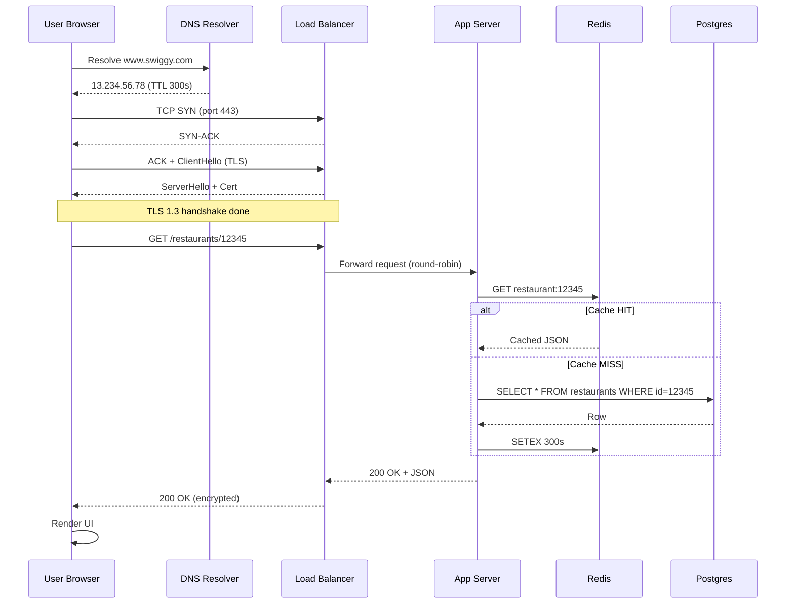
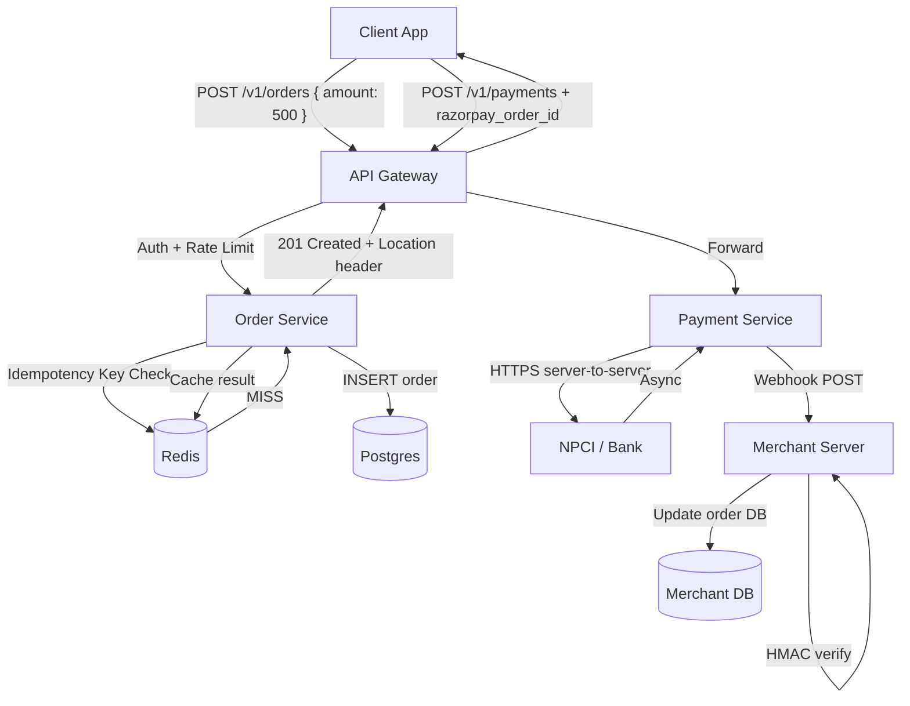
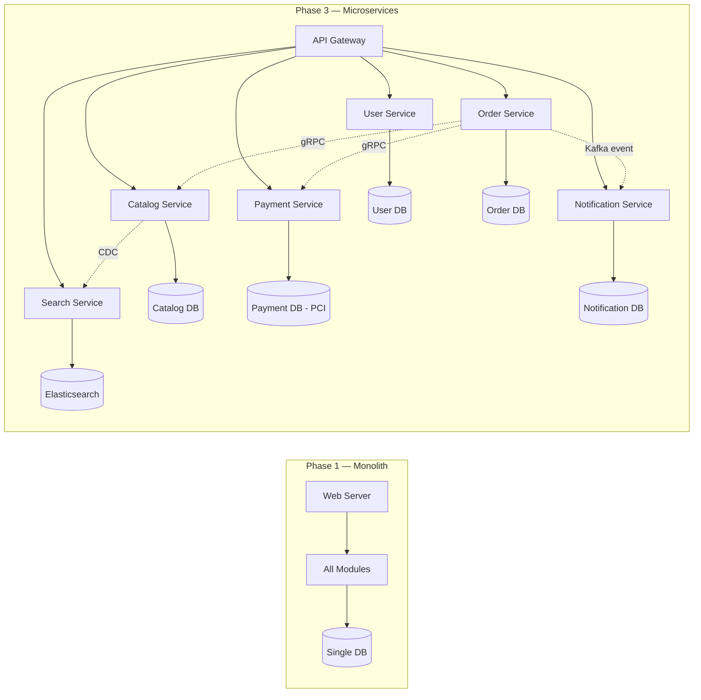
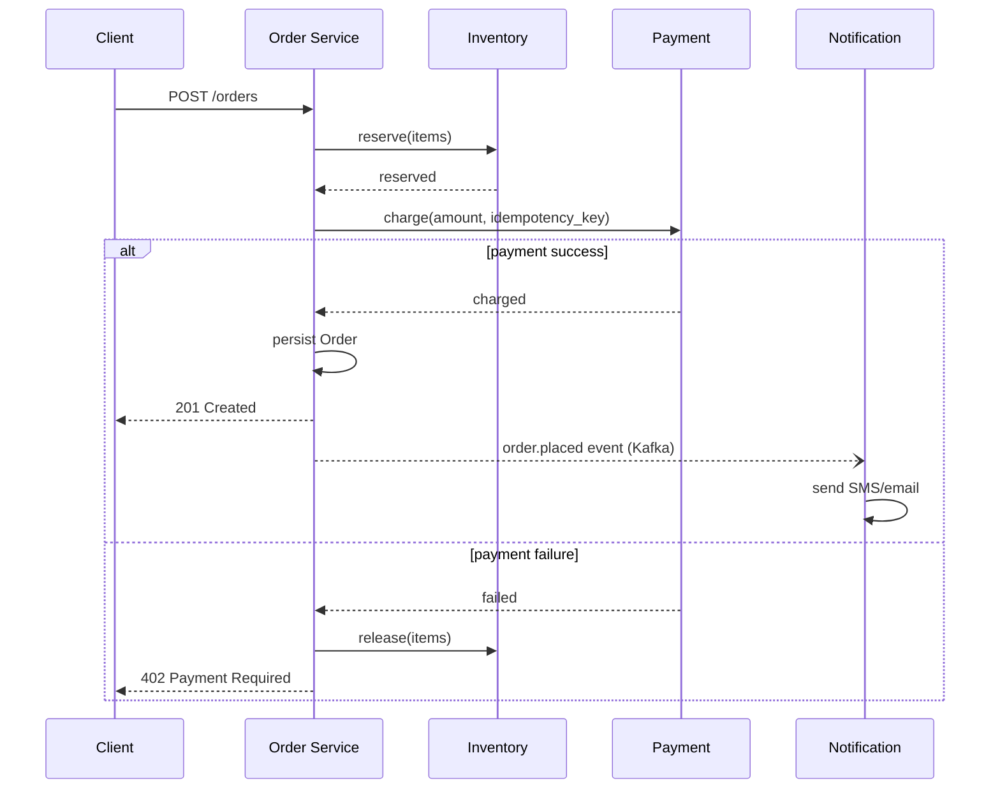

# System Design Basics

System design basically tumhe sikhata hai ki ek scale ki application kaise design karein. URL shortener se Twitter tak — har system ke piche kuch fundamental decisions hote hain. Tu jab interview mein baithta hai ya production mein koi feature ship karta hai, tab ye decisions har jagah dikhte hain: kaunsa database, kaunsa protocol, kitne servers, kya cache karna hai, kab consistency chahiye aur kab availability. Ye sab tradeoffs hain — koi free lunch nahi.

Is module mein hum teen core fundamentals dekhenge: client-server architecture (har web/mobile app ka base), API design (services kaise baat karti hain), aur monolith vs microservices (codebase ko kaise organize karein). Har topic mein hum nuts and bolts dekhenge — DNS resolution se lekar TCP handshake tak, REST versioning se cursor pagination tak, aur Razorpay/Swiggy/Hotstar jaise Indian product companies kaise apne systems chalate hain.

Senior engineer banne ke liye tujhe sirf framework yaad nahi karne — tujhe samajhna padega ki *kyun* ek choice doosri se behtar hai *is context mein*. Ye doc IIT-level depth ke saath likha hai: theory, math, code aur war stories sab milega. Ekdum chai-pani saath rakh, ye lamba safar hai.

Ek baat aur — system design interviews mein "right answer" rarely exists. Interviewer dekhna chahta hai ki tu **trade-offs** clearly articulate kar sakta hai, requirements clarify kar sakta hai (functional + non-functional), back-of-envelope estimates kar sakta hai (QPS, storage, bandwidth), aur step-by-step apna design defend kar sakta hai. Ye doc tujhe wo intuition de ga jo sirf reading se nahi, repeated practice se aati hai.

---

## 1. Client-server architecture

### 1.1 How client-server actually works — request flow, DNS, TCP/IP, HTTP, latency budgets

#### Definition

Client-server architecture ek distributed computing model hai jismein do roles hote hain: **client** (jo request bhejta hai) aur **server** (jo response deta hai). Client typically tera browser, mobile app, ya kisi aur service ka HTTP client hota hai. Server ek long-running process hai jo network port pe sun raha hota hai (TCP port 443 for HTTPS, 80 for HTTP) aur incoming connections handle karta hai.

Important baat: client-server is a *logical* separation, not physical. Ek hi machine pe client aur server dono ho sakte hain (localhost development). Ek server doosre server ka client ban sakta hai (microservice A calls microservice B). To "client" aur "server" sirf role names hain, machines ke labels nahi.

Formal definition: client-server is a request-response paradigm where the client initiates communication, the server is passive (waits for requests), and stateful protocols like TCP maintain a connection over which application-layer protocols (HTTP, gRPC, WebSocket) carry payloads.

#### Why?

Sawal ye hai — humein client-server ki zaroorat hi kyun? Alternatives kya hain?

1. **Peer-to-peer (P2P)**: Har node equal hota hai (BitTorrent, blockchain). Lekin P2P mein discovery, consistency, aur trust handle karna mushkil hai. Centralised authority nahi hoti.
2. **Mainframe / dumb terminal**: 70s ka model. Sab compute server pe, client sirf input/output. Modern web mein partially wapas aaya hai (thin clients, Chromebooks).
3. **Standalone apps**: No server, sab local. Calculator, Notepad. Lekin sync, multi-device, collaboration nahi.

Client-server ka core benefit:
- **Centralisation of authoritative state**: User ka bank balance ek hi jagah hai (server pe), tampering hard hai.
- **Independent scaling**: Lakhs clients, sirf kuch hazaar servers. Servers add karke scale up.
- **Security boundary**: Sensitive logic (payment, auth) server-side rakho. Client untrusted hai.
- **Update simplicity**: Server pe code badla, sab clients ko naya behaviour mil gaya. Mobile app update karne se faster.

Real example: Swiggy ka order placement. Client (your app) ke paas tera cart hai. Lekin "is this restaurant accepting orders right now?" — ye server-side state hai. "Did payment succeed?" — server-side. Server hi single source of truth hai. Agar tu client pe trust karega to fraud aasaan ho jaayega.

#### How? (Architecture explanation + code)

Chal ek complete request lifecycle dekhte hain. Tu browser mein `https://www.swiggy.com/restaurants/12345` type karta hai. Andar kya hota hai? Step-by-step:

**Step 1: URL Parsing**
Browser URL ko todta hai:
- Scheme: `https`
- Host: `www.swiggy.com`
- Port: implicit `443` (HTTPS default)
- Path: `/restaurants/12345`
- Query: (none)

**Step 2: DNS Resolution**

Browser ko `www.swiggy.com` ka IP address chahiye. DNS (Domain Name System) ek hierarchical, distributed database hai. Resolution flow:

1. Browser apna **DNS cache** check karta hai. Hit? Done.
2. OS ka DNS cache (`/etc/hosts` + resolver cache).
3. Configured **recursive resolver** (usually ISP — Jio, Airtel — ya 8.8.8.8 Google, 1.1.1.1 Cloudflare).
4. Resolver root nameservers pucchta hai: "Who handles `.com`?"
5. Root replies with TLD nameserver (Verisign for `.com`).
6. TLD nameserver replies with authoritative nameserver for `swiggy.com` (e.g., AWS Route53).
7. Authoritative server replies with A/AAAA record: `www.swiggy.com -> 13.234.56.78`.
8. Resolver caches based on TTL (e.g., 300 seconds), returns to OS, returns to browser.

DNS typically uses **UDP port 53** (faster, no handshake). For larger responses (DNSSEC, big TXT records), TCP port 53. Modern: DNS-over-HTTPS (DoH) on 443.

```bash
# DNS dekhne ke liye
dig www.swiggy.com +trace
# ya
nslookup www.swiggy.com 8.8.8.8
```

Latency budget for DNS: cold lookup 20-200ms (depending on geography), cached 0-1ms. Production mein DNS TTL choose karna critical hai — kam TTL = fast failover, but more lookups.

**Step 3: TCP Handshake**

IP mil gaya. Ab TCP connection establish karna hai. TCP **three-way handshake**:

1. Client sends `SYN` (sequence number x) to server.
2. Server replies `SYN-ACK` (its sequence y, ack x+1).
3. Client sends `ACK` (ack y+1).

Connection established. Ye 1 RTT (Round-Trip Time) leta hai. Mumbai-Bangalore RTT ~30ms, Mumbai-US-East ~250ms.

**Step 4: TLS Handshake (for HTTPS)**

TCP ke upar TLS layer baithta hai. TLS 1.3 ka handshake:

1. Client sends `ClientHello` with supported ciphers, key share.
2. Server replies `ServerHello` with chosen cipher, certificate, key share.
3. Both derive shared secret (ECDHE).
4. Encrypted communication starts.

TLS 1.3: 1 RTT. With **session resumption** (PSK): 0-RTT possible (early data). TLS 1.2 was 2 RTTs — that's why upgrading matters for latency.

**Step 5: HTTP Request**

Ab encrypted channel pe HTTP request bhejti hai:

```http
GET /restaurants/12345 HTTP/2
Host: www.swiggy.com
User-Agent: Mozilla/5.0 ...
Accept: text/html,application/xhtml+xml
Accept-Encoding: gzip, br
Cookie: session=abc123; csrftoken=xyz
```

HTTP/2 binary framed; HTTP/1.1 plaintext. HTTP/3 (QUIC) over UDP, no head-of-line blocking.

**Step 6: Server-side Processing**

Server side typically:
1. **Load balancer** (NGINX, AWS ALB, HAProxy) accepts the connection. SSL termination yahan ho sakti hai.
2. LB forwards to a **backend instance** based on algorithm (round-robin, least-connections, IP-hash).
3. Backend (Node.js, Java Spring, Go service) parses request.
4. **Auth middleware** validates session/JWT.
5. **Business logic** runs — e.g., fetch restaurant from DB, check availability, fetch menu from cache.
6. **Database queries** (PostgreSQL, MySQL) and **cache** (Redis, Memcached) calls.
7. **Response serialization** (JSON, HTML, Protobuf).
8. Response goes back through LB to client.

Sample Express.js server (Node.js):

```js
// server.js — minimal client-server example
const express = require('express');
const app = express();

// Middleware: har request log karo
app.use((req, res, next) => {
  // request ka unique ID generate karo for tracing
  req.id = crypto.randomUUID();
  console.log(`[${req.id}] ${req.method} ${req.path}`);
  next();
});

// Restaurant fetch endpoint
app.get('/restaurants/:id', async (req, res) => {
  const id = req.params.id;

  // Cache pehle check karo — Redis hit fast hota hai
  const cached = await redis.get(`restaurant:${id}`);
  if (cached) {
    res.setHeader('X-Cache', 'HIT');
    return res.json(JSON.parse(cached));
  }

  // Cache miss — DB se nikalo
  const restaurant = await db.query(
    'SELECT id, name, rating, is_open FROM restaurants WHERE id = $1',
    [id]
  );

  if (!restaurant) {
    return res.status(404).json({ error: 'Restaurant not found' });
  }

  // 5 min ke liye cache karo
  await redis.setex(`restaurant:${id}`, 300, JSON.stringify(restaurant));
  res.setHeader('X-Cache', 'MISS');
  res.json(restaurant);
});

app.listen(8080, () => console.log('Server on 8080'));
```

**Step 7: Response Travels Back**

Response IP-fragmented (if > MTU 1500 bytes), TCP-segmented, sent back. Browser receives, decrypts, parses. If HTML, browser then issues sub-resource requests (CSS, JS, images) — often in parallel via HTTP/2 multiplexing.

**Latency Budget Math**

Ek typical request break-down (Mumbai user accessing Mumbai-region server):

| Phase | Cold | Warm |
|-------|------|------|
| DNS | 30ms | 0ms (cached) |
| TCP handshake | 30ms | 0ms (keep-alive) |
| TLS handshake | 30ms | 0ms (resumption) |
| HTTP request travel | 15ms | 15ms |
| Server processing | 50ms | 20ms |
| HTTP response travel | 15ms | 15ms |
| **Total** | **~170ms** | **~50ms** |

Yahi reason hai ki **connection reuse** (HTTP keep-alive), **DNS caching**, aur **edge servers / CDN** itne important hain. Cross-continent (Mumbai user, US server) ye 170ms ka 700ms+ ban jaata hai.

Per-component latency budget for a 100ms p99 SLA:
- Network: 30ms
- LB + auth: 5ms
- App logic: 20ms
- DB query: 30ms
- Cache: 2ms
- Serialization: 3ms
- Buffer: 10ms

Agar koi component apna budget exceed kare, alarm bajna chahiye. Ye discipline production-grade systems mein zaruri hai.

#### Real-life Example: Razorpay Payment Flow

Razorpay ek payment gateway hai. Jab tu Swiggy pe order place karta hai aur "Pay with UPI" choose karta hai, andar ye client-server dance hota hai:

1. **Swiggy app (client)** Razorpay JS SDK load karta hai from `checkout.razorpay.com`. CDN edge se aata hai (CloudFront), latency ~20ms India mein.
2. SDK ek **iframe** open karta hai pointing to `api.razorpay.com/v1/checkout/...`. Iframe isolation important — Swiggy ka JS Razorpay ke DOM ko touch nahi kar sakta (security).
3. Iframe checkout form Razorpay ke **edge gateway** se baat karta hai. Razorpay multiple AWS regions mein deployed hai (Mumbai primary). Geo-DNS (Route53 latency-based routing) closest region pe bhejta hai.
4. User UPI VPA enter karta hai. Razorpay ka **payment service** NPCI ke saath baat karta hai (server-to-server, mTLS authenticated). Ye internal call ek doosre client-server interaction hai — Razorpay client, NPCI server.
5. NPCI bank ko notify karta hai, user ke phone pe UPI pin prompt aata hai. Bank confirms, NPCI confirms, Razorpay confirms.
6. Razorpay **webhook** Swiggy ke server ko notify karta hai (server-to-server POST). Swiggy server order status update karta hai database mein, push notification user ko.

Yahan har leg ek client-server interaction hai. Aur har leg ka apna latency budget hai. UPI overall 5-10 seconds le sakta hai because NPCI/bank legs slow hain — Razorpay control nahi kar sakta. To Razorpay user ko "Processing..." spinner dikhata hai aur **async webhook** pattern use karta hai (don't block, poll/notify).

Razorpay scale: peak Diwali sale 5000+ TPS (transactions per second). Per server typically 200-500 TPS handle kar sakta hai (depending on logic), to roughly 20-30 backend instances behind LB, plus DB clusters, cache clusters, aur webhook delivery workers. Sab client-server boundaries pe sit karte hain.

#### Diagram



#### Interview Q&A

**Q1: DNS lookup ke liye UDP kyun, TCP kyun nahi? Aur kab TCP use hota hai?**

DNS UDP port 53 use karta hai because UDP connectionless hai — no handshake overhead. Ek single packet query, single packet response, done. Ye design 1980s mein hua jab queries chhote the (< 512 bytes). Latency-sensitive lookups ke liye UDP perfect hai.

Lekin agar response 512 bytes se bada ho (DNSSEC signatures, large TXT records, multiple A records), to **truncated bit (TC)** set hota hai response mein. Client phir TCP port 53 pe re-query karta hai. Zone transfers (AXFR/IXFR) bhi TCP use karte hain because reliability chahiye.

Modern era mein DNS-over-TLS (DoT, port 853) aur DNS-over-HTTPS (DoH, port 443) aaye — privacy aur ISP tampering rokne ke liye. Ye TCP-based hain. Performance-wise UDP fastest hai, lekin security trade-off hai. Production systems often use both: UDP for speed, fallback to TCP, with caching aggressive.

**Q2: TCP three-way handshake aur TLS handshake kyun separate hain? Combined kyun nahi?**

TCP layer 4 (transport) hai aur TLS layer ~6 (presentation/session) hai. OSI model mein separation of concerns ki vajah se. TCP reliable byte stream provide karta hai — ordered, acknowledged, retransmitted. TLS confidentiality + integrity + auth provide karta hai us byte stream ke upar. Iska benefit hai ki TLS application-agnostic hai (HTTPS, IMAPS, FTPS sab use karte hain) aur TCP encryption-agnostic.

Lekin haan, performance penalty hai: 2 RTTs cold start. Iska solution QUIC/HTTP3 hai — Google ne 2012-2015 mein design kiya. QUIC mein transport + crypto combined hain in one handshake (1 RTT, 0 RTT for resumption). UDP pe baithta hai because TCP kernel mein hai aur change karna hard. QUIC user-space mein implement hota hai, fast iteration.

Production mein iska impact: tu jab apna SaaS launch karta hai globally, agar tere users far hain (e.g., India to US: 250ms RTT), to 2 RTT means 500ms before first byte. HTTP/3 ke saath 250ms. Ye ek user-perceivable difference hai.

**Q3: Latency aur throughput mein kya farak hai? System design mein kab kya optimize karte ho?**

Latency = ek single request ka response time (e.g., 50ms). Throughput = per unit time kitne requests handle hote hain (e.g., 1000 req/sec). Ye dono separate dimensions hain — high throughput ho sakta hai high latency ke saath (batch processing) ya low throughput low latency (real-time gaming).

Little's Law: `L = λ * W` jahan L = concurrent requests in system, λ = arrival rate, W = average time in system. To agar tu latency reduce karega aur arrival rate same rakhega, concurrency kam ho jaayegi (less resource pressure). Ya agar throughput badhana hai, ya to latency reduce karo ya concurrency badhao.

Trade-offs context-dependent hain. Razorpay payment flow ke liye latency critical hai — user wait kar raha hai, har 100ms abandonment badhata hai. Lekin Swiggy ke analytics pipeline ke liye throughput critical hai — billions of events per day, latency 5-10 minutes acceptable. Identify your critical path: synchronous user-facing = latency. Async batch/streaming = throughput. Both? Use queues to decouple — fast path low latency, slow path high throughput.

**Q4: Back-of-envelope capacity estimation — Twitter timeline ke liye kaise karoge?**

Capacity estimation interview mein common hai. Approach: clarify scope, derive QPS, derive storage, derive bandwidth, derive servers. Sample for "Twitter home timeline":

Assume DAU (Daily Active Users) = 200M. Average user posts 2 tweets/day = 400M tweets/day = ~4600 tweets/sec write QPS. Reads — user opens app 10 times/day, sees 100 tweets each = 200M * 10 * 100 = 200B tweet impressions/day = ~2.3M reads/sec.

Read:write ratio ~500:1. Implications: read-optimised. Pre-compute timelines (fan-out on write) for active users — when X tweets, push to followers' timeline cache. For celebrities (>1M followers), fan-out on read instead (compute at query time, cache result).

Storage: 1 tweet = 280 chars + metadata ~1KB. 400M/day * 1KB = 400GB/day. With media (10% have media, avg 200KB) = 8TB/day. 5-year retention = ~15PB. Need distributed storage (HDFS/S3 + sharded DB).

Bandwidth: ingress 4600 tweets/s * 1KB = 4.6 MB/s (small). Egress 2.3M reads/s * 1KB = 2.3 GB/s (large). With media, multiply by 100x for hot tweets — CDN essential.

Servers: assume each app server handles 1000 read QPS. Need 2300 servers + redundancy (3x for AZ failover) = ~7000 instances. Plus cache, DB, media servers, search, recommendation. Real Twitter runs ~10K+ machines.

Memory: hot timeline cache. 200M users * 800 bytes per timeline (latest 100 tweet IDs) = 160GB. Fits in Redis cluster (10 nodes * 64GB).

Key takeaway: estimation builds gut feel. Start with users, derive QPS, then storage and bandwidth. Always state assumptions. Interviewer doesn't expect exact numbers — wants reasonable order-of-magnitude with clear logic.

**Q5: Stateless vs stateful servers — kab kya use karein?**

Stateless server matlab har request self-contained hai — server ke paas previous requests ka memory nahi. Authentication via JWT (token mein info). Stateful matlab server session memory mein rakhta hai — login state, shopping cart in-memory.

Stateless ka benefit: **horizontal scaling easy**. Load balancer kisi bhi instance pe bhej sakta hai, sab equal hain. Crash hua to bas restart, no state loss. 12-factor app principle.

Stateful ka use case: **WebSockets** (chat servers — connection ek specific server pe baithta hai), **stateful games**, ya jab session storage cost zyada ho. Lekin to LB sticky sessions chahiye (consistent hashing on user ID), aur failover complex.

Modern best practice: app servers stateless rakho, state ko **externalise** karo (Redis for sessions, DB for persistent, S3 for files). Phir crash, redeploy, scale-out sab simple. WhatsApp/Slack jaise apps mein stateful WebSocket servers hote hain, lekin user state DB mein hai — server crash hua to client reconnect karega doosre server ko, state load ho jaayegi. Hybrid approach is the norm in production.

---

## 2. API design

### 2.1 REST best practices, versioning (URL vs header), pagination (offset vs cursor), HATEOAS intro

#### Definition

API (Application Programming Interface) wo contract hai jiske through ek system doosre system ke saath communicate karta hai. **REST** (Representational State Transfer) ek architectural style hai jo Roy Fielding ne 2000 mein PhD thesis mein define kiya. REST principles:

1. **Client-server**: Separation of concerns.
2. **Stateless**: Har request self-contained.
3. **Cacheable**: Responses cacheable when appropriate.
4. **Uniform interface**: Resource-based URLs, standard HTTP methods.
5. **Layered system**: Proxies, gateways, LBs allowed transparently.
6. **Code on demand** (optional): Server can send executable code (rare).

REST API matlab ek HTTP-based API jo resource-oriented design follow karta hai: URLs nouns hain (`/users/123/orders`), methods verbs hain (`GET`, `POST`, `PUT`, `PATCH`, `DELETE`).

#### Why?

API design important kyun? Galat design ki cost bahut zyada hai:

1. **Public contract hota hai**: Ek baar release kar diya, users (internal teams ya external partners) depend karte hain. Breaking change cost lakhs of integrations.
2. **Discoverability + onboarding**: Achha API self-documenting hota hai. Developer 5 min mein samajh jaata hai. Bura API days lag jaate hain.
3. **Extensibility**: Achha design future changes ko absorb karta hai bina breaking. E.g., new optional fields, new endpoints.
4. **Performance**: Pagination, filtering, projection — ye design choices server load aur client UX directly affect karte hain.
5. **Security**: Auth, rate limiting, input validation — sab API layer pe.

REST kyun, GraphQL/gRPC kyun nahi?

- **REST**: Simple, HTTP semantics use karta hai (caching, status codes), tooling pervasive (curl, Postman). Best for public APIs, CRUD-heavy services.
- **GraphQL**: Client decides shape. Best for complex frontends with varied data needs (Facebook ka use case). Over-fetching/under-fetching solve karta hai.
- **gRPC**: Binary, HTTP/2, Protobuf. Best for internal microservices — fast, strongly typed. Browser support limited (gRPC-Web needed).

Modern reality: **polyglot APIs**. Ek company REST for public partners, gRPC for internal services, GraphQL for mobile apps — sab ek saath chala sakti hai.

#### How? (Architecture + code)

Chal ek e-commerce API design karte hain step-by-step. Resources:
- Users
- Products
- Orders
- Reviews

**Resource Naming**

Naming conventions important hain:

- Plural nouns: `/products`, not `/product`.
- Hierarchy via nesting: `/users/{id}/orders` — orders belonging to user.
- IDs in path: `/orders/789`.
- Filters in query: `/products?category=electronics&min_price=1000`.
- Verbs only when no resource fits (rare): `/auth/login`, `/orders/789/cancel` (action endpoint).

**HTTP Methods Mapping**

| Method | Idempotent | Safe | Use |
|--------|-----------|------|-----|
| GET | Yes | Yes | Read resource |
| POST | No | No | Create resource |
| PUT | Yes | No | Replace entire resource |
| PATCH | No (debatable) | No | Partial update |
| DELETE | Yes | No | Remove resource |

**Idempotent** matlab same request multiple times = same result. Network retry safe ho jaata hai. PUT/DELETE idempotent hain. POST nahi (do POSTs = two resources). To POST mein **idempotency key** header use karte hain — Razorpay/Stripe sab karte hain.

```http
POST /orders HTTP/2
Idempotency-Key: 7c4f1a2e-...
Content-Type: application/json

{ "items": [...], "user_id": 123 }
```

Server ye key dekhta hai. Pehli baar process kar key + response store kar de. Repeat request aaye, cached response wapas. Network retries safe.

**Status Codes**

Sahi codes use karo, sirf 200/500 nahi:

- `200 OK`: Success with body
- `201 Created`: Resource created (with `Location` header)
- `204 No Content`: Success, no body (e.g., DELETE)
- `400 Bad Request`: Client error (validation)
- `401 Unauthorized`: No/invalid auth
- `403 Forbidden`: Authenticated but not allowed
- `404 Not Found`: Resource doesn't exist
- `409 Conflict`: State conflict (e.g., duplicate)
- `422 Unprocessable Entity`: Validation failed
- `429 Too Many Requests`: Rate limited
- `500 Internal Server Error`: Server bug
- `502/503/504`: Upstream/availability issues

**Versioning: URL vs Header**

Ye sabse heated debate hai. Three main approaches:

**Option A: URL versioning** — `/v1/products`, `/v2/products`

Pros: Visible, easy to test in browser, easy routing in LB.
Cons: URL "should be permanent" REST principle violate karta hai. Migration har URL change.

```
GET /v1/products/123
GET /v2/products/123  # different shape
```

**Option B: Header versioning** — `Accept: application/vnd.company.v2+json`

Pros: URLs stable, content negotiation HTTP-native.
Cons: Less discoverable, harder to test from browser.

```http
GET /products/123 HTTP/2
Accept: application/vnd.swiggy.v2+json
```

**Option C: Query param** — `/products/123?version=2`. Generally avoided — caching issues, ugly.

**Industry practice**: Most public APIs (Stripe, GitHub, Razorpay) use URL versioning for clarity. Internal APIs sometimes use header. **Stripe** uses date-based: `Stripe-Version: 2024-01-15`. New customers get latest, existing customers locked to their date until they upgrade. Brilliant for backward compatibility.

Sample code (Express):

```js
// URL versioning approach
app.use('/v1', v1Routes);
app.use('/v2', v2Routes);

// Header versioning approach
app.use((req, res, next) => {
  // accept header parse karo
  const accept = req.headers['accept'] || '';
  const match = accept.match(/vnd\.swiggy\.v(\d+)\+json/);
  req.apiVersion = match ? parseInt(match[1]) : 1;  // default v1
  next();
});

app.get('/products/:id', async (req, res) => {
  const product = await getProduct(req.params.id);
  if (req.apiVersion === 1) {
    return res.json({ id: product.id, name: product.name, price: product.price });
  }
  // v2 includes more fields
  return res.json({
    id: product.id,
    name: product.name,
    price: { amount: product.price, currency: 'INR' },
    inventory: product.stock,
  });
});
```

**Pagination: Offset vs Cursor**

Pagination zaruri hai jab list endpoints bade hain. `/products` 10 million products return nahi kar sakta — RAM, network, browser sab phat jaayega.

**Offset pagination**:

```
GET /products?page=3&limit=20
```

SQL: `SELECT * FROM products ORDER BY id LIMIT 20 OFFSET 40`.

Pros:
- Simple.
- "Page 5" jaisa direct jump possible.
- Total count easy: `COUNT(*) / limit`.

Cons:
- **Slow on deep pages**: `OFFSET 1000000` matlab DB ko 1M rows skip karne padenge. O(N).
- **Inconsistent during writes**: Page 3 dekhte time agar koi naya item insert hua, to page 4 pe duplicate dikhega ya skip.

**Cursor pagination**:

```
GET /products?cursor=eyJpZCI6MTIzfQ&limit=20
```

Cursor ek opaque token hai — base64-encoded `{ "id": 123, "created_at": "..." }`. SQL:

```sql
SELECT * FROM products
WHERE (created_at, id) < ($1, $2)  -- last seen
ORDER BY created_at DESC, id DESC
LIMIT 20;
```

Pros:
- **O(1) per page** with proper index on `(created_at, id)`.
- **Stable**: Naye inserts cursor stream affect nahi karte.
- Real-time feeds ke liye perfect (Twitter, Instagram).

Cons:
- Random page jump nahi kar sakte ("page 50 chahiye").
- Total count expensive (separate query).
- Implementation complex.

```js
// Cursor pagination implementation
app.get('/products', async (req, res) => {
  const limit = Math.min(parseInt(req.query.limit) || 20, 100);
  const cursor = req.query.cursor;

  let query = 'SELECT id, name, price, created_at FROM products';
  const params = [];

  if (cursor) {
    // base64 decode kar last item ki info nikalo
    const decoded = JSON.parse(Buffer.from(cursor, 'base64').toString());
    query += ' WHERE (created_at, id) < ($1, $2)';
    params.push(decoded.created_at, decoded.id);
  }

  query += ' ORDER BY created_at DESC, id DESC LIMIT $' + (params.length + 1);
  params.push(limit + 1);  // ek extra le, to know if more exists

  const rows = await db.query(query, params);
  const hasMore = rows.length > limit;
  const items = rows.slice(0, limit);

  // next cursor banao agar more items hain
  let nextCursor = null;
  if (hasMore && items.length > 0) {
    const last = items[items.length - 1];
    nextCursor = Buffer.from(
      JSON.stringify({ id: last.id, created_at: last.created_at })
    ).toString('base64');
  }

  res.json({ items, next_cursor: nextCursor, has_more: hasMore });
});
```

**Rule of thumb**: Admin dashboards (page jump expected) use offset. User-facing feeds (infinite scroll) use cursor. Hybrid possible — offer both.

**HATEOAS Intro**

HATEOAS = **Hypermedia As The Engine Of Application State**. Roy Fielding ke REST ka highest maturity level (Richardson Maturity Model Level 3). Idea: server response mein next possible actions ke links bhi shamil ho. Client URLs hardcode na kare, server-driven navigation.

Example without HATEOAS:

```json
{ "id": 789, "status": "pending", "amount": 500 }
```

With HATEOAS:

```json
{
  "id": 789,
  "status": "pending",
  "amount": 500,
  "_links": {
    "self": { "href": "/orders/789" },
    "cancel": { "href": "/orders/789/cancel", "method": "POST" },
    "pay": { "href": "/orders/789/pay", "method": "POST" },
    "customer": { "href": "/users/456" }
  }
}
```

Client `_links` pe action karta hai — agar `cancel` link absent, to button gray-out. Server-side state changes (e.g., shipped order can't be cancelled) automatically reflect.

Reality check: **HATEOAS adoption low hai** in industry. Klingon-level idealism manaa jaata hai. Stripe, Twitter, GitHub — kisi ne pure HATEOAS deploy nahi kiya. Reasons:
- Mobile clients band-width sensitive — extra link metadata cost.
- Most clients hardcode flows anyway.
- Spec like HAL/JSON-API exists but adoption fragmented.

But concept valuable — partial HATEOAS (e.g., pagination `next`/`prev` links, OAuth discovery via `.well-known/openid-configuration`) widespread hai.

#### Real-life Example: Razorpay API Design

Razorpay ka API ek gold standard hai Indian fintech mein. Kuch design choices dekho:

1. **Versioning**: URL-based — `https://api.razorpay.com/v1/...`. v1 ke baad bohot saal stable raha hai. Backward compatible additions ke liye new fields add hote hain (default null/optional), breaking changes ke liye new endpoints (e.g., `/v1/orders` aur naya `/v1/payment_links`).

2. **Resource modelling**:
   - `POST /v1/orders` — create order (server-side amount lock)
   - `POST /v1/payments` — capture payment (called from frontend after user pays)
   - `GET /v1/payments/:id` — fetch payment status
   - `POST /v1/refunds` — refund

3. **Idempotency**: Critical for payments. Razorpay supports `Idempotency-Key` header on POST endpoints. If network retry hua, same key se duplicate charge nahi hoga.

4. **Pagination**: `/v1/payments?count=10&skip=0` — offset-based for admin. For event streams Razorpay uses webhook-based push, not polling.

5. **Webhooks**: Payment captured/failed/refunded events Razorpay tere server pe POST karta hai. Server-to-server REST. HMAC signature validation zaruri (don't trust raw body):

```js
// Razorpay webhook verify (Hinglish comments)
const crypto = require('crypto');

function verifyWebhook(req, secret) {
  // header se signature nikalo
  const signature = req.headers['x-razorpay-signature'];
  // body ka HMAC SHA256 banao with shared secret
  const expected = crypto
    .createHmac('sha256', secret)
    .update(req.rawBody)  // raw body, not parsed!
    .digest('hex');
  // timing-safe compare karo
  return crypto.timingSafeEqual(Buffer.from(signature), Buffer.from(expected));
}
```

6. **Error responses**: Consistent shape:

```json
{
  "error": {
    "code": "BAD_REQUEST_ERROR",
    "description": "The amount must be greater than 100",
    "source": "business",
    "step": "payment_initiation",
    "reason": "invalid_amount",
    "metadata": {}
  }
}
```

`code`, `description`, `reason` — machine-readable + human-readable. Production debugging easy.

7. **Rate limiting**: Headers:

```
X-RateLimit-Limit: 1000
X-RateLimit-Remaining: 847
X-RateLimit-Reset: 1714492800
```

Client gracefully back off kar sakta hai.

8. **HATEOAS-lite**: Razorpay response mein related URLs include karta hai:

```json
{
  "id": "pay_29QQoUBi66xm2f",
  "order_id": "order_9A33XWu170gUtm",
  "links": {
    "receipt": "https://rzp.io/receipt/...",
    "invoice": "https://rzp.io/invoice/..."
  }
}
```

Pure HATEOAS nahi, but practical link inclusion.

#### Diagram



#### Interview Q&A

**Q1: REST vs RPC vs GraphQL vs gRPC — kab kya choose karein?**

REST resource-oriented hai, HTTP semantics ke saath aligned. Best when domain CRUD-heavy hai aur consumers diverse (web, mobile, partners). Caching free milti hai (HTTP cache headers). Public APIs ke liye default choice — Stripe, GitHub, Razorpay sab REST.

RPC (XML-RPC, JSON-RPC) action-oriented hai — `getUserById(123)` ek function call jaisa. Simple internal services ke liye okay, but discoverability less. Modern era mein gRPC ne RPC ko revive kiya.

GraphQL client-driven query hai. One endpoint, queries shape decide karti hain response. Best when frontend complex hai aur backend serve karna hard ho REST ke saath (e.g., mobile screen needs user + last 10 orders + each order's items + reviews — REST mein 4 calls, GraphQL mein 1). Lekin caching harder, N+1 problem (DataLoader pattern), complexity high.

gRPC binary, HTTP/2, Protobuf-based. Internal microservices ke liye fast (10x faster than JSON REST in some benchmarks). Strong typing, code-gen for clients. Best for east-west traffic between services. Cons: browser support poor (need gRPC-Web), harder to debug (no curl).

Decision matrix: Public + diverse consumers = REST. Internal microservice-to-microservice = gRPC. Mobile app with complex screens = GraphQL. Tu ek company mein teeno saath dekhe ga — Razorpay public REST, internal gRPC, dashboard GraphQL — common pattern.

**Q2: Backward compatibility ke liye API kaise design karein?**

Backward compatibility ka principle: **adding things safe hai, removing/changing breaking hai**. Specifically:

Safe (non-breaking):
- New optional fields in request
- New fields in response (clients should ignore unknown)
- New endpoints
- New optional query params
- New status codes (in addition)

Breaking:
- Removing fields, endpoints, params
- Renaming
- Changing field types (string -> int)
- Changing required/optional
- Changing semantic (status code different meaning)

Strategy: **Tolerant reader pattern** — clients should ignore unknown fields, fall back if missing. Servers strict on input, lenient on output evolution. Add `deprecated` headers when retiring fields:

```
Deprecation: true
Sunset: Sat, 31 Dec 2024 23:59:59 GMT
Link: </v2/products>; rel="successor-version"
```

Versioning when truly breaking: maintain `/v1` alongside `/v2` for 6-12 months. Stripe ka date-based versioning is gold standard. Internal services use Protobuf with explicit field numbers — adding `optional string foo = 7;` always safe. Removing field requires `reserved 7;` to prevent reuse. **Schema evolution** ek separate skill hai — invest in it.

**Q3: Idempotency key kaise implement karoge production mein? Edge cases?**

Idempotency key ek client-generated UUID hai POST/PATCH ke liye. Server ka kaam: same key ke saath repeat request aaye to original response wapas, processing repeat na ho.

Implementation:

1. Client `Idempotency-Key: <uuid>` header bheje.
2. Server first request pe key + request hash + processing status (`in_progress`) Redis mein store kare with TTL (e.g., 24h).
3. Process karo. Final response Redis mein store kar (status `done`, response body, status code).
4. Repeat request: key dekho. If `in_progress`, return `409 Conflict` ya block until done. If `done`, cached response return karo.
5. Validate request body match karta hai pichla request — agar mismatch (same key, different body), return `422` (key reuse error).

Edge cases:
- **Key collision across users**: Scope key per (user, key) pair, na sirf key.
- **Server crash mid-processing**: `in_progress` stuck. Solution: TTL on `in_progress` (5 min), after which retry allowed. Or use distributed lock with timeout.
- **Long-running operations**: Key TTL > operation max duration.
- **Storage cost**: Trim old keys aggressively. 24h is typical for payments.
- **Webhooks**: Webhook delivery should also be idempotent on receiver side — provider may retry. Use `event_id` deduplication.

Stripe/Razorpay both implement this. Stripe's version: 24h key validity, must match request body, returns same response including same status code. Without idempotency key, double charges in network retry scenarios — fatal in fintech.

**Q4: Cursor pagination ke saath sorting flexible kaise rakhein?**

Default cursor pagination single sort key (e.g., `created_at`) ke around design hota hai. Multiple sort orders ke liye challenges:

1. **Each sort order = different cursor format**: Sort by price ascending vs created_at descending — cursors not interchangeable. Embed sort key + value in cursor: `{ "sort": "price_asc", "value": 499.00, "id": 123 }`.

2. **Tie-breaker zaruri hai**: Sort key non-unique ho sakti hai (10 products at price 499). Always include unique secondary key (usually `id`):
   ```sql
   WHERE (price, id) > (499.00, 123) ORDER BY price ASC, id ASC
   ```

3. **Index alignment**: Database index sort order match kare. Postgres mein `CREATE INDEX ON products (price, id)` for `ORDER BY price, id`. Without aligned index, query slow.

4. **Sort order change mid-pagination**: User cursor le gaya price-asc se, ab created_at sort change ki — old cursor invalid. UI mein sort change pe pagination reset karo.

5. **Filtering interaction**: Cursor + filter combo. Filter cursor mein bhi encode karo to prevent inconsistency: `{ "filter_hash": "abc123", "sort": "price_asc", ... }`. Filter change = new cursor.

Production tip: cursor opaque rakho client ke liye (base64 encoded JSON). Client ko parse na kare. Server-side schema change kar sakta hai cursor structure without breaking clients. Twitter, Instagram, Slack — sab opaque cursors use karte hain.

**Q5: Rate limiting kaise design karoge — algorithms aur distributed implementation?**

Rate limiting essential hai abuse prevention, fair use, aur cost control ke liye. Common algorithms:

**Token bucket**: Bucket has capacity N tokens. Tokens add at rate R/sec. Each request consumes 1 token. Empty? Reject. Allows bursts up to N. Most popular — flexible, simple.

**Leaky bucket**: Queue of fixed size. Requests in, processed at fixed rate out. Smoothes traffic. Used in network QoS.

**Fixed window counter**: Count requests per minute. Reset at minute boundary. Simple but boundary issue — 100 req at 0:59, 100 more at 1:00 = 200 in 1 second.

**Sliding window log**: Store timestamp of each request. Count last 60s. Accurate but memory heavy (per-user log).

**Sliding window counter**: Hybrid — current window count + weighted previous window count. Approximates sliding log with O(1) memory. Cloudflare uses this.

Distributed implementation: rate limit state must be shared across LB-distributed servers. Options:

1. **Redis with INCR + EXPIRE**: atomic counter per (user, window). Fast (sub-ms). Single Redis hot key risk for popular users — solve via sharding by user hash.
2. **Local + sync**: each server tracks locally, periodically syncs to Redis. Lower latency, slight inaccuracy at boundaries.
3. **Distributed ratelimiter as service**: e.g., Lyft's `ratelimit` (Envoy filter), Cloud-native solutions.

Tier-based limits: free user 100 req/min, paid 1000, enterprise 10000. Lookup user tier from cache, apply appropriate bucket.

Headers to clients (RFC 6585 + de facto):
```
X-RateLimit-Limit: 1000
X-RateLimit-Remaining: 847
X-RateLimit-Reset: 1714492800
Retry-After: 30  (on 429)
```

Edge cases: distinguish per-user, per-IP, per-API-key, per-endpoint. Don't rate limit critical auth flows aggressively (lockout DoS). Whitelist internal services. Soft limit (warning) vs hard limit (reject) tiers.

---

## 3. Monolith vs Microservices

### 3.1 Tradeoffs (deployment, scaling, complexity, team structure), when each makes sense

#### Definition

**Monolith**: Ek single deployable artifact jismein saari application logic hai. Ek codebase, ek database (typically), ek runtime process (replicated for scale). Modules andar ho sakte hain (well-organized monolith), but boundaries enforce by code conventions, not network.

**Microservices**: Application ko independently deployable services mein decompose kiya gaya hai. Har service apna codebase, apna deploy pipeline, apna database (database-per-service pattern), apni runtime. Services REST/gRPC/messaging ke through baat karte hain.

Monolith vs microservices ek **architectural style** decision hai, na ki technology decision. Same tech stack (e.g., Java Spring) dono mein use ho sakta hai. Difference deployment unit aur boundary enforcement mein hai.

Mid-point: **Modular monolith** — single deployable but strict module boundaries (e.g., Java Modules, separate Maven modules, well-defined internal APIs). **Service-oriented architecture (SOA)** — coarse-grained services, often shared DB, ESB middleware (older pattern).

#### Why?

Microservices hype 2014-2018 peak pe tha. Netflix, Amazon ne popularize kiya. But ye ek **complexity trade-off** hai, free lunch nahi.

**Monolith ke pros**:
1. **Simpler dev**: Local mein ek `mvn spring-boot:run` aur sab chal raha hai. Debugging ek IDE mein, ek stack trace.
2. **Atomic deployment**: Naya feature ek deploy. No coordination across services.
3. **Strong consistency**: Single DB, ACID transactions across modules.
4. **Less operational overhead**: Ek service to monitor, ek logging stack.
5. **Refactoring easy**: Compiler types check across modules. Method rename = IDE ek click.

**Monolith ke cons**:
1. **Scaling all-or-nothing**: 80% load search pe hai, but search scale karne ke liye poora app scale karna padta hai.
2. **Tech lock-in**: Java mein hai? Naya feature Python ML mein chahiye? Hard.
3. **Build/test time grows**: Codebase 1M LOC = 30 min build, 1 hour CI.
4. **Team scaling**: 200 engineers ek codebase mein? Merge conflicts, slow code review, deployment lock issues.
5. **Blast radius**: Ek bug deploy, sab feature down.

**Microservices ke pros**:
1. **Independent scaling**: Search service ko 50 instances, payment ko 5.
2. **Tech polyglot**: Search Elasticsearch + Java, ML Python + GPU, frontend Node.js.
3. **Independent deployment**: Team A apne 5 deploys per day kar sakti hai bina Team B ko consult kiye.
4. **Fault isolation**: Reviews service down = reviews na dikhe, but cart still works (graceful degradation).
5. **Team autonomy**: Conway's law — system structure mirrors org structure. Microservices teams ko autonomy deti hai.

**Microservices ke cons**:
1. **Distributed system complexity**: Network partitions, partial failures, retries, timeouts. CAP theorem realities.
2. **Operational overhead**: Service mesh, observability stack, K8s, CI/CD per service. DevOps team 10x grows.
3. **Eventual consistency**: ACID across services hard. Saga pattern, 2PC, eventual consistency mein bug-prone.
4. **Testing harder**: Local mein 30 services run karna unrealistic. Need contract tests, staging envs.
5. **Latency tax**: Network calls 10-100x slower than in-process. Total latency = sum of all hops.
6. **Data consistency challenges**: User profile in service A, orders in service B. Joins? Hard.

**Choose monolith when**:
- Startup, < 20 engineers.
- Domain not yet stable — boundaries unclear.
- Strong consistency needed across most operations.
- Limited DevOps capability.

**Choose microservices when**:
- 100+ engineers.
- Clear bounded contexts (DDD).
- Independent scaling needs are real (not hypothetical).
- Have invested in platform: observability, deploy automation, service mesh.

**Common mistake**: Microservices on day 1. Premature decomposition — boundaries wrong, data spread across services, every change touches 5 services. Worse than monolith. **Martin Fowler's "Monolith First"** principle: start monolith, decompose when pain real.

#### How? (Architecture + code)

Chal ek e-commerce ka evolution dekhte hain monolith se microservices.

**Phase 1: Monolith (Year 1)**

Ek Spring Boot app:

```
ecom-app/
├── src/main/java/com/shop/
│   ├── user/         # auth, profile
│   ├── catalog/      # products, search
│   ├── cart/         # shopping cart
│   ├── order/        # order management
│   ├── payment/      # payment integration
│   └── notification/ # emails, SMS
├── pom.xml
└── Dockerfile
```

Single Postgres DB with all tables. Single deploy. 5 engineers, 100 deploys per month.

```java
// OrderService.java — monolith mein direct method calls
@Service
public class OrderService {
    @Autowired private CartRepository cartRepo;
    @Autowired private PaymentService paymentService;
    @Autowired private NotificationService notifier;
    @Autowired private InventoryService inventory;

    @Transactional  // ACID across all operations
    public Order placeOrder(Long userId) {
        Cart cart = cartRepo.findByUserId(userId);
        // inventory check + reserve in same transaction
        inventory.reserve(cart.getItems());
        // payment synchronous
        Payment payment = paymentService.charge(userId, cart.getTotal());
        // order persist
        Order order = new Order(userId, cart.getItems(), payment.getId());
        orderRepo.save(order);
        // notification (still in transaction — bad practice but works)
        notifier.sendOrderConfirmation(order);
        return order;
    }
}
```

Pros: Atomic. Bug rare in transaction logic.
Cons: Notification SMS API slow → entire transaction slow. Inventory module bad code → order broken.

**Phase 2: Modular Monolith (Year 2-3)**

Codebase grew, 30 engineers. Same deploy unit but stricter boundaries:

```
ecom-app/
├── modules/
│   ├── user-module/     # apna package, internal API
│   ├── catalog-module/
│   ├── cart-module/
│   ├── order-module/
│   ├── payment-module/
│   └── notification-module/
├── api-contracts/       # inter-module contracts
└── app/                 # composition root
```

Modules sirf apne public API expose karte hain. Direct repo access banned across modules. Internal events use kar sakte hain (e.g., Spring `ApplicationEvent`):

```java
// order-module se event publish
applicationEventPublisher.publishEvent(new OrderPlacedEvent(orderId));

// notification-module mein listen
@EventListener
public void on(OrderPlacedEvent event) {
    sendOrderConfirmation(event.getOrderId());
}
```

Notification ab async ho gaya (event-based), main transaction unblocked. But still single deploy.

**Phase 3: Strategic Microservices (Year 4+)**

100+ engineers. Specific pain points decompose karo:

1. **Search service** (separate): Elasticsearch + Python ML for ranking. Java monolith mein fit nahi.
2. **Payment service** (separate): PCI compliance, isolated.
3. **Notification service** (separate): Owned by separate team, multiple channels.

Rest still in monolith.

```
ecom-platform/
├── monolith/        # user, catalog, cart, order
├── search-service/  # Python + ES
├── payment-service/ # Java + PCI scope
├── notification-service/ # Go + Kafka
└── api-gateway/     # Routes external traffic
```

Order placement ab distributed:

```java
// OrderService in monolith, calling external services
public Order placeOrder(Long userId) {
    Cart cart = cartRepo.findByUserId(userId);
    // local inventory check
    inventory.reserve(cart.getItems());

    // external payment service call
    PaymentRequest req = new PaymentRequest(userId, cart.getTotal());
    req.setIdempotencyKey(UUID.randomUUID().toString());
    Payment payment = paymentClient.charge(req);  // gRPC call

    Order order = new Order(userId, cart.getItems(), payment.getId());
    orderRepo.save(order);

    // async event for notification
    kafkaTemplate.send("order-placed", new OrderPlacedEvent(order.getId()));
    return order;
}
```

Issues now:
- Payment call fails after inventory reserve = inconsistent state. Need **saga**: compensating action `inventory.release()`.
- Idempotency: payment call retry safe due to idempotency key.
- Kafka delivery: at-least-once, notification service must dedupe.

**Saga pattern (orchestrated)**:

```
OrderSaga:
  1. Reserve inventory  → on failure: stop
  2. Charge payment     → on failure: release inventory, stop
  3. Create order       → on failure: refund payment, release inventory
  4. Publish event      → on failure: retry (event store)
```

Each step has compensating action. Saga log persisted for crash recovery.

**Database per service**:
- Monolith DB: users, products, cart, orders.
- Payment service: own Postgres (PCI scoped).
- Notification: own Postgres (event log).
- Search: Elasticsearch + sync from monolith via CDC (Debezium).

Cross-service joins now hard. Solution: **CDC (Change Data Capture)** — monolith DB → Kafka → search index update. Or **API composition** — for ad-hoc queries call multiple services and join in code.

**Service mesh (Istio, Linkerd)**:
- mTLS between services.
- Retries, timeouts, circuit breakers configured declaratively.
- Distributed tracing (Jaeger).
- Canary deployments via traffic split.

**Observability stack**:
- Metrics: Prometheus + Grafana.
- Logs: ELK / Loki, correlation via trace-id.
- Tracing: OpenTelemetry → Jaeger / Tempo.
- Without these, microservices debugging impossible.

#### Real-life Example: Swiggy / Flipkart Architecture Evolution

Swiggy ka journey:

**2014-2015 (Monolith)**: Founded as single Django app. Restaurants, customers, orders, delivery — sab ek codebase. ~10 engineers. Mumbai pilot. Single Postgres.

**2016-2017 (Modular monolith)**: Tier-1 cities expand. ~50 engineers. Domain modules separate ho gaye but still single deploy. Read-replicas Postgres mein, Redis cache, basic LB.

**2018+ (Strategic decomposition)**: 200+ engineers. Specific services break out:
- **Discovery service**: Restaurant search, sorting, ranking. ML-driven, separate.
- **Cart/checkout service**: High write volume during peak hours.
- **Order service**: State machine for order lifecycle.
- **Delivery service**: Real-time DE (Delivery Executive) tracking, geo queries.
- **Payment service**: PCI scope, isolated.
- **Notification service**: SMS, push, email — high volume.

Each service has own team, own DB, own SLO. **Communication patterns**:
- Synchronous: gRPC for low-latency reads (delivery → restaurant info).
- Asynchronous: Kafka for events (`order.placed`, `order.delivered`).
- Sync to read store: CDC from order DB to search index.

Scale (peak):
- 50K+ orders per minute during IPL/festivals.
- 10M+ concurrent location updates from DEs.
- 100K+ active restaurants.

How they handled black-friday-style events (IPL):
- Pre-scale (predictive autoscaling).
- Circuit breakers on every external call (don't let restaurant API failure bring down search).
- Graceful degradation: ML ranking down? Fallback to simple distance-based ranking.
- Cache warming for popular queries.
- Database partitioning (by city, then by restaurant).

Flipkart similar story. Started monolith (PHP, 2007), moved to Java services (~2010), now 100+ microservices on Kubernetes. Big Billion Day handles 10M+ concurrent users.

**Common pattern**: Indian product companies generally don't start microservices. They evolve into them as scale and team size justify the operational cost. This is the right approach.

#### Diagram



Saga sequence:



#### Interview Q&A

**Q1: Conway's Law microservices design ko kaise affect karta hai?**

Conway's Law (1967): "Any organisation that designs a system will produce a design whose structure is a copy of the organisation's communication structure." Iska matlab agar tu 5 teams ke saath ek system bana raha hai, system mein 5 broad components milenge — automatically, communication paths reflect organisation paths.

Microservices mein ye amplified hai. Agar tu service boundaries org boundaries se mismatch karta hai, toh constant cross-team coordination, painful. Example: agar payment service Team A ke paas hai but cart-checkout Team B ke paas, aur dono close interaction karte hain, har release dono coordinate karne padte hain — friction.

Inverse Conway Maneuver: pehle teams structure karo for desired architecture, then build. E.g., agar tu domain-driven microservices chahta hai (catalog, order, payment as separate domains), to teams uske around organize karo with full ownership. Each team owns: code + infra + on-call + roadmap. Ye Spotify model, Amazon "two-pizza teams" model.

Practical implication: organization restructure expensive hai, so service boundaries align karo with realistic team structures. Greenfield mein architecture choose karo first, then assemble teams. Brownfield mein recognize current org constraints aur incrementally evolve.

**Q2: Distributed transactions ke liye 2PC vs Saga — kab kya?**

2PC (Two-Phase Commit) classical distributed transaction protocol hai. Coordinator sab participants ko `PREPARE` bhejta hai. Sab "yes" bole to `COMMIT`. Koi "no" bole ya timeout to `ABORT`. ACID across services.

Pros: Strong consistency.
Cons: **Blocking** — agar coordinator crash phase 2 mein, participants locked indefinitely. **Performance**: 2 RTTs minimum + locks held throughout. **Availability**: any participant down = transaction fail. Doesn't scale beyond few participants.

Saga pattern asynchronous, eventually consistent. Long-running transaction ko sequence of local transactions mein break karo, each with compensating action. Two flavors:

- **Choreography**: Each service listens to events, reacts. Decentralized.
- **Orchestration**: Central orchestrator service drives the steps. Easier to reason about.

Pros: No blocking, each step local transaction, scales. Failures handle via compensations.
Cons: **Eventual consistency** — intermediate states visible to readers. **Compensating actions complex** — refund != reverse charge always. **Dev complexity** — saga logic, state machine, idempotency at every step.

When to use: 2PC essentially **never** in modern microservices. Performance + availability hit too much. Saga is the default. Strong consistency needs? Keep those operations in same service / same DB. Cross-service ops embrace eventual consistency.

Real example: Swiggy order placement is a saga. Reserve inventory → charge payment → create order → notify. If payment fails, release inventory. If notification fails, retry async (don't fail order). Designing saga = designing happy path + every failure mode + every compensating action. Hard but necessary.

**Q3: Microservices mein observability kaise design karoge?**

Observability ka triad: **logs, metrics, traces**. Microservices mein basic monolith logging fail karta hai because ek user request 10 services ko hit karta hai.

**Distributed tracing**: Each request gets a `trace_id` at entry (API gateway). Propagated to every downstream call via headers (`traceparent` per W3C spec, OpenTelemetry standard). Each service logs `trace_id` + `span_id`. Tools: Jaeger, Tempo, AWS X-Ray, Datadog.

```
Request /checkout
└─ trace_id=abc123
   ├─ span: api-gateway (5ms)
   ├─ span: cart-service (20ms)
   │   └─ span: db-query (15ms)
   ├─ span: inventory-service (30ms)
   ├─ span: payment-service (200ms) ← bottleneck dikha
   └─ span: notification publish (2ms)
```

UI mein flame graph dikhta hai — bottleneck visible.

**Structured logging**: JSON logs with `trace_id`, `service`, `level`, `message`. Centralized: Loki / ELK / Datadog. Query: "show all errors for trace_id abc123 across all services."

**Metrics**: RED method (Rate, Errors, Duration) per service. USE method (Utilization, Saturation, Errors) per resource. Prometheus pull-based, or push to Datadog. Dashboards in Grafana. Per-endpoint p50/p95/p99 latencies, error rate, request rate.

**Alerting**: SLO-based. E.g., "p99 latency < 500ms over 5 min." Burn-rate alerts (Google SRE book). Avoid alert fatigue — only page on SLO violation, not symptom.

**Service catalog**: Each service registered with owner team, runbook link, on-call rotation, dashboards. PagerDuty integration. Without this, midnight incident is chaos.

**Production debugging mantra**: Trace first, then logs, then metrics, then code. Tracing is the entry point. Without it, microservices debugging is archaeology — guessing through unrelated logs across 10 services.

**Q4: "Database per service" ke saath cross-service joins kaise handle karte ho?**

Database-per-service microservices ka cornerstone hai — coupling avoid karne ke liye. But cross-service queries common requirement hain (e.g., dashboard: "show user's orders with product details").

Approaches:

1. **API composition**: Calling code (e.g., BFF — Backend For Frontend) multiple services se data fetch karke combine karta hai. Simple, works for small joins. Drawbacks: N+1 if naive, latency = sum, joins limited to small datasets.

   ```js
   const orders = await orderService.list(userId);
   // batch fetch products, not loop
   const productIds = orders.flatMap(o => o.items.map(i => i.productId));
   const products = await catalogService.batchGet(productIds);
   // combine
   ```

2. **CQRS + materialised view**: Read model alag se maintain karo via events. E.g., "user-orders-view" service jo `OrderPlaced` events Kafka se consume karta hai aur denormalised view rakhta hai (order + product snapshot + user info). Read queries is view se. Eventually consistent.

3. **Change Data Capture (CDC)**: Source DB (e.g., order DB) ke binlog Debezium read kare, Kafka mein publish kare, consumer service apne read store update kare. Decouples without app code changes.

4. **Data lake / warehouse**: For analytical queries (not transactional). All services dump data via CDC to S3/BigQuery/Snowflake. Joins yahan possible at scale. Latency: minutes-hours.

5. **GraphQL federation**: Apollo Federation — each service apna schema declare kare, gateway compose kare. Cross-service queries possible at gateway, but each service still owns its data. Used at Netflix, Airbnb.

What **not** to do:
- Direct DB cross-service queries — kills isolation, refactor breaks everything.
- Distributed joins via 2PC — performance disaster.
- Sharing DB schemas — undoes microservice benefits.

Real-world: most companies use API composition for transactional reads, CDC + read store for high-frequency reads, data warehouse for analytics. Pick the right tool per use case. Don't try to make microservices feel like monolith — embrace the constraints.

**Q5: Service decomposition strategy — bounded contexts kaise identify karte ho?**

Wrong decomposition microservices ka biggest failure mode hai. "User service" jaisa generic break-down — har feature user touch karta hai, to "user service" bottleneck ban jaata hai. Better approach: **Domain-Driven Design (DDD)** se bounded contexts identify karo.

Bounded context = ek conceptual boundary jismein domain language consistent hai. E-commerce mein "Product" different contexts mein different meaning rakhta hai:
- Catalog context: name, description, images, price.
- Inventory context: stock, warehouse location.
- Pricing context: price tiers, discounts, taxes.
- Reviews context: rating, comments.

Ye sab "Product" ke alag-alag aspects hain. Microservice boundary inhi pe draw karo, na ki ek monolith "ProductService" jo sab kuch handle kare.

Heuristics for boundary identification:
1. **Cohesion test**: Ek service ke andar code together change hota hai? Yes → keep together. No → split.
2. **Team alignment**: Ek service ek team own kar sakti hai end-to-end? (Two-pizza rule.)
3. **Data ownership**: Service uniquely owns its data — koi aur service direct DB access nahi maange?
4. **Independent lifecycle**: Service alag-alag deploy ho sakti hai bina cascading changes?
5. **Failure isolation**: Is service down, downstream graceful degradation possible hai?

Anti-patterns:
- **Distributed monolith**: 10 services but every change requires deploying 5 of them. Worst of both worlds.
- **Nano-services**: Service so small that operational cost > value. E.g., separate "validation service" — just put validation in caller.
- **Entity services**: Services per database table (`OrderService` only does CRUD on order table). No business logic, just remote DB. Pointless.

Better pattern: **Capability-based services** (e.g., "Checkout service" — owns the checkout *capability*, including its own data, validation, orchestration). Capabilities span tables, encapsulate business process.

Real example: Uber decomposition includes Trip service (owns trip lifecycle), Pricing service (surge, fares), Dispatch service (driver-rider matching), Payment service. Each owns its domain. Cross-cutting concerns (auth, logging) are platform-level libraries, not services.

Migration strategy from monolith: **Strangler Fig pattern**. New functionality build as service, old monolith routes traffic via API gateway. Gradually migrate features. Don't big-bang rewrite — historically 80% fail. Shopify's monolith-first stance, GitHub's modular monolith — proof that monoliths scale further than people think with discipline.

Lastly: **measure before optimizing**. Don't decompose for hypothetical scale. Profile bottlenecks. If your monolith handles current load with 30% headroom and team < 50 engineers, decomposition is premature optimization. Engineering hours spent on platform infra > value delivered. Boring monolith with great observability beats fancy microservices with no traces every time.

---

## Resources & further reading

- **Designing Data-Intensive Applications** by Martin Kleppmann — encyclopedic on storage, replication, consistency, batch/stream processing. Single best book for backend engineers.
- **System Design Interview** by Alex Xu (Volume 1 & 2) — interview-focused, walkthroughs of common system designs (URL shortener, news feed, ride-share).
- **Building Microservices** by Sam Newman — practical guide on decomposition, integration patterns, deployment.
- **Release It!** by Michael Nygard — stability patterns (circuit breaker, bulkhead, timeout), production lessons.
- **Site Reliability Engineering** (Google) — free online. SLO/SLI/SLA, incident management, capacity planning.
- **Microservices Patterns** by Chris Richardson — saga, CQRS, event sourcing, API gateway in depth.
- **REST API Design Rulebook** by Mark Massé — concise REST conventions reference.
- **The Twelve-Factor App** (12factor.net) — config, deploy, observability principles, free read.
- **High Scalability Blog** (highscalability.com) — case studies of real architectures (Netflix, Uber, Discord).
- **Stripe Engineering Blog**, **Razorpay Engineering Blog**, **Swiggy Tech Blog**, **Flipkart Tech Blog** — Indian + global company war stories.
- **AWS Architecture Center / Google Cloud Architecture Framework** — patterns and reference architectures.
- **OpenTelemetry docs** for observability standardisation.
- **Domain-Driven Design** by Eric Evans — bounded contexts, ubiquitous language, aggregates. Foundation for microservice decomposition.
- **CAP theorem** — Eric Brewer's paper; PACELC extension.
- Conference talks: **QCon**, **GOTO**, **Strange Loop**, **InfoQ** — search for "microservices at scale" or specific company name.
- **Awesome Scalability** GitHub repo (binhnguyennus/awesome-scalability) — curated list of articles, talks, books on real-world scalable architectures.
- **CNCF landscape** (landscape.cncf.io) — visual map of cloud-native tooling: service mesh, observability, runtime, orchestration. Helpful when picking technology.
- **Pat Helland's papers** — "Life beyond Distributed Transactions", "Immutability Changes Everything". Conceptual foundations for distributed systems thinking.
- **Jepsen reports** (jepsen.io) — Kyle Kingsbury's brutal consistency testing of distributed databases. Reality check on vendor claims.
- Practice: build small projects end-to-end. Build a URL shortener with proper API design, observability, deployment. Build a chat app with WebSockets and stateful scaling. Theory without practice is shallow.
